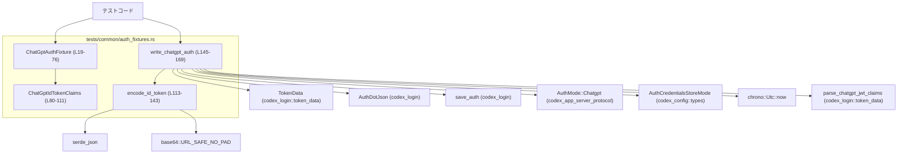
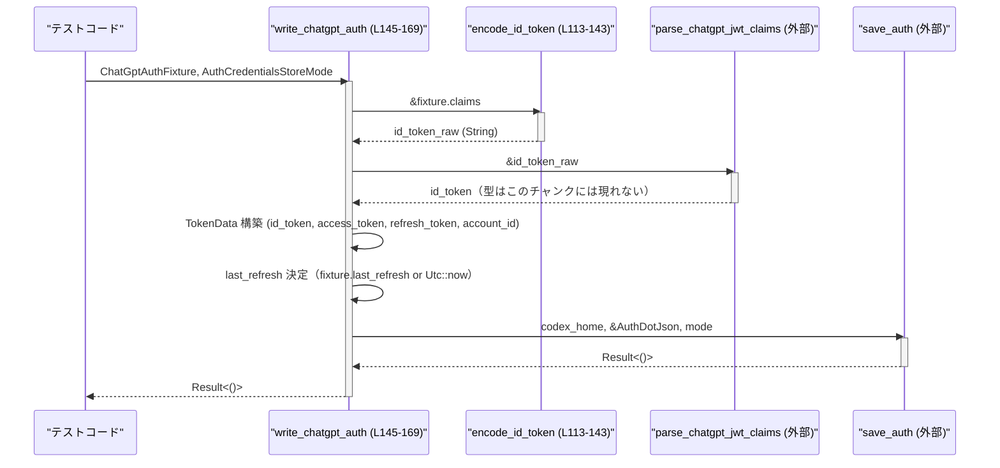

# app-server/tests/common/auth_fixtures.rs コード解説

## 0. ざっくり一言

ChatGPT 用の疑似 `auth.json` をテスト用に生成するフィクスチャ（テストヘルパー）と、そのための ID トークン（JWT 風文字列）エンコード処理、および `auth.json` 書き込み処理を提供するモジュールです（`app-server/tests/common/auth_fixtures.rs:L17-25,113-169`）。

---

## 1. このモジュールの役割

### 1.1 概要

- テストから簡単に **ChatGPT 認証状態をエミュレートした `auth.json`** を作るためのビルダー `ChatGptAuthFixture` と、クレーム情報 `ChatGptIdTokenClaims` を定義します（`L19-25,80-85`）。
- クレーム構造体から **署名抜きの JWT 風 ID トークン文字列を組み立てる** 関数 `encode_id_token` を提供します（`L113-143`）。
- これらを使って `AuthDotJson` を構築し、`codex_login::save_auth` 経由で **実ファイルとして `auth.json` を書き出す** 関数 `write_chatgpt_auth` を提供します（`L145-169`）。

### 1.2 アーキテクチャ内での位置づけ

このモジュールは `app-server` のテストコードから呼び出され、`codex_login` クレートの型／関数を利用して `auth.json` を生成します。

依存関係の概要を Mermaid 図で示します（このチャンクのみが対象です）。



> `TokenData`, `AuthDotJson`, `save_auth`, `parse_chatgpt_jwt_claims` の実装はこのチャンクには現れませんが、モジュールパスと利用方法から上記のような役割を担っていると読み取れます（`L11-14,152-168`）。

### 1.3 設計上のポイント

- **ビルダーパターン**  
  - `ChatGptAuthFixture` / `ChatGptIdTokenClaims` はいずれも `self` を消費して自身を返すメソッドを持ち、メソッドチェーンで設定できます（`L27-76,87-110`）。
- **ネストした Option によるデフォルト制御**  
  - `ChatGptAuthFixture.last_refresh` は `Option<Option<DateTime<Utc>>>` で、  
    - フィールド自体が `None` → 「デフォルトで `Utc::now()`」  
    - フィールドが `Some(Some(t))` → 明示的な時刻  
    - フィールドが `Some(None)` → 「last_refresh を `None` にしたい」  
    という 3 通りを区別します（`L24,68-71,159`）。
- **JWT 風だが署名はダミー**  
  - ヘッダ `"alg": "none"`、署名部分は `"signature"` という固定文字列を Base64URL エンコードして付与するだけの簡易トークンです（`L113-115,137-142`）。  
    → テスト専用の実装であることが doc コメントからも分かります（`L17`）。
- **エラーハンドリング**  
  - 返り値に `anyhow::Result` を用い、`?` と `Context` で外部関数／シリアライズのエラーに説明文を付けてそのまま上位に返します（`L3-4,137-140,151,168`）。
- **状態と並行性**  
  - グローバル状態は持たず、すべてのデータは引数経由でやり取りされます。  
    → 同じプロセス内の複数テストから独立に利用できる設計です（`L19-25,145-169`）。

---

## 2. 主要な機能一覧

- ChatGptAuthFixture ビルダー: ChatGPT 認証情報（アクセストークン／リフレッシュトークン／アカウント ID／ID トークンクレーム／last_refresh）をテスト用に組み立てる（`L19-76`）。
- ChatGptIdTokenClaims ビルダー: ID トークンに埋め込むメールアドレスやプラン種別などのクレームを組み立てる（`L80-111`）。
- encode_id_token: `ChatGptIdTokenClaims` から JSON Web Token 風の ID トークン文字列（ヘッダ＋ペイロード＋ダミー署名）を生成する（`L113-143`）。
- write_chatgpt_auth: フィクスチャから `TokenData` と `AuthDotJson` を生成し、`save_auth` を通じて `auth.json` をディスクに書き込む（`L145-169`）。

---

## 3. 公開 API と詳細解説

### 3.1 型一覧（構造体）

| 名前 | 種別 | 役割 / 用途 | 定義位置 |
|------|------|-------------|----------|
| `ChatGptAuthFixture` | 構造体 | ChatGPT 用 `auth.json` を生成するためのテスト用ビルダー。トークンやアカウント ID、ID トークンクレーム、更新時刻指定を保持する。 | `app-server/tests/common/auth_fixtures.rs:L19-25` |
| `ChatGptIdTokenClaims` | 構造体 | ID トークンのペイロード部分に入るクレーム（`email` や `chatgpt_plan_type` など）を表現する。フィールドはすべて `pub`。 | `app-server/tests/common/auth_fixtures.rs:L80-85` |

---

### 3.2 関数詳細（主要なもの）

#### `ChatGptAuthFixture::new(access_token: impl Into<String>) -> Self`

**概要**

- アクセストークンを必須引数として受け取り、その他の値をデフォルトで初期化した `ChatGptAuthFixture` を作成します（`L28-36`）。
- リフレッシュトークンは `"refresh-token"`、`account_id` と `last_refresh` は未設定 (`None`)、`claims` はデフォルト値になります。

**引数**

| 引数名 | 型 | 説明 |
|--------|----|------|
| `access_token` | `impl Into<String>` | アクセストークン文字列。`String` や `&str` などから変換可能です（`L28-31`）。 |

**戻り値**

- `ChatGptAuthFixture`  
  - 内部フィールドは以下のように初期化されます（`L29-35`）。  
    - `access_token`: 引数から `Into<String>` 経由で変換した値  
    - `refresh_token`: `"refresh-token"` 固定文字列  
    - `account_id`: `None`  
    - `claims`: `ChatGptIdTokenClaims::default()`（すべて `None`）  
    - `last_refresh`: `None`（＝デフォルトの更新時刻ロジックを適用）

**内部処理の流れ**

1. `access_token.into()` を呼び出し `String` に変換（`L30`）。
2. 構造体リテラルで他フィールドを固定値または `Default` で初期化（`L31-34`）。
3. 生成した `Self` を返却（`L29`）。

**Examples（使用例）**

```rust
use std::path::Path;
use codex_config::types::AuthCredentialsStoreMode;

fn create_basic_auth(
    codex_home: &Path,                      // auth.json の出力先ディレクトリ
    mode: AuthCredentialsStoreMode,        // 保存モード（このチャンクには詳細定義はありません）
) -> anyhow::Result<()> {
    // アクセストークンだけ指定し、他はデフォルト値のままにする
    let fixture = ChatGptAuthFixture::new("test-access-token"); // L28-36

    // auth.json を書き出す
    write_chatgpt_auth(codex_home, fixture, mode)               // L145-169
}
```

**Errors / Panics**

- この関数自体はエラーを返さず、パニックの可能性もありません。  
  - `String::from` 相当の処理のみで、標準的な使用ではパニック要因はありません（`L30-35`）。

**Edge cases（エッジケース）**

- `access_token` が空文字列でも、そのまま `String` として保存されます。バリデーションは行いません（`L30`）。
- 非 UTF-8 のバイト列を与えることはできません（型が `impl Into<String>` なのでコンパイル時に弾かれます）。

**使用上の注意点**

- `refresh_token` や `account_id`、クレームなどを変更したい場合は、後続のビルダーメソッド（`refresh_token`, `account_id`, `plan_type` など）をチェーンして使う必要があります（`L38-76`）。
- `last_refresh` を特定の値や `None` にしたい場合は、`last_refresh` メソッドを必ず呼び出す必要があります（`L68-71`）。

---

#### `encode_id_token(claims: &ChatGptIdTokenClaims) -> Result<String>`

**概要**

- 与えられた `ChatGptIdTokenClaims` から JWT 風 ID トークン文字列を生成します（`L113-143`）。
- ヘッダ部は `{"alg":"none","typ":"JWT"}` 固定、署名部は `"signature"` を Base64URL エンコードしたものです。

**引数**

| 引数名 | 型 | 説明 |
|--------|----|------|
| `claims` | `&ChatGptIdTokenClaims` | メールアドレスやプラン種別などのクレーム。存在するフィールドだけがペイロードに入ります（`L113-128`）。 |

**戻り値**

- `Result<String>` (`anyhow::Result<String>`)  
  - `Ok(String)` の場合: `header.payload.signature` 形式の JWT 風文字列。各部分は URL-safe Base64 (no padding) でエンコードされています（`L137-142`）。  
  - `Err(anyhow::Error)` の場合: ヘッダやペイロードの JSON シリアライズに失敗したときのエラーです。

**内部処理の流れ**

1. ヘッダ JSON を `json!` マクロで構築（`L113-115`）。
2. ペイロード用の `serde_json::Map` を作成し、`claims.email` が `Some` のとき `email` キーで格納（`L115-118`）。
3. ChatGPT 固有のクレームをまとめる `auth_payload` マップを作成し、  
   - `plan_type` → `"chatgpt_plan_type"`  
   - `chatgpt_user_id` → `"chatgpt_user_id"`  
   - `chatgpt_account_id` → `"chatgpt_account_id"`  
   を必要に応じて挿入（`L119-128`）。
4. `auth_payload` が空でなければ、ペイロードに `"https://api.openai.com/auth"` プロパティとしてネストして挿入（`L129-134`）。
5. ペイロードマップを `serde_json::Value::Object` に包む（`L135`）。
6. ヘッダとペイロードを `serde_json::to_vec` でバイト列にシリアライズし、`URL_SAFE_NO_PAD.encode` で Base64URL 文字列に変換（`L137-140`）。
7. `"signature"` という固定バイト列を同じく Base64URL エンコードして署名文字列とする（`L141`）。
8. `"{header_b64}.{payload_b64}.{signature_b64}"` の形式で連結し `Ok` で返す（`L142`）。

**Examples（使用例）**

```rust
// クレームを組み立てる
let claims = ChatGptIdTokenClaims::new()                    // L88-90
    .email("user@example.com")                              // L92-95
    .plan_type("plus")                                      // L97-100
    .chatgpt_user_id("user-123");                           // L102-105

// ID トークン文字列にエンコードする
let id_token = encode_id_token(&claims)?;                   // L113-143

// id_token は "xxxxx.yyyyy.zzzzz" のような JWT 風文字列になります
println!("encoded id_token = {}", id_token);
```

**Errors / Panics**

- `serde_json::to_vec(&header)` または `serde_json::to_vec(&payload)` が `Err` を返した場合、`?` により `anyhow::Error` としてそのまま上位に返却されます（`L137-140`）。
  - `Context("serialize jwt header")` / `Context("serialize jwt payload")` により、どのシリアライズで失敗したかの情報がメッセージに含まれます（`L137-140`）。
- ベース64エンコードはパニックしない前提の API であり、この関数内に `unwrap` や `expect` は存在しません（`L137-142`）。

**Edge cases（エッジケース）**

- すべてのクレームが `None` の場合  
  - ペイロードは空オブジェクト `{}` となり、`"https://api.openai.com/auth"` プロパティも付きません（`L115-135`）。
- `email` のみ `Some` の場合  
  - ペイロードは `{"email": "<値>"}` となります（`L115-118`）。
- `plan_type` など ChatGPT 固有クレームのみが `Some` の場合  
  - ペイロードは `{ "https://api.openai.com/auth": { ... } }` 形式になり、`email` は含まれません（`L119-135`）。

**使用上の注意点**

- 署名は固定文字列 `"signature"` を Base64URL エンコードしたものなので、**実運用のセキュリティを満たす JWT ではありません**（`L141-142`）。  
  → doc コメントとファイル位置から分かる通り、テスト専用として扱う必要があります（`L17`）。
- JWT ヘッダの `alg` は `"none"` に固定されます（`L113-115`）。この値に依存したアサーションを書く場合は、後続のライブラリがどう扱うかに注意が必要です（`parse_chatgpt_jwt_claims` の挙動はこのチャンクには現れません）。

---

#### `write_chatgpt_auth(codex_home: &Path, fixture: ChatGptAuthFixture, cli_auth_credentials_store_mode: AuthCredentialsStoreMode) -> Result<()>`

**概要**

- `ChatGptAuthFixture` をもとに `TokenData` と `AuthDotJson` を作り、`save_auth` を使ってターゲットディレクトリに `auth.json` を書き込む関数です（`L145-169`）。
- テストからこの関数を呼ぶだけで、ChatGPT 認証済み状態の `auth.json` が生成されます。

**引数**

| 引数名 | 型 | 説明 |
|--------|----|------|
| `codex_home` | `&Path` | `auth.json` を出力するディレクトリ（`codex_home`）へのパス（`L145-146`）。 |
| `fixture` | `ChatGptAuthFixture` | ビルダーで構成した ChatGPT 認証フィクスチャ（`L145,150-159`）。 |
| `cli_auth_credentials_store_mode` | `AuthCredentialsStoreMode` | 認証情報の保存モード。暗号化の有無などを指定するものと考えられますが、このチャンクには定義が現れません（`L148,168`）。 |

**戻り値**

- `Result<()>` (`anyhow::Result<()>`)  
  - `Ok(())`: `auth.json` の書き込みが成功した場合。  
  - `Err(anyhow::Error)`: ID トークン生成／パース、または `save_auth` でエラーが発生した場合。

**内部処理の流れ**

1. `encode_id_token(&fixture.claims)` を呼び、ID トークン文字列を生成（`L150`）。
2. 得られた文字列を `parse_chatgpt_jwt_claims(&id_token_raw)` に渡し、`TokenData` 用の `id_token` 型へ変換（`L151`）。  
   - 失敗時には `"parse id token"` というコンテキストメッセージ付きでエラーが返ります。
3. `TokenData { id_token, access_token, refresh_token, account_id }` を構築（`L152-157`）。
4. `last_refresh` を決定（`L159`）。  
   - `fixture.last_refresh` が `Some(v)` のときは `v`（`Option<DateTime<Utc>>`）をそのまま使用。  
   - `None` のときは `Some(Utc::now())` を使う（更新時刻のデフォルトを現在時刻にする）。
5. `AuthDotJson` 構造体を初期化（`L161-165`）。  
   - `auth_mode: Some(AuthMode::Chatgpt)`  
   - `openai_api_key: None`  
   - `tokens: Some(tokens)`  
   - `last_refresh`: 上記で決定した値
6. `save_auth(codex_home, &auth, cli_auth_credentials_store_mode)` を呼び出し、`auth.json` を保存（`L168`）。  
   - 失敗時は `"write auth.json"` というコンテキスト付きでエラーを返す。

**Examples（使用例）**

```rust
use std::path::Path;
use chrono::{TimeZone, Utc};
use codex_config::types::AuthCredentialsStoreMode;

fn write_fixture_example(
    codex_home: &Path,
    mode: AuthCredentialsStoreMode,                  // 具体的なバリアントはこのチャンクには現れません
) -> anyhow::Result<()> {
    // ChatGPT 認証情報のフィクスチャを構築
    let fixture = ChatGptAuthFixture::new("access-token")   // L28-36
        .refresh_token("refresh-token-123")                 // L38-41
        .account_id("account-456")                          // L43-46
        .email("user@example.com")                          // L63-66
        .plan_type("plus")                                  // L48-51
        .last_refresh(Some(Utc.ymd(2024, 1, 1).and_hms(0,0,0))); // L68-71

    // auth.json を生成・保存する
    write_chatgpt_auth(codex_home, fixture, mode)           // L145-169
}
```

**Errors / Panics**

この関数は複数の `?` を通じて外部処理のエラーを伝播します。

- `encode_id_token(&fixture.claims)` のエラー  
  - ヘッダまたはペイロードのシリアライズエラーがそのまま伝播します（`L150,137-140`）。
- `parse_chatgpt_jwt_claims(&id_token_raw)` のエラー  
  - JWT 風文字列のパースに失敗した場合などに `Err` が返り、`"parse id token"` コンテキストが付与されます（`L151`）。  
  - このチャンクには `parse_chatgpt_jwt_claims` の実装がないため、具体的な失敗条件は不明です。
- `save_auth(codex_home, &auth, cli_auth_credentials_store_mode)` のエラー  
  - ファイル書き込み失敗やシリアライズ失敗などが考えられますが、詳細はこのチャンクには現れません（`L168`）。  
  - エラーには `"write auth.json"` というコンテキストが付与されます。
- この関数内には `unwrap` や明示的な `panic!` はありません（`L145-169`）。

**Edge cases（エッジケース）**

- `fixture.last_refresh` を一度も設定していない場合  
  - `fixture.last_refresh` は `None` であり、`unwrap_or_else(|| Some(Utc::now()))` により `Some(Utc::now())` が使用されます（`L24,159`）。  
  - その結果、`auth.json` の `last_refresh` は常に現在時刻になります。
- `fixture.last_refresh(Some(t))` とした場合  
  - 内部の `last_refresh` は `Some(Some(t))` になり、その `t` がそのまま `auth.last_refresh` に使われます（`L68-71,159`）。
- `fixture.last_refresh(None)` とした場合  
  - 内部の `last_refresh` は `Some(None)` となり、`unwrap_or_else` によって `None` が返されます（`L68-71,159`）。  
  - つまり「`last_refresh` フィールドを `null` にする」ことができます。  
  - デフォルトの現在時刻を使いたいときは、**あえて `last_refresh` メソッドを呼ばない** 必要があります。
- クレームや `account_id` を設定しない場合  
  - `TokenData` の `account_id` は `None` となり、ID トークンのクレームもデフォルト値になります（`L152-157,29-35`）。  
  - これがテストで期待される動作かどうかはテスト側のアサーションに依存します。

**使用上の注意点**

- **テスト専用であること**  
  - `encode_id_token` が署名検証を考慮していないため、本番コードからこの関数を利用するとセキュリティ要件を満たしません（`L113-115,141-142`）。
- **時刻を固定したいテスト**  
  - 「現在時刻」に依存するテストは不安定になりがちです。  
    - その場合は必ず `fixture.last_refresh(Some(fixed_time))` を指定する必要があります（`L68-71,159`）。
- **保存モードの依存**  
  - `AuthCredentialsStoreMode` の値によって `auth.json` の保存形式が変わる可能性がありますが、詳細はこのチャンクには現れません（`L148,168`）。  
  - テストでは、期待する保存形式とモードが一致しているかを別途確認する必要があります。

---

### 3.3 その他の関数・メソッド一覧（コンポーネントインベントリー）

以下の表は、このファイル内のすべての公開関数・メソッドを列挙したものです。

| 名称 | 種別 | 役割（1 行） | 位置 |
|------|------|--------------|------|
| `ChatGptAuthFixture::new` | 関連関数 | アクセストークンを指定してフィクスチャをデフォルト初期化する | `L28-36` |
| `ChatGptAuthFixture::refresh_token` | メソッド | リフレッシュトークン文字列を上書きするビルダー | `L38-41` |
| `ChatGptAuthFixture::account_id` | メソッド | `account_id` を `Some` で設定するビルダー | `L43-46` |
| `ChatGptAuthFixture::plan_type` | メソッド | `claims.plan_type` を設定するビルダー | `L48-51` |
| `ChatGptAuthFixture::chatgpt_user_id` | メソッド | `claims.chatgpt_user_id` を設定するビルダー | `L53-56` |
| `ChatGptAuthFixture::chatgpt_account_id` | メソッド | `claims.chatgpt_account_id` を設定するビルダー | `L58-61` |
| `ChatGptAuthFixture::email` | メソッド | `claims.email` を設定するビルダー | `L63-66` |
| `ChatGptAuthFixture::last_refresh` | メソッド | `last_refresh` の上書き（`Option<Option<DateTime>>` の外側を `Some` にする） | `L68-71` |
| `ChatGptAuthFixture::claims` | メソッド | 完成済みの `ChatGptIdTokenClaims` でクレーム全体を置き換える | `L73-76` |
| `ChatGptIdTokenClaims::new` | 関連関数 | すべてのクレームを `None` とするデフォルトインスタンスを返す | `L88-90` |
| `ChatGptIdTokenClaims::email` | メソッド | `email` を `Some` で設定するビルダー | `L92-95` |
| `ChatGptIdTokenClaims::plan_type` | メソッド | `plan_type` を `Some` で設定するビルダー | `L97-100` |
| `ChatGptIdTokenClaims::chatgpt_user_id` | メソッド | `chatgpt_user_id` を `Some` で設定するビルダー | `L102-105` |
| `ChatGptIdTokenClaims::chatgpt_account_id` | メソッド | `chatgpt_account_id` を `Some` で設定するビルダー | `L107-110` |
| `encode_id_token` | 関数 | クレームから JWT 風 ID トークン文字列を生成する | `L113-143` |
| `write_chatgpt_auth` | 関数 | フィクスチャから `auth.json` を生成しディスクに書き込む | `L145-169` |

---

## 4. データフロー

ここでは、典型的な処理シナリオ「テストから `auth.json` を書き出す」場合のデータフローを説明します。

1. テストコードで `ChatGptAuthFixture` を組み立てる（`L19-76`）。
2. テストコードが `write_chatgpt_auth` を呼び出す（`L145-169`）。
3. `write_chatgpt_auth` 内で `encode_id_token` → `parse_chatgpt_jwt_claims` による ID トークン生成・パースが行われる（`L150-151`）。
4. `TokenData` と `AuthDotJson` にまとめられ、`save_auth` に渡されてディスクに書き出される（`L152-168`）。

Mermaid のシーケンス図で表すと次のようになります。



要点:

- `write_chatgpt_auth` は ID トークンの生成・検証処理と `auth.json` 保存処理の **統合ポイント** になっています。
- 実際の JWT 検証ロジックやファイル I/O の詳細は `codex_login` 側に委譲され、このモジュールはフィクスチャからその入力データを組み立てる役に集中しています。

---

## 5. 使い方（How to Use）

### 5.1 基本的な使用方法

典型的なテストコードでは、以下のような流れになります。

```rust
use std::path::Path;
use chrono::{TimeZone, Utc};
use codex_config::types::AuthCredentialsStoreMode;

fn setup_chatgpt_auth(
    codex_home: &Path,                        // テスト用 CODEx ホームディレクトリ
    mode: AuthCredentialsStoreMode,          // 保存モード（詳細は別モジュール）
) -> anyhow::Result<()> {
    // 1. フィクスチャを構築する
    let fixture = ChatGptAuthFixture::new("access-token")  // 必須: アクセストークン
        .refresh_token("refresh-token")                    // 任意: リフレッシュトークン
        .account_id("account-123")                         // 任意: アカウント ID
        .email("user@example.com")                         // 任意: メールアドレス
        .plan_type("plus")                                 // 任意: プラン種別
        .last_refresh(Some(Utc.ymd(2024, 1, 1).and_hms(0, 0, 0))); // 任意: 更新時刻を固定

    // 2. auth.json を書き込む
    write_chatgpt_auth(codex_home, fixture, mode)          // Result<()> を返す
}
```

これにより、`codex_home` 配下に `chatgpt` モードを示す `auth.json` が生成されます（`AuthDotJson.auth_mode = Some(AuthMode::Chatgpt)`; `L161-163`）。

### 5.2 よくある使用パターン

1. **最小限のフィクスチャ（トークンだけ）**

```rust
let fixture = ChatGptAuthFixture::new("access-token");
// 他はデフォルト（refresh-token 固定文字列、claims は空、last_refresh は現在時刻）で生成される
write_chatgpt_auth(codex_home, fixture, mode)?;
```

- クレームや `account_id` を特に検証しないテスト向け（`L29-35,152-159`）。

1. **クレーム中心のテスト**

```rust
let claims = ChatGptIdTokenClaims::new()
    .email("user@example.com")
    .plan_type("team");

// ChatGptAuthFixture 側の claims 全体を差し替える
let fixture = ChatGptAuthFixture::new("access-token")
    .claims(claims);

write_chatgpt_auth(codex_home, fixture, mode)?;
```

- `ChatGptIdTokenClaims` を個別に構築してから `fixture.claims` をまとめて置き換えたい場合に有用です（`L73-76,87-100`）。

1. **last_refresh を `null` にするテスト**

```rust
let fixture = ChatGptAuthFixture::new("access-token")
    .last_refresh(None); // last_refresh フィールドを None にする

write_chatgpt_auth(codex_home, fixture, mode)?;
```

- 「`auth.json` に `last_refresh` が存在しない（または `null`）状態」をテストしたいケースに使用できます（`L68-71,159`）。

### 5.3 よくある間違い

```rust
// 間違い例: last_refresh を None にすれば現在時刻になると誤解している
let fixture = ChatGptAuthFixture::new("access-token")
    .last_refresh(None); // 実際には last_refresh フィールドが None になるだけ

// 正しい例: デフォルトの現在時刻を使いたいなら last_refresh を呼ばない
let fixture = ChatGptAuthFixture::new("access-token");
// fixture.last_refresh は None のままなので、write_chatgpt_auth 内で Utc::now() が使われる
```

- `last_refresh(None)` は「デフォルト値を使う」という意味ではなく、「`last_refresh` を `None` に固定する」意味になる点が重要です（`L68-71,159`）。

### 5.4 使用上の注意点（まとめ）

- **テスト専用であること**  
  - 署名や `alg: "none"` を使用しているため、本番用の認証フローにこのモジュールを流用するとセキュリティ上問題があります（`L113-115,141-142`）。
- **時刻依存テストの安定性**  
  - 明示的に `last_refresh` を設定しないと `Utc::now()` が使われるため、テスト結果が実行時刻に依存します（`L159`）。
- **エラーの扱い**  
  - `anyhow::Result` を返す設計のため、テスト側で `?` を用いてエラーをそのままテスト失敗として扱うことができます。  
  - エラーメッセージに `serialize jwt header` や `write auth.json` といったコンテキストが含まれるので、トラブルシュートが容易です（`L137-140,151,168`）。
- **並行性**  
  - グローバル／静的状態を持たないため、異なるテストケースから並列に呼び出してもこのモジュール単体では競合しません。  
  - ただし、`codex_home` のパスが衝突するとファイル書き込みで競合する可能性があります。テスト側でディレクトリを分離する必要があります。

---

## 6. 変更の仕方（How to Modify）

### 6.1 新しい機能を追加する場合

例: ChatGPT の ID トークンに新しいクレーム `organization_id` を追加したい場合。

1. **クレーム構造体の拡張**  
   - `ChatGptIdTokenClaims` にフィールドを追加します（`L80-85`）。  

     ```rust
     pub struct ChatGptIdTokenClaims {
         pub email: Option<String>,
         pub plan_type: Option<String>,
         pub chatgpt_user_id: Option<String>,
         pub chatgpt_account_id: Option<String>,
         pub organization_id: Option<String>, // 新規
     }
     ```

2. **ビルダー API の追加**  
   - `impl ChatGptIdTokenClaims` に `organization_id` を設定するメソッドを追加します（`L87-110` に倣う）。  
   - 必要なら `ChatGptAuthFixture` 側にも同名の委譲メソッドを追加します（`L48-61` と同様）。
3. **encode_id_token の拡張**  
   - `auth_payload` に `organization_id` を反映する分岐を追加します（`L119-128`）。  
   - 例: `auth_payload.insert("organization_id".to_string(), json!(org_id));`
4. **テストの追加／更新**  
   - 新しいクレームが `auth.json` 内のどのフィールドとして現れるかをアサートするテストを追加します。

### 6.2 既存の機能を変更する場合

- **影響範囲の確認**  
  - `ChatGptAuthFixture` や `ChatGptIdTokenClaims` はテスト共通ヘルパーの可能性が高く、`tests/` 以下の複数ファイルから参照されていると考えられます。  
    - 変更前に「`ChatGptAuthFixture`」「`encode_id_token`」などでリポジトリ全体を検索し、使用箇所を洗い出す必要があります。
- **契約の確認（Contracts）**  
  - `write_chatgpt_auth` は `AuthDotJson` の `auth_mode` を必ず `Some(AuthMode::Chatgpt)` にセットする契約になっています（`L161-163`）。  
    - 他の認証モードを扱うように変更すると、既存テストの前提条件が崩れる可能性があります。
  - `last_refresh` の 3 通りの意味（デフォルト／固定値／None）はテスト設計にとって重要な契約です（`L24,68-71,159`）。
- **テスト再実行**  
  - `encode_id_token` のペイロード構造を変えると、`parse_chatgpt_jwt_claims` に依存するテストも影響を受けます。  
  - エラー文言に `Context` で追加した文字列を変更すると、エラーメッセージを文字列比較しているテストがあれば壊れます（`L137-140,151,168`）。

---

## 7. 関連ファイル

このモジュールと密接に関係する型・関数は、以下のモジュールに定義されています（コード自体はこのチャンクには現れません）。

| パス / モジュール | 役割 / 関係 |
|-------------------|------------|
| `codex_login::AuthDotJson` | `auth.json` のデータ構造。`write_chatgpt_auth` で初期化され、`save_auth` を通じてディスクに保存されます（`L11,161-165`）。 |
| `codex_login::token_data::TokenData` | `id_token`, `access_token`, `refresh_token`, `account_id` をまとめる構造体。`write_chatgpt_auth` でインスタンス化されます（`L13,152-157`）。 |
| `codex_login::token_data::parse_chatgpt_jwt_claims` | JWT 風 ID トークン文字列をパースして `TokenData` 用の `id_token` 型に変換する関数と考えられます（`L14,151`）。 |
| `codex_login::save_auth` | `AuthDotJson` を `codex_home` 直下に保存する関数。`write_chatgpt_auth` から呼び出されます（`L12,168`）。 |
| `codex_app_server_protocol::AuthMode` | 認証モードを表す enum。ここでは `AuthMode::Chatgpt` を指定しています（`L9,161-163`）。 |
| `codex_config::types::AuthCredentialsStoreMode` | 認証情報の保存方法（平文／暗号化など）を指定する設定型と考えられます（`L10,148,168`）。 |
| `chrono::{DateTime, Utc}` | `last_refresh` に使われるタイムスタンプ型および現在時刻取得のための型です（`L7-8,24,68-71,159`）。 |
| `base64::engine::general_purpose::URL_SAFE_NO_PAD` | JWT 風トークンで使われる URL-safe Base64（パディングなし）エンコーダです（`L5-6,137-141`）。 |
| `serde_json` | JWT ヘッダ・ペイロードの構築とシリアライズに使用されます（`L15,113-115,115-135,137-140`）。 |

このファイルは `tests/common` に配置されていることから、上記のモジュールを使うテストコードに共通フィクスチャを提供する位置づけと解釈できます。
