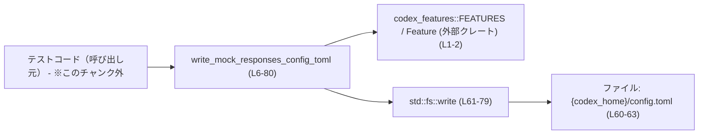
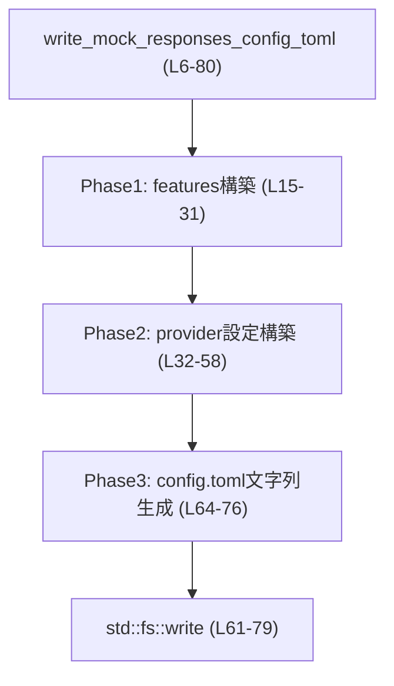
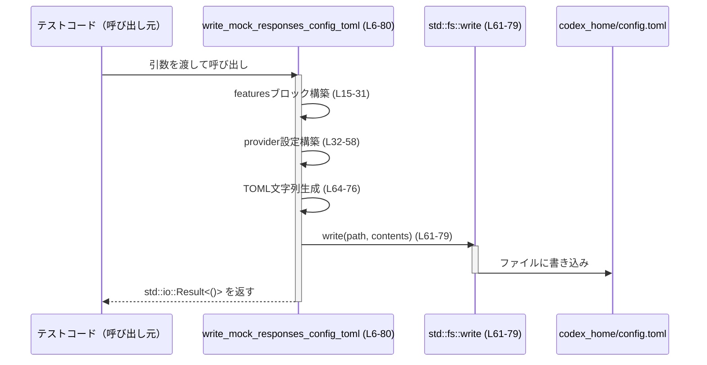

# app-server/tests/common/config.rs

## 0. ざっくり一言

`write_mock_responses_config_toml` 関数は、テスト用のモックレスポンスサーバーに接続するための `config.toml` を生成してディスクに書き出すユーティリティです（`config.rs:L6-14`, `config.rs:L60-79`）。

---

## 1. このモジュールの役割

### 1.1 概要

- このモジュールは、テスト環境で使用する Codex の設定ファイル `config.toml` を生成するためのヘルパー関数を 1 つ提供します（`config.rs:L6-14`）。
- 主な機能は、機能フラグ（features）、モデルプロバイダ設定、OpenAI 認証の有無などを TOML 形式の設定ファイルにまとめ、指定ディレクトリに書き出すことです（`config.rs:L15-58`, `config.rs:L60-79`）。

### 1.2 アーキテクチャ内での位置づけ

このファイル単体から分かる依存関係と呼び出し関係を図示します。



- 呼び出し元はテストコードと推測されますが、このチャンクには現れないため、確定的な情報ではありません。
- `codex_features::FEATURES` と `Feature` は外部クレートからのインポートで、機能フラグを TOML の `[features]` セクションに変換する際に使われます（`config.rs:L1-2`, `config.rs:L23-27`）。
- 実際の I/O は `std::fs::write` に委譲されます（`config.rs:L61-79`）。

### 1.3 設計上のポイント

- **責務の集中**  
  - 1 つの関数で「フラグの整形」「プロバイダ設定の整形」「ファイル書き込み」の 3 フェーズを順に行う構造になっています（コメントで Phase 1〜3 が明示されています `config.rs:L15`, `config.rs:L32`, `config.rs:L59`）。
- **状態を持たない**  
  - 関数は引数のみを入力とし、グローバル可変状態は持ちません。出力はファイルへの書き込みだけです。
- **エラーハンドリング**  
  - I/O エラーは `std::io::Result<()>` として呼び出し元に返します（`config.rs:L14`, `config.rs:L61-79`）。
  - `FEATURES` に対応するエントリが見つからない場合は `panic!` します（`config.rs:L23-27`）。
- **再現性のある出力**  
  - `BTreeMap` を利用することで、features セクションのキー順がソートされ、設定ファイルの出力順が安定します（`config.rs:L16-21`）。

---

## 2. 主要な機能一覧

- モック環境用 `config.toml` の生成と書き込み: 引数で指定されたディレクトリに、与えられた feature フラグ・モデルプロバイダ・サーバー URI に基づく設定ファイルを出力します（`config.rs:L6-14`, `config.rs:L60-79`）。

---

## 3. 公開 API と詳細解説

### 3.1 型一覧（構造体・列挙体など）

このファイル内で新たに定義されている型はありません。  
外部からインポートされている型は次の通りです。

| 名前 | 種別 | 役割 / 用途 | 定義位置（このファイル内の参照） |
|------|------|-------------|-----------------------------------|
| `Feature` | 列挙体（と推測、外部定義） | 機能フラグの識別子として使用されます。`BTreeMap<Feature, bool>` のキーになります。型の定義自体はこのチャンクには現れません。 | `config.rs:L2`, `config.rs:L9`, `config.rs:L17-18` |
| `FEATURES` | 定数（外部定義） | 全 Feature とそれに対応する設定キー（`spec.key`）の一覧とみなされます。この関数内で `Feature` から TOML のキー文字列への対応付けに使われます。構造はこのチャンクには現れません。 | `config.rs:L1`, `config.rs:L23-27` |
| `BTreeMap` | 構造体（標準ライブラリ） | feature フラグをキー順ソートされたマップとして保持します。 | `config.rs:L3`, `config.rs:L9`, `config.rs:L16`, `config.rs:L20-21` |
| `Path` | 構造体（標準ライブラリ） | `codex_home` ディレクトリを表します。`join` で `config.toml` パスを生成します。 | `config.rs:L4`, `config.rs:L7`, `config.rs:L60` |

> `Feature` と `FEATURES` の具体的な構造やフィールド名などは、このチャンクからは分かりません。

#### コンポーネントインベントリー（関数）

| 名前 | 種別 | 公開 | 定義位置 |
|------|------|------|----------|
| `write_mock_responses_config_toml` | 関数 | `pub` | `config.rs:L6-80` |

### 3.2 関数詳細

#### `write_mock_responses_config_toml(codex_home: &Path, server_uri: &str, feature_flags: &BTreeMap<Feature, bool>, auto_compact_limit: i64, requires_openai_auth: Option<bool>, model_provider_id: &str, compact_prompt: &str) -> std::io::Result<()>`

**概要**

- テスト用の Codex 設定ファイル `config.toml` を、指定されたディレクトリ `codex_home` に書き出します（`config.rs:L6-14`, `config.rs:L60-79`）。
- 引数で渡された feature フラグやモデルプロバイダ ID・サーバー URI などを用いて、TOML 形式の設定内容を構築します（`config.rs:L15-58`, `config.rs:L64-76`）。

**引数**

| 引数名 | 型 | 説明 |
|--------|----|------|
| `codex_home` | `&Path` | `config.toml` を置く基準ディレクトリ。`codex_home.join("config.toml")` に対して書き込みます（`config.rs:L7`, `config.rs:L60`）。 |
| `server_uri` | `&str` | モックサーバーのベース URI。`{server_uri}/v1` が `base_url` および `openai_base_url` として使われます（`config.rs:L46`, `config.rs:L55`）。 |
| `feature_flags` | `&BTreeMap<Feature, bool>` | 各 `Feature` が有効かどうかのマップ。`[features]` セクションの内容として変換されます（`config.rs:L9`, `config.rs:L17-21`, `config.rs:L28`, `config.rs:L74-75`）。 |
| `auto_compact_limit` | `i64` | `model_auto_compact_token_limit` に記録されるトークン数上限（`config.rs:L10`, `config.rs:L69`）。 |
| `requires_openai_auth` | `Option<bool>` | OpenAI 認証が必要かどうか。`Some(true)` の場合に `requires_openai_auth = true` を出力し、プロバイダ名を `"OpenAI"` にします（`config.rs:L11`, `config.rs:L33-38`, `config.rs:L51`）。 |
| `model_provider_id` | `&str` | 使用するモデルプロバイダの識別子。`model_provider` と `[model_providers.{id}]` に使われます。また `"openai"` の場合に `openai_base_url` 行を追加します（`config.rs:L12`, `config.rs:L44`, `config.rs:L71-72`, `config.rs:L55`）。 |
| `compact_prompt` | `&str` | `compact_prompt` 設定にそのまま埋め込まれる文字列です（`config.rs:L13`, `config.rs:L68`）。 |

**戻り値**

- `std::io::Result<()>`  
  - 成功時: `Ok(())`。指定した場所に `config.toml` が書き込まれたことを示します。
  - 失敗時: `Err(e)`。`std::fs::write` 由来の I/O エラーをラップしたエラーです（`config.rs:L61-79`）。

**内部処理の流れ（アルゴリズム）**

1. **features マップのコピーと整形**（Phase 1）  
   - 空の `BTreeMap` `features` を作成し（`config.rs:L16`）、`feature_flags` をイテレートしながらキー・値をコピーします（`config.rs:L17-19`）。
   - コピーした `features` をイテレートし、各 `Feature` について:
     - `FEATURES` から `spec.id == feature` な要素を `iter().find(...)` で探し（`config.rs:L23-25`）、
     - 見つかった `spec.key` を TOML のキー名として使用します。見つからない場合は `panic!("missing feature key for {feature:?}")` で異常終了します（`config.rs:L26-27`）。
     - `"key = enabled"` 形式の文字列を生成します（`config.rs:L28`）。
   - これらの行をベクタに集めてから `join("\n")` で改行区切りの 1 つの文字列 `feature_entries` にします（`config.rs:L20-21`, `config.rs:L30-31`）。

2. **プロバイダ固有設定の構築**（Phase 2）  
   - `requires_openai_auth` を `match` し、`Some(true)` のときだけ `requires_openai_auth = true\n` という 1 行の文字列にし、それ以外は空文字列にします（`config.rs:L33-36`）。
   - `requires_openai_auth` が `Some(true)` かどうかで、プロバイダ名を `"OpenAI"` または `"Mock provider for test"` に決定します（`config.rs:L37-41`）。
   - 上記の情報と `server_uri`、`model_provider_id` を用いて、`[model_providers.{id}]` テーブルブロックの TOML を `provider_block` として文字列生成します（`config.rs:L42-53`）。
   - `model_provider_id == "openai"` であれば、`openai_base_url = "{server_uri}/v1"` という 1 行の文字列を `openai_base_url_line` として作成します。それ以外は空文字列です（`config.rs:L54-58`）。

3. **最終的な config.toml コンテンツの構築と書き込み**（Phase 3）  
   - `codex_home.join("config.toml")` で出力先パスを生成します（`config.rs:L60`）。
   - TOML 全体を表す生文字列（raw string）のテンプレートに、`compact_prompt`, `auto_compact_limit`, `model_provider_id`, `openai_base_url_line`, `feature_entries`, `provider_block` を埋め込みます（`config.rs:L64-76`）。
   - その文字列を `std::fs::write(config_toml, ...)` に渡して書き込み、結果をそのまま呼び出し元へ返します（`config.rs:L61-79`）。

**内部処理フロー図**



**Examples（使用例）**

以下は、テストでローカルモックサーバー向け設定ファイルを生成する例です。

```rust
use std::collections::BTreeMap;
use std::path::PathBuf;
use codex_features::Feature;

// テスト用ユーティリティの関数をインポートする
use crate::tests::common::config::write_mock_responses_config_toml;

fn setup_mock_config() -> std::io::Result<()> {
    // config.toml を置く一時ディレクトリ
    let codex_home = PathBuf::from("tests/tmp/codex_home");

    // モックサーバーのベースURI
    let server_uri = "http://127.0.0.1:8080";

    // 有効化したい feature フラグ
    let mut flags = BTreeMap::new();
    flags.insert(Feature::SomeFeature, true);   // Feature::SomeFeature は外部定義
    flags.insert(Feature::AnotherFeature, false);

    // モデルの自動コンパクト上限
    let auto_compact_limit = 4096;

    // OpenAI 認証は不要なモック環境
    let requires_openai_auth = None;

    // モデルプロバイダID（モックプロバイダ）
    let model_provider_id = "mock-provider";

    // コンパクトプロンプト
    let compact_prompt = "Summarize the document.";

    // config.toml を生成してディスクに書き込む
    write_mock_responses_config_toml(
        &codex_home,
        server_uri,
        &flags,
        auto_compact_limit,
        requires_openai_auth,
        model_provider_id,
        compact_prompt,
    )
}
```

- このコードを呼び出すと、`tests/tmp/codex_home/config.toml` が生成されます（`config.rs:L60-63`）。
- 実際の `Feature` バリアント名は外部定義のため、このチャンクからは不明です。

**Errors / Panics**

- **I/O エラー (`Err`)**  
  - `std::fs::write` が失敗した場合に `Err(std::io::Error)` を返します（`config.rs:L61-79`）。  
    例: ディレクトリが存在しない、書き込み権限がない、ディスクフルなど。

- **`panic!` するケース**  
  - `feature_flags` に含まれるある `Feature` に対して、`FEATURES.iter().find(|spec| spec.id == feature)` が見つからない場合（`None` の場合）、`unwrap_or_else(|| panic!(...))` によりパニックします（`config.rs:L23-27`）。
    - つまり `feature_flags` に存在するすべての `Feature` は `FEATURES` にも存在する必要があります。

- **その他のパニック要因**  
  - このチャンク内では、明示的な `panic!` は上記のみです（`config.rs:L27`）。
  - 標準ライブラリ呼び出し（`BTreeMap` の操作や `format!` など）がパニックする条件（メモリ不足など）は一般的な Rust の仕様に従いますが、特別なチェックは行われていません。

**Edge cases（エッジケース）**

- **`feature_flags` が空**  
  - `features` も空のままになり、`feature_entries` は空文字列になります（`config.rs:L16-21`, `config.rs:L30-31`）。
  - `[features]` セクションだけが空になる TOML が出力されます（`config.rs:L74-75`）。パース上は問題ないと考えられます。

- **`requires_openai_auth` の値**  
  - `Some(true)`:
    - `requires_openai_auth = true` 行が `provider_block` 内に含まれます（`config.rs:L33-35`, `config.rs:L51`）。
    - プロバイダ名は `"OpenAI"` になります（`config.rs:L37-38`, `config.rs:L45`）。
  - `Some(false)` または `None`:
    - `requires_openai_auth` 行は出力されません（`config.rs:L33-36`, `config.rs:L51`）。
    - プロバイダ名は `"Mock provider for test"` になります（`config.rs:L37-41`, `config.rs:L45`）。

- **`model_provider_id == "openai"` の場合**  
  - `openai_base_url` 行が追加されます（`config.rs:L54-56`, `config.rs:L71-72`）。
  - それ以外の ID ではこの行は空文字列になり、出力されません（`config.rs:L54-58`）。

- **文字列引数に特殊文字が含まれる場合**  
  - `compact_prompt`, `server_uri`, `model_provider_id`, `provider_name` は `"` で囲まれた TOML 文字列としてそのまま埋め込まれます（`config.rs:L45-47`, `config.rs:L55`, `config.rs:L65-68`, `config.rs:L71`）。
  - これらに `"`、改行、バックスラッシュなどが含まれる場合、生成される TOML が無効になる可能性があります。このチャンク内にエスケープ処理はありません。
    - 例: `compact_prompt = "foo "bar""` のような行が出力され得ます（`config.rs:L68`）。

- **`server_uri` に末尾スラッシュがある場合**  
  - `server_uri` が `"http://localhost:8080/"` のような文字列の場合、`base_url = "http://localhost:8080//v1"` のようにスラッシュが重複します（`config.rs:L46`, `config.rs:L55`）。
  - 動作に影響があるかどうかは、サーバー側の挙動によります。このチャンクからは判断できません。

**使用上の注意点**

- **`FEATURES` と `feature_flags` の整合性が前提**  
  - `feature_flags` に含める `Feature` は、必ず `FEATURES` に含まれていることが前提です。そうでないとパニックします（`config.rs:L23-27`）。
- **文字列引数の内容に注意**  
  - `compact_prompt`, `server_uri`, `model_provider_id` に TOML 的に問題のある文字（`"` や改行など）を含めると、設定ファイルが壊れる可能性があります（`config.rs:L45-47`, `config.rs:L55`, `config.rs:L68`, `config.rs:L71`）。
- **並行実行時のファイル競合**  
  - 複数スレッドや並行テストから、同じ `codex_home` を指定してこの関数を呼ぶと、同じ `config.toml` を上書きし合う可能性があります（`config.rs:L60-63`）。
  - 関数自体は内部に共有状態を持たずスレッドセーフですが、ファイルパスの競合は呼び出し側で制御する必要があります。
- **I/O エラーの扱い**  
  - 戻り値を `?` などで適切に伝播し、エラー時に原因が分かるようにハンドリングすることが推奨されます（`config.rs:L14`, `config.rs:L61-79`）。

### 3.3 その他の関数

- このファイルには `write_mock_responses_config_toml` 以外の関数は存在しません（`config.rs:L6-80`）。

---

## 4. データフロー

この関数を使ってテストが `config.toml` を生成する典型的なデータフローを示します。

1. テストコードが引数（`codex_home`, `server_uri`, `feature_flags` など）を用意し、`write_mock_responses_config_toml` を呼び出します。
2. 関数内部で feature フラグやプロバイダ設定などを文字列として組み立てます（Phase 1, 2）。
3. 最終的な TOML 文字列を生成し、`std::fs::write` で `config.toml` に書き込みます（Phase 3）。
4. 以降の処理（実際のアプリケーションやテストコード）が、この `config.toml` を読み取って動作します（読み取り側はこのチャンクには現れません）。



- ファイルに書き込まれた後の `config.toml` の利用方法（どのコンポーネントが読み取るか）は、このチャンクには現れません。

---

## 5. 使い方（How to Use）

### 5.1 基本的な使用方法

テストコードからの典型的な呼び出しフローの例です。

```rust
use std::collections::BTreeMap;
use std::path::PathBuf;
use codex_features::Feature;
use crate::tests::common::config::write_mock_responses_config_toml;

fn main() -> std::io::Result<()> {
    // Codex のホームディレクトリ（テスト用に事前作成されている前提）
    let codex_home = PathBuf::from("/tmp/codex_home_test");

    // モックサーバーのURL
    let server_uri = "http://127.0.0.1:8081";

    // 有効な feature フラグ
    let mut feature_flags = BTreeMap::new();
    feature_flags.insert(Feature::SomeFeature, true);

    // 自動コンパクトのトークン上限
    let auto_compact_limit = 2048;

    // OpenAI 認証が必要な場合
    let requires_openai_auth = Some(true);

    // OpenAI プロバイダを使用
    let model_provider_id = "openai";

    // Compact プロンプト
    let compact_prompt = "Shorten this text.";

    // config.toml を生成・書き込み
    write_mock_responses_config_toml(
        &codex_home,
        server_uri,
        &feature_flags,
        auto_compact_limit,
        requires_openai_auth,
        model_provider_id,
        compact_prompt,
    )?;

    Ok(())
}
```

- この例では、`openai_base_url` 行も出力され、プロバイダ名は `"OpenAI"` になります（`config.rs:L37-38`, `config.rs:L45`, `config.rs:L54-56`）。

### 5.2 よくある使用パターン

1. **OpenAI モックとして使うパターン**

   - `model_provider_id = "openai"` かつ `requires_openai_auth = Some(true)` を指定する。
   - `openai_base_url` と `requires_openai_auth = true` が設定され、プロバイダ名は `"OpenAI"` になります（`config.rs:L33-38`, `config.rs:L45`, `config.rs:L54-56`, `config.rs:L71-72`）。

2. **認証不要な汎用モックプロバイダとして使うパターン**

   - `model_provider_id` に `"openai"` 以外の ID（例: `"mock-provider"`）を渡し、`requires_openai_auth` を `None` または `Some(false)` にする。
   - `openai_base_url` 行と `requires_openai_auth` 行は出力されず、プロバイダ名は `"Mock provider for test"` になります（`config.rs:L33-41`, `config.rs:L45`, `config.rs:L54-58`）。

### 5.3 よくある間違い

```rust
use std::collections::BTreeMap;
use codex_features::Feature;
use crate::tests::common::config::write_mock_responses_config_toml;

// 間違い例: FEATURESに存在しないFeatureを渡してしまう
fn wrong_feature_usage() -> std::io::Result<()> {
    let codex_home = std::path::PathBuf::from("/tmp/codex_home_test");
    let server_uri = "http://localhost:8080";

    let mut feature_flags = BTreeMap::new();
    // 仮に、この Feature が FEATURES に登録されていない場合
    feature_flags.insert(Feature::ExperimentalOnly, true);

    // これを呼ぶと、FEATURES.iter().find(...) が None になり panic する可能性がある
    write_mock_responses_config_toml(
        &codex_home,
        server_uri,
        &feature_flags,
        1024,
        None,
        "mock-provider",
        "prompt",
    )
}
```

```rust
// 正しい例: FEATURESに対応するFeatureのみを使う（テスト側で事前に把握しておく）
fn correct_feature_usage() -> std::io::Result<()> {
    let codex_home = std::path::PathBuf::from("/tmp/codex_home_test");
    let server_uri = "http://localhost:8080";

    let mut feature_flags = BTreeMap::new();
    // FEATURES に必ず含まれている Feature のみを使う
    feature_flags.insert(Feature::SomeFeature, true);

    write_mock_responses_config_toml(
        &codex_home,
        server_uri,
        &feature_flags,
        1024,
        None,
        "mock-provider",
        "prompt",
    )
}
```

- `FEATURES` の内容はこのチャンクには現れないため、どの `Feature` が安全かは別途確認が必要です（`config.rs:L23-27`）。

### 5.4 使用上の注意点（まとめ）

- `FEATURES` に存在しない `Feature` を `feature_flags` に含めないこと（`config.rs:L23-27`）。
- `compact_prompt`, `server_uri`, `model_provider_id` には、TOML の文字列リテラルとして問題ない内容を渡すこと（`config.rs:L45-47`, `config.rs:L55`, `config.rs:L68`, `config.rs:L71`）。
- 同じ `codex_home` を並行テストで共有する場合は、`config.toml` の上書き競合に注意すること（`config.rs:L60-63`）。
- 戻り値の `Result` を無視せず、`?` で伝播するか `unwrap()` などで明示的に扱うこと。

---

## 6. 変更の仕方（How to Modify）

### 6.1 新しい機能を追加する場合

例として、`config.toml` に新しい設定項目（例: `timeout_ms`）を追加したい場合を考えます。

1. **引数の追加**  
   - `write_mock_responses_config_toml` に新しい設定値を渡す引数を追加します（`config.rs:L6-14`）。
2. **テンプレートへの埋め込み**  
   - `format!(r#"...` の TOML テンプレート部分に新しい行 `timeout_ms = {timeout_ms}` などを追加します（`config.rs:L64-76`）。
3. **呼び出し元の修正**  
   - テストコード側で新しい引数を渡すように修正します。
4. **必要なら provider_block にも追加**  
   - モデルプロバイダ固有の設定であれば、`provider_block` のフォーマット（`config.rs:L42-53`）への追加も検討します。

### 6.2 既存の機能を変更する場合

- **features 部分の挙動を変えたい場合**
  - `BTreeMap` のコピー方法や `FEATURES` との突き合わせロジックを変更する際は、`panic!` 条件（`config.rs:L23-27`）が変わるかどうかに注意します。
  - features の出力形式（`"{key} = {enabled}"`）を変えると、既存テストや設定パーサ側に影響します（`config.rs:L28-31`）。

- **プロバイダ設定フォーマットの変更**
  - `provider_block` のテンプレートを修正する場合（`config.rs:L42-53`）、対応する読み取り側ロジックやドキュメントも合わせて更新する必要があります。
  - `"openai"` の特別扱い（`openai_base_url_line`）を変更・削除する場合は、既存の OpenAI 関連テストに影響します（`config.rs:L54-58`, `config.rs:L71-72`）。

- **エラー挙動の変更**
  - `panic!` をエラー戻り値に変えたい場合は、戻り値型を `Result<(), CustomError>` のように拡張し、`FEATURES` 不整合を `Err` として返す形にすることが考えられます。ただし、このファイル単体からは既存呼び出し側の期待挙動は不明です。

---

## 7. 関連ファイル

このチャンクから分かる範囲で、このモジュールと関係する外部要素をまとめます。

| パス / 要素 | 役割 / 関係 |
|-------------|------------|
| `codex_features::Feature` | 機能フラグを表す型。`feature_flags` マップのキーとして使用されます（`config.rs:L2`, `config.rs:L9`, `config.rs:L17-18`）。型定義自体は別クレートにあります。 |
| `codex_features::FEATURES` | 全 `Feature` と TOML キー文字列の対応表とみなされます。`Feature` から設定キー名への変換に使用されます（`config.rs:L1`, `config.rs:L23-27`）。 |
| `std::fs::write` | 実際のファイル書き込み処理を担う標準ライブラリ関数です（`config.rs:L61-79`）。 |
| `codex_home/config.toml` | 本関数が生成する設定ファイル。どのコンポーネントがこれを読み取るかは、このチャンクには現れません。 |

> このファイルは `tests/common` ディレクトリにあるため、テストコード間で共有されるユーティリティであると推測できますが、その詳細な利用箇所はこのチャンクからは分かりません。
