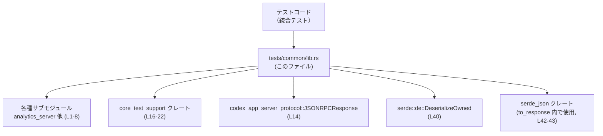
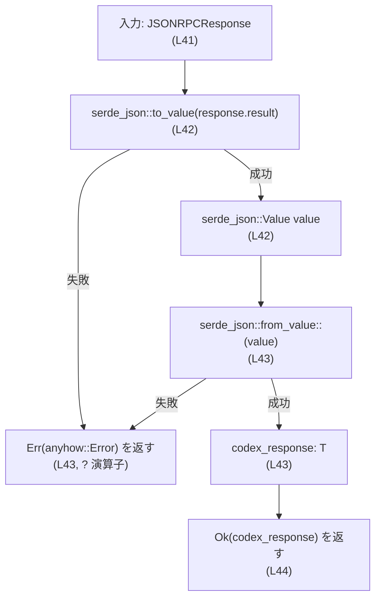
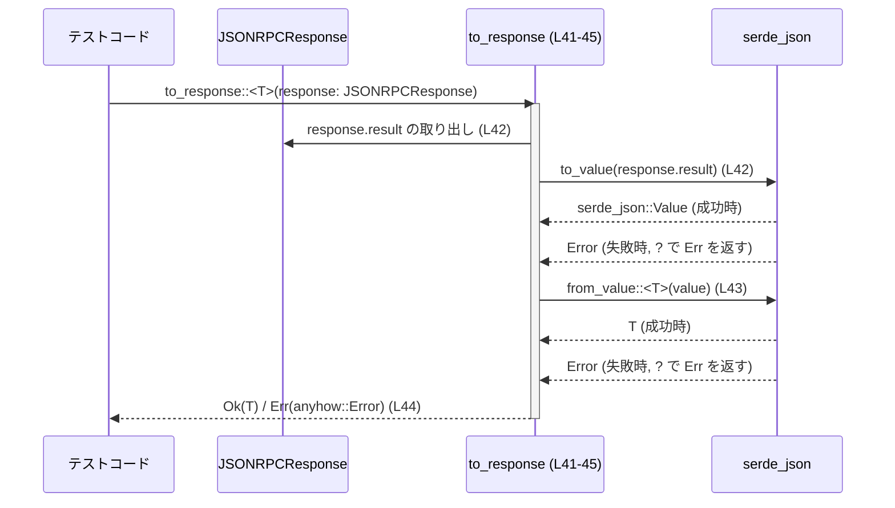

# app-server/tests/common/lib.rs コード解説

## 0. ざっくり一言

このファイルは、`tests/common` 配下の各種テスト用ユーティリティモジュールをまとめて再エクスポートし、さらに JSON-RPC 形式のレスポンスを任意の型に変換するヘルパー関数 `to_response` を提供するテスト用共通ライブラリです（`app-server/tests/common/lib.rs:L1-39, L41-45`）。

---

## 1. このモジュールの役割

### 1.1 概要

- 統合テスト（`tests/` ディレクトリ）で利用する **共通ヘルパー群の集約ポイント** として機能します（`mod` と多数の `pub use` 宣言より、`app-server/tests/common/lib.rs:L1-8, L9-39`）。
- サブモジュール（`analytics_server`, `auth_fixtures` など）で定義された関数・型、および外部クレート `core_test_support` のテスト支援関数を一括で再エクスポートします（`app-server/tests/common/lib.rs:L9-39`）。
- JSON-RPC プロトコル用の `JSONRPCResponse` から任意の所有型 `T` へ変換する `to_response` 関数を提供します（`app-server/tests/common/lib.rs:L14, L40-45`）。

### 1.2 アーキテクチャ内での位置づけ

このファイルは「テストコードから見た窓口」として、テスト用サブモジュールやテスト支援クレートを束ねています。



- テストコードは通常、この `lib.rs` を `use` して、必要なヘルパーを直接インポートする構造になっていると考えられます（`pub use` が多数存在するため）が、具体的な呼び出し側はこのチャンクには現れていません。
- `to_response` は `JSONRPCResponse` と `serde_json` を組み合わせた変換ヘルパーであり、このファイル唯一の自前ロジックです（`app-server/tests/common/lib.rs:L41-45`）。

### 1.3 設計上のポイント

コードから読み取れる設計上の特徴は次のとおりです。

- **集約モジュール構造**  
  - `mod analytics_server;` などでサブモジュールを宣言し（`app-server/tests/common/lib.rs:L1-8`）、必要なものだけ `pub use` しています（`app-server/tests/common/lib.rs:L9-39`）。
  - これにより、テストコード側は `use common::...` のように一か所からヘルパー類にアクセスできる構造になっています（呼び出し例自体はこのチャンクにはありません）。

- **状態を持たないヘルパー中心**  
  - このファイル内で定義されているのは関数 `to_response` のみであり、グローバルな状態や構造体フィールドなどは存在しません（`app-server/tests/common/lib.rs:L41-45`）。
  - したがって、このファイル単体としては共有状態やスレッドセーフティに関する複雑さはありません。

- **エラーハンドリング方針**  
  - `to_response` は `anyhow::Result<T>` を返し、内部で `serde_json::to_value` / `from_value` のエラーを `?` 演算子でそのまま伝播しています（`app-server/tests/common/lib.rs:L41-43`）。
  - パニックを起こすような `unwrap` 等は使われていません。

---

## 2. 主要な機能一覧

このモジュールが外部（他のテストコード）に対して提供している主な機能は次のとおりです。

- テスト用サブモジュールの取りまとめ（`analytics_server`, `auth_fixtures`, `config`, `mcp_process`, `mock_model_server`, `models_cache`, `responses`, `rollout` の宣言）（`app-server/tests/common/lib.rs:L1-8`）。
- 各サブモジュールに定義された代表的なテストヘルパーの再エクスポート  
  例: `start_analytics_events_server`, `ChatGptAuthFixture`, `create_mock_responses_server_sequence` など（`app-server/tests/common/lib.rs:L9-13, L15, L23-39`）。
- 外部クレート `core_test_support` からのテスト支援関数の再エクスポート  
  例: `format_with_current_shell`, `test_tmp_path` など（`app-server/tests/common/lib.rs:L16-22`）。
- JSON-RPC レスポンスから任意の型へ変換するヘルパー `to_response<T: DeserializeOwned>`（`app-server/tests/common/lib.rs:L14, L40-45`）。

### コンポーネント一覧（モジュール・再エクスポート）

| 名前 | 種別 | 公開 | 役割 / 用途（読み取れる範囲） | 根拠 |
|------|------|------|------------------------------|------|
| `analytics_server` | サブモジュール | 間接的（中の関数を再エクスポート） | テスト用の「analytics server」に関連する機能をまとめるモジュールと解釈できますが、実装はこのチャンクにはありません。 | `app-server/tests/common/lib.rs:L1, L9` |
| `auth_fixtures` | サブモジュール | 間接的 | 認証関連のテストフィクスチャを提供するモジュールと考えられますが、詳細は不明です。 | `app-server/tests/common/lib.rs:L2, L10-13` |
| `config` | サブモジュール | 間接的 | モックレスポンス設定の TOML を扱うテスト用モジュールと推測されます。 | `app-server/tests/common/lib.rs:L3, L15` |
| `mcp_process` | サブモジュール | 間接的 | `McpProcess` や `DEFAULT_CLIENT_NAME` を提供するモジュール。MCP 関連のプロセス制御テストヘルパーと考えられます。 | `app-server/tests/common/lib.rs:L4, L23-24` |
| `mock_model_server` | サブモジュール | 間接的 | モデルサーバーのモックを立てるためのユーティリティと解釈できます。 | `app-server/tests/common/lib.rs:L5, L25-27` |
| `models_cache` | サブモジュール | 間接的 | モデルキャッシュに関するテスト用書き込みヘルパーを持つモジュールと推測されます。 | `app-server/tests/common/lib.rs:L6, L28-29` |
| `responses` | サブモジュール | 間接的 | 各種 SSE/コマンド関連レスポンスの生成ユーティリティを提供するモジュールと解釈できます。 | `app-server/tests/common/lib.rs:L7, L30-35` |
| `rollout` | サブモジュール | 間接的 | ロールアウト関連のテストデータ生成／パス計算を行うモジュールと推測されます。 | `app-server/tests/common/lib.rs:L8, L36-39` |
| `start_analytics_events_server` | 関数（種別は推測） | 公開 (`pub use`) | analytics イベント用のテストサーバーを起動するヘルパーと考えられますが、シグネチャや挙動はこのチャンクにはありません。 | `app-server/tests/common/lib.rs:L9` |
| `ChatGptAuthFixture` | 型（種別は不明） | 公開 | ChatGPT 認証用のテストフィクスチャを表す型と推測されますが、構造は不明です。 | `app-server/tests/common/lib.rs:L10` |
| `ChatGptIdTokenClaims` | 型（種別は不明） | 公開 | ID トークンのクレームを表す型と解釈できますが、詳細は不明です。 | `app-server/tests/common/lib.rs:L11` |
| `encode_id_token` | 関数（推測） | 公開 | ID トークン文字列をエンコードするテスト用ヘルパーと推測されます。 | `app-server/tests/common/lib.rs:L12` |
| `write_chatgpt_auth` | 関数（推測） | 公開 | ChatGPT 認証情報を書き出すテスト用ヘルパーと考えられます。 | `app-server/tests/common/lib.rs:L13` |
| `write_mock_responses_config_toml` | 関数（推測） | 公開 | モックレスポンス設定の TOML ファイルを書き出すヘルパーと推測されます。 | `app-server/tests/common/lib.rs:L15` |
| `format_with_current_shell` 他 3 関数 | 関数 | 公開 | 現在のシェル環境に応じてコマンド等を整形するテスト支援関数と解釈できますが、詳細は `core_test_support` 側です。 | `app-server/tests/common/lib.rs:L16-19` |
| `test_path_buf_with_windows`, `test_tmp_path`, `test_tmp_path_buf` | 関数 | 公開 | テスト用のパスや一時ディレクトリを扱うヘルパー。Windows 向けユーティリティも含まれます。 | `app-server/tests/common/lib.rs:L20-22` |
| `DEFAULT_CLIENT_NAME` | 定数 or 静的変数（種別は不明） | 公開 | デフォルトクライアント名を表す値と考えられます。 | `app-server/tests/common/lib.rs:L23` |
| `McpProcess` | 型（種別は不明） | 公開 | MCP 関連のプロセス制御を行う型と推測されます。 | `app-server/tests/common/lib.rs:L24` |
| `create_mock_responses_server_*` 3 関数 | 関数 | 公開 | モデルサーバーのモックレスポンスサーバーを構築するテストヘルパーと考えられます。 | `app-server/tests/common/lib.rs:L25-27` |
| `write_models_cache`, `write_models_cache_with_models` | 関数 | 公開 | モデルキャッシュに関するテスト用ファイルを書き出すヘルパーと推測されます。 | `app-server/tests/common/lib.rs:L28-29` |
| `create_*_sse_response` 系 6 関数 | 関数 | 公開 | 各種 SSE (Server-Sent Events) 応答オブジェクトを作るテスト用ヘルパーと解釈できます。 | `app-server/tests/common/lib.rs:L30-35` |
| `create_fake_rollout*`, `rollout_path` | 関数 | 公開 | フェイクロールアウトデータの生成や関連ファイルパスの取得ヘルパーと推測されます。 | `app-server/tests/common/lib.rs:L36-39` |
| `JSONRPCResponse` | 型（外部） | 非公開（このモジュール内では `use` のみ） | JSON-RPC レスポンスを表す型。`to_response` の引数型として使用されます。 | `app-server/tests/common/lib.rs:L14` |
| `DeserializeOwned` | トレイト（外部） | 非公開（このモジュール内で境界として使用） | 所有データにデシリアライズ可能であることを表す `serde` のトレイト。 | `app-server/tests/common/lib.rs:L40` |
| `to_response` | 関数 | 公開 | `JSONRPCResponse` の `result` を任意の所有型 `T` に変換するヘルパー。 | `app-server/tests/common/lib.rs:L41-45` |

※ サブモジュールや外部クレート内の実装はこのチャンクには含まれていないため、用途説明には関数名・モジュール名からの推測を含みます。その場合は「推測」「解釈できます」と明示しています。

---

## 3. 公開 API と詳細解説

### 3.1 型一覧（構造体・列挙体など）

このファイル自体で新たな型定義は行っていませんが、テストコードから直接利用される「型もしくは型らしきもの」をまとめます。

| 名前 | 種別 | 公開 | 役割 / 用途 | 根拠 |
|------|------|------|-------------|------|
| `ChatGptAuthFixture` | 不明（型と推測） | 公開 (`pub use`) | ChatGPT 認証用のテストフィクスチャを表す型と推測されます。実体は `auth_fixtures` モジュール側です。 | `app-server/tests/common/lib.rs:L2, L10` |
| `ChatGptIdTokenClaims` | 不明（型と推測） | 公開 | ID トークンクレームを表す型と考えられますが、実装はこのチャンクにはありません。 | `app-server/tests/common/lib.rs:L2, L11` |
| `McpProcess` | 不明（型と推測） | 公開 | MCP プロセス操作のための型と解釈できます。 | `app-server/tests/common/lib.rs:L4, L24` |
| `DEFAULT_CLIENT_NAME` | 不明（定数と推測） | 公開 | デフォルトクライアント名を表す定数または静的値と考えられます。 | `app-server/tests/common/lib.rs:L4, L23` |
| `JSONRPCResponse` | 型（外部定義） | 非公開 | JSON-RPC レスポンス型。`to_response` の引数としてのみ使用されます。 | `app-server/tests/common/lib.rs:L14, L41` |

※ 種別（構造体・列挙体・タイプエイリアスなど）は、このファイル内ではわからないため「不明」としています。

### 3.2 関数詳細（重要関数）

このファイル内でロジックが定義されている関数は `to_response` の 1 つのみです。

#### `to_response<T: DeserializeOwned>(response: JSONRPCResponse) -> anyhow::Result<T>`

**概要**

- `JSONRPCResponse` 型の `response` から `result` フィールドを取り出し、一度 JSON 値 (`serde_json::Value`) にシリアライズした上で、任意の所有型 `T` にデシリアライズして返すテスト用ヘルパーです（`app-server/tests/common/lib.rs:L41-43`）。
- 変換に失敗した場合は `anyhow::Error` を返すため、テストコード側で `?` などにより簡潔にエラー処理できます。

**引数**

| 引数名 | 型 | 説明 | 根拠 |
|--------|----|------|------|
| `response` | `JSONRPCResponse` | JSON-RPC スタイルのレスポンスオブジェクト。内部から `result` フィールドが取り出され、変換対象になります。 | 宣言と `response.result` の参照より（`app-server/tests/common/lib.rs:L41-42`） |

※ `JSONRPCResponse` の具体的な型パラメータやフィールド構造は、このファイルには定義がなく不明です。`response.result` というフィールドが存在することだけがコードから分かります（`app-server/tests/common/lib.rs:L42`）。

**戻り値**

- 型: `anyhow::Result<T>`
  - 成功時: `Ok(T)` として変換後の値を返します（`app-server/tests/common/lib.rs:L43-44`）。
  - 失敗時: `serde_json::to_value` または `serde_json::from_value` から返されたエラーを `anyhow::Error` にラップした `Err` を返します（`?` 演算子の挙動、`app-server/tests/common/lib.rs:L42-43`）。

**内部処理の流れ（アルゴリズム）**

1. `response` から `result` フィールドを取り出し、`serde_json::to_value` に渡して `serde_json::Value` に変換します（`app-server/tests/common/lib.rs:L42`）。
2. `serde_json::to_value` がエラーを返した場合、そのエラーを `?` 演算子によりそのまま呼び出し元へ `Err(anyhow::Error)` として返します（`app-server/tests/common/lib.rs:L42`）。
3. 得られた `value: serde_json::Value` を `serde_json::from_value` に渡して、型 `T` へデシリアライズします（`app-server/tests/common/lib.rs:L43`）。
4. `serde_json::from_value` がエラーを返した場合も、`?` 演算子により `Err(anyhow::Error)` として呼び出し元へ伝播します（`app-server/tests/common/lib.rs:L43`）。
5. 正常に `T` へ変換できた場合は、その値を `codex_response` というローカル変数に束縛し、それを `Ok(codex_response)` として返します（`app-server/tests/common/lib.rs:L43-44`）。

簡易フローチャート（`to_response (L41-45)` の処理）



**Examples（使用例）**

以下は、テストコードから `to_response` を使って JSON-RPC レスポンスをアプリケーション独自の型に変換する想定例です。`JSONRPCResponse` や `MyResult` の具体的な定義はこのチャンクにはないため、疑似的な形で記述しています。

```rust
use anyhow::Result;                                          // anyhow::Result をインポート
use codex_app_server_protocol::JSONRPCResponse;              // JSONRPCResponse 型（外部クレート）
use crate::common::to_response;                              // このファイルで公開されているヘルパー
// use crate::common::start_analytics_events_server;         // 他のヘルパーも同様にインポート可能

// テストで使う結果型（実際には別モジュールで定義されているはずの型）
#[derive(serde::Deserialize, Debug)]                         // serde でデシリアライズ可能にする
struct MyResult {                                            // 任意の結果型
    message: String,                                         // 例: メッセージ文字列
    code: i32,                                               // 例: ステータスコード
}

fn convert_response_example(response: JSONRPCResponse) -> Result<MyResult> {
    // JSONRPCResponse の result を MyResult に変換する
    let result: MyResult = to_response(response)?;           // 変換に失敗すると Err(anyhow::Error) が返る
    Ok(result)                                              // 呼び出し元に結果を返す
}
```

このコードでは、`response` の `result` フィールドが JSON として `MyResult` にマッピング可能であれば `Ok(MyResult)` を返し、不整合があれば `Err` が返ります。

**Errors / Panics**

- **エラー（`Err(anyhow::Error)`）が返る条件**
  - `serde_json::to_value(response.result)` がエラーを返した場合  
    通常、これは `response.result` のシリアライズ実装がエラーを返した場合に発生します（`app-server/tests/common/lib.rs:L42`）。
  - `serde_json::from_value::<T>(value)` がエラーを返した場合  
    - `value` の JSON 構造が `T` の期待するフィールド構造と一致しない場合
    - 数値の範囲外など、`T` へのマッピングができない場合 などが一般的です（`app-server/tests/common/lib.rs:L43`）。
- **パニック**
  - この関数内では `unwrap` 等は使用されておらず、明示的な `panic!` 呼び出しもありません（`app-server/tests/common/lib.rs:L41-45`）。
  - したがって、通常の利用においてはエラーはすべて `Result` 経由で返され、パニックは発生しない前提です。

**Edge cases（エッジケース）**

この関数固有の典型的なエッジケースと、そのときの挙動は次のとおりです。

- `response.result` が `null`（JSON の `null` に相当）で、`T` が `Option<Something>` の場合  
  - `serde_json::from_value::<Option<Something>>` は `Ok(None)` を返すのが一般的です。
- `response.result` が `null` だが、`T` が非オプションの構造体や値型の場合  
  - `from_value` が型不一致としてエラーを返し、`to_response` も `Err(anyhow::Error)` を返します。
- `response.result` に存在しないフィールドを `T` が期待している場合  
  - そのフィールドが `Option` であれば `None` になるなど、`T` のデシリアライズ実装に依存します。  
  - 必須フィールドの場合はデシリアライズエラーとなり、`Err(anyhow::Error)` が返ります。
- `T` が `DeserializeOwned` を実装していない場合  
  - そもそもこの関数をコンパイル時に使用できません（型境界 `T: DeserializeOwned` により、`app-server/tests/common/lib.rs:L40-41`）。

※ 上記の挙動は `serde_json` と `serde::Deserialize` の一般的な挙動に基づきます。具体的なエラーメッセージなどは `serde_json` の実装に依存します。

**使用上の注意点**

- **型 `T` の定義と JSON 構造を揃える必要がある**  
  - `T` のフィールド名・型が `response.result` の JSON と対応していないと、デシリアライズエラーになります。
- **`JSONRPCResponse` の他フィールドは無視される**  
  - この関数は `response.result` フィールドのみを使用し、他のフィールド（例: エラー情報や ID などがあっても）にはアクセスしません（`app-server/tests/common/lib.rs:L42-43`）。
- **所有型へのデシリアライズのみサポート**  
  - 境界 `T: DeserializeOwned` により、`T` はライフタイムを持たない所有型に限られます（`app-server/tests/common/lib.rs:L40-41`）。  
    借用参照（`&str` など）を含む型への直接デシリアライズはできません。
- **パフォーマンス（テスト文脈での注意）**
  - 一度 `serde_json::Value` にシリアライズしてから再度デシリアライズしているため、純粋な変換に比べるとオーバーヘッドがあります（`app-server/tests/common/lib.rs:L42-43`）。  
  - ただし、このファイルは `tests/` 配下にあり、主にテスト用途であるため、通常は許容される前提の設計と考えられます。

### 3.3 その他の関数

このファイルでは多数の関数（と推定されるシンボル）が他モジュールから再エクスポートされていますが、実装は他ファイルです。

| 関数名 / シンボル名 | 出所 | 役割（1 行、推測を含む） | 根拠 |
|---------------------|------|--------------------------|------|
| `start_analytics_events_server` | `analytics_server` モジュール | テスト用の analytics イベントサーバーを起動するためのヘルパーと解釈できます。 | `app-server/tests/common/lib.rs:L1, L9` |
| `encode_id_token` | `auth_fixtures` モジュール | ID トークンをエンコードするテスト用関数と推測されます。 | `app-server/tests/common/lib.rs:L2, L12` |
| `write_chatgpt_auth` | `auth_fixtures` モジュール | ChatGPT 用の認証情報をテスト用に書き出すユーティリティと考えられます。 | `app-server/tests/common/lib.rs:L2, L13` |
| `write_mock_responses_config_toml` | `config` モジュール | モックレスポンス設定の TOML ファイルを生成するヘルパーと推測されます。 | `app-server/tests/common/lib.rs:L3, L15` |
| `format_with_current_shell` 系 4 関数 | `core_test_support` クレート | 現在のシェル環境に適したコマンド文字列を整形するテスト支援関数群と解釈できます。 | `app-server/tests/common/lib.rs:L16-19` |
| `test_path_buf_with_windows`, `test_tmp_path`, `test_tmp_path_buf` | `core_test_support` クレート | テスト用の作業ディレクトリ・一時パスを扱う関数群と考えられます。 | `app-server/tests/common/lib.rs:L20-22` |
| `create_mock_responses_server_repeating_assistant` 他 2 関数 | `mock_model_server` モジュール | モデルサーバーモックを構成するためのヘルパーと推測されます。 | `app-server/tests/common/lib.rs:L5, L25-27` |
| `write_models_cache`, `write_models_cache_with_models` | `models_cache` モジュール | モデル情報のキャッシュファイルを作成するテストヘルパーと考えられます。 | `app-server/tests/common/lib.rs:L6, L28-29` |
| `create_*_sse_response` 系 6 関数 | `responses` モジュール | 各種 SSE 応答を生成するテスト用ファクトリ関数と推測されます。 | `app-server/tests/common/lib.rs:L7, L30-35` |
| `create_fake_rollout*`, `rollout_path` | `rollout` モジュール | フェイクのロールアウトデータや、ロールアウト関連パスを扱うテストヘルパーと考えられます。 | `app-server/tests/common/lib.rs:L8, L36-39` |

※ これらの関数のシグネチャ・内部処理はこのチャンクには存在せず不明です。

---

## 4. データフロー

ここでは、このファイル内で唯一ロジックを持つ `to_response` を中心に、テストコードからの典型的なデータフローを示します。

### `to_response (L41-45)` を用いた変換フロー

テストコードがアプリケーションから受け取った `JSONRPCResponse` を、期待するドメイン型 `T` に変換する流れは次のようになります。



要点:

- `JSONRPCResponse` のうち、このヘルパーが扱うのは `result` フィールドのみです（`app-server/tests/common/lib.rs:L42`）。
- `serde_json` クレートを利用して一旦汎用 JSON 値 (`Value`) に変換し、その後目的の型 `T` に再変換する二段階方式をとっています（`app-server/tests/common/lib.rs:L42-43`）。
- エラーはすべて `Result` 経由で呼び出し元のテストコードに伝えられます（`?` 演算子、`app-server/tests/common/lib.rs:L42-43`）。

---

## 5. 使い方（How to Use）

### 5.1 基本的な使用方法

テストコードでの典型的な利用フローは、以下のようになります。

1. テスト対象のコードから `JSONRPCResponse` を取得する。
2. この `common` モジュールを通じて `to_response` をインポートする。
3. `to_response::<期待する型>` を呼び出し、`Result` を処理する。

```rust
use anyhow::Result;                                          // anyhow::Result を利用
use codex_app_server_protocol::JSONRPCResponse;              // テスト対象から返るレスポンス型
use crate::common::to_response;                              // このファイルからのヘルパー

#[derive(serde::Deserialize, Debug)]
struct GetUserResponse {                                     // 期待するレスポンスの型
    id: String,                                              // ユーザー ID
    name: String,                                            // ユーザー名
}

fn parse_rpc_response(response: JSONRPCResponse) -> Result<GetUserResponse> {
    // JSONRPCResponse.result を GetUserResponse に変換
    let parsed: GetUserResponse = to_response(response)?;    // 失敗すると Err(anyhow::Error)
    Ok(parsed)
}
```

この例では、`GetUserResponse` の構造が `response.result` の JSON に対応している必要があります。

### 5.2 よくある使用パターン

1. **テストコードからのインポート窓口として利用**

```rust
// tests/ 直下の統合テストから
use crate::common::{
    to_response,                                             // JSONRPCResponse -> T 変換
    start_analytics_events_server,                           // analytics サーバー起動ヘルパー
    test_tmp_path,                                           // 一時ディレクトリ作成ヘルパー
};
```

- `common` モジュールから必要なヘルパーをまとめてインポートすることで、テストコード側の `use` 宣言を整理できます（`app-server/tests/common/lib.rs:L9-39`）。

1. **エラーを `?` で伝播させる**

```rust
fn test_something(response: JSONRPCResponse) -> Result<()> {
    let parsed: GetUserResponse = to_response(response)?;    // 変換エラーはここで Err に
    assert_eq!(parsed.name, "alice");                        // 期待する値を検証
    Ok(())
}
```

- `to_response` が `anyhow::Result<T>` を返すため、テスト関数自体も `anyhow::Result<()>` にしておくと、中で `?` を多用できます（`app-server/tests/common/lib.rs:L41`）。

### 5.3 よくある間違い

このファイルから推測される、`to_response` 周りの誤用例です。

```rust
// 誤り例: 実際の JSON 構造と合わない型で変換してしまう
#[derive(serde::Deserialize)]
struct WrongType {
    // 実際の result には存在しないフィールドを期待している
    non_existent: String,
}

fn bad_usage(response: JSONRPCResponse) -> anyhow::Result<()> {
    // コンパイルは通るが、実行時にデシリアライズエラーになる可能性が高い
    let _parsed: WrongType = to_response(response)?;         // エラー: Err(anyhow::Error)
    Ok(())
}

// 正しい例: 実際の JSON 構造に合わせた型を定義する
#[derive(serde::Deserialize)]
struct CorrectType {
    // 実際の result に存在するフィールドのみを定義する
    message: String,
}

fn good_usage(response: JSONRPCResponse) -> anyhow::Result<()> {
    let parsed: CorrectType = to_response(response)?;        // 正しくパースされる
    assert!(!parsed.message.is_empty());
    Ok(())
}
```

- このように、コンパイル時には検出されない JSON 構造とのミスマッチが、実行時の `Err(anyhow::Error)` として現れる点に注意が必要です（`serde_json::from_value` を利用しているため、`app-server/tests/common/lib.rs:L43`）。

### 5.4 使用上の注意点（まとめ）

- このモジュールは `tests/` 以下にあり、本来は **テスト専用** のヘルパーである点に留意します。
- `to_response` は `result` フィールドのみを扱い、その他のフィールド（エラー情報など）は無視されます（`app-server/tests/common/lib.rs:L42-43`）。
- 変換対象型 `T` は `DeserializeOwned` を実装している必要があり、所有型でなければなりません（`app-server/tests/common/lib.rs:L40-41`）。
- JSON 構造と `T` の型定義の不整合は、コンパイルエラーではなく **実行時のデシリアライズエラー** として現れます。
- スレッドセーフティについて、このファイルのコードはグローバル状態を持たないため、`to_response` 自体は並列に呼び出しても問題がない設計です（`app-server/tests/common/lib.rs:L41-45`）。ただし、`JSONRPCResponse` の実装や呼び出し元のコードに依存する部分はこのチャンクには現れていません。

---

## 6. 変更の仕方（How to Modify）

### 6.1 新しい機能を追加する場合

この共通モジュールに新しいテストヘルパーを追加したい場合の典型的な手順です。

1. **新しいサブモジュールファイルを作成する**  
   - 例: `tests/common/new_helper.rs` を作成し、その中にヘルパー関数や型を定義します。  
     （Rust のモジュール規則により、`mod new_helper;` に対応するファイルです。）
2. **`lib.rs` にモジュール宣言を追加する**  

   ```rust
   mod new_helper;                                          // 新しいモジュールの宣言
   ```

   - 追加位置は既存の `mod` 群（`app-server/tests/common/lib.rs:L1-8`）と同様の場所が自然です。
3. **公開したい関数・型を `pub use` で再エクスポートする**  

   ```rust
   pub use new_helper::some_helper_function;                // テストコードから直接使えるようにする
   ```

4. **テストコード側で `crate::common::some_helper_function` を利用する**  
   - これにより、他のヘルパーと同じ窓口から利用できます。

### 6.2 既存の機能を変更する場合

1. **`to_response` のインターフェース変更**

   - 戻り値型やエラー型を変更する場合、これを利用しているすべてのテストコードに影響します。
   - 特に、`anyhow::Result<T>` から別のエラー型に変更する場合、テスト関数のシグネチャやエラー処理 (`?` の利用可否) が変わるため、使用箇所の洗い出しが必要です。

2. **`pub use` の対象変更**

   - 例えば `pub use responses::create_shell_command_sse_response;` を削除すると、それをインポートしているテストコードはコンパイルエラーになります（`app-server/tests/common/lib.rs:L35`）。
   - 関数の移動やリネームを行う場合、元のモジュール側と `lib.rs` 双方の変更が必要です。

3. **契約（前提条件）に注意すべき点**

   - `to_response` については、「`response.result` が `T` と互換性のある JSON である」ことが前提条件です。
   - サブモジュールのヘルパーについては、このチャンクからは詳細な前提条件は分かりませんが、一般に「テスト用のファイルパス」「一時ディレクトリ」「モックサーバー」などに関する契約が存在すると考えられます（名前からの推測）。

4. **関連するテストの再確認**

   - このファイル自体にはテスト関数は含まれていません（`app-server/tests/common/lib.rs:L1-45`）。
   - 変更後は、このファイルを経由してヘルパーを利用しているすべてのテストファイルを再ビルド・再実行して確認する必要があります。

---

## 7. 関連ファイル

このモジュールと密接に関係するファイル・ディレクトリは、`mod` 宣言や `pub use` から次のように推定されます。

| パス（推定） | 役割 / 関係 | 根拠 |
|-------------|------------|------|
| `app-server/tests/common/analytics_server.rs` または `app-server/tests/common/analytics_server/mod.rs` | `mod analytics_server;` の実体。`start_analytics_events_server` を定義していると考えられます。 | `app-server/tests/common/lib.rs:L1, L9` |
| `app-server/tests/common/auth_fixtures.rs` または `auth_fixtures/mod.rs` | `ChatGptAuthFixture` や `encode_id_token` などの認証関連テストフィクスチャを定義するモジュール。 | `app-server/tests/common/lib.rs:L2, L10-13` |
| `app-server/tests/common/config.rs` | `write_mock_responses_config_toml` を提供する設定系モジュールと推測されます。 | `app-server/tests/common/lib.rs:L3, L15` |
| `app-server/tests/common/mcp_process.rs` | `McpProcess` や `DEFAULT_CLIENT_NAME` の定義元。 | `app-server/tests/common/lib.rs:L4, L23-24` |
| `app-server/tests/common/mock_model_server.rs` | モックモデルサーバー関連ヘルパーの定義元。 | `app-server/tests/common/lib.rs:L5, L25-27` |
| `app-server/tests/common/models_cache.rs` | モデルキャッシュ書き込みヘルパーの定義元。 | `app-server/tests/common/lib.rs:L6, L28-29` |
| `app-server/tests/common/responses.rs` | 各種 SSE レスポンス生成関数の定義元。 | `app-server/tests/common/lib.rs:L7, L30-35` |
| `app-server/tests/common/rollout.rs` | フェイクロールアウトデータや `rollout_path` の定義元。 | `app-server/tests/common/lib.rs:L8, L36-39` |
| `core_test_support` クレート | パスユーティリティやシェルコマンド整形などのテスト支援機能を提供し、このファイルから再エクスポートされています。 | `app-server/tests/common/lib.rs:L16-22` |
| `codex_app_server_protocol` クレート | `JSONRPCResponse` 型の定義元。`to_response` の引数型として利用されます。 | `app-server/tests/common/lib.rs:L14` |

※ 上記のファイルパスは Rust のモジュール規則に基づく推定であり、実際の配置はプロジェクト構成によって異なる可能性があります。このチャンクにはサブモジュールの中身は含まれていません。
