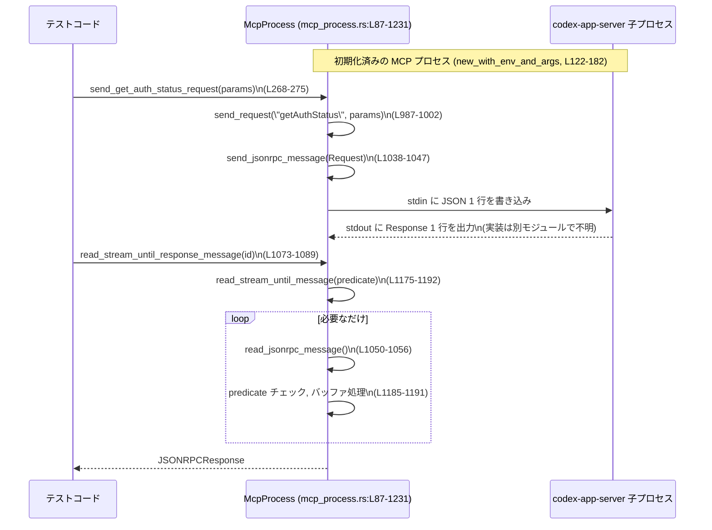

# app-server/tests/common/mcp_process.rs

## 0. ざっくり一言

`McpProcess` はテスト用に `codex-app-server` バイナリを子プロセスとして起動し、JSON-RPC (MCP プロトコル) を介して非同期にリクエスト・レスポンス・通知をやり取りするためのヘルパです（`mcp_process.rs:L87-97, L122-182`）。

---

## 1. このモジュールの役割

### 1.1 概要

- このモジュールは **テストから `codex-app-server` を直接サブプロセス起動し、JSON-RPC ベースの MCP プロトコルをたたく** ためのラッパを提供します（`mcp_process.rs:L122-182`）。
- 主要な責務は次のとおりです。
  - 子プロセスの起動・標準入出力のセットアップ・stderr のフォワード
  - JSON-RPC メッセージ（リクエスト／レスポンス／エラー／通知）の送受信
  - プロトコルごとの多数の `send_*_request` ヘルパ
  - メッセージストリームから条件に合うメッセージを取り出すバッファリングロジック
  - テスト終了時の決定論的なプロセス終了処理（`Drop` 実装）

### 1.2 アーキテクチャ内での位置づけ

テストコードと実際の `codex-app-server` バイナリの間に立つ「軽量クライアント」として振る舞います。

```mermaid
flowchart LR
    Test["テストコード\n(各 tests/*)"]
        --> MCP["McpProcess\n(mcp_process.rs:L87-1231)"]

    MCP -->|spawn, stdin/stdout, stderr| Child["codex-app-server 子プロセス\n(cargo_bin(\"codex-app-server\"))\n(mcp_process.rs:L122-182)"]

    subgraph JSON-RPC over stdio
        MCP <--> Child
    end
```

- `Test` は `McpProcess::new` / `new_with_env` などでクライアントを構築し、`send_*_request` や `read_stream_until_*` で対話します（`mcp_process.rs:L101-120, L268-985, L1058-1155`）。
- `McpProcess` は標準入出力経由で JSON-RPC メッセージを送受信します（`mcp_process.rs:L1038-1056`）。
- stderr は `tokio::spawn` されたタスクで読み取り、テスト側 stderr にそのまま流します（`mcp_process.rs:L165-173`）。

### 1.3 設計上のポイント

- **状態管理**
  - 子プロセスハンドル `process: Child`、stdin/stdout ハンドル、ペンディングメッセージキュー `VecDeque<JSONRPCMessage>` を保持する有状態の構造体です（`mcp_process.rs:L87-97`）。
  - 次のリクエスト ID を `AtomicI64` で採番しますが、メソッドはすべて `&mut self` なので実質シングルスレッド使用です（`mcp_process.rs:L87-88, L987-993`）。
- **エラーハンドリング**
  - ほぼすべての公開メソッドは `anyhow::Result` を返し、I/O / JSON デコード / プロトコル不整合（ID ミスマッチなど）を早期に `bail!` します（例: `initialize_with_params`, `mcp_process.rs:L226-265`）。
  - パニック (`unreachable!`) は「ロジック上ありえないはずの分岐に入った場合」のみで使用されます（例: `initialize`, `read_stream_until_*`, `mcp_process.rs:L193-195, L1065-1067, L1085-1087`）。
- **並行性**
  - プロセスとの I/O はすべて `tokio` の非同期 I/O で行われます（`mcp_process.rs:L1038-1047, L1050-1053`）。
  - `McpProcess` のメソッドは `&mut self` を要求するため、同一インスタンスを複数の async タスクから同時に叩くことはコンパイル時に防がれます。
  - stderr の読み出しのみは別タスクに切り出し（`tokio::spawn`）、標準エラーに行単位で転送します（`mcp_process.rs:L167-173`）。
- **ストリーム処理**
  - 1 行ごとに JSON を読む「行区切り JSON-RPC」です（`read_jsonrpc_message`, `mcp_process.rs:L1050-1055`）。
  - 条件に合わないメッセージは `pending_messages` にバッファし、後続の `read_stream_until_*` 呼び出しで再利用します（`mcp_process.rs:L1175-1192`）。
- **クリーンアップ**
  - `kill_on_drop(true)` と `Drop` 実装で、テスト終了時の子プロセス LEAK を抑えるための同期的な終了待ちを行います（`mcp_process.rs:L151-154, L1233-1274`）。

---

## 2. 主要な機能一覧

- 子プロセス起動と環境設定: `new`, `new_with_env`, `new_with_args`, `new_with_env_and_args`（`mcp_process.rs:L101-182`）
- MCP 初期化ハンドシェイク: `initialize`, `initialize_with_client_info`, `initialize_with_capabilities`（`mcp_process.rs:L184-224`）
- JSON-RPC リクエスト送信ヘルパ:
  - アカウント、スレッド、モデル、プラグイン、FS、コマンド実行など多数の `send_*_request`（`mcp_process.rs:L268-855`）
  - 汎用ヘルパ `send_raw_request`（`mcp_process.rs:L558-565`）
- 高レベル操作:
  - `interrupt_turn_and_wait_for_aborted`: 進行中の turn を中断し、ターミナル通知まで（もしくは既存バッファ）を待つ（`mcp_process.rs:L685-741`）
  - fuzzy file search セッションの開始・更新・終了ラッパ（`mcp_process.rs:L898-985`）
- JSON-RPC メッセージ送受信の共通ロジック:
  - `send_request`（ID 採番 + Request 構築）（`mcp_process.rs:L987-1002`）
  - `send_response`, `send_error`, `send_notification`（`mcp_process.rs:L1004-1036`）
  - `send_jsonrpc_message`, `read_jsonrpc_message`（`mcp_process.rs:L1038-1056`）
- ストリームから条件付きでメッセージを取り出す:
  - `read_stream_until_request_message` / `_response_message` / `_error_message` / `_notification_message` / `_matching_notification` / `read_next_message`（`mcp_process.rs:L1058-1155`）
  - 内部ヘルパ `read_stream_until_message`, `take_pending_message`, `pending_turn_completed_notification`, `message_request_id`（`mcp_process.rs:L1175-1230`）
- メッセージバッファ管理:
  - `clear_message_buffer`, `pending_notification_methods`（`mcp_process.rs:L1157-1173`）
- 子プロセスの同期終了 `Drop` 実装（`mcp_process.rs:L1233-1274`）

---

## 3. 公開 API と詳細解説

### 3.1 型一覧（構造体・定数）

| 名前 | 種別 | 公開 | 役割 / 用途 | 根拠 |
|------|------|------|-------------|------|
| `McpProcess` | 構造体 | `pub` | MCP サーバー子プロセスとの JSON-RPC 通信用クライアント。子プロセスハンドルと I/O、メッセージバッファを保持する。 | `mcp_process.rs:L87-97` |
| `DEFAULT_CLIENT_NAME` | 定数 `&'static str` | `pub` | `initialize` 時に使用するデフォルトの `ClientInfo.name`。テスト用クライアント名 `"codex-app-server-tests"`。 | `mcp_process.rs:L99` |

`McpProcess` のフィールド:

| フィールド | 型 | 説明 | 根拠 |
|-----------|----|------|------|
| `next_request_id` | `AtomicI64` | 送信する JSON-RPC リクエスト ID（整数）の採番に使用。`Relaxed` オーダリング。 | `mcp_process.rs:L87-88, L987-993` |
| `process` | `Child` | `tokio::process::Command` で起動した子プロセスへのハンドル。`kill_on_drop(true)` が設定される。 | `mcp_process.rs:L93, L151-154` |
| `stdin` | `Option<ChildStdin>` | 子プロセス stdin。閉じることで EOF を送り、終了を促す。 | `mcp_process.rs:L94, L1038-1046, L1251` |
| `stdout` | `BufReader<ChildStdout>` | 子プロセス stdout をラップした行バッファ付きリーダ。行単位 JSON を読む。 | `mcp_process.rs:L95, L159-164, L1050-1053` |
| `pending_messages` | `VecDeque<JSONRPCMessage>` | 読み取ったが条件にマッチしなかった JSON-RPC メッセージのバッファ。 | `mcp_process.rs:L96, L1175-1191` |

### 3.2 関数詳細（重要な 7 件）

#### `async fn new_with_env_and_args(codex_home: &Path, env_overrides: &[(&str, Option<&str>)], args: &[&str]) -> anyhow::Result<McpProcess>`

**概要**

- `codex-app-server` バイナリを子プロセスとして起動し、標準入出力を JSON-RPC 通信用にセットアップした `McpProcess` を生成します（`mcp_process.rs:L122-182`）。
- テスト専用の `CODEX_HOME`, `RUST_LOG` などの環境変数設定、任意の環境上書き・削除、追加の CLI 引数を指定できます。

**引数**

| 引数名 | 型 | 説明 |
|--------|----|------|
| `codex_home` | `&Path` | `codex-app-server` を起動するカレントディレクトリ。`CODEX_HOME` 環境変数にも設定されます。 |
| `env_overrides` | `&[(&str, Option<&str>)]` | 子プロセス専用の環境変数の追加・上書き・削除設定。`(key, Some(val))` で設定/上書き、`(key, None)` で削除。 |
| `args` | `&[&str]` | 子プロセスに渡す追加 CLI 引数。 |

**戻り値**

- 成功時: 初期化済みの `McpProcess` インスタンス。
- 失敗時: `anyhow::Error`（バイナリ未発見、spawn 失敗、stdin/stdout の取得失敗など）。

**内部処理の流れ**

1. `codex_utils_cargo_bin::cargo_bin("codex-app-server")` でバイナリパスを取得し、Tokio の `Command` を生成（`mcp_process.rs:L127-129`）。
2. `stdin`, `stdout`, `stderr` を `Stdio::piped()` に設定し、`current_dir`, `CODEX_HOME`, `RUST_LOG` を設定。内部用 env を `env_remove` でクリア（`mcp_process.rs:L131-138`）。
3. `env_overrides` をループし、`Some(val)` は `env` で設定、`None` は `env_remove` で削除（`mcp_process.rs:L140-148`）。
4. `kill_on_drop(true)` を指定して `spawn()`。`Child::stdin` / `stdout` を `take()` し、存在しなければエラー（`mcp_process.rs:L151-163`）。
5. `stdout` を `BufReader` にラップ（`mcp_process.rs:L163-164`）。
6. `stderr` があれば `BufReader::new(stderr).lines()` を `tokio::spawn` で非同期読み出しし、各行を `eprintln!("[mcp stderr] {line}")` に出力（`mcp_process.rs:L165-173`）。
7. `McpProcess` 構造体をフィールド初期化して返却（`mcp_process.rs:L175-181`）。

**Examples（使用例）**

```rust
use std::path::Path;
use app_server::tests::common::mcp_process::McpProcess;

#[tokio::test]
async fn spawn_with_custom_env() -> anyhow::Result<()> {
    let codex_home = Path::new("/tmp/codex-home");

    // 特定の環境変数を上書きし、別の環境変数を削除
    let env_overrides = [
        ("HTTP_PROXY", Some("http://localhost:8080")),
        ("UNWANTED_ENV", None),
    ];

    let mcp = McpProcess::new_with_env_and_args(
        codex_home,
        &env_overrides,
        &["--log-format=json"],
    )
    .await?; // 子プロセス起動

    // mcp を使ったテストを実施…

    Ok(())
}
```

**Errors / Panics**

- `cargo_bin` がバイナリを見つけられない: `context("should find binary for codex-app-server")` 付きのエラー（`mcp_process.rs:L127-128`）。
- `spawn()` 失敗: `context("codex-mcp-server proc should start")` 付きエラー（`mcp_process.rs:L151-154`）。
- `stdin` / `stdout` が `None`: `format_err!("mcp should have stdin/stdout fd")` でエラー（`mcp_process.rs:L155-162`）。
- パニック要素は含まず、すべて `anyhow::Error` に包んで返します。

**Edge cases（エッジケース）**

- `env_overrides` 空: 単に追加/削除が起きないだけで問題ありません（`mcp_process.rs:L140-148`）。
- `stderr` パイプが無い場合: `if let Some(stderr)` に入らないだけで、そのまま処理継続（`mcp_process.rs:L167`）。
- 非 UTF-8 な stderr 行: `stderr_reader.next_line()` が `Err` となった場合ループを `while let Ok(Some(line))` が止まり、静かに終了します（`mcp_process.rs:L169-171`）。

**使用上の注意点**

- 非同期関数のため、Tokio ランタイム上で `await` する必要があります。
- `McpProcess` 自体はスレッドセーフではありません（`&mut self` インターフェース）。1 インスタンスを複数タスクから同時に使わない前提です。
- Drop 時に同期的な待ち（最大約 5 秒+α）が発生するため、大量に同時生成・破棄するテストでは実行時間が延びる可能性があります（`mcp_process.rs:L1233-1273`）。

---

#### `async fn initialize_with_params(&mut self, params: InitializeParams) -> anyhow::Result<JSONRPCMessage>`

**概要**

- MCP プロトコルの `initialize` リクエストを送信し、対応するレスポンスまたはエラーメッセージを 1 件読み取って返します（`mcp_process.rs:L226-265`）。
- ID 不一致や不正なメッセージ種類を厳密にチェックし、テストでプロトコル違反を検出できるようになっています。

**引数**

| 引数名 | 型 | 説明 |
|--------|----|------|
| `params` | `InitializeParams` | `client_info`, `capabilities` を含む初期化パラメータ。 |

**戻り値**

- 成功時: `JSONRPCMessage::Response` または `JSONRPCMessage::Error` を、そのまま `JSONRPCMessage` として返却します。
- ID やメッセージ種別が期待と異なる場合は `anyhow::Error`。

**内部処理の流れ**

1. `InitializeParams` を `serde_json::Value` にシリアライズし、`Some(...)` でラップ（`mcp_process.rs:L230`）。
2. `send_request("initialize", params)` でリクエスト送信し、整数 ID を取得（`mcp_process.rs:L231`）。
3. `read_jsonrpc_message()` で 1 行だけメッセージを読み取る（`mcp_process.rs:L232`）。
4. マッチング:
   - `JSONRPCMessage::Response(response)` の場合:
     - `response.id` が先ほどの ID と一致するかチェック。違えば `bail!`（`mcp_process.rs:L234-241`）。
     - 一致したら `ClientNotification::Initialized` を通知として送信（`send_notification` 使用）（`mcp_process.rs:L243-245`）。
     - `JSONRPCMessage::Response(response)` として返却（`mcp_process.rs:L247`）。
   - `JSONRPCMessage::Error(error)` の場合:
     - `error.id` が一致するかチェックし、違えば `bail!`（`mcp_process.rs:L249-256`）。
     - 一致すれば `JSONRPCMessage::Error(error)` を返却（`mcp_process.rs:L257-258`）。
   - `Notification` / `Request` が来た場合: `anyhow::bail!` でエラーとする（`mcp_process.rs:L259-264`）。

**Examples（使用例）**

`initialize` 高レベルラッパはこの関数を内包して使います。

```rust
#[tokio::test]
async fn init_with_custom_capabilities() -> anyhow::Result<()> {
    use codex_app_server_protocol::{ClientInfo, InitializeCapabilities};

    let codex_home = std::path::Path::new("/tmp/codex-home");
    let mut mcp = McpProcess::new(codex_home).await?;

    let msg = mcp
        .initialize_with_capabilities(
            ClientInfo {
                name: "custom-client".into(),
                title: Some("My Test Client".into()),
                version: "0.2.0".into(),
            },
            Some(InitializeCapabilities {
                experimental_api: false,
                ..Default::default()
            }),
        )
        .await?; // JSONRPCMessage::Response or ::Error

    println!("initialize result: {msg:?}");
    Ok(())
}
```

**Errors / Panics**

- `send_request` / `read_jsonrpc_message` が I/O・シリアライズ・デシリアライズで失敗した場合、そのままラップされて返ります（`mcp_process.rs:L230-233`）。
- `response.id` / `error.id` が期待 ID と異なる場合、`bail!("initialize response/error id mismatch...")`（`mcp_process.rs:L235-240, L250-255`）。
- `Notification` / `Request` を受け取った場合、`"unexpected JSONRPCMessage::..."` で `bail!`（`mcp_process.rs:L259-264`）。
- `unreachable!` は使用していません（パニックは発生しません）。

**Edge cases**

- サーバーが `initialize` に対してエラーを返す: 正常系として `JSONRPCMessage::Error` が返り、呼び出し側でハンドリング可能です（`mcp_process.rs:L249-258`）。
- サーバーが先に通知を送ってくる実装には対応していません。最初の 1 メッセージが Response か Error である前提でテストを組み立てる必要があります。

**使用上の注意点**

- この関数はストリーム全体から 1 行だけ読むため、同時に `read_stream_until_*` を並行で使うようなストリームの「共有読み出し」は行っていません。初期化フェーズが終わってから汎用のストリーム読み出しを使う構成になっています。
- ID 一致チェックがあるため、テストでプロトコル実装のバグを検出しやすくなっていますが、複数のリクエストを同時に投げてレスポンス順序が複雑になるケースには向きません（単一リクエスト想定）。

---

#### `async fn send_request(&mut self, method: &str, params: Option<serde_json::Value>) -> anyhow::Result<i64>`

**概要**

- JSON-RPC `Request` メッセージを構築し、子プロセスに送信する内部ヘルパです（`mcp_process.rs:L987-1002`）。
- 多数の `send_*_request` がこの関数を通じてメソッド名とパラメータを渡しています。

**引数**

| 引数名 | 型 | 説明 |
|--------|----|------|
| `method` | `&str` | JSON-RPC メソッド名（例: `"thread/start"`）。 |
| `params` | `Option<serde_json::Value>` | パラメータ JSON。`None` の場合はパラメータ無しリクエスト。 |

**戻り値**

- 成功時: 採番された整数リクエスト ID (`i64`)。
- 失敗時: メッセージ送信の失敗を表す `anyhow::Error`。

**内部処理の流れ**

1. `next_request_id.fetch_add(1, Ordering::Relaxed)` で `i64` ID を採番（`mcp_process.rs:L992-993`）。
2. `JSONRPCRequest { id: RequestId::Integer(request_id), method: method.to_string(), params, trace: None }` を生成し、`JSONRPCMessage::Request` でラップ（`mcp_process.rs:L994-999`）。
3. `send_jsonrpc_message(message).await?` で実際に子プロセスに書き込み（`mcp_process.rs:L1000`）。
4. リクエスト ID を返却（`mcp_process.rs:L1001-1002`）。

**Examples（使用例）**

通常は高レベルヘルパを介して利用されます。

```rust
// 低レベルに任意メソッドを投げたい場合
let id = mcp.send_request("custom/method", Some(serde_json::json!({ "foo": 1 }))).await?;
let response = mcp
    .read_stream_until_response_message(RequestId::Integer(id))
    .await?;
```

**Errors / Panics**

- `send_jsonrpc_message` がエラー（stdin クローズ、シリアライズ失敗など）になると、そのまま `anyhow::Error` として返ります（`mcp_process.rs:L1000`）。
- パニックはありません。

**Edge cases**

- `next_request_id` が `i64` の最大値を超えた場合の挙動はコードからは定義されていませんが、テスト用途であり通常の利用では到達しないと想定されます。
- `method` が空文字列でも送信できますが、サーバー側がどう扱うかは不明です。

**使用上の注意点**

- ID 採番は `Ordering::Relaxed` ですが、メソッドは `&mut self` で同期的に呼ばれる前提なのでレースは発生しません。
- この関数単体ではレスポンスを待ちません。レスポンスは別途 `read_stream_until_*` 系で待機する必要があります。

---

#### `async fn send_jsonrpc_message(&mut self, message: JSONRPCMessage) -> anyhow::Result<()>`

**概要**

- 任意の `JSONRPCMessage`（Request / Response / Error / Notification）を JSON にシリアライズし、子プロセスの stdin に 1 行として書き出します（`mcp_process.rs:L1038-1047`）。

**引数**

| 引数名 | 型 | 説明 |
|--------|----|------|
| `message` | `JSONRPCMessage` | 送信する JSON-RPC メッセージ。 |

**戻り値**

- 成功時: `Ok(())`。
- 失敗時: シリアライズや書き込み失敗を含む `anyhow::Error`。

**内部処理の流れ**

1. デバッグ用に `eprintln!("writing message to stdin: {message:?}")` を出力（`mcp_process.rs:L1039`）。
2. `self.stdin.as_mut()` で stdin ハンドルを取得。`None` の場合は `bail!("mcp stdin closed")`（`mcp_process.rs:L1040-1042`）。
3. `serde_json::to_string(&message)?` で JSON 文字列に変換（`mcp_process.rs:L1043`）。
4. `write_all(payload.as_bytes())` → `write_all(b"\n")` → `flush()` の順に非同期書き込み（`mcp_process.rs:L1044-1046`）。
5. `Ok(())` を返却（`mcp_process.rs:L1047`）。

**Examples（使用例）**

`send_request`, `send_response`, `send_error`, `send_notification` から呼ばれます（`mcp_process.rs:L1000, L1009-1011, L1018-1020, L1027-1035`）。

**Errors / Panics**

- stdin が既にクローズされている場合: `"mcp stdin closed"` で `bail!`（`mcp_process.rs:L1040-1042`）。
- シリアライズ (`serde_json::to_string`) 失敗時: そのまま `anyhow::Error` に昇格（`mcp_process.rs:L1043`）。
- 書き込みや flush 失敗時: `AsyncWriteExt` のエラーが `anyhow` にラップされます。

**Edge cases**

- 長大なメッセージや大量送信の場合も、1 メッセージごとに `flush()` しているため、OS レベルでバッファリングされるとはいえ遅延は増えます。
- 多数のメッセージを高速に送りたいケースでは、`flush()` の頻度を減らすとパフォーマンス向上の余地がありますが、本コードはテスト用途のため常に flush します。

**使用上の注意点**

- テスト失敗時の解析のために `eprintln!` でメッセージ内容がログに残る設計になっています。機密情報が含まれるテストでは stderr の取り扱いに注意が必要です。
- この関数を呼ぶ前に `Drop` が走って stdin を閉じてしまうと、`"mcp stdin closed"` エラーになります。通常は `McpProcess` のライフタイム内でしか呼ばない前提です。

---

#### `async fn read_stream_until_message<F>(&mut self, predicate: F) -> anyhow::Result<JSONRPCMessage> where F: Fn(&JSONRPCMessage) -> bool`

**概要**

- メッセージストリームから「条件 `predicate` を満たす最初のメッセージ」を探し、そのメッセージだけを返します（`mcp_process.rs:L1175-1192`）。
- 条件に合致しないメッセージは `pending_messages` にバッファされ、後続の読み取りで再利用されます。

**引数**

| 引数名 | 型 | 説明 |
|--------|----|------|
| `predicate` | `Fn(&JSONRPCMessage) -> bool` | マッチ対象メッセージを判定するクロージャ。 |

**戻り値**

- 成功時: 条件に合致した `JSONRPCMessage`。
- 失敗時: `read_jsonrpc_message` もしくは JSON パースなどの失敗に基づく `anyhow::Error`。

**内部処理の流れ**

1. まず `take_pending_message(&predicate)` でバッファ中から条件に合うメッセージを探し、あればそれを返却（`mcp_process.rs:L1181-1183`）。
2. なければ無限ループに入り、`read_jsonrpc_message().await?` で新たなメッセージを 1 件読み取る（`mcp_process.rs:L1185-1187`）。
3. `predicate(&message)` が `true` ならそのメッセージを返却。`false` なら `pending_messages.push_back(message)` してループ継続（`mcp_process.rs:L1187-1191`）。

**Examples（使用例）**

`read_stream_until_response_message` の実装:

```rust
let message = self
    .read_stream_until_message(|message| {
        Self::message_request_id(message) == Some(&request_id)
    })
    .await?;
```

（`mcp_process.rs:L1079-1083`）

**Errors / Panics**

- `read_jsonrpc_message` が I/O エラー、EOF、JSON デコードエラーを返した場合、そのまま `anyhow::Error` 化されます（`mcp_process.rs:L1185`）。
- パニックはありません。

**Edge cases**

- サーバーが二度とメッセージを送らない場合は無限に待ち続けます。呼び出し側で `tokio::time::timeout` を併用する必要があります（実際に `interrupt_turn_and_wait_for_aborted` でそうしています、`mcp_process.rs:L707-712`）。
- `predicate` が常に `false` の場合も同様に無限待ちになります。

**使用上の注意点**

- すべての `read_stream_until_*` はこの関数を通じて実装されているため、バッファリングの挙動を変える場合は本関数の実装変更が全体に影響します。
- `pending_messages` は `McpProcess` のインスタンススコープで共有されるため、読み取り順序を意識したテストでは `clear_message_buffer` の利用が重要になります（`mcp_process.rs:L1157-1163`）。

---

#### `async fn interrupt_turn_and_wait_for_aborted(&mut self, thread_id: String, turn_id: String, read_timeout: std::time::Duration) -> anyhow::Result<()>`

**概要**

- 進行中の turn（対話単位）を中断するために `turn/interrupt` リクエストを送り、対応するレスポンスと、その turn に対応する終端通知（`turn/completed`）を待機する高レベルヘルパです（`mcp_process.rs:L685-741`）。
- タイムアウトやレースコンディションを考慮し、すでにバッファ済みの `turn/completed` 通知があれば、それだけでクリーンアップ成功とみなします。

**引数**

| 引数名 | 型 | 説明 |
|--------|----|------|
| `thread_id` | `String` | 対象スレッド ID。 |
| `turn_id` | `String` | 対象 turn ID。 |
| `read_timeout` | `Duration` | レスポンスおよび通知を待つ最大時間。 |

**戻り値**

- 成功時: `Ok(())`（中断処理および終端確認が完了した状態）。
- 失敗時: タイムアウトやストリーム読み取り失敗を含む `anyhow::Error`。

**内部処理の流れ**

1. `send_turn_interrupt_request` で `turn/interrupt` を送信し、リクエスト ID を取得（`mcp_process.rs:L701-706`）。
2. `tokio::time::timeout(read_timeout, read_stream_until_response_message(...))` で、該当 ID のレスポンスを待機（`mcp_process.rs:L707-712`）。
   - 成功 (`Ok(result)`): `result.with_context` でエラーをラップしつつ `?`。問題なければ次へ（`mcp_process.rs:L713-715`）。
   - タイムアウト (`Err(err)`): `pending_turn_completed_notification(&thread_id, &turn_id)` をチェックし、既に終端通知がバッファされていれば `Ok(())` で早期終了。そうでなければタイムアウトエラーにコンテキストを付けて返却（`mcp_process.rs:L716-721`）。
3. 同様に `tokio::time::timeout(read_timeout, read_stream_until_notification_message("turn/completed"))` で終端通知を待機（`mcp_process.rs:L723-727`）。
   - 成功時: `with_context` を通じて `?`（`mcp_process.rs:L729-731`）。
   - タイムアウト時: 再度 `pending_turn_completed_notification` をチェックし、あれば `Ok(())`、なければエラー（`mcp_process.rs:L732-738`）。
4. 最後に `Ok(())` を返却（`mcp_process.rs:L740`）。

**Errors / Panics**

- `send_turn_interrupt_request` の送信エラー。
- レスポンス読み取りの I/O / JSON エラー。
- タイムアウト時は `tokio::time::error::Elapsed` に `with_context` でメッセージを付与しています（`mcp_process.rs:L720-721, L736-737`）。
- パニックはありません。

**Edge cases**

- **レース**: `turn/interrupt` を送った直後に、サーバーがレスポンスより先に `turn/completed` を送る可能性があります。その場合、レスポンス待ちがタイムアウトしても、バッファ中にマッチする `turn/completed` があれば成功とみなします（`mcp_process.rs:L691-694, L716-721`）。
- 通知の `params` が `TurnCompletedNotification` としてパースできない場合、`pending_turn_completed_notification` は `false` を返し、このヘルパでは終端通知として扱われません（`mcp_process.rs:L1215-1218`）。

**使用上の注意点**

- 1 つの `McpProcess` で複数の turn を同時に扱う場合、`thread_id` / `turn_id` がユニークであり、バッファ内に別 turn の `turn/completed` が多数ある状況でも、このヘルパは対象のペアのみを判定します。
- `read_timeout` はネットワークやサーバー処理の遅延を考慮した十分な値を設定する必要があります。

---

#### `async fn read_stream_until_response_message(&mut self, request_id: RequestId) -> anyhow::Result<JSONRPCResponse>`

**概要**

- 特定の `RequestId` に対応する JSON-RPC レスポンスメッセージをストリームから探し出し、それが見つかるまで読み続けるヘルパです（`mcp_process.rs:L1073-1089`）。

**引数**

| 引数名 | 型 | 説明 |
|--------|----|------|
| `request_id` | `RequestId` | 探したいレスポンスの ID。`Integer` 型で送信しているので通常は整数 ID。 |

**戻り値**

- 成功時: 対応する `JSONRPCResponse`。
- 失敗時: ストリーム読み取りエラーなどに基づく `anyhow::Error`。

**内部処理の流れ**

1. デバッグ出力 `eprintln!("in read_stream_until_response_message({request_id:?})")`（`mcp_process.rs:L1077`）。
2. `read_stream_until_message` を、`message_request_id(message) == Some(&request_id)` という述語で呼び出す（`mcp_process.rs:L1079-1083`）。
3. 返ってきた `JSONRPCMessage` から `Response` をパターンマッチで取り出し、それ以外の場合は `unreachable!`（`mcp_process.rs:L1085-1087`）。
4. `JSONRPCResponse` を返却（`mcp_process.rs:L1088`）。

**Errors / Panics**

- 該当 ID を持つ Response がストリームに現れず、読み取りが失敗した場合、そのエラーを返します。
- `message_request_id` によってフィルタしているため、本来 `Response` 以外は返ってきませんが、もしロジック変更等でそうなった場合は `unreachable!` によりパニックします（`mcp_process.rs:L1085-1087`）。

**使用上の注意点**

- 呼び出し側は必要に応じて `tokio::time::timeout` でラップして、無限待ちを防ぐ必要があります（例: `interrupt_turn_and_wait_for_aborted`, `mcp_process.rs:L707-712`）。
- 同一 `McpProcess` から複数のリクエストを同時に投げた場合でも、ID ベースでピンポイントにレスポンスを取り出すことができます。

---

#### `async fn read_jsonrpc_message(&mut self) -> anyhow::Result<JSONRPCMessage>`

**概要**

- 子プロセス stdout から 1 行を読み込み、JSON-RPC メッセージとしてデコードします（`mcp_process.rs:L1050-1056`）。
- ストリーム処理の最も低レベルな読み取り関数です。

**内部処理の流れ**

1. 空の `String` を用意し、`self.stdout.read_line(&mut line).await?` で 1 行読み込む（`mcp_process.rs:L1051-1052`）。
2. `serde_json::from_str::<JSONRPCMessage>(&line)?` で JSON-RPC メッセージへデシリアライズ（`mcp_process.rs:L1053`）。
3. `eprintln!("read message from stdout: {message:?}")` でデバッグ出力（`mcp_process.rs:L1054`）。
4. メッセージを返却（`mcp_process.rs:L1055`）。

**Errors / Panics**

- EOF（`read_line` が 0 バイト）や I/O エラーで `read_line` が失敗すると、そのエラーが `anyhow` に包まれて返ります。
- 行内容が JSON として不正な場合は `serde_json::Error` が `anyhow::Error` になります。
- パニックはありません。

**Edge cases**

- サーバー側が複数 JSON を 1 行に詰めて送る実装の場合、この関数は対応しません（1 行 = 1 メッセージ前提）。
- 行末に余分な空白などがあっても、JSON パーサが許容する範囲なら問題ありません。

**使用上の注意点**

- 直接呼ぶよりも、通常は `read_stream_until_*` 系の高レベル関数を使用する方が安全です。
- この関数を並列に呼び出すと stdout の読み取りがレースするため、`McpProcess` の API 利用では常に 1 タスクからのみ呼ぶ設計です（`&mut self` によりコンパイルで制約）。

---

#### `impl Drop for McpProcess { fn drop(&mut self) { ... } }`

**概要**

- スコープを抜ける際に、`codex-app-server` 子プロセスが確実に終了するよう、最大数秒の同期的なポーリングを行う `Drop` 実装です（`mcp_process.rs:L1233-1274`）。
- テスト環境での「プロセス LEAK」検出 (`nextest` の `LEAK` 報告) を減らすことを目的としています。

**内部処理の流れ**

1. `drop(self.stdin.take())` で stdin を閉じ、EOF による「穏やかな終了」を促す（`mcp_process.rs:L1251`）。
2. `graceful_timeout`（200ms）の間、`process.try_wait()` をポーリング（5ms 間隔）し、プロセスが終了していれば即 return（`mcp_process.rs:L1253-1260`）。
3. まだ生きていれば `process.start_kill()` を呼び、強制終了を要求（`mcp_process.rs:L1263`）。
4. 追加で `timeout`（5s）の間、再度 `try_wait()` を 10ms ごとにポーリングし、プロセスが終了したら return（`mcp_process.rs:L1265-1272`）。
5. それでも生きている場合は何もせず終了（タイムアウト）します（`mcp_process.rs:L1267-1273`）。

**Errors / Panics**

- `try_wait()` / `start_kill()` がエラーを返した場合、`Err(_) => return` で静かに `Drop` を終えています（`mcp_process.rs:L1259-1260, L1271-1272`）。
- パニックはありません。

**使用上の注意点**

- `Drop` は同期処理であり、`std::thread::sleep` を使っているため、非同期コンテキストでもブロックします。テスト専用コードなので実運用には直接影響しませんが、大量のインスタンスを短時間で生成・破棄する場合にはテスト時間に影響します。
- `Tokio` の `kill_on_drop(true)` と併用しており、`Drop` 側はそれを補完する「ベストエフォートの終了待ち」です（`mcp_process.rs:L151-154, L1235-1250`）。

---

### 3.3 その他の関数

多数の薄いラッパ関数が存在するため、カテゴリ別に一覧化します（行番号は概算です）。

#### コンストラクタ／初期化関連

| 関数名 | 公開 | 役割（1 行） | 根拠 |
|--------|------|--------------|------|
| `new(codex_home: &Path)` | `pub async` | デフォルト環境・引数で `McpProcess` を生成。`new_with_env_and_args` のラッパ。 | `mcp_process.rs:L101-104` |
| `new_with_args(codex_home: &Path, args: &[&str])` | `pub async` | 追加 CLI 引数付きで `McpProcess` を生成。 | `mcp_process.rs:L106-108` |
| `new_with_env(...)` | `pub async` | 環境変数の上書き／削除指定ができるコンストラクタ。 | `mcp_process.rs:L110-120` |
| `initialize(&mut self)` | `pub async` | デフォルト `ClientInfo` と `experimental_api: true` で `initialize` を実行し、レスポンス種別をチェックする高レベル初期化。 | `mcp_process.rs:L184-197` |
| `initialize_with_client_info(...)` | `pub async` | 任意の `ClientInfo` を受け取り、`experimental_api: true` の capabilities 付きで初期化。 | `mcp_process.rs:L199-212` |
| `initialize_with_capabilities(...)` | `pub async` | 任意の `ClientInfo` と capabilities で初期化。 | `mcp_process.rs:L214-224` |

#### JSON-RPC 送信系（各種 `send_*_request`）

すべての `send_*_request` は以下のパターンです。

- パラメータ型を `serde_json::to_value` で `Value` に変換（もしくは `serde_json::json!` で構築）。
- 関連するメソッド名文字列とともに `send_request` に渡す。
- `anyhow::Result<i64>`（リクエスト ID）を返す。

代表例とカテゴリ:

| 関数名 | メソッド名 | カテゴリ | 根拠 |
|--------|-----------|----------|------|
| `send_get_auth_status_request` | `"getAuthStatus"` | 認証状態取得 | `mcp_process.rs:L268-275` |
| `send_get_conversation_summary_request` | `"getConversationSummary"` | 会話サマリ | `mcp_process.rs:L277-284` |
| `send_get_account_rate_limits_request` | `"account/rateLimits/read"` | アカウントレート制限 | `mcp_process.rs:L286-290` |
| `send_get_account_request` | `"account/read"` | アカウント情報 | `mcp_process.rs:L292-299` |
| `send_chatgpt_auth_tokens_login_request` | `"account/login/start"` | ChatGPT トークンログイン | `mcp_process.rs:L301-315` |
| `send_feedback_upload_request` | `"feedback/upload"` | フィードバックアップロード | `mcp_process.rs:L317-324` |
| `send_thread_start_request` | `"thread/start"` | スレッド開始 | `mcp_process.rs:L326-333` |
| `send_thread_resume_request` | `"thread/resume"` | スレッド再開 | `mcp_process.rs:L335-342` |
| `send_thread_fork_request` | `"thread/fork"` | スレッド分岐 | `mcp_process.rs:L344-351` |
| `send_thread_archive_request` | `"thread/archive"` | アーカイブ | `mcp_process.rs:L353-360` |
| `send_thread_set_name_request` | `"thread/name/set"` | 名前設定 | `mcp_process.rs:L362-369` |
| `send_thread_metadata_update_request` | `"thread/metadata/update"` | メタデータ更新 | `mcp_process.rs:L371-378` |
| `send_thread_unsubscribe_request` | `"thread/unsubscribe"` | サブスク解除 | `mcp_process.rs:L380-387` |
| `send_thread_unarchive_request` | `"thread/unarchive"` | アンアーカイブ | `mcp_process.rs:L389-396` |
| `send_thread_compact_start_request` | `"thread/compact/start"` | コンパクト開始 | `mcp_process.rs:L398-405` |
| `send_thread_shell_command_request` | `"thread/shellCommand"` | シェルコマンド | `mcp_process.rs:L407-414` |
| `send_thread_rollback_request` | `"thread/rollback"` | ロールバック | `mcp_process.rs:L416-423` |
| `send_thread_list_request` | `"thread/list"` | スレッド一覧 | `mcp_process.rs:L425-432` |
| `send_thread_loaded_list_request` | `"thread/loaded/list"` | ロード済み一覧 | `mcp_process.rs:L434-441` |
| `send_thread_read_request` | `"thread/read"` | スレッド読み取り | `mcp_process.rs:L443-450` |
| `send_list_models_request` | `"model/list"` | モデル一覧 | `mcp_process.rs:L452-459` |
| `send_experimental_feature_list_request` | `"experimentalFeature/list"` | 実験的機能一覧 | `mcp_process.rs:L461-468` |
| `send_experimental_feature_enablement_set_request` | `"experimentalFeature/enablement/set"` | 実験機能有効化設定 | `mcp_process.rs:L470-478` |
| `send_apps_list_request` | `"app/list"` | アプリ一覧 | `mcp_process.rs:L480-484` |
| `send_mcp_resource_read_request` | `"mcpServer/resource/read"` | MCP リソース読み取り | `mcp_process.rs:L486-493` |
| `send_mcp_server_tool_call_request` | `"mcpServer/tool/call"` | MCP ツール呼び出し | `mcp_process.rs:L495-502` |
| `send_skills_list_request` | `"skills/list"` | スキル一覧 | `mcp_process.rs:L504-511` |
| `send_plugin_install_request` | `"plugin/install"` | プラグインインストール | `mcp_process.rs:L513-520` |
| `send_plugin_uninstall_request` | `"plugin/uninstall"` | プラグインアンインストール | `mcp_process.rs:L522-529` |
| `send_plugin_list_request` | `"plugin/list"` | プラグイン一覧 | `mcp_process.rs:L531-538` |
| `send_plugin_read_request` | `"plugin/read"` | プラグイン読み取り | `mcp_process.rs:L540-547` |
| `send_list_mcp_server_status_request` | `"mcpServerStatus/list"` | MCP サーバーステータス一覧 | `mcp_process.rs:L549-556` |
| `send_raw_request` | 任意 `method` | 任意メソッドの生送信 | `mcp_process.rs:L558-565` |
| `send_list_collaboration_modes_request` | `"collaborationMode/list"` | コラボモード一覧 | `mcp_process.rs:L566-573` |
| `send_mock_experimental_method_request` | `"mock/experimentalMethod"` | モック実験メソッド | `mcp_process.rs:L575-582` |
| `send_turn_start_request` | `"turn/start"` | v2 turn 開始 | `mcp_process.rs:L584-591` |
| `send_command_exec_request` | `"command/exec"` | コマンド実行 | `mcp_process.rs:L593-600` |
| `send_command_exec_write_request` | `"command/exec/write"` | コマンド入力書き込み | `mcp_process.rs:L602-609` |
| `send_command_exec_resize_request` | `"command/exec/resize"` | TTY サイズ変更 | `mcp_process.rs:L611-618` |
| `send_command_exec_terminate_request` | `"command/exec/terminate"` | コマンド終了 | `mcp_process.rs:L620-627` |
| `send_turn_interrupt_request` | `"turn/interrupt"` | turn 中断 | `mcp_process.rs:L629-636` |
| `send_thread_realtime_start_request` | `"thread/realtime/start"` | リアルタイム開始 | `mcp_process.rs:L638-645` |
| `send_thread_realtime_append_audio_request` | `"thread/realtime/appendAudio"` | 音声追記 | `mcp_process.rs:L647-655` |
| `send_thread_realtime_append_text_request` | `"thread/realtime/appendText"` | テキスト追記 | `mcp_process.rs:L657-665` |
| `send_thread_realtime_stop_request` | `"thread/realtime/stop"` | リアルタイム終了 | `mcp_process.rs:L667-674` |
| `send_thread_realtime_list_voices_request` | `"thread/realtime/listVoices"` | 音声一覧 | `mcp_process.rs:L676-683` |
| `send_turn_steer_request` | `"turn/steer"` | turn steering | `mcp_process.rs:L743-750` |
| `send_review_start_request` | `"review/start"` | レビュー開始 | `mcp_process.rs:L752-759` |
| `send_windows_sandbox_setup_start_request` | `"windowsSandbox/setupStart"` | Windows サンドボックスセットアップ開始 | `mcp_process.rs:L761-767` |
| `send_config_read_request` | `"config/read"` | 設定読み取り | `mcp_process.rs:L769-775` |
| `send_config_value_write_request` | `"config/value/write"` | 設定値書き込み | `mcp_process.rs:L777-783` |
| `send_config_batch_write_request` | `"config/batchWrite"` | 設定一括書き込み | `mcp_process.rs:L785-791` |
| `send_fs_read_file_request` | `"fs/readFile"` | ファイル読み取り | `mcp_process.rs:L793-799` |
| `send_fs_write_file_request` | `"fs/writeFile"` | ファイル書き込み | `mcp_process.rs:L801-807` |
| `send_fs_create_directory_request` | `"fs/createDirectory"` | ディレクトリ作成 | `mcp_process.rs:L809-815` |
| `send_fs_get_metadata_request` | `"fs/getMetadata"` | メタデータ取得 | `mcp_process.rs:L817-823` |
| `send_fs_read_directory_request` | `"fs/readDirectory"` | ディレクトリ一覧 | `mcp_process.rs:L825-831` |
| `send_fs_remove_request` | `"fs/remove"` | ファイル削除 | `mcp_process.rs:L833-836` |
| `send_fs_copy_request` | `"fs/copy"` | コピー | `mcp_process.rs:L838-841` |
| `send_fs_watch_request` | `"fs/watch"` | ウォッチ開始 | `mcp_process.rs:L843-846` |
| `send_fs_unwatch_request` | `"fs/unwatch"` | ウォッチ解除 | `mcp_process.rs:L848-853` |
| `send_logout_account_request` | `"account/logout"` | ログアウト | `mcp_process.rs:L856-859` |
| `send_login_account_api_key_request` | `"account/login/start"` | API キーでログイン | `mcp_process.rs:L861-871` |
| `send_login_account_chatgpt_request` | `"account/login/start"` | ChatGPT ログイン | `mcp_process.rs:L873-879` |
| `send_login_account_chatgpt_device_code_request` | `"account/login/start"` | ChatGPT デバイスコードログイン | `mcp_process.rs:L881-887` |
| `send_cancel_login_account_request` | `"account/login/cancel"` | ログインキャンセル | `mcp_process.rs:L889-896` |

#### fuzzy file search 関連（セッション付き）

| 関数名 | 公開 | 役割 | 根拠 |
|--------|------|------|------|
| `send_fuzzy_file_search_request` | `pub async` | 単発の `fuzzyFileSearch` リクエスト送信。キャンセルトークンもオプションで指定可。 | `mcp_process.rs:L898-913` |
| `send_fuzzy_file_search_session_start_request` | `pub async` | セッション ID と roots で `fuzzyFileSearch/sessionStart` を送信。 | `mcp_process.rs:L915-926` |
| `start_fuzzy_file_search_session` | `pub async` | セッション開始リクエストを送り、そのレスポンスを待って返却。 | `mcp_process.rs:L928-938` |
| `send_fuzzy_file_search_session_update_request` | `pub async` | セッションに対してクエリを更新するリクエスト送信。 | `mcp_process.rs:L940-951` |
| `update_fuzzy_file_search_session` | `pub async` | 更新リクエストを送りレスポンスを待機。 | `mcp_process.rs:L953-963` |
| `send_fuzzy_file_search_session_stop_request` | `pub async` | セッション停止リクエスト送信。 | `mcp_process.rs:L965-974` |
| `stop_fuzzy_file_search_session` | `pub async` | 停止リクエスト送信後、そのレスポンスを待機。 | `mcp_process.rs:L976-985` |

#### JSON-RPC 受信系 / バッファ管理

| 関数名 | 公開 | 役割 | 根拠 |
|--------|------|------|------|
| `send_response` | `pub async` | `Response` メッセージを送信。 | `mcp_process.rs:L1004-1011` |
| `send_error` | `pub async` | `Error` メッセージを送信。 | `mcp_process.rs:L1013-1020` |
| `send_notification` | `pub async` | `ClientNotification` を `Notification` メッセージに変換して送信。 | `mcp_process.rs:L1022-1036` |
| `read_stream_until_request_message` | `pub async` | 最初の `Request` メッセージを ServerRequest に変換して返す。 | `mcp_process.rs:L1058-1071` |
| `read_stream_until_error_message` | `pub async` | 特定 ID の `Error` メッセージを待つ。 | `mcp_process.rs:L1091-1105` |
| `read_stream_until_notification_message` | `pub async` | 指定メソッド名の通知を待つ。 | `mcp_process.rs:L1107-1125` |
| `read_stream_until_matching_notification` | `pub async` | 任意の述語に合う通知を待つ。 | `mcp_process.rs:L1128-1151` |
| `read_next_message` | `pub async` | 条件無しで次のメッセージを返す（バッファ込み）。 | `mcp_process.rs:L1153-1155` |
| `clear_message_buffer` | `pub` | `pending_messages` をクリアし、以後の読み取りを新規メッセージのみにする。 | `mcp_process.rs:L1157-1163` |
| `pending_notification_methods` | `pub` | バッファ中の通知の `method` 名一覧を返す。デバッグ用途。 | `mcp_process.rs:L1165-1173` |
| `take_pending_message` | `fn` | バッファから条件に合う最初のメッセージを取り出し削除する。 | `mcp_process.rs:L1194-1201` |
| `pending_turn_completed_notification` | `fn` | バッファ中に特定 thread/turn の `turn/completed` 通知があるか確認。 | `mcp_process.rs:L1204-1221` |
| `message_request_id` | `fn` | メッセージ種別に応じて `RequestId` を取り出す（通知は `None`）。 | `mcp_process.rs:L1223-1230` |

---

## 4. データフロー

### 4.1 代表的な処理シナリオ: リクエスト送信〜レスポンス受信

ここでは、テストコードが `getAuthStatus` を呼び出し、レスポンスを受け取る流れを示します。

1. テストコードが `send_get_auth_status_request(params)` を呼び、`send_request("getAuthStatus", ...)` を経由して JSON-RPC リクエストを送信（`mcp_process.rs:L268-275, L987-1002`）。
2. `send_jsonrpc_message` がメッセージを JSON にシリアライズし、子プロセス stdin に 1 行書き込む（`mcp_process.rs:L1038-1047`）。
3. `codex-app-server` 子プロセスがリクエストを処理し、stdout に JSON-RPC レスポンスを 1 行として書き出す（プロトコル仕様に依存、コードはこのチャンクには現れない）。
4. テストコードが `read_stream_until_response_message(RequestId::Integer(id))` を呼び、内部で `read_stream_until_message` → `read_jsonrpc_message` を繰り返して該当 ID の `Response` を取得（`mcp_process.rs:L1073-1089, L1175-1192, L1050-1056`）。



- 他の `send_*_request` も同様に `send_request` → `send_jsonrpc_message` の流れを共有します。
- 通知 (`Notification`) やエラー (`Error`) も同じストリーム上で扱われ、必要に応じて `pending_messages` に貯められます。

---

## 5. 使い方（How to Use）

### 5.1 基本的な使用方法

テストで MCP サーバーを起動し、初期化してから 1 つのリクエストを投げ、レスポンスを読む基本パターンです。

```rust
use std::path::Path;
use codex_app_server_protocol::{GetAuthStatusParams, RequestId};
use app_server::tests::common::mcp_process::McpProcess;

#[tokio::test]
async fn basic_auth_status_flow() -> anyhow::Result<()> {
    // 1. CODEX_HOME 相当のディレクトリを決める
    let codex_home = Path::new("/tmp/codex-home");

    // 2. MCP プロセスを起動
    let mut mcp = McpProcess::new(codex_home).await?; // new_with_env_and_args を内部で使用

    // 3. 初期化ハンドシェイク
    mcp.initialize().await?; // initialize_with_client_info/capabilities を内部で使用

    // 4. getAuthStatus リクエストを送信
    let params = GetAuthStatusParams {
        // フィールド詳細は codex_app_server_protocol 側。このチャンクには現れない。
    };
    let id = mcp.send_get_auth_status_request(params).await?;

    // 5. 対応するレスポンスを待つ（必要なら timeout で包む）
    let response = mcp
        .read_stream_until_response_message(RequestId::Integer(id))
        .await?;

    println!("auth status response: {:?}", response);

    Ok(())
} // スコープを抜けると Drop が子プロセス終了を待つ
```

### 5.2 よくある使用パターン

1. **任意の JSON-RPC メソッドを叩く（プロトコル追加のテスト）**

```rust
let id = mcp
    .send_raw_request(
        "newExperimentalMethod",
        Some(serde_json::json!({ "foo": "bar" })),
    )
    .await?;
let resp = mcp
    .read_stream_until_response_message(RequestId::Integer(id))
    .await?;
```

1. **通知を待つテスト**

```rust
// ある操作の結果として "turn/completed" 通知が来ることを確認
let notification = mcp
    .read_stream_until_notification_message("turn/completed")
    .await?;

println!("completed: {:?}", notification);
```

1. **前のターンのメッセージを無視して次ターンだけを検証**

```rust
// 前のテストシナリオでペンディングになった通知を破棄
mcp.clear_message_buffer();

// 次の turn に対する通知だけを検証
let notif = mcp
    .read_stream_until_matching_notification(
        "new turn completed",
        |n| n.method == "turn/completed",
    )
    .await?;
```

### 5.3 よくある間違い

```rust
// 間違い例: initialize せずにプロトコルメソッドを呼ぶ
// サーバー側が initialize 前のリクエストを拒否する仕様ならテストが不安定になる。
let id = mcp.send_thread_start_request(/* ... */).await?;

// 正しい例: 先に initialize を完了させる
mcp.initialize().await?;
let id = mcp.send_thread_start_request(/* ... */).await?;
```

```rust
// 間違い例: レスポンス待ちを timeout で包まないためにハングする可能性
let resp = mcp
    .read_stream_until_response_message(RequestId::Integer(id))
    .await?;

// 正しい例: タイムアウトを設定してテストが永遠に止まらないようにする
let resp = tokio::time::timeout(
    std::time::Duration::from_secs(10),
    mcp.read_stream_until_response_message(RequestId::Integer(id)),
)
.await
.expect("timeout waiting for response")?;
```

```rust
// 間違い例: 同じ McpProcess を複数タスクで &mut 共有しようとする（コンパイルエラー）
let mcp = Arc::new(Mutex::new(mcp));
tokio::spawn(async move {
    let mut m = mcp.lock().await;
    m.send_get_auth_status_request(params1).await.unwrap();
});

// 正しい例: 1 テストにつき 1 タスク内で &mut self を直に扱う
let mut mcp = McpProcess::new(codex_home).await?;
mcp.send_get_auth_status_request(params1).await?;
```

### 5.4 使用上の注意点（まとめ）

- **初期化順序**: `initialize` を先に実行する前提でテストプロトコルが設計されている場合、他の `send_*_request` を呼ぶ前に必ず行う必要があります（`mcp_process.rs:L184-197`）。
- **並行性**: すべてのメソッドが `&mut self` を取るため、1 インスタンスを複数タスクで共有して並行アクセスする設計にはなっていません。必要ならインスタンスを分けるか、適切な同期を実装する必要があります。
- **ストリームの無限待ち**: `read_stream_until_*` は内部で無限ループを回すため、適切な `tokio::time::timeout` の併用が推奨されます（`mcp_process.rs:L1185-1191`）。
- **Drop のブロッキング**: `Drop` で同期 sleep を行うため、テストプロセス終了時に最大数秒ブロックする可能性があります。テスト専用コードですが、大規模テストスイートでは意識しておく必要があります（`mcp_process.rs:L1253-1273`）。
- **エラー処理**: 多くのメソッドが `anyhow::Result` を返し、詳細なコンテキスト文字列を含みます。テスト側では `?` を使うことで失敗時に追跡しやすいエラーメッセージが得られます。

---

## 6. 変更の仕方（How to Modify）

### 6.1 新しい機能を追加する場合

新しい JSON-RPC メソッドに対応したヘルパを追加する典型的な手順です。

1. **プロトコル型の確認**
   - 対応するパラメータ型／レスポンス型が `codex_app_server_protocol` に定義されているかを確認します（このチャンクには定義が現れません）。
2. **送信ヘルパの追加**
   - 既存の `send_*_request` と同様のスタイルで新関数を追加します。

   ```rust
   pub async fn send_new_feature_request(
       &mut self,
       params: NewFeatureParams,
   ) -> anyhow::Result<i64> {
       let params = Some(serde_json::to_value(params)?);
       self.send_request("newFeature/doSomething", params).await
   }
   ```

3. **高レベルラッパの検討**
   - 特定のメソッドでレスポンスを待つ必要がある場合は、`start_fuzzy_file_search_session` などを参考に、`send_*`＋`read_stream_until_*` を組み合わせた高レベル関数を追加します（`mcp_process.rs:L928-938, L953-963`）。
4. **テストコードからの利用**
   - 新メソッドを使用するテストで `McpProcess` を介して呼び出し、レスポンスや通知を検証します。

### 6.2 既存の機能を変更する場合

- **影響範囲の確認**
  - `send_request` / `read_stream_until_message` / `Drop` は多くの関数から利用されるコア部分です。これらを変更すると全テストに影響する可能性があります（`mcp_process.rs:L987-1002, L1175-1192, L1233-1274`）。
- **契約の確認**
  - `initialize_with_params` は「最初の1メッセージが Response/ Error でなければエラー」という前提です。この前提を変える場合、呼び出し側テストも見直す必要があります。
  - `read_stream_until_*` は「条件に合わないメッセージはすべて `pending_messages` に残す」契約です。この挙動を変えるとテストの期待する並びが崩れる可能性があります。
- **テストの再確認**
  - 変更した関数に依存する全ての `send_*_request` と高レベルヘルパを検索し、関連テストが通ることを確認します。
- **エラー・ログメッセージ**
  - `anyhow::Context` で付加しているエラーメッセージの文言は、テストの `contains("...")` チェックに使われている可能性があります。文言変更には注意が必要です。

---

## 7. 関連ファイル

このモジュールと直接または概念的に関連するコンポーネントです。

| パス / クレート | 役割 / 関係 |
|-----------------|-------------|
| `codex_app_server_protocol` クレート | このモジュールで扱う `JSONRPCMessage`, 各種 `*Params`, `ServerRequest` などの型定義を提供します（`mcp_process.rs:L13-84` 参照）。ファイルパスはこのチャンクには現れません。 |
| `codex_login::default_client` | `CODEX_INTERNAL_ORIGINATOR_OVERRIDE_ENV_VAR` を提供し、子プロセス環境から削除しています。特定の内部オリジネーター設定をテストでは無効化する意図と読めます（`mcp_process.rs:L85, L137`）。 |
| `codex_utils_cargo_bin` | `cargo_bin("codex-app-server")` でテストビルド済みバイナリのパスを解決します（`mcp_process.rs:L127-128`）。 |
| `app-server/tests/*` | 実際に `McpProcess` を利用して MCP サーバーの挙動を検証する各種テスト。具体的なパスや内容はこのチャンクには現れません。 |

---

以上が `app-server/tests/common/mcp_process.rs` の構造と挙動の整理です。このファイルを理解しておくと、`codex-app-server` の JSON-RPC プロトコルをテストからどのように叩いているか、またストリームメッセージのバッファリングやプロセス終了の扱いなどを安全に変更・拡張しやすくなります。
