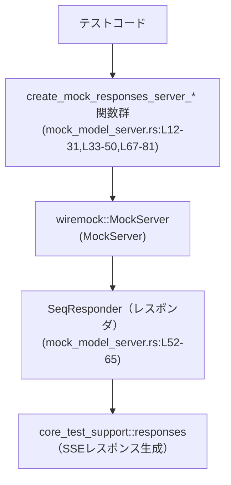
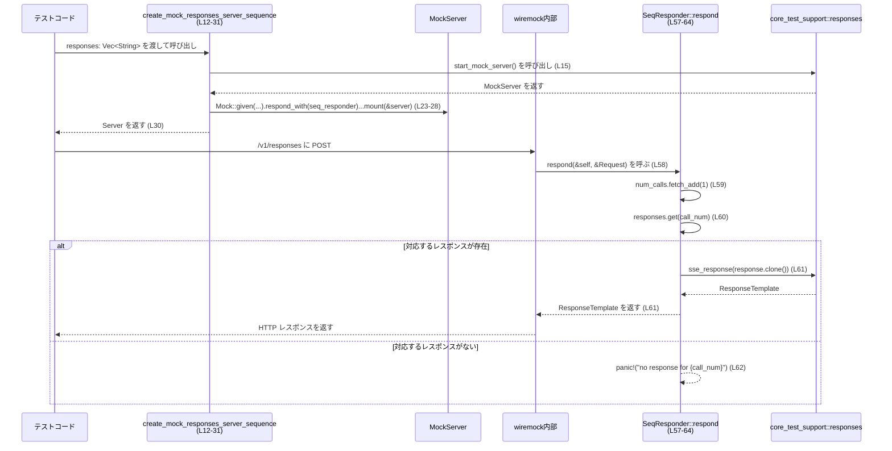

# app-server/tests/common/mock_model_server.rs コード解説

## 0. ざっくり一言

`/v1/responses` エンドポイント向けに、Wiremock を使ってモックの「モデルサーバー」を立てるためのテスト用ヘルパーです。固定シーケンス／繰り返しパターンで SSE 風レスポンスを返します。

---

## 1. このモジュールの役割

### 1.1 概要

- このモジュールは、アプリケーションが呼び出す「モデル API `/v1/responses`」をテスト環境で代替するためのモックサーバーを提供します。
- シナリオごとに
  - 呼び出し順に異なるレスポンスを返すサーバー
  - 同じアシスタントメッセージを繰り返し返すサーバー  
  を起動する関数を公開しています（`mock_model_server.rs:L12-31`, `mock_model_server.rs:L33-50`, `mock_model_server.rs:L67-81`）。

### 1.2 アーキテクチャ内での位置づけ

テストコードと外部 HTTP クライアントの間に挟まる「ダミーのモデルサーバー」という位置づけです。



- テストコードはこのモジュールの関数を呼び出して `MockServer` を取得します。
- `MockServer` は `SeqResponder` または `responses::sse_response(...)` を使って HTTP レスポンスを生成します。
- 実際の SSE データ生成ロジックは `core_test_support::responses` モジュールに委譲されています（このファイルには定義がありません）。

### 1.3 設計上のポイント

- **責務の分割**  
  - HTTP モックサーバーの起動とルーティング定義: `create_mock_*` 関数（`mock_model_server.rs:L12-31,L33-50,L67-81`）
  - 呼び出し回数に応じたレスポンス選択: `SeqResponder` とその `Respond` 実装（`mock_model_server.rs:L52-65`）
  - 実際の SSE 形式レスポンス生成: `core_test_support::responses` に委譲（`mock_model_server.rs:L4`, `mock_model_server.rs:L60-62,L70-74`）
- **状態管理**  
  - モックレスポンダ `SeqResponder` は `AtomicUsize` で呼び出し回数をスレッドセーフにカウントします（`mock_model_server.rs:L52-54,L59`）。
  - レスポンス本文は `Vec<String>` として保持され、各呼び出しで読み出されます（`mock_model_server.rs:L52-55,L60-62`）。
- **エラーハンドリングの方針**  
  - 想定外の呼び出し（用意した数以上の呼び出し）が来た場合は `panic!` でテストを即座に失敗させます（`mock_model_server.rs:L60-63`）。
  - `create_mock_responses_server_sequence` では `.expect(num_calls as u64)` により、期待呼び出し回数も明示しています（`mock_model_server.rs:L23-27`）。

---

## 1.4 コンポーネント一覧（インベントリー）

このファイル内で定義されている主な型・関数の一覧です。

| 名前 | 種別 | 公開範囲 | 役割 / 用途 | 定義位置（根拠） |
|------|------|----------|-------------|------------------|
| `create_mock_responses_server_sequence` | 関数（`async`, 戻り値 `MockServer`） | `pub` | 用意した複数レスポンスを「呼び出し順」に返し、さらに呼び出し回数も検証するモックサーバーを起動する | `mock_model_server.rs:L12-31` |
| `create_mock_responses_server_sequence_unchecked` | 関数（`async`, 戻り値 `MockServer`） | `pub` | シーケンスレスポンスを返すが、呼び出し回数の期待値を設定しないモックサーバーを起動する | `mock_model_server.rs:L33-50` |
| `create_mock_responses_server_repeating_assistant` | 関数（`async`, 戻り値 `MockServer`） | `pub` | 毎回同じアシスタントメッセージを SSE レスポンスとして返すモックサーバーを起動する | `mock_model_server.rs:L67-81` |
| `SeqResponder` | 構造体 | モジュール内（非 `pub`） | 呼び出し回数に応じて `Vec<String>` からレスポンスを選択し、SSE レスポンスに変換するレスポンダ | `mock_model_server.rs:L52-55` |
| `impl Respond for SeqResponder::respond` | メソッド（トレイト実装） | 間接的に公開（`Respond` 経由） | Wiremock からの HTTP リクエストに応じて、シーケンスレスポンスを返すコアロジック | `mock_model_server.rs:L57-64` |

外部コンポーネント（このファイルには実装がないが使用しているもの）:

- `core_test_support::responses` モジュール（`responses::start_mock_server`, `responses::sse_response`, `responses::sse`, `responses::ev_*`）  
  - 使用箇所: `mock_model_server.rs:L4,L15,L36,L60-62,L69-74,L77`
- `wiremock::{Mock, MockServer, Respond, ResponseTemplate}` および `wiremock::matchers::{method, path_regex}`  
  - 使用箇所: `mock_model_server.rs:L5-10,L23-27,L43-47,L57-58,L75-79`

---

## 2. 主要な機能一覧

- モックサーバー起動（シーケンス + 呼び出し回数検証）: `create_mock_responses_server_sequence`（`mock_model_server.rs:L12-31`）
- モックサーバー起動（シーケンスのみ、回数検証なし）: `create_mock_responses_server_sequence_unchecked`（`mock_model_server.rs:L33-50`）
- モックサーバー起動（毎回同じアシスタントメッセージを返す）: `create_mock_responses_server_repeating_assistant`（`mock_model_server.rs:L67-81`）
- シーケンスレスポンダ: 呼び出し回数ごとに `Vec<String>` からレスポンスを取り出し SSE 形式に変換して返す `SeqResponder`（`mock_model_server.rs:L52-65`）

---

## 3. 公開 API と詳細解説

### 3.1 型一覧（構造体・列挙体など）

| 名前 | 種別 | 役割 / 用途 | フィールド概要 | 定義位置 |
|------|------|-------------|----------------|----------|
| `SeqResponder` | 構造体 | Wiremock の `Respond` トレイトを実装し、呼び出し順に応じて事前定義されたレスポンスを返す | `num_calls: AtomicUsize` — 現在までの呼び出し回数（0 始まり）を保持。`responses: Vec<String>` — 呼び出し回数ごとに返す本文を保持。 | `mock_model_server.rs:L52-55` |

### 3.2 関数詳細

#### `create_mock_responses_server_sequence(responses: Vec<String>) -> MockServer`

**概要**

- 渡された `responses` ベクタ内の文字列を、リクエストが来るたびに先頭から順に返すモックサーバーを起動します（`mock_model_server.rs:L12-21`）。
- さらに、モックが **ちょうど `responses.len()` 回** 呼び出されることを期待として設定しています（`mock_model_server.rs:L23-27`）。

**引数**

| 引数名 | 型 | 説明 |
|--------|----|------|
| `responses` | `Vec<String>` | 呼び出し 0 回目、1 回目、…で返すレスポンス本文の一覧。インデックスが呼び出し回数に対応。 |

**戻り値**

- `MockServer`（`wiremock::MockServer`）
  - Wiremock が起動した HTTP モックサーバーのインスタンスです（`mock_model_server.rs:L14,L30`）。
  - このチャンクには `MockServer` の API は現れませんが、テスト側はこれを使って実際に HTTP クライアントの接続先を指定する想定です。

**内部処理の流れ**

1. `responses::start_mock_server().await` により Wiremock ベースのモックサーバーを起動し、`server` を取得します（`mock_model_server.rs:L15`）。
2. `responses.len()` で期待される呼び出し回数 `num_calls` を計算します（`mock_model_server.rs:L17`）。
3. `SeqResponder` のインスタンス `seq_responder` を作成し、`num_calls` を 0 で初期化しつつ渡された `responses` を内部に保持します（`mock_model_server.rs:L18-21`）。
4. Wiremock の API を使って、次の条件のモックを設定します（`mock_model_server.rs:L23-28`）。
   - HTTP メソッド: `POST`（`method("POST")`、`mock_model_server.rs:L23`）
   - パス: 正規表現 `".*/responses$"` にマッチするもの（`mock_model_server.rs:L24`）
   - レスポンダ: `seq_responder`（`mock_model_server.rs:L25`）
   - 期待呼び出し回数: `num_calls`（`mock_model_server.rs:L26`）
   - 対象サーバー: `server` に mount（`mock_model_server.rs:L27`）
5. 設定を終えた `server` を返します（`mock_model_server.rs:L30`）。

**Examples（使用例）**

実際の URL 生成などはこのチャンクからは分からないため、概念的な例です。

```rust
use app_server::tests::common::mock_model_server::create_mock_responses_server_sequence;

// 非同期テスト関数の例（実際のテストフレームワーク属性は省略）
async fn test_responses_sequence() {
    // 0回目, 1回目, 2回目に返したいレスポンスを用意する
    let server = create_mock_responses_server_sequence(vec![
        r#"{"id":"resp-1"}"#.to_string(),
        r#"{"id":"resp-2"}"#.to_string(),
    ]).await;

    // ここで、アプリケーションのHTTPクライアントを `server` のアドレスに向ける
    // 実際のアドレス取得方法はこのチャンクには現れません。

    // アプリから `/v1/responses` に POST すると、
    // 呼び出し順に上記2つのレスポンスが返ることを想定したテストを書けます。
}
```

**Errors / Panics**

- この関数自体は `Result` ではなく `MockServer` を直接返しており、内部でエラー型を返してはいません（`mock_model_server.rs:L14-31`）。
- ただし、以下のような条件で **テスト失敗（panic と等価な結果）** になる可能性があります。
  - `SeqResponder::respond` 内で、`responses` の要素数より多く呼び出された場合、`panic!("no response for {call_num}")` が発生します（`mock_model_server.rs:L60-63`）。
  - Wiremock の `expect(num_calls as u64)` に反する呼び出し回数になった場合、Wiremock 側でテスト失敗として扱われることが意図されていると読み取れますが、詳細はこのチャンクからは分かりません（`mock_model_server.rs:L26`）。

**Edge cases（エッジケース）**

- `responses` が空ベクタの場合
  - `num_calls == 0` となり、期待呼び出し回数は 0 に設定されます（`mock_model_server.rs:L17,L26`）。
  - それにもかかわらず `/responses` への POST が 1 回でも行われると、`SeqResponder` 内で `self.responses.get(0)` が `None` になり `panic!` します（`mock_model_server.rs:L60-63`）。
- 実際の呼び出し回数が `responses.len()` より多い場合
  - `call_num` が `responses.len()` 以上になった時点で `panic!("no response for {call_num}")` が発生します（`mock_model_server.rs:L59-63`）。
- 実際の呼び出し回数が `responses.len()` より少ない場合
  - `SeqResponder` 側では `panic` はしませんが、`expect(num_calls as u64)` の挙動により、テスト終了時に Wiremock 的な「期待未達」の扱いになることが意図されていると推測されます（`mock_model_server.rs:L26`）。詳細はこのチャンクには現れません。

**使用上の注意点**

- この関数は **テスト用途** を前提としており、本番コードから呼び出すことは想定されていません（テスト用モジュール配置と `panic!` の存在から推測されます）。
- `responses` の個数と実際の呼び出し回数を一致させる契約になっており、ずれるとテストが失敗します。
- 並行性:
  - `SeqResponder` は `AtomicUsize` により呼び出し回数をスレッドセーフにカウントするため、Wiremock がマルチスレッドでリクエストを処理してもデータ競合は発生しません（`mock_model_server.rs:L52-54,L59`）。
  - `responses: Vec<String>` へのアクセスは不変参照＆ `clone` のみであり、同時アクセスしても安全です（`mock_model_server.rs:L54,L60-62`）。

---

#### `create_mock_responses_server_sequence_unchecked(responses: Vec<String>) -> MockServer`

**概要**

- `create_mock_responses_server_sequence` と同様に、呼び出し順に `responses` を返すモックサーバーを起動しますが、**期待呼び出し回数を設定しません**（`mock_model_server.rs:L33-47`）。

**引数 / 戻り値**

- 引数・戻り値は `create_mock_responses_server_sequence` と同じです（`mock_model_server.rs:L35,L38-41,L49`）。

**内部処理の流れ**

1. `responses::start_mock_server().await` でモックサーバーを起動（`mock_model_server.rs:L36`）。
2. `SeqResponder` を作成し、`num_calls` を 0 で初期化（`mock_model_server.rs:L38-41`）。
3. Wiremock のモックを設定:
   - `POST` メソッド（`mock_model_server.rs:L43`）
   - パス `.*/responses$`（`mock_model_server.rs:L44`）
   - レスポンダ `seq_responder`（`mock_model_server.rs:L45`）
   - **`expect` は呼び出していません**（`mock_model_server.rs:L43-47`）。
4. `server` を返す（`mock_model_server.rs:L49`）。

**Errors / Panics**

- この関数自体も `Result` を返さず、エラー型は扱いません（`mock_model_server.rs:L35-50`）。
- ただし `SeqResponder::respond` が同様に `panic!("no response for {call_num}")` を持つため、`responses` より多い呼び出しでパニックします（`mock_model_server.rs:L60-63`）。

**Edge cases / 使用上の注意点**

- 実際の呼び出し回数が `responses.len()` より少なくても Wiremock 上の期待は設定していないため、その点についてはテストが失敗しない可能性があります（このチャンクには Wiremock の詳細はありません）。
- 多すぎる呼び出しに対する振る舞いは `SeqResponder` の `panic!` に依存し、`create_mock_responses_server_sequence` と同じです。

---

#### `create_mock_responses_server_repeating_assistant(message: &str) -> MockServer`

**概要**

- 毎回同じ「アシスタントメッセージ」を SSE 形式で返す `/v1/responses` モック API サーバーを起動します（`mock_model_server.rs:L67-81`）。
- レスポンス本文は `core_test_support::responses` モジュールのヘルパーで組み立てています（`mock_model_server.rs:L70-74,L77`）。

**引数**

| 引数名 | 型 | 説明 |
|--------|----|------|
| `message` | `&str` | 全てのリクエストで返すアシスタントメッセージの本文。 |

**戻り値**

- `MockServer` — シーケンス版と同様、Wiremock のモックサーバーインスタンス（`mock_model_server.rs:L68,L80`）。

**内部処理の流れ**

1. `responses::start_mock_server().await` でモックサーバーを起動（`mock_model_server.rs:L69`）。
2. SSE ボディ `body` を生成（`mock_model_server.rs:L70-74`）。
   - `responses::sse(vec![ ... ])` を呼び出し、イベント列から SSE 文字列相当の何かを作っています。
   - イベントは `ev_response_created("resp-1")`, `ev_assistant_message("msg-1", message)`, `ev_completed("resp-1")` の 3 つです。
   - これらヘルパーの具体的な戻り値やフォーマットは、このチャンクには定義がありません。
3. Wiremock のモックを設定（`mock_model_server.rs:L75-79`）。
   - `POST` メソッド、パス `.*/responses$`。
   - レスポンダは `responses::sse_response(body)` で生成された `ResponseTemplate` です（`mock_model_server.rs:L77`）。
4. `server` を返します（`mock_model_server.rs:L80`）。

**Examples（使用例）**

```rust
use app_server::tests::common::mock_model_server::create_mock_responses_server_repeating_assistant;

async fn test_repeating_assistant() {
    // 毎回 "hello" というアシスタントメッセージを返すモックサーバーを起動
    let server = create_mock_responses_server_repeating_assistant("hello").await;

    // アプリのHTTPクライアントをこのサーバーに向け、
    // `/v1/responses` に複数回 POST しても、同じ SSE ストリームが返ることを前提としたテストを書けます。
}
```

**Errors / Panics**

- この関数自体に明示的なエラー処理や `panic!` はありません（`mock_model_server.rs:L67-81`）。
- `responses::sse` / `responses::sse_response` の内部動作はこのチャンクからは分からないため、その内部でのエラー可能性については不明です。

**Edge cases / 使用上の注意点**

- `message` が空文字列でも、そのまま SSE ボディに埋め込まれるだけと解釈できますが、実際のフォーマットは `core_test_support::responses` の実装次第で、このチャンクには現れません。
- 呼び出し回数の期待 (`expect`) は設定していないため、何回呼び出されても同じレスポンスが返る前提のシナリオ向けです（`mock_model_server.rs:L75-79`）。

---

#### `impl Respond for SeqResponder { fn respond(&self, _: &wiremock::Request) -> ResponseTemplate }`

**概要**

- Wiremock から HTTP リクエストを受け取った際に実行される、シーケンスレスポンスのコアロジックです（`mock_model_server.rs:L57-64`）。
- 呼び出し回数を `AtomicUsize` でインクリメントし、その回数をインデックスとして `responses: Vec<String>` からレスポンスを選び、SSE 形式の `ResponseTemplate` に変換して返します（`mock_model_server.rs:L59-62`）。

**引数**

| 引数名 | 型 | 説明 |
|--------|----|------|
| `&self` | `&SeqResponder` | スレッドセーフに共有されるレスポンダ。 |
| `_` | `&wiremock::Request` | リクエストオブジェクト。ここでは名前が `_` のため内容は使用していません（`mock_model_server.rs:L58`）。 |

**戻り値**

- `ResponseTemplate`（`wiremock::ResponseTemplate`）
  - Wiremock に HTTP レスポンスとして返されるテンプレートです（`mock_model_server.rs:L58,L61`）。

**内部処理の流れ**

1. `self.num_calls.fetch_add(1, Ordering::SeqCst)` を呼び出し、現在の呼び出し番号（0 から開始）を取得しつつインクリメントします（`mock_model_server.rs:L59`）。
   - `Ordering::SeqCst` により、最も強いメモリ順序（逐次一貫性）で更新が行われます。
2. `self.responses.get(call_num)` で対応するレスポンス文字列を取り出します（`mock_model_server.rs:L60`）。
3. パターンマッチで分岐します（`mock_model_server.rs:L60-63`）。
   - `Some(response)` の場合: `responses::sse_response(response.clone())` を返します（`mock_model_server.rs:L61`）。
     - `response.clone()` により `String` の所有権を複製し、`SeqResponder` 内部のベクタは保持されたままです。
   - `None` の場合: `panic!("no response for {call_num}")` を発生させます（`mock_model_server.rs:L62`）。

**Errors / Panics**

- エラー型は返さず、異常ケースでは `panic!` を発生させる設計です。
- パニック条件:
  - `call_num` が `self.responses.len()` 以上、つまり「用意したレスポンス数より多く `respond` が呼び出された場合」（`mock_model_server.rs:L60-63`）。

**Edge cases**

- 並行アクセス:
  - `respond` は `&self` を受け取りつつ `AtomicUsize` を更新しているため、複数スレッドから同時に呼び出された場合でも、`call_num` は衝突なく一意な値になります（`mock_model_server.rs:L52-54,L59`）。
  - `Vec<String>` からの `.get` は読み取り専用であり、`String` はクローンされるだけなので、データ競合は発生しません（`mock_model_server.rs:L54,L60-62`）。
- `responses` が空ベクタの場合:
  - 最初の呼び出しで `call_num` は 0 となり、`self.responses.get(0)` は `None` となって即座に `panic!` します（`mock_model_server.rs:L59-63`）。

**使用上の注意点**

- `Request` の内容を見ていないため、全ての `POST .*/responses` に対して同じシーケンスを消費します。入力に応じた分岐は行われません（`mock_model_server.rs:L58-63`）。
- `Ordering::SeqCst` は最も強いメモリ順序であり、単純なカウンタ用途としては十分安全ですが、パフォーマンスの観点では他のオーダー（`Relaxed` など）よりコストが高い可能性があります。ただし、このコードはテスト用途であり、パフォーマンスより簡潔さ・安全性を優先していると解釈できます。

---

### 3.3 その他の関数

- このファイルには補助的な小さな関数は存在せず、全ての関数が上記で説明した 3 つの公開関数と 1 つのトレイト実装のみです。

---

## 4. データフロー

### 4.1 シーケンスレスポンスモックの典型的なフロー

テストで `create_mock_responses_server_sequence` を使った場合の、1 つのリクエストに対するデータの流れです。



- 図中の行番号は `mock_model_server.rs` 内の該当位置を示します。
- SSE 形式への変換および HTTP レスポンス生成の詳細は `core_test_support::responses` モジュールの実装に依存しており、このチャンクには現れません。

---

## 5. 使い方（How to Use）

### 5.1 基本的な使用方法

`create_mock_responses_server_sequence` を用いたシーケンステストの概念的なコード例です。

```rust
use app_server::tests::common::mock_model_server::{
    create_mock_responses_server_sequence,
};

#[tokio::test] // 実際のテストランナー属性はプロジェクト設定に依存
async fn test_model_client_sequence() {
    // 1回目と2回目のレスポンスを定義
    let server = create_mock_responses_server_sequence(vec![
        r#"{"id":"resp-1","status":"created"}"#.to_string(),
        r#"{"id":"resp-1","status":"completed"}"#.to_string(),
    ]).await;

    // ここで、アプリ側の「モデルサーバーのベースURL」を
    // `server` がリッスンしているアドレスに差し替える。
    // （具体的な差し替え方法はこのチャンクには現れません）

    // アプリから `/v1/responses` に2回 POST すれば、
    // 上記2つのレスポンスが順番通りに返ってくる前提でテストが書けます。
}
```

ポイント:

- `responses` の要素数と **実際のリクエスト回数** を一致させる必要があります（`mock_model_server.rs:L17,L26,L59-63`）。
- 3 回目以降のリクエストが来ると `panic!` します。

### 5.2 よくある使用パターン

1. **回数チェック付きのシーケンスモック**  
   テストが「ちょうど N 回呼ばれる」ことまで検証したい場合に `create_mock_responses_server_sequence` を使用します。

2. **回数チェックなしのシーケンスモック**  
   「最大で N 回まで呼ばれるが、正確な回数には関心がない」などのケースでは  
   `create_mock_responses_server_sequence_unchecked` を使用し、過剰呼び出しのみ `panic!` で検出します。

3. **常に同じ SSE レスポンスを返すモック**  
   単純に「どのリクエストにも同じアシスタントメッセージが返る」前提でテストしたい場合には  
   `create_mock_responses_server_repeating_assistant` を使用します（`mock_model_server.rs:L67-81`）。

### 5.3 よくある間違い

```rust
// 間違い例: responses の数より多くリクエストしてしまう
async fn test_too_many_calls() {
    let server = create_mock_responses_server_sequence(vec![
        "once".to_string(),
    ]).await;

    // アプリ側のバグなどで `/v1/responses` に2回以上 POST すると…
    // 2回目の SeqResponder::respond で panic!("no response for 1") が発生する
}

// 正しい例: responses の数と呼び出し回数をテストで明示的に制御する
async fn test_exact_calls() {
    let server = create_mock_responses_server_sequence(vec![
        "first".to_string(),
        "second".to_string(),
    ]).await;

    // テストの中で `/v1/responses` への呼び出しを2回に限定するように制御する。
}
```

### 5.4 使用上の注意点（まとめ）

- **前提条件**
  - `responses` の長さと実際の `/v1/responses` 呼び出し回数を一致させる（`mock_model_server.rs:L17,L26,L59-63`）。
- **禁止・非推奨事項**
  - 本番コードからこれらのモック起動関数を呼び出すこと（テスト専用の設計であり、`panic!` を含みます）。
- **エラー・パニック条件**
  - 用意したレスポンス数より多くリクエストすると `SeqResponder::respond` が `panic!`（`mock_model_server.rs:L60-63`）。
- **並行性 / 安全性**
  - `AtomicUsize` によるカウンタ更新と `Vec<String>` の読み取りのみであり、`unsafe` コードは含まれていません（`mock_model_server.rs:L1-2,L52-55,L59`）。
  - Wiremock が複数スレッドでリクエストをさばく場合でも、カウンタは正しく増加し、データ競合は起こらない構造になっています。

---

## 6. 変更の仕方（How to Modify）

### 6.1 新しい機能を追加する場合

例: リクエスト内容に応じてレスポンスを変えるモックを追加したい場合。

1. **新しいレスポンダ型の追加**
   - `SeqResponder` と同じように、このファイル内に新しい構造体を定義します（`mock_model_server.rs:L52-55` を参考）。
   - 必要なら `num_calls` に加えて、別の状態変数をフィールドに持たせます。

2. **`Respond` トレイトの実装**
   - `impl Respond for NewResponder { fn respond(&self, req: &wiremock::Request) -> ResponseTemplate { ... } }` を追加し、`req` の中身に応じてレスポンスを切り替えます（`mock_model_server.rs:L57-64` を参考）。

3. **起動関数の追加**
   - 既存の `create_mock_*` 関数と同様のパターンで、新しい `pub async fn` を追加します（`mock_model_server.rs:L12-31,L33-50,L67-81`）。
   - `Mock::given(...).respond_with(NewResponder { ... }).mount(&server)` のようにモックを登録します。

### 6.2 既存の機能を変更する場合

- **影響範囲の確認**
  - `create_mock_responses_server_sequence` / `_unchecked` の挙動を変えると、これらを利用している全テストに影響します。
  - 特に `panic!` 条件（`mock_model_server.rs:L60-63`）や `expect(num_calls as u64)` の有無（`mock_model_server.rs:L26`）を変更する場合は、テストの前提が変わるため注意が必要です。
- **契約の維持**
  - 「N 個の `responses` を渡すと、呼び出し 0〜N-1 にそれぞれ対応するレスポンスが返る」という契約は、テストの読みやすさにも関わるため、維持するかどうかを検討する必要があります（`mock_model_server.rs:L17-21,L59-62`）。
- **テスト / 呼び出し箇所の再確認**
  - 変更後は、`create_mock_*` を呼び出しているテストすべてで、期待するレスポンスシーケンスと呼び出し回数が変わっていないか確認することが望ましいです。

---

## 7. 関連ファイル

| パス / モジュール | 役割 / 関係 |
|-------------------|------------|
| `core_test_support::responses` | モックサーバー起動 (`start_mock_server`) と SSE 形式レスポンス生成 (`sse_response`, `sse`, `ev_response_created`, `ev_assistant_message`, `ev_completed`) を提供します。このファイルから呼び出されますが、実装はこのチャンクには現れません（`mock_model_server.rs:L4,L15,L36,L60-62,L69-74,L77`）。 |
| `wiremock` クレート | HTTP モックサーバー (`MockServer`)、モック定義 (`Mock`)、レスポンダトレイト (`Respond`)、レスポンステンプレート (`ResponseTemplate`) およびパスマッチャー (`method`, `path_regex`) を提供します（`mock_model_server.rs:L5-10,L23-27,L43-47,L57-58,L75-79`）。 |
| `app-server/tests` 以下の各テストファイル | 本モジュールの `create_mock_*` 関数を利用し、モデル API をモックした状態でアプリケーションの挙動をテストする想定です。ただし、具体的なファイル名や呼び出し箇所はこのチャンクには現れません。 |

---

### Bugs / Security に関する補足（このファイルに関する範囲）

- **意図的な panic の利用**
  - `SeqResponder::respond` の `panic!("no response for {call_num}")` は「テストが想定外の回数呼ばれたこと」を即座に発見するための仕組みと解釈できます（`mock_model_server.rs:L60-63`）。
  - 本番コードから利用されない前提であれば、セキュリティ上の問題とはなりにくいですが、本番経路で誤用すると DoS 的な振る舞い（リクエストでプロセスを落とせる）になり得ます。
- **スレッド安全性**
  - `AtomicUsize` と不変な `Vec<String>` の組み合わせであり、`unsafe` を伴う並行処理はありません（`mock_model_server.rs:L1-2,L52-55,L59`）。
  - データ競合や未定義動作に繋がるコードは、このチャンクには存在しません。
