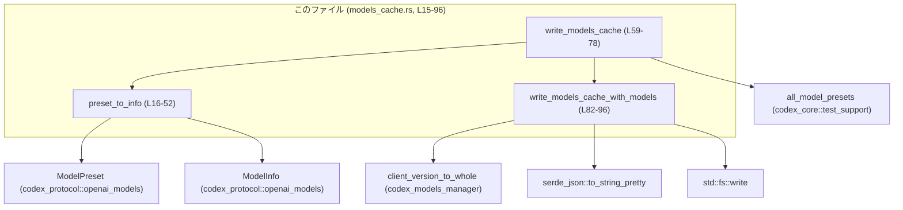
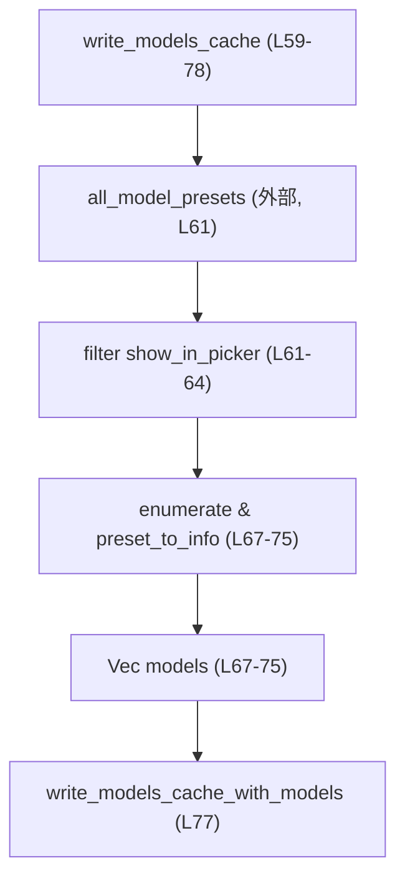
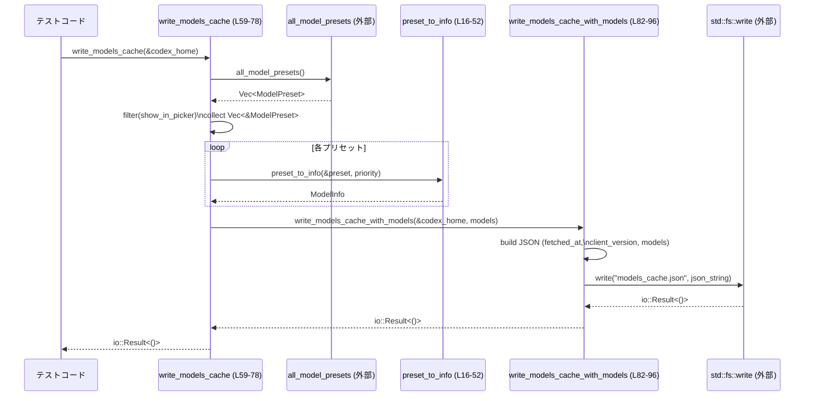

# app-server/tests/common/models_cache.rs

## 0. ざっくり一言

`ModelsManager` がネットワークに出ずに済むよう、テスト用の `models_cache.json` を生成するユーティリティです。`ModelPreset` から `ModelInfo` に変換し、フェッチ時刻やクライアントバージョンとともに JSON キャッシュを書き出します（models_cache.rs:L15-52, L59-78, L82-96）。

---

## 1. このモジュールの役割

### 1.1 概要

- このモジュールは **モデル情報のキャッシュファイルをテスト用に事前生成する問題** を解決するために存在し、  
  **プリセット一覧から `models_cache.json` を構築して `codex_home` 直下に書き出す機能** を提供します（models_cache.rs:L55-59, L80-86）。
- これにより、`ModelsManager` がモデル情報の更新のためにネットワークアクセスを行う必要がなくなり、テストが決 determinist かつ高速になります（コメント、models_cache.rs:L55-58）。

### 1.2 アーキテクチャ内での位置づけ

このファイルは `tests/common` 配下のテスト補助モジュールであり、主にテストコードから呼び出される想定です（ファイルパスより）。外部クレート／モジュールとの関係は以下のとおりです。



- `write_models_cache` が入口 API で、プリセット取得（`all_model_presets`）から `ModelInfo` 化（`preset_to_info`）までをまとめます（models_cache.rs:L59-75）。
- 実際のファイル書き出しロジックは `write_models_cache_with_models` に切り出されており、任意の `Vec<ModelInfo>` からキャッシュを作れるようになっています（models_cache.rs:L80-96）。

### 1.3 設計上のポイント

- **責務分割**
  - `preset_to_info`: `ModelPreset` → `ModelInfo` への純粋な変換（I/Oなし）（models_cache.rs:L15-52）。
  - `write_models_cache`: プリセットの収集・フィルタ・優先度付けと、変換+書き出しのオーケストレーション（models_cache.rs:L59-78）。
  - `write_models_cache_with_models`: JSON 構築とファイル I/O のみを担当（models_cache.rs:L82-96）。
- **状態管理**
  - いずれの関数も内部に長期的な状態を保持せず、すべての情報は引数とローカル変数から構築されます（models_cache.rs:L16-52, L59-96）。
- **エラーハンドリング**
  - パブリック関数はどちらも `std::io::Result<()>` を返し、I/O 失敗や JSON 変換失敗を呼び出し元に `Err` として返します（models_cache.rs:L59, L82-85, L96）。
- **並行性**
  - グローバル可変状態を持たず、シンプルなファイル書き込みのみであるため、Rust の型システムによりスレッド安全性は主に「同じパスを同時に書かない」ことに依存します（コード上での排他制御はありません、models_cache.rs:L86-96）。

---

## 2. 主要な機能一覧（コンポーネントインベントリー）

### 2.1 関数一覧

| 名前 | 可視性 | 役割 / 用途 | 行範囲 |
|------|--------|-------------|--------|
| `preset_to_info` | private | 1つの `ModelPreset` から `ModelInfo` を構築する変換関数 | models_cache.rs:L15-52 |
| `write_models_cache` | `pub` | `codex_home` 配下に、現在のプリセット一覧から `models_cache.json` を生成する高レベル API | models_cache.rs:L59-78 |
| `write_models_cache_with_models` | `pub` | 任意の `Vec<ModelInfo>` から `models_cache.json` を生成する低レベル API | models_cache.rs:L80-96 |

### 2.2 利用している主な外部コンポーネント

| 名前 | 種別 | 役割（コードから読み取れる範囲） | 行範囲 |
|------|------|----------------------------------|--------|
| `ModelPreset` | 構造体（外部） | モデルプリセット情報。`id`, `display_name`, `description`, `default_reasoning_effort`, `supported_reasoning_efforts`, `show_in_picker`, `supported_in_api`, `additional_speed_tiers`, `upgrade` フィールドを持つ（少なくともこれらが参照されています） | models_cache.rs:L18-32, L24, L29-32, L61-64 |
| `ModelInfo` | 構造体（外部） | キャッシュ用のモデル情報。多くのフィールドを初期化しており、キャッシュに保存されるモデルのメタデータを表すと考えられます | models_cache.rs:L17-51 |
| `ConfigShellToolType` | 列挙体（外部） | `shell_type` フィールドに `ShellCommand` を設定するために使用 | models_cache.rs:L23 |
| `ModelVisibility` | 列挙体（外部） | モデルの表示状態 (`List` or `Hide`) を表現 | models_cache.rs:L24-28 |
| `ReasoningSummary` | 列挙体（外部） | `default_reasoning_summary` フィールドに `Auto` を設定 | models_cache.rs:L36 |
| `TruncationPolicyConfig` | 構造体/型（外部） | `bytes(10_000)` としてトークン/バイト数制限のようなものを指定 | models_cache.rs:L42 |
| `default_input_modalities` | 関数（外部） | `input_modalities` フィールドのデフォルト値を構築 | models_cache.rs:L49 |
| `all_model_presets` | 関数（外部） | キャッシュ元となるプリセット一覧を取得 | models_cache.rs:L61-64 |
| `client_version_to_whole` | 関数（外部） | キャッシュに埋め込む `client_version` を取得 | models_cache.rs:L89 |
| `DateTime<Utc>` | 型（外部） | フェッチ時刻を RFC3339 形式でシリアライズするための日時型 | models_cache.rs:L87-88 |
| `serde_json::json` | マクロ | `fetched_at`, `etag`, `client_version`, `models` を持つ JSON オブジェクトを構築 | models_cache.rs:L90-95 |
| `std::fs::write` | 関数（標準） | JSON 文字列をファイルに書き込む | models_cache.rs:L96 |

---

## 3. 公開 API と詳細解説

### 3.1 型一覧（このファイルで定義される型）

このファイル内で新たに定義される構造体・列挙体はありません（models_cache.rs 全体）。  
以下は **このファイルが利用している主な外部型** の概要です。

| 名前 | 種別 | 役割 / 用途 |
|------|------|-------------|
| `ModelPreset` | 構造体（外部） | プリセット定義。`preset_to_info` の入力として使用されます（models_cache.rs:L16, L18-32, L61-64）。 |
| `ModelInfo` | 構造体（外部） | キャッシュに保存するモデル情報。`preset_to_info` の出力および `write_models_cache_with_models` の入力として使用されます（models_cache.rs:L16-17, L67-75, L84-85）。 |

### 3.2 関数詳細

#### `preset_to_info(preset: &ModelPreset, priority: i32) -> ModelInfo`

**概要**

- 1つの `ModelPreset` から `ModelInfo` を構築し、キャッシュファイルに保存される形へ変換します（models_cache.rs:L15-17）。
- 一部のフィールドはプリセットからコピーし、一部はテスト向けの固定値・デフォルト値を設定しています（models_cache.rs:L18-51）。

**引数**

| 引数名 | 型 | 説明 |
|--------|----|------|
| `preset` | `&ModelPreset` | 変換元のプリセット。`id` や `display_name` などを参照します（models_cache.rs:L18-32）。 |
| `priority` | `i32` | `ModelInfo` の `priority` フィールドにそのまま格納される優先度（models_cache.rs:L30）。 |

**戻り値**

- `ModelInfo`: `preset` の情報をもとに構築されたキャッシュ用モデル情報です（models_cache.rs:L17-51）。

**内部処理の流れ**

1. `ModelInfo` のリテラルを構築します（models_cache.rs:L17-51）。
2. `slug`, `display_name`, `description`, `default_reasoning_level`, `supported_reasoning_levels`, `supported_in_api`, `additional_speed_tiers`, `upgrade` は `preset` からコピーまたは変換して設定します（models_cache.rs:L18-22, L24, L29-32）。
3. `visibility` は `preset.show_in_picker` が真なら `ModelVisibility::List`、偽なら `ModelVisibility::Hide` に設定します（models_cache.rs:L24-28）。
4. `shell_type` などその他のフィールドは、テスト向けの固定値やデフォルト値を設定します。例:
   - `shell_type: ConfigShellToolType::ShellCommand`（models_cache.rs:L23）。
   - `base_instructions: "base instructions".to_string()`（models_cache.rs:L33）。
   - `default_reasoning_summary: ReasoningSummary::Auto`（models_cache.rs:L36）。
   - `truncation_policy: TruncationPolicyConfig::bytes(10_000)`（models_cache.rs:L42）。
   - `input_modalities: default_input_modalities()`（models_cache.rs:L49）。
5. 構築した `ModelInfo` を返します（models_cache.rs:L52）。

**Examples（使用例）**

以下は、単一プリセットから `ModelInfo` を生成し、その一部フィールドを検査するイメージです。  
（`ModelPreset` の構築方法はこのチャンクには現れないため、擬似コードとしています。）

```rust
// 仮の ModelPreset を用意する（実際は codex_protocol 側のAPIで構築）
let preset: ModelPreset = make_test_preset();          // make_test_preset はテスト用のヘルパーという想定

// 優先度 0 で ModelInfo に変換
let info: ModelInfo = preset_to_info(&preset, 0);      // models_cache.rs:L16 を呼び出している

// slug や表示名がプリセットからコピーされていることを確認
assert_eq!(info.slug, preset.id);                      // models_cache.rs:L18
assert_eq!(info.display_name, preset.display_name);    // models_cache.rs:L19
```

**Errors / Panics**

- 関数シグネチャは `ModelInfo` を直接返し、`Result` 型ではありません（models_cache.rs:L16）。
- この関数内で明示的に `panic!` や `unwrap` 等は使用していません（models_cache.rs:L16-52）。
- したがって、このチャンクから読み取れる範囲では、エラーは呼び出し元に伝播せず、通常はパニックも発生しません。  
  ただし、内部で呼び出している `default_input_modalities()` や `TruncationPolicyConfig::bytes` 等の実装はこのチャンクには現れないため、それらがパニックする可能性については不明です（models_cache.rs:L42, L49）。

**Edge cases（エッジケース）**

- `preset.upgrade` が `None` の場合  
  - `upgrade: preset.upgrade.as_ref().map(Into::into)` により、`ModelInfo.upgrade` は `None` になります（models_cache.rs:L32）。
- `preset.description` が空文字列でも `Some("")` として格納されます（models_cache.rs:L20）。
- `supported_reasoning_efforts` が空のベクタでも、そのまま `supported_reasoning_levels` にコピーされます（models_cache.rs:L22）。
- `show_in_picker` が偽の場合、`visibility` は `ModelVisibility::Hide` となり、UI上で非表示にする意図が読み取れます（models_cache.rs:L24-28）。

**使用上の注意点**

- `priority` はそのまま `ModelInfo.priority` に入るため、ソート順に影響する前提で設定する必要があります（コメント、models_cache.rs:L65-72）。
- `base_instructions` や各種フラグは固定値であり、この関数内からは変更できません（models_cache.rs:L33-51）。テスト内容に応じて変更する必要がある場合は、関数の拡張や別のヘルパー関数追加が必要になります。

---

#### `write_models_cache(codex_home: &Path) -> std::io::Result<()>`

**概要**

- `codex_home` ディレクトリ配下に、現在利用可能なプリセット一覧から `models_cache.json` を生成して書き出します（models_cache.rs:L55-59, L77-78）。
- プリセットは `all_model_presets()` から取得し、`show_in_picker` が真のものに絞り込んだ上で、リスト順に優先度（priority）を付けて `ModelInfo` 化します（models_cache.rs:L60-75）。

**引数**

| 引数名 | 型 | 説明 |
|--------|----|------|
| `codex_home` | `&Path` | キャッシュファイル `models_cache.json` を配置するディレクトリパス。後続で `join("models_cache.json")` されます（write_models_cache_with_models 内、models_cache.rs:L86）。 |

**戻り値**

- `std::io::Result<()>`  
  - 成功時: `Ok(())`。  
  - 失敗時: ファイル書き込みや JSON シリアライズで発生した I/O／変換エラーを含む `Err(std::io::Error)` を返すことが想定されます（models_cache.rs:L77-78, L96）。

**内部処理の流れ**

1. `all_model_presets()` でプリセット一覧を取得（models_cache.rs:L61）。
2. `.iter().filter(|preset| preset.show_in_picker).collect()` で、ピッカーに表示するプリセットのみをフィルタし、`Vec<&ModelPreset>` に収集します（models_cache.rs:L61-64）。
3. `presets.iter().enumerate()` で列挙し、インデックスを `priority` として `preset_to_info` を呼び出し、`Vec<ModelInfo>` を構築します（models_cache.rs:L67-75）。
4. 得られた `models` を `write_models_cache_with_models(codex_home, models)` に渡し、実際の JSON 書き出しを行います（models_cache.rs:L77）。

**簡易フローチャート**



**Examples（使用例）**

```rust
use std::path::PathBuf;

// テスト用に一時ディレクトリ配下を codex_home とする想定
let codex_home = PathBuf::from("/tmp/test_codex_home");      // 任意の書き込み可能なパス

// 必要なら事前にディレクトリを作成しておく
std::fs::create_dir_all(&codex_home)?;                       // ディレクトリが無いと write が失敗しうる

// モデルキャッシュを生成
write_models_cache(&codex_home)?;                            // models_cache.rs:L59-78

// 生成されたファイルを確認
let cache_path = codex_home.join("models_cache.json");       // models_cache.rs:L86 と同じ相対パス
assert!(cache_path.exists());
```

**Errors / Panics**

- `write_models_cache` 自体は `Result` をそのまま返すだけであり、内部で明示的に `panic!` 等は使用していません（models_cache.rs:L59-78）。
- 失敗要因になり得るのは主に以下です：
  - `write_models_cache_with_models` 内の `serde_json::to_string_pretty` が失敗した場合（例えば、シリアライズ不可能な値が含まれる場合）（models_cache.rs:L90-96）。
  - `std::fs::write` が I/O エラー（ディレクトリが存在しない、権限がない、ディスクフルなど）を起こした場合（models_cache.rs:L96）。
- これらはすべて `Err(std::io::Error)` として呼び出し元に伝播する設計になっています（models_cache.rs:L77-78, L96）。  
  JSON 変換エラーがどのように `std::io::Error` に変換されるかについては、このチャンクには実装が現れていないため不明です（models_cache.rs:L90-96）。

**Edge cases**

- `show_in_picker` が真のプリセットがゼロ件の場合  
  - `presets` は空の `Vec` になり（models_cache.rs:L61-64）、`models` も空の `Vec<ModelInfo>` になります（models_cache.rs:L67-75）。
  - その場合でも `models_cache.json` は `"models": []` を含むキャッシュとして書き出されると読み取れます（models_cache.rs:L90-95）。
- `all_model_presets()` が空のリストを返す場合も同様に `"models": []` になります（models_cache.rs:L61-75）。
- `codex_home` ディレクトリが存在しない場合  
  - `std::fs::write` はパスによっては `NotFound` エラーを返す可能性があります（一般的な Rust I/O の挙動）。  
    これはこの関数の戻り値 `Err` として観測されます（models_cache.rs:L82-86, L96）。

**使用上の注意点**

- `codex_home` は書き込み可能かつ存在しているディレクトリであることが前提と考えられます（models_cache.rs:L86-96）。
- テストを並列実行する場合、同じ `codex_home` を複数テストが共有すると `models_cache.json` の書き込み競合が起こり得ます。  
  このファイルには排他制御が無いため（ロックや一時ファイルの利用はありません）、テスト側で `codex_home` を分けるなどの配慮が必要です（models_cache.rs:L82-96）。
- `write_models_cache` は `all_model_presets()` を情報源としているため、特定のモデルセットだけをキャッシュしたい場合には、後述の `write_models_cache_with_models` を使う方が適切です（models_cache.rs:L61-75, L80-85）。

---

#### `write_models_cache_with_models(codex_home: &Path, models: Vec<ModelInfo>) -> std::io::Result<()>`

**概要**

- 任意の `models: Vec<ModelInfo>` を受け取り、それを `models_cache.json` として `codex_home` 配下に書き出します（models_cache.rs:L80-86, L90-96）。
- テストで特定のモデル構成を用意したい場合に利用できる柔軟な API です（コメント、models_cache.rs:L80-81）。

**引数**

| 引数名 | 型 | 説明 |
|--------|----|------|
| `codex_home` | `&Path` | キャッシュファイルを配置する基準ディレクトリ（models_cache.rs:L83-86）。 |
| `models` | `Vec<ModelInfo>` | キャッシュに含めるモデル一覧。呼び出し側で自由に構築できます（models_cache.rs:L84, L90-95）。 |

**戻り値**

- `std::io::Result<()>`  
  - 成功時: `Ok(())`。  
  - 失敗時: JSON シリアライズまたはファイル書き込みのエラーを含む `Err(std::io::Error)` を返すことが想定されます（models_cache.rs:L90-96）。

**内部処理の流れ**

1. `cache_path = codex_home.join("models_cache.json")` で出力先パスを組み立てます（models_cache.rs:L86）。
2. `Utc::now()` で現在時刻を取得し、`fetched_at` として利用します（models_cache.rs:L87-88）。
3. `client_version_to_whole()` でクライアントバージョン文字列等を取得し、`client_version` として JSON に含めます（models_cache.rs:L89）。
4. `json!({ ... })` マクロで以下のフィールドを持つ JSON オブジェクトを構築します（models_cache.rs:L90-95）。
   - `"fetched_at": fetched_at`
   - `"etag": null`
   - `"client_version": client_version`
   - `"models": models`
5. `serde_json::to_string_pretty(&cache)?` で整形された JSON 文字列に変換し、その結果を `std::fs::write(cache_path, ...)` で書き出します（models_cache.rs:L90-96）。

**Examples（使用例）**

```rust
use std::path::PathBuf;

// 事前に ModelInfo を1件作っておく（ここでは仮の生成関数を利用）
let model_info: ModelInfo = make_test_model_info();          // preset_to_info を使ってもよい

// 任意の Vec<ModelInfo> を構築
let models = vec![model_info];                               // models_cache.rs:L84

// 出力先ディレクトリ
let codex_home = PathBuf::from("/tmp/custom_codex_home");
std::fs::create_dir_all(&codex_home)?;

// カスタムモデルセットでキャッシュを書き出す
write_models_cache_with_models(&codex_home, models)?;        // models_cache.rs:L82-96

// 内容の検査: "models" 配列に 1 件入っていることなどを確認できる
let cache_path = codex_home.join("models_cache.json");
let content = std::fs::read_to_string(cache_path)?;
println!("{}", content);                                     // "fetched_at", "client_version", "models" が含まれる
```

**Errors / Panics**

- `serde_json::to_string_pretty(&cache)?` が失敗する場合  
  - シリアライズできない値が `cache` に含まれると `Err(serde_json::Error)` が返されます（models_cache.rs:L90-96）。
  - `?` により、このエラーは `std::io::Result<()>` の `Err` として呼び出し元に伝播しますが、その具体的な変換方法はこのチャンクからは分かりません（models_cache.rs:L90-96）。
- `std::fs::write(cache_path, ...)` が I/O エラーを起こす場合（パスが不正、権限無し、ディスクフル等）は `Err(std::io::Error)` が返ります（models_cache.rs:L96）。
- 関数本体に `panic!` や `unwrap` は登場しません（models_cache.rs:L82-96）。

**Edge cases**

- `models` が空の `Vec` の場合でも `"models": []` として書き出されます（models_cache.rs:L84, L90-95）。
- `codex_home` が存在しないディレクトリを指す場合、`std::fs::write` はエラーを返しうるため、この関数も `Err` を返します（models_cache.rs:L86-96）。
- `client_version_to_whole()` がどのようなフォーマットの文字列を返すかは、このチャンクには現れませんが、その値がそのまま JSON の `"client_version"` に入ります（models_cache.rs:L89-95）。

**使用上の注意点**

- **契約条件**:
  - `codex_home` は書き込み可能なディレクトリであること（models_cache.rs:L86-96）。
  - `models` 内の `ModelInfo` は JSON にシリアライズ可能であること（models_cache.rs:L90-96）。
- **並行性に関する注意**:
  - 同一 `codex_home` を複数スレッド/プロセスから同時に使用すると `models_cache.json` の内容が上書きし合う可能性があります。  
    この関数でファイルロック等は行っていないため、テスト環境では `codex_home` を分けるなどの対策が望ましいです（models_cache.rs:L86-96）。

---

### 3.3 その他の関数

- このファイルには上記 3 関数のみが存在し、補助的なラッパー関数等はありません（models_cache.rs:L15-96）。

---

## 4. データフロー

### 4.1 典型シナリオ

代表的なシナリオは「テスト開始時に `write_models_cache` を呼び、ネットワークアクセス無しにモデル情報を利用する」というものです。

1. テストコードが `write_models_cache(&codex_home)` を呼び出す（models_cache.rs:L59-78）。
2. `write_models_cache` が `all_model_presets()` からプリセット一覧を取得し、UI に表示するものだけを抽出する（models_cache.rs:L61-64）。
3. それぞれのプリセットに昇順の `priority` を割り当てつつ、`preset_to_info` で `ModelInfo` に変換する（models_cache.rs:L67-75）。
4. `write_models_cache_with_models` に `Vec<ModelInfo>` と `codex_home` を渡して、`models_cache.json` を生成する（models_cache.rs:L77-78, L82-96）。
5. `ModelsManager` 側は、生成された `models_cache.json` を読み取り、キャッシュが TTL 内であると見なしてネットワークアクセスを行わずに済む、という利用がコメントから読み取れます（models_cache.rs:L55-58）。

### 4.2 シーケンス図



---

## 5. 使い方（How to Use）

### 5.1 基本的な使用方法

テストコードから `write_models_cache` を呼び、`ModelsManager` が参照するキャッシュを事前に用意する、という使い方が基本です。

```rust
use std::path::PathBuf;

// 1. codex_home パスを決める
let codex_home = PathBuf::from("/tmp/my_codex_home");

// 2. 必要に応じてディレクトリを作成
std::fs::create_dir_all(&codex_home)?;

// 3. 現在のプリセット一覧から models_cache.json を生成
write_models_cache(&codex_home)?;              // models_cache.rs:L59-78

// 4. アプリ/テストの他の部分は、codex_home 配下の models_cache.json を利用する
```

### 5.2 よくある使用パターン

1. **デフォルトプリセットでのキャッシュ生成**

   - `write_models_cache` をそのまま呼び出し、`all_model_presets()` の結果に基づくキャッシュを生成します（models_cache.rs:L59-78）。

2. **テスト専用モデルセットでのキャッシュ生成**

   - 事前に `ModelInfo` を手動構築または `preset_to_info` で構築し、`write_models_cache_with_models` を使ってカスタムキャッシュを生成します（models_cache.rs:L80-96）。

   ```rust
   // 例: 1件だけのシンプルなモデルセットを作りたい場合
   let preset = make_test_preset();
   let model = preset_to_info(&preset, 0);      // models_cache.rs:L16-52

   write_models_cache_with_models(&codex_home, vec![model])?;  // models_cache.rs:L82-96
   ```

### 5.3 よくある間違い

```rust
// 間違い例: codex_home ディレクトリを作らずに呼び出している
let codex_home = PathBuf::from("/non/existing/dir");
let _ = write_models_cache(&codex_home);   // std::fs::write が失敗する可能性が高い（models_cache.rs:L86-96）

// 正しい例: 事前にディレクトリを作成してから呼び出す
let codex_home = PathBuf::from("/tmp/valid_codex_home");
std::fs::create_dir_all(&codex_home)?;
write_models_cache(&codex_home)?;
```

### 5.4 使用上の注意点（まとめ）

- **ディレクトリの存在と権限**
  - `codex_home` は存在し、書き込み可能である必要があります（models_cache.rs:L86-96）。
- **並列テスト実行**
  - 同一パスに対して複数のテストが同時にキャッシュを書き込むと、内容の競合や I/O エラーを引き起こす可能性があります。テストごとに異なる `codex_home` を使うことが安全です（models_cache.rs:L82-96）。
- **モデルセットの一貫性**
  - `write_models_cache` は `all_model_presets()` と `show_in_picker` に依存しているため（models_cache.rs:L61-64）、プリセット定義が変わるとキャッシュ内容も変わります。  
    特定のモデル構成に依存したテストでは、`write_models_cache_with_models` を用いて明示的に `models` を指定する方が安定します（models_cache.rs:L80-85）。

---

## 6. 変更の仕方（How to Modify）

### 6.1 新しい機能を追加する場合

例: キャッシュ JSON に追加メタデータ（例: `source` フィールド）を含めたい場合。

1. **JSON 構築箇所の特定**
   - `write_models_cache_with_models` 内の `json!({ ... })` ブロックが出力内容の定義箇所です（models_cache.rs:L90-95）。
2. **新フィールドの追加**
   - `json!` マクロのオブジェクトに `"source": "test"` のようなキーを追加します（models_cache.rs:L90-95）。
3. **テストコード側の利用**
   - 追加したフィールドに依存するテストがあれば、そのフィールドを読み出して検証します。
4. `write_models_cache` は `write_models_cache_with_models` を呼び出すだけなので（models_cache.rs:L77-78）、通常、変更は `write_models_cache_with_models` のみで完結します。

### 6.2 既存の機能を変更する場合

- **`ModelPreset` → `ModelInfo` 変換ロジックの変更**

  - 対象箇所: `preset_to_info`（models_cache.rs:L15-52）。
  - 影響範囲:
    - すべての `write_models_cache` / `write_models_cache_with_models` 経由のキャッシュ内容に影響します（models_cache.rs:L67-75, L84-85）。
  - 注意点:
    - フィールドの意味や契約（例: `priority` のソート方向など）を変えると、`ModelsManager` 側の振る舞いにも影響しうるため、呼び出し側を含めたテストが必要です。

- **キャッシュファイル名や配置場所の変更**

  - 対象箇所: `codex_home.join("models_cache.json")`（models_cache.rs:L86）。
  - 影響範囲:
    - `ModelsManager` のキャッシュ読取パスとの整合性が崩れる可能性があります。
    - テスト環境設定（環境変数や設定ファイル）側も併せて変更が必要になる場合があります。
  - 注意点:
    - このチャンクには `ModelsManager` 側の実装が含まれていないため、対応箇所の特定にはリポジトリ全体の確認が必要です。

---

## 7. 関連ファイル

このモジュールと密接に関係する外部コンポーネント（ファイル/モジュール）は、コードから以下のように読み取れます。

| パス / クレート | 役割 / 関係 |
|-----------------|------------|
| `codex_core::test_support::all_model_presets` | 利用可能な `ModelPreset` 一覧を提供し、本モジュールのキャッシュ生成の元データとなります（models_cache.rs:L61-64）。定義場所の具体的なパスはこのチャンクには現れません。 |
| `codex_models_manager::client_version_to_whole` | クライアントバージョン情報を取得し、キャッシュ JSON の `client_version` フィールドとして使用します（models_cache.rs:L89-95）。 |
| `codex_protocol::openai_models::{ModelPreset, ModelInfo, ...}` | モデルプリセットおよびキャッシュ保存用のモデル情報を定義するドメインモデル群です（models_cache.rs:L6-11, L16-51, L61-75）。 |
| `chron o` クレート (`DateTime`, `Utc`) | フェッチ時刻 `fetched_at` を RFC3339 形式でシリアライズするために利用されています（コメントおよびコード、models_cache.rs:L87-88）。 |
| `serde_json` クレート (`json!`, `to_string_pretty`) | キャッシュ JSON オブジェクトの構築と文字列化に使用されています（models_cache.rs:L90-96）。 |

このチャンクにはテストコード本体（`#[test]` 関数など）は含まれていませんが、本ファイルは `tests/common` 配下にあるため、他のテストファイルから再利用されるユーティリティとして機能していると解釈できます（ファイルパスとコメントより）。
