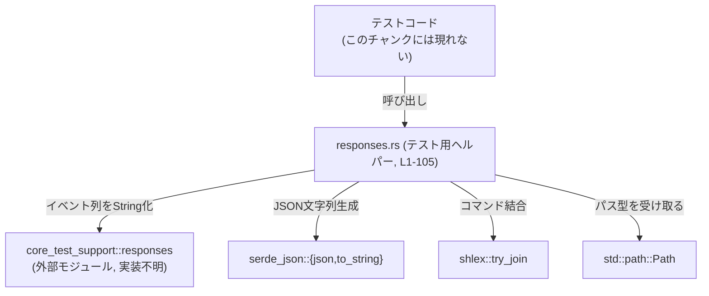
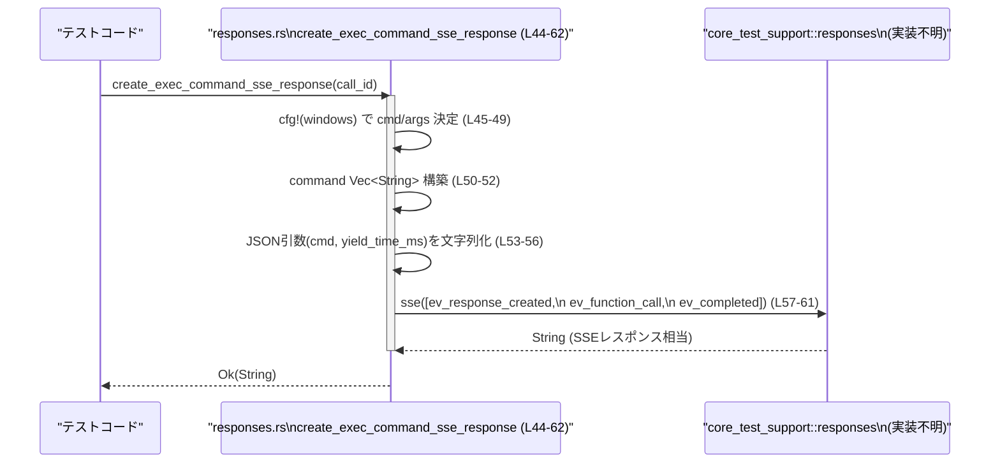

# app-server/tests/common/responses.rs コード解説

## 0. ざっくり一言

`core_test_support::responses` が提供する SSE 形式らしきレスポンス生成ユーティリティを組み合わせて、テスト用の各種ツール呼び出しレスポンス文字列を組み立てるヘルパー関数群です（`create_*_sse_response` 関数群）。  
すべての関数は `anyhow::Result<String>` を返し、主に JSON シリアライズとイベント列の組み立てを行います。

---

## 1. このモジュールの役割

### 1.1 概要

- このモジュールは、テスト内で利用する **SSE 応答に相当する文字列** を組み立てるヘルパー関数を提供します。
- 具体的には、シェルコマンド実行・パッチ適用・権限要求など、ツール呼び出しを表すイベント列を JSON パラメータ付きで構成します（`create_*_sse_response` 関数群、`L5-105`）。
- 生成処理そのものは純粋な計算であり、I/O やグローバル状態はこのファイル内にはありません。

### 1.2 アーキテクチャ内での位置づけ

- テストコードから呼ばれる **レスポンス組み立てユーティリティ** であり、実際の SSE フォーマット生成は `core_test_support::responses::sse` に委譲しています（`L1`, `L18-22`, `L26-30`, `L37-41`, `L57-61`, `L80-84`, `L100-104`）。
- JSON ペイロードの構築には `serde_json::json` マクロと `serde_json::to_string` を使用しています（`L2`, `L13-17`, `L53-56`, `L65-78`, `L88-98`）。
- 一部の関数では引数の加工に `shlex::try_join` を利用し、シェルコマンド文字列を組み立てています（`L12`）。

依存関係を簡略化した図です（このファイル全体 `L1-105` を対象）:



### 1.3 設計上のポイント

- **責務の分割**
  - このファイルは「特定シナリオのレスポンスをひとまとめに用意する」ことに特化しています。
  - 実際のイベント構造や SSE 形式への変換は `core_test_support::responses` に委譲されています（`L18-22`, `L26-30`, `L37-41`, `L57-61`, `L80-84`, `L100-104`）。
- **状態管理**
  - すべての関数はローカル変数のみを利用し、共有状態や可変グローバルはありません（全関数 `L5-105`）。
  - そのため、このファイル内のコードに限ればスレッド間で共有してもデータ競合は発生しません。
- **エラーハンドリング**
  - 返り値に `anyhow::Result<String>` を採用し、`?` 演算子で `shlex` と `serde_json` 由来のエラーをそのまま上位に伝播しています（`L10`, `L12`, `L17`, `L36`, `L56`, `L78`, `L98`）。
  - SSE イベント生成側 (`responses::sse` など) はエラーを返さず `String` を返しているため、ここからは失敗しません（`L18`, `L26`, `L37`, `L57`, `L80`, `L100`）。
- **プラットフォーム分岐**
  - `create_exec_command_sse_response` は `cfg!(windows)` で Windows / 非 Windows で異なるコマンド列を構成します（`L45-49`）。

---

## 2. 主要な機能一覧（コンポーネントインベントリー）

### 2.1 このファイルで定義されている関数

| 名前 | 種別 | 役割 / 用途 | 定義位置（根拠） |
|------|------|-------------|-------------------|
| `create_shell_command_sse_response` | 関数 | シェルコマンドツール呼び出し用のイベント列を組み立て、`String` として返す | `app-server/tests/common/responses.rs:L5-23` |
| `create_final_assistant_message_sse_response` | 関数 | 最終的なアシスタントメッセージを含むイベント列を構築して返す | `app-server/tests/common/responses.rs:L25-31` |
| `create_apply_patch_sse_response` | 関数 | パッチ適用用ツール呼び出しイベント列を構築して返す | `app-server/tests/common/responses.rs:L33-42` |
| `create_exec_command_sse_response` | 関数 | プラットフォーム依存のコマンドを実行するツール呼び出しイベント列を構築して返す | `app-server/tests/common/responses.rs:L44-62` |
| `create_request_user_input_sse_response` | 関数 | ユーザー入力（質問と選択肢）を要求するツール呼び出しイベント列を構築して返す | `app-server/tests/common/responses.rs:L64-85` |
| `create_request_permissions_sse_response` | 関数 | ファイル書き込み権限の要求を表すツール呼び出しイベント列を構築して返す | `app-server/tests/common/responses.rs:L87-105` |

### 2.2 主な外部コンポーネント

| 外部コンポーネント | 種別 | 利用内容 | 出現位置（根拠） |
|--------------------|------|----------|-------------------|
| `core_test_support::responses` | モジュール | SSE 形式らしきレスポンス文字列の生成、および各種イベント生成関数群（`sse`, `ev_response_created`, `ev_function_call`, `ev_assistant_message`, `ev_apply_patch_shell_command_call_via_heredoc`, `ev_completed`）の呼び出し | import: `L1`、使用: `L18-22`, `L26-30`, `L37-41`, `L57-61`, `L80-84`, `L100-104` |
| `serde_json::json` | マクロ | JSON ペイロードの構築に利用 | import: `L2`、使用: `L13-17`, `L53-56`, `L65-78`, `L88-98` |
| `serde_json::to_string` | 関数 | JSON 値を `String` にシリアライズ | `L13`, `L53`, `L65`, `L88` |
| `shlex::try_join` | 関数 | `Vec<String>` からシェル風クォート込みのコマンド文字列を生成 | `L12` |
| `std::path::Path` | 構造体 | `workdir` 引数の型として使用 | import: `L3`、利用: `L7` |
| `cfg!` | マクロ | Windows / 非 Windows による分岐 | `L45` |
| `std::iter::once` | 関数 | コマンド名と引数を一つの `Vec<String>` にまとめる | `L50` |

---

## 3. 公開 API と詳細解説

### 3.1 型一覧（構造体・列挙体など）

このファイル内で新たに定義されている構造体・列挙体・型エイリアスはありません（`L1-105`）。  
外部の型としては `std::path::Path` を `Option<&Path>` の形で受け取っています（`L7`）。

### 3.2 関数詳細

#### `create_shell_command_sse_response(command: Vec<String>, workdir: Option<&Path>, timeout_ms: Option<u64>, call_id: &str) -> anyhow::Result<String>`

**概要**

- シェルコマンドツール（ツール名 `"shell_command"`）を呼び出すための JSON 文字列を生成し、それを引数とするイベント列を組み立てて `String` として返します（`L12-21`）。
- 典型的には、テスト内で「このようなツール呼び出しが行われた」とみなす SSE 応答を構築する用途が想定されます（名前・パスからの推測であり、このチャンクからは確証は得られません）。

**引数**

| 引数名 | 型 | 説明 |
|--------|----|------|
| `command` | `Vec<String>` | 実行したいシェルコマンドとその引数のリスト（例: `["ls", "-la"]`）。`shlex::try_join` により 1 本のコマンドライン文字列に結合されます（`L6`, `L12`）。 |
| `workdir` | `Option<&Path>` | コマンドを実行する作業ディレクトリ。`Some` の場合は `Path::to_string_lossy` で文字列に変換し JSON に含めます（`L7`, `L15`）。 |
| `timeout_ms` | `Option<u64>` | タイムアウト時間（ミリ秒）。`Option` のまま JSON に渡されます（`L8`, `L16`）。 |
| `call_id` | `&str` | ツール呼び出しを識別する ID。`ev_function_call` の引数として渡されます（`L9`, `L20`）。 |

**戻り値**

- `anyhow::Result<String>`  
  - `Ok(String)` : `responses::sse` によって構築されたイベント列の文字列（`L18-22`）。
  - `Err(anyhow::Error)` : `shlex::try_join` か `serde_json::to_string` が失敗した場合に返されます（`L12`, `L17`）。

**内部処理の流れ**

1. `command.iter().map(String::as_str)` により `Vec<String>` を `Iterator<Item=&str>` に変換します（`L12`）。
2. `shlex::try_join` に渡して、シェル風のクォートを含む単一のコマンドライン文字列 `command_str` を生成します（`L12`）。
3. `serde_json::json!` マクロで以下のフィールドを持つ JSON オブジェクトを構築し、`serde_json::to_string` で `String` にシリアライズします（`L13-17`）。
   - `"command"`: 上記の `command_str`（`L14`）
   - `"workdir"`: `workdir.map(|w| w.to_string_lossy())` の結果（`L15`）
   - `"timeout_ms"`: 引数 `timeout_ms`（`L16`）
4. `responses::sse` に、以下 3 つのイベントを `Vec` として渡します（`L18-21`）。
   - `responses::ev_response_created("resp-1")`
   - `responses::ev_function_call(call_id, "shell_command", &tool_call_arguments)`
   - `responses::ev_completed("resp-1")`
5. `responses::sse` の返り値（`String`）を `Ok(...)` でラップして返します（`L18-22`）。

**Examples（使用例）**

テストで「シェルコマンドツールがこのように呼ばれた」という SSE 文字列を事前に構築する例です。

```rust
use std::path::Path;
use app_server::tests::common::responses::create_shell_command_sse_response;

fn build_expected_sse() -> anyhow::Result<String> {
    // "ls -la" を /tmp で 30秒タイムアウト付きで実行する想定のレスポンスを構築する
    let sse = create_shell_command_sse_response(
        vec!["ls".to_string(), "-la".to_string()],      // コマンドと引数
        Some(Path::new("/tmp")),                       // 作業ディレクトリ
        Some(30_000),                                  // タイムアウト(ms)
        "call-1",                                      // ツール呼び出しID
    )?;
    Ok(sse)
}
```

**Errors / Panics**

- `Err` になる条件
  - `shlex::try_join` がエラーを返した場合（`L12`）。  
    エラーの詳細は `shlex` クレートの仕様に依存し、このチャンクからは判断できません。
  - `serde_json::to_string` がシリアライズに失敗した場合（`L17`）。  
    一般的には循環参照などで失敗し得ますが、このコードでは単純な値だけを含むため、失敗するケースは限定的と考えられます（ただし具体条件は `serde_json` の仕様に依存します）。
- パニック
  - このファイル内では `unwrap` やインデックスアクセスなどの明示的なパニック要因は使用していません（`L5-23`）。
  - ただし `core_test_support::responses` 内部でのパニック可能性は、このチャンクからは不明です。

**Edge cases（エッジケース）**

- `command` が空のベクタの場合
  - `shlex::try_join` がどのような結果を返すかは `shlex` の仕様に依存し、このチャンクからは不明です（`L12`）。
- `workdir` が `None` の場合
  - `json!` に `None` が渡されるため、JSON 上でどのように表現されるかは `serde_json` の仕様に依存します（`L15`）。
- `workdir` に非 UTF-8 なパスが含まれる場合
  - `Path::to_string_lossy` の仕様により、非 UTF-8 部分は置換文字を含む文字列として表現されます（`L15`）。
- `timeout_ms` が `None` の場合
  - `json!` に `Option<u64>` が渡されており、`None` の表現は `serde_json` の仕様に依存します（`L16`）。

**使用上の注意点**

- `command` の内容はそのまま JSON 内 `"command"` に文字列として格納されます。実際のコマンド実行はこのファイル内では行っていません。
- この関数は共有状態を持たず純粋な計算のみを行うため、スレッド安全性の観点からは呼び出し側でロックは不要です（このファイル内のコードに限った話です）。
- エラーはすべて `anyhow::Error` としてラップされるため、テスト側で原因を区別したい場合は `downcast_ref` などで型を確認する必要があります。

---

#### `create_final_assistant_message_sse_response(message: &str) -> anyhow::Result<String>`

**概要**

- 最終的なアシスタントからのメッセージを表すイベント列を組み立てて返します。
- `"shell_command"` のようなツール呼び出しではなく、`ev_assistant_message` によるメッセージイベントを中核にしています（`L25-30`）。

**引数**

| 引数名 | 型 | 説明 |
|--------|----|------|
| `message` | `&str` | アシスタントメッセージ本文。`ev_assistant_message` の第 2 引数として渡されます（`L28`）。 |

**戻り値**

- `anyhow::Result<String>`  
  - 実装上、この関数では失敗を返し得る処理を行っておらず、常に `Ok(String)` を返します（`L25-31`）。
  - `anyhow::Result` を使うのは、他のヘルパーとインターフェースを揃えるためと考えられます（命名からの推測）。

**内部処理の流れ**

1. `responses::sse` に 3 つのイベントを渡して `String` を生成します（`L26-30`）。
   - `responses::ev_response_created("resp-1")`
   - `responses::ev_assistant_message("msg-1", message)`
   - `responses::ev_completed("resp-1")`
2. 生成された `String` を `Ok(...)` でラップして返します（`L26-30`）。

**Examples（使用例）**

```rust
use app_server::tests::common::responses::create_final_assistant_message_sse_response;

fn build_final_message() -> anyhow::Result<String> {
    let sse = create_final_assistant_message_sse_response(
        "All tasks have been completed successfully.",
    )?;
    // ここで sse を検証に利用する
    Ok(sse)
}
```

**Errors / Panics**

- この関数内で `?` は使用されておらず、エラーを返し得る処理もありません（`L25-31`）。
- パニック要因も、このファイル内には存在しません（`L25-31`）。  
  `core_test_support::responses` の内部挙動は不明です。

**Edge cases**

- `message` が空文字列でも、そのまま `ev_assistant_message` に渡されます（`L28`）。
- 非 ASCII 文字を含むメッセージも `&str` として受け取り、そのまま `responses::ev_assistant_message` に渡しています。エンコード方法はその実装に依存します。

**使用上の注意点**

- `msg-1` というメッセージ ID はこの関数内で固定されています（`L28`）。テストで複数メッセージを識別したい場合は、別のヘルパーを用意するか、ID を外部から受け取る形に変更する必要があります。
- 他の関数と戻り値の型を揃えるために `anyhow::Result` を返していますが、この関数単体は失敗しない設計です。

---

#### `create_apply_patch_sse_response(patch_content: &str, call_id: &str) -> anyhow::Result<String>`

**概要**

- パッチ内容 `patch_content` を含むツール呼び出しイベント（ツール名は `"apply_patch_shell_command_call_via_heredoc"` に相当）を SSE イベント列として構築し、`String` として返します（`L33-41`）。

**引数**

| 引数名 | 型 | 説明 |
|--------|----|------|
| `patch_content` | `&str` | 適用するパッチの内容。`ev_apply_patch_shell_command_call_via_heredoc` の引数として渡されます（`L34`, `L39`）。 |
| `call_id` | `&str` | ツール呼び出し ID。`ev_apply_patch_shell_command_call_via_heredoc` の第 1 引数として渡されます（`L35`, `L39`）。 |

**戻り値**

- `anyhow::Result<String>`  
  - `responses::sse` の結果を `Ok` でラップして返します（`L37-41`）。

**内部処理の流れ**

1. `responses::sse` に 3 つのイベントを渡します（`L37-40`）。
   - `responses::ev_response_created("resp-1")`
   - `responses::ev_apply_patch_shell_command_call_via_heredoc(call_id, patch_content)`
   - `responses::ev_completed("resp-1")`
2. 生成された `String` を `Ok` で返します（`L37-41`）。

**Examples（使用例）**

```rust
use app_server::tests::common::responses::create_apply_patch_sse_response;

fn build_patch_call() -> anyhow::Result<String> {
    let patch = "\
        --- a/file.txt\n\
        +++ b/file.txt\n\
        @@ -1 +1 @@\n\
        -old\n\
        +new\n\
    ";
    let sse = create_apply_patch_sse_response(patch, "call-2")?;
    Ok(sse)
}
```

**Errors / Panics**

- この関数内では `?` を使用しておらず、エラーを返し得る処理はありません（`L33-42`）。
- パニックはこのファイル内では発生させていません。

**Edge cases**

- `patch_content` が非常に長い場合でも、そのままイベント生成関数に渡されます（`L39`）。  
  メモリ使用量は呼び出し元の `String`/`&str` 大きさに依存します。
- 空文字列のパッチも同様に許容されています。

**使用上の注意点**

- パッチのフォーマット（例: unified diff 形式かどうか）の検証はこの関数では行っていません。適切なフォーマットであることは呼び出し側の前提条件です。
- 呼び出し ID の一貫性やユニーク性も、この関数では保証していません。

---

#### `create_exec_command_sse_response(call_id: &str) -> anyhow::Result<String>`

**概要**

- OS に応じて固定の「`echo hi`」コマンドを実行するツール呼び出しを表すイベント列を構築します（`L44-61`）。
- JSON 引数に `"cmd"` と `"yield_time_ms": 500` を含めて返します（`L53-56`）。

**引数**

| 引数名 | 型 | 説明 |
|--------|----|------|
| `call_id` | `&str` | ツール呼び出し ID。`ev_function_call` の第 1 引数として渡されます（`L44`, `L59`）。 |

**戻り値**

- `anyhow::Result<String>`  
  - 正常時は `responses::sse` で構築された文字列。
  - 失敗時は `serde_json::to_string` 由来のエラーを `anyhow::Error` として返します（`L53-56`）。

**内部処理の流れ**

1. `cfg!(windows)` により OS を判定し、`cmd` と `args` を決定します（`L45-49`）。
   - Windows の場合: `cmd = "cmd.exe"`, `args = vec!["/d", "/c", "echo hi"]`（`L45-46`）。
   - 非 Windows の場合: `cmd = "/bin/sh"`, `args = vec!["-c", "echo hi"]`（`L47-48`）。
2. `std::iter::once(cmd.to_string())` と `chain(args.into_iter().map(str::to_string))` で、`cmd` と `args` を 1 つの `Vec<String>` にまとめます（`L50-52`）。
3. `"cmd": command.join(" ")` と `"yield_time_ms": 500` を含む JSON を `serde_json::to_string` でシリアライズします（`L53-56`）。
4. `responses::sse` に 3 つのイベントを渡します（`L57-60`）。
   - `responses::ev_response_created("resp-1")`
   - `responses::ev_function_call(call_id, "exec_command", &tool_call_arguments)`
   - `responses::ev_completed("resp-1")`
5. 結果の `String` を `Ok` で返します（`L57-61`）。

**Examples（使用例）**

```rust
use app_server::tests::common::responses::create_exec_command_sse_response;

fn build_exec_command() -> anyhow::Result<String> {
    // OSに応じて "cmd.exe /d /c echo hi" または "/bin/sh -c echo hi" のようなコマンドが設定される
    let sse = create_exec_command_sse_response("call-3")?;
    Ok(sse)
}
```

**Errors / Panics**

- `serde_json::to_string` が失敗した場合に `Err(anyhow::Error)` が返されます（`L53-56`）。
- 他にエラーを返す処理はありません。
- パニックを直接発生させるコードは使用していません（`L44-62`）。

**Edge cases**

- この関数はコマンドや引数を外部から受け取らず、固定値 `"echo hi"` を使用します（`L45-49`）。  
  したがって、ユーザー入力に基づくコマンドインジェクションなどの問題は、この関数単体では発生しません。
- 非 Windows 環境で `"/bin/sh"` が存在しない場合の扱いは、実際にコマンドを実行する側の実装に依存します（このファイルでは実行は行っていません）。

**使用上の注意点**

- テストで「単純な成功ケースの exec_command 呼び出し」を表現するのに適していますが、任意のコマンドを指定したい場合は新たな関数を追加する必要があります。
- `yield_time_ms` は 500 に固定されています（`L55`）。異なる値を検証したい場合は関数を拡張する必要があります。

---

#### `create_request_user_input_sse_response(call_id: &str) -> anyhow::Result<String>`

**概要**

- ユーザーに確認ダイアログのような質問を提示するためのツール呼び出しイベント列を構築します（`L64-83`）。
- JSON 引数に `"questions"` 配列を含み、そこに 1 つの質問と 2 つの選択肢（Yes/No）を埋め込んでいます（`L65-77`）。

**引数**

| 引数名 | 型 | 説明 |
|--------|----|------|
| `call_id` | `&str` | ツール呼び出し ID。`ev_function_call` の第 1 引数として渡されます（`L64`, `L82`）。 |

**戻り値**

- `anyhow::Result<String>`  
  - `serde_json::to_string` に成功した場合は `Ok(String)`（`L65-78`, `L80-84`）。
  - 失敗した場合は `Err(anyhow::Error)`。

**内部処理の流れ**

1. `serde_json::json!` で固定構造の JSON を作成し、`serde_json::to_string` で `String` に変換します（`L65-78`）。
   - `"questions"`: 要素数 1 の配列（`L66-77`）
     - `"id": "confirm_path"`（`L67`）
     - `"header": "Confirm"`（`L68`）
     - `"question": "Proceed with the plan?"`（`L69`）
     - `"options"`: 2 要素の配列（`L70-76`）
       - `"Yes (Recommended)" / "Continue the current plan."`
       - `"No" / "Stop and revisit the approach."`
2. `responses::sse` に 3 つのイベントを渡します（`L80-83`）。
   - `responses::ev_response_created("resp-1")`
   - `responses::ev_function_call(call_id, "request_user_input", &tool_call_arguments)`
   - `responses::ev_completed("resp-1")`
3. 結果の `String` を `Ok` で返します（`L80-84`）。

**Examples（使用例）**

```rust
use app_server::tests::common::responses::create_request_user_input_sse_response;

fn build_user_input_request() -> anyhow::Result<String> {
    let sse = create_request_user_input_sse_response("call-4")?;
    Ok(sse)
}
```

**Errors / Panics**

- `serde_json::to_string` が失敗した場合に `Err(anyhow::Error)` を返します（`L65-78`）。
- その他、このファイル内にパニック要因はありません。

**Edge cases**

- 質問や選択肢はすべて固定の文字列であり、引数から動的に変更することはできません（`L66-76`）。
- JSON 構造が変化しないため、ツール側の API が変わった場合にはこの関数自体を修正する必要があります。

**使用上の注意点**

- 複数の質問や異なる選択肢を扱いたい場合には、この関数を汎用化するか、新たなヘルパーを追加する必要があります。
- `call_id` の一貫性は呼び出し側で管理する必要があります。

---

#### `create_request_permissions_sse_response(call_id: &str) -> anyhow::Result<String>`

**概要**

- ファイルシステムへの書き込み権限を要求するツール呼び出しイベント列を構築します（`L87-103`）。
- JSON 引数に `"reason"` および `"permissions.file_system.write"` 配列を含めます（`L88-97`）。

**引数**

| 引数名 | 型 | 説明 |
|--------|----|------|
| `call_id` | `&str` | ツール呼び出し ID。`ev_function_call` の第 1 引数です（`L87`, `L102`）。 |

**戻り値**

- `anyhow::Result<String>`  
  - 正常時: `Ok(String)`（`L100-104`）。
  - JSON シリアライズ失敗時: `Err(anyhow::Error)`（`L88-98`）。

**内部処理の流れ**

1. `serde_json::json!` で以下の JSON オブジェクトを構築します（`L88-97`）。
   - `"reason": "Select a workspace root"`（`L89`）
   - `"permissions": { "file_system": { "write": [".", "../shared"] } }`（`L90-97`）
2. 上記 JSON を `serde_json::to_string` で文字列化します（`L88-98`）。
3. `responses::sse` に 3 つのイベントを渡します（`L100-103`）。
   - `responses::ev_response_created("resp-1")`
   - `responses::ev_function_call(call_id, "request_permissions", &tool_call_arguments)`
   - `responses::ev_completed("resp-1")`
4. 結果の `String` を `Ok` で返します（`L100-104`）。

**Examples（使用例）**

```rust
use app_server::tests::common::responses::create_request_permissions_sse_response;

fn build_permissions_request() -> anyhow::Result<String> {
    let sse = create_request_permissions_sse_response("call-5")?;
    Ok(sse)
}
```

**Errors / Panics**

- `serde_json::to_string` の失敗時に `Err(anyhow::Error)` を返します（`L88-98`）。
- パニックを明示的に起こすコードはありません。

**Edge cases**

- `"write": [".", "../shared"]` というパスは固定であり、他のパスを要求することはできません（`L92-94`）。
- `"reason"` も固定文字列です（`L89`）。

**使用上の注意点**

- 要求するパーミッション内容を変更したい場合は、この関数内の `json!` の定義を修正する必要があります。
- ツール側の権限モデルの変更に追従するため、JSON 構造とツール仕様を整合させることが重要です。

---

### 3.3 その他の関数

このファイル内には、上記以外の補助関数やラッパー関数は定義されていません（`L1-105`）。

---

## 4. データフロー

### 4.1 代表的なシナリオ：`create_exec_command_sse_response` の場合

テストコードが `create_exec_command_sse_response` を呼び出して SSE 文字列を取得するまでの流れを示します。



このシナリオの要点:

- データはすべて関数ローカルで組み立てられ、共有状態はありません（`L44-62`）。
- 実際の SSE 形式への変換ロジックは `core_test_support::responses::sse` に隠蔽されており、このファイルからはその詳細は分かりません（`L57-61`）。
- エラーが発生し得るのは JSON シリアライズ部分だけであり、その場合は `anyhow::Error` となってテストコード側に伝播します（`L53-56`）。

---

## 5. 使い方（How to Use）

### 5.1 基本的な使用方法

テストコードからの典型的な利用パターンは「期待する SSE 文字列を組み立てて、テスト対象の出力と比較する」といった形になります。

```rust
use app_server::tests::common::responses::{
    create_shell_command_sse_response,
    create_exec_command_sse_response,
};
use std::path::Path;

fn test_shell_command_sse() -> anyhow::Result<()> {
    // 期待される SSE 文字列をヘルパーで構築する
    let expected = create_shell_command_sse_response(
        vec!["echo".to_string(), "hi".to_string()],
        Some(Path::new(".")),
        Some(1000),
        "call-1",
    )?;

    // 実際の出力をテスト対象から取得する（実装はこのチャンクには現れません）
    let actual = get_sse_from_server_somehow()?;

    assert_eq!(actual, expected);
    Ok(())
}
```

このように、初期化（ここでは特に不要）→ ヘルパー呼び出し → 結果文字列をテスト対象と比較、という流れになります。

### 5.2 よくある使用パターン

1. **ツール呼び出しごとの専用ヘルパー利用**

   - コマンド実行: `create_exec_command_sse_response`（`L44-62`）
   - パッチ適用: `create_apply_patch_sse_response`（`L33-42`）
   - ユーザー入力要求: `create_request_user_input_sse_response`（`L64-85`）
   - 権限要求: `create_request_permissions_sse_response`（`L87-105`）

   それぞれ、テストしたいツールの種類に応じて関数を使い分けます。

2. **最終メッセージの検証**

   - 対話が終了した際の最終メッセージを検証する場合は `create_final_assistant_message_sse_response` を用います（`L25-31`）。

### 5.3 よくある間違い（想定されるもの）

コードから推測される、起こりうる誤用パターンと正しい使い方の一例です。

```rust
// 誤りの可能性がある例: command にすでに1本の文字列を入れてしまう
let sse = create_shell_command_sse_response(
    vec!["ls -la".to_string()], // ここで空白を含んだ1要素にしてしまう
    None,
    None,
    "call-1",
);

// 望ましい例: 各トークンを個別の要素として渡す
let sse = create_shell_command_sse_response(
    vec!["ls".to_string(), "-la".to_string()],
    None,
    None,
    "call-1",
);
```

`shlex::try_join` がどのように振る舞うかは `shlex` の仕様に依存しますが、一般的には「トークンごとに分割してベクタに入れる」方が意図したコマンドラインを構築しやすくなります（`L12`）。

### 5.4 使用上の注意点（まとめ）

- **エラー処理**
  - `create_shell_command_sse_response` と `create_exec_command_sse_response` 以外の関数は、現状このファイル内では失敗しませんが、戻り値は統一的に `anyhow::Result<String>` になっているため、呼び出し側では `?` などで一括処理できます。
- **スレッド安全性**
  - このファイル内の関数は共有状態を持たないため、複数スレッドから同時に呼び出しても、このコードに起因するデータ競合は発生しません。
  - ただし、`core_test_support::responses` 側の状態管理については、このチャンクからは不明です。
- **JSON スキーマの固定**
  - `request_user_input` や `request_permissions` の JSON 構造はコードにベタ書きされています（`L65-77`, `L88-97`）。ツールの API が変更された場合には、このコードを更新する必要があります。
- **テスト専用である点**
  - ファイルパスや依存モジュールから、このコードはテスト用であると解釈できます（`tests/common/responses.rs`, `L1`）。本番コードでの直接利用は想定されていない可能性があります。

---

## 6. 変更の仕方（How to Modify）

### 6.1 新しい機能を追加する場合

新しい種類のツール呼び出しヘルパーを追加したい場合の基本的なステップです。

1. **JSON ペイロード構造を決める**
   - ツールの API 仕様に基づいて、必要なフィールドを整理します。
2. **`json!` マクロで JSON を構築**
   - 既存の `create_request_user_input_sse_response` や `create_request_permissions_sse_response` を参考に、`serde_json::json!` でオブジェクトを構築します（`L65-78`, `L88-98`）。
3. **`serde_json::to_string` で文字列化**
   - JSON 値を `String` にシリアライズします（`L13`, `L53`, `L65`, `L88`）。
4. **イベント列の構成**
   - `responses::ev_response_created` → ツール固有のイベント（`ev_function_call` など） → `responses::ev_completed` の順で `Vec` に詰め、`responses::sse` に渡します（`L18-22`, `L57-61`, `L80-84`, `L100-104`）。
5. **戻り値を `anyhow::Result<String>` に揃える**
   - `Ok(responses::sse(...))` の形で返します。

### 6.2 既存の機能を変更する場合

- **影響範囲の確認**
  - 変更対象関数を呼び出しているテストコードを検索し、引数や期待される JSON 構造が変わらないかを確認します（このチャンクに使用箇所は現れません）。
- **契約（前提条件）の確認**
  - 例: `create_shell_command_sse_response` の `command` は「トークンごとの `Vec<String>`」という前提で使われている可能性があります。
- **ツール側仕様との整合**
  - JSON ペイロードのフィールド名・構造はツールの API 契約に依存します。変更する場合は双方を合わせる必要があります。
- **エラー経路の見直し**
  - 新たに `?` を追加する場合、テスト全体のエラー処理に影響しないか確認します。

---

## 7. 関連ファイル

| パス / モジュール | 役割 / 関係 |
|-------------------|------------|
| `core_test_support::responses` | SSE 形式らしきレスポンス文字列の生成と、`ev_response_created`, `ev_function_call`, `ev_assistant_message`, `ev_apply_patch_shell_command_call_via_heredoc`, `ev_completed` などのイベント生成関数を提供するモジュールです（`L1`, `L18-22`, `L26-30`, `L37-41`, `L57-61`, `L80-84`, `L100-104`）。物理ファイルパスはこのチャンクからは分かりません。 |
| `tests` 配下の各テストファイル | このヘルパー関数群の利用側と推測されますが、このチャンクには具体的な使用箇所は現れません。 |

---

### Bugs / Security（要約）

- **潜在的なバグ**
  - `create_shell_command_sse_response` での `shlex::try_join` の失敗条件が `shlex` の仕様に依存しており、エラー時にどのようなメッセージになるかは不明です（`L12`）。テストでエラー内容まで検証したい場合は注意が必要です。
- **セキュリティ**
  - このファイル自身はテスト用であり、外部からコマンドを実行したりファイルシステムを操作したりはしていません。  
    コマンドやパスはすべて文字列として JSON に埋め込まれるのみです。
  - 実際のコマンド実行や権限処理は別コンポーネントに委譲されており、その安全性はこのチャンクからは評価できません。

以上が、このファイルの公開 API・コアロジック・データフロー、および安全性・エラーハンドリング観点を中心とした解説です。
