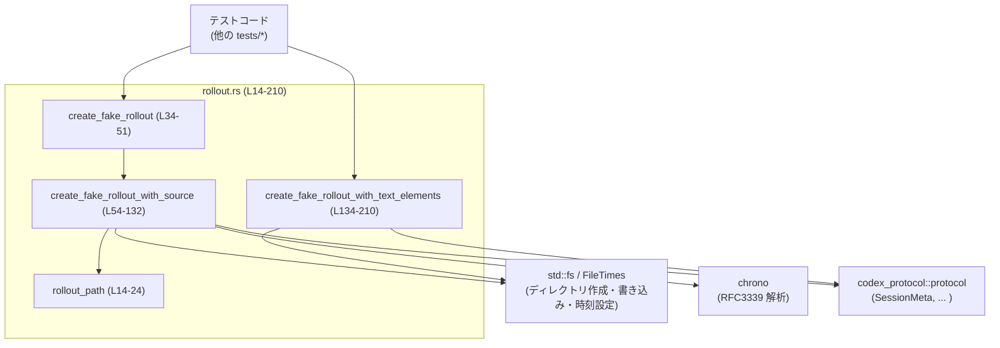
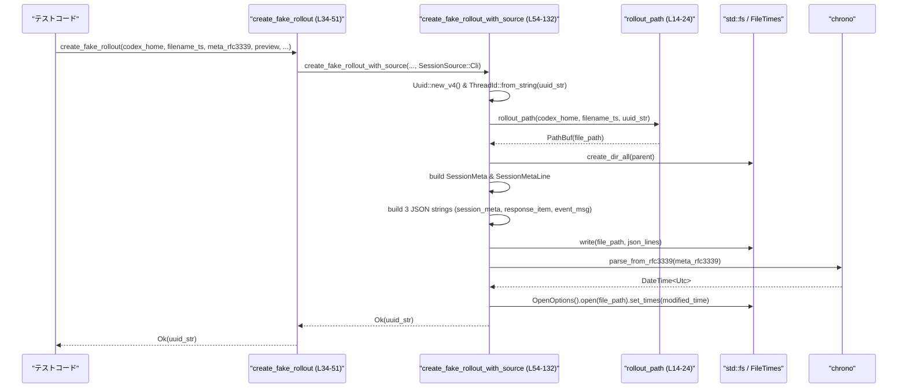

# app-server/tests/common/rollout.rs

## 0. ざっくり一言

`CODEX_HOME/sessions/YYYY/MM/DD/rollout-*.jsonl` というセッション（会話）ログファイルを、テスト用に最小構成で生成するヘルパー関数群です（`create_fake_rollout*`） 〔根拠: `rollout.rs:L26-33`, `L34-51`, `L54-132`, `L134-210`〕。

---

## 1. このモジュールの役割

### 1.1 概要

- このモジュールは、Codex アプリケーションのテストで使用する **「ロールアウト（session）JSONL ファイル」** を簡単に生成するためのヘルパーを提供します。
- 日付付きディレクトリ構造 (`sessions/YYYY/MM/DD`) とファイル名 (`rollout-<timestamp>-<uuid>.jsonl`) を構築し、セッションメタ情報とユーザーメッセージを含む 3 行の JSONL を出力します 〔`rollout.rs:L14-24`, `L73-93`, `L95-122`, `L178-205`〕。
- バリアントとして、`SessionSource` を明示的に指定する関数と、`text_elements` 付きイベントメッセージを出力する関数があります 〔`rollout.rs:L54-62`, `L134-142`〕。

### 1.2 アーキテクチャ内での位置づけ

- **テストコード側**から呼び出される、純粋なユーティリティモジュールです（`tests/common` 配下） 〔`rollout.rs` のパス指定より〕。
- Codex プロトコル定義クレート `codex_protocol` の型 (`ThreadId`, `SessionMeta`, `SessionMetaLine`, `SessionSource`, `GitInfo`) を利用して、プロダクションコードと同じメタデータ形式で JSON を構築します 〔`rollout.rs:L2-6`, `L74-88`, `L90-93`, `L157-172`, `L173-176`〕。
- ファイルシステム操作 (`std::fs`, `FileTimes`) と時間処理 (`chrono`) を用いて、実際のセッションロールアウトファイルに近い状態（内容と更新時刻）を再現します 〔`rollout.rs:L8-9`, `L124-130`, `L125-126`〕。



### 1.3 設計上のポイント

- **状態を持たない関数群**  
  すべて `pub fn` であり、グローバル状態や内部キャッシュなどは持たず、引数だけからパスやファイル内容を決定します 〔`rollout.rs:L14-24`, `L34-51`, `L54-132`, `L134-210`〕。
- **ファイルパスの生成規約が固定**  
  `filename_ts` 文字列から `年(0..4) / 月(5..7) / 日(8..10)` をスライスで抽出し、`sessions/YYYY/MM/DD/` ディレクトリを構成します 〔`rollout.rs:L15-17`, `L148-151`〕。この前提が崩れると panic の可能性があります。
- **JSON メタデータはプロトコル型経由で構築**  
  `SessionMeta` と `SessionMetaLine` 構造体を作成し、`serde_json::to_value` で JSON 値に変換した上で、`json!` マクロに埋め込んでいます 〔`rollout.rs:L74-93`, `L157-176`〕。
- **エラーハンドリングは `anyhow::Result` + `?`**  
  すべての公開関数は `anyhow::Result<String>` を返し、I/O、時刻パース、`ThreadId` 変換などの失敗は `?` 演算子で上位に伝播します 〔`rollout.rs:L34-41`, `L54-62`, `L90-93`, `L124-130`, `L125`, `L173-176`, `L178-208`〕。
- **一部のみファイルの更新時刻を調整**  
  `create_fake_rollout_with_source` では JSONL 書き込み後に mtime を `meta_rfc3339` に合わせて設定しますが、`create_fake_rollout_with_text_elements` では時刻調整を行っていません 〔`rollout.rs:L124-130`, `L208-209`〕。

---

## 2. 主要な機能一覧（コンポーネントインベントリー）

### 2.1 関数インベントリー

| 名前 | 種別 | シグネチャ概要 | 役割 | 定義位置 |
|------|------|----------------|------|----------|
| `rollout_path` | 関数 | `(&Path, &str, &str) -> PathBuf` | セッションロールアウトファイルのパスを組み立てる | `rollout.rs:L14-24` |
| `create_fake_rollout` | 関数 | `(&Path, &str, &str, &str, Option<&str>, Option<GitInfo>) -> Result<String>` | `SessionSource::Cli` 固定でロールアウトファイルを作る簡易ラッパー | `rollout.rs:L34-51` |
| `create_fake_rollout_with_source` | 関数 | `(&Path, &str, &str, &str, Option<&str>, Option<GitInfo>, SessionSource) -> Result<String>` | ソースを明示してロールアウト JSONL を生成し、mtime を調整するコア関数 | `rollout.rs:L54-132` |
| `create_fake_rollout_with_text_elements` | 関数 | `(&Path, &str, &str, &str, Vec<Value>, Option<&str>, Option<GitInfo>) -> Result<String>` | `text_elements` と `local_images` を含むイベント行を持つロールアウト JSONL を生成する | `rollout.rs:L134-210` |

### 2.2 機能一覧（要約）

- セッションファイルパスの構築: `rollout_path` でディレクトリとファイル名を一貫した規約で生成します。
- CLI セッション用の最小ロールアウトファイル生成: `create_fake_rollout` が、デフォルトソース `SessionSource::Cli` で JSONL ファイルを作成します。
- 任意のセッションソースでのロールアウト生成: `create_fake_rollout_with_source` が、`SessionMeta` を構築し 3 行の JSONL を生成、ファイルの更新時刻も調整します。
- `text_elements` 付きイベントメッセージ生成: `create_fake_rollout_with_text_elements` が、テキスト要素と `local_images` フィールドを含むイベント行を出力します。

---

## 3. 公開 API と詳細解説

### 3.1 型一覧（構造体・列挙体など）

このファイル内で **新たに定義される型はありません**。

参考として、外部から利用している主な型を挙げます（定義は他ファイルで、このチャンクには現れません）。

| 名前 | 種別 | 用途 | 使用箇所 |
|------|------|------|----------|
| `ThreadId` | 構造体（推定） | 会話スレッド ID 型。UUID 文字列から生成して `SessionMeta.id` に格納。 | `rollout.rs:L2`, `L65`, `L145` |
| `GitInfo` | 構造体（推定） | Git 情報格納。`SessionMetaLine` の `git` として JSON に含める。詳細は不明。 | `rollout.rs:L3`, `L40`, `L60`, `L140`, `L173-176` |
| `SessionMeta` | 構造体 | セッションメタデータ（ID・タイムスタンプ・起点など）を保持。 | `rollout.rs:L4`, `L74-88`, `L157-172` |
| `SessionMetaLine` | 構造体 | メタと Git 情報をまとめた JSON 行用の型。 | `rollout.rs:L5`, `L90-93`, `L173-176` |
| `SessionSource` | 列挙体（推定） | セッションの起源（CLI など）を表す。 | `rollout.rs:L6`, `L49`, `L61`, `L81`, `L164` |

> これらの型のフィールドや詳細な仕様は、このチャンクには現れません。

---

### 3.2 関数詳細

#### `rollout_path(codex_home: &Path, filename_ts: &str, thread_id: &str) -> PathBuf`

**概要**

- Codex のホームディレクトリ (`codex_home`) と、タイムスタンプ文字列 (`filename_ts`)、スレッド ID 文字列 (`thread_id`) から、ロールアウト JSONL ファイルのフルパスを生成します 〔`rollout.rs:L14-24`〕。

**引数**

| 引数名 | 型 | 説明 |
|--------|----|------|
| `codex_home` | `&Path` | `CODEX_HOME` 相当のルートディレクトリパス。 |
| `filename_ts` | `&str` | ファイル名用タイムスタンプ。`"YYYY-MM-DDThh-mm-ss"` を前提とした位置スライスを行う 〔`rollout.rs:L15-17`〕。 |
| `thread_id` | `&str` | 会話スレッド ID（通常 UUID 文字列）で、ファイル名の一部として使用される 〔`rollout.rs:L23`〕。 |

**戻り値**

- `PathBuf`:  
  `codex_home/sessions/YYYY/MM/DD/rollout-<filename_ts>-<thread_id>.jsonl` というパス 〔`rollout.rs:L18-23`〕。

**内部処理の流れ**

1. `filename_ts[0..4]`, `[5..7]`, `[8..10]` で年・月・日部分を抽出 〔`rollout.rs:L15-17`〕。
2. `codex_home.join("sessions").join(year).join(month).join(day)` でディレクトリパスを組み立てる 〔`rollout.rs:L18-22`〕。
3. `format!("rollout-{filename_ts}-{thread_id}.jsonl")` を最後に `join` してファイル名付きパスを返す 〔`rollout.rs:L23`〕。

**Examples（使用例）**

```rust
use std::path::Path;
use app_server::tests::common::rollout::rollout_path; // パスは実際のモジュール構造に合わせる

let codex_home = Path::new("/tmp/codex_home");            // CODEX_HOME 相当のパス
let filename_ts = "2024-01-02T03-04-05";                  // YYYY-MM-DDThh-mm-ss
let thread_id = "123e4567-e89b-12d3-a456-426614174000";   // 任意のスレッドID

let path = rollout_path(codex_home, filename_ts, thread_id);
// => /tmp/codex_home/sessions/2024/01/02/rollout-2024-01-02T03-04-05-123e4567-e89b-12d3-a456-426614174000.jsonl
```

**Errors / Panics**

- 関数の戻り値は `PathBuf` であり、`Result` ではありません。
- ただし、`filename_ts` が短すぎる・想定と異なる UTF-8 文字列の場合、`&filename_ts[0..4]` などのスライスで **panic** が発生する可能性があります 〔`rollout.rs:L15-17`〕。
  - インデックスが文字境界でない場合に発生します（Rust の `str` スライス仕様）。

**Edge cases（エッジケース）**

- `filename_ts` が `"20240102T030405"` のように区切り文字なしでも、単に `0..4` / `5..7` / `8..10` の位置にある文字列が年・月・日として使用されます。フォーマットの検証は行いません。
- `thread_id` に `/` などのファイルシステム上で特別な意味を持つ文字が含まれていても、そのままファイル名に入ります。OS 上で許可されない文字列の場合は、**後段のファイル操作時にエラー** となる可能性がありますが、この関数自体は検知しません。

**使用上の注意点**

- `filename_ts` には必ず 10 文字以上（少なくとも `YYYY-MM-DD` 相当）を渡す必要があります。推奨フォーマットは doc コメントで指定されている `"YYYY-MM-DDThh-mm-ss"` です 〔`rollout.rs:L28`〕。
- テストで `rollout_path` のパス構造に依存する場合、`create_fake_rollout_with_text_elements` でも同じロジックが複製されている点に注意してください 〔`rollout.rs:L148-151`〕。

---

#### `create_fake_rollout(...) -> Result<String>`

```rust
pub fn create_fake_rollout(
    codex_home: &Path,
    filename_ts: &str,
    meta_rfc3339: &str,
    preview: &str,
    model_provider: Option<&str>,
    git_info: Option<GitInfo>,
) -> Result<String>
```

**概要**

- CLI からのセッション（`SessionSource::Cli`）を想定した、最小限のロールアウト JSONL ファイルを生成する **ラッパー関数** です。
- 実際の処理は `create_fake_rollout_with_source` に委譲されます 〔`rollout.rs:L42-50`〕。

**引数**

| 引数名 | 型 | 説明 |
|--------|----|------|
| `codex_home` | `&Path` | CODEX_HOME ルートディレクトリ。 |
| `filename_ts` | `&str` | ファイル名用タイムスタンプ。`rollout_path` と同じフォーマット前提。 |
| `meta_rfc3339` | `&str` | JSON 各行の `"timestamp"` や `SessionMeta.timestamp` に使う RFC3339 形式の文字列 〔`rollout.rs:L77`, `L97`, `L103`, `L113`〕。 |
| `preview` | `&str` | ユーザーメッセージのプレビュー（`response_item` と `event_msg` 両方で使用） 〔`rollout.rs:L108`, `L117`〕。 |
| `model_provider` | `Option<&str>` | メタ情報の `model_provider` フィールドに入れるプロバイダ名（例: `"openai"`） 〔`rollout.rs:L85`〕。 |
| `git_info` | `Option<GitInfo>` | Git 情報。`SessionMetaLine.git` として JSON メタ行に含める 〔`rollout.rs:L90-93`〕。 |

**戻り値**

- `Result<String>`:  
  - `Ok(String)`: 生成された会話／セッション UUID 文字列（新規生成された `Uuid` を `ThreadId` に変換したもの） 〔`rollout.rs:L63-65`, `L131`〕。
  - `Err(anyhow::Error)`: 下位処理（ディレクトリ作成、ファイル書き込み、時刻パースなど）での失敗をラップしたエラー。

**内部処理の流れ**

1. 受け取った引数をそのまま `create_fake_rollout_with_source` に渡し、`source` に `SessionSource::Cli` を指定する 〔`rollout.rs:L42-50`〕。
2. 戻り値の `Result<String>` をそのまま返却する 〔`rollout.rs:L49-51`〕。

**Examples（使用例）**

```rust
use std::path::Path;
use codex_protocol::protocol::GitInfo;

fn create_rollout_for_test() -> anyhow::Result<String> {
    let codex_home = Path::new("/tmp/codex_home");
    let filename_ts = "2024-01-02T03-04-05";         // ファイル名用
    let meta_ts = "2024-01-02T03:04:05Z";            // RFC3339
    let preview = "first user message";
    let model_provider = Some("openai");
    let git_info: Option<GitInfo> = None;            // Git 情報不要なら None

    let conversation_id = create_fake_rollout(
        codex_home,
        filename_ts,
        meta_ts,
        preview,
        model_provider,
        git_info,
    )?;
    Ok(conversation_id)
}
```

**Errors / Panics**

- この関数自身は `?` を使わず、すべて `create_fake_rollout_with_source` に委譲しているため、エラー条件はそちらと同じです。
- panic の可能性も、間接的に `filename_ts` のスライスなど下位関数の挙動に依存します。

**Edge cases（エッジケース）**

- `meta_rfc3339` が RFC3339 として不正な場合や、`codex_home` が存在しない、権限がないなどのケースでは `Err` になります（実際のエラー生成は `create_fake_rollout_with_source` 内） 〔`rollout.rs:L124-130`, `L125`〕。

**使用上の注意点**

- セッションソースが `Cli` 以外（例: `Api`）であるケースをテストしたい場合は、この関数ではなく `create_fake_rollout_with_source` を用いる必要があります。

---

#### `create_fake_rollout_with_source(...) -> Result<String>`

```rust
pub fn create_fake_rollout_with_source(
    codex_home: &Path,
    filename_ts: &str,
    meta_rfc3339: &str,
    preview: &str,
    model_provider: Option<&str>,
    git_info: Option<GitInfo>,
    source: SessionSource,
) -> Result<String>
```

**概要**

- 指定された `SessionSource` とメタ情報を使って、ロールアウト JSONL ファイルを 3 行で生成し、ファイルの更新時刻を `meta_rfc3339` に合わせます 〔`rollout.rs:L54-62`, `L73-93`, `L95-122`, `L124-130`〕。
- テスト用ロールアウトファイル生成の **コアロジック** です。

**引数**

| 引数名 | 型 | 説明 |
|--------|----|------|
| `codex_home` | `&Path` | CODEX_HOME ルートディレクトリ。 |
| `filename_ts` | `&str` | ファイル名用タイムスタンプ（`rollout_path` と同じ前提）。 |
| `meta_rfc3339` | `&str` | RFC3339 形式のタイムスタンプ。JSON 各行の `"timestamp"` と `SessionMeta.timestamp` に使用。 |
| `preview` | `&str` | ユーザーメッセージ本文（プレビュー）。 |
| `model_provider` | `Option<&str>` | メタ情報の `model_provider` を設定するためのオプション。 |
| `git_info` | `Option<GitInfo>` | Git 情報を JSON メタ行に含めるためのオプション。 |
| `source` | `SessionSource` | セッションの起源（CLI / API 等） 〔`rollout.rs:L61`, `L81`〕。 |

**戻り値**

- `Result<String>`:  
  - `Ok(uuid_str)`: 新規に生成した会話 UUID 文字列 〔`rollout.rs:L63-65`, `L131`〕。
  - `Err(anyhow::Error)`: 下記のどこかの処理で発生したエラー。

**内部処理の流れ（アルゴリズム）**

1. **UUID と ThreadId の生成**  
   `Uuid::new_v4()` で乱数 UUID を生成し、`uuid.to_string()` を `ThreadId::from_string` に渡して会話 ID を得ます 〔`rollout.rs:L63-65`〕。  
   → `ThreadId::from_string` の仕様はこのチャンクには現れませんが、エラーを `?` で伝播します。

2. **ファイルパスとディレクトリ作成**  
   - `rollout_path(codex_home, filename_ts, &uuid_str)` でファイルパスを構成 〔`rollout.rs:L67`〕。
   - `file_path.parent()` で親ディレクトリを取得し、`None` の場合は `anyhow!("missing rollout parent directory")` でエラーに変換 〔`rollout.rs:L68-70`〕。
   - `fs::create_dir_all(dir)?` で必要なディレクトリ階層を作成 〔`rollout.rs:L71`〕。

3. **メタ情報の構築**  
   - `SessionMeta` 構造体を直接構築し、ID やタイムスタンプ、`cwd="/"`、`originator="codex"`, `cli_version="0.0.0"`, `source` などをセット 〔`rollout.rs:L74-88`〕。
   - `model_provider` は `Option<&str>` から `Option<String>` に `.map(str::to_string)` で変換 〔`rollout.rs:L85`〕。
   - それを `SessionMetaLine { meta, git: git_info }` に包み、`serde_json::to_value` で JSON 値にシリアライズ 〔`rollout.rs:L90-93`〕。

4. **3 行分の JSONL 文字列を生成** 〔`rollout.rs:L95-122`〕  
   `lines` 配列に以下を格納します:
   - 1 行目: `"type": "session_meta"` と `payload: payload` を持つ行。
   - 2 行目: `"type": "response_item"` で、`payload` は `{"type":"message","role":"user","content":[{"type":"input_text","text": preview}]}`。
   - 3 行目: `"type": "event_msg"` で、`payload` は `{"type":"user_message","message": preview,"kind":"plain"}`。

5. **ファイルへの書き込み**  
   - `fs::write(&file_path, lines.join("\n") + "\n")?` で 3 行の JSONL と末尾の改行をまとめて書き込み 〔`rollout.rs:L124`〕。

6. **ファイルの更新時刻を設定**  
   - `chrono::DateTime::parse_from_rfc3339(meta_rfc3339)?` でタイムスタンプをパースし、`with_timezone(&chrono::Utc)` によって UTC に合わせる 〔`rollout.rs:L125`〕。
   - `FileTimes::new().set_modified(parsed.into())` で `SystemTime` に変換し、`set_modified` 時刻を指定 〔`rollout.rs:L126`〕。
   - `OpenOptions::new().append(true).open(&file_path)?.set_times(times)?` でファイルを開き、タイムスタンプを設定 〔`rollout.rs:L127-130`〕。

7. **UUID 文字列を返却**  
   - 最後に `Ok(uuid_str)` を返します 〔`rollout.rs:L131`〕。

**Examples（使用例）**

```rust
use std::path::Path;
use codex_protocol::protocol::{GitInfo, SessionSource};

fn create_rollout_with_source() -> anyhow::Result<String> {
    let codex_home = Path::new("/tmp/codex_home");
    let filename_ts = "2024-01-02T03-04-05";       // ファイル名用
    let meta_ts = "2024-01-02T03:04:05Z";          // RFC3339
    let preview = "hello from user";
    let model_provider = None;
    let git_info: Option<GitInfo> = None;

    let source = SessionSource::Cli;               // 例: CLI を明示
    let id = create_fake_rollout_with_source(
        codex_home,
        filename_ts,
        meta_ts,
        preview,
        model_provider,
        git_info,
        source,
    )?;

    // ここで `/tmp/codex_home/sessions/2024/01/02/` 以下にファイルが生成されている
    Ok(id)
}
```

**Errors / Panics**

- `Err` になりうる主な条件（すべて `?` によりそのまま伝播）:
  - `ThreadId::from_string(&uuid_str)` が失敗した場合 〔`rollout.rs:L65`〕。
  - `file_path.parent()` が `None` だった場合（通常は起こりにくいが、理論上はあり得る） 〔`rollout.rs:L68-70`〕。
  - `fs::create_dir_all(dir)` に失敗した場合（権限不足など） 〔`rollout.rs:L71`〕。
  - `serde_json::to_value(...)` が失敗した場合（`SessionMetaLine` がシリアライズ不可能な状態など） 〔`rollout.rs:L90-93`〕。
  - `fs::write(&file_path, ...)` が失敗した場合（ディスクフル・権限不足など） 〔`rollout.rs:L124`〕。
  - `chrono::DateTime::parse_from_rfc3339(meta_rfc3339)` が失敗した場合（不正なフォーマット） 〔`rollout.rs:L125`〕。
  - `OpenOptions::new().append(true).open(&file_path)` または `.set_times(times)` が失敗した場合 〔`rollout.rs:L127-130`〕。
- panic の可能性:
  - 直接は `filename_ts` のスライスを行っていませんが、同じ `filename_ts` を利用している `rollout_path` 内で panic する可能性があります（前述）。

**Edge cases（エッジケース）**

- `meta_rfc3339` が `"2024-01-02 03:04:05"` のような RFC3339 以外の形式だと、時刻パースの段階で `Err` になります。
- `git_info` が `None` の場合、`SessionMetaLine.git` がどうシリアライズされるかは `SessionMetaLine` の定義に依存しますが、このチャンクには現れません。
- 同一の `codex_home`/`filename_ts` で並行して複数回呼び出しても、UUID が毎回異なるため、ファイル名は衝突しにくい設計になっています 〔`rollout.rs:L63-65`, `L67`, `L23`〕。

**使用上の注意点**

- `meta_rfc3339` はファイルシステムの mtime にも反映されるため、「ファイル時刻を使ってソートするテスト」などに利用できますが、不正な時刻文字列を渡すとエラーになる点に注意します。
- `source` を変えることで、プロダクションコード側の「ソース別の挙動」をテストできる可能性がありますが、`SessionSource` のバリアントはこのチャンクには現れません。
- ファイル生成後に内容を読み取るテストを書く場合、JSON の構造（3 行、それぞれ `type: session_meta / response_item / event_msg`）に依存してアサートするのが自然です 〔`rollout.rs:L95-122`〕。

---

#### `create_fake_rollout_with_text_elements(...) -> Result<String>`

```rust
pub fn create_fake_rollout_with_text_elements(
    codex_home: &Path,
    filename_ts: &str,
    meta_rfc3339: &str,
    preview: &str,
    text_elements: Vec<serde_json::Value>,
    model_provider: Option<&str>,
    git_info: Option<GitInfo>,
) -> Result<String>
```

**概要**

- `create_fake_rollout_with_source` と似ていますが、`event_msg` の `payload` に `text_elements` と `local_images: []` を含める **拡張版ロールアウト生成関数** です 〔`rollout.rs:L178-205`〕。
- mtime の調整は行いません 〔`rollout.rs:L208-209`〕。

**引数**

| 引数名 | 型 | 説明 |
|--------|----|------|
| `codex_home` | `&Path` | CODEX_HOME ルートディレクトリ。 |
| `filename_ts` | `&str` | ファイル名用タイムスタンプ。`YYYY-MM-DDThh-mm-ss` 前提でスライス。 |
| `meta_rfc3339` | `&str` | JSON 各行の `"timestamp"` に使用する RFC3339 文字列 〔`rollout.rs:L160`, `L180`, `L186`〕。 |
| `preview` | `&str` | ユーザーメッセージ本文。 |
| `text_elements` | `Vec<serde_json::Value>` | `event_msg.payload.text_elements` にそのまま入れる JSON 配列 〔`rollout.rs:L139`, `L201`〕。 |
| `model_provider` | `Option<&str>` | メタ情報の `model_provider`。 |
| `git_info` | `Option<GitInfo>` | Git 情報。 |

**戻り値**

- `Result<String>`:  
  - `Ok(uuid_str)`: 新規生成された UUID 文字列 〔`rollout.rs:L143-145`, `L209`〕。
  - `Err(anyhow::Error)`: ThreadId 変換・ディレクトリ作成・ファイル書き込み・シリアライズいずれかの失敗。

**内部処理の流れ**

1. UUID 生成・ThreadId 変換 〔`rollout.rs:L143-145`〕。
2. `filename_ts` から `year`, `month`, `day` をスライスで取り出し、`codex_home/sessions/YYYY/MM/DD` を構成 〔`rollout.rs:L148-151`〕。
3. `fs::create_dir_all(&dir)?` でディレクトリを確保 〔`rollout.rs:L152`〕。
4. `dir.join(format!("rollout-{filename_ts}-{uuid}.jsonl"))` でファイルパスを構築 〔`rollout.rs:L154`〕。
5. `SessionMeta` を構築し、`SessionSource::Cli` で固定 〔`rollout.rs:L157-172`, `L164`〕。
6. `SessionMetaLine { meta, git: git_info }` を `serde_json::to_value` で JSON 化 〔`rollout.rs:L173-176`〕。
7. 3 行の JSONL 文字列を生成 〔`rollout.rs:L178-205`〕:
   - 1 行目: `type: session_meta`。
   - 2 行目: `type: response_item`（`preview` を `content` の `input_text.text` にセット）。
   - 3 行目: `type: event_msg`（`preview` を `message` に、`text_elements` を `text_elements` に、空配列を `local_images` にセット）。
8. `fs::write(file_path, lines.join("\n") + "\n")?` で書き込み、最後に `Ok(uuid_str)` を返却 〔`rollout.rs:L208-209`〕。

**Examples（使用例）**

```rust
use std::path::Path;
use serde_json::json;
use codex_protocol::protocol::GitInfo;

fn create_rollout_with_elements() -> anyhow::Result<String> {
    let codex_home = Path::new("/tmp/codex_home");
    let filename_ts = "2024-01-02T03-04-05";
    let meta_ts = "2024-01-02T03:04:05Z";
    let preview = "user message with rich elements";

    // text_elements の例: セクションやボタン情報など、任意の JSON 構造
    let text_elements = vec![
        json!({"type": "section", "text": "Details"}),
        json!({"type": "link", "url": "https://example.com"}),
    ];

    let id = create_fake_rollout_with_text_elements(
        codex_home,
        filename_ts,
        meta_ts,
        preview,
        text_elements,
        None,
        None::<GitInfo>,
    )?;

    Ok(id)
}
```

**Errors / Panics**

- `Err` になりうる主な条件:
  - `ThreadId::from_string(&uuid_str)` 失敗 〔`rollout.rs:L145`〕。
  - `fs::create_dir_all(&dir)` 失敗 〔`rollout.rs:L152`〕。
  - `serde_json::to_value(...)` 失敗 〔`rollout.rs:L173-176`〕。
  - `fs::write(file_path, ...)` 失敗 〔`rollout.rs:L208`〕。
- panic の可能性:
  - `filename_ts[0..4]` などのスライスが不正な場合（短すぎる・文字境界でない） 〔`rollout.rs:L148-150`〕。

**Edge cases（エッジケース）**

- `text_elements` が非常に大きな配列の場合、生成されるファイルも大きくなりますが、特別な制限チェックは行っていません 〔`rollout.rs:L139`, `L201`〕。
- `local_images` は常に空配列 `[]` で固定されており、画像を伴うケースは表現されません 〔`rollout.rs:L202`〕。

**使用上の注意点**

- `create_fake_rollout_with_source` と異なり、この関数ではファイルの更新時刻を `meta_rfc3339` に合わせていません。ファイル mtime に依存するテストでは、この点を考慮する必要があります。
- `filename_ts` からの年月日の切り出しロジックが `rollout_path` と重複しているため、命名規約を変更する際は両方の関数を揃えて変更する必要があります 〔`rollout.rs:L15-17`, `L148-150`〕。

---

### 3.3 その他の関数

- このファイルには、補助的なプライベート関数や単純なラッパー以外の関数は存在しません。すべてが公開関数であり、すでに詳細を説明済みです。

---

## 4. データフロー

ここでは、`create_fake_rollout` を経由してロールアウトファイルが生成される典型的な流れを示します（`rollout.rs:L34-132` の範囲）。

1. テストコードが `create_fake_rollout` を呼び出す。
2. `create_fake_rollout` は、引数をそのまま `create_fake_rollout_with_source` に渡し、`source` に `SessionSource::Cli` を設定。
3. `create_fake_rollout_with_source` が UUID 生成 → `ThreadId` 変換 → パス生成（`rollout_path`）→ ディレクトリ作成 → メタ JSON 構築 → 3 行の JSONL 生成 → ファイル書き込み → mtime 設定、という順で処理。
4. 最終的に UUID 文字列が呼び出し元に返る。



`create_fake_rollout_with_text_elements` の場合は、`Core` の代わりに `CFRT (L134-210)` が呼び出され、mtime 設定を行わない点だけが異なります。

---

## 5. 使い方（How to Use）

### 5.1 基本的な使用方法

テストで「Codex のセッション履歴が存在する」前提を作りたい場合の、典型的なフローです。

```rust
use std::path::Path;
use tempfile::tempdir;
use app_server::tests::common::rollout::{
    create_fake_rollout,
    create_fake_rollout_with_text_elements,
};

#[test]
fn test_reads_rollout_history() -> anyhow::Result<()> {
    // 一時ディレクトリを CODEX_HOME 相当に使用
    let tmp = tempdir()?;
    let codex_home = tmp.path();

    // ベースとなるタイムスタンプ
    let filename_ts = "2024-01-02T03-04-05";          // ファイル名用
    let meta_ts = "2024-01-02T03:04:05Z";             // RFC3339
    let preview = "hello codex";

    // シンプルなロールアウトファイルを生成
    let conv_id1 = create_fake_rollout(
        codex_home,
        filename_ts,
        meta_ts,
        preview,
        None,
        None,
    )?;

    // text_elements 付きのバリエーションも生成
    let text_elements = vec![serde_json::json!({"type": "note", "value": "test"})];
    let conv_id2 = create_fake_rollout_with_text_elements(
        codex_home,
        filename_ts,
        meta_ts,
        preview,
        text_elements,
        None,
        None,
    )?;

    // ここで codex_home/sessions/2024/01/02/ 以下に2つの JSONL ファイルがあるはずなので、
    // アプリのロジックを呼び出して検証する

    assert_ne!(conv_id1, conv_id2);                   // UUID が異なるはず
    Ok(())
}
```

### 5.2 よくある使用パターン

1. **Git 情報なしの最小セッション**

   - `model_provider = None`, `git_info = None` として、最小限のメタ情報だけを含むファイルを作成。

2. **プロバイダ名付きセッション**

   ```rust
   let conv_id = create_fake_rollout(
       codex_home,
       "2024-01-02T03-04-05",
       "2024-01-02T03:04:05Z",
       "ask something",
       Some("openai"),    // model_provider
       None,              // git_info
   )?;
   ```

3. **リッチな `text_elements` を含むセッション**

   - UI やレンダリングロジックのテストなどで、`text_elements` にリッチな構造を詰める。

### 5.3 よくある間違い

```rust
// 間違い例: filename_ts を短くしてしまう
let filename_ts = "2024-01-02";  // "YYYY-MM-DD" のみ

// これを渡すと、内部の &filename_ts[8..10] などで panic の可能性がある
let _ = create_fake_rollout(
    codex_home,
    filename_ts,
    "2024-01-02T03:04:05Z",
    "preview",
    None,
    None,
);
```

```rust
// 間違い例: RFC3339 でない meta_rfc3339 を渡す
let meta_ts = "2024/01/02 03:04:05";  // 不正な形式

// create_fake_rollout_with_source (L54-132) 内の chrono::parse_from_rfc3339 で Err になる
let result = create_fake_rollout(
    codex_home,
    "2024-01-02T03-04-05",
    meta_ts,
    "preview",
    None,
    None,
);
assert!(result.is_err());
```

### 5.4 使用上の注意点（まとめ）

- `filename_ts` のフォーマットは厳密には検証されず、スライス位置に依存しているため、**必ず `"YYYY-MM-DDThh-mm-ss"` 相当の長さと構造**を守る必要があります 〔`rollout.rs:L15-17`, `L148-150`〕。
- `meta_rfc3339` は `chrono::DateTime::parse_from_rfc3339` にそのまま渡されるため、RFC3339 準拠でないと `Err` になります 〔`rollout.rs:L125`〕。
- `create_fake_rollout_with_text_elements` ではファイルの更新時刻を調整していないため、ファイルシステムの時刻に意味を持たせたい場合は `create_fake_rollout_with_source` を使う方が一貫性があります。

---

## 6. 変更の仕方（How to Modify）

### 6.1 新しい機能を追加する場合

例: JSONL に追加の行（例: `"type": "tool_call"`) を挿入したい場合。

1. **対象ファイルと関数を特定**  
   - 3 行の JSONL を構築している箇所は `create_fake_rollout_with_source`（`lines` 配列）と `create_fake_rollout_with_text_elements` 内です 〔`rollout.rs:L95-122`, `L178-205`〕。
2. **JSON 構造を拡張**  
   - 該当の `json!({ ... })` 配列に新しい要素を追加します。
3. **テストコードからの利用**  
   - 新たな `"type"` がアプリ側で解釈されることを確認するためのテストを追加し、このヘルパー関数で生成したファイルを読み込むテストを書きます。

### 6.2 既存の機能を変更する場合

- **ファイルパス命名規則の変更**  
  - `rollout_path` と `create_fake_rollout_with_text_elements` でそれぞれパスを構築しているため、**両方** のロジックを同時に変更する必要があります 〔`rollout.rs:L14-24`, `L148-154`〕。
  - 特に `filename_ts` から年月日の取り出し方を変更する場合は、スライスではなく `chrono` でパースするなど、panic しない方法に差し替えることも検討できます。
- **メタ情報フィールドの追加/変更**  
  - `SessionMeta` 構造体のフィールドを変更する場合、このファイルの `SessionMeta { ... }` リテラル 2 箇所も更新が必要です 〔`rollout.rs:L74-88`, `L157-172`〕。
- **エラー挙動の変更**  
  - 例えば mtime 設定失敗を無視したい場合は、`set_times(times)?` を `if let Err(e) = file.set_times(times) { ... }` のように書き換え、`?` を外す必要があります 〔`rollout.rs:L127-130`〕。

---

## 7. 関連ファイル

| パス / モジュール | 役割 / 関係 |
|------------------|------------|
| `codex_protocol::ThreadId` | 会話スレッド ID の型。UUID 文字列から変換し、`SessionMeta.id` に利用する 〔`rollout.rs:L2`, `L65`, `L145`〕。 |
| `codex_protocol::protocol::SessionMeta` | セッションメタ情報（id, timestamp, cwd, originator, source など）を保持する構造体。ロールアウト JSON のメタ行に使われる 〔`rollout.rs:L4`, `L74-88`, `L157-172`〕。 |
| `codex_protocol::protocol::SessionMetaLine` | `SessionMeta` と `GitInfo` をまとめた JSON 行用の型。`serde_json::to_value` に渡される 〔`rollout.rs:L5`, `L90-93`, `L173-176`〕。 |
| `codex_protocol::protocol::SessionSource` | セッション起源を表す列挙体。`Cli` などのバリアントがあり、本モジュールでは CLI セッション生成時に使用 〔`rollout.rs:L6`, `L49`, `L61`, `L81`, `L164`〕。 |
| `codex_protocol::protocol::GitInfo` | Git リビジョンなどの情報を表す型（推定）。本モジュールでは `Option<GitInfo>` としてメタ行に含めるかどうかを選択 〔`rollout.rs:L3`, `L40`, `L60`, `L140`, `L173-176`〕。 |
| `chrono` クレート | RFC3339 文字列のパースと `DateTime` から `SystemTime` への変換に利用。ファイル mtime の設定で使用 〔`rollout.rs:L125-126`〕。 |

> これらの型やクレートの詳細な実装は、このチャンクには現れませんが、ロールアウトファイルのフォーマットおよびテストデータ生成の前提となるため、仕様を変更する場合はそれぞれの定義側も合わせて確認する必要があります。
