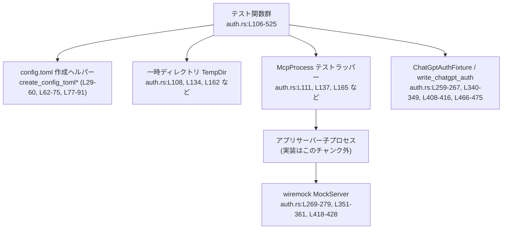
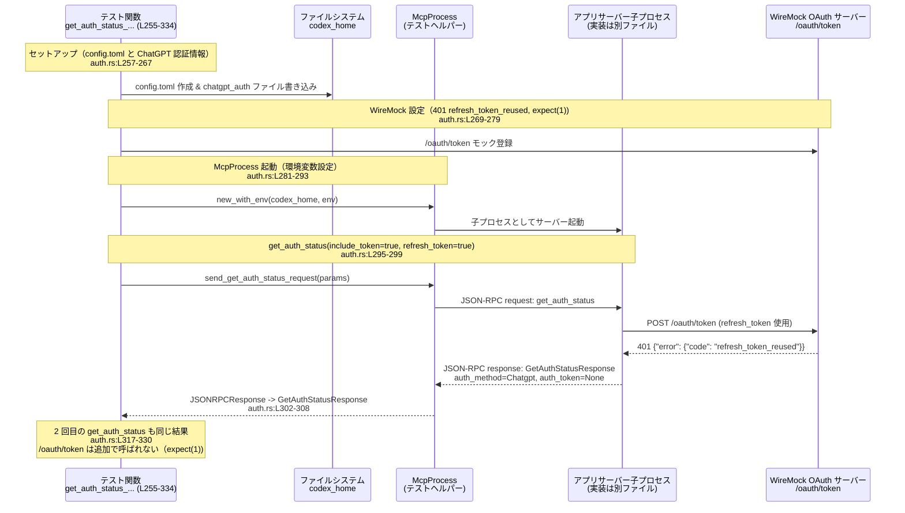

# app-server/tests/suite/auth.rs コード解説

---

## 0. ざっくり一言

`auth.rs` は、アプリサーバーの JSON-RPC 認証 API（`get_auth_status` と API キーログイン）が、  
API キー／ChatGPT アカウント／設定の組み合わせに対して期待どおり動作するかを、`tokio` 非同期環境で結合テストするモジュールです（auth.rs:L106-525）。

---

## 1. このモジュールの役割

### 1.1 概要

このモジュールは、以下のような認証まわりの振る舞いを検証する非同期テスト群で構成されています。

- `config.toml` や認証情報ファイルを一時ディレクトリに生成し、テスト専用の Codex アプリサーバー環境を構築する（auth.rs:L29-75, L77-91, L259-267 など）。
- `McpProcess` 経由で JSON-RPC の `get_auth_status`／`login_account_api_key` を呼び出し、  
  認証方式（API キー／ChatGPT／なし）、トークン有無、`requires_openai_auth` の値を検証する（auth.rs:L106-253, L255-525）。
- ChatGPT のトークン更新エンドポイントを `wiremock` で差し替え、トークン更新失敗／再設定後の復旧といったケースをテストする（auth.rs:L269-279, L351-361, L418-428）。

### 1.2 アーキテクチャ内での位置づけ

このファイルは **テストレイヤ** にあり、実際のアプリサーバー実装は別のクレート／ファイルにあります（`McpProcess`・プロトコル型の定義はこのチャンクには現れません）。

主なコンポーネント関係は次のとおりです。



- 各テストは `TempDir::new()` で一時ホームディレクトリ（`codex_home`）を作成し（auth.rs:L108, L134, L162 など）、そこに `config.toml` や ChatGPT 認証情報ファイルを書き込みます。
- `McpProcess::new` / `new_with_env` が、このディレクトリと環境変数を使ってアプリサーバー子プロセスを起動し（auth.rs:L111, L137, L165 など）、JSON-RPC 経由でテスト対象 API を呼び出します。
- ChatGPT のトークン更新は `wiremock::MockServer` でスタブされた `/oauth/token` エンドポイントに向くよう、環境変数 `REFRESH_TOKEN_URL_OVERRIDE_ENV_VAR` で差し替えています（auth.rs:L281-289, L363-371, L430-438）。

### 1.3 設計上のポイント

コードから読み取れる主な設計上の特徴です。

- **テスト環境の完全隔離**  
  各テストは `TempDir` 上の専用 `codex_home` と、個別の `config.toml` を使います（auth.rs:L108-110, L134-136, L162-164 など）。  
  認証情報ファイルも都度書き出しており（auth.rs:L259-267, L340-349, L408-416, L466-475）、テスト間での状態共有を避けています。
- **非同期・並行環境を前提とした設計**  
  全テストは `#[tokio::test(flavor = "multi_thread", worker_threads = 2)]` で実行され（auth.rs:L106, L132, L160, …, L503）、  
  `tokio::time::timeout` により JSON-RPC 応答待ちが 10 秒以上ブロックしないようにしています（auth.rs:L27, L96-100, L121-125 など）。
- **JSON-RPC レベルでの契約テスト**  
  返却される `GetAuthStatusResponse`／`LoginAccountResponse`／`JSONRPCError` のフィールド値を `assert_eq!` で厳密に検証し（auth.rs:L102, L127-128, L155-156, L185-189, L244-251, L308-315, L390-397, L457-464, L491-496, L521-523）、  
  サーバーの外部インターフェース仕様をテストで固定しています。
- **HTTP リクエスト回数まで検証**  
  `wiremock::Mock::expect` を使って `/oauth/token` への POST 回数を制御しており（auth.rs:L277, L359, L426）、  
  トークン更新の再試行・抑止の挙動を間接的に確認しています。

---

## 2. 主要な機能一覧

このモジュールが提供する（＝検証している）主な機能／シナリオです。

- config.toml 生成ヘルパー  
  - `create_config_toml`：最小構成の設定ファイルを生成（auth.rs:L62-75）。  
  - `create_config_toml_custom_provider`：`model_providers.mock_provider` と `requires_openai_auth` を含む設定を生成（auth.rs:L29-60）。  
  - `create_config_toml_forced_login`：`forced_login_method` を含む設定を生成（auth.rs:L77-91）。
- API キーログインの共通処理  
  - `login_with_api_key_via_request`：API キーログイン JSON-RPC を送り、成功応答を検証（auth.rs:L93-104）。
- `get_auth_status` の基本動作テスト  
  - 認証なし環境で、認証情報が返らないこと（auth.rs:L106-130）。  
  - API キーログイン後に、`auth_method = ApiKey` とトークンが返ること（auth.rs:L132-158）。  
  - プロバイダが認証不要の場合、API キーログイン済みでも認証情報を返さないこと（auth.rs:L160-191）。  
  - `include_token` フィールドを省略したとき、トークンが返らないこと（auth.rs:L193-219）。
- `get_auth_status` とトークン更新（API キー）  
  - `refresh_token = true` で API キートークンの更新をリクエストし、期待どおりのレスポンスとなること（auth.rs:L221-253）。
- ChatGPT 認証情報とトークン更新  
  - ChatGPT 認証情報があり、トークン更新が「永続的失敗（401 + `refresh_token_reused`）」になった場合、以後トークンを返さないこと（auth.rs:L255-334）。  
  - プロアクティブなトークン更新（`last_refresh` が古い場合）で同様の失敗が起きたときも、トークンを返さないこと（auth.rs:L336-401）。  
  - 失敗状態から認証情報ファイルを書き換えて復旧した場合、トークンが再び返ること（auth.rs:L403-501）。
- ログイン方式の強制設定  
  - `forced_login_method = "chatgpt"` の場合、API キーログイン RPC がエラーで拒否されること（auth.rs:L503-525）。

---

## 3. 公開 API と詳細解説

### 3.1 型一覧（構造体・列挙体など）

このファイル自身は新しい型（構造体・列挙体）を定義していません。  
ただし、テストの理解に重要な外部型を整理します（定義本体はこのチャンクには現れません）。

| 名前 | 種別 | 役割 / 用途 | このファイルでの利用箇所 |
|------|------|-------------|---------------------------|
| `McpProcess` | 構造体（外部） | アプリサーバープロセスとの JSON-RPC 通信をカプセル化したテスト用ヘルパーと推測されます。 | 生成と利用: auth.rs:L111, L137, L165, L198, L226, L282-292, L364-374, L431-441, L508-513。定義はこのチャンクには現れません。 |
| `ChatGptAuthFixture` | 構造体（外部） | ChatGPT 認証情報ファイルの内容を組み立てるフィクスチャ（テスト用データ構築用）です。 | 利用: auth.rs:L259-265, L340-347, L408-415, L466-473。定義はこのチャンクには現れません。 |
| `GetAuthStatusParams` | 構造体（外部） | `get_auth_status` JSON-RPC のパラメータ。`include_token` / `refresh_token` フラグを持ちます。 | 利用: auth.rs:L115-118, L143-146, L171-174, L204-207, L232-235, L297-299, L318-321, L378-381, L445-448, L477-480。 |
| `GetAuthStatusResponse` | 構造体（外部） | `get_auth_status` のレスポンス。`auth_method`, `auth_token`, `requires_openai_auth` を含みます。 | 利用: auth.rs:L126-128, L154-156, L182-189, L215-217, L243-251, L307-315, L389-397, L456-464, L489-496。 |
| `AuthMode` | 列挙体（外部） | 認証方式（例: `ApiKey`, `Chatgpt`）を表します。 | 利用: auth.rs:L155, L247, L311, L393, L460, L493。 |
| `LoginAccountResponse` | 構造体/列挙体（外部） | ログイン RPC のレスポンス型。ここでは `ApiKey {}` バリアントを比較しています。 | 利用: auth.rs:L101-102。 |
| `JSONRPCResponse` | 構造体（外部） | 成功時の JSON-RPC レスポンス全体（result または error を含む）です。 | 利用: auth.rs:L96-100, L121-125, L149-153, L177-181, L210-214, L238-242, L302-306, L324-328, L384-388, L451-455, L484-488。 |
| `JSONRPCError` | 構造体（外部） | JSON-RPC エラー構造。`error.message` などを持ちます。 | 利用: auth.rs:L515-523。 |
| `AuthCredentialsStoreMode` | 列挙体（外部） | 認証情報の保存方式（ここではファイル）を指定します。 | 利用: auth.rs:L266-267, L348-349, L415-416, L474-475。 |
| `TempDir` | 構造体（外部） | 一時ディレクトリのライフタイム管理。スコープ終了時にディレクトリが削除されます。 | 利用: auth.rs:L108, L134, L162, L195, L223, L257, L338, L405, L505。 |

> 注: これらの型の詳細なフィールド／メソッド定義は、このチャンクには含まれていません。

### 3.2 関数詳細（7件）

#### `create_config_toml_custom_provider(codex_home: &Path, requires_openai_auth: bool) -> std::io::Result<()>` （auth.rs:L29-60）

**概要**

- 指定した `codex_home` ディレクトリ直下に、`model_providers.mock_provider` セクションを含む `config.toml` を生成するヘルパーです（auth.rs:L29-33, L39-57）。
- `requires_openai_auth` が `true` の場合のみ、`requires_openai_auth = true` 行を差し込みます（auth.rs:L34-38, L56）。

**引数**

| 引数名 | 型 | 説明 |
|--------|----|------|
| `codex_home` | `&Path` | `config.toml` を配置するディレクトリ（通常は `TempDir` のパス）。 |
| `requires_openai_auth` | `bool` | `model_providers.mock_provider` セクションに `requires_openai_auth = true` 行を含めるかどうか。 |

**戻り値**

- `std::io::Result<()>`  
  `std::fs::write` によるファイル書き込みの成否をそのまま返します（auth.rs:L59-60）。

**内部処理の流れ**

1. `codex_home.join("config.toml")` で出力先パスを組み立てます（auth.rs:L33）。
2. `requires_openai_auth` に応じて `requires_line` に `"requires_openai_auth = true\n"` か空文字列を設定します（auth.rs:L34-38）。
3. マルチラインの TOML テンプレート文字列内に `{requires_line}` を挿入して `contents` を組み立てます（auth.rs:L39-57）。
4. `std::fs::write(config_toml, contents)` でファイルに書き込み、その `Result` を返します（auth.rs:L59-60）。

**Examples（使用例）**

```rust
// テスト用に、認証不要なモックプロバイダ設定を生成する例
let codex_home = TempDir::new()?;                                        // auth.rs:L162
create_config_toml_custom_provider(codex_home.path(), false)?;           // auth.rs:L163
// 以降、この codex_home を使って McpProcess を起動する
```

**Errors / Panics**

- `std::fs::write` が失敗すると `Err(std::io::Error)` を返します（パスが存在しない、権限がない等）。  
  テスト側では `?` 演算子で伝播され、テストが失敗します（例: auth.rs:L162-164）。
- この関数内には `panic!` を起こすコードは含まれていません。

**Edge cases（エッジケース）**

- `codex_home` が存在しないディレクトリを指す場合: `std::fs::write` が `Err` を返します（auth.rs:L59-60）。
- `requires_openai_auth = false` の場合、TOML に `requires_openai_auth` 行は一切出力されません（auth.rs:L34-38, L56）。

**使用上の注意点**

- テストでは `TempDir` など、書き込み可能なディレクトリを渡す前提です（auth.rs:L108, L162 など）。
- 実運用コードで使う場合は、既存の `config.toml` を上書きする点に注意が必要ですが、このファイルではテスト専用ディレクトリでのみ使用されています。

---

#### `login_with_api_key_via_request(mcp: &mut McpProcess, api_key: &str) -> Result<()>` （auth.rs:L93-104）

**概要**

- JSON-RPC の API キーログイン RPC を送り、サーバーから `LoginAccountResponse::ApiKey {}` が返ることを検証する共通ヘルパーです（auth.rs:L93-104）。
- ログインの成否に関するアサーションまで行うため、呼び出し元テストはログイン処理を簡潔に記述できます（auth.rs:L140, L168, L201, L229）。

**引数**

| 引数名 | 型 | 説明 |
|--------|----|------|
| `mcp` | `&mut McpProcess` | JSON-RPC 通信を行うテスト用プロセスハンドル。 |
| `api_key` | `&str` | サーバーに送信する API キー文字列（例: `"sk-test-key"`、auth.rs:L140）。 |

**戻り値**

- `anyhow::Result<()>` (`use anyhow::Result;` より、auth.rs:L1)  
  - JSON-RPC 送信・受信、タイムアウト、レスポンスのデシリアライズがすべて成功し、かつレスポンスが `LoginAccountResponse::ApiKey {}` であれば `Ok(())` を返します（auth.rs:L101-104）。
  - それ以外の場合、`?` により適切なエラーが返され、テストが失敗します。

**内部処理の流れ**

1. `mcp.send_login_account_api_key_request(api_key).await?` を呼び、リクエスト ID（整数）を取得します（auth.rs:L94）。  
   - 実装はこのチャンク外ですが、戻り値は JSON-RPC の `id` として使用されています。
2. `tokio::time::timeout` で 10 秒のタイムアウト付きでレスポンスを待ちます（auth.rs:L96-100）。  
   `mcp.read_stream_until_response_message(RequestId::Integer(request_id))` により、該当 ID のレスポンスを待ちます（auth.rs:L98-99）。
3. `timeout(...).await??` で、  
   - 外側の `?` はタイムアウトエラー（`Elapsed` など）を伝播し、  
   - 内側の `?` は `read_stream_until_response_message` 自体のエラーを伝播します（auth.rs:L100）。
4. 受信した `JSONRPCResponse` を `to_response` で `LoginAccountResponse` に変換します（auth.rs:L101）。
5. `assert_eq!(response, LoginAccountResponse::ApiKey {});` で期待どおりのレスポンスであることを検証します（auth.rs:L102）。
6. `Ok(())` を返します（auth.rs:L103-104）。

**Examples（使用例）**

```rust
// API キーログイン後に get_auth_status をテストする典型パターン（抜粋）
let mut mcp = McpProcess::new(codex_home.path()).await?;                        // auth.rs:L137
timeout(DEFAULT_READ_TIMEOUT, mcp.initialize()).await??;                        // auth.rs:L138
login_with_api_key_via_request(&mut mcp, "sk-test-key").await?;                // auth.rs:L140
// ここまでで API キーログインが完了している前提で get_auth_status を呼ぶ
```

**Errors / Panics**

- `send_login_account_api_key_request` が失敗すると、そのエラーが `Result` として伝播します（auth.rs:L94）。
- `timeout` によるタイムアウトや `read_stream_until_response_message` の失敗も `?` で伝播します（auth.rs:L96-100）。
- `to_response` のデコード失敗も `?` で伝播します（auth.rs:L101）。
- レスポンスが `LoginAccountResponse::ApiKey {}` と一致しない場合、`assert_eq!` により **パニック** を起こし、テストが失敗します（auth.rs:L102）。

**Edge cases（エッジケース）**

- サーバーがエラー応答（JSON-RPC error）を返した場合、`read_stream_until_response_message` や `to_response` がどのように振る舞うかは、このチャンクからは分かりません（実装不明）。
- レスポンスが別の `LoginAccountResponse` バリアントである場合、`assert_eq!` によりテストが失敗します（auth.rs:L102）。

**使用上の注意点**

- このヘルパーは「成功パスを前提」としており、ログイン失敗をテストしたい場合には直接 `send_login_account_api_key_request` とエラー読み出しを使う必要があります（失敗ケース用の例: auth.rs:L511-519）。
- タイムアウト時間（`DEFAULT_READ_TIMEOUT = 10 秒`）はグローバル定数で共通利用されています（auth.rs:L27）。長時間処理が必要なテストを追加する場合は、これを意識する必要があります。

---

#### `get_auth_status_no_auth() -> Result<()>` （auth.rs:L106-130）

**概要**

- 認証情報（API キーおよび ChatGPT 認証情報）が存在しない環境で `get_auth_status` を呼び出したとき、  
  `auth_method` / `auth_token` がともに `None` で返ることを検証するテストです（auth.rs:L106-130）。

**引数**

- なし（`#[tokio::test]` によりテストランナーから呼び出されます、auth.rs:L106）。

**戻り値**

- `Result<()>`  
  - すべての操作が成功し、期待どおりのレスポンスであれば `Ok(())`（auth.rs:L129-130）。
  - 途中の I/O・JSON-RPC・タイムアウトエラーは `?` によりテスト失敗として返されます。

**内部処理の流れ**

1. `TempDir::new()` で一時ディレクトリ `codex_home` を作成（auth.rs:L108）。
2. `create_config_toml(codex_home.path())?` で最小構成の `config.toml` を作成（auth.rs:L109）。
3. `McpProcess::new_with_env` で `OPENAI_API_KEY` を `None`（未設定 / 解除）にした環境でサーバーを起動します（auth.rs:L111）。  
   - API キーによる認証手段を無効化する意図が読み取れます。
4. `mcp.initialize()` をタイムアウト付きで実行し、サーバー初期化完了を待機します（auth.rs:L112）。
5. `GetAuthStatusParams { include_token: Some(true), refresh_token: Some(false) }` で認証状態の問い合わせを送信します（auth.rs:L114-118）。
6. `read_stream_until_response_message` で対応するレスポンスを待ち（auth.rs:L121-125）、`GetAuthStatusResponse` にデコードします（auth.rs:L126）。
7. `status.auth_method` が `None`、`status.auth_token` も `None` であることを `assert_eq!` で検証します（auth.rs:L127-128）。

**Examples（使用例）**

このパターンは、「完全に未ログイン状態の挙動」を検証したい新しいテストを書く際の雛形になります。

```rust
let codex_home = TempDir::new()?;                                            // 一時ホームディレクトリ
create_config_toml(codex_home.path())?;                                      // 最小構成 config.toml
let mut mcp = McpProcess::new_with_env(codex_home.path(), &[("OPENAI_API_KEY", None)]).await?;
timeout(DEFAULT_READ_TIMEOUT, mcp.initialize()).await??;                     // 初期化完了まで待機

let request_id = mcp.send_get_auth_status_request(GetAuthStatusParams {
    include_token: Some(true),
    refresh_token: Some(false),
}).await?;

let resp: JSONRPCResponse = timeout(
    DEFAULT_READ_TIMEOUT,
    mcp.read_stream_until_response_message(RequestId::Integer(request_id)),
).await??;
let status: GetAuthStatusResponse = to_response(resp)?;
assert_eq!(status.auth_method, None);
assert_eq!(status.auth_token, None);
```

**Errors / Panics**

- 一時ディレクトリ作成・ファイル書き込み・サーバープロセス起動・JSON-RPC 通信・タイムアウトのいずれかが失敗すると、`?` によりテストがエラー終了します（auth.rs:L108-112, L114-120, L121-126）。
- `status.auth_method` や `status.auth_token` が期待どおりでない場合、`assert_eq!` によりパニックが発生しテストが失敗します（auth.rs:L127-128）。

**Edge cases（エッジケース）**

- `include_token = Some(true)` でトークン付与を要求していますが、認証情報が存在しないため `auth_token` が `None` であることを明示的に検証しています（auth.rs:L116, L128）。
- ChatGPT 認証ファイルを生成していないので、ChatGPT 認証に関する挙動はこのテストではカバーされません。

**使用上の注意点**

- `McpProcess::new_with_env` の第 2 引数の扱い（環境変数の設定／解除）はこのチャンクには現れず、実際にグローバル環境を変えるかどうかは不明です。  
  並行テストを書く際は、同様に `new_with_env` を用いて環境を個別に制御する方針が示唆されます（auth.rs:L111）。

---

#### `get_auth_status_with_api_key() -> Result<()>` （auth.rs:L132-158）

**概要**

- API キーログインを行った後に `get_auth_status` を呼び出し、`AuthMode::ApiKey` と実際の API キー文字列が返ることを検証するテストです（auth.rs:L132-158）。

**内部処理の流れ（要点）**

1. `TempDir` + `create_config_toml` で基本設定を作る（auth.rs:L134-136）。
2. `McpProcess::new` でサーバーを起動し、`initialize` で初期化（auth.rs:L137-138）。
3. `login_with_api_key_via_request(&mut mcp, "sk-test-key")` でログインまで完了させる（auth.rs:L140）。
4. `include_token = Some(true)` / `refresh_token = Some(false)` で `get_auth_status` を呼び出す（auth.rs:L142-146）。
5. 返却された `GetAuthStatusResponse` について、  
   `auth_method == Some(AuthMode::ApiKey)`、`auth_token == Some("sk-test-key".to_string())` を検証します（auth.rs:L155-156）。

**Errors / Panics**

- ログイン処理は `login_with_api_key_via_request` に依存しており、その中でレスポンス不一致があるとパニックになります（auth.rs:L93-104）。
- `GetAuthStatusResponse` の `auth_method`／`auth_token` のいずれかが期待と異なると `assert_eq!` によってパニックが発生します（auth.rs:L155-156）。

**Edge cases**

- `refresh_token = Some(false)` なので、「API キーの再取得」は要求していません（auth.rs:L145）。  
  サーバーがトークンをどこから取得しているか（メモリ／ストア）はこのチャンクからは分かりませんが、テストとしては「直前にログインしたキーがそのまま返る」ことを確認しています。

**使用上の注意点**

- ここでは `McpProcess::new_with_env` ではなく `McpProcess::new` を使っているため、テストプロセスの環境に設定されている `OPENAI_API_KEY` の有無に依存する可能性があります（auth.rs:L137）。  
  実際の値はこのチャンクからは分かりませんが、認証の前提条件が変わる点に注意が必要です。

---

#### `get_auth_status_with_api_key_when_auth_not_required() -> Result<()>` （auth.rs:L160-191）

**概要**

- モデルプロバイダ設定で `requires_openai_auth = false` のとき、API キーログイン済みでも `get_auth_status` が認証情報を返さず、`requires_openai_auth` が `Some(false)` になることを検証するテストです（auth.rs:L160-191）。

**内部処理の流れ（要点）**

1. `create_config_toml_custom_provider(codex_home.path(), false)` で、`requires_openai_auth` 行を含まないモックプロバイダ設定を生成（auth.rs:L162-164）。
2. `McpProcess::new` でサーバーを起動し、`initialize` を実行（auth.rs:L165-166）。
3. `login_with_api_key_via_request` で API キーログインを完了（auth.rs:L168）。
4. `include_token = Some(true)`, `refresh_token = Some(false)` で `get_auth_status` を呼び出し（auth.rs:L170-174）、レスポンスを取得（auth.rs:L177-182）。
5. 以下を検証（auth.rs:L183-189）:
   - `auth_method == None`
   - `auth_token == None`
   - `requires_openai_auth == Some(false)`

**Errors / Panics**

- `create_config_toml_custom_provider` や `login_with_api_key_via_request` の失敗は `?` によってエラーとして伝播します（auth.rs:L162-164, L168）。
- 3 つのアサーションのいずれかが不一致ならパニックが発生します（auth.rs:L183-189）。

**Edge cases**

- `requires_openai_auth` が `false` の場合に、サーバーがユーザーのログイン状態を「無視」していることを確認するテストになっています。  
  `auth_method` が `None` であるため、クライアント側は「現在のプロバイダでは OpenAI 認証不要」と解釈できる前提です（auth.rs:L183-189）。

**使用上の注意点**

- プロバイダ単位で認証要否が変わることを示しているため、新しいテストを追加する際には、「どのプロバイダ構成を使っているか」を `create_config_toml` / `create_config_toml_custom_provider` のどちらを呼ぶかで明示することが重要です（auth.rs:L109, L162-164）。

---

#### `get_auth_status_omits_token_after_permanent_refresh_failure() -> Result<()>` （auth.rs:L255-334）

**概要**

- ChatGPT 認証情報が存在し、トークン更新リクエストが 401 `refresh_token_reused` エラーで「永続的に失敗」した場合に、`get_auth_status` が **トークンを返さなくなる**（かつ再度リクエストしても同じ状態）ことを検証するテストです（auth.rs:L255-334）。

**内部処理の流れ（アルゴリズム）**

1. `create_config_toml` で基本設定を作成（auth.rs:L257-258）。
2. `write_chatgpt_auth` + `ChatGptAuthFixture` で、`stale-access-token` と `stale-refresh-token` を含む ChatGPT 認証情報ファイルを作成（auth.rs:L259-267）。
3. `MockServer::start().await` で WireMock サーバーを起動（auth.rs:L269）。
4. `/oauth/token` への POST に対して、HTTP 401 かつ `{"error": {"code": "refresh_token_reused"}}` を返すモックを設定し、**1 回だけ** 呼ばれることを期待（`expect(1)`、auth.rs:L270-279）。
5. `refresh_url` を環境変数 `REFRESH_TOKEN_URL_OVERRIDE_ENV_VAR` 経由でサーバーに渡し（auth.rs:L281-289）、`OPENAI_API_KEY` を `None` に設定して API キー認証を無効化（auth.rs:L285-286）。
6. `McpProcess::new_with_env` でサーバーを起動し、`initialize` で初期化（auth.rs:L281-293）。
7. `include_token = Some(true)`, `refresh_token = Some(true)` で `get_auth_status` を呼び出し（auth.rs:L295-299）。
8. 得られた `GetAuthStatusResponse` が以下であることを検証（auth.rs:L307-315）。
   - `auth_method == Some(AuthMode::Chatgpt)`
   - `auth_token == None`
   - `requires_openai_auth == Some(true)`
9. 同一パラメータで `get_auth_status` をもう一度呼び出し（auth.rs:L317-322）、同じレスポンスが返ることを確認（auth.rs:L324-330）。
10. `server.verify().await` で WireMock が期待どおり 1 回だけ呼ばれたことを確認（auth.rs:L332）。

**Examples（使用例）**

このテスト自体が代表的な使用例であり、ChatGPT トークン刷新失敗時の仕様を示しています。

**Errors / Panics**

- 認証情報ファイル作成や WireMock 起動・設定が失敗すると `?` によってテストがエラー終了します（auth.rs:L257-267, L269-279）。
- JSON-RPC 通信やタイムアウトなどの失敗も同様です（auth.rs:L281-306）。
- 期待した `GetAuthStatusResponse` と異なる場合は `assert_eq!` によってパニックが発生します（auth.rs:L308-315, L330）。
- WireMock 側で実際の `/oauth/token` 呼び出し回数が `expect(1)` と一致しない場合、`server.verify().await` がエラーを返し、テストが失敗します（auth.rs:L332）。

**Edge cases（エッジケース）**

- `refresh_token = Some(true)` で明示的に更新を要求しているため、サーバーは少なくとも 1 回トークン更新リクエストを送ることが期待されます（auth.rs:L297-299）。  
  401 `refresh_token_reused` エラーを受け取った後は、2 回目の `get_auth_status` でも `/oauth/token` に再度アクセスしないことが `expect(1)` から示唆されます（auth.rs:L277, L317-330）。
- `auth_method` が `Some(AuthMode::Chatgpt)` のまま `auth_token == None` であるため、「認証方式としては ChatGPT を使用中だが、トークンは失効しており再ログインが必要」という状態を表現していると解釈できます（auth.rs:L308-315）。

**使用上の注意点**

- 「永続的な失敗」が何に相当するかは、WireMock のレスポンスコードとエラーコード（401 + `refresh_token_reused`）で定義されています（auth.rs:L272-275）。  
  他のステータスコード／エラーコードに対する挙動は、このテストからは分かりません。
- テストは環境変数 `REFRESH_TOKEN_URL_OVERRIDE_ENV_VAR` に依存しており（auth.rs:L281-289）、この仕組みが正しく機能しないと、実際の OpenAI エンドポイントを叩いてしまう危険があります。  
  テスト環境では常にモック URL が設定されるようにする必要があります。

---

#### `get_auth_status_returns_token_after_proactive_refresh_recovery() -> Result<()>` （auth.rs:L403-501）

**概要**

- プロアクティブなトークン更新が `refresh_token_reused` エラーで失敗し、一時的にトークンが返らなくなった状態から、  
  認証情報ファイルを書き換えて「復旧」したあとに、再度トークンが返るようになることを検証するテストです（auth.rs:L403-501）。

**内部処理の流れ（アルゴリズム）**

1. `create_config_toml` で基本設定を作成（auth.rs:L405-406）。
2. `ChatGptAuthFixture::new("stale-access-token")` から、`stale-refresh-token` 等を設定し、`last_refresh(Some(Utc::now() - Duration::days(9)))` を指定して認証情報ファイルを書き出します（auth.rs:L408-416）。  
   - `last_refresh` が 9 日前であることから、サーバー側の「プロアクティブ更新」のしきい値より十分古い状態を表現していると推測されます。
3. WireMock サーバーを起動し（auth.rs:L418）、`/oauth/token` への POST に対して 401 `refresh_token_reused` を返すよう設定し、**2 回** 呼び出されることを期待します（`expect(2)`, auth.rs:L419-427）。
4. `McpProcess::new_with_env` でサーバーを起動し、`initialize` を実行（auth.rs:L430-442）。  
   - 初期化中または後続の呼び出しのどこかで、少なくとも 1 回トークン更新が行われることが暗に期待されています（詳細はこのチャンクからは不明）。
5. `refresh_token = Some(true)` で `get_auth_status` を呼び出し、失敗ステータス（`auth_token == None`）を取得します（auth.rs:L444-457）。
6. その状態に対して `GetAuthStatusResponse { auth_method: Some(Chatgpt), auth_token: None, requires_openai_auth: Some(true) }` であることを確認します（auth.rs:L457-464）。
7. ここで、認証情報ファイルを「復旧版」に書き換えます。`recovered-access-token`／`recovered-refresh-token`・`last_refresh(Some(Utc::now()))` を設定します（auth.rs:L466-475）。
8. `refresh_token = Some(false)` で `get_auth_status` を再度呼び出し、今度は `auth_token == Some("recovered-access-token".to_string())` になることを確認します（auth.rs:L477-496）。
9. 最後に `server.verify().await` で WireMock の呼び出し回数（2 回）が期待どおりであることを検証します（auth.rs:L499）。

**Examples（使用例）**

このテストケース自体が、以下のような仕様を示しています。

- 古い `last_refresh` の ChatGPT 認証情報はプロアクティブ更新の対象になる。
- `refresh_token_reused` により一度はトークンを返さなくなるが、認証情報ファイルを更新すれば復旧できる。

**Errors / Panics**

- 認証情報ファイル作成や WireMock の設定失敗は `?` によってテスト失敗となります（auth.rs:L405-416, L418-428）。
- `failed_status` および `recovered_status` の期待との不一致は、それぞれ `assert_eq!` によりパニックが発生します（auth.rs:L457-464, L491-496）。
- WireMock の呼び出し回数が 2 回と一致しない場合、`server.verify().await` がエラーとなりテストが失敗します（auth.rs:L499）。

**Edge cases**

- 最初の `get_auth_status` では `refresh_token = Some(true)` で明示的に更新を要求していますが（auth.rs:L445-448）、  
  WireMock の `expect(2)` から、初期化やプロアクティブ更新でもう 1 回の `/oauth/token` 呼び出しが行われていることが示唆されます（auth.rs:L419-427, L444-457）。  
  どのタイミングで呼ばれているかはこのチャンクからは断定できません。
- 認証情報ファイル書き換え後の `get_auth_status` では `refresh_token = Some(false)` であり、`last_refresh` が現在時刻であるため、追加のトークン更新は行われない前提になっています（auth.rs:L466-475, L477-480）。

**使用上の注意点**

- 「失敗状態からの復旧」をテストするために、同じ `codex_home` に対して `write_chatgpt_auth` を 2 回呼んでいる点が重要です（auth.rs:L408-416, L466-475）。  
  新しいテストで状態遷移を検証したい場合も、このようにファイルを書き換えて再度 RPC を呼ぶパターンが利用できます。
- WireMock の `expect(2)` によって、余計なトークン更新リクエストが発生していないことも間接的に検証しています（auth.rs:L419-427, L499）。

---

#### `login_api_key_rejected_when_forced_chatgpt() -> Result<()>` （auth.rs:L503-525）

**概要**

- `config.toml` の `forced_login_method = "chatgpt"` 設定が有効なとき、API キーログイン RPC が JSON-RPC エラーで拒否されることを検証するテストです（auth.rs:L503-525）。

**内部処理の流れ**

1. `create_config_toml_forced_login(codex_home.path(), "chatgpt")` で `forced_login_method = "chatgpt"` を含む設定を生成します（auth.rs:L505-506）。
2. `McpProcess::new` でサーバーを起動し、`initialize` を実行します（auth.rs:L508-509）。
3. `send_login_account_api_key_request("sk-test-key")` を呼び出し、API キーログインを試みます（auth.rs:L511-513）。
4. `read_stream_until_error_message(RequestId::Integer(request_id))` をタイムアウト付きで呼び出し、対応する `JSONRPCError` を待ち受けます（auth.rs:L515-519）。
5. 取得したエラーの `err.error.message` が `"API key login is disabled. Use ChatGPT login instead."` であることを検証します（auth.rs:L521-523）。

**Errors / Panics**

- サーバー起動や JSON-RPC 通信が失敗すると `?` によってテストがエラー終了します（auth.rs:L505-519）。
- エラーメッセージの文字列が一致しない場合、`assert_eq!` によりパニックが発生します（auth.rs:L521-523）。

**Edge cases**

- このテストでは、エラーコードや追加のエラーデータ（`code`、`data` フィールドなど）を検証していません。  
  メッセージ文字列のみを契約として固定しています（auth.rs:L521-523）。
- `forced_login_method` の他の値（例: `"api_key"`）や未設定時の挙動は、このファイル内の他のテストではカバーされていません。

**使用上の注意点**

- ログイン方法を設定で強制する場合、クライアント実装はこのようなエラーメッセージを受け取り、適切なログイン UI を案内する必要があります。  
  このテストはそのメッセージ仕様を固定しています（auth.rs:L521-523）。

---

### 3.3 その他の関数

上記で詳細解説しなかった関数を一覧にまとめます。

| 関数名 | 種別 | 役割（1 行） | 定義位置 |
|--------|------|--------------|----------|
| `create_config_toml(codex_home: &Path) -> std::io::Result<()>` | ヘルパー | 認証関連オプションを含まない最小構成の `config.toml` を `codex_home` に生成します（auth.rs:L62-75）。 | app-server/tests/suite/auth.rs:L62-75 |
| `create_config_toml_forced_login(codex_home: &Path, forced_method: &str) -> std::io::Result<()>` | ヘルパー | `forced_login_method = "{forced_method}"` を含む `config.toml` を生成します（auth.rs:L77-90）。 | app-server/tests/suite/auth.rs:L77-91 |
| `get_auth_status_with_api_key_no_include_token() -> Result<()>` | テスト | `include_token` フィールドを `None` にして JSON シリアライズから省略した場合、`auth_method` は返るがトークンは返らないことを検証します（auth.rs:L193-219, コメント L203）。 | app-server/tests/suite/auth.rs:L193-219 |
| `get_auth_status_with_api_key_refresh_requested() -> Result<()>` | テスト | API キーログイン状態で `refresh_token = Some(true)` を指定した `get_auth_status` が、期待どおり API キーベースのステータスを返すことを検証します（auth.rs:L221-253）。 | app-server/tests/suite/auth.rs:L221-253 |
| `get_auth_status_omits_token_after_proactive_refresh_failure() -> Result<()>` | テスト | `last_refresh` が古い ChatGPT 認証情報に対して、プロアクティブなトークン更新が `refresh_token_reused` で失敗した場合にトークンを返さないことを検証します（auth.rs:L336-401）。 | app-server/tests/suite/auth.rs:L336-401 |

> すべてのテスト関数は `#[tokio::test(flavor = "multi_thread", worker_threads = 2)]` 属性を持ち、非同期コンテキスト上で `anyhow::Result<()>` を返します（auth.rs:L106, L132, L160, L193, L221, L255, L336, L403, L503）。

---

## 4. データフロー

代表的なシナリオとして、**ChatGPT トークン更新の永続的失敗** を扱う  
`get_auth_status_omits_token_after_permanent_refresh_failure`（auth.rs:L255-334）のデータフローを示します。

### 処理の要点（文章）

1. テスト関数が `TempDir` と `config.toml`、ChatGPT 認証情報ファイルをセットアップします（auth.rs:L257-267）。
2. WireMock サーバーを立ち上げ、`/oauth/token` エンドポイントへの POST に対して 401 エラーを返すよう設定します（auth.rs:L269-279）。
3. `McpProcess::new_with_env` が、`OPENAI_API_KEY` 無効・`REFRESH_TOKEN_URL_OVERRIDE_ENV_VAR` 指定の環境でアプリサーバー子プロセスを起動します（auth.rs:L281-292）。
4. テストが `get_auth_status` RPC を送信すると、サーバーは ChatGPT のリフレッシュトークンを使って WireMock 上の `/oauth/token` に POST します（auth.rs:L295-299）。
5. WireMock は 401 + エラーコード `refresh_token_reused` を返し、サーバーはこれを受けて内部状態を「永続的な失敗」として扱います（auth.rs:L270-276, L308-315）。
6. サーバーはクライアントに対し、`auth_method = Chatgpt` だが `auth_token = None` のステータスを返します（auth.rs:L307-315）。
7. 同じ RPC を再度呼び出しても、追加の `/oauth/token` 呼び出しは発生せず、同じステータスが返ります（auth.rs:L317-330, L277, L332）。

### シーケンス図



---

## 5. 使い方（How to Use）

### 5.1 基本的な使用方法（テストケース追加の雛形）

このモジュールのテストパターンを踏襲して、新しい認証シナリオのテストを書きたい場合の基本フローです。

```rust
use anyhow::Result;
use tempfile::TempDir;
use tokio::time::timeout;
use codex_app_server_protocol::{GetAuthStatusParams, RequestId, JSONRPCResponse, GetAuthStatusResponse};
use app_test_support::{McpProcess, to_response};
use std::time::Duration;

const DEFAULT_READ_TIMEOUT: Duration = Duration::from_secs(10);  // auth.rs:L27

#[tokio::test(flavor = "multi_thread", worker_threads = 2)]
async fn my_auth_scenario() -> Result<()> {
    // 1. 一時ホームディレクトリと設定ファイルを用意
    let codex_home = TempDir::new()?;                                       // auth.rs:L108 など
    create_config_toml(codex_home.path())?;                                 // auth.rs:L62-75

    // （必要なら write_chatgpt_auth や create_config_toml_custom_provider を使って条件を追加）

    // 2. McpProcess でアプリサーバーを起動・初期化
    let mut mcp = McpProcess::new(codex_home.path()).await?;                // auth.rs:L137
    timeout(DEFAULT_READ_TIMEOUT, mcp.initialize()).await??;                // auth.rs:L138

    // 3. 必要に応じてログインやその他 RPC を実行
    // login_with_api_key_via_request(&mut mcp, "sk-test-key").await?;      // auth.rs:L93-104

    // 4. get_auth_status などのメイン処理を呼び出し
    let request_id = mcp.send_get_auth_status_request(GetAuthStatusParams {
        include_token: Some(true),
        refresh_token: Some(false),
    }).await?;

    // 5. タイムアウト付きでレスポンスを待ち、型にデコード
    let resp: JSONRPCResponse = timeout(
        DEFAULT_READ_TIMEOUT,
        mcp.read_stream_until_response_message(RequestId::Integer(request_id)),
    ).await??;
    let status: GetAuthStatusResponse = to_response(resp)?;

    // 6. 期待するステータスをアサート
    // assert_eq!(status.auth_method, ...);
    // assert_eq!(status.auth_token, ...);

    Ok(())
}
```

### 5.2 よくある使用パターン

このファイルで繰り返し登場するパターンを整理します。

- **API キーログイン → get_auth_status**（auth.rs:L132-158, L193-219, L221-253）  
  - `create_config_toml` → `McpProcess::new` → `initialize` → `login_with_api_key_via_request` → `get_auth_status`。
  - パラメータの違いで以下を切り替えています。
    - `include_token: Some(true)` + `refresh_token: Some(false)`：トークン付きでステータスを取得（auth.rs:L142-146）。
    - `include_token: None`：JSON からフィールドを省略し、トークンが返らないことを確認（auth.rs:L203-207, L215-217）。
    - `refresh_token: Some(true)`：トークンの更新を要求（auth.rs:L232-235）。

- **ChatGPT 認証情報 + モック OAuth サーバー**（auth.rs:L255-334, L336-401, L403-501）  
  - `write_chatgpt_auth` で ChatGPT 認証ファイルを書き込み（auth.rs:L259-267 など）。
  - `MockServer::start()` と `.respond_with(...)` で `/oauth/token` のレスポンスをスタブ（auth.rs:L269-279, L351-361, L418-428）。
  - `McpProcess::new_with_env(..., &[(REFRESH_TOKEN_URL_OVERRIDE_ENV_VAR, Some(refresh_url))])` でサーバーにモック URL を使わせる（auth.rs:L281-289, L363-371, L430-438）。
  - その上で `get_auth_status` を呼び、トークン更新の結果を検証する。

### 5.3 よくある間違い（推測と根拠）

コードから推測できる、誤りやすい点とそれを避ける方法です。

1. **`include_token` フィールドの扱い**  
   - コメントで、「構造体からパラメータを組み立てることで、`None` のフィールドをワイヤ JSON から省略する」という意図が明言されています（auth.rs:L203）。  
   - 誤用例（推測）:

     ```rust
     // 誤りの可能性がある例: 手書きの JSON で include_token を null にしてしまう
     // {"include_token": null, "refresh_token": false}
     ```

   - 正しいパターン:

     ```rust
     let params = GetAuthStatusParams {                // auth.rs:L204-207
         include_token: None,                          // シリアライズ時にフィールドが省略される
         refresh_token: Some(false),
     };
     ```

2. **サーバー初期化（initialize）の呼び出し忘れ**  
   - すべてのテストで、RPC を送る前に `mcp.initialize()` を呼んでいます（auth.rs:L112, L138, L166, L199, L227, L293, L375, L442, L509）。  
   - これを省略すると、サーバー側がまだ起動／初期化されておらず、`send_*` が失敗する可能性があります（実装は不明ですが、全テストがこのパターンに従っていることが根拠です）。

3. **タイムアウトなしでレスポンスを待つこと**  
   - すべての JSON-RPC 応答待ちは `timeout(DEFAULT_READ_TIMEOUT, ...)` でラップされています（auth.rs:L96-100, L121-125, L149-153, など）。  
   - これを行わないと、サーバー側のハングやバグによりテストが永久に待ち続けるリスクがあります。

### 5.4 使用上の注意点（まとめ）

- **非同期・並行性**  
  - 各テストは `#[tokio::test(flavor = "multi_thread", worker_threads = 2)]` で実行されます（auth.rs:L106, L132, L160, L193, L221, L255, L336, L403, L503）。  
  - テスト間でグローバル状態（環境変数、ファイルパス）が共有される可能性があるため、`McpProcess::new_with_env` と `TempDir` による分離が重要です（auth.rs:L108-111, L281-289）。
- **エラー処理**  
  - テスト関数はすべて `anyhow::Result<()>` を返し、`?` で多様なエラー型をまとめて扱っています（auth.rs:L1, L106, L132, L160 など）。  
  - アサート失敗は `panic!` となり、テストランナーによって失敗として報告されます。
- **セキュリティ（テストデータ）**  
  - API キーやトークン文字列（`"sk-test-key"`, `"stale-access-token"`, `"recovered-access-token"` など）はテスト用のダミー値です（auth.rs:L140, L261, L468）。  
  - 実際のシークレットではないことがソースから明確ですが、実プロジェクトでは本番用秘密情報を絶対にコミットしない運用が必要です。
- **契約（Contracts）**  
  - このファイルは、`GetAuthStatusResponse` のフィールド値と JSON-RPC エラーメッセージを「仕様」としてテストで固定しています（auth.rs:L127-128, L155-156, L185-189, L244-251, L308-315, L390-397, L457-464, L491-496, L521-523）。  
  - サーバー側の実装を変更する場合は、これらのテストが示す契約を意識する必要があります。

---

## 6. 変更の仕方（How to Modify）

### 6.1 新しい機能（テストシナリオ）を追加する場合

1. **どの認証経路を検証したいかを決める**  
   - API キー／ChatGPT／その他の認証方式が対象かを明確にし、それに応じて `create_config_toml*` と `write_chatgpt_auth` のどれを使うか決めます（auth.rs:L62-75, L29-60, L77-91, L259-267）。
2. **環境のセットアップを再利用する**  
   - `TempDir::new()` → `create_config_toml*` → `McpProcess::new` or `new_with_env` → `initialize` というパターンを踏襲します（auth.rs:L108-112, L134-138, L162-166, など）。
3. **必要なら共通ヘルパーを利用／追加する**  
   - API キーログインが必要なら `login_with_api_key_via_request` を再利用します（auth.rs:L93-104, L140, L168, L201, L229）。
   - ChatGPT のトークン更新テストであれば、既存の WireMock 設定コード（auth.rs:L269-279, L351-361, L418-428）を参考にします。
4. **JSON-RPC 呼び出しとアサーションを記述する**  
   - 既存テストと同様に `send_*_request` → `timeout` → `read_stream_until_*` → `to_response` → `assert_eq!` の流れで書きます（auth.rs:L114-128 など）。
5. **HTTP 呼び出し回数の検証が必要なら WireMock の `expect` を設定する**  
   - トークン更新回数などを検証したい場合、`Mock::given(...).expect(N)` を使います（auth.rs:L277, L359, L426）。

### 6.2 既存の機能（テスト）を変更する場合

- **影響範囲の確認**  
  - 各テストは基本的に独立した `TempDir` と設定ファイルを使っているため、1 つのテスト変更が他テストに直接影響する可能性は低いです（auth.rs:L108, L134, L162, L195, L223, L257, L338, L405, L505）。  
  - ただし、`DEFAULT_READ_TIMEOUT` や共通ヘルパー（`login_with_api_key_via_request`, `create_config_toml*`）を変更すると多数のテストに影響します（auth.rs:L27, L93-104, L29-91, L62-75）。
- **契約（前提条件・返り値）を崩さないこと**  
  - `GetAuthStatusResponse` の構造や意味を変える場合、このファイルの多数のアサーションと整合が取れているかを確認する必要があります（auth.rs:L127-128, L155-156, L185-189, L244-251, L308-315, L390-397, L457-464, L491-496）。  
  - `JSONRPCError` の `message` を変更する場合も、`login_api_key_rejected_when_forced_chatgpt` の期待文字列と整合するように修正が必要です（auth.rs:L521-523）。
- **テストの安定性に関する注意点**  
  - WireMock の `expect` 回数を変更すると、HTTP 呼び出し回数の仕様が変わったのか、単にテストが壊れたのかを見極める必要があります（auth.rs:L277, L359, L426）。  
  - タイムアウト値を変更する場合、CI 環境などの性能特性を考慮する必要があります（auth.rs:L27）。

---

## 7. 関連ファイル

このモジュールと密接に関係するであろう他ファイル／クレート（定義自体はこのチャンクには現れません）です。

| パス / クレート | 役割 / 関係 |
|-----------------|------------|
| `app_test_support::McpProcess` | アプリサーバー子プロセスを起動し、JSON-RPC メッセージの送受信を提供するテスト用ユーティリティと考えられます（利用: auth.rs:L111, L137, L165, L198, L226, L282-292, L364-374, L431-441, L508-513）。 |
| `app_test_support::ChatGptAuthFixture` / `write_chatgpt_auth` | ChatGPT 認証情報ファイルを構築・書き出すヘルパー。トークン更新テストで使用されています（auth.rs:L259-267, L340-349, L408-416, L466-475）。 |
| `codex_app_server_protocol` クレート | `GetAuthStatusParams`, `GetAuthStatusResponse`, `AuthMode`, `LoginAccountResponse`, `JSONRPCResponse`, `JSONRPCError`, `RequestId` など、アプリサーバーの JSON-RPC プロトコル型を提供します（auth.rs:L8-14, L96-101, L121-127, など）。 |
| `codex_config::types::AuthCredentialsStoreMode` | 認証情報の保存方法（ここではファイル）を指定する列挙体です（auth.rs:L15, L266-267, L348-349, L415-416, L474-475）。 |
| `codex_login::REFRESH_TOKEN_URL_OVERRIDE_ENV_VAR` | ChatGPT トークン更新 URL を上書きするための環境変数名です（auth.rs:L16, L287-288, L369-370, L436-437）。 |
| `wiremock` クレート | `/oauth/token` への HTTP 呼び出しをモックするために利用しています（auth.rs:L21-25, L269-279, L351-361, L418-428）。 |

> これらの外部コンポーネントの具体的な実装や追加オプションは、このチャンクには現れませんが、テストコードからインタフェースの使い方を把握できます。
