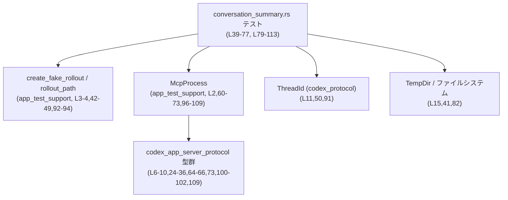
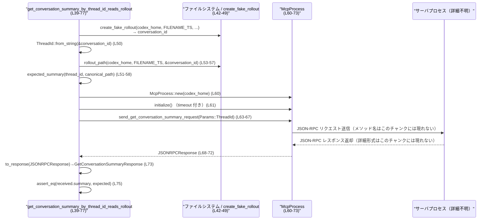

# app-server/tests/suite/conversation_summary.rs

## 0. ざっくり一言

`get_conversation_summary` JSON-RPC API が、ロールアウトファイルから会話サマリ (`ConversationSummary`) を正しく復元できるかを検証する統合テストモジュールです（スレッドID指定と相対パス指定の2パターン）。  

---

## 1. このモジュールの役割

### 1.1 概要

- このモジュールは、会話サマリ取得 API が **ファイルシステム上のロールアウト情報を正しく読み、期待通りの `ConversationSummary` を返す** ことを確認するテストを提供します。
- テストでは、`app_test_support` のヘルパを使ってロールアウトファイルを生成し、`McpProcess` 経由で実際のアプリケーションサーバに JSON-RPC リクエストを送信します（サーバ側の詳細実装はこのチャンクには現れません）。
- スレッドIDベースの取得と、Codex Home からの相対ロールアウトパスベースの取得の2通りの呼び出し方を検証します（関数名とパラメータからの解釈、根拠: `conversation_summary.rs:L39-77`,`L79-113`）。

### 1.2 アーキテクチャ内での位置づけ

このモジュールはテスト層に属し、本番コードではなく **MCP サーバプロセスを外側から駆動する統合テスト** として振る舞っています。

- ロールアウトファイルやパス生成は `app_test_support::{create_fake_rollout, rollout_path}` に委譲しています（`conversation_summary.rs:L3-4,42-49,92-94`）。
- JSON-RPC 経由の呼び出しは `app_test_support::McpProcess` によって抽象化されています（`conversation_summary.rs:L2,60-73,96-109`）。
- 型定義（`ConversationSummary`, `GetConversationSummaryParams` など）は `codex_app_server_protocol` からインポートされています（`conversation_summary.rs:L6-10,24-36,64-66,73,100-102,109`）。



### 1.3 設計上のポイント

- **テスト専用ヘルパの利用**  
  - ロールアウトファイルの作成や JSON-RPC 呼び出しは `app_test_support` に集約されており、テストコード側は振る舞いの検証に集中しています（`conversation_summary.rs:L2-5,42-49,60-73,96-109`）。
- **非同期・並行実行を前提としたテスト**  
  - `#[tokio::test(flavor = "multi_thread", worker_threads = 2)]` によって、Tokio のマルチスレッドランタイム上でテストが実行されます（`conversation_summary.rs:L39,79`）。
  - 非同期 I/O のハングを防ぐため、`tokio::time::timeout` で初期化とレスポンス待ちに 10 秒のタイムアウトを設けています（`conversation_summary.rs:L18,61,68-72,97,104-108`）。
- **期待値の一元化**  
  - `expected_summary` ヘルパ関数で `ConversationSummary` の期待値を構築し、2つのテストから共通利用しています（`conversation_summary.rs:L24-37,51-58,94`）。
- **エラーハンドリング**  
  - すべての I/O や非同期操作は `anyhow::Result<()>` と `?` 演算子で伝播し、失敗時にはテスト全体がエラーとして終了します（`conversation_summary.rs:L1,40-76,80-113`）。
- **状態管理**  
  - 各テストは `TempDir` による一時ディレクトリを使用し、共有状態を持たないため、並列実行時にもファイル競合が起こりにくい構造になっています（`conversation_summary.rs:L15,41,82`）。

---

## 2. 主要な機能一覧

- 会話サマリ期待値構築: テストで比較に用いる `ConversationSummary` を組み立てる。
- スレッドID指定でのサマリ取得検証: `GetConversationSummaryParams::ThreadId` を用いた API 呼び出しを検証する。
- 相対ロールアウトパス指定でのサマリ取得検証: `GetConversationSummaryParams::RolloutPath` を用い、Codex Home 相対パスが解決されることを検証する。

### 2.1 コンポーネントインベントリー（関数・定数）

#### 関数

| 名称 | 種別 | 役割 / 用途 | 根拠行 |
|------|------|-------------|--------|
| `expected_summary` | ヘルパ関数 | 指定されたスレッドIDとパス、および固定メタ情報から `ConversationSummary` を構築する | `conversation_summary.rs:L24-37` |
| `get_conversation_summary_by_thread_id_reads_rollout` | 非同期テスト関数 | スレッドIDを指定して会話サマリを取得でき、ロールアウトから期待値通りの内容が返ることを検証する | `conversation_summary.rs:L39-77` |
| `get_conversation_summary_by_relative_rollout_path_resolves_from_codex_home` | 非同期テスト関数 | Codex Home からの相対ロールアウトパスを指定して会話サマリを取得できることを検証する | `conversation_summary.rs:L79-113` |

#### 定数

| 名称 | 型 | 役割 / 用途 | 根拠行 |
|------|----|-------------|--------|
| `DEFAULT_READ_TIMEOUT` | `std::time::Duration` | MCP プロセス初期化およびレスポンス待ちのタイムアウト（10秒） | `conversation_summary.rs:L18,61,68-72,97,104-108` |
| `FILENAME_TS` | `&'static str` | ロールアウトファイル名に使われるタイムスタンプ文字列 | `conversation_summary.rs:L19,44,55,85` |
| `META_RFC3339` | `&'static str` | メタ情報としてサマリに埋め込まれる RFC3339 形式時刻 | `conversation_summary.rs:L20,45,86,29-30` |
| `PREVIEW` | `&'static str` | サマリの `preview` フィールドとして使われるテキスト | `conversation_summary.rs:L21,46,87,28` |
| `MODEL_PROVIDER` | `&'static str` | 使用モデルプロバイダ名（例: `"openai"`） | `conversation_summary.rs:L22,47,88,31` |

### 2.2 主要な外部依存コンポーネント

| 名称 | 種別 / 所属 | 役割 / 用途 | 根拠行 |
|------|-------------|-------------|--------|
| `McpProcess` | 型 (`app_test_support`) | MCP サーバプロセスとのやり取り（起動・初期化・リクエスト送信・レスポンス受信）を抽象化するテスト用ヘルパ | `conversation_summary.rs:L2,60-73,96-109` |
| `create_fake_rollout` | 関数 (`app_test_support`) | テスト用のロールアウトファイルを生成し、会話ID文字列を返す | `conversation_summary.rs:L3,42-49,83-90` |
| `rollout_path` | 関数 (`app_test_support`) | Codex Home とタイムスタンプ、会話IDからロールアウトのパスを組み立てる | `conversation_summary.rs:L4,53-57,92,94` |
| `to_response` | 関数 (`app_test_support`) | `JSONRPCResponse` から型付きの `GetConversationSummaryResponse` を取り出す | `conversation_summary.rs:L5,73,109` |
| `ConversationSummary` | 構造体 (`codex_app_server_protocol`) | 会話サマリの本体。テストではフィールドを直接構築し期待値として利用 | `conversation_summary.rs:L6,24-36,75,111` |
| `GetConversationSummaryParams` | 列挙体 (`codex_app_server_protocol`) | サマリ取得要求のパラメータ。`ThreadId` と `RolloutPath` バリアントが使用されている | `conversation_summary.rs:L7,64-66,100-102` |
| `GetConversationSummaryResponse` | 構造体 (`codex_app_server_protocol`) | サマリ取得のレスポンス。`summary` フィールドを通じて `ConversationSummary` を取得 | `conversation_summary.rs:L8,73,109` |
| `JSONRPCResponse` | 構造体 (`codex_app_server_protocol`) | 汎用的な JSON-RPC レスポンスエンベロープ | `conversation_summary.rs:L9,68-72,104-108` |
| `RequestId` | 列挙体 (`codex_app_server_protocol`) | JSON-RPC リクエストID。ここでは `Integer` バリアントが使用されている | `conversation_summary.rs:L10,70,106` |
| `ThreadId` | 型 (`codex_protocol`) | 会話を識別するスレッドID。文字列から生成される | `conversation_summary.rs:L11,50,91` |
| `SessionSource::Cli` | 列挙体バリアント (`codex_protocol::protocol`) | サマリが CLI 由来のセッションであることを示す | `conversation_summary.rs:L12,34` |
| `TempDir` | 構造体 (`tempfile`) | テスト用の一時ディレクトリ管理。テスト終了時に自動削除される | `conversation_summary.rs:L15,41,82` |
| `timeout` | 非同期関数 (`tokio::time`) | 指定時間内に future が完了しない場合にエラーを返す | `conversation_summary.rs:L16,61,68-72,97,104-108` |

---

## 3. 公開 API と詳細解説

### 3.1 型一覧（構造体・列挙体など）

このファイル内で **新しく定義される型はありません**。外部クレートからインポートされ、テストで利用されている主な型は次の通りです。

| 名前 | 種別 | 役割 / 用途 | 根拠行 |
|------|------|-------------|--------|
| `ConversationSummary` | 構造体 | 会話サマリ。フィールド: `conversation_id`, `path`, `preview`, `timestamp`, `updated_at`, `model_provider`, `cwd`, `cli_version`, `source`, `git_info` を持つことが、構築コードから分かります | `conversation_summary.rs:L6,24-36` |
| `GetConversationSummaryParams` | 列挙体 | サマリ取得のリクエストパラメータ。`ThreadId { conversation_id: ThreadId }` と `RolloutPath { rollout_path: PathBuf }` バリアントが使用されています | `conversation_summary.rs:L7,64-66,100-102` |
| `GetConversationSummaryResponse` | 構造体 | サマリ取得のレスポンス。少なくとも `summary` フィールドを持つことが、`received.summary` から分かります | `conversation_summary.rs:L8,73,109` |
| `ThreadId` | 型 | 会話IDを表す型。`ThreadId::from_string(&conversation_id)` で文字列から生成されます | `conversation_summary.rs:L11,50,91` |
| `RequestId` | 列挙体 | JSON-RPC リクエストID。整数IDを格納する `Integer` バリアントが使用されています | `conversation_summary.rs:L10,70,106` |

> これらの型の完全な定義はこのチャンクには現れないため、ここではテストコードから直接読み取れるフィールド名・バリアント名のみを記載しています。

---

### 3.2 関数詳細

#### `expected_summary(conversation_id: ThreadId, path: PathBuf) -> ConversationSummary`

**概要**

- スレッドIDとパス、あらかじめ決められたメタ情報（プレビュー文、タイムスタンプ、モデルプロバイダなど）から、期待される `ConversationSummary` インスタンスを構築するヘルパです（根拠: `conversation_summary.rs:L24-37`）。

**引数**

| 引数名 | 型 | 説明 |
|--------|----|------|
| `conversation_id` | `ThreadId` | サマリが紐づく会話（スレッド）のID | `conversation_summary.rs:L24,26` |
| `path` | `PathBuf` | ロールアウトファイルへのパス。テストでは `std::fs::canonicalize(rollout_path(...))` の結果が渡されます | `conversation_summary.rs:L24,27,51-58,94` |

**戻り値**

- `ConversationSummary`  
  - 全フィールドが埋められたサマリオブジェクトを返します（`conversation_summary.rs:L25-36`）。

**内部処理の流れ**

1. 構造体リテラルを用いて `ConversationSummary` を生成する（`conversation_summary.rs:L25`）。
2. `conversation_id` 引数と `path` 引数を対応するフィールドにそのまま代入する（`L26-27`）。
3. `preview` には `PREVIEW` 定数 (`"Summarize this conversation"`) を `String` に変換して設定する（`L21,28`）。
4. `timestamp` と `updated_at` には `META_RFC3339` を `Some(String)` として設定する（`L20,29-30`）。
5. `model_provider` には `MODEL_PROVIDER` (`"openai"`) を文字列として設定する（`L22,31`）。
6. `cwd` は常に `/` を指す `PathBuf` に設定する（`L32`）。
7. `cli_version` は `"0.0.0"` に固定され、`source` は `SessionSource::Cli`、`git_info` は `None` として設定される（`L33-35`）。

**Examples（使用例）**

テスト内で期待値を組み立てる典型的な使い方です（実際のコードを簡略化した例）。

```rust
// ロールアウトへのパスを構築し、canonicalize する               // Rollout の絶対パスを取得
let rollout = rollout_path(codex_home.path(), FILENAME_TS, &conversation_id); // path を組み立て
let abs_rollout = std::fs::canonicalize(rollout)?;                            // 絶対パスに解決

// ThreadId とパスから期待される ConversationSummary を作る       // expected_summary ヘルパを呼ぶ
let expected = expected_summary(thread_id, abs_rollout);                      // 期待値のサマリ
```

**Errors / Panics**

- この関数自体は `Result` を返さず、`unwrap` 等も使用していないため、通常の使用でエラーや panic は発生しません（`conversation_summary.rs:L24-37`）。

**Edge cases（エッジケース）**

- `conversation_id` や `path` がどのような値でも、そのままフィールドに格納されます。値の妥当性の検証は行いません。
- `META_RFC3339` や `PREVIEW` が空文字列であった場合でも、そのまま使用されます（このファイルでは空ではない定数が与えられています）。

**使用上の注意点**

- `expected_summary` はテスト用ヘルパとして設計されており、**実際のサーバ実装がこの値と全く同じ形式の `ConversationSummary` を返す** ことを前提にしています。
- サーバ側で `cwd` や `cli_version` 等のフィールド仕様を変更した場合、この関数とテストの期待値も合わせて更新する必要があります（契約としての前提）。

---

#### `get_conversation_summary_by_thread_id_reads_rollout() -> Result<()>`

**概要**

- スレッドIDを指定して `get_conversation_summary` API を呼び出したとき、サーバがロールアウトファイルから情報を読み取り、`expected_summary` と一致する `ConversationSummary` を返すことを検証する非同期テストです（根拠: `conversation_summary.rs:L39-77`）。

**引数**

- なし（テスト関数のため）。

**戻り値**

- `anyhow::Result<()>`  
  - すべての処理が成功した場合は `Ok(())` を返し、いずれかのステップでエラーが発生した場合には `Err(anyhow::Error)` としてテストが失敗します（`conversation_summary.rs:L40-76`）。

**内部処理の流れ**

1. **一時ディレクトリの作成**  
   - `TempDir::new()?` により、テスト専用の Codex Home ディレクトリを作成します（`L41`）。
2. **フェイクロールアウトの作成**  
   - `create_fake_rollout` を呼び出してロールアウトファイルを作成し、その結果として会話ID文字列 `conversation_id` を受け取ります（`L42-49`）。
3. **ThreadId への変換**  
   - `ThreadId::from_string(&conversation_id)?` で文字列から `ThreadId` を生成します（`L50`）。
4. **期待されるサマリの構築**  
   - `rollout_path` でロールアウトへのパスを求め、`std::fs::canonicalize` で絶対パスに変換し、それを使って `expected_summary` を構築します（`L51-58`）。
5. **MCP プロセスの起動と初期化**  
   - `McpProcess::new(codex_home.path()).await?` で MCP プロセスを起動し、`timeout(DEFAULT_READ_TIMEOUT, mcp.initialize()).await??` で初期化完了を 10 秒待ちます（`L60-61`）。
6. **サマリ取得リクエストの送信**  
   - `send_get_conversation_summary_request` に `GetConversationSummaryParams::ThreadId { conversation_id: thread_id }` を渡して JSON-RPC リクエストを送信し、整数の `request_id` を取得します（`L63-67`）。
7. **レスポンスの受信とデコード**  
   - `read_stream_until_response_message(RequestId::Integer(request_id))` で該当するレスポンスが来るまで待ち、`timeout` で 10 秒のタイムアウトをかけます（`L68-72`）。
   - 受け取った `JSONRPCResponse` を `to_response` で `GetConversationSummaryResponse` に変換し、`received.summary` を取得します（`L73`）。
8. **検証**  
   - `assert_eq!(received.summary, expected)` で、返却されたサマリが期待値と完全一致することを検証します（`L75`）。

**Examples（使用例）**

この関数自体はテストエントリポイントですが、パターンとして他のテストを書く際のひな形になります。

```rust
#[tokio::test(flavor = "multi_thread", worker_threads = 2)]       // マルチスレッドで動く非同期テスト
async fn my_conversation_test() -> Result<()> {                   // anyhow::Result で ? を使いやすくする
    let codex_home = TempDir::new()?;                             // 一時ディレクトリを作成

    let conversation_id = create_fake_rollout(                    // フェイクロールアウトを生成
        codex_home.path(),
        FILENAME_TS,
        META_RFC3339,
        PREVIEW,
        Some(MODEL_PROVIDER),
        None,
    )?;

    let thread_id = ThreadId::from_string(&conversation_id)?;     // 文字列から ThreadId に変換

    let mut mcp = McpProcess::new(codex_home.path()).await?;      // MCP プロセスを起動
    timeout(DEFAULT_READ_TIMEOUT, mcp.initialize()).await??;      // 初期化完了を待つ（タイムアウト付き）

    let request_id = mcp                                          // サマリ取得リクエストを送信
        .send_get_conversation_summary_request(
            GetConversationSummaryParams::ThreadId { conversation_id: thread_id },
        )
        .await?;

    let response: JSONRPCResponse = timeout(                      // レスポンスを待つ（タイムアウト付き）
        DEFAULT_READ_TIMEOUT,
        mcp.read_stream_until_response_message(RequestId::Integer(request_id)),
    )
    .await??;

    let received: GetConversationSummaryResponse = to_response(response)?; // 型付きレスポンスに変換

    // 必要に応じて received.summary の中身を検証する                              // アサート等
    Ok(())
}
```

**Errors / Panics**

- `TempDir::new()` 失敗（ディスクエラーなど） → `?` により `Err(anyhow::Error)` としてテスト失敗（`L41`）。
- `create_fake_rollout` 内部の I/O エラーなど → 同様に `Err` でテスト失敗（`L42-49`）。
- `ThreadId::from_string` が無効なID文字列を受け取った場合 → エラーを返しテスト失敗（`L50`）。
- `std::fs::canonicalize` がパスを解決できない場合（ファイル不存在など） → エラーでテスト失敗（`L53-57`）。
- `McpProcess::new` や `mcp.initialize` が失敗した場合 → エラーでテスト失敗（`L60-61`）。
- `timeout(..., mcp.initialize()).await??` / `timeout(..., read_stream...).await??`  
  - 内側の future が `Result::Err` を返した場合、内側と外側の両方の `?` によって `anyhow::Error` となりテスト失敗（`L61,68-72`）。
  - タイムアウト (`tokio::time::error::Elapsed`) となった場合も `?` によってテスト失敗。
- `to_response` が JSON-RPC エラーやパースエラーを検出した場合 → `Err` でテスト失敗（`L73`）。
- `assert_eq!` が失敗した場合 → panic によりテスト失敗（`L75`）。

**Edge cases（エッジケース）**

- サーバが 10 秒以内に初期化またはレスポンスを返さない場合、`timeout` によりテストは失敗します（時間制約が契約として課されています）。
- サーバが `ConversationSummary` のフィールドのどれか一つでも異なる値を返した場合（例: `cwd` が `/` でない）、`assert_eq!` によりテストは失敗します。
- `create_fake_rollout` が返す会話ID文字列が `ThreadId::from_string` で解釈できない形式だった場合、テストは早期にエラーで終了します。

**使用上の注意点**

- 非同期テストはマルチスレッドランタイムで動作するため、`McpProcess` 内部がスレッドセーフに実装されていることが前提になります（`Send`/`Sync` 特性などはこのチャンクには現れません）。
- `timeout` を使うことでハングの検出を行っていますが、**サーバ側の処理時間が 10 秒を超える場合には真の不具合でなくてもテストが落ちる** 点に注意が必要です。
- このテストは **ロールアウトファイルが「正」のケースで存在する** ことのみを検証しており、ファイル欠損や破損といった異常系の挙動はカバーしていません（このチャンクには異常系テストは現れません）。

---

#### `get_conversation_summary_by_relative_rollout_path_resolves_from_codex_home() -> Result<()>`

**概要**

- Codex Home からの **相対ロールアウトパス** を `GetConversationSummaryParams::RolloutPath` として渡した場合でも、サーバが適切に Codex Home を基準としてパスを解決し、`expected_summary` と同じ `ConversationSummary` を返すことを検証するテストです（根拠: `conversation_summary.rs:L79-113`）。

**引数**

- なし（テスト関数のため）。

**戻り値**

- `anyhow::Result<()>`  
  - 一連の処理成功時に `Ok(())`、どこかでエラーが起きると `Err` が返り、テスト失敗となります（`conversation_summary.rs:L80-113`）。

**内部処理の流れ**

1. **一時ディレクトリの作成**  
   - `TempDir::new()?` で Codex Home 用の一時ディレクトリを作成（`L82`）。
2. **フェイクロールアウトの作成**  
   - 最初のテストと同様に `create_fake_rollout` を呼び出してロールアウトを作成し、`conversation_id` を取得（`L83-90`）。
3. **ThreadId への変換**  
   - `ThreadId::from_string(&conversation_id)?` で `ThreadId` を生成（`L91`）。
4. **相対パスの作成**  
   - `rollout_path(codex_home.path(), FILENAME_TS, &conversation_id)` で絶対パスを構築（`L92`）。
   - `rollout_path.strip_prefix(codex_home.path())?.to_path_buf()` で Codex Home からの相対パス `relative_path` を得る（`L93`）。
5. **期待されるサマリの構築**  
   - 絶対パスを `std::fs::canonicalize` し、`expected_summary` を構築（`L94`）。
6. **MCP プロセスの起動・初期化**  
   - 最初のテストと同様に `McpProcess::new` と `timeout(..., mcp.initialize()).await??` を使って MCP プロセスを準備（`L96-97`）。
7. **相対パスを用いたサマリ取得リクエスト**  
   - `GetConversationSummaryParams::RolloutPath { rollout_path: relative_path }` を渡してリクエストを送り、`request_id` を得る（`L99-103`）。
8. **レスポンス取得と検証**  
   - 10 秒のタイムアウト付きでレスポンスを待ち、`to_response` でデコードし、`received.summary` が `expected` と一致することを検証（`L104-112`）。

**Examples（使用例）**

相対パス指定パターンの抜粋例です。

```rust
// Codex Home とロールアウトの絶対パスを決定する                         // 絶対パスを取得
let rollout_path = rollout_path(codex_home.path(), FILENAME_TS, &conversation_id);
let relative_path = rollout_path
    .strip_prefix(codex_home.path())?        // Codex Home からの相対パスに変換
    .to_path_buf();                          // PathBuf に変換

// 相対パスを RolloutPath バリアントに渡してリクエストを送信              // RolloutPath で問い合わせ
let request_id = mcp
    .send_get_conversation_summary_request(
        GetConversationSummaryParams::RolloutPath { rollout_path: relative_path },
    )
    .await?;
```

**Errors / Panics**

- 上記の最初のテストと同様に、ファイルI/O、`ThreadId::from_string`、`McpProcess` 操作、`timeout`、`to_response` などでエラーが発生すると、`?` によりテスト失敗となります（`L82-109`）。
- `strip_prefix(codex_home.path())?` が失敗するケース  
  - 引数 `rollout_path` が `codex_home.path()` をプレフィックスとして持たない場合、エラーになりテスト失敗します（`L93`）。  
  - このコードから、「ロールアウトパスは Codex Home 配下である」という前提（契約）が存在することが読み取れます。

**Edge cases（エッジケース）**

- `RolloutPath` に渡した `relative_path` がサーバ側で正しく Codex Home を基準に解決されない場合、`path` フィールドの値が一致せず `assert_eq!` が失敗します。
- Codex Home へのシンボリックリンクなどがある場合でも、テストでは `std::fs::canonicalize` によって期待値側の `path` が正規化されるため、サーバ側が同じ canonical パスを返さないと一致しません（サーバ側のパス扱いはこのチャンクには現れません）。

**使用上の注意点**

- `RolloutPath` バリアントには **Codex Home からの相対パス** を渡すことが前提になっています。`strip_prefix(codex_home.path())` していることからも、そうした契約が想定されていると考えられます（根拠: `conversation_summary.rs:L92-93`）。
- 絶対パスを `RolloutPath` にそのまま渡すような利用は、このテストの前提とは異なる挙動になりうる点に注意が必要です（サーバ側実装がどう扱うかはこのチャンクには現れません）。

---

### 3.3 その他の関数

- このファイル内には、上記以外の関数は定義されていません（`conversation_summary.rs:L1-113` を通覧）。

---

## 4. データフロー

ここでは、`get_conversation_summary_by_thread_id_reads_rollout`（スレッドID指定パターン）のデータフローを示します。

1. テストは `TempDir` に Codex Home を作成し、`create_fake_rollout` でロールアウトファイルと会話IDを生成します（`L41-49`）。
2. `ThreadId::from_string` で会話ID文字列から `ThreadId` を生成し、`rollout_path` と `canonicalize` でロールアウトファイルの絶対パスを求め、`expected_summary` に渡して期待値を構築します（`L50-58`）。
3. `McpProcess` を起動し、`initialize` を `timeout` 付きで実行してサーバとの通信準備を整えます（`L60-61`）。
4. `send_get_conversation_summary_request` で `GetConversationSummaryParams::ThreadId` を送信し、`read_stream_until_response_message` で該当する `RequestId` のレスポンスを `timeout` 付きで待ちます（`L63-72`）。
5. 受け取った `JSONRPCResponse` を `to_response` で `GetConversationSummaryResponse` に変換し、`summary` フィールドを取り出して期待値と比較します（`L73-75`）。



> サーバプロセス `S` の内部で実際にどのファイルをどのように読むかは、このチャンクには現れないため不明です。ただし、テストが `rollout_path` と `canonicalize` に基づいて期待値を構築していることから、サーバ側が同じロールアウトファイルからサマリを構築していることが前提になっていると解釈できます。

---

## 5. 使い方（How to Use）

このモジュール自体はテストですが、**会話サマリ取得 API をテストまたは利用する際のパターン** を示しています。

### 5.1 基本的な使用方法

テストのパターンを簡略化した「スレッドID指定でサマリを取得する」基本フローです。

```rust
#[tokio::test(flavor = "multi_thread", worker_threads = 2)]   // マルチスレッド Tokio ランタイムで動くテスト
async fn basic_summary_by_thread_id() -> Result<()> {         // anyhow::Result で ? を利用
    let codex_home = TempDir::new()?;                         // Codex Home 用の一時ディレクトリを作成

    let conversation_id = create_fake_rollout(                // フェイクロールアウトを生成し会話IDを得る
        codex_home.path(),
        FILENAME_TS,
        META_RFC3339,
        PREVIEW,
        Some(MODEL_PROVIDER),
        None,
    )?;

    let thread_id = ThreadId::from_string(&conversation_id)?; // 文字列から ThreadId 型へ変換

    let mut mcp = McpProcess::new(codex_home.path()).await?;  // MCP プロセスを起動
    timeout(DEFAULT_READ_TIMEOUT, mcp.initialize()).await??;  // 初期化をタイムアウト付きで待機

    let request_id = mcp                                      // スレッドID指定でサマリ取得リクエストを送信
        .send_get_conversation_summary_request(
            GetConversationSummaryParams::ThreadId { conversation_id: thread_id },
        )
        .await?;

    let response: JSONRPCResponse = timeout(                  // 該当 RequestId のレスポンスを待機（タイムアウト付き）
        DEFAULT_READ_TIMEOUT,
        mcp.read_stream_until_response_message(RequestId::Integer(request_id)),
    )
    .await??;

    let received: GetConversationSummaryResponse = to_response(response)?; // 型付きレスポンスにデコード
    // received.summary を検証または利用する                                   // 必要に応じてアサート等

    Ok(())
}
```

### 5.2 よくある使用パターン

1. **スレッドID指定パターン**（本ファイルの1つ目のテスト）  
   - `GetConversationSummaryParams::ThreadId { conversation_id: ThreadId }` を渡す（`conversation_summary.rs:L64-66`）。
   - サーバは内部でスレッドIDからロールアウトの場所を特定することが期待されています（サーバ実装はこのチャンクには現れません）。

2. **Codex Home 相対ロールアウトパス指定パターン**（2つ目のテスト）  
   - `rollout_path.strip_prefix(codex_home.path())?.to_path_buf()` で Codex Home からの相対パスを作り、`GetConversationSummaryParams::RolloutPath { rollout_path: relative_path }` を渡す（`conversation_summary.rs:L92-93,100-102`）。
   - サーバは Codex Home を基準に相対パスを解決すると想定されています（テスト名と構造からの解釈）。

### 5.3 よくある間違い（推測されるもの）

コードから推測される、起こりうる誤用を挙げます（あくまでテスト構造からの推測であり、このチャンクには具体的な誤用例は現れません）。

- **`RolloutPath` に絶対パスを渡してしまう**  
  - このテストでは `strip_prefix(codex_home.path())` によって Codex Home 相対パスを渡すことが契約になっています（`conversation_summary.rs:L92-93,100-102`）。
  - サーバ側が絶対パスも受け付けるかどうかは不明ですが、少なくともこのテストの前提とは異なる挙動となります。
- **`timeout` を使わずにリクエストを待つ**  
  - テストでは常に `timeout` でハングを検出できるようにしています（`conversation_summary.rs:L61,68-72,97,104-108`）。
  - これを外すと、サーバの不具合でレスポンスが返らない場合にテストがハングする可能性があります。

### 5.4 使用上の注意点（まとめ）

- **前提条件 / 契約**
  - ロールアウトファイルは Codex Home 直下か、そのサブディレクトリに作成されること（`strip_prefix(codex_home.path())?` の前提、`conversation_summary.rs:L92-93`）。
  - サーバは `ConversationSummary` のフィールド（特に `path`, `preview`, `timestamp`, `updated_at`, `model_provider`, `cwd`, `cli_version`, `source`）を期待値と同じ形式で返すこと。
- **エラーとタイムアウト**
  - MCP 初期化およびレスポンス待ちに 10 秒のタイムアウトが設定されており、これを超えるとテストは失敗します（`conversation_summary.rs:L18,61,68-72,97,104-108`）。
- **並行性**
  - テストは `flavor = "multi_thread"` かつ `worker_threads = 2` で動作するため、テスト間・内部での並行実行を考慮した設計（特にファイルアクセスやグローバル状態）である必要があります（`conversation_summary.rs:L39,79`）。
- **セキュリティ上の観点**
  - このファイルはテストのみを含み、外部から直接アクセスを受けるコードではないため、セキュリティ上の直接的な脆弱性は読み取れません。
  - サーバ側がロールアウトパスをどのように検証するかなどのセキュリティ要件は、このチャンクには現れません。

---

## 6. 変更の仕方（How to Modify）

### 6.1 新しい機能を追加する場合（例: サマリ項目追加の検証）

新しいフィールドや振る舞いをサマリに追加し、それをテストしたい場合の変更箇所の例です。

1. **`ConversationSummary` にフィールドが追加された場合**
   - 期待値ヘルパ `expected_summary` に新フィールドの代入を追加します（`conversation_summary.rs:L24-36`）。
   - サーバ側実装がそのフィールドを正しく設定するようになっているかどうかを、このテストで `assert_eq!` によって検証できます（`conversation_summary.rs:L75,111`）。

2. **別の取得モードを追加する場合**
   - `GetConversationSummaryParams` に新しいバリアントが追加された場合、同様のパターンで新たなテスト関数を追加し、`send_get_conversation_summary_request` にそのバリアントを渡して検証できます（既存の `ThreadId`/`RolloutPath` テストが参照モデルとなります）。

### 6.2 既存の機能を変更する場合

- **`ConversationSummary.path` の意味を変更する場合**
  - 例えば、サーバが相対パスを返すように変更するなどの仕様変更がある場合、`expected_summary` での `canonicalize` 利用（`conversation_summary.rs:L53-57,94`）や `assert_eq!` の比較方法を合わせて変更する必要があります。
- **タイムアウト値や並行度を変更する場合**
  - `DEFAULT_READ_TIMEOUT` を変更した場合、長時間処理を行うテストでも落ちないようにする一方で、ハング検出能力が下がる可能性があります（`conversation_summary.rs:L18`）。
  - `worker_threads` を増減させると、テストがサーバの並行処理に与える負荷が変化しますが、その影響はこのチャンクからは詳細不明です。
- **影響範囲の確認**
  - `McpProcess` や `create_fake_rollout` の挙動を変更する場合、本ファイル以外のテスト（`app_test_support` を用いている他のテスト群）が影響を受ける可能性があります。このチャンクからはそれらの具体的な一覧は分かりませんが、`app_test_support` を参照するテストを調査する必要があります。

---

## 7. 関連ファイル

このモジュールと密接に関係する外部コンポーネント（実際のファイルパスはこのチャンクには現れませんが、モジュール名から分かるもの）をまとめます。

| パス / モジュール | 役割 / 関係 |
|-------------------|------------|
| `app_test_support::McpProcess` | MCP サーバプロセスを起動し、initialize・リクエスト送信・レスポンス受信を行うテスト用ラッパ。`conversation_summary.rs` の両テストで使用されています（`L2,60-73,96-109`）。 |
| `app_test_support::create_fake_rollout` | ロールアウトファイルを生成し会話IDを返すテスト用ヘルパ。サマリの元データとなるロールアウトを作成します（`L3,42-49,83-90`）。 |
| `app_test_support::rollout_path` | Codex Home, タイムスタンプ, 会話IDからロールアウトファイルのパスを組み立てます（`L4,53-57,92,94`）。 |
| `app_test_support::to_response` | JSON-RPC レスポンスを型付きの `GetConversationSummaryResponse` に変換します（`L5,73,109`）。 |
| `codex_app_server_protocol` | `ConversationSummary`, `GetConversationSummaryParams`, `GetConversationSummaryResponse`, `JSONRPCResponse`, `RequestId` などプロトコル型を提供するクレート。テスト対象の API 仕様を定義します（`L6-10`）。 |
| `codex_protocol` / `codex_protocol::protocol` | `ThreadId` や `SessionSource` を提供。会話IDやセッション種別などのドメイン型を定義します（`L11-12`）。 |
| `tempfile::TempDir` | テスト用の一時ディレクトリ管理に利用されます。Codex Home のサンドボックスとして機能します（`L15,41,82`）。 |
| `tokio::time::timeout` | 非同期処理にタイムアウトを設定し、ハングを防ぐために利用されます（`L16,61,68-72,97,104-108`）。 |

> 実際の MCP サーババイナリやサーバ本体のモジュール構成は、このチャンクには現れないため詳細は不明です。ただし、このテストがそれらとどのように連携するかはデータフロー（第4章）に示した通りです。
