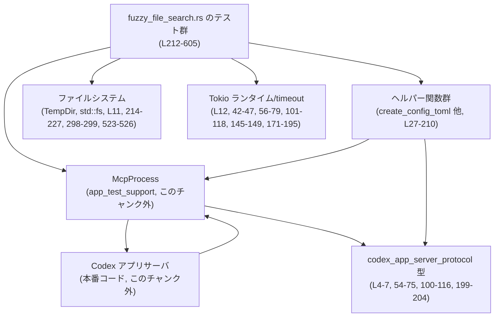
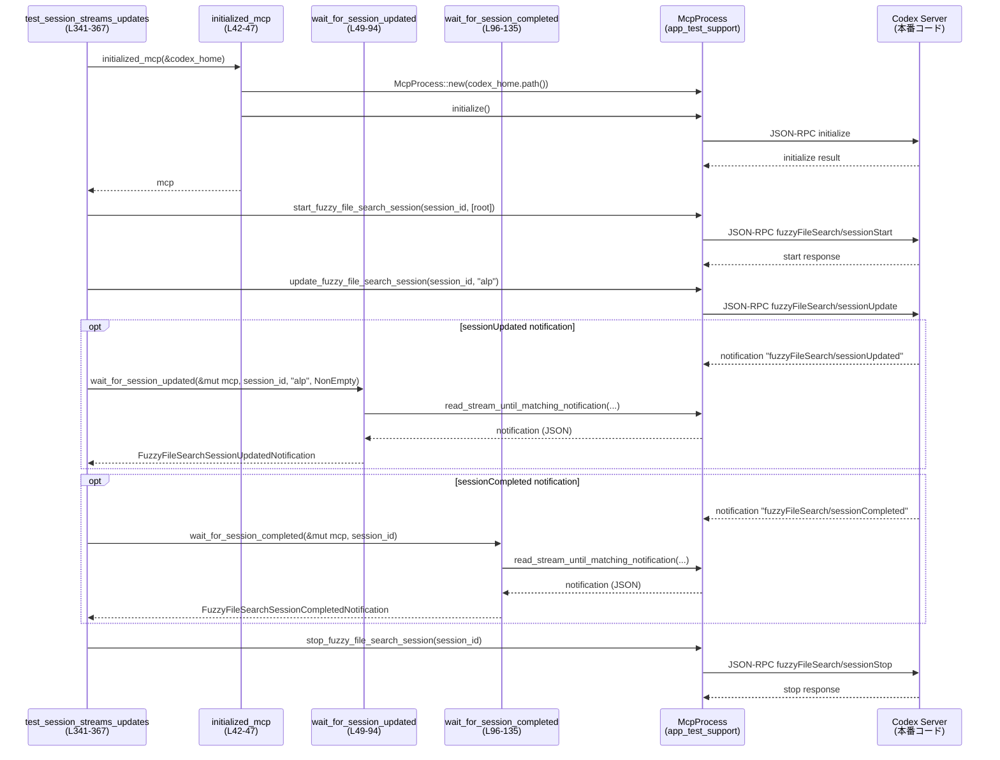

# app-server/tests/suite/fuzzy_file_search.rs コード解説

## 0. ざっくり一言

このテストモジュールは、Codex アプリサーバの **fuzzy file search（あいまいファイル検索）API** と、その **ストリーミング検索セッション API** の振る舞いを、JSON-RPC レベルで検証する非同期テスト群です（`fuzzy_file_search.rs:L1-605`）。

---

## 1. このモジュールの役割

### 1.1 概要

- このモジュールは、Codex サーバが提供する以下の機能をテストします（`fuzzy_file_search.rs:L212-605`）。
  - 単発の fuzzy file search RPC の結果フォーマット・スコアリング・マッチインデックス
  - `start / update / stop` からなる **検索セッション API** の更新・完了通知のストリーミング
  - セッションの有無や停止状態に応じたエラー応答
  - クエリ変更、空クエリ、キャンセレーショントークン、複数セッションの独立性などのエッジケース
- テスト補助として、MCP プロセスの初期化や通知待ちを行うヘルパー関数を提供します（`fuzzy_file_search.rs:L27-210`）。

### 1.2 アーキテクチャ内での位置づけ

このモジュールは **テストコード** であり、本番ロジックではなく、以下のコンポーネントを組み合わせて動作を検証します。

- テスト自体（本ファイルの `#[tokio::test]` 関数）
- `app_test_support::McpProcess`: Codex サーバとの JSON-RPC 通信を抽象化したテスト支援オブジェクト（`fuzzy_file_search.rs:L3, L42-47, L234-235, 300-301` など）
- `codex_app_server_protocol` の通知・レスポンス型（`FuzzyFileSearchSessionUpdatedNotification` など、`fuzzy_file_search.rs:L4-7, L54-75, L100-116, L199-204`）
- Tokio ランタイムと時間制御（`tokio::test`, `tokio::time::timeout`, `Instant`、`fuzzy_file_search.rs:L12, L212, L292` など）
- 一時ディレクトリとファイルシステム（`tempfile::TempDir`, `std::fs`, `fuzzy_file_search.rs:L11, L214-227, L523-526`）

依存関係を簡略化した図です。



### 1.3 設計上のポイント

- **非同期テスト**  
  - 全てのテストは `#[tokio::test(flavor = "multi_thread", worker_threads = 2)]` で実行され、Tokio のマルチスレッドランタイム上で動作します（`fuzzy_file_search.rs:L212, L292, L341, L369, L393, L420, L429, L467, L501, L519, L545, L584`）。
- **時間制御とタイムアウト**  
  - RPC 応答や通知待ちに `tokio::time::timeout` を使い、テストがハングしないようにしています（`fuzzy_file_search.rs:L42-47, L56-79, L101-118, L145-149, L171-176, L190-195, L248-252, L320-324, L447-456`）。
  - グレース期間と監視期間を用いて「停止後に通知が来ないこと」を検証します（`STOP_GRACE_PERIOD`, `SHORT_READ_TIMEOUT`, `fuzzy_file_search.rs:L15-16, L158-210, L410-411, L539-540`）。
- **エラーハンドリング**  
  - テスト・ヘルパーの戻り値は `anyhow::Result` で統一し、`?` 演算子でエラーを呼び出し元に伝播します（`fuzzy_file_search.rs:L1, L42-47, L54-75, L88-93, L100-118, L137-156, L158-210`）。
  - JSON-RPC エラーのコード・メッセージを厳密に検証し、API 契約をテストします（`fuzzy_file_search.rs:L145-154`）。
- **JSON パースとフィルタリング**  
  - 通知は `serde_json::from_value` で型にパースし、セッション ID / クエリ / ファイル数などの条件でフィルタします（`fuzzy_file_search.rs:L65-75, L110-116, L199-204`）。
- **セッション境界の検証**  
  - 複数セッションが互いの更新に影響しないこと、停止や完了後に更新が来ないことを、通知の `session_id` を見て検証します（`fuzzy_file_search.rs:L158-210, L345-365, L401-415, L508-515, L545-582`）。

---

## 2. 主要な機能一覧

このモジュールが提供・検証している主な機能です。

- Codex 設定ファイル生成: テスト用 `config.toml` を書き出し、MCP サーバをモック設定で起動可能にする（`create_config_toml`, `fuzzy_file_search.rs:L27-40`）。
- MCP プロセス初期化: `McpProcess` の生成と `initialize` RPC の完了待ち（`initialized_mcp`, `fuzzy_file_search.rs:L42-47`）。
- セッション更新通知待ち: `fuzzyFileSearch/sessionUpdated` 通知を条件付きで待ち受ける（`wait_for_session_updated`, `fuzzy_file_search.rs:L49-94`）。
- セッション完了通知待ち: `fuzzyFileSearch/sessionCompleted` 通知を条件付きで待ち受ける（`wait_for_session_completed`, `fuzzy_file_search.rs:L96-135`）。
- セッション未存在時の更新エラー検証: `update` RPC が JSON-RPC エラー（-32600）を返すことを確認（`assert_update_request_fails_for_missing_session`, `fuzzy_file_search.rs:L137-156`）。
- 停止後に更新が来ないことの検証: グレース期間後、指定セッションの更新通知が届かないことを監視（`assert_no_session_updates_for`, `fuzzy_file_search.rs:L158-210`）。
- 単発 fuzzy search の結果とソート順・マッチインデックスの検証（`test_fuzzy_file_search_sorts_and_includes_indices`, `fuzzy_file_search.rs:L212-290`）。
- キャンセレーショントークンの受け入れ検証（`test_fuzzy_file_search_accepts_cancellation_token`, `fuzzy_file_search.rs:L292-339`）。
- 検索セッション API の各種契約・エッジケースの検証（`test_fuzzy_file_search_session_*` 群, `fuzzy_file_search.rs:L341-605`）。

---

## 3. 公開 API と詳細解説

### 3.1 型一覧（構造体・列挙体など）

#### このファイル内で定義される型

| 名前 | 種別 | 役割 / 用途 | 根拠 |
|------|------|-------------|------|
| `FileExpectation` | 列挙体 | セッション更新通知に含まれる `files` 配列の期待状態（任意/空/非空）を表すテスト用フラグです。`wait_for_session_updated` のフィルタに使用します。 | `fuzzy_file_search.rs:L20-25, L70-74` |

#### 外部型（利用のみ）

これらは他クレートで定義されており、このファイルでは型として利用されるだけです。

| 名前 | 由来 | 役割 / 用途 | 根拠 |
|------|------|-------------|------|
| `McpProcess` | `app_test_support` | Codex MCP サーバとの JSON-RPC 通信（リクエスト送信・レスポンス/通知受信）をカプセル化するテスト用プロセスオブジェクトです。 | `fuzzy_file_search.rs:L3, L42-47, L234-235, L300-301, L345-347` |
| `FuzzyFileSearchSessionUpdatedNotification` | `codex_app_server_protocol` | `fuzzyFileSearch/sessionUpdated` 通知のペイロード型。`session_id`, `query`, `files` などを持ちます。テストでは `session_id`, `query`, `files` を参照しています。 | `fuzzy_file_search.rs:L4, L54-75, L91-93, L199-204` |
| `FuzzyFileSearchSessionCompletedNotification` | `codex_app_server_protocol` | `fuzzyFileSearch/sessionCompleted` 通知のペイロード型。少なくとも `session_id` を持ち、完了したセッションを識別します。 | `fuzzy_file_search.rs:L5, L100-116, L132-134, L361-362, L408-409, L488-489, L496-497` |
| `JSONRPCResponse` | `codex_app_server_protocol` | JSON-RPC レスポンス全体を表す型。テストでは `.result` フィールドを JSON として扱い、中身を検証しています。 | `fuzzy_file_search.rs:L6, L247-255, L320-333` |
| `RequestId` | `codex_app_server_protocol` | JSON-RPC の request ID を整数／文字列などで表す型。ここでは `RequestId::Integer(id)` を使っています。 | `fuzzy_file_search.rs:L7, L147-148, L248-252, L321-323, L448-455` |

### 3.2 関数詳細（最大 7 件）

#### 1. `create_config_toml(codex_home: &Path) -> std::io::Result<()>`

**概要**

- 一時ディレクトリを Codex の「ホーム」とみなし、その配下にテスト用の `config.toml` を生成します（`fuzzy_file_search.rs:L27-40`）。
- モデルやサンドボックス設定、機能フラグ `shell_snapshot` を固定値で書き込みます。

**引数**

| 引数名 | 型 | 説明 |
|--------|----|------|
| `codex_home` | `&Path` | Codex ホームディレクトリを表すパス。`config.toml` がこの直下に作成されます。 |

**戻り値**

- `std::io::Result<()>`  
  - ファイルの作成や書き込みに成功した場合は `Ok(())`。
  - それらが失敗した場合は `Err(std::io::Error)` を返します。

**内部処理の流れ**

1. `codex_home.join("config.toml")` で設定ファイルのパスを作成（`fuzzy_file_search.rs:L28`）。
2. `std::fs::write` でハードコードされた TOML 文字列をそのパスに書き込み（`fuzzy_file_search.rs:L29-38`）。
3. `std::fs::write` の戻り値（`io::Result<()>`）をそのまま返却（`fuzzy_file_search.rs:L39-40`）。

**Examples（使用例）**

テスト中での典型的な利用です。

```rust
// 一時ディレクトリを Codex のホームとして利用する                      // Codex のホームディレクトリとして TempDir を用意
let codex_home = TempDir::new()?;                                       // 一時ディレクトリ作成に失敗すると Err を返す

// 設定ファイルを生成する                                               // config.toml を codex_home 直下に作成
create_config_toml(codex_home.path())?;                                 // 失敗するとここで ? によりテストが失敗
```

**Errors / Panics**

- `std::fs::write` が I/O エラーを返した場合、その `Err(std::io::Error)` が呼び出し元に伝播します。
- この関数内では明示的な `panic!` はありません。

**Edge cases（エッジケース）**

- `codex_home` が存在しないディレクトリを指している場合  
  → `std::fs::write` が `NotFound` エラーを返す可能性があります。
- 書き込み権限がない場合  
  → `PermissionDenied` などの I/O エラーになります。

**使用上の注意点**

- 必ず MCP プロセスを起動する前に呼び出す必要があります（多くのテストでは `McpProcess::new` の前に呼び出しています。`fuzzy_file_search.rs:L215-217, L295-301`）。
- テスト用の設定内容は固定であり、本番と異なる可能性があります。

---

#### 2. `initialized_mcp(codex_home: &TempDir) -> Result<McpProcess>`

**概要**

- テスト用の Codex ホームディレクトリから `config.toml` を生成し、その設定で `McpProcess` を起動・初期化するヘルパーです（`fuzzy_file_search.rs:L42-47`）。
- すべてのテストで共通の「初期化済み MCP プロセス」を得るためのユーティリティです。

**引数**

| 引数名 | 型 | 説明 |
|--------|----|------|
| `codex_home` | `&TempDir` | Codex ホームとして使用する一時ディレクトリへの参照です。 |

**戻り値**

- `anyhow::Result<McpProcess>`  
  - 成功時: 初期化済みの `McpProcess` を返します。
  - 失敗時: `anyhow::Error` を返し、その時点でテストが失敗します。

**内部処理の流れ**

1. `create_config_toml(codex_home.path())?` で設定ファイルを生成（`fuzzy_file_search.rs:L43`）。
2. `McpProcess::new(codex_home.path()).await?` で MCP プロセスを起動（`fuzzy_file_search.rs:L44`）。
3. `timeout(DEFAULT_READ_TIMEOUT, mcp.initialize()).await??;` で初期化 RPC の完了を待機し、タイムアウトまたは内部エラーを検知（`fuzzy_file_search.rs:L45`）。
4. 初期化に成功すれば `Ok(mcp)` を返す（`fuzzy_file_search.rs:L46`）。

**Examples（使用例）**

```rust
// Codex ホーム用の TempDir を作成                                                 // Codex ホームディレクトリを一時的に作る
let codex_home = TempDir::new()?;                                                   // I/O エラーで Err

// 初期化済み MCP プロセスを取得                                                   // MCP プロセスを起動し initialize を実行
let mut mcp = initialized_mcp(&codex_home).await?;                                  // timeout や内部エラーで Err
```

**Errors / Panics**

- `create_config_toml` が I/O エラーを返した場合 → `anyhow::Error` に包まれて上位に伝播。
- `McpProcess::new(...)` がエラーの場合 → 同じく `anyhow::Error`。
- `mcp.initialize()` 内のエラー、または `timeout` によるタイムアウト → `await??` で 2 段階の `Result` をアンラップしており、どちらかが `Err` の場合 `anyhow::Error` になります。
- `panic` は明示的にありませんが、`timeout` の結果を `??` で処理しているため、戻り値の型が `Result<Result<_, _>, _>` であることを前提としています。

**Edge cases**

- サーバが応答しない場合: `DEFAULT_READ_TIMEOUT`（10 秒）を超えると `timeout` が `Err(Elapsed)` を返し、テストは失敗します（`fuzzy_file_search.rs:L14, L45`）。
- `codex_home` に既に別の `config.toml` が存在する場合  
  → 上書きされます。テスト内では常に新しい `TempDir` を使っており、競合しない前提です。

**使用上の注意点**

- `worker_threads = 2` の Tokio ランタイム上で呼び出されることを想定しており、ブロッキング I/O を伴わない形で使用されています。
- `DEFAULT_READ_TIMEOUT` を変更すると、サーバが重い環境でテストがタイムアウトしやすくなる／しにくくなるなどの影響があります。

---

#### 3. `wait_for_session_updated(...) -> Result<FuzzyFileSearchSessionUpdatedNotification>`

```rust
async fn wait_for_session_updated(
    mcp: &mut McpProcess,
    session_id: &str,
    query: &str,
    file_expectation: FileExpectation,
) -> Result<FuzzyFileSearchSessionUpdatedNotification>
```

**概要**

- MCP の通知ストリームから、指定セッション・指定クエリに対応し、かつ `files` 配列が指定条件（任意/空/非空）を満たす `fuzzyFileSearch/sessionUpdated` 通知が届くまで待機します（`fuzzy_file_search.rs:L49-94`）。
- タイムアウトした場合はバッファ中の通知メソッド一覧を含むエラーを返します。

**引数**

| 引数名 | 型 | 説明 |
|--------|----|------|
| `mcp` | `&mut McpProcess` | 通知を読み取る対象の MCP プロセスです。ミュータブル参照で受け取り、読み取りカーソルを進めます。 |
| `session_id` | `&str` | お目当てのセッション ID。通知の `session_id` がこれと一致するもののみを対象とします。 |
| `query` | `&str` | お目当てのクエリ文字列。通知の `query` がこれと一致するもののみを対象とします。 |
| `file_expectation` | `FileExpectation` | `files` 配列の状態に関する期待値（`Any`/`Empty`/`NonEmpty`）。 |

**戻り値**

- 成功時: 条件に一致した `FuzzyFileSearchSessionUpdatedNotification` のペイロードを返します。
- 失敗時: `anyhow::Error`（タイムアウト、JSON 変換失敗など）を返します。

**内部処理の流れ**

1. ログ用説明文字列 `description` を組み立てる（`fuzzy_file_search.rs:L55`）。
2. `mcp.read_stream_until_matching_notification(&description, |notification| { ... })` を `timeout` で包み、`DEFAULT_READ_TIMEOUT` 以内にマッチする通知が来るのを待つ（`fuzzy_file_search.rs:L56-79`）。
3. フィルタクロージャ内で以下を確認（`fuzzy_file_search.rs:L59-75`）。
   - `notification.method == SESSION_UPDATED_METHOD`（メソッド名が `"fuzzyFileSearch/sessionUpdated"` か）  
   - `notification.params` が `Some` であること
   - `params` を `FuzzyFileSearchSessionUpdatedNotification` に `serde_json::from_value` で変換できること
   - `payload.session_id == session_id` かつ `payload.query == query` であること
   - `file_expectation` に応じて `payload.files` が空/非空であること
4. タイムアウト (`Err(_)`) の場合は `anyhow::bail!` でエラーを返す。このとき `mcp.pending_notification_methods()` をログとして含める（`fuzzy_file_search.rs:L82-85`）。
5. 得られた `notification` から `params` を取り出し、再度 `serde_json::from_value` でペイロード型に変換して返す（`fuzzy_file_search.rs:L88-93`）。

**Examples（使用例）**

```rust
// セッション "session-1" に対してクエリ "alp" の更新を待つ                         // セッション ID とクエリを指定
let payload = wait_for_session_updated(
    &mut mcp,                                                     // MCP プロセス
    "session-1",                                                  // 対象セッション
    "alp",                                                        // 対象クエリ
    FileExpectation::NonEmpty,                                    // files が非空であることを期待
).await?;                                                         // timeout や JSON エラーで Err

// 取得した結果の検証                                                   // 返ってきたペイロードを確認
assert_eq!(payload.files[0].path, "alpha.txt");
```

**Errors / Panics**

- `timeout` でタイムアウトした場合: `anyhow::bail!` により `Err(anyhow::Error)` が返ります。エラーメッセージには `description` と `pending_notification_methods()` が含まれます（デバッグ補助、`fuzzy_file_search.rs:L82-85`）。
- JSON デコード失敗 (`serde_json::from_value`)  
  - フィルタクロージャ内では「マッチしない通知」として扱われるだけです（`fuzzy_file_search.rs:L65-69`）。
  - 最終的な `notification` からの再変換時に失敗した場合は `Err(anyhow::Error)` になります（`fuzzy_file_search.rs:L91-93`）。
- `notification.params` が `None` の場合: `ok_or_else` によって `anyhow!("missing notification params")` で失敗します（`fuzzy_file_search.rs:L88-90`）。

**Edge cases**

- `FileExpectation::Any` の場合、`files` が空でも非空でもマッチします（`fuzzy_file_search.rs:L70-71`）。
- 他セッションや他クエリの更新通知が大量に来ていても、フィルタに一致するものが現れるまで読み続けます。その間にバッファが増える可能性があります。
- `mcp.read_stream_until_matching_notification` の挙動はこのファイルからは不明ですが、通知が届かない場合にはタイムアウトする前に内部でエラーを返すことも考えられます（この部分は「このチャンクには現れない」）。

**使用上の注意点**

- テストでは、`update` を送った直後に `wait_for_session_updated` を呼び出す構造が多く、**クエリとセッション ID を正しく対応させることが重要**です（`fuzzy_file_search.rs:L353-358, L381-386, L406-408` など）。
- `FileExpectation` を誤ると、意図せぬ通知（例えば空リスト）を拾ってしまう可能性があります。

---

#### 4. `wait_for_session_completed(...) -> Result<FuzzyFileSearchSessionCompletedNotification>`

```rust
async fn wait_for_session_completed(
    mcp: &mut McpProcess,
    session_id: &str,
) -> Result<FuzzyFileSearchSessionCompletedNotification>
```

**概要**

- 指定セッション ID の `fuzzyFileSearch/sessionCompleted` 通知が届くまで待ち受けるヘルパー関数です（`fuzzy_file_search.rs:L96-135`）。
- セッション単位での検索完了を確認するために、複数のテストから利用されています。

**引数**

| 引数名 | 型 | 説明 |
|--------|----|------|
| `mcp` | `&mut McpProcess` | 通知ストリームを読む MCP プロセス。 |
| `session_id` | `&str` | 監視対象のセッション ID。 |

**戻り値**

- 成功時: 対象セッションの完了通知ペイロードを返します。
- 失敗時: `anyhow::Error` を返します。

**内部処理の流れ**

1. 説明文字列 `description` の生成（`fuzzy_file_search.rs:L100`）。
2. `mcp.read_stream_until_matching_notification` を用いて、メソッド名が `SESSION_COMPLETED_METHOD` かつ `payload.session_id == session_id` の通知が届くのを、`timeout` 付きで待機（`fuzzy_file_search.rs:L101-116`）。
3. タイムアウト時には `wait_for_session_updated` と同様に `anyhow::bail!` でエラー（`fuzzy_file_search.rs:L121-126`）。
4. `notification.params` を `FuzzyFileSearchSessionCompletedNotification` に変換して返却（`fuzzy_file_search.rs:L129-134`）。

**Examples（使用例）**

```rust
// "session-1" の検索が完了するまで待つ                                     // セッションの完了通知を待つ
let completed = wait_for_session_completed(&mut mcp, "session-1").await?;       // timeout 等で Err
assert_eq!(completed.session_id, "session-1");                                  // 完了報告の session_id を確認
```

**Errors / Panics / Edge cases / 使用上の注意点**

- `wait_for_session_updated` と同様のタイムアウト戦略・エラー処理を採用しています（`fuzzy_file_search.rs:L101-118, L121-126, L129-134`）。
- 検索実装がセッション完了を送らないバグを持つと、テストはタイムアウトで失敗します。このテストにより「各クエリ更新ごとに必ず完了通知を送る」という契約が守られているかを検証しています（`fuzzy_file_search.rs:L408-409, L488-489, L496-497`）。

---

#### 5. `assert_no_session_updates_for(...) -> Result<()>`

```rust
async fn assert_no_session_updates_for(
    mcp: &mut McpProcess,
    session_id: &str,
    grace_period: std::time::Duration,
    duration: std::time::Duration,
) -> Result<()>
```

**概要**

- 2 段階に分けて、指定セッションに対して **更新通知が来ないこと** を検証するヘルパーです（`fuzzy_file_search.rs:L158-210`）。
  1. グレース期間中: 通知が来ても無視（テストが stop 直後に飛んでくる残りの通知を許容）。
  2. 監視期間中: 該当セッション ID の更新通知が届いた場合はエラー。

**引数**

| 引数名 | 型 | 説明 |
|--------|----|------|
| `mcp` | `&mut McpProcess` | 通知ストリームを読む MCP プロセス。 |
| `session_id` | `&str` | 監視対象のセッション ID。 |
| `grace_period` | `Duration` | 停止直後に到着する可能性のある既にキューされた通知を許容する時間。 |
| `duration` | `Duration` | この時間の間、該当セッション ID の更新が来ないことを保証したい監視時間。 |

**戻り値**

- 要件を満たした場合: `Ok(())`。
- 該当セッションの更新が監視期間に届いた場合やストリーム読み取りエラー時: `Err(anyhow::Error)`。

**内部処理の流れ**

1. **グレース期間ループ**（`fuzzy_file_search.rs:L164-181`）
   - `grace_deadline = now + grace_period` を計算（`L164-167`）。
   - 現在時刻が `grace_deadline` を超えるまで、残り時間 `remaining` で `timeout(remaining, read_stream_until_notification_message(SESSION_UPDATED_METHOD))` を繰り返す（`L170-176`）。
   - タイムアウト (`Err(_)`) の場合はループを抜ける（`L177-178`）。
   - ストリームエラー (`Ok(Err(err))`) は即座に `Err(err)` を返す（`L178-179`）。
   - 通知を受信した場合 (`Ok(Ok(_))`) は何もせず無視（`L179-180`）。
2. **監視期間ループ**（`fuzzy_file_search.rs:L183-209`）
   - `deadline = now + duration` を計算（`L183-186`）。
   - `now >= deadline` になったら `Ok(())` を返して終了（`L186-187`）。
   - `remaining` の間 `timeout` で再度 `SESSION_UPDATED_METHOD` の通知を待つ（`L189-195`）。
   - タイムアウト (`Err(_)`) の場合は監視期間内に通知が来なかったとみなし `Ok(())`（`L196-197`）。
   - ストリームエラーは `Err(err)`（`L197-198`）。
   - 通知を受信した場合（`Ok(Ok(notification))`）は `params` を `FuzzyFileSearchSessionUpdatedNotification` にパースし、`payload.session_id == session_id` なら `anyhow::bail!`（`L199-205`）。別セッションの更新は無視。

**Examples（使用例）**

```rust
// セッションを stop した後、そのセッション向けの更新が来ないことを確認                  // stop 後に更新が流れないことを検証
mcp.stop_fuzzy_file_search_session(session_id).await?;                          // stop RPC の送信

assert_no_session_updates_for(
    &mut mcp,
    session_id,                                                                 // 監視対象のセッション
    STOP_GRACE_PERIOD,                                                          // 小さなグレース期間
    SHORT_READ_TIMEOUT,                                                         // 短い監視期間
).await?;                                                                       // 更新が来た場合 Err
```

**Errors / Panics**

- 通知ストリームがエラーを返した場合 → `Err(anyhow::Error)`。
- 監視期間中に対象セッションの更新が届いた場合 → `anyhow::bail!("received unexpected session update after stop: {payload:?}")` によりテスト失敗（`fuzzy_file_search.rs:L203-205`）。

**Edge cases**

- グレース期間中に大量の通知が来ても、すべて無視されます（内容はチェックしません）。
- 監視期間中の通知で `params` が欠落している場合 → `"missing notification params"` で `Err`（`fuzzy_file_search.rs:L199-201`）。
- 他セッションの更新は監視期間中も許容されます（`payload.session_id == session_id` のみエラー）。

**使用上の注意点**

- `STOP_GRACE_PERIOD` および `SHORT_READ_TIMEOUT` の設定に依存します。サーバの負荷が高い環境では、必要に応じて値を調整する必要があります（`fuzzy_file_search.rs:L15-16, L410-411, L539-540`）。
- 「更新が来ないこと」の証明は時間ベースの推測に依存するため、根本的にはテストフレームワークとサーバの性能に影響されます。

---

#### 6. `test_fuzzy_file_search_sorts_and_includes_indices() -> Result<()>`

**概要**

- 単発の `fuzzyFileSearch` RPC の結果として返される `files` 配列について、**スコア順・マッチインデックス・ファイル名** が期待どおりであることを確認するテストです（`fuzzy_file_search.rs:L212-290`）。

**引数**

- なし（テスト関数）。Tokio により `async fn` として実行されます（`#[tokio::test(...)]`, `fuzzy_file_search.rs:L212`）。

**戻り値**

- `anyhow::Result<()>`  
  - アサーションや I/O で失敗した場合は `Err(anyhow::Error)` となり、テストが失敗します。

**内部処理の流れ（アルゴリズム）**

1. Codex ホームと検索対象ルート用の `TempDir` を作成（`fuzzy_file_search.rs:L215-218`）。
2. いくつかのテストファイルを作成し、クエリ `"abe"` に対して決定的な並び順になるように設計（`abc`, `abcde`, `abexy`, `zzz.txt`, `sub/abce`）（`fuzzy_file_search.rs:L220-227`）。
3. MCP プロセスを起動して `initialize` を実行（`fuzzy_file_search.rs:L233-235`）。
4. `send_fuzzy_file_search_request("abe", vec![root_path.clone()], None)` を呼び出し、単発検索を実行（`fuzzy_file_search.rs:L239-245`）。
5. `read_stream_until_response_message(RequestId::Integer(request_id))` でレスポンスを待ち、`JSONRPCResponse` を取得（`fuzzy_file_search.rs:L247-252`）。
6. `resp.result` を `serde_json::Value` として扱い、期待される JSON 構造と完全一致することを `assert_eq!` で検証（`fuzzy_file_search.rs:L254-287`）。

**Examples（使用例）**

この関数自体が使用例であり、単発 fuzzy search をテストするテンプレートと見ることができます。

```rust
let request_id = mcp
    .send_fuzzy_file_search_request("abe", vec![root_path.clone()], None)
    .await?;

let resp: JSONRPCResponse = timeout(
    DEFAULT_READ_TIMEOUT,
    mcp.read_stream_until_response_message(RequestId::Integer(request_id)),
).await??;

let value = resp.result;
// ここで value を json!({...}) と突き合わせる                                   // 期待される files 配列・score・indices を検証
assert_eq!(value, json!({ /* 略 */ }));
```

**Errors / Panics**

- ファイル作成 (`std::fs::write`) の I/O エラー。
- MCP 初期化や RPC 呼び出しでのエラー、タイムアウト。
- `assert_eq!` による失敗（結果 JSON が期待と異なる）。

**Edge cases**

- スコアリングやインデックスの仕様が変わると、このテストは失敗します。テストはアルゴリズムの詳細（score=84,72,71, indices=[...]）まで固定値で検証しています（`fuzzy_file_search.rs:L255-283`）。
- `sub/abce` のパスはルートからの相対パスに変換した文字列で期待値を組み立てています（`fuzzy_file_search.rs:L228-231`）。

**使用上の注意点**

- fuzzy マッチングアルゴリズムのチューニング（スコア計算・インデックス計算）を変更した場合、このテストも合わせて更新する必要があります。
- 結果 JSON のキーや構造を変更するときも、ここを更新する必要があります。

---

#### 7. `test_fuzzy_file_search_session_multiple_query_updates_work() -> Result<()>`

**概要**

- 1 つのセッションに対して複数回 `update` を送ったとき、  
  - 各クエリに対して更新通知と完了通知がペアで送られること
  - クエリ `"zzzz"` のようにマッチしない場合は `files` が空配列になること  
  を検証するテストです（`fuzzy_file_search.rs:L467-499`）。

**内部処理の流れ**

1. 検索対象ルートに `alpha.txt` と `alphabet.txt` を作成（`fuzzy_file_search.rs:L471-472`）。
2. `initialized_mcp` で MCP を起動（`fuzzy_file_search.rs:L473-474`）。
3. セッション `"session-multi-update"` を `root_path` で開始（`fuzzy_file_search.rs:L476-478`）。
4. クエリ `"alp"` を `update` し、`wait_for_session_updated(..., "alp", NonEmpty)` で非空結果を確認（`fuzzy_file_search.rs:L480-483`）。
5. その更新結果に含まれるファイルの `root` がすべて `root_path` であることを確認（`fuzzy_file_search.rs:L484-487`）。
6. `wait_for_session_completed` で `"alp"` クエリ分の完了通知を確認（`fuzzy_file_search.rs:L488`）。
7. 次にクエリ `"zzzz"` を `update` し、`FileExpectation::Any` で更新通知を待ち、`payload.files.is_empty() == true` で空結果を確認（`fuzzy_file_search.rs:L490-495`）。
8. `"zzzz"` クエリ分についても完了通知が来ることを検証（`fuzzy_file_search.rs:L496-497`）。

**契約上の意味合い**

このテストから読み取れる fuzzy file search セッションの契約は以下です：

- 各 `update` クエリに対して、
  - 少なくとも 1 つの `sessionUpdated` 通知が発行される。
  - その後、`sessionCompleted` 通知が発行される。
- マッチするファイルが 0 件でも、`sessionUpdated` 通知は送られ、`files` は空配列になる。

**Errors / Edge cases / 使用上の注意点**

- 2 回目のクエリが 0 件マッチのケースを明示的にテストしているため、「空結果でも通知が送られる」ことが API 契約です（`fuzzy_file_search.rs:L492-495`）。
- サーバ実装が「結果が空のときは更新通知を送らない」ようになっていると、このテストが失敗し、仕様違反が検知されます。

---

### 3.3 その他の関数

ヘルパーおよびその他のテスト関数の一覧です。

| 関数名 | 役割（1 行） | 根拠 |
|--------|--------------|------|
| `assert_update_request_fails_for_missing_session` | 存在しないセッション ID に対する `update` RPC が JSON-RPC エラー `code = -32600` と特定メッセージを返すことを検証します。 | `fuzzy_file_search.rs:L137-156, L421-425, L508-515` |
| `test_fuzzy_file_search_accepts_cancellation_token` | fuzzy search RPC が `cancellation_token` パラメータを受け付け、キャンセル対象にしても正常に結果が返ることを確認します。 | `fuzzy_file_search.rs:L292-339` |
| `test_fuzzy_file_search_session_streams_updates` | セッション開始後、`update` に応じて非空の更新通知と完了通知が届き、`stop` が成功することを確認します。 | `fuzzy_file_search.rs:L341-367` |
| `test_fuzzy_file_search_session_update_is_case_insensitive` | クエリ `"ALP"` でも `"alpha.txt"` がヒットすることから、検索が大文字小文字を区別しないことを検証します。 | `fuzzy_file_search.rs:L369-391` |
| `test_fuzzy_file_search_session_no_updates_after_complete_until_query_edited` | 一度クエリ `"alp"` の完了通知を受けた後、クエリを変更しない限り追加の更新通知が来ないこと、変更後は再び更新が来ることを検証します。 | `fuzzy_file_search.rs:L393-418` |
| `test_fuzzy_file_search_session_update_before_start_errors` | `start` を呼ぶ前の `update` が「セッションが見つからない」エラーになることを検証します。 | `fuzzy_file_search.rs:L420-427` |
| `test_fuzzy_file_search_session_update_works_without_waiting_for_start_response` | `start` のレスポンスを待たずに `update` を送信しても、両方のレスポンスが返り、更新通知も正常に流れることを検証します（リクエストのパイプライン処理）。 | `fuzzy_file_search.rs:L429-465` |
| `test_fuzzy_file_search_session_update_after_stop_fails` | `stop` したセッションに対する `update` がエラーとなることを検証します。 | `fuzzy_file_search.rs:L501-517` |
| `test_fuzzy_file_search_session_stops_sending_updates_after_stop` | 多数のファイルに対する検索中に `stop` しても、それ以降はそのセッション向け更新が来ないことを `assert_no_session_updates_for` で検証します。 | `fuzzy_file_search.rs:L519-543` |
| `test_fuzzy_file_search_two_sessions_are_independent` | 2 つのセッションが互いの結果に影響しないこと、および `session_id` ごとに適切なファイルが返ることを検証します。 | `fuzzy_file_search.rs:L545-582` |
| `test_fuzzy_file_search_query_cleared_sends_blank_snapshot` | 非空クエリから空文字列にクエリをクリアした際、`files` が空配列のスナップショットが送信されることを検証します。 | `fuzzy_file_search.rs:L584-605` |

---

## 4. データフロー

### 4.1 代表的なシナリオ概要

ここでは、**検索セッション開始 → 更新 → 完了 → 停止** という代表的なシナリオとして  
`test_fuzzy_file_search_session_streams_updates`（`fuzzy_file_search.rs:L341-367`）とヘルパー関数の連携を図示します。

このフローにより、以下の契約が確認されています。

- `start` 後に `update` すると、`sessionUpdated` 通知が届く。
- その後 `sessionCompleted` 通知が届く。
- `stop` は成功する（以後の挙動は別テストで検証）。

### 4.2 シーケンス図



**要点**

- テストは常に `McpProcess` を通じてサーバとやりとりし、ヘルパー関数が通知ストリームの読み取りとフィルタリングを担当します。
- `wait_for_session_updated` / `wait_for_session_completed` はいずれも `read_stream_until_matching_notification` をラップしており、**条件付きの通知待ち** という共通パターンを提供しています（`fuzzy_file_search.rs:L56-79, L101-118`）。

---

## 5. 使い方（How to Use）

このファイルはテスト用ですが、「どのようにヘルパーを使って fuzzy file search の新しいテストを書くか」という意味での使い方を整理します。

### 5.1 基本的な使用方法

**パターン A: 単発検索 RPC のテスト**

1. Codex ホーム `TempDir` と検索ルート `TempDir` を用意（`fuzzy_file_search.rs:L215-218, L294-297`）。
2. `create_config_toml` → `McpProcess::new` → `initialize` で MCP を初期化（または `initialized_mcp` を利用）。
3. `send_fuzzy_file_search_request` で検索を発行。
4. `read_stream_until_response_message` でレスポンスを待ち、`JSONRPCResponse` を検証。

```rust
let codex_home = TempDir::new()?;                                           // Codex ホーム
create_config_toml(codex_home.path())?;                                     // config.toml を生成

let root = TempDir::new()?;                                                 // 検索対象ルート
std::fs::write(root.path().join("alpha.txt"), "contents")?;                 // テストファイル作成

let mut mcp = McpProcess::new(codex_home.path()).await?;                    // MCP プロセス起動
timeout(DEFAULT_READ_TIMEOUT, mcp.initialize()).await??;                    // initialize RPC

let root_path = root.path().to_string_lossy().to_string();                  // 文字列パス
let request_id = mcp
    .send_fuzzy_file_search_request("alp", vec![root_path.clone()], None)
    .await?;                                                                // fuzzy search RPC を送信

let resp: JSONRPCResponse = timeout(
    DEFAULT_READ_TIMEOUT,
    mcp.read_stream_until_response_message(RequestId::Integer(request_id)),
).await??;                                                                  // レスポンスを待機

// resp.result を検証                                                       // JSON の中身をテスト
```

**パターン B: セッション検索のテスト**

1. `initialized_mcp` で MCP を初期化。
2. `start_fuzzy_file_search_session(session_id, roots)` を送信。
3. `update_fuzzy_file_search_session(session_id, query)` を送信。
4. `wait_for_session_updated` と `wait_for_session_completed` で通知を検証。
5. 必要に応じて `stop_fuzzy_file_search_session` と `assert_no_session_updates_for` を組み合わせる。

```rust
let codex_home = TempDir::new()?;                                           // Codex ホーム
let root = TempDir::new()?;                                                 // 検索ルート
std::fs::write(root.path().join("alpha.txt"), "contents")?;                 // テストファイル

let mut mcp = initialized_mcp(&codex_home).await?;                          // MCP 初期化
let root_path = root.path().to_string_lossy().to_string();                  // ルートパス
let session_id = "my-session";                                              // セッション ID

mcp.start_fuzzy_file_search_session(session_id, vec![root_path.clone()])
    .await?;                                                                // セッション開始
mcp.update_fuzzy_file_search_session(session_id, "alp").await?;             // クエリ更新

let update = wait_for_session_updated(
    &mut mcp,
    session_id,
    "alp",
    FileExpectation::NonEmpty,
).await?;                                                                   // 更新通知待ち

let completed = wait_for_session_completed(&mut mcp, session_id).await?;    // 完了通知待ち
assert_eq!(completed.session_id, session_id);                               // 完了セッションを確認
```

### 5.2 よくある使用パターン

- **キャンセレーショントークンのテスト**  
  `send_fuzzy_file_search_request` の第 3 引数に、別リクエストの ID を文字列化して渡す（`fuzzy_file_search.rs:L305-318`）。

- **クエリ変更による再検索**  
  同じ `session_id` に対して異なるクエリ文字列で複数回 `update` を送る（`fuzzy_file_search.rs:L480-481, L490-491`）。

- **空クエリの扱い**  
  クエリを `""` に変更して `FileExpectation::Empty` で更新通知を待ち、結果が空配列であることを検証（`fuzzy_file_search.rs:L596-603`）。

### 5.3 よくある間違い

このファイルから推測できる「誤用」とその修正例です。

```rust
// 間違い例: MCP 初期化前にセッション API を呼ぶ
let mut mcp = McpProcess::new(codex_home.path()).await?;
// mcp.initialize() を呼ばずに start してしまう
mcp.start_fuzzy_file_search_session("session", vec![root_path.clone()]).await?;

// 正しい例: initialize を完了させてからセッション API を利用
let mut mcp = McpProcess::new(codex_home.path()).await?;
timeout(DEFAULT_READ_TIMEOUT, mcp.initialize()).await??; // または initialized_mcp を使用
mcp.start_fuzzy_file_search_session("session", vec![root_path.clone()]).await?;
```

```rust
// 間違い例: stop 後に更新が届かないことを確認しない
mcp.stop_fuzzy_file_search_session(session_id).await?;

// 正しい例: stop 後に更新が届かないことも検証に含める
mcp.stop_fuzzy_file_search_session(session_id).await?;
assert_no_session_updates_for(
    &mut mcp,
    session_id,
    STOP_GRACE_PERIOD,
    SHORT_READ_TIMEOUT,
).await?;
```

### 5.4 使用上の注意点（まとめ）

- **非同期コンテキスト必須**  
  すべてのヘルパー・テストは `async fn` であり、Tokio ランタイム上で実行される前提です（`#[tokio::test]`, `fuzzy_file_search.rs:L212 以降`）。
- **タイムアウトの扱い**  
  - `DEFAULT_READ_TIMEOUT` は 10 秒で固定されており、サーバや環境によっては短すぎる／長すぎる可能性があります（`fuzzy_file_search.rs:L14`）。
  - テストが sporadic に失敗する場合、サーバのパフォーマンスを考慮して値を調整する必要があります。
- **JSON-RPC 契約の固定**  
  - エラーコード（`-32600`）やエラーメッセージ文字列を厳密に比較しているため、プロトコル仕様を変更する場合はテストも更新する必要があります（`fuzzy_file_search.rs:L150-154`）。
- **セッション ID / クエリの一貫性**  
  - ヘルパーは `session_id` と `query` で通知をフィルタしているため、テストでこれらを誤指定すると、タイムアウトや意図しない通知マッチの原因になります（`fuzzy_file_search.rs:L55, L75`）。

---

## 6. 変更の仕方（How to Modify）

### 6.1 新しい機能を追加する場合（新しいテストケース）

新しい fuzzy file search の仕様・エッジケースをテストしたい場合の手順です。

1. **テスト関数の追加位置**
   - このファイル末尾付近に `#[tokio::test(...)]` の新しい `async fn` を追加します（既存テストと同じスタイルを踏襲）。
2. **環境準備**
   - `TempDir` で Codex ホームと検索ルートを用意し、必要なファイル構造を作成します（`fuzzy_file_search.rs:L215-227, L471-472, L523-526` を参考）。
   - MCP の初期化には `initialized_mcp` を利用するのが簡潔です。
3. **RPC / セッション API 呼び出し**
   - 単発検索なら `send_fuzzy_file_search_request` と `read_stream_until_response_message`。
   - セッションであれば `start_*session`, `update_*session`, `stop_*session` と `wait_for_session_updated` / `wait_for_session_completed` / `assert_no_session_updates_for` の組み合わせを利用します。
4. **検証**
   - `FuzzyFileSearchSessionUpdatedNotification` のフィールド（`session_id`, `query`, `files` 内の `root`, `path`, `score`, `indices` 等）を `assert_eq!` で検証します。
   - エラー系の仕様であれば `read_stream_until_error_message` を使い、`error.code` / `error.message` を確認します（`fuzzy_file_search.rs:L145-154`）。

### 6.2 既存の機能を変更する場合

特に fuzzy file search の本番実装を変更する際に、どのテストに影響が出るかの目安です。

- **スコアやインデックス計算の変更**
  - `test_fuzzy_file_search_sorts_and_includes_indices` が直接影響を受けます（`fuzzy_file_search.rs:L257-283`）。
  - 新しいアルゴリズムに合わせて期待スコアやインデックスの値を更新する必要があります。
- **セッションライフサイクルの変更**
  - `sessionUpdated` / `sessionCompleted` の頻度やタイミングが変わると、ほぼすべての `test_fuzzy_file_search_session_*` が影響を受けます（`fuzzy_file_search.rs:L341-605`）。
  - 特に、完了通知を送らなくする、通知をまとめて送るなどの変更は `wait_for_session_completed` を前提としたテストと衝突します。
- **エラーコード・メッセージの変更**
  - 「セッションが存在しない」場合のエラー仕様を変えると `assert_update_request_fails_for_missing_session` の期待値更新が必要です（`fuzzy_file_search.rs:L150-154, L421-425, L508-515`）。
- **クエリクリア / 空結果の扱い**
  - 空クエリ時の挙動を変えると `test_fuzzy_file_search_query_cleared_sends_blank_snapshot` に影響します（`fuzzy_file_search.rs:L596-603`）。
  - マッチ 0 件時に通知を送らない仕様にすると、`test_fuzzy_file_search_session_multiple_query_updates_work` の後半が失敗します（`fuzzy_file_search.rs:L490-497`）。

変更時には、それぞれのテストの **前提条件（契約）** を読み取り、仕様のどの部分に依存しているかを確認すると安全です。

---

## 7. 関連ファイル

このモジュールと密接に関係する外部コンポーネントをまとめます。

| パス / クレート | 役割 / 関係 |
|-----------------|------------|
| `app_test_support::McpProcess`（具体的なファイルパスはこのチャンクには現れません） | Codex サーバとの JSON-RPC 通信を抽象化するテスト用プロセスラッパーです。リクエスト送信・レスポンス/通知待ち・エラー待ち・ペンディング通知一覧などの機能を提供し、本ファイルの全テストの基盤となっています（`fuzzy_file_search.rs:L3, L42-47, L234-235, L300-301` など）。 |
| `codex_app_server_protocol` クレート | fuzzy file search 関連の JSON-RPC メッセージ型（`FuzzyFileSearchSessionUpdatedNotification`, `FuzzyFileSearchSessionCompletedNotification`, `JSONRPCResponse`, `RequestId`）を定義しています。本ファイルではこれらの型を通じてサーバのプロトコル契約を検証しています（`fuzzy_file_search.rs:L4-7, L54-75, L91-93, L100-116, L132-134, L247-255`）。 |
| Codex アプリサーバ本体（具体的なパスはこのチャンクには現れません） | `McpProcess` が接続する対象であり、fuzzy file search の本番ロジックを実装しています。本ファイルのテストは、その挙動がプロトコル仕様どおりかどうかをブラックボックス的に検証します。 |
| `Tokio` クレート | 非同期ランタイムおよび時間制御（`#[tokio::test]`, `tokio::time::timeout`, `Instant`）を提供します。本テストの並行実行とタイムアウト処理に必須です（`fuzzy_file_search.rs:L12, L171-176, L190-195`）。 |
| `tempfile` クレート | テスト用の一時ディレクトリ (`TempDir`) を提供し、Codex ホームおよび検索ルートとして使用されます（`fuzzy_file_search.rs:L11, L215-218, L294-297, L345-347, L521-522`）。 |

以上が、このテストモジュールの構造・データフロー・契約の整理です。
