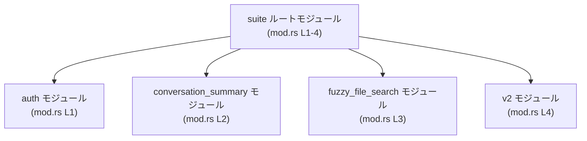

# app-server/tests/suite/mod.rs

## 0. ざっくり一言

`tests/suite` 統合テストクレート内で、個別のテストモジュール（`auth` など）をまとめて読み込むルートモジュールです（`app-server/tests/suite/mod.rs:L1-4`）。

---

## 1. このモジュールの役割

### 1.1 概要

- このモジュールは、`tests/suite` 配下の **テスト用サブモジュールを宣言する** 役割を持ちます。
- 実行時ロジックやテスト本体は含まず、`auth` / `conversation_summary` / `fuzzy_file_search` / `v2` の 4 つのサブモジュールをコンパイル対象に含めています（`app-server/tests/suite/mod.rs:L1-4`）。

### 1.2 アーキテクチャ内での位置づけ

- Cargo の一般的な構成では、`tests/suite` は **統合テストクレート** になり、そのルートとして `mod.rs` が存在します。
- この `mod.rs` は、同一ディレクトリ内の `auth` などのモジュールを読み込み、**テストコードの入口** として機能します（ただし、実際のサブモジュールの実装やファイル名はこのチャンクには現れません）。

以下は、このチャンクで確認できるモジュール依存関係のイメージです。



### 1.3 設計上のポイント

コードから読み取れる設計上の特徴は次の通りです。

- **責務の分割**  
  - テストコードを `auth` / `conversation_summary` / `fuzzy_file_search` / `v2` といった機能単位でモジュールに分割しています（モジュール宣言から推測、`app-server/tests/suite/mod.rs:L1-4`）。  
  - 実際にどのようなテストがあるかは、このチャンクには現れません。

- **状態を持たないルート**  
  - このファイルには構造体・列挙体・静的変数などの状態は定義されておらず、**コンパイル時のモジュール構成のみ** を記述しています（`app-server/tests/suite/mod.rs:L1-4`）。

- **エラーハンドリング / 並行性**  
  - モジュール宣言のみで、関数呼び出しやスレッド・非同期処理は登場しません。
  - サブモジュール内でどのようなエラーハンドリングや並行性制御が行われているかは、このチャンクからは不明です。

---

## 2. 主要な機能一覧

このモジュール自身はロジックを持ちませんが、「どのテストモジュールを含めるか」を決める構成要素として機能します。

### 2.1 コンポーネント（モジュール）インベントリー

このチャンクで確認できるコンポーネントはモジュールのみです。

| 名前 | 種別 | 定義位置 | 役割 / 用途（コードから分かる範囲） |
|------|------|----------|------------------------------------|
| `suite` | モジュール（統合テストクレートのルート） | `app-server/tests/suite/mod.rs:L1-4` | テスト用サブモジュールをまとめて宣言する入口モジュール |
| `auth` | サブモジュール | `app-server/tests/suite/mod.rs:L1` | 認証関連のテストを含む可能性があるが、内容はこのチャンクには現れません（名前からの推測） |
| `conversation_summary` | サブモジュール | `app-server/tests/suite/mod.rs:L2` | 会話要約に関するテストを含む可能性があるが、内容は不明（名前からの推測） |
| `fuzzy_file_search` | サブモジュール | `app-server/tests/suite/mod.rs:L3` | あいまいファイル検索のテストを含む可能性があるが、内容は不明（名前からの推測） |
| `v2` | サブモジュール | `app-server/tests/suite/mod.rs:L4` | 「v2」世代のテストをまとめる可能性があるが、内容は不明（名前からの推測） |

> ※ サブモジュールの具体的な型・関数・テスト内容はこのチャンクには現れないため、「可能性がある」と表現しています。

### 2.2 関数・構造体インベントリー

このファイルに **関数定義・構造体定義・列挙体定義は一切存在しません**。

- 根拠: ファイル全体（`app-server/tests/suite/mod.rs:L1-4`）が 4 行の `mod` 宣言のみで構成されているためです。

---

## 3. 公開 API と詳細解説

### 3.1 型一覧（構造体・列挙体など）

このモジュールでは、構造体・列挙体・型エイリアスなどの **型定義は行われていません**（`app-server/tests/suite/mod.rs:L1-4`）。

### 3.2 関数詳細

このファイルには関数が定義されていないため、**詳細解説の対象となる関数はありません**。

- 実際のテスト関数（`#[test] fn ...`）や補助関数は、`auth` などのサブモジュール側に定義されていると考えられますが、その実体はこのチャンクには現れません。

### 3.3 その他の関数

- 該当なし（このファイルには関数定義が存在しません）。

---

## 4. データフロー

このファイル単体では実行時の処理フローは定義されていませんが、**統合テスト全体における典型的な流れ**を、このモジュールを含めて概念的に示します。

1. `cargo test` 実行により、Cargo が `tests/suite` を統合テストクレートとしてビルドする（一般的な Cargo の挙動）。
2. `app-server/tests/suite/mod.rs` がルートモジュールとしてコンパイルされ、`mod auth;` などを通じてサブモジュールが読み込まれる（`app-server/tests/suite/mod.rs:L1-4`）。
3. 各サブモジュール内の `#[test]` 関数がテストランナーによって実行される（ただし、これらの関数自体はこのチャンクには現れません）。

### シーケンス図（概念図）

```mermaid
sequenceDiagram
    participant Runner as テストランナー\n(cargo test)
    participant Suite as suite ルートモジュール\n(mod.rs L1-4)
    participant Auth as auth モジュール\n(mod.rs L1)
    participant Conv as conversation_summary\n(mod.rs L2)
    participant Fuzzy as fuzzy_file_search\n(mod.rs L3)
    participant V2 as v2\n(mod.rs L4)

    Runner->>Suite: 統合テストクレートをロード
    Note right of Suite: mod auth; / mod conversation_summary;\nmod fuzzy_file_search; / mod v2;\n(app-server/tests/suite/mod.rs:L1-4)
    Suite->>Auth: auth 内のテスト関数を実行（概念的）
    Suite->>Conv: conversation_summary 内のテスト関数を実行（概念的）
    Suite->>Fuzzy: fuzzy_file_search 内のテスト関数を実行（概念的）
    Suite->>V2: v2 内のテスト関数を実行（概念的）
```

> ※ 上記の呼び出しは一般的な統合テストの動作パターンを示す概念図であり、実際にどのモジュールからどのテストが呼ばれているかは、このチャンクからは分かりません。

---

## 5. 使い方（How to Use）

### 5.1 基本的な使用方法

開発者の視点から見た、このモジュールの主な使い方は「**テストモジュールを追加・整理する場所**」としての利用です。

- サブモジュールを追加したい場合、次の 2 ステップになるのが一般的です：
  1. `app-server/tests/suite` 配下に新しいファイル（例: `profile.rs`）を追加し、その中にテスト関数を書く。
  2. `mod.rs` に `mod profile;` を追加する（`auth` などと同様のパターン）。

例として、新しい `profile` テストモジュールを追加する場合のイメージです。

```rust
// app-server/tests/suite/mod.rs

mod auth;                    // 既存: 認証関連テスト（内容はこのチャンクには現れない）
mod conversation_summary;    // 既存
mod fuzzy_file_search;       // 既存
mod v2;                      // 既存

mod profile;                 // 新規に追加するテストモジュール宣言（仮想例）
```

```rust
// app-server/tests/suite/profile.rs（または profile/mod.rs）
// 実際のファイル構成はこのチャンクからは不明ですが、一般的な例です。

#[test]                         // テスト関数であることを示す属性
fn profile_can_be_created() {   // テスト名
    // arrange
    // ... ここでテスト対象の初期化 ...

    // act
    // ... ここでテスト対象の操作 ...

    // assert
    // ... 結果の検証 ...
}
```

> 実際に `profile.rs` と `profile/mod.rs` のどちらの形式を使うかは、このリポジトリの他のファイルを確認しないと分かりません。

### 5.2 よくある使用パターン

- **機能別にサブモジュールを分ける**  
  - `auth` / `conversation_summary` / `fuzzy_file_search` / `v2` のように、機能やバージョンごとにテストを分割していると考えられます（名前からの推測）。
  - 追加の機能をテストしたい場合は、新しい `mod xxx;` を追加し、`xxx.rs` にテストを書くパターンが一般的です。

- **共通ヘルパの共有**  
  - 一般的には、共通のヘルパ関数やセットアップ処理を `suite` 配下の別モジュールに切り出し、各テストモジュールから `use` して再利用するパターンがありますが、このチャンクだけではその有無は分かりません。

### 5.3 よくある間違い

この手のルートモジュールで起こりがちな誤りと、その修正例です。

```rust
// 間違い例: ファイルだけ作って mod 宣言を忘れる
// app-server/tests/suite/profile.rs を追加したが、mod.rs は変更していない

mod auth;
mod conversation_summary;
mod fuzzy_file_search;
mod v2;

// mod profile; がないため、profile.rs のテストはコンパイルも実行もされない
```

```rust
// 正しい例: mod 宣言を追加する
mod auth;
mod conversation_summary;
mod fuzzy_file_search;
mod v2;

mod profile;  // 新しいテストモジュールをコンパイル対象に含める
```

- Rust では、`mod xxx;` を書かないと `xxx.rs` / `xxx/mod.rs` はモジュールとしてコンパイルされません。
- そのため、「ファイルを追加したのにテストが走らない」といった問題が起こりがちです。

### 5.4 使用上の注意点（まとめ）

- **モジュール宣言とファイルの対応**  
  - `mod auth;` は、通常 `auth.rs` または `auth/mod.rs` のいずれかに対応しますが、どちらを使っているかはこのチャンクからは分かりません。  
  - 対応するファイルが存在しない場合、コンパイルエラーになります（言語仕様上の挙動）。

- **テストの有効 / 無効**  
  - `mod` 行を削除すると、そのモジュール内のテストはコンパイルされず実行もされません。  
  - 逆に、ファイルは残したまま `mod` 行をコメントアウトすることで、一時的にモジュール全体のテストを無効化することもできます。

- **安全性 / エラー / 並行性**  
  - このファイル自体はモジュール宣言のみであり、実行時の安全性・エラー処理・並行処理に直接関わるロジックは含まれていません。  
  - それらの側面はサブモジュール内のテストコードに依存し、このチャンクからは判断できません。

---

## 6. 変更の仕方（How to Modify）

### 6.1 新しい機能を追加する場合

新しい機能に対する統合テストを追加したい場合、このファイルに対して必要になる変更は概ね次のようになります。

1. **テストモジュールファイルの追加**  
   - 例: `app-server/tests/suite/new_feature.rs` を作成し、その中に `#[test]` 関数を書く。
2. **`mod.rs` にモジュール宣言を追加**  
   - `mod new_feature;` を `app-server/tests/suite/mod.rs` に追記する（`auth` などと同様の形式、`mod.rs:L1-4` と同じパターン）。
3. **必要であれば共通ヘルパの利用**  
   - 既存のサブモジュールで共通ヘルパが定義されている場合、それを `use` する（ただし、このチャンクからは共通ヘルパの有無は不明）。

### 6.2 既存の機能を変更する場合

既存モジュール（例: `auth`）のテストを変更・整理する場合に、この `mod.rs` で気を付ける点です。

- **モジュール名の変更**  
  - `auth.rs` を `authentication.rs` にリネームした場合、`mod auth;` も `mod authentication;` に変更する必要があります。  
  - 変更を忘れると、コンパイルエラーまたはテストが認識されない状態になります。

- **モジュールの削除**  
  - サブモジュールを削除する場合は、  
    1. 対応するファイルを削除する  
    2. `mod.rs` から該当の `mod` 行を削除する  
    の両方を行う必要があります。

- **影響範囲の確認**  
  - このファイルは「どのテストモジュールをビルドに含めるか」を決める位置にあるため、`mod` 行の追加・削除は **テスト全体のカバレッジ** に直接影響します。  
  - 変更後は `cargo test`（または `cargo test --test suite` など）を実行し、期待どおりのテストが走っているか確認する必要があります。  
  - 実際にどのコマンドで実行するかは、このリポジトリの構成によります（このチャンクからは断定できません）。

---

## 7. 関連ファイル

このモジュールと密接に関係すると考えられるファイル・ディレクトリを、Rust のモジュール規則に基づき列挙します。実際にどちらの形が採用されているかは、このチャンクからは分かりません。

| パス候補 | 役割 / 関係 |
|---------|------------|
| `app-server/tests/suite/auth.rs` または `app-server/tests/suite/auth/mod.rs` | `mod auth;` に対応するサブモジュール。認証周りの統合テストを含む可能性があります（`app-server/tests/suite/mod.rs:L1`）。 |
| `app-server/tests/suite/conversation_summary.rs` または `conversation_summary/mod.rs` | `mod conversation_summary;` に対応するサブモジュール（`app-server/tests/suite/mod.rs:L2`）。会話要約のテストを含む可能性があります。 |
| `app-server/tests/suite/fuzzy_file_search.rs` または `fuzzy_file_search/mod.rs` | `mod fuzzy_file_search;` に対応するサブモジュール（`app-server/tests/suite/mod.rs:L3`）。ファイル検索機能のテストを含む可能性があります。 |
| `app-server/tests/suite/v2.rs` または `v2/mod.rs` | `mod v2;` に対応するサブモジュール（`app-server/tests/suite/mod.rs:L4`）。「v2」版の API ないし機能群のテストをまとめている可能性があります。 |

> これらのファイルの中身（テスト対象の公開 API、エラーハンドリング、並行性の扱いなど）は、このチャンクには現れないため、本レポートでは説明できません。
