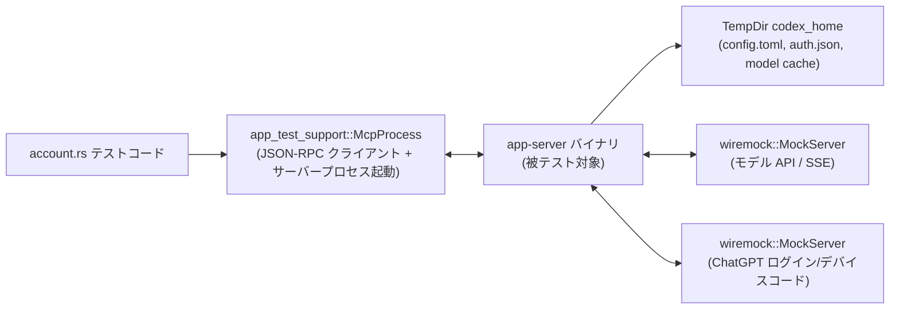
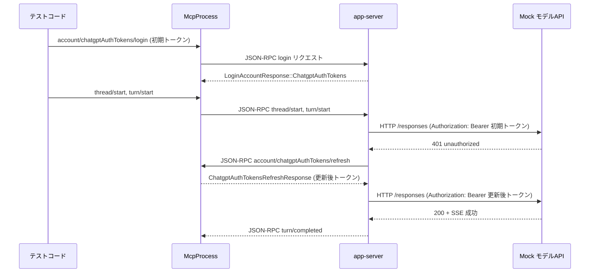

# app-server/tests/suite/v2/account.rs コード解説

## 0. ざっくり一言

`app-server/tests/suite/v2/account.rs` は、アプリケーションサーバーの **アカウント・認証周りの JSON-RPC API**（API キー / ChatGPT / 外部トークン / デバイスコード / トークン更新 / キャンセル / GetAccount など）を、実際にサーバープロセスを起動して **エンドツーエンドで検証するテスト群**です。

---

## 1. このモジュールの役割

### 1.1 概要

このモジュールは次の問題を検証するために存在します。

- アカウントのログイン・ログアウト・取得 API が仕様どおりに動くか  
- API キー / ChatGPT（通常の OAuth とデバイスコード）/ 外部トークン（`ChatgptAuthTokens`）の各認証モードの挙動が正しいか  
- 401 応答時のトークンリフレッシュ、キャンセル、設定での制限（強制ログイン方式・必須認証など）が正しく反映されるか  
- JSON-RPC の通知（`account/updated` / `account/login/completed` / `turn/completed` など）が期待どおり発行されるか  
- CLI 側（`McpProcess`）とサーバー間のエラー・エッジケース時のふるまいが仕様どおりか

これらを、`McpProcess` 経由で JSON-RPC を発行し、`wiremock::MockServer` で外部 HTTP API をスタブしながら検証しています。

### 1.2 アーキテクチャ内での位置づけ

大まかな構成と依存関係は次のようになっています（行番号はこのチャンクからは取得できないため「不明」とします）。



- テストコードは **一時ディレクトリ (`TempDir`) に `config.toml` を生成**し (`create_config_toml`)、`McpProcess` で app-server プロセスを起動します。
- app-server は `config.toml` と `auth.json` を読んでアカウント状態を管理し、JSON-RPC で `McpProcess` と通信します。
- ChatGPT ログインやデバイスコードフローは `wiremock::MockServer` で模擬され、app-server から HTTP でアクセスされます。
- モデル API 呼び出しや 401 応答を `core_test_support::responses` と `wiremock` で制御し、トークンリフレッシュの挙動を検証します。

### 1.3 設計上のポイント

コードから読み取れる特徴をまとめると次のとおりです。

- **状態管理の分離**
  - テストごとに `TempDir` を使い、`codex_home` 配下に `config.toml`, `auth.json`, モデルキャッシュ等を分離して保存しています（`TempDir::new()` と `create_config_toml` の組み合わせ）。
  - 認証状態は app-server 側が `auth.json` と JSON-RPC の `AccountUpdated` 通知で管理し、テスト側はファイルの有無と通知内容を検証します。

- **外部依存のスタブ**
  - ChatGPT デバイスコード API や OAuth トークンエンドポイントは `wiremock::MockServer` と `Mock::given(...).respond_with(...)` でスタブ化されています（`mock_device_code_*` など）。
  - モデル API への SSE ベースのリクエストは `core_test_support::responses` でスタブ化されます。

- **非同期・タイムアウト**
  - 全テストは `#[tokio::test] async fn ...` で実装され、`tokio::time::timeout` により **JSON-RPC 応答や通知が来ない場合にテストがハングしないように**しています。
  - ログインサーバーが固定ポートを使うテストには `serial_test::serial(login_port)` を付け、ポート競合を避けています。

- **エラーと契約の明示的検証**
  - JSON-RPC エラー (`JSONRPCError`) のメッセージ内容を文字列で比較し、設定によるログイン制限などの **ユーザ向けエラーメッセージ契約**もテストしています。
  - 401 応答時に `ServerRequest::ChatgptAuthTokensRefresh` が飛ぶこと、クライアントからのエラー応答や不正トークン時に `TurnStatus::Failed` になることも確認しています。

- **安全性（Rust 言語機能の観点）**
  - `unsafe` は使われておらず、エラー処理は `anyhow::Result` と `?` 演算子、`bail!` で一元化され、テスト自体はパニックではなくエラーとして落ちる構造になっています（`assert!`/`assert_eq!` による失敗はパニックとして扱われます）。
  - 並行実行に関しては、共有ミューテックス等は使っておらず、テスト同士の独立性はディレクトリとポートの分離で担保されています。

---

## 2. 主要な機能一覧

このテストモジュールが検証している主な機能を列挙します。

- ログアウト
  - `logout_account_removes_auth_and_notifies`  
    - API キーログイン状態からのログアウトで、`auth.json` が削除され、`AccountUpdated` 通知で `auth_mode=None` になることを検証。

- 外部トークン（ChatGPT Auth Tokens）ログイン
  - `set_auth_token_updates_account_and_notifies`  
    - `ChatgptAuthTokens` ログインで `AccountUpdated` の `auth_mode` と `plan_type` が正しく更新され、`GetAccount` が ChatGPT アカウントを返すことを検証。
  - `account_read_refresh_token_is_noop_in_external_mode`  
    - `GetAccount` の `refresh_token=true` に対し、外部モードでは `account/chatgptAuthTokens/refresh` リクエストが発行されないことを検証。

- 外部トークンのリフレッシュとエラー
  - `external_auth_refreshes_on_unauthorized`  
    - モデル API で 401 が返ったときに、`ChatgptAuthTokensRefresh` 要求 → 新トークンで再試行 → 成功することを検証。
  - `external_auth_refresh_error_fails_turn`  
    - リフレッシュ要求に対してクライアントが JSON-RPC エラーを返した場合、ターンが `Failed` になることを検証。
  - `external_auth_refresh_mismatched_workspace_fails_turn`  
    - 強制ワークスペース設定と異なる `chatgpt_account_id` のトークンが返された場合、ターンが `Failed` になることを検証。
  - `external_auth_refresh_invalid_access_token_fails_turn`  
    - 形式不正なアクセストークン（JWT でない文字列）を受け取った場合、ターンが `Failed` になることを検証。

- API キーログイン
  - `login_account_api_key_succeeds_and_notifies`  
    - API キーでのログイン成功時に `AccountLoginCompleted` / `AccountUpdated` 通知と `auth.json` 作成を検証。
  - `login_account_api_key_rejected_when_forced_chatgpt`  
    - `forced_login_method=chatgpt` 設定下で API キーログインがエラーになることを検証。

- ChatGPT ログイン（通常フロー）
  - `login_account_chatgpt_rejected_when_forced_api`  
    - `forced_login_method=api` 設定下で ChatGPT ログインがエラーになることを検証。
  - `login_account_chatgpt_start_can_be_cancelled`  
    - ChatGPT ログイン開始後、キャンセルすると `AccountLoginCompleted(success=false)` になり、`AccountUpdated` が出ないことを検証。
  - `login_account_chatgpt_includes_forced_workspace_query_param`  
    - `forced_workspace_id` が auth URL のクエリパラメータ `allowed_workspace_id` として含まれることを検証。
  - `set_auth_token_cancels_active_chatgpt_login`  
    - ChatGPT ログイン中に外部トークンログインすると、元のログイン試行がキャンセル済み扱いになることを検証。

- ChatGPT デバイスコードログイン
  - `login_account_chatgpt_device_code_returns_error_when_disabled`  
    - `/deviceauth/usercode` が 404 の場合、デバイスコードログイン開始がエラーで終わり、`AccountLoginCompleted` も `auth.json` も出ないことを検証。
  - `login_account_chatgpt_device_code_succeeds_and_notifies`  
    - デバイスコードフロー成功時に、ユーザーコード・検証 URL 付きのレスポンス、`AccountLoginCompleted(success=true)`、`AccountUpdated`、`auth.json` 作成を検証。
  - `login_account_chatgpt_device_code_failure_notifies_without_account_update`  
    - デバイスコードのトークン取得が 500 で失敗した場合、`AccountLoginCompleted(success=false)` になるが `AccountUpdated` と `auth.json` は発生しないことを検証。
  - `login_account_chatgpt_device_code_can_be_cancelled`  
    - デバイスコードログイン中にキャンセルすると、`AccountLoginCompleted(success=false)` のみで `AccountUpdated` や `auth.json` が発生しないことを検証。

- アカウント情報取得 (GetAccount)
  - `get_account_no_auth`  
    - 認証必須設定で未ログイン時、`account=None`, `requires_openai_auth=true` を返すことを検証。
  - `get_account_with_api_key`  
    - API キーログイン済みで `Account::ApiKey` を返すことを検証。
  - `get_account_when_auth_not_required`  
    - 認証不要設定では `requires_openai_auth=false` になることを検証。
  - `get_account_with_chatgpt`  
    - 事前に `ChatGptAuthFixture` で `auth.json` を作っておき、`Account::Chatgpt` と plan_type=Pro を返すことを検証。
  - `get_account_with_chatgpt_missing_plan_claim_returns_unknown`  
    - plan_type claim 不在の場合に plan_type=Unknown になることを検証。

---

## 3. 公開 API と詳細解説

ここでは、このテストモジュール内で定義されている **型・関数** を整理し、特に重要なものを詳細に説明します。

※本ファイルの正確な行番号はこのチャンクからは取得できないため、「行範囲」はすべて「不明」と記載します。

### 3.1 型一覧（構造体・列挙体など）

| 名前 | 種別 | 役割 / 用途 | 行範囲 |
|------|------|-------------|--------|
| `CreateConfigTomlParams` | 構造体 (`#[derive(Default)]`) | `config.toml` を生成する際のオプション（強制ログイン方式・強制ワークスペース・認証必須フラグ・ベース URL）をまとめて渡すためのパラメータ | account.rs:行不明 |

`CreateConfigTomlParams` のフィールド（コードから読める範囲）:

- `forced_method: Option<String>`  
  - `"chatgpt"` / `"api"` などを指定すると `forced_login_method` 行が config に出力されます。
- `forced_workspace_id: Option<String>`  
  - ChatGPT ログイン時の強制ワークスペース ID として `forced_chatgpt_workspace_id` を config に出力します。
- `requires_openai_auth: Option<bool>`  
  - `Some(true)` なら `requires_openai_auth = true` を出力。`false` または `None` なら出力しません。
- `base_url: Option<String>`  
  - モデルプロバイダの `base_url` として TOML に書き込みます。デフォルトは `"http://127.0.0.1:0/v1"`。

### 3.1.1 関数・テスト関数インベントリー

主な関数・テスト関数を一覧にまとめます。

| 名前 | 種別 | 概要 | 行範囲 |
|------|------|------|--------|
| `create_config_toml` | 通常関数 | `codex_home/config.toml` を生成するヘルパー | 行不明 |
| `mock_device_code_usercode` | async 関数 | `POST /api/accounts/deviceauth/usercode` を 200 + JSON でモック | 行不明 |
| `mock_device_code_usercode_failure` | async 関数 | 同上エンドポイントを任意ステータスでモック | 行不明 |
| `mock_device_code_token_success` | async 関数 | `POST /api/accounts/deviceauth/token` を成功レスポンスでモック | 行不明 |
| `mock_device_code_token_failure` | async 関数 | 同上をエラーコードでモック | 行不明 |
| `mock_device_code_oauth_token` | async 関数 | `POST /oauth/token` を成功レスポンスでモック（id_token を差し替え） | 行不明 |
| `respond_to_refresh_request` | async 関数 | サーバーからの `ChatgptAuthTokensRefresh` JSON-RPC リクエストを読み取り、指定トークンで応答 | 行不明 |
| `logout_account_removes_auth_and_notifies` | `#[tokio::test]` | ログアウトで `auth.json` 削除と `AccountUpdated`/GetAccount の内容を検証 | 行不明 |
| `set_auth_token_updates_account_and_notifies` | `#[tokio::test]` | 外部トークンログインでアカウント情報と通知が更新されることを検証 | 行不明 |
| `account_read_refresh_token_is_noop_in_external_mode` | `#[tokio::test]` | `GetAccount(refresh_token=true)` が外部モードでリフレッシュ要求を発行しないことを検証 | 行不明 |
| `external_auth_refreshes_on_unauthorized` | `#[tokio::test]` | 401 応答時にトークンリフレッシュ→再試行で成功することを検証 | 行不明 |
| `external_auth_refresh_error_fails_turn` | `#[tokio::test]` | リフレッシュ要求が JSON-RPC エラーで失敗した場合にターンが失敗することを検証 | 行不明 |
| `external_auth_refresh_mismatched_workspace_fails_turn` | `#[tokio::test]` | リフレッシュで返る `chatgpt_account_id` が強制ワークスペースと異なるとターンが失敗することを検証 | 行不明 |
| `external_auth_refresh_invalid_access_token_fails_turn` | `#[tokio::test]` | 不正形式のアクセストークンを受け取った場合にターンが失敗することを検証 | 行不明 |
| `login_account_api_key_succeeds_and_notifies` | `#[tokio::test]` | API キーログイン成功と通知・`auth.json` 作成を検証 | 行不明 |
| `login_account_api_key_rejected_when_forced_chatgpt` | `#[tokio::test]` | 強制 ChatGPT 設定時に API キーログインが拒否されることを検証 | 行不明 |
| `login_account_chatgpt_rejected_when_forced_api` | `#[tokio::test]` | 強制 API 設定時に ChatGPT ログインが拒否されることを検証 | 行不明 |
| `login_account_chatgpt_device_code_returns_error_when_disabled` | `#[tokio::test]` | デバイスコードが 404 の場合に開始エラーとなることを検証 | 行不明 |
| `login_account_chatgpt_device_code_succeeds_and_notifies` | `#[tokio::test]` | デバイスコードログイン成功フローを検証 | 行不明 |
| `login_account_chatgpt_device_code_failure_notifies_without_account_update` | `#[tokio::test]` | デバイスコードトークン取得失敗時、ログイン完了のみ失敗通知しアカウント更新しないことを検証 | 行不明 |
| `login_account_chatgpt_device_code_can_be_cancelled` | `#[tokio::test]` | デバイスコードログインのキャンセルを検証 | 行不明 |
| `login_account_chatgpt_start_can_be_cancelled` | `#[tokio::test] + serial(login_port)` | 通常 ChatGPT ログイン開始後のキャンセルを検証 | 行不明 |
| `set_auth_token_cancels_active_chatgpt_login` | `#[tokio::test] + serial(login_port)` | 外部トークン設定が進行中の ChatGPT ログインをキャンセルすることを検証 | 行不明 |
| `login_account_chatgpt_includes_forced_workspace_query_param` | `#[tokio::test] + serial(login_port)` | ChatGPT ログイン URL に強制ワークスペース ID が含まれることを検証 | 行不明 |
| `get_account_no_auth` | `#[tokio::test]` | 未ログイン + 認証必須時の `GetAccount` を検証 | 行不明 |
| `get_account_with_api_key` | `#[tokio::test]` | API キー認証済みの `GetAccount` を検証 | 行不明 |
| `get_account_when_auth_not_required` | `#[tokio::test]` | 認証不要設定時の `GetAccount` を検証 | 行不明 |
| `get_account_with_chatgpt` | `#[tokio::test]` | ChatGPT 認証済みの `GetAccount` を検証 | 行不明 |
| `get_account_with_chatgpt_missing_plan_claim_returns_unknown` | `#[tokio::test]` | ChatGPT 認証済みだが plan claim がない場合の `GetAccount` を検証 | 行不明 |

### 3.2 関数詳細（代表 7 件）

#### `create_config_toml(codex_home: &Path, params: CreateConfigTomlParams) -> std::io::Result<()>`

**概要**

- `codex_home` 配下に、app-server が起動時に読み込む最小限の `config.toml` を生成する関数です。
- モデル名・プロバイダ・sandbox 設定に加えて、ログイン方式や ChatGPT ワークスペース、認証必須フラグ、モデル API のベース URL を埋め込みます。

**引数**

| 引数名 | 型 | 説明 |
|--------|----|------|
| `codex_home` | `&Path` | `config.toml` を作成するディレクトリ（テストごとに作成される `TempDir`） |
| `params` | `CreateConfigTomlParams` | 強制ログイン方式やワークスペース ID、`requires_openai_auth`、`base_url` などのオプション |

**戻り値**

- `std::io::Result<()>`  
  - ファイル書き込みに成功すれば `Ok(())`。失敗した場合はそのまま `io::Error` を返します。

**内部処理の流れ**

- `codex_home.join("config.toml")` で出力先パスを決定。
- `params.base_url` が `Some` ならその値、`None` なら `"http://127.0.0.1:0/v1"` を `base_url` として採用。
- `forced_method` が `Some(method)` の場合、`forced_login_method = "…"` 行を追加。`None` の場合は空行。
- `forced_workspace_id` が `Some(ws)` の場合、`forced_chatgpt_workspace_id = "…"` 行を追加。
- `requires_openai_auth` が `Some(true)` の場合に限り `requires_openai_auth = true` 行を出力。
- 上記と固定の設定（モデル名、プロバイダ名、sandbox_mode など）を `format!` で 1 つの文字列にまとめ、`std::fs::write` でファイル出力。

**Examples（使用例）**

```rust
let codex_home = tempfile::TempDir::new()?;  // 一時ディレクトリを作成
create_config_toml(
    codex_home.path(),
    CreateConfigTomlParams {
        forced_method: Some("chatgpt".to_string()),
        forced_workspace_id: Some("org-123".to_string()),
        requires_openai_auth: Some(true),
        base_url: None, // デフォルト URL を使用
    },
)?;
// 以降、McpProcess::new(codex_home.path()) でサーバーを起動
```

**Errors / Panics**

- `codex_home` が存在しない、または書き込み権限がない場合、`std::fs::write` が `Err(io::Error)` を返します。
- パニックは使用していません。

**Edge cases**

- `requires_openai_auth: Some(false)` と `None` はどちらも `requires_openai_auth` 行を出力しない点で等価です。
- `forced_method` や `forced_workspace_id` を `None` にすると、対応する設定行は完全に省略され、app-server 側のデフォルト挙動に任されます。

**使用上の注意点**

- `codex_home` ディレクトリはテスト側で事前に作成しておく必要があります（本ファイル内では常に `TempDir::new()` の戻り値を使用）。
- TOML のフォーマットは app-server の仕様に依存するため、ここで項目名や構造を変更するとテスト対象のサーバーが起動に失敗する可能性があります。

---

#### `mock_device_code_usercode(server: &MockServer, interval_seconds: u64) -> impl Future<Output = ()>`

**概要**

- ChatGPT デバイスコードログインの開始エンドポイント  
  `POST /api/accounts/deviceauth/usercode` に対するモックを設定します。
- レスポンスには `device_auth_id`, `user_code`, `interval` を含む JSON を返します。

**引数**

| 引数名 | 型 | 説明 |
|--------|----|------|
| `server` | `&MockServer` | `wiremock::MockServer::start().await` で起動したモックサーバー |
| `interval_seconds` | `u64` | レスポンス JSON の `"interval"` フィールドに文字列で埋め込む秒数 |

**戻り値**

- `()` を返す async 関数です（`await` するとモック登録が完了します）。

**内部処理の流れ**

- `Mock::given(method("POST")).and(path("/api/accounts/deviceauth/usercode"))` で POST + パスにマッチする条件を定義。
- `ResponseTemplate::new(200).set_body_json(json!({ ... }))` で 200 OK + JSON ボディのレスポンスを作成。
- `.mount(server).await` で `server` にモックを登録。

**Examples**

```rust
let mock_server = MockServer::start().await;
mock_device_code_usercode(&mock_server, 0).await;
// 以降、app-server は mock_server.uri() を issuer として /deviceauth/usercode を叩く
```

**Errors / Panics**

- `mount(server).await` 自体は `Result` を返さないため、ここではエラーを返しません。
- ただし `MockServer` が既に停止しているなどの場合の挙動は外部ライブラリ依存で、このチャンクからは詳細は分かりません。

**Edge cases**

- `interval_seconds` は JSON 上は文字列として返されています（`interval_seconds.to_string()`）。サーバー側が整数として解釈する責務があります。
- このモックは「最初にマッチするモック」が適用される wiremock の仕様に従うため、同じパスのモックを複数登録すると後から登録したものの優先度などは wiremock のルールに依存します。

**使用上の注意点**

- デバイスコード成功系テストでは `mock_device_code_token_success` や `mock_device_code_oauth_token` と組み合わせて使います。
- 失敗系テストでは本関数ではなく `mock_device_code_usercode_failure` を使ってステータスコードを変化させます。

---

#### `respond_to_refresh_request(mcp: &mut McpProcess, access_token: &str, chatgpt_account_id: &str, chatgpt_plan_type: Option<&str>) -> Result<()>`

**概要**

- app-server から発行される `ServerRequest::ChatgptAuthTokensRefresh` JSON-RPC リクエストを 1 件読み取り、指定したトークン情報で応答するテスト用ヘルパーです。
- 401 応答に対するリフレッシュフローのテストで使用されます。

**引数**

| 引数名 | 型 | 説明 |
|--------|----|------|
| `mcp` | `&mut McpProcess` | app-server プロセスと JSON-RPC で通信するオブジェクト |
| `access_token` | `&str` | 新しいアクセストークン（JWT 文字列） |
| `chatgpt_account_id` | `&str` | ChatGPT ワークスペース ID |
| `chatgpt_plan_type` | `Option<&str>` | プラン種別（例: `"pro"`）。`None` の場合はプラン情報なしで返却 |

**戻り値**

- `anyhow::Result<()>`  
  - 期待した `ServerRequest` が届き、レスポンス送信に成功すれば `Ok(())`。

**内部処理の流れ**

- `mcp.read_stream_until_request_message()` を `timeout(DEFAULT_READ_TIMEOUT, ...)` でラップし、一定時間内にサーバーからの JSON-RPC リクエストを待ちます。
- 受信したリクエストが `ServerRequest::ChatgptAuthTokensRefresh { request_id, params }` であることを `let ... else` で検証し、それ以外なら `bail!` でテスト失敗にします。
- `params.reason` が `ChatgptAuthTokensRefreshReason::Unauthorized` であることを `assert_eq!` で検証します。
- `ChatgptAuthTokensRefreshResponse` を組み立て、`mcp.send_response(request_id, serde_json::to_value(response)?)` で JSON-RPC レスポンスを返します。

**Examples**

```rust
respond_to_refresh_request(
    &mut mcp,
    &refreshed_access_token,
    "org-refreshed",
    Some("pro"),
).await?;
// 以降、app-server は新トークンでモデル API を再リクエストする
```

**Errors / Panics**

- タイムアウトまでにリクエストが来ない場合、`timeout` が `Err` を返し、`?` により `Result` の `Err` としてテストが失敗します。
- 受信したリクエストが `ChatgptAuthTokensRefresh` 以外の場合は `bail!` により即座に `Err(anyhow::Error)` で失敗します。
- `serde_json::to_value` が失敗する可能性は理論上ありますが、通常の構造体→JSON の変換なので想定外エラーに近いです。
- `assert_eq!(params.reason, ... )` が失敗するとテストはパニックします。

**Edge cases**

- サーバーが `reason` に `Unauthorized` 以外をセットしてくるケースはこのテストでは想定しておらず、即時パニックになります。
- 複数回連続でリフレッシュ要求が来るシナリオはこのヘルパー単体では扱いません（1 回だけ待ちます）。

**使用上の注意点**

- このヘルパーは **「最初に飛んでくるリクエストが必ず `ChatgptAuthTokensRefresh` である」** という前提で書かれているため、他の種類のリクエストが間に挟まる実装になった場合はテストが壊れます。
- `DEFAULT_READ_TIMEOUT` に依存しているため、CI が著しく遅い環境ではタイムアウト値の調整が必要になる可能性があります（ただしテストコードなので、変更は比較的容易です）。

---

#### `logout_account_removes_auth_and_notifies() -> Result<()>` （Tokio テスト）

**概要**

- API キーでログイン済みの状態から `account/logout` を呼び出すと、
  - `auth.json` が削除される
  - `account/updated` 通知で `auth_mode=None`, `plan_type=None` が届く
  - `GetAccount` で `account=None` が返る  
 ことを確認するエンドツーエンドテストです。

**引数 / 戻り値**

- 引数なし（テスト関数）。
- 戻り値は `anyhow::Result<()>` で、途中のファイル I/O やプロセス起動の失敗は `Err` として伝播します。

**内部処理の流れ**

- `TempDir::new()` で一時ディレクトリを作成し、`create_config_toml` で最低限の設定を書き込みます。
- `login_with_api_key` を使って `codex_home/auth.json` を作成し、`assert!(auth.json.exists())` で確認します。
- `McpProcess::new_with_env` で app-server を起動し、`mcp.initialize().await` で初期化（JSON-RPC 初期ハンドシェイク）します。
- `mcp.send_logout_account_request()` で `account/logout` を送り、`JSONRPCResponse` を `LogoutAccountResponse` にデコードします。
- `account/updated` 通知を受信し、`ServerNotification::AccountUpdated` であること、`auth_mode.is_none()` と `plan_type == None` であることを検証します。
- `auth.json` が削除されていることを `!exists()` で確認します。
- `GetAccount` を呼び、`GetAccountResponse.account == None` であることを検証して終了します。

**Errors / Panics**

- app-server の起動や JSON-RPC 通信でエラーが発生した場合は `?` で `Err` になります。
- `assert!` / `assert_eq!` の失敗はパニックとして扱われます。

**Edge cases**

- ログアウト前に `auth.json` が存在しないケースはこのテストでは扱っていません（そもそも最初に `login_with_api_key` で作成します）。
- `account/updated` が複数回飛ぶ可能性は考慮していませんが、`read_stream_until_notification_message("account/updated")` は最初に該当する通知 1 つだけを拾います。

**使用上の注意点**

- `login_with_api_key` はテスト専用ユーティリティであり、本番コードでは別のフローを通じて `auth.json` が作成される前提です。
- タイムアウトは `DEFAULT_READ_TIMEOUT`（20 秒）と比較的大きく、遅い環境でもハングしにくい設計になっています。

---

#### `external_auth_refreshes_on_unauthorized() -> Result<()>` （Tokio テスト）

**概要**

- 外部トークン (`ChatgptAuthTokens`) でログインした状態でモデル API 呼び出しを行い、最初の HTTP リクエストが 401 `unauthorized` のときに:
  1. app-server が `account/chatgptAuthTokens/refresh` JSON-RPC リクエストをクライアント（MCP）に送る
  2. クライアントが新しいアクセストークンを返す
  3. app-server が新しいトークンでモデル API を再呼び出し、ターンが成功する  
 ことを検証するテストです。

**引数 / 戻り値**

- 引数なし、戻り値 `anyhow::Result<()>`。

**内部処理の流れ（抜粋）**

- `MockServer::start()` でモデル API 用のモックサーバーを起動し、`create_config_toml` の `base_url` に設定します。
- `responses::mount_response_sequence` で `401 unauthorized` → 成功 SSE の順に返すレスポンスシーケンスを登録します。
- 初期アクセストークン・更新後アクセストークンの JWT を `encode_id_token` で生成します（メールアドレス・プラン種別・アカウント ID を含む）。
- `McpProcess` を起動し、`send_chatgpt_auth_tokens_login_request` で外部トークンログインを行います。
- `thread/start` → `turn/start` を送信し、`turn/start` 後に `respond_to_refresh_request` を使ってサーバーからのリフレッシュ要求に応答します。
- `turn/completed` 通知を受信して成功を確認します（実際には `TurnCompletedNotification` の内容までは詳しく検証していません）。
- `responses_mock.requests()` でモックサーバーへのリクエストを取り出し、1 回目の `Authorization` ヘッダが初期トークン、2 回目が更新後トークンであることを `assert_eq!` で確認します。

**メソッド間データフロー（シーケンス図）**



**Errors / Panics**

- モデル API へのレスポンスシーケンスが期待どおりでない場合（例: 401 が返ってこない）、`ChatgptAuthTokensRefresh` が飛ばず、テストはタイムアウトまたは期待するリクエスト不達成で失敗します。
- `respond_to_refresh_request` 内部の `assert_eq!` が失敗した場合などはパニックになります。

**Edge cases**

- モデル API を複数回呼ぶシナリオ（長い SSE など）はこのテストでは 2 回のリクエストに限定しています。
- 更新後トークンで再度 401 が返るケースや、複数回リフレッシュするケースは別途テストされていません。

**使用上の注意点**

- `responses::mount_response_sequence` が返す `responses_mock` の `requests()` は、モックサーバーへの全リクエストをメモリ上に保持するため、大量リクエストを行うテストではメモリに注意が必要です（このテストでは 2 件なので問題になりません）。
- Authorization ヘッダの検証は文字列比較で行われるため、トークン前後の空白や Bearer 接頭辞のフォーマットが変わるとテストが壊れます。

---

#### `login_account_chatgpt_device_code_succeeds_and_notifies() -> Result<()>` （Tokio テスト）

**概要**

- ChatGPT デバイスコードフローが成功したときの挙動を検証するテストです。
- 期待される挙動:
  - JSON-RPC 応答 `LoginAccountResponse::ChatgptDeviceCode` に `login_id`, `verification_url`, `user_code` が含まれる。
  - `AccountLoginCompleted` 通知が `success=true`, `error=None` で、`login_id` を含む。
  - `AccountUpdated` 通知の `auth_mode=Some(Chatgpt)`、`plan_type=Some(Pro)`。
  - `auth.json` が作成される。

**内部処理の流れ（抜粋）**

- `mock_device_code_usercode(&mock_server, 0)` で usercode エンドポイントを成功応答にスタブ（`interval=0`）。
- `mock_device_code_token_success` で `deviceauth/token` を成功応答にスタブ。
- `encode_id_token` で `email="device@example.com"`, `plan_type="pro"`, `chatgpt_account_id="org-device"` な JWT を生成し、`mock_device_code_oauth_token` で `/oauth/token` のレスポンスに埋め込みます。
- `LOGIN_ISSUER_ENV_VAR` (`"CODEX_APP_SERVER_LOGIN_ISSUER"`) に `mock_server.uri()` を設定した `McpProcess` を起動します。
- `send_login_account_chatgpt_device_code_request` を実行し、`LoginAccountResponse::ChatgptDeviceCode { login_id, verification_url, user_code }` を確認。
- `verification_url` が `{issuer}/codex/device` であること、`user_code="CODE-12345"` であることを検証。
- `account/login/completed` 通知を受信し、`success=true`, `error=None`, `login_id` が一致することを確認。
- `account/updated` 通知を受信し、`auth_mode=Some(AuthMode::Chatgpt)`, `plan_type=Some(AccountPlanType::Pro)` であること、および `auth.json` が存在することを確認。

**データフロー（概念図）**

```mermaid
sequenceDiagram
    participant T as テスト
    participant Mcp
    participant S as app-server
    participant A as Mock Login API

    T->>Mcp: account/login/chatgpt/deviceCode
    Mcp->>S: JSON-RPC login リクエスト
    S->>A: POST /api/accounts/deviceauth/usercode
    A-->>S: { device_auth_id, user_code, interval }
    S-->>Mcp: LoginAccountResponse::ChatgptDeviceCode

    loop ポーリング
        S->>A: POST /api/accounts/deviceauth/token
        A-->>S: { authorization_code, code_verifier, code_challenge }
        break 成功
    end

    S->>A: POST /oauth/token
    A-->>S: { id_token, access_token, refresh_token }

    S-->>Mcp: ServerNotification::AccountLoginCompleted(success=true)
    S-->>Mcp: ServerNotification::AccountUpdated(auth_mode=Chatgpt, plan_type=Pro)
```

**Errors / Panics**

- モックのどれかが設定されていない/間違っている場合、app-server が HTTP エラーを受け取りテストが失敗します。
- 期待する JSON-RPC 通知やレスポンスが来ないと `timeout` により失敗します。
- `assert_eq!` 等の検証失敗はパニックになります。

**Edge cases**

- `interval=0` としているため、サーバーは即時に `deviceauth/token` をポーリング開始する前提です。大きい interval のケースは別テスト（キャンセル）で扱っています。
- `plan_type` を `pro` に固定しており、他のプラン種別の挙動はこのテストでは検証していません。

**使用上の注意点**

- issuer を `LOGIN_ISSUER_ENV_VAR` で上書きしているため、本番環境とは異なる URL を使用しています。テスト追加時もこの変数経由で issuer を差し替えるのが一貫したパターンです。
- モックエンドポイントのパス（`/api/accounts/deviceauth/usercode`, `/api/accounts/deviceauth/token`, `/oauth/token`）を変更すると、このテストを含め複数のテストが壊れます。

---

#### `get_account_with_chatgpt() -> Result<()>` （Tokio テスト）

**概要**

- すでに ChatGPT 認証情報 (`auth.json`) が存在する状態で app-server を起動したとき、`GetAccount` が `Account::Chatgpt` と `requires_openai_auth=true` を返すことを検証します。

**内部処理の流れ**

- `create_config_toml` で `requires_openai_auth=Some(true)` な設定ファイルを生成。
- `write_chatgpt_auth` を用いて `auth.json` を書き込みます。`ChatGptAuthFixture::new("access-chatgpt").email("user@example.com").plan_type("pro")` でアクセス・トークンとクレームを指定。
- `McpProcess::new_with_env(..., &[("OPENAI_API_KEY", None)])` で app-server を起動します（環境変数の `OPENAI_API_KEY` を明示的に未設定）。
- `GetAccountParams { refresh_token: false }` で `send_get_account_request` を送り、`GetAccountResponse` を受信。
- 期待値 `GetAccountResponse { account: Some(Account::Chatgpt { email, plan_type: AccountPlanType::Pro }), requires_openai_auth: true }` と一致することを `assert_eq!` で検証。

**Errors / Panics**

- `write_chatgpt_auth` がファイル I/O エラーを起こした場合は `?` でテストが失敗します。
- app-server が `auth.json` の内容を読み取れず、異常なレスポンスを返した場合は `assert_eq!` でテストが失敗します。

**Edge cases**

- plan claim が欠けている場合は別テスト `get_account_with_chatgpt_missing_plan_claim_returns_unknown` で `AccountPlanType::Unknown` になることを検証しています。
- Refresh フロー（`refresh_token=true`）はこのテストでは扱っていません。

**使用上の注意点**

- `write_chatgpt_auth` は `AuthCredentialsStoreMode::File` を指定しており、認証情報はファイルに保存されます。もし store mode を変更すると app-server 側の読み取り方法も変わる可能性があります。
- `GetAccount` の `requires_openai_auth` は config の `requires_openai_auth` に直接対応しており、この値の変更はアプリ全体の認可ポリシーに影響するため、テストと設定の整合性に注意が必要です。

---

### 3.3 その他の関数（概要のみ）

補助的な関数およびその他のテスト関数の役割をまとめます。

| 関数名 | 役割（1 行） |
|--------|--------------|
| `mock_device_code_usercode_failure` | デバイスコード usercode エンドポイントを任意ステータス（例: 404）でモックし、「機能が無効」ケースを再現 |
| `mock_device_code_token_success` | デバイスコード token エンドポイントを成功レスポンスでモック |
| `mock_device_code_token_failure` | デバイスコード token エンドポイントをエラーコード（例: 500, 404）でモック |
| `mock_device_code_oauth_token` | OAuth token エンドポイント `/oauth/token` を成功レスポンスでモックし、任意の `id_token` を埋め込む |
| `login_account_api_key_succeeds_and_notifies` | API キーログイン成功と、`AccountLoginCompleted` / `AccountUpdated` / `auth.json` 作成を検証 |
| `login_account_api_key_rejected_when_forced_chatgpt` | `forced_login_method="chatgpt"` で API キーログインが JSON-RPC エラーになることを検証 |
| `login_account_chatgpt_rejected_when_forced_api` | `forced_login_method="api"` で ChatGPT ログインが拒否されることを検証 |
| `login_account_chatgpt_device_code_returns_error_when_disabled` | デバイスコードがサーバー側で無効（404）な場合、JSON-RPC エラーになり、ログイン完了通知や `auth.json` が発生しないことを検証 |
| `login_account_chatgpt_device_code_failure_notifies_without_account_update` | デバイスコード token 取得が 500 で失敗した場合、失敗の `AccountLoginCompleted` のみが出てアカウント更新されないことを検証 |
| `login_account_chatgpt_device_code_can_be_cancelled` | デバイスコードログイン開始後に `CancelLoginAccount` を呼ぶと、`CancelLoginAccountStatus::Canceled` と失敗のログイン完了通知のみが出ることを検証 |
| `login_account_chatgpt_start_can_be_cancelled` | 通常の ChatGPT ログイン開始後のキャンセルで、`AccountLoginCompleted(success=false)` となり `account/updated` は出ないことを検証 |
| `set_auth_token_cancels_active_chatgpt_login` | ChatGPT ログイン中に `ChatgptAuthTokens` ログインすると、元ログイン試行が NotFound 状態になることを検証 |
| `login_account_chatgpt_includes_forced_workspace_query_param` | ChatGPT ログイン URL に `allowed_workspace_id=<forced_workspace_id>` が含まれることを検証 |
| `get_account_no_auth` | 認証必須設定だが未ログインの `GetAccount` が `account=None` を返すことを検証 |
| `get_account_with_api_key` | API キーログイン後の `GetAccount` が `Account::ApiKey` を返すことを検証 |
| `get_account_when_auth_not_required` | 認証不要設定で `requires_openai_auth=false` かつ `account=None` となることを検証 |
| `get_account_with_chatgpt_missing_plan_claim_returns_unknown` | ChatGPT 認証済みだが plan claim がない場合に plan_type=Unknown となることを検証 |
| `external_auth_refresh_error_fails_turn` | リフレッシュ要求に JSON-RPC エラーで応答すると `TurnStatus::Failed` になることを検証 |
| `external_auth_refresh_mismatched_workspace_fails_turn` | 強制ワークスペース ID と異なる workspace のトークンでリフレッシュした場合に `Failed` になることを検証 |
| `external_auth_refresh_invalid_access_token_fails_turn` | 不正なアクセストークン文字列でリフレッシュした場合に `Failed` になることを検証 |
| `account_read_refresh_token_is_noop_in_external_mode` | `GetAccount(refresh_token=true)` が外部モードでリフレッシュ要求を発行しないことを 250ms タイムアウトで検証 |

---

## 4. データフロー

ここでは代表的な 2 つのシナリオのデータフローを示します。

### 4.1 外部トークン + 401 → トークンリフレッシュシナリオ

`external_auth_refreshes_on_unauthorized` テストに対応するフローです。

- クライアント（テストコード）は外部トークンログイン → スレッド開始 → ターン開始の順に JSON-RPC を送信。
- app-server は `Authorization: Bearer <initial_token>` でモデル API を叩き、401 応答を受け取る。
- app-server はクライアントに `account/chatgptAuthTokens/refresh` を要求。
- クライアントは新トークンを返し、app-server はそのトークンで再度モデル API を叩き、成功。
- 成功したターンは `turn/completed` 通知としてクライアントへ返る。

（シーケンス図は 3.2 の該当セクション参照）

### 4.2 ChatGPT デバイスコードログイン成功シナリオ

`login_account_chatgpt_device_code_succeeds_and_notifies` テストに対応するフローです。

```mermaid
sequenceDiagram
    participant T as テストコード
    participant Mcp as McpProcess
    participant S as app-server
    participant L as Mock Login API

    Note over T,Mcp: デバイスコードログイン開始

    T->>Mcp: send_login_account_chatgpt_device_code_request()
    Mcp->>S: JSON-RPC account/login/chatgpt/deviceCode
    S->>L: POST /api/accounts/deviceauth/usercode
    L-->>S: { device_auth_id, user_code, interval }
    S-->>Mcp: LoginAccountResponse::ChatgptDeviceCode {login_id, verification_url, user_code}
    Mcp-->>T: 同上レスポンス

    Note over S,L: デバイス認可コードのポーリング

    loop until success
        S->>L: POST /api/accounts/deviceauth/token
        L-->>S: { authorization_code, code_verifier, ... }
        break 成功
    end
    S->>L: POST /oauth/token
    L-->>S: { id_token, access_token, refresh_token }

    Note over S,Mcp: アカウント状態更新

    S-->>Mcp: ServerNotification::AccountLoginCompleted(success=true)
    S-->>Mcp: ServerNotification::AccountUpdated(auth_mode=Chatgpt, plan_type=Pro)
```

このシナリオにおいて、テストは次の「契約」を検証しています。

- JSON-RPC レスポンスとして `LoginAccountResponse::ChatgptDeviceCode` が返る。
- `AccountLoginCompleted` は login_id を含み、成功フラグとエラー内容が正しい。
- `AccountUpdated` は AuthMode と plan_type を正しく反映し、かつ `auth.json` がファイルシステム上に保存される。

---

## 5. 使い方（How to Use）

このファイル自体はテストモジュールですが、**新しいアカウント関連テストを追加したい場合**に参照できるパターンとして整理します。

### 5.1 基本的な使用方法（新規テスト追加のパターン）

1. 一時ディレクトリと設定の準備
2. モックサーバー（必要に応じて）とモデルキャッシュの準備
3. `McpProcess` の起動と初期化
4. JSON-RPC リクエスト送信と応答・通知の検証

```rust
#[tokio::test]
async fn example_new_account_test() -> anyhow::Result<()> {
    // 1. 一時ディレクトリと config.toml の生成
    let codex_home = tempfile::TempDir::new()?;                          // テスト専用の codex_home
    create_config_toml(                                                  // 設定を書き込む
        codex_home.path(),
        CreateConfigTomlParams {
            requires_openai_auth: Some(true),
            ..Default::default()
        },
    )?;

    // 2. モデルキャッシュなどのセットアップ（必要なら）
    write_models_cache(codex_home.path())?;

    // 3. MCP プロセス起動
    let mut mcp = McpProcess::new(codex_home.path()).await?;             // app-server を起動
    tokio::time::timeout(DEFAULT_READ_TIMEOUT, mcp.initialize()).await??; // 初期化

    // 4. JSON-RPC リクエスト送信と検証
    let req_id = mcp.send_get_account_request(GetAccountParams {
        refresh_token: false,
    }).await?;
    let resp: JSONRPCResponse = tokio::time::timeout(
        DEFAULT_READ_TIMEOUT,
        mcp.read_stream_until_response_message(RequestId::Integer(req_id)),
    ).await??;
    let account: GetAccountResponse = to_response(resp)?;
    assert_eq!(account.requires_openai_auth, true);

    Ok(())
}
```

### 5.2 よくある使用パターン

- **API キーログイン系**
  - `McpProcess::new(codex_home)` を使い、`send_login_account_api_key_request("sk-test-key")` → `AccountLoginCompleted` → `AccountUpdated` を検証する。
- **ChatGPT ログイン系**
  - `McpProcess::new(codex_home)` または issuer を指定した `new_with_env` を使い、  
    - 通常フロー: `send_login_account_chatgpt_request`  
    - デバイスコード: `send_login_account_chatgpt_device_code_request`  
  - 必要に応じて `CancelLoginAccount` を呼ぶ。
- **外部トークン + モデル API 呼び出し**
  - モデル API 向け `MockServer` + `responses::mount_response_sequence` で HTTP シーケンスを設定。
  - `send_chatgpt_auth_tokens_login_request` → `thread/start` → `turn/start` → `respond_to_refresh_request` という流れでトークンリフレッシュの挙動を検証。

### 5.3 よくある間違い

```rust
// 間違い例: config.toml を書かずに MCP を起動してしまう
let codex_home = TempDir::new()?;
// create_config_toml を呼んでいない
let mut mcp = McpProcess::new(codex_home.path()).await?;  // サーバー起動に失敗する可能性

// 正しい例: 先に config.toml を作成してから起動する
let codex_home = TempDir::new()?;
create_config_toml(codex_home.path(), CreateConfigTomlParams::default())?;
let mut mcp = McpProcess::new(codex_home.path()).await?;
```

```rust
// 間違い例: ポート固定のログインサーバーを起動するテストに serial 属性を付けない
#[tokio::test]
async fn login_account_chatgpt_start_can_be_cancelled() -> Result<()> {
    // ... 固定ポートで login サーバーを起動 ...
}

// 正しい例: serial(login_port) を付けて並行実行を抑止
#[tokio::test]
#[serial(login_port)]
async fn login_account_chatgpt_start_can_be_cancelled() -> Result<()> {
    // ...
}
```

### 5.4 使用上の注意点（まとめ）

- **前提条件**
  - すべてのテストは `config.toml` の存在を前提に動作します。`create_config_toml` を忘れないこと。
  - モデル API やログイン API を使うテストでは `write_models_cache` や `wiremock::MockServer` のモック設定が必須です。

- **タイムアウトと非同期**
  - `tokio::time::timeout` を通して JSON-RPC 応答や通知を待っており、タイムアウトは `DEFAULT_READ_TIMEOUT`（20 秒）に依存します。
  - 通知順序に依存する場合は、`read_stream_until_notification_message` を適切な順で呼び、前の通知を消費し終わっていることを前提にします。

- **並行性**
  - ログインサーバーが固定ポートを使うテストは `serial(login_port)` 属性を付与し、他のテストと並行で走らないようにしています。新規テストで同じサーバーを使う場合も同一タグを使う必要があります。
  - `TempDir` はテストスコープを抜けると自動で削除されるため、クロス・テストでパスを共有しないようにします。

---

## 6. 変更の仕方（How to Modify）

### 6.1 新しい機能を追加する場合（例: 新しい認証モードのテスト）

1. **設定ファイルへのフラグ追加**
   - 新しい認証モードが `config.toml` にフラグを必要とするなら、`CreateConfigTomlParams` にフィールドを追加し、`create_config_toml` 内の `format!` に対応する行を追加します。
   - 変更により app-server の起動が変わるため、既存テストに影響がないか確認が必要です。

2. **モックエンドポイントの追加**
   - 新しい HTTP フローを利用する場合、`mock_*` 関数と同様に `wiremock::MockServer` を使ったヘルパー関数をこのファイルに追加するとテストが読みやすくなります。

3. **JSON-RPC の期待値定義**
   - `codex_app_server_protocol` に新しいリクエスト / レスポンス / 通知型が追加された場合、本テストでそれを `use` し、`to_response` や `ServerNotification` の `match` で利用します。

4. **テストケースの追加**
   - 既存テストのパターン（`TempDir` → `create_config_toml` → `McpProcess` → JSON-RPC）を踏襲しつつ、新しいモードの正常系とエラー系を分けてテストを追加します。

### 6.2 既存の機能を変更する場合（契約の維持）

- **影響範囲の確認**
  - 例えば `AccountUpdated` のフィールドを追加・変更する場合、本ファイルの複数テストが `payload.auth_mode`, `payload.plan_type` を直接比較しているため、全テストを再確認する必要があります。
  - `LoginAccountResponse` の各バリアント（`ApiKey`, `Chatgpt`, `ChatgptDeviceCode`, `ChatgptAuthTokens`）に変更を加えると、多数のテストでパターンマッチが壊れる可能性があります。

- **契約（前提条件・返り値）**
  - エラーメッセージ文言までテストしている箇所（例: 「API key login is disabled. Use ChatGPT login instead.」）は、文言変更が直ちにテスト失敗になることに注意が必要です。
  - `CancelLoginAccountStatus`（`Canceled` / `NotFound`）の意味づけは、進行中ログインの有無を示す契約として使われているため、挙動変更時にはテストを合わせて更新する必要があります。

- **テスト・使用箇所の再確認**
  - トークンリフレッシュのフロー (`ChatgptAuthTokensRefresh`) やデバイスコードログインのパス・レスポンスは複数テストでモックされているため、変更時にはそれぞれの `mock_device_code_*` と該当テストが整合しているかどうかを確認する必要があります。

---

## 7. 関連ファイル

このモジュールと密接に関係するモジュール・コンポーネントを列挙します（正確なファイルパスはこのチャンクからは分からないためモジュール名で示します）。

| パス / モジュール | 役割 / 関係 |
|-------------------|-------------|
| `app_test_support::McpProcess` | app-server プロセスの起動と JSON-RPC ストリームの管理、各種 `send_*_request` ヘルパーを提供 |
| `app_test_support::to_response` | `JSONRPCResponse` を型付きレスポンス（`LoginAccountResponse` など）に変換するユーティリティ |
| `app_test_support::{ChatGptAuthFixture, ChatGptIdTokenClaims, encode_id_token, write_chatgpt_auth, write_models_cache}` | ChatGPT 認証情報（JWT, auth.json, モデルキャッシュ）をテスト環境に生成するためのユーティリティ群 |
| `codex_app_server_protocol::{Account, AuthMode, GetAccountParams, GetAccountResponse, LoginAccountResponse, LogoutAccountResponse, CancelLoginAccountParams, CancelLoginAccountResponse, CancelLoginAccountStatus, ChatgptAuthTokensRefreshReason, ChatgptAuthTokensRefreshResponse, JSONRPCResponse, JSONRPCError, JSONRPCNotification, ServerNotification, ServerRequest, TurnCompletedNotification, TurnStatus, RequestId}` | app-server とクライアント間の JSON-RPC プロトコル定義 |
| `codex_config::types::AuthCredentialsStoreMode` | 認証情報の保存方法（ファイルなど）に関する設定型 |
| `codex_login::login_with_api_key` | API キーを使って `auth.json` を作成するユーティリティ |
| `core_test_support::responses` | モデル API の SSE レスポンスシーケンスを wiremock に登録するためのテスト用ユーティリティ |
| `wiremock::{MockServer, Mock, ResponseTemplate}` | HTTP エンドポイント（ChatGPT ログイン API やモデル API）をスタブするためのモックサーバーライブラリ |
| `serial_test::serial` | 固定ポートを使うテストの並行実行を抑止するためのテスト属性 |

---

### Bugs / Security / Edge cases（まとめ）

- **潜在的なフレーク性**
  - `account_read_refresh_token_is_noop_in_external_mode` では、`Duration::from_millis(250)` の短いタイムアウトで「refresh リクエストが発生しないこと」を検証しており、非常に遅い環境では誤判定のリスクがあります（コードから読み取れる事実として、「250ms 内にリクエストが来なければ OK とみなしている」ことだけ言えます）。
- **セキュリティ**
  - テスト内で `sandbox_mode = "danger-full-access"` としているのは test 用設定であり、`TempDir` を使うことでローカル環境への影響を限定しています。
  - JWT や API キーはテスト用のダミー値のみを使用しています。
- **契約（Contracts）**
  - JSON-RPC のエラー文言や通知のフィールド値（`auth_mode`, `plan_type`, `success`, `error` など）は「外部契約」として複数テストに埋め込まれています。これらを変更すると既存クライアントへの互換性に影響する可能性があることが、このテストから読み取れます。
