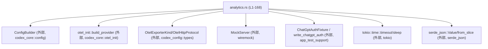
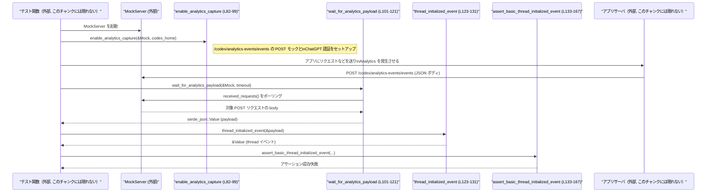

# app-server/tests/suite/v2/analytics.rs

## 0. ざっくり一言

このファイルは、アプリケーションサーバの **Analytics / OpenTelemetry メトリクス設定** と **HTTPベースの Analytics イベント送信** を検証するためのテスト関数およびテスト用ヘルパー関数をまとめたモジュールです（`analytics.rs:L22-167`）。

---

## 1. このモジュールの役割

### 1.1 概要

- `ConfigBuilder` と `otel_init::build_provider` を使い、analytics 設定フラグの有効/無効時にメトリクスが有効になるかをテストします（`analytics.rs:L33-80`）。
- Wiremock の `MockServer` を使って、Analytics HTTP エンドポイントへの POST リクエストを捕捉し、その JSON ペイロードを検証するテストヘルパーを提供します（`analytics.rs:L82-121`）。
- Analytics ペイロード内から特定のイベント (`codex_thread_initialized`) を取り出し、その内容を検証するユーティリティを提供します（`analytics.rs:L123-167`）。

### 1.2 アーキテクチャ内での位置づけ

このモジュールと主要依存コンポーネントの関係を簡略化して示します。



- テスト内で `ConfigBuilder` により設定を構築し（`analytics.rs:L36-39,61-64`）、`otel_init::build_provider` に渡して OpenTelemetry プロバイダを初期化しています（`analytics.rs:L43-49,68-74`）。
- Analytics の HTTP 通信は本番コード側ですが、テスト側では `wiremock::MockServer` と `Mock` を使って `/codex/analytics-events/events` への POST を受け取り検証する構造になっています（`analytics.rs:L82-87,101-117`）。
- ChatGPT 関連の認証情報は `app_test_support::write_chatgpt_auth` によりファイルへ保存される前提になっています（`analytics.rs:L89-96`）。

### 1.3 設計上のポイント

- **非同期テスト**  
  - 2つのテスト関数は `#[tokio::test]` 属性付きの `async fn` として定義されており、Tokio ランタイム上で実行されます（`analytics.rs:L33-56,58-80`）。
- **エラーの一元化**  
  - すべての公開ヘルパー関数とテスト関数は `anyhow::Result` を返し、`?` 演算子で様々なエラー型をまとめて伝播する方針です（`analytics.rs:L34,59,82,101,123`）。
- **テスト用ヘルパーの `pub(crate)` 化**  
  - テスト補助関数は `pub(crate)` として宣言され、同クレート内の他のテストから再利用できるが外部クレートには公開されないようになっています（`analytics.rs:L82,101,123,133`）。
- **ポーリング＋タイムアウトによる待機**  
  - Analytics HTTP リクエストはすぐには届かない可能性があるため、`wait_for_analytics_payload` では `MockServer::received_requests` をポーリングし、Tokio の `timeout` で全体の待ち時間を制限する設計になっています（`analytics.rs:L105-119`）。
- **JSON への依存**  
  - ペイロードは `serde_json::Value` で扱われ、イベント配列・イベントタイプ・各パラメータの検証を JSON パス的なインデックスで実行しています（`analytics.rs:L123-131,139-167`）。

---

## 2. 主要な機能一覧

- Analytics メトリクスエクスポータ設定: OTLP/HTTP(JSON) メトリクスエクスポータを `Config` に設定するヘルパー（`set_metrics_exporter`, `analytics.rs:L24-31`）。
- デフォルト analytics フラグのテスト（無効時）: `analytics_enabled` 未設定＋デフォルト false のとき、メトリクスが無効になることを検証（`analytics.rs:L33-56`）。
- デフォルト analytics フラグのテスト（有効時）: `analytics_enabled` 未設定＋デフォルト true のとき、メトリクスが有効になることを検証（`analytics.rs:L58-80`）。
- Analytics HTTP キャプチャの有効化: Wiremock にエンドポイントを登録し、ChatGPT 認証情報を設定するヘルパー（`enable_analytics_capture`, `analytics.rs:L82-99`）。
- Analytics ペイロードの受信待ち: Wiremock のリクエスト記録をポーリングし、該当する POST のボディを JSON として返すヘルパー（`wait_for_analytics_payload`, `analytics.rs:L101-121`）。
- `codex_thread_initialized` イベントの抽出: Analytics ペイロードの `events` 配列から特定タイプのイベントを取り出すヘルパー（`thread_initialized_event`, `analytics.rs:L123-131`）。
- Thread initialized イベントの基本検証: イベントのパラメータが期待通りであるかを一括で `assert_eq!` する検証関数（`assert_basic_thread_initialized_event`, `analytics.rs:L133-167`）。

### 2.1 コンポーネント一覧（定数・関数）

| 名前 | 種別 | 役割 / 用途 | 定義位置 |
|------|------|-------------|----------|
| `SERVICE_VERSION` | `const &str` | テスト用の固定サービスバージョン文字列 (`"0.0.0-test"`) | `analytics.rs:L22` |
| `set_metrics_exporter` | 関数 | `Config` に OTLP/HTTP(JSON) メトリクスエクスポータを設定するテストヘルパー | `analytics.rs:L24-31` |
| `app_server_default_analytics_disabled_without_flag` | 非同期テスト関数 | analytics 未設定＋デフォルト false のときメトリクスが無効であることを検証 | `analytics.rs:L33-56` |
| `app_server_default_analytics_enabled_with_flag` | 非同期テスト関数 | analytics 未設定＋デフォルト true のときメトリクスが有効であることを検証 | `analytics.rs:L58-80` |
| `enable_analytics_capture` | `pub(crate)` 非同期関数 | Wiremock に Analytics エンドポイントを登録し、ChatGPT 認証情報をファイルに書き込む | `analytics.rs:L82-99` |
| `wait_for_analytics_payload` | `pub(crate)` 非同期関数 | Wiremock の記録から Analytics POST リクエストを、タイムアウト付きで待ち受けて JSON を返す | `analytics.rs:L101-121` |
| `thread_initialized_event` | `pub(crate)` 関数 | Analytics JSON から `codex_thread_initialized` イベントを検索して返す | `analytics.rs:L123-131` |
| `assert_basic_thread_initialized_event` | `pub(crate)` 関数 | Thread initialized イベントの基本フィールドが期待通りかをまとめて `assert` する | `analytics.rs:L133-167` |

---

## 3. 公開 API と詳細解説

### 3.1 型一覧（構造体・列挙体など）

このファイル内で **新たに定義される構造体・列挙体・型エイリアスはありません**。  
使用している型はすべて外部クレート（`codex_core`, `codex_config`, `wiremock`, `serde_json` など）および標準ライブラリからインポートされています（`analytics.rs:L1-20`）。

---

### 3.2 関数詳細

#### `set_metrics_exporter(config: &mut codex_core::config::Config)`

**概要**

- 渡された `Config` に対し、OTLP/HTTP(JSON) 形式のメトリクスエクスポータ設定を行うテスト用ヘルパーです（`analytics.rs:L24-31`）。

**引数**

| 引数名 | 型 | 説明 |
|--------|----|------|
| `config` | `&mut codex_core::config::Config` | OpenTelemetry 設定を含む設定オブジェクトへの可変参照 |

**戻り値**

- ありません（`()`）。`config` のフィールドを書き換えるだけです。

**内部処理の流れ**

1. `config.otel.metrics_exporter` フィールドに `OtelExporterKind::OtlpHttp { ... }` を代入します（`analytics.rs:L25`）。
2. エンドポイントを `http://localhost:4318` に固定し、ヘッダを空 `HashMap`、プロトコルを JSON (`OtelHttpProtocol::Json`)、TLS を `None` に設定します（`analytics.rs:L25-30`）。

**Examples（使用例）**

```rust
// ConfigBuilder で設定を生成した後にメトリクスエクスポータを有効化する
let mut config = ConfigBuilder::default()
    .codex_home(codex_home.path().to_path_buf())
    .build()
    .await?; // anyhow::Result を想定

set_metrics_exporter(&mut config); // analytics.rs:L24-31
```

**Errors / Panics**

- この関数自体は `Result` を返さず、内部でも `panic!` となりうる操作は行っていません。
- 代入対象フィールド `config.otel.metrics_exporter` が存在することが前提であり、これは型システムで保証されています。

**Edge cases（エッジケース）**

- `config` 内の他の OpenTelemetry 設定（トレースなど）がどうなっているかには関与しません。この関数呼び出し前後で他のフィールドが書き換えられる可能性はありますが、本チャンクからは不明です。

**使用上の注意点**

- 本関数は **メトリクスエクスポータを「必ず」 OTLP/HTTP(JSON) に固定**するため、異なるエクスポータ設定をテストしたい場合には使用しないのが自然です。
- テスト用ヘルパーのため、本番コードから呼び出すことは想定されていません（`analytics.rs` は `tests` 配下に存在）。

---

#### `app_server_default_analytics_disabled_without_flag() -> Result<()>`

**概要**

- `analytics_enabled` が未設定 (`None`) かつ「デフォルト analytics 有効フラグ」が `false` のとき、メトリクスが無効になることを検証する非同期テストです（`analytics.rs:L33-56`）。

**引数**

- なし。

**戻り値**

- `anyhow::Result<()>`  
  - テスト内でのセットアップ処理に失敗した場合は `Err`、アサーションがすべて通れば `Ok(())` を返します。

**内部処理の流れ**

1. 一時ディレクトリ `TempDir` を作成し（`analytics.rs:L35`）、`ConfigBuilder` で `codex_home` をそのパスに設定した `Config` を生成します（`analytics.rs:L36-39`）。
2. `set_metrics_exporter` でメトリクスエクスポータを設定します（`analytics.rs:L40`）。
3. `config.analytics_enabled = None` と明示的に未設定状態にします（`analytics.rs:L41`）。
4. `codex_core::otel_init::build_provider` を `default_analytics_enabled: false` で呼び出し、OpenTelemetry プロバイダを構築します（`analytics.rs:L43-48`）。
5. ビルドエラーを文字列化して `anyhow::Error` に変換し、`?` で伝播します（`analytics.rs:L49`）。
6. プロバイダが保持しているメトリクスプロバイダ有無を `provider.as_ref().and_then(|otel| otel.metrics()).is_some()` で判定し（`analytics.rs:L53`）、`false` であることを `assert_eq!` します（`analytics.rs:L54`）。

**Examples（使用例）**

- この関数自体が `#[tokio::test]` として直接 `cargo test` から実行されるエントリポイントです。追加の呼び出し例は不要です。

**Errors / Panics**

- `TempDir::new` の失敗、`ConfigBuilder::build().await` の失敗、`build_provider` の失敗などが起こると `Err` が返り、テストはエラーで終了します（`analytics.rs:L35-39,43-49`）。
- `assert_eq!(has_metrics, false)` が失敗するとテストは `panic!` し、テスト失敗として報告されます（`analytics.rs:L53-54`）。

**Edge cases**

- `build_provider` が `Ok(None)` を返した場合でも、`metrics()` が呼ばれて `None` になり、`has_metrics == false` となるためテストは通ります。`provider` 自体が `None` でもメトリクスがない、という扱いになっています（`analytics.rs:L53`）。
- `analytics_enabled` の具体的な意味・他の値（`Some(true/false)`）の扱いはこのテストからは分かりません。

**使用上の注意点**

- `#[tokio::test]` により各テストは独立した Tokio ランタイム上で実行されるため、他のテストとのランタイム共有やレースコンディションは基本的に意識する必要がありません（`analytics.rs:L33`）。
- このテストは「デフォルトフラグ false」の挙動のみを検証しており、「明示的に `analytics_enabled` を設定したケース」は別テストが必要です（本チャンクには現れません）。

---

#### `app_server_default_analytics_enabled_with_flag() -> Result<()>`

**概要**

- `analytics_enabled` が未設定 (`None`) かつ「デフォルト analytics 有効フラグ」が `true` のとき、メトリクスが有効になることを検証する非同期テストです（`analytics.rs:L58-80`）。

**引数・戻り値**

- `app_server_default_analytics_disabled_without_flag` と同様で、引数なし・戻り値は `anyhow::Result<()>` です（`analytics.rs:L59`）。

**内部処理の流れ**

1. 一時ディレクトリと `Config` を構築（`analytics.rs:L60-64`）。
2. `set_metrics_exporter` でメトリクスエクスポータを設定（`analytics.rs:L65`）。
3. `config.analytics_enabled = None` を設定（`analytics.rs:L66`）。
4. `build_provider` を `default_analytics_enabled: true` で呼び出し（`analytics.rs:L68-73`）、エラーを `anyhow` に変換（`analytics.rs:L74`）。
5. `has_metrics` を算出し、`true` であることを `assert_eq!` で検証（`analytics.rs:L77-78`）。

**Examples（使用例）**

- この関数も `#[tokio::test]` によるテストエントリポイントであり、`cargo test` から直接実行されます。

**Errors / Panics**

- セットアップエラーや `build_provider` 失敗で `Err` を返します（`analytics.rs:L60-64,68-74`）。
- `has_metrics` が `true` でない場合、`assert_eq!` により `panic!` します（`analytics.rs:L77-78`）。

**Edge cases**

- `build_provider` の戻り値 `provider` が `None` だった場合、`has_metrics` も `false` となりテストは失敗するため、「デフォルト true なら何らかのメトリクスプロバイダが存在する」ことを間接的に期待していると解釈できます（根拠: `analytics.rs:L77-78`）。

**使用上の注意点**

- 前のテストと対をなすもので、`default_analytics_enabled` フラグの動作を境界条件としてサンドイッチしている構成です。
- 2つのテストは独立であり、実行順序に依存しません（共有状態は `TempDir` とローカル変数内に閉じています、`analytics.rs:L35-41,60-66`）。

---

#### `enable_analytics_capture(server: &MockServer, codex_home: &Path) -> Result<()>`

**概要**

- Wiremock の `MockServer` に対して Analytics 用の POST エンドポイントを設定し、ChatGPT 認証情報を `codex_home` 配下に書き込むテストヘルパーです（`analytics.rs:L82-99`）。

**引数**

| 引数名 | 型 | 説明 |
|--------|----|------|
| `server` | `&MockServer` | Wiremock のモックサーバインスタンスへの参照 |
| `codex_home` | `&Path` | ChatGPT 認証情報を書き込むベースディレクトリ |

**戻り値**

- `anyhow::Result<()>`  
  - モック登録や認証情報書き込みが成功すれば `Ok(())`、失敗時は `Err` を返します。

**内部処理の流れ**

1. `Mock::given(method("POST")).and(path("/codex/analytics-events/events"))` で、HTTP メソッド `POST` かつパス `/codex/analytics-events/events` に一致するリクエストをマッチ条件として定義します（`analytics.rs:L83-85`）。
2. レスポンスとして HTTP ステータス 200 を返す `ResponseTemplate::new(200)` を設定し（`analytics.rs:L85`）、`server` にマウントして `await` します（`analytics.rs:L86-87`）。
3. `write_chatgpt_auth` を呼び出し、`ChatGptAuthFixture::new("chatgpt-token")` に対して `account_id` / `chatgpt_user_id` / `chatgpt_account_id` をメソッドチェーンで設定したものを渡し、`AuthCredentialsStoreMode::File` で保存します（`analytics.rs:L89-96`）。
4. `write_chatgpt_auth` のエラーは `?` で呼び出し元に伝播します（`analytics.rs:L96`）。

**Examples（使用例）**

```rust
use tempfile::TempDir;
use wiremock::MockServer;
use anyhow::Result;

#[tokio::test]
async fn test_enable_analytics_capture() -> Result<()> {
    let codex_home = TempDir::new()?;                // テスト用の codex_home
    let server = MockServer::start().await;          // wiremock のモックサーバ起動（外部ライブラリ, このチャンクには定義なし）

    enable_analytics_capture(&server, codex_home.path()).await?; // analytics.rs:L82-99

    // ここでアプリケーションに何らかの操作を行い、Analytics POST が server に届くことを期待する
    Ok(())
}
```

> 注: `MockServer::start()` は wiremock クレート側で定義される一般的な起動メソッドであり、このファイルには現れません。

**Errors / Panics**

- `Mock::mount(server).await` が返すエラーは型的に `Result` ではなく `()` 戻り値であり、このコードではエラーを返さない API として利用されています（`analytics.rs:L83-87`）。そのため、モックの設定自体で `Err` が返ることはありません（wiremock の API 仕様による）。
- `write_chatgpt_auth` が失敗した場合、`anyhow::Error` として呼び出し元へ伝播し、呼び出し側テストは `Err` で終了します（`analytics.rs:L89-96`）。
- 明示的な `assert!` は行っていません。

**Edge cases**

- `codex_home` に書き込み権限がない場合やファイルシステムエラーが発生した場合、`write_chatgpt_auth` がエラーになると考えられますが、具体的なエラー内容はこのチャンクからは分かりません。
- `server` に同じパスのモックが複数マウントされている場合の挙動は wiremock の仕様に依存し、このファイルからは分かりません。

**使用上の注意点**

- この関数は **Analytics HTTP エンドポイントと ChatGPT 認証の両方** を前提としているため、「認証不要なテスト」には適さない可能性があります。
- `server` のライフタイムは呼び出し元で管理する必要があります。`MockServer` は非同期にリクエストを受け付けるため、テストが終了するまで生存させておく必要があります（このファイル内では破棄のタイミングは扱っていません）。

---

#### `wait_for_analytics_payload(server: &MockServer, read_timeout: Duration) -> Result<Value>`

**概要**

- Wiremock の `MockServer` に記録されたリクエストをポーリングし、Analytics POST (`/codex/analytics-events/events`) が現れるまで待機して、そのリクエストボディを JSON (`serde_json::Value`) として返します（`analytics.rs:L101-121`）。
- 待ち時間は `read_timeout` で上限が設けられ、タイムアウトすればエラーになります。

**引数**

| 引数名 | 型 | 説明 |
|--------|----|------|
| `server` | `&MockServer` | Analytics リクエストが送信される Wiremock サーバ |
| `read_timeout` | `Duration` | Analytics リクエストを待つ最大時間 |

**戻り値**

- `anyhow::Result<Value>`  
  - 成功時: Analytics リクエストのボディを JSON としてパースした `serde_json::Value`。
  - 失敗時: タイムアウトまたは JSON パース失敗などを含む `anyhow::Error`。

**内部処理の流れ（アルゴリズム）**

1. `tokio::time::timeout(read_timeout, async { ... })` で全体の待機処理にタイムアウトを設定します（`analytics.rs:L105-119`）。
2. 内部の非同期ブロックでは無限ループを行います（`analytics.rs:L106-117`）:
   - `server.received_requests().await` を呼び出し、記録されたリクエスト一覧を取得します（`analytics.rs:L107`）。
   - `Some(requests)` が得られない場合（`None` の場合）は 25ms スリープしてループ継続します（`analytics.rs:L107-110`）。
   - `Some(requests)` の場合、`requests.iter().find` で `method == "POST"` かつ `url.path() == "/codex/analytics-events/events"` のリクエストを検索します（`analytics.rs:L111-113`）。
   - 見つかった場合はその `request.body.clone()` を `break` でループから返します（`analytics.rs:L114`）。
   - 見つからなかった場合は 25ms スリープしてループ継続します（`analytics.rs:L116`）。
3. `timeout` が `Ok(body)` を返した場合、`serde_json::from_slice(&body)` で JSON パースを行います（`analytics.rs:L120`）。
4. パース失敗時は `"invalid analytics payload: {err}"` というメッセージを持つ `anyhow::Error` に変換して返します（`analytics.rs:L120`）。

**Mermaid シーケンス図（データフロー）**

以下はこの関数内部でのデータフローを示します。

```mermaid
sequenceDiagram
    participant Caller as "呼び出し元"
    participant Func as "wait_for_analytics_payload (L101-121)"
    participant Timeout as "tokio::time::timeout (L105-119)"
    participant Mock as "MockServer::received_requests (外部)"
    participant Sleep as "tokio::time::sleep (外部)"
    participant Serde as "serde_json::from_slice (L120)"

    Caller->>Func: 呼び出し(server, read_timeout)
    Func->>Timeout: timeout(read_timeout, async { loop {...} })
    loop ループ (L106-117)
        Timeout->>Mock: received_requests().await
        alt Some(requests)
            Timeout->>Timeout: POST /codex/analytics-events/events を検索
            alt 見つかった
                Timeout-->>Func: request.body.clone()
                break
            else 見つからない
                Timeout->>Sleep: sleep(25ms)
            end
        else None
            Timeout->>Sleep: sleep(25ms)
        end
    end
    Func->>Serde: from_slice(&body)
    Serde-->>Func: Value または エラー
    Func-->>Caller: Result<Value>
```

**Examples（使用例）**

```rust
use std::time::Duration;
use anyhow::Result;

// server はどこかで起動し、Analytics POST を受け取る設定になっているとする
async fn check_analytics(server: &MockServer) -> Result<()> {
    let payload = wait_for_analytics_payload(server, Duration::from_secs(5)).await?; // analytics.rs:L101-121

    // 取得した payload に対してさらに検証を行う
    println!("analytics payload: {payload:?}");
    Ok(())
}
```

**Errors / Panics**

- `tokio::time::timeout` が `Err(Elapsed)` を返した場合、`?` により `anyhow::Error` として呼び出し元へ伝播します（`analytics.rs:L105-119`）。
- `serde_json::from_slice` が JSON パースエラーを返した場合、`"invalid analytics payload: {err}"` というメッセージ付き `anyhow::Error` へ変換されます（`analytics.rs:L120`）。
- この関数内部では `assert!` や `panic!` は使用していません。

**Edge cases**

- **リクエストが一度も届かない**  
  - `server.received_requests()` から該当リクエストが一度も見つからない場合、`timeout` により `read_timeout` 経過時にエラーとなります。
- **多数のリクエストがある場合**  
  - `requests.iter().find` は最初にマッチしたリクエストのボディのみを返します。後続の同種リクエストは無視されます（`analytics.rs:L111-114`）。
- **ボディが JSON でない場合**  
  - `from_slice` が失敗し、「invalid analytics payload」エラーになります（`analytics.rs:L120`）。

**使用上の注意点**

- `read_timeout` を短く設定しすぎると、アプリケーション側の処理が遅い場合にテストが頻繁にタイムアウトする可能性があります。
- ループは 25ms ごとにポーリングするため、高頻度でテストを繰り返す場合には最小限とはいえポーリング負荷が発生しますが、テスト用途としては一般的なトレードオフです（`analytics.rs:L108,116`）。
- `MockServer` はスレッドセーフに設計されており（wiremock の仕様）、複数タスクから同時に参照しても問題ないことが期待されますが、このチャンクには明示的な保証は現れません。

---

#### `thread_initialized_event(payload: &Value) -> Result<&Value>`

**概要**

- Analytics ペイロード (`serde_json::Value`) の中から、`event_type == "codex_thread_initialized"` を持つイベントオブジェクトを検索して返します（`analytics.rs:L123-131`）。

**引数**

| 引数名 | 型 | 説明 |
|--------|----|------|
| `payload` | `&Value` | Analytics 全体の JSON ペイロード |

**戻り値**

- `anyhow::Result<&Value>`  
  - 成功時: `payload["events"]` 配列内の、該当イベントオブジェクトへの参照。
  - 失敗時: イベント配列がない場合、または対象イベントが存在しない場合の `anyhow::Error`。

**内部処理の流れ**

1. `payload["events"].as_array()` で `events` フィールドを配列として取得します（`analytics.rs:L124-126`）。
   - `None` の場合は `"analytics payload missing events array"` というメッセージで `Err` を返します。
2. `events.iter().find` で `event["event_type"] == "codex_thread_initialized"` を満たすイベントを検索します（`analytics.rs:L127-129`）。
3. 見つかればその参照を `Ok` で返し、見つからなければ `"codex_thread_initialized event should be present"` というメッセージで `Err` を返します（`analytics.rs:L130`）。

**Examples（使用例）**

```rust
use anyhow::Result;
use serde_json::Value;

fn extract_thread_event(payload: &Value) -> Result<&Value> {
    let event = thread_initialized_event(payload)?; // analytics.rs:L123-131
    println!("thread initialized event: {event:?}");
    Ok(event)
}
```

**Errors / Panics**

- `payload["events"]` が配列でない場合、`anyhow::anyhow!("analytics payload missing events array")` でエラーになります（`analytics.rs:L124-126`）。
- `event_type == "codex_thread_initialized"` のイベントが 1 件もない場合、`anyhow::anyhow!("codex_thread_initialized event should be present")` でエラーになります（`analytics.rs:L127-130`）。
- `panic!` は使用していません。

**Edge cases**

- `events` 配列に複数の `codex_thread_initialized` イベントがある場合、最初に見つかったものだけが返されます（`analytics.rs:L127-129`）。
- `event_type` フィールドが存在しないイベントは `event["event_type"]` が `Value::Null` となり、比較で一致しないため無視されます。

**使用上の注意点**

- 戻り値は `payload` への参照であり、`payload` のライフタイムを超えて使用することはできません。これは Rust の借用規則によりコンパイル時に保証されます。
- Analytics スキーマの変更（キー名変更など）があると、この関数はエラーを返すようになります。スキーマ変更時にはテストの更新が必要になります。

---

#### `assert_basic_thread_initialized_event(event: &Value, thread_id: &str, expected_model: &str, initialization_mode: &str)`

**概要**

- `codex_thread_initialized` イベントの内容が期待通りであることを、フィールド単位で `assert_eq!` するテスト用アサーション関数です（`analytics.rs:L133-167`）。

**引数**

| 引数名 | 型 | 説明 |
|--------|----|------|
| `event` | `&Value` | `codex_thread_initialized` イベント JSON |
| `thread_id` | `&str` | 期待されるスレッド ID |
| `expected_model` | `&str` | 期待されるモデル名 |
| `initialization_mode` | `&str` | 期待される初期化モード |

**戻り値**

- なし。すべて `assert_*!` マクロによる検証です。

**内部処理の流れ**

1. `event["event_params"]["thread_id"]` が `thread_id` と等しいことを確認（`analytics.rs:L139`）。
2. `app_server_client` サブオブジェクト内の `product_client_id`・`client_name` がどちらも `DEFAULT_CLIENT_NAME` と等しいことを確認（`analytics.rs:L140-147`）。
3. `app_server_client["rpc_transport"]` が `"stdio"` であることを確認（`analytics.rs:L148-151`）。
4. `event["event_params"]["model"]` が `expected_model` と等しいことを確認（`analytics.rs:L152`）。
5. `event["event_params"]["ephemeral"]` が `false` であることを確認（`analytics.rs:L153`）。
6. `event["event_params"]["thread_source"]` が `"user"` であることを確認（`analytics.rs:L154`）。
7. `subagent_source` と `parent_thread_id` が `serde_json::Value::Null` であることを確認（`analytics.rs:L155-162`）。
8. `initialization_mode` が期待値と等しいことを確認（`analytics.rs:L163-165`）。
9. `created_at` が `u64` として解釈可能な値 (`as_u64().is_some()`) であることを確認（`analytics.rs:L167`）。

**Examples（使用例）**

```rust
use anyhow::Result;

async fn assert_thread_event(payload: &Value) -> Result<()> {
    let event = thread_initialized_event(payload)?; // analytics.rs:L123-131
    assert_basic_thread_initialized_event(
        event,
        "thread-1",
        "gpt-4.1-mini",
        "new_thread",
    ); // analytics.rs:L133-167
    Ok(())
}
```

**Errors / Panics**

- いずれかの `assert_eq!` / `assert!` が失敗すると `panic!` によりテストが失敗します（`analytics.rs:L139-167`）。
- 戻り値として `Result` は返さないため、この関数内での失敗はすべてテスト失敗として扱われます。

**Edge cases**

- 対象フィールドが存在しない場合、`event["..."]` は `Value::Null` を返しますが、その場合 `assert_eq!` は不一致として `panic!` します。
- `created_at` が数値でない、もしくは符号付き数値など `u64` として解釈できない場合、`as_u64().is_some()` が `false` となり `assert!` により `panic!` します（`analytics.rs:L167`）。

**使用上の注意点**

- フィールド名・構造に強く依存しているため、Analytics スキーマ変更時にはこの関数を更新する必要があります。
- `DEFAULT_CLIENT_NAME` は `app_test_support` からインポートされており、テスト環境依存の値です（`analytics.rs:L2-3,141-147`）。

---

### 3.3 その他の関数

3.2 で全関数を詳細に説明したため、追加の補助関数一覧はありません。

---

## 4. データフロー

代表的なシナリオとして、Analytics HTTP リクエストを待ち受けて Thread Initialized イベントを検証する流れを示します。  
ここでは、`enable_analytics_capture` → アプリ実行 → `wait_for_analytics_payload` → `thread_initialized_event` → `assert_basic_thread_initialized_event` という流れを想定しています（後ろ3つは本ファイルに定義、`analytics.rs:L82-121,123-167`）。



- この図のうち、`Enable` / `Wait` / `ThreadEv` / `AssertEv` は本ファイルに定義されています。
- `Test`（具体的なテストケース）と `App`（アプリケーションサーバ）の実装は、このチャンクには現れませんが、Analytics テスト全体として想定される構成です。

---

## 5. 使い方（How to Use）

### 5.1 基本的な使用方法

ヘルパー関数を組み合わせて、Thread Initialized Analytics イベントを検証する典型的なテストの例です。

```rust
use anyhow::Result;
use tempfile::TempDir;
use wiremock::MockServer;
use std::time::Duration;
use serde_json::Value;

#[tokio::test]
async fn test_thread_initialized_analytics_flow() -> Result<()> {
    // 1. テスト用ディレクトリと MockServer を準備
    let codex_home = TempDir::new()?;                     // 一時的な codex_home
    let server = MockServer::start().await;               // モックサーバ起動（外部ライブラリ）

    // 2. Analytics キャプチャを有効化
    enable_analytics_capture(&server, codex_home.path()).await?; // analytics.rs:L82-99

    // 3. アプリケーション側で「スレッド初期化」に相当する操作を行う
    //    （このチャンクには実装がないため省略）

    // 4. Analytics ペイロードを取得
    let payload: Value = wait_for_analytics_payload(&server, Duration::from_secs(5)).await?; // L101-121

    // 5. Thread initialized イベントを抽出し、内容を検証
    let event = thread_initialized_event(&payload)?; // L123-131
    assert_basic_thread_initialized_event(
        event,
        "expected-thread-id",
        "expected-model",
        "new_thread",
    ); // L133-167

    Ok(())
}
```

> `MockServer::start()` やアプリケーション操作部分は、このファイルには現れない外部コードです。

### 5.2 よくある使用パターン

1. **Analytics メトリクスの有効/無効の検証**

   - `set_metrics_exporter` と `ConfigBuilder`、`otel_init::build_provider` を組み合わせて、フラグや設定に応じたメトリクス有無を確認するパターンです（`analytics.rs:L33-56,58-80`）。

2. **特定イベント種別の検証**

   - `wait_for_analytics_payload` でペイロードを取得し、`thread_initialized_event` でイベントを抽出、`assert_basic_thread_initialized_event` でまとめて内容を検証するパターンです（`analytics.rs:L101-121,123-167`）。

### 5.3 よくある間違い

```rust
// 間違い例: enable_analytics_capture を呼ばずに payload を待とうとする
#[tokio::test]
async fn test_without_enable() -> anyhow::Result<()> {
    let server = MockServer::start().await;
    // enable_analytics_capture(&server, codex_home.path()).await?; // 呼んでいない

    // アプリが正しくエンドポイントに送らない/認証がないため、
    // ここでタイムアウトしやすい
    let _payload = wait_for_analytics_payload(&server, Duration::from_millis(100)).await?;
    Ok(())
}
```

```rust
// 正しい例: 先にエンドポイントと認証情報をセットアップする
#[tokio::test]
async fn test_with_enable() -> anyhow::Result<()> {
    let codex_home = TempDir::new()?;
    let server = MockServer::start().await;

    enable_analytics_capture(&server, codex_home.path()).await?; // 先にセットアップ
    // ここでアプリ操作を行い、その後 payload を待つ
    let _payload = wait_for_analytics_payload(&server, Duration::from_secs(5)).await?;
    Ok(())
}
```

### 5.4 使用上の注意点（まとめ）

- **非同期実行前提**  
  - `enable_analytics_capture` と `wait_for_analytics_payload` は `async fn` であり、Tokio ランタイム内で `.await` する必要があります（`analytics.rs:L82,101`）。
- **タイムアウト設定**  
  - `wait_for_analytics_payload` の `read_timeout` が短すぎると、アプリケーション側の遅延によりテストが不安定になりやすいです（`analytics.rs:L105-119`）。
- **スキーマ依存性**  
  - `thread_initialized_event` と `assert_basic_thread_initialized_event` は JSON スキーマに強く依存しているため、Analytics スキーマの変更時には必ず更新が必要です（`analytics.rs:L123-131,139-167`）。
- **セキュリティ（テスト環境）**  
  - ChatGPT トークンやアカウント ID はテスト用の固定値を使用しており、本番用の秘密情報は含まれていません（`analytics.rs:L89-94`）。テスト環境以外で流用しない前提です。

---

## 6. 変更の仕方（How to Modify）

### 6.1 新しい機能を追加する場合

例: 新しい Analytics イベント種別 `codex_xxx` を検証したい場合。

1. **イベント抽出ヘルパーの追加**
   - `thread_initialized_event` と同様に、新しいイベント種別を検索する関数を追加します（`analytics.rs:L123-131` を参考）。
   - 例: `pub(crate) fn xxx_event(payload: &Value) -> Result<&Value> { ... }`。

2. **イベント内容検証関数の追加**
   - `assert_basic_thread_initialized_event` と同様に、そのイベントに固有のフィールドを `assert_eq!` する関数を新設します（`analytics.rs:L133-167` を参考）。

3. **テストケースの追加**
   - `#[tokio::test]` 付き関数を追加し、`enable_analytics_capture` とアプリ呼び出し、`wait_for_analytics_payload`、新ヘルパー関数群を組み合わせます。

### 6.2 既存の機能を変更する場合

- **Analytics スキーマが変わる場合**
  - `thread_initialized_event` の `event_type` 名や `assert_basic_thread_initialized_event` のフィールド名を、新スキーマに合わせて変更する必要があります（`analytics.rs:L127-129,139-167`）。
  - 影響範囲として、このヘルパーを利用している他のテストファイル（このチャンクには現れない）も同時に確認する必要があります。

- **メトリクスエクスポータ設定を変更したい場合**
  - `set_metrics_exporter` 内の `OtelExporterKind::OtlpHttp` のパラメータ（エンドポイント・プロトコルなど）を変更します（`analytics.rs:L25-30`）。
  - この変更はメトリクス関連テストすべてに影響するため、`app_server_default_analytics_*` テストを含めた一括テスト実行が必要です（`analytics.rs:L33-80`）。

- **タイムアウト挙動を変えたい場合**
  - `wait_for_analytics_payload` 内の `Duration::from_millis(25)` を調整することでポーリング間隔を変更できます（`analytics.rs:L108,116`）。
  - 全体のタイムアウトは呼び出し側の `read_timeout` で制御されるため、新しい要件に合わせてテスト側の引数も見直す必要があります。

---

## 7. 関連ファイル

このモジュールと密接に関係する外部コンポーネントを示します（ファイルパスはこのチャンクからは分からないため、モジュール名レベルで記載します）。

| パス / モジュール | 役割 / 関係 |
|-------------------|------------|
| `codex_core::config::ConfigBuilder` | テストで使用される設定ビルダー。`Config` に `codex_home` を設定し、OpenTelemetry 設定を含む構成オブジェクトを生成します（`analytics.rs:L36-39,61-64`）。 |
| `codex_core::otel_init::build_provider` | Analytics/メトリクス有効/無効の実体を決める OpenTelemetry プロバイダ構築関数。2つのテストで呼び出されています（`analytics.rs:L43-49,68-74`）。 |
| `codex_config::types::{OtelExporterKind, OtelHttpProtocol}` | メトリクスエクスポータ種別および HTTP プロトコル種別を表す型。`set_metrics_exporter` で利用されています（`analytics.rs:L6-7,25-30`）。 |
| `app_test_support::{ChatGptAuthFixture, write_chatgpt_auth, DEFAULT_CLIENT_NAME}` | ChatGPT 認証情報のテスト用フィクスチャ/書き込み関数と、クライアント名の定数。Analytics キャプチャのセットアップおよびイベント検証で利用されています（`analytics.rs:L2-4,89-96,141-147`）。 |
| `wiremock::{MockServer, Mock, ResponseTemplate, matchers}` | HTTP モックサーバとマッチャ。Analytics HTTP エンドポイントのモックとリクエスト収集に使用されています（`analytics.rs:L16-20,82-87,101-117`）。 |
| `serde_json::Value` | Analytics ペイロードおよびイベントオブジェクトを表現する JSON 値。抽出・検証ヘルパーで中心的に利用されています（`analytics.rs:L10,101-121,123-167`）。 |
| `tokio::time::{timeout, sleep}` | 非同期ポーリングとタイムアウトを実現するために `wait_for_analytics_payload` 内で利用されています（`analytics.rs:L13,15,105-119`）。 |

このファイルを理解することで、「Analytics がどのように送信され、テストでどのように検証されているか」の流れを把握でき、同様のパターンで新しい Analytics テストやヘルパーを追加する際の基盤として利用できます。
