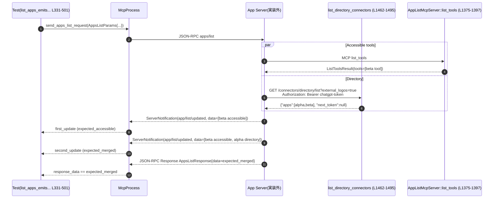

# app-server/tests/suite/v2/app_list.rs コード解説

## 0. ざっくり一言

`apps/list` API の挙動（コネクタ機能・キャッシュ・ページネーション・実験的機能フラグなど）を、擬似的な ChatGPT「アプリ／コネクタ」サーバと MCP ツールサーバを立てて検証する統合テスト群と、そのためのテスト用サーバ実装です。  
（根拠: app_list.rs:L61-1532）

---

## 1. このモジュールの役割

### 1.1 概要

- このファイルは **`apps/list` エンドポイントの仕様をテストで定義する** ために存在しています。
- 外部のテスト用ラッパー `McpProcess` を通じてアプリサーバを起動し、  
  - コネクタ機能が無効な場合  
  - API key 認証時  
  - スレッドごとの機能フラグ  
  - ディレクトリ一覧と「アクセス可能アプリ」のマージ  
  - ページネーション  
  - force_refetch（再取得）とキャッシュ  
  - 実験的機能フラグ `apps`  
  の挙動を検証します。（根拠: 各テスト関数のアサーション app_list.rs:L61-1306）
- そのために、ローカルの Axum HTTP サーバと RMCP MCP サーバを立てる補助構造体・関数を定義しています。（根拠: app_list.rs:L1323-1460）

### 1.2 アーキテクチャ内での位置づけ

このテストファイル内での主なコンポーネントと依存関係は次のとおりです。

```mermaid
graph TD
    subgraph Test Code (app_list.rs)
        T1["各 #[tokio::test] 関数 (L61-1306)"]
        U1["read_app_list_updated_notification (L1308-1321)"]
        H1["start_apps_server_with_delays(_and_control) (L1400-1460)"]
        H2["list_directory_connectors (L1462-1495)"]
        H3["AppListMcpServer::list_tools (L1375-1397)"]
    end

    subgraph Stub Server
        SState["AppsServerState (L1323-1329)"]
        SControl["AppsServerControl (L1343-1364)"]
        SMcp["AppListMcpServer (L1331-1341,1367-1397)"]
        Axum["Axum Router + TcpListener (L1434-1457)"]
    end

    subgraph External crates
        MCP["app_test_support::McpProcess"]
        Proto["codex_app_server_protocol::*"]
        Login["codex_login::*"]
        RMCP["rmcp::*"]
    end

    T1 --> MCP
    T1 --> H1
    H1 --> Axum
    Axum --> H2
    Axum --> SMcp
    H1 --> SState
    H1 --> SControl
    SMcp --> SControl
    U1 --> MCP
    T1 --> Proto
    T1 --> Login
    SMcp --> RMCP
```

- テストは `McpProcess`（外部テストサポート）を介して、アプリサーバの JSON-RPC API（`apps/list` 等）にアクセスします。（根拠: app_list.rs:L68-81, L127-140 ほか）
- 同時に、`start_apps_server_with_delays*_` で起動したローカル Axum サーバが「ChatGPT アプリ／ディレクトリ／MCP ツールサーバ」を模倣し、アプリサーバからの外部 HTTP・MCP 呼び出しを受けます。（根拠: app_list.rs:L1412-1453）
- `AppsServerControl` 経由でテストからスタブサーバのレスポンス（コネクタ一覧・ツール一覧）を動的に変更し、force_refetch や実験的機能フラグの挙動を検証します。（根拠: app_list.rs:L1343-1364, L1099-1115, L1256-1271）

### 1.3 設計上のポイント

- **完全非同期テスト**  
  すべてのテストが `#[tokio::test] async fn ...` で定義され、`tokio::time::timeout` によるタイムアウト制御でハングを防いでいます。（根拠: app_list.rs:L61, L66, L77-81 ほか）
- **ローカルスタブサーバによる外部依存の切り離し**  
  - Axum + `TcpListener` で HTTP スタブサーバを起動（`/connectors/directory/*` および `/api/codex/apps`）。  
    （根拠: app_list.rs:L1434-1453）  
  - RMCP の `StreamableHttpService` と `AppListMcpServer` で MCP ツール一覧 API をスタブ化。（根拠: app_list.rs:L1437-1444, L1331-1341, L1367-1397）
- **共有状態の管理**  
  - スタブサーバのレスポンス（コネクタ一覧 JSON）とツール一覧は `Arc<StdMutex<...>>` で共有し、`AppsServerControl` 経由でテストから更新できるようになっています。（根拠: app_list.rs:L1327-1328, L1343-1347, L1418-1422）
  - Mutex は `unwrap_or_else(PoisonError::into_inner)` でロック獲得時のパニックを回避し、テストを継続可能にしています。（根拠: app_list.rs:L1351-1354, L1359-1362, L1388-1390, L1489-1492）
- **結果・通知の二段階モデル**  
  - `apps/list` リクエストのレスポンスに加えて、`app/list/updated` 通知（`ServerNotification::AppListUpdated`）をテストで明示的に検証しています。（根拠: app_list.rs:L446-483, L603-613, L676-684, L1030-1050, L1308-1320）
- **言語特有の安全性・エラーハンドリング**  
  - すべてのヘルパー関数は `Result` を返し、`?` と `anyhow::Result` を用いてエラーを明示的に伝播。（根拠: app_list.rs:L61-88, L1308-1321, L1400-1410, L1412-1460, L1497-1516, L1518-1532）  
  - `timeout(...).await??` で「タイムアウトエラー」と「RPC エラー」の二段階を区別して伝播。（根拠: app_list.rs:L77-81, L136-140 ほか多数）

### 1.4 コンポーネント一覧（インベントリー）

#### 型・定数

| 名前 | 種別 | 役割 / 用途 | 行範囲（根拠） |
|------|------|-------------|----------------|
| `DEFAULT_TIMEOUT` | `Duration` 定数 | 各種 RPC・通知待ちのデフォルトタイムアウト（10秒） | app_list.rs:L59 |
| `AppsServerState` | 構造体 | ディレクトリ HTTP スタブサーバで期待する認証情報・レスポンス・遅延設定を保持 | app_list.rs:L1323-1329 |
| `AppListMcpServer` | 構造体 | MCP ツール一覧 (`list_tools`) を提供するスタブサーバ。共有ツールリストと人工遅延を保持 | app_list.rs:L1331-1335, L1337-1341, L1367-1397 |
| `AppsServerControl` | 構造体 | テストコードからスタブサーバのコネクタレスポンスとツールリストを書き換えるための制御ハンドル | app_list.rs:L1343-1347, L1349-1364 |

#### 関数・メソッド

（テスト関数も含む）

| 名前 | 種別 | 役割 / 用途 | 行範囲（根拠） |
|------|------|-------------|----------------|
| `list_apps_returns_empty_when_connectors_disabled` | テスト | コネクタ機能が無効なデフォルト設定で `apps/list` が空リストを返すことを確認 | app_list.rs:L61-88 |
| `list_apps_returns_empty_with_api_key_auth` | テスト | 認証モードが API key の場合、`apps/list` が空リストになることを確認 | app_list.rs:L90-149 |
| `list_apps_uses_thread_feature_flag_when_thread_id_is_provided` | テスト | グローバルでコネクタ無効でも、`thread_id` を指定したリクエストではスレッド単位の機能フラグに基づきアプリが返ることを確認 | app_list.rs:L151-252 |
| `list_apps_reports_is_enabled_from_config` | テスト | `config.toml` の `[apps.<id>] enabled = false` が `AppInfo.is_enabled` に反映されることを確認 | app_list.rs:L254-328 |
| `list_apps_emits_updates_and_returns_after_both_lists_load` | テスト | 「アクセス可能アプリ」と「ディレクトリ一覧」の両方がロードされる過程で 2 回の更新通知が届き、最終レスポンスがマージ結果になることを確認 | app_list.rs:L330-501 |
| `list_apps_waits_for_accessible_data_before_emitting_directory_updates` | テスト | アクセス可能アプリが揃う前に「ディレクトリだけ」の更新通知が出ないことを確認 | app_list.rs:L503-626 |
| `list_apps_does_not_emit_empty_interim_updates` | テスト | 中間状態で空リストの `app/list/updated` 通知を送らないことを確認 | app_list.rs:L628-716 |
| `list_apps_paginates_results` | テスト | `limit` と `cursor` によるページネーションが正しく動作することを確認 | app_list.rs:L718-859 |
| `list_apps_force_refetch_preserves_previous_cache_on_failure` | テスト | `force_refetch = true` の失敗時に既存キャッシュが保持されることを確認 | app_list.rs:L861-963 |
| `list_apps_force_refetch_patches_updates_from_cached_snapshots` | テスト | `force_refetch` 中の更新通知が「キャッシュされたスナップショット」からのパッチになっていることを確認 | app_list.rs:L965-1204 |
| `experimental_feature_enablement_set_refreshes_apps_list_when_apps_turn_on` | テスト | 実験的機能 `apps` を false→true に変更した際に `apps/list` が再取得され、更新通知が出ることを確認 | app_list.rs:L1206-1306 |
| `read_app_list_updated_notification` | ヘルパー | `app/list/updated` 通知をタイムアウト付きで待ち受け、`ServerNotification::AppListUpdated` へ変換 | app_list.rs:L1308-1321 |
| `AppListMcpServer::new` | 関連関数 | 共有ツールリストと遅延を受け取り `AppListMcpServer` を構築 | app_list.rs:L1337-1341 |
| `AppsServerControl::set_connectors` | メソッド | ディレクトリレスポンスの `apps` 配列を更新 | app_list.rs:L1349-1356 |
| `AppsServerControl::set_tools` | メソッド | MCP ツール一覧を更新 | app_list.rs:L1358-1364 |
| `AppListMcpServer::get_info` | メソッド | MCP サーバの能力として tools を有効化した `ServerInfo` を返す | app_list.rs:L1367-1373 |
| `AppListMcpServer::list_tools` | メソッド | オプションの遅延後、現在のツールリストを `ListToolsResult` として返す | app_list.rs:L1375-1397 |
| `start_apps_server_with_delays` | ヘルパー | ディレクトリ遅延・ツール遅延を指定してスタブサーバを起動し、URL と JoinHandle を返す | app_list.rs:L1400-1410 |
| `start_apps_server_with_delays_and_control` | ヘルパー | 上記に加え、`AppsServerControl` を返却してスタブレスポンスを動的に変更可能にする | app_list.rs:L1412-1460 |
| `list_directory_connectors` | ハンドラ | 認証ヘッダとクエリを検証した上で、`AppsServerState.response` を JSON として返す Axum ハンドラ | app_list.rs:L1462-1495 |
| `connector_tool` | ヘルパー | コネクタ ID/名称から MCP `Tool` を構築し、メタデータに埋め込む | app_list.rs:L1497-1516 |
| `write_connectors_config` | ヘルパー | `config.toml` に `chatgpt_base_url` とコネクタ機能有効設定を書き出す | app_list.rs:L1518-1532 |

---

## 2. 主要な機能一覧

- `apps/list` 基本挙動検証  
  - コネクタ機能無効・API key 認証・スレッドフラグなど環境条件に応じた戻り値を確認します。（例: app_list.rs:L61-88, L90-149, L151-252）

- 設定ベースの有効/無効フラグ反映検証  
  - `config.toml` の `[apps.beta].enabled` が `AppInfo.is_enabled` に反映されることを確認します。（app_list.rs:L254-328）

- ディレクトリ＆アクセス可能アプリのマージと通知順序検証  
  - 2 種類のリストが異なる遅延で届く状況で、`app/list/updated` の内容と順序、および最終レスポンスを検証します。（app_list.rs:L330-501, L503-626, L628-716）

- ページネーション検証  
  - `limit=1`・`cursor` によるページ分割が期待どおりになることを確認します。（app_list.rs:L718-859）

- force_refetch とキャッシュ挙動検証  
  - 再取得失敗時のキャッシュ保持、再取得中の更新通知の出し方を確認します。（app_list.rs:L861-963, L965-1204）

- 実験的機能フラグ検証  
  - `experimental_feature_enablement_set` で `apps` を ON にした際にアプリリストが更新されることを確認します。（app_list.rs:L1206-1306）

- テスト用スタブサーバの構築・制御  
  - Axum + RMCP を用いた HTTP/MCP サーバを起動し、コネクタディレクトリと MCP ツール一覧をテストから制御可能にします。（app_list.rs:L1323-1460, L1497-1532）

---

## 3. 公開 API と詳細解説

※ このファイル自身はテスト用であり、モジュール外に公開される API はありません。ただし、**テスト内で共通に再利用されるヘルパー／スタブ** を「本ファイルの公開インターフェース」とみなして解説します。

### 3.1 型一覧（構造体など）

| 名前 | 種別 | 役割 / 用途 | 主なフィールド / 挙動 | 行範囲（根拠） |
|------|------|-------------|------------------------|----------------|
| `AppsServerState` | 構造体 | ディレクトリ HTTP スタブの状態を表す | `expected_bearer`, `expected_account_id`（期待する認証ヘッダ）とレスポンス JSON, 遅延 | app_list.rs:L1323-1329 |
| `AppListMcpServer` | 構造体 | MCP ツール一覧 API のスタブ | `tools`（共有ツールリスト）, `tools_delay`（応答遅延）。`ServerHandler` を実装 | app_list.rs:L1331-1335, L1337-1341, L1367-1397 |
| `AppsServerControl` | 構造体 | スタブサーバのレスポンスをテストから変更するための制御ハンドル | `set_connectors` でディレクトリ `apps` を変更、`set_tools` で MCP ツール一覧を変更 | app_list.rs:L1343-1347, L1349-1364 |

### 3.2 関数詳細（重要な7件）

#### `list_directory_connectors(...) -> Result<impl IntoResponse, StatusCode>`

**定義**

```rust
async fn list_directory_connectors(
    State(state): State<Arc<AppsServerState>>,
    headers: HeaderMap,
    uri: Uri,
) -> Result<impl axum::response::IntoResponse, StatusCode> { /* ... */ }
```  

（根拠: app_list.rs:L1462-1495）

**概要**

ディレクトリコネクタ一覧を返す Axum ハンドラです。  
認証ヘッダ（Bearer トークン・アカウント ID）とクエリパラメータ `external_logos=true` を検証し、条件を満たす場合のみ、共有状態に保存された JSON を返します。

**引数**

| 引数名 | 型 | 説明 |
|--------|----|------|
| `state` | `Arc<AppsServerState>`（`State` エクストラクタ経由） | 期待する認証情報・レスポンス JSON・遅延を含む共有状態 |
| `headers` | `HeaderMap` | 受信した HTTP リクエストヘッダ |
| `uri` | `Uri` | リクエスト URI（クエリパラメータを含む） |

**戻り値**

- 成功時: Axum の `IntoResponse` を実装する JSON レスポンス（`{"apps": [...], "next_token": null}`）。
- 失敗時: `StatusCode::UNAUTHORIZED` または `StatusCode::BAD_REQUEST`。

**内部処理の流れ**

1. `state.directory_delay` が正の値なら、その時間だけ `tokio::time::sleep` で待機します。（根拠: app_list.rs:L1467-1469）
2. `Authorization` ヘッダが `state.expected_bearer` と一致するかを検証します。（根拠: app_list.rs:L1471-1474）
3. `chatgpt-account-id` ヘッダが `state.expected_account_id` と一致するかを検証します。（根拠: app_list.rs:L1475-1478）
4. `uri.query()` からクエリ文字列を取得し、`external_logos=true` を含むかチェックします。（根拠: app_list.rs:L1479-1481）
5. 上記 3 条件のいずれかが不成立なら  
   - 認証系が不成立 → `Err(StatusCode::UNAUTHORIZED)`  
   - 認証 OK だが `external_logos=true` 不足 → `Err(StatusCode::BAD_REQUEST)`  
   を返します。（根拠: app_list.rs:L1483-1486）
6. すべて成立した場合、`state.response` の `StdMutex` をロックして JSON 値をクローンし、それを `Json(response)` として返します。（根拠: app_list.rs:L1488-1493）

**Examples（使用例）**

本ファイルでは `start_apps_server_with_delays_and_control` 内で Axum ルータにハンドラとして登録され、テスト起動時にのみ使用されます。（根拠: app_list.rs:L1446-1452）

```rust
let router = Router::new()
    .route("/connectors/directory/list", get(list_directory_connectors))
    .route(
        "/connectors/directory/list_workspace",
        get(list_directory_connectors),
    )
    .with_state(state);
```

**Errors / Panics**

- 戻り値の `Err(StatusCode)` は HTTP レスポンスのステータスとして扱われます。
- `state.response.lock()` でロック取得中に前回のホルダがパニックしていた場合でも、  
  `unwrap_or_else(std::sync::PoisonError::into_inner)` によりパニックとはならず、中身を取得します。（根拠: app_list.rs:L1488-1492）

**Edge cases（エッジケース）**

- `Authorization` ヘッダが欠如している・形式が異なる → `StatusCode::UNAUTHORIZED`。（app_list.rs:L1471-1474, L1483-1484）
- `chatgpt-account-id` ヘッダが欠如／不一致 → `StatusCode::UNAUTHORIZED`。
- クエリが存在しない (`uri.query() == None`) または `external_logos=true` を含まない → `StatusCode::BAD_REQUEST`。（app_list.rs:L1479-1481, L1485-1486）
- `state.directory_delay` が `Duration::ZERO` → 遅延なし。

**使用上の注意点**

- この関数はテスト専用のスタブです。実運用コードでは、認証ロジック・パラメータ検証は別実装になる前提です。
- `StdMutex` を async コンテキストで使用しているため、長時間ロックを保持する処理を追加すると Tokio ランタイムをブロックする可能性がありますが、現状ではロック期間は短い JSON クローンのみです。

---

#### `start_apps_server_with_delays_and_control(...) -> Result<(String, JoinHandle<()>, AppsServerControl)>`

**定義**

```rust
async fn start_apps_server_with_delays_and_control(
    connectors: Vec<AppInfo>,
    tools: Vec<Tool>,
    directory_delay: Duration,
    tools_delay: Duration,
) -> Result<(String, JoinHandle<()>, AppsServerControl)> { /* ... */ }
```  

（根拠: app_list.rs:L1412-1460）

**概要**

ディレクトリ API と MCP ツール API を備えたローカルスタブサーバを起動し、  

- ベース URL  
- サーバタスクの `JoinHandle`  
- スタブ内部状態を書き換える `AppsServerControl`  
を返します。

**引数**

| 引数名 | 型 | 説明 |
|--------|----|------|
| `connectors` | `Vec<AppInfo>` | 初期ディレクトリコネクタ一覧。`{"apps": connectors, "next_token": null}` として保存される | app_list.rs:L1418-1420 |
| `tools` | `Vec<Tool>` | 初期 MCP ツール一覧 | app_list.rs:L1421-1422 |
| `directory_delay` | `Duration` | ディレクトリ HTTP 応答前の人工遅延 | app_list.rs:L1426-1427 |
| `tools_delay` | `Duration` | MCP `list_tools` 応答前の人工遅延 | app_list.rs:L1437-1444, L1381-1385 |

**戻り値**

- `Ok((server_url, handle, control))`  
  - `server_url`: 例 `"http://127.0.0.1:12345"`。テストの `chatgpt_base_url` などに使用。（根拠: app_list.rs:L1434-1436, L1459）
  - `handle`: サーバタスクの `JoinHandle<()>`。テスト終了時に `abort()` してクリーンアップ。（例: app_list.rs:L146-147, L249-251）
  - `control`: `AppsServerControl`。後から `set_connectors` / `set_tools` を呼び、スタブのレスポンスを変更できます。（根拠: app_list.rs:L1429-1432）

**内部処理の流れ**

1. `response` と `tools` を `Arc<StdMutex<...>>` に格納し、`AppsServerState` と `AppsServerControl` を構築します。（根拠: app_list.rs:L1418-1428, L1429-1432）
2. `TcpListener::bind("127.0.0.1:0")` で OS にポートを自動割り当てさせ、リッスンを開始します。（根拠: app_list.rs:L1434）
3. `StreamableHttpService::new` に `AppListMcpServer::new` を供給するクロージャを渡し、MCP ツールサービスを構築します。（根拠: app_list.rs:L1437-1444）
4. Axum `Router` を構築し、  
   - `/connectors/directory/list` と `/connectors/directory/list_workspace` に `list_directory_connectors` を割り当て  
   - `with_state(state)` で `AppsServerState` を共有  
   - `/api/codex/apps` の下に MCP サービスをネスト  
   します。（根拠: app_list.rs:L1446-1453）
5. `tokio::spawn` で `axum::serve(listener, router)` を別タスクとして起動し、URL とハンドル、コントロールを返します。（根拠: app_list.rs:L1455-1459）

**Examples（使用例）**

force_refetch のテストでは、スタート後にレスポンスを差し替えています。

```rust
let (server_url, server_handle, server_control) =
    start_apps_server_with_delays_and_control(initial_connectors, initial_tools, /*...*/).await?;
// ...
server_control.set_connectors(vec![ /* 新しい AppInfo セット */ ]);
server_control.set_tools(Vec::new());
```  

（根拠: app_list.rs:L1000-1006, L1099-1115）

**Errors / Panics**

- `TcpListener::bind` や `local_addr`、`axum::serve` の起動時に発生したエラーは `anyhow::Result` を通じて `Err` として返されます。（根拠: `?` の使用 app_list.rs:L1434-1435, L1456-1457）
- Mutex ロックに関連するパニックは `unwrap_or_else(PoisonError::into_inner)` で回避されます。

**Edge cases**

- `connectors` / `tools` が空のベクタでも起動可能です（いくつかのテストで使用）。例: コネクタ 1 件・ツール 0 件など。（根拠: app_list.rs:L645-651, L1223-1228）
- 遅延が `Duration::ZERO` の場合、即時応答となり、通知順序テスト用には適用されません。

**使用上の注意点**

- テスト終了時に `server_handle.abort()` を呼んでタスクを停止しないと、テストプロセス内にバックグラウンドタスクが残る可能性があります。（実際のテストでは必ず `abort` が呼ばれています。根拠: app_list.rs:L146-147 ほか）
- `AppsServerControl` を複数タスクから同時に使用する場合、Mutex ロックの順序に注意が必要ですが、このファイル内では単一スレッド的に使用されています。

---

#### `AppListMcpServer::list_tools(...) -> impl Future<Output = Result<ListToolsResult, rmcp::ErrorData>>`

**定義**

```rust
impl ServerHandler for AppListMcpServer {
    fn list_tools(
        &self,
        _request: Option<rmcp::model::PaginatedRequestParams>,
        _context: rmcp::service::RequestContext<rmcp::service::RoleServer>,
    ) -> impl std::future::Future<Output = Result<ListToolsResult, rmcp::ErrorData>> + Send + '_
    { /* ... */ }
}
```  

（根拠: app_list.rs:L1367-1397）

**概要**

MCP プロトコルの `list_tools` 呼び出しに対応するスタブ実装です。  
オプションの遅延後、共有 Mutex に保存されているツール一覧を読み出して返します。

**引数**

| 引数名 | 型 | 説明 |
|--------|----|------|
| `_request` | `Option<PaginatedRequestParams>` | ページネーション情報（このスタブでは未使用） |
| `_context` | `RequestContext<RoleServer>` | リクエストコンテキスト（未使用） |

**戻り値**

- 非同期コンテキストで `ListToolsResult` を `Ok` として返す Future。  
  - `tools`: 現在のツール一覧  
  - `next_cursor`: 常に `None`  
  - `meta`: 常に `None`  
  （根拠: app_list.rs:L1391-1395）

**内部処理の流れ**

1. `self.tools` と `self.tools_delay` をローカルにクローンします。（根拠: app_list.rs:L1381-1382）
2. 非同期ブロック内で、`tools_delay > Duration::ZERO` なら `tokio::time::sleep` で待機します。（根拠: app_list.rs:L1383-1385）
3. `tools` の `StdMutex` をロックし、クローンしたベクタを取得します。（根拠: app_list.rs:L1387-1390）
4. 取得したツール一覧を `ListToolsResult { tools, next_cursor: None, meta: None }` として `Ok` で返します。（根拠: app_list.rs:L1391-1395）

**Examples（使用例）**

- `start_apps_server_with_delays_and_control` 内で `StreamableHttpService::new` に渡され、`/api/codex/apps` 下の MCP サービスとして利用されます。（根拠: app_list.rs:L1437-1444）

**Errors / Panics**

- この関数内では `?` などでエラーを生成しておらず、常に `Ok(ListToolsResult)` を返します（`rmcp::ErrorData` は現状使われていません）。
- Mutex ロックがポイズンされていても `unwrap_or_else(PoisonError::into_inner)` によりパニックせず処理を継続します。（根拠: app_list.rs:L1387-1390）

**Edge cases**

- ツール一覧が空の場合でも問題なく空配列の結果が返されます（例: `tools` を空に設定して実験的フラグのテストを実施。根拠: app_list.rs:L1223-1228, L1114-1115）。
- `tools_delay` が `Duration::ZERO` であれば遅延は発生しません。

**使用上の注意点**

- std::Mutex を async 関数内で使用しているため、ツールリスト取得処理が重くなるとランタイムをブロックする可能性がありますが、テスト用途では影響は限定的です。
- ページネーション引数 `_request` を無視しているため、ツール数が多くなるケースの動作検証には向きません。

---

#### `read_app_list_updated_notification(mcp: &mut McpProcess) -> Result<AppListUpdatedNotification>`

**定義**

```rust
async fn read_app_list_updated_notification(
    mcp: &mut McpProcess,
) -> Result<AppListUpdatedNotification> { /* ... */ }
```  

（根拠: app_list.rs:L1308-1321）

**概要**

`McpProcess` から `app/list/updated` 通知が届くまで `DEFAULT_TIMEOUT` で待ち、その通知を `ServerNotification::AppListUpdated` にデコードしてペイロードを返します。  
通知種別が想定外であればテストエラーとして `bail!` します。

**引数**

| 引数名 | 型 | 説明 |
|--------|----|------|
| `mcp` | `&mut McpProcess` | JSON-RPC ストリームにアクセスするテスト用プロセスハンドラ |

**戻り値**

- 成功時: `AppListUpdatedNotification`（`data` に `Vec<AppInfo>` を含む）。  
- エラー時: `anyhow::Error`（タイムアウト・デシリアライズ失敗・種別不一致など）。

**内部処理の流れ**

1. `timeout(DEFAULT_TIMEOUT, mcp.read_stream_until_notification_message("app/list/updated"))` を呼び出し、指定メソッド名の通知が来るまで待機します。（根拠: app_list.rs:L1311-1315）
2. `await??` により  
   - 外側 `?`: タイムアウト (`Elapsed`) を `Err` として伝播。  
   - 内側 `?`: `read_stream_until_notification_message` のエラーを伝播。
3. 取得した通知を `ServerNotification` へ `try_into()` します。（根拠: app_list.rs:L1316）
4. パターンマッチで `ServerNotification::AppListUpdated(payload)` 以外のバリアントであれば `bail!("unexpected notification variant")` でエラーにします。（根拠: app_list.rs:L1317-1319）
5. `payload` を `Ok(payload)` として返します。（根拠: app_list.rs:L1320）

**Examples（使用例）**

- 更新通知の内容と順序を検証するテストで繰り返し使用されています。

```rust
let first_update = read_app_list_updated_notification(&mut mcp).await?;
assert_eq!(first_update.data, expected_accessible);

let second_update = read_app_list_updated_notification(&mut mcp).await?;
assert_eq!(second_update.data, expected_merged);
```  

（根拠: app_list.rs:L446-448, L482-483）

**Errors / Panics**

- タイムアウト（10 秒）を超えると `timeout` が `Elapsed` を返し、テストは失敗します。
- 期待と異なる通知種別が届いた場合、`bail!` により `anyhow::Error` が返されます。（app_list.rs:L1317-1319）
- パニックを発生させるコードは含んでいません。

**Edge cases**

- 同名メソッドの通知が連続して届く場合も、呼び出し毎に 1 件ずつ取得します。
- 通知が全く来ない場合（または別メソッドしか来ない場合）、タイムアウトによりテスト失敗となります。

**使用上の注意点**

- テストのフローとして「必ず通知が届く」前提に依存しているため、新しい仕様で通知が省略される場合、テストの修正が必要です。
- メソッド名 `"app/list/updated"` は文字列リテラルで固定されており、プロトコル名変更時はここを更新する必要があります。

---

#### `connector_tool(connector_id: &str, connector_name: &str) -> Result<Tool>`

**定義**

```rust
fn connector_tool(connector_id: &str, connector_name: &str) -> Result<Tool> { /* ... */ }
```  

（根拠: app_list.rs:L1497-1516）

**概要**

コネクタを表す MCP `Tool` を簡便に生成するヘルパーです。  
ツール名に `connector_<id>` を用い、read-only アノテーションと `connector_id` / `connector_name` メタデータを付与します。

**引数**

| 引数名 | 型 | 説明 |
|--------|----|------|
| `connector_id` | `&str` | コネクタ ID（例 `"beta"`） |
| `connector_name` | `&str` | コネクタ表示名（例 `"Beta App"`） |

**戻り値**

- 成功時: MCP `Tool` インスタンス。
- エラー時: `serde_json::from_value` 失敗時の `anyhow::Error` など。

**内部処理の流れ**

1. `serde_json::from_value` で `"type": "object", "additionalProperties": false` な JSON スキーマを `JsonObject` にパースします。（根拠: app_list.rs:L1498-1501）
2. `Tool::new` に  
   - `Cow::Owned(format!("connector_{connector_id}"))` をツール名として渡す  
   - 説明 `"Connector test tool"`  
   - スキーマ `Arc::new(schema)`  
   を与えてツールを作成します。（根拠: app_list.rs:L1502-1506）
3. `ToolAnnotations::new().read_only(true)` を設定し、ツールを read-only とします。（根拠: app_list.rs:L1507）
4. `Meta::new()` を作り、`"connector_id"` と `"connector_name"` キーでメタ情報を格納し、`tool.meta` として設定します。（根拠: app_list.rs:L1509-1514）
5. 完成したツールを `Ok(tool)` として返します。（根拠: app_list.rs:L1515）

**Examples（使用例）**

テスト用のツールリスト生成に用いられています。

```rust
let tools = vec![connector_tool("beta", "Beta App")?];
```  

（根拠: app_list.rs:L107, L168, L271, L398, L538, L753, L878, L999, L1271）

**Errors / Panics**

- スキーマ JSON のパースに失敗した場合（現状のリテラルでは起こりませんが）、`?` により `Err` になります。

**Edge cases**

- `connector_id` や `connector_name` に空文字列を渡した場合の挙動はこのファイルからは使用されておらず不明ですが、構造的には生成は可能です。

**使用上の注意点**

- MCP プロトコル上のスキーマ仕様はここでは極めて単純化されているため、実運用環境でのツール定義とは異なる可能性があります。

---

#### `write_connectors_config(codex_home: &Path, base_url: &str) -> std::io::Result<()>`

**定義**

```rust
fn write_connectors_config(codex_home: &std::path::Path, base_url: &str) -> std::io::Result<()> {
    let config_toml = codex_home.join("config.toml");
    std::fs::write(
        config_toml,
        format!(r#"
chatgpt_base_url = "{base_url}"
mcp_oauth_credentials_store = "file"

[features]
connectors = true
"#),
    )
}
```  

（根拠: app_list.rs:L1518-1532）

**概要**

テスト用の `config.toml` を `codex_home` ディレクトリ直下に生成し、  

- `chatgpt_base_url`  
- `mcp_oauth_credentials_store = "file"`  
- `[features] connectors = true`  
を設定します。

**引数**

| 引数名 | 型 | 説明 |
|--------|----|------|
| `codex_home` | `&Path` | 設定ファイルを配置するディレクトリ |
| `base_url` | `&str` | ChatGPT ベース URL（スタブサーバの URL） |

**戻り値**

- `std::fs::write` の結果をそのまま返します（`Ok(())` または I/O エラー）。

**内部処理の流れ**

1. `codex_home.join("config.toml")` で TOML ファイルパスを組み立てます。（根拠: app_list.rs:L1519-1521）
2. `format!` で TOML 文字列を構築し、`std::fs::write` でファイルに書き込みます。（根拠: app_list.rs:L1520-1531）

**Examples（使用例）**

ほぼすべてのテストで MCP プロセス起動前に呼ばれます。

```rust
let codex_home = TempDir::new()?;
write_connectors_config(codex_home.path(), &server_url)?;
```  

（根拠: app_list.rs:L112-112, L173-173, L408-408, L548-548 ほか）

**Errors / Panics**

- ディレクトリが存在しない・パーミッションがないなどの場合、`std::io::Error` を返します。
- パニックは発生しません（`unwrap` 等は未使用）。

**Edge cases**

- 既存の `config.toml` がある場合は上書きします。  
  テストの一部ではこれを前提に、後から `std::fs::write` で再上書きしています。（根拠: app_list.rs:L196-207）

**使用上の注意点**

- `connectors = true` を固定で書くため、「コネクタ無効」テストなどでは、この関数を使わず手動で TOML を書いています（例: app_list.rs:L196-207）。
- 実運用では他の設定項目も必要になりますが、このテストでは最低限の値のみを記述しています。

---

#### `start_apps_server_with_delays(...) -> Result<(String, JoinHandle<()>)>`

**定義**

```rust
async fn start_apps_server_with_delays(
    connectors: Vec<AppInfo>,
    tools: Vec<Tool>,
    directory_delay: Duration,
    tools_delay: Duration,
) -> Result<(String, JoinHandle<()>)> {
    let (server_url, server_handle, _server_control) =
        start_apps_server_with_delays_and_control(connectors, tools, directory_delay, tools_delay)
            .await?;
    Ok((server_url, server_handle))
}
```  

（根拠: app_list.rs:L1400-1410）

**概要**

制御ハンドルを必要としないテスト向けに、`start_apps_server_with_delays_and_control` の戻り値から `AppsServerControl` を捨てたラッパーです。

**使用上の注意点**

- コネクタやツールの動的変更が不要なシンプルなテスト（例: `list_apps_returns_empty_with_api_key_auth`）で使用されています。（根拠: app_list.rs:L108-109）
- 後からレスポンスを書き換える必要があれば、`start_apps_server_with_delays_and_control` の方を使用します。

---

#### `list_apps_emits_updates_and_returns_after_both_lists_load()`

テスト関数ですが、**API の挙動仕様を最も包括的に示す** ため、1本だけ詳細に扱います。

**定義**

```rust
#[tokio::test]
async fn list_apps_emits_updates_and_returns_after_both_lists_load() -> Result<()> { /* ... */ }
```  

（根拠: app_list.rs:L330-501）

**概要**

- 「アクセス可能アプリ」（MCP ツール由来）と「ディレクトリ一覧」（HTTP ディレクトリ API）に異なる遅延がある状況で、  
  1. まずアクセス可能アプリのみの `app/list/updated` 通知  
  2. 次にマージ済みリストの `app/list/updated` 通知  
  3. 最後に同じマージ結果を持つ `apps/list` レスポンス  
  が順に返ることを検証します。

**内部処理の流れ（要約）**

1. `alpha` / `beta` の 2 つの `AppInfo` を作成し、`beta` はツールも用意します。（根拠: app_list.rs:L365-396, L398-404）
2. ディレクトリ側に 300ms の遅延を設定し、MCP ツール側は即時応答にします。（根拠: app_list.rs:L398-404）
3. `McpProcess` を起動し、`chatgpt-token` で認証設定します。（根拠: app_list.rs:L407-416）
4. `apps/list` リクエストを送信します。（根拠: app_list.rs:L421-428）
5. `expected_accessible`（`beta` のみ accessible=true）を定義し、最初の `app/list/updated` 通知がこれと一致することを確認します。（根拠: app_list.rs:L430-444, L446-447）
6. `expected_merged`（accessible な `beta` と directory からの `alpha` をマージしたリスト）を定義し、2 回目の通知がこれと一致することを確認します。（根拠: app_list.rs:L449-480, L482-483）
7. 最後に `apps/list` レスポンスを受信し、`data` が `expected_merged`、`next_cursor` が `None` であることを確認します。（根拠: app_list.rs:L485-496）

**契約（振る舞い仕様）**

このテストから読み取れる `apps/list` の仕様:

- アクセス可能アプリが先にロードできる場合、それを即座に中間通知としてクライアントに送り、ディレクトリ一覧が揃った時点で最終的なマージリストを再通知する。
- レスポンス本体 (`AppsListResponse.data`) は最終的なマージリストと一致し、ページネーションの `next_cursor` は `None` となる。

**使用上の注意点**

- 遅延の大小関係（ツール側: 0ms, ディレクトリ側: 300ms）に依存してテストを構成しているため、スタブの遅延設定を変えるとテスト前提が崩れます。

---

### 3.3 その他の関数（テスト関数一覧）

| 関数名 | 役割（1 行） | 行範囲（根拠） |
|--------|--------------|----------------|
| `list_apps_returns_empty_when_connectors_disabled` | デフォルト設定（コネクタ無効）で `apps/list` が空を返すことを確認 | app_list.rs:L61-88 |
| `list_apps_returns_empty_with_api_key_auth` | API key 認証時には `apps/list` が空になることを確認 | app_list.rs:L90-149 |
| `list_apps_uses_thread_feature_flag_when_thread_id_is_provided` | スレッドごとの機能フラグでコネクタ利用可否が変わることを確認 | app_list.rs:L151-252 |
| `list_apps_reports_is_enabled_from_config` | `[apps.beta].enabled=false` が `is_enabled=false` として報告されることを確認 | app_list.rs:L254-328 |
| `list_apps_waits_for_accessible_data_before_emitting_directory_updates` | ディレクトリ更新だけの中間通知が出ないことを確認 | app_list.rs:L503-626 |
| `list_apps_does_not_emit_empty_interim_updates` | 空リストの中間 `app/list/updated` 通知が発行されないことを確認 | app_list.rs:L628-716 |
| `list_apps_paginates_results` | `limit` / `cursor` によるページネーションの挙動を確認 | app_list.rs:L718-859 |
| `list_apps_force_refetch_preserves_previous_cache_on_failure` | 再取得失敗後でも非 force リクエストが旧キャッシュを返すことを確認 | app_list.rs:L861-963 |
| `list_apps_force_refetch_patches_updates_from_cached_snapshots` | 再取得中の更新通知がキャッシュされたスナップショットからパッチ適用されることを確認 | app_list.rs:L965-1204 |
| `experimental_feature_enablement_set_refreshes_apps_list_when_apps_turn_on` | 実験的フラグ `apps` を true にしたときにリストがリフレッシュされることを確認 | app_list.rs:L1206-1306 |

---

## 4. データフロー

ここでは代表的なシナリオとして、  
`list_apps_emits_updates_and_returns_after_both_lists_load`（L331-501）におけるデータフローを説明します。

### 4.1 処理の要点

- テストコードは `McpProcess` を通じてアプリサーバに `apps/list` JSON-RPC リクエストを送信します。（根拠: app_list.rs:L421-428）
- アプリサーバは外部依存として、スタブサーバの  
  - MCP ツール一覧 (`/api/codex/apps` → `AppListMcpServer::list_tools`) と  
  - ディレクトリ HTTP API (`/connectors/directory/list` → `list_directory_connectors`)  
  を呼び出していると見なせます（スタブ側実装からの推測ですが、実際にこれらのエンドポイントが用意されています。根拠: app_list.rs:L1446-1453, L1437-1444）。
- 2 種類の外部データをマージした結果を、  
  - 通知 `app/list/updated` で段階的にクライアントに送信し  
  - 最終的に `apps/list` レスポンスとして返します。（根拠: app_list.rs:L446-447, L482-483, L491-496）

### 4.2 シーケンス図



※ AppSrv の内部実装は本ファイルには現れませんが、スタブサーバとテストアサーションからこのようなフローが推定されます。

---

## 5. 使い方（How to Use）

このファイルはテスト用モジュールですが、**新しい apps/list 関連テストを書くときのパターン**として参考になります。

### 5.1 基本的な使用方法

1. **コネクタ／ツールの初期データを定義する**  
2. **スタブサーバを起動する**（必要なら制御ハンドル付き）  
3. **`codex_home` を用意し、`config.toml` と認証情報を書き込む**  
4. **`McpProcess` を起動し、JSON-RPC リクエストを送信する**  
5. **通知 (`read_app_list_updated_notification`) やレスポンスを検証する**

簡略した例:

```rust
// 1. 初期コネクタとツールを用意
let connectors = vec![AppInfo { /* 必要なフィールドを設定 */ }];
let tools = vec![connector_tool("beta", "Beta App")?];

// 2. スタブサーバ起動
let (server_url, server_handle) =
    start_apps_server_with_delays(connectors, tools, Duration::ZERO, Duration::ZERO).await?;

// 3. 設定ディレクトリと config.toml を準備
let codex_home = TempDir::new()?;
write_connectors_config(codex_home.path(), &server_url)?;
write_chatgpt_auth(
    codex_home.path(),
    ChatGptAuthFixture::new("chatgpt-token")
        .account_id("account-123")
        .chatgpt_user_id("user-123")
        .chatgpt_account_id("account-123"),
    AuthCredentialsStoreMode::File,
)?;

// 4. MCP プロセス起動
let mut mcp = McpProcess::new(codex_home.path()).await?;
timeout(DEFAULT_TIMEOUT, mcp.initialize()).await??;

// 5. apps/list を呼び出して結果を検証
let request_id = mcp
    .send_apps_list_request(AppsListParams::default())
    .await?;
let response: JSONRPCResponse = timeout(
    DEFAULT_TIMEOUT,
    mcp.read_stream_until_response_message(RequestId::Integer(request_id)),
).await??;
let AppsListResponse { data, next_cursor } = to_response(response)?;
assert!(!data.is_empty());
assert!(next_cursor.is_none());

// 6. サーバの後始末
server_handle.abort();
```

このパターンはほぼすべてのテストで共通です。（根拠: app_list.rs:L398-420, L421-428, L485-496 ほか）

### 5.2 よくある使用パターン

- **遅延を使った通知順序検証**  
  - ディレクトリに遅延を入れる場合: `directory_delay = Duration::from_millis(300)`（app_list.rs:L398-404）。  
  - MCP ツールに遅延を入れる場合: `tools_delay = Duration::from_millis(300)`（app_list.rs:L542-544, L758-759）。

- **キャッシュと force_refetch の検証**  
  - まず通常リクエストでキャッシュをウォームアップ。  
  - 認証情報を書き換えて失敗させる（例: `chatgpt-token-invalid` に変更）。  
  - `force_refetch: true` と `false` の結果を比較。（根拠: app_list.rs:L861-963）

- **設定値を直接上書きするパターン**  
  - `write_connectors_config` で初期設定を書きつつ、後から `std::fs::write` で改めて `config.toml` を上書きして別のシナリオを作る（例: コネクタ無効化）。  
    （根拠: app_list.rs:L196-207, L275-289）

### 5.3 よくある間違い

以下はコードから推測される誤用例とその修正例です。

```rust
// 誤り例: config.toml を書く前に MCP を初期化してしまう
let codex_home = TempDir::new()?;
// write_connectors_config(codex_home.path(), &server_url)?; // ← 抜けている
let mut mcp = McpProcess::new(codex_home.path()).await?;
timeout(DEFAULT_TIMEOUT, mcp.initialize()).await??; // 設定不足で期待どおり動かない可能性

// 正しい例: 先に config.toml と認証情報をセット
let codex_home = TempDir::new()?;
write_connectors_config(codex_home.path(), &server_url)?;
write_chatgpt_auth(/* ... */)?;
let mut mcp = McpProcess::new(codex_home.path()).await?;
timeout(DEFAULT_TIMEOUT, mcp.initialize()).await??;
```

```rust
// 誤り例: スタブサーバを起動したままにしてしまう
let (server_url, server_handle) = start_apps_server_with_delays(/* ... */).await?;
// テスト終了時に abort しない

// 正しい例: 最後に abort してタスクを停止
server_handle.abort();
let _ = server_handle.await; // 終了を待ってから test を終える
```

（根拠: 正しいパターンは既存テスト末尾で一貫して使用 app_list.rs:L146-147, L249-251, L325-327 ほか）

### 5.4 使用上の注意点（まとめ）

- **タイムアウトの扱い**  
  - すべての RPC・通知待機は `DEFAULT_TIMEOUT`（10秒）でラップされています。遅延を大きくし過ぎるとタイムアウトに達しテストが失敗します。（根拠: app_list.rs:L59, L77-81 ほか）
- **ヘッダ・クエリの前提**  
  - ディレクトリスタブは `Authorization: Bearer chatgpt-token` と `chatgpt-account-id: account-123`、`external_logos=true` を前提としています。（根拠: app_list.rs:L1423-1424, L1471-1481）
- **Mutex の使用**  
  - `StdMutex` を async コンテキストで使用しているため、ロック保持中に重い処理を追加するのは避ける必要がありますが、現状では短時間のロックのみです。
- **テストの信頼性（flakiness）**  
  - 一部のテストでは「150ms 以内に通知が来ないこと」を期待して `timeout(Duration::from_millis(150), ...)` を使用しています（app_list.rs:L676-684, L1162-1169）。環境によってタイミングがぶれると、まれに false positive/negative が発生する可能性があります。

---

## 6. 変更の仕方（How to Modify）

### 6.1 新しい機能を追加する場合（新しい apps/list テスト）

1. **シナリオの整理**  
   - 追加したい仕様（例: 新しいフィルタ条件、追加のレスポンスフィールドなど）を決めます。
2. **テスト関数の追加**  
   - `#[tokio::test] async fn ...` を本ファイル末尾または関連テストの近くに追加します。
3. **スタブサーバの準備**  
   - 必要であれば `start_apps_server_with_delays` / `_and_control` でスタブサーバを起動し、`AppsServerControl` を用いてコネクタ／ツール一覧を調整します。
4. **設定・認証の準備**  
   - `write_connectors_config` と `write_chatgpt_auth` / `save_auth` を用いて、アプリサーバの期待する実行環境を再現します。
5. **RPC 呼び出しとアサーション**  
   - `McpProcess::send_apps_list_request` でリクエストを送り、`JSONRPCResponse` または `JSONRPCError` を `to_response`（または `read_stream_until_error_message`）でデコードしてアサーションを記述します。
6. **通知仕様の検証**  
   - 必要に応じて `read_app_list_updated_notification` を用い、通知の内容・順序を検証します。

### 6.2 既存の機能を変更する場合

- **認証仕様やヘッダ名称を変更する場合**
  - `AppsServerState` のフィールドと `start_apps_server_with_delays_and_control` の初期値（期待するトークン／アカウント ID）を更新し、`list_directory_connectors` の判定条件（ヘッダキーや値）も合わせて修正します。（根拠: app_list.rs:L1423-1424, L1471-1478）
  - それに応じて、`write_chatgpt_auth` や `ChatGptAuthFixture` の使い方も変更する必要があります。

- **通知仕様を変更する場合**
  - `read_app_list_updated_notification` のメソッド名 `"app/list/updated"` を変更するか、新しいヘルパーを追加します。（根拠: app_list.rs:L1313-1314）
  - すべてのテストで通知の順序・内容に関するアサーションを再確認する必要があります。

- **ディレクトリレスポンスフォーマットを変更する場合**
  - `AppsServerControl::set_connectors` が `{"apps": connectors, "next_token": null}` という JSON 固定フォーマットを使っているため、実際の API 変更に合わせてここも修正します。（根拠: app_list.rs:L1351-1355, L1418-1420）
  - テストで `AppInfo` のフィールドに対するアサーション（特に `install_url` や `branding` など）も見直しが必要です。

---

## 7. 関連ファイル・モジュール

このテストが依存している主な外部モジュール（ファイルパスは不明のためモジュール名で記載します）:

| パス / モジュール | 役割 / 関係 |
|-------------------|------------|
| `app_test_support::McpProcess` | アプリサーバの JSON-RPC インターフェースとストリーム読み取りを抽象化したテスト用プロセスハンドラ。`send_apps_list_request` や `read_stream_until_*` メソッドを提供（実装はこのチャンクには現れません）。 |
| `app_test_support::ChatGptAuthFixture` / `write_chatgpt_auth` | ChatGPT 認証情報ファイル (`auth.json` 等) をテスト用に生成するユーティリティ。アカウント ID・ユーザ ID・トークンなどを設定。（根拠: app_list.rs:L10, L13, L174-181 ほか） |
| `codex_app_server_protocol::*` | `AppInfo`, `AppsListParams`, `AppsListResponse`, `AppListUpdatedNotification`, `ExperimentalFeatureEnablementSetParams` など、アプリサーバの JSON-RPC プロトコル型を提供。（根拠: app_list.rs:L22-37） |
| `codex_login::{AuthDotJson, save_auth}` | API key など認証情報の保存を行うモジュール。API key モードのテストに使用。（根拠: app_list.rs:L39-40, L113-122） |
| `rmcp::*` | MCP サーバ (`ServerHandler`, `Tool`, `ListToolsResult` など) を実装するための型・トレイトを提供。スタブ MCP サーバ `AppListMcpServer` で使用。（根拠: app_list.rs:L42-52, L1367-1397） |
| `axum` / `tokio` | HTTP サーバと非同期ランタイム。スタブサーバと非同期テストの土台となります。（根拠: app_list.rs:L14-21, L55-57, L1434-1457） |

---

### Bugs / Security / Contracts / Edge Cases / Performance に関する補足（まとめ）

※ 専用見出しは避け、要点のみ列挙します。

- **安全性（Rust 観点）**
  - `unsafe` は一切使用されておらず、共有状態も `Arc<StdMutex<...>>` 経由で保護されています。（根拠: app_list.rs 全体）
  - Mutex ロックがポイズンされても `into_inner` を用いてパニックを避ける設計になっています。

- **セキュリティ挙動（テストで前提にしている仕様）**
  - ディレクトリ API は正しい Bearer トークンとアカウント ID、かつ `external_logos=true` のクエリがなければ `401` または `400` を返します。（根拠: app_list.rs:L1471-1486）
  - `force_refetch` 失敗時のエラーメッセージは `"failed to"` を含むことを期待しています（テスト依存）。（根拠: app_list.rs:L934-939）

- **Contracts / Edge Cases**
  - コネクタ無効・API key 認証時には `apps/list` は空リストを返すべき、という契約がテストで示されています。（根拠: app_list.rs:L83-86, L142-144）
  - ページネーションでは `limit=1` の最初のページに accessible app (`beta`) を含めること、2 ページ目に directory-only app (`alpha`) を含めることを期待しています。（根拠: app_list.rs:L776-792, L794-808, L820-836, L838-852）

- **性能・スケーラビリティ（テスト観点）**
  - 各テストは 10 秒のタイムアウトを設けているため、大量のアプリやツールを扱うスケールテストには向きませんが、単機能テストとしては充分です。
  - 遅延シミュレーションには `300ms` 級の `sleep` を多用しており、テストスイート全体としては若干実行時間が伸びる要因になります。（根拠: app_list.rs:L402-403, L543-544, L1003-1004）

この範囲を超える詳細（例: `McpProcess` の内部、実アプリサーバの実装）はこのチャンクには現れないため、「不明」となります。
