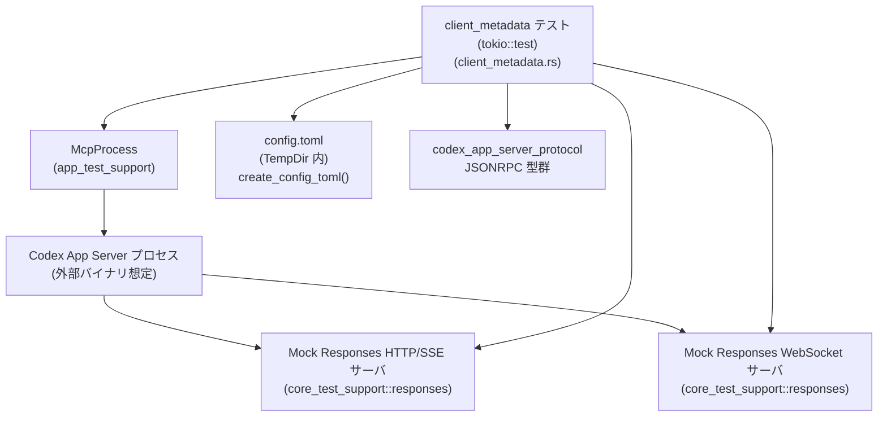
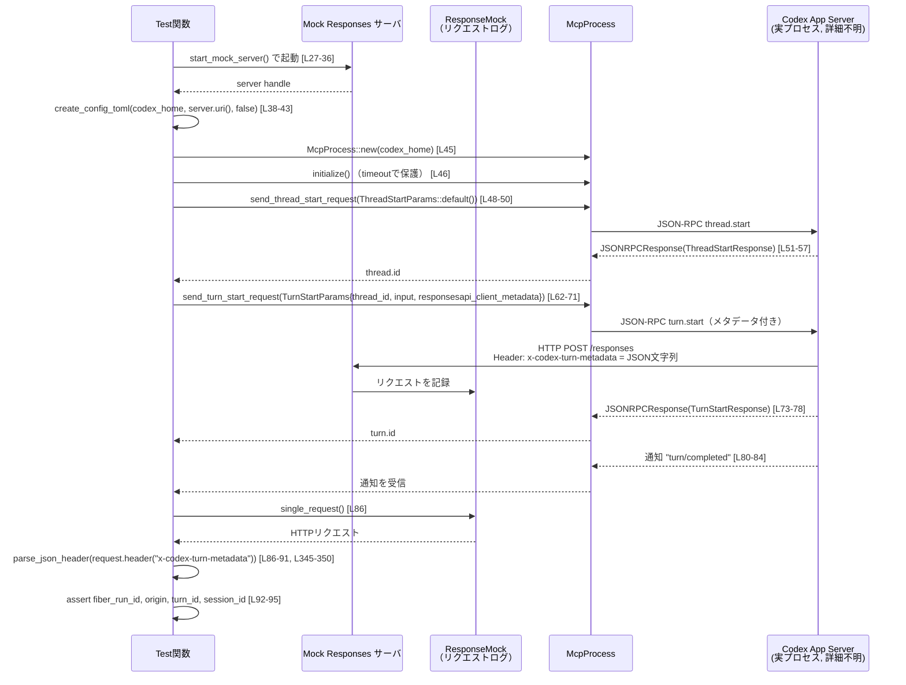

# app-server/tests/suite/v2/client_metadata.rs

## 0. ざっくり一言

v2 プロトコルのクライアントメタデータ（`responsesapi_client_metadata`）が、バックエンドの Responses API 呼び出しに正しく伝搬していることを、HTTP SSE と WebSocket 経由で検証する統合テスト群です。[根拠: client_metadata.rs:L23-98, L100-222, L224-315]

---

## 1. このモジュールの役割

### 1.1 概要

- このモジュールは、Codex アプリサーバ v2 クライアントが指定する `responsesapi_client_metadata` が、
  - HTTP(S)/SSE 経由では HTTP ヘッダ `x-codex-turn-metadata` として送信されること [根拠: client_metadata.rs:L86-95, L196-220]
  - WebSocket 経由では request body 中の `client_metadata["x-codex-turn-metadata"]` に JSON 文字列として埋め込まれること [根拠: client_metadata.rs:L290-311]
- さらに、`turn/steer` によるフォローアップリクエストではメタデータが更新されることを確認します。[根拠: client_metadata.rs:L140-181, L196-220]

### 1.2 アーキテクチャ内での位置づけ

このテストは、以下のコンポーネント間のやり取りをカバーしています。

- テストコード自身
- `core_test_support::responses` が提供するモック HTTP/SSE / WebSocket サーバ
- `app_test_support::McpProcess` が提供する Codex アプリサーバ クライアントプロセス
- `codex_app_server_protocol` の JSON-RPC 型（`ThreadStartParams` 等）



- テストは `TempDir` と `create_config_toml` で一時的な `config.toml` を生成し [根拠: client_metadata.rs:L38-43, L121-125, L242-247, L317-343]
- それを元に `McpProcess::new` で Codex アプリサーバプロセスを起動していると考えられます（詳細はこのチャンクには現れません）。[根拠: client_metadata.rs:L45, L127, L249]
- モックサーバは Responses API の振る舞いを模倣し、受信した HTTP/WebSocket リクエストをログとしてテスト側に返します。[根拠: client_metadata.rs:L27-36, L106-120, L229-241, L290-297]

### 1.3 設計上のポイント

- **非同期テスト**  
  - `#[tokio::test]` かつ `async fn` により、すべてのテストは Tokio ランタイム上で非同期に実行されます。[根拠: client_metadata.rs:L23, L100, L224]
- **ハング防止のためのタイムアウト**  
  - ネットワークまたは外部プロセス待ちに対して `tokio::time::timeout` を一貫して使用し、テストが無限にブロックしないようにしています。[根拠: client_metadata.rs:L21, L46, L51-55, L73-77, L80-84, L128-129, L133-137, L153-157, L161-165, L182-187, L190-194, L250-251, L255-259, L277-281, L284-288, L356-364]
- **設定ファイルの明示的生成**  
  - `create_config_toml` を通じて、モジュール内で使用するモックモデル設定を TOML として書き出します。[根拠: client_metadata.rs:L317-343]
- **メタデータの検証方法**  
  - HTTP/SSE の場合は `x-codex-turn-metadata` ヘッダ文字列を `parse_json_header` で JSON にデコードして検証。[根拠: client_metadata.rs:L86-91, L198-202, L210-213, L345-350]
  - WebSocket の場合は request body の `client_metadata["x-codex-turn-metadata"]` を同様に JSON として検証。[根拠: client_metadata.rs:L304-307]
- **フォローアップリクエストでのメタデータ更新**  
  - 最初の `turn/start` と後続の `turn/steer` で、Responses API 側に送出されるメタデータが切り替わることを 2 件のリクエストログ比較で確認します。[根拠: client_metadata.rs:L168-181, L196-220]

---

## 2. 主要な機能・コンポーネント一覧（インベントリ）

| 名前 | 種別 | 役割 / 用途 | 定義位置 |
|------|------|------------|----------|
| `DEFAULT_READ_TIMEOUT` | 定数 | 各種非同期操作（初期化・RPC 応答・通知待ち・リクエスト数待ち）のタイムアウト値（10 秒） | `client_metadata.rs:L21` |
| `turn_start_forwards_client_metadata_to_responses_request_v2` | 非同期テスト関数 | `turn/start` 実行時、HTTP Responses API リクエストの `x-codex-turn-metadata` ヘッダにクライアントメタデータが反映されることを検証 | `client_metadata.rs:L23-98` |
| `turn_steer_updates_client_metadata_on_follow_up_responses_request_v2` | 非同期テスト関数 | `turn/start` と `turn/steer` に対応する 2 件の Responses API リクエストで、`fiber_run_id` などのメタデータが更新されることを検証 | `client_metadata.rs:L100-222` |
| `turn_start_forwards_client_metadata_to_responses_websocket_request_body_v2` | 非同期テスト関数 | WebSocket 経由の Responses API 呼び出しにおいて、リクエストボディの `client_metadata` にクライアントメタデータが埋め込まれることを検証 | `client_metadata.rs:L224-315` |
| `create_config_toml` | 同期ヘルパ関数 | TempDir 内に Codex アプリサーバ用の `config.toml` を生成する | `client_metadata.rs:L317-343` |
| `parse_json_header` | 同期ヘルパ関数 | JSON 文字列を `serde_json::Value` にデコードし、パース失敗時は panic する | `client_metadata.rs:L345-350` |
| `wait_for_request_count` | 非同期ヘルパ関数 | モック Responses サーバのリクエストログ件数が所定値以上に達するまでポーリングし、全体にタイムアウトをかける | `client_metadata.rs:L352-365` |

---

## 3. 公開 API と詳細解説

### 3.1 型一覧（構造体・列挙体など）

このファイル内では新しい構造体や列挙体は定義されていません。すべて外部クレートの型を利用しています。

- `McpProcess`（`app_test_support`）や `ThreadStartParams` / `TurnStartParams` 等の詳細定義は、このチャンクには現れません。

### 3.2 関数詳細

#### `turn_start_forwards_client_metadata_to_responses_request_v2() -> Result<()>`

**概要**

HTTP Responses API（SSE）を用いた通常の `turn/start` 実行時に、クライアントメタデータが HTTP ヘッダ `x-codex-turn-metadata` として転送され、`turn_id` および `session_id` も含まれていることを検証する非同期テストです。[根拠: client_metadata.rs:L58-61, L86-95]

**引数**

- なし（`#[tokio::test]` によりテストランナーから直接呼ばれます）。

**戻り値**

- `anyhow::Result<()>`  
  - 途中の I/O や JSON-RPC 通信でエラーが発生した場合には `Err` を返し、テストが失敗します。[根拠: client_metadata.rs:L23, L38-46, L48-57, L62-78, L80-84]

**内部処理の流れ**

1. ネットワークが利用できない環境ではテスト全体をスキップします（マクロの詳細はこのチャンクにはありません）。[根拠: client_metadata.rs:L25]
2. モック Responses HTTP サーバを起動し、単一の SSE ストリームレスポンスをマウントします。[根拠: client_metadata.rs:L27-36]
3. 一時ディレクトリを作成し、その中に `create_config_toml` で config を生成します。`supports_websockets` は `false`。[根拠: client_metadata.rs:L38-43]
4. `McpProcess::new` で Codex アプリサーバプロセスを起動し、`initialize` をタイムアウト付きで待機します。[根拠: client_metadata.rs:L45-46]
5. `ThreadStartParams::default()` でスレッド開始を要求し、レスポンスから `thread.id` を取り出します。[根拠: client_metadata.rs:L48-57]
6. クライアントメタデータ（`fiber_run_id`, `origin`）を含む `TurnStartParams` を組み立てて `send_turn_start_request` を実行し、レスポンスから `turn.id` を取得します。[根拠: client_metadata.rs:L58-78]
7. `turn/completed` 通知が届くまでタイムアウト付きで待機します。[根拠: client_metadata.rs:L80-84]
8. `response_mock.single_request()` でモックサーバに到達した HTTP リクエストを 1 件取得し、`x-codex-turn-metadata` ヘッダを JSON としてパースして値を検証します。[根拠: client_metadata.rs:L86-95]

**Errors / Panics**

- `?` 演算子を通じて以下のエラーがそのまま `Err` として返ります。
  - 一時ディレクトリ作成失敗 (`TempDir::new`) [根拠: client_metadata.rs:L38]
  - config 書き込み失敗 (`create_config_toml`) [根拠: client_metadata.rs:L39-43]
  - MCP プロセスの起動・初期化・RPC 通信失敗 [根拠: client_metadata.rs:L45-46, L48-57, L62-78]
  - `timeout` によるタイムアウト (`Elapsed`) [根拠: client_metadata.rs:L46, L51-55, L73-77, L80-84]
- `parse_json_header` 内で JSON パースが失敗すると `panic!` します。[根拠: client_metadata.rs:L345-350, L86-91]
- `unwrap_or_else(|| panic!(...))` により、ヘッダが存在しない場合も panic します。[根拠: client_metadata.rs:L86-91]

**Edge cases（エッジケース）**

- **ヘッダ欠如**: `x-codex-turn-metadata` ヘッダが存在しない場合、`unwrap_or_else` の panic によりテストが強制失敗します。[根拠: client_metadata.rs:L86-91]
- **ヘッダが非 JSON**: 不正な JSON 文字列の場合、`parse_json_header` の `panic!` が発生します。[根拠: client_metadata.rs:L345-350]
- **metadata に `fiber_run_id` / `origin` が無い**: `as_str()` が `None` を返し、`assert_eq!(..., Some("..."))` に失敗します。[根拠: client_metadata.rs:L92-94]
- **`turn_id` / `session_id` 未設定**: 同様に `assert_eq!` または `assert!(metadata.get("session_id").is_some())` が失敗します。[根拠: client_metadata.rs:L94-95]

**使用上の注意点**

- 非同期テスト内でネットワークや外部プロセスに依存するため、タイムアウト値 `DEFAULT_READ_TIMEOUT` を変更するとテストの安定性に影響します。[根拠: client_metadata.rs:L21, L46, L51-55, L73-77, L80-84]
- メタデータのキー名（`fiber_run_id`, `origin`, `turn_id`, `session_id`）はこのテストに埋め込まれているため、プロトコル仕様を変更する場合は合わせて更新する必要があります。[根拠: client_metadata.rs:L58-61, L92-95]

---

#### `turn_steer_updates_client_metadata_on_follow_up_responses_request_v2() -> Result<()>`

**概要**

`turn/start` に続く `turn/steer` 呼び出しが、同じ turn に対するフォローアップ Responses API リクエストとして送出され、その際 `fiber_run_id` 等のクライアントメタデータが更新されていることを検証する非同期テストです。[根拠: client_metadata.rs:L140-181, L196-220]

**引数・戻り値**

- 引数: なし
- 戻り値: `anyhow::Result<()>`（途中の I/O・タイムアウト等で `Err` になり得ます）。

**内部処理の流れ**

1. ネットワーク利用可能性をチェックし、利用不可ならスキップ。[根拠: client_metadata.rs:L102]
2. `TempDir` と `create_config_toml` を利用して HTTP モックサーバ向け設定を作成。[根拠: client_metadata.rs:L104, L121-125]
3. モックサーバを起動し、**2 つの SSE レスポンス** を順番に返すよう設定。1 つ目には 2 秒の遅延を設定します。[根拠: client_metadata.rs:L106-120]
4. MCP プロセスを起動し、初期化。[根拠: client_metadata.rs:L127-129]
5. スレッド開始 (`send_thread_start_request`) → `thread.id` を取得。[根拠: client_metadata.rs:L130-138]
6. `start_metadata`（`fiber_run_id` のみ）を含む `turn/start` を送信し、`turn.id` を取得。[根拠: client_metadata.rs:L140-159]
7. `turn/started` 通知を待機し、その後 `wait_for_request_count(&request_log, 1)` で **最初の Responses API リクエストが送信されたこと** を確認。[根拠: client_metadata.rs:L161-167, L352-365]
8. `steer_metadata`（`fiber_run_id`, `origin`）を含む `turn/steer` を送信し、レスポンスを受け取る（内容は `_turn` として無視）。[根拠: client_metadata.rs:L168-188]
9. `turn/completed` 通知を待機。[根拠: client_metadata.rs:L190-194]
10. `request_log.requests()` から 2 件の HTTP リクエストを取得し、それぞれの `x-codex-turn-metadata` ヘッダ内容を比較します。[根拠: client_metadata.rs:L196-220]

**検証内容**

- リクエスト数が 2 件であること。[根拠: client_metadata.rs:L196-197]
- 1 件目:
  - `fiber_run_id == "fiber-start-123"`  
  - `turn_id == turn_id`（`turn/start` で取得した ID）  
  [根拠: client_metadata.rs:L198-207]
- 2 件目:
  - `fiber_run_id == "fiber-steer-456"`  
  - `origin == "gaas"`  
  - `turn_id == turn_id`（同一 turn に対するフォローアップであること）  
  [根拠: client_metadata.rs:L209-219]

**Errors / Panics**

- `wait_for_request_count` 内部で `timeout` によるタイムアウトが発生すると `Err` が返り、テストは失敗します。[根拠: client_metadata.rs:L166-167, L352-365]
- ヘッダの欠如・JSON 不正・期待キー欠如については、1 個目のテストと同様に `panic` または `assert` 失敗となります。[根拠: client_metadata.rs:L198-220, L345-350]

**Edge cases**

- 2 件のリクエストが発生しない場合（`requests.len() != 2`）には `assert_eq!(requests.len(), 2)` が失敗します。[根拠: client_metadata.rs:L196-197]
- `expected_turn_id` を `send_turn_steer_request` に渡しているため、ここが一致しない場合にどうなるかはこのチャンクには現れませんが、少なくともテスト側は正しい `turn_id` を渡しています。[根拠: client_metadata.rs:L172-181]

**使用上の注意点**

- フォローアップリクエストのメタデータの更新が仕様として重要である場合、追加のキーを増やすときにはこのテストを拡張するのが自然です。
- `wait_for_request_count` はポーリングでログ数を監視するため、必要以上に大きな `expected` 値を設定すると不要にテスト時間が延びます。[根拠: client_metadata.rs:L352-365]

---

#### `turn_start_forwards_client_metadata_to_responses_websocket_request_body_v2() -> Result<()>`

**概要**

WebSocket 対応の Responses API を使う場合に、クライアントメタデータが HTTP ヘッダではなく WebSocket request body の `client_metadata["x-codex-turn-metadata"]` として渡されることを検証する非同期テストです。[根拠: client_metadata.rs:L229-241, L262-274, L290-311]

**内部処理の流れ**

1. ネットワーク利用可否のチェック。[根拠: client_metadata.rs:L227]
2. モック WebSocket Responses サーバを起動し、2 つの request を返すよう定義します（warmup + 本処理）。[根拠: client_metadata.rs:L229-240, L290-297]
3. `TempDir` と `create_config_toml` で `supports_websockets = true` の設定を作成。`ws://` を `http://` に置き換えた URI を base_url に使用します。[根拠: client_metadata.rs:L242-247]
4. MCP プロセスを起動・初期化。[根拠: client_metadata.rs:L249-251]
5. スレッド開始 → `thread.id` 取得。[根拠: client_metadata.rs:L252-260]
6. `client_metadata`（`fiber_run_id`, `origin`）を含む `turn/start` を送信し、`turn.id` を取得。[根拠: client_metadata.rs:L262-282]
7. `turn/completed` 通知を待機。[根拠: client_metadata.rs:L284-288]
8. WebSocket サーバの `wait_for_request` を用いて 2 つの request body を取得（warmup と本処理）。[根拠: client_metadata.rs:L290-297]
9. warmup request の型やフラグを検証し、本処理 request について:
   - `type == "response.create"`
   - `previous_response_id == "warm-1"`
   - `client_metadata["x-codex-turn-metadata"]` の JSON 文字列から `fiber_run_id`, `origin`, `turn_id`, `session_id` を検証  
   [根拠: client_metadata.rs:L299-312]
10. WebSocket サーバを shutdown。[根拠: client_metadata.rs:L313]

**Errors / Panics とエッジケース**

- ヘッダではなく body 中を検証している点以外は、前述のテストと同様に `timeout` のタイムアウト・JSON パース失敗・キー欠如・`assert` 失敗時にテストが失敗または panic します。[根拠: client_metadata.rs:L277-281, L284-288, L304-307, L299-303]
- warmup リクエストの `generate == false` という条件も明示的に検証しており、ここが変わった場合もテストが失敗します。[根拠: client_metadata.rs:L299-300]

**使用上の注意点**

- WebSocket 経由のクライアントメタデータはヘッダではなく body の JSON 文字列に載る前提をテストが固定しています。この仕様を変更する場合は本テストの修正が必要です。

---

#### `create_config_toml(codex_home: &Path, server_uri: &str, supports_websockets: bool) -> std::io::Result<()>`

**概要**

テスト用の Codex アプリサーバ設定ファイル `config.toml` を指定ディレクトリに生成します。Responses API 向けのモックプロバイダ設定が含まれます。[根拠: client_metadata.rs:L317-343]

**引数**

| 引数名 | 型 | 説明 |
|--------|----|------|
| `codex_home` | `&Path` | `config.toml` を生成するルートディレクトリ。通常は `TempDir::path()`。 |
| `server_uri` | `&str` | モック Responses サーバのベース URI (`http://...`)。`/v1` が付加されます。 |
| `supports_websockets` | `bool` | モックプロバイダが WebSocket をサポートするかどうか。TOML の `supports_websockets` にそのまま書き込まれます。 |

**戻り値**

- `std::io::Result<()>`  
  - ファイル作成または書き込みに失敗すると `Err(std::io::Error)` が返ります。[根拠: client_metadata.rs:L322-342]

**内部処理の流れ**

1. `codex_home.join("config.toml")` で出力パスを決定。[根拠: client_metadata.rs:L322]
2. `format!` と原文文字列（raw string literal）を用いて TOML コンテンツを生成。[根拠: client_metadata.rs:L324-341]
3. `std::fs::write` でファイルに書き込み、その `Result` をそのまま返します。[根拠: client_metadata.rs:L322-342]

**Examples（使用例）**

テスト内では次のように使用されています。

```rust
let codex_home = TempDir::new()?;                                           // 一時ディレクトリを作成
create_config_toml(
    codex_home.path(),                                                      // &Path
    &server.uri(),                                                          // モックサーバの URI
    /*supports_websockets*/ false,                                          // WebSocket 非対応
)?;                                                                         // I/O エラーはテストの Err として伝播
```

[根拠: client_metadata.rs:L38-43, L121-125, L242-247]

**Errors / Panics**

- `std::fs::write` が失敗した場合、呼び出し元が `?` を付けていればテスト全体が `Err` で終了します。
- 本関数内での `panic` はありません。

**Edge cases**

- 指定ディレクトリが存在しない／書き込み不可の場合、`std::io::Error` が返ります。
- `server_uri` にスラッシュ末尾があるかどうかに関するガードはなく、そのまま `"{server_uri}/v1"` となります。URI の正当性は呼び出し元側で担保する必要があります。

**使用上の注意点**

- テストの再現性のため、実運用用の設定と混ざらないように必ず `TempDir` などの一時ディレクトリを使う前提となっています（このファイルの使い方から分かる範囲）。[根拠: client_metadata.rs:L38, L104, L242]

---

#### `parse_json_header(value: &str) -> serde_json::Value`

**概要**

HTTP ヘッダや WebSocket body に含まれる JSON 文字列を `serde_json::Value` にデコードする小さなヘルパ関数です。パースに失敗すると panic します。[根拠: client_metadata.rs:L345-350]

**引数**

| 引数名 | 型 | 説明 |
|--------|----|------|
| `value` | `&str` | JSON テキスト。 |

**戻り値**

- `serde_json::Value`  
  - JSON の構造を保持する汎用的な値オブジェクト（オブジェクト・配列・文字列など）。

**内部処理の流れ**

1. `serde_json::from_str(value)` を呼び出し、`match` で成否を判定。[根拠: client_metadata.rs:L346-347]
2. 成功 (`Ok(value)`) の場合はそのまま返却。
3. 失敗 (`Err(err)`) の場合は `panic!("metadata header should be valid json: {err}")` を実行。[根拠: client_metadata.rs:L348-349]

**Examples（使用例）**

```rust
let metadata = request
    .header("x-codex-turn-metadata")
    .as_deref()
    .map(parse_json_header)                                 // &str を serde_json::Value に変換
    .unwrap_or_else(|| panic!("missing x-codex-turn-metadata header"));
```

[根拠: client_metadata.rs:L86-91]

**Errors / Panics**

- 不正な JSON が渡された場合、必ず panic します。
- テストコード中のみで使用されており、失敗は「仕様違反（またはバグ）」として扱うための挙動です。

**Edge cases**

- `value` が空文字列や `null` 等であっても、`serde_json` が正しくパースできるなら問題ありません。
- JSON のトップレベル型（オブジェクトか配列かなど）に制約はありませんが、テスト側は `metadata["fiber_run_id"]` のようにオブジェクト前提でアクセスしています。[根拠: client_metadata.rs:L92-95, L203-207, L214-219]

**使用上の注意点**

- プロダクションコードで使う場合は `panic` ではなく `Result` を返した方が安全ですが、本ファイルはテスト専用のため即座に失敗させる設計になっています。

---

#### `wait_for_request_count(request_log: &core_test_support::responses::ResponseMock, expected: usize) -> Result<()>`

**概要**

Responses モックサーバのリクエストログ件数が `expected` 以上になるまで、短いスリープをはさみつつポーリングする非同期ヘルパ関数です。全体に `DEFAULT_READ_TIMEOUT` のタイムアウトがかかっています。[根拠: client_metadata.rs:L352-365]

**引数**

| 引数名 | 型 | 説明 |
|--------|----|------|
| `request_log` | `&core_test_support::responses::ResponseMock` | リクエストログへの参照。`requests()` メソッドで Vec 的なコレクションを返す想定です（詳細はこのチャンクには現れません）。 |
| `expected` | `usize` | 待機対象となる最小リクエスト件数。 |

**戻り値**

- `anyhow::Result<()>`  
  - 期待件数に達する前に全体のタイムアウトが発生すると `Err` が返ります。[根拠: client_metadata.rs:L352-365]

**内部処理の流れ**

1. `timeout(DEFAULT_READ_TIMEOUT, async { ... })` で内側の非同期ループにタイムアウトを設定。[根拠: client_metadata.rs:L356-364]
2. 内側のループで `request_log.requests().len()` をチェックし、`>= expected` なら `return`（`()`）する。[根拠: client_metadata.rs:L357-360]
3. そうでなければ `tokio::time::sleep(10ms)` で少し待って再チェック。[根拠: client_metadata.rs:L361-362]
4. タイムアウトエラーが出れば `?` により関数全体が `Err` で終了します。[根拠: client_metadata.rs:L364]

**Examples（使用例）**

```rust
wait_for_request_count(&request_log, /*expected*/ 1).await?; // 最低 1 件のリクエストを待つ
```

[根拠: client_metadata.rs:L166]

**Errors / Panics**

- 内部では `panic` は使用していません。
- `timeout` が `Err(tokio::time::error::Elapsed)` を返した場合、`?` によりテスト関数にエラーとして伝播し、テストは失敗します。

**Edge cases**

- `expected == 0` の場合、ループに入る前に条件を満たしているかどうかはコードからは明示されていませんが、このファイルでは常に 1 以上が渡されています。[根拠: client_metadata.rs:L166]
- `requests()` の実装がスレッドセーフかどうかはこのチャンクからは分かりませんが、ここでは参照読み取りのみを行っています。

**使用上の注意点**

- ポーリング間隔は 10ms に固定であり、環境によってはもう少し長くして CPU 使用率を下げることも検討可能です（ただし、このファイル自体はテスト専用であり、短い間隔でも現実的です）。[根拠: client_metadata.rs:L361-362]

---

### 3.3 その他の関数

- このファイルには、上記以外の補助的な関数は定義されていません。

---

## 4. データフロー

ここでは、最初のテスト `turn_start_forwards_client_metadata_to_responses_request_v2` における代表的なデータフローを示します。

1. テストコードがモック Responses サーバを起動し、`config.toml` を生成する。
2. `McpProcess` が `config.toml` を参照して Codex アプリサーバプロセスを起動する（詳細はこのチャンクにはありません）。
3. クライアントメタデータを含む `turn/start` JSON-RPC リクエストが MCP プロセス経由でアプリサーバに送信される。
4. アプリサーバは Responses API に HTTP リクエストを送り、そのヘッダ `x-codex-turn-metadata` にメタデータ（JSON 文字列）を載せる。
5. モックサーバが受信したリクエストをログし、テストがヘッダを取り出して JSON として検証する。



WebSocket テストでは、Responses API 呼び出しが HTTP ヘッダではなく WebSocket メッセージ（JSON ボディ）として送受信される点のみが異なります。[根拠: client_metadata.rs:L229-241, L290-311]

---

## 5. 使い方（How to Use）

### 5.1 基本的な使用方法（このモジュールのパターン）

このモジュールは「Codex アプリサーバ + Responses API 統合」のテストパターンを示しています。新しいテストを追加する場合も、概ね次の流れに従うと一貫性が保てます。

```rust
// 1. ネットワーク利用可否チェック
skip_if_no_network!(Ok(()));                                            // [L25, L102, L227]

// 2. モックサーバ起動（HTTP または WebSocket）
let server = responses::start_mock_server().await;                      // HTTP/SSE [L27, L106]
let websocket_server = responses::start_websocket_server(...).await;    // WebSocket [L229-241]

// 3. 一時ディレクトリと config.toml を準備
let codex_home = TempDir::new()?;                                       // [L38, L104, L242]
create_config_toml(
    codex_home.path(),
    &server.uri(),                                                      // or websocket_server.uri()
    /*supports_websockets*/ false,                                      // or true
)?;

// 4. McpProcess を起動し、初期化
let mut mcp = McpProcess::new(codex_home.path()).await?;                // [L45, L127, L249]
timeout(DEFAULT_READ_TIMEOUT, mcp.initialize()).await??;                // [L46, L128, L250]

// 5. thread.start → turn.start/turn.steer でシナリオを構成
let thread_req = mcp
    .send_thread_start_request(ThreadStartParams::default())
    .await?;
let thread_resp: JSONRPCResponse = timeout(
    DEFAULT_READ_TIMEOUT,
    mcp.read_stream_until_response_message(RequestId::Integer(thread_req)),
)
.await??;
let ThreadStartResponse { thread, .. } =
    to_response::<ThreadStartResponse>(thread_resp)?;                   // [L48-57]

// ... クライアントメタデータを含む turn.start / turn.steer を送信し、
// Responses サーバへのヘッダ or body に反映されていることを検証 ...
```

### 5.2 よくある使用パターン

- **HTTP/SSE パターン**
  - `responses::start_mock_server` + `responses::mount_sse_once` または `mount_response_sequence`。[根拠: client_metadata.rs:L27-36, L106-120]
  - ヘッダ `x-codex-turn-metadata` を通じてメタデータを検査。
- **WebSocket パターン**
  - `responses::start_websocket_server` でモック WebSocket サーバを起動し、`wait_for_request` で送信された JSON メッセージを直接検査。[根拠: client_metadata.rs:L229-241, L290-297]
- **フォローアップ（turn.steer）パターン**
  - 最初のレスポンス/通知が届くまで待ち (`wait_for_request_count` や通知待ち)、その後 `turn/steer` を呼び出して 2 回目のリクエストとの違いを比較。[根拠: client_metadata.rs:L161-167, L168-181, L196-220]

### 5.3 よくある間違い（このコードから推測できる注意点）

このファイルのテストの書き方から、次のような誤用が起こり得ることが読み取れます。

```rust
// 間違い例: config.toml を作らずに McpProcess::new() を呼ぶ
let codex_home = TempDir::new()?;
let mut mcp = McpProcess::new(codex_home.path()).await?; // 設定不足の可能性

// 正しいパターン: 事前に create_config_toml を呼び出す
let codex_home = TempDir::new()?;
create_config_toml(codex_home.path(), &server.uri(), false)?; // [L38-43]
let mut mcp = McpProcess::new(codex_home.path()).await?;      // [L45]
```

- このファイルでは **必ず** `create_config_toml` を先に呼んでから `McpProcess::new` を呼んでいます。逆順にするとどのような挙動になるかはこのチャンクにはありませんが、少なくともテストでは前者を前提にしています。[根拠: client_metadata.rs:L38-46, L121-129, L242-251]
- `timeout` を使わずに `read_stream_until_response_message` 等を待つと、条件を満たさない場合にテストが無限にハングする可能性があります。本ファイルではすべてタイムアウト付きで呼び出しているため、同じパターンを踏襲するのが安全です。[根拠: client_metadata.rs:L46, L51-55, L73-77, L80-84, L128-129, L133-137, L153-157, L161-165, L182-187, L190-194, L250-251, L255-259, L277-281, L284-288]

### 5.4 使用上の注意点（まとめ）

- **ネットワーク依存**: `skip_if_no_network!` を使用していることから、環境によってはネットワークが利用できずにテストがスキップされることがあります。[根拠: client_metadata.rs:L25, L102, L227]
- **タイムアウト**: `DEFAULT_READ_TIMEOUT` は 10 秒に固定されています。遅い環境で頻繁にタイムアウトが起きる場合、この値の調整が必要になる可能性があります。[根拠: client_metadata.rs:L21]
- **panic ベースのバリデーション**: `parse_json_header` や `unwrap_or_else(|| panic!(...))` により、メタデータが仕様通りでない場合には即座に panic で失敗させています。これはテストコードとしては妥当ですが、プロダクションコードでは別の扱いが必要です。[根拠: client_metadata.rs:L86-91, L198-202, L210-213, L345-350]
- **メタデータのキー名**: テストが `fiber_run_id`, `origin`, `turn_id`, `session_id` というキーに依存しているため、プロトコルのキー名変更時にはテストも同時に更新する必要があります。[根拠: client_metadata.rs:L58-61, L92-95, L140-141, L168-171, L262-265, L308-311]

---

## 6. 変更の仕方（How to Modify）

### 6.1 新しい機能（テストケース）を追加する場合

1. **シナリオの選定**
   - 新たに検証したいメタデータのキーや振る舞い（例: セッションの再開、異常系など）を決めます。
2. **既存テストのパターンをコピー**
   - HTTP/SSE なら `turn_start_forwards_client_metadata_to_responses_request_v2`、WebSocket なら `turn_start_forwards_client_metadata_to_responses_websocket_request_body_v2` をベースに関数を複製すると構造が分かりやすくなります。[根拠: client_metadata.rs:L23-98, L224-315]
3. **モックレスポンスの変更**
   - `responses::mount_sse_once` や `mount_response_sequence`、`start_websocket_server` のシナリオを変更して、必要なイベントや回数に合わせます。[根拠: client_metadata.rs:L27-36, L106-120, L229-241]
4. **メタデータの作成・送信**
   - `HashMap::from` で新しいキーを追加し、`TurnStartParams` / `TurnSteerParams` の `responsesapi_client_metadata` に渡します。[根拠: client_metadata.rs:L58-61, L140-141, L168-171, L262-265]
5. **検証ロジックの追加**
   - HTTP の場合はヘッダ、WebSocket の場合は body からメタデータを取り出し、`parse_json_header` でパースして `assert_eq!` を追加します。[根拠: client_metadata.rs:L86-95, L198-220, L304-311]

### 6.2 既存の機能（挙動）を変更する場合

- **メタデータのフォーマット（キー名や JSON 構造）の変更**
  - 影響範囲:
    - 本ファイル内の `assert_eq!` / `metadata["..."]` アクセス部。[根拠: client_metadata.rs:L92-95, L203-207, L214-219, L308-311]
    - 他の v2 関連テストファイル（このチャンクには現れません）。
  - 変更時には、`parse_json_header` の戻り値の扱いを含めて見直す必要があります。
- **Responses API への伝送方式（ヘッダ vs body）を変更する場合**
  - HTTP/SSE テストではヘッダ `x-codex-turn-metadata` に依存し、WebSocket テストでは body の `client_metadata["x-codex-turn-metadata"]` に依存しています。[根拠: client_metadata.rs:L86-91, L198-202, L210-213, L304-307]
  - この仕様を変更する場合、両テストを新しい仕様に合わせて書き換える必要があります。
- **タイムアウト時間の変更**
  - `DEFAULT_READ_TIMEOUT` の値を変更すると、`timeout` を使う全ての箇所に影響します。[根拠: client_metadata.rs:L21, L46, L51-55, L73-77, L80-84, L128-129, L133-137, L153-157, L161-165, L182-187, L190-194, L250-251, L255-259, L277-281, L284-288, L356-364]
  - 短すぎるとフレーク（不安定テスト）が増え、長すぎると失敗検出まで時間がかかります。

---

## 7. 関連ファイル・モジュール

このモジュールと密接に関係する外部モジュール（このチャンクには定義がありません）をまとめます。

| パス / モジュール名 | 役割 / 関係 |
|---------------------|------------|
| `app_test_support::McpProcess` | Codex アプリサーバプロセスの起動・JSON-RPC メッセージ送受信を行うテスト用クライアント。`send_thread_start_request`, `send_turn_start_request`, `send_turn_steer_request` などを提供します。[根拠: client_metadata.rs:L2, L45, L48-50, L62-71, L130-132, L143-151, L172-181, L249, L252-254, L267-275] |
| `app_test_support::to_response` | `JSONRPCResponse` から型付きレスポンス（`ThreadStartResponse`, `TurnStartResponse`, `TurnSteerResponse`）を取り出すヘルパ関数。[根拠: client_metadata.rs:L3, L56-57, L138, L158-159, L188-189, L260-261, L282] |
| `core_test_support::responses` | モック Responses API サーバ（HTTP/SSE & WebSocket）と、そのリクエストログ型 `ResponseMock`、SSE/WebSocket イベント生成ヘルパを提供します。[根拠: client_metadata.rs:L13, L27-36, L106-120, L118-119, L229-241, L290-297, L352-354] |
| `core_test_support::skip_if_no_network` | ネットワーク未利用環境でテストをスキップするマクロ。[根拠: client_metadata.rs:L14, L25, L102, L227] |
| `codex_app_server_protocol` | JSONRPC ベースの v2 プロトコル型（`ThreadStartParams`, `ThreadStartResponse`, `TurnStartParams`, `TurnStartResponse`, `TurnSteerParams`, `TurnSteerResponse`, `UserInput`, `JSONRPCResponse`, `RequestId`）を定義するクレート。[根拠: client_metadata.rs:L4-12, L48-50, L56-57, L62-71, L73-78, L130-132, L138, L143-151, L153-159, L172-181, L182-189, L252-254, L260-261, L267-275, L277-282] |

これらのモジュールの内部実装はこのチャンクには現れませんが、本ファイルのテストコードが仕様を前提としているため、変更時には同時に確認する必要があります。
