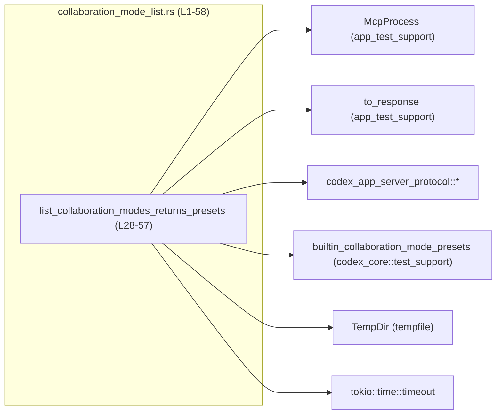
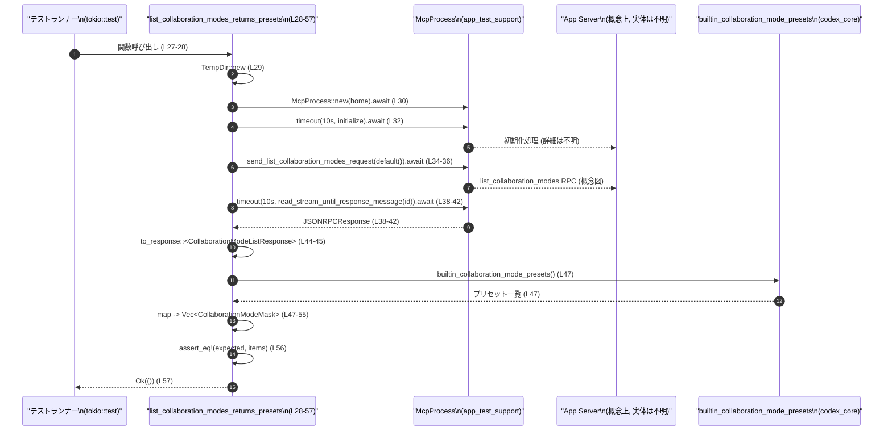

# app-server/tests/suite/v2/collaboration_mode_list.rs

## 0. ざっくり一言

コラボレーションモード一覧エンドポイントが、組み込みのデフォルトプリセットを **期待した順序・内容で返すこと** を検証する非同期統合テストです。  
（根拠: ファイル先頭ドキュメンテーションコメントと関数コメントおよび本体  
`app-server/tests/suite/v2/collaboration_mode_list.rs:L1-5, L26-27, L44-56`）

---

## 1. このモジュールの役割

### 1.1 概要

- MCP ハーネス（`McpProcess`）を通じてアプリケーションサーバーを起動・初期化し、  
  「コラボレーションモード一覧」JSON-RPC エンドポイントにリクエストを送信します。  
  （根拠: `McpProcess` の利用とコメント  
  `L3-4, L29-32, L34-42`）
- レスポンスを `CollaborationModeListResponse` としてパースし、  
  `builtin_collaboration_mode_presets` が返すプリセット一覧と 1 対 1 に対応し、  
  かつ順序も一致することを `assert_eq!` で検証します。  
  （根拠: `L44-56`）

### 1.2 アーキテクチャ内での位置づけ

このテストは「サーバープロトコル層」と「MCP 経由のプロセス起動」を横断的に検証する位置づけにあります。

主な依存関係:

- テストハーネス:
  - `app_test_support::McpProcess`（MCP 経由でサーバープロセスを制御）`L12`
  - `app_test_support::to_response`（JSONRPCResponse → 型付きレスポンスへの変換）`L13`
- プロトコル定義:
  - `codex_app_server_protocol::{CollaborationModeListParams, CollaborationModeListResponse, CollaborationModeMask, JSONRPCResponse, RequestId}` `L14-18`
- 期待値ソース:
  - `codex_core::test_support::builtin_collaboration_mode_presets` `L19`
- 実行環境:
  - `tokio::time::timeout` と `#[tokio::test]` による非同期テスト `L22, L27-28`
  - `tempfile::TempDir` による一時ディレクトリ `L21, L29`

これを簡略な依存関係図で表します。



外部型・関数（`McpProcess` など）の内部実装や正確なファイルパスは、このチャンクには現れません。

### 1.3 設計上のポイント

- **非同期テスト + タイムアウト**  
  - `#[tokio::test]` で非同期テストとして定義され、すべての外部 I/O は `async`/`await` で行われます。`tokio::time::timeout` により各ステップに 10 秒のタイムアウトを設けています。  
    （根拠: `L22, L24, L27-28, L32, L38-42`）
- **エラー伝播の一元化 (`anyhow::Result`)**  
  - テスト関数は `anyhow::Result<()>` を返し、`?`/`??` でエラーを早期リターンする構造です。  
    （根拠: `L11, L28, L29-32, L34-42, L44-45`）
- **JSON-RPC ベースの疎結合な検証**  
  - テストは JSONRPC レスポンスをジェネリックな `JSONRPCResponse` 型で受信し、`to_response::<CollaborationModeListResponse>` で型付きに変換しています。  
    （根拠: `L17, L38-45`）
- **API 契約を「プリセット定義」と同期**  
  - サーバーから返るモード一覧が `builtin_collaboration_mode_presets`（テストサポート側の定義）と完全一致することをチェックしており、API 契約を一箇所に集約しています。  
    （根拠: コメントと `L19, L47-56`）

---

## 2. 主要な機能一覧

- コラボレーションモード一覧 API 呼び出し: MCP ハーネス経由で `list_collaboration_modes` RPC を呼び出し、レスポンスを取得する。
- JSON-RPC レスポンスのパース: `JSONRPCResponse` を `CollaborationModeListResponse` に変換する。
- デフォルトプリセットとの比較: `builtin_collaboration_mode_presets` の内容を `CollaborationModeMask` に写像して期待値を構築し、レスポンスと完全一致することを検証する。

### コンポーネントインベントリー（本チャンク）

| 名前 | 種別 | 役割 / 用途 | 定義位置 |
|------|------|------------|---------|
| `DEFAULT_TIMEOUT` | 定数 (`Duration`) | 各非同期操作に適用する 10 秒のタイムアウト値 | `app-server/tests/suite/v2/collaboration_mode_list.rs:L24` |
| `list_collaboration_modes_returns_presets` | 非公開関数（`#[tokio::test]`） | コラボレーションモード一覧 API がデフォルトプリセットを安定した順序で返すことを検証する | `app-server/tests/suite/v2/collaboration_mode_list.rs:L27-57` |

---

## 3. 公開 API と詳細解説

このファイル自体はテスト用であり、ライブラリ的な公開 API は定義していません。  
以下ではテスト関数を「利用されるエントリポイント」として扱い、詳細を整理します。

### 3.1 型一覧（構造体・列挙体など）

このファイル内で新たな構造体や列挙体は定義されていません。  
利用している外部型はすべて他クレート由来であり、詳細な構造はこのチャンクには現れません。

主な外部型（概要のみ、詳細は不明）:

| 名前 | 所属クレート | 種別 | このファイル内での役割 | 根拠 |
|------|-------------|------|------------------------|------|
| `McpProcess` | `app_test_support` | 構造体と推測 | MCP 経由でアプリサーバーを起動・操作するハーネスとして利用 | 型利用のみ `L12, L30-32, L34-41` |
| `CollaborationModeListParams` | `codex_app_server_protocol` | 構造体と推測 | list API 呼び出しのパラメータ（ここでは `default()`） | `L14, L35-36` |
| `CollaborationModeListResponse` | 同上 | 構造体と推測 | list API のレスポンス型。`data` フィールドから `items` を取り出す。 | `L15, L44-45` |
| `CollaborationModeMask` | 同上 | 構造体と推測 | 比較用の期待値として利用するプリセットの表現 | `L16, L47-53` |
| `JSONRPCResponse` | 同上 | 構造体/列挙体と推測 | 生の JSON-RPC レスポンス表現 | `L17, L38-39` |
| `RequestId` | 同上 | 列挙体と推測 | JSON-RPC の request ID。ここでは `Integer` バリアントを使用。 | `L18, L40` |
| `TempDir` | `tempfile` | 構造体 | 一時ディレクトリのライフサイクル管理 | `L21, L29` |
| `Duration` | `std::time` | 構造体 | タイムアウト時間の指定 | `L9, L24` |

※ 種別は型名と一般的な慣習からの推測であり、正確な定義はこのチャンクには現れません。

### 3.2 関数詳細

#### `list_collaboration_modes_returns_presets() -> Result<()>`

**概要**

- 非同期テストとして実行され、コラボレーションモード一覧エンドポイントが  
  「組み込みプリセットの一覧」と完全一致する JSON-RPC レスポンスを返すことを検証します。  
  （根拠: `L26-27, L34-42, L44-56`）

**属性 / 実行環境**

- `#[tokio::test]` により Tokio ランタイム上で非同期テストとして実行されます。  
  （根拠: `L27`）

**引数**

- 引数は取りません。テスト名でテストフレームワークから直接呼び出されます。  
  （根拠: `L28`）

**戻り値**

- 型: `anyhow::Result<()>`（`use anyhow::Result;`）`L11, L28`  
- 意味:
  - `Ok(())` の場合: テストロジックがエラーなく完了し、かつ `assert_eq!` がすべて通過したことを示します。
  - `Err(_)` の場合: 初期化・RPC 呼び出し・レスポンスパースなどのいずれかのステップでエラーが発生したことを示します。

**内部処理の流れ（アルゴリズム）**

1. **一時ディレクトリの作成**  
   - `TempDir::new()?` で一時ディレクトリを作成し、そのパスを `codex_home` として保持します。  
     （根拠: `L29`）

2. **MCP プロセスハーネスの起動**  
   - `McpProcess::new(codex_home.path()).await?` により、上記ディレクトリをホームとして MCP プロセスを起動し、`mcp` を取得します。  
     （根拠: `L30`）

3. **MCP 初期化の実行（タイムアウト付き）**  
   - `timeout(DEFAULT_TIMEOUT, mcp.initialize()).await??;` を実行します。  
     - `timeout` により 10 秒（`DEFAULT_TIMEOUT`）以内に `initialize` が完了しなければタイムアウトエラーとなります。  
     - `await` の結果は `Result<Result<_, _>, _>` のような二重の `Result` になっていると推測され、`??` で二段階のエラーを伝播します。  
     （根拠: `L24, L32`）

4. **リクエスト送信**  
   - `CollaborationModeListParams::default()` をパラメータとして  
     `mcp.send_list_collaboration_modes_request(...).await?` を呼び、`request_id` を取得します。  
     （根拠: `L34-36`）

5. **レスポンス受信（タイムアウト付き）**  
   - `timeout(DEFAULT_TIMEOUT, mcp.read_stream_until_response_message(RequestId::Integer(request_id))).await??` を実行し、  
     指定した JSON-RPC `RequestId` に対応するレスポンスが来るまで待ちます。  
   - 結果を `JSONRPCResponse` 型として `response` 変数に束縛します。  
     （根拠: `L38-42`）

6. **型付きレスポンスへの変換**  
   - `to_response::<CollaborationModeListResponse>(response)?` を呼び、レスポンスを `CollaborationModeListResponse { data: items }` にパターンマッチしながら取り出します。  
     - `data` フィールドだけを `items` として取得しています。  
     （根拠: `L44-45`）

7. **期待値の構築**  
   - `builtin_collaboration_mode_presets()` でプリセット一覧を取得し、  
     各 `preset` を `CollaborationModeMask` に変換して `Vec<CollaborationModeMask>` を生成します。  
   - フィールドは `name`, `mode`, `model`, `reasoning_effort` をそのままコピーしています。  
     （根拠: `L47-55`）

8. **比較とテスト終了**  
   - `assert_eq!(expected, items);` で、サーバーから返った `items` と期待値 `expected` の完全一致（要素と順序）を検証します。  
   - 最後に `Ok(())` を返してテストを終了します。  
     （根拠: `L56-57`）

処理の流れをシーケンス図で表します。



※ `Server` はコード上に直接は現れませんが、コメントと `McpProcess` の用途からの概念的な存在です（推測であり、実装はこのチャンクには現れません）。

**Examples（使用例）**

この関数はテストフレームワークから自動実行されるため、通常の関数のように手動で呼び出すことはありません。  
テストとしての「使用例」は、`cargo test` による起動になります。

```bash
# ワークスペースで全テストとともに実行
cargo test

# このテストファイルだけに絞る例（モジュール構成に依存。名称は一例）
cargo test list_collaboration_modes_returns_presets
```

あるいは、同様のパターンで別エンドポイントをテストする場合の雛形は次のようになります。

```rust
#[tokio::test] // 非同期テスト
async fn list_some_resource_returns_expected_items() -> anyhow::Result<()> {
    let home = tempfile::TempDir::new()?;                           // 一時ディレクトリ作成
    let mut mcp = app_test_support::McpProcess::new(home.path()).await?; // MCP プロセス起動

    tokio::time::timeout(DEFAULT_TIMEOUT, mcp.initialize()).await??;    // 初期化（タイムアウト付き）

    let request_id = mcp
        .send_list_some_resource_request(Default::default())      // エンドポイント固有のリクエスト送信
        .await?;

    let response = tokio::time::timeout(
        DEFAULT_TIMEOUT,
        mcp.read_stream_until_response_message(
            codex_app_server_protocol::RequestId::Integer(request_id),
        ),
    )
    .await??;                                                      // レスポンス待機（タイムアウト付き）

    let codex_app_server_protocol::SomeListResponse { data: items } =
        app_test_support::to_response::<codex_app_server_protocol::SomeListResponse>(response)?; // 型付きレスポンスへの変換

    let expected = /* 期待値の構築 */;                             // 期待値ベクタの構築
    pretty_assertions::assert_eq!(expected, items);               // 完全一致を検証
    Ok(())
}
```

**Errors / Panics**

この関数は `panic` を直接発生させていませんが、以下のケースで `Err` もしくはアサーション失敗が発生し、テストは失敗します。

- `TempDir::new()` が失敗した場合 `?` により `Err` を返します。`L29`
- `McpProcess::new` がエラーを返した場合 `?` により `Err` を返します。`L30`
- `timeout(DEFAULT_TIMEOUT, mcp.initialize()).await` が
  - タイムアウトした場合、または
  - 内部の `initialize()` が `Err` を返した場合  
  `??` により `Err` を返します。`L32`
- `send_list_collaboration_modes_request` がエラーの場合 `?` で伝播します。`L34-36`
- `read_stream_until_response_message` または `timeout` がエラーの場合 `??` で伝播します。`L38-42`
- `to_response::<CollaborationModeListResponse>(response)` が
  - JSON-RPC エラー
  - 型不整合  
  などでエラーを返した場合 `?` で伝播します。`L44-45`
- `builtin_collaboration_mode_presets()` 呼び出しがエラーを返す可能性は、このチャンクからは分かりません（戻り値型が不明）。`L47`
- `assert_eq!(expected, items)` が不一致を検出した場合、マクロにより `panic!` 相当が発生しテストが失敗します。`L56`

**Edge cases（エッジケース）**

この関数が意識している（または結果としてカバーする）エッジケース:

- **サーバーが応答しない / 初期化が終わらない**  
  - 10 秒以内に `initialize()` やレスポンス受信が終わらない場合、`timeout` によりタイムアウトエラーになりテスト失敗。  
    （根拠: `L24, L32, L38-42`）
- **レスポンスが空・欠落している場合**  
  - `read_stream_until_response_message` が該当レスポンスを見つけられない場合の挙動はこのチャンクには現れませんが、想定外の形式のレスポンスであれば `to_response` でエラーになり得ます。`L38-45`
- **プリセットの順序変更**  
  - サーバー側のプリセット順序が `builtin_collaboration_mode_presets()` と異なる場合、`assert_eq!` が失敗し、順序の不一致を検出します。`L47-56`
- **プリセットの内容変更**  
  - `name`, `mode`, `model`, `reasoning_effort` のいずれかのフィールド値が変わっていれば、不一致として検出されます。`L49-53`

**使用上の注意点**

- **テストのフレーク性（タイムアウト依存）**  
  - ネットワークやマシン負荷により 10 秒を超える遅延が発生すると、テストがタイムアウト失敗する可能性があります。`L24, L32, L38-42`
- **プリセット定義との強い結合**  
  - API の挙動変更（例: プリセット追加・順序変更）を行う場合は、このテストと `builtin_collaboration_mode_presets` を同時に更新する必要があります。片方だけが更新されるとテストが落ちます。`L19, L47-56`
- **外部型への依存**  
  - `McpProcess` や `to_response` のインターフェース変更は、このテストに直接影響します（引数や戻り値の型変更など）。詳細はこのチャンクには現れません。

### 3.3 その他の関数

このファイル内で定義されている関数は `list_collaboration_modes_returns_presets` のみです。補助関数やラッパー関数はありません。  
（根拠: 全ファイル内容 `L1-58`）

---

## 4. データフロー

ここでは「テスト実行時にどのようにデータが流れるか」を整理します。

1. テストランナーが `list_collaboration_modes_returns_presets` を起動する。`L27-28`
2. 一時ディレクトリパスが `codex_home` として生成される。`L29`
3. `McpProcess::new(codex_home.path())` により、サーバープロセス（MCP 経由）が立ち上げられる。`L30`
4. `mcp.initialize()` により初期化情報がサーバーへ送信され、初期化完了まで待機する。`L32`
5. `send_list_collaboration_modes_request` が `CollaborationModeListParams::default()` を送信し、リクエスト ID を受け取る。`L34-36`
6. `read_stream_until_response_message` が、ストリーム上の JSON-RPC メッセージから該当リクエスト ID のレスポンスを取り出す。`L38-41`
7. `to_response::<CollaborationModeListResponse>` が JSON-RPC ラッパーから `data: items` の部分を抽出する。`L44-45`
8. `builtin_collaboration_mode_presets` によりローカルのプリセット表現が得られ、`CollaborationModeMask` ベクタに変換される。`L47-55`
9. `assert_eq` で `expected` と `items` を比較し、差異があればテスト失敗となる。`L56`

この流れを、先ほどのシーケンス図（`list_collaboration_modes_returns_presets (L28-57)`）が可視化しています。

---

## 5. 使い方（How to Use）

### 5.1 基本的な使用方法

このファイルはテストモジュールであるため、「使い方」は主にテストの実行方法とテストパターンの再利用方法になります。

- 実行方法（例）:

```bash
# ワークスペース全体のテストを実行
cargo test

# 名前に "list_collaboration_modes_returns_presets" を含むテストだけを実行
cargo test list_collaboration_modes_returns_presets
```

- テストの典型フロー:
  - TempDir 作成 → MCP プロセス起動 → 初期化 → リクエスト送信 → レスポンス受信 → 型付き変換 → 期待値構築 → assert。`L29-56`

### 5.2 よくある使用パターン

このテストコードパターンは、他のエンドポイントのテストを作成する際のテンプレートとして使いやすい構造になっています。

- **別エンドポイントの list テストに流用するパターン**:
  - `send_list_collaboration_modes_request` をエンドポイント固有の `send_list_xxx_request` に差し替える。
  - `CollaborationModeListResponse` / `CollaborationModeMask` / `builtin_collaboration_mode_presets` を、対応する型・期待値関数に変更する。
  - それ以外の初期化・タイムアウト制御はほぼ同じまま利用可能です。  
    （根拠: パターン化しやすい構造 `L29-56`）

### 5.3 よくある間違い

このパターンを流用する際に発生しそうな誤用例と正しい例を比較します。

```rust
// 誤り例: タイムアウトをかけずに重い処理を待つ
let response: JSONRPCResponse = mcp
    .read_stream_until_response_message(RequestId::Integer(request_id))
    .await?; // ネットワークやサーバー不調でハングする可能性

// 正しい例: timeout で待ち時間を制限する
let response: JSONRPCResponse = tokio::time::timeout(
    DEFAULT_TIMEOUT,
    mcp.read_stream_until_response_message(RequestId::Integer(request_id)),
)
.await??;
```

```rust
// 誤り例: JSONRPCResponse をそのまま比較しようとする
let raw_response: JSONRPCResponse = /* ... */;
assert_eq!(expected, raw_response); // 型が合わず、意味のある比較にならない

// 正しい例: to_response で型付きレスポンスに変換してから比較
let CollaborationModeListResponse { data: items } =
    app_test_support::to_response::<CollaborationModeListResponse>(raw_response)?;
assert_eq!(expected, items);
```

### 5.4 使用上の注意点（まとめ）

- **Tokio ランタイム依存**  
  - `#[tokio::test]` を付けずに同様の非同期コードをテストで使う場合は、適切な非同期ランタイム初期化が必要になります。`L27-28`
- **タイムアウト値の選定**  
  - `DEFAULT_TIMEOUT = 10 秒` はテスト環境の性能に依存するため、あまりに短いと偽陽性（フレーク）を引き起こします。`L24`
- **期待値の同期**  
  - サーバー側のプリセット定義と `builtin_collaboration_mode_presets` の仕様変更が常に同期している必要があります。片側だけ変更するとテストが落ちるため、仕様変更時はこのテストの更新が必須です。`L19, L47-56`

---

## 6. 変更の仕方（How to Modify）

### 6.1 新しい機能を追加する場合

ここでは「コラボレーションモード一覧 API に関連するテストを追加したい」ケースを想定します。

1. **別条件のテストケースを追加**  
   - 例: フィルタ条件を追加したリクエストパラメータを試す。
   - `CollaborationModeListParams::default()` の代わりに、条件付きのパラメータを設定する関数を追加したテストを新規に定義します。  
     （根拠: 現在は `default()` のみを利用 `L35`）

2. **期待値構築ロジックの変更**  
   - サーバーが返すフィールドが増えた／仕様が変わった場合、`CollaborationModeMask` のマッピング部分（`map(|preset| ...)`）を拡張します。`L47-53`
   - フィールド追加時には `assert_eq!` の比較対象も自動的に拡張されるため、テストは変更後仕様をチェックできます。

3. **新しいテストファイルの作成**  
   - 他バージョンの API (`v3` など) をテストする場合、本ファイルをコピーし、パスと使用するパラメータ・レスポンス型を切り替えるのが自然です。

### 6.2 既存の機能を変更する場合

- **タイムアウト変更時の注意**  
  - `DEFAULT_TIMEOUT` を変更する場合、このテストだけでなく、同じ定数を共有する他テストの挙動も確認する必要があります。`L24`
- **RPC 名や RequestId 仕様が変わる場合**  
  - `send_list_collaboration_modes_request` のインターフェース変更や `RequestId::Integer` 以外のバリアントへ変更する場合、  
    呼び出し箇所をすべて修正する必要があります。`L34-36, L40`
- **Contracts / Edge Cases の維持**  
  - API 仕様上「デフォルトプリセットが必ず含まれる」「順序が安定している」といった契約を緩和する場合、このテストは仕様変更に合わせて削除・緩和（例: ソートして比較）する必要があります。`L47-56`

---

## 7. 関連ファイル

このモジュールと密接に関係する型・関数は外部クレートからインポートされています。  
正確なファイルパスはこのチャンクには現れませんが、クレートパスと役割をまとめます。

| パス / クレートパス | 役割 / 関係 |
|---------------------|------------|
| `app_test_support::McpProcess` | MCP プロセス（アプリサーバー）を起動・初期化し、JSON-RPC リクエスト/レスポンスを扱うテストハーネスとして利用されています。`L12, L30-32, L34-41` |
| `app_test_support::to_response` | `JSONRPCResponse` を特定のレスポンス型（ここでは `CollaborationModeListResponse`）に変換するヘルパーです。`L13, L44-45` |
| `codex_app_server_protocol::CollaborationModeListParams` | コラボレーションモード一覧エンドポイントのリクエストパラメータ型です（詳細は不明）。`L14, L35-36` |
| `codex_app_server_protocol::CollaborationModeListResponse` | 同エンドポイントのレスポンス型であり、`data` フィールドから `items` を取り出しています。`L15, L44-45` |
| `codex_app_server_protocol::CollaborationModeMask` | プリセットの比較に使われる型で、`name`, `mode`, `model`, `reasoning_effort` フィールドを持つことがコードから読み取れます。`L16, L49-53` |
| `codex_app_server_protocol::{JSONRPCResponse, RequestId}` | JSON-RPC レスポンスとリクエスト ID の型です。レスポンス受信とマッチングに利用します。`L17-18, L38-42` |
| `codex_core::test_support::builtin_collaboration_mode_presets` | 組み込みコラボレーションモードプリセットの一覧を返すテストサポート用関数です。期待値のソースとなっています。`L19, L47-53` |
| `tempfile::TempDir` | テスト用の一時ディレクトリを生成し、そのライフサイクル管理を行います。`L21, L29` |
| `tokio::time::timeout` | 非同期処理にタイムアウトをかけるために使用されています。`L22, L32, L38-42` |

---

## Bugs / Security（本ファイルに関する補足）

※テンプレートにはない項目ですが、ユーザー指定の優先度に沿って簡潔にまとめます。

- **潜在的なバグ要因**
  - 二重の `??` によるエラー伝播は、戻り値のネストに依存しており、`timeout` や内部メソッドのシグネチャ変更に弱い構造です。`L32, L38-42`
  - タイムアウト値が固定であるため、低速環境では不必要にテストが失敗する可能性があります。`L24`
- **セキュリティ的観点**
  - このファイルはテスト専用であり、直接ユーザー入力を扱うことはありません。  
  - ただし、テストが API 契約をカバーしていることで、本番コードの変更時に意図しない仕様変更を検知しやすくなり、セキュリティ関連の挙動変更（例: モードの権限制御）も間接的に検知できる可能性があります。具体的な権限モデルはこのチャンクには現れません。
