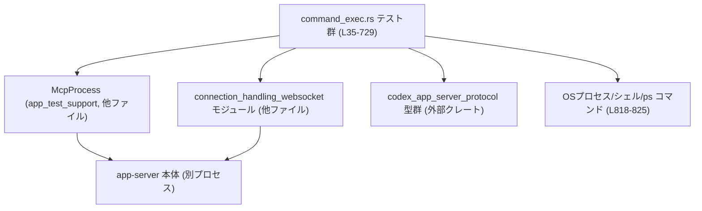
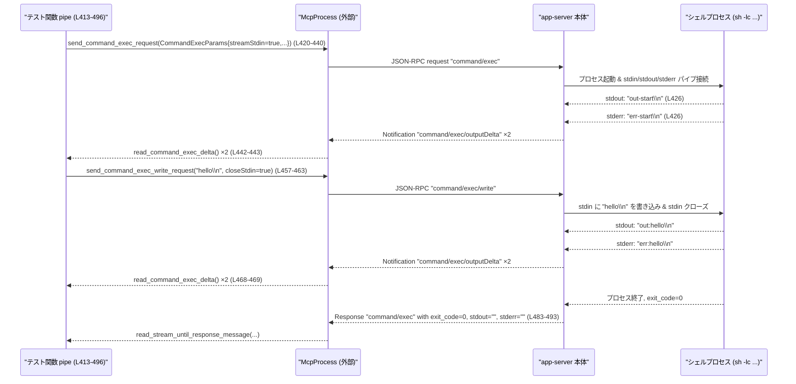

# app-server/tests/suite/v2/command_exec.rs コード解説

## 0. ざっくり一言

`command/exec` JSON‑RPC APIについて、プロセス起動・終了、ストリーミング出力、TTY、環境変数、タイムアウトなどの挙動を統合テストするモジュールです（`command_exec.rs` 全体）。

---

## 1. このモジュールの役割

### 1.1 概要

- このモジュールは **アプリケーションサーバーの `command/exec` API の契約** を検証するための統合テスト群です。
- `McpProcess` や WebSocket クライアントを通してサーバーに JSON‑RPC リクエストを送り、  
  **プロセスの起動・入出力・停止・TTY サイズ変更**などが仕様通りに動作するかを確認します（例: `command_exec_without_streams_can_be_terminated` `command_exec.rs:L35-78`）。
- **環境変数マージ・不正なパラメータ組合せのエラー**・**接続スコープな processId の扱い**など、API の細かい制約もテストしています（`command_exec.rs:L123-244`, `L658-729`）。

### 1.2 アーキテクチャ内での位置づけ

このモジュールはテストコードであり、本体サーバーとは以下のような関係にあります。



- `McpProcess` を使うテストは、**実プロセスとして起動した app-server** と対話します（`command_exec.rs:L37-41` など）。
- WebSocket 系テストは `spawn_websocket_server` / `connect_websocket` などを使い、**テスト内で起動した server を WebSocket で直接叩きます**（`command_exec.rs:L670-672`）。
- `codex_app_server_protocol` の型群は、**JSON‑RPC のリクエスト/レスポンス/通知の型安全な表現**として使われます（`command_exec.rs:L8-18`, `L731-738`）。
- `process_with_marker_exists` は OS の `ps` コマンドを叩いて、**サーバーが起動した子プロセスが生きているか**を検査します（`command_exec.rs:L818-825`）。

### 1.3 設計上のポイント

- すべてのテストは `#[tokio::test] async fn` で実装され、**非同期 I/O とタイムアウト制御**を前提にしています（`command_exec.rs:L35`, `L80`, …）。
- **共通ヘルパー関数**で JSON‑RPC 通知の読み取り・TTY 出力の待機・プロセスの存在確認をカプセル化し、テスト本体をシナリオ記述に集中させています（`read_command_exec_output_until_contains` `command_exec.rs:L740-765` など）。
- エラーハンドリングには `anyhow::Result` と `Context` を使い、失敗時に**文脈付きのエラーメッセージ**を付加します（`command_exec.rs:L752-756`, `L822-823`）。
- **テストの安全性・安定性**のために、`tokio::time::timeout` と `DEFAULT_READ_TIMEOUT` を多用し、「サーバーが何も返さずにテストがハングする」状況を避けています（`command_exec.rs:L41`, `L746-752`）。
- プロセス ID のスコープやエラー文言など、**プロトコル契約レベルの仕様**を文字列比較で厳密に検証します（`command_exec.rs:L205-208`, `L239-242`, `L273-276`, `L716-718`）。

---

## 2. 主要な機能一覧

このモジュールのテストがカバーしている主な挙動です。

- 非ストリーミング実行の中断: `stream_stdout_stderr = false` なコマンドが、`command/exec/terminate` で確実に終了すること（`command_exec.rs:L35-78`）。
- processId なしのレガシー互換: `processId` 未指定かつ非ストリーミング時に、従来どおり stdout/stderr がバッファされて返ること（`command_exec.rs:L80-121`）。
- 環境変数マージ/上書き/削除: サーバー環境＋リクエスト `env` のマージと `None` による unset を検証（`command_exec.rs:L123-176`）。
- 不正なタイムアウト設定の拒否:
  - `disableTimeout` と `timeoutMs` 同時指定をエラーにする（`command_exec.rs:L178-210`）。
  - `timeoutMs` の負値をエラーにする（`command_exec.rs:L246-278`）。
- 不正な出力キャップ設定の拒否: `outputBytesCap` と `disableOutputCap` 同時指定のエラー（`command_exec.rs:L212-244`）。
- processId 未指定時のストリーミング拒否: TTY またはストリーミング要求に必須な `processId` を欠いた場合のエラー（`command_exec.rs:L280-312`）。
- 非ストリーミング時の output cap 適用: `outputBytesCap` が stdout/stderr に適切に適用されること（`command_exec.rs:L314-355`）。
- ストリーミング時の output cap: cap 到達時の `outputDelta` 通知と `capReached` フラグ、バッファ無しでの出力送出（`command_exec.rs:L357-411`）。
- パイプモード入出力: `streamStdin=true` で stdin 書き込みができ、stdout/stderr の両方がストリーミングされること（`command_exec.rs:L413-496`）。
- TTY モードの暗黙ストリーミングとエコー: TTY が実際に割り当てられ、入力がエコーバックされること（`command_exec.rs:L498-568`）。
- TTY サイズ指定とリサイズ: 初期サイズと `command/exec/resize` によるサイズ変更が `stty size` に反映されること（`command_exec.rs:L570-656`）。
- processId の接続スコープと切断時の終了: 別の WebSocket で同じ processId を terminate できないこと、および元の接続切断でプロセスが終了すること（`command_exec.rs:L658-729`）。

### 2.1 関数インベントリ

本ファイル内で定義されている関数の一覧です。

| 名前 | 種別 | async | 行範囲 | 役割（1行） |
|------|------|-------|--------|-------------|
| `command_exec_without_streams_can_be_terminated` | テスト | Yes | `L35-78` | 非ストリーミングコマンドが terminate 要求で終了し、非ゼロ exit を返すことを検証。 |
| `command_exec_without_process_id_keeps_buffered_compatibility` | テスト | Yes | `L80-121` | `processId` なし非ストリーミングで従来のバッファレスポンスが得られることを検証。 |
| `command_exec_env_overrides_merge_with_server_environment_and_support_unset` | テスト | Yes | `L123-176` | サーバー環境とリクエスト `env` のマージ／上書き／unset 挙動を検証。 |
| `command_exec_rejects_disable_timeout_with_timeout_ms` | テスト | Yes | `L178-210` | `disableTimeout` と `timeoutMs` 同時指定をエラーにすることを検証。 |
| `command_exec_rejects_disable_output_cap_with_output_bytes_cap` | テスト | Yes | `L212-244` | `disableOutputCap` と `outputBytesCap` 同時指定をエラーにすることを検証。 |
| `command_exec_rejects_negative_timeout_ms` | テスト | Yes | `L246-278` | `timeoutMs` の負値を拒否することを検証。 |
| `command_exec_without_process_id_rejects_streaming` | テスト | Yes | `L280-312` | TTY またはストリーミングに `processId` が必須であることをエラーメッセージで検証。 |
| `command_exec_non_streaming_respects_output_cap` | テスト | Yes | `L314-355` | 非ストリーミング時の出力キャップが stdout/stderr に適用されることを検証。 |
| `command_exec_streaming_does_not_buffer_output` | テスト | Yes | `L357-411` | ストリーミング時に出力がバッファされず、cap 到達通知が来ることを検証。 |
| `command_exec_pipe_streams_output_and_accepts_write` | テスト | Yes | `L413-496` | stdin 書き込み＋stdout/stderr ストリーミングが正しく動くことを検証。 |
| `command_exec_tty_implies_streaming_and_reports_pty_output` | テスト | Yes | `L498-568` | TTY フラグでストリーミングが暗黙有効になり、TTY 上での入出力を検証。 |
| `command_exec_tty_supports_initial_size_and_resize` | テスト | Yes | `L570-656` | TTY の初期サイズ指定とリサイズ API を検証。 |
| `command_exec_process_ids_are_connection_scoped_and_disconnect_terminates_process` | テスト | Yes | `L658-729` | processId の接続スコープと、接続切断後のプロセス終了を検証。 |
| `read_command_exec_delta` | ヘルパー | Yes | `L731-738` | `command/exec/outputDelta` 通知を待ち受けてデコードする。 |
| `read_command_exec_output_until_contains` | ヘルパー | Yes | `L740-765` | 指定文字列が出力に現れるまで `outputDelta` を繰り返し取得する。 |
| `read_command_exec_delta_ws` | ヘルパー | Yes | `L767-779` | WebSocket クライアントから `outputDelta` 通知を待つ。 |
| `decode_delta_notification` | ヘルパー | No | `L781-788` | JSONRPC 通知から `CommandExecOutputDeltaNotification` にデシリアライズ。 |
| `read_initialize_response` | ヘルパー | Yes | `L790-802` | `initialize` リクエストに対する Response を WebSocket から待つ。 |
| `wait_for_process_marker` | ヘルパー | Yes | `L804-816` | `ps` 出力に marker が現れる・消えるまでポーリングする。 |
| `process_with_marker_exists` | ヘルパー | No | `L818-825` | `ps -axo command` 実行結果から marker を含むプロセスが存在するか判定。 |

---

## 3. 公開 API と詳細解説

このファイルには `pub` な型・関数はありませんが、テスト内で繰り返し利用されるヘルパー関数と、プロトコル型を「外部から見た契約」として整理します。

### 3.1 型一覧（構造体・列挙体など）

本ファイル内で定義される型はありません。外部から利用している主な型を列挙します。

| 名前 | 種別 | 定義場所（推定） | 役割 / 用途 |
|------|------|------------------|-------------|
| `McpProcess` | 構造体 | `app_test_support` クレート | app-server プロセスを起動し、JSON‑RPC 経由で初期化・コマンド送信・ストリーム読み取りを行うテスト用ラッパー（`command_exec.rs:L37-41`, `L185-204`）。 |
| `CommandExecParams` | 構造体 | `codex_app_server_protocol` | `command/exec` リクエストのパラメータ。`command`, `process_id`, `tty`, `stream_stdin`, `stream_stdout_stderr`, `output_bytes_cap`, `disable_output_cap`, `disable_timeout`, `timeout_ms`, `cwd`, `env`, `size`, `sandbox_policy` フィールドが使用されています（`command_exec.rs:L44-57`, `L136-161` など）。 |
| `CommandExecResponse` | 構造体 | 同上 | `command/exec` のレスポンス。本テストでは `exit_code`, `stdout`, `stderr` フィールドを検証します（`command_exec.rs:L70-76`, `L112-118`）。 |
| `CommandExecOutputDeltaNotification` | 構造体 | 同上 | ストリーミング出力通知。フィールド `process_id`, `stream`, `delta_base64`, `cap_reached` が使用されています（`command_exec.rs:L386-390`, `L442-456`）。 |
| `CommandExecOutputStream` | 列挙体 | 同上 | 出力の種類を表す enum。少なくとも `Stdout`, `Stderr` 変種が存在します（`command_exec.rs:L388`, `L450`, `L454`）。 |
| `CommandExecWriteParams` | 構造体 | 同上 | `command/exec/write` のパラメータ。`process_id`, `delta_base64`, `close_stdin` を含みます（`command_exec.rs:L458-462`, `L539-543`）。 |
| `CommandExecResizeParams` | 構造体 | 同上 | `command/exec/resize` 用パラメータ。`process_id`, `size` を含みます（`command_exec.rs:L613-620`）。 |
| `CommandExecTerminateParams` | 構造体 | 同上 | `command/exec/terminate` 用パラメータ。`process_id` のみ使用（`command_exec.rs:L60-61`, `L392-394`）。 |
| `CommandExecTerminalSize` | 構造体 | 同上 | TTY サイズ。`rows`, `cols` を持ちます（`command_exec.rs:L595-598`）。 |
| `JSONRPCMessage` | 列挙体 | `codex_app_server_protocol` | JSON‑RPC メッセージを表す enum。`Response`, `Error`, `Notification` 変種が使用されています（`command_exec.rs:L708-715`, `L771-776`, `L796-801`）。 |
| `JSONRPCNotification` | 構造体 | 同上 | JSON‑RPC 通知。`method`, `params` フィールドが使用されています（`command_exec.rs:L775-788`）。 |
| `RequestId` | 列挙体 | 同上 | JSON‑RPC リクエスト ID。`Integer(i64)` 変種を使用（`command_exec.rs:L64-65`, `L203-204`, `L710-712`）。 |
| `WsClient` | 型エイリアス/構造体 | `connection_handling_websocket` | WebSocket クライアントを表す型。`read_jsonrpc_message` などと組み合わせて使用（`command_exec.rs:L767-769`, `L791-792`）。 |

> フィールドの正確な Rust 型（例: `i32` か `i64` かなど）は、このチャンク中には定義がないため特定できません。

### 3.2 関数詳細（7件）

#### 1. `read_command_exec_output_until_contains(...) -> Result<String>`（`command_exec.rs:L740-765`）

```rust
async fn read_command_exec_output_until_contains(
    mcp: &mut McpProcess,
    process_id: &str,
    stream: CommandExecOutputStream,
    expected: &str,
) -> Result<String>
```

**概要**

- 指定プロセスのストリーミング出力から、`expected` 文字列が現れるまで `command/exec/outputDelta` 通知を読み続け、**これまでに受信した出力の連結**を返します（`command_exec.rs:L740-765`）。
- TTY やストリーミングテストで、「あるテキストが出るまで待つ」ために使用されています（`command_exec.rs:L527-533`, `L602-607`, `L637-642`）。

**引数**

| 引数名 | 型 | 説明 |
|--------|----|------|
| `mcp` | `&mut McpProcess` | ストリーミング通知を読むための `McpProcess` インスタンス（`command_exec.rs:L741-742`）。 |
| `process_id` | `&str` | 期待する通知の `process_id`。違う ID の通知はテストエラーになります（`command_exec.rs:L742`, `L757`）。 |
| `stream` | `CommandExecOutputStream` | `Stdout` または `Stderr`。異なるストリームが来た場合もテストエラー（`command_exec.rs:L743`, `L758`）。 |
| `expected` | `&str` | この文字列が出力に含まれるまでループします（`command_exec.rs:L744`, `L761`）。 |

**戻り値**

- `Ok(String)` – `expected` を含むまでに受信した出力（`\r` は除去）を連結した文字列（`command_exec.rs:L759-762`）。
- `Err(anyhow::Error)` – タイムアウトや JSON デコード失敗など、内部処理でのエラー。

**内部処理の流れ**

1. 現在時刻＋`DEFAULT_READ_TIMEOUT` を締切とする `deadline` を計算し、`collected` を空文字列で初期化（`command_exec.rs:L746-747`）。
2. 無限ループで、残り時間 `remaining` を `deadline - now` から計算（`command_exec.rs:L748-750`）。
3. `timeout(remaining, read_command_exec_delta(mcp))` で、**残り時間内に `outputDelta` を待機**（`command_exec.rs:L750-752`）。
   - タイムアウト時には `with_context` で期待値やこれまでの出力を含むエラーメッセージを付与（`command_exec.rs:L752-756`）。
4. 取得した `delta` の `process_id` と `stream` が引数と一致することを `assert_eq!` で検証（`command_exec.rs:L757-758`）。
5. `delta.delta_base64` を Base64 デコードし UTF‑8 文字列に変換、`\r` を除去して `collected` に追加（`command_exec.rs:L759-760`）。
6. `collected` に `expected` が含まれたら `Ok(collected)` を返して終了（`command_exec.rs:L761-762`）。
7. 含まれなければ次の通知を待つ（`command_exec.rs:L748-764`）。

**Examples（使用例）**

TTY の初期サイズ検証での使用例（簡略化）:

```rust
// プロセス起動後、stdout に "start:31 101\n" が現れるまで待つ           // TTY 初期サイズ出力を待つ
let started_text = read_command_exec_output_until_contains(
    &mut mcp,                                          // McpProcess への可変参照
    process_id.as_str(),                               // 対象プロセス ID
    CommandExecOutputStream::Stdout,                   // stdout ストリーム限定
    "start:31 101\n",                                  // 期待する文字列
).await?;                                              // タイムアウトなどで Err の可能性あり
assert!(started_text.contains("start:31 101\n"));      // 実際に含まれていることを確認
```

（元コード: `command_exec.rs:L602-612`）

**Errors / Panics**

- `timeout` により締切までに `outputDelta` が届かなかった場合、`Err` が返ります。その際、メッセージには `process_id` と `expected`、これまで集めた `collected` が含まれます（`command_exec.rs:L752-756`）。
- `read_command_exec_delta` 内部のエラー（JSON デコードなど）も `Err` として伝播します（`command_exec.rs:L750-756`）。
- `delta.process_id` や `delta.stream` が期待と異なる場合、`assert_eq!` により **テストが panic** します（`command_exec.rs:L757-758`）。

**Edge cases（エッジケース）**

- 期限ぎりぎりで通知が届いた場合でも、`remaining` を動的に計算しているため締切までは待ち続けます（`command_exec.rs:L748-750`）。
- サーバーが `\r\n` を出力する環境では `\r` が除去され、`\n` のみでマッチングが行われます（`command_exec.rs:L760`）。
- 異なる `process_id` の通知が大量に来ると `assert_eq!` で即座にテスト失敗になります。この関数自体にはフィルタリング機構はありません。

**使用上の注意点**

- `process_id` と `stream` が正しいことを事前に保証して呼び出す前提のヘルパーです。**別プロセスの出力が混ざる状況での利用は想定されていません。**
- 締切時間は `DEFAULT_READ_TIMEOUT` に依存しており、サーバー側の応答が非常に遅い環境ではタイムアウトエラーが発生しやすくなります。

---

#### 2. `read_command_exec_delta_ws(...) -> Result<CommandExecOutputDeltaNotification>`（`command_exec.rs:L767-779`）

```rust
async fn read_command_exec_delta_ws(
    stream: &mut super::connection_handling_websocket::WsClient,
) -> Result<CommandExecOutputDeltaNotification>
```

**概要**

- WebSocket ベースのクライアントから JSON‑RPC メッセージを読み、初めて現れた `method == "command/exec/outputDelta"` の通知をデコードして返します（`command_exec.rs:L767-779`）。

**引数**

| 引数名 | 型 | 説明 |
|--------|----|------|
| `stream` | `&mut WsClient` | WebSocket クライアント。`read_jsonrpc_message` でメッセージを受信します（`command_exec.rs:L768-772`）。 |

**戻り値**

- `Ok(CommandExecOutputDeltaNotification)` – 最初に観測された `command/exec/outputDelta` 通知。
- `Err(anyhow::Error)` – WebSocket 読み取りや JSON デコードに失敗した場合。

**内部処理の流れ**

1. `loop` で無限に JSON‑RPC メッセージを読み取り（`read_jsonrpc_message` 使用、`command_exec.rs:L770-772`）。
2. `match` で `JSONRPCMessage::Notification(notification)` の場合のみ処理を進め、それ以外（Response, Error）は無視して次のループへ（`command_exec.rs:L772-774`）。
3. 通知の `method` が `"command/exec/outputDelta"` の場合、`decode_delta_notification` で型にデコードして返す（`command_exec.rs:L775-777`）。

**Errors / Panics**

- `read_jsonrpc_message` の失敗や WebSocket エラーは `Err` として伝播します（`command_exec.rs:L770-772`）。
- `decode_delta_notification` 内で `params` が欠けている・JSON 形式が不正などの場合に `Err` になります（`command_exec.rs:L781-788`）。

**Edge cases**

- `command/exec/outputDelta` 以外の通知はすべて無視され、**読み続ける**ため、他の通知が大量に送られても、この関数は目的の通知を待ち続けます。
- 終端条件が `outputDelta` 通知のみなので、サーバーがこの通知を一切送らない場合は、呼び出し側のタイムアウトなどを別途設ける必要があります（この関数自体にはタイムアウトはありません）。

**使用上の注意点**

- WebSocket テストでのみ利用されており、`McpProcess` ベースのテストとは役割を分担しています（`command_exec.rs:L693-697`）。
- この関数単独ではタイムアウト制御を行わないため、**外側で `tokio::time::timeout` などと組み合わせることが推奨されます**。

---

#### 3. `wait_for_process_marker(marker, should_exist) -> Result<()>`（`command_exec.rs:L804-816`）

```rust
async fn wait_for_process_marker(marker: &str, should_exist: bool) -> Result<()>
```

**概要**

- `ps -axo command` の出力に `marker` を含むプロセスが現れる／消えるまで最大 5 秒間ポーリングし、所望の状態になれば戻るヘルパーです（`command_exec.rs:L804-816`, `L818-825`）。
- WebSocket 切断時にサーバーが子プロセスを終了しているかどうかを検証するために使われています（`command_exec.rs:L698`, `L720`, `L723`）。

**引数**

| 引数名 | 型 | 説明 |
|--------|----|------|
| `marker` | `&str` | プロセスコマンドライン中に含まれるべき一意な文字列（`command_exec.rs:L664-668` で生成）。 |
| `should_exist` | `bool` | `true` なら「出現するまで」、`false` なら「消えるまで」待つ（`command_exec.rs:L804-808`）。 |

**戻り値**

- `Ok(())` – 条件が満たされた場合。
- `Err(anyhow::Error)` – `ps` コマンドの失敗や、タイムアウトなど。

**内部処理の流れ**

1. `deadline = now + 5 秒` を計算（`command_exec.rs:L805`）。
2. 無限ループで `process_with_marker_exists(marker)` を呼び出し、結果が `should_exist` と一致したら `Ok(())` を返す（`command_exec.rs:L806-808`）。
3. 現時刻が `deadline` を超えた場合、
   - `should_exist` に応じて `"appear"` または `"exit"` を選び、
   - `anyhow::bail!` で「指定時間内に期待した状態にならなかった」エラーを返す（`command_exec.rs:L810-813`）。
4. まだ期限前かつ条件不成立であれば、`sleep(50ms)` して再びチェック（`command_exec.rs:L814`）。

**Errors / Panics**

- `process_with_marker_exists` が `ps` コマンド失敗や UTF‑8 デコード失敗で `Err` を返すと、そのまま伝播します（`command_exec.rs:L806-808`, `L818-823`）。
- タイムアウト時、`anyhow::bail!` によって `Err(anyhow::Error)` が返ります（`command_exec.rs:L810-813`）。

**Edge cases**

- 5 秒以内にプロセスが一瞬だけ現れてすぐ消えるケースでは、`should_exist == true` の呼び出し中にタイミングよく検出されない可能性があります。ただし marker にはナノ秒精度のタイムスタンプが含まれ、**同名プロセスとの衝突可能性は低減**されています（`command_exec.rs:L664-668`）。
- OS に `ps -axo command` が存在しない環境では必ずエラーになります（`command_exec.rs:L819-822`）。

**使用上の注意点**

- Linux/Unix 系の `ps` 形式に依存しているため、**プラットフォーム依存のテストヘルパー**です。
- 5 秒という固定猶予は環境によっては短過ぎる／長過ぎる可能性があり、必要に応じて調整する必要があります。

---

#### 4. `process_with_marker_exists(marker) -> Result<bool>`（`command_exec.rs:L818-825`）

```rust
fn process_with_marker_exists(marker: &str) -> Result<bool>
```

**概要**

- `ps -axo command` を実行し、その標準出力の各行に `marker` が含まれるかどうかをチェックして `bool` を返します（`command_exec.rs:L818-825`）。

**引数**

| 引数名 | 型 | 説明 |
|--------|----|------|
| `marker` | `&str` | コマンドラインに含まれるべき識別文字列。 |

**戻り値**

- `Ok(true)` – 少なくとも 1 行に `marker` が含まれている場合。
- `Ok(false)` – 含まれる行が見つからなかった場合。
- `Err(anyhow::Error)` – `ps` コマンド実行失敗や UTF‑8 デコード失敗時。

**内部処理の流れ**

1. `std::process::Command::new("ps")` で `ps -axo command` を実行し、`output()` で完了まで待つ（`command_exec.rs:L819-821`）。
2. `output.stdout` を UTF‑8 文字列にデコード（`command_exec.rs:L822-823`）。
3. 各行に対して `line.contains(marker)` をチェックし、あれば `true` を返す（`command_exec.rs:L824`）。

**Errors / Panics**

- `output()` が失敗した場合（例: `ps` コマンドが見つからない）、`Context("spawn ps -axo command")` 付きのエラーになります（`command_exec.rs:L819-822`）。
- `stdout` が不正な UTF‑8 だった場合は `"decode ps output"` コンテキスト付きエラー（`command_exec.rs:L822-823`）。

**使用上の注意点**

- コマンドライン全体に marker を埋め込む前提で設計されており、**process title 書き換えなどは考慮していません**。
- 行単位での `contains` 判定なので、marker が他のプロセスコマンドに偶然含まれると誤検出になりますが、marker 生成時にナノ秒タイムスタンプを付けて衝突を回避しています（`command_exec.rs:L664-668`）。

---

#### 5. `read_command_exec_delta(mcp) -> Result<CommandExecOutputDeltaNotification>`（`command_exec.rs:L731-738`）

```rust
async fn read_command_exec_delta(
    mcp: &mut McpProcess,
) -> Result<CommandExecOutputDeltaNotification>
```

**概要**

- `McpProcess` の `read_stream_until_notification_message("command/exec/outputDelta")` を用いて、**プロセス出力の JSON‑RPC 通知を 1 件受信しデコードする**ヘルパーです（`command_exec.rs:L731-738`）。

**引数**

| 引数名 | 型 | 説明 |
|--------|----|------|
| `mcp` | `&mut McpProcess` | ストリーム読み取り API を提供するテスト用ラッパー（`command_exec.rs:L731-736`）。 |

**戻り値**

- `Ok(CommandExecOutputDeltaNotification)` – 最初に観測された `command/exec/outputDelta` 通知。
- `Err(anyhow::Error)` – 通知待機や JSON デシリアライズの失敗時。

**内部処理の流れ**

1. `read_stream_until_notification_message("command/exec/outputDelta")` を await（`command_exec.rs:L734-736`）。
2. 受信した `JSONRPCNotification` を `decode_delta_notification` で `CommandExecOutputDeltaNotification` に変換（`command_exec.rs:L737`）。

**使用上の注意点**

- この関数自体にはタイムアウトはありませんが、呼び出し側（例えば `read_command_exec_output_until_contains`）で `timeout` による締切を設けているケースがあります（`command_exec.rs:L750-752`）。

---

#### 6. `command_exec_pipe_streams_output_and_accepts_write() -> Result<()>`（`command_exec.rs:L413-496`）

**概要**

- `streamStdin=true` かつ `streamStdoutStderr=true` で起動したシェルコマンドが、
  - 起動時に stdout/stderr をストリーミングで出し、
  - stdin への書き込みを受け付け、
  - その後の stdout/stderr もストリーミングで送る
 ことを検証するテストです（`command_exec.rs:L413-496`）。

**主な処理ステップ**

1. テスト用サーバーと `McpProcess` をセットアップし、`initialize` を完了（`command_exec.rs:L415-419`）。
2. `process_id = "pipe-1"` を指定して `command/exec` を送信。シェルスクリプトは:
   - 起動時に `"out-start\n"` を stdout、
   - `"err-start\n"` を stderr、
   - 行を1つ読み取って `"out:<line>"` と `"err:<line>"` を出力（`command_exec.rs:L420-427`）。
3. `read_command_exec_delta` を 2 回呼び出して、最初の stdout/stderr 通知を取得（`command_exec.rs:L442-443`）。
4. 2 通知とも `process_id` が `"pipe-1"` であり、片方が stdout `"out-start\n"`、もう片方が stderr `"err-start\n"` であることをアサート（`command_exec.rs:L444-456`）。
5. `command/exec/write` で `"hello\n"` を Base64 で送信し、`close_stdin = true` とする（`command_exec.rs:L457-463`）。
6. 書き込みに対する空オブジェクトレスポンス `{}` を確認（`command_exec.rs:L464-467`）。
7. 再度 `read_command_exec_delta` を 2 回呼び、今度は `"out:hello\n"` と `"err:hello\n"` が stdout/stderr として届くことを検証（`command_exec.rs:L468-482`）。
8. 最終的な `command/exec` レスポンスを取得し、`exit_code == 0` かつ `stdout` / `stderr` は空文字列であることを確認（`command_exec.rs:L483-493`）。

**Contracts / Edge cases**

- プロセス終了時のバッファレスポンスは空文字列であり、**ストリーミングされた内容は最終レスポンスには含まれない契約**になっていることが読み取れます（`command_exec.rs:L487-493`）。
- `delta_base64` はすべて Base64 でエンコードされたバイト列であり、テストでは `STANDARD.encode` との比較や `decode` を用いて内容を確認しています（`command_exec.rs:L451-452`, `L455-456`）。

**使用上の注意点**

- このテストから、`streamStdin` を有効にした場合は `command/exec/write` で **明示的に `closeStdin` を送らない限りプロセスが入力待ちになる**ことが推測されますが、実装はこのチャンクからは確認できません。

---

#### 7. `command_exec_process_ids_are_connection_scoped_and_disconnect_terminates_process() -> Result<()>`（`command_exec.rs:L658-729`）

**概要**

- WebSocket 経由で `command/exec` を呼ぶ際、
  - `processId` は **WebSocket 接続ごとにスコープされる**こと、
  - ある接続で起動したプロセスは、**別の接続からは `terminate` できない**こと、
  - 元の接続が切断されると、**サーバーが子プロセスを終了する**こと
  を検証するテストです（`command_exec.rs:L658-729`）。

**主な処理ステップ**

1. 一意な `marker` 文字列を生成し、これを Python スクリプトの引数として渡す準備をする（`command_exec.rs:L664-687`）。
2. `spawn_websocket_server` で app-server を起動し、`ws1`, `ws2` の 2 接続を張る（`command_exec.rs:L670-672`）。
3. 両接続で `initialize` リクエスト／レスポンスをやり取り（`command_exec.rs:L673-676`）。
4. `ws1` から `command/exec` を送り、Python で `print('ready')` → `sleep(30)` するプロセスを起動（`command_exec.rs:L677-690`）。
5. `read_command_exec_delta_ws(&mut ws1)` で `outputDelta` を受信し、stdout に `"ready"` が含まれることを確認（`command_exec.rs:L693-697`）。
6. `wait_for_process_marker(&marker, true)` で `ps` に Python プロセスが出現するまで待つ（`command_exec.rs:L698`）。
7. `ws2` から同じ `processId` に対して `command/exec/terminate` を送る（`command_exec.rs:L699-707`）。
8. `ws2` で `JSONRPCMessage::Error` のレスポンスを待ち、  
   `"no active command/exec for process id \"shared-process\""` であることを検証（`command_exec.rs:L708-718`）。
9. `wait_for_process_marker(&marker, true)` を再度呼び、`ws2` からの terminate が **プロセスに影響していない**ことを確認（`command_exec.rs:L720`）。
10. `assert_no_message(&mut ws2, 250ms)` で、短時間の間に `ws2` に余計なメッセージが届かないことを確認（`command_exec.rs:L721`）。
11. `ws1.close(None).await` で `ws1` を切断（`command_exec.rs:L722`）。
12. `wait_for_process_marker(&marker, false)` で、Python プロセスが 5 秒以内に終了することを検証（`command_exec.rs:L723`）。
13. 最後にサーバープロセスを `kill()` してテストを終了（`command_exec.rs:L724-727`）。

**Contracts / Edge cases**

- `command/exec/terminate` は、**同じ接続上で起動したコマンドにのみ適用される**契約であることが、エラーメッセージから読み取れます（`command_exec.rs:L716-718`）。
- 接続切断に伴いサーバーが子プロセスを終了することは、`wait_for_process_marker(&marker, false)` によって確認されています（`command_exec.rs:L723`, `L804-816`）。

**使用上の注意点**

- このテストは OS の `ps` コマンドや Python インタプリタに依存します。これらが存在しない環境ではテストが失敗します。
- `marker` にはナノ秒タイムスタンプが含まれているため、別テストとのマーカー衝突リスクを低く抑えています（`command_exec.rs:L664-668`）。

---

### 3.3 その他の関数

上記で詳細説明しなかったテスト関数とヘルパーです。

| 関数名 | 行範囲 | 役割（1行） |
|--------|--------|-------------|
| `command_exec_without_streams_can_be_terminated` | `L35-78` | 非ストリーミングで起動した長時間コマンドを terminate し、exit_code ≠ 0 と空の stdout/stderr を確認。 |
| `command_exec_without_process_id_keeps_buffered_compatibility` | `L80-121` | `processId` なし＋非ストリーミングで stdout/stderr がまとめてレスポンスに載るレガシー挙動を検証。 |
| `command_exec_env_overrides_merge_with_server_environment_and_support_unset` | `L123-176` | サーバー環境に対する `env` の上書き（`COMMAND_EXEC_BASELINE`）・追加・unset（`RUST_LOG`）を検証。 |
| `command_exec_rejects_disable_timeout_with_timeout_ms` | `L178-210` | `disableTimeout:true` と `timeoutMs` 同時指定で `"cannot set both timeoutMs and disableTimeout"` エラーになることを確認。 |
| `command_exec_rejects_disable_output_cap_with_output_bytes_cap` | `L212-244` | `disableOutputCap:true` と `outputBytesCap` 同時指定で `"cannot set both outputBytesCap and disableOutputCap"` エラーを確認。 |
| `command_exec_rejects_negative_timeout_ms` | `L246-278` | `timeoutMs: -1` で `"timeoutMs must be non-negative"` エラーを確認。 |
| `command_exec_without_process_id_rejects_streaming` | `L280-312` | `processId` なし＋`streamStdoutStderr:true` で `"tty or streaming requires a client-supplied processId"` エラーを検証。 |
| `command_exec_non_streaming_respects_output_cap` | `L314-355` | `outputBytesCap:5` で stdout/stderr ともに先頭 5 バイトのみ返されることを確認。 |
| `command_exec_streaming_does_not_buffer_output` | `L357-411` | `outputBytesCap:5` ストリーミング版で、最初の `outputDelta` が `"abcde"` かつ `cap_reached == true` となり、最終レスポンスには出力が含まれないことを検証。 |
| `command_exec_tty_implies_streaming_and_reports_pty_output` | `L498-568` | `tty:true` で `streamStdoutStderr:false` でもストリーミングが有効になり、TTY 上での `"tty\n"` と `"echo:<input>"` 出力を確認。 |
| `command_exec_tty_supports_initial_size_and_resize` | `L570-656` | 初期 `CommandExecTerminalSize` と `command/exec/resize` 後のサイズが `stty size` の出力に反映されることを検証。 |
| `decode_delta_notification` | `L781-788` | JSONRPCNotification から `params` を取り出し、`CommandExecOutputDeltaNotification` にデシリアライズ。 |
| `read_initialize_response` | `L790-802` | WebSocket で `initialize` の Response が来るまで `JSONRPCMessage::Response` を待つ。 |

---

## 4. データフロー

### 4.1 ストリーミング入出力（pipe モード）のデータフロー

`command_exec_pipe_streams_output_and_accepts_write`（`command_exec.rs:L413-496`）を例に、プロセス入出力がどのように流れるかを示します。



**要点**

- ストリーミング出力（stdout/stderr）はすべて `command/exec/outputDelta` 通知として送られ、**最終 `CommandExecResponse` の stdout/stderr は空文字列**である契約が確認できます（`command_exec.rs:L487-493`）。
- stdin への書き込みは別メソッド `command/exec/write` で行われ、`closeStdin` が明示的に指定されます（`command_exec.rs:L458-462`）。
- Rust 側では、非同期関数と `await` によって **I/O 待機中も他タスクの実行をブロックしない**形になっています。

---

## 5. 使い方（How to Use）

### 5.1 基本的な使用方法（`McpProcess` ベース）

ここでは、非ストリーミングでコマンドを実行しレスポンスを受け取る、最小限のテストパターンを示します（`command_exec_without_process_id_keeps_buffered_compatibility` を簡略化）。

```rust
use anyhow::Result;                                                   // anyhow::Result でエラーをラップする
use app_test_support::{McpProcess, create_mock_responses_server_sequence_unchecked};
use codex_app_server_protocol::{CommandExecParams, CommandExecResponse, RequestId};
use tempfile::TempDir;
use tokio::time::timeout;
use super::connection_handling_websocket::create_config_toml;
use super::connection_handling_websocket::DEFAULT_READ_TIMEOUT;

#[tokio::test]                                                        // tokio の非同期テストマクロ
async fn example_non_streaming_exec() -> Result<()> {                 // テスト関数のシグネチャ
    let server = create_mock_responses_server_sequence_unchecked(Vec::new()).await; // モックサーバー起動
    let codex_home = TempDir::new()?;                                 // 一時ディレクトリ作成
    create_config_toml(codex_home.path(), &server.uri(), "never")?;   // 設定ファイル生成
    let mut mcp = McpProcess::new(codex_home.path()).await?;          // app-server プロセス起動
    timeout(DEFAULT_READ_TIMEOUT, mcp.initialize()).await??;          // initialize 完了を待つ

    // command/exec リクエスト送信（非ストリーミング、processId なし）              // コマンド実行
    let request_id = mcp
        .send_command_exec_request(CommandExecParams {
            command: vec![
                "sh".to_string(),
                "-lc".to_string(),
                "printf 'hello'; printf 'world' >&2".to_string(),
            ],
            process_id: None,
            tty: false,
            stream_stdin: false,
            stream_stdout_stderr: false,
            output_bytes_cap: None,
            disable_output_cap: false,
            disable_timeout: false,
            timeout_ms: None,
            cwd: None,
            env: None,
            size: None,
            sandbox_policy: None,
        })
        .await?;

    // レスポンス到着までストリームを読み続ける                                  // JSON-RPC レスポンス待ち
    let message = mcp
        .read_stream_until_response_message(RequestId::Integer(request_id))
        .await?;
    let response: CommandExecResponse = app_test_support::to_response(message)?;    // 型に変換

    assert_eq!(response.exit_code, 0);                               // 正常終了を確認
    assert_eq!(response.stdout, "hello");                            // stdout 内容を確認
    assert_eq!(response.stderr, "world");                            // stderr 内容を確認
    Ok(())                                                           // テスト成功
}
```

### 5.2 よくある使用パターン

- **非ストリーミング＋バッファレスポンス**
  - `process_id: None` かつ `stream_stdout_stderr: false` で、従来どおり stdout/stderr がレスポンスにまとめて返る（`command_exec.rs:L88-106`, `L112-118`）。
- **ストリーミング出力（outputDelta）**
  - `process_id: Some(..)` かつ `stream_stdout_stderr: true` で、`CommandExecOutputDeltaNotification` が複数回届き、最終レスポンスの stdout/stderr は空になる（`command_exec.rs:L367-385`, `L400-409`）。
- **TTY モード**
  - `tty: true` を指定すると、`stream_stdout_stderr` が `false` でも TTY ベースのストリーミング出力が有効になる（`command_exec.rs:L507-517`, `L527-537`）。
  - `size: Some(CommandExecTerminalSize{..})` や `command/exec/resize` で TTY サイズも操作可能（`command_exec.rs:L579-600`, `L613-620`）。

### 5.3 よくある間違いと正しい例

#### 1. `timeoutMs` と `disableTimeout` の同時指定

```rust
// 間違い例: timeoutMs と disableTimeout を同時に指定している            // エラーになるパターン
let _id = mcp.send_command_exec_request(CommandExecParams {
    // ...略...
    disable_timeout: true,
    timeout_ms: Some(1_000),
    // ...略...
}).await?;
// エラー内容: "command/exec cannot set both timeoutMs and disableTimeout"     // `command_exec.rs:L205-208`
```

```rust
// 正しい例: どちらか片方のみ指定する                                   // 仕様に沿った指定
let _id = mcp.send_command_exec_request(CommandExecParams {
    // ...略...
    disable_timeout: true,
    timeout_ms: None,
    // ...略...
}).await?;
```

#### 2. `outputBytesCap` と `disableOutputCap` の同時指定

```rust
// 間違い例: cap を指定しつつ無効化フラグも立てている
output_bytes_cap: Some(1024),
disable_output_cap: true,
// エラー: "command/exec cannot set both outputBytesCap and disableOutputCap" // `command_exec.rs:L239-242`
```

#### 3. `processId` なしでストリーミングや TTY を使う

```rust
// 間違い例: process_id: None で stream_stdout_stderr: true
process_id: None,
stream_stdout_stderr: true,
// エラー: "tty or streaming requires a client-supplied processId"           // `command_exec.rs:L305-310`
```

```rust
// 正しい例: 任意の一意な processId をクライアントが指定する
process_id: Some("my-process-1".to_string()),
stream_stdout_stderr: true,
```

#### 4. 負の `timeoutMs`

```rust
// 間違い例: timeout_ms に負の値
timeout_ms: Some(-1),
// エラー: "command/exec timeoutMs must be non-negative, got -1"              // `command_exec.rs:L273-276`
```

### 5.4 使用上の注意点（まとめ）

- **プラットフォーム依存**
  - `ps`, `/bin/sh`, `stty`, `python3` など外部コマンドに依存するテストが含まれます（`command_exec.rs:L138`, `L581`, `L683`, `L819-821`）。
  - 非 POSIX 環境ではテストが失敗する可能性があります。
- **タイムアウト**
  - `DEFAULT_READ_TIMEOUT` や `wait_for_process_marker` の 5 秒固定など、**時間条件に依存するテスト**があり、非常に遅い環境ではタイムアウトエラーが出やすくなります（`command_exec.rs:L41`, `L746-752`, `L805-813`）。
- **ストリーミング vs バッファレスポンス**
  - ストリーミングを有効にすると最終レスポンスの stdout/stderr が空になる契約があるため、**どちらのモードで何を検証しているか**を意識してテストを追加する必要があります（`command_exec.rs:L487-493`, `L651-654`）。

---

## 6. 変更の仕方（How to Modify）

### 6.1 新しいシナリオを追加する場合

1. **テストスタイルの選択**
   - `McpProcess` ベースのシナリオであれば既存の多くのテストと同じパターンに従います（`command_exec.rs:L35-355`）。
   - WebSocket レベルでの挙動を検証したい場合は、`spawn_websocket_server` / `connect_websocket` / `send_request` / `read_jsonrpc_message` を用いるスタイルを採用します（`command_exec.rs:L670-676`, `L677-707`）。

2. **共通ヘルパーの利用**
   - ストリーミング出力待ちには `read_command_exec_delta` や `read_command_exec_output_until_contains` を利用すると、タイムアウト処理やデコード処理を再実装せずに済みます（`command_exec.rs:L731-765`）。
   - WebSocket の `initialize` は `read_initialize_response` を使うとシンプルに書けます（`command_exec.rs:L790-802`）。

3. **プロトコル契約に沿った検証**
   - エラー文言・exit code・stdout/stderr の扱いなど、既存テストと同様に**具体的な値をアサート**することで、将来の変更による破壊的変更を検知しやすくできます（`command_exec.rs:L205-208`, `L239-242`, `L716-718`）。

### 6.2 既存テスト・ヘルパーを変更する場合の注意点

- **エラーメッセージの変更**
  - サーバー側のエラーメッセージを変更する場合は、対応するテストのアサートも忘れずに更新する必要があります（例: `command_exec_rejects_disable_timeout_with_timeout_ms` `command_exec.rs:L205-208`）。
- **ヘルパーのシグネチャ変更**
  - `read_command_exec_output_until_contains` や `read_command_exec_delta_ws` は複数のテストから利用されているため、引数や戻り値を変更するときは **すべての呼び出し元を確認**する必要があります（`command_exec.rs:L527-533`, `L602-607`, `L637-642`, `L693-697`）。
- **OS 依存部分**
  - `process_with_marker_exists` / `wait_for_process_marker` のような OS 依存ヘルパーを変更する場合は、marker 生成側 (`command_exec.rs:L664-668`) との整合性を保つ必要があります。
- **並行性・タイムアウト**
  - `timeout` でラップしている箇所の締切を変更すると、テスト全体の安定性に影響します。短すぎると誤検知、長すぎると失敗時のフィードバックが遅くなります（`command_exec.rs:L746-752`）。

---

## 7. 関連ファイル

| パス | 役割 / 関係 |
|------|------------|
| `app-server/tests/suite/v2/connection_handling_websocket.rs` | WebSocket 接続のためのヘルパー（`DEFAULT_READ_TIMEOUT`, `connect_websocket`, `read_jsonrpc_message`, `send_initialize_request`, `send_request`, `spawn_websocket_server`, `assert_no_message`）を提供し、本モジュールの WebSocket テストから利用されています（`command_exec.rs:L26-33`, `L670-676`, `L708-715`）。 |
| `app_test_support` クレート | `McpProcess`, `create_mock_responses_server_sequence_unchecked`, `to_response` など、app-server プロセスを起動して JSON‑RPC 経由で対話するためのテストユーティリティを提供します（`command_exec.rs:L3-5`, `L37`, `L185`, など）。 |
| `codex_app_server_protocol` クレート | `CommandExec*` 型群や `JSONRPCMessage`、`RequestId` など、app-server の JSON‑RPC プロトコルを表す型定義を含み、本モジュールの型安全なメッセージ生成・検証に使用されています（`command_exec.rs:L8-18`, `L731-738`）。 |

このモジュールはこれらのユーティリティやプロトコル定義と協調しながら、`command/exec` 周りの仕様を **自動テストとして固定する役割**を果たしています。
