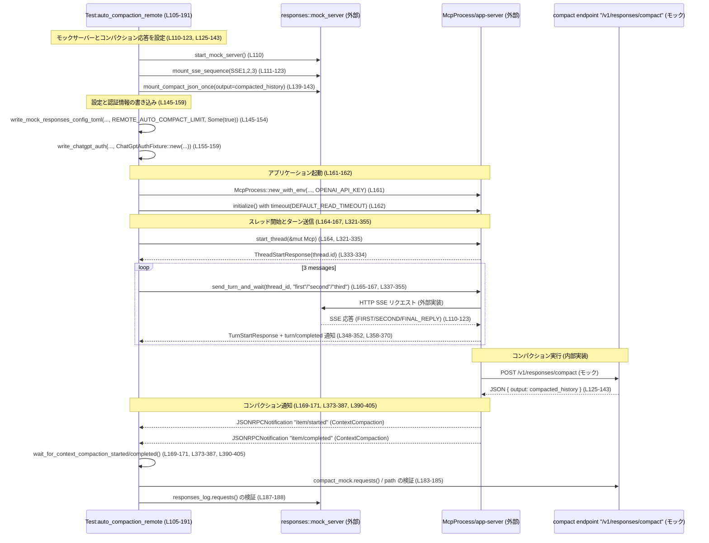

# app-server/tests/suite/v2/compaction.rs コード解説

## 0. ざっくり一言

v2 プロトコルの **コンテキストコンパクション（要約）機能** について、  
自動コンパクション・手動コンパクション・エラーケースを含む **エンドツーエンドの振る舞い** を検証する非同期テスト群です（compaction.rs:L1-6, L46-319）。

---

## 1. このモジュールの役割

### 1.1 概要

- このモジュールは、アプリケーションサーバーが
  - 会話量がしきい値を超えたときに自動でコンパクションを実行すること
  - `thread/compact/start` メソッドで手動コンパクションを開始できること
  - 不正・未知のスレッド ID に対して適切な JSON-RPC エラーを返すこと  
  をエンドツーエンドでテストします（compaction.rs:L41-44, L46-191, L193-319）。
- 外部との通信は `core_test_support::responses` のモック HTTP サーバーと、`app_test_support::McpProcess` を通じた JSON-RPC で行われます（compaction.rs:L10-15, L34, L50, L110, L197）。

### 1.2 アーキテクチャ内での位置づけ

このファイルは「テストコード」であり、本番コードの API を **ブラックボックス的に利用** して振る舞いを検証します。

主要な依存関係を次の Mermaid 図で表します。

```mermaid
graph TD
    subgraph Tests
      CompactionTests["compaction.rs 全体 (L46-405)"]
    end

    CompactionTests --> Mcp["app_test_support::McpProcess (外部)"]
    CompactionTests --> Responses["core_test_support::responses (外部)"]
    CompactionTests --> ProtoApp["codex_app_server_protocol::* (外部)"]
    CompactionTests --> ProtoCore["codex_protocol::models::* (外部)"]
    CompactionTests --> Config["write_mock_responses_config_toml (外部)"]
    CompactionTests --> Auth["write_chatgpt_auth / ChatGptAuthFixture (外部)"]

    Mcp --> "アプリケーションサーバープロセス(外部実体)"
    Responses --> "HTTP モックサーバー(外部実体)"
```

- `McpProcess` は app-server プロセスと JSON-RPC で通信するテスト用クライアントです（compaction.rs:L12, L80-81, L161-162, L215-216, L265-266, L301-302）。
- `responses` は SSE や compaction API を提供する HTTP モックサーバーを起動・設定します（compaction.rs:L34, L50-67, L110-123, L139-143, L197-203）。

### 1.3 設計上のポイント

- **エンドツーエンド志向**
  - サーバープロセス（`McpProcess` 経由）と HTTP モックサーバーを実際に起動し、JSON-RPC 経由で対話する構成になっています（compaction.rs:L50-81, L110-123, L197-203, L215-216, L321-334, L337-352）。
- **非同期 + マルチスレッド**
  - 全テストは `#[tokio::test(flavor = "multi_thread", worker_threads = 2)]` で実行され、Tokio のマルチスレッドランタイム上で動作します（compaction.rs:L46, L105, L193, L249, L285）。
- **タイムアウトによる安全性**
  - JSON-RPC 応答・通知の待機にはすべて `tokio::time::timeout` を必ず挟み、ハングを防いでいます（compaction.rs:L81, L162, L224-227, L273-276, L309-312, L328-332, L348-352, L360-364, L377-381, L394-398）。
- **プロトコル契約の強制**
  - 通知の `params` 欄は `expect("... params")` で強制されており、欠落している場合は panic します（compaction.rs:L366-367, L383-383, L400-400）。  
    これは「プロトコル違反＝テスト失敗」とみなす設計です。
- **自動／手動コンパクションとエラーの網羅**
  - ローカルコンパクション・リモートコンパクション・手動トリガー・不正 ID・未知 ID のケースを個別テストでカバーしています（compaction.rs:L46-191, L193-247, L249-319）。
- **ネットワーク環境への配慮**
  - `skip_if_no_network!` マクロで、ネットワークが利用できない環境ではテスト自体をスキップします（compaction.rs:L48, L107, L195, L251, L287）。

セキュリティ観点では、このファイルはテスト専用であり、本番のシークレットは `ChatGptAuthFixture` などのフィクスチャでモックされています（compaction.rs:L155-159, L161-162）。  
環境変数 `OPENAI_API_KEY` も `McpProcess::new_with_env` の引数として明示的に設定されていますが、実際に外部 API へ接続するかどうかはこのファイルからは分かりません（compaction.rs:L161-162）。

---

## 2. 主要な機能一覧（コンポーネントインベントリー）

### 2.1 関数・テストケース一覧

| 名前 | 種別 | 役割 / 説明 | 行範囲 |
|------|------|-------------|--------|
| `auto_compaction_local_emits_started_and_completed_items` | Tokio テスト | ローカルコンパクションが自動で実行され、`item/started` と `item/completed` の `ContextCompaction` 通知が発行されることを検証します。 | compaction.rs:L46-103 |
| `auto_compaction_remote_emits_started_and_completed_items` | Tokio テスト | リモートコンパクション（/v1/responses/compact）が 1 回だけ呼ばれ、同様に `item/started` / `item/completed` 通知が発行されることを検証します。 | compaction.rs:L105-191 |
| `thread_compact_start_triggers_compaction_and_returns_empty_response` | Tokio テスト | `thread/compact/start` RPC がコンパクションを開始し、レスポンスが空（`ThreadCompactStartResponse`）かつコンパクション通知が届くことを検証します。 | compaction.rs:L193-247 |
| `thread_compact_start_rejects_invalid_thread_id` | Tokio テスト | フォーマット的に不正な thread_id に対して JSON-RPC エラーコード `-32600` とメッセージ `"invalid thread id"` を返すことを検証します。 | compaction.rs:L249-283 |
| `thread_compact_start_rejects_unknown_thread_id` | Tokio テスト | フォーマットは正しいが存在しない thread_id に対して、同じエラーコードで `"thread not found"` メッセージを返すことを検証します。 | compaction.rs:L285-319 |
| `start_thread` | ヘルパー関数 | `thread/start` RPC を送り、作成されたスレッドの ID を返します。 | compaction.rs:L321-335 |
| `send_turn_and_wait` | ヘルパー関数 | `turn/start` RPC を送り、該当ターンの `turn/completed` 通知が来るまで待機してターン ID を返します。 | compaction.rs:L337-355 |
| `wait_for_turn_completed` | ヘルパー関数 | 指定されたターン ID の `turn/completed` 通知を待ち合わせます。 | compaction.rs:L358-370 |
| `wait_for_context_compaction_started` | ヘルパー関数 | `item/started` 通知のうち `ThreadItem::ContextCompaction` のものが現れるまで待ち合わせ、通知を返します。 | compaction.rs:L373-387 |
| `wait_for_context_compaction_completed` | ヘルパー関数 | `item/completed` 通知のうち `ThreadItem::ContextCompaction` のものが現れるまで待ち合わせ、通知を返します。 | compaction.rs:L390-405 |

### 2.2 定数一覧

| 名前 | 型 | 役割 / 用途 | 行範囲 |
|------|----|-------------|--------|
| `DEFAULT_READ_TIMEOUT` | `std::time::Duration` | 全ての JSON-RPC 応答・通知待ちに使用する 10 秒のタイムアウト値です。| compaction.rs:L41 |
| `AUTO_COMPACT_LIMIT` | `i64` | モック設定に渡される自動コンパクションのしきい値です。値は `1_000` に固定されています（詳細な意味はこのファイルからは不明です）。| compaction.rs:L42, L69-78, L205-213, L255-263, L291-299 |
| `COMPACT_PROMPT` | `&'static str` | コンパクション時に使用されるプロンプト文字列 `"Summarize the conversation."` です。| compaction.rs:L43, L77, L153, L212, L263, L299 |
| `INVALID_REQUEST_ERROR_CODE` | `i64` | 不正な `thread_id` に対する JSON-RPC エラーコード `-32600` を表します。| compaction.rs:L44, L279, L315 |

---

## 3. 公開 API と詳細解説

このファイルで **新規に公開される型** はありません。  
以降では、テスト内で重要な役割を持つ関数を中心に詳細を説明します。

### 3.1 型一覧（このモジュール内で定義される型）

このファイル内に構造体・列挙体などの新規定義は存在しません。  
代わりに、以下のような外部プロトコル型を使用しています（すべて `codex_app_server_protocol` からのインポート、compaction.rs:L16-30）。

| 名前 | 種別 | このファイルでの主な利用 |
|------|------|--------------------------|
| `JSONRPCResponse` | 構造体（外部） | RPC の応答ボディを表し、`to_response::<T>` で具体的なレスポンス型にデコードされます（compaction.rs:L220-230, L328-333, L348-353）。 |
| `JSONRPCNotification` | 構造体（外部） | 通知メッセージを表し、`wait_for_*` 関数内で `serde_json::from_value` に渡されます（compaction.rs:L360-367, L377-383, L394-400）。 |
| `JSONRPCError` | 構造体（外部） | エラー応答を表し、`thread_compact_start_*rejects*` テストで検証されます（compaction.rs:L273-280, L309-316）。 |
| `ThreadItem` | 列挙体（外部） | `ContextCompaction { id }` 変種のみを利用し、コンパクション処理のアイテム種別と ID を表します（compaction.rs:L24, L91-96, L94-96, L172-177, L235-240, L384-385, L401-402）。 |
| `ItemStartedNotification` | 構造体（外部） | `item/started` 通知の payload を表します（compaction.rs:L16, L88-89, L382-385）。 |
| `ItemCompletedNotification` | 構造体（外部） | `item/completed` 通知の payload を表します（compaction.rs:L17, L89-90, L399-402）。 |
| `TurnCompletedNotification` | 構造体（外部） | `turn/completed` 通知の payload であり、特定ターンの完了を示します（compaction.rs:L27, L365-368）。 |
| `ThreadStartResponse` | 構造体（外部） | `thread/start` の応答で、生成された `thread.id` を含みます（compaction.rs:L25-26, L333-334）。 |
| `TurnStartResponse` | 構造体（外部） | `turn/start` の応答で、生成された `turn.id` を含みます（compaction.rs:L28-29, L353-354）。 |
| `ThreadCompactStartResponse` | 構造体（外部） | `thread/compact/start` の応答型です（compaction.rs:L22-23, L229-230）。 |

### 3.2 重要な関数の詳細

以下では、特に中心的な 7 関数について詳細を示します。

#### `auto_compaction_local_emits_started_and_completed_items() -> Result<()>`

**概要**

ローカルコンパクション設定での自動コンパクションフローをエンドツーエンドで検証するテストです。  
3 つのユーザーメッセージを送り、その結果として 1 回の `ContextCompaction` の `item/started` / `item/completed` 通知が同じ thread_id / item_id で発行されることを確認します（compaction.rs:L46-103）。

**引数**

- なし（Tokio テスト関数としてフレームワークから直接呼ばれます）。

**戻り値**

- `anyhow::Result<()>`  
  いずれかのステップでエラーやタイムアウト、プロトコル違反があれば `Err` を返し、テスト失敗となります（compaction.rs:L47, L102）。

**内部処理の流れ**

1. ネットワーク環境がなければテストをスキップ（`skip_if_no_network!(Ok(()));`）（compaction.rs:L48）。
2. モック HTTP サーバーを起動し、4 つの SSE シーケンス（2 回の通常応答 + ローカルサマリー + 最終応答）を登録します（compaction.rs:L50-67）。
3. 一時ディレクトリ `codex_home` を作成し、`write_mock_responses_config_toml` で
   - モックサーバーの URI
   - `AUTO_COMPACT_LIMIT`
   - プロンプト `COMPACT_PROMPT`  
   を含む設定を書き込みます（compaction.rs:L69-78）。
4. `McpProcess::new` でアプリケーションサーバープロセスを起動し、`initialize()` をタイムアウト付きで完了させます（compaction.rs:L80-81）。
5. `start_thread` で `thread/start` を発行し、スレッド ID を取得します（compaction.rs:L83, L321-335）。
6. `"first"`, `"second"`, `"third"` の 3 つのメッセージについて、`send_turn_and_wait` でターンを開始し、各ターンの完了通知まで待ちます（compaction.rs:L84-86, L337-355）。
7. `wait_for_context_compaction_started` と `wait_for_context_compaction_completed` を呼び、コンパクション開始・完了通知を取得します（compaction.rs:L88-89, L373-387, L390-405）。
8. 2 つの通知の `thread_id` がスレッド ID と一致し、`ThreadItem::ContextCompaction` の ID も一致していることを `assert_eq` で検証します（compaction.rs:L91-100）。

**Examples（使用例）**

この関数自体がテストケースであり、直接再利用される想定ではありませんが、同様のテストを書く場合のテンプレートとして利用できます。

```rust
#[tokio::test(flavor = "multi_thread", worker_threads = 2)]
async fn my_local_compaction_test() -> Result<()> {
    skip_if_no_network!(Ok(())); // ネットワークが使えない環境ではスキップ

    // モックサーバー起動と SSE 設定
    let server = responses::start_mock_server().await;
    // ... SSE を必要なパターンで設定 ...

    // 設定ディレクトリ作成とモック設定書き込み
    let codex_home = TempDir::new()?;
    write_mock_responses_config_toml(
        codex_home.path(),
        &server.uri(),
        &BTreeMap::default(),
        AUTO_COMPACT_LIMIT,
        None,
        "mock_provider",
        COMPACT_PROMPT,
    )?;

    // アプリ起動とスレッド・ターンの送信
    let mut mcp = McpProcess::new(codex_home.path()).await?;
    timeout(DEFAULT_READ_TIMEOUT, mcp.initialize()).await??;
    let thread_id = start_thread(&mut mcp).await?;
    send_turn_and_wait(&mut mcp, &thread_id, "hello").await?;

    // コンパクション通知の検証
    let started = wait_for_context_compaction_started(&mut mcp).await?;
    let completed = wait_for_context_compaction_completed(&mut mcp).await?;
    // ... 必要な assert を追加 ...
    Ok(())
}
```

**Errors / Panics**

- 任意の `?` で伝播されるエラー
  - モックサーバー起動・設定失敗（compaction.rs:L50-67, L69-78）
  - `TempDir::new()` や `McpProcess::new` の失敗（compaction.rs:L69-80）
  - JSON-RPC 通信の失敗・タイムアウト（compaction.rs:L81, L83-89）
  - JSON デコード失敗（`to_response`, `serde_json::from_value`）（compaction.rs:L333-334, L353-354, L366-367, L383-383, L400-400）
- `wait_for_*` 内部の `expect("... params")` による panic の可能性
  - 通知メッセージから `params` が欠落していると panic します（compaction.rs:L366-367, L383-383, L400-400）。

**Edge cases（エッジケース）**

- コンパクションが一度も実行されない場合
  - `wait_for_context_compaction_started` 内部で `timeout` が `Elapsed` エラーとなり、`?` によりテストが失敗します。無限ループにはなりません（compaction.rs:L377-381）。
- 他の種類の `item/started` 通知が混在する場合
  - `ThreadItem::ContextCompaction` 以外は無視し、ループを継続します（compaction.rs:L384-385）。
- `thread_id` が一致しない通知
  - `wait_for_*` は `thread_id` ではなく `item` の種類だけを見ているため、もし他スレッドの `ContextCompaction` が存在すると誤って拾う可能性があります。現状のテストではスレッドは 1 つだけなので問題化していませんが、再利用時の注意点です（compaction.rs:L373-387, L390-405）。

**使用上の注意点**

- `DEFAULT_READ_TIMEOUT` が固定 10 秒のため、環境によっては短すぎる可能性があります（compaction.rs:L41）。タイムアウトエラーが頻発する場合はこの値を調整する必要があります。
- `wait_for_*` はスレッド ID でフィルタリングしていないため、複数スレッドを扱うテストで使う場合は追加の条件チェックを行うか、関数自体を拡張する必要があります（compaction.rs:L384-385, L401-402）。

---

#### `auto_compaction_remote_emits_started_and_completed_items() -> Result<()>`

**概要**

リモートコンパクション（外部の `/v1/responses/compact` エンドポイント）を利用する設定で、自動コンパクションの開始／完了通知とコンパクション API 呼び出し回数を検証するテストです（compaction.rs:L105-191）。

**引数**

- なし（Tokio テスト）。

**戻り値**

- `anyhow::Result<()>`。エラーがあればテスト失敗（compaction.rs:L106, L190）。

**内部処理の流れ**

1. ネットワークチェック（compaction.rs:L107）。
2. モックサーバーを起動し、3 回分の SSE を設定（compaction.rs:L110-123）。
3. コンパクション結果として返す `compacted_history` を組み立て、`mount_compact_json_once` で `/v1/responses/compact` のモックレスポンスを一度だけ登録（compaction.rs:L125-143）。
4. `REMOTE_AUTO_COMPACT_LIMIT = 200_000` を用いる設定ファイルを `write_mock_responses_config_toml` で書き込み、`requires_openai_auth` を `Some(true)` に設定（compaction.rs:L108, L145-154）。
5. `write_chatgpt_auth` と `McpProcess::new_with_env` により、ChatGPT 認証情報と `OPENAI_API_KEY` 環境変数をモック設定（compaction.rs:L155-162）。
6. ローカルテストと同様にスレッドを開始し、3 つのターンを送信して完了を待機（compaction.rs:L164-167）。
7. `ContextCompaction` の started/completed 通知を取得し、thread_id と item_id の整合性を検証（compaction.rs:L169-181）。
8. `compact_mock.requests()` と `responses_log.requests()` を調べ、コンパクション API が 1 回だけ `/v1/responses/compact` に対して呼ばれていること、および SSE 応答が 3 回であることを検証（compaction.rs:L183-188）。

**Errors / Panics**

- ローカルコンパクションテストと同様のエラー／panic パターンに加え、以下が考えられます。
  - ChatGPT 認証情報の書き込み失敗（compaction.rs:L155-159）。
  - `McpProcess::new_with_env` の起動失敗（compaction.rs:L161-162）。

**Edge cases**

- コンパクション API が呼ばれない、または 2 回以上呼ばれる
  - `assert_eq!(compact_requests.len(), 1)` によりテストが失敗します（compaction.rs:L183-184）。
- 間違ったパスに対して呼ばれる
  - `assert_eq!(compact_requests[0].path(), "/v1/responses/compact");` により失敗します（compaction.rs:L185）。

**使用上の注意点**

- `mount_compact_json_once` は「一度だけレスポンスする」モックであり、複数回呼び出したい場合は別のヘルパー、または適切な設定が必要です（compaction.rs:L139-143）。
- 認証関連はすべてモックであり、本番の認証ロジックはこのテストからは分かりません。そのため、このテストを参考に本番コードのセキュリティを判断するのは適切ではありません。

---

#### `thread_compact_start_triggers_compaction_and_returns_empty_response() -> Result<()>`

**概要**

`thread/compact/start` RPC を明示的に呼び出すことでコンパクションが行われ、  
レスポンスが `ThreadCompactStartResponse` として正しく返されること、および `ContextCompaction` の通知が発行されることを検証します（compaction.rs:L193-247）。

**内部処理の流れ**

1. ネットワークチェック（compaction.rs:L195）。
2. モックサーバーを起動し、コンパクション用の 1 回分の SSE を設定（compaction.rs:L197-203）。
3. ローカルコンパクション設定を書き込み、`McpProcess` を起動（compaction.rs:L204-216）。
4. `start_thread` でスレッドを作成（compaction.rs:L218）。
5. `send_thread_compact_start_request` で手動コンパクションを開始し、返ってきたリクエスト ID (`compact_id`) を保持（compaction.rs:L219-223）。
6. その ID をキーとして `read_stream_until_response_message` で応答を待ち、`ThreadCompactStartResponse` にデコード（compaction.rs:L224-230）。
7. `wait_for_context_compaction_started` / `wait_for_context_compaction_completed` を用いて通知を取得し、thread_id と item_id の整合性を検証（compaction.rs:L232-244）。

**Edge cases / 使用上の注意点**

- 応答 (`ThreadCompactStartResponse`) の内容は変数 `_compact` にバインドされるだけで、中身は検証していません（compaction.rs:L229-230）。  
  コンパクション結果の詳細をテストしたい場合は、ここに追加の `assert` を行う必要があります。
- 手動コンパクションであっても、通知を待つロジックは自動コンパクションと共通です（compaction.rs:L232-244, L373-387, L390-405）。

---

#### `thread_compact_start_rejects_invalid_thread_id() -> Result<()>`

**概要**

フォーマット的に不正な thread_id（`"not-a-thread-id"`）を指定した `thread/compact/start` 呼び出しが、  
JSON-RPC エラーコード `-32600` (`INVALID_REQUEST_ERROR_CODE`) と `"invalid thread id"` メッセージを返すことを検証します（compaction.rs:L249-283）。

**内部処理の流れ**

1. ネットワークチェックとモックサーバー・設定・`McpProcess` 起動（compaction.rs:L251-267）。
2. `thread_id: "not-a-thread-id".to_string()` を渡して `send_thread_compact_start_request` を呼び出し、リクエスト ID を取得（compaction.rs:L268-272）。
3. その ID で `read_stream_until_error_message` を呼び出し、`JSONRPCError` を受け取る（compaction.rs:L273-277）。
4. `error.error.code == INVALID_REQUEST_ERROR_CODE` と、`message` に `"invalid thread id"` が含まれることを `assert`（compaction.rs:L279-280）。

**契約・エッジケース**

- プロトコルレベルの契約として、
  - 不正フォーマットの ID → コード `-32600` + `"invalid thread id"`  
  の組み合わせが期待されていることが、このテストから読み取れます（compaction.rs:L44, L270, L279-280）。
- エラーコードは「invalid request」で一般的に使われる -32600 ですが、その運用ポリシーはこのファイルからは分かりません。

---

#### `thread_compact_start_rejects_unknown_thread_id() -> Result<()>`

**概要**

形式的には正しい UUID 形式の thread_id だが、サーバーが知らない ID を指定した場合に  
エラーコードは同じ `-32600` だが、メッセージが `"thread not found"` になることを検証します（compaction.rs:L285-319）。

**内部処理の流れ**

1. ネットワークチェックと環境構築は前のテストと同様（compaction.rs:L287-303）。
2. `thread_id: "67e55044-10b1-426f-9247-bb680e5fe0c8".to_string()` を指定してコンパクション開始要求を送信（compaction.rs:L304-308）。
3. エラー応答を受け取り、コードとメッセージを検証（compaction.rs:L309-316）。

**契約・エッジケース**

- ID のフォーマットが正しくても、「存在しないスレッド」であればエラーになることを保証しています（compaction.rs:L304-307, L315-316）。
- 「不正フォーマット」と「未知 ID」でエラーコードを同じにしているため、  
  クライアント側はメッセージで原因を判別する設計になっていることが推測されますが、  
  これはこのテスト以外のコードを見ないと断定できません。

---

#### `send_turn_and_wait(mcp: &mut McpProcess, thread_id: &str, text: &str) -> Result<String>`

**概要**

指定した `thread_id` のスレッドにユーザー入力 `text` を含む `turn/start` RPC を送り、  
そのターンの `turn/completed` 通知を受信するまで待機してから、ターン ID を返すヘルパー関数です（compaction.rs:L337-355）。

**引数**

| 引数名 | 型 | 説明 |
|--------|----|------|
| `mcp` | `&mut McpProcess` | JSON-RPC を送受信するプロセスクライアントです。可変参照で渡されます（compaction.rs:L337）。 |
| `thread_id` | `&str` | 対象スレッドの ID 文字列です（compaction.rs:L337-340）。 |
| `text` | `&str` | ユーザーが入力するテキストメッセージです（compaction.rs:L337, L342）。 |

**戻り値**

- `Result<String>`:  
  正常時は開始されたターンの ID (`turn.id`) を文字列として返し、エラー時は `anyhow::Error` を返します（compaction.rs:L353-355）。

**内部処理の流れ**

1. `TurnStartParams` を組み立て、`V2UserInput::Text` として `text` を単一要素の入力ベクタに設定（compaction.rs:L339-345）。
2. `mcp.send_turn_start_request(...)` を呼び出し、リクエスト ID (`turn_id`) を受け取る（compaction.rs:L338-347）。
3. `timeout(DEFAULT_READ_TIMEOUT, mcp.read_stream_until_response_message(...))` で、
   そのリクエスト ID に対応した `JSONRPCResponse` を読み取る（compaction.rs:L348-352）。
4. `to_response::<TurnStartResponse>(turn_resp)` で具体的なレスポンスにデコードし、`turn.id` を取り出す（compaction.rs:L353-354）。
5. `wait_for_turn_completed(mcp, &turn.id).await?` を呼び出し、そのターンの完了通知を待ってから `turn.id` を返す（compaction.rs:L354-355）。

**Examples（使用例）**

```rust
// スレッドを開始した後、そのスレッドに 1 件のターンを追加し、完了まで待つ例
let thread_id = start_thread(&mut mcp).await?;
let turn_id = send_turn_and_wait(&mut mcp, &thread_id, "hello").await?;
// ここに到達した時点で、このターンの処理は完了している
println!("turn completed: {turn_id}");
```

**Errors / Panics**

- `send_turn_start_request` が失敗した場合（JSON-RPC 送信エラーなど）、`?` でエラーが返ります（compaction.rs:L338-347）。
- 応答が `DEFAULT_READ_TIMEOUT` 内に返ってこない場合、`timeout` から `Elapsed` が返り、`?` で伝播します（compaction.rs:L348-352）。
- `to_response::<TurnStartResponse>` が JSON 形式の不一致などで失敗した場合も `?` で伝播します（compaction.rs:L353-354）。
- `wait_for_turn_completed` 内での `timeout` や JSON デコードエラーも、`?` を通じて返されます（compaction.rs:L358-370）。

**Edge cases**

- 同時に複数のターンを開始した場合
  - `wait_for_turn_completed` は `turn_id` でフィルタリングしているため、他のターンの `turn/completed` が届いてもスキップし、指定したターンの完了を待ち続けます（compaction.rs:L367-368）。
- サーバーが `turn/completed` 通知を送らない場合
  - 内部の `timeout` により一定時間後にエラーとなり、ハングはしません（compaction.rs:L360-364）。

**使用上の注意点**

- この関数を呼び出した時点で、指定ターンが完全に完了するまで戻ってこないため、長時間かかるターンに対して多用するとテスト全体の実行時間が伸びます。
- `text_elements` は常に空ベクタを指定しているため、リッチな入力要素（画像など）をテストしたい場合はこの部分を拡張する必要があります（compaction.rs:L343-344）。

---

#### `wait_for_context_compaction_started(mcp: &mut McpProcess) -> Result<ItemStartedNotification>`

**概要**

アプリケーションから送られてくる `item/started` 通知を監視し、  
`ThreadItem::ContextCompaction { .. }` 型のアイテムが見つかるまで待機して、その通知を返すヘルパー関数です（compaction.rs:L373-387）。

**引数**

| 引数名 | 型 | 説明 |
|--------|----|------|
| `mcp` | `&mut McpProcess` | JSON-RPC 通知ストリームを読み取るクライアントです（compaction.rs:L373）。 |

**戻り値**

- `Result<ItemStartedNotification>`  
  正常完了時はコンパクション開始通知を含む構造体を返します。  
  タイムアウトや JSON デコードエラー時には `Err` となります（compaction.rs:L373-387）。

**内部処理の流れ**

1. `loop { ... }` による無限ループを開始（compaction.rs:L376）。
2. 各ループで `timeout(DEFAULT_READ_TIMEOUT, mcp.read_stream_until_notification_message("item/started"))` を呼び出し、`"item/started"` メソッドの通知を待つ（compaction.rs:L377-381）。
3. 受信した `JSONRPCNotification` から `params` を取り出し、`expect("item/started params")` で存在を強制したうえで `serde_json::from_value` により `ItemStartedNotification` にデコード（compaction.rs:L382-383）。
4. `if let ThreadItem::ContextCompaction { .. } = started.item` で、対象がコンテキストコンパクションかどうか判定し、一致する場合に `Ok(started)` を返す（compaction.rs:L384-385）。
5. 一致しない場合はループ先頭に戻り、次の `"item/started"` 通知を待ちます（compaction.rs:L376-387）。

**Errors / Panics**

- `read_stream_until_notification_message` が `DEFAULT_READ_TIMEOUT` 以内に通知を返さない場合、`timeout` によって `Elapsed` エラーが返り、`?` で上位に伝播します（compaction.rs:L377-381）。
- `notification.params` が `None` の場合、`expect("item/started params")` により panic します（compaction.rs:L382）。
- `serde_json::from_value` が JSON 形式の不一致で失敗した場合、`?` によりエラーとして返ります（compaction.rs:L382-383）。

**Edge cases**

- `item/started` 通知が全く送られない場合
  - タイムアウトにより一定時間後にエラーとなり、無限に待ち続けることはありません（compaction.rs:L377-381）。
- 複数種別の `item/started` 通知が混在する場合
  - `ThreadItem::ContextCompaction` 以外はスキップするため、コンパクション開始が遅れて後に来る場合でも正しく拾えます（compaction.rs:L384-385）。

**使用上の注意点**

- thread_id を見ていないため、複数スレッドで同時にコンパクションが行われるようなテストにはそのまま使えません。必要であれば `started.thread_id` もチェックするよう拡張する必要があります（compaction.rs:L384-385, L98-99, L179-180）。
- `expect` による panic は「プロトコル契約違反を見逃さない」ための設計ですが、パニック発生時のスタックトレースを読みやすくするために、メッセージやログを工夫する余地があります。

---

### 3.3 その他の関数

| 関数名 | 役割（1 行） | 行範囲 |
|--------|--------------|--------|
| `start_thread` | `thread/start` RPC を送信してスレッド ID を取得するヘルパーです。 | compaction.rs:L321-335 |
| `wait_for_turn_completed` | `"turn/completed"` 通知を監視し、特定ターン ID に一致する通知を受け取るまで待機します。 | compaction.rs:L358-370 |
| `wait_for_context_compaction_completed` | `"item/completed"` 通知から `ThreadItem::ContextCompaction` を見つけるまで待機します。 | compaction.rs:L390-405 |

---

## 4. データフロー

ここでは、**リモート自動コンパクション** テストを例に、主要なコンポーネント間のやり取りを示します。

### 4.1 処理の概要

1. テスト関数 `auto_compaction_remote_emits_started_and_completed_items` が
   - HTTP モックサーバー (`responses`) に SSE とコンパクション API のモックを登録し（compaction.rs:L110-123, L139-143）、
   - 一時ディレクトリに設定を書き込み（compaction.rs:L145-154）、
   - `McpProcess` を起動します（compaction.rs:L161-162）。
2. `McpProcess` 内部で app-server プロセスが設定を読み取り、モックサーバーに対して SSE や `/v1/responses/compact` を利用しながら通常の対話とコンパクション処理を行います（実際の内部実装はこのファイルには現れません）。
3. `send_turn_and_wait` が JSON-RPC 経由でターンを送信し、`McpProcess` 経由で通知を受け取ります（compaction.rs:L164-167, L337-355）。
4. コンパクション発生後、`wait_for_context_compaction_started` / `completed` が `item/*` 通知を受け取り、ID 整合性と HTTP 呼び出し回数を検証します（compaction.rs:L169-188, L373-387, L390-405）。

### 4.2 シーケンス図



図中の「HTTP SSE リクエスト」や app-server 内部のコンパクション実行は、このファイルの範囲外の実装に依存しており、詳細は不明です。

---

## 5. 使い方（How to Use）

このファイルはテスト専用ですが、**v2 コンパクション機能を使ったエンドツーエンドテストを書くためのパターン**として参考になります。

### 5.1 基本的な使用方法（テストの典型フロー）

1. モックサーバー起動 & SSE / compact API 設定
2. テンポラリディレクトリにテスト専用設定を書き込み
3. `McpProcess` により app-server を起動・初期化
4. スレッド開始・ターン送信
5. 通知 (`turn/completed`, `item/started`, `item/completed`) を待ち合わせて検証

例（ローカルコンパクションテストのテンプレート）:

```rust
#[tokio::test(flavor = "multi_thread", worker_threads = 2)]
async fn my_compaction_test() -> Result<()> {
    skip_if_no_network!(Ok(())); // ネットワークが使えない環境ではスキップ

    // 1. モックサーバーと SSE 設定
    let server = responses::start_mock_server().await;
    let sse = responses::sse(vec![
        responses::ev_assistant_message("m1", "REPLY"),
        responses::ev_completed_with_tokens("r1", 10_000),
    ]);
    responses::mount_sse_sequence(&server, vec![sse]).await;

    // 2. テスト用設定を一時ディレクトリに書き込み
    let codex_home = TempDir::new()?;
    write_mock_responses_config_toml(
        codex_home.path(),
        &server.uri(),
        &BTreeMap::default(),
        AUTO_COMPACT_LIMIT,
        None,                   // requires_openai_auth
        "mock_provider",
        COMPACT_PROMPT,
    )?;

    // 3. app-server プロセス起動と初期化
    let mut mcp = McpProcess::new(codex_home.path()).await?;
    timeout(DEFAULT_READ_TIMEOUT, mcp.initialize()).await??;

    // 4. スレッド開始とターン送信
    let thread_id = start_thread(&mut mcp).await?;
    let _turn_id = send_turn_and_wait(&mut mcp, &thread_id, "hello").await?;

    // 5. コンパクション通知の検証
    let started = wait_for_context_compaction_started(&mut mcp).await?;
    let completed = wait_for_context_compaction_completed(&mut mcp).await?;
    assert_eq!(started.thread_id, completed.thread_id);

    Ok(())
}
```

### 5.2 よくある使用パターン

- **自動 vs 手動コンパクション**
  - 自動コンパクション: `AUTO_COMPACT_LIMIT` を設定し、複数ターンを送信することでトークン数しきい値超えを利用（compaction.rs:L42, L69-78, L84-86, L110-123）。
  - 手動コンパクション: 任意のタイミングで `send_thread_compact_start_request` を呼び出し、コンパクションを明示的に開始（compaction.rs:L219-223）。
- **ローカル vs リモートコンパクション**
  - ローカル: `requires_openai_auth` を `None` にし、コンパクションはモックサーバーの SSE の 3 つ目などで表現（compaction.rs:L69-78, L59-62）。
  - リモート: `Some(true)` と ChatGPT 認証情報を書き込み、`/v1/responses/compact` モックを使用（compaction.rs:L145-154, L155-159, L139-143, L183-185）。

### 5.3 よくある間違いと注意点

```rust
// 間違い例: ターン開始後に完了通知を待たずにコンパクション通知を待ってしまう
let turn_id = mcp.send_turn_start_request(/* ... */).await?;
// すぐにコンパクション通知を待ち始めると、ターン処理が完了していない可能性がある
let started = wait_for_context_compaction_started(&mut mcp).await?; // タイミング依存で不安定

// 正しい例: send_turn_and_wait でターン完了まで待つ
let turn_id = send_turn_and_wait(&mut mcp, &thread_id, "message").await?;
let started = wait_for_context_compaction_started(&mut mcp).await?;
```

- **タイムアウトの未使用**
  - 直接 `mcp.read_stream_until_*` を呼び、`timeout` を介さないと、バグや環境問題で通知が来なかった場合にテストがハングします。  
    このファイルでは必ず `timeout(DEFAULT_READ_TIMEOUT, ...)` を使うよう統一されています（compaction.rs:L81, L162, L224-227, L273-276, L309-312, L328-332, L348-352, L360-364, L377-381, L394-398）。
- **thread_id / item 種別のフィルタ漏れ**
  - `wait_for_context_compaction_*` はコンパクション種別のみを見ており thread_id でのフィルタをしていません（compaction.rs:L384-385, L401-402）。  
    複数スレッドのテストで使う場合は、通知の `thread_id` を追加でチェックする設計に変更する必要があります。

### 5.4 モジュール全体の注意点

- **非同期 & マルチスレッド**
  - `#[tokio::test(flavor = "multi_thread")]` のため、テストコード側でブロッキング I/O を行うとスレッド枯渇を起こす可能性があります（compaction.rs:L46, L105, L193, L249, L285）。
- **プロトコル前提の強さ**
  - `expect` による panic に依存しているため、プロトコル互換性が崩れた際にはテストがパニック終了します（compaction.rs:L366-367, L383-383, L400-400）。  
    エラーとして扱いたい場合は `expect` を `ok_or_else` + `?` などに変更する必要があります。
- **セキュリティ**
  - このファイルはテスト専用であり、本物のシークレットや実環境の認証情報は使っていません。  
    ただし、`OPENAI_API_KEY` などの環境変数を扱う場面では、実行環境に不要なキーが設定されていないか確認することが望ましいです（compaction.rs:L161-162）。

---

## 6. 変更の仕方（How to Modify）

### 6.1 新しいコンパクションシナリオを追加する場合

1. **テストケースの追加場所**
   - 本ファイル内に新しい `#[tokio::test] async fn ...()` を追加します（既存のテストと同じスタイル、compaction.rs:L46-103, L105-191 などを参考）。
2. **HTTP/SSE モックの準備**
   - `responses::start_mock_server` と `responses::sse`, `mount_sse_sequence` を使って、新しい応答パターンを定義します（compaction.rs:L50-67, L110-123, L197-203）。
3. **設定の調整**
   - 自動コンパクションのしきい値やリモート／ローカルの違いは `write_mock_responses_config_toml` の引数で制御します（compaction.rs:L69-78, L145-154, L205-213, L255-263, L291-299）。
4. **RPC 呼び出し**
   - スレッド開始やターン送信は既存のヘルパー `start_thread`, `send_turn_and_wait` を再利用します（compaction.rs:L321-355）。
   - 手動コンパクションを試したい場合は `send_thread_compact_start_request`（外部メソッド）を用います（compaction.rs:L219-223, L268-272, L304-308）。
5. **通知の検証**
   - 必要に応じて `wait_for_turn_completed`, `wait_for_context_compaction_started`, `wait_for_context_compaction_completed` を使い、  
     thread_id や item_id、HTTP 呼び出し回数などを `assert` します（compaction.rs:L358-370, L373-387, L390-405）。

### 6.2 既存の機能を変更する場合の注意点

- **プロトコルの契約**
  - エラーコード `INVALID_REQUEST_ERROR_CODE = -32600` とメッセージ `"invalid thread id"` / `"thread not found"` は、クライアントとの契約としてテストされています（compaction.rs:L44, L279-280, L315-316）。  
    これらを変更する場合は、このテストと利用側コードの両方を同時に更新する必要があります。
- **通知メソッド名**
  - `"turn/completed"`, `"item/started"`, `"item/completed"` のメソッド名は `read_stream_until_notification_message` の引数としてハードコードされています（compaction.rs:L361-363, L378-380, L395-397）。  
    メソッド名を変更する場合は、ヘルパー関数の引数や実装もあわせて修正する必要があります。
- **タイムアウト値**
  - 全テストで `DEFAULT_READ_TIMEOUT` を共有しているため、この値を変更するとすべての待機ロジックに影響します（compaction.rs:L41, L81, L162, L224-227, L273-276, L309-312, L328-332, L348-352, L360-364, L377-381, L394-398）。
- **並行実行シナリオ**
  - 複数スレッド・複数コンパクションを同時に扱うようなテストを追加／変更したい場合は、
    - `wait_for_context_compaction_*` で thread_id もフィルタする
    - あるいは新しいヘルパー関数を作る  
    といった調整が必要です（compaction.rs:L384-385, L401-402）。

---

## 7. 関連ファイル

このモジュールと密接に関係する外部モジュール／ファイル（正確なパスはこのチャンクからは分かりませんが、モジュール名ベースで列挙します）。

| パス（モジュール名） | 役割 / 関係 |
|----------------------|------------|
| `app_test_support::McpProcess` | app-server プロセスと JSON-RPC で通信するテスト用クライアント。`send_thread_start_request`, `send_turn_start_request`, `send_thread_compact_start_request`, `read_stream_until_*` などを提供し、本ファイルの全テストから利用されています（compaction.rs:L12, L80-81, L161-162, L215-216, L265-266, L301-302, L321-355, L358-405）。 |
| `app_test_support::write_mock_responses_config_toml` | モックサーバー URL や auto-compact のしきい値などを含む設定ファイルを `codex_home` ディレクトリに生成するヘルパーです（compaction.rs:L15, L69-78, L145-154, L205-213, L255-263, L291-299）。 |
| `app_test_support::write_chatgpt_auth` / `ChatGptAuthFixture` | リモートコンパクションテストで利用される ChatGPT 認証情報のモックを生成し、設定ファイルに書き込みます（compaction.rs:L11, L14, L155-159）。 |
| `core_test_support::responses` | HTTP モックサーバー、SSE シーケンス、コンパクション API のモック (`mount_compact_json_once`) を提供します（compaction.rs:L34, L50-67, L110-123, L125-143, L197-203）。 |
| `core_test_support::skip_if_no_network` | ネットワーク環境がない場合にテストをスキップするためのマクロです（compaction.rs:L35, L48, L107, L195, L251, L287）。 |
| `codex_app_server_protocol` | JSON-RPC メッセージ・通知・レスポンス・パラメータ型を定義するプロトコルモジュールで、本ファイルの型のほとんどがここからインポートされています（compaction.rs:L16-30）。 |
| `codex_protocol::models::{ResponseItem, ContentItem}` | コンパクション結果のメッセージ／暗号化された要約 (`Compaction`) を表すモデルで、`auto_compaction_remote` テストで使用されます（compaction.rs:L32-33, L125-138）。 |
| `codex_config::types::AuthCredentialsStoreMode` | 認証情報の保存モード（ファイルなど）を表す型で、`write_chatgpt_auth` 呼び出しに使用されます（compaction.rs:L31, L155-159）。 |

このファイルは、これらのテストサポートモジュールを組み合わせる具体例となっており、v2 コンパクション機能のエンドツーエンド検証に焦点を当てています。
