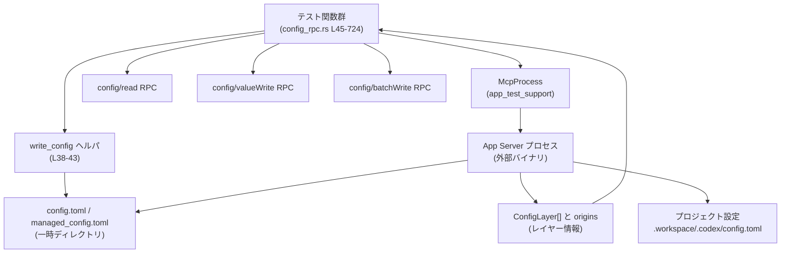
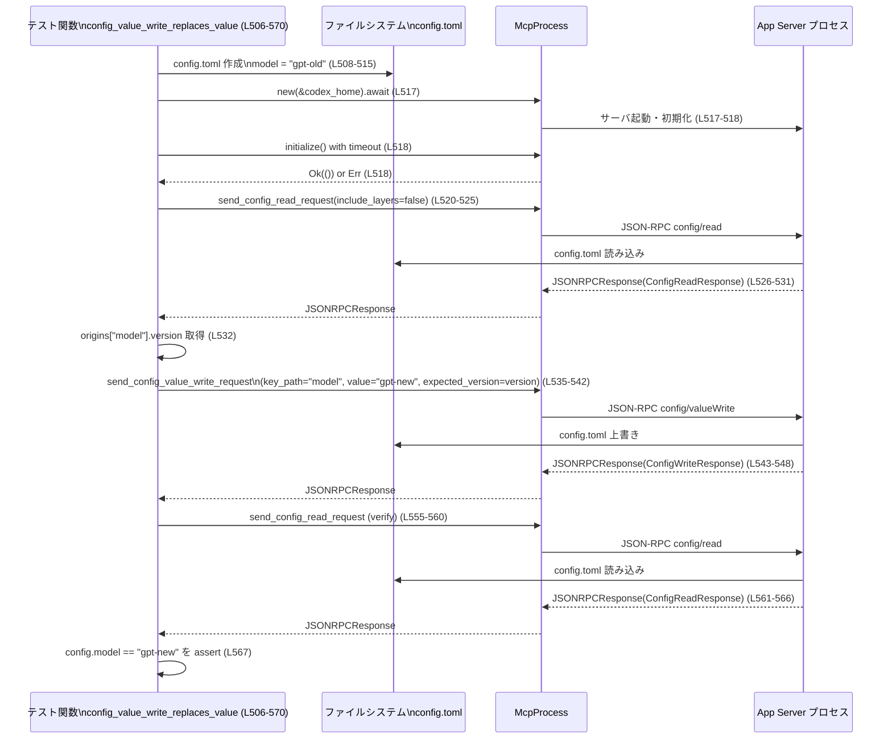

# app-server\tests\suite\v2\config_rpc.rs コード解説

## 0. ざっくり一言

- App Server v2 の **設定用 JSON-RPC API**（config/read・config/valueWrite・config/batchWrite）の挙動を、実プロセスを立ち上げて検証する統合テスト群です（config_rpc.rs:L45-724）。
- 設定レイヤー（ユーザ／管理／システム／プロジェクト）・ツール設定・アプリ設定・バージョン付き書き込み・バッチ書き込み・パイプライン書き込みなどの契約を確認します。

---

## 1. このモジュールの役割

### 1.1 概要

- このモジュールは **App Server の設定 RPC インターフェースが仕様どおり動作するか** を検証するために存在し、主に次の機能をテストします。
  - config/read による **有効設定値＋レイヤー情報＋起源メタデータ** の取得（config_rpc.rs:L45-89, L91-171 等）。
  - tools・apps・web_search などの **ネストした設定構造のシリアライズ／デシリアライズ**（config_rpc.rs:L91-171, L173-251, L253-334）。
  - プロジェクト／管理／システムレイヤーの **優先順位と上書き規則**（config_rpc.rs:L336-380, L382-504, L726-775）。
  - config/valueWrite・config/batchWrite による **単一キー・複数キーの更新、バージョン衝突検出**（config_rpc.rs:L506-724）。

### 1.2 アーキテクチャ内での位置づけ

このファイルはテストコードであり、App Server 本体とは別プロセスの立場から JSON-RPC 経由で設定 API を叩きます。



- 各テストは `TempDir` を使って **独立した codex_home／workspace** を作成し（config_rpc.rs:L47-56, L341-349 等）、`write_config` / `std::fs::write` で config.toml を用意します（config_rpc.rs:L38-43）。
- `McpProcess` は App Server を起動し JSON-RPC で config/read・config/valueWrite・config/batchWrite を呼び出すラッパと考えられますが、実装はこのチャンクには現れません（config_rpc.rs:L58-59, L110-111, L188-189 など）。
- サーバ側から返ってくる `ConfigReadResponse` / `ConfigWriteResponse` と `ConfigLayer` / `origins` を検証することで、外部 API としての挙動を保証しています（config_rpc.rs:L72-86, L124-168, L444-501 等）。

### 1.3 設計上のポイント

- **完全な統合テスト**  
  - 実際のプロセスを `McpProcess::new` / `new_with_env` で起動し（config_rpc.rs:L58, L110, L423）、ファイルシステム上の設定ファイルを読ませています。
- **レイヤー構造の明示的検証**  
  - `assert_layers_user_then_optional_system` / `assert_layers_managed_user_then_optional_system` により、`ConfigLayerSource` の並び順と種類を集中して検証します（config_rpc.rs:L726-775）。
- **Rust のエラーハンドリングと並行性**  
  - 各テストは `Result<()>` を返し、`?` と `tokio::time::timeout` を用いて **I/O や RPC のエラー・タイムアウトを早期に伝播** します（config_rpc.rs:L36, L59, L111, L189 等）。
  - `#[tokio::test(flavor = "multi_thread", worker_threads = 2)]` により、マルチスレッドランタイムで非同期テストが行われます（config_rpc.rs:L45, L91, L173 等）。
- **JSON-RPC コントラクトの検証**  
  - レスポンスの `error.data.config_write_error_code` が `"configVersionConflict"` になることを直接確認し、API のエラーコード契約をテストします（config_rpc.rs:L649-655）。

---

## 2. 主要な機能一覧とコンポーネントインベントリー

### 2.1 主要なテストシナリオ

- **config_read_returns_effective_and_layers**: 有効設定値とレイヤー情報（User/System）＋起源メタデータの取得（config_rpc.rs:L45-89）。
- **config_read_includes_tools**: tools.web_search と tools.view_image の設定を `ToolsV2` へ正しくマッピングし、起源を検証（config_rpc.rs:L91-171）。
- **config_read_includes_nested_web_search_tool_config**: ネストした Web 検索設定（location 含む）を `WebSearchToolConfig` / `WebSearchLocation` に変換（config_rpc.rs:L173-219）。
- **config_read_ignores_bool_web_search_tool_config**: `[tools] web_search = true` のような bool 設定を無視し、新しい構造体ベースの設定だけを採用（config_rpc.rs:L221-251）。
- **config_read_includes_apps**: `apps.app1` の設定を `AppsConfig` / `AppConfig` に読み込み、起源を検証（config_rpc.rs:L253-334）。
- **config_read_includes_project_layers_for_cwd**: `cwd` とプロジェクト信頼レベルにより、プロジェクトレイヤーが読み込まれることを検証（config_rpc.rs:L336-380）。
- **config_read_includes_system_layer_and_overrides**: 管理ファイル（ENV 経由）・ユーザファイル・システムレイヤーの優先順位とフィールド単位での上書き挙動を検証（config_rpc.rs:L382-504）。
- **config_value_write_replaces_value**: config/valueWrite で単一キー `model` をバージョン付きで置き換え、再読込で反映を確認（config_rpc.rs:L506-570）。
- **config_read_after_pipelined_write_sees_written_value**: 書き込みと読み取りをパイプラインで発行しても、読み取りが新しい値を見ることを検証（config_rpc.rs:L572-619）。
- **config_value_write_rejects_version_conflict**: 古い `expected_version` を指定した書き込みがエラー `"configVersionConflict"` になることを検証（config_rpc.rs:L621-658）。
- **config_batch_write_applies_multiple_edits**: バッチ書き込みで複数のキー（sandbox_mode / sandbox_workspace_write）をまとめて更新できることを確認（config_rpc.rs:L660-724）。
- **ヘルパ**:
  - `write_config`: テスト用の config.toml を書き出す（config_rpc.rs:L38-43）。
  - `assert_layers_user_then_optional_system` / `assert_layers_managed_user_then_optional_system`: レイヤー配列の検証ロジックを共通化（config_rpc.rs:L726-775）。

### 2.2 関数・定数インベントリー

| 名前 | 種別 | 役割 / 用途 | 定義位置（根拠） |
|------|------|-------------|------------------|
| `DEFAULT_READ_TIMEOUT` | 定数 | JSON-RPC 応答待ちのデフォルトタイムアウト（10秒） | config_rpc.rs:L36 |
| `write_config` | 関数（同期） | 指定ディレクトリ配下に `config.toml` を書き出すテスト用ヘルパ | config_rpc.rs:L38-43 |
| `config_read_returns_effective_and_layers` | 非同期テスト関数 | config/read が有効設定値・origins・layers を返すこと、およびレイヤー構造（User→System）を検証 | config_rpc.rs:L45-89 |
| `config_read_includes_tools` | 非同期テスト関数 | tools.web_search / tools.view_image 設定が `ToolsV2` に正しくマッピングされ、origins と layers が期待通りであることを検証 | config_rpc.rs:L91-171 |
| `config_read_includes_nested_web_search_tool_config` | 非同期テスト関数 | ネストした Web 検索ツール設定（location を含む）が正しく構造体に反映されることを検証 | config_rpc.rs:L173-219 |
| `config_read_ignores_bool_web_search_tool_config` | 非同期テスト関数 | `[tools] web_search = true` のような bool ベース設定が無視され、`config.tools.web_search` が `None` になることを検証 | config_rpc.rs:L221-251 |
| `config_read_includes_apps` | 非同期テスト関数 | `[apps.app1]` が `AppsConfig` / `AppConfig` に読み込まれ、origins と layers が期待通りであることを検証 | config_rpc.rs:L253-334 |
| `config_read_includes_project_layers_for_cwd` | 非同期テスト関数 | `cwd` と `set_project_trust_level` により、プロジェクトレイヤーが有効化されることと origins の `Project` ソースを検証 | config_rpc.rs:L336-380 |
| `config_read_includes_system_layer_and_overrides` | 非同期テスト関数 | 環境変数経由の Legacy 管理設定ファイル・ユーザ設定・システム設定の優先順位とフィールド単位の上書きを検証 | config_rpc.rs:L382-504 |
| `config_value_write_replaces_value` | 非同期テスト関数 | config/valueWrite RPC で単一キー `model` を Replace し、バージョン一致時に成功しファイルパスが期待通りであることを検証 | config_rpc.rs:L506-570 |
| `config_read_after_pipelined_write_sees_written_value` | 非同期テスト関数 | 書き込みと読み込みをパイプラインで送信した場合でも、読み込み結果が新しい値を返すことを検証 | config_rpc.rs:L572-619 |
| `config_value_write_rejects_version_conflict` | 非同期テスト関数 | 古い `expected_version` による書き込みが JSON-RPC エラーになり、`config_write_error_code` が `"configVersionConflict"` になることを検証 | config_rpc.rs:L621-658 |
| `config_batch_write_applies_multiple_edits` | 非同期テスト関数 | config/batchWrite RPC で複数の `ConfigEdit` を一括適用し、sandbox 関連設定が期待通りになることを検証 | config_rpc.rs:L660-724 |
| `assert_layers_user_then_optional_system` | 関数（同期） | `ConfigLayerSource` 配列が（[LegacyManagedFromMdm],）User, System の順であることを検証 | config_rpc.rs:L726-747 |
| `assert_layers_managed_user_then_optional_system` | 関数（同期） | `ConfigLayerSource` 配列が（[LegacyManagedFromMdm],）LegacyManagedFromFile, User, System の順であることを検証 | config_rpc.rs:L749-775 |

---

## 3. 公開 API と詳細解説

### 3.1 型一覧（構造体・列挙体など）

このファイル **自身** では新しい構造体や列挙体は定義されていません。

ただし、以下の外部型が頻用されています（いずれも他クレートで定義されており、このチャンクには定義が現れません）。

| 名前 | 種別 | 用途 | 出現箇所（例） |
|------|------|------|----------------|
| `McpProcess` | 構造体（推測） | App Server プロセスを起動し、JSON-RPC リクエスト／レスポンスを扱うテスト用ヘルパ | config_rpc.rs:L58-59, L110-111, L423-430 など |
| `ConfigReadParams` | 構造体 | config/read 呼び出し時のパラメータ（`include_layers`, `cwd`） | config_rpc.rs:L62-65, L114-117, L192-195 ほか |
| `ConfigReadResponse` | 構造体 | config/read のレスポンス（`config`, `origins`, `layers`） | config_rpc.rs:L72-76, L124-128, L368-369 など |
| `ConfigValueWriteParams` | 構造体 | config/valueWrite 用のパラメータ（`file_path`, `key_path`, `value`, `merge_strategy`, `expected_version`） | config_rpc.rs:L535-541, L587-593, L635-641 |
| `ConfigBatchWriteParams` | 構造体 | config/batchWrite 用のパラメータ（`file_path`, `edits`, `expected_version`, `reload_user_config`） | config_rpc.rs:L671-690 |
| `ConfigEdit` | 構造体 | バッチ書き込みで 1 キー分の変更内容を表現 | config_rpc.rs:L674-687 |
| `ConfigWriteResponse` | 構造体 | 書き込み系 RPC のレスポンス（`status`, `file_path`, `overridden_metadata`） | config_rpc.rs:L548-553, L697-700 |
| `ConfigLayerSource` | 列挙体 | 設定レイヤーの種類（User, Project, System, LegacyManagedConfig… など） | config_rpc.rs:L12, L80-84, L143-150, L373-377, L452-456, L460-464 等 |
| `ConfigLayer` | 構造体 | 1 レイヤー分の設定情報＋そのソース | 型名としてのみ利用（config_rpc.rs:L726-727, L749-751） |
| `JSONRPCResponse` / `JSONRPCError` | 構造体 | JSON-RPC レスポンス／エラーをあらわすラッパ | config_rpc.rs:L67-71, L119-123, L197-201, L526-530, L644-648 |
| `RequestId` | 列挙体 | JSON-RPC の request id。ここでは整数バリアントを使用 | config_rpc.rs:L69-70, L121-122, L199-200 ほか |
| `ToolsV2`, `WebSearchToolConfig`, `WebSearchLocation` | 構造体 | ツール・Web 検索設定を表現 | config_rpc.rs:L22, L28, L99-104, L134-140, L205-215 など |
| `AppsConfig`, `AppConfig`, `AppToolApproval` | 構造体／列挙体 | アプリごとの設定とツール承認モード | config_rpc.rs:L6-8, L259-263, L288-304 |
| `SandboxMode` | 列挙体 | サンドボックスモード（workspace-write など） | config_rpc.rs:L21, L392-397, L466, L714 |
| `WriteStatus` | 列挙体 | 書き込み結果（Ok など） | config_rpc.rs:L23, L551, L608, L698 |
| `TrustLevel` | 列挙体 | プロジェクトの信頼度（Trusted など） | config_rpc.rs:L25, L350 |
| `ReasoningEffort` | 列挙体 | モデル推論強度の設定（High など） | config_rpc.rs:L29, L371 |
| `AbsolutePathBuf` | 構造体 | 絶対パスを表すユーティリティ型 | config_rpc.rs:L30, L56-57, L265-266, L350-352, L403, L406-407, L549-550, L699-700, L726-729, L749-753 |

（これら外部型の実装詳細はこのチャンクには現れません。）

---

### 3.2 関数詳細（重要な 7 件）

#### `config_read_returns_effective_and_layers() -> Result<()>`

**概要**

- ユーザ設定ファイル（config.toml）に `model` と `sandbox_mode` を書いた状態で config/read RPC を呼び出し、  
  - `config.model` が `"gpt-user"` であること  
  - `origins["model"]` が `User { file: user_file }` であること  
  - `layers` が（[LegacyManagedFromMdm],）User, System の順であること  
  を検証します（config_rpc.rs:L47-86）。

**引数**

- なし（テスト関数）。必要なパスや config 内容は関数内部で作成します（config_rpc.rs:L47-56）。

**戻り値**

- `anyhow::Result<()>`  
  - 成功時: `Ok(())`。  
  - 失敗時: ファイル I/O, プロセス起動, JSON-RPC 通信, もしくは `timeout` が返すエラーなどが `anyhow::Error` として伝播します（config_rpc.rs:L47-59, L61-71）。

**内部処理の流れ**

1. 一時ディレクトリを作成し、`write_config` で `config.toml` に `model` と `sandbox_mode` を書き込みます（config_rpc.rs:L47-54）。
2. `config.toml` の絶対パスを `AbsolutePathBuf` に変換し、後で `origins` や `layers` の期待値として使用します（config_rpc.rs:L55-57）。
3. `McpProcess::new` でサーバプロセスを起動し、`mcp.initialize()` を 10 秒の `timeout` 付きで待ちます（config_rpc.rs:L58-59）。
4. `ConfigReadParams { include_layers: true, cwd: None }` を指定して config/read を送信し（config_rpc.rs:L61-66）、レスポンスを `read_stream_until_response_message` で取得します（config_rpc.rs:L67-71）。
5. `to_response` を用いて `JSONRPCResponse` から `ConfigReadResponse { config, origins, layers }` を取り出します（config_rpc.rs:L72-76）。
6. `assert_eq!` と `origins.get("model")` により、有効値と起源が期待どおりであることを確認します（config_rpc.rs:L78-84）。
7. `layers.expect("layers present")` を `assert_layers_user_then_optional_system` に渡し、レイヤー順序を検証します（config_rpc.rs:L85-86）。

**Examples（使用例）**

この関数は `#[tokio::test]` で直接テストランナーから呼ばれます。  
同様のパターンで config/read を使う例は以下のように一般化できます。

```rust
#[tokio::main] // テスト以外で使う場合の例：Tokio ランタイムを起動するマクロ
async fn main() -> anyhow::Result<()> {                             // エラーを anyhow::Result で返す
    let codex_home = tempfile::TempDir::new()?;                     // 一時ディレクトリを作成
    std::fs::write(                                                 // config.toml を作成
        codex_home.path().join("config.toml"),                      // codex_home/config.toml
        r#"model = "gpt-user""#,                                    // シンプルな設定内容
    )?;

    let mut mcp = McpProcess::new(codex_home.path()).await?;        // App Server を起動するヘルパ
    tokio::time::timeout(DEFAULT_READ_TIMEOUT, mcp.initialize())    // 初期化をタイムアウト付きで待つ
        .await??;                                                   // timeout と initialize の両方の結果を `?` で伝播

    let request_id = mcp
        .send_config_read_request(ConfigReadParams {                // config/read RPC を送信
            include_layers: true,                                   // レイヤー情報を含める
            cwd: None,                                              // カレントワークスペース指定なし
        })
        .await?;

    let resp: JSONRPCResponse = tokio::time::timeout(
        DEFAULT_READ_TIMEOUT,                                       // 応答にもタイムアウトを設定
        mcp.read_stream_until_response_message(
            RequestId::Integer(request_id),                         // 先ほどの request id に対応する応答だけを待つ
        ),
    )
    .await??;

    let ConfigReadResponse { config, .. } = to_response(resp)?;     // 型付きレスポンスにデコード
    println!("model = {:?}", config.model);                         // 有効な model 設定を表示
    Ok(())                                                          // 正常終了
}
```

**Errors / Panics**

- `TempDir::new`, `canonicalize`, `write_config`, `McpProcess::new`, `mcp.initialize` などで I/O やプロセス起動エラーが発生すると、`?` によりテストは `Err` で失敗します（config_rpc.rs:L47-59）。
- `timeout` により 10 秒以内に応答がない場合も `Err` になり、テストは失敗します（config_rpc.rs:L59, L67-71）。
- `origins.get("model").expect("origin")` や `layers.expect("layers present")` が `None` の場合は panic を起こし、テストが失敗します（config_rpc.rs:L80, L85）。

**Edge cases（エッジケース）**

- `layers` が返ってこない（`None`）場合、`expect("layers present")` により即座にテスト失敗となります（config_rpc.rs:L85）。
- `ConfigLayer` の最初の要素が `LegacyManagedConfigTomlFromMdm` だった場合でも、`assert_layers_user_then_optional_system` が `first_index` を 1 にしてくれるため、このテストは対応可能です（config_rpc.rs:L730-736）。

**使用上の注意点**

- 実コードで同様のパターンを用いる場合、**タイムアウト値** は環境に応じて慎重に設定する必要があります（10秒固定だと遅い CI 環境では失敗しうる）。
- `origins` や `layers` はキーや配列の長さを前提にした assert を行っているため、サーバ側の仕様が変わった場合にはテストが壊れる点に注意が必要です（config_rpc.rs:L78-86, L737-745）。

---

#### `config_read_includes_tools() -> Result<()>`

**概要**

- `config.toml` に `model` と `tools.web_search` / `tools.view_image` を設定し、config/read がこれを `ToolsV2` / `WebSearchToolConfig` に正しくマッピングし、  
  - `ToolsV2` の内容  
  - `origins` におけるネストしたキー（`tools.web_search.context_size` など）の起源  
  - レイヤー構造  
  を検証します（config_rpc.rs:L91-171）。

**引数**

- なし。

**戻り値**

- `anyhow::Result<()>`。エラー源は他のテストと同様、I/O・プロセス・RPC・timeout・assert 失敗です（config_rpc.rs:L93-111, L113-123）。

**内部処理の流れ**

1. 一時ディレクトリを作成し、`write_config` により `model` と tools 関連の TOML を書き込みます（config_rpc.rs:L93-106）。
2. `user_file` として `config.toml` の絶対パスを取得します（config_rpc.rs:L107-108）。
3. `McpProcess` を起動して initialize します（config_rpc.rs:L110-111）。
4. `include_layers: true` で config/read を呼び出し、レスポンスを `ConfigReadResponse` にデコードします（config_rpc.rs:L113-128）。
5. `config.tools.expect("tools present")` から `ToolsV2` を取得し、その内容をリテラルの `ToolsV2` と比較します（config_rpc.rs:L130-141）。
6. `origins` に対し、以下のキーが `User { file: user_file }` に由来することを検証します（config_rpc.rs:L142-165）。
   - `"tools.web_search.context_size"`
   - `"tools.web_search.allowed_domains.0"`
   - `"tools.view_image"`
7. `layers` については前述のヘルパ `assert_layers_user_then_optional_system` を使って User→System の順であることを確認します（config_rpc.rs:L167-168）。

**Examples（使用例）**

ツール設定を読む典型パターンは次のようになります（テストとほぼ同じです）。

```rust
// config/read を使って Web 検索ツール設定を取得する例
async fn read_tools_config(mcp: &mut McpProcess) -> anyhow::Result<Option<ToolsV2>> {
    let request_id = mcp
        .send_config_read_request(ConfigReadParams {     // レイヤー情報不要なら include_layers: false でもよい
            include_layers: false,
            cwd: None,
        })
        .await?;

    let resp: JSONRPCResponse = tokio::time::timeout(
        DEFAULT_READ_TIMEOUT,
        mcp.read_stream_until_response_message(
            RequestId::Integer(request_id),              // 対応するレスポンスを待つ
        ),
    )
    .await??;

    let ConfigReadResponse { config, .. } = to_response(resp)?;     // config を取り出す
    Ok(config.tools)                                                // ToolsV2 を返す（Option）
}
```

**Errors / Panics**

- `config.tools` が `None` の場合、`expect("tools present")` により panic します（config_rpc.rs:L130）。
- `origins` に期待するキーが存在しない場合も `expect("origin")` が panic を起こします（config_rpc.rs:L143-146, L152-155, L161-162）。
- その他のエラーは前述テストと同様に `?` で伝播します。

**Edge cases**

- `allowed_domains` のインデックス付きキー（`.0`）を origins でチェックしているため、ドメインが追加・順序変更された場合にはテストが変わる可能性があります（config_rpc.rs:L152-159）。
- `location` フィールドが `None` であることを明示的に検証しており（config_rpc.rs:L134-138）、後方互換性の観点で location 追加有無の違いを拾いやすくなっています。

**使用上の注意点**

- ツール設定は `config.tools` フィールドにまとめられているため、**ツリー状のキー（`tools.web_search.context_size` など）と構造体フィールドとのマッピング** が API の契約の一部であることがわかります。
- origins のキー文字列はドット区切り＋配列インデックスという形で表現されており、このフォーマットに依存したロジックを書くときは将来の変更に注意が必要です。

---

#### `config_read_includes_project_layers_for_cwd() -> Result<()>`

**概要**

- `codex_home` にユーザ設定を置きつつ、別の `workspace` に `.codex/config.toml` を作成し、  
  - `set_project_trust_level` でその workspace を Trusted に設定  
  - config/read に `cwd: Some(workspace)` を渡す  
  ことで、プロジェクトレイヤーが読み込まれることと起源が `ConfigLayerSource::Project` になることを確認します（config_rpc.rs:L336-380）。

**引数**

- なし。

**戻り値**

- `anyhow::Result<()>`。I/O, `set_project_trust_level`, RPC などでエラーがあれば伝播します（config_rpc.rs:L338-351, L353-366）。

**内部処理の流れ**

1. `codex_home` に `model = "gpt-user"` を書いた config.toml を用意します（config_rpc.rs:L338-340）。
2. `workspace` として別の一時ディレクトリを作り、その下に `.codex/config.toml` を作成し `model_reasoning_effort = "high"` と書きます（config_rpc.rs:L341-349）。
3. `set_project_trust_level(codex_home, workspace, TrustLevel::Trusted)` を呼び出し、この workspace が信頼できることを App Server に登録します（config_rpc.rs:L350）。
4. `.codex` ディレクトリへの絶対パスを `AbsolutePathBuf` に変換し、後で origins の期待値として使用します（config_rpc.rs:L351-352）。
5. `McpProcess` を `codex_home` で起動し（config_rpc.rs:L353-354）、`ConfigReadParams { include_layers: true, cwd: Some(workspace_path_string) }` で config/read を呼び出します（config_rpc.rs:L356-360）。
6. レスポンスから `config.model_reasoning_effort` が `Some(ReasoningEffort::High)` であることと、`origins["model_reasoning_effort"]` が `ConfigLayerSource::Project { dot_codex_folder: project_config }` であることを検証します（config_rpc.rs:L371-377）。

**Errors / Panics**

- `set_project_trust_level` が失敗した場合（例: メタデータ書き込みに失敗した場合）は `?` によってテストが失敗します（config_rpc.rs:L350）。
- origins に期待するキーがない場合、`expect("origin")` により panic します（config_rpc.rs:L373）。

**Edge cases**

- `cwd` に与えるパスは `workspace.path().to_string_lossy().into_owned()` となっており（config_rpc.rs:L359）、非 UTF-8 パスがあった場合にはロスのある変換になる可能性があります。
  - この影響はこのテストでは検証されておらず、実際のサーバ挙動はこのチャンクからは分かりません。
- `layers` 自体はこのテストでは検証していないため、プロジェクトレイヤーが `ConfigLayer` としてどう表現されるかは不明です。

**使用上の注意点**

- セキュリティ観点で、プロジェクト設定を読み込むには `set_project_trust_level` を経由して **明示的に Trusted にする必要がある** ことが分かります（config_rpc.rs:L350）。
- 実コードで `cwd` を利用する際は、ユーザ入力されたパスをそのまま渡す前に、信頼できるかどうかの検証が必要であることが示唆されます（このコードはテストのため、信頼度を直接設定しています）。

---

#### `config_read_includes_system_layer_and_overrides() -> Result<()>`

**概要**

- ユーザ config.toml と管理用 managed_config.toml を同時に用意し、環境変数 `CODEX_APP_SERVER_MANAGED_CONFIG_PATH` を通して管理設定ファイルを指定した上で config/read を呼び出し、  
  - `model`, `approval_policy` が管理設定ファイルで上書きされる  
  - `sandbox_mode` はユーザ設定のまま  
  - `sandbox_workspace_write.writable_roots` は管理設定ファイルから  
  - `sandbox_workspace_write.network_access` はユーザ設定から  
  となること、およびレイヤー順が（[LegacyManagedFromMdm],）LegacyManagedFromFile, User, System であることを検証します（config_rpc.rs:L382-504, L749-775）。

**引数**

- なし。

**戻り値**

- `anyhow::Result<()>`。

**内部処理の流れ**

1. `codex_home` にユーザ設定ファイルを作成します（config_rpc.rs:L384-401）。  
   - `model = "gpt-user"`  
   - `approval_policy = "on-request"`  
   - `sandbox_mode = "workspace-write"`  
   - `[sandbox_workspace_write] writable_roots = [user_dir], network_access = true`
2. `user_file` として `config.toml` の絶対パスを取得します（config_rpc.rs:L402-403）。
3. 同じ `codex_home` に `managed_config.toml` を作成し、管理用設定を書き込みます（config_rpc.rs:L405-419）。  
   - `model = "gpt-system"`  
   - `approval_policy = "never"`  
   - `[sandbox_workspace_write] writable_roots = [system_dir]`
4. `managed_file` として `managed_config.toml` の絶対パスを取得し、環境変数 `CODEX_APP_SERVER_MANAGED_CONFIG_PATH` にそのパス文字列を設定した状態で `McpProcess::new_with_env` を起動します（config_rpc.rs:L406-423）。
5. config/read を `include_layers: true` で呼び出し、`ConfigReadResponse` を得ます（config_rpc.rs:L433-448）。
6. 取得した `config` と `origins` を検証します（config_rpc.rs:L450-498）。
   - `config.model == "gpt-system"` かつ起源は `LegacyManagedConfigTomlFromFile { file: managed_file }`（config_rpc.rs:L450-456）。
   - `config.approval_policy == AskForApproval::Never` かつ同じく管理ファイル起源（config_rpc.rs:L458-464）。
   - `config.sandbox_mode == SandboxMode::WorkspaceWrite` かつ起源はユーザファイル（config_rpc.rs:L466-472）。
   - `sandbox_workspace_write.writable_roots == [system_dir]` かつ起源は管理ファイル（config_rpc.rs:L474-487）。
   - `sandbox_workspace_write.network_access == true` かつ起源はユーザファイル（config_rpc.rs:L489-498）。
7. `layers` を `assert_layers_managed_user_then_optional_system` で検証し、レイヤー順を確認します（config_rpc.rs:L500-502, L749-775）。

**Errors / Panics**

- 設定ファイル作成が失敗すると `?` によりテスト失敗となります（config_rpc.rs:L384-403, L405-419）。
- `McpProcess::new_with_env` や `mcp.initialize` が失敗した場合にも `?` でエラーが伝播します（config_rpc.rs:L423-431）。
- `origins.get(..).expect("origin")` または `layers.expect("layers present")` の失敗は panic を引き起こします（config_rpc.rs:L452, L460, L468, L481, L491, L500）。

**Edge cases**

- 最初のレイヤーが `LegacyManagedConfigTomlFromMdm` の場合に備え、`assert_layers_managed_user_then_optional_system` は `first_index` を +1 することでスキップしています（config_rpc.rs:L754-760）。
- 管理設定ファイルに値が存在しないフィールド（ここでは `sandbox_mode` や `sandbox_workspace_write.network_access`）はユーザ設定から継承されるという **フィールド単位のオーバーレイ** が前提になっています（config_rpc.rs:L466-472, L489-498）。

**使用上の注意点**

- 管理レイヤーは **環境変数** で指定されたパスから読み込まれることがこのテストから読み取れます（config_rpc.rs:L423-428）。
- 運用上、管理設定ファイルに何を置くかによってユーザ設定のどの部分が無効化されるかが変わるため、**フィールド単位の上書きポリシー** を把握しておく必要があります。
- origins と `ConfigLayerSource` を合わせて見ることで、「どのレイヤーがどの設定キーに影響しているか」を追跡できます。これはセキュリティ・コンプライアンス上も重要な情報です。

---

#### `config_value_write_replaces_value() -> Result<()>`

**概要**

- 既存の `config.toml` に `model = "gpt-old"` がある状態から、config/valueWrite RPC を使って `model` を `"gpt-new"` に置き換えます。
- その際、最初に config/read で取得した `origins["model"].version` を `expected_version` に設定し、バージョン一致時にだけ書き込みが成功することと、書き込み後の config/read で値が更新されていることを検証します（config_rpc.rs:L506-570）。

**引数**

- なし。

**戻り値**

- `anyhow::Result<()>`。

**内部処理の流れ**

1. `temp_dir` に `config.toml` を作成し `model = "gpt-old"` を書きます（config_rpc.rs:L508-515）。
2. `codex_home` を `canonicalize` したパスで `McpProcess::new` を起動し、initialize を行います（config_rpc.rs:L509, L517-518）。
3. `include_layers: false` で config/read を呼び出し、`ConfigReadResponse` を取得します（config_rpc.rs:L520-531）。
4. `read.origins.get("model").map(|m| m.version.clone())` から `expected_version` を取り出します（config_rpc.rs:L532）。
5. `ConfigValueWriteParams` を構築し、`key_path: "model"`, `value: "gpt-new"`, `merge_strategy: Replace`, `expected_version: Some(..)` を指定して config/valueWrite を送信します（config_rpc.rs:L535-541）。
6. レスポンスを `ConfigWriteResponse` に変換し、`status == WriteStatus::Ok`、`file_path == AbsolutePathBuf::resolve_path_against_base("config.toml", codex_home)`、`overridden_metadata.is_none()` を確認します（config_rpc.rs:L548-553）。
7. 再度 config/read を呼び出し、`verify.config.model.as_deref() == Some("gpt-new")` になることを検証します（config_rpc.rs:L555-567）。

**Errors / Panics**

- 読み出し時点で `origins["model"]` が存在しない場合、`get("model")` の返り値を `map` しているため `None` となり、`expected_version` も `None` になりますが、このテストでは最初の read を成功前提としているため、`ConfigWriteResponse` の挙動次第で失敗する可能性があります（config_rpc.rs:L532）。
- `ConfigWriteResponse` の `status` が `Ok` でない場合、`assert_eq!` により panic します（config_rpc.rs:L551）。
- `file_path` や `overridden_metadata` が期待と異なる場合も同様に panic します（config_rpc.rs:L552-553）。

**Edge cases**

- `file_path: None` としているため、サーバ側はデフォルトの config ファイルを選択する仕様であると推測できますが、この仕様そのものはこのテストからしか読み取れません（config_rpc.rs:L535-537）。
- `expected_version` を `None` にした場合の挙動（強制上書きになるかなど）は、このテストでは扱っていませんが、次の `config_read_after_pipelined_write_sees_written_value` で `expected_version: None` のケースが使われています（config_rpc.rs:L587-593）。

**使用上の注意点**

- バージョン付きの設定書き込み API を使う場合、**事前に config/read で最新バージョンを取得する** 必要があることが分かります（config_rpc.rs:L520-532）。
- `ConfigValueWriteParams` の `merge_strategy` を `Replace` にしているため、指定キーの値は完全に入れ替わります。マージ挙動を期待する場合は別の戦略を使う必要がありそうですが、詳細はこのチャンクには現れません。

---

#### `config_read_after_pipelined_write_sees_written_value() -> Result<()>`

**概要**

- config/valueWrite と config/read を **順番に送信するが、write の完了を待たずに read を送信** する「パイプライン」パターンをテストします（config_rpc.rs:L586-600）。
- その後、write のレスポンスと read のレスポンスをそれぞれ待ち、read の結果が新しい値 `"gpt-new"` であることを確認します（config_rpc.rs:L602-616）。

**引数**

- なし。

**戻り値**

- `anyhow::Result<()>`。

**内部処理の流れ**

1. `config_value_write_replaces_value` と同様に、`model = "gpt-old"` を含む config.toml と `McpProcess` をセットアップします（config_rpc.rs:L574-585）。
2. `ConfigValueWriteParams { expected_version: None, .. }` を用いて config/valueWrite を送信し、`write_id` を得ます（config_rpc.rs:L586-594）。
3. write のレスポンスを待つ前に、`ConfigReadParams { include_layers: false, cwd: None }` で config/read を送信し、`read_id` を得ます（config_rpc.rs:L595-600）。
4. まず write の JSON-RPC レスポンスを `write_id` で待ち、`ConfigWriteResponse` に変換して `status == Ok` を確認します（config_rpc.rs:L602-608）。
5. 次に read のレスポンスを `read_id` で待ち、`ConfigReadResponse` に変換して `config.model` が `"gpt-new"` になっていることを検証します（config_rpc.rs:L610-616）。

**Errors / Panics**

- `write.status != WriteStatus::Ok` の場合、`assert_eq!` により panic します（config_rpc.rs:L607-608）。
- `read.config.model` が `"gpt-new"` でない場合にも `assert_eq!` によって panic します（config_rpc.rs:L615-616）。
- `read_stream_until_response_message` の実装に依存して、内部バッファリングや並行メッセージ取得に失敗した場合、`?` でエラーが伝播します（config_rpc.rs:L602-613）。

**Edge cases**

- サーバがレスポンスの順序を変更した場合（例えば先に read のレスポンスを返すなど）、`read_stream_until_response_message` は **指定 ID のレスポンスが届くまでストリームを読み続ける** 実装であると推測されますが、実装はこのチャンクには現れません。
- いずれにせよ、テストは「write のレスポンスを確認した後に read のレスポンスを読む」というクライアント側の順序を前提にしており、**書き込み完了後の読み出しが新しい値を返す** という契約を検証しています（config_rpc.rs:L602-616）。

**使用上の注意点**

- パイプラインリクエストを行う場合でも、「書き込み完了の確認（レスポンス受信）→ 読み取り結果の確認」という順序をクライアント側で守ることで、一貫した結果が得られることが示されています。
- JSON-RPC のストリーミング実装に依存するため、`read_stream_until_response_message` のような抽象を使わずに生のストリームを扱う場合は、ID とレスポンスの対応付けを自前で行う必要があります。

---

#### `config_batch_write_applies_multiple_edits() -> Result<()>`

**概要**

- 空の config.toml からスタートし、config/batchWrite RPC を使って
  - `sandbox_mode = "workspace-write"`
  - `sandbox_workspace_write = { writable_roots = [tmp], network_access = false }`
  の 2 つの編集を **単一 RPC で一括適用** できることを検証します（config_rpc.rs:L660-724）。

**引数**

- なし。

**戻り値**

- `anyhow::Result<()>`。

**内部処理の流れ**

1. 一時ディレクトリ `tmp_dir` に空文字列を持つ config.toml を用意します（config_rpc.rs:L662-665）。
2. `codex_home` を canonicalize したうえで `McpProcess::new` を起動し、initialize を行います（config_rpc.rs:L663, L666-667）。
3. `test_tmp_path_buf` により `writable_root` のパスを準備します（config_rpc.rs:L669）。
4. `ConfigBatchWriteParams` を構築し、`file_path` に `codex_home/config.toml` を指定、`edits` に 2 つの `ConfigEdit` を含めて送信します（config_rpc.rs:L671-690）。
5. レスポンスを `ConfigWriteResponse` として受け取り、`status == Ok` および `file_path` が期待通りであることを検証します（config_rpc.rs:L692-700）。
6. 続けて config/read を呼び出し、`sandbox_mode == WorkspaceWrite` および `sandbox_workspace_write` の `writable_roots` / `network_access` が期待値通りであることを確認します（config_rpc.rs:L702-721）。

**Errors / Panics**

- バッチ書き込みに失敗し `status != Ok` の場合、`assert_eq!` が panic を起こします（config_rpc.rs:L698）。
- `sandbox_workspace_write` が `None` の場合、`expect("sandbox workspace write")` により panic します（config_rpc.rs:L715-719）。

**Edge cases**

- `expected_version: None` かつ `reload_user_config: false` に設定しており、この条件下ではサーバがどのようにキャッシュを扱うかはこのテストからは分かりません（config_rpc.rs:L688-689）。
- 空の config.toml からの書き込みであるため、既存値とのマージではなく「新規作成」に近いケースをテストしていることになります（config_rpc.rs:L664-665）。

**使用上の注意点**

- 複数の関連する設定を一貫した状態で更新したい場合には、config/batchWrite のような **一括編集 API** を使うことで、途中状態を外部に見せないようにできる可能性があります（設計意図はこのチャンクには明示されていませんが、振る舞いから推測できます）。
- `ConfigEdit` の `key_path` は単一キー（`sandbox_mode`）だけでなく、オブジェクト全体（`sandbox_workspace_write`）にも使われているため、キーの粒度に注意する必要があります（config_rpc.rs:L675-681）。

---

### 3.3 その他の関数

テストシナリオやヘルパで、上記詳細説明以外のものを一覧でまとめます。

| 関数名 | 役割（1 行） | 定義位置 |
|--------|--------------|----------|
| `config_read_includes_nested_web_search_tool_config` | `web_search` の上位キーと `[tools.web_search]` のネストされた location 含む設定を `WebSearchToolConfig` / `WebSearchLocation` にマッピングできることを検証 | config_rpc.rs:L173-219 |
| `config_read_ignores_bool_web_search_tool_config` | `[tools] web_search = true` という bool 設定を無視し、`config.tools.web_search` が `None` になることを検証 | config_rpc.rs:L221-251 |
| `config_read_includes_apps` | アプリ設定 `[apps.app1]` が `AppsConfig` / `AppConfig` に読み込まれ、各フィールドの `origins` およびレイヤー構造が期待通りであることを検証 | config_rpc.rs:L253-334 |
| `config_value_write_rejects_version_conflict` | `expected_version` に古いハッシュを渡した書き込みが JSON-RPC エラーとなり、`error.data.config_write_error_code == "configVersionConflict"` になることを検証 | config_rpc.rs:L621-658 |
| `assert_layers_user_then_optional_system` | `ConfigLayerSource` 配列が（[LegacyManagedFromMdm],）User, System の 2 レイヤー構成であることを assert するヘルパ | config_rpc.rs:L726-747 |
| `assert_layers_managed_user_then_optional_system` | `ConfigLayerSource` 配列が（[LegacyManagedFromMdm],）LegacyManagedFromFile, User, System の 3 レイヤー構成であることを assert するヘルパ | config_rpc.rs:L749-775 |

---

## 4. データフロー

### 4.1 単一キー書き換えのデータフロー（config_value_write_replaces_value）

`config_value_write_replaces_value` で行われる典型的な「読んでから書く」フローをシーケンス図で示します。



**要点**

- テストは常に **config/read → config/valueWrite → config/read** の順に RPC を発行し、書き込み前後の状態を比較しています（config_rpc.rs:L520-532, L535-541, L555-567）。
- 書き込み RPC には `expected_version` を渡しており、サーバが **楽観ロック** のような仕組みでバージョン競合を検出することが分かります（config_rpc.rs:L532, L535-541）。

---

## 5. 使い方（How to Use）

このファイルはテスト用ですが、App Server の設定 RPC を利用する際の **実用的な呼び出しパターン** を示しています。

### 5.1 基本的な使用方法（config/read）

以下は、config/read で有効設定とレイヤー情報を取得する典型的な流れです。

```rust
use anyhow::Result;                                      // エラー型として anyhow::Error を使う
use app_test_support::McpProcess;                        // サーバプロセスを操作するヘルパ
use codex_app_server_protocol::{                         // プロトコル型をインポート
    ConfigReadParams, ConfigReadResponse, JSONRPCResponse, RequestId,
};
use tokio::time::timeout;                                // タイムアウト制御

async fn read_effective_config(codex_home: &std::path::Path) -> Result<ConfigReadResponse> {
    let mut mcp = McpProcess::new(codex_home).await?;    // サーバプロセスを起動
    timeout(DEFAULT_READ_TIMEOUT, mcp.initialize())      // 初期化をタイムアウト付きで待つ
        .await??;

    let request_id = mcp
        .send_config_read_request(ConfigReadParams {     // config/read を送信
            include_layers: true,                        // レイヤー情報も取得
            cwd: None,                                   // ワークスペース指定なし
        })
        .await?;

    let resp: JSONRPCResponse = timeout(
        DEFAULT_READ_TIMEOUT,                            // 応答にもタイムアウトを設定
        mcp.read_stream_until_response_message(
            RequestId::Integer(request_id),              // 指定 ID のレスポンスを待つ
        ),
    )
    .await??;

    let read: ConfigReadResponse = to_response(resp)?;   // JSONRPCResponse → ConfigReadResponse にデコード
    Ok(read)                                             // 呼び出し元に返す
}
```

このコードは `config_read_returns_effective_and_layers` や他の read 系テストが用いているパターンを一般化したものです（config_rpc.rs:L58-71, L110-123, L188-201 等）。

### 5.2 よくある使用パターン

1. **単一キーの更新（valueWrite）**
   - `config_value_write_replaces_value` に見られるように、事前に config/read でバージョンを取得し、`ConfigValueWriteParams.expected_version` に渡してから書き込みます（config_rpc.rs:L520-532, L535-541）。
2. **複数キーの一括更新（batchWrite）**
   - `config_batch_write_applies_multiple_edits` のように、関連する複数のキーを `ConfigEdit` の配列としてまとめ、config/batchWrite で一括適用します（config_rpc.rs:L671-687）。
3. **カレントワークスペースごとの設定取得**
   - `config_read_includes_project_layers_for_cwd` では `cwd: Some(workspace)` を指定し、プロジェクトレイヤーを有効化しています（config_rpc.rs:L356-360）。

### 5.3 よくある間違い

```rust
// 間違い例: initialize せずに RPC を送信してしまうパターン
async fn bad_example(mcp: &mut McpProcess) {
    // timeout(DEFAULT_READ_TIMEOUT, mcp.initialize()).await??; // ← これを忘れている
    let _ = mcp
        .send_config_read_request(ConfigReadParams {
            include_layers: false,
            cwd: None,
        })
        .await
        .unwrap(); // サーバ側がまだ起動していない可能性がある
}

// 正しい例: initialize を完了させてから RPC を投げる
async fn good_example(mcp: &mut McpProcess) -> anyhow::Result<()> {
    tokio::time::timeout(DEFAULT_READ_TIMEOUT, mcp.initialize())   // 初期化
        .await??;
    let _req_id = mcp
        .send_config_read_request(ConfigReadParams {
            include_layers: false,
            cwd: None,
        })
        .await?;
    Ok(())
}
```

このファイル内のすべてのテストが、`McpProcess::new`（もしくは `new_with_env`）の後に必ず `timeout(DEFAULT_READ_TIMEOUT, mcp.initialize()).await??;` を呼んでいることから、**初期化の呼び忘れ** は実務で起こりやすい誤用と考えられます（config_rpc.rs:L58-59, L110-111, L188-189, L353-354, L431-431, L517-518, L583-584, L631-632, L666-667）。

### 5.4 使用上の注意点（まとめ）

- **エラーハンドリング**
  - `timeout(...).await??;` というパターンは、外側の `?` が `Elapsed`（タイムアウト）を、内側の `?` が `McpProcess` 内のエラーを処理します（config_rpc.rs:L59, L111, L189, L354, L431, L518, L584, L632, L667）。
  - JSON-RPC の書き込みエラーは `JSONRPCError` として返され、その `error.data` を参照する必要があります（config_rpc.rs:L644-655）。
- **並行性**
  - `#[tokio::test(flavor = "multi_thread", worker_threads = 2)]` でテストがマルチスレッド実行されるため、`McpProcess` やサーバ側実装がスレッドセーフであることが前提です（config_rpc.rs:L45, L91, L173 ほか）。
  - `config_read_after_pipelined_write_sees_written_value` のように、複数のリクエストをパイプラインで投げるケースを考慮して API を設計する必要があります（config_rpc.rs:L586-616）。
- **バージョン管理と競合検出**
  - valueWrite のような API では `expected_version` の有無によって衝突検出の有無が変わる契約になっており、誤ったバージョン指定は `"configVersionConflict"` エラーを引き起こします（config_rpc.rs:L635-641, L649-655）。
- **セキュリティ・信頼境界**
  - プロジェクト設定を読み込むには `set_project_trust_level` を通じて信頼済みワークスペースとして登録する必要があるなど、設定読み込みにはセキュリティ上の前提条件が存在します（config_rpc.rs:L350, L371-377）。
  - 管理設定ファイルのパスは環境変数から取得されるため、実行環境ごとに異なる管理レイヤーが注入されうる点に注意します（config_rpc.rs:L421-428）。

---

## 6. 変更の仕方（How to Modify）

### 6.1 新しいテスト／機能を追加する場合

- **新しい設定キーを追加したとき**
  1. まず `write_config` を利用して、追加したキーを含む TOML を `config.toml` に書き込むテストを作成します（config_rpc.rs:L38-43, L47-54, L93-106 などを参考）。
  2. `McpProcess` を起動し、config/read を呼び出して `ConfigReadResponse` の `config` に新しいフィールドが反映されているかを検証します（config_rpc.rs:L72-78, L124-131）。
  3. 必要に応じて `origins` と `layers` に対しても、`ConfigLayerSource` の値を確認します（config_rpc.rs:L78-86, L142-165, L305-328）。
- **新しいレイヤー種別（ConfigLayerSource）の追加時**
  - `assert_layers_user_then_optional_system` / `assert_layers_managed_user_then_optional_system` のロジックは、先頭に `LegacyManagedConfigTomlFromMdm` が現れる場合のみを特別扱いしています（config_rpc.rs:L730-736, L754-760）。
  - 他のレイヤーが追加された場合、それが配列のどこに入り得るかを確認し、このヘルパの前提と整合するようにする必要があります。

### 6.2 既存の機能を変更する場合

- **契約（前提条件・返り値の意味）の確認**
  - config/valueWrite のような書き込み系 RPC では、`expected_version` の扱いが API 契約の重要な部分です。  
    - 例えば、`config_value_write_replaces_value` と `config_value_write_rejects_version_conflict` がそれぞれ「バージョン一致時の成功」「不一致時のエラーコード」を検証しています（config_rpc.rs:L532-541, L634-655）。
  - origins のキー名フォーマット（ドット区切り＋インデックス）も、クライアントが依存しうる仕様です（config_rpc.rs:L143-159, L305-328）。
- **影響範囲の確認**
  - このファイルのテストは、App Server の設定モジュール全体に対する **外部からのブラックボックス検証** になっているため、設定のシリアライズ／デシリアライズ・レイヤー統合ロジックを変更した場合には、ここにある多数のテストが影響を受けます。
  - 変更後には、`config_rpc.rs` の全テストが通ることを確認することで、後方互換性をある程度保証できます。
- **テストの追加・修正**
  - 新しい挙動を追加した場合は、既存テストのパターン（TempDir の使用、`McpProcess` の起動、config.read/write の発行、origins/layers の検証）に合わせてテストを追加すると、テスト全体の一貫性が保たれます。

---

## 7. 関連ファイル

このモジュールと密接に関係する外部コンポーネントは、インポートから次のように読み取れます。

| パス / クレート | 役割 / 関係 |
|-----------------|------------|
| `app_test_support::McpProcess` | App Server プロセスを起動し、JSON-RPC ストリームを操作するテスト用ヘルパ。`new`, `new_with_env`, `initialize`, `send_config_*_request`, `read_stream_until_*` などのメソッドを提供します（定義はこのチャンクには現れませんが、全テストで使用されています）。 |
| `app_test_support::{to_response, test_path_buf_with_windows, test_tmp_path_buf}` | JSON-RPC レスポンスを型付きに変換するヘルパ、およびパス生成用ユーティリティ。config.rpc テストの補助として使われます（config_rpc.rs:L2-5, L385-387, L669）。 |
| `codex_app_server_protocol` | 設定 RPC の型（`ConfigReadParams`, `ConfigReadResponse`, `ConfigValueWriteParams`, `ConfigBatchWriteParams`, `ConfigWriteResponse`, `ConfigLayerSource`, `ToolsV2`, `AppsConfig` など）を提供するプロトコル定義クレート（config_rpc.rs:L6-23）。 |
| `codex_core::config::set_project_trust_level` | プロジェクトディレクトリに対する TrustLevel を設定し、App Server がどの workspace を信頼するかを制御する関数（config_rpc.rs:L24, L350）。 |
| `codex_protocol::config_types` | `TrustLevel`, `WebSearchToolConfig`, `WebSearchLocation`, `WebSearchContextSize` など、設定値で使用される型を定義するクレート（config_rpc.rs:L25-28）。 |
| `codex_protocol::openai_models::ReasoningEffort` | `model_reasoning_effort` 設定値の型（config_rpc.rs:L29, L371）。 |
| `codex_utils_absolute_path::AbsolutePathBuf` | 絶対パスのラッパ型。設定ファイルのパスや `ConfigLayerSource` における `file` / `dot_codex_folder` フィールドで使用されます（config_rpc.rs:L30, L56-57, L265-266, L351-352, L403, L406-407, L549-550, L699-700, L726-729, L749-753）。 |
| `tempfile::TempDir` | 一時ディレクトリを管理する型。各テストで独立した codex_home / workspace を構築するために使用されています（config_rpc.rs:L33, L47, L93, L175, L223, L255, L338, L341, L384, L508, L574, L623, L662）。 |

これらのコンポーネントの実装詳細はこのチャンクには含まれていないため、より深い理解にはそれぞれのクレートのソースコードやドキュメントを参照する必要があります。
