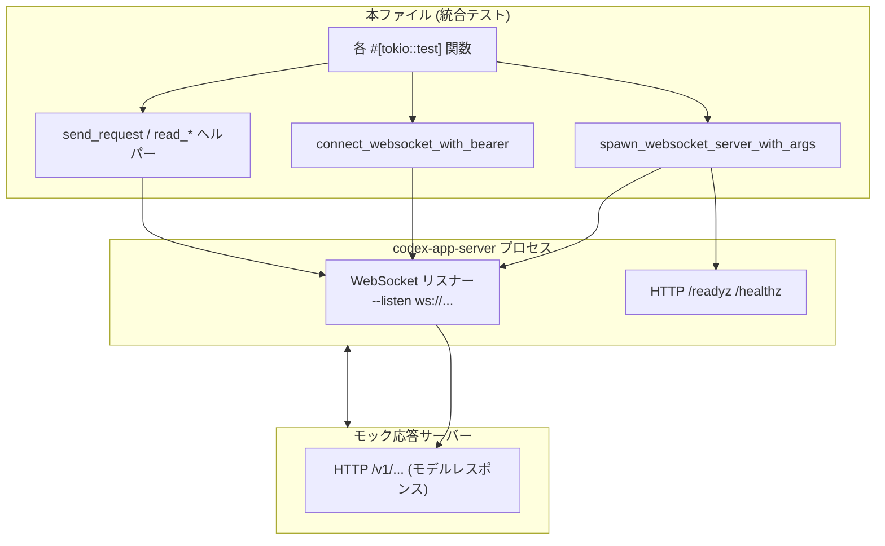
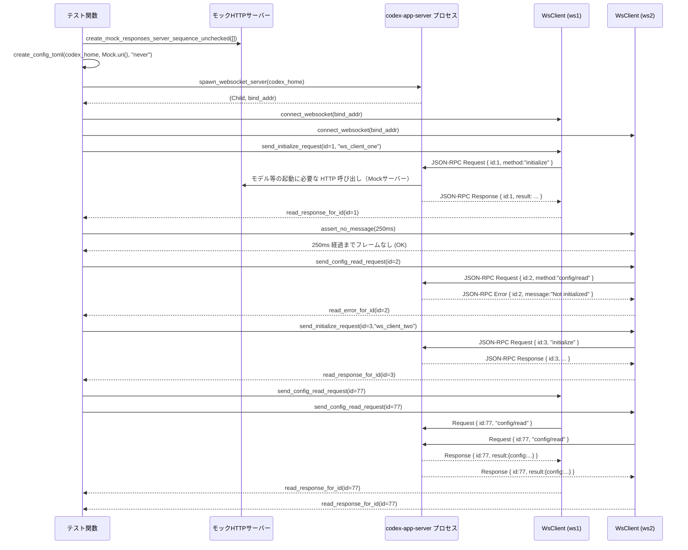

# app-server\\tests\\suite\\v2\\connection_handling_websocket.rs

## 0. ざっくり一言

codex-app-server の WebSocket トランスポートについて、

- 接続ごとの独立性
- HTTP ヘルスエンドポイントとの共存
- WebSocket 認証（ベアラトークン / 署名付きトークン / Origin）
- スレッドサブスクリプションの切断時挙動

を、実プロセス起動＋WebSocket/HTTP クライアントで検証する統合テスト群と、そのための共通ヘルパーを定義するモジュールです。

> 注: 指示にある `ファイル名:L開始-終了` 形式の行番号は、このスニペットには行番号情報が含まれていないため付与できません。根拠は「本ファイル中の該当関数定義」に対する言及で示します。

---

## 1. このモジュールの役割

### 1.1 概要

- このモジュールは **codex-app-server の WebSocket エンドポイントの接続ハンドリングと認証まわりの仕様を検証する** ために存在し、以下を確認します。
  - WebSocket 1 接続 = 1 セッションとして JSON-RPC メッセージが適切にスコープされること
  - 同じリスナーで HTTP `/readyz` `/healthz` が提供されること
  - Origin やベアラトークン、署名付きベアラトークンによる接続制御が正しく行われること
  - WebSocket 切断時に、最後の購読スレッドがアンロードされること

### 1.2 アーキテクチャ内での位置づけ

このテストモジュールは、実際の `codex-app-server` バイナリを子プロセスとして起動し、モックのバックエンド HTTP サーバーと対話させながら WebSocket/HTTP 経路をテストします。

- `codex-app-server`:
  - WebSocket リスナーを `--listen` で起動
  - HTTP `/readyz`, `/healthz` も同一アドレスで提供
- モックレスポンスサーバー:
  - `app_test_support::create_mock_responses_server_sequence_unchecked` で起動される HTTP サーバー
  - app-server からのモデル呼び出しを模倣
- このモジュール:
  - `spawn_websocket_server_with_args` で app-server を起動
  - `reqwest` で HTTP、`tokio_tungstenite` で WebSocket を発行
  - `codex_app_server_protocol` の JSON-RPC 型を用いて送受信を検証



### 1.3 設計上のポイント

コードから読み取れる設計上の特徴は次のとおりです。

- **非同期設計**
  - すべてのテストは `#[tokio::test]` で実行され、`tokio` ランタイム上で `async` 関数を用いて WebSocket/HTTP を操作します。
  - WebSocket 読み書きには `tokio_tungstenite` の `WebSocketStream` と `StreamExt` / `SinkExt` を使用し、ノンブロッキングで動作します。

- **外部プロセス制御**
  - `tokio::process::Command` で `codex-app-server` を子プロセスとして起動し、stderr ログからバインド済み WebSocket アドレスをパースして接続先を特定します。
  - `kill_on_drop(true)` により、テスト終了時にプロセスが自動的に Kill される安全設計です。

- **タイムアウトとリトライ**
  - 接続確立 (`connect_websocket_with_bearer`), HTTP GET (`http_get`), WebSocket 受信 (`read_jsonrpc_message`), 状態待ち (`wait_for_loaded_threads`) のすべてに明示的なタイムアウト (`tokio::time::timeout`) が設定されています。
  - これにより、サーバーが起動しない・応答しない場合にテストが無限にハングしないようになっています。

- **JSON-RPC 抽象化**
  - `send_request`, `read_response_for_id`, `read_error_for_id`, `read_notification_for_method` などのヘルパーにより、WebSocket 上の JSON-RPC メッセージを ID やメソッド名で待ち受ける API を提供します。
  - Ping/Pong、Close、Binary フレームなどの WebSocket レベルの詳細は `read_jsonrpc_message` に隠蔽されます。

- **認証パターンの網羅**
  - 生のベアラトークン（固定値）
  - HMAC-SHA256 による署名付き JWT 風ベアラトークン（`signed_bearer_token`）
  - Origin ヘッダによるブラウザ起点接続の制御

---

## 2. 主要な機能一覧（コンポーネントインベントリー）

このモジュールが提供する主要コンポーネント（テストシナリオ＋ヘルパー）です。

- WebSocket セッション分離テスト
  - `websocket_transport_routes_per_connection_handshake_and_responses`
    - 接続ごとに `initialize` のレスポンスが独立し、同じ Request ID でもソケットごとに正しくルーティングされることを検証します。
- HTTP ヘルスチェック共存テスト
  - `websocket_transport_serves_health_endpoints_on_same_listener`
    - WebSocket リスナーと同一アドレスで `/readyz` `/healthz` が 200 OK を返すことを検証します。
- Origin / 認証制御テスト
  - `websocket_transport_rejects_browser_origin_without_auth`
    - ブラウザ Origin からの未認証接続が拒否されることを検証します。
  - `websocket_transport_rejects_missing_and_invalid_capability_tokens`
    - 固定ベアラトークン方式 (`--ws-auth capability-token`) の認証動作（成功/失敗）を検証します。
  - `websocket_transport_verifies_signed_short_lived_bearer_tokens`
    - HMAC-SHA256 署名付きベアラトークンの有効期限、nbf、iss、aud、署名の検証が行われることを検証します。
  - `websocket_transport_rejects_short_signed_bearer_secret_configuration`
    - 署名用の共有秘密鍵が短すぎる場合、サーバー起動が失敗することを検証します。
  - `websocket_transport_allows_unauthenticated_non_loopback_startup_by_default`
    - 非ループバック (`0.0.0.0`) でも、既定では WebSocket が無認証で起動することを検証します。
- スレッドライフサイクルテスト
  - `websocket_disconnect_unloads_last_subscribed_thread`
    - 接続が最後の購読スレッドを持っている場合、切断時にそのスレッドがアンロードされることを検証します。
- WebSocket サーバープロセス操作
  - `spawn_websocket_server`, `spawn_websocket_server_with_args`
    - `codex-app-server` を WebSocket モードで起動し、バインドアドレスを取得します。
  - `run_websocket_server_to_completion_with_args`
    - 指定の引数でサーバーを起動し、終了コードと stderr を取得します（構成エラーのテストに利用）。
- WebSocket クライアント操作
  - `connect_websocket`, `connect_websocket_with_bearer`
    - バインドアドレスに接続し、必要に応じて `Authorization: Bearer ...` を付与します。
  - `assert_websocket_connect_rejected`, `assert_websocket_connect_rejected_with_headers`
    - ハンドシェイクが特定の HTTP ステータスで拒否されることを検証します。
- HTTP クライアント操作
  - `http_get`
    - `/readyz`, `/healthz` などに対してリトライ付き GET を行います。
- JSON-RPC 送受信ヘルパー
  - `send_initialize_request`, `send_config_read_request`, `start_thread`
  - `assert_loaded_threads`, `wait_for_loaded_threads`, `request_loaded_threads`
  - `send_request`, `send_jsonrpc`
  - `read_response_for_id`, `read_error_for_id`,
    `read_notification_for_method`, `read_response_and_notification_for_method`,
    `read_jsonrpc_message`, `assert_no_message`
- 設定・ユーティリティ
  - `create_config_toml`
    - テスト用の `config.toml` を生成し、モックプロバイダを指すように設定します。
  - `connectable_bind_addr`
    - `0.0.0.0` / `::` のような未指定アドレスをローカルループバックに書き換えます。
  - `signed_bearer_token`
    - 共有秘密鍵と任意の claims JSON から HS256 署名付き JWT 風トークンを生成します。

---

## 3. 公開 API と詳細解説

### 3.1 型一覧（構造体・列挙体など）

このファイル内で定義される主要な型エイリアス・定数です。

| 名前 | 種別 | 役割 / 用途 |
|------|------|-------------|
| `DEFAULT_READ_TIMEOUT` | `Duration` 定数 | WebSocket メッセージの読み取りタイムアウト（既定 10 秒）。`read_jsonrpc_message` や `wait_for_loaded_threads` で使用。 |
| `WsClient` | 型エイリアス | `WebSocketStream<MaybeTlsStream<tokio::net::TcpStream>>`。WebSocket クライアント接続のハンドル。 |
| `HmacSha256` | 型エイリアス | `Hmac<Sha256>`。署名付きベアラトークンに用いる HMAC-SHA256 計算用。 |

JSON-RPC メッセージの型 (`JSONRPCMessage`, `JSONRPCRequest`, `JSONRPCResponse` 等) は外部クレート `codex_app_server_protocol` で定義されており、本ファイルではそれを利用しています。

### 3.2 関数詳細（重要な 7 件）

#### `spawn_websocket_server_with_args(codex_home: &Path, listen_url: &str, extra_args: &[String]) -> Result<(Child, SocketAddr)>`

**概要**

- `codex-app-server` バイナリを WebSocket リスナー付きで起動し、実際にバインドされた `SocketAddr` と `tokio::process::Child` を返すヘルパーです。
- stderr ログから `ws://IP:port` を検出してアドレスを特定します。

**引数**

| 引数名 | 型 | 説明 |
|--------|----|------|
| `codex_home` | `&Path` | `CODEX_HOME` 環境変数として渡すディレクトリ。設定ファイルやトークンファイルを置くルート。 |
| `listen_url` | `&str` | `--listen` に渡す WebSocket URL（例: `"ws://127.0.0.1:0"`）。ポート 0 で OS に動的割り当てさせることが多いです。 |
| `extra_args` | `&[String]` | 認証など追加 CLI オプション（例: `--ws-auth`, `--ws-token-file` など）。 |

**戻り値**

- `Ok((Child, SocketAddr))`:
  - `Child`: 起動した `codex-app-server` プロセス。`kill_on_drop(true)` により Drop 時に Kill されます。
  - `SocketAddr`: stderr ログから検出された実際の WebSocket バインドアドレス。
- `Err(anyhow::Error)`:
  - バイナリが見つからない、起動できない、アドレスが検出される前に終了する・タイムアウトするなどの場合。

**内部処理の流れ**

1. `codex_utils_cargo_bin::cargo_bin("codex-app-server")` でバイナリパスを取得。
2. `Command::new(program)` に対して
   - `--listen listen_url`
   - `extra_args`
   - `stdin`/`stdout` を `null`、`stderr` を `piped`
   - `CODEX_HOME`, `RUST_LOG=debug`
   を設定し、`kill_on_drop(true)` で spawn。
3. `stderr` を `BufReader::new(stderr).lines()` にラップし、10 秒間の期限 (`deadline`) を設定。
4. ループで `timeout` をかけつつ 1 行ずつ読み取り:
   - ANSI エスケープシーケンスを手作業で削除（ログのカラーコードを除去）。
   - スペース区切りのトークンのうち `"ws://..."` で始まるものを探し、`SocketAddr` としてパースできればそれを返す。
5. バインドアドレス検出後は、残りの stderr を捨てずに `tokio::spawn` したタスクで最後まで読み取り、`eprintln!` し続ける。

**Examples（使用例）**

```rust
// モックレスポンスサーバーを起動
let server = create_mock_responses_server_sequence_unchecked(Vec::new()).await?;
let codex_home = TempDir::new()?;

// 設定ファイルを生成
create_config_toml(codex_home.path(), &server.uri(), "never")?;

// WebSocket サーバーを起動（デフォルト設定）
let (mut process, bind_addr) =
    spawn_websocket_server_with_args(codex_home.path(), "ws://127.0.0.1:0", &[]).await?;

// bind_addr に対して WebSocket 接続を確立する
let mut ws = connect_websocket(bind_addr).await?;

// テスト終了時はプロセスを明示的に kill
process.kill().await?;
```

**Errors / Panics**

- バイナリ取得失敗: `context("should find app-server binary")` 付きのエラー。
- spawn 失敗: `context("failed to spawn websocket app-server process")` のエラー。
- stderr 読み取り中:
  - タイムアウト: `context("timed out waiting for websocket app-server to report bound websocket address")`。
  - `next_line()` で IO エラー: `context("failed to read websocket app-server stderr")`。
  - `None`（プロセス終了）: `context("websocket app-server exited before reporting bound websocket address")`。
- ANSI エスケープ処理は純粋な文字列処理でパニックしないように書かれています。
- 明示的な `panic!` はありません。

**Edge cases（エッジケース）**

- サーバーが `ws://` を含むログ行を出力しない場合
  - 10 秒以内に該当行が現れないとタイムアウトエラーになります。
- `listen_url` が `0.0.0.0:0` の場合
  - ログ中の `ws://0.0.0.0:PORT` がそのまま `SocketAddr` として返ります。
  - 実際に接続する際は `connectable_bind_addr` で 127.0.0.1 に変換します。
- stderr が最初から閉じている場合
  - 「app-server exited before reporting bound websocket address」エラーとして扱われます。

**使用上の注意点**

- 非同期関数なので `await` が必要です。
- 返された `Child` を Drop するだけでも kill されますが、テストでは明示的に `kill().await` しておくと失敗時のデバッグがしやすくなります。
- ログのフォーマットは `"ws://"` を含むトークンがあることを前提としているため、サーバー側のログフォーマットを変えるとこのヘルパーも調整が必要になります。

---

#### `connect_websocket_with_bearer(bind_addr: SocketAddr, bearer_token: Option<&str>) -> Result<WsClient>`

**概要**

- `spawn_websocket_server_with_args` が返した `SocketAddr` に対して WebSocket 接続を張るヘルパーです。
- 必要に応じて `Authorization: Bearer ...` ヘッダを付与し、接続できるまで 10 秒間リトライします。

**引数**

| 引数名 | 型 | 説明 |
|--------|----|------|
| `bind_addr` | `SocketAddr` | サーバーがバインドしているアドレス。未指定アドレスの場合は内部でループバックに変換されます。 |
| `bearer_token` | `Option<&str>` | 認証用のベアラトークン。`Some("token")` で `Authorization: Bearer token` ヘッダを送信、`None` で認証なし。 |

**戻り値**

- `Ok(WsClient)`:
  - 確立された WebSocket ストリーム。`SinkExt` と `StreamExt` による送受信が可能。
- `Err(anyhow::Error)`:
  - リトライ期限内に接続が成功しなかった場合、最後のエラーを含むメッセージ付きで `bail!` されます。

**内部処理の流れ**

1. `connectable_bind_addr(bind_addr)` で、未指定アドレスをループバックに変換。
2. `format!("ws://{}", ...)` で接続 URL を生成。
3. `websocket_request(url, bearer_token, None)` で HTTP リクエストを構築。
4. 10 秒の締切 (`deadline`) を設定し、ループで
   - `connect_async(request.clone()).await` を試行。
   - 成功したら `(stream, _response)` の `stream` を返す。
   - 失敗した場合は現在時刻と `deadline` を比較し、期限超過なら `bail!`、そうでなければ 50ms スリープしてリトライ。

**Examples（使用例）**

```rust
// 認証なしで接続
let mut ws = connect_websocket_with_bearer(bind_addr, None).await?;

// 認証付きで接続
let mut ws_auth =
    connect_websocket_with_bearer(bind_addr, Some("super-secret-token")).await?;
```

**Errors / Panics**

- `websocket_request` 内で:
  - URL が不正、ヘッダ値が不正な場合に `anyhow::Error` が返ります。
- `connect_async` が期限内に成功しない場合:
  - `bail!("failed to connect websocket to {url}: {err}")` でエラー終了。
- パニックは使用されていません。

**Edge cases**

- サーバープロセス起動直後の一時的な接続失敗
  - リトライループで吸収され、起動が間に合えば正常に接続できます。
- `bearer_token` に改行や非 ASCII 文字が含まれている場合
  - `HeaderValue::from_str` が失敗し、「invalid bearer token header」という文脈付きのエラーになります。
- `bind_addr` が `0.0.0.0:PORT` の場合
  - `connectable_bind_addr` により 127.0.0.1 に変換され、ローカルから接続可能です。

**使用上の注意点**

- この関数は WebSocket ハンドシェイクを完了するまで戻りません。サーバー側で認証拒否を行う場合、拒否されると `Err(WsError::Http(..))` になり、リトライを繰り返した上で最終的に `Err` を返します。
- テストで「拒否されること」を確認したい場合は、この関数ではなく `assert_websocket_connect_rejected` を使います。

---

#### `assert_websocket_connect_rejected_with_headers(bind_addr: SocketAddr, bearer_token: Option<&str>, origin: Option<&str>, expected_status: StatusCode) -> Result<()>`

**概要**

- WebSocket ハンドシェイクが特定の HTTP ステータスコード（401/403 など）で拒否されることを検証するヘルパーです。
- 認証ヘッダと Origin ヘッダを任意に付与できます。

**引数**

| 引数名 | 型 | 説明 |
|--------|----|------|
| `bind_addr` | `SocketAddr` | 接続先のバインドアドレス。 |
| `bearer_token` | `Option<&str>` | 付与するベアラトークン。 |
| `origin` | `Option<&str>` | 付与する `Origin` ヘッダ値（ブラウザ起点接続のシミュレーションに使用）。 |
| `expected_status` | `StatusCode` | 期待する HTTP ステータス（例: `StatusCode::UNAUTHORIZED`）。 |

**戻り値**

- 期待どおり拒否された場合: `Ok(())`
- 期待どおりでない場合: `Err(anyhow::Error)` で失敗内容を説明。

**内部処理の流れ**

1. `connectable_bind_addr` で接続アドレスを決定し、`ws://...` URL を生成。
2. `websocket_request(url, bearer_token, origin)` でリクエストを構築。
3. `connect_async(request).await` を呼び出し:
   - `Ok((_stream, response))` の場合:
     - ハンドシェイクが成功してしまったので `bail!("expected websocket handshake rejection, got {}", response.status())`。
   - `Err(WsError::Http(response))` の場合:
     - サーバーから HTTP レスポンス付きで拒否されたケース。`assert_eq!(response.status(), expected_status)` で検証し、成功なら `Ok(())`。
   - その他の `Err(err)` の場合:
     - TLS エラー等、HTTP レスポンスが得られていないため `bail!("expected http rejection during websocket handshake: {err}")`。

**Examples（使用例）**

```rust
// 認証なしで 401 を期待
assert_websocket_connect_rejected_with_headers(
    bind_addr,
    None,
    None,
    StatusCode::UNAUTHORIZED,
).await?;

// 悪意ある Origin からの接続に対して 403 を期待
assert_websocket_connect_rejected_with_headers(
    bind_addr,
    None,
    Some("https://evil.example"),
    StatusCode::FORBIDDEN,
).await?;
```

**Errors / Panics**

- ハンドシェイクが成功してしまった場合: `bail!` によるテスト失敗。
- HTTP ステータスが期待値と異なる場合: `assert_eq!` によるパニック（テスト失敗）。
- HTTP 以外の理由（ネットワークエラー等）で失敗した場合: `bail!` メッセージで報告。

**Edge cases**

- サーバーが Socket レベルで接続拒否している場合
  - `WsError::Http` ではなく別種のエラーになるため、「expected http rejection ...」というエラーになります。
- サーバーが 5xx を返す場合
  - `WsError::Http(response)` になるため、`expected_status` を 5xx に設定しておけば検証可能です。

**使用上の注意点**

- この関数は「ハンドシェイクが HTTP レスポンス付きで拒否される」ことを前提にしています。サーバーが TLS レベル / TCP レベルで遮断する構成だと意図通りに使えません。
- 「ハンドシェイク成功」を success 判定にしたい場合は `connect_websocket_with_bearer` を使用します。

---

#### `send_request(stream: &mut WsClient, method: &str, id: i64, params: Option<serde_json::Value>) -> Result<()>`

**概要**

- WebSocket 上で JSON-RPC リクエストメッセージを送信する共通ヘルパーです。
- JSON-RPC の `id` と `method`、`params` を受け取り、`JSONRPCMessage::Request` を形成して送信します。

**引数**

| 引数名 | 型 | 説明 |
|--------|----|------|
| `stream` | `&mut WsClient` | WebSocket クライアントストリーム（`Sink` として使用）。 |
| `method` | `&str` | JSON-RPC メソッド名（例: `"initialize"`, `"config/read"`）。 |
| `id` | `i64` | リクエスト ID。`RequestId::Integer(id)` として設定されます。 |
| `params` | `Option<serde_json::Value>` | JSON-RPC パラメータ。`None` なら `params` フィールドは `null`。 |

**戻り値**

- 送信に成功した場合: `Ok(())`
- シリアライゼーションや送信時にエラーが発生した場合: `Err(anyhow::Error)`

**内部処理の流れ**

1. `JSONRPCMessage::Request(JSONRPCRequest { ... })` を構築。
2. `serde_json::to_string(&message)` で JSON 文字列にシリアライズ。
3. `WebSocketMessage::Text(payload.into())` でテキストフレームとしてラップ。
4. `stream.send(...).await` で送信し、`context("failed to send websocket frame")` を付与してエラーを返す。

**Examples（使用例）**

```rust
// 任意の JSON-RPC リクエストを送る例
let params = serde_json::json!({
    "includeLayers": false,
});
send_request(&mut ws, "config/read", 42, Some(params)).await?;

// initialize はラッパーの send_initialize_request から呼ばれます
send_initialize_request(&mut ws, 1, "ws_client").await?;
```

**Errors / Panics**

- `serde_json::to_string` が失敗するケース：
  - `params` にシリアライズ不可能な値が含まれている場合にエラーになります（本ファイルでは常にシリアライズ可能な構造体/JSON を使用）。
- WebSocket 送信エラー：
  - ソケットが切断されている場合などに `failed to send websocket frame` という文脈付きのエラーになります。
- パニックはありません。

**Edge cases**

- `params: None`:
  - JSON-RPC メッセージの `params` フィールドが `null`（または未設定）として送信されます。サーバー側がどのように解釈するかはプロトコル仕様依存です。
- `id` の重複:
  - このヘルパー自体は ID の重複を禁止しません。テストは `read_response_for_id` 側で ID を指定して待ち受けることで正しいレスポンスを拾います。

**使用上の注意点**

- 1 つの `WsClient` を複数タスクで同時に `send_request` する場合、フレームの順序に注意が必要です（本ファイルのテストでは常に 1 タスクから直列に送信しています）。
- 返信を待つ場合は、対応する `read_response_for_id` / `read_error_for_id` を必ず組み合わせて使う必要があります。

---

#### `read_response_for_id(stream: &mut WsClient, id: i64) -> Result<JSONRPCResponse>`

**概要**

- WebSocket ストリームから JSON-RPC メッセージを読み続け、指定した `id` を持つ `JSONRPCMessage::Response` が現れるまで待つヘルパーです。

**引数**

| 引数名 | 型 | 説明 |
|--------|----|------|
| `stream` | `&mut WsClient` | WebSocket クライアントストリーム（`Stream` として使用）。 |
| `id` | `i64` | 期待するレスポンスの `RequestId::Integer(id)`。 |

**戻り値**

- `Ok(JSONRPCResponse)`:
  - 対象 ID のレスポンスメッセージ。
- `Err(anyhow::Error)`:
  - 受信中にタイムアウト、切断、パースエラーが発生した場合など（実際のエラー処理は `read_jsonrpc_message` に委譲）。

**内部処理の流れ**

1. `target_id = RequestId::Integer(id)` を生成。
2. 無限ループで `read_jsonrpc_message(stream).await?` を呼び出し、次の JSON-RPC メッセージを取得。
3. 取得したメッセージが
   - `JSONRPCMessage::Response(response)` かつ `response.id == target_id` のとき、`Ok(response)` を返して終了。
   - それ以外の場合（他 ID のレスポンス、通知、エラー）は無視してループを続ける。

**Examples（使用例）**

```rust
// 送信と対になる使い方
send_request(&mut ws, "config/read", 77, Some(json!({ "includeLayers": false }))).await?;
let response = read_response_for_id(&mut ws, 77).await?;
assert_eq!(response.id, RequestId::Integer(77));
```

**Errors / Panics**

- エラーの大部分は `read_jsonrpc_message` によって生成されます（後述）。
- `read_response_for_id` 自身は `bail!` や `panic!` を使用していません。

**Edge cases**

- 対象 ID のレスポンスが一切送られてこない場合:
  - `read_jsonrpc_message` のタイムアウト機構（`DEFAULT_READ_TIMEOUT`）によりエラーになります。
- 対象 ID とは異なるレスポンスや通知が多数送られてくる場合:
  - 無視して読み続けます。メッセージ量が多いと時間がかかる可能性があります。

**使用上の注意点**

- 1 本の `WsClient` ストリームに対して、複数の `read_*` 系関数を並列で走らせるとメッセージの読み取り順序が競合します。本テストコードは常に単一のコンシューマ（`&mut WsClient` を直列使用）として設計されています。
- 試験対象アプリケーションが大量の通知を送る場合、ターゲット ID のレスポンスを見つけるまで時間がかかり得る点に注意が必要です。

---

#### `read_jsonrpc_message(stream: &mut WsClient) -> Result<JSONRPCMessage>`

**概要**

- WebSocket からフレームを読み出し、JSON-RPC メッセージに変換する最下層の読み取りヘルパーです。
- Ping に対して Pong を返す、Close や Binary フレームをエラーとするなど、WebSocket レベルのプロトコル処理も担当します。

**引数**

| 引数名 | 型 | 説明 |
|--------|----|------|
| `stream` | `&mut WsClient` | WebSocket クライアントストリーム。 |

**戻り値**

- `Ok(JSONRPCMessage)`:
  - テキストフレームを JSON としてパースした JSON-RPC メッセージ。
- `Err(anyhow::Error)`:
  - タイムアウト、切断、読み取り失敗、JSON パースエラー、予期しないフレーム種別など。

**内部処理の流れ**

1. 無限ループの中で、まず

   ```rust
   let frame = timeout(DEFAULT_READ_TIMEOUT, stream.next()).await
       .context("timed out waiting for websocket frame")?
       .context("websocket stream ended unexpectedly")?
       .context("failed to read websocket frame")?;
   ```

   として
   - 10 秒のフレーム受信タイムアウト
   - ストリーム終了時のエラー化
   - tungstenite の読み取りエラーのエラー化
   を行ったうえで `WebSocketMessage` を取得します。
2. 取得したフレームに応じて分岐:
   - `WebSocketMessage::Text(text)`:
     - `serde_json::from_str(text.as_ref())?` で `JSONRPCMessage` にデシリアライズして `Ok(...)` を返す。
   - `Ping(payload)`:
     - `stream.send(WebSocketMessage::Pong(payload)).await?` で Pong を返し、ループ継続（JSON-RPC メッセージとしては返さない）。
   - `Pong(_)`:
     - 何もせずループ継続。
   - `Close(frame)`:
     - `bail!("websocket closed unexpectedly: {frame:?}")`
   - `Binary(_)`:
     - `bail!("unexpected binary websocket frame")`
   - `Frame(_)`:
     - 無視してループ継続。

**Examples（使用例）**

```rust
// 単純に次の JSON-RPC メッセージを 1 件受信する
let message = read_jsonrpc_message(&mut ws).await?;
match message {
    JSONRPCMessage::Response(resp) => { /* ... */ }
    JSONRPCMessage::Notification(notif) => { /* ... */ }
    JSONRPCMessage::Error(err) => { /* ... */ }
    JSONRPCMessage::Request(req) => { /* テストでは通常来ない */ }
}
```

**Errors / Panics**

- 受信タイムアウト:
  - `"timed out waiting for websocket frame"` という context 付きエラー。
- ストリーム終了:
  - `"websocket stream ended unexpectedly"`。
- tungstenite 読み取りエラー:
  - `"failed to read websocket frame"`。
- Close フレーム:
  - 「websocket closed unexpectedly: ...」で `bail!`。
- Binary フレーム:
  - 「unexpected binary websocket frame」で `bail!`。
- JSON パースエラー:
  - `serde_json::from_str` のエラーがそのまま `anyhow::Error` に変換されます。
- パニックはありません。

**Edge cases**

- サーバーから Ping のみが来て JSON-RPC メッセージが来ない場合:
  - Ping に対して Pong を返しつつループを続けるため、`DEFAULT_READ_TIMEOUT` まで待ち続けます。
- サーバーが Text フレーム内に JSON 以外のテキストを送信した場合:
  - `serde_json::from_str` が失敗しエラーになります。
- `WebSocketMessage::Frame` バリアント:
  - 現状は無視されます。tungstenite の内部仕様に依存するため、実際には通常のケースでは現れないことが多いです。

**使用上の注意点**

- この関数を直接使うより、上位の `read_response_for_id`, `read_error_for_id`, `read_notification_for_method` などを通して目的のメッセージを取得するのが一般的です。
- `stream.next()` に対して `timeout` をかけているため、一定時間メッセージが来なければ確実にエラーになります。長時間無通信でも問題ないテストには向きません。

---

#### `wait_for_loaded_threads(stream: &mut WsClient, first_id: i64, expected: &[&str]) -> Result<()>`

**概要**

- JSON-RPC メソッド `"thread/loaded/list"` を繰り返し呼び出し、スレッド ID のリストが `expected` と一致する状態になるまで待機するヘルパーです。
- スレッドアンロードを検証する `websocket_disconnect_unloads_last_subscribed_thread` テストで使用されます。

**引数**

| 引数名 | 型 | 説明 |
|--------|----|------|
| `stream` | `&mut WsClient` | WebSocket クライアントストリーム。 |
| `first_id` | `i64` | 最初に使用する JSON-RPC リクエスト ID。以降はループごとに +1 されます。 |
| `expected` | `&[&str]` | 期待するスレッド ID のリスト。 |

**戻り値**

- 期待状態になった場合: `Ok(())`
- `DEFAULT_READ_TIMEOUT` 内に期待状態にならない場合、または個々の RPC 呼び出しでエラーが出た場合: `Err(anyhow::Error)`。

**内部処理の流れ**

1. `expected` を `Vec<String>` に変換し、比較用に保持。
2. `timeout(DEFAULT_READ_TIMEOUT, async { ... })` で、全体の待機時間を 10 秒に制限。
3. 内側の非同期ループで:
   - `request_loaded_threads(stream, next_id).await?` を呼び出し、スレッドリストを取得。
   - `next_id += 1`。
   - レスポンスから `actual = response.data` を取り出してソート。
   - `actual == expected` なら `Ok(())` を返して終了。
   - 一致しない場合は `sleep(Duration::from_millis(50)).await` して再試行。

**Examples（使用例）**

```rust
// スレッドがすべてアンロードされるのを待つ例
wait_for_loaded_threads(&mut ws, 5, &[]).await?;

// スレッドが一つだけ残る状態を待つ例
wait_for_loaded_threads(&mut ws, 10, &["thread-123"]).await?;
```

**Errors / Panics**

- 外側の `timeout`:
  - 「timed out waiting for loaded thread list」という context 付きエラーで失敗します。
- 内側で呼び出す `request_loaded_threads` が失敗した場合、そのエラーがそのまま伝播します。
- パニックはありません。

**Edge cases**

- サーバー側が `thread/loaded/list` を実装していない/エラーを返す場合:
  - `to_response::<ThreadLoadedListResponse>` がエラーになるなどして失敗します（`request_loaded_threads` 参照）。
- `expected` が最初から現在の状態と一致している場合:
  - 最初のループで即座に `Ok(())` になります。

**使用上の注意点**

- JSON-RPC リクエスト ID をループ内で単純にインクリメントしているため、同じストリームで他の RPC を同時に送る場合は ID の衝突に注意する必要があります（本ファイルではテストごとに ID 空間を分ける形で運用）。
- 待機ループは 50ms 間隔のポーリングで、サーバーからのプッシュ通知ではありません。頻繁に呼び出すとサーバー側に負荷をかける可能性があります（テストでは限定的な回数に留まる前提）。

---

#### `signed_bearer_token(shared_secret: &[u8], claims: serde_json::Value) -> Result<String>`

**概要**

- HS256（HMAC-SHA256）で署名された JWT 風ベアラトークン文字列を生成します。
- テストでは `exp`, `nbf`, `iss`, `aud` などのクレームを渡し、サーバー側の検証ロジックをテストするために使用します。

**引数**

| 引数名 | 型 | 説明 |
|--------|----|------|
| `shared_secret` | `&[u8]` | HMAC の共有秘密鍵。サーバーの `--ws-shared-secret-file` に設定される値と一致させる必要があります。 |
| `claims` | `serde_json::Value` | JWT の payload 部分に入れるクレーム。任意の JSON オブジェクト。 |

**戻り値**

- `Ok(String)`:
  - `"header.payload.signature"` 形式のベアラトークン文字列。
- `Err(anyhow::Error)`:
  - HMAC コンテキストの生成に失敗した場合など。

**内部処理の流れ**

1. ヘッダ部分を固定 JSON 文字列 `{"alg":"HS256","typ":"JWT"}` として用意し、base64url (no padding) でエンコードして `header_segment` とする。
2. `serde_json::to_vec(&claims)?` で claims を JSON バイト列に変換し、同様に base64url エンコードして `claims_segment` とする。
3. `payload = format!("{header_segment}.{claims_segment}")` を作成。
4. `HmacSha256::new_from_slice(shared_secret)` で HMAC コンテキストを作成し、`mac.update(payload.as_bytes())` でペイロードを更新。
5. `mac.finalize().into_bytes()` で MAC を求め、base64url エンコードして `signature` にする。
6. `Ok(format!("{payload}.{signature}"))` を返す。

**Examples（使用例）**

```rust
let shared_secret = b"0123456789abcdef0123456789abcdef"; // 32 バイト
let claims = json!({
    "exp": OffsetDateTime::now_utc().unix_timestamp() + 60,
    "iss": "codex-enroller",
    "aud": "codex-app-server",
});
let token = signed_bearer_token(shared_secret, claims)?;

// WebSocket 接続時に Authorization ヘッダとして使用
let mut ws =
    connect_websocket_with_bearer(bind_addr, Some(token.as_str())).await?;
```

**Errors / Panics**

- `HmacSha256::new_from_slice(shared_secret)` が失敗した場合:
  - 「failed to create hmac」という context 付きの `anyhow::Error` が返されます。
- `serde_json::to_vec(&claims)` が失敗した場合:
  - JSON シリアライズエラーがそのまま伝播します。
- パニックはありません。

**Edge cases**

- `shared_secret` が極端に短い場合:
  - HMAC 自体は作成できますが、セキュリティ上弱い鍵になります。テストでは別途「秘密鍵が短すぎる構成でサーバー起動が失敗する」ことを検証していますが、それはサーバー側ロジックの責務です。
- `claims` に `exp` や `nbf` が含まれない場合:
  - トークン生成自体は成功しますが、サーバー側の検証に通らない可能性があります（`websocket_transport_verifies_signed_short_lived_bearer_tokens` で複数パターンをテスト）。

**使用上の注意点**

- この関数は **厳密な JWT 実装ではなく**、「HS256 署名付き 3 セグメントトークン」を生成する最低限の機能を持つテストユーティリティです。ヘッダは固定値であり、追加のヘッダフィールドには対応していません。
- 実運用の JWT を扱う場合は、専用ライブラリを使用するべきです。

---

### 3.3 その他の関数一覧

詳細解説を省略した補助的な関数の概要です。

| 関数名 | 役割（1 行） |
|--------|--------------|
| `websocket_transport_routes_per_connection_handshake_and_responses` | 2 つの WebSocket 接続が独立したセッションとして扱われること、同一 ID のリクエストが接続ごとに正しくルーティングされることを検証する統合テスト。 |
| `websocket_transport_serves_health_endpoints_on_same_listener` | WebSocket リスナーと同一アドレスで `/readyz` `/healthz` が 200 OK を返すことを検証するテスト。 |
| `websocket_transport_rejects_browser_origin_without_auth` | 一度ループバックから正常接続した後、ブラウザ Origin (`https://evil.example`) からの未認証接続が 403 で拒否されることを検証。 |
| `websocket_transport_rejects_missing_and_invalid_capability_tokens` | `--ws-auth capability-token` 構成で、トークンなし/誤ったトークンが拒否され、正しいトークンで接続できることを検証。 |
| `websocket_transport_verifies_signed_short_lived_bearer_tokens` | 署名付きベアラトークンの期限/nbf/iss/aud/署名の各種不備が拒否され、有効なトークンのみ接続できることを検証。 |
| `websocket_transport_rejects_short_signed_bearer_secret_configuration` | 共有秘密鍵が短すぎる構成で app-server 起動が失敗し、stderr に「must be at least 32 bytes」が出力されることを検証。 |
| `websocket_transport_allows_unauthenticated_non_loopback_startup_by_default` | `ws://0.0.0.0:0` で起動した場合、デフォルトで無認証 WebSocket 接続が許可されることを検証。 |
| `websocket_disconnect_unloads_last_subscribed_thread` | スレッドを start しロード済みリストに現れることを確認後、接続切断でリストが空になる（スレッドアンロード）ことを検証。 |
| `spawn_websocket_server` | `spawn_websocket_server_with_args` の簡易ラッパー（`listen_url="ws://127.0.0.1:0"`, `extra_args=[]`）。 |
| `connect_websocket` | `connect_websocket_with_bearer(bind_addr, None)` のラッパー。 |
| `assert_websocket_connect_rejected` | `assert_websocket_connect_rejected_with_headers` のラッパー（`origin=None`, `expected_status=401`）。 |
| `run_websocket_server_to_completion_with_args` | 指定引数で app-server を起動し、10 秒以内に終了させて `std::process::Output` を取得する（構成エラー用テストで使用）。 |
| `http_get` | 指定パスへの HTTP GET を最大 10 秒リトライし続け、成功した `reqwest::Response` を返す。 |
| `websocket_request` | URL と任意の Bearer/Origin ヘッダから `tungstenite::http::Request<()>` を構築する。 |
| `send_initialize_request` | `InitializeParams` を組み立てて `"initialize"` JSON-RPC リクエストを送るラッパー。 |
| `start_thread` | `"thread/start"` RPC を送信し、レスポンスから `ThreadStartResponse` をデコードしてスレッド ID を返す。 |
| `assert_loaded_threads` | `"thread/loaded/list"` のレスポンス `data` をソートし、期待 ID 配列と一致することを `assert_eq!` で検証。 |
| `request_loaded_threads` | `"thread/loaded/list"` RPC を送信し、`ThreadLoadedListResponse` としてレスポンスを返す。 |
| `send_config_read_request` | `"config/read"` RPC（`includeLayers: false`）を送信するラッパー。 |
| `send_jsonrpc` | JSON-RPC メッセージを JSON テキストにシリアライズし、WebSocket テキストフレームとして送信。 |
| `read_notification_for_method` | 指定メソッド名の JSON-RPC 通知が来るまで WebSocket から読み続ける。 |
| `read_response_and_notification_for_method` | 特定 ID のレスポンスと特定メソッド名の通知のペアが揃うまで読み続ける。重複通知が来ると `bail!`。 |
| `read_error_for_id` | 指定 ID の JSON-RPC エラーメッセージが来るまで読み続ける。 |
| `assert_no_message` | 指定時間内に一切の WebSocket フレームが届かないことを検証する（届いた場合は `bail!`）。 |
| `create_config_toml` | モックモデルプロバイダへの接続などを含む `config.toml` を `codex_home` に書き出す。 |
| `connectable_bind_addr` | `0.0.0.0` / `::` のような未指定アドレスを `127.0.0.1` / `::1` に変換してローカルから接続可能にする。 |

---

## 4. データフロー

ここでは代表的なシナリオとして、`websocket_transport_routes_per_connection_handshake_and_responses` 周辺の処理フローを示します。

### 4.1 WebSocket 接続と JSON-RPC initialize のフロー



この図から分かるポイント:

- テストは 2 つの WebSocket セッション (WS1, WS2) を同一 `bind_addr` に対して開きますが、`initialize` の有無や同一 ID のリクエストが接続単位で独立して扱われることを検証しています。
- `assert_no_message` により、WS1 で実行した `initialize` のレスポンスが WS2 に誤送達されていないことが保証されています。
- `read_response_for_id` は、各ストリームごとに ID を指定してレスポンスを待ち受けることで、接続ごとの独立性を確認するのに利用されています。

---

## 5. 使い方（How to Use）

このファイルはテスト用のモジュールですが、他のテストから再利用できるヘルパー API として整理されています。

### 5.1 基本的な使用方法

最も典型的なフローは、

1. モックレスポンスサーバーの起動
2. `config.toml` の生成
3. WebSocket サーバープロセスの起動
4. WebSocket 接続
5. JSON-RPC リクエスト送信とレスポンスの検証

です。

```rust
#[tokio::test]
async fn example_usage() -> anyhow::Result<()> {
    // 1. モックレスポンスサーバーを起動
    let server = create_mock_responses_server_sequence_unchecked(Vec::new()).await?;

    // 2. 一時ディレクトリを CODEX_HOME として用意し、config.toml を生成
    let codex_home = TempDir::new()?;
    create_config_toml(codex_home.path(), &server.uri(), "never")?;

    // 3. WebSocket サーバープロセスを起動
    let (mut process, bind_addr) = spawn_websocket_server(codex_home.path()).await?;

    // 4. WebSocket 接続を確立
    let mut ws = connect_websocket(bind_addr).await?;

    // 5. initialize を送信し、そのレスポンスを検証
    send_initialize_request(&mut ws, 1, "example_client").await?;
    let init_resp = read_response_for_id(&mut ws, 1).await?;
    assert_eq!(init_resp.id, RequestId::Integer(1));

    // 必要に応じて他の RPC を発行
    send_config_read_request(&mut ws, 2).await?;
    let cfg_resp = read_response_for_id(&mut ws, 2).await?;
    assert!(cfg_resp.result.get("config").is_some());

    // 6. テスト終了時にプロセスを停止
    process.kill().await?;

    Ok(())
}
```

### 5.2 よくある使用パターン

- **認証付き WebSocket テスト**
  - `spawn_websocket_server_with_args` に `--ws-auth` 系引数を渡し、`connect_websocket_with_bearer` でトークンを付与。
  - 正常接続ケースと拒否ケースを `assert_websocket_connect_rejected` / `connect_websocket_with_bearer` で切り分けて検証します。

- **状態収束をポーリングで待つ**
  - スレッドロード/アンロードなど、サーバー内部状態が非同期に変化するケースでは、
    - `wait_for_loaded_threads` を使って「期待するスレッド ID の集合になるまで待つ」パターンを取っています。
  - これは push 通知ではなく `thread/loaded/list` のポーリングで実現されています。

- **JSON-RPC レベルの細かい挙動チェック**
  - 成功レスポンス: `read_response_for_id`
  - エラーレスポンス: `read_error_for_id`
  - 特定メソッドの通知: `read_notification_for_method`
  - レスポンスと通知のペア: `read_response_and_notification_for_method`

### 5.3 よくある間違い（想定される誤用）

本ファイルの実装から想定される誤用と正しい使い方の対比です。

```rust
// 誤り例: 同じ WsClient を複数タスクで同時に読む
let ws = connect_websocket(bind_addr).await?;
let mut ws1 = ws;        // 実際には move で所有権が移り、クローンはできないが、概念的な例
let mut ws2 = ws1;
tokio::join!(
    read_response_for_id(&mut ws1, 1),
    read_response_for_id(&mut ws2, 2),
);
// → メッセージ順序の競合・動作未定義

// 正しい例: 単一の &mut WsClient から直列で読む
let mut ws = connect_websocket(bind_addr).await?;
send_request(&mut ws, "method/one", 1, None).await?;
let r1 = read_response_for_id(&mut ws, 1).await?;
send_request(&mut ws, "method/two", 2, None).await?;
let r2 = read_response_for_id(&mut ws, 2).await?;
```

```rust
// 誤り例: spawn_websocket_server_with_args の戻り値 Child を無視してしまう
let (_process, bind_addr) =
    spawn_websocket_server_with_args(codex_home.path(), "ws://127.0.0.1:0", &[]).await?;
// テストコードが早期 return するとプロセスが走り続けデバッグしにくい

// 正しい例: テストの最後で明示的に kill する
let (mut process, bind_addr) =
    spawn_websocket_server_with_args(codex_home.path(), "ws://127.0.0.1:0", &[]).await?;
// ... テスト本体 ...
process.kill().await?;
```

### 5.4 使用上の注意点（まとめ）

- **スレッド安全性 / 並行性**
  - `WsClient` は `&mut` で扱われる前提で設計されており、同時に複数の `read_*` 系関数から読み出すことは想定していません。
  - WebSocket 読み取りには `timeout` が設定されているため、サーバー側が無応答でもテストがハングしないようになっています。

- **エラーと契約（Contracts）**
  - 多くのヘルパーが `anyhow::Result` を返し、エラー時には `context(...)` で原因箇所が分かるようになっています。
  - `assert_loaded_threads` や一部テスト関数内では `assert_eq!` によるパニックベースのアサートも併用しており、「期待と違えばテスト失敗」という契約です。
  - `assert_no_message` は WebSocket が閉じてしまった場合もエラーと見なします（サーバー側の予期せぬ切断を検知するため）。

- **セキュリティ上の前提**
  - 認証や Origin チェックの本質的なセキュリティは app-server 本体に委ねられており、このモジュールは「期待どおり拒否/許可されるか」をテストします。
  - `signed_bearer_token` 自体は簡易なトークン生成器であり、実運用の JWT ライブラリの代替ではありません。

- **パフォーマンス**
  - テスト環境を前提としており、10 秒タイムアウト・50ms ポーリング等は本番環境向けではありません。
  - ただし、リトライ/ポーリングは全て局所的であり、テストのスケーラビリティに重大な問題が出る構造にはなっていません。

---

## 6. 変更の仕方（How to Modify）

### 6.1 新しい機能を追加する場合（新しい WebSocket テストを追加する）

新たな WebSocket 関連の振る舞いをテストする場合、典型的には次のステップになります。

1. **バックエンドのモックサーバー準備**
   - `create_mock_responses_server_sequence_unchecked` を使って、必要なレスポンスを返す HTTP サーバーを起動します。
2. **設定ファイル作成**
   - `create_config_toml` を用いて、`MODEL` やプロバイダの URL を指定します。
3. **サーバープロセス起動**
   - 認証などが不要なら `spawn_websocket_server`、必要なら `spawn_websocket_server_with_args` を使います。
4. **WebSocket 接続**
   - 認証の有無に応じて `connect_websocket` / `connect_websocket_with_bearer` を選択します。
5. **JSON-RPC の送受信**
   - 既存の `send_*` / `read_*` ヘルパーを再利用するか、新しいメソッド用の薄いラッパー（例: `send_new_method_request`）を追加します。
6. **状態確認 / アサート**
   - 単発の検証なら `read_response_for_id` / `read_error_for_id`。
   - 状態収束を待つなら `wait_for_loaded_threads` と同様のポーリングパターンを参考にします。

### 6.2 既存の機能を変更する場合の注意点

- **プロセス起動系 (`spawn_websocket_server_with_args` / `run_websocket_server_to_completion_with_args`)**
  - stderr のログフォーマットを変える場合は、`"ws://"` をパースするロジックとの整合性を確認する必要があります。
  - タイムアウト値を変更すると、全テストの実行時間と安定性に影響します。

- **JSON-RPC ヘルパー**
  - `send_request` の構造を変えると、全ての JSON-RPC テストに影響します。`id`, `method`, `params` のフィールド名や型はプロトコル仕様と一致している必要があります。
  - `read_jsonrpc_message` の Ping/Pong 処理やタイムアウトポリシーを変えると、上位の `read_*` すべての挙動が変わります。既存テストとの整合性を確認してください。

- **認証・トークン関連**
  - `signed_bearer_token` のヘッダやエンコード方法を変更すると、app-server 側の検証ロジックと齟齬が出る可能性があります（両者を同時に変更する必要があります）。
  - テストで期待しているエラーメッセージ（例: 「must be at least 32 bytes」）をサーバー側で変更した場合、`stderr.contains(...)` の検証も同期して更新する必要があります。

---

## 7. 関連ファイル

このモジュールと密接に関係するコンポーネント／外部クレートです（パスは本チャンクからは分からないため概念レベルで記述します）。

| パス / 名称 | 役割 / 関係 |
|-------------|------------|
| `codex-app-server` バイナリ | 本テストで起動されるアプリケーション本体。WebSocket リスナーと HTTP `/readyz` `/healthz` を提供し、認証やスレッド管理ロジックを実装します。 |
| `app_test_support` クレート / モジュール | `create_mock_responses_server_sequence_unchecked`, `to_response` を提供し、モック HTTP サーバーの起動や JSON-RPC レスポンスのデコードを支援します。 |
| `codex_app_server_protocol` クレート | `JSONRPCMessage`, `JSONRPCRequest`, `JSONRPCResponse`, `ClientInfo`, `ThreadStartResponse` 等のプロトコル型を定義し、本ファイルの JSON-RPC ヘルパーの基盤となります。 |
| `codex_utils_cargo_bin` クレート / モジュール | `cargo_bin("codex-app-server")` によりテストからアプリケーションバイナリを見つけるために使用されます。 |
| テスト用 `config.toml` | `create_config_toml` で生成される設定ファイル。モデルプロバイダやモックサーバー URL を指定します。 |
| 認証関連ファイル (`app-server-token`, `app-server-signing-secret`) | WebSocket 認証テストのために一時ディレクトリ内に書き出されるトークン／共有秘密鍵ファイル。 |

以上の構成により、このモジュールは codex-app-server の WebSocket 接続ハンドリングと認証・状態管理が仕様どおりに動作しているかを、安全かつ再現性のある形で検証する役割を担っています。
