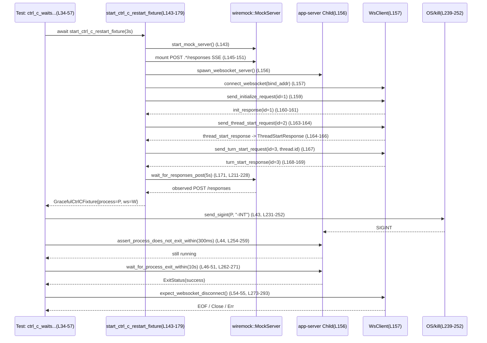

# app-server/tests/suite/v2/connection_handling_websocket_unix.rs

## 0. ざっくり一言

WebSocket トランスポートを使う app-server プロセスが、UNIX シグナル（SIGINT/SIGTERM）を受けたときに「実行中の turn を待ってから終了する」か、「2 回目のシグナルで強制終了する」ことを検証する非同期統合テスト群です（`connection_handling_websocket_unix.rs:L34-134`）。

---

## 1. このモジュールの役割

### 1.1 概要

- このモジュールは、WebSocket 経由でやり取りされる v2 プロトコルの「turn」が実行中の状態で、app-server に SIGINT/SIGTERM を送ったときの振る舞いを検証するためのテストを提供します（`connection_handling_websocket_unix.rs:L34-134`）。
- モック HTTP サーバ（wiremock）と実際の WebSocket app-server プロセスを起動し、シグナル送信 → プロセスの終了タイミング → WebSocket 切断までを end-to-end で確認します（`connection_handling_websocket_unix.rs:L143-179, L211-228, L239-252, L273-293`）。

### 1.2 アーキテクチャ内での位置づけ

このファイルは「テストコード」であり、本体の WebSocket 接続ハンドリング実装（`super::connection_handling_websocket` モジュール）に対して統合テストを行います。

主な依存関係は以下です（いずれも実装はこのチャンクには出てきません）:

- `super::connection_handling_websocket`  
  - WebSocket クライアント (`WsClient`) 型、および `connect_websocket`, `spawn_websocket_server`, `send_initialize_request`, `send_request`, `create_config_toml`, `read_response_for_id`, `DEFAULT_READ_TIMEOUT` を提供（`connection_handling_websocket_unix.rs:L1-8, L273-286`）。
- `core_test_support::responses`  
  - wiremock サーバ起動と SSE レスポンス生成のヘルパー（`connection_handling_websocket_unix.rs:L19, L143-151`）。
- `app_test_support`  
  - SSE 最終メッセージレスポンス生成と `to_response` デシリアライズ（`connection_handling_websocket_unix.rs:L12-13, L145, L165`）。
- `codex_app_server_protocol`  
  - v2 プロトコルのリクエスト/レスポンス型（`RequestId`, `ThreadStartParams`, `ThreadStartResponse`, `TurnStartParams`, `UserInput`）（`connection_handling_websocket_unix.rs:L14-18, L160-161, L165-169, L186-187, L199-205`）。

Mermaid 図で関係を表すと次のようになります。

```mermaid
graph TD
    subgraph Tests[このファイルのテスト群 (L34-134)]
        T1["websocket_transport_* テスト関数群"]
        F["start_ctrl_c_restart_fixture (L143-179)"]
        S1["send_*signal (L231-237, L239-252)"]
        W1["wait_for_* (L211-228, L254-271)"]
        E["expect_websocket_disconnect (L273-293)"]
    end

    subgraph WSMod["super::connection_handling_websocket (別ファイル)"]
        WS["WsClient, connect_websocket,\nspawn_websocket_server, send_request など"]
    end

    subgraph HTTPMock["core_test_support::responses (別ファイル)"]
        MStart["start_mock_server"]
        MSSE["sse_response"]
    end

    subgraph AppTest["app_test_support (別ファイル)"]
        SSEFinal["create_final_assistant_message_sse_response"]
        ToResp["to_response"]
    end

    subgraph Protocol["codex_app_server_protocol (別クレート)"]
        Proto["ThreadStartParams, TurnStartParams, ThreadStartResponse,\nUserInput, RequestId"]
    end

    T1 --> F
    F --> HTTPMock
    F --> WSMod
    F --> AppTest
    F --> Protocol
    T1 --> S1
    T1 --> W1
    T1 --> E
    W1 --> WSMod
```

### 1.3 設計上のポイント

コードから読み取れる設計上の特徴を列挙します。

- **責務の分離**（`connection_handling_websocket_unix.rs:L136-141, L143-179, L181-209, L211-293`）
  - テスト本体（4 つの `#[tokio::test]` 関数）は「シナリオ定義」に集中しています。
  - 環境セットアップ（モックサーバ起動、app-server 起動、initial/thread/turn リクエスト送信）は `start_ctrl_c_restart_fixture` に集約されています。
  - HTTP モックの監視、プロセス状態監視、シグナル送信、WebSocket 切断待ちをそれぞれ専用ヘルパー関数として定義しています。

- **非同期実行とタイムアウト**（`connection_handling_websocket_unix.rs:L34, L59, L85, L110, L143, L181, L194, L211, L254, L262, L273, L275-277`）
  - すべてのテストは `#[tokio::test]` で非同期に実行されます。
  - `tokio::time::timeout` を用いてプロセス終了待ちや WebSocket 切断待ちに明示的な時間制限を設けています。
  - `tokio::time::sleep` でポーリング間隔を 10ms に抑えつつ busy loop を避けています。

- **エラーハンドリング**（`connection_handling_websocket_unix.rs:L9-11, L145, L153-156, L160-161, L165, L171, L186-190, L199-207, L215-227, L239-252, L254-259, L262-271, L275-277, L283-285`）
  - すべてのヘルパー関数は `anyhow::Result` を返し、`?`・`bail!`・`Context` でエラーをラップしてテスト失敗の原因を明確化します。
  - 異常条件（プロセスが早期終了、タイムアウト、`kill` コマンド失敗等）はすべてエラーとしてテストを fail させます。

- **UNIX 固有動作**（`connection_handling_websocket_unix.rs:L231-237, L239-250`）
  - シグナル送信は `StdCommand::new("kill")` で実行されるため、UNIX 系 OS 前提のテストです。
  - `-INT`, `-TERM` を利用し、同一プロセス ID に対して SIGINT/SIGTERM を送信します。

---

## 2. 主要な機能一覧（コンポーネントインベントリー含む）

### 2.1 機能の概要

- WebSocket + v2 プロトコル環境を構築し、turn 実行中の状態を作る (`start_ctrl_c_restart_fixture`)。
- SIGINT/SIGTERM を 1 回送ったとき、実行中 turn の完了までプロセスが終了しないことを確認する 2 つのテスト。
- SIGINT/SIGTERM を 2 回送ったとき、一定時間内にプロセスが強制終了されることを確認する 2 つのテスト。
- モック HTTP サーバが `/responses` に対する POST を受け取るまで待機するヘルパー (`wait_for_responses_post`)。
- app-server プロセスが一定時間内に終了しない／終了することを検証するヘルパー (`assert_process_does_not_exit_within`, `wait_for_process_exit_within`)。
- 子プロセスへ SIGINT/SIGTERM を送るヘルパー (`send_sigint`, `send_sigterm`, `send_signal`)。
- WebSocket の切断（Close フレーム、EOF、ストリームエラー）まで待機し、その間の Ping に応答するヘルパー (`expect_websocket_disconnect`)。

### 2.2 コンポーネント一覧

#### 型・構造体

| 名前                    | 種別     | 役割 / 用途                                                                 | 定義位置 |
|-------------------------|----------|-----------------------------------------------------------------------------|----------|
| `GracefulCtrlCFixture`  | 構造体   | テストで再利用するフィクスチャ。`TempDir`、wiremock サーバ、子プロセス、WebSocket クライアントをまとめて保持 | `connection_handling_websocket_unix.rs:L136-141` |

#### 関数（テスト含む）

| 名前                                                         | 種別            | 役割 / 用途                                                                                          | 定義位置 |
|--------------------------------------------------------------|-----------------|--------------------------------------------------------------------------------------------------------|----------|
| `websocket_transport_ctrl_c_waits_for_running_turn_before_exit` | `#[tokio::test]` | SIGINT 1 回で turn 完了まで待ってから正常終了することを検証                                           | `L34-57` |
| `websocket_transport_second_ctrl_c_forces_exit_while_turn_running` | `#[tokio::test]` | SIGINT 2 回目で、turn 実行中でも強制終了されることを検証                                              | `L59-83` |
| `websocket_transport_sigterm_waits_for_running_turn_before_exit` | `#[tokio::test]` | SIGTERM 1 回で turn 完了まで待ってから正常終了することを検証                                           | `L85-108` |
| `websocket_transport_second_sigterm_forces_exit_while_turn_running` | `#[tokio::test]` | SIGTERM 2 回目で、turn 実行中でも強制終了されることを検証                                              | `L110-134` |
| `start_ctrl_c_restart_fixture`                               | 非公開 async 関数 | モック HTTP + app-server + WebSocket クライアントのセットアップと初期/スレッド/ターン開始までを行う | `L143-179` |
| `send_thread_start_request`                                  | 非公開 async 関数 | `thread/start` リクエストを送信                                                                       | `L181-192` |
| `send_turn_start_request`                                    | 非公開 async 関数 | `turn/start` リクエストを送信                                                                         | `L194-209` |
| `wait_for_responses_post`                                    | 非公開 async 関数 | wiremock サーバに `/responses` への POST が来るまでポーリング                                         | `L211-228` |
| `send_sigint`                                                | 非公開関数        | 子プロセスへ SIGINT を送信（`kill -INT`）                                                             | `L231-233` |
| `send_sigterm`                                               | 非公開関数        | 子プロセスへ SIGTERM を送信（`kill -TERM`）                                                           | `L235-237` |
| `send_signal`                                                | 非公開関数        | 任意シグナル文字列を指定して `kill` コマンドを実行                                                   | `L239-252` |
| `assert_process_does_not_exit_within`                        | 非公開 async 関数 | 一定時間内にプロセスが終了しないことを検証                                                            | `L254-259` |
| `wait_for_process_exit_within`                               | 非公開 async 関数 | 一定時間内にプロセスが終了することを検証し、`ExitStatus` を返す                                      | `L262-271` |
| `expect_websocket_disconnect`                               | 非公開 async 関数 | WebSocket 接続が Close / EOF / エラーで切断されるまで待機し、Ping には Pong 応答を返す               | `L273-293` |

---

## 3. 公開 API と詳細解説

テストモジュールなので `pub` はありませんが、他のテストから再利用されうる「事実上の公開 API」として主要なヘルパー関数を選び、詳細を記述します。

### 3.1 型一覧（構造体・列挙体など）

| 名前                   | 種別   | 役割 / 用途                                                                                         | フィールド概要 | 定義位置 |
|------------------------|--------|-----------------------------------------------------------------------------------------------------|----------------|----------|
| `GracefulCtrlCFixture` | 構造体 | WebSocket graceful shutdown テスト用のフィクスチャ。プロセスとクライアントなどをまとめて保持します | `_codex_home: TempDir` テンポラリな設定ディレクトリ／ `_server: wiremock::MockServer` モック HTTP／`process: Child` 起動した app-server／`ws: WsClient` WebSocket クライアント | `L136-141` |

### 3.2 関数詳細（重要な 7 件）

#### `start_ctrl_c_restart_fixture(turn_delay: Duration) -> Result<GracefulCtrlCFixture>`

**概要**

- WebSocket ベースの app-server プロセスと wiremock HTTP サーバを起動し、初期化・スレッド開始・ターン開始までを実行した状態のフィクスチャを構築します（`L143-179`）。
- HTTP モックには `turn_delay` だけ遅延する SSE `/responses` エンドポイントが 1 回分だけ用意されます（`L145-151`）。

**引数**

| 引数名       | 型          | 説明 |
|--------------|-------------|------|
| `turn_delay` | `Duration`  | SSE `/responses` のレスポンス遅延時間。これにより「実行中 turn」を疑似的に再現します（`L145, L148`）。 |

**戻り値**

- `Result<GracefulCtrlCFixture>`  
  - 成功時: セットアップ済みの `GracefulCtrlCFixture`。  
  - 失敗時: あらゆる I/O, シリアライズ, プロセス起動などのエラーをラップした `anyhow::Error`。

**内部処理の流れ**

1. wiremock サーバを起動しハンドルを取得（`responses::start_mock_server().await`）（`L143`）。
2. SSE の最終 assistant メッセージレスポンスを生成（`create_final_assistant_message_sse_response("Done")?`）（`L145`）。
3. `/responses` に対する `POST` に SSE レスポンスを返し、`turn_delay` だけ遅延させるモックを最大 1 回分設定（`Mock::given(...).respond_with(...).set_delay(turn_delay).up_to_n_times(1).mount(&server).await`）（`L146-151`）。
4. 一時ディレクトリを作成し（`TempDir::new()?`）、app-server 用の設定 TOML を生成（`create_config_toml(...)`）（`L153-154`）。
5. WebSocket app-server を起動し `process: Child` と `bind_addr` を取得（`spawn_websocket_server(codex_home.path()).await?`）（`L156`）。
6. `bind_addr` に WebSocket 接続し、`WsClient` を得る（`connect_websocket(bind_addr).await?`）（`L157`）。
7. 初期化リクエストを送信・レスポンスを受信し、ID が一致するか検証（`send_initialize_request` & `read_response_for_id` & `assert_eq!(..., RequestId::Integer(1))`）（`L159-161`）。
8. `thread/start` リクエストを送信し、レスポンスから `ThreadStartResponse` を復元して `thread.id` を取得（`send_thread_start_request`, `read_response_for_id`, `to_response`）（`L163-166`）。
9. `turn/start` リクエストを同スレッド ID で送信し、レスポンス ID を検証（`send_turn_start_request`, `read_response_for_id`, `assert_eq!(..., RequestId::Integer(3))`）（`L167-169`）。
10. wiremock が `/responses` への `POST` を受け取るまで最大 5 秒待機（`wait_for_responses_post(&server, Duration::from_secs(5)).await?`）（`L171`）。
11. 以上を集約した `GracefulCtrlCFixture` を返す（`L173-178`）。

**Examples（使用例）**

テスト内での利用例（`L34-41`）:

```rust
let GracefulCtrlCFixture {
    _codex_home,
    _server,
    mut process,
    mut ws,
} = start_ctrl_c_restart_fixture(Duration::from_secs(3)).await?;
```

これにより、3 秒遅延する turn 実行中の環境が整います。

**Errors / Panics**

- モックサーバ起動、SSE レスポンス生成、設定ファイル作成、app-server 起動、WebSocket 接続、プロトコルレスポンスの読み取り／デシリアライズに失敗した場合、それぞれで `Err(anyhow::Error)` を返します（`?` / `Context` 経由、`L145, L153-156, L160-161, L165, L171`）。
- `assert_eq!` が失敗した場合はテストパニックになります（`L161, L169`）。

**Edge cases（エッジケース）**

- `turn_delay` が非常に短い場合  
  - `/responses` までの待機（`wait_for_responses_post`）は即座に成功する可能性があります（`L171`）。
- `/responses` リクエストが発生しない場合  
  - `wait_for_responses_post` 内で 5 秒経過すると `bail!` でエラーになります（`L171, L211-228`）。
- app-server が起動直後に落ちる場合  
  - `spawn_websocket_server` または `connect_websocket`、あるいはその後の read/deserialize でエラーになり、テストが失敗します（`L156-160`）。

**使用上の注意点**

- このヘルパーは「turn が実行中である」状態を作るために `/responses` の SSE を遅延させています。`turn_delay` を変更すると turn の長さが変わるため、その後のシグナル送信タイミングと整合性を取る必要があります。
- `GracefulCtrlCFixture` の `_codex_home` と `_server` はフィールド名に `_` が付いており、未使用扱いですが、ライフタイム保持のために構造体に含めていると解釈できます（`L136-141, L173-176`）。

**根拠**

- 全体実装: `connection_handling_websocket_unix.rs:L143-179`  
- `/responses` 遅延 SSE モック: `L145-151`  
- app-server 起動と初期化シーケンス: `L153-169`  
- `/responses` POST 待機: `L171`  

---

#### `wait_for_responses_post(server: &wiremock::MockServer, wait_for: Duration) -> Result<()>`

**概要**

- 指定された `wiremock::MockServer` に対し、`wait_for` 以内に `/responses` パスへの `POST` リクエストが届くまでポーリングします（`L211-228`）。
- 最初の `/responses` POST を確認した時点で `Ok(())` を返し、タイムアウトした場合はエラーを返します。

**引数**

| 引数名    | 型                         | 説明 |
|-----------|----------------------------|------|
| `server`  | `&wiremock::MockServer`    | 受信リクエストを監視する wiremock サーバの参照（`L211, L214-221`）。 |
| `wait_for`| `Duration`                 | 監視する最大時間。経過するとタイムアウトとしてエラーになります（`L212, L224-225`）。 |

**戻り値**

- `Result<()>`  
  - `/responses` への POST が観測されれば `Ok(())`。  
  - 観測されなければ `Err(anyhow::Error)`（タイムアウトエラー）。

**内部処理の流れ**

1. `deadline = Instant::now() + wait_for` を計算（`L212`）。
2. 無限ループで以下を繰り返し（`L213-228`）:
   - `server.received_requests().await` でリクエスト一覧を取得（`L214-217`）。
   - `requests.iter().any(...)` で `method == "POST"` かつ `url.path().ends_with("/responses")` のリクエストがあるかチェック（`L218-221`）。
   - あれば `Ok(())` を返して終了（`L222`）。
   - 現在時刻が `deadline` を過ぎていれば `bail!("timed out waiting for /responses request")`（`L224-225`）。
   - まだなら `sleep(Duration::from_millis(10)).await` で 10ms 待機（`L227`）。

**Examples（使用例）**

`start_ctrl_c_restart_fixture` の最後（`L171`）:

```rust
wait_for_responses_post(&server, Duration::from_secs(5)).await?;
```

**Errors / Panics**

- `received_requests().await` の呼び出しが失敗した場合 `context("failed to read mock server requests")` 付きのエラーとして伝播します（`L215-217`）。
- `wait_for` 以内に `/responses` の POST が来なかった場合、`bail!("timed out waiting for /responses request")` でエラーになります（`L224-225`）。
- パニックはありません。

**Edge cases（エッジケース）**

- `wait_for` が極端に短い場合  
  - 実際には `/responses` がすぐに来る前にタイムアウトとなり、テストが失敗しやすくなります。
- `/responses` 以外のパスへの POST が多数ある場合  
  - 現状は `/responses` パスのみを見ており、他のパスは無視されます（`L218-221`）。

**使用上の注意点**

- `sleep(Duration::from_millis(10))` のポーリング間隔により、最大 10ms の観測遅延があります。テストとしては実用上問題ないレベルです。
- ループは `deadline` を超えない限り継続するため、`wait_for` は現実的な値（数秒程度）に抑える必要があります。

**根拠**

- 実装全体: `connection_handling_websocket_unix.rs:L211-228`  

---

#### `assert_process_does_not_exit_within(process: &mut Child, window: Duration) -> Result<()>`

**概要**

- 指定された tokio の `Child` プロセスが、`window` の間に終了しないことを確認します（`L254-259`）。
- 終了してしまった場合は `bail!` でテスト失敗にします。

**引数**

| 引数名  | 型              | 説明 |
|---------|-----------------|------|
| `process` | `&mut Child`  | 監視対象の子プロセス。`process.wait()` による終了待ちに利用（`L254-255`）。 |
| `window` | `Duration`     | プロセスが終了してはいけない時間幅（`L254-255`）。 |

**戻り値**

- `Result<()>`  
  - プロセスが `window` 内に終了しなければ `Ok(())`。  
  - 早期終了した場合、または wait 自体がエラーになった場合は `Err(anyhow::Error)`。

**内部処理の流れ**

1. `timeout(window, process.wait()).await` を実行（`L255`）。
2. 結果の `match`（`L255-259`）:
   - `Err(_)`（timeout によるエラー）: プロセスが `window` 内に終了しなかったとみなし `Ok(())`（`L256`）。
   - `Ok(Ok(status))`: プロセスが `window` 内に終了してしまったので `bail!("process exited too early during graceful drain: {status}")`（`L257`）。
   - `Ok(Err(err))`: `wait()` 自体のエラーを `"failed waiting for process"` でラップして返す（`L258`）。

**Examples（使用例）**

SIGINT 1 回テスト内（`L43-45`）:

```rust
send_sigint(&process)?;
assert_process_does_not_exit_within(&mut process, Duration::from_millis(300)).await?;
```

**Errors / Panics**

- プロセスが 300ms 以内に終了した場合、`bail!` によりテストが失敗します（`L257`）。
- `process.wait()` が OS エラーなどで失敗した場合、`Context` 付きエラーとして返されます（`L258`）。

**Edge cases**

- `window` が非常に小さい（数 ms）場合  
  - スケジューリングや OS のタイミングによって false negative（本当はすぐには落ちていないが、既に終了していたように見える）になる可能性があります。
- 既に終了済みのプロセスに対して呼ぶ場合  
  - `process.wait()` が即座に成功し、`bail!` でテスト失敗になります。

**使用上の注意点**

- `Child` への `wait()` 呼び出しは通常 1 回のみ安全ですが、ここでは `timeout` 内で `wait()` し、後続の `wait_for_process_exit_within` でも呼び出しています。どちらも同じ `&mut Child` を順次受け取るため、同時に `wait()` を呼ぶケースはありません（`L34-57, L59-83, L85-108, L110-134`）。

**根拠**

- 実装全体: `connection_handling_websocket_unix.rs:L254-259`  

---

#### `wait_for_process_exit_within(process: &mut Child, window: Duration, timeout_context: &'static str) -> Result<std::process::ExitStatus>`

**概要**

- 指定プロセスが `window` 内に終了することを期待し、終了すれば `ExitStatus` を返します（`L262-271`）。
- タイムアウトまたは `wait()` エラーの場合には、文脈文字列付きでエラーを返します。

**引数**

| 引数名           | 型                         | 説明 |
|------------------|----------------------------|------|
| `process`        | `&mut Child`               | 終了を待つ対象プロセス（`L262-267`）。 |
| `window`         | `Duration`                 | 許容される最大待機時間（`L263-267`）。 |
| `timeout_context` | `&'static str`            | タイムアウト時に `context` として付与するメッセージ（`L265-270`）。 |

**戻り値**

- `Result<ExitStatus>`  
  - 成功時: プロセスの `ExitStatus`。  
  - 失敗時: タイムアウトまたは `wait()` の失敗をラップした `anyhow::Error`。

**内部処理の流れ**

1. `timeout(window, process.wait()).await`（`L267`）。
2. その結果に対して `.context(timeout_context)?` を呼び出し、タイムアウト（`Elapsed`）を `timeout_context` 付きエラーに変換（`L268-269`）。
3. さらに `.context("failed waiting for websocket app-server process exit")` を付与（`L269-270`）。
4. 成功時には `ExitStatus` をそのまま返す。

**Examples（使用例）**

SIGINT 1 回テスト（`L46-51`）:

```rust
let status = wait_for_process_exit_within(
    &mut process,
    Duration::from_secs(10),
    "timed out waiting for graceful Ctrl-C restart shutdown",
).await?;
assert!(status.success(), "expected graceful exit, got {status}");
```

**Errors / Panics**

- `window` 以内にプロセスが終了しない場合、`timeout_context` を含んだエラーになります（`L267-270`）。
- `process.wait()` 自体がエラーのときは `"failed waiting for websocket app-server process exit"` が context として付与されます（`L270`）。

**Edge cases**

- `window` が短すぎる場合、実際には正常動作していてもタイムアウトと見なされ、テストが失敗します。
- 既に終了しているプロセスに対して呼ぶ場合、ほぼ即時に `ExitStatus` が返る想定です。

**使用上の注意点**

- `timeout_context` はテストごとに異なるメッセージを渡しており（`L49, L75, L100, L126`）、ログや CI 上で失敗箇所を識別しやすくしています。
- この関数を使うときは、直前の `assert_process_does_not_exit_within` などと時間幅の整合を取る必要があります（例: 300ms は落ちない、しかし 2〜10 秒以内には落ちる、という期待）。

**根拠**

- 実装全体: `connection_handling_websocket_unix.rs:L262-271`  
- 使用箇所: `L46-52, L72-78, L97-103, L123-129`  

---

#### `send_signal(process: &Child, signal: &str) -> Result<()>`

**概要**

- 子プロセスの PID を取得し、UNIX `kill` コマンドを用いて任意のシグナル（`-INT`, `-TERM` など）を送信します（`L239-252`）。
- コマンドが非ゼロ終了ステータスを返した場合は `bail!` でエラーにします。

**引数**

| 引数名   | 型          | 説明 |
|----------|-------------|------|
| `process`| `&Child`    | シグナルを送る対象プロセス（`L239-242`）。 |
| `signal` | `&str`      | `kill` コマンドに渡すシグナル指定文字列（例: `"-INT"`, `"-TERM"`）（`L239-245`）。 |

**戻り値**

- `Result<()>`  
  - 成功時: `Ok(())`。  
  - 失敗時: PID 取得・`kill` 実行・非成功ステータスに起因する `Err(anyhow::Error)`。

**内部処理の流れ**

1. `process.id()` で PID を取得し、`"websocket app-server process has no pid"` コンテキスト付き `Option` を `Result` に変換（`L240-242`）。
2. `StdCommand::new("kill").arg(signal).arg(pid.to_string()).status()` で `kill` コマンドを実行（`L243-247`）。
3. 実行エラーを `"failed to invoke kill {signal}"` で `context` 付与（`L247`）。
4. `status.success()` をチェックし、false なら `bail!("kill {signal} exited with {status}")`（`L248-249`）。
5. true なら `Ok(())` を返す（`L251`）。

**Examples（使用例）**

ラッパー関数経由（`L231-237`）:

```rust
fn send_sigint(process: &Child) -> Result<()> {
    send_signal(process, "-INT")
}

fn send_sigterm(process: &Child) -> Result<()> {
    send_signal(process, "-TERM")
}
```

テスト内では `send_sigint(&process)?;` のように使用されています（`L43, L68, L94, L119, L122`）。

**Errors / Panics**

- `process.id()` が `None`（PID が取得できない）場合、`context("websocket app-server process has no pid")` 付きエラーになります（`L240-242`）。
- `kill` コマンド実行そのものが失敗した場合（コマンドが見つからないなど）、`failed to invoke kill {signal}` コンテキスト付きエラーになります（`L243-247`）。
- `kill` の終了ステータスが非ゼロのとき、`bail!("kill {signal} exited with {status}")` でエラーになります（`L248-249`）。

**Edge cases**

- プロセスが既に終了している場合  
  - `kill` の挙動は OS に依存しますが、一般に `ESRCH` などで非ゼロ終了となり、テストがエラーになる可能性があります。
- 実行環境に `kill` コマンドが存在しない（非 UNIX）場合  
  - `StdCommand::new("kill").status()` が失敗し、テストがエラーになります。

**使用上の注意点（安全性・セキュリティ）**

- この関数は外部コマンド `kill` を呼び出しますが、`signal` はコード中で固定文字列（`"-INT"`, `"-TERM"`）からのみ呼び出されており、ユーザ入力は使われていません（`L231-237`）。そのためコマンドインジェクションのリスクはありません。
- テスト環境以外で流用する場合、PID 誤指定による他プロセスへのシグナル送信に注意が必要です。ここでは `Child` インスタンスから PID を取得しているため、対象はテストが起動した app-server に限定されます（`L240-242`）。

**根拠**

- 実装全体: `connection_handling_websocket_unix.rs:L239-252`  
- ラッパーと使用箇所: `L231-237, L43, L68, L94, L119, L122`  

---

#### `expect_websocket_disconnect(stream: &mut WsClient) -> Result<()>`

**概要**

- WebSocket クライアントストリームからフレームを読み続け、接続が正常に切断される（Close フレームまたは EOF）か、エラーで終わるまで待機します（`L273-293`）。
- 待機中に Ping フレームを受け取った場合は Pong で応答します。

**引数**

| 引数名  | 型         | 説明 |
|---------|------------|------|
| `stream`| `&mut WsClient` | WebSocket 接続を表すクライアント。`StreamExt::next` でフレームを受信し、`SinkExt::send` で送信します（`L273-276, L282-285`）。 |

**戻り値**

- `Result<()>`  
  - WebSocket 接続が Close / EOF / エラーで終われば `Ok(())` を返します。  
  - タイムアウトや Ping 応答送信エラーなどで `anyhow::Error` を返す可能性があります。

**内部処理の流れ**

1. 無限ループ（`L274-293`）:
   - `timeout(DEFAULT_READ_TIMEOUT, stream.next()).await` で次のフレームまたは EOF を待ちます（`L275-277`）。
   - タイムアウト時には `"timed out waiting for websocket disconnect"` コンテキスト付きでエラー（`L275-277`）。
2. `match frame`（`L278-292`）:
   - `None`: ストリームの EOF → `Ok(())` を返す（`L279`）。
   - `Some(Ok(WebSocketMessage::Close(_)))`: Close フレーム → `Ok(())`（`L280`）。
   - `Some(Ok(WebSocketMessage::Ping(payload)))`:
     - `WebSocketMessage::Pong(payload)` を `stream.send(...)` で送信。
     - 送信エラー時は `"failed to reply to ping while waiting for disconnect"` コンテキスト付きエラー（`L281-285`）。
   - `Some(Ok(WebSocketMessage::Pong(_)))`, `Frame(_)`, `Text(_)`, `Binary(_)`: 何もせず継続（`L287-290`）。
   - `Some(Err(_))`: ストリームエラー → 切断とみなして `Ok(())` を返す（`L291`）。

**Examples（使用例）**

各テストの最後（`L54-55, L80-81, L105-106, L131-132`）:

```rust
expect_websocket_disconnect(&mut ws).await?;
```

**Errors / Panics**

- `stream.next()` が `DEFAULT_READ_TIMEOUT` までに戻らない場合、タイムアウトとしてエラーになります（`L275-277`）。
- Ping への応答送信が失敗した場合、`context("failed to reply to ping while waiting for disconnect")` 付きでエラーを返します（`L281-285`）。
- WebSocket 側のパニック要因はここにはありません。

**Edge cases**

- サーバが Ping/Pong やデータフレームを長時間送り続け、Close/EOF/エラーが発生しない場合  
  - ループは `DEFAULT_READ_TIMEOUT` ごとに `next()` を待ち続け、全体として長時間（あるいはテストフレームワークのタイムアウトまで）ブロックします。
- ストリームエラー（`Some(Err(_))`）が発生した場合  
  - 正常な切断と同様に `Ok(())` と見なされます（`L291`）。

**使用上の注意点**

- この関数は「切断されたこと」を確認するだけで、Close の理由コードなどは検査しません。より詳細な検証が必要な場合は別途ロジックを追加する必要があります。
- `DEFAULT_READ_TIMEOUT` の値は `super::connection_handling_websocket` モジュール側に定義されており、このチャンクからは具体値は分かりません（`L1, L275`）。

**根拠**

- 実装全体: `connection_handling_websocket_unix.rs:L273-293`  
- 使用箇所: `L54-55, L80-81, L105-106, L131-132`  

---

#### `websocket_transport_ctrl_c_waits_for_running_turn_before_exit() -> Result<()>` （代表的テスト）

**概要**

- turn 実行中（SSE `/responses` が遅延中）の WebSocket app-server に SIGINT を 1 回送信し、直後には終了せず、一定時間内に正常終了すること、および WebSocket が切断されることを検証します（`L34-57`）。

**引数**

- なし（`#[tokio::test]` 関数）。

**戻り値**

- `Result<()>`  
  - 期待通りなら `Ok(())`。  
  - 条件を満たせない場合は `assert!` 失敗またはヘルパーからの `Err(anyhow::Error)` でテスト失敗。

**内部処理の流れ**

1. `start_ctrl_c_restart_fixture(Duration::from_secs(3)).await?` により 3 秒遅延する turn 実行中フィクスチャを構築（`L36-41`）。
2. 子プロセスに SIGINT 送信（`send_sigint(&process)?`）（`L43`）。
3. 300ms の間にプロセスが終了しないことを確認（`assert_process_does_not_exit_within(&mut process, Duration::from_millis(300)).await?`）（`L44`）。
4. 10 秒以内にプロセスが終了することを期待し、`wait_for_process_exit_within` で待機（`L46-51`）。
5. 戻った `status` が成功終了であることを `assert!(status.success(), ...)` で検証（`L52`）。
6. `expect_websocket_disconnect(&mut ws).await?` で WebSocket が切断される（Close/EOF/エラー）ことを確認（`L54`）。
7. `Ok(())` を返してテスト終了（`L56`）。

**Errors / Panics**

- `assert!(status.success(), ...)` が失敗した場合パニック（`L52`）。
- 各ヘルパーからのエラー（シグナル送信失敗、プロセス終了タイミング不正、WebSocket 切断未達成など）がそのままテスト失敗となります。

**Edge cases**

- OS や負荷により、SIGINT 後 300ms より早く graceful に終了してしまう場合、テストは「早すぎる終了」として失敗します（`L44, L254-259`）。

**使用上の注意点**

- テストが timing-sensitive であるため、CI 環境の負荷やスケジューリングの違いによりまれにフレークになる可能性があります（特に 300ms の非終了保証部分）。

**根拠**

- 実装全体: `connection_handling_websocket_unix.rs:L34-57`  
- ヘルパーとの連携: `L41, L43-45, L46-52, L54`  

---

### 3.3 その他の関数

上で詳細説明しなかった補助関数の一覧です。

| 関数名                         | 役割（1 行）                                                                                 | 定義位置 |
|--------------------------------|----------------------------------------------------------------------------------------------|----------|
| `websocket_transport_second_ctrl_c_forces_exit_while_turn_running` | SIGINT 2 回目で 2 秒以内に強制終了することを検証するテスト（`L59-83`）。 |
| `websocket_transport_sigterm_waits_for_running_turn_before_exit`  | SIGTERM 1 回で graceful 終了することを検証するテスト（`L85-108`）。 |
| `websocket_transport_second_sigterm_forces_exit_while_turn_running` | SIGTERM 2 回目で 2 秒以内に強制終了することを検証するテスト（`L110-134`）。 |
| `send_thread_start_request`    | WebSocket 経由で `"thread/start"` リクエストを送信するヘルパー（`L181-192`）。 |
| `send_turn_start_request`      | WebSocket 経由で `"turn/start"` リクエストを送信するヘルパー（`L194-209`）。 |
| `send_sigint`                  | `send_signal(process, "-INT")` の薄いラッパー（`L231-233`）。 |
| `send_sigterm`                 | `send_signal(process, "-TERM")` の薄いラッパー（`L235-237`）。 |

---

## 4. データフロー

### 4.1 代表的シナリオの流れ

代表例として「SIGINT 1 回で graceful shutdown を確認するテスト」のデータ・制御フローを示します（`websocket_transport_ctrl_c_waits_for_running_turn_before_exit (L34-57)`）。

1. テスト関数が `start_ctrl_c_restart_fixture` を呼び、モック HTTP サーバと app-server プロセス、WebSocket クライアントを準備（`L36-41, L143-179`）。
2. `start_ctrl_c_restart_fixture` 内で:
   - wiremock に `/responses` SSE エンドポイントを遅延付きで登録。
   - app-server を設定ファイルを用いて起動し、WebSocket 接続を確立。
   - `initialize` → `thread/start` → `turn/start` の順で v2 リクエストを送り、レスポンス ID を検証。
   - wiremock に `/responses` POST が来るまで待機。
3. テスト関数が `kill -INT` で app-server プロセスに SIGINT を送信（`L43, L231-252`）。
4. 300ms の間は `assert_process_does_not_exit_within` でプロセスが終了しないことを確認（`L44, L254-259`）。
5. その後 10 秒以内に `wait_for_process_exit_within` がプロセス終了を検出し、成功ステータスであることを検証（`L46-52, L262-271`）。
6. 最後に `expect_websocket_disconnect` で WebSocket が Close/EOF/エラーで切断されるまで待ちます（`L54-55, L273-293`）。

### 4.2 シーケンス図



この図は、テストコードから見た全体のデータと制御の流れを示しています。`start_ctrl_c_restart_fixture` が「長時間実行中の turn」を再現し、そのうえで SIGINT/SIGTERM を送ることで graceful/forced shutdown の挙動を検証しています。

---

## 5. 使い方（How to Use）

このファイル自体はテストモジュールですが、同様のテストを追加したり再利用したりする際の参考として解説します。

### 5.1 基本的な使用方法

新しいシグナル関連テストを追加する場合の典型的な流れです。

```rust
#[tokio::test]
async fn websocket_transport_custom_signal_behavior() -> Result<()> {
    // 1. 環境セットアップ（長時間実行中 turn を作る）
    let GracefulCtrlCFixture {
        _codex_home,
        _server,
        mut process,
        mut ws,
    } = start_ctrl_c_restart_fixture(Duration::from_secs(3)).await?;  // L143-179

    // 2. シグナル送信（ここでは例として SIGINT を利用）
    send_sigint(&process)?;  // L231-233

    // 3. 期待されるプロセス状態の検証（例: 即時終了しない）
    assert_process_does_not_exit_within(&mut process, Duration::from_millis(300)).await?; // L254-259

    // 4. 終了を待ち、ExitStatus を検証
    let status = wait_for_process_exit_within(
        &mut process,
        Duration::from_secs(5),
        "timed out waiting for custom signal shutdown",
    ).await?; // L262-271
    assert!(status.success());

    // 5. WebSocket 切断を確認
    expect_websocket_disconnect(&mut ws).await?;  // L273-293

    Ok(())
}
```

### 5.2 よくある使用パターン

1. **graceful shutdown パターン**（1 回目の SIGINT/SIGTERM）
   - `start_ctrl_c_restart_fixture` で turn 実行中。
   - `send_sigint` or `send_sigterm` を 1 回送る。
   - 短いウィンドウで `assert_process_does_not_exit_within` → 長めのウィンドウで `wait_for_process_exit_within`。
   - `expect_websocket_disconnect` でクライアント側切断を検証。

2. **forced shutdown パターン**（2 回目の SIGINT/SIGTERM）
   - 上記と同様に 1 回目のシグナルを送った後、さらに同じシグナルを再度送る（`L71-72, L122-123`）。
   - 2 回目後は短いウィンドウで終了を期待（`Duration::from_secs(2)`）し、`wait_for_process_exit_within` で確認（`L72-78, L123-129`）。

### 5.3 よくある間違い

```rust
// 間違い例: シグナルを送る前にプロセスが本当に実行中か確認していない
let GracefulCtrlCFixture { mut process, mut ws, .. } =
    start_ctrl_c_restart_fixture(Duration::from_millis(10)).await?;  // turn がすぐ終わる可能性
send_sigint(&process)?;
// このあと "graceful drain" を検証しようとすると、既に turn が終わっている可能性がある

// 正しい例: turn_delay を十分に長くし、/responses POST を確認してからシグナル送信を行う
let GracefulCtrlCFixture { mut process, mut ws, .. } =
    start_ctrl_c_restart_fixture(Duration::from_secs(3)).await?;     // L143-179
send_sigint(&process)?;
// ここで初めて graceful/forced shutdown の挙動を検証する
```

### 5.4 使用上の注意点（まとめ）

- **タイミング依存性**  
  - テストは OS スケジューリングや I/O のタイミングに依存します。`assert_process_does_not_exit_within` の時間幅が短すぎると、正常動作でも失敗する可能性があります（`L44, L69, L95, L120, L254-259`）。
- **UNIX 依存**  
  - `kill` コマンドに依存しているため、非 UNIX 環境では動作しません（`L243-247`）。
- **ブロッキング I/O**  
  - `StdCommand::new("kill").status()` は同期的（ブロッキング）ですが、テスト内で少数回実行されるだけなので、実務上大きな問題にはなりにくいと考えられます（`L243-247`）。
- **WebSocket 切断の確認方法**  
  - `expect_websocket_disconnect` は Close/EOF/エラーを「成功」と見なすため、細かな切断理由までは検証していません（`L273-293`）。より厳密な検証が必要なら拡張が必要です。

---

## 6. 変更の仕方（How to Modify）

### 6.1 新しい機能（テストシナリオ）を追加する場合

1. **新しいシナリオの定義**
   - 例: 「SIGQUIT を受けたときの挙動」などをテストする場合。
2. **シグナル送信ヘルパーの追加**
   - `send_sigquit` のようなラッパーを `send_sigint`/`send_sigterm` と同様に追加し、`send_signal(process, "-QUIT")` などを呼び出します（`L231-237, L239-252` を参考）。
3. **テスト本体の作成**
   - 既存 4 テスト（`L34-134`）をテンプレートとして、`start_ctrl_c_restart_fixture` → `send_*` → `assert_process_does_not_exit_within` / `wait_for_process_exit_within` → `expect_websocket_disconnect` の流れを実装します。
4. **モック挙動の調整が必要な場合**
   - `/responses` の遅延や回数などを変えたい場合は、`start_ctrl_c_restart_fixture` を新たなヘルパーでラップする、もしくは別バージョンを定義することが考えられます（このチャンクには別バージョンは存在しません）。

### 6.2 既存の機能を変更する場合

- **影響範囲の確認**
  - `start_ctrl_c_restart_fixture` を変更すると、このファイル内のすべてのテスト（4 つ）に影響します（`L34-134, L143-179`）。
  - `expect_websocket_disconnect` を変更すると WebSocket 切断の検証ロジックが変わり、false positive/false negative が生じる可能性があります（`L273-293`）。

- **守るべき契約（前提条件・返り値の意味）**
  - `assert_process_does_not_exit_within`: 「終了しないこと」を保証するため、`Err(_)` を Ok と解釈している点を変える場合、呼び出し側のロジックも見直す必要があります（`L255-259`）。
  - `wait_for_process_exit_within`: タイムアウトをエラーとして返す契約を守る必要があります（`L267-270`）。
  - `send_signal`: `Child` の PID からのみシグナルを送ること（外部プロセスの PID を直接受け取らないこと）がテストの安全性に関わります（`L240-242`）。

- **テストの見直し**
  - 動作を変更した場合は、それに応じてアサーション（`assert!` やタイムアウト値）を調整し、テストが新しい仕様に合致しているか確認する必要があります。

---

## 7. 関連ファイル

このモジュールと密接に関係するファイル・モジュール（このチャンクから参照されているもの）を列挙します。実際のパスはこのチャンクからは分からないものもあるため、モジュール名ベースで記載します。

| パス / モジュール                                      | 役割 / 関係 |
|--------------------------------------------------------|------------|
| `super::connection_handling_websocket`                | WebSocket 接続テスト共通のヘルパー群。`DEFAULT_READ_TIMEOUT`, `WsClient`, `connect_websocket`, `create_config_toml`, `read_response_for_id`, `send_initialize_request`, `send_request`, `spawn_websocket_server` などを提供（`L1-8, L159-160, L181-207, L273-286`）。実装はこのチャンクには現れません。 |
| `core_test_support::responses`                        | wiremock を用いた HTTP モックサーバ起動と SSE レスポンス生成ヘルパー。`start_mock_server`, `sse_response` を提供（`L19, L143-151`）。 |
| `app_test_support`                                    | `create_final_assistant_message_sse_response` と `to_response` を提供し、プロトコルレスポンスの生成・パースを抽象化（`L12-13, L145, L165`）。 |
| `codex_app_server_protocol`                           | v2 プロトコルの型定義（`RequestId`, `ThreadStartParams`, `ThreadStartResponse`, `TurnStartParams`, `UserInput`）を提供（`L14-18, L160-161, L165-169, L186-187, L199-205`）。 |
| `wiremock` クレート                                   | HTTP モックサーバおよびマッチャー（`Mock`, `MockServer`, `method`, `path_regex`）を提供（`L30-32, L143-151`）。 |
| `tokio`, `tokio_tungstenite`, `futures` などの各クレート | 非同期ランタイム、WebSocket 実装、Stream/Sink トレイトを提供し、テストの非同期処理と WebSocket 通信を支えています（`L20-21, L24-28, L29, L273-286`）。 |

このチャンクには、上記モジュールの内部実装は含まれていません。そのため、それらの関数・型の詳細な挙動（例えば `spawn_websocket_server` が具体的にどのようなプロセスを起動するか）は、このコードからは分かりません。
