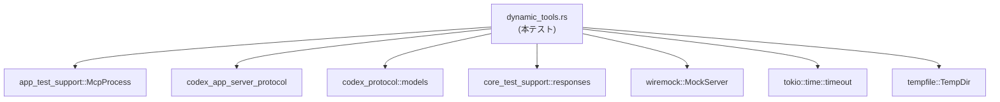
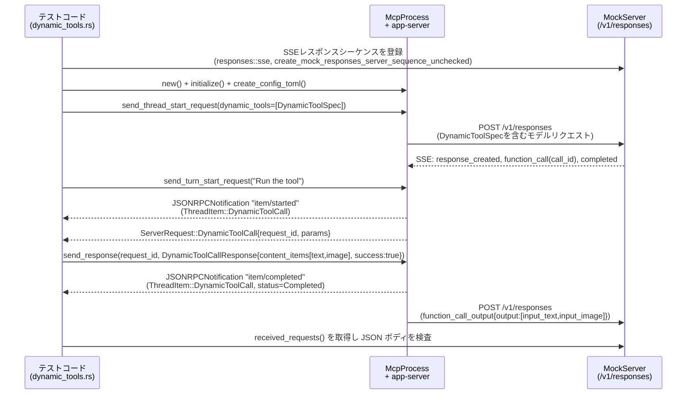

# app-server/tests/suite/v2/dynamic_tools.rs コード解説

---

## 0. ざっくり一言

このファイルは、v2 プロトコルにおける **Dynamic Tool（動的ツール）** の登録と呼び出しが、アプリケーションサーバー・クライアント・モデルプロバイダの間で正しくラウンドトリップすることを検証する **統合テスト群** を定義しています（`dynamic_tools.rs:L?-?`）。

※ 行番号はコードチャンクに含まれていないため、根拠表記では `L?-?` のように「不明」を意味するプレースホルダを用いています。

---

## 1. このモジュールの役割

### 1.1 概要

- このモジュールは、**動的ツール仕様（`DynamicToolSpec`）とツール呼び出し結果（`DynamicToolCallResponse`）が、JSON ベースのプロトコルメッセージとして正しくシリアライズ／デシリアライズされるか** を検証するために存在します（テスト関数群全体, `dynamic_tools.rs:L?-?`）。
- 具体的には、以下の点を確認します。
  - スレッド開始時に渡された動的ツール仕様が、**モデルへのリクエストペイロード内 `tools` 配列に正しく反映されるか**。
  - `defer_loading` が有効な「隠し」ツールが、**モデルへのリクエストから除外されるか**。
  - モデルが発行した `DynamicToolCall` リクエストに対しクライアントがレスポンスすることで、
    - スレッドアイテム（`ThreadItem::DynamicToolCall`）の状態が `InProgress` → `Completed` に遷移し、
    - モデルへの後続リクエストに `function_call_output` が期待どおりの形式で含まれるか。

### 1.2 アーキテクチャ内での位置づけ

このファイルは **テストコード** であり、以下のコンポーネントを橋渡しする役割を持ちます。

- `app_test_support::McpProcess`  
  … 実際の app-server プロセスを起動し、JSON-RPC ストリーム経由で操作するテスト用ヘルパー。
- `wiremock::MockServer`  
  … モデルプロバイダを模した HTTP サーバー。`/v1/responses` エンドポイントで SSE/JSON を返却。
- `codex_app_server_protocol::*`  
  … app-server とクライアント（ツールホスト）の間の JSON-RPC メッセージ型。
- `codex_protocol::models::*`  
  … モデルプロバイダに送信される `function_call_output` ペイロードの型。
- `core_test_support::responses`  
  … モデル側 SSE イベントを生成するユーティリティ。

依存関係を簡略化した図は次のとおりです。



このモジュール自身は公開 API を定義せず、**外部コンポーネントの協調動作を検証するインテグレーションテスト層**として機能しています。

### 1.3 設計上のポイント

- **非同期テスト構造**  
  - すべてのテスト関数は `#[tokio::test] async fn ... -> Result<()>` で定義され、Tokio ランタイム上で実行されます（`dynamic_tools.rs:L?-?`）。
  - 外部 I/O（プロセス・ネットワーク）に対しては `tokio::time::timeout` を一貫して使用し、ハングを避けています（`timeout(DEFAULT_READ_TIMEOUT, ...)` パターン, `dynamic_tools.rs:L?-?`）。

- **状態遷移の明示的検証**  
  - `ThreadItem::DynamicToolCall` の `status`, `content_items`, `success`, `duration_ms` の値が、  
    ツール呼び出し前後で期待どおりであることを明示的に検証しています（`dynamic_tool_call_round_trip_*` テスト, `dynamic_tools.rs:L?-?`）。

- **JSON レベルでのペイロード確認**  
  - モデルへの HTTP リクエストボディは `serde_json::Value` として取得され、  
    独自ヘルパー（`find_tool`, `function_call_output_raw_output` など）で検査されます（`dynamic_tools.rs:L?-?`）。
  - これにより、**プロトコル型のシリアライズ結果**が仕様どおりか（フィールド名・ネスト構造など）が直接確認されています。

- **エラー処理方針**  
  - テスト関数・ヘルパーともに `anyhow::Result` を返し、`?` と `Context` を用いてエラー発生箇所を明示します（`Result<Vec<Value>>` を返す `responses_bodies` など, `dynamic_tools.rs:L?-?`）。

- **所有権と並行性**  
  - `McpProcess` は常に `&mut McpProcess` として扱われ、  
    ストリーム読み出し関数（`read_stream_until_*`）の呼び出しは単一タスクからシーケンシャルに行われます。  
    これにより、**同一ストリームに対する競合アクセスが起きない**構造になっています（`wait_for_dynamic_tool_started`, `wait_for_dynamic_tool_completed`, `dynamic_tools.rs:L?-?`）。

---

## 2. コンポーネント一覧（関数・定数）

このチャンクに現れる主な関数／定数のインベントリです。

| 名前 | 種別 | 役割 / 用途 | 根拠 |
|------|------|-------------|------|
| `DEFAULT_READ_TIMEOUT` | `Duration`定数 | ストリーム読み取り・通知待ちの共通タイムアウト（10秒） | `dynamic_tools.rs:L?-?` |
| `thread_start_injects_dynamic_tools_into_model_requests` | `#[tokio::test] async fn` | 動的ツール仕様がモデルリクエストの `tools` 配列に反映されることを検証 | `dynamic_tools.rs:L?-?` |
| `thread_start_keeps_hidden_dynamic_tools_out_of_model_requests` | `#[tokio::test] async fn` | `defer_loading = true` のツールがモデルリクエストに出現しないことを検証 | `dynamic_tools.rs:L?-?` |
| `dynamic_tool_call_round_trip_sends_text_content_items_to_model` | `#[tokio::test] async fn` | テキストのみの動的ツール出力が `function_call_output` としてモデルに渡ることを検証 | `dynamic_tools.rs:L?-?` |
| `dynamic_tool_call_round_trip_sends_content_items_to_model` | `#[tokio::test] async fn` | テキスト＋画像など複数種の content items がモデルに渡ることを検証 | `dynamic_tools.rs:L?-?` |
| `responses_bodies` | `async fn` | `MockServer` が受信した `/responses` リクエストの JSON ボディを一覧取得 | `dynamic_tools.rs:L?-?` |
| `find_tool` | `fn` | モデルリクエストボディ内 `tools` 配列から、名前でツール仕様オブジェクトを検索 | `dynamic_tools.rs:L?-?` |
| `function_call_output_payload` | `fn` | モデルリクエストボディから、特定 `call_id` の `FunctionCallOutputPayload` をデコード | `dynamic_tools.rs:L?-?` |
| `function_call_output_raw_output` | `fn` | 上記の生 JSON (`output` フィールド) を取り出すヘルパー | `dynamic_tools.rs:L?-?` |
| `wait_for_dynamic_tool_started` | `async fn` | `item/started` 通知ストリームから特定 `call_id` の DynamicToolCall 開始を待つ | `dynamic_tools.rs:L?-?` |
| `wait_for_dynamic_tool_completed` | `async fn` | `item/completed` 通知ストリームから特定 `call_id` の DynamicToolCall 完了を待つ | `dynamic_tools.rs:L?-?` |
| `create_config_toml` | `fn` | 一時ディレクトリに app-server 用の `config.toml` を書き出す | `dynamic_tools.rs:L?-?` |

---

## 3. 公開 API と詳細解説

このファイル自身に `pub` な型・関数はありませんが、**テストシナリオの中心となる関数**を「API 的なエントリポイント」とみなして説明します。

### 3.1 主に利用している外部型

このモジュールで新しく定義される構造体・列挙体はありません。代わりに、以下の外部型を集中的に利用します。

| 名前 | 種別 | 定義元 | 役割 / 用途 |
|------|------|--------|-------------|
| `DynamicToolSpec` | 構造体 | `codex_app_server_protocol` | 動的ツールの名前・説明・入力スキーマ・`defer_loading` フラグを表現する仕様 |
| `DynamicToolCallParams` | 構造体 | 同上 | app-server からクライアントへの DynamicTool 呼び出し要求のパラメータ |
| `DynamicToolCallResponse` | 構造体 | 同上 | クライアントから app-server への DynamicTool 呼び出し結果 |
| `DynamicToolCallStatus` | 列挙体 | 同上 | DynamicToolCall アイテムの状態（`InProgress`, `Completed` など） |
| `ThreadItem` | 列挙体 | 同上 | スレッド内のアイテム種別。ここでは `DynamicToolCall` バリアントを使用 |
| `ItemStartedNotification` / `ItemCompletedNotification` | 構造体 | 同上 | `item/started`, `item/completed` 通知のペイロード |
| `JSONRPCNotification` / `JSONRPCResponse` | 構造体 | 同上 | JSON-RPC 通知／レスポンスメッセージの共通ラッパー |
| `ServerRequest` | 列挙体 | 同上 | app-server → クライアント向けリクエスト。ここでは `DynamicToolCall` バリアントを使用 |
| `FunctionCallOutputPayload` | 構造体 | `codex_protocol::models` | モデルプロバイダへ送る `function_call_output` の本体 |
| `FunctionCallOutputContentItem` | 列挙体 | 同上 | `function_call_output` 内の個々の content item（テキスト・画像など） |
| `FunctionCallOutputBody` | 列挙体 | 同上 | `function_call_output` の body 部分。ここでは `ContentItems(Vec<...>)` を使用 |
| `McpProcess` | 構造体 | `app_test_support` | app-server を子プロセスとして起動し JSON-RPC で操作するテスト用ラッパー |

これらはすべて **外部ライブラリで定義された型**であり、このファイルからは中身の詳細は見えません（`dynamic_tools.rs:L?-?`）。挙動は **テストの期待値**から推測しています。

---

### 3.2 重要関数の詳細（最大 7 件）

#### 3.2.1 `thread_start_injects_dynamic_tools_into_model_requests() -> Result<()>`

**概要**

- スレッド開始リクエストに含めた `DynamicToolSpec` が、モデルへのリクエストペイロードの `tools` 配列に正しくシリアライズされていることを検証する非同期テストです（`dynamic_tools.rs:L?-?`）。

**引数**

- なし（テスト関数）。

**戻り値**

- `anyhow::Result<()>`  
  テスト成功時は `Ok(())`、失敗時は `Err` を返します。

**内部処理の流れ**

1. モデル側のモック応答として、最終アシスタントメッセージのみを返す SSE レスポンスを 1 つ用意し、`MockServer` に登録します。  
   （`create_final_assistant_message_sse_response`, `create_mock_responses_server_sequence_unchecked`, `dynamic_tools.rs:L?-?`）

2. 一時ディレクトリを作成し、`create_config_toml` で app-server 用の設定ファイルを生成します。

3. `McpProcess::new` で app-server を起動し、`mcp.initialize()` を `timeout(DEFAULT_READ_TIMEOUT, ...)` でラップして初期化完了を待ちます。

4. `DynamicToolSpec` を以下のように構成します（`defer_loading = false`）：  
   - `name = "demo_tool"`  
   - `description = "Demo dynamic tool"`  
   - `input_schema` にシンプルな JSON Schema（`city: string` 必須）をセット。

5. `ThreadStartParams { dynamic_tools: Some(vec![dynamic_tool.clone()]), ..Default::default() }` を送信し、`ThreadStartResponse` を受信して `thread.id` を取得します。

6. `TurnStartParams` でシンプルなユーザー入力 `"Hello"` を含むターンを開始し、そのレスポンスと `"turn/completed"` 通知を待ちます。

7. `responses_bodies(&server)` で `MockServer` に送られた `/responses` リクエストの JSON ボディ一覧を取得し、先頭のボディから `find_tool` で `"demo_tool"` を検索します。

8. 見つかったツールオブジェクトに対して以下を検証します。  
   - `"description"` フィールドが `dynamic_tool.description` と一致する。  
   - `"parameters"` フィールドが `input_schema` と一致する。

**Errors / Panics**

- `McpProcess` の起動・初期化、`MockServer` のセットアップ、JSON シリアライズ／デシリアライズ、タイムアウトなどのエラーはすべて `?` 演算子で伝播し、テスト失敗となります。
- `bodies.first().context("expected at least one responses request")?;` により、モデルへのリクエストが 1 件もなければ即座にエラーになります（`dynamic_tools.rs:L?-?`）。

**Edge cases（エッジケース）**

- モデルへの複数リクエストがあっても、ここでは **先頭 1 件のみ** を検査します。  
  `bodies.first()` しか見ないため、後続リクエスト内のツール仕様はチェックされません。
- `body["tools"]` が配列でない・存在しない場合、`find_tool` は `None` を返し、コンテキスト付きエラー `"expected dynamic tool to be injected into request"` を発生させます。

**使用上の注意点**

- `DynamicToolSpec` の `input_schema` が複雑な場合でも、ここでは構造を丸ごと比較するため、**スキーマの差異がそのままテスト失敗につながる**点に注意が必要です。
- タイムアウト値 `DEFAULT_READ_TIMEOUT` は 10 秒に固定されており、環境によっては大きすぎる／小さすぎる可能性があります（`dynamic_tools.rs:L?-?`）。

---

#### 3.2.2 `thread_start_keeps_hidden_dynamic_tools_out_of_model_requests() -> Result<()>`

**概要**

- `DynamicToolSpec { defer_loading: true }` で定義された「隠し」ツールが、モデルへのリクエストペイロード内 `tools` 配列に含まれないことを検証するテストです。

**内部処理の流れ**

1. SSE レスポンスや app-server のセットアップは前のテストとほぼ同じです。

2. 異なる点は、`DynamicToolSpec` の `defer_loading` を `true` に設定することです（`dynamic_tools.rs:L?-?`）。

3. スレッド開始 → ターン開始 → `"turn/completed"` 通知まで進め、モデルへのリクエストを `responses_bodies` で取得します。

4. 全リクエストボディに対して  
   `bodies.iter().all(|body| find_tool(body, &dynamic_tool.name).is_none())`  
   を検証します。1 件でもツールが見つかれば `assert!` が失敗します。

**Errors / Panics**

- 前のテストと同様、I/O・タイムアウト・JSON 処理のエラーは `?` で伝播します。
- `assert!` 失敗時には `"hidden dynamic tool should not be sent to the model"` というメッセージでテストが失敗します。

**Edge cases**

- モデルリクエストが 0 件の場合でも、`bodies` は空ベクタとなり `all(...)` は真を返すため、テストは通過します。  
  ただし、前段でリクエストが発生する前提があるため、通常は問題になりません。

**使用上の注意点**

- 「隠し」ツールの条件は `defer_loading: true` のみであり、**他のフィールドはチェックしていません**。  
  将来仕様が変わる場合、このテストだけでは不十分になる可能性があります。

---

#### 3.2.3 `dynamic_tool_call_round_trip_sends_text_content_items_to_model() -> Result<()>`

**概要**

- **1 回の DynamicTool 呼び出し**が、  
  - モデルの SSE 応答から app-server を経由してクライアント（このテストコード）に届き、  
  - クライアントからの `DynamicToolCallResponse` が `function_call_output` としてモデルへの後続リクエストに反映される、  
  という一連のラウンドトリップが正しく動作することを検証するテストです（テキストのみの content item）。

**内部処理の流れ（アルゴリズム）**

1. **SSE 応答のセットアップ**  
   - `core_test_support::responses::sse` を用い、  
     `ev_response_created` → `ev_function_call` → `ev_completed` のイベント列を持つ SSE レスポンスと、  
     最終的なアシスタントメッセージ SSE を 2 件のレスポンスとして `MockServer` に登録します（`dynamic_tools.rs:L?-?`）。

2. **app-server とスレッドの準備**  
   - `create_config_toml` で設定ファイルを作成し、`McpProcess` を起動・初期化します。
   - `DynamicToolSpec { defer_loading: false }` を 1 つ持つスレッドを開始し、その `thread_id` を取得します。

3. **ツール呼び出しを含むターンの開始**  
   - `"Run the tool"` というユーザー入力でターンを開始し、`TurnStartResponse` から `turn_id` を取得します。

4. **DynamicToolCall 開始通知の待機**  
   - `wait_for_dynamic_tool_started(&mut mcp, call_id)` で `item/started` 通知をループし、  
     `ThreadItem::DynamicToolCall { id == call_id, .. }` の通知を取得します。  
   - この時点では `status = InProgress`, `content_items = None`, `success = None`, `duration_ms = None` であることを検証します。

5. **DynamicToolCall リクエストの受信**  
   - `mcp.read_stream_until_request_message()` で app-server → クライアントのリクエストを待ち、  
     `ServerRequest::DynamicToolCall { request_id, params }` バリアントであることを確認します。
   - `params` が期待値 `DynamicToolCallParams`（`thread_id`, `turn_id`, `call_id`, `tool`, `arguments`）と一致することを検証します。

6. **ツール呼び出しへの応答送信**  
   - `DynamicToolCallResponse { content_items: vec![InputText{text:"dynamic-ok"}], success: true }` を構築し、  
     `mcp.send_response(request_id, serde_json::to_value(response)?)` で返します。

7. **DynamicToolCall 完了通知の待機と検証**  
   - `wait_for_dynamic_tool_completed` で `item/completed` 通知を取得し、  
     `ThreadItem::DynamicToolCall` の `status = Completed` かつ `content_items`・`success`・`duration_ms` が適切にセットされていることを確認します。

8. **モデルへの後続リクエストの検査**  
   - `"turn/completed"` 通知を待った後、`responses_bodies(&server)` で `/responses` ボディ一覧を取得します。
   - `function_call_output_payload(body, call_id)` で `FunctionCallOutputPayload` を復元し、  
     `FunctionCallOutputPayload::from_text("dynamic-ok".to_string())` と等しいことを検証します。

**Rust 特有の安全性 / エラー / 並行性**

- `timeout(DEFAULT_READ_TIMEOUT, ...)` を多用し、**非同期ストリーム読み取りの無限待ちを防いでいます**。
- `McpProcess` は `&mut` で受け取り、並列に複数の読み取りタスクを走らせないことで **データ競合を防止** しています。
- JSON デシリアライズ（`serde_json::from_value`）や I/O エラーはすべて `?` でテスト失敗として扱われ、パニックは明示的な `panic!` のみです（誤った `ServerRequest` バリアントを受け取った場合）。

**Edge cases**

- `read_stream_until_request_message` が DynamicToolCall 以外のリクエストを返した場合、`panic!("expected DynamicToolCall request, got {other:?}")` が発生します。
- `function_call_output_payload` は、該当 `call_id` を含む `function_call_output` が存在しない場合 `None` を返し、テスト側で `context` によりエラー化されます。

**使用上の注意点**

- DynamicToolCall が複数回発生するようなシナリオでは、`wait_for_dynamic_tool_started/completed` は **最初に条件を満たす 1 件だけ** を返す点に注意が必要です。
- `call_id` は文字列リテラル `"dyn-call-1"` として固定されており、テストシナリオを変更する場合は SSE 側・期待値側を合わせる必要があります。

---

#### 3.2.4 `dynamic_tool_call_round_trip_sends_content_items_to_model() -> Result<()>`

**概要**

- 先ほどのテストを拡張し、**テキストと画像（`input_text`, `input_image`）など複数種の content item** を含む DynamicToolCall のラウンドトリップが正しく動作し、  
  - モデルへの `function_call_output` の `output` JSON と  
  - `FunctionCallOutputPayload` へのデコード結果  
  が仕様どおりであることを検証します。

**内部処理のポイント**

- セットアップ（SSE 応答・スレッド／ターン生成・DynamicToolCall リクエストの受信）までは前テストとほぼ同じです。

- ツール呼び出しへの応答として、次のような `DynamicToolCallResponse` を構築します（`dynamic_tools.rs:L?-?`）:

  ```rust
  let response_content_items = vec![
      DynamicToolCallOutputContentItem::InputText {
          text: "dynamic-ok".to_string(),
      },
      DynamicToolCallOutputContentItem::InputImage {
          image_url: "data:image/png;base64,AAA".to_string(),
      },
  ];
  let response = DynamicToolCallResponse {
      content_items: response_content_items,
      success: true,
  };
  ```

- 同時に、これらをモデルプロトコル側の `FunctionCallOutputContentItem` に変換した `content_items` ベクタを構築し、  
  後段で `FunctionCallOutputBody::ContentItems(content_items.clone())` との一致を検証します。

- DynamicToolCall 完了通知では、`content_items` に InputText と InputImage の両方が保持され、`success = Some(true)` であることを確認します。

- モデルへの後続リクエストについては 2 段階で検証します。

  1. **生 JSON の形**  
     - `function_call_output_raw_output` で `output` 部分の JSON を取り出し、  

       ```json
       [
         { "type": "input_text",  "text": "dynamic-ok" },
         { "type": "input_image", "image_url": "data:image/png;base64,AAA" }
       ]
       ```

       という配列であることを `assert_eq!` します。

  2. **型でのデコードとシリアライズ**  
     - `function_call_output_payload` で `FunctionCallOutputPayload` にデコードし、  
       - `payload.body == FunctionCallOutputBody::ContentItems(content_items.clone())`  
       - `payload.success == None`  
       を確認します。
     - さらに、`serde_json::to_string(&payload)` と `serde_json::to_string(&content_items)` が等しいことを検証し、  
       **ペイロードのシリアライズ結果が content items の素の配列と同一である**ことを確認します。

**使用上の注意点**

- このテストは `FunctionCallOutputPayload` の JSON 形状に強く依存しているため、  
  型のシリアライズ仕様が変更された場合に真っ先に壊れるテストになります。
- `payload.success == None` であることを検証しているため、  
  「ツールの成功状態はモデルペイロードからは表現しない」という仕様を前提としていると解釈できますが、コード上には明示的なコメントはありません。

---

#### 3.2.5 `responses_bodies(server: &MockServer) -> Result<Vec<Value>>`

**概要**

- Wiremock の `MockServer` から、これまでに受信したリクエストのうち **パスが `/responses` で終わるもののみ** を抽出し、その JSON ボディを `Vec<Value>` として返す非同期ヘルパーです。

**引数**

| 引数名 | 型 | 説明 |
|--------|----|------|
| `server` | `&MockServer` | `create_mock_responses_server_sequence_unchecked` などで構成した Wiremock サーバー |

**戻り値**

- `Result<Vec<Value>>`  
  - `Ok(vec)` … `/responses` に対する全リクエストの JSON ボディ一覧  
  - `Err` … `received_requests` や `body_json` の失敗時

**内部処理の流れ**

1. `server.received_requests().await` でリクエスト一覧を取得します。
2. `req.url.path().ends_with("/responses")` で `/responses` エンドポイント宛てのものに絞り込みます。
3. 各リクエストについて `req.body_json::<Value>()` でボディを JSON としてデコードし、  
   エラー時には `"request body should be JSON"` というコンテキストを付与します。
4. `collect()` で `Result<Vec<Value>>` としてまとめて返却します。

**Errors / Edge cases**

- `/responses` 以外のパスはすべて無視されます。そのため、スレッド管理等に使われる他のエンドポイントのボディは取得できません。
- `body_json` に失敗すると、その時点で `Err` を返すため、1 件の不正な JSON があると全体が失敗します。

**使用上の注意点**

- この関数は **テスト専用** であり、エラー時はそのままテスト失敗となる想定です。  
  再試行や部分的な成功は考慮していません。

---

#### 3.2.6 `wait_for_dynamic_tool_started(mcp: &mut McpProcess, call_id: &str) -> Result<ItemStartedNotification>`

**概要**

- `McpProcess` から流れてくる `"item/started"` JSON-RPC 通知ストリームを監視し、  
  指定された `call_id` を持つ `ThreadItem::DynamicToolCall` が現れるまで待機する非同期ヘルパーです。

**引数**

| 引数名 | 型 | 説明 |
|--------|----|------|
| `mcp` | `&mut McpProcess` | app-server との JSON-RPC ストリームを保持するプロセスラッパー |
| `call_id` | `&str` | 目的の DynamicToolCall の ID |

**戻り値**

- `Result<ItemStartedNotification>`  
  見つかった通知を返却します。タイムアウトやデシリアライズ失敗時は `Err`。

**内部処理の流れ**

1. 無限ループ内で `timeout(DEFAULT_READ_TIMEOUT, mcp.read_stream_until_notification_message("item/started")).await??;` を実行し、  
   `"item/started"` タイプの通知を待ちます。
2. `JSONRPCNotification { params: Some(params), .. }` でなければスキップします。
3. `serde_json::from_value(params)` で `ItemStartedNotification` にデコードします。
4. `matches!(&started.item, ThreadItem::DynamicToolCall { id, .. } if id == call_id)` で、  
   対象の DynamicToolCall かどうかを判定し、該当すれば `Ok(started)` を返します。
5. そうでなければループを継続します。

**Rust 特有の安全性 / 並行性**

- `McpProcess` を `&mut` で受け取り、ループ内からのみストリーム読み取りを行うことで、  
  **同一ストリームへの並行アクセスをコンパイル時に禁止**しています。
- `timeout` により各待機に上限時間を設け、無限ブロックを避けています。

**Edge cases**

- `"item/started"` 通知が一切来ない場合、`timeout` により一定時間ごとに `Elapsed` エラーが発生し、最終的に `Err` で関数を抜けます。
- 異なる `call_id` を持つ DynamicToolCall や、その他のアイテム種別（もし存在すれば）はすべて読み飛ばされます。  
  そのため、ストリーム上には現れるが、テスト上は無視される通知が存在しうる設計です。

**使用上の注意点**

- ループに上限回数は設けられていません。  
  非常に多数の別 `call_id` 通知が来るシナリオでは、理論上は時間がかかる可能性がありますが、テストコードとしては想定範囲と見られます。

---

#### 3.2.7 `wait_for_dynamic_tool_completed(mcp: &mut McpProcess, call_id: &str) -> Result<ItemCompletedNotification>`

**概要**

- 前関数の `"item/completed"` 版であり、指定 `call_id` の DynamicToolCall 完了通知を待機します。

**ポイント**

- 実装は `wait_for_dynamic_tool_started` とほぼ同一で、  
  - 監視する通知名が `"item/completed"`  
  - デコード先が `ItemCompletedNotification`  
  である点のみ異なります。

**使用上の注意点**

- `wait_for_dynamic_tool_started` と同様、ストリーム上の他の通知はすべて読み飛ばされます。  
  そのため、テスト設計としては **1 テストにつき 1 つの DynamicToolCall** を前提としていると解釈できます。

---

### 3.3 その他の関数

テストを支える補助関数の一覧です。

| 関数名 | シグネチャ（概要） | 役割（1 行） |
|--------|--------------------|--------------|
| `find_tool` | `fn find_tool<'a>(body: &'a Value, name: &str) -> Option<&'a Value>` | モデルリクエストボディ内 `tools` 配列から、指定 `name` を持つツールオブジェクトを探す |
| `function_call_output_payload` | `fn function_call_output_payload(body: &Value, call_id: &str) -> Option<FunctionCallOutputPayload>` | `function_call_output_raw_output` の結果を `FunctionCallOutputPayload` にデコードする |
| `function_call_output_raw_output` | `fn function_call_output_raw_output(body: &Value, call_id: &str) -> Option<Value>` | `body["input"]` の配列から `type == "function_call_output"` かつ `call_id` 一致の要素を探し、その `output` を返す |
| `create_config_toml` | `fn create_config_toml(codex_home: &Path, server_uri: &str) -> std::io::Result<()>` | 一時ディレクトリ配下に、Mock モデルプロバイダを指す `config.toml` を書き出す |

---

## 4. データフロー

ここでは、**複数種の content items を送るラウンドトリップテスト**  
`dynamic_tool_call_round_trip_sends_content_items_to_model` のデータフローを例に説明します。

### 4.1 テキスト＋画像 content items のラウンドトリップ

処理の要点：

1. テストコードが Wiremock サーバーに、DynamicToolCall を含む SSE 応答シーケンスを登録します。
2. テストコードが `McpProcess` を通じて app-server を起動し、DynamicTool を登録したスレッドとターンを開始します。
3. モデル（MockServer）の SSE 応答により、app-server が DynamicToolCall を検出し、`ServerRequest::DynamicToolCall` をクライアント（テストコード）に送ります。
4. テストコードが `DynamicToolCallResponse` を返すと、app-server はスレッドアイテムを更新し、モデルへの後続リクエストに `function_call_output` を含めて送信します。
5. テストコードは最後に `/responses` への HTTP リクエストボディを読み出し、content items が正しいことを確認します。

これをシーケンス図で表すと次のようになります。



---

## 5. 使い方（How to Use）

このファイルはテストコードですが、**動的ツール連携の統合テストを書く際のパターン**として参考になります。

### 5.1 基本的な使用方法（テストパターン）

最小構成の統合テストフローは以下のようになります。

```rust
// 一時ディレクトリと MockServer を用意する
let server = create_mock_responses_server_sequence_unchecked(responses).await?; // モデル側 SSE 応答
let codex_home = TempDir::new()?;                                              // app-server のホームディレクトリ
create_config_toml(codex_home.path(), &server.uri())?;                         // config.toml を生成

// app-server プロセスを起動する
let mut mcp = McpProcess::new(codex_home.path()).await?;                       // プロセス生成
timeout(DEFAULT_READ_TIMEOUT, mcp.initialize()).await??;                       // 初期化完了を待つ

// 動的ツールを含むスレッドを開始する
let dynamic_tool = DynamicToolSpec { /* name, description, input_schema, defer_loading */ };
let thread_req = mcp
    .send_thread_start_request(ThreadStartParams {
        dynamic_tools: Some(vec![dynamic_tool]),
        ..Default::default()
    })
    .await?;
let thread_resp: JSONRPCResponse = timeout(
    DEFAULT_READ_TIMEOUT,
    mcp.read_stream_until_response_message(RequestId::Integer(thread_req)),
).await??;
let ThreadStartResponse { thread, .. } = to_response::<ThreadStartResponse>(thread_resp)?;

// ユーザー入力を投げてターンを開始する
let turn_req = mcp
    .send_turn_start_request(TurnStartParams {
        thread_id: thread.id,
        input: vec![V2UserInput::Text {
            text: "Run the tool".to_string(),
            text_elements: Vec::new(),
        }],
        ..Default::default()
    })
    .await?;
```

この後、必要に応じて

- `wait_for_dynamic_tool_started` / `wait_for_dynamic_tool_completed` で通知を待つ
- `read_stream_until_request_message` で `ServerRequest::DynamicToolCall` を受け取る
- `send_response` で `DynamicToolCallResponse` を返す
- `responses_bodies` でモデルリクエストを検査する

という流れを組み合わせます。

### 5.2 よくある使用パターン

- **ツール仕様の検証**  
  - `thread_start_injects_dynamic_tools_into_model_requests` のように、  
    ThreadStart → TurnStart → `/responses` ボディ検査というパターンで、  
    **ツール定義がモデルにどのように伝達されるか** を検証します。

- **ツール呼び出しのラウンドトリップ**  
  - `dynamic_tool_call_round_trip_*` のように、SSE 応答に `function_call` イベントを含めることで、  
    DynamicToolCall → Response → function_call_output までの一連の流れをテストします。

### 5.3 よくある間違い（想定されるもの）

コードから読み取れる範囲で、起こり得る誤用例と正しい例を示します。

```rust
// 誤り例: config.toml を書かずに McpProcess を起動する
let codex_home = TempDir::new()?;
// create_config_toml を呼んでいないため、app-server がモデルに接続できない可能性がある
let mut mcp = McpProcess::new(codex_home.path()).await?; // 実行時エラーになることがある

// 正しい例: 先に config.toml を生成してから McpProcess を起動する
let codex_home = TempDir::new()?;
create_config_toml(codex_home.path(), &server.uri())?;   // 必要な設定を事前に書き込む
let mut mcp = McpProcess::new(codex_home.path()).await?; // 設定を読み込んで起動
```

```rust
// 誤り例: DynamicToolCall のリクエスト種別をチェックしない
let request = mcp.read_stream_until_request_message().await??;
// request が DynamicToolCall 以外でもパニックや無視など意図しない挙動になりうる

// 正しい例: ServerRequest のバリアントを明示的にマッチする
let (request_id, params) = match request {
    ServerRequest::DynamicToolCall { request_id, params } => (request_id, params),
    other => panic!("expected DynamicToolCall request, got {other:?}"),
};
```

### 5.4 使用上の注意点（まとめ）

- **タイムアウト必須**  
  - すべてのストリーム読み取りは `timeout(DEFAULT_READ_TIMEOUT, ...)` でラップされています。  
    これにより、app-server や MockServer が応答しない場合でもテストがハングしません。

- **ストリームの順序保証**  
  - この設計では、`McpProcess` に対する読み取りは常に単一タスクから順番に行う前提です。  
    複数タスクから同時にストリームを読むような使い方はしていません。

- **JSON 形状への依存**  
  - `find_tool` や `function_call_output_raw_output` は、JSON ボディのキー名やネスト構造に強く依存しています。  
    プロトコルの JSON 形状が変わった場合、ここを含むテストが連鎖的に失敗し得ます。

---

## 6. 変更の仕方（How to Modify）

### 6.1 新しい機能（テストシナリオ）を追加する場合

1. **SSE 応答シナリオの定義**  
   - `core_test_support::responses` を用いて、新しいパターンの SSE イベント列（例: 複数回の `function_call` など）を構築します。

2. **設定およびプロセスのセットアップ**  
   - 既存テスト同様、`TempDir` と `create_config_toml` で環境を構築し、`McpProcess` を起動します。

3. **スレッド・ターンの開始**  
   - 必要な `DynamicToolSpec` を `ThreadStartParams.dynamic_tools` に渡し、ターン開始でモデルリクエストを発生させます。

4. **通知・リクエストの待機**  
   - `wait_for_dynamic_tool_started/completed` や `read_stream_until_request_message` を組み合わせて、  
     新しいシナリオに対応した通知／リクエストの順序を検証します。

5. **モデルリクエストの検査**  
   - `responses_bodies` と JSON ヘルパー関数を使って、期待するフィールドが存在することを検証します。  
   - 必要に応じて新しいヘルパー（例: 別種の input item 検査関数）を追加します。

### 6.2 既存の機能を変更する場合

- **影響範囲の確認**

  - `DynamicToolSpec` や `DynamicToolCallResponse` のフィールドを変更する場合、  
    - 本ファイル内のすべてのテスト  
    - プロトコル型を使っている他のテスト／本番コード  
    に影響します。シグネチャの変更前に参照箇所の検索が必要です。

- **契約（前提条件）の維持**

  - 例えば `function_call_output_raw_output` は、`body["input"]` が配列である前提です。  
    この前提が崩れる変更を行う場合は、関数自体の契約（戻り値の意味）を更新し、テストも合わせて修正する必要があります。

- **テストとヘルパーの一貫性**

  - `wait_for_dynamic_tool_started` / `wait_for_dynamic_tool_completed` が参照する通知の名前（`"item/started"`, `"item/completed"`）や  
    `ThreadItem::DynamicToolCall` の構造が変わる場合、  
    **テスト書き換えを忘れると永遠に通知が見つからずタイムアウトする**ため注意が必要です。

---

## 7. 関連ファイル・モジュール

このモジュールと密接に関係すると推測されるモジュール（ファイルパス自体はこのチャンクからは不明）を列挙します。

| モジュール / 型 | 役割 / 関係 |
|----------------|------------|
| `app_test_support::McpProcess` | app-server プロセスの起動・JSON-RPC ストリーム管理を行うテストユーティリティ。DynamicToolCall などのリクエスト／通知を受け取るための基盤となります。 |
| `app_test_support::create_mock_responses_server_sequence_unchecked` | Wiremock `MockServer` をセットアップし、指定された SSE レスポンスシーケンスを `/v1/responses` に紐づけるユーティリティ。 |
| `core_test_support::responses` | モデルの SSE 応答パターン（`ev_response_created`, `ev_function_call`, `ev_completed` など）を構築するためのユーティリティ群。 |
| `codex_app_server_protocol::*` | app-server とクライアント間の v2 プロトコル型。DynamicTool 関連のメッセージ、Thread/Turn/Item などのドメインオブジェクトを提供します。 |
| `codex_protocol::models::*` | モデルプロバイダとの通信に用いるペイロード定義。`FunctionCallOutputPayload` などを通じて DynamicTool の結果をモデルに渡します。 |
| `wiremock::MockServer` | モデルプロバイダを模した HTTP サーバー。テストごとに起動され、app-server からの `/v1/responses` リクエストを記録・応答します。 |

---

### Bugs / Security / Contracts / Edge Cases（総括）

- **既知のバグ**  
  - このチャンクから、明確にバグと断定できる挙動は確認できません。

- **セキュリティ面**

  - `create_config_toml` で `sandbox_mode = "read-only"` が設定されており、  
    テスト中の app-server は読み取り専用サンドボックスモードで動作する前提になっています（`dynamic_tools.rs:L?-?`）。  
    ただし、DynamicTool 自体の権限や実行内容についてはこのファイルからは分かりません。

- **契約とエッジケース**

  - 多くの関数が「期待される JSON 形状」に強く依存しており、  
    形状が変わると `None` や `Err` を返してテストが失敗する設計になっています。
  - 通知待機ヘルパーは対象外の通知を読み飛ばすため、**ストリーム上に現れたがテスト上は無視される通知**が存在し得ますが、  
    テストシナリオからは問題になるケースは読み取れません。

- **パフォーマンス / スケーラビリティ**

  - すべてテスト用コードであり、性能最適化は主目的ではありません。  
  - 無限ループ＋`timeout` という構造は、通知件数が極端に多い場合に時間がかかる可能性がありますが、  
    通常のテスト環境では実務上問題にならないと考えられます（コード上に性能上の懸念コメントはありません）。

以上が、本チャンクに含まれる `dynamic_tools.rs` の構造と振る舞いの整理です。
