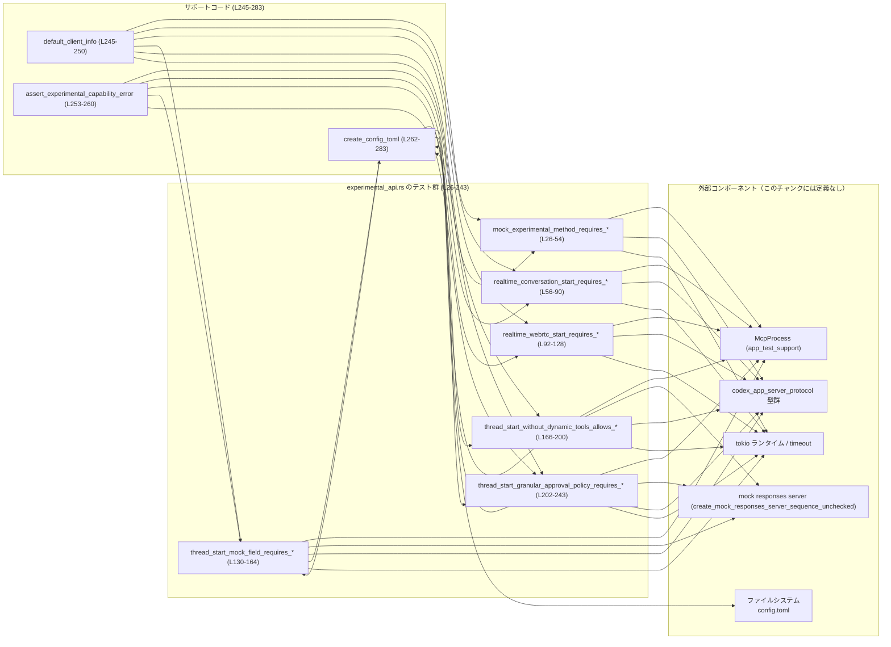
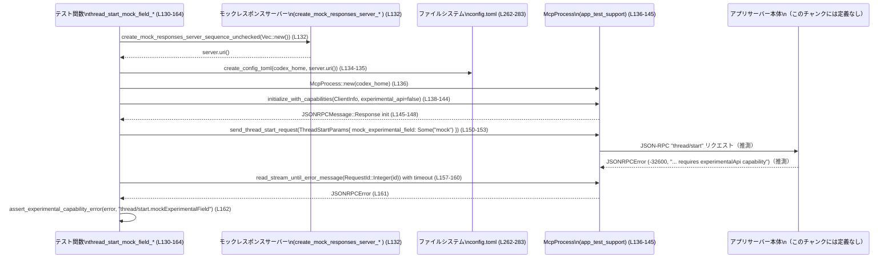

# app-server/tests/suite/v2/experimental_api.rs コード解説

## 0. ざっくり一言

experimental API 用の capability フラグ（`experimental_api`）が `false` のときに、特定の実験的メソッドやフィールドが JSON-RPC エラーとして拒否されること、および一部の通常機能は許可されることを検証する非同期統合テスト群です  
[app-server/tests/suite/v2/experimental_api.rs:L24-243]

---

## 1. このモジュールの役割

### 1.1 概要

- このテストモジュールは、クライアントが `InitializeCapabilities { experimental_api: false }` を宣言した場合のサーバーの振る舞いを検証します  
  [L31-38, L62-68, L98-104, L138-144, L175-181, L211-217]
- 実験的なメソッド／フィールド／ポリシーを呼び出したときに、特定の JSON-RPC エラー（コード `-32600` とメッセージ書式）になることを確認します  
  [L52, L88, L126, L162, L241, L253-260]
- 併せて、実験的要素を含まない通常の `thread/start` 呼び出しは capability なしでも成功することを確認します  
  [L166-200]

### 1.2 アーキテクチャ内での位置づけ

このファイル単体から読み取れる関係を簡略化すると、次のようになります。



- `McpProcess` や `create_mock_responses_server_sequence_unchecked` の実装はこのチャンクには現れませんが、命名と利用方法から「アプリケーションサーバーへの JSON-RPC クライアント」と「モック HTTP サーバー」であると推測できます（推測であり、断定はできません）。

### 1.3 設計上のポイント

コードから読み取れる設計上の特徴は次の通りです。

- **パターン化されたテストフロー**  
  すべてのテストが「一時ディレクトリ作成 → `McpProcess` 初期化 → capabilities 付き initialize → リクエスト送信 → ストリームからレスポンス取得 → アサーション」という流れを持ちます  
  [L26-54, L56-90, L92-128, L130-164, L166-200, L202-243]
- **共有ヘルパーによる重複削減**
  - クライアント情報生成は `default_client_info` に集約  
    [L245-250]
  - エラー内容検証は `assert_experimental_capability_error` に集約  
    [L253-260]
  - サーバー向け設定ファイル生成は `create_config_toml` に集約  
    [L262-283]
- **非同期・タイムアウト制御**  
  各テストは `#[tokio::test]` の非同期テストであり、JSON-RPC ストリーム読み取りには `tokio::time::timeout` で 10 秒の上限を設けています  
  [L22, L24, L47-51, L83-87, L121-125, L157-161, L193-197, L236-240]
- **エラーハンドリング**  
  - テスト関数の戻り値を `anyhow::Result<()>` とし、`?` 演算子で I/O や非同期処理のエラーを早期リターンしています  
    [L26, L56, L93, L131, L167, L203]
  - JSON-RPC レベルのエラー（仕様上のエラー）は `assert_experimental_capability_error` で内容を精査し、実装の契約をチェックします  
    [L52, L88, L126, L162, L241, L253-260]
- **Rust 言語の安全性**
  - 一時ディレクトリ `TempDir` のスコープによる自動削除、`Path` / `std::fs::write` による型安全なファイル操作を利用しています  
    [L21, L28, L132-135, L262-283]
  - 非同期関数内での `?` 利用により、エラー発生時には確実にテストを失敗させる構造になっています。

---

## 2. 主要な機能一覧（コンポーネントインベントリー）

### 2.1 関数インベントリー

このファイル内で定義されている関数の一覧です。

| 種別 | 名前 | 役割 / 用途 | 定義位置 |
|------|------|-------------|----------|
| テスト | `mock_experimental_method_requires_experimental_api_capability` | 実験的メソッド `mock/experimentalMethod` を capability なしで呼ぶとエラーになることを検証 | app-server/tests/suite/v2/experimental_api.rs:L26-54 |
| テスト | `realtime_conversation_start_requires_experimental_api_capability` | `thread/realtime/start`（デフォルト transport）の開始が capability なしでは拒否されることを検証 | L56-90 |
| テスト | `realtime_webrtc_start_requires_experimental_api_capability` | `thread/realtime/start` を WebRTC transport で開始する場合も capability が必要なことを検証 | L92-128 |
| テスト | `thread_start_mock_field_requires_experimental_api_capability` | `thread/start` パラメータの `mock_experimental_field` 使用が capability なしではエラーになることを検証 | L130-164 |
| テスト | `thread_start_without_dynamic_tools_allows_without_experimental_api_capability` | 実験的フィールドを使わずに `thread/start` する場合は capability なしで成功することを検証 | L166-200 |
| テスト | `thread_start_granular_approval_policy_requires_experimental_api_capability` | `AskForApproval::Granular` な `approval_policy` が capability なしではエラーになることを検証 | L202-243 |
| ヘルパー | `default_client_info` | テスト用 `ClientInfo` を一貫した値で作成 | L245-250 |
| ヘルパー | `assert_experimental_capability_error` | JSON-RPC エラーが仕様どおりか（コード・メッセージ・データ）を検証 | L253-260 |
| ヘルパー | `create_config_toml` | テスト用の `config.toml` を一時ディレクトリに書き出す | L262-283 |

### 2.2 主な機能（高レベル）

- experimental API capability が **無効** の初期化フローの共通化（`initialize_with_capabilities(... experimental_api: false, ...)`）  
  [L31-38, L62-68, L98-104, L138-144, L175-181, L211-217]
- JSON-RPC エラーコード `-32600` と特定メッセージ書式  
  `"{reason} requires experimentalApi capability"` の検証  
  [L253-258]
- 実験的メソッド／フィールド／ポリシーごとの挙動検証：
  - `mock/experimentalMethod` メソッド  
    [L45-52]
  - `thread/realtime/start`（通常／WebRTC transport）  
    [L75-88, L111-127]
  - `thread/start.mockExperimentalField`  
    [L150-162]
  - `askForApproval.granular`  
    [L223-241]
- 非実験的な `thread/start` での成功パス検証（`JSONRPCResponse` → `ThreadStartResponse` 変換まで）  
  [L187-199]

---

## 3. 公開 API と詳細解説

このファイル自体はテスト用モジュールであり、外部クレートから直接呼び出される API は定義していません。ここでは「テストの公開インターフェース」として重要な関数と、外部依存型を整理します。

### 3.1 型一覧（主に外部依存）

| 名前 | 種別 | 定義元 | 役割 / 用途 | 使用箇所 |
|------|------|--------|-------------|----------|
| `McpProcess` | 構造体（推測） | `app_test_support` | アプリケーションサーバーとの JSON-RPC 通信を抽象化したクライアント（推測） | 生成と各種メソッド呼び出し [L29, L44-46, L74-82, L110-120, L136-145, L150-155, L173-181, L187-196, L209-218, L223-234] |
| `ClientInfo` | 構造体 | `codex_app_server_protocol` | クライアント名・バージョンなどの識別情報 | `default_client_info` の返り値 [L245-250] と `initialize_with_capabilities` の引数 [L33, L63, L99, L139, L176, L212] |
| `InitializeCapabilities` | 構造体 | 同上 | クライアントがサポートする機能（ここでは `experimental_api` と opt-out 通知）をサーバーへ伝える | 各テストの initialize 呼び出し [L34-38, L64-68, L100-104, L140-144, L177-181, L213-217] |
| `JSONRPCMessage` | 列挙体（推測） | 同上 | JSON-RPC のメッセージ種別（ここでは `Response` バリアントのみ使用） | initialize 応答の型判定 [L40-42, L70-72, L106-108, L146-148, L183-185, L219-221] |
| `JSONRPCError` | 構造体 | 同上 | JSON-RPC エラー応答の情報（コード・メッセージ・データ）を保持 | `assert_experimental_capability_error` 引数 [L253] およびエラーアサート [L52, L88, L126, L162, L241] |
| `JSONRPCResponse` | 構造体 | 同上 | JSON-RPC 成功応答のラッパー | 正常系テストで受信 [L193-197] |
| `ThreadRealtimeStartParams` | 構造体 | 同上 | `thread/realtime/start` メソッド用のパラメータ（スレッド ID、プロンプト、transport など） | リクエスト生成 [L75-81, L111-119] |
| `ThreadRealtimeStartTransport` | 列挙体 | 同上 | Realtime スレッド開始の transport 種別（ここでは `Webrtc { sdp }` のみ使用） | WebRTC テスト [L115-117] |
| `ThreadStartParams` | 構造体 | 同上 | `thread/start` メソッドの入力パラメータ | 各 `thread/start` 関連テスト [L151-153, L188-191, L224-232] |
| `ThreadStartResponse` | 構造体 | 同上 | `thread/start` の成功応答 | 正常系テストでのデシリアライズ対象 [L198] |
| `AskForApproval` | 列挙体 | 同上 | 承認ポリシー（ここでは Granular variant） | granular approval テスト [L225-231] |
| `MockExperimentalMethodParams` | 構造体 | 同上 | `mock/experimentalMethod` 用のパラメータ | 実験メソッドテスト [L45] |
| `RequestId` | 列挙体 | 同上 | JSON-RPC のリクエスト ID（ここでは `Integer` variant のみ） | ストリーム読み取りのキー [L49, L85, L123, L159, L195, L238] |
| `TempDir` | 構造体 | `tempfile` | 一時ディレクトリを安全に管理 | 各テストでホームディレクトリとして利用 [L28, L58, L94, L133, L170, L206] |
| `Path` | 構造体 | `std::path` | ファイルシステムパスの抽象 | `create_config_toml` の引数 [L262] |

※ 外部型の内部構造や完全な仕様はこのチャンクには現れないため、上記は名前と利用箇所からの解釈にとどまります。

---

### 3.2 関数詳細（重要度の高い 7 件）

#### `mock_experimental_method_requires_experimental_api_capability() -> Result<()>`

**概要**

- 実験的メソッド `mock/experimentalMethod` が、`InitializeCapabilities.experimental_api` が `false` の状態では使用できず、特定の JSON-RPC エラーで拒否されることを検証する非同期テストです  
  [L26-54]

**引数**

- なし（テスト関数）

**戻り値**

- `anyhow::Result<()>`  
  - テスト内で発生した I/O・非同期処理エラーをラップして返します  
  - アサーション失敗時は panic し、`Result` ではなくテスト失敗になります

**内部処理の流れ**

1. 一時ディレクトリ `codex_home` を作成  
   [L28]
2. `McpProcess::new` でクライアントプロセスを初期化  
   [L29]
3. `initialize_with_capabilities` を呼び出し、`experimental_api: false` でサーバーを初期化  
   [L31-39]
4. 戻り値が `JSONRPCMessage::Response(_)` であることを `let ... else` で確認し、それ以外の場合は `anyhow::bail!` でテスト失敗  
   [L40-42]
5. `send_mock_experimental_method_request` で `MockExperimentalMethodParams::default()` を送信し、リクエスト ID（整数）を取得  
   [L44-46]
6. `tokio::time::timeout` により、指定 ID のエラーメッセージがストリームに現れるまで待機し、10 秒を超えた場合はタイムアウトエラーに  
   [L47-51]
7. 受信した `JSONRPCError` を `assert_experimental_capability_error` で検証し、コード・メッセージ・データ形式が期待通りかどうかを確認  
   [L52, L253-260]

**Examples（使用例）**

テスト内部のパターンを抜き出した簡略例です。

```rust
// 一時ディレクトリを作成する
let codex_home = TempDir::new()?;                                           // L28

// MCP プロセスを起動する
let mut mcp = McpProcess::new(codex_home.path()).await?;                    // L29

// experimental_api: false で initialize する
let init = mcp
    .initialize_with_capabilities(
        default_client_info(),                                              // 共通の ClientInfo
        Some(InitializeCapabilities {
            experimental_api: false,                                        // capability を有効にしない
            opt_out_notification_methods: None,
        }),
    )
    .await?;                                                                // L31-39

// initialize 応答が Response であることを確認する
let JSONRPCMessage::Response(_) = init else {
    anyhow::bail!("expected initialize response, got {init:?}");            // L40-42
};

// 実験的メソッドを呼び出す
let request_id = mcp
    .send_mock_experimental_method_request(MockExperimentalMethodParams::default())
    .await?;                                                                // L44-46

// エラー応答を待ち、内容を検証する
let error = timeout(
    DEFAULT_TIMEOUT,                                                        // 10秒 [L24]
    mcp.read_stream_until_error_message(RequestId::Integer(request_id)),    // L49
)
.await??;
assert_experimental_capability_error(error, "mock/experimentalMethod");     // L52
```

**Errors / Panics**

- エラー（`Err`）として返るケース
  - `TempDir::new` の I/O エラー  
    [L28]
  - `McpProcess::new` 内部の初期化エラー  
    [L29]
  - `initialize_with_capabilities` / `send_mock_experimental_method_request` の非同期エラー  
    [L31-39, L44-46]
  - `timeout` によるタイムアウト（`Elapsed`）や内部のストリーム読み取りエラー  
    [L47-51]
- panic する可能性
  - `init` が `JSONRPCMessage::Response(_)` でない場合、`anyhow::bail!` ではなく `?` で返るのではなく、ここでは `bail!` が `Err` を返すだけで panic はしません  
    （ただしテストフレームワーク側からは失敗として扱われます）  
    [L40-42]
  - `assert_experimental_capability_error` 内の `assert_eq!` が失敗した場合は panic します  
    [L253-260]

**Edge cases（エッジケース）**

- サーバーがエラーを返さず、永続的にハングする場合  
  - 10 秒後に `timeout` が `Err(Elapsed)` を返し、テストは `?` により失敗します。  
    [L24, L47-51]
- エラーコードやメッセージが一部だけ異なる場合  
  - `assert_eq!` による比較でテストは失敗し、差分が表示されます。  
    [L254-258]

**使用上の注意点**

- このテストは experimental API capability が無効なことを前提とするため、`InitializeCapabilities` の値を変更する際はテストの意図が変化しないよう注意が必要です。  
  [L34-36]
- `DEFAULT_TIMEOUT` を短くしすぎると CI などの環境でテストが不安定になる可能性があります。  
  [L24]
- `RequestId::Integer(request_id)` とストリーム読み取りの対応が重要であり、リクエスト ID の型が変更された場合はテストも更新する必要があります。  
  [L49]

---

#### `realtime_conversation_start_requires_experimental_api_capability() -> Result<()>`

**概要**

- `thread/realtime/start` メソッド（transport 指定なし）を experimental API capability 無効の状態で呼んだ場合に、エラーになることを検証します。  
  [L56-90]

**引数**

- なし

**戻り値**

- `anyhow::Result<()>`

**内部処理の流れ**

1. `TempDir` 作成と `McpProcess` 初期化  
   [L58-59]
2. `experimental_api: false` で initialize  
   [L61-69]
3. 応答が `JSONRPCMessage::Response(_)` であることを確認  
   [L70-72]
4. `ThreadRealtimeStartParams` を構築し、`send_thread_realtime_start_request` を呼び出す  
   - `thread_id: "thr_123"`  
   - `prompt: Some(Some("hello"))` という二重 `Option`  
   - `transport: None`  
   [L74-81]
5. 指定 ID の JSON-RPC エラーをタイムアウト付きで待ち、`assert_experimental_capability_error` で `reason` を `"thread/realtime/start"` として検証  
   [L83-89]

**Edge cases / 注意点**

- `prompt` の型が `Option<Option<String>>` であることから、「未指定」と「null 指定」などを区別する設計であると考えられますが、詳細はこのチャンクには現れません。  
  [L77]
- transport を指定しないケースのみをテストしており、他の transport 種別は別テスト（`realtime_webrtc_start_requires_*`）でカバーされています。  

---

#### `realtime_webrtc_start_requires_experimental_api_capability() -> Result<()>`

**概要**

- WebRTC transport を指定して `thread/realtime/start` を呼び出した場合にも、experimental API capability が必要であることを検証します。  
  [L92-128]

**内部処理のポイント**

- 基本構造は前テストと同じですが、`ThreadRealtimeStartTransport::Webrtc { sdp: "v=offer\r\n" }` を明示的に指定している点が異なります。  
  [L111-117]
- エラー確認時の `reason` は同じ `"thread/realtime/start"` であり、transport の違いに関わらず同一の capability 契約が適用されていることを確認します。  
  [L126]

**並行性・エラー**

- 前テストと同様に `timeout` でハングを検知します。  
  [L121-125]

---

#### `thread_start_mock_field_requires_experimental_api_capability() -> Result<()>`

**概要**

- `thread/start` の入力パラメータのうち、`mock_experimental_field` が experimental API capability に守られていることを検証します。  
  [L130-164]

**内部処理の流れ**

1. モックレスポンスサーバーを起動  
   `create_mock_responses_server_sequence_unchecked(Vec::new())`  
   [L132]
2. 一時ディレクトリを作成し、`create_config_toml` で `config.toml` を書き出す  
   - `model = "mock-model"`  
   - `base_url = "{server_uri}/v1"` など  
   [L133-135, L262-280]
3. `McpProcess` をその設定で起動し、`experimental_api: false` で initialize  
   [L136-145]
4. `ThreadStartParams` を `Default::default()` ベースで生成し、`mock_experimental_field: Some("mock")` を指定した上で `send_thread_start_request` を呼び出す  
   [L150-153]
5. エラーメッセージを待ち、`reason` を `"thread/start.mockExperimentalField"` として検証  
   [L157-162]

**言語固有のポイント**

- `ThreadStartParams { mock_experimental_field: Some("mock".to_string()), ..Default::default() }` という構文で、デフォルトフィールドに対して一部のフィールドのみを上書きしています。  
  これは構造体更新記法と `Default` トレイトの組み合わせです。  
  [L151-153]

**Edge cases**

- `create_config_toml` が失敗した場合は `std::io::Result` のエラーが `?` によりテストエラーとして返ります。  
  [L134-135, L262-283]

---

#### `thread_start_without_dynamic_tools_allows_without_experimental_api_capability() -> Result<()>`

**概要**

- 実験的フィールドを使用せず、`model` だけを指定した通常の `thread/start` 呼び出しは、experimental API capability が無効でも成功することを確認するテストです。  
  [L166-200]

**内部処理の流れ**

1. モックレスポンスサーバーと `config.toml` の準備（先のテストと同様）  
   [L169-172]
2. `experimental_api: false` で initialize し、応答型を確認  
   [L173-185]
3. `ThreadStartParams` を `Default::default()` ベースに `model: Some("mock-model")` のみ上書きして送信  
   [L187-191]
4. `read_stream_until_response_message` で JSON-RPC 成功応答を取得し、`JSONRPCResponse` として受け取る  
   [L193-197]
5. `to_response` 関数で `ThreadStartResponse` に変換し、型レベルで成功を確認（内容の詳細なアサートは行っていません）  
   [L198]

**Examples（使用例）**

```rust
// thread/start を通常のパラメータで呼び出す例（L187-199）
let request_id = mcp
    .send_thread_start_request(ThreadStartParams {
        model: Some("mock-model".to_string()),   // 実験的フィールドは指定しない
        ..Default::default()
    })
    .await?;

let response: JSONRPCResponse = timeout(
    DEFAULT_TIMEOUT,
    mcp.read_stream_until_response_message(RequestId::Integer(request_id)),
)
.await??;

// 成功応答を ThreadStartResponse 型にデコードして確認
let _: ThreadStartResponse = to_response(response)?;
```

**Edge cases / 注意点**

- 応答の内容（例えばツール呼び出しやメッセージ内容）はここでは検証しておらず、「エラーにならないこと」と「型として `ThreadStartResponse` に変換できること」のみを確認しています。  
  [L193-199]
- モックサーバーが空のレスポンスシーケンス `Vec::new()` からどのような応答を返すかはこのチャンクには現れないため、詳細な動作は不明です。  
  [L169]

---

#### `thread_start_granular_approval_policy_requires_experimental_api_capability() -> Result<()>`

**概要**

- `ThreadStartParams` の `approval_policy` に `AskForApproval::Granular` を指定した場合、experimental API capability が無効だとエラーになることを検証します。  
  [L202-243]

**内部処理の流れ**

1. モックサーバーおよび `config.toml` 準備  
   [L205-207]
2. `experimental_api: false` で initialize  
   [L209-218]
3. `ThreadStartParams` に `approval_policy: Some(AskForApproval::Granular { ... })` を設定  
   - `sandbox_approval: true`  
   - `rules: false`  
   - `skill_approval: false`  
   - `request_permissions: true`  
   - `mcp_elicitations: false`  
   [L223-231]
4. エラー応答を待ち、`reason` を `"askForApproval.granular"` として検証  
   [L236-241]

**契約（Contract）**

- このテストにより「granular approval policy の利用は experimental API capability に依存する」という仕様が守られているかどうかが検証されます。

---

#### `create_config_toml(codex_home: &Path, server_uri: &str) -> std::io::Result<()>`

**概要**

- テスト用の設定ファイル `config.toml` を、一時ディレクトリ配下に書き出すヘルパー関数です。  
  [L262-283]

**引数**

| 引数名 | 型 | 説明 |
|--------|----|------|
| `codex_home` | `&Path` | `config.toml` を作成するベースディレクトリ（通常は `TempDir` のパス） |
| `server_uri` | `&str` | モックサーバーのベース URI。`base_url` に組み込まれます |

**戻り値**

- `std::io::Result<()>`  
  - ファイル書き込みが成功した場合は `Ok(())`  
  - 失敗した場合は I/O エラーを返します

**内部処理の流れ**

1. `codex_home.join("config.toml")` で設定ファイルパスを構築  
   [L263]
2. `std::fs::write` で raw string literal を書き込む  
   - `model = "mock-model"`  
   - `approval_policy = "never"`  
   - `sandbox_mode = "read-only"`  
   - `model_provider = "mock_provider"`  
   - `[model_providers.mock_provider]` セクション内で `base_url = "{server_uri}/v1"` を埋め込み  
   [L264-282]

**Examples（使用例）**

```rust
// 一時ディレクトリを作成して config.toml を書き込む例（L132-135, L262-283）
let codex_home = TempDir::new()?;                                  // L133
let server = create_mock_responses_server_sequence_unchecked(
    Vec::new(),                                                     // モックレスポンス定義（詳細不明）
).await;                                                            // L132

create_config_toml(codex_home.path(), &server.uri())?;              // L134-135
// ここで codex_home/config.toml が作成され、McpProcess::new から利用される
```

**Errors / Panics**

- `std::fs::write` の I/O エラー（パーミッション不足、ディスクフルなど）が `Err` として返る可能性があります。  
  [L264-282]
- panic は使用していません。

**Edge cases**

- `server_uri` に無効な URL を渡しても、この関数は単に文字列連結を行うだけであり、バリデーションは行いません。  
  [L276]
- `codex_home` が存在しないディレクトリを指している場合、`std::fs::write` がエラーを返します。  

**使用上の注意点**

- この関数はテスト用に固定値の設定を書き込むため、実運用用の設定生成には適していません。
- テストで `model` 名や `approval_policy` の初期値に依存する場合、この文字列を変更すると連鎖的に他のテストにも影響する可能性があります。  

---

### 3.3 その他の関数

| 関数名 | 役割（1 行） | 定義位置 |
|--------|--------------|----------|
| `default_client_info() -> ClientInfo` | テストで共通に用いるクライアント情報（名前とバージョン）を生成 | L245-250 |
| `assert_experimental_capability_error(error: JSONRPCError, reason: &str)` | JSON-RPC エラーのコード・メッセージ・データが、「experimentalApi capability が必要」というフォーマットに従っているかを検証 | L253-260 |

---

## 4. データフロー

ここでは代表的なシナリオとして、`thread_start_mock_field_requires_experimental_api_capability` のフローを説明します。  
[app-server/tests/suite/v2/experimental_api.rs:L130-164]

### 4.1 処理の要点

- テストはモックサーバーと設定ファイルを準備し、その設定を使って `McpProcess` を起動します。  
  [L132-137]
- capability 無効で initialize した後、実験的フィールドを含む `thread/start` リクエストを送信します。  
  [L138-145, L150-153]
- サーバーが返す JSON-RPC エラーをストリームから待ち受け、内容を検証します。  
  [L157-162]

### 4.2 シーケンス図



- `App` の存在と動作はこのチャンクには現れませんが、`McpProcess` がサーバーと通信して JSON-RPC エラーを受け取る構造であることは、命名とテストの流れから推測できます（推測であり断定ではありません）。

---

## 5. 使い方（How to Use）

このファイルはテストコードですが、**新しい experimental API 機能に対するテストの雛形**として利用できます。

### 5.1 基本的な使用方法（テストパターン）

典型的なテストフローは以下の通りです。

```rust
// 1. 一時的な「ホームディレクトリ」を作成する                    // L28, L58 など
let codex_home = TempDir::new()?;

// 2. （必要なら）モックサーバーを立てて config.toml を書く    // L132-135 など
let server = create_mock_responses_server_sequence_unchecked(Vec::new()).await;
create_config_toml(codex_home.path(), &server.uri())?;

// 3. MCP プロセスを起動する                                   // L29, L59, L95, L136...
let mut mcp = McpProcess::new(codex_home.path()).await?;

// 4. experimental_api: false で initialize する               // L31-39 等
let init = mcp
    .initialize_with_capabilities(
        default_client_info(),
        Some(InitializeCapabilities {
            experimental_api: false,
            opt_out_notification_methods: None,
        }),
    )
    .await?;
let JSONRPCMessage::Response(_) = init else {
    anyhow::bail!("expected initialize response, got {init:?}");
};

// 5. テスト対象のリクエストを送る                             // 例: send_thread_start_request
let request_id = /* send_*_request(...) */;

// 6. timeout 付きでエラー or 応答を待ち、内容を検証する       // L47-51, L83-87 など
let error = timeout(
    DEFAULT_TIMEOUT,
    mcp.read_stream_until_error_message(RequestId::Integer(request_id)),
)
.await??;
assert_experimental_capability_error(error, "your/reason.here");
```

### 5.2 よくある使用パターン

- **エラーになるべきパターン**
  - experimental capability が必要なメソッド／フィールド／ポリシーに対して、  
    `InitializeCapabilities { experimental_api: false, ... }` の状態でリクエストを送信し、  
    `assert_experimental_capability_error` で `"xxx requires experimentalApi capability"` を検証します。  
    [L34-36, L52, L88, L126, L162, L241, L253-258]
- **成功するべきパターン**
  - 通常機能（`thread/start` など）を experimental なフィールドなしで呼び出し、  
    `JSONRPCResponse` → ドメイン固有レスポンス型への変換が成功することを確認します。  
    [L187-199]

### 5.3 よくある間違い（推測されるもの）

コードから推測される誤用と、その影響です。

```rust
// 誤り例: capability を true にしてしまうと、エラーが返らずテストが失敗する可能性
let init = mcp.initialize_with_capabilities(
    default_client_info(),
    Some(InitializeCapabilities {
        experimental_api: true,              // ← ここを true にすると、本テストの意図と矛盾
        opt_out_notification_methods: None,
    }),
).await?;

// 正しい例: このファイルの負のテストはすべて experimental_api: false を前提にしている
let init = mcp.initialize_with_capabilities(
    default_client_info(),
    Some(InitializeCapabilities {
        experimental_api: false,
        opt_out_notification_methods: None,
    }),
).await?;
```

- `reason` 文字列（例: `"thread/start.mockExperimentalField"`）を実装側のメッセージと同期させる必要があるため、  
  サーバー側のメッセージ変更時にテストを更新し忘れるとテストが落ちる可能性があります。  
  [L52, L88, L126, L162, L241]

### 5.4 使用上の注意点（まとめ）

- **非同期／並行性**
  - すべてのテストは `#[tokio::test]` で動作し、`async` 関数として実装されています。  
    非同期ランタイムの起動はマクロにより隠蔽され、テスト内では `.await` を自由に使用できます。  
    [L26, L56, L92, L130, L166, L202]
- **タイムアウト**
  - `DEFAULT_TIMEOUT` は 10 秒です。テストがハングしないよう安全側に倒していますが、  
    大量のテストを並列実行する場合には全体の実行時間に影響する可能性があります。  
    [L24]
- **エラーハンドリング**
  - `anyhow::Result<()>` を用いることで、複数種類のエラーを一律に `?` で伝播させています。  
    これによりテスト失敗の原因がスタックトレースに残りやすくなっています。  
    [L26, L56, L93, L131, L167, L203]
- **観測性（Observability）**
  - このファイル自身はログ出力を行っておらず、テスト失敗時の情報は主に `anyhow` のエラー文と各 `assert_eq!` の差分表示に依存しています。  
    より詳細なトラブルシュートが必要な場合は、`McpProcess` やモックサーバー側のログが別途有用になると考えられます（このチャンクには現れません）。

---

## 6. 変更の仕方（How to Modify）

### 6.1 新しい機能を追加する場合（新しい experimental 要素のテスト）

新しい experimental メソッドやフィールドを追加する際のテスト追加手順の一例です。

1. **テスト関数を追加**
   - 本ファイルに `#[tokio::test] async fn new_feature_requires_experimental_api_capability() -> Result<()>` のような関数を追加します。
   - 流れは既存のテスト（例えば `mock_experimental_method_requires_experimental_api_capability`）を参考にします。  
     [L26-54]
2. **initialize フローの使い回し**
   - `default_client_info` と `InitializeCapabilities { experimental_api: false, ... }` のパターンをそのまま利用します。  
     [L31-38, L245-250]
3. **新しい send_* メソッドの呼び出し**
   - `McpProcess` に対応する送信メソッドが追加されている場合、それを呼び出してリクエスト ID を取得します（メソッド名やパラメータはこのチャンクには現れない可能性があります）。
4. **エラー検証**
   - `read_stream_until_error_message(RequestId::Integer(request_id))` と `timeout` を利用し、  
     `assert_experimental_capability_error(error, "your.newReason")` でエラー内容を検証するパターンを踏襲します。  
     [L47-52, L83-89, L121-127, L157-162, L236-241]

### 6.2 既存の機能を変更する場合

- **影響範囲の確認**
  - エラーメッセージフォーマットや JSON-RPC エラーコード（`-32600`）を変更する場合、  
    `assert_experimental_capability_error` を利用しているすべてのテストに影響します。  
    [L253-260]
  - `ThreadStartParams` や `ThreadRealtimeStartParams` のフィールド名／意味を変更する場合、該当テストの構築部分（構造体リテラル）を確認する必要があります。  
    [L75-81, L111-119, L151-153, L188-191, L224-232]
- **契約（Contracts）に関する注意**
  - このファイルが検証している契約は「experimental 機能は capability によって守られていること」です。  
    capability の意味やスキーマを変更する場合、このテストの意義自体も見直す必要があります。
- **テストの安定性**
  - タイムアウト値やモックサーバーのレスポンスシーケンスに手を入れる場合、テストがフレークしないかどうかを確認することが実務上重要です（このファイル単体からはモックサーバーの詳細は不明です）。  

---

## 7. 関連ファイル

このモジュールと密接に関係するコンポーネント（コードから読み取れる範囲）は次の通りです。

| パス / クレート | 役割 / 関係 |
|-----------------|------------|
| `app_test_support::McpProcess` | アプリケーションサーバーとの JSON-RPC 通信をカプセル化するクライアント。各テストがこれを通じてリクエスト送信とストリーム読み取りを行います。詳細実装はこのチャンクには現れませんが、メソッド名から JSON-RPC ベースであると推測されます。 |
| `app_test_support::create_mock_responses_server_sequence_unchecked` | モックレスポンスサーバーを起動し、URI を提供します。`thread_start_*` 系のテストで使用され、`create_config_toml` から参照される `base_url` を構成します。 [L132, L169, L205] |
| `app_test_support::to_response` | `JSONRPCResponse` をドメイン固有のレスポンス型（ここでは `ThreadStartResponse`）に変換するユーティリティです。 [L5, L198] |
| `codex_app_server_protocol` クレート | JSON-RPC メッセージ・パラメータ・レスポンスなど、プロトコルレベルの型定義を提供します。`ClientInfo`, `InitializeCapabilities`, `ThreadStartParams` 等が含まれます。 [L6-17] |
| `tempfile::TempDir` | テスト用の一時ディレクトリを提供し、`Drop` により自動的にクリーンアップされます。 [L21, L28, L58, L94, L133, L170, L206] |
| `config.toml`（実ファイル） | `create_config_toml` によって一時ディレクトリ内に生成され、`McpProcess::new` から読み込まれると推測されます。設定の詳細は raw string literal に記述されています。 [L262-280] |

---

## Bugs / Security / Edge Cases（補足）

コードから直接読み取れる範囲での注意点をまとめます。

- **Security モデルのテストとしての役割**
  - このファイルは「古い／制限されたクライアントから実験的機能にアクセスできないこと」を確認するテストとして機能しており、  
    サーバー側の capability チェックが誤って緩くなった場合に検知できます。  
    [L34-36, L52, L88, L126, L162, L241]
- **潜在的なバグの検知ポイント**
  - サーバーが別のエラーコードやメッセージで拒否するようになった場合でも、このテストは失敗するため、  
    サーバーの仕様変更とテストの不整合を早期に検出できます。
- **Edge Cases**
  - 実験的ではない機能（`thread/start`）についても capability なしで成功することを明示的にテストしているため、  
    capability チェックの過剰適用（本来不要な場所での拒否）も検知できます。  
    [L166-200]
- **観点の限界**
  - このファイル単体では、実験的機能が capability 有効時に正しく動作するかどうかはテストしていません（別ファイルでテストされている可能性がありますが、このチャンクには現れません）。
