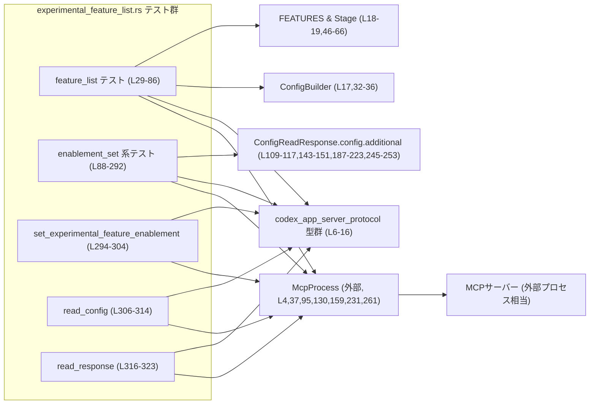
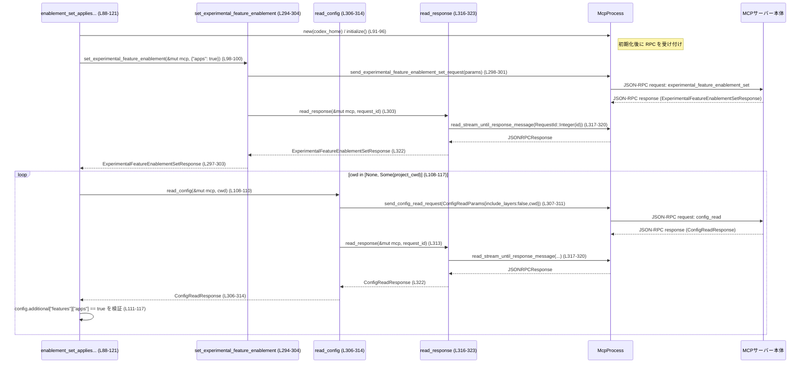

# app-server/tests/suite/v2/experimental_feature_list.rs コード解説

## 0. ざっくり一言

`experimental_feature_list` と `experimental_feature_enablement_set` という JSON-RPC API について、MCP サーバーと実際にメッセージをやり取りしながら、**実験的機能の一覧と有効化設定の挙動**を検証する非同期テスト群です（experimental_feature_list.rs:L29-323）。

---

## 1. このモジュールの役割

### 1.1 概要

- このモジュールは、MCP サーバーの **実験的機能まわりの API 契約**を E2E で検証するために存在します。
- 具体的には次の 2 系統の JSON-RPC メソッドの挙動を確認します（experimental_feature_list.rs:L29-292）。
  - `experimental_feature_list`：機能一覧・ステージ・メタデータ・有効/デフォルト有効状態（experimental_feature_list.rs:L29-86）。
  - `experimental_feature_enablement_set`：機能の有効化フラグの更新と、その反映が `config_read` 結果にどう現れるか（experimental_feature_list.rs:L88-292）。
- すべてのテストは `tokio::test` で非同期に実行され、`tokio::time::timeout` による 10 秒タイムアウトでハングを防いでいます（experimental_feature_list.rs:L25-27,39,96,131,160,232,262,317-321）。

### 1.2 アーキテクチャ内での位置づけ

このテストモジュールは、以下のコンポーネントを経由してアプリケーションサーバーの挙動を検証します。

- テストコード自身（このファイル）
- `McpProcess`：JSON-RPC メッセージの送受信を行うテスト用ラッパー（experimental_feature_list.rs:L4,37,95,130,159,231,261,294-303,306-313,316-321）
- MCP サーバー本体（コード外部）
- 設定構築ロジック `ConfigBuilder`（expected 値計算に利用）（experimental_feature_list.rs:L17,32-36,46-76）
- 機能定義レジストリ `FEATURES` と `Stage`（expected 値計算に利用）（experimental_feature_list.rs:L18-19,46-76）
- JSON-RPC プロトコル型群（experimental_feature_list.rs:L6-16,79-82,98-105,133-140,175-185,239-242,264-273,294-303,306-313,316-322）

依存関係を Mermaid で図示すると次のようになります。



※ MCP サーバー本体の実装はこのチャンクには現れないため、詳細はこのファイルからは分かりません。

### 1.3 設計上のポイント

コードから読み取れる設計上の特徴は次のとおりです。

- **E2E 指向のテスト設計**  
  - サーバーの実装を直接呼ぶのではなく、`McpProcess` 経由で JSON-RPC リクエスト/レスポンスをやり取りします（experimental_feature_list.rs:L41-45,98-100,133-135,162-173,234-236,264-268,294-303,306-313,316-321）。
- **設定値と機能レジストリから期待値を構成**  
  - `experimental_feature_list` の期待値は `FEATURES` と `ConfigBuilder` から動的に生成されます。そのため実装と定義が乖離しづらい構造になっています（experimental_feature_list.rs:L32-36,46-76）。
- **BTreeMap による決定的な順序**  
  - feature enablement のマップは `BTreeMap` を使用し、レスポンス／比較のためにキー順が安定するようにしています（experimental_feature_list.rs:L23,98-105,133-140,166-183,239-242）。
- **タイムアウトによる安全性**  
  - すべての RPC 呼び出しは `tokio::time::timeout` でラップされ、サーバーが応答しない場合でもテストがハングしないようになっています（experimental_feature_list.rs:L25-27,39,96,131,160,232,262,317-321）。
- **設定のレイヤリング前提**  
  - `ConfigReadParams { include_layers: false, cwd }` を明示的に指定し、マージ後の有効設定を検証しています（experimental_feature_list.rs:L306-311,109-117,143-151,187-223,245-253）。
- **エラーパス専用の読み取り API**  
  - 正常系は `read_stream_until_response_message`、異常系は `read_stream_until_error_message` と、ストリーム読み取りを用途別に分けています（experimental_feature_list.rs:L270-272,317-320）。

---

## 2. 主要な機能一覧

このモジュールが提供する（＝検証する）主な機能は次の通りです。

- 実験的機能一覧のステージ・メタデータ・有効状態の検証（experimental_feature_list.rs:L29-86）。
- `experimental_feature_enablement_set` による機能有効化が、グローバル・スレッド（cwd）両方の `config_read` に反映されることの検証（experimental_feature_list.rs:L88-121）。
- ユーザー設定 (`config.toml`) が `experimental_feature_enablement_set` より優先されることの検証（experimental_feature_list.rs:L123-154）。
- 既存の enablement を維持したまま、指定された機能だけが更新されることの検証（experimental_feature_list.rs:L156-226）。
- 空の enablement マップが no-op であることの検証（experimental_feature_list.rs:L228-256）。
- 許可リストにない機能名がエラーとして拒否されることの検証（experimental_feature_list.rs:L258-292）。
- JSON-RPC レスポンスメッセージを任意の型にデシリアライズする汎用ヘルパー `read_response`（experimental_feature_list.rs:L316-323）。
- feature enablement 設定や config 読み出しのための小さなヘルパー関数（experimental_feature_list.rs:L294-314）。

### コンポーネントインベントリー（関数・定数）

| 名前 | 種別 | 非同期 | 行範囲 | 役割 / 用途 |
|------|------|--------|--------|-------------|
| `DEFAULT_TIMEOUT` | 定数 | - | experimental_feature_list.rs:L27-27 | すべての RPC 呼び出しに適用する 10 秒タイムアウト |
| `experimental_feature_list_returns_feature_metadata_with_stage` | テスト関数 | `async` | experimental_feature_list.rs:L29-86 | `experimental_feature_list` が機能レジストリ `FEATURES` と整合するメタデータを返すことを検証 |
| `experimental_feature_enablement_set_applies_to_global_and_thread_config_reads` | テスト関数 | `async` | experimental_feature_list.rs:L88-121 | `experimental_feature_enablement_set` がグローバル・cwd 両方の `config_read` に反映されることを検証 |
| `experimental_feature_enablement_set_does_not_override_user_config` | テスト関数 | `async` | experimental_feature_list.rs:L123-154 | ユーザーの `config.toml` 設定が enablement より優先されることを検証 |
| `experimental_feature_enablement_set_only_updates_named_features` | テスト関数 | `async` | experimental_feature_list.rs:L156-226 | 既存設定を維持しつつ、指定された機能だけが更新されることを検証 |
| `experimental_feature_enablement_set_empty_map_is_no_op` | テスト関数 | `async` | experimental_feature_list.rs:L228-256 | 空のマップを渡した場合、既存設定が変更されないことを検証 |
| `experimental_feature_enablement_set_rejects_non_allowlisted_feature` | テスト関数 | `async` | experimental_feature_list.rs:L258-292 | 許可リスト外の機能名がエラー（コード -32600）になることを検証 |
| `set_experimental_feature_enablement` | ヘルパー関数 | `async` | experimental_feature_list.rs:L294-304 | enablement マップを送信し、`ExperimentalFeatureEnablementSetResponse` を受信する共通処理 |
| `read_config` | ヘルパー関数 | `async` | experimental_feature_list.rs:L306-314 | `config_read` リクエストを送り、`ConfigReadResponse` を取得する共通処理 |
| `read_response` | ヘルパー関数（ジェネリック） | `async` | experimental_feature_list.rs:L316-323 | JSON-RPC レスポンスを読み取り、任意の `DeserializeOwned` 型へ変換する共通処理 |

---

## 3. 公開 API と詳細解説

このファイル自体はテストモジュールであり、外部から直接呼ばれる公開 API はありません。ただし、**テストが前提とする API 契約**を理解するために、ここではテストが利用する主要な型と関数を整理します。

### 3.1 型一覧（構造体・列挙体など）

このモジュール内で利用される重要な外部型（抜粋）です。

| 名前 | 種別 | 役割 / 用途 | 根拠 |
|------|------|-------------|------|
| `ExperimentalFeature` | 構造体（外部） | 単一の実験的機能のメタデータと状態を表す。フィールド: `name`, `stage`, `display_name`, `description`, `announcement`, `enabled`, `default_enabled` を使用（experimental_feature_list.rs:L68-76）。 | experimental_feature_list.rs:L8,68-76 |
| `ExperimentalFeatureStage` | 列挙体（外部） | 機能のステージを表す。ここでは `Beta`, `UnderDevelopment`, `Stable`, `Deprecated`, `Removed` が使用される（experimental_feature_list.rs:L55,61,63-65）。 | experimental_feature_list.rs:L13,55,61,63-65 |
| `ExperimentalFeatureListResponse` | 構造体（外部） | `experimental_feature_list` のレスポンス。`data`（`Vec<ExperimentalFeature>`）と `next_cursor` を持つ（experimental_feature_list.rs:L45,79-82）。 | experimental_feature_list.rs:L12,45,79-82 |
| `ExperimentalFeatureEnablementSetParams` | 構造体（外部） | `experimental_feature_enablement_set` のパラメータ。`enablement: BTreeMap<String, bool>` を持つ（experimental_feature_list.rs:L9,98-100,133-135,166-171,265-267,299-301）。 | experimental_feature_list.rs:L9,98-100,133-135,166-171,265-267,299-301 |
| `ExperimentalFeatureEnablementSetResponse` | 構造体（外部） | enablement 設定 API のレスポンス。`enablement: BTreeMap<String,bool>` を持ち、サーバー側が受理した設定を反映する（experimental_feature_list.rs:L100-105,138-140,177-185,240-242）。 | experimental_feature_list.rs:L10,100-105,138-140,177-185,240-242 |
| `ConfigReadParams` | 構造体（外部） | `config_read` のパラメータ。ここでは `include_layers: bool` と `cwd: Option<String>` を指定（experimental_feature_list.rs:L6,306-311）。 | experimental_feature_list.rs:L6,306-311 |
| `ConfigReadResponse` | 構造体（外部） | `config_read` のレスポンス。ここでは `config` フィールドを分解して使用し、`config.additional` を通じて `features.apps` 等を確認（experimental_feature_list.rs:L7,109-117,143-151,187-223,245-253）。 | experimental_feature_list.rs:L7,109-117,143-151,187-223,245-253 |
| `JSONRPCResponse` | 構造体（外部） | JSON-RPC レスポンスのラッパー。`read_response` 内で `to_response` に渡される（experimental_feature_list.rs:L15,316-322）。 | experimental_feature_list.rs:L15,316-322 |
| `JSONRPCError` | 構造体（外部） | JSON-RPC エラー応答。`error.code` と `error.message` を使用して検証（experimental_feature_list.rs:L14,269-281,283-288）。 | experimental_feature_list.rs:L14,269-281,283-288 |
| `Stage` | 列挙体（外部） | 機能レジストリ内のステージを表す。`Experimental { .. }`, `UnderDevelopment`, `Stable`, `Deprecated`, `Removed` が `match` で使用される（experimental_feature_list.rs:L19,49-65）。 | experimental_feature_list.rs:L19,49-65 |

### 3.2 関数詳細（重点 7 件）

#### `experimental_feature_list_returns_feature_metadata_with_stage() -> Result<()>`（L29-86）

**概要**

- `experimental_feature_list` JSON-RPC メソッドが、`FEATURES` レジストリに基づく正しいメタデータ・ステージ・有効状態を返すことを検証する非同期テストです（experimental_feature_list.rs:L29-86）。

**引数**

- なし（テスト関数であり、外部から値は受け取りません）。

**戻り値**

- `anyhow::Result<()>`  
  - 正常終了時は `Ok(())`。  
  - MCP プロセス起動や RPC 通信、比較などでエラーが発生した場合は `Err` としてテスト失敗になります（experimental_feature_list.rs:L31-37,39,41-45）。

**内部処理の流れ**

1. 一時ディレクトリを `TempDir::new()` で作成（experimental_feature_list.rs:L31）。
2. `ConfigBuilder::default()` を用いて、`codex_home` と `fallback_cwd` を指定した設定を構築し、`await` で非同期ビルド（experimental_feature_list.rs:L32-36）。
3. `McpProcess::new(codex_home.path())` で MCP 接続を初期化し、`mcp.initialize()` を `timeout(DEFAULT_TIMEOUT, ...)` でタイムアウト付き実行（experimental_feature_list.rs:L37,39）。
4. `send_experimental_feature_list_request` を呼び出し、リクエスト ID を取得（experimental_feature_list.rs:L41-43）。
5. `read_response::<ExperimentalFeatureListResponse>` でレスポンスを読み取り、`ExperimentalFeatureListResponse` にデシリアライズ（experimental_feature_list.rs:L45）。
6. `FEATURES` を `.iter().map(...)` して、ステージごとに `ExperimentalFeatureStage` やメタデータをマッピングしながら期待値 `expected_data` を構築（experimental_feature_list.rs:L46-76）。
7. `ExperimentalFeatureListResponse { data: expected_data, next_cursor: None }` を期待値として定義し（experimental_feature_list.rs:L79-82）、`assert_eq!(actual, expected)` で比較（experimental_feature_list.rs:L84）。

**Examples（使用例）**

この関数自体はテストランナーが実行するため、直接呼び出すことはありませんが、同様のパターンで別メソッドをテストする例は次のようになります。

```rust
// 別の JSON-RPC メソッドをテストするイメージコード
#[tokio::test]
async fn some_method_returns_expected_value() -> anyhow::Result<()> {
    let codex_home = tempfile::TempDir::new()?;                         // 一時ディレクトリ作成
    let mut mcp = McpProcess::new(codex_home.path()).await?;            // MCP 接続初期化
    tokio::time::timeout(DEFAULT_TIMEOUT, mcp.initialize()).await??;    // 初期化とタイムアウト

    let request_id = mcp.send_some_method_request(/* params */).await?; // 任意メソッドの送信
    let actual: SomeResponse = read_response(&mut mcp, request_id).await?; // 共通ヘルパーでレスポンス取得

    // 期待値を構築して比較
    let expected = SomeResponse { /* ... */ };
    assert_eq!(actual, expected);
    Ok(())
}
```

**Errors / Panics**

- `TempDir::new`, `ConfigBuilder::build().await`, `McpProcess::new`, `mcp.initialize`, `send_experimental_feature_list_request`, `read_response` などでエラーが起きると、`?` により `Err` が返りテスト失敗となります（experimental_feature_list.rs:L31-37,39,41-45）。
- `assert_eq!` が不一致の場合は panic します（experimental_feature_list.rs:L84）。
- `timeout` がタイムアウトした場合、`Elapsed` エラーが返され、同様に `?` でテスト失敗になります（experimental_feature_list.rs:L39）。

**Edge cases（エッジケース）**

- `FEATURES` に `Stage::Experimental` 以外のステージが含まれている場合も、`Stage` の各バリアントに応じて `ExperimentalFeatureStage` とメタデータ有無が正しくマッピングされることを検証しています（experimental_feature_list.rs:L49-65）。
- `FEATURES` が空の場合は `expected_data` が空の `Vec` となり、レスポンス `data` も空であることを暗に要求します（experimental_feature_list.rs:L46-48,79-82）。
- `config.features.enabled(spec.id)` を通じて、**有効フラグは ConfigBuilder と同一ロジックで計算される**ことが暗黙の契約になっています（experimental_feature_list.rs:L74-75）。

**使用上の注意点**

- このテストは `FEATURES` と `Stage` の定義に強く依存しているため、機能レジストリ側の仕様変更があると期待値の更新が必要になります（experimental_feature_list.rs:L46-65,68-76）。
- JSON-RPC プロトコル側の `ExperimentalFeature` や `ExperimentalFeatureStage` のフィールド追加・変更は、この比較に影響しうるため、型変更時はテスト内容の見直しが必要です（experimental_feature_list.rs:L68-76,79-82）。

---

#### `experimental_feature_enablement_set_applies_to_global_and_thread_config_reads() -> Result<()>`（L88-121）

**概要**

- `experimental_feature_enablement_set` による機能有効化が、**グローバル設定と特定 cwd（プロジェクトディレクトリ）での `config_read` の両方に反映される**ことを検証するテストです（experimental_feature_list.rs:L88-121）。

**引数**

- なし。

**戻り値**

- `anyhow::Result<()>`（エラーがあればテスト失敗）。

**内部処理の流れ**

1. `TempDir::new` で `codex_home` を作成し、その下に `project` ディレクトリを作成（experimental_feature_list.rs:L91-93）。
2. `McpProcess::new` と `mcp.initialize()` で MCP セッションを初期化（experimental_feature_list.rs:L95-96）。
3. `set_experimental_feature_enablement` を使って `{"apps": true}` をサーバーへ送信し、レスポンス `ExperimentalFeatureEnablementSetResponse` を取得（experimental_feature_list.rs:L98-100）。
4. レスポンスの `enablement` 内容が送信したマップと一致することを `assert_eq!` で検証（experimental_feature_list.rs:L101-106）。
5. `cwd` を `[None, Some(project_cwd.display().to_string())]` でループし、それぞれ `read_config` を呼び出し `ConfigReadResponse` を取得（experimental_feature_list.rs:L108-110）。
6. 取得した設定の `config.additional["features"]["apps"]` が `true` であることを検証（experimental_feature_list.rs:L111-117）。

**Examples（使用例）**

このテストが示すパターンを簡略化した例です。

```rust
// グローバルと特定 cwd 両方で feature フラグが効いていることを確認する例
async fn assert_apps_enabled_for_all_cwds(mcp: &mut McpProcess, project_cwd: String) -> anyhow::Result<()> {
    let response = set_experimental_feature_enablement(
        mcp,
        BTreeMap::from([("apps".to_string(), true)]),
    ).await?;  // enablement をサーバーに設定

    assert_eq!(response.enablement.get("apps"), Some(&true)); // サーバーが受理した設定を確認

    for cwd in [None, Some(project_cwd)] {
        let ConfigReadResponse { config, .. } = read_config(mcp, cwd).await?;
        let apps_value = config
            .additional
            .get("features")
            .and_then(|features| features.get("apps"));
        assert_eq!(apps_value, Some(&serde_json::json!(true))); // どの cwd でも true
    }

    Ok(())
}
```

**Errors / Panics**

- MCP の初期化・RPC 呼び出し・ファイル操作などの I/O 失敗は `?` で `Err` として伝播します（experimental_feature_list.rs:L91-96,98-100,108-110）。
- 期待値とレスポンスが一致しない場合はいずれも `assert_eq!` によって panic します（experimental_feature_list.rs:L101-106,111-117）。

**Edge cases（エッジケース）**

- `cwd = None` と任意の `Some(...)` 両方で `apps` が有効であることを要求しており、**スレッドローカルな設定や cwd ごとのコンフィグ差異**があっても enablement が共通に効く契約であることを暗に示しています（experimental_feature_list.rs:L108-117）。
- `project` ディレクトリにはユーザー設定ファイルを置いていないため、enablement の影響が「素の project ディレクトリ」に対してどう現れるかを見ています（experimental_feature_list.rs:L92-93,108-117）。

**使用上の注意点**

- このテストは `include_layers: false` の `config_read` 結果から `features.apps` を見るため、**マージ後の「最終値」が apps = true になっていること**を検証しています（experimental_feature_list.rs:L306-311,109-117）。
- グローバル設定だけでなく、cwd ごとの環境にも同じフラグが適用される契約を前提としているため、実装側で cwd 毎の分離挙動を導入する場合はテストの見直しが必要です。

---

#### `experimental_feature_enablement_set_does_not_override_user_config() -> Result<()>`（L123-154）

**概要**

- ユーザーの `config.toml` に記載された `features.apps` が、`experimental_feature_enablement_set` による有効化リクエストよりも優先されることを検証するテストです（experimental_feature_list.rs:L123-154）。

**内部処理の流れ（要点）**

1. `config.toml` に `[features]\napps = false\n` を書き込む（experimental_feature_list.rs:L125-129）。
2. MCP を初期化し、`{"apps": true}` の enablement を設定（experimental_feature_list.rs:L130-136）。
3. レスポンスに含まれる `enablement` は `{"apps": true}` であることを確認（experimental_feature_list.rs:L136-141）。
4. `read_config` で `ConfigReadResponse` を取得し、`config.additional["features"]["apps"]` が `false` であることを確認（experimental_feature_list.rs:L143-151）。

**契約上の意味合い**

- 「サーバーの feature enablement API はユーザー設定を**上書きしない**」という強い契約をテストで表現しています（experimental_feature_list.rs:L125-129,133-140,145-151）。

---

#### `experimental_feature_enablement_set_only_updates_named_features() -> Result<()>`（L156-226）

**概要**

- 以前に設定した機能（`apps`）を保持したまま、新たに指定した機能（`plugins`, `tool_search`, `tool_suggest`, `tool_call_mcp_elicitation`）のみが更新されることを検証するテストです（experimental_feature_list.rs:L156-226）。

**内部処理の流れ（要点）**

1. まず `{"apps": true}` を設定（experimental_feature_list.rs:L162-163）。
2. 続いて複数機能の enablement を一度に送信し、そのレスポンス内容が送信したマップと一致するか確認（experimental_feature_list.rs:L164-173,175-185）。
3. `read_config` の結果から、`apps` を含む各機能の最終値が期待どおりであることを確認（experimental_feature_list.rs:L187-223）。

**Edge cases（エッジケース）**

- 二度目の `experimental_feature_enablement_set` に `apps` を含めないことで、「**未指定の機能は直前の設定を維持する**」挙動を明示的に検証しています（experimental_feature_list.rs:L162-163,189-195）。
- `tool_call_mcp_elicitation` については `false` を明示的に設定し、false への切り替えも正しく反映されることを確認しています（experimental_feature_list.rs:L170-171,182-183,217-223）。

---

#### `experimental_feature_enablement_set_rejects_non_allowlisted_feature() -> Result<()>`（L258-292）

**概要**

- 許可リストに含まれない機能名（ここでは `"personality"`）に対する enablement リクエストが、JSON-RPC エラー（コード -32600）として拒否されることを検証します（experimental_feature_list.rs:L258-292）。

**内部処理の流れ（要点）**

1. MCP を初期化（experimental_feature_list.rs:L260-262）。
2. `ExperimentalFeatureEnablementSetParams { enablement: { "personality": true } }` でリクエスト送信（experimental_feature_list.rs:L264-267）。
3. `read_stream_until_error_message` によってエラーメッセージが届くまで待機し、`JSONRPCError { error, .. }` を取得（experimental_feature_list.rs:L269-273）。
4. `error.code == -32600` であることを確認（experimental_feature_list.rs:L275）。
5. `error.message` に `"unsupported feature enablement`personality`"` と、許可されている機能名一覧 `"apps, plugins, tool_search, tool_suggest, tool_call_mcp_elicitation"` が含まれていることを検証（experimental_feature_list.rs:L276-281,283-288）。

**契約・安全性**

- 許可リストにない機能名を無視するのではなく、**エラーとして明示的に拒否する**ことをサーバーの契約として期待しています（experimental_feature_list.rs:L265-267,275-281,283-288）。
- エラーメッセージに許可された機能名一覧を含めることで、クライアントが正しい名前を知ることができるようになっています（experimental_feature_list.rs:L283-288）。これは API 利用性の向上に寄与しつつ、特別な秘密情報を露出しているようには見えません（許可リスト自体は機能フラグの公開名と推測されるため）。

---

#### `set_experimental_feature_enablement(mcp: &mut McpProcess, enablement: BTreeMap<String, bool>) -> Result<ExperimentalFeatureEnablementSetResponse>`（L294-304）

**概要**

- `experimental_feature_enablement_set` JSON-RPC メソッドを呼び出し、そのレスポンスを `ExperimentalFeatureEnablementSetResponse` として取得するための共通ヘルパー関数です（experimental_feature_list.rs:L294-304）。

**引数**

| 引数名 | 型 | 説明 |
|--------|----|------|
| `mcp` | `&mut McpProcess` | JSON-RPC メッセージを送受信するための MCP ラッパー（mutable 参照で、ストリーム状態を更新するため）（experimental_feature_list.rs:L294-295）。 |
| `enablement` | `BTreeMap<String, bool>` | 機能名 → 有効フラグのマップ。サーバーに適用を依頼する設定（experimental_feature_list.rs:L296-297,299-301）。 |

**戻り値**

- `anyhow::Result<ExperimentalFeatureEnablementSetResponse>`  
  サーバーから返された enablement 設定（サーバーが受理した内容）をラップして返します（experimental_feature_list.rs:L297-303）。

**内部処理の流れ**

1. `send_experimental_feature_enablement_set_request(ExperimentalFeatureEnablementSetParams { enablement })` を呼び出し、リクエスト ID を取得（experimental_feature_list.rs:L298-301）。
2. `read_response(mcp, request_id).await` を呼び、レスポンスを `ExperimentalFeatureEnablementSetResponse` にデシリアライズして返却（experimental_feature_list.rs:L303）。

**Examples（使用例）**

```rust
// apps 機能を有効にするテスト内コード例
let response = set_experimental_feature_enablement(
    &mut mcp,
    BTreeMap::from([("apps".to_string(), true)]),
).await?;  // experimental_feature_list.rs:L98-100

assert_eq!(
    response,
    ExperimentalFeatureEnablementSetResponse {
        enablement: BTreeMap::from([("apps".to_string(), true)]),
    }
);
```

**Errors / Panics**

- 内部で利用する `send_experimental_feature_enablement_set_request` や `read_response` の失敗は、そのまま `Err` として呼び出し元に返されます（experimental_feature_list.rs:L298-303）。
- panic は行っていません（アサーション等もありません）。

**Edge cases**

- 空の `enablement` マップも許容され、`experimental_feature_enablement_set_empty_map_is_no_op` のテストでは no-op として扱われるサーバー側挙動が検証されています（experimental_feature_list.rs:L228-243,236-243）。この関数自体は空マップを特別扱いしておらず、単に送信します（experimental_feature_list.rs:L294-303）。

**使用上の注意点**

- `mcp` はミュータブル参照で受け取るため、並行に複数の RPC を同一 `McpProcess` に対して投げる用途には向きません。テストコードでもすべて直列で呼び出しています（experimental_feature_list.rs:L98-100,133-135,162-173,234-236,265-267）。
- `enablement` のキーはサーバー側の許可リストに従う必要があり、`experimental_feature_enablement_set_rejects_non_allowlisted_feature` テストから `"apps"`, `"plugins"`, `"tool_search"`, `"tool_suggest"`, `"tool_call_mcp_elicitation"` が許可されていることが分かります（experimental_feature_list.rs:L166-171,283-288）。

---

#### `read_response<T: DeserializeOwned>(mcp: &mut McpProcess, request_id: i64) -> Result<T>`（L316-323）

**概要**

- 任意の JSON-RPC リクエスト ID に対応するレスポンスメッセージをストリームから読み取り、**汎用型 `T` にデシリアライズ**して返す共通ヘルパーです（experimental_feature_list.rs:L316-323）。
- `T` は `serde::de::DeserializeOwned` を実装している必要があります（experimental_feature_list.rs:L21,316）。

**引数**

| 引数名 | 型 | 説明 |
|--------|----|------|
| `mcp` | `&mut McpProcess` | JSON-RPC メッセージストリームへのアクセスを提供するオブジェクト（experimental_feature_list.rs:L316-317）。 |
| `request_id` | `i64` | 対応するレスポンスを待ち受ける JSON-RPC リクエスト ID（experimental_feature_list.rs:L316,319-320）。 |

**戻り値**

- `anyhow::Result<T>`  
  - 成功時: `T` にデシリアライズされたレスポンスの `result` 部分（と推測されますが、実際の `to_response` 実装はこのチャンクには現れません）（experimental_feature_list.rs:L322）。
  - 失敗時: タイムアウト、ストリーム読み取りエラー、JSON-RPC エラー、デシリアライズ失敗などをラップした `Err`。

**内部処理の流れ**

1. `timeout(DEFAULT_TIMEOUT, mcp.read_stream_until_response_message(RequestId::Integer(request_id)))` を実行し、対応するレスポンスが来るまで待機（experimental_feature_list.rs:L317-321）。
2. タイムアウトまたは I/O エラー時は `?` により即座に `Err` を返す（experimental_feature_list.rs:L317-321）。
3. 取得した `JSONRPCResponse` を `to_response(response)` に渡し、`T` に変換して返却（experimental_feature_list.rs:L322）。

**Examples（使用例）**

```rust
// 実際の使用例: ExperimentalFeatureListResponse を取得
let request_id = mcp
    .send_experimental_feature_list_request(ExperimentalFeatureListParams::default())
    .await?;                                                // experimental_feature_list.rs:L41-43
let list: ExperimentalFeatureListResponse =
    read_response(&mut mcp, request_id).await?;             // experimental_feature_list.rs:L45
```

**Errors / Panics**

- `timeout` が時間切れになると `Elapsed` エラーとなり、`?` により `Err` が返ります（experimental_feature_list.rs:L317-321）。
- `read_stream_until_response_message` がエラーを返した場合も同様に `Err` になります（experimental_feature_list.rs:L317-321）。
- `to_response` 内での JSON-RPC エラーやデシリアライズ失敗も `Err` として返ると推測されますが、実装はこのチャンクには現れません（experimental_feature_list.rs:L5,322）。
- この関数自身は panic を発生させません。

**Edge cases**

- 該当する `request_id` のレスポンスがストリームに出現しない場合、`timeout` によりテスト全体が失敗します（ハングしない保証）（experimental_feature_list.rs:L317-321）。
- ストリームに複数のレスポンスが到着する可能性はありますが、その場合のフィルタリングロジックは `read_stream_until_response_message` の実装に依存し、このチャンクには現れません（experimental_feature_list.rs:L319-320）。

**使用上の注意点**

- 非同期テストで大量のリクエストを同時に処理する場合、`request_id` の一致とストリーム順序に注意が必要ですが、このファイルではすべて直列に呼び出しているため複雑な並行性は発生していません（experimental_feature_list.rs:L41-45,98-100,133-135,164-173,236,306-313）。

---

### 3.3 その他の関数

| 関数名 | 役割（1 行） | 根拠 |
|--------|--------------|------|
| `experimental_feature_enablement_set_empty_map_is_no_op` | 空の enablement マップを送信しても既存設定が変更されないことを検証するテスト（experimental_feature_list.rs:L228-256）。 | experimental_feature_list.rs:L228-256 |
| `read_config(mcp: &mut McpProcess, cwd: Option<String>) -> Result<ConfigReadResponse>` | `config_read` リクエストを送り、`ConfigReadResponse` を取得する薄いラッパー（experimental_feature_list.rs:L306-314）。 | experimental_feature_list.rs:L306-314 |

---

## 4. データフロー

ここでは代表的なシナリオとして、`experimental_feature_enablement_set` の設定が `config_read` に反映される流れ（テスト `experimental_feature_enablement_set_applies_to_global_and_thread_config_reads`）を説明します（experimental_feature_list.rs:L88-121,294-304,306-314,316-323）。

### 処理の要点

1. テスト関数が `set_experimental_feature_enablement` を通じて `{"apps": true}` をサーバーに送信（experimental_feature_list.rs:L98-100,294-303）。
2. サーバーは enablement を適用し、受理したマップを `ExperimentalFeatureEnablementSetResponse` として返す（experimental_feature_list.rs:L100-106）。
3. 続けて `read_config` が `ConfigReadParams { include_layers: false, cwd }` を送信し、最終的な設定値を受け取る（experimental_feature_list.rs:L108-110,306-311）。
4. テストは `config.additional["features"]["apps"]` を読み取り、`true` であることを確認（experimental_feature_list.rs:L111-117）。

### シーケンス図



この図から分かるように、**すべての JSON-RPC の受信は `read_response` を経由**しており、そこでタイムアウトやエラーハンドリングが統一されています（experimental_feature_list.rs:L316-323）。

---

## 5. 使い方（How to Use）

### 5.1 基本的な使用方法

このファイルのパターンに従うと、MCP サーバーへの新しいテストは概ね次のような流れになります。

```rust
#[tokio::test]
async fn example_test() -> anyhow::Result<()> {
    // 1. 一時ディレクトリと MCP プロセス初期化
    let codex_home = tempfile::TempDir::new()?;                      // experimental_feature_list.rs:L31,91,125,158,230,260
    let mut mcp = McpProcess::new(codex_home.path()).await?;         // experimental_feature_list.rs:L37,95,130,159,231,261
    tokio::time::timeout(DEFAULT_TIMEOUT, mcp.initialize()).await??; // experimental_feature_list.rs:L39,96,131,160,232,262

    // 2. JSON-RPC リクエスト送信（例: feature enablement の設定）
    let response = set_experimental_feature_enablement(
        &mut mcp,
        BTreeMap::from([("apps".to_string(), true)]),
    ).await?;                                                        // experimental_feature_list.rs:L98-100,294-303

    // 3. 必要であれば config_read などで結果を確認
    let ConfigReadResponse { config, .. } = read_config(&mut mcp, None).await?; // experimental_feature_list.rs:L109-110,306-313
    assert_eq!(
        config
            .additional
            .get("features")
            .and_then(|features| features.get("apps")),
        Some(&serde_json::json!(true)),
    );                                                                // experimental_feature_list.rs:L111-117

    Ok(())
}
```

### 5.2 よくある使用パターン

1. **enablement 設定 → config_read で反映確認**  
   - `set_experimental_feature_enablement` → `read_config` の組み合わせ（experimental_feature_list.rs:L88-121,156-226,228-256）。
2. **ユーザー設定の優先順位確認**  
   - OS ファイル I/O (`std::fs::write`) で `config.toml` を書いてから、enablement を設定し `config_read` 結果を確認（experimental_feature_list.rs:L125-151）。
3. **エラーレスポンスの検証**  
   - `read_stream_until_error_message` を直接使い、`JSONRPCError` の内容（コードとメッセージ）を確認（experimental_feature_list.rs:L269-281,283-288）。

### 5.3 よくある間違い（このファイルから推測される前提）

- **`mcp.initialize()` を呼ばずにリクエスト送信する**  
  - このファイル内ではすべてのテストで initialize の完了後にリクエストを送っており（experimental_feature_list.rs:L39,96,131,160,232,262）、初期化前のリクエスト送信は想定されていないと考えられます。
- **`timeout` を使わずにストリーム待ちを行う**  
  - このファイルではすべてのレスポンス待ちに `timeout(DEFAULT_TIMEOUT, ...)` を使用しており（experimental_feature_list.rs:L39,96,131,160,232,262,317-321）、タイムアウトなしの待機はテストのハング原因になり得ます。
- **`cwd` の影響を無視した検証**  
  - `enablement_set_applies_to_global_and_thread_config_reads` では `cwd` を 2 パターン回して検証しており（experimental_feature_list.rs:L108-117）、cwd ごとの挙動差異を意識する必要があることが示されています。

### 5.4 使用上の注意点（まとめ）

- **スレッド/並行性**  
  - 各テストは独自の `TempDir` と `McpProcess` インスタンスを使用しており、共有状態は前提としていません（experimental_feature_list.rs:L31,91,125,158,230,260）。
  - すべての RPC 呼び出しは単一の `&mut McpProcess` を通じて直列に行われており、同一プロセスに対する同時並行リクエストは扱っていません（experimental_feature_list.rs:L41-45,98-100,133-135,164-173,234-236,264-268,306-313）。
- **エラー処理**  
  - `anyhow::Result` と `?` 演算子により、I/O やタイムアウト、JSON-RPC エラーなどはテストの `Err` として一括管理されています（experimental_feature_list.rs:L29-86,88-121,123-154,156-226,228-256,258-292,294-304,306-323）。
- **設定の優先順位**  
  - ユーザーの `config.toml` が enablement API より優先される契約であることを前提としているため（experimental_feature_list.rs:L125-151）、実装変更の際はこの前提を崩さないか注意が必要です。
- **許可リストの明示**  
  - 許可されている機能名がエラーメッセージに露出する設計であり（experimental_feature_list.rs:L283-288）、これを前提にしたテストとなっています。

---

## 6. 変更の仕方（How to Modify）

### 6.1 新しい機能を追加する場合（テスト観点）

新しい experimental feature 関連 API を追加し、同様の E2E テストを追加する場合、このファイルのパターンに従うと次のようになります。

1. **テスト用ヘルパーを追加**  
   - `set_experimental_feature_enablement` や `read_config` と同様に、JSON-RPC メソッドごとのラッパー関数を追加する（experimental_feature_list.rs:L294-304,306-314）。
2. **E2E テスト関数を追加**  
   - `#[tokio::test]` + `async fn` 形式で、`TempDir` と `McpProcess` の初期化 → RPC 呼び出し → `read_response` で検証、という流れを踏襲する（experimental_feature_list.rs:L29-86,88-121,123-154,156-226,228-256,258-292）。
3. **期待値の構築方法**  
   - 可能であれば `FEATURES` や `ConfigBuilder` など既存の設定ロジックから期待値を生成し、実装と定義が乖離しにくい形にする（experimental_feature_list.rs:L32-36,46-76）。

### 6.2 既存の機能を変更する場合（契約確認の観点）

- **`experimental_feature_list` の仕様変更時**  
  - ステージやフィールド構成を変更する場合、このテストの期待値生成ロジック（`Stage` → `ExperimentalFeatureStage` のマッピングやフィールド有無）を必ず確認する必要があります（experimental_feature_list.rs:L49-65,68-76,79-82）。
- **`experimental_feature_enablement_set` の挙動変更時**  
  - enablement の優先順位（ユーザー設定 < enablement or その逆）、未指定機能の扱い（維持/リセット）、空マップの扱い（no-op かどうか）、許可リストの管理などについて、対応するテストケースがこのファイルにまとまっているため、変更前にどのテストがその契約を表現しているか確認すると影響範囲を把握しやすくなります（experimental_feature_list.rs:L88-121,123-154,156-226,228-256,258-292）。

---

## 7. 関連ファイル

このモジュールと密接に関係するファイル・モジュールは次の通りです（名前・役割はいずれもこのチャンク内から読み取れる範囲に限定しています）。

| パス / モジュール | 役割 / 関係 | 根拠 |
|-------------------|------------|------|
| `app_test_support::McpProcess` | MCP サーバーとの JSON-RPC メッセージ送受信を抽象化したテスト用ユーティリティ。`new`, `initialize`, `send_*_request`, `read_stream_until_response_message`, `read_stream_until_error_message` などを提供（experimental_feature_list.rs:L4,37,39,41-43,95-96,98-100,108-110,130-131,133-135,143,159-160,162-173,187,231-232,234-236,245,261-262,264-272,294-303,306-313,316-320）。 | experimental_feature_list.rs:L4,37-39,41-45,95-96,98-100,108-110,130-131,133-135,143,159-160,162-173,187,231-232,234-236,245,261-262,264-272,294-303,306-313,316-320 |
| `app_test_support::to_response` | `JSONRPCResponse` を具体的なレスポンス型 `T` に変換するヘルパー（experimental_feature_list.rs:L5,322）。 | experimental_feature_list.rs:L5,322 |
| `codex_app_server_protocol::*` | MCP サーバーの JSON-RPC メソッド用のリクエスト/レスポンス型、`JSONRPCResponse`/`JSONRPCError`/`RequestId` 等を提供（experimental_feature_list.rs:L6-16,45,79-82,98-105,133-140,175-185,239-242,269-281,283-288,306-311,316-322）。 | experimental_feature_list.rs:L6-16,45,79-82,98-105,133-140,175-185,239-242,269-281,283-288,306-311,316-322 |
| `codex_core::config::ConfigBuilder` | テスト内で期待値の構築に利用される設定ビルダー。`codex_home`, `fallback_cwd`, `build().await` を提供（experimental_feature_list.rs:L17,32-36）。 | experimental_feature_list.rs:L17,32-36 |
| `codex_features::{FEATURES, Stage}` | 実験的機能の定義一覧とステージ情報。テスト内で `FEATURES.iter()` と `Stage` の各バリアントを利用して期待値を生成（experimental_feature_list.rs:L18-19,46-66）。 | experimental_feature_list.rs:L18-19,46-66 |
| `tempfile::TempDir` | 各テストで独立した `codex_home` を用意するための一時ディレクトリを提供（experimental_feature_list.rs:L24,31,91,125,158,230,260）。 | experimental_feature_list.rs:L24,31,91,125,158,230,260 |
| `tokio::time::timeout` | 非同期処理にタイムアウトを付与し、テストのハングを防止（experimental_feature_list.rs:L25,39,96,131,160,232,262,317-321）。 | experimental_feature_list.rs:L25,39,96,131,160,232,262,317-321 |

このファイルは、MCP サーバー側の実装とクライアント向けプロトコル定義の **接続点をテストで具体化する**役割を持っており、experimental feature 機能の契約とエッジケース（未許可 feature、空マップ、ユーザー設定優先、cwd 差異など）を包括的にカバーしています。
