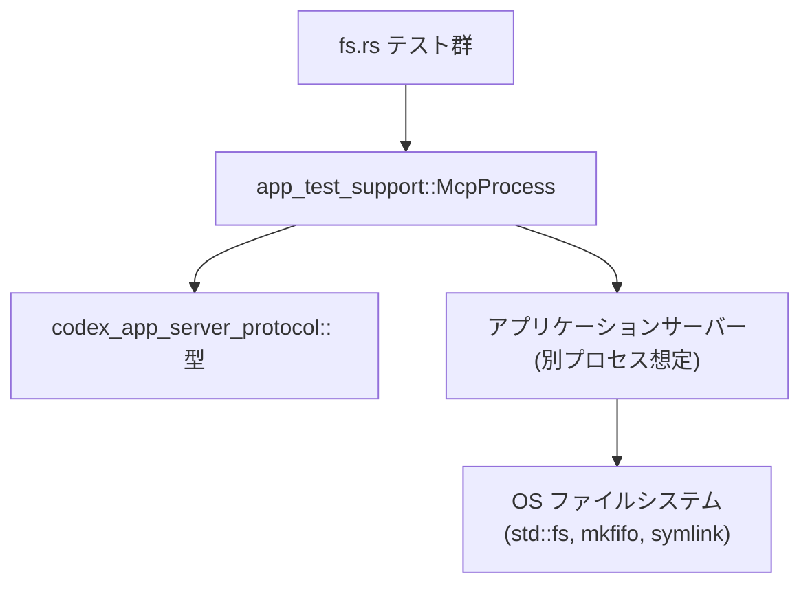
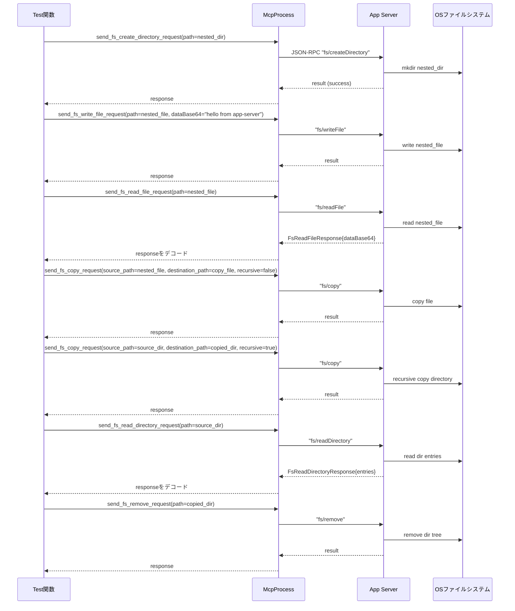

# app-server/tests/suite/v2/fs.rs コード解説

## 0. ざっくり一言

`app-server/tests/suite/v2/fs.rs` は、アプリケーションサーバーのファイルシステム系 JSON-RPC エンドポイント（`fs/*`）について、読み書き・コピー・削除・監視などの **外部仕様を統合テスト** で確認するモジュールです（根拠: `fs.rs:L62-686`）。

---

## 1. このモジュールの役割

### 1.1 概要

このモジュールは、次のような問題を解決するために存在し、対応するテストを提供します。

- **問題**: サーバーのファイルシステム RPC（`fs/getMetadata`, `fs/writeFile`, `fs/copy`, `fs/watch` など）が仕様どおりに動くか、エラー時や特殊ファイル・監視などのエッジケースを含めて確認したい。
- **機能**:
  - 一連の `fs/*` RPC の正常系と異常系の挙動を、実際の OS ファイルシステムを用いて検証する
  - 絶対パスの強制、Base64 の妥当性、コピー時のシンボリックリンク・FIFO の扱い、ファイル監視（watch/unwatch）の通知仕様を確認する（根拠: `fs.rs:L63-685`）。

### 1.2 アーキテクチャ内での位置づけ

このモジュールは「**テスト層**」に属し、実サーバープロセスと JSON-RPC で通信する `McpProcess` を介して、FS RPC をブラックボックス的に検証します。

- テストコード → `app_test_support::McpProcess` 経由でリクエスト送信（根拠: `fs.rs:L32-36,L69-73,L126-131`）
- リクエストは `codex_app_server_protocol` の型で表現される（根拠: `fs.rs:L7-16,L69-73`）
- サーバーが OS ファイルシステムを操作し、その結果が JSON-RPC レスポンス／通知としてテストに戻る（ファイル作成・コピー・監視などは `std::fs` と `TempDir` で検査、根拠: `fs.rs:L64-67,L116-123,L270-283`）



### 1.3 設計上のポイント

コードから読み取れる設計上の特徴は次のとおりです。

- **非同期 & タイムアウト付きの統合テスト**
  - すべてのテストは `#[tokio::test(flavor = "multi_thread", worker_threads = 2)]` で Tokio のマルチスレッドランタイム上に構築されている（根拠: `fs.rs:L62,L114,L265,L307,L336,L460,L487,L515,L548,L589,L619,L688,L728,L767`）。
  - JSON-RPC の読み取りには `tokio::time::timeout` を使用し、既定 10 秒の読み取りタイムアウトを設けてハングを防いでいる（根拠: `fs.rs:L30,L34,L74-78,L133-136,L278-282`）。
- **共通ヘルパーで重複を排除**
  - `initialized_mcp` でサーバープロセスの起動と初期化を一括処理（根拠: `fs.rs:L32-36`）。
  - `absolute_path` でテスト側から常に絶対パスのみを渡すよう保証（根拠: `fs.rs:L52-60`）。
  - `expect_error_message` / `maybe_fs_changed_notification` でエラー／通知の検証ロジックを共通化（根拠: `fs.rs:L38-50,L795-807`）。
- **安全性と仕様確認に重点**
  - `AbsolutePathBuf` のデシリアライズ失敗を利用して、**相対パスを受け付けない契約** を明示的にテスト（根拠: `fs.rs:L337-455,L768-783`）。
  - Base64 データの検証、特殊ファイル（FIFO）の扱い、ディレクトリコピー時の自己／子孫へのコピー禁止など、典型的な危険操作に対する防御仕様をテストしている（根拠: `fs.rs:L307-334,L460-485,L487-512,L548-585,L589-617`）。
- **OS 依存の挙動は `#[cfg(unix)]` で切り分け**
  - シンボリックリンクや FIFO など Unix 特有のファイル種別に関するテストは Unix のみでコンパイルされる（根拠: `fs.rs:L25-28,L514-515,L546-547,L587-588`）。

---

## 2. 主要な機能一覧

### 2.1 関数インベントリー（コンポーネント一覧）

このファイルで定義されている全 20 関数の一覧です。

| 名前 | 種別 | 役割 / 用途 | 位置 |
|------|------|-------------|------|
| `DEFAULT_READ_TIMEOUT` | 定数 | JSON-RPC 読み取りの標準タイムアウト（10 秒） | `fs.rs:L30` |
| `initialized_mcp` | 非公開ヘルパー | `McpProcess` の生成と `initialize` 呼び出しをまとめる | `fs.rs:L32-36` |
| `expect_error_message` | 非公開ヘルパー | 指定 `request_id` に対応するエラーレスポンスを読み、メッセージを検証 | `fs.rs:L38-50` |
| `absolute_path` | 非公開ヘルパー | `PathBuf` が絶対パスであることをアサートし `AbsolutePathBuf` に変換 | `fs.rs:L52-60` |
| `fs_get_metadata_returns_only_used_fields` | テスト | `fs/getMetadata` のレスポンスフィールドが 4 つだけであることを確認 | `fs.rs:L62-112` |
| `fs_methods_cover_current_fs_utils_surface` | テスト | create/write/read/copy/readDirectory/remove まで FS ユーティリティの表層を一括検証 | `fs.rs:L114-263` |
| `fs_write_file_accepts_base64_bytes` | テスト | `fs/writeFile` が任意バイト列の Base64 を受け入れ、`fs/readFile` で同じ Base64 を返すことを検証 | `fs.rs:L265-305` |
| `fs_write_file_rejects_invalid_base64` | テスト | 不正な Base64 を指定した `fs/writeFile` がエラーになることを検証 | `fs.rs:L307-334` |
| `fs_methods_reject_relative_paths` | テスト | 各種 `fs/*` メソッドが相対パスを拒否することを、raw JSON-RPC で一括検証 | `fs.rs:L336-458` |
| `fs_copy_rejects_directory_without_recursive` | テスト | ディレクトリを `recursive: false` でコピーするとエラーになることを検証 | `fs.rs:L460-485` |
| `fs_copy_rejects_copying_directory_into_descendant` | テスト | ディレクトリを自身または子孫ディレクトリにコピーできないことを検証 | `fs.rs:L487-512` |
| `fs_copy_preserves_symlinks_in_recursive_copy` | テスト（Unix） | 再帰コピーでシンボリックリンクがリンクとして保持されることを検証 | `fs.rs:L514-544` |
| `fs_copy_ignores_unknown_special_files_in_recursive_copy` | テスト（Unix） | ディレクトリ内の FIFO など未知の特殊ファイルをコピー時に無視する仕様を検証 | `fs.rs:L546-585` |
| `fs_copy_rejects_standalone_fifo_source` | テスト（Unix） | 単体の FIFO をコピーソースにするとエラーになることを検証 | `fs.rs:L587-617` |
| `fs_watch_directory_reports_changed_child_paths_and_unwatch_stops_notifications` | テスト | ディレクトリ watch による子ファイル変更通知と、unwatch 後に通知が止まることを検証 | `fs.rs:L619-686` |
| `fs_watch_file_reports_atomic_replace_events` | テスト | ファイルの「書き込み＋リネーム」による原子的置換で変更イベントが発火することを検証 | `fs.rs:L688-726` |
| `fs_watch_allows_missing_file_targets` | テスト | 監視開始時に存在しないファイルでも watch でき、後からの作成で通知が届きうることを検証 | `fs.rs:L728-765` |
| `fs_watch_rejects_relative_paths` | テスト | `fs/watch` も相対パスを拒否することを raw リクエストで検証 | `fs.rs:L767-785` |
| `fs_changed_notification` | 非公開ヘルパー | `JSONRPCNotification` から `FsChangedNotification` にパース | `fs.rs:L788-793` |
| `maybe_fs_changed_notification` | 非公開ヘルパー | 一定時間内に `fs/changed` が来ればそれを返し、来なければ `None` を返す | `fs.rs:L795-807` |
| `replace_file_atomically` | 非公開ヘルパー | 一時ファイルを書いてから `rename` で差し替えることでファイルを原子的に更新 | `fs.rs:L809-813` |

### 2.2 機能一覧（テスト対象の FS API の観点）

このモジュールが検証している主要な機能は次のとおりです。

- `fs/getMetadata` のレスポンスフォーマットとフィールド内容の検証（根拠: `fs.rs:L63-111`）
- `fs/createDirectory`・`fs/writeFile`・`fs/readFile`・`fs/copy`・`fs/readDirectory`・`fs/remove` の一連の正常系挙動（根拠: `fs.rs:L115-263`）
- `fs/writeFile` の Base64 入出力仕様と不正 Base64 時のエラー（根拠: `fs.rs:L265-305,L307-334`）
- すべての FS 関連メソッドで **絶対パスのみを受け付ける** こと（相対パスは共通エラーメッセージ）（根拠: `fs.rs:L337-455,L768-783`）
- `fs/copy` における:
  - ディレクトリコピーの `recursive` オプションの必須性（根拠: `fs.rs:L460-485`）
  - 自身や子孫ディレクトリへのコピー禁止（根拠: `fs.rs:L487-512`）
  - シンボリックリンクの保持、FIFO の無視／拒否（根拠: `fs.rs:L514-585,L589-617`）
- `fs/watch` / `fs/unwatch` による監視:
  - ディレクトリ監視で変更された子パスを通知すること（根拠: `fs.rs:L619-656`）
  - `fs/unwatch` 後は通知が来ないこと（根拠: `fs.rs:L665-683`）
  - ファイルに対する原子的な置換・監視対象が存在しない状態での監視開始（根拠: `fs.rs:L688-726,L728-765`）

---

## 3. 公開 API と詳細解説

### 3.1 型一覧（このモジュールから見える主要な型）

このファイル自身は新しい公開型を定義していませんが、テスト対象の仕様を理解するために重要な外部型を列挙します。

| 名前 | 種別 | 役割 / 用途 | 出現箇所 |
|------|------|-------------|----------|
| `McpProcess` (`app_test_support`) | 構造体 | JSON-RPC 経由でサーバープロセスと通信するテスト用ラッパー。`send_fs_*_request` や `read_stream_until_*` メソッドを提供。 | `fs.rs:L3,L32-36,L68-79` 他 |
| `FsWriteFileParams` | 構造体 | `fs/writeFile` リクエストのパラメータ。少なくとも `path: AbsolutePathBuf`, `data_base64: String` を持つ（根拠: `fs.rs:L138-143,L273-276,L314-317`）。 | `fs.rs:L14,L138-143` 他 |
| `FsReadFileResponse` | 構造体 | `fs/readFile` のレスポンス。少なくとも `data_base64: String` フィールドを持つ（根拠: `fs.rs:L167-179,L290-302`）。 | `fs.rs:L11,L167-179` 他 |
| `FsGetMetadataResponse` | 構造体 | `fs/getMetadata` の型付きレスポンス。`is_directory`, `is_file`, `created_at_ms`, `modified_at_ms` を持つ（根拠: `fs.rs:L96-105`）。 | `fs.rs:L9,L96-105` |
| `FsReadDirectoryEntry` | 構造体 | `fs/readDirectory` レスポンス内のエントリ。`file_name`, `is_directory`, `is_file` を持つ（根拠: `fs.rs:L231-241`）。 | `fs.rs:L10,L231-241` |
| `FsCopyParams` | 構造体 | `fs/copy` のパラメータ。`source_path`, `destination_path`, `recursive` を持つ（根拠: `fs.rs:L181-186,L199-203,L468-472`）。 | `fs.rs:L8,L181-186` 他 |
| `FsWatchResponse` | 構造体 | `fs/watch` のレスポンス。少なくとも `path: AbsolutePathBuf` が含まれる（根拠: `fs.rs:L636-643,L704-711,L743-750`）。 | `fs.rs:L13,L636-643` 他 |
| `FsUnwatchParams` | 構造体 | `fs/unwatch` のパラメータ。`watch_id: String` を持つ（根拠: `fs.rs:L666-667`）。 | `fs.rs:L12,L666-667` |
| `FsChangedNotification` | 構造体 | `fs/changed` 通知のペイロード。`watch_id: String`, `changed_paths: Vec<AbsolutePathBuf>` を持つ（根拠: `fs.rs:L7,L718-721`）。 | `fs.rs:L7,L718-721` |
| `JSONRPCNotification` | 構造体 | JSON-RPC 通知を表す型。`params` フィールドから `FsChangedNotification` へデコードされる（根拠: `fs.rs:L15,L788-793`）。 | `fs.rs:L15,L788-793` |
| `RequestId` | 列挙体 | JSON-RPC リクエスト ID。`Integer(i64)` 変種が使用される（根拠: `fs.rs:L16,L75-77`）。 | `fs.rs:L16,L75-77` |
| `AbsolutePathBuf` | 構造体 | 絶対パスのみを表すパス型。相対パスをデシリアライズしようとするとエラーになる（根拠: エラーメッセージ `Invalid request: AbsolutePathBuf deserialized without a base path`, `fs.rs:L350,L366,L382,L392,L402,L420,L437,L453,L781`）。 | `fs.rs:L17,L52-60` |

### 3.2 重要な関数の詳細

#### `initialized_mcp(codex_home: &TempDir) -> Result<McpProcess>`

**概要**

- 一時ディレクトリをルートとする `McpProcess` を非同期に生成し、初期化 RPC を完了させてから返すヘルパー関数です（根拠: `fs.rs:L32-36`）。

**引数**

| 引数名 | 型 | 説明 |
|--------|----|------|
| `codex_home` | `&TempDir` | サーバーのホームディレクトリとして使う一時ディレクトリ |

**戻り値**

- `Result<McpProcess>`: 初期化済み MCP プロセス。どこかでエラーが発生した場合は `anyhow::Error` を返します。

**内部処理の流れ**

1. `McpProcess::new(codex_home.path())` でプロセスを生成し、`await?` で非同期初期化＋エラー伝播（根拠: `fs.rs:L33`）。
2. `tokio::time::timeout(DEFAULT_READ_TIMEOUT, mcp.initialize()).await??;` で:
   - 10 秒のタイムアウト付きで `mcp.initialize()` を呼び出す
   - 外側の `?` でタイムアウト（`Elapsed`）を `anyhow` エラーに変換し伝播
   - 内側の `?` で `initialize` 自体のエラーを伝播（根拠: `fs.rs:L34`）。
3. 問題なければ `Ok(mcp)` を返す（根拠: `fs.rs:L35`）。

**Examples（使用例）**

ほぼすべてのテストが以下のように使用しています。

```rust
let codex_home = TempDir::new()?;                          // 一時ディレクトリを作成
let mut mcp = initialized_mcp(&codex_home).await?;         // 初期化済み MCP プロセスを取得
```

（根拠: `fs.rs:L64-68,L116-124,L271-272` など）

**Errors / Panics**

- `TempDir` の生成・`McpProcess::new`・`mcp.initialize`・`timeout` いずれかが失敗すると `Err(anyhow::Error)` を返します。
- パニックは使用していません。

**Edge cases（エッジケース）**

- `mcp.initialize()` が 10 秒以内に完了しないとタイムアウトエラーになります（根拠: `fs.rs:L30,L34`）。
- `McpProcess::new` がすでに不正な `codex_home` を受け取っている場合の挙動は、このファイルからは分かりません。

**使用上の注意点**

- このヘルパーは **テスト用** です。実運用コードで使う場合の契約は `McpProcess` 側の実装に依存します（このチャンクにはありません）。
- タイムアウト値は `DEFAULT_READ_TIMEOUT` に固定されているため、長時間かかる初期化処理がある場合はテストが失敗しえます。

---

#### `absolute_path(path: PathBuf) -> AbsolutePathBuf`

**概要**

- 引数が絶対パスであることをアサートし、`AbsolutePathBuf` に変換するヘルパーです（根拠: `fs.rs:L52-60`）。

**引数**

| 引数名 | 型 | 説明 |
|--------|----|------|
| `path` | `PathBuf` | 絶対パスであることが期待されるパス |

**戻り値**

- `AbsolutePathBuf`: 絶対パスを表す型。相対パスを渡した場合はパニックします。

**内部処理の流れ**

1. `path.is_absolute()` が `true` であることを `assert!` で検証（根拠: `fs.rs:L54-58`）。
2. `AbsolutePathBuf::try_from(path)` を呼び、失敗した場合は `"path should be absolute"` というメッセージで `expect` によりパニック（根拠: `fs.rs:L59`）。
3. 成功した `AbsolutePathBuf` を返す。

**Examples**

```rust
let file_path = codex_home.path().join("note.txt");        // 絶対パス
let abs = absolute_path(file_path.clone());                // AbsolutePathBuf に変換
```

（根拠: `fs.rs:L65-72`）

**Errors / Panics**

- `path` が相対パスの場合は `assert!` によりパニックします（テスト失敗となる）。
- 絶対パスでも `AbsolutePathBuf::try_from` が失敗した場合もパニックしますが、その条件はこのファイルからは分かりません。

**Edge cases**

- Windows などプラットフォーム固有の「絶対パス」の定義は `PathBuf::is_absolute` に依存します（詳細はこのファイルにはありません）。

**使用上の注意点**

- **テストコード内でのみ使用** されているため、相対パスを渡すバグを早期に検出する用途です（根拠: `fs.rs:L69-73,L139-141` 等）。
- プロダクションコードでエラー復帰したい場合には向きません（パニックするため）。

---

#### `expect_error_message(mcp: &mut McpProcess, request_id: i64, expected_message: &str) -> Result<()>`

**概要**

- 指定した `request_id` の JSON-RPC エラーレスポンスを待ち受け、エラーメッセージ文字列が期待値と一致することを検証するヘルパーです（根拠: `fs.rs:L38-50`）。

**引数**

| 引数名 | 型 | 説明 |
|--------|----|------|
| `mcp` | `&mut McpProcess` | JSON-RPC ストリームを読むための MCP プロセス |
| `request_id` | `i64` | 対象リクエストの ID。内部で `RequestId::Integer` に変換されます。 |
| `expected_message` | `&str` | 比較対象となるエラーメッセージ文字列 |

**戻り値**

- `Result<()>`: メッセージが一致すれば `Ok(())`、それ以外や読み取りエラー時には `anyhow::Error`。

**内部処理の流れ**

1. `timeout(DEFAULT_READ_TIMEOUT, mcp.read_stream_until_error_message(RequestId::Integer(request_id))).await??;` で:
   - 指定 ID のエラーメッセージが来るまで待機（根拠: `fs.rs:L43-47`）
   - タイムアウトまたは JSON-RPC エラーなら `?` で伝播。
2. 取得したエラーの `error.message` を `expected_message` と `assert_eq!` で比較（根拠: `fs.rs:L48`）。
3. 一致すれば `Ok(())` を返す。

**Examples**

```rust
let request_id = mcp
    .send_fs_write_file_request(FsWriteFileParams { /* ... */ })
    .await?;
expect_error_message(
    &mut mcp,
    request_id,
    "fs/writeFile requires valid base64 dataBase64:",
).await?;
```

（実際の使用は `fs_write_file_rejects_invalid_base64` および相対パス系テスト。根拠: `fs.rs:L307-334,L347-352,L363-368,L379-384,L389-394,L399-404,L416-421,L433-438,L450-455,L609-614,L778-783`）

**Errors / Panics**

- ID に対応するエラーが届かないまま 10 秒経過するとタイムアウトで `Err`。
- エラーメッセージの文字列が一致しない場合は `assert_eq!` によりパニック（テスト失敗）。

**Edge cases**

- サーバーが別の形式のエラーメッセージを返した場合、テストは失敗します。
- ID の取り違えによる別リクエストのエラーを検証してしまう可能性がありますが、その場合もメッセージ不一致で検出されます。

**使用上の注意点**

- メッセージ全文を比較しているため、実装側で文言を変更するとテストが壊れます（バージョン管理時には意図的な仕様変更かどうかを確認する必要があります）。

---

#### `fs_methods_cover_current_fs_utils_surface() -> Result<()>`

**概要**

- `fs/createDirectory`, `fs/writeFile`, `fs/readFile`, `fs/copy`（ファイル・ディレクトリ）, `fs/readDirectory`, `fs/remove` といった FS API の基本的な組み合わせが、期待どおりに動作することを一括で検証する統合テストです（根拠: `fs.rs:L114-263`）。

**引数・戻り値**

- テスト関数なので引数はありません。
- 戻り値は `Result<()>` で、エラー時はテストが失敗します（根拠: `fs.rs:L115`）。

**内部処理の流れ（要約）**

1. 一時ディレクトリ配下に `source` ディレクトリとそれに属するパス群を定義（根拠: `fs.rs:L116-122`）。
2. `fs/createDirectory` で `source/nested` を作成（根拠: `fs.rs:L126-136`）。
3. `fs/writeFile` で `source/nested/note.txt` と `source/root.txt` にそれぞれ内容を書き込む（根拠: `fs.rs:L138-160`）。
4. `fs/readFile` で `note.txt` を読み取り、`STANDARD.encode("hello from app-server")` と一致する `FsReadFileResponse` を検証（根拠: `fs.rs:L162-179`）。
5. `fs/copy`（非再帰）で `note.txt` を `copy.txt` にコピーし、内容が一致することを `std::fs::read_to_string` で確認（根拠: `fs.rs:L181-196`）。
6. `fs/copy`（再帰）でディレクトリ `source` を `copied` にコピーし、`copied/nested/note.txt` の内容を検証（根拠: `fs.rs:L198-213`）。
7. `fs/readDirectory` で `source` を読み、`nested` ディレクトリと `root.txt` ファイルの 2 項目のみが得られることを、`FsReadDirectoryEntry` のリストとして検証（根拠: `fs.rs:L215-243`）。
8. `fs/remove` で `copied` ディレクトリを削除し、`copied.exists() == false` であることから、デフォルトで再帰＋強制削除になる契約を確認（根拠: `fs.rs:L245-260`）。

**Examples（利用イメージ）**

このテスト自体が、FS API を組み合わせて使う代表的なフローのサンプルになっています。

```rust
// ディレクトリ作成
let create_directory_request_id = mcp
    .send_fs_create_directory_request(FsCreateDirectoryParams {
        path: absolute_path(nested_dir.clone()),
        recursive: None,
    })
    .await?;
timeout(DEFAULT_READ_TIMEOUT,
    mcp.read_stream_until_response_message(RequestId::Integer(create_directory_request_id)),
).await??;

// ファイル書き込み → コピー → 削除 … という流れが連続する
```

（根拠: `fs.rs:L126-136,L138-148,L181-193,L245-256`）

**Errors / Panics**

- いずれかの RPC がエラーを返した場合、`read_stream_until_response_message` が `Err` を返すか、JSON のデコードで `?` がエラーを返し、テスト全体が `Err` で終了します。
- アサートに失敗した場合はパニックします。

**Edge cases**

- `fs/remove` の `recursive`・`force` が `None` であっても、ディレクトリツリーは削除されるという仕様を暗黙に前提としています（根拠: コメントとアサート、`fs.rs:L247-260`）。
- ディレクトリ作成時の `recursive: None` の意味（暗黙に再帰かどうか）は、実装がないため断定できませんが、このテストのフローが成功していることから、`nested_dir` が最終的に存在することだけは確認できます。

**使用上の注意点**

- 「ひとつのテストで多くの API をまとめて検証している」ため、失敗時にどの API が原因かを切り分けるにはテストを追う必要があります。

---

#### `fs_methods_reject_relative_paths() -> Result<()>`

**概要**

- すべての FS 関連 RPC（`fs/readFile`, `fs/writeFile`, `fs/createDirectory`, `fs/getMetadata`, `fs/readDirectory`, `fs/remove`, `fs/copy`）が **相対パス文字列を含むリクエストを拒否し、同一のエラーメッセージ** を返すことを検証します（根拠: `fs.rs:L336-458`）。

**内部処理の流れ（要約）**

1. 一時ディレクトリに `absolute.txt` を作成（根拠: `fs.rs:L338-341`）。
2. `initialized_mcp` で MCP を初期化（根拠: `fs.rs:L342`）。
3. 各メソッドに対し、`send_raw_request` で JSON を直接送信し、`"path": "relative.txt"` や `"sourcePath": "relative.txt"` といった相対パスを含める（根拠: `fs.rs:L344-449`）。
4. それぞれのレスポンスについて `expect_error_message` を使用し、エラーメッセージが一貫して  
   `"Invalid request: AbsolutePathBuf deserialized without a base path"`  
   であることを確認（根拠: `fs.rs:L347-352,L363-368,L379-384,L389-394,L399-404,L416-421,L433-438,L450-455`）。

**契約（Contract）**

- FS API のパラメータ `path`, `sourcePath`, `destinationPath` は、プロトコル上 `AbsolutePathBuf` であり、相対パスからのデシリアライズは失敗する（根拠: エラーメッセージとこのテストの結果、`fs.rs:L350,L366,L382,L392,L402,L420,L437,L453`）。
- その失敗は JSON-RPC の「Invalid request」としてクライアントに返却されます。

**Edge cases**

- `fs/copy` では `sourcePath` と `destinationPath` の両方について個別に相対パスを試しており、どちら側のエラーかに関わらず同じエラー文言であることが確認されています（根拠: `fs.rs:L423-455`）。

---

#### `fs_watch_directory_reports_changed_child_paths_and_unwatch_stops_notifications() -> Result<()>`

**概要**

- ディレクトリを `fs/watch` したときに、子ファイルの変更が `FsChangedNotification.changed_paths` として通知されること、および `fs/unwatch` 呼び出し後は通知が届かなくなることを検証するテストです（根拠: `fs.rs:L619-686`）。

**内部処理の流れ**

1. `.git/FETCH_HEAD` を含むディレクトリを作成し、初期内容を書き込む（根拠: `fs.rs:L622-626`）。
2. `fs/watch` リクエストを送信し、`FsWatchResponse.path` が監視対象と一致することを確認（根拠: `fs.rs:L629-643`）。
3. `FETCH_HEAD` の内容を更新してファイル変更を発生させる（根拠: `fs.rs:L645`）。
4. `maybe_fs_changed_notification` で `fs/changed` 通知を最大 10 秒間待ち、到着した場合は:
   - `watch_id` が一致
   - `changed_paths == [absolute_path(fetch_head)]`  
   をアサート（根拠: `fs.rs:L647-655`）。
5. その後、200ms のタイムアウト付きで残りの通知をすべて読み捨てるループを実行し、ノイズを除去（根拠: `fs.rs:L657-663`）。
6. `fs/unwatch` を呼んで監視を解除（根拠: `fs.rs:L665-672`）。
7. 新たに `packed-refs` を書き込んでディレクトリに変更を加え、1.5 秒のタイムアウトで `fs/changed` を待つが、通知が届かない（`timeout` が `Err` を返す）ことを確認（根拠: `fs.rs:L674-682`）。

**Edge cases**

- コメントにもあるように、サンドボックス環境では OS のファイル監視が常に機能するとは限らないため、通知未達の場合もテストを失敗させず、`Option` で扱っています（根拠: `fs.rs:L647-650,L795-807`）。
- `fs/unwatch` の効果は、「**以後の変更に対して通知が届かない**」という形で検証されています。

---

#### `maybe_fs_changed_notification(mcp: &mut McpProcess) -> Result<Option<FsChangedNotification>>`

**概要**

- `fs/changed` 通知を一定時間待機し、届けばパースして返し、届かなければ `None` を返すヘルパーです（根拠: `fs.rs:L795-807`）。

**引数**

| 引数名 | 型 | 説明 |
|--------|----|------|
| `mcp` | `&mut McpProcess` | `fs/changed` 通知を読み取るための MCP プロセス |

**戻り値**

- `Result<Option<FsChangedNotification>>`:
  - 通知が届いた場合: `Ok(Some(FsChangedNotification))`
  - タイムアウトした場合: `Ok(None)`
  - 通知の取得・パースに失敗した場合: `Err(anyhow::Error)`

**内部処理の流れ**

1. `timeout(DEFAULT_READ_TIMEOUT, mcp.read_stream_until_notification_message("fs/changed")).await` を実行（根拠: `fs.rs:L798-801`）。
2. `match` で結果に応じて分岐:
   - `Ok(notification)` の場合: `notification?` で JSON-RPC レベルのエラーを展開し、`fs_changed_notification(notification?)?` でパースして `Some` で包んで返す（根拠: `fs.rs:L804`）。
   - `Err(_)` の場合（タイムアウト）: `Ok(None)` を返す（根拠: `fs.rs:L805`）。

**Errors / Panics**

- 通知に `params` が含まれない・JSON 形式が `FsChangedNotification` に適合しない場合、`fs_changed_notification` 内で `?` がエラーを返します（根拠: `fs.rs:L788-793,L804`）。
- パニックは使用していません。

**Edge cases**

- 通知が 10 秒以内に届かないケースを正常系（`None`）として扱うことで、環境依存の遅延・未達に対してテストを寛容にしています。

**使用上の注意点**

- この関数は **「通知が来ない」ことも仕様の一部として扱うテスト** で使用されているため、`Option` を返す設計になっています。
- 連続して呼び出した場合、最初の通知は先の呼び出しで消費されている可能性があるため、テスト設計時は通知の消費タイミングに注意が必要です（根拠: `fs.rs:L650-663,L715-723,L754-761`）。

---

### 3.3 その他の関数（概要だけ）

| 関数名 | 役割（1 行） | 位置 |
|--------|--------------|------|
| `fs_get_metadata_returns_only_used_fields` | `fs/getMetadata` のレスポンスが 4 フィールドだけであること、およびファイルに対する `is_file`/`is_directory` フラグや `modified_at_ms > 0` を検証 | `fs.rs:L62-112` |
| `fs_write_file_accepts_base64_bytes` | 任意バイト列の Base64 を `fs/writeFile` → `fs/readFile` で往復させ、内容が一致することを確認 | `fs.rs:L265-305` |
| `fs_write_file_rejects_invalid_base64` | `dataBase64` に `"%%%"` を指定した `fs/writeFile` が特定のエラーメッセージで失敗することを検証 | `fs.rs:L307-334` |
| `fs_copy_rejects_directory_without_recursive` | ディレクトリを `recursive: false` でコピーしようとすると `"requires recursive: true"` エラーになることを検証 | `fs.rs:L460-485` |
| `fs_copy_rejects_copying_directory_into_descendant` | ディレクトリを自身または子孫にコピーすると `"cannot copy a directory to itself or one of its descendants"` エラーになることを検証 | `fs.rs:L487-512` |
| `fs_copy_preserves_symlinks_in_recursive_copy` | 再帰コピー時にシンボリックリンクがリンクとしてコピーされる（リンク先 `"nested"` を保持）ことを検証（Unix 限定） | `fs.rs:L514-544` |
| `fs_copy_ignores_unknown_special_files_in_recursive_copy` | ディレクトリ配下の FIFO を再帰コピー時にスキップし、通常ファイルだけをコピーする仕様を検証（Unix 限定） | `fs.rs:L548-585` |
| `fs_copy_rejects_standalone_fifo_source` | 単体の FIFO を `fs/copy` の `source_path` にすると `"only supports regular files, directories, and symlinks"` エラーになることを検証（Unix 限定） | `fs.rs:L589-617` |
| `fs_watch_file_reports_atomic_replace_events` | ファイルのロックファイル書き込み＋`rename` という原子的置換で `fs/changed` が発火することを検証 | `fs.rs:L688-726` |
| `fs_watch_allows_missing_file_targets` | watch 開始時に存在しないファイルを対象にしても、後で作成されたときに通知が来る可能性があることを検証 | `fs.rs:L728-765` |
| `fs_watch_rejects_relative_paths` | `fs/watch` が相対パス指定に対しても `AbsolutePathBuf deserialized without a base path` エラーを返すことを検証 | `fs.rs:L767-785` |
| `fs_changed_notification` | `JSONRPCNotification.params` から `FsChangedNotification` をデコードするシンプルなラッパー | `fs.rs:L788-793` |
| `replace_file_atomically` | 一時ファイル (`.lock` 拡張子) に書いてから `rename` することでファイルを原子的に入れ替える | `fs.rs:L809-813` |

---

## 4. データフロー

ここでは、代表的なシナリオとして「複数の FS API を組み合わせた操作」と「ディレクトリ監視」のデータフローを示します。

### 4.1 FS ユーティリティ一式のフロー（`fs_methods_cover_current_fs_utils_surface`）

このテストでは、ディレクトリ作成 → ファイル書き込み → 読み取り → コピー → 再帰コピー → ディレクトリ一覧 → 削除までを一連のフローで検証しています（根拠: `fs.rs:L115-263`）。



**要点**

- すべての RPC は `McpProcess` の `send_*_request` → `read_stream_until_response_message` という非同期パターンで呼び出されます（根拠: `fs.rs:L126-136,L138-148,L162-173,L181-192,L199-208,L215-224,L245-256`）。
- RPC 結果は一部を型付き (`FsReadFileResponse`、`FsReadDirectoryResponse`) でデコードし、それ以外は「エラーにならないこと」をもって成功とみなしています。

### 4.2 ディレクトリ監視のフロー（`fs_watch_directory_reports_changed_child_paths_and_unwatch_stops_notifications`）

```mermaid
sequenceDiagram
    %% fs_watch_directory_reports_changed_child_paths_and_unwatch_stops_notifications (L619-686)
    participant Test as Test関数
    participant Mcp as McpProcess
    participant Server as App Server
    participant FS as OSファイルシステム
    participant Watcher as OSファイル監視

    Test->>FS: mkdir git_dir; write FETCH_HEAD
    Test->>Mcp: send_fs_watch_request(path=git_dir, watchId="watch-git-dir")
    Mcp->>Server: "fs/watch"
    Server->>Watcher: start watching git_dir
    Server-->>Mcp: FsWatchResponse{path}
    Mcp-->>Test: response

    Test->>FS: write FETCH_HEAD (updated)
    FS-->>Watcher: file change event
    Watcher-->>Server: notify change
    Server-->>Mcp: JSON-RPC "fs/changed" {watchId, changedPaths=[FETCH_HEAD]}
    Mcp-->>Test: notification
    Test->>Test: maybe_fs_changed_notification()で検証

    Test->>Mcp: send_fs_unwatch_request(watchId)
    Mcp->>Server: "fs/unwatch"
    Server->>Watcher: stop watching
    Server-->>Mcp: result
    Mcp-->>Test: response

    Test->>FS: write packed-refs
    FS-->>Watcher: (監視解除済のためイベントなし)
    Test->>Mcp: timeout(1500ms, read_stream_until_notification_message("fs/changed"))
    Mcp-->>Test: timeout error (通知なし)
```

**要点**

- watch/unwatch は `watchId` をキーにしており、`FsChangedNotification.watch_id` で対応付けられます（根拠: `fs.rs:L629-633,L651,L666-667`）。
- ディレクトリ監視でも、通知の `changed_paths` には **変更された子のファイルパス** が直接入ることが確認できます（根拠: `fs.rs:L651-655`）。
- `fs/unwatch` の成功後は `fs/changed` が届かないことを、タイムアウトによる `is_err()` で確認しています（根拠: `fs.rs:L675-682`）。

---

## 5. 使い方（How to Use）

ここでは、このモジュールを参考に **FS RPC をテストする典型的なコードパターン** を整理します。

### 5.1 基本的な使用方法（FS RPC 呼び出し）

`fs/writeFile` → `fs/readFile` という往復の基本フローは、`fs_write_file_accepts_base64_bytes` が良い例です（根拠: `fs.rs:L265-305`）。

```rust
use tempfile::TempDir;
use codex_app_server_protocol::{FsWriteFileParams, FsReadFileParams, FsReadFileResponse};
use base64::engine::general_purpose::STANDARD;
use codex_utils_absolute_path::AbsolutePathBuf;

// 一時ディレクトリと MCP の初期化
let codex_home = TempDir::new()?;                          // テスト用ルート
let mut mcp = initialized_mcp(&codex_home).await?;         // サーバーと接続

// 1. 書き込み
let file_path = codex_home.path().join("blob.bin");        // 書き込み先パス
let bytes = [0_u8, 1, 2, 255];                             // 書き込むバイト列
let write_request_id = mcp
    .send_fs_write_file_request(FsWriteFileParams {
        path: absolute_path(file_path.clone()),            // 必ず absolute_path で包む
        data_base64: STANDARD.encode(bytes),               // バイト列を Base64 に変換
    })
    .await?;
tokio::time::timeout(
    DEFAULT_READ_TIMEOUT,
    mcp.read_stream_until_response_message(RequestId::Integer(write_request_id)),
).await??;                                                 // エラーがなければ完了

// 2. 読み込み
let read_request_id = mcp
    .send_fs_read_file_request(FsReadFileParams {
        path: absolute_path(file_path),
    })
    .await?;
let read_response: FsReadFileResponse = to_response(
    tokio::time::timeout(
        DEFAULT_READ_TIMEOUT,
        mcp.read_stream_until_response_message(RequestId::Integer(read_request_id)),
    )
    .await??,
)?;
assert_eq!(read_response.data_base64, STANDARD.encode(bytes)); // 往復一致を確認
```

（上記は `fs.rs:L271-302` の簡約版）

### 5.2 よくある使用パターン

1. **エラー応答の検証 (`expect_error_message`)**

   相対パスや不正 Base64 など、エラーになることが仕様であるケースを検証する際に使われます（根拠: `fs.rs:L307-334,L347-455,L609-614,L778-783`）。

   ```rust
   let request_id = mcp
       .send_raw_request(
           "fs/writeFile",
           Some(json!({
               "path": "relative.txt",
               "dataBase64": "%%%",

           })),
       )
       .await?;
   expect_error_message(
       &mut mcp,
       request_id,
       "fs/writeFile requires valid base64 dataBase64:",
   )
   .await?;
   ```

2. **ファイル監視 (`fs/watch` + `maybe_fs_changed_notification`)**

   監視開始後にファイルを書き換え、通知が来た場合のみ内容を検証するパターンです（根拠: `fs.rs:L619-656,L688-723,L728-761`）。

   ```rust
   let watch_id = "watch-file".to_string();
   let watch_request_id = mcp
       .send_fs_watch_request(FsWatchParams {
           watch_id: watch_id.clone(),
           path: absolute_path(target_path.clone()),
       })
       .await?;
   let _watch_response: FsWatchResponse = to_response(
       timeout(DEFAULT_READ_TIMEOUT,
           mcp.read_stream_until_response_message(RequestId::Integer(watch_request_id)),
       ).await??,
   )?;

   // ファイルを原子的に更新
   replace_file_atomically(&target_path, "new content\n")?;

   if let Some(changed) = maybe_fs_changed_notification(&mut mcp).await? {
       assert_eq!(changed.watch_id, watch_id);
       assert_eq!(changed.changed_paths, vec![absolute_path(target_path.clone())]);
   }
   ```

3. **特殊ファイルを含むディレクトリの再帰コピー**

   FIFO を含むディレクトリをコピーすると、FIFO はスキップされることを検証するパターンです（根拠: `fs.rs:L548-585`）。

### 5.3 よくある間違い（テスト作成時の注意）

```rust
// 悪い例: パスを生文字列で指定してしまう
let read_id = mcp
    .send_fs_read_file_request(FsReadFileParams {
        path: "relative-or-raw-path".into(), // 型が違うか、相対パスでエラー
    });

// 正しい例: PathBuf から AbsolutePathBuf に変換して渡す
let file_path = codex_home.path().join("note.txt");
let read_id = mcp
    .send_fs_read_file_request(FsReadFileParams {
        path: absolute_path(file_path),       // テスト側で絶対パスを保証
    });
```

- プロトコルでは `AbsolutePathBuf` が使われているため、**相対パス文字列をそのまま渡すとエラー** になります（根拠: `fs.rs:L337-455,L768-783`）。
- テスト作成時に `send_raw_request` を使う場合、意図せず相対パスを入れると、アプリケーションのロジックに到達する前にリクエストが拒否されます。

### 5.4 使用上の注意点（まとめ）

- **タイムアウトを必ず指定する**
  - すべての読み取り呼び出しは `timeout` でラップされています。新しいテストを追加する場合も、ハング防止のため同様のパターンを踏襲するのが安全です（根拠: `fs.rs:L34,L74-78,L133-136,L278-282,L320-323,L475-478,L502-505,L533-536,L573-576,L799-803`）。
- **絶対パス前提**
  - FS API は `AbsolutePathBuf` を前提としており、相対パスは「Invalid request」として拒否されるため、テスト側で `absolute_path` を通すことが前提条件になります（根拠: `fs.rs:L52-60,L337-455,L768-783`）。
- **OS 依存テストの条件分岐**
  - シンボリックリンクや FIFO に関するテストは `#[cfg(unix)]` 付きです。新しい OS 依存の挙動を追加する場合も、条件コンパイルで切り分ける必要があります（根拠: `fs.rs:L25-28,L514-515,L546-547,L587-588`）。
- **通知の不確実性への配慮**
  - ファイル監視は環境に依存し、通知が届かない可能性も考慮して `maybe_fs_changed_notification` が `Option` を返す設計になっています。このため、「通知が必ず来る」前提でテストを組まないよう注意が必要です（根拠: `fs.rs:L647-650,L795-807`）。

---

## 6. 変更の仕方（How to Modify）

### 6.1 新しい FS 機能をテストに追加する場合

1. **テストの骨組みを作る**
   - `#[tokio::test(flavor = "multi_thread", worker_threads = 2)]` を付与した新しい `async fn` をこのファイルに追加します（既存テストと同じスタイルを踏襲、根拠: `fs.rs:L62,L114,L265,...`）。

2. **共通ヘルパーの利用**
   - `TempDir::new()?` でテスト用ディレクトリを確保し、`initialized_mcp(&codex_home).await?` で MCP を初期化します（根拠: `fs.rs:L64-68,L116-124`）。
   - パスは必ず `absolute_path` 経由で `AbsolutePathBuf` に変換します（根拠: `fs.rs:L52-60`）。

3. **RPC 呼び出し**
   - 既存の `send_fs_*_request` メソッドがない場合、新機能に対応する送信メソッドを `app_test_support::McpProcess` 側に追加する必要があります（このファイルからはその実装は見えませんが、現行メソッド名からパターンは推測できます: `send_fs_<name>_request`）。

4. **レスポンス検証**
   - 正常系：`read_stream_until_response_message(...)` → `to_response::<Type>` でデコードし、フィールドを `assert_eq!` や `assert!` で検証します（根拠: `fs.rs:L167-179,L225-243,L636-643`）。
   - 異常系：`expect_error_message` でエラーメッセージを検証します（根拠: `fs.rs:L347-352,L609-614,L778-783`）。

5. **エッジケースの追加**
   - Base64・相対パス・特殊ファイル・監視対象不在など、既存テストと同様にエッジケースを切り出して個別テストにするのが、このファイルの一貫したスタイルです。

### 6.2 既存の機能を変更する場合（仕様変更に追随）

- **影響範囲の確認**
  - エラーメッセージ文言を変更する場合、`expect_error_message` を使っているすべてのテストが影響を受けます（相対パス系・Base64・FIFO・copy 関連、根拠: `fs.rs:L347-455,L610-613,L778-783`）。
  - `FsChangedNotification` のフィールドや意味を変更する場合、通知を比較している全テスト（`fs_watch_*` 系）が対象になります（根拠: `fs.rs:L650-655,L716-723,L754-761`）。

- **契約の確認事項**
  - 「相対パスを受け付けない」「FIFO を単体でコピーできない」「再帰なしでディレクトリをコピーできない」などの仕様を変更する場合、テストが期待しているエラーメッセージと挙動を見直す必要があります（根拠: `fs.rs:L460-485,L487-512,L589-617`）。
  - 監視 API の通知タイミングや `watchId` の扱いを変える場合、`fs_watch_directory_reports_changed_child_paths_and_unwatch_stops_notifications` などのテストシナリオと整合するように調整します（根拠: `fs.rs:L619-686,L688-726,L728-765`）。

- **テスト更新の手順**
  1. 仕様変更点に対応するテストを特定（このファイル内検索でエラーメッセージや API 名を追う）。
  2. 新仕様に合わせて期待値（文字列やフィールド）を更新。
  3. 必要に応じて、新旧仕様の両方をカバーするテストケースを追加（移行期間がある場合）。

---

## 7. 関連ファイル

このモジュールと密接に関係するコンポーネント（コードから名前が分かるもの）を列挙します。

| パス / モジュール | 役割 / 関係 |
|-------------------|------------|
| `app-server/tests/suite/v2/fs.rs` | 本ファイル。FS 経由の JSON-RPC API を統合テストするモジュール。 |
| `app_test_support::McpProcess` | サーバープロセスと JSON-RPC で通信するテスト用ラッパー。`send_fs_*_request` や `read_stream_until_*` などのメソッドを提供（実装ファイルのパスはこのチャンクには現れません）。 |
| `app_test_support::to_response` | JSON-RPC レスポンスを型付きレスポンス（`FsReadFileResponse` など）に変換するユーティリティ（根拠: `fs.rs:L4,L96,L167,L225,L636,L705,L743`）。 |
| `codex_app_server_protocol` クレート | `Fs*` 系パラメータ・レスポンス・通知型、および `RequestId`, `JSONRPCNotification` を定義するプロトコル層（根拠: `fs.rs:L7-16`）。 |
| `codex_utils_absolute_path::AbsolutePathBuf` | 絶対パスのみを表現する型。相対パスデシリアライズ時にエラーを生成し、FS API の安全性を高める（根拠: `fs.rs:L17,L52-60,L337-455,L768-783`）。 |
| `tempfile::TempDir` | テストごとに分離されたファイルシステム空間を提供するための一時ディレクトリ（根拠: `fs.rs:L21,L64,L116,L267` など）。 |
| `std::os::unix::fs::symlink`, `std::process::Command` (`mkfifo`) | Unix におけるシンボリックリンク・FIFO の作成に用いられ、`fs/copy` の特殊ファイルハンドリングテストで使用（根拠: `fs.rs:L25-28,L522,L555,L592`）。 |

このファイルからは、これら外部クレート・モジュールの内部実装までは分かりませんが、テストの使い方からインターフェースと契約が読み取れる構造になっています。
