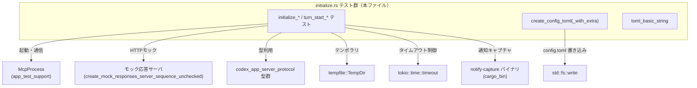
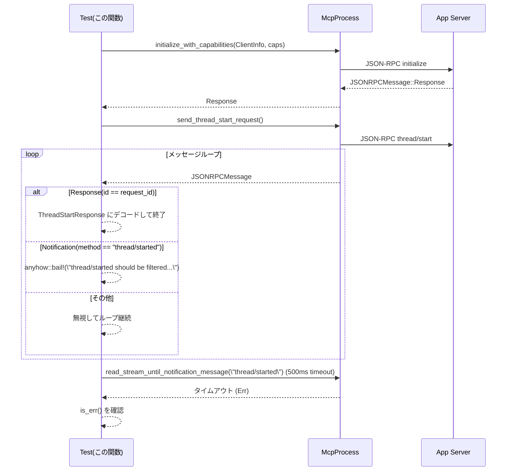
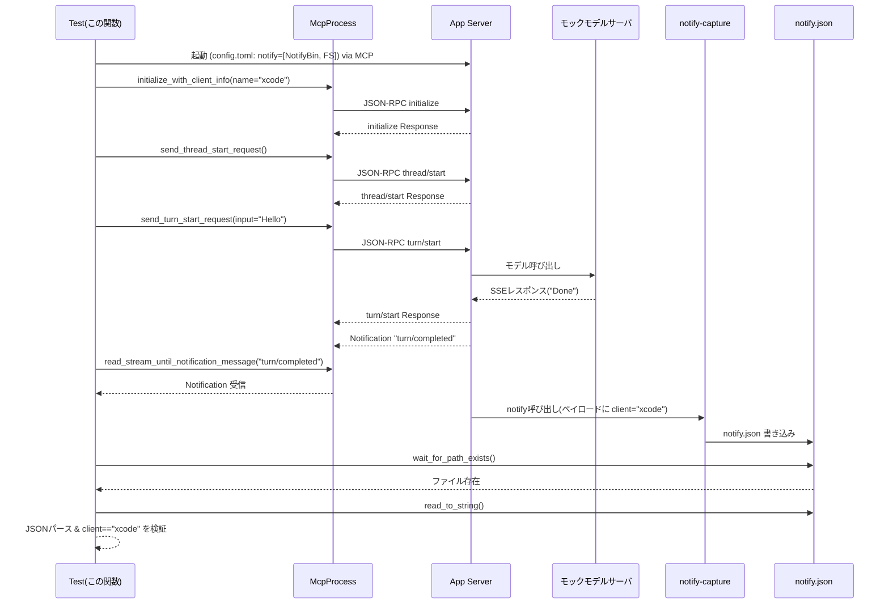

# app-server/tests/suite/v2/initialize.rs コード解説

---

## 0. ざっくり一言

Codex アプリケーションサーバ v2 の **initialize / thread start / turn start** 周りの挙動を検証する非同期テストと、そのための `config.toml` 生成ヘルパー関数を定義しているファイルです（`#[tokio::test]` で実行される統合テスト群）（app-server/tests/suite/v2/initialize.rs:L29-280）。

---

## 1. このモジュールの役割

### 1.1 概要

このモジュールは、Codex アプリケーションサーバの JSON-RPC v2 プロトコルのうち、特に以下の点を検証するために存在します。

- `initialize` の `ClientInfo` に基づく `user_agent` / `originator` の決定と、環境変数による上書き（L29-106）
- 不正な `clientInfo.name` を持つクライアントの拒否（L108-141）
- `InitializeCapabilities` の `opt_out_notification_methods` による通知（`thread/started`）のフィルタリング（L143-204）
- `initialize` で受け取ったクライント名が、`turn_start` → notify ペイロードに反映されること（L206-280）
- 上記テストのために、モックモデルサーバ向けの `config.toml` を生成するヘルパー（L283-322）

### 1.2 アーキテクチャ内での位置づけ

このファイルは「テスト層」に属し、実際のサーバ実装やプロトコル定義に依存しています。

主な依存関係は以下です。

- `app_test_support::McpProcess`  
  サーバプロセスを起動し、JSON-RPC メッセージを送受信するテスト用ラッパー（L2, L36, L72, L114, L149, L230）。
- `app_test_support::{create_mock_responses_server_sequence_unchecked, create_final_assistant_message_sse_response, to_response}`  
  モデルサーバのモック HTTP サーバと、JSON-RPC レスポンスのデコードヘルパー（L3-5, L32, L208, L56, L99, L192, L249, L266）。
- `codex_app_server_protocol::...`  
  `ClientInfo`, `InitializeResponse`, `JSONRPCMessage`, `ThreadStartParams` などのプロトコル型（L6-16）。
- `TempDir` + `create_config_toml(_with_extra)`  
  各テスト用の一時 `codex_home` ディレクトリと設定ファイル生成（L24, L33, L69, L112, L147, L210, L283-322）。
- `tokio::time::timeout`  
  非同期処理のタイムアウト制御（L25, L38-46, L81-89, L120-128, L151-165, L173-191, L194-198, L232-239, L244-248, L261-265, L268-272）。

依存関係の概要を図にします。



### 1.3 設計上のポイント

コードから読み取れる設計上の特徴は次の通りです。

- **テストごとに独立した環境**  
  各テストで `TempDir` を作成し、その下に `config.toml` を生成して `McpProcess` を起動しています（L33-36, L69-72, L112-115, L147-149, L210-221）。  
  これによりテスト間で設定やファイルが干渉しない構造になっています。

- **タイムアウトによるハング防止**  
  全ての長時間待機になりうる非同期処理は `DEFAULT_READ_TIMEOUT`（10 秒, L27）あるいは 500ms タイムアウト付きでラップされています（L38-46, L81-89, L120-128, L151-165, L173-191, L194-198, L232-239, L244-248, L261-265, L268-272）。  
  これにより、サーバが応答しない場合でもテストは一定時間で失敗します。

- **JSON-RPC レベルでの振る舞い検証**  
  `JSONRPCMessage::{Response, Error, Notification}` を直接パターンマッチし、期待された種別・内容かどうかを検証しています（L48-50, L91-93, L130-132, L166-168, L175-188）。

- **環境変数や capability などの契約テスト**  
  - `CODEX_INTERNAL_ORIGINATOR_OVERRIDE` 環境変数の挙動（L72-79, L114-118）。
  - `InitializeCapabilities.opt_out_notification_methods` による通知フィルタリング（L153-162, L182-186, L194-202）。
  - notify ペイロード内の `client` フィールドの値（L219-228, L274-277）。

- **ヘルパーでの設定ファイル生成の共通化**  
  `create_config_toml` と `create_config_toml_with_extra` で TOML 生成を一元管理し、テストコード側を簡潔に保っています（L283-322）。

---

## 2. 主要な機能一覧（＋コンポーネントインベントリー）

### 2.1 機能の概要

- `initialize_uses_client_info_name_as_originator`  
  `initialize` レスポンスの `user_agent` が `clientInfo.name` に基づいて生成されること、および `codex_home` / プラットフォーム情報が期待通りであることを検証します（L29-63）。

- `initialize_respects_originator_override_env_var`  
  `CODEX_INTERNAL_ORIGINATOR_OVERRIDE` 環境変数が設定されている場合、`user_agent` のプレフィックスにそれが使われることを検証します（L65-106）。

- `initialize_rejects_invalid_client_name`  
  HTTP ヘッダー値として不正な `clientInfo.name`（`"bad\rname"`）を渡したときに、JSON-RPC エラー（コード -32600）で拒否されることを検証します（L108-141）。

- `initialize_opt_out_notification_methods_filters_notifications`  
  `InitializeCapabilities.opt_out_notification_methods` に `"thread/started"` を指定した場合に、`thread/started` 通知が送信されないことを検証します（L143-204）。

- `turn_start_notify_payload_includes_initialize_client_name`  
  `initialize` で渡したクライアント名（ここでは `"xcode"`）が、外部 notify キャプチャバイナリを通じて書き出される JSON ペイロードの `client` フィールドに含まれることを検証します（L206-280）。

- `create_config_toml` / `create_config_toml_with_extra`  
  モックモデルサーバに接続するための `config.toml` を生成します。`_with_extra` は任意の TOML フラグメント（例: `notify` 設定）を追記するためのヘルパーです（L283-322）。

- `toml_basic_string`  
  TOML の「基本文字列」形式で使えるように、値のバックスラッシュと二重引用符をエスケープして、両端を `"` で囲んだ文字列に変換します（L324-325）。

### 2.2 コンポーネントインベントリー（定数・関数）

| 名前 | 種別 | 役割 / 用途 | 定義位置 |
|------|------|-------------|----------|
| `DEFAULT_READ_TIMEOUT` | 定数 | テストで JSON-RPC 応答などを待つ際のデフォルトタイムアウト（10 秒） | `app-server/tests/suite/v2/initialize.rs:L27-27` |
| `initialize_uses_client_info_name_as_originator` | 非同期テスト関数 | `initialize` で `clientInfo.name` が `user_agent` に反映されること、および `codex_home` / OS 情報を検証 | `app-server/tests/suite/v2/initialize.rs:L29-63` |
| `initialize_respects_originator_override_env_var` | 非同期テスト関数 | 環境変数 `CODEX_INTERNAL_ORIGINATOR_OVERRIDE` による `user_agent` プレフィックスの上書きを検証 | `app-server/tests/suite/v2/initialize.rs:L65-106` |
| `initialize_rejects_invalid_client_name` | 非同期テスト関数 | 不正な `clientInfo.name` を与えた場合の JSON-RPC エラー応答（-32600）の検証 | `app-server/tests/suite/v2/initialize.rs:L108-141` |
| `initialize_opt_out_notification_methods_filters_notifications` | 非同期テスト関数 | `opt_out_notification_methods` 設定により `"thread/started"` 通知が送られないことを検証 | `app-server/tests/suite/v2/initialize.rs:L143-204` |
| `turn_start_notify_payload_includes_initialize_client_name` | 非同期テスト関数 | `initialize` クライアント名が notify ペイロードの `client` フィールドに含まれることを検証 | `app-server/tests/suite/v2/initialize.rs:L206-280` |
| `create_config_toml` | 関数 | モックモデルサーバ向けの基本 `config.toml` を生成する薄いラッパー | `app-server/tests/suite/v2/initialize.rs:L283-289` |
| `create_config_toml_with_extra` | 関数 | 基本設定に加えて任意の TOML 文字列（例: `notify` 設定）を挿入した `config.toml` を生成 | `app-server/tests/suite/v2/initialize.rs:L291-322` |
| `toml_basic_string` | 関数 | TOML 基本文字列として安全に埋め込むため、バックスラッシュと二重引用符をエスケープして `"` で囲む | `app-server/tests/suite/v2/initialize.rs:L324-325` |

---

## 3. 公開 API と詳細解説

### 3.1 型一覧（構造体・列挙体など）

このファイル内で **新たに定義されている型はありません**。

テストでは、外部クレートから以下の主な型を利用しています（定義は他ファイルで行われており、このチャンクには現れません）。

- `codex_app_server_protocol::ClientInfo`（L6, L40-44, L83-87, L122-126, L155-158, L233-237）
- `codex_app_server_protocol::InitializeResponse`（L8, L51-56, L94-99）
- `codex_app_server_protocol::JSONRPCMessage`（L9, L48-50, L91-93, L130-132, L166-168, L175-188）
- `codex_app_server_protocol::JSONRPCResponse`（L10, L244-248, L261-265）
- `codex_app_server_protocol::ThreadStartParams` / `ThreadStartResponse`（L12-13, L171-172, L192, L249-250）
- `codex_app_server_protocol::TurnStartParams` / `TurnStartResponse`（L14-15, L251-259, L266）

これらの型の詳細な定義はこのチャンクには含まれないため、不明です。

---

### 3.2 関数詳細（7 件）

#### `initialize_uses_client_info_name_as_originator() -> Result<()>`

**概要**

`initialize` 呼び出し時の `ClientInfo.name` が、サーバの `user_agent`（＝ originator）に反映されていることを検証する非同期テストです。また、`codex_home` とプラットフォーム情報が期待通りであることも確認します（L29-63）。

**引数**

- なし（`#[tokio::test]` によりテストランナーから直接呼び出されます）。

**戻り値**

- `anyhow::Result<()>`  
  すべての検証に成功した場合は `Ok(())` を返し（L62）、セットアップや通信、検証のどこかで失敗した場合は `Err(anyhow::Error)` が返ります（`?` や `anyhow::bail!` により早期リターン, L32-36, L38-46, L48-50, L56）。

**内部処理の流れ**

1. モックモデルサーバを起動し、空の応答シーケンスを設定（L31-32）。
2. 一時ディレクトリ `codex_home` を作成し（L33）、`AbsolutePathBuf` に正規化した期待パスを計算（L34）。
3. `create_config_toml` で `codex_home/config.toml` を生成し、モックサーバへ接続する設定を書く（L35, L283-289）。
4. `McpProcess::new` でアプリサーバプロセスを起動（L36）。
5. `timeout(DEFAULT_READ_TIMEOUT, mcp.initialize_with_client_info(...))` で `ClientInfo` を送って initialize を実行し、タイムアウト・通信エラーを `?` で処理（L38-46）。
6. 受信メッセージが `JSONRPCMessage::Response` であることを確認し、そうでなければ `anyhow::bail!` でテスト失敗（L48-50）。
7. `to_response::<InitializeResponse>` で JSON-RPC レスポンスを `InitializeResponse` に変換し、`user_agent`, `codex_home`, `platform_family`, `platform_os` を取り出す（L51-56）。
8. `user_agent` の先頭が `"codex_vscode/"` であること（L58）、`codex_home` が期待したパスと一致すること（L59）、プラットフォーム情報が `std::env::consts` と一致すること（L60-61）を `assert!` / `assert_eq!` で検証。

**Examples（使用例）**

この関数自体はテストランナーからのみ呼び出されますが、同様のパターンで initialize を確認するテストは次のように書けます。

```rust
#[tokio::test]
async fn example_initialize_test() -> anyhow::Result<()> {
    let responses = Vec::new(); // モックモデルサーバには何も返させない
    let server = create_mock_responses_server_sequence_unchecked(responses).await;
    let codex_home = TempDir::new()?; // テストごとに別の codex_home を作る
    create_config_toml(codex_home.path(), &server.uri(), "never")?; // config.toml 生成
    let mut mcp = McpProcess::new(codex_home.path()).await?; // アプリサーバ起動

    let message = timeout(
        DEFAULT_READ_TIMEOUT,
        mcp.initialize_with_client_info(ClientInfo {
            name: "my_client".to_string(),
            title: Some("My Client".to_string()),
            version: "1.0.0".to_string(),
        }),
    )
    .await??; // timeout エラーと initialize エラーを両方 `?` で伝播

    let JSONRPCMessage::Response(response) = message else {
        anyhow::bail!("expected initialize response");
    };
    let init: InitializeResponse = to_response(response)?; // 型変換

    // 必要なフィールドを検証
    assert!(init.user_agent.starts_with("my_client/"));
    Ok(())
}
```

**Errors / Panics**

- `TempDir::new` の失敗、`AbsolutePathBuf::try_from` の失敗、設定ファイル書き込み失敗、`McpProcess::new` の失敗、`initialize_with_client_info` の内部エラー、および `timeout` によるタイムアウトはすべて `?` を通じて `Err` として呼び出し元（テストランナー）に伝播します（L32-36, L38-46）。
- 受信メッセージが `JSONRPCMessage::Response` ではない場合、`anyhow::bail!` により即座にエラー（L48-50）。
- `assert!` / `assert_eq!` が失敗すると panic し、そのテストは失敗として扱われます（L58-61）。

**Edge cases（エッジケース）**

- サーバが 10 秒以内に応答しない場合、`timeout` によりテストがエラー終了します（L38-46, L27）。
- `ClientInfo.title` は `Some` を渡していますが、このテストではレスポンス側で利用しておらず、タイトルがレスポンスにどう影響するかはこのチャンクからは分かりません。

**使用上の注意点**

- `timeout(...).await??` のように `?` が 2 回続く構造になっているため、外側が `tokio::time::Elapsed`、内側が `anyhow::Error` という 2 種類のエラーが発生しうる点に注意が必要です（L38-46）。
- `TempDir` による一時ディレクトリはスコープを抜けると削除されるため、テスト中にのみ利用可能です（L33）。

---

#### `initialize_respects_originator_override_env_var() -> Result<()>`

**概要**

`CODEX_INTERNAL_ORIGINATOR_OVERRIDE` 環境変数が設定されている場合に、`initialize` レスポンスの `user_agent` のプレフィックスが、この環境変数の値に置き換えられることを検証するテストです（L65-106）。

**引数 / 戻り値**

- 引数なし、戻り値は `anyhow::Result<()>`（L66）。

**内部処理の流れ**

1. モックサーバ起動と `codex_home` 作成、`expected_codex_home` 計算（L67-70）。
2. `create_config_toml` で `config.toml` を生成（L71）。
3. `McpProcess::new_with_env` に `("CODEX_INTERNAL_ORIGINATOR_OVERRIDE", Some("codex_originator_via_env_var"))` を渡してプロセスを起動（L72-79）。
4. `initialize_with_client_info` を呼び出し、JSON-RPC レスポンスを取得（L81-89）。
5. レスポンス種別の検証と `InitializeResponse` への変換（L91-99）。
6. `user_agent` のプレフィックスが `"codex_originator_via_env_var/"` であることを確認し（L101）、`codex_home` / プラットフォーム情報も前テストと同様に検証（L102-104）。

**Errors / Edge cases / 使用上の注意点**

- エラー処理やタイムアウト構造は前述のテストと同様です（L67-80, L81-89）。
- 環境変数のキー文字列 `"CODEX_INTERNAL_ORIGINATOR_OVERRIDE"` はコード中で直書きされており、スペルミスがあると想定通り動作しません（L72-76, L114-116）。
- `Some("...")` として与えているため、「空文字にしたい」といったケースはカバーしていません（L75-77）。

---

#### `initialize_rejects_invalid_client_name() -> Result<()>`

**概要**

`ClientInfo.name` に HTTP ヘッダー値として不正な文字（キャリッジリターン `\r`）を含む `"bad\rname"` を指定した場合に、サーバが `JSONRPCMessage::Error` を返し、エラーコードやメッセージが期待通りであることを検証します（L108-141）。

**内部処理の流れ**

1. モックサーバ起動と `codex_home` 作成（L110-113）。
2. `create_config_toml` で設定ファイル生成（L113）。
3. `McpProcess::new_with_env` に `("CODEX_INTERNAL_ORIGINATOR_OVERRIDE", None)` を渡して起動（L114-118）。この `None` によって、環境変数での originator 上書きが抑制されることが意図されていると考えられます（ただし実装はこのチャンクにはありません）。
4. `initialize_with_client_info` に `name: "bad\rname"` を渡し（L120-127）、結果を `timeout` 付きで待機（L120-128）。
5. 受信メッセージが `JSONRPCMessage::Error` であることを確認。そうでなければ `anyhow::bail!`（L130-132）。
6. エラーコードが `-32600`（Invalid Request）、メッセージ文字列が `"Invalid clientInfo.name: 'bad\rname'. Must be a valid HTTP header value."` であること、`data` が `None` であることを `assert_eq!` で検証（L134-139）。

**Errors / Edge cases / 使用上の注意点**

- サーバが `JSONRPCMessage::Response` を返した場合は即座にテスト失敗（L130-132）。
- このテストが検証しているのは「`\r` を含む名前」であり、他の不正とされるべき文字（`\n` など）についてはこのチャンクからは分かりません。
- エラーコード `-32600` は JSON-RPC 2.0 の「Invalid Request」に対応する数値であり、プロトコルとしてその契約を前提にしています（L134）。

---

#### `initialize_opt_out_notification_methods_filters_notifications() -> Result<()>`

**概要**

`InitializeCapabilities` の `opt_out_notification_methods` に `"thread/started"` を指定した場合に、サーバから `thread/started` 通知が送信されないことを検証するテストです（L143-204）。

**内部処理の流れ（アルゴリズム）**

1. 通常どおりモックサーバと `codex_home` を準備し、`config.toml` を生成、`McpProcess` を起動（L145-149）。
2. `initialize_with_capabilities` を呼び出し、`ClientInfo` とともに `InitializeCapabilities` を送信（L151-163）。

   ```rust
   InitializeCapabilities {
       experimental_api: true,
       opt_out_notification_methods: Some(vec!["thread/started".to_string()]),
   }
   ```

   （L159-162）

3. `initialize` の応答が `JSONRPCMessage::Response` であることのみを確認し、中身は利用していません（L166-168）。
4. `send_thread_start_request` でスレッド開始リクエストを送り、数値の `request_id` を受け取る（L170-172）。
5. `timeout(DEFAULT_READ_TIMEOUT, async { ... })` 内で、以下のループ処理を実行（L173-191）:

   - `mcp.read_next_message().await?` で順次メッセージを取得（L175）。
   - `Response` かつ `id` が先ほど送った `request_id` と一致すれば、それを返してループ終了（L177-181）。
   - `Notification` かつ `method == "thread/started"` の場合、  
     `"thread/started should be filtered by optOutNotificationMethods"` というメッセージで `anyhow::bail!`（L182-186）。
   - それ以外のメッセージは無視してループ継続（L187-188）。

6. 得られたレスポンスを `ThreadStartResponse` にデコードして検証（詳細なフィールド検証は行っていません）（L192）。
7. さらに、500ms の `timeout` をかけて `mcp.read_stream_until_notification_message("thread/started")` を呼び出し、`thread/started` 通知が来ないことを `thread_started.is_err()` で確認（L194-202）。

**Mermaid シーケンス図（initialize_opt_out_notification_methods_filters_notifications, L143-204）**



**Errors / Edge cases / 使用上の注意点**

- ループは `timeout(DEFAULT_READ_TIMEOUT, ...)` に包まれているため、サーバがレスポンスや通知を返さない場合には最大 10 秒でテストがタイムアウトします（L173-191, L27）。
- `"thread/started"` 通知を 500ms だけ監視し、`is_err()` を期待しているため、もしサーバが非常に遅延して通知を送る設計であれば、このテストは「送られていない」とみなす可能性があります（L194-200）。  
  ただし、サーバの仕様はこのチャンクには現れないため、これが仕様通りかどうかは不明です。
- メッセージループ中に他のリクエストのレスポンスや通知が来た場合は無視してループを続行します（L187-188）。  
  したがって、テストが対象とするのは「指定した thread/start リクエストに対するレスポンス」と「thread/started 通知の有無」です。

---

#### `turn_start_notify_payload_includes_initialize_client_name() -> Result<()>`

**概要**

`initialize` で渡したクライアント名 `"xcode"` が、モデル生成完了後に外部 notify メカニズムを通じて生成される JSON ファイルに `{"client": "xcode", ...}` の形で含まれることを検証するテストです（L206-280）。

**内部処理の流れ**

1. モックモデルサーバ用の SSE レスポンスを 1 つ用意し（`"Done"` メッセージ, L208）、モックサーバを起動（L209）。
2. 一時 `codex_home` を作成し（L210）、`notify.json` ファイルパスを `codex_home` 配下に作成（L211）。
3. `cargo_bin("codex-app-server-test-notify-capture")` で notify キャプチャ用バイナリのパスを取得し、`to_str().expect(...)` で UTF-8 に変換（L212-215）。ここで非 UTF-8 のパスの場合は panic します。
4. `notify_file` についても同様に `to_str().expect(...)` で文字列化（L216-218）。
5. `create_config_toml_with_extra` を呼び出し、`config.toml` に `notify = [<notify_capture>, <notify_file_str>]` という行を挿入（L219-228）。  
   ここで `toml_basic_string` によりパス中のバックスラッシュや `"` がエスケープされます（L225-227, L324-325）。
6. `McpProcess::new` でアプリサーバを起動し（L230）、`initialize_with_client_info` で `ClientInfo.name = "xcode"` を設定して initialize（L231-239）。
7. `send_thread_start_request` でスレッドを開始し、そのレスポンスから `ThreadStartResponse` を取得、`thread.id` を取り出す（L241-250）。
8. `send_turn_start_request` に `TurnStartParams` を渡し、`input` にテキスト `"Hello"` を含む `V2UserInput::Text` を設定（L251-259）。  
   これにより 1 ターンの推論が開始されます。
9. `turn/start` のレスポンスとして `TurnStartResponse` を受け取り（L261-266）、続けて `"turn/completed"` 通知が来るまで `read_stream_until_notification_message("turn/completed")` で待ちます（L268-272）。
10. モデル出力完了後、notify キャプチャバイナリが `notify_file` に JSON ペイロードを書き出すことを期待し、`fs_wait::wait_for_path_exists` で最大 5 秒までファイルが現れるのを待機（L274）。
11. ファイルを読み込み、`serde_json::from_str` で `serde_json::Value` としてパースし（L275-276）、`payload["client"] == "xcode"` であることを `assert_eq!` で検証（L277）。

**Mermaid シーケンス図（turn_start_notify_payload_includes_initialize_client_name, L206-280）**



**Errors / Edge cases / 使用上の注意点**

- `cargo_bin` はテストバイナリ名 `"codex-app-server-test-notify-capture"` に依存しており、このバイナリがビルドされていない場合やパスが UTF-8 で表現できない場合、`expect(...)` により panic します（L212-218）。
- `fs_wait::wait_for_path_exists` のタイムアウトは 5 秒であり、notify の実行がこれより遅い環境ではテストが失敗し得ます（L274）。
- `payload["client"]` が存在しない、または文字列でない場合、`assert_eq!` 比較時にパニックになる可能性がありますが、ここでは `serde_json::Value` のインデクシングに対してそのような検査は行っていません（L275-277）。

---

#### `create_config_toml(codex_home: &Path, server_uri: &str, approval_policy: &str) -> std::io::Result<()>`

**概要**

モックモデルサーバに接続するための基本的な `config.toml` を、追加設定なしで生成するヘルパーです。内部的には `create_config_toml_with_extra` を空文字 `""` を指定して呼び出しています（L283-289）。

**引数**

| 引数名 | 型 | 説明 |
|--------|----|------|
| `codex_home` | `&Path` | `config.toml` を置くディレクトリ（各テストの `TempDir` のパス） |
| `server_uri` | `&str` | モックモデルサーバのベース URI（例: `"http://127.0.0.1:xxxxx"`） |
| `approval_policy` | `&str` | TOML の `approval_policy` フィールドにそのまま書き込む値 |

**戻り値**

- `std::io::Result<()>`  
  `config.toml` の生成に成功すれば `Ok(())`、ファイル作成や書き込みに失敗すると `Err(std::io::Error)` を返します。

**内部処理の流れ**

1. 単に `create_config_toml_with_extra(codex_home, server_uri, approval_policy, "")` を呼び出しています（L288-289）。
2. `extra` が空文字なので、TOML に追加設定は挿入されません。

**使用上の注意点**

- 追加の notify 設定などを挿入したい場合は、この関数ではなく `create_config_toml_with_extra` を使う必要があります（L219-228, L291-322）。

---

#### `create_config_toml_with_extra(codex_home: &Path, server_uri: &str, approval_policy: &str, extra: &str) -> std::io::Result<()>`

**概要**

モックモデルサーバ向けの `config.toml` を生成する関数で、基本設定に加えて任意の TOML 文字列 `extra` を挿入できます。notify 設定など、テストごとの追加構成に利用されています（L219-228, L291-322）。

**引数**

| 引数名 | 型 | 説明 |
|--------|----|------|
| `codex_home` | `&Path` | `config.toml` を生成するディレクトリ |
| `server_uri` | `&str` | モックモデルサーバのベース URI |
| `approval_policy` | `&str` | `approval_policy` に書き込む文字列 |
| `extra` | `&str` | TOML としてそのまま挿入される追記設定（例: `notify = [...]`） |

**戻り値**

- `std::io::Result<()>` — `std::fs::write` の結果をそのまま返します（L297-321）。

**内部処理の流れ**

1. `codex_home.join("config.toml")` で出力先パスを作成（L297）。
2. `std::fs::write` で以下のフォーマット文字列をファイルに書き込み（L298-321）。

   ```text
   model = "mock-model"
   approval_policy = "{approval_policy}"
   sandbox_mode = "read-only"

   model_provider = "mock_provider"

   {extra}

   [features]
   shell_snapshot = false

   [model_providers.mock_provider]
   name = "Mock provider for test"
   base_url = "{server_uri}/v1"
   wire_api = "responses"
   request_max_retries = 0
   stream_max_retries = 0
   ```

   （L301-319）

   ここで `approval_policy` と `server_uri` と `extra` がその場で埋め込まれます。

**Errors / Edge cases / 使用上の注意点**

- `extra` はそのまま埋め込まれるため、TOML の文法的整合性は呼び出し側の責任です（L301-309）。
- `server_uri` は末尾に `/v1` が付加されて `base_url` に書き込まれます（L315）。URI の末尾にスラッシュが含まれているかどうかに応じて、`"//v1"` のような形になる可能性がありますが、このチャンクからは利用側の期待は分かりません。
- ファイルパスが存在しないディレクトリや書き込み権限のない場所を指していると `Err(std::io::Error)` になります（L297-321）。

---

#### `toml_basic_string(value: &str) -> String`

**概要**

渡された文字列を TOML の「基本文字列」形式で使えるように、バックスラッシュと二重引用符だけをエスケープし、両端を `"` で囲んだ文字列に変換するヘルパーです（L324-325）。  
主な用途は、ファイルパスなどを `notify = ["path1", "path2"]` 形式で安全に埋め込むことです（L219-228, L225-227）。

**引数**

| 引数名 | 型 | 説明 |
|--------|----|------|
| `value` | `&str` | TOML 基本文字列として埋め込みたい元の文字列 |

**戻り値**

- `String` — 両端が `"` で囲まれ、元の `value` から `\` は `\\` に、`"` は `\"` に変換された文字列（L324-325）。

**内部処理の流れ**

1. `value.replace('\\', "\\\\")` でバックスラッシュを 2 つに増やす（L325）。
2. 続けて `.replace('"', "\\\"")` で二重引用符を `\"` に置き換える（L325）。
3. `format!("\"{}\"", ...)` で結果全体を `"` で囲む（L325）。

**使用例**

`turn_start_notify_payload_includes_initialize_client_name` 内での利用例（L219-228, L225-227）:

```rust
let notify_capture = /* バイナリパス &str */;
let notify_file_str = /* ファイルパス &str */;

let extra = format!(
    "notify = [{}, {}]",
    toml_basic_string(notify_capture),
    toml_basic_string(notify_file_str)
);
create_config_toml_with_extra(codex_home.path(), &server.uri(), "never", &extra)?;
```

**Errors / Edge cases / 使用上の注意点**

- この関数は `\` と `"` のみをエスケープしており、改行やタブなど他の制御文字はそのまま残ります（L325）。  
  このテストコードではファイルパスのような単純な文字列に対してのみ利用しているため問題になりにくいですが、汎用的な TOML 文字列エスケープとしては不完全です。
- `value` が既にエスケープ済みの場合、さらにエスケープされる（ダブルエスケープ）点に注意が必要です。

---

### 3.3 その他の関数

`initialize_uses_client_info_name_as_originator` などのテスト関数以外に、補助的な関数は以下の通りです。

| 関数名 | 役割（1 行） |
|--------|--------------|
| `create_config_toml` | `create_config_toml_with_extra` のラッパーとして基本設定のみの `config.toml` を生成します（L283-289）。 |

---

## 4. データフロー

ここでは代表的なシナリオとして、`initialize_opt_out_notification_methods_filters_notifications`（L143-204）におけるデータフローを整理します。

1. テストコードが `config.toml` を生成し、`McpProcess` 経由でアプリサーバを起動します（L145-149, L283-322）。
2. `initialize_with_capabilities` に `ClientInfo` と `InitializeCapabilities` を渡すと、サーバは JSON-RPC の `initialize` リクエストを処理し、`JSONRPCMessage::Response` として返します（L151-165）。
3. テストはその後 `send_thread_start_request` でスレッド開始を要求し、サーバからのレスポンスを待ちます（L170-172, L173-191）。
4. この待機中に、サーバはスレッド開始時の通知など他のメッセージを送る可能性があります。テストは JSON-RPC メッセージストリームから 1 つずつメッセージを取り出し、レスポンスか、`thread/started` 通知か、それ以外かに分類します（L175-188）。
5. `"thread/started"` 通知が来た場合はテスト失敗、それ以外は無視し、目的のレスポンスまで読み続けます（L182-186）。
6. さらに別途 `read_stream_until_notification_message("thread/started")` を 500ms だけ実行し、それでも `thread/started` が来ないことを確認することで、「通知がフィルタされている」という挙動を検証します（L194-202）。

---

## 5. 使い方（How to Use）

このファイルはテストコードですが、`McpProcess` によるサーバとのやり取りや、`config.toml` の生成パターンを学ぶサンプルとして利用できます。

### 5.1 基本的な使用方法（テストのひな型）

`create_config_toml` と `McpProcess` を使った基本的な非同期テストの流れは、次のようにまとめられます。

```rust
#[tokio::test]
async fn my_integration_test() -> anyhow::Result<()> {
    // 1. モックサーバを起動（必要に応じてレスポンスシーケンスを設定）
    let responses = Vec::new();
    let server = create_mock_responses_server_sequence_unchecked(responses).await;

    // 2. テスト専用の codex_home ディレクトリを用意
    let codex_home = TempDir::new()?;
    create_config_toml(codex_home.path(), &server.uri(), "never")?;

    // 3. アプリサーバプロセスを MCP 経由で起動
    let mut mcp = McpProcess::new(codex_home.path()).await?;

    // 4. initialize を実行
    let init_msg = timeout(
        DEFAULT_READ_TIMEOUT,
        mcp.initialize_with_client_info(ClientInfo {
            name: "my_client".to_string(),
            title: Some("My Client".to_string()),
            version: "1.0.0".to_string(),
        }),
    )
    .await??;

    // 5. JSON-RPC レスポンス種別を確認し、必要ならデコード
    let JSONRPCMessage::Response(response) = init_msg else {
        anyhow::bail!("expected initialize response");
    };
    let _init: InitializeResponse = to_response(response)?;

    // 6. ここから thread/start や turn/start など、テストしたい処理を記述
    Ok(())
}
```

### 5.2 よくある使用パターン

- **環境変数付きでサーバを起動する**  
  `McpProcess::new_with_env` を使い、特定の挙動をテストするための環境変数を指定します（L72-79, L114-118）。

- **notify 機構のテスト**  
  `create_config_toml_with_extra` と `toml_basic_string` を使い、`notify = [ ..., ... ]` 設定を追加して外部バイナリとの連携を検証します（L219-228, L291-322, L324-325）。

### 5.3 よくある間違い

```rust
// 間違い例: config.toml を作成する前にサーバを起動しようとしている
let codex_home = TempDir::new()?;
// create_config_toml を呼んでいない
let mut mcp = McpProcess::new(codex_home.path()).await?; // サーバ側が設定ファイルを読めず失敗する可能性

// 正しい例: 先に config.toml を生成してからサーバを起動する
let codex_home = TempDir::new()?;
create_config_toml(codex_home.path(), &server.uri(), "never")?;
let mut mcp = McpProcess::new(codex_home.path()).await?;
```

```rust
// 間違い例: 非同期処理にタイムアウトを付けていない
let msg = mcp.initialize_with_client_info(client_info).await?; // サーバが応答しないとデッドロック

// 正しい例: tokio::time::timeout で包み、テスト全体がハングしないようにする
let msg = timeout(DEFAULT_READ_TIMEOUT, mcp.initialize_with_client_info(client_info)).await??;
```

### 5.4 使用上の注意点（まとめ）

- すべての非同期 I/O は `timeout` で包んでおり、同様に新しいテストを書く場合もタイムアウトを設定することが推奨されます（L38-46, L81-89, L120-128, L151-165, L173-191, L194-198, L232-239, L244-248, L261-265, L268-272）。
- `create_config_toml_with_extra` に渡す `extra` 文字列は、そのまま TOML として挿入されます。スキーマや文法は呼び出し側で保証する必要があります（L301-309）。
- ファイルパスを `toml_basic_string` でエスケープするとき、`value` に制御文字（改行など）が含まれていると TOML として不正になる可能性がありますが、その検証は行われていません（L324-325）。
- `cargo_bin(...).to_str().expect(...)` のような `expect` は、UTF-8 で表現できないパス環境では panic する可能性があります（L212-218）。

---

## 6. 変更の仕方（How to Modify）

### 6.1 新しい機能を追加する場合（テスト観点）

サーバの新しい初期化オプションや通知を追加した場合、このファイルにテストを追加する際の基本的な手順は次の通りです。

1. **設定とモックサーバの準備**  
   - 既存のテスト同様に `TempDir` + `create_config_toml(_with_extra)` + `create_mock_responses_server_sequence_unchecked` を用いる（L31-36, L67-72, L145-149, L210-221）。
2. **McpProcess の起動**  
   - 既存のパターン（`new` または `new_with_env`）を流用して起動します（L36, L72-79, L114-118, L149, L230）。
3. **必要な JSON-RPC 呼び出し**  
   - `initialize_with_client_info` / `initialize_with_capabilities`、`send_thread_start_request`、`send_turn_start_request` などを組み合わせてシナリオを構成します（L38-46, L151-165, L171-172, L251-260）。
4. **メッセージの検証**  
   - `JSONRPCMessage::*` に対する `match` や `to_response` を使い、期待されるメッセージ種別や内容を検証します（L48-56, L91-99, L130-139, L166-168, L175-188, L192, L244-250, L261-266）。

### 6.2 既存の機能を変更する場合（テスト更新の観点）

- **originator / user_agent 仕様を変更する場合**  
  - `initialize_uses_client_info_name_as_originator` と `initialize_respects_originator_override_env_var` のアサーション（`assert!(user_agent.starts_with(...))`）が仕様に合うように更新する必要があります（L58, L101）。
- **`clientInfo.name` のバリデーションルールを変更する場合**  
  - エラーコードやメッセージが変わる場合は、`initialize_rejects_invalid_client_name` の `assert_eq!` 部分を合わせて変更する必要があります（L134-139）。
- **通知フィルタリング仕様を変更する場合**  
  - `"thread/started"` 通知の有無に関するテストロジックは `initialize_opt_out_notification_methods_filters_notifications` に集中していますので、挙動が変わる場合はこのテストのループ条件やタイムアウト条件を見直す必要があります（L173-202）。
- **notify ペイロード形式を変更する場合**  
  - ペイロード JSON の `client` フィールド名や値の扱いが変わると、`turn_start_notify_payload_includes_initialize_client_name` の `payload["client"]` チェックを修正する必要があります（L275-277）。

---

## 7. 関連ファイル

このモジュールと密接に関係する（が、このチャンクには定義がない）コンポーネントを一覧にします。

| パス / モジュール名 | 役割 / 関係 |
|---------------------|------------|
| `app_test_support::McpProcess` | アプリサーバプロセスの起動・停止と JSON-RPC メッセージの送受信を抽象化するテスト用ユーティリティ。すべてのテストで利用されています（L2, L36, L72, L114, L149, L230）。 |
| `app_test_support::create_mock_responses_server_sequence_unchecked` | モデルサーバのモック HTTP サーバを立ち上げ、指定されたレスポンスシーケンスを返すテスト用ヘルパー（L4, L32, L68, L111, L146, L209）。 |
| `app_test_support::create_final_assistant_message_sse_response` | SSE 形式の最終メッセージを生成するヘルパーで、`turn_start_notify_payload_includes_initialize_client_name` 内で利用されています（L3, L208）。 |
| `app_test_support::to_response` | JSONRPCResponse などをドメイン型（`InitializeResponse`, `ThreadStartResponse`, `TurnStartResponse`）へ変換するヘルパー（L5, L56, L99, L192, L249, L266）。 |
| `codex_app_server_protocol` | `ClientInfo`, `InitializeCapabilities`, `InitializeResponse`, `JSONRPCMessage`, `ThreadStartParams` など、サーバとの通信に使う JSON-RPC 型定義を提供します（L6-16）。 |
| `core_test_support::fs_wait` | ファイルシステム上のパスが現れるのを非同期に待つためのヘルパーで、notify 出力ファイルの存在を待つのに利用されています（L19, L274）。 |
| `codex-app-server-test-notify-capture`（バイナリ） | `cargo_bin("codex-app-server-test-notify-capture")` で参照される外部テストバイナリで、notify ペイロードをファイルに書き出す役割を担います（L212-218）。 |

このチャンクには、上記モジュールやバイナリの内部実装は含まれていないため、詳細な挙動は不明です。
