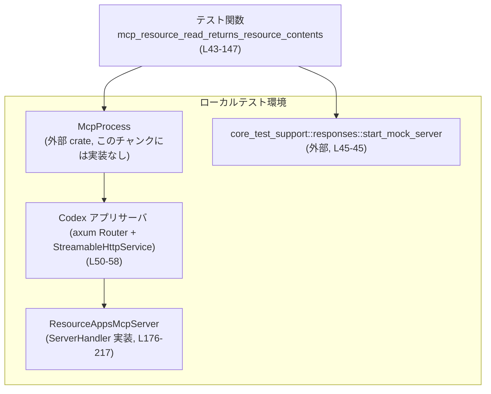
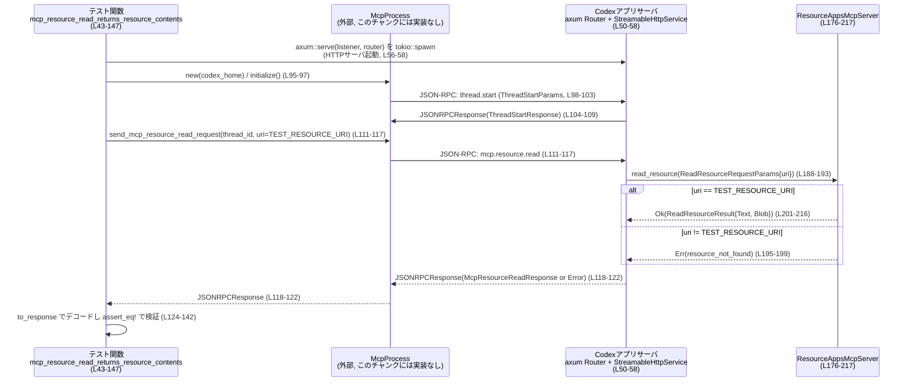

app-server/tests/suite/v2/mcp_resource.rs

---

## 0. ざっくり一言

このファイルは、Codex アプリサーバと MCP（Model Context Protocol?）リソース機能の統合挙動をテストするための **統合テスト** と、そのテスト用の簡易 MCP サーバ実装を定義しています（`ResourceAppsMcpServer`）（`app-server/tests/suite/v2/mcp_resource.rs:L43-147`, `L176-217`）。

---

## 1. このモジュールの役割

### 1.1 概要

- Codex アプリサーバ経由で MCP リソース読み出しを行ったときに、**テキストとバイナリの 2 種類のリソース内容が正しく返ること**を検証するテストを提供します（`mcp_resource_read_returns_resource_contents`）（`L43-147`）。
- 存在しないスレッド ID で MCP リソース読み出しを要求したときに、**適切なエラー（"thread not found"）が返ること**を検証します（`mcp_resource_read_returns_error_for_unknown_thread`）（`L149-174`）。
- これらのテストで利用する、リソース API だけを実装したシンプルな MCP サーバ `ResourceAppsMcpServer` を定義します（`L176-217`）。

### 1.2 アーキテクチャ内での位置づけ

このテストモジュールは、以下のコンポーネント間の連携を検証しています。



- テスト関数は `McpProcess` を通じて Codex アプリサーバと通信します（`L95-122`）。
- Codex アプリサーバは `StreamableHttpService::new` と `ResourceAppsMcpServer` を使って MCP リソース API を提供します（`L50-55`, `L176-217`）。
- 別のモックサーバ（`responses::start_mock_server`）は、モデルプロバイダのバックエンドを模擬するために起動されますが、詳細実装はこのチャンクには現れません（`L45-45`）。

### 1.3 設計上のポイント

- **統合テスト指向**  
  - 実際に TCP ポートをバインドし（`TcpListener::bind("127.0.0.1:0")`）、`axum::serve` で HTTP サーバを立ち上げることで、ネットワークレベルに近い統合テストになっています（`L46-58`）。
- **状態をほぼ持たない MCP サーバ**  
  - `ResourceAppsMcpServer` はフィールドを持たない空の構造体で、すべてのレスポンスはファイル内の定数から生成されます（`L176-177`, `L37-41`, `L201-215`）。
- **エラーハンドリング方針**  
  - テスト関数は `anyhow::Result<()>` を返し、`?` で I/O や非同期処理のエラーをそのままテスト失敗として伝播させます（`L43-44`, `L60-61`, `L95-97`, `L151-153`）。
  - MPC サーバ側では、リソース URI が期待値と異なる場合に `rmcp::ErrorData::resource_not_found` を返すことで、プロトコルレベルのエラーを表現しています（`L193-199`）。
- **並行性**  
  - メインのテストは Tokio のマルチスレッドランタイム（ワーカー 2 スレッド）上で実行されつつ、アプリサーバは別タスクとして `tokio::spawn` で並行実行されます（`L43`, `L56-58`）。
  - `ResourceAppsMcpServer` は共有 mutable state を持たないため、複数リクエストから同時に呼ばれてもレースコンディションが発生しない構造です（`L176-217`）。

---

## 2. 主要な機能一覧（コンポーネントインベントリー付き）

### 2.1 コンポーネント一覧

このファイル内で定義されている主な型・関数の一覧です。

| 名前 | 種別 | 行範囲 | 役割 |
|------|------|--------|------|
| `DEFAULT_READ_TIMEOUT` | 定数 | `L37-37` | テストの各種待ち合わせに使うデフォルトタイムアウト（10 秒）。 |
| `TEST_RESOURCE_URI` | 定数 | `L38-38` | テスト用のテキストリソース URI。 |
| `TEST_BLOB_RESOURCE_URI` | 定数 | `L39-39` | テスト用のバイナリリソース URI。 |
| `TEST_RESOURCE_BLOB` | 定数 | `L40-40` | テスト用バイナリリソースの base64 表現。 |
| `TEST_RESOURCE_TEXT` | 定数 | `L41-41` | テスト用テキストリソースの内容文字列。 |
| `mcp_resource_read_returns_resource_contents` | 非公開 async テスト関数 | `L43-147` | 正常系：既知スレッド＋既知 URI でのリソース読み出し結果を検証。 |
| `mcp_resource_read_returns_error_for_unknown_thread` | 非公開 async テスト関数 | `L149-174` | 異常系：未知スレッド ID でのリソース読み出しエラー内容を検証。 |
| `ResourceAppsMcpServer` | 構造体 | `L176-177` | MCP リソース API を提供するテスト用サーバ実装。 |
| `impl ServerHandler for ResourceAppsMcpServer::get_info` | メソッド | `L179-186` | MCP サーバのバージョンやリソース対応能力を返す。 |
| `impl ServerHandler for ResourceAppsMcpServer::read_resource` | async メソッド | `L188-217` | 指定 URI のリソース内容（テキスト＋バイナリ）を返す。 |

### 2.2 主要な機能一覧

- MCP リソース正常系テスト: Codex アプリサーバ経由でテキストとバイナリの 2 つのリソースコンテンツが取得できることを検証します（`mcp_resource_read_returns_resource_contents`）（`L43-147`）。
- MCP リソース異常系テスト（未知スレッド）: 存在しないスレッド ID に対する MCP リソース読み出し要求が、"thread not found" を含む JSON-RPC エラーで失敗することを検証します（`mcp_resource_read_returns_error_for_unknown_thread`）（`L149-174`）。
- MCP リソースサーバ実装: `ServerHandler` トレイトを実装し、固定の URI に対してテキスト／バイナリ両方のリソースを返すサーバを定義します（`ResourceAppsMcpServer`）（`L176-217`）。

---

## 3. 公開 API と詳細解説

このファイル内には `pub` アイテムはありませんが、テストから見た「使われ方」と MCP サーバとしてのコアロジックを中心に説明します。

### 3.1 型一覧（構造体・列挙体など）

| 名前 | 種別 | 役割 / 用途 | 根拠 |
|------|------|-------------|------|
| `ResourceAppsMcpServer` | 構造体（`Clone`, `Default` 派生） | テスト中に `StreamableHttpService` が使用する MCP サーバ実装。リソース読み出し API だけを提供し、状態は持たない。 | `app-server/tests/suite/v2/mcp_resource.rs:L176-177`, `L179-217` |

### 3.2 関数詳細

#### `mcp_resource_read_returns_resource_contents() -> Result<()>`

**概要**

- Codex アプリサーバ＋MCP サーバの統合環境を立ち上げ、既知スレッド ID と既知リソース URI を指定してリソース読み出しを行い、期待どおりのテキスト／バイナリコンテンツが返ることを検証する統合テストです（`L43-147`）。

**引数**

- 引数はありません（Tokio のテスト関数としてフレームワークから呼び出されます）（`L43-44`）。

**戻り値**

- `anyhow::Result<()>`  
  - 成功時：`Ok(())` を返し、テストは成功になります（`L146-146`）。
  - エラー時：`?` 演算子で発生した任意のエラーをラップして返し、テストは失敗になります（`L45-47`, `L60-61`, `L85-93`, `L95-97`, `L103-103`, `L108-108`, `L117-117`, `L122-122`）。

**内部処理の流れ**

1. **モックレスポンスサーバの起動**  
   - `core_test_support::responses::start_mock_server().await` を呼び出し、モデルプロバイダの代わりとなる HTTP モックサーバを起動します（`L45-45`）。  
   - この関数の中身はこのチャンクには現れません。
2. **アプリサーバの TCP リスナーを準備**  
   - `TcpListener::bind("127.0.0.1:0")` でローカルの空きポートにバインドし（`L46-46`）、`listener.local_addr()` で実際のアドレスを取得します（`L47-47`）。
   - このアドレスをもとに `apps_server_url`（HTTP ベース URL）を構築します（`L48-48`）。
3. **MCP サービスと axum ルータの構築・起動**  
   - `StreamableHttpService::new` に `ResourceAppsMcpServer` のファクトリクロージャ、ローカルセッションマネージャ、デフォルト設定を渡し MCP 対応サービスを構築します（`L50-54`）。
   - `Router::new().nest_service("/api/codex/apps", mcp_service)` で HTTP パス `/api/codex/apps` にサービスをバインドします（`L55-55`）。
   - `tokio::spawn` で `axum::serve(listener, router)` を別タスクとして実行し、アプリサーバを並行起動します（`L56-58`）。
4. **Codex 設定と認証情報の準備**  
   - 一時ディレクトリ `TempDir` を作成し（`L60-60`）、そこに `config.toml` を書き込みます（`L62-85`）。
     - `chatgpt_base_url` として先ほど立ち上げたアプリサーバの URL を設定しています（`L71-71`）。
     - モデルプロバイダの `base_url` としてレスポンスモックサーバの URI を使用します（`L79-79`）。
   - `write_chatgpt_auth` を使って、ファイルベースの OAuth 認証情報を配置します（`L86-93`）。
5. **McpProcess の初期化とスレッド開始**  
   - `McpProcess::new(codex_home.path()).await?` で MCP クライアントプロセスを起動します（`L95-95`）。
   - `timeout(DEFAULT_READ_TIMEOUT, mcp.initialize()).await??;` で初期化 RPC をタイムアウト付きで完了させます（`L96-96`）。
   - `send_thread_start_request` でスレッド開始リクエストを送り（`L98-103`）、対応する `JSONRPCResponse` をストリームから待ち受けます（`L104-108`）。
   - `to_response` によって `ThreadStartResponse` にデコードし、スレッド ID を取得します（`L109-109`）。
6. **リソース読み出しリクエストとレスポンス検証**  
   - `send_mcp_resource_read_request` で `McpResourceReadParams{ thread_id, server: "codex_apps", uri: TEST_RESOURCE_URI }` を送信します（`L111-117`）。
   - そのレスポンス（`JSONRPCResponse`）をタイムアウト付きで待ち受けます（`L118-122`）。
   - `to_response::<McpResourceReadResponse>` で型付きレスポンスへデコードし、期待値 `McpResourceReadResponse { contents: [Text, Blob] }` と `assert_eq!` で比較します（`L124-142`）。
7. **テスト後処理**  
   - `apps_server_handle.abort()` でアプリサーバタスクを中止し（`L144-144`）、`await` で終了を待ちます（`L145-145`）。
   - `Ok(())` を返してテスト終了です（`L146-146`）。

**Examples（使用例）**

この関数自身がテストなので、そのままが使用例です。MCP 経由でリソースを読み出す最小パターンを抜き出すと、次のようになります。

```rust
// テスト用の MCP プロセスを起動する                           // app-server/tests/suite/v2/mcp_resource.rs:L95-97
let mut mcp = McpProcess::new(codex_home.path()).await?;
timeout(DEFAULT_READ_TIMEOUT, mcp.initialize()).await??;

// スレッドを開始して ID を取得する                             // L98-109
let thread_start_id = mcp
    .send_thread_start_request(ThreadStartParams {
        model: Some("mock-model".to_string()),
        ..Default::default()
    })
    .await?;
let thread_start_resp: JSONRPCResponse = timeout(
    DEFAULT_READ_TIMEOUT,
    mcp.read_stream_until_response_message(RequestId::Integer(thread_start_id)),
)
.await??;
let ThreadStartResponse { thread, .. } = to_response(thread_start_resp)?;

// MCP リソース読み出しを行う                                   // L111-122
let read_request_id = mcp
    .send_mcp_resource_read_request(McpResourceReadParams {
        thread_id: thread.id,
        server: "codex_apps".to_string(),
        uri: TEST_RESOURCE_URI.to_string(),
    })
    .await?;
let read_response: JSONRPCResponse = timeout(
    DEFAULT_READ_TIMEOUT,
    mcp.read_stream_until_response_message(RequestId::Integer(read_request_id)),
)
.await??;
let resource_resp: McpResourceReadResponse = to_response(read_response)?;
```

**Errors / Panics**

- 以下の操作はすべて `?` でエラーを伝播するため、任意の失敗はテスト失敗として扱われます（`L45-47`, `L60-61`, `L85-93`, `L95-97`, `L103-103`, `L108-108`, `L117-117`, `L122-122`）。
  - TCP ポートのバインド失敗 (`TcpListener::bind`)（`L46-46`）
  - 一時ディレクトリ作成失敗 (`TempDir::new`)（`L60-60`）
  - 設定ファイル書き込み失敗 (`std::fs::write`)（`L62-85`）
  - 認証情報書き込み失敗 (`write_chatgpt_auth`)（`L86-93`）
  - MCP プロセス起動失敗 (`McpProcess::new`)（`L95-95`）
  - MCP 初期化や RPC 呼び出しのタイムアウト (`timeout`)（`L96-96`, `L104-108`, `L118-122`）
- `assert_eq!` が失敗した場合は panic し、テストは失敗になります（`L124-142`）。
- これ以外の明示的な `panic!` はありません。

**Edge cases（エッジケース）**

- MCP サーバが期待と異なるコンテンツを返した場合  
  → `assert_eq!` が失敗し panic します（`L124-142`）。
- MCP プロセスからレスポンスが返ってこない、または非常に遅い場合  
  → `timeout(DEFAULT_READ_TIMEOUT, ...)` により `Elapsed` エラーが発生し、テストはエラー終了します（`L96-96`, `L104-108`, `L118-122`）。
- スレッド開始やリソース読み出しが JSON-RPC のエラーを返した場合  
  → `to_response` 呼び出し時にエラーになる可能性がありますが、`to_response` の実装はこのチャンクには現れません（`L109-109`, `L124-126`）。

**使用上の注意点**

- MCP プロセスがバックグラウンドで外部プロセスを起動するなど重い処理を行う可能性がありますが、それは `McpProcess` の実装に依存しており、このチャンクからは分かりません。
- テストでは `apps_server_handle.abort()` を必ず呼び出して HTTP サーバタスクを停止しており、テスト終了時のリソースリークを避けています（`L144-145`）。
- `DEFAULT_READ_TIMEOUT` は 10 秒と比較的長く設定されているため、ハングを検知する保険になっていますが、タイムアウト値は環境に応じて調整が必要な場合があります（`L37-37`, `L96-96`, `L104-108`, `L118-122`）。

---

#### `mcp_resource_read_returns_error_for_unknown_thread() -> Result<()>`

**概要**

- 存在しないスレッド ID を使って MCP リソース読み出しを行ったときに、エラーメッセージに `"thread not found"` が含まれることを確認するテストです（`L149-174`）。

**引数**

- なし（Tokio テストとしてフレームワークから呼ばれます）（`L149-150`）。

**戻り値**

- `anyhow::Result<()>`  
  - 成功時：`Ok(())`（`L173-173`）。  
  - エラー時：`McpProcess` 初期化や RPC 呼び出しのエラーをそのまま返します（`L151-153`, `L155-161`, `L162-166`）。

**内部処理の流れ**

1. 一時ディレクトリを作成し（`TempDir::new()`）、`McpProcess::new` で MCP プロセスを起動します（`L151-152`）。
   - このテストでは設定ファイルや認証情報の書き込みは行っておらず、その前提条件は `McpProcess` の実装に依存しており、このチャンクには現れません。
2. `timeout(DEFAULT_READ_TIMEOUT, mcp.initialize())` により初期化を完了します（`L153-153`）。
3. 存在しない UUID 形式のスレッド ID `"00000000-0000-4000-8000-000000000000"` を指定して `send_mcp_resource_read_request` を呼びます（`L155-161`）。
4. `read_stream_until_error_message` でエラーメッセージを待ち受けます（`L162-166`）。
5. 受け取った `JSONRPCError` の `error.message` に `"thread not found"` が含まれていることを `assert!` で検証します（`L168-171`）。

**Errors / Panics**

- `McpProcess::new`, `initialize`, `send_mcp_resource_read_request`, `read_stream_until_error_message` のいずれかがエラーになると、`?` によってテストはエラー終了します（`L151-153`, `L155-161`, `L162-166`）。
- `assert!(...)` の条件が偽の場合、panic しテストは失敗します（`L168-171`）。

**Edge cases**

- MCP 実装が `"thread not found"` ではなく別のメッセージを返すように変更された場合、このテストは失敗します（`L168-171`）。
- 初期化に失敗した場合（設定ファイル未配置など）、本来検証したい「unknown thread」エラーまで到達する前にテストがエラー終了する可能性があります（`L151-153`）。

**使用上の注意点**

- `read_stream_until_error_message` はエラーメッセージが来るまで待機するため、MCP 側がエラーメッセージを送らない場合、`timeout` により 10 秒後にタイムアウトエラーとなります（`L37-37`, `L162-166`）。
- スレッド ID の値はハードコードされており、特定のフォーマットに依存していますが、このフォーマット要件は `McpProcess`／サーバ側の実装に依存しており、このチャンクからは分かりません（`L157-157`）。

---

#### `ResourceAppsMcpServer::get_info(&self) -> ServerInfo`

**概要**

- MCP サーバのプロトコルバージョンやサポートする機能（ここではリソース機能）をクライアントに伝えるためのメソッドです（`L179-186`）。

**引数**

| 引数名 | 型 | 説明 |
|--------|----|------|
| `&self` | `&ResourceAppsMcpServer` | サーバインスタンスの参照。状態を持たないため内容は使用されません。 |

**戻り値**

- `ServerInfo`  
  - `protocol_version` に `ProtocolVersion::V_2025_06_18` を設定し（`L182-182`）、  
  - `capabilities` に `enable_resources()` を呼び出したサーバ能力を設定します（`L183-183`）。
  - その他のフィールドは `ServerInfo::default()` の値を使用します（`L184-184`）。

**内部処理の流れ**

1. `ServerInfo` のリテラル構築を行い、`protocol_version` と `capabilities` を明示的にセットします（`L181-184`）。
2. 構築された `ServerInfo` を返します（`L181-186`）。

**Errors / Panics**

- このメソッドは同期的で、エラーを返しません（戻り値は `Result` ではありません）（`L180-186`）。
- panic を発生させるコードは含まれていません。

**Edge cases / 使用上の注意点**

- リソース機能が無効なサーバをテストしたい場合は、`enable_resources()` を呼び出さない別の実装が必要になりますが、そのような実装はこのファイルには含まれていません（`L183-183`）。

---

#### `ResourceAppsMcpServer::read_resource(&self, request: ReadResourceRequestParams, _context: RequestContext<RoleServer>) -> Result<ReadResourceResult, rmcp::ErrorData>`

**概要**

- クライアントからのリソース読み出しリクエストを受け取り、URI に応じてテキストとバイナリのリソース内容を返す、MCP サーバ側のコアロジックです（`L188-217`）。

**引数**

| 引数名 | 型 | 説明 |
|--------|----|------|
| `&self` | `&ResourceAppsMcpServer` | サーバインスタンス参照。構造体は状態を持たないため、メソッド内では使用していません。 |
| `request` | `ReadResourceRequestParams` | クライアントから送信されたリソース読み出しパラメータ。ここでは `uri` フィールドのみ使用しています（`L190-193`）。 |
| `_context` | `RequestContext<RoleServer>` | リクエストコンテキスト。変数名が `_` 始まりで未使用であることが明示されています（`L191-191`）。 |

**戻り値**

- `Result<ReadResourceResult, rmcp::ErrorData>`  
  - 成功 (`Ok`)：指定された URI のリソース内容を含む `ReadResourceResult` を返します（`L201-216`）。  
  - 失敗 (`Err`)：URI が想定と異なる場合、`rmcp::ErrorData::resource_not_found` エラーを返します（`L195-199`）。

**内部処理の流れ**

1. リクエストから `uri` を取り出します（`let uri = request.uri;`）（`L193-193`）。
2. `uri` が定数 `TEST_RESOURCE_URI` と一致するかをチェックします（`L194-194`）。
   - 一致しない場合  
     → `rmcp::ErrorData::resource_not_found` を呼び出し、「resource not found: {uri}」というメッセージと `None` をペイロードに持つエラーを返します（`L195-199`）。
3. 一致した場合  
   → `ReadResourceResult` を構築し、`contents` に 2 要素のベクタを設定します（`L201-215`）。
   - 1 つ目は `ResourceContents::TextResourceContents` で、テキストリソースの URI、MIME type `text/markdown`、本文 `TEST_RESOURCE_TEXT` を持ちます（`L202-207`）。
   - 2 つ目は `ResourceContents::BlobResourceContents` で、バイナリリソースの URI、MIME type `application/octet-stream`、base64 文字列 `TEST_RESOURCE_BLOB` を持ちます（`L209-213`）。
4. 構築した `ReadResourceResult` を `Ok(...)` で返します（`L201-216`）。

**Examples（使用例）**

このメソッドは `StreamableHttpService` によって HTTP 経由で呼び出されるため、直接的な呼び出し例はこのファイルにはありません。ただし、擬似的な直接呼び出しは次のような形になります（概念的な例）：

```rust
// リクエストパラメータを組み立てる                               // app-server/tests/suite/v2/mcp_resource.rs:L193-193 参照
let params = ReadResourceRequestParams {
    uri: TEST_RESOURCE_URI.to_string(),
    // 他のフィールドがあればそれも設定（このチャンクには現れません）
};

// サーバインスタンスを作る                                      // L176-177
let server = ResourceAppsMcpServer::default();

// リソースを読み出す                                            // L188-217
let result: ReadResourceResult = server
    .read_resource(params, RequestContext::<RoleServer>::default()) // RequestContext::default はこのチャンクには現れません
    .await
    .expect("resource should be found");
```

※ `RequestContext::<RoleServer>::default()` などの詳細はこのチャンクには現れないため、実際の使用には実装に合わせた引数が必要です。

**Errors / Panics**

- URI が `TEST_RESOURCE_URI` と一致しない場合、`rmcp::ErrorData::resource_not_found` を返します（`L193-199`）。
- このメソッド自身は panic を発生させません（`L188-217`）。

**Edge cases（エッジケース）**

- `uri` が空文字列 `""` の場合  
  → `TEST_RESOURCE_URI` と一致しないため、`resource_not_found` エラーになります（`L193-199`）。
- `uri` の大文字・小文字差分  
  → 一致判定は単純な文字列比較 (`!=`) なので、大小文字が異なるが意味的に同じ URI でも `resource_not_found` になります（`L193-195`）。
- `request` 内に他のフィールドがあっても、この実装では `uri` 以外は参照していません（`L190-193`）。

**使用上の注意点**

- この実装は特定の 1 つの URI にのみ対応しており、それ以外はすべて `resource_not_found` として扱われます。複数リソースを扱うテストを追加する場合は、この条件分岐を拡張する必要があります（`L193-199`, `L201-215`）。
- レスポンスに含まれるテキストとバイナリはすべてファイル内定数に依存しているため、テストコードとサーバ実装が常に同期していることが前提です（`L38-41`, `L201-215`）。
- 構造体は `Clone + Default` であり、状態を持たないため、複数タスクから同時に呼び出されてもスレッドセーフです（`L176-177`, `L188-217`）。

### 3.3 その他の関数

このファイル内の関数はすべて上記で詳細に解説した 4 つだけであり、補助的な小さなラッパー関数は定義されていません（`L43-147`, `L149-174`, `L179-217`）。

---

## 4. データフロー

ここでは、正常系テスト `mcp_resource_read_returns_resource_contents` における代表的なデータフローを示します。

1. テストがモックレスポンスサーバと Codex アプリサーバ＋MCP サーバを起動します（`L45-58`）。
2. `McpProcess` が Codex アプリサーバの `/api/codex/apps` エンドポイントに接続し、スレッド開始要求を送信します（`L95-109`）。
3. 取得したスレッド ID を使って MCP リソース読み出しリクエストを送信します（`L111-117`）。
4. Codex アプリサーバは裏側で `ResourceAppsMcpServer::read_resource` を呼び出し、リソース内容を構築して返します（`L188-217`）。
5. `McpProcess` はレスポンスを JSON-RPC 形式で受信し、テスト側で `to_response` によって `McpResourceReadResponse` に変換されます（`L118-126`）。



---

## 5. 使い方（How to Use）

このファイルはテストモジュールですが、ここで定義されているパターンやコンポーネントは他のテストを書く際のテンプレートとして利用できます。

### 5.1 基本的な使用方法

典型的なフローは「テスト環境の初期化 → MCP クライアント (`McpProcess`) の初期化 → スレッド開始 → リソースリクエスト → レスポンス検証」という流れです（`L45-147`）。

```rust
// 1. テスト用のHTTPサーバ・MCPサーバを起動する                      // L45-58
let responses_server = responses::start_mock_server().await?;
let listener = TcpListener::bind("127.0.0.1:0").await?;
let addr = listener.local_addr()?;
let apps_server_url = format!("http://{addr}");

let mcp_service = StreamableHttpService::new(
    move || Ok(ResourceAppsMcpServer),                     // テスト用 MCP サーバ (L50-52)
    Arc::new(LocalSessionManager::default()),
    StreamableHttpServerConfig::default(),
);
let router = Router::new().nest_service("/api/codex/apps", mcp_service);
let apps_server_handle = tokio::spawn(async move {
    let _ = axum::serve(listener, router).await;
});

// 2. Codex 設定と認証情報を一時ディレクトリに用意する                   // L60-85, L86-93
let codex_home = TempDir::new()?;
/* ... config.toml の書き込みと write_chatgpt_auth ... */

// 3. MCP クライアントプロセスを初期化する                            // L95-97
let mut mcp = McpProcess::new(codex_home.path()).await?;
timeout(DEFAULT_READ_TIMEOUT, mcp.initialize()).await??;

// 4. スレッドを開始し、IDを取得する                                // L98-109
let thread_start_id = mcp
    .send_thread_start_request(ThreadStartParams {
        model: Some("mock-model".to_string()),
        ..Default::default()
    })
    .await?;
let thread_start_resp: JSONRPCResponse = timeout(
    DEFAULT_READ_TIMEOUT,
    mcp.read_stream_until_response_message(RequestId::Integer(thread_start_id)),
)
.await??;
let ThreadStartResponse { thread, .. } = to_response(thread_start_resp)?;

// 5. MCP リソース読み出しを行い、結果を検証する                        // L111-142
let read_request_id = mcp
    .send_mcp_resource_read_request(McpResourceReadParams {
        thread_id: thread.id,
        server: "codex_apps".to_string(),
        uri: TEST_RESOURCE_URI.to_string(),
    })
    .await?;
let read_response: JSONRPCResponse = timeout(
    DEFAULT_READ_TIMEOUT,
    mcp.read_stream_until_response_message(RequestId::Integer(read_request_id)),
)
.await??;
let resp: McpResourceReadResponse = to_response(read_response)?;
assert_eq!(resp.contents.len(), 2);

// 6. 後片付け                                                      // L144-145
apps_server_handle.abort();
let _ = apps_server_handle.await;
```

### 5.2 よくある使用パターン

- **正常系＋異常系を対にしたテスト**  
  - 現状のファイルのように、成功パス（リソースが取得できる）とエラーパス（unknown thread 等）を同じファイル内でテストすることで、プロトコルの振る舞いを網羅的に確認しています（`L43-147`, `L149-174`）。
- **固定 URI によるリソース検証**  
  - サーバ側の `read_resource` は単純に定数 URI を判定しているため、クライアント側のテストは URI を変えるだけで「見つかる／見つからない」の挙動を切り替えられます（`L193-199`, `L201-215`）。

### 5.3 よくある間違い

このファイルから推測される、起こり得る誤用を挙げます。

```rust
// 間違い例: MCP 初期化前にリソースをリクエストする
let mut mcp = McpProcess::new(codex_home.path()).await?;
// let read_request_id = mcp.send_mcp_resource_read_request(...).await?; // まだ initialize していない

// 正しい例: initialize を完了させてからリクエストする              // L95-97
let mut mcp = McpProcess::new(codex_home.path()).await?;
timeout(DEFAULT_READ_TIMEOUT, mcp.initialize()).await??;
let read_request_id = mcp.send_mcp_resource_read_request(...).await?;
```

```rust
// 間違い例: 起動した HTTP サーバタスクを放置する
let apps_server_handle = tokio::spawn(async move {
    let _ = axum::serve(listener, router).await;
});
// apps_server_handle を abort/await しない

// 正しい例: テスト終了時に abort + await する                      // L144-145
apps_server_handle.abort();
let _ = apps_server_handle.await;
```

### 5.4 使用上の注意点（まとめ）

- **前提条件**
  - `McpProcess` を利用する前に、必要な設定ファイルや認証情報を正しい場所に配置する必要があります（このテストでは `config.toml` と OAuth ファイルを一時ディレクトリに書き込んでいます）（`L60-85`, `L86-93`）。
  - `initialize()` を完了させてからスレッド開始やリソース読み出しを行う前提になっています（`L95-97`, `L151-153`）。
- **並行性**
  - HTTP サーバは別タスクで実行されているため、テスト終了時に適切に停止しないとポート占有やタスクリークが起こり得ます。ここでは `abort()` と `await` によって明示的に停止しています（`L56-58`, `L144-145`）。
- **エラーハンドリング**
  - 遅延やハングを防ぐために、すべてのネットワーク待ち合わせに `timeout(DEFAULT_READ_TIMEOUT, ...)` が使われています（`L37-37`, `L96-96`, `L104-108`, `L118-122`, `L153-153`, `L162-166`）。
- **セキュリティ**
  - テストはローカルホスト上の HTTP（平文）を使用しており、外部からの接続を想定していません（`TcpListener::bind("127.0.0.1:0")`）（`L46-46`）。
  - 入力 URI は定数かハードコードされた値のみを使用しているため、外部からの任意入力を直接処理していません（`L38-41`, `L113-116`, `L157-160`, `L193-195`）。

---

## 6. 変更の仕方（How to Modify）

### 6.1 新しい機能を追加する場合

- **別のリソース種類をテストする**
  1. `ResourceAppsMcpServer::read_resource` に新たな分岐を追加し、別の URI に対して別の `ResourceContents` を返すようにします（`L193-199`, `L201-215`）。
  2. その URI を使う新しいテスト関数を追加し、`send_mcp_resource_read_request` の `uri` を変更します（`L111-117`, `L155-160`）。
- **異なるエラーケースを検証する**
  1. `read_resource` で `rmcp::ErrorData` の別種のコンストラクタを使うようにし（例えば permission error など、このチャンクには具体例はありません）、条件に応じてエラーを返すようにします（`L195-199`）。
  2. 新しいテストで `read_stream_until_error_message` を使い、期待するエラーメッセージを検証します（`L162-166`, `L168-171`）。

### 6.2 既存の機能を変更する場合

- **影響範囲の確認**
  - `TEST_RESOURCE_*` 定数や `ResourceAppsMcpServer::read_resource` の内容を変更すると、`mcp_resource_read_returns_resource_contents` の `assert_eq!` と整合性が取れなくなる可能性があります（`L38-41`, `L124-142`, `L201-215`）。
- **契約（前提条件・返り値の意味）の確認**
  - `read_resource` の「既知 URI 以外は `resource_not_found`」という契約を変更する場合、クライアント側（`McpProcess` や Codex アプリサーバ）の期待も変わる可能性があります。これらの実装はこのチャンクには現れませんが、参照先コードのテストも併せて確認する必要があります。
- **テストの更新**
  - プロトコルバージョン (`ProtocolVersion::V_2025_06_18`) やサーバ能力の定義 (`enable_resources()`) を変更した場合、プロトコル互換性をチェックしている他のテストが存在する可能性があります（`L182-183`）。このチャンクではそれらの存在有無は分かりません。

---

## 7. 関連ファイル

このモジュールと密接に関係する（が、このチャンクには実装が現れない）外部コンポーネントを列挙します。

| パス / モジュール | 役割 / 関係 | 根拠 |
|-------------------|------------|------|
| `app_test_support::McpProcess` | MCP クライアントプロセスを抽象化したテスト用ユーティリティ。initialize や JSON-RPC リクエスト送信をカプセル化していると考えられますが、具体的な実装はこのチャンクには現れません。 | `app-server/tests/suite/v2/mcp_resource.rs:L6`, `L95-97`, `L98-103`, `L111-117`, `L155-161`, `L162-166` |
| `core_test_support::responses` | モデルプロバイダのレスポンスを模倣する HTTP モックサーバを提供しているモジュールと思われますが、詳細はこのチャンクには現れません。 | `L19`, `L45-45`, `L61-61`, `L79-79` |
| `app_test_support::write_chatgpt_auth` / `ChatGptAuthFixture` | ChatGPT 向けの OAuth 認証情報をテスト用に生成・ファイル保存するユーティリティ。 | `L5`, `L8`, `L86-93` |
| `rmcp::handler::server::ServerHandler` | MCP サーバとして実装すべきトレイト。`ResourceAppsMcpServer` がこれを実装し、`get_info` と `read_resource` を提供します。 | `L21`, `L179-217` |
| `rmcp::transport::StreamableHttpService` | `ServerHandler` を HTTP ベースのサービスに変換するトランスポート層。`ResourceAppsMcpServer` を実際の HTTP リクエストに接続する役割を持ちます。 | `L31`, `L50-54` |
| `rmcp::transport::streamable_http_server::session::local::LocalSessionManager` | ローカルプロセス内でセッション管理を行うコンポーネント。テスト環境でセッションを扱うために使用されています。 | `L32`, `L50-54` |
| `codex_app_server_protocol` 各型 | JSON-RPC レベルのメッセージ型（`JSONRPCResponse`, `JSONRPCError`, `McpResourceReadParams`, `McpResourceReadResponse` など）。テストではこれらを使ってレスポンスの内容を検証します。 | `L10-17`, `L111-117`, `L124-142`, `L162-170` |

このレポートは、あくまでこの一つのファイルに基づく説明であり、関連モジュールの内部実装や他テストとの関係については「このチャンクには現れない」ため、それ以上の推測は行っていません。
