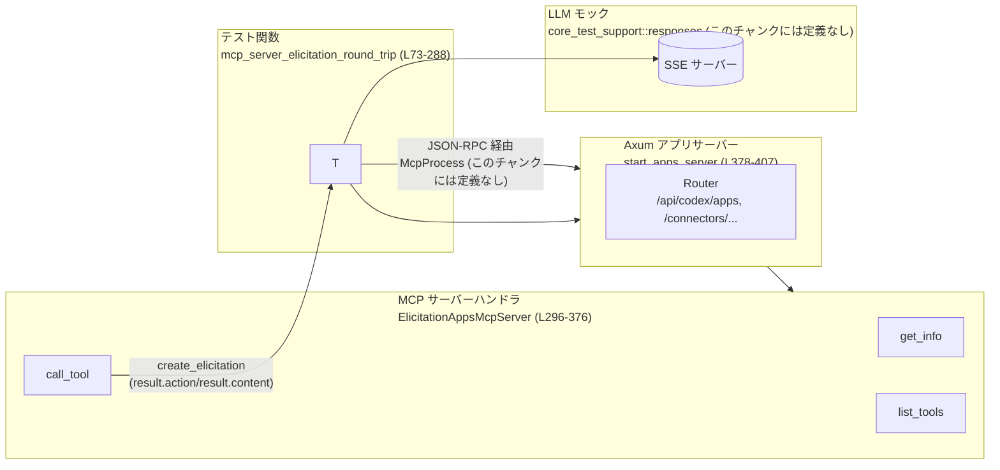
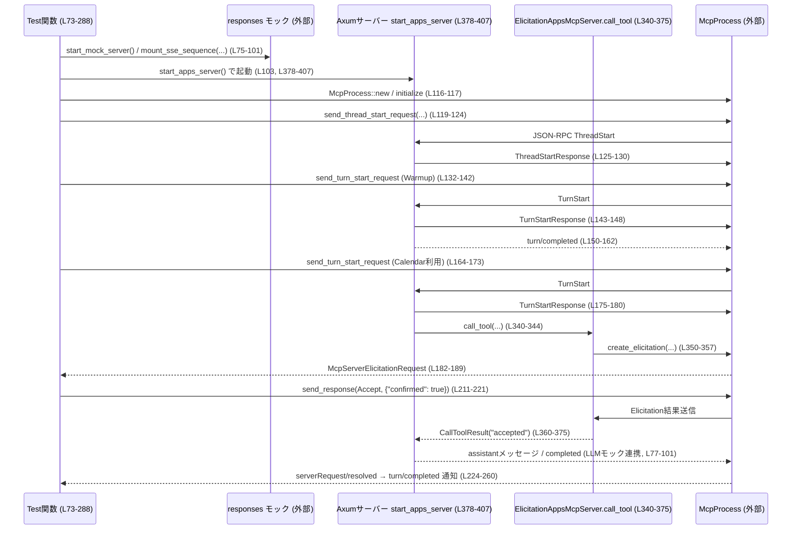

# app-server/tests/suite/v2/mcp_server_elicitation.rs コード解説

## 0. ざっくり一言

MCP サーバーが「エリシテーション（ユーザー確認フォーム）」を発行し、それに応答するとツール呼び出し結果に反映される、という往復フローをエンドツーエンドで検証する統合テストです（`mcp_server_elicitation_round_trip`、L73-288）。

---

## 1. このモジュールの役割

### 1.1 概要

- このテストモジュールは、Codex アプリサーバーと MCP サーバーの連携経由で  
  - ツール呼び出しが「エリシテーション」を要求する  
  - クライアントがそのエリシテーションに回答する  
  - 回答結果が最終的なツール出力に反映される  
  という一連の流れを検証します（L73-288, L340-375）。
- Axum ベースのローカル HTTP サーバー（`start_apps_server`、L378-407）と、rmcp ベースの MCP サーバーハンドラ（`ElicitationAppsMcpServer`、L296-376）をテスト用に立ち上げ、その上で `McpProcess` を通じてプロトコルレベルのやりとりを行います。

### 1.2 アーキテクチャ内での位置づけ

このファイル単体で見える主なコンポーネントと依存関係です。

- テストドライバ: `mcp_server_elicitation_round_trip`（L73-288）
- アプリサーバー: `start_apps_server` + Axum `Router`（L378-407）
- MCP サーバー実装: `ElicitationAppsMcpServer`（L296-376）
- コネクタディレクトリ API: `list_directory_connectors`（L409-449）
- 外部テストサポート: `core_test_support::responses`, `app_test_support::McpProcess` など（L5-8, L35）



### 1.3 設計上のポイント

- **責務分割**  
  - テストシナリオ（スレッド/ターン開始、エリシテーション応答検証）は `mcp_server_elicitation_round_trip` に集中（L73-288）。
  - MCP サーバーの振る舞い（ツール一覧とツール呼び出し）は `ElicitationAppsMcpServer` が担当（L296-376）。
  - HTTP レベルのアクセストークン・アカウント検証は `list_directory_connectors` に切り出されています（L409-449）。
- **状態管理**  
  - Axum の共有状態として `AppsServerState`（期待される Bearer トークンとアカウント ID）を `Arc` で保持（L291-294, L378-382）。
  - MCP サーバーハンドラ `ElicitationAppsMcpServer` 自体はフィールドを持たない無状態構造体です（L296-297）。
- **エラーハンドリング**  
  - テストでは `tokio::time::timeout` を多用し、プロトコル応答が一定時間内に返らない場合は即座にエラーとします（例: L117, L125-129, L143-147, L150-154）。
  - Axum ハンドラは `Result<_, StatusCode>` を返し、認証・パラメータ不備時に適切な HTTP ステータスを返します（L409-449）。
  - rmcp 側のエラーは `rmcp::ErrorData::internal_error` でラップしてクライアントへ返す設計です（L317, L348, L358）。
- **並行性**  
  - テストは `#[tokio::test(flavor = "multi_thread", worker_threads = 4)]` でマルチスレッドランタイム上で動作（L73）。
  - アプリサーバーは `tokio::spawn` で別タスクとして起動され、ハンドルは最後に `abort` して終了させています（L402-406, L285-287）。

---

## 2. 主要な機能一覧

このモジュールが提供する主な「機能」（テストシナリオとヘルパ）は次のとおりです。

- MCP エリシテーション往復テスト: `mcp_server_elicitation_round_trip` が、MCP サーバーからのエリシテーション要求、クライアント応答、結果の反映まで一連の流れを検証します（L73-288）。
- MCP サーバー情報とツール一覧: `ElicitationAppsMcpServer::get_info` / `list_tools` が、ツールのメタ情報とコネクタ情報付きのツール一覧を提供します（L300-338）。
- MCP ツール呼び出しとエリシテーション: `ElicitationAppsMcpServer::call_tool` が、`create_elicitation` を用いてユーザー確認を要求し、その結果に応じたテキスト出力を返します（L340-375）。
- テスト用アプリサーバー起動: `start_apps_server` が、Axum ベースの HTTP サーバーと MCP エンドポイントを立ち上げます（L378-407）。
- コネクタディレクトリ API モック: `list_directory_connectors` が、期待される HTTP ヘッダとクエリを検証した上でカレンダーアプリ 1 件を返します（L409-449）。
- Codex 設定ファイル出力: `write_config_toml` が、テスト用 `config.toml` を生成し、LLM モックサーバーとアプリサーバーの URL を埋め込みます（L451-480）。

---

## 3. 公開 API と詳細解説

このテストモジュールは外部に `pub` な API を公開していませんが、テスト内で再利用されるコンポーネントを「API」とみなして整理します。

### 3.1 型一覧（構造体など） + コンポーネントインベントリー

#### 構造体

| 名前 | 種別 | 役割 / 用途 | 定義位置 |
|------|------|-------------|----------|
| `AppsServerState` | 構造体 | Axum の共有状態として、期待される Bearer トークンとアカウント ID を保持します。`list_directory_connectors` で認証チェックに使用されます。 | `app-server/tests/suite/v2/mcp_server_elicitation.rs:L291-294` |
| `ElicitationAppsMcpServer` | 構造体 | rmcp の `ServerHandler` を実装するテスト用 MCP サーバーです。ツール一覧とツール呼び出しを提供します。フィールドを持たない無状態の型です。 | `app-server/tests/suite/v2/mcp_server_elicitation.rs:L296-297` |

#### 関数・メソッド（定義インベントリー）

| 名前 | 種別 | 概要 | 定義位置 |
|------|------|------|----------|
| `mcp_server_elicitation_round_trip` | 非公開 async 関数（Tokio テスト） | MCP エリシテーションのエンドツーエンドフローを検証するメインテストです。 | `...:L73-288` |
| `ElicitationAppsMcpServer::get_info` | メソッド | MCP サーバーのプロトコルバージョンとツール対応能力を返します。 | `...:L300-306` |
| `ElicitationAppsMcpServer::list_tools` | async メソッド | カレンダー確認用ツール 1 件をメタ情報付きで返します。 | `...:L308-338` |
| `ElicitationAppsMcpServer::call_tool` | async メソッド | `create_elicitation` を通じてユーザー確認を行い、その結果を "accepted"/"declined"/"cancelled" のテキストとして返します。 | `...:L340-375` |
| `start_apps_server` | async 関数 | Axum + rmcp ベースのテスト用アプリサーバーを起動し、ベース URL と JoinHandle を返します。 | `...:L378-407` |
| `list_directory_connectors` | async 関数 | HTTP ヘッダとクエリを検証し、カレンダーアプリ 1 件のリストを返すコネクタディレクトリ API モックです。 | `...:L409-449` |
| `write_config_toml` | 関数 | Codex 用のテスト設定 `config.toml` を生成します。 | `...:L451-480` |

（以降の詳細では、上記「定義位置」を根拠として参照します。）

---

### 3.2 関数詳細（重要な 4 件）

#### `mcp_server_elicitation_round_trip() -> Result<()>`

**概要**

- MCP プロトコルを模したプロセス (`McpProcess`) を起動し、  
  1. スレッド開始  
  2. ウォームアップ用ターン実行  
  3. カレンダーツールを利用するターン実行  
  4. サーバーからの `McpServerElicitationRequest` を受信して回答  
  5. `serverRequest/resolved` 通知と `turn/completed` 通知の順序を検証  
  6. LLM モックの最終関数呼び出し出力が `"accepted"` になることを確認  
  までを 1 つのテストで検証します（L73-288）。

**引数・戻り値**

- 引数: なし（Tokio テストとして実行されるため、外部から呼び出されません）。
- 戻り値: `anyhow::Result<()>`（L74）  
  - 途中で発生した I/O エラー、タイムアウト、シリアライズ/デシリアライズエラーなどはすべて `Err` として伝播し、テスト失敗となります（各所の `?` と `timeout(...).await??`、例: L76-77, L117, L125-129）。

**内部処理の流れ（アルゴリズム）**

1. **LLM モックサーバー起動と SSE シナリオ設定**  
   - `responses::start_mock_server` でモックサーバーを起動（L75）。  
   - `responses::mount_sse_sequence` により、3 つの SSE シーケンスを設定します（L77-101）。  
     - 1 回目: "Warmup" メッセージ（L80-84）  
     - 2 回目: 関数呼び出しイベント（`ev_function_call`）でツールを呼び出す（L85-92）。  
     - 3 回目: "Done" メッセージ（L94-98）。
2. **アプリサーバー起動と設定ファイル生成**  
   - `start_apps_server` を呼び出してローカル HTTP サーバーを起動し、ベース URL と JoinHandle を取得（L103）。  
   - 一時ディレクトリを作成し（L105）、`write_config_toml` で Codex の設定を出力（L106）。  
   - `write_chatgpt_auth` でチャット GPT 用の認証情報ファイルを作成（L107-114）。
3. **McpProcess 初期化**  
   - `McpProcess::new` で MCP クライアントプロセスを起動（L116）。  
   - `mcp.initialize` を `timeout(DEFAULT_READ_TIMEOUT, ...)` で初期化完了まで待機（L117）。
4. **スレッド開始とウォームアップターン**  
   - `send_thread_start_request` でモデル `"mock-model"` を指定しスレッド開始（L119-124）。  
   - 対応する `ThreadStartResponse` を JSON-RPC 経由で受信し、`thread` を取得（L125-130）。  
   - ウォームアップターン（"Warm up connectors."）を開始し（L132-142）、`TurnStartResponse` を受信（L143-148）。  
   - その後 `turn/completed` 通知を待ち、`TurnStatus::Completed` であることを検証（L150-162）。
5. **エリシテーションを伴うターンの開始**  
   - 2 回目のターンを `"Use [$calendar](app://calendar) ..."` という入力で開始（L164-173）。  
   - `TurnStartResponse` を受信して `turn` を保持（L175-180）。
6. **McpServerElicitationRequest の受信と検証**  
   - `mcp.read_stream_until_request_message()` でサーバーからのリクエストを待機（L182-186）。  
   - それが `ServerRequest::McpServerElicitationRequest { request_id, params }` であることをパターンマッチで確認（L187-189）。  
   - `rmcp::model::ElicitationSchema` から `McpElicitationSchema` へ変換した `requested_schema` を組み立て（L190-195）、受信した `params` と完全一致することを `assert_eq!` で検証（L197-209）。
7. **エリシテーションへの応答送信**  
   - `request_id` をコピーして `resolved_request_id` として保持（L211）。  
   - `mcp.send_response` で `McpServerElicitationRequestResponse { action: Accept, content: Some({"confirmed": true}), ... }` を送信（L212-221）。
8. **serverRequest/resolved → turn/completed の順序を検証**  
   - ループで `mcp.read_next_message()` を `timeout` 付きで読み続け（L224-226）、通知メッセージのみを処理（L227-229）。  
   - `notification.method` が `"serverRequest/resolved"` の場合、`ServerRequestResolvedNotification` をデシリアライズし、`thread_id` と `request_id` が期待通りであることを確認し、`saw_resolved = true` に設定（L231-247）。  
   - `"turn/completed"` の場合、`TurnCompletedNotification` をデシリアライズし、`saw_resolved` が先に立っていることを `assert!` で検証（L248-253）。さらに `thread_id` と `turn.id`、`TurnStatus::Completed` を確認してループを抜けます（L253-256）。
9. **LLM モックの関数出力検証とクリーンアップ**  
   - SSE モック `response_mock.requests()` から 3 件のリクエストが発生したことを確認（L262-263）。  
   - 3 番目のリクエストから `function_call_output(TOOL_CALL_ID)` を取得し、その `type`, `call_id`, `output` を検証（L264-283）。  
   - サーバータスクを `apps_server_handle.abort()` で中断し（L285）、`await` して終了を待ってから `Ok(())` でテストを成功終了（L285-287）。



**Errors / Panics**

- `timeout(...)` がタイムアウトすると `tokio::time::error::Elapsed` が返り、`?` により `Err` としてテスト失敗になります（例: L117, L125-129, L143-147, L150-154, L182-186, L226）。
- JSON シリアライズ/デシリアライズ失敗時には `?` によって `anyhow::Error` としてエラーになります（例: L76, L190-195, L214-220, L278-283）。
- 期待される JSON-RPC メッセージ種別と異なる場合、`panic!` でテストを明示的に失敗させます（L187-189）。
- 通知順序が想定と異なる場合 (`serverRequest/resolved` より前に `turn/completed` が来る場合)、`assert!(saw_resolved, ...)` によりパニックになります（L252）。

**Edge cases（エッジケース）**

- サーバーから `McpServerElicitationRequest` が届かない／別種類のリクエストが届く場合: `panic!` が発生します（L187-189）。
- `ServerRequestResolvedNotification` の `thread_id` または `request_id` が一致しない場合: `assert_eq!` によりテスト失敗です（L239-245）。
- LLM モックの関数呼び出し出力の JSON 形式が想定と違う場合（`output` が文字列でない、JSON としてパースできないなど）も `expect` や `?` によってテストが失敗します（L273-283）。

**使用上の注意点**

- この関数はテスト用であり、`#[tokio::test]` 付きで直接テストランナーから実行される前提です（L73）。
- 外部依存（`responses::start_mock_server`, `McpProcess` など）はこのチャンクには定義がないため、これらの振る舞いを変更するとテスト結果が変化します。
- タイムアウト値 `DEFAULT_READ_TIMEOUT`（10 秒、L65）は固定であり、遅い環境ではテストがタイムアウトする可能性があります。

---

#### `ElicitationAppsMcpServer::call_tool(&self, _request, context) -> Result<CallToolResult, rmcp::ErrorData>`

**概要**

- MCP ツール呼び出しに対するハンドラであり、ユーザー確認を行う「エリシテーション」をクライアント側に要求します（L340-375）。
- クライアントから返された `ElicitationAction` に応じて `"accepted" / "declined" / "cancelled"` のテキストコンテンツを返します（L360-372）。

**引数**

| 引数名 | 型 | 説明 |
|--------|----|------|
| `&self` | `&ElicitationAppsMcpServer` | 無状態のサーバーハンドラインスタンスです。 |
| `_request` | `CallToolRequestParams` | ツール呼び出しのリクエスト。ここでは使用していません（L342-343）。 |
| `context` | `RequestContext<RoleServer>` | クライアントとの通信に使うコンテキストで、`context.peer.create_elicitation` を通じてエリシテーションを発行します（L350-357）。 |

**戻り値**

- `Result<CallToolResult, rmcp::ErrorData>`（L344）  
  - 成功時: `CallToolResult::success(vec![Content::text(output)])` で、1 つのテキストコンテンツを含む結果を返します（L374-375）。  
  - エラー時: エリシテーションの作成中にエラーがあれば、`rmcp::ErrorData::internal_error` に変換して `Err` を返します（L348, L358）。

**内部処理の流れ**

1. **エリシテーションスキーマの構築**  
   - `ElicitationSchema::builder()` を使って `"confirmed"` という必須の boolean プロパティを持つスキーマを組み立てます（L345-347）。  
   - ビルド時のエラーは `internal_error` に変換されます（L347-348）。
2. **エリシテーション要求の送信**  
   - `context.peer.create_elicitation` を `CreateElicitationRequestParams::FormElicitationParams` で呼び出し、`meta: None`, `message: ELICITATION_MESSAGE`, `requested_schema` を指定します（L350-357）。  
   - 非同期で結果を待ち、エラーは `internal_error` としてラップされます（L357-358）。
3. **結果に基づいて出力テキストを決定**  
   - `match result.action` で `ElicitationAction` を分岐処理します（L360-372）。  
     - `Accept` の場合:  
       - `result.content` が `Some({"confirmed": true})` であることを `assert_eq!` で確認し（L361-367）、`"accepted"` を出力とします（L368-369）。  
     - `Decline` の場合: `"declined"`（L370）。  
     - `Cancel` の場合: `"cancelled"`（L371-372）。
4. **成功結果の返却**  
   - `CallToolResult::success(vec![Content::text(output)])` を返します（L374-375）。

**Examples（使用例）**

このメソッドは rmcp ランタイムから呼び出される前提であり、テストコードから直接呼ぶことは想定されていませんが、疑似コードで表すと次のような形になります。

```rust
// 疑似例: context は rmcp ランタイムから提供される
let server = ElicitationAppsMcpServer::default(); // L296-297
let params = CallToolRequestParams::default();   // 実際の定義はこのチャンクにはありません
let result = server.call_tool(params, context).await?;

assert_eq!(result.output[0].as_text(), Some("accepted")); // Accept が返ってくれば "accepted"
```

（実際には `context` や `CallToolRequestParams` の生成は rmcp の内部で行われ、このチャンクからは生成方法は分かりません。）

**Errors / Panics**

- `ElicitationSchema::builder().build()` のエラーは `rmcp::ErrorData::internal_error` でラップされ、`Err` として返されます（L345-348）。
- `context.peer.create_elicitation(...).await` でのエラーも同様に `internal_error` へ変換されます（L350-358）。
- `ElicitationAction::Accept` の場合に `result.content` が期待通りでないと `assert_eq!` によってパニックします（L361-367）。これはテスト用ハンドラとしての自己検証です。

**Edge cases**

- クライアントが `ElicitationAction::Decline` または `Cancel` を返す場合、`result.content` の形には特に制約を課しておらず、`assert_eq!` は実行されません（L370-372）。
- クライアントが `Accept` を返したにもかかわらず、`content` が `None` または `"confirmed": false` などの場合、`assert_eq!` によりテストが失敗します（L361-367）。

**使用上の注意点**

- 本メソッドはテスト環境を前提としており、`assert_eq!` によるパニックが意図的に含まれています。本番コードに流用する場合は、エラーとして扱うように変更する必要があります。
- `context.peer.create_elicitation` の実装はこのチャンクには現れません。プロトコル的には、MCP クライアントと UI との連携に依存します。

---

#### `start_apps_server() -> Result<(String, JoinHandle<()>)>`

**概要**

- Axum と rmcp を組み合わせたテスト用アプリサーバーを起動し、そのベース URL とサーバータスクの `JoinHandle` を返します（L378-407）。
- ルーティング構成は、コネクタディレクトリの 2 つの GET エンドポイントと、`/api/codex/apps` 以下の MCP サービスです（L393-400）。

**引数**

- なし。

**戻り値**

- `Result<(String, JoinHandle<()>)>`（L378）  
  - `Ok((base_url, handle))`  
    - `base_url`: `http://127.0.0.1:<ランダムポート>` の文字列（L384-386, L406-407）。  
    - `handle`: `tokio::task::JoinHandle<()>`。サーバーを動作させ続けるタスクで、テスト終了時に `abort()` / `await` しています（L285-287）。
  - エラー: `TcpListener::bind` や `local_addr` 失敗時には `?` で `anyhow::Error` として伝播します（L384-385）。

**内部処理の流れ**

1. **共有状態の初期化**  
   - `AppsServerState` を `Arc` に包んで生成します（L379-382）。  
     - `expected_bearer = "Bearer chatgpt-token"`  
     - `expected_account_id = "account-123"`  
   - これらの値は `list_directory_connectors` の認証チェックに使われます（L414-421）。
2. **TCP リスナとアドレスの確保**  
   - `TcpListener::bind("127.0.0.1:0")` で空きポートを自動割当（L384）。  
   - `local_addr()` で実際に割り当てられたアドレスを取得（L385）。
3. **MCP サービスの構築**  
   - `StreamableHttpService::new` に  
     - サーバーハンドラ生成クロージャ `move || Ok(ElicitationAppsMcpServer)`（L388-389）、  
     - `LocalSessionManager::default()`（L389-390）、  
     - `StreamableHttpServerConfig::default()`（L390）  
     を渡して MCP サービスを構築します（L387-391）。
4. **Axum Router の設定**  
   - `Router::new()` に対して:  
     - `/connectors/directory/list` → `get(list_directory_connectors)`（L393-394）  
     - `/connectors/directory/list_workspace` → 同じハンドラ（L395-398）  
     - `.with_state(state)` で共有状態を注入（L399）。  
     - `.nest_service("/api/codex/apps", mcp_service)` で MCP サービスをネスト（L400）。
5. **サーバータスクの起動**  
   - `tokio::spawn` で `axum::serve(listener, router)` をバックグラウンドで実行（L402-404）。  
   - 失敗してもログなどは特に処理せず、`let _ = ...` で無視しています（L403-404）。
6. **URL とハンドルの返却**  
   - `format!("http://{addr}")` でベース URL を組み立て（L406）。  
   - `(base_url, handle)` を `Ok` で返します（L406-407）。

**Examples（使用例）**

テスト内での実際の利用例は次の通りです。

```rust
// テスト関数内（L103）
let (apps_server_url, apps_server_handle) = start_apps_server().await?;

// ... テスト実行 ...

// テスト末尾でサーバータスクを停止（L285-286）
apps_server_handle.abort();
let _ = apps_server_handle.await;
```

**Errors / Panics**

- `TcpListener::bind` や `local_addr` の I/O エラーは `?` により `Err` になります（L384-385）。
- `StreamableHttpService::new` や `Router` 構築でのパニックは見当たりません（これらの関数は通常パニックしない設計です）。
- サーバータスク内でのエラーは `axum::serve(...).await` の戻り値として扱われますが、`let _ = ...` で無視しており、テスト関数には伝播しません（L403-404）。

**Edge cases**

- サーバー起動直後にリクエストが送られる場合でも、`Tokio::spawn` によりサーバータスクは即時開始されるため、通常は問題ありませんが、極端なタイミングによっては接続エラーが発生する可能性はあります。  
  （その場合、テスト側で別の箇所の `?` がエラーを表面化させます。）

**使用上の注意点**

- 戻り値の `JoinHandle` は必ず `abort` または `await` して終了させる必要があります。テストでは `abort` の後に `await` しており（L285-286）、タスクリークを防いでいます。
- `AppsServerState` の `expected_*` 値はハードコードされているため、`write_chatgpt_auth` や HTTP クライアント側の設定と不整合になると `list_directory_connectors` が常に `401` を返し、テストが失敗します。

---

#### `list_directory_connectors(State(state), headers, uri) -> Result<Json<Value>, StatusCode>`

**概要**

- コネクタディレクトリの一覧 API をモック実装した Axum ハンドラです（L409-449）。
- HTTP ヘッダとクエリパラメータを検証し、条件を満たした場合のみカレンダーアプリ 1 件を返します（L414-448）。

**引数**

| 引数名 | 型 | 説明 |
|--------|----|------|
| `State(state)` | `State<Arc<AppsServerState>>` | Axum の状態抽出。期待される Bearer トークンとアカウント ID が格納されています（L410, L291-294）。 |
| `headers` | `HeaderMap` | リクエストヘッダ全体。`AUTHORIZATION` と `"chatgpt-account-id"` を参照します（L411, L414-421）。 |
| `uri` | `Uri` | リクエスト URI。クエリ文字列から `external_logos=true` の有無を判定します（L412, L422-424）。 |

**戻り値**

- `Result<Json<serde_json::Value>, StatusCode>`（L413）  
  - `Ok(Json(...))` の場合: カレンダーアプリ情報を含む JSON ボディ（L431-447）。  
  - `Err(StatusCode::UNAUTHORIZED)` または `Err(StatusCode::BAD_REQUEST)` の場合、Axum によってそのステータスコードが返されます（L426-430）。

**内部処理の流れ**

1. **Bearer トークン検証**  
   - `headers.get(AUTHORIZATION)` からヘッダを取得し、`to_str()` で UTF-8 文字列に変換（L414-416）。  
   - `Option::is_some_and` により、値が `state.expected_bearer` と一致するか判定し、結果を `bearer_ok` に格納します（L415-417）。
2. **アカウント ID 検証**  
   - `"chatgpt-account-id"` ヘッダを取り出し、同様に `state.expected_account_id` と一致するかを `account_ok` として判定します（L418-421）。
3. **クエリパラメータ検証**  
   - `uri.query()` でクエリ文字列（例: `"external_logos=true&..."`）を取得（L422-423）。  
   - `split('&')` でキー=値のペアを分割し、`"external_logos=true"` が含まれているかどうかをチェックして `external_logos_ok` とします（L423-424）。
4. **条件分岐とレスポンス生成**  
   - Bearer またはアカウント検証に失敗した場合: `Err(StatusCode::UNAUTHORIZED)`（L426-427）。  
   - 認証は OK だがクエリが不正な場合: `Err(StatusCode::BAD_REQUEST)`（L428-429）。  
   - すべて満たされた場合: `Ok(Json(json!({...})))` でアプリ一覧を返します（L431-447）。

**返される JSON の構造**

```json
{
  "apps": [
    {
      "id": "calendar",
      "name": "Calendar",
      "description": "Calendar connector",
      "logo_url": null,
      "logo_url_dark": null,
      "distribution_channel": null,
      "branding": null,
      "app_metadata": null,
      "labels": null,
      "install_url": null,
      "is_accessible": false,
      "is_enabled": true
    }
  ],
  "next_token": null
}
```

（値は `CONNECTOR_ID`, `CONNECTOR_NAME` などの定数から生成されています: L66-71, L433-444。）

**Errors / Panics**

- ヘッダの UTF-8 変換に失敗した場合は `to_str().ok()` により `None` 扱いとなり、結果的に `bearer_ok` / `account_ok` が `false` になって `UNAUTHORIZED` が返ります（L414-421）。
- Panics は存在しません。すべての条件は if-else で処理されています（L426-448）。

**Edge cases**

- `AUTHORIZATION` または `"chatgpt-account-id"` ヘッダが欠けている場合: `bearer_ok` または `account_ok` が `false` になり、`401 UNAUTHORIZED` を返します（L414-421, L426-427）。
- クエリ文字列が無い、または `"external_logos=true"` を含まない場合: `external_logos_ok` が `false` となり `400 BAD_REQUEST` を返します（L422-424, L428-429）。
- 余分なクエリパラメータが含まれていても、`"external_logos=true"` が 1 つでもあれば `external_logos_ok` は `true` です（L422-424）。

**使用上の注意点**

- テストでは `start_apps_server` によって `expected_bearer` と `expected_account_id` が固定値 `"Bearer chatgpt-token"`, `"account-123"` に設定されているため（L379-382）、クライアント側もこれに合わせてヘッダを送る必要があります。
- 本実装はテスト用の単純なモックであり、実運用向けの詳細な認可ロジックは含まれていません。

---

### 3.3 その他の関数

| 関数名 | 役割（1 行） | 定義位置 |
|--------|--------------|----------|
| `ElicitationAppsMcpServer::get_info` | MCP サーバーのプロトコルバージョンとツール機能を表す `ServerInfo` を返します。 | `...:L300-306` |
| `ElicitationAppsMcpServer::list_tools` | `"calendar_confirm_action"` ツール 1 件を、読み取り専用アノテーションとコネクタメタ情報付きで返します。 | `...:L308-338` |
| `write_config_toml` | Codex のテスト用 `config.toml` を書き出し、LLM モックサーバーとアプリサーバーの URL を埋め込みます。 | `...:L451-480` |

---

## 4. データフロー

### 4.1 代表的なシナリオ: エリシテーション付きツール呼び出し

このシナリオは、テスト関数 `mcp_server_elicitation_round_trip`（L73-288）と MCP サーバー `ElicitationAppsMcpServer`（L296-376）、アプリサーバー `start_apps_server`（L378-407）の連携で構成されています。

1. テストが LLM モックとアプリサーバーを起動し、`McpProcess` を初期化します（L75-117, L103-116）。
2. MCP プロトコルを通じてスレッド・ターンを開始し、2 回目のターンでカレンダーツール利用を指示します（L119-124, L164-173）。
3. MCP サーバーハンドラ `ElicitationAppsMcpServer::call_tool` が呼ばれ、`create_elicitation` でクライアントに確認フォームを提示します（L345-357）。
4. クライアントは `McpServerElicitationRequest` をテスト関数へ届け、テストは `"confirmed": true` で Accept を返します（L187-221）。
5. MCP サーバーは `ElicitationAction::Accept` と内容を受け取り `"accepted"` を返し、LLM モックの SSE シーケンス 3 が `"accepted"` をエンドユーザーに提示します（L360-375, L262-283）。

（シーケンス図は 3.2 の mermaid 図を参照）

---

## 5. 使い方（How to Use）

このファイルはテスト用ですが、同様のテストを書く際のパターンとして利用できます。

### 5.1 基本的な使用方法（テストの流れ）

```rust
#[tokio::test(flavor = "multi_thread", worker_threads = 4)] // マルチスレッドTokioで実行（L73）
async fn my_test() -> Result<()> {
    // 1. LLMモックサーバーを起動（L75）
    let responses_server = responses::start_mock_server().await;

    // 2. SSEシーケンスを設定（L77-101）
    let response_mock = responses::mount_sse_sequence(
        &responses_server,
        vec![/* ...テストに必要なイベント... */],
    ).await;

    // 3. テスト用アプリサーバーを起動（L103, L378-407）
    let (apps_server_url, apps_server_handle) = start_apps_server().await?;

    // 4. Codexホームと設定/認証ファイルを準備（L105-114, L451-480）
    let codex_home = TempDir::new()?;
    write_config_toml(codex_home.path(), &responses_server.uri(), &apps_server_url)?;
    write_chatgpt_auth(/* ... */)?;

    // 5. MCPプロセスを起動して初期化（L116-117）
    let mut mcp = McpProcess::new(codex_home.path()).await?;
    timeout(DEFAULT_READ_TIMEOUT, mcp.initialize()).await??;

    // 6. スレッド・ターンを開始し、必要な検証を行う（L119-283）
    //    ... （mcp_server_elicitation_round_trip のパターンを踏襲）

    // 7. サーバータスクを停止（L285-286）
    apps_server_handle.abort();
    let _ = apps_server_handle.await;
    Ok(())
}
```

### 5.2 よくある使用パターン

- **ツール呼び出しとエリシテーションの組み合わせ検証**  
  - `ElicitationAppsMcpServer::call_tool` が `create_elicitation` を呼び出し、テストから任意の `McpServerElicitationAction` を返すように変更することで、Accept/Decline/Cancel それぞれの挙動を検証できます（L360-372）。
- **認証ヘッダのテスト**  
  - `list_directory_connectors` に送るヘッダやクエリを変え、`401` や `400` を返すパスをテストするのに利用できます（L414-429）。

### 5.3 よくある間違い

```rust
// 間違い例: Axumサーバーの JoinHandle を放置している
let (apps_server_url, _apps_server_handle) = start_apps_server().await?;
// テスト終了時に abort/await していない → タスクリークの可能性

// 正しい例（本ファイルのパターン、L285-286）
let (apps_server_url, apps_server_handle) = start_apps_server().await?;
// ...
apps_server_handle.abort();
let _ = apps_server_handle.await;
```

```rust
// 間違い例: 認証ヘッダを送らずに list_directory_connectors を呼ぶ
// 結果: StatusCode::UNAUTHORIZED となり、期待する JSON が返らない（L426-427）

// 正しい例（ヘッダとクエリを揃える必要がある）
let mut headers = HeaderMap::new();
headers.insert(AUTHORIZATION, "Bearer chatgpt-token".parse().unwrap());
headers.insert("chatgpt-account-id", "account-123".parse().unwrap());
let uri = "/connectors/directory/list?external_logos=true".parse::<Uri>().unwrap();
```

### 5.4 使用上の注意点（まとめ）

- `DEFAULT_READ_TIMEOUT` は 10 秒に固定されているため（L65）、遅い CI 環境では必要に応じて値の調整が必要な場合があります。
- MCP プロトコルと rmcp サービスの詳細はこのチャンクには現れていませんが、`ElicitationAppsMcpServer` のインターフェース (`ServerHandler` 実装) を変更すると、既存のテストは失敗する可能性が高いです（L299-376）。
- `write_config_toml` により生成される設定ファイル形式は他のテストでも共有される可能性があるため、項目名を変更する場合は慎重に影響範囲を確認する必要があります（L451-480）。

---

## 6. 変更の仕方（How to Modify）

### 6.1 新しい機能を追加する場合

- **別のツールを追加したい場合**
  1. `ElicitationAppsMcpServer::list_tools` に新しい `Tool` インスタンスを追加します（L319-337）。  
  2. `call_tool` 内で `_request` の内容（ツール名など）に応じて分岐し、既存のエリシテーションロジックを再利用するか、新たなロジックを追加します（L340-375）。
  3. `mcp_server_elicitation_round_trip` に新しいケースを追加するか、別テスト関数を新設して検証します（L73-288）。

- **エリシテーションの項目を増やしたい場合**
  1. `ElicitationSchema::builder()` で追加の `required_property` を定義します（L345-347）。  
  2. テスト側で `McpServerElicitationRequestParams` の期待値を更新し（L190-209）、`McpServerElicitationRequestResponse` の `content` もそれに合わせて調整します（L214-220）。  
  3. `ElicitationAction::Accept` の `assert_eq!` を更新し、期待する JSON 全体を検証します（L361-367）。

### 6.2 既存の機能を変更する場合

- **影響範囲の確認方法**
  - `ElicitationAppsMcpServer` のメソッドを変更する場合、`StreamableHttpService::new` 経由で呼び出される MCP サービス全体に影響する可能性があります（L387-391）。
  - `list_directory_connectors` の JSON スキーマを変更する場合、それを利用する他のテスト・クライアントがないか確認する必要があります（L431-447）。
  - `write_config_toml` の内容変更は、`McpProcess` 初期化や外部プロセス起動ロジックに影響します（L451-480）。`app_test_support::McpProcess` の実装を確認する必要があります（このチャンクには定義なし）。

- **注意すべき契約（前提条件・返り値の意味）**
  - `call_tool` は `ElicitationAction::Accept` の場合に `content` が `"confirmed": true` であると仮定しています（L361-367）。これを変える場合、テストまたは UI 側の契約も合わせて変更する必要があります。
  - `list_directory_connectors` は認証ヘッダとクエリに厳密に依存しているため（L414-424）、ヘッダ名・値を変更する際はテストデータとコードの両方を更新する必要があります。

---

## 7. 関連ファイル

このモジュールは以下の外部モジュール・クレートと密接に関連しています。ファイルパスはこのチャンクには現れないため、モジュールパスのみを記載します。

| パス / モジュール | 役割 / 関係 |
|------------------|------------|
| `core_test_support::responses` | LLM モックサーバーと SSE シーケンス生成のヘルパ群。`start_mock_server`, `mount_sse_sequence`, `ev_function_call` などを提供し、本テストの外部依存です（L35, L75-101, L262-283）。 |
| `app_test_support::McpProcess` | MCP クライアントプロセスの制御や JSON-RPC メッセージ送受信を抽象化するテストサポート。`send_thread_start_request`, `read_stream_until_response_message` などを提供します（L6, L116-224）。このチャンクには実装が現れません。 |
| `app_test_support::ChatGptAuthFixture` / `write_chatgpt_auth` | ChatGPT 認証情報ファイルを生成するヘルパ（L5, L107-114）。`AppsServerState` が期待するヘッダ値と整合している必要があります。 |
| `codex_app_server_protocol` | `JSONRPCMessage`, `ServerRequest`, `McpServerElicitationRequest` など、アプリサーバー間の JSON-RPC プロトコル型を定義するクレート（L17-33, L182-209, L233-256）。 |
| `rmcp` | MCP サーバー実装に関するトレイトとモデル（`ServerHandler`, `ElicitationSchema`, `CallToolResult` など）を提供するクレートで、`ElicitationAppsMcpServer` がこれを実装します（L37-57, L296-376）。 |
| `axum` | HTTP サーバーフレームワーク。`start_apps_server` と `list_directory_connectors` で使用されています（L9-16, L378-407, L409-449）。 |
| `codex_config::types::AuthCredentialsStoreMode` | 認証情報の保存モードを指定する型で、`write_chatgpt_auth` 呼び出しに利用されています（L34, L107-114）。 |

---

### Bugs / Security（補足メモ）

- セキュリティ上のチェックは `list_directory_connectors` の簡易なヘッダ・クエリ検証に限られており（L414-424）、実運用に必要な詳細な認可ロジックは含まれていません。
- `ElicitationAppsMcpServer::call_tool` はテスト用であり、`assert_eq!` によるパニックがエラー検出に使われています（L361-367）。本番コードとして利用する場合は例外処理/エラー返却に置き換える必要があります。
- このファイルには `unsafe` ブロックは存在せず、Rust の安全性保証の範囲内で記述されています。
