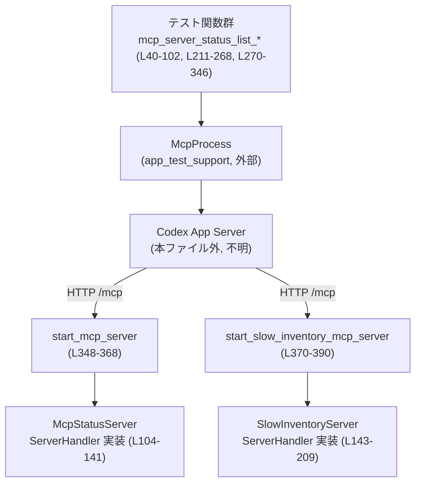
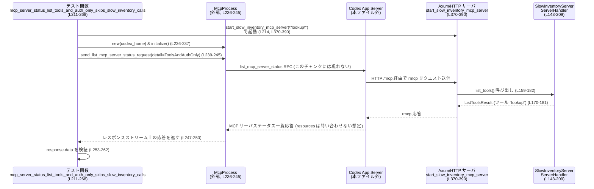

# app-server/tests/suite/v2/mcp_server_status.rs コード解説

## 0. ざっくり一言

MCP（Model Context Protocol）サーバのステータス一覧 APIに対して、  
ツール名・詳細レベル・名前の正規化（サニタイズ）周りの挙動を検証するための統合テストと、  
そのテスト用の簡易 MCP サーバ実装をまとめたファイルです。

---

## 1. このモジュールの役割

### 1.1 概要

- Codex アプリケーションサーバの `list_mcp_server_status` API が、  
  MCP サーバからのツール情報をどのように収集・整形して返すかを検証するテスト群です  
  （`mcp_server_status_list_*` の 3 テスト関数、L40-102, L211-268, L270-346）。
- テスト用の簡易 MCP サーバ実装として `McpStatusServer` と `SlowInventoryServer` を定義し、  
  `rmcp::handler::server::ServerHandler` を実装します（L104-141, L143-209）。
- Axum + rmcp の HTTP サーバを立ち上げる補助関数 `start_mcp_server` / `start_slow_inventory_mcp_server` を提供します（L348-368, L370-390）。

### 1.2 アーキテクチャ内での位置づけ

このファイル単体から見える主なコンポーネント関係を図示します。



- テスト関数は `McpProcess` を通じて Codex アプリケーションサーバ（実装はこのチャンクには現れません）に対し、  
  `list_mcp_server_status` RPC を送信します（L68-75, L239-245, L303-309）。
- Codex サーバは設定ファイル `config.toml` に記載された MCP サーバ URL に HTTP 接続します（設定追記は L55-63, L226-234, L287-298）。
- MCP サーバ URL はこのファイル内の `start_mcp_server` / `start_slow_inventory_mcp_server` で起動した Axum サーバ `/mcp` に向き、  
  その内部で `McpStatusServer` / `SlowInventoryServer` の `ServerHandler` 実装が実行されます（L348-368, L370-390）。

### 1.3 設計上のポイント

- **責務分割**
  - テストケースは「何を検証したいか」（ツール名の生値保持、遅い inventory 呼び出しのスキップ、名前サニタイズの衝突回避）に集中しています（L40-102, L211-268, L270-346）。
  - MCP サーバの振る舞いは `McpStatusServer` と `SlowInventoryServer` に切り出され、HTTP サーバ起動は `start_*` 関数に分離されています（L104-209, L348-390）。
- **状態管理**
  - テスト用サーバは共有状態としてツール名のみを `Arc<String>` で保持し、  
    `Clone` 可能な軽量なハンドラにしています（L104-107, L143-146, L351-357, L373-379）。
- **エラーハンドリング**
  - テスト関数の戻り値は `anyhow::Result<()>` で統一され、`?` 演算子で I/O やタイムアウトを伝播させ、テスト失敗として扱います（L40, L211, L270）。
  - rmcp ハンドラでは、JSON スキーマのパース失敗を `rmcp::ErrorData::internal_error` に変換して返します（L122-127, L164-168）。
- **並行性**
  - MCP テストサーバは `tokio::spawn` で非同期タスクとして起動し、  
    テスト終了時に `JoinHandle::abort` + `await` で中止・後始末を行っています（L98-99, L264-265, L340-343, L363-365, L385-387）。
  - 遅い処理（resource 関連）は `tokio::time::sleep` で 2 秒ブロックし、  
    テストでは短い `timeout` でそれが呼ばれない前提を検証しています（L184-195, L197-208, L247-250）。

---

## 2. 主要な機能一覧

- MCP サーバステータス一覧（`list_mcp_server_status`）の正常系テスト:
  - ツール名がサーバからの「生の名前」として保持されることの検証（L40-102）。
- 詳細レベル `ToolsAndAuthOnly` 時の挙動テスト:
  - resource 関連の遅い呼び出しがスキップされ、短いタイムアウト内にレスポンスが返ることの検証（L211-268）。
- サーバ名サニタイズ時の衝突回避テスト:
  - `some-server` と `some_server` のような名前の両方が区別され、それぞれのツールが保持されることの検証（L270-346）。
- テスト用 MCP サーバ実装:
  - ツール一覧のみを返すシンプルサーバ `McpStatusServer`（L104-141）。
  - ツール＋リソースを持つがリソース関連が遅い `SlowInventoryServer`（L143-209）。
- テスト用 MCP HTTP サーバ起動ユーティリティ:
  - `start_mcp_server` / `start_slow_inventory_mcp_server` による Axum + rmcp サーバの起動（L348-368, L370-390）。

---

## 3. 公開 API と詳細解説

このファイルはテスト用モジュールのため、「公開 API」は主にテスト自身とテスト用サーバ起動関数になります。

### 3.1 型一覧（構造体）

| 名前 | 種別 | 役割 / 用途 | 定義位置 |
|------|------|-------------|----------|
| `McpStatusServer` | 構造体 | 単一ツールを提供するシンプルな MCP サーバ。`ServerHandler` を実装し、`list_tools` にのみ対応します。 | `app-server/tests/suite/v2/mcp_server_status.rs:L104-107` |
| `SlowInventoryServer` | 構造体 | ツールに加えて inventory API（resources / resource_templates）も有効だが、それらを意図的に遅くするテスト用 MCP サーバ。 | `app-server/tests/suite/v2/mcp_server_status.rs:L143-146` |

両構造体とも、フィールドは `tool_name: Arc<String>` の 1 つのみです（L105-107, L144-146）。

### 3.2 関数詳細（重要度の高い 7 件）

#### `mcp_server_status_list_returns_raw_server_and_tool_names() -> Result<()>`

**概要**

- Codex アプリサーバの MCP サーバステータス一覧 API が、  
  MCP サーバで定義されたツール名を「生の名前」のまま返していることを検証する統合テストです（L40-102）。

**引数**

- 引数はありません（テスト関数、L41）。

**戻り値**

- `anyhow::Result<()>`  
  - 途中で発生した I/O・タイムアウト・RPC 変換などのエラーが `Err` として返り、テスト失敗となります（L40, L66-67, L74-75, L80-81）。

**内部処理の流れ**

1. **モック応答サーバと MCP サーバの起動**
   - `create_mock_responses_server_sequence_unchecked(Vec::new()).await` でモック応答サーバを起動します（L42）。
   - `start_mcp_server("look-up.raw").await?` でテスト用 MCP サーバ（`McpStatusServer` ベース）をポート 0 で起動し、URL と `JoinHandle` を取得します（L43, L348-368）。

2. **Codex 設定ファイルの生成と MCP サーバ登録**
   - `TempDir::new()?` で一時ディレクトリを作成し（L44）、  
     `write_mock_responses_config_toml` で基本の `config.toml` を生成します（L45-53）。
   - その後 `std::fs::read_to_string` で既存設定を読み込み（L55-56）、  
     TOML 文字列を追記して `[mcp_servers.some-server]` として MCP サーバ URL を登録します（L57-63）。

3. **McpProcess の起動と初期化**
   - `McpProcess::new(codex_home.path()).await?` でテスト用のクライアントプロセスを起動し（L65）、  
     `timeout(DEFAULT_READ_TIMEOUT, mcp.initialize()).await??` で 10 秒以内に初期化が完了することを確認します（L66-67, L38）。

4. **`list_mcp_server_status` リクエスト送信とレスポンス取得**
   - `send_list_mcp_server_status_request` に `ListMcpServerStatusParams { cursor: None, limit: None, detail: None }` を渡してリクエスト ID を取得します（L68-74）。
   - `timeout(DEFAULT_READ_TIMEOUT, mcp.read_stream_until_response_message(...)).await??` で、  
     10 秒以内にレスポンスメッセージが届くことを確認します（L75-79）。
   - `to_response` で JSON-RPC レスポンスを `ListMcpServerStatusResponse` にデコードします（L80）。

5. **アサーション**
   - ページングされていないこと（`next_cursor == None`）と、サーバ数が 1 件であることを確認します（L82-84）。
   - ステータス名が `some-server` であること（L85）。
   - ツールマップのキー集合が `{"look-up.raw"}` になっていること（L86-89）。
   - `tools["look-up.raw"].name == "look-up.raw"` であること（L90-96）。

6. **サーバ終了処理**
   - `mcp_server_handle.abort()` で MCP サーバタスクをキャンセルし（L98）、  
     `let _ = mcp_server_handle.await;` でタスク終了を待ちます（L99）。

**Examples（使用例）**

テストと同様のパターンで独自テストを書く場合の最小例です。

```rust
#[tokio::test]
async fn example_check_tool_names() -> anyhow::Result<()> {
    // テスト用 MCP サーバを起動する
    let (mcp_server_url, mcp_server_handle) =
        start_mcp_server("my_tool").await?; // L348-368

    // 省略: config.toml を作成し、[mcp_servers.my-server] に mcp_server_url を登録

    let mut mcp = McpProcess::new(/* codex_home */).await?; // L65
    timeout(DEFAULT_READ_TIMEOUT, mcp.initialize()).await??; // L66-67

    let request_id = mcp
        .send_list_mcp_server_status_request(ListMcpServerStatusParams {
            cursor: None,
            limit: None,
            detail: None,
        })
        .await?; // L68-74

    let response = timeout(
        DEFAULT_READ_TIMEOUT,
        mcp.read_stream_until_response_message(RequestId::Integer(request_id)),
    )
    .await??; // L75-79
    let response: ListMcpServerStatusResponse = to_response(response)?; // L80

    // 省略: response.data を検証

    mcp_server_handle.abort();
    let _ = mcp_server_handle.await;

    Ok(())
}
```

**Errors / Panics**

- `TempDir::new`・`read_to_string`・`write`・TCP bind 等で OS / I/O エラーが発生すると `Err(anyhow::Error)` でテストが失敗します（L43-45, L55-63, L348-350）。
- MCP/アプリサーバ初期化やレスポンス待ちでタイムアウトが発生すると `tokio::time::error::Elapsed` が `Err` として伝播します（L66-67, L75-79）。
- `to_response` によるデコードが失敗した場合も `Err` となります（L80）。

**Edge cases（エッジケース）**

- MCP サーバが起動できない（ポート確保失敗など）場合は `start_mcp_server` 内で `?` によりテストが即座に失敗します（L348-350）。
- MCP サーバが `list_tools` にツールを返さない実装だった場合、このテストの assertion（ツール集合が `{"look-up.raw"}`）は失敗します（L86-89）。
- Codex サーバ側の設定や実装で `list_mcp_server_status` が無効な場合、RPC 送信・レスポンス取得でエラーとなる可能性がありますが、  
  その詳細はこのチャンクには現れません。

**使用上の注意点**

- 実行には Tokio ランタイムが必要であり、テスト関数には `#[tokio::test]` 属性が付いています（L40）。
- テスト中に起動した MCP サーバは必ず `abort` + `await` で停止させる必要があります。  
  そうしないと、バックグラウンドタスクが残り、後続テストに影響する可能性があります（L98-99）。
- `DEFAULT_READ_TIMEOUT` よりも処理時間が長くなるような変更を Codex 側に行うと、テストがタイムアウトで失敗する点に注意が必要です（L38, L75-79）。

---

#### `mcp_server_status_list_tools_and_auth_only_skips_slow_inventory_calls() -> Result<()>`

**概要**

- MCP サーバステータス一覧 API に `detail: Some(McpServerStatusDetail::ToolsAndAuthOnly)` を指定した場合、  
  MCP サーバの遅い inventory API（`list_resources` / `list_resource_templates`）が呼び出されず、  
  短いタイムアウト内にレスポンスが返ることを検証するテストです（L211-268）。

**引数**

- なし（テスト関数、L212）。

**戻り値**

- `anyhow::Result<()>`（L211）。

**内部処理の流れ**

全体構造は前述のテストとほぼ同じですが、以下が特徴です。

1. **SlowInventoryServer を起動**
   - `start_slow_inventory_mcp_server("lookup").await?` で遅い inventory API を持つ MCP サーバを起動します（L214, L370-390）。

2. **Codex 設定・McpProcess 初期化**
   - `config.toml` への MCP サーバ登録（L226-234）、`McpProcess` の初期化（L236-237）は前テストと同様です。

3. **detail: ToolsAndAuthOnly を指定**
   - `ListMcpServerStatusParams` の `detail` フィールドに `Some(McpServerStatusDetail::ToolsAndAuthOnly)` を指定します（L239-245）。

4. **短いタイムアウトでレスポンス待ち**
   - タイムアウト値に `Duration::from_millis(500)` を指定し（L247-248）、  
     `read_stream_until_response_message` が 500ms 以内に完了することを期待します（L247-250）。
   - 一方で `SlowInventoryServer` の `list_resources` / `list_resource_templates` は 2 秒 sleep する実装です（L184-195, L197-208）。  
     もし Codex サーバがこれらを呼んでいた場合、500ms 以内のレスポンスは難しく、テストはタイムアウトで落ちる想定です。

5. **結果検証**
   - `tools` に `lookup` というツールのみが存在すること（L257-260）。
   - `resources` と `resource_templates` がいずれも `Vec::new()`（空）で返ること（L261-262）。  
     これは Codex サーバ側が inventory API を呼んでいない、または結果を返さない形で実装されていることの間接的な確認になります。

6. **サーバ終了**
   - `mcp_server_handle.abort();` と `await` で MCP サーバを停止します（L264-265）。

**Edge cases / 注意点**

- Codex サーバの実装変更により、`ToolsAndAuthOnly` でも inventory API を呼び出すようになった場合、  
  このテストはタイムアウトや `resources` 非空などで失敗します。
- 環境が極端に遅く、500ms 以内にツール一覧が取得できない場合もテストが失敗します。  
  タイムアウト値はテスト環境の性能に依存しており、そこが潜在的な脆弱ポイントです（L247-248）。

---

#### `mcp_server_status_list_keeps_tools_for_sanitized_name_collisions() -> Result<()>`

**概要**

- MCP サーバ名のサニタイズ処理（`-` と `_` など）が行われる際に、  
  `some-server` と `some_server` の 2 サーバが同時に存在しても、それぞれのツール情報が失われないことを検証するテストです（L270-346）。

**内部処理のポイント**

1. **2 つの MCP サーバ起動**
   - `start_mcp_server("dash_lookup")` と `start_mcp_server("underscore_lookup")` をそれぞれ起動し、  
     異なるツール名を持つ 2 つの MCP サーバを用意します（L273-275）。

2. **設定ファイルへの 2 エントリ追加**
   - `[mcp_servers.some-server]` と `[mcp_servers.some_server]` の 2 セクションを TOML 文字列に追記します（L289-297）。
   - これにより、Codex サーバは両方の MCP サーバを別名として認識する前提になります。

3. **`list_mcp_server_status` の呼び出し**
   - `detail: None` でステータス一覧を取得し（L303-309）、  
     `response.data.len() == 2` を確認します（L317-318）。

4. **名前とツール集合のマッピング検証**
   - `response.data` を `(status.name, ツール名集合)` の `BTreeMap` に変換し（L319-328）、  
     期待値 `{
       "some-server" => {"dash_lookup"},
       "some_server" => {"underscore_lookup"}
     }` と一致することを確認します（L330-337）。

**Contracts / 安全性**

- ファイル内の MCP サーバ名と設定ファイルのセクション名が 1:1 で対応していることがテストの前提です。  
  これが変わるとテストロジックも更新が必要です（L273-275, L291-295）。
- 両 MCP サーバの `JoinHandle` は最後に必ず `abort` + `await` で停止されています（L340-343）。

---

#### `McpStatusServer::list_tools(...) -> Result<ListToolsResult, rmcp::ErrorData>`

**概要**

- 単一ツールを返す `list_tools` 実装です。  
  テスト用 MCP サーバが Codex サーバに対しどのようなツール一覧を提供するかを定義します（L117-140）。

**引数**

| 引数名 | 型 | 説明 |
|--------|----|------|
| `_request` | `Option<rmcp::model::PaginatedRequestParams>` | ページングパラメータ。テストでは使用していません（L118-120）。 |
| `_context` | `rmcp::service::RequestContext<rmcp::service::RoleServer>` | リクエストコンテキスト。テストでは使用していません（L120）。 |

**戻り値**

- `Result<ListToolsResult, rmcp::ErrorData>`  
  - 成功時は `ListToolsResult { tools: vec![tool], next_cursor: None, meta: None }` を返します（L135-139）。
  - 失敗時は JSON スキーマ変換エラーをラップした `rmcp::ErrorData` を返します（L122-127）。

**内部処理の流れ**

1. JSON スキーマを `JsonObject` に変換（L122-126）。
2. `Tool::new` により、`self.tool_name` と固定の説明 `"Look up test data."` を持つツールを作成（L128-132）。
3. `tool.annotations` に `read_only(true)` を設定（L133）。
4. 単一ツールを `tools: vec![tool]` として `ListToolsResult` を返却（L135-139）。

**使用上の注意点**

- `tool_name` は `Arc<String>` で共有されているため、`Cow::Owned(self.tool_name.as_ref().clone())` で `String` を複製しています（L128-130）。  
  これにより、ハンドラが複数同時実行されてもデータ競合は発生しません。
- スキーマの JSON は固定で、入力を取らないツール（空オブジェクトのみ許容）となっています（L122-125）。

---

#### `SlowInventoryServer::list_tools(...) -> Result<ListToolsResult, rmcp::ErrorData>`

**概要**

- `McpStatusServer::list_tools` とほぼ同一の実装で、ツール名だけが異なる可能性があるバリアントです（L159-182）。  
  `ToolsAndAuthOnly` テストで使われる MCP サーバのツール一覧を提供します。

**補足**

- 実装詳細・エラー処理・スキーマ内容は `McpStatusServer::list_tools` と同型です（L164-181）。
- `SlowInventoryServer` 側では `get_info` で `enable_resources()` も有効にしていることが異なります（L151-154）。

---

#### `start_mcp_server(tool_name: &str) -> Result<(String, JoinHandle<()>)>`

**概要**

- `McpStatusServer` を使ったテスト用 MCP HTTP サーバ（rmcp + Axum）の起動ユーティリティです（L348-368）。

**引数**

| 引数名 | 型 | 説明 |
|--------|----|------|
| `tool_name` | `&str` | MCP サーバが `list_tools` で返すツール名。`McpStatusServer` の `tool_name` フィールドに格納されます（L351-357）。 |

**戻り値**

- `Result<(String, JoinHandle<()>)>`  
  - `Ok((base_url, handle))` を返します。`base_url` は `"http://{addr}"` 形式のサーバ URL、`handle` は Axum サーバタスクの `JoinHandle` です（L367-367）。

**内部処理の流れ**

1. `TcpListener::bind("127.0.0.1:0").await?` でローカルホストの空きポートにバインドします（L349）。
2. `listener.local_addr()?` で実際のアドレス（ポート含む）を取得します（L350）。
3. `tool_name` を `Arc<String>` に包み、閉包で `McpStatusServer { tool_name: Arc::clone(&tool_name) }` を生成するファクトリを作成します（L351-357）。
4. `StreamableHttpService::new` にハンドラファクトリ、`LocalSessionManager::default()`、`StreamableHttpServerConfig::default()` を渡して rmcp サービスを作成します（L352-360）。
5. `Router::new().nest_service("/mcp", mcp_service)` で `/mcp` パスにサービスをネストした Axum ルータを構築します（L361）。
6. `tokio::spawn(async move { axum::serve(listener, router).await })` で HTTP サーバタスクを起動し、`JoinHandle` を取得します（L363-365）。
7. ベース URL 文字列とハンドルをタプルで返します（L367）。

**Examples**

テスト以外で単独にサーバを起動する最小例です。

```rust
#[tokio::main]
async fn main() -> anyhow::Result<()> {
    let (url, handle) = start_mcp_server("example_tool").await?; // L348-368
    println!("MCP server running at {url}/mcp");

    // 実際のコードでは適宜 handle.abort() / await で終了させる
    handle.abort();
    let _ = handle.await;

    Ok(())
}
```

**Errors / Edge cases**

- ポートバインド・ローカルアドレス取得に失敗すると `Err(anyhow::Error)` として上位に伝播します（L349-350）。
- `axum::serve` 内部でのエラーは `let _ = axum::serve(...)` によって無視されています（L364-365）。  
  サーバタスクは終了しますが、その理由はこの関数の戻り値からは分かりません。

**使用上の注意点**

- 戻り値の `JoinHandle` は呼び出し側で必ず保持し、適切なタイミングで `abort` なりを行う必要があります（テストでの例: L98-99, L264-265, L340-343）。
- サーバは `127.0.0.1` にのみバインドされるため、テスト環境以外からのアクセスはできません（L349）。  
  セキュリティ上の影響は限定的です。

---

#### `start_slow_inventory_mcp_server(tool_name: &str) -> Result<(String, JoinHandle<()>)>`

**概要**

- `start_mcp_server` の `SlowInventoryServer` 版です。  
  resources 関連 API が遅い MCP サーバを起動するために使用されます（L370-390）。

**違い**

- ハンドラファクトリとして `SlowInventoryServer` を生成している点だけが異なり、  
  それ以外のフローは `start_mcp_server` と同一です（L373-379）。

---

### 3.3 その他の関数

| 関数名 | 役割 / 用途 | 位置 |
|--------|-------------|------|
| `McpStatusServer::get_info(&self) -> ServerInfo` | MCP サーバの capabilities として tools を有効化した `ServerInfo` を返します（L110-115）。 | `app-server/tests/suite/v2/mcp_server_status.rs:L110-115` |
| `SlowInventoryServer::get_info(&self) -> ServerInfo` | tools と resources を有効化した `ServerInfo` を返します（L149-157）。 | `app-server/tests/suite/v2/mcp_server_status.rs:L149-157` |
| `SlowInventoryServer::list_resources(...) -> Result<ListResourcesResult, rmcp::ErrorData>` | 2 秒 sleep した後、空の resources を返します。ToolsAndAuthOnly テストで「呼ばれないはずの遅い API」として使われます（L184-195）。 | `app-server/tests/suite/v2/mcp_server_status.rs:L184-195` |
| `SlowInventoryServer::list_resource_templates(...) -> Result<ListResourceTemplatesResult, rmcp::ErrorData>` | 上記と同様に 2 秒 sleep 後、空の resource_templates を返します（L197-208）。 | `app-server/tests/suite/v2/mcp_server_status.rs:L197-208` |

---

## 4. データフロー

### 4.1 代表的なシナリオ：ToolsAndAuthOnly でのステータス取得

`mcp_server_status_list_tools_and_auth_only_skips_slow_inventory_calls` におけるデータフローを示します（L211-268）。



- 重要な点は、`SlowInventoryServer` には遅い `list_resources` / `list_resource_templates` が実装されているものの（L184-195, L197-208）、  
  `ToolsAndAuthOnly` の指定により Codex サーバがこれらを呼び出さないため、500ms のタイムアウト内にレスポンスが返る、という仮定です（L247-250）。

---

## 5. 使い方（How to Use）

このファイルはテスト専用ですが、`start_*` 関数や `ServerHandler` 実装の使い方は、  
他の統合テストを追加する際の参考になります。

### 5.1 基本的な使用方法

典型的なフローは次のようになります。

```rust
#[tokio::test]
async fn example_end_to_end() -> anyhow::Result<()> {
    // 1. テスト用 MCP サーバを起動
    let (mcp_url, mcp_handle) = start_mcp_server("test_tool").await?; // L348-368

    // 2. 一時ディレクトリに Codex 設定を書き出し、MCP サーバを登録
    let codex_home = tempfile::TempDir::new()?;
    write_mock_responses_config_toml(
        codex_home.path(),
        /* モック応答サーバ URL */ "http://127.0.0.1:12345",
        &BTreeMap::new(),
        1024,
        None,
        "mock_provider",
        "compact",
    )?;
    // TOML 文字列追記で [mcp_servers.your-server] を追加する (L55-63 相当)

    // 3. McpProcess を起動・初期化
    let mut mcp = McpProcess::new(codex_home.path()).await?;
    timeout(DEFAULT_READ_TIMEOUT, mcp.initialize()).await??; // L66-67

    // 4. list_mcp_server_status を呼び出し
    let request_id = mcp
        .send_list_mcp_server_status_request(ListMcpServerStatusParams {
            cursor: None,
            limit: None,
            detail: None,
        })
        .await?; // L68-74

    let response = timeout(
        DEFAULT_READ_TIMEOUT,
        mcp.read_stream_until_response_message(RequestId::Integer(request_id)),
    )
    .await??; // L75-79
    let response: ListMcpServerStatusResponse = to_response(response)?; // L80

    // 5. 結果を検証
    assert!(!response.data.is_empty());

    // 6. MCP サーバを停止
    mcp_handle.abort();
    let _ = mcp_handle.await;

    Ok(())
}
```

### 5.2 よくある使用パターン

- **ツールのみの MCP サーバを使うテスト**
  - `start_mcp_server` + `McpStatusServer` の組み合わせ（L348-368, L104-141）。
  - ツール定義を増やしたい場合は `McpStatusServer::list_tools` 内を拡張します（L128-139）。

- **遅い inventory を持つ MCP サーバを使うテスト**
  - `start_slow_inventory_mcp_server` + `SlowInventoryServer` の組み合わせ（L370-390, L143-209）。
  - Codex 側のタイムアウト処理や詳細レベルによる分岐をテストするのに適しています（L211-268）。

### 5.3 よくある間違い

```rust
// 間違い例: MCP サーバの JoinHandle を無視している
let (_url, _handle) = start_mcp_server("tool").await?;
// テスト終了時に abort/await せず終了 → バックグラウンドタスクが残る可能性

// 正しい例: ハンドルを保持して終了時に中止する
let (url, handle) = start_mcp_server("tool").await?;
println!("MCP server running at {url}");
// ...
handle.abort();
let _ = handle.await;
```

```rust
// 間違い例: detail を指定せずに "ToolsAndAuthOnly" 相当の挙動を期待する
let request_id = mcp
    .send_list_mcp_server_status_request(ListMcpServerStatusParams {
        cursor: None,
        limit: None,
        detail: None, // ← inventory API が呼ばれる可能性がある
    })
    .await?;

// 正しい例: ToolsAndAuthOnly を指定して inventory 呼び出しを抑制
let request_id = mcp
    .send_list_mcp_server_status_request(ListMcpServerStatusParams {
        cursor: None,
        limit: None,
        detail: Some(McpServerStatusDetail::ToolsAndAuthOnly), // L239-245
    })
    .await?;
```

### 5.4 使用上の注意点（まとめ）

- **Tokio ランタイム前提**  
  すべての非同期関数（テスト・`start_*`・ServerHandler メソッド）は Tokio 上で動作する前提になっています（L40, L211, L270, L348, L370）。
- **テストの安定性**  
  - タイムアウト値（10 秒 / 500ms）は環境依存であり、極端に遅い環境では偽陽性（テスト失敗）が起こる可能性があります（L38, L247-248）。
  - 遅延を利用したテスト（`SlowInventoryServer`）では特に、実行環境の性能を考慮する必要があります（L184-195, L197-208）。
- **セキュリティ**  
  - サーバは `127.0.0.1` のみでリッスンし、テスト時にだけ起動されるため、  
    外部からのアクセスや認証情報の漏洩リスクは低い構成になっています（L349, L371）。
- **拡張時の契約**  
  - `McpStatusServer` / `SlowInventoryServer` に API を追加する場合、`ServerInfo::capabilities` の整合性を保つ必要があります（L110-115, L149-157）。  
    例：`enable_resources()` を削除したのに `list_resources` を実装し続けると、Codex 側が呼ばない可能性があります。

---

## 6. 変更の仕方（How to Modify）

### 6.1 新しい機能を追加する場合

- **新しい MCP サーバ種別を追加したい場合**
  1. `SlowInventoryServer` と同様に、新しい構造体を定義し（L143-146 を参考）、`ServerHandler` を実装します（L148-209）。
  2. それを生成する `start_*` 関数を追加し、`TcpListener` + `StreamableHttpService::new` + Axum ルータのパターンを踏襲します（L348-368, L370-390）。
  3. 新テストで `start_new_mcp_server` を呼び、`config.toml` に `[mcp_servers.*]` セクションを追加する形で Codex に登録します（L55-63, L226-234, L287-298）。

- **既存テストに新しい検証項目を追加したい場合**
  - `response.data` の他フィールド（auth 情報など）を検証したい場合、  
    まず `ListMcpServerStatusResponse` の構造を確認し、このチャンクにないフィールドについては別の MCP サーバ実装またはモックを用意する必要があります。

### 6.2 既存の機能を変更する場合

- **`McpStatusServer` / `SlowInventoryServer` のツール定義を変更する**
  - 影響範囲:
    - ツール名変更 → 3 つのテストのアサーション（ツール集合・ツール名）をすべて更新する必要があります（L86-89, L257-260, L332-336）。
  - 注意点:
    - Codex 側の挙動が変わらないこと（例えばツール名の正規化ルール）がテストの前提になっているため、  
      そちらを変更する場合はテスト仕様も見直す必要があります。

- **遅延時間（2 秒）を変更する**
  - `SlowInventoryServer` の `sleep(Duration::from_secs(2))` を短くする場合、  
    `ToolsAndAuthOnly` テストの意義が薄くなる可能性があります（L189, L202）。
  - 長くする場合、テスト全体の実行時間が増加します。

- **タイムアウト値を変更する**
  - `DEFAULT_READ_TIMEOUT` や 500ms タイムアウトを変更する場合、  
    Codex サーバおよび MCP サーバの処理時間とバランスを取る必要があります（L38, L247-248）。

---

## 7. 関連ファイル

このファイルと密接に関係する（が、このチャンクには現れない）コンポーネント例です。

| パス / コンポーネント | 役割 / 関係 |
|-----------------------|------------|
| `app_test_support::McpProcess` | Codex アプリケーションサーバとの通信や初期化を行うテスト用ヘルパ。`send_list_mcp_server_status_request` や `read_stream_until_response_message` がこのファイルのテストから呼ばれます（L65-75, L236-245, L300-309）。|
| `app_test_support::write_mock_responses_config_toml` | 一時ディレクトリに Codex 用の `config.toml` を生成し、モック応答サーバの設定を書き込む関数です（L45-53, L216-224, L277-285）。|
| `app_test_support::create_mock_responses_server_sequence_unchecked` | モック応答サーバを起動し、その `uri()` が Codex 設定に書き込まれます（L42, L213, L272）。|
| `codex_app_server_protocol::{ListMcpServerStatusParams, ListMcpServerStatusResponse, McpServerStatusDetail}` | テスト対象の RPC インターフェース定義。パラメータ・レスポンス構造はこのファイル外で定義されています（L13-16, L69-73, L239-245, L303-307）。|
| `rmcp::handler::server::ServerHandler` | MCP サーバ側のハンドラインターフェース。`McpStatusServer` と `SlowInventoryServer` がこれを実装します（L18, L109-141, L148-209）。|

このチャンクでは Codex アプリケーションサーバ本体の実装は見えていませんが、  
`McpProcess` と設定ファイルを介して、MCP サーバステータス一覧 API の外部仕様をテストする構造になっています。
