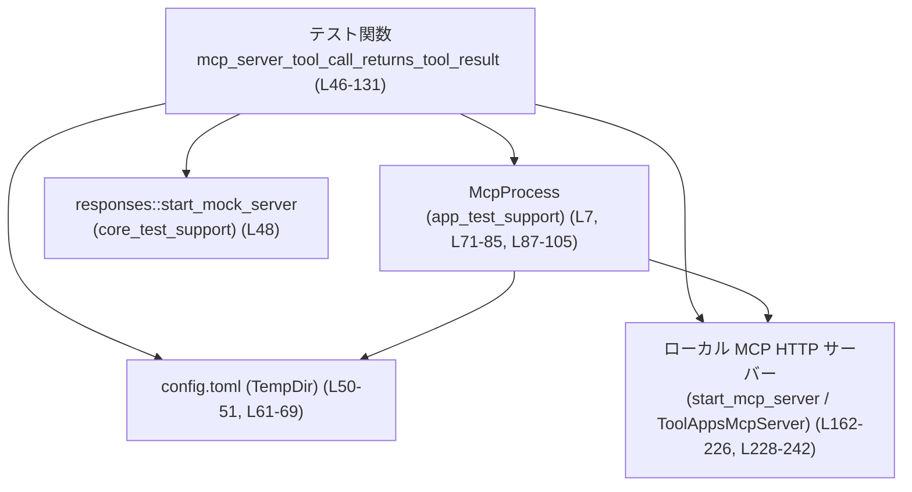
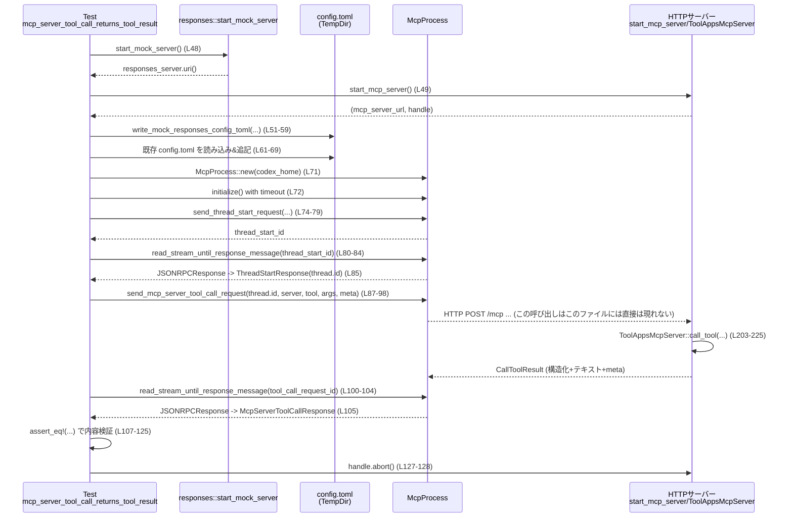

# app-server/tests/suite/v2/mcp_tool.rs コード解説

## 0. ざっくり一言

`McpProcess` を使ってアプリサーバー経由で MCP ツールを呼び出し、その結果が期待どおりに返ってくること／不正なスレッド ID ではエラーになることを検証する統合テストと、そのためのテスト用 MCP サーバー実装です（`ToolAppsMcpServer`）。  
（app-server/tests/suite/v2/mcp_tool.rs:L46-243）

---

## 1. このモジュールの役割

### 1.1 概要

このファイルは次の問題を検証するために存在します。

- **問題**: Codex アプリサーバーから外部 MCP サーバーのツール呼び出しを行う経路が正しく動作しているかどうか。
- **提供機能**:
  - 正常系: ツール `echo_tool` を呼び出したときのレスポンス内容（テキスト・構造化コンテンツ・メタ情報）が期待どおりであることの検証（L46-131）。
  - 異常系: 存在しない `thread_id` で MCP ツール呼び出しをすると JSON-RPC エラーになることの検証（L133-160）。
  - これらを行うためのテスト専用 MCP サーバー `ToolAppsMcpServer` とローカル HTTP サーバー起動ヘルパー（L162-243）。

### 1.2 アーキテクチャ内での位置づけ

主なコンポーネントと依存関係は以下のようになっています。

- テストコード（このファイル）が入口です（L46-160）。
- Codex アプリサーバープロセスを `McpProcess` 経由で起動・制御します（L7, L71-72, L135-137）。
- テスト専用 MCP サーバー `ToolAppsMcpServer` を HTTP 経由で公開します（L162-226, L228-242）。
- `write_mock_responses_config_toml` と設定ファイル書き換えにより、アプリサーバーに対してレスポンスモックサーバーと MCP サーバーの URL を教えます（L51-59, L61-69）。
- これらは Tokio の非同期ランタイム上で並行動作します（L38-40, L46, L133, L228-240）。



この図では、テスト関数がモックレスポンスサーバー、設定ファイル、ローカル MCP サーバー、`McpProcess` を組み合わせて、アプリサーバー経由の MCP ツール呼び出し経路を検証していることを示しています。

### 1.3 設計上のポイント

- **テスト専用のローカル MCP サーバー**  
  - `ToolAppsMcpServer` が `rmcp::handler::server::ServerHandler` を実装し、ツール一覧とツール呼び出しのロジックを持ちます（L162-226）。
- **設定ファイルベースの結合**  
  - `TempDir` に生成された `config.toml` に、MCP サーバーの URL を書き足してアプリサーバーと疎結合に連携します（L50-51, L61-69）。
- **非同期・並行実行**  
  - テストは `#[tokio::test]` で非同期に実行され、`start_mcp_server` は別タスクで HTTP サーバーを起動します（L46, L133, L228-240）。
  - MCP プロセスとの I/O は `tokio::time::timeout` でタイムアウトを設けており、ハングを防ぐ設計です（L72, L80-84, L100-104, L137-138, L148-152）。
- **エラーハンドリング**  
  - テスト関数は `anyhow::Result<()>` を返し、`?` 演算子で I/O や JSON-RPC 関連のエラーをそのままテスト失敗として扱います（L46, L133）。
  - MCP サーバー側の `list_tools` は JSON スキーマ生成に失敗した場合に `rmcp::ErrorData::internal_error` を返します（L178-187）。
  - MCP サーバー側の `call_tool` はツール名が一致しない場合に `assert_eq!` によりパニックする仕様です（L208）。

---

## 2. 主要な機能一覧（コンポーネントインベントリー）

このファイルに現れる主要コンポーネントと役割の一覧です。

### 関数・テスト関数

| 名前 | 種別 | 定義位置 | 役割 / 用途 |
|------|------|----------|-------------|
| `mcp_server_tool_call_returns_tool_result` | 非同期テスト関数 (`#[tokio::test]`) | app-server/tests/suite/v2/mcp_tool.rs:L46-131 | 正常系: MCP ツール `echo_tool` 呼び出し結果の内容を検証する統合テスト。 |
| `mcp_server_tool_call_returns_error_for_unknown_thread` | 非同期テスト関数 (`#[tokio::test]`) | app-server/tests/suite/v2/mcp_tool.rs:L133-160 | 異常系: 存在しない `thread_id` で MCP ツールを呼び出した際のエラーメッセージを検証。 |
| `ToolAppsMcpServer::get_info` | trait メソッド | app-server/tests/suite/v2/mcp_tool.rs:L166-171 | MCP サーバーの機能情報を返し、ツール機能が有効であることを表明。 |
| `ToolAppsMcpServer::list_tools` | 非同期 trait メソッド | app-server/tests/suite/v2/mcp_tool.rs:L173-201 | 提供ツール `echo_tool` のメタデータ・入力スキーマを返す。 |
| `ToolAppsMcpServer::call_tool` | 非同期 trait メソッド | app-server/tests/suite/v2/mcp_tool.rs:L203-225 | ツール `echo_tool` の呼び出しを処理し、メッセージをエコーする結果を生成。 |
| `start_mcp_server` | 非同期ヘルパー関数 | app-server/tests/suite/v2/mcp_tool.rs:L228-243 | ローカルホスト上に `ToolAppsMcpServer` を公開する HTTP サーバーを起動し、URL と `JoinHandle` を返す。 |

### 構造体

| 名前 | 種別 | 定義位置 | 役割 / 用途 |
|------|------|----------|-------------|
| `ToolAppsMcpServer` | 構造体 (`#[derive(Clone, Default)]`) | app-server/tests/suite/v2/mcp_tool.rs:L162-163 | `rmcp::handler::server::ServerHandler` を実装する、テスト用の MCP サーバー。 |

---

## 3. 公開 API と詳細解説

このファイルはテスト用バイナリであり `pub` な API はありませんが、テストシナリオの中心となる関数・メソッドを「公開 API 相当」として解説します。

### 3.1 型一覧（構造体）

| 名前 | 種別 | 定義位置 | 役割 / 用途 |
|------|------|----------|-------------|
| `ToolAppsMcpServer` | 構造体 | app-server/tests/suite/v2/mcp_tool.rs:L162-163 | MCP ツール一覧・ツール呼び出しを提供するテスト用サーバー。`ServerHandler` トレイトを実装。 |

---

### 3.2 関数詳細

#### `async fn mcp_server_tool_call_returns_tool_result() -> Result<()>`

**定義位置**  
app-server/tests/suite/v2/mcp_tool.rs:L46-131

**概要**

- Codex アプリサーバー経由で MCP ツール `echo_tool` を呼び出したときのレスポンス内容が期待どおりであることを検証する統合テストです（L46-47）。
- MCP サーバーとレスポンスモックサーバーをローカルで起動し、設定ファイル経由でアプリサーバーに認識させます（L48-69）。

**引数**

- なし（テスト関数のため）。

**戻り値**

- `anyhow::Result<()>`（L46）  
  - テスト中のいずれかの処理でエラー (`Err`) が発生した場合はそのまま伝播し、テスト失敗になります。
  - 正常にすべてのアサーションを通過した場合は `Ok(())` を返します（L130）。

**内部処理の流れ**

1. レスポンスモックサーバーと MCP サーバーを起動  
   - `responses::start_mock_server()` でモック HTTP サーバーを起動（L48）。  
   - `start_mcp_server().await?` でローカル MCP HTTP サーバーを起動し、URL と `JoinHandle` を取得（L49）。
2. 一時ディレクトリと設定ファイルの準備  
   - `TempDir::new()?` で一時ディレクトリ `codex_home` を作成（L50）。  
   - `write_mock_responses_config_toml` を用いて、モックレスポンスサーバーの設定を書き込み（L51-59）。  
   - `config.toml` を読み込み、`[mcp_servers.tool_server]` セクションと URL を追記して再度書き込み（L61-69）。
3. MCP プロセスの起動と初期化  
   - `McpProcess::new(codex_home.path()).await?` でアプリサーバーを起動（L71）。  
   - `timeout(DEFAULT_READ_TIMEOUT, mcp.initialize()).await??;` で初期化完了を待機（L72）。
4. スレッド開始リクエスト  
   - `send_thread_start_request` で新規スレッド開始を要求（L74-79）。  
   - `read_stream_until_response_message` で該当する JSON-RPC レスポンスを待機し（L80-84）、`ThreadStartResponse` に変換（L85）。  
   - 得られた `thread.id` を後続のツール呼び出しに利用（L85-89）。
5. MCP サーバーツール呼び出し  
   - `send_mcp_server_tool_call_request` で MCP サーバー `tool_server` のツール `echo_tool` を、引数 `{"message": "hello from app"}` とメタ `{"source": "mcp-app"}` 付きで呼び出す（L87-98）。  
   - `read_stream_until_response_message` でツール呼び出しの JSON-RPC レスポンスを待機（L100-104）。  
   - `McpServerToolCallResponse` に変換（L105）。
6. レスポンス内容の検証  
   - `content` が 1 要素のテキスト (`type == "text"`) であり、中身が `"echo: hello from app"` であることを確認（L107-112）。  
   - `structured_content` が `{"echoed": "hello from app"}` であること（L113-118）。  
   - `is_error == Some(false)` であること（L119）。  
   - `meta` が `{"calledBy": "mcp-app"}` を持つこと（L120-125）。
7. MCP サーバーの停止と終了  
   - `mcp_server_handle.abort();` で HTTP サーバータスクを停止要求（L127）。  
   - `let _ = mcp_server_handle.await;` でタスクの終了を待機（L128）。  
   - `Ok(())` を返す（L130）。

**Examples（使用例）**

以下は、同様の統合テストを書くときの最小パターンの例です（実際にはこのファイル自身が具体例です）。

```rust
#[tokio::test(flavor = "multi_thread", worker_threads = 2)] // マルチスレッド Tokio ランタイムで実行
async fn test_tool_call_example() -> anyhow::Result<()> {   // anyhow::Result<()> でエラーを伝播
    let (_url, handle) = start_mcp_server().await?;         // テスト用 MCP サーバーを起動し、URL とハンドルを取得

    let codex_home = tempfile::TempDir::new()?;             // 一時ディレクトリを作成
    // ... config.toml を整備して MCP サーバー URL を追記する ...

    let mut mcp = McpProcess::new(codex_home.path()).await?; // MCP プロセス（アプリサーバー）を起動
    tokio::time::timeout(DEFAULT_READ_TIMEOUT, mcp.initialize()).await??; // 初期化完了を待つ

    // スレッド開始リクエストを送り、ID を取得
    let thread_start_id = mcp.send_thread_start_request(ThreadStartParams::default()).await?;
    let resp: JSONRPCResponse =
        tokio::time::timeout(DEFAULT_READ_TIMEOUT,
            mcp.read_stream_until_response_message(RequestId::Integer(thread_start_id))
        ).await??;
    let ThreadStartResponse { thread, .. } = to_response(resp)?; // スレッド情報を取り出す

    // MCP ツール呼び出しリクエストを送る
    let request_id = mcp.send_mcp_server_tool_call_request(McpServerToolCallParams {
        thread_id: thread.id,                                 // 先ほど取得した thread_id
        server: TEST_SERVER_NAME.to_string(),                 // "tool_server"
        tool: TEST_TOOL_NAME.to_string(),                     // "echo_tool"
        arguments: Some(serde_json::json!({ "message": "hi" })), // 引数を JSON で指定
        meta: None,                                           // 任意のメタ情報
    }).await?;

    // レスポンスを待ち、結果を検証
    let resp: JSONRPCResponse =
        tokio::time::timeout(DEFAULT_READ_TIMEOUT,
            mcp.read_stream_until_response_message(RequestId::Integer(request_id))
        ).await??;
    let tool_resp: McpServerToolCallResponse = to_response(resp)?; // 結果型に変換

    assert!(!tool_resp.is_error.unwrap_or(true));            // is_error が false であることを確認

    handle.abort();                                          // サーバータスクを停止
    let _ = handle.await;                                    // タスク終了を待つ
    Ok(())                                                   // テスト成功
}
```

**Errors / Panics**

- **タイムアウト**  
  - `tokio::time::timeout` がタイムアウトすると `Elapsed` エラーになり、`?` によってテスト全体が `Err` で終了します（L72, L80-84, L100-104）。
- **外部処理のエラー伝播**  
  - ファイル I/O (`std::fs::read_to_string`, `std::fs::write`)、`TempDir::new`、`McpProcess::new` などで発生したエラーも `?` によりそのままテスト失敗になります（L50-52, L61-63, L69, L71）。
- **パニック**  
  - この関数内では明示的な `panic!` や `assert!` は使用されていません。  
  - ただし、呼び出し先（例: `ToolAppsMcpServer::call_tool` の `assert_eq!`（L208））でパニックする可能性はあります。

**Edge cases（エッジケース）**

- MCP サーバーが起動できない（ポート確保失敗など）の場合  
  - `start_mcp_server().await?` が `Err` を返し、テストは即座に失敗します（L49）。
- MCP プロセスが応答しない場合  
  - `timeout` による待機がタイムアウトし、`Err` でテスト終了となります（L72, L80-84, L100-104）。
- MCP サーバーのレスポンス形式が期待と異なる場合  
  - `to_response` での変換や後続の `assert_eq!` が失敗し、テストはパニックになります（L85, L105-125）。

**使用上の注意点**

- `McpProcess` への要求送信前に必ず `initialize` を完了させる必要があります（L71-72）。  
- テスト終了時に `mcp_server_handle.abort()` と `await` によるクリーンアップを行っており（L127-128）、新たなテストを追加する際も同様のパターンを守るとリソースリークを防げます。  
- ネットワーク I/O とプロセス起動が含まれるため、実行環境が遅い場合は `DEFAULT_READ_TIMEOUT`（L42）を見直す必要があるかもしれません。

---

#### `async fn mcp_server_tool_call_returns_error_for_unknown_thread() -> Result<()>`

**定義位置**  
app-server/tests/suite/v2/mcp_tool.rs:L133-160

**概要**

- 存在しない `thread_id` で MCP サーバーツール呼び出しを行った場合に、アプリサーバーが JSON-RPC エラーを返すことを検証するテストです（L133-147）。

**引数**

- なし。

**戻り値**

- `anyhow::Result<()>`（L133）。

**内部処理の流れ**

1. `TempDir` と `McpProcess` の準備  
   - 一時ディレクトリ `codex_home` を作成（L135）。  
   - `McpProcess::new` で MCP プロセスを起動（L136）。  
   - `mcp.initialize()` を `timeout` 付きで実行（L137）。
2. 不正な `thread_id` を指定した MCP ツール呼び出し  
   - `send_mcp_server_tool_call_request` で、全ゼロの UUID 形式文字列 `"00000000-0000-4000-8000-000000000000"` を `thread_id` として送信（L139-146）。
3. JSON-RPC エラーの取得と検証  
   - `read_stream_until_error_message` で同じ `request_id` に対応するエラーを待機（L148-152）。  
   - 取得した `JSONRPCError` のメッセージに `"thread not found"` が含まれていることを `assert!` で検証（L154-157）。

**Examples（使用例）**

不正なスレッド ID に対するエラー検証の基本パターンとして、そのまま参考になります。

```rust
#[tokio::test]                                        // デフォルトの Tokio ランタイムで実行
async fn test_unknown_thread_error() -> anyhow::Result<()> {
    let codex_home = tempfile::TempDir::new()?;       // 一時ディレクトリ作成
    let mut mcp = McpProcess::new(codex_home.path()).await?; // MCP プロセスを起動

    tokio::time::timeout(DEFAULT_READ_TIMEOUT, mcp.initialize()).await??; // 初期化を待つ

    // 存在しない thread_id でツール呼び出しを送る
    let request_id = mcp.send_mcp_server_tool_call_request(McpServerToolCallParams {
        thread_id: "00000000-0000-4000-8000-000000000000".to_string(), // 不正な thread_id
        server: TEST_SERVER_NAME.to_string(),                          // 既定のサーバー名
        tool: TEST_TOOL_NAME.to_string(),                              // 既定のツール名
        arguments: Some(serde_json::json!({})),                         // 引数なし
        meta: None,                                                    // メタ情報なし
    }).await?;

    // エラーレスポンスを待って検証
    let err: JSONRPCError =
        tokio::time::timeout(DEFAULT_READ_TIMEOUT,
            mcp.read_stream_until_error_message(RequestId::Integer(request_id))
        ).await??;

    assert!(err.error.message.contains("thread not found")); // エラーメッセージ内容を確認
    Ok(())
}
```

**Errors / Panics**

- `McpProcess::new` や `initialize` のエラー、`timeout` のタイムアウトはすべて `?` によりテスト失敗となります（L135-137, L148-152）。
- `assert!(...)` が false の場合、テストはパニックします（L154-157）。
- この関数内では他に `unwrap` 等のパニック要因はありません。

**Edge cases**

- `thread_id` の文字列形式が不正な場合にアプリ側がどう振る舞うかは、このテストからは分かりません。  
  テストでは、UUID 形式だが存在しない ID（全ゼロ）というケースのみをカバーしています（L141）。
- `JSONRPCError` のエラーコードやその他フィールドにはアサーションを行っておらず、メッセージ部分のみを検証しています（L154-157）。

**使用上の注意点**

- このテストは MCP サーバーを起動していません（`start_mcp_server` を呼んでいない点が正常系テストと異なります）。したがって、エラーは「スレッドが存在しない」という論理エラーであることを意図しています。  
- 同様のテストを追加する際は、`read_stream_until_error_message` を使うことで成功レスポンスとエラーレスポンスを明確に区別できます（L148-152）。

---

#### `fn ToolAppsMcpServer::get_info(&self) -> ServerInfo`

**定義位置**  
app-server/tests/suite/v2/mcp_tool.rs:L166-171

**概要**

- MCP サーバーの機能情報 (`ServerInfo`) を返します。
- この実装では、ツール機能を有効にした `ServerCapabilities` を設定しています（L167-169）。

**引数**

| 引数名 | 型 | 説明 |
|--------|----|------|
| `&self` | `&ToolAppsMcpServer` | サーバーハンドラ自身への参照です。状態は保持していません。 |

**戻り値**

- `ServerInfo`  
  - `capabilities` フィールドに、ツール機能が有効 (`enable_tools()`) な `ServerCapabilities` を設定したインスタンスを返します（L167-169）。  
  - その他のフィールドは `ServerInfo::default()` の値が使われます（L169-170）。

**内部処理の流れ**

1. `ServerCapabilities::builder()` からビルダーを作成（L167）。
2. `enable_tools()` を呼び出してツール機能を有効化（L167）。
3. `build()` で `ServerCapabilities` を生成（L167）。
4. 構造体更新記法を使って `ServerInfo` を生成し、`capabilities` 以外のフィールドは `ServerInfo::default()` から取得（L167-170）。

**Examples（使用例）**

このメソッドは `rmcp` ランタイム側から呼ばれることを前提としており、直接呼び出されてはいませんが、次のように利用できます。

```rust
let server = ToolAppsMcpServer::default();            // デフォルトのサーバーハンドラを作成
let info = server.get_info();                         // サーバー情報を取得
assert!(info.capabilities.tools.is_some());           // capabilities 内にツール機能が有効であることを確認（型やフィールド名は実際の rmcp 実装に依存）
```

（`capabilities.tools` フィールドの実際の構造は `rmcp` クレートの定義に依存するため、このコードは概念的な例です。）

**Errors / Panics**

- このメソッドはエラーもパニックも発生しません。すべてコンパイル時に決まる値の組み立てです。

**Edge cases**

- フィールドはすべてデフォルトに基づいて構築されるため、特別なエッジケースはありません。

**使用上の注意点**

- ツール以外の機能（チャット、コード補完など）を有効にしたい場合は、`ServerCapabilities::builder()` の設定を拡張する必要がありますが、そのような拡張はこのファイルには現れていません。

---

#### `async fn ToolAppsMcpServer::list_tools(&self, _request, _context) -> Result<ListToolsResult, rmcp::ErrorData>`

**定義位置**  
app-server/tests/suite/v2/mcp_tool.rs:L173-201

**概要**

- MCP サーバーが提供するツール一覧を返します。
- このテスト実装では、入力スキーマを伴う単一のツール `echo_tool` を返します（L189-200）。

**引数**

| 引数名 | 型 | 説明 |
|--------|----|------|
| `&self` | `&ToolAppsMcpServer` | サーバーハンドラへの参照。状態は持ちません。 |
| `_request` | `Option<rmcp::model::PaginatedRequestParams>` | ページング用パラメータ。ここでは未使用（L175）。 |
| `_context` | `RequestContext<RoleServer>` | サーバー側コンテキスト。ここでは未使用（L176）。 |

**戻り値**

- `Result<ListToolsResult, rmcp::ErrorData>`  
  - `Ok(ListToolsResult)` の場合は、`tools` に `echo_tool` 1 件を含む結果を返します（L196-200）。  
  - JSON スキーマの生成に失敗した場合は `Err(rmcp::ErrorData)` を返します（L178-187）。

**内部処理の流れ**

1. 入力スキーマの生成  
   - `serde_json::from_value` で `JsonObject`（おそらく JSON Schema 互換のオブジェクト）を構築（L178-186）。  
   - スキーマは `type: "object"`、プロパティ `message` が `string` 型、`additionalProperties: false` を表します。
   - `from_value` が失敗した場合（理論上）、`rmcp::ErrorData::internal_error` を返します（L187）。
2. ツールオブジェクトの生成  
   - `Tool::new` により `Tool` を生成（L189-193）。  
     - `name`: `TEST_TOOL_NAME`（`"echo_tool"`、L44, L189）。  
     - `description`: `"Echo a message."`（L191）。  
     - `input_schema`: 上で生成した `JsonObject` を `Arc` で包んで共有（L192）。
   - `tool.annotations` に `read_only(true)` を設定し、このツールが読み取り専用であることを示します（L194）。
3. ツール一覧の返却  
   - `ListToolsResult { tools: vec![tool], next_cursor: None, meta: None }` を返します（L196-200）。

**Examples（使用例）**

```rust
let server = ToolAppsMcpServer::default();                 // サーバーハンドラを作成
let result = server.list_tools(None, RequestContext::new()).await; // ツール一覧を取得（RequestContext::new は概念例）

match result {
    Ok(list) => {
        assert_eq!(list.tools.len(), 1);                   // ツールが1件であることを確認
        assert_eq!(list.tools[0].name, TEST_TOOL_NAME);    // ツール名が "echo_tool" であること
    }
    Err(err) => {
        // この実装では JSON リテラルが静的なため、通常ここには来ない想定
        eprintln!("list_tools failed: {:?}", err);
    }
}
```

（`RequestContext::new()` はこのファイルには存在しないため、概念的な呼び出し例です。）

**Errors / Panics**

- JSON スキーマの構築で `serde_json::from_value` が失敗した場合に `Err(rmcp::ErrorData::internal_error(...))` を返します（L178-187）。  
  実際にはスキーマは定数リテラルなので、通常は成功すると考えられます。
- パニックを引き起こすコード（`assert!` や `unwrap`）は含まれていません。

**Edge cases**

- ページングパラメータ `_request` は現在無視されているため、どのような値でも結果は同じです（L175）。  
- `next_cursor` と `meta` は常に `None` で返されます（L197-199）。

**使用上の注意点**

- この実装はテスト専用であり、ツールは常に 1 件に固定されています。  
- 実運用の MCP サーバーに近づけたい場合は、ページングや複数ツールの管理を追加する必要がありますが、そのような拡張はこのファイルには含まれていません。

---

#### `async fn ToolAppsMcpServer::call_tool(&self, request: CallToolRequestParams, _context: RequestContext<RoleServer>) -> Result<CallToolResult, rmcp::ErrorData>`

**定義位置**  
app-server/tests/suite/v2/mcp_tool.rs:L203-225

**概要**

- ツール `echo_tool` の呼び出しを処理し、入力で受け取った `"message"` をエコーする結果を返します。
- テキストコンテンツ・構造化コンテンツ・メタ情報を組み立て、テストが期待する形の `CallToolResult` を生成します（L219-224）。

**引数**

| 引数名 | 型 | 説明 |
|--------|----|------|
| `&self` | `&ToolAppsMcpServer` | サーバーハンドラへの参照。 |
| `request` | `CallToolRequestParams` | ツール名・引数などを含むツール呼び出しリクエスト（L205）。 |
| `_context` | `RequestContext<RoleServer>` | 実行コンテキスト（未使用）（L206）。 |

**戻り値**

- `Result<CallToolResult, rmcp::ErrorData>`  
  - この実装では常に `Ok(CallToolResult)` を返しており、`Err` を返すパスはありません（L219-225）。

**内部処理の流れ**

1. ツール名の検証  
   - `assert_eq!(request.name.as_ref(), TEST_TOOL_NAME);` により、リクエストされたツール名が `"echo_tool"` と一致することを検証します（L208）。  
   - 一致しない場合はパニックになります。
2. `message` 引数の取り出し  
   - `request.arguments.as_ref()` でオプショナルな引数オブジェクトへの参照を取得（L210）。  
   - `arguments.get("message")` で `"message"` キーを取り出し（L211）。  
   - `value.as_str()` で文字列として解釈（L212）。  
   - いずれかの段階で失敗した場合は `unwrap_or_default()` により空文字 `""` を採用（L213-214）。
3. メタ情報の構築  
   - `Meta::new()` で空の `Meta` を作成（L216）。  
   - 内部のマップに `"calledBy": "mcp-app"` を挿入（L217）。
4. 結果オブジェクトの構築  
   - `CallToolResult::structured(json!({ "echoed": message }))` を呼び出し、`structured_content` 相当の情報を持つ結果オブジェクトを作成（L219-221）。  
   - `result.content` にテキスト `"echo: {message}"` を `Content::text` で設定（L222）。  
   - `result.meta` に先ほどのメタ情報を設定（L223）。  
   - `Ok(result)` を返す（L224-225）。

**Examples（使用例）**

```rust
let server = ToolAppsMcpServer::default();                 // サーバーハンドラを作成

// "hello" というメッセージをエコーするリクエストを組み立てる（型の詳細は rmcp の定義に依存）
let params = CallToolRequestParams {
    name: TEST_TOOL_NAME.into(),                           // "echo_tool" を指定
    arguments: Some(serde_json::json!({ "message": "hello" })), // message 引数
    // ...その他のフィールド...
};

let ctx = /* RequestContext<RoleServer> を取得する（ここでは省略） */;

let result = server.call_tool(params, ctx).await.unwrap(); // ツール呼び出しを実行

// 返されたコンテンツと構造化データを確認
assert_eq!(result.content[0], Content::text("echo: hello")); // テキストコンテンツ
// structured_content や meta へのアクセス方法は rmcp の型定義に依存
```

（`CallToolRequestParams` や `RequestContext` のフィールド構造はこのファイルからは分からないため、概念的な例です。）

**Errors / Panics**

- **パニック**  
  - `assert_eq!(request.name.as_ref(), TEST_TOOL_NAME);` が失敗するとパニックし、テスト全体が失敗します（L208）。  
    - このファイル内のテストでは、常に `TEST_TOOL_NAME` を指定して呼び出しているため（L91, L143）、正常系では発生しません。
- **Err の返却**  
  - この関数内で `Err(rmcp::ErrorData)` を返すコードは存在せず、常に `Ok` を返します（L219-225）。

**Edge cases**

- `arguments` が `None` の場合や `"message"` が存在しない場合でも、`unwrap_or_default()` により `message` は空文字になり、正常なレスポンスが返されます（L210-214）。  
- `"message"` の値が文字列でない場合（例: 数値やオブジェクトなど）には `as_str()` が `None` を返し、同様に空文字扱いになります（L212-214）。

**使用上の注意点**

- この実装は **テスト専用** であり、ツール名不一致時にパニックする仕様です（L208）。  
  実運用の MCP サーバーでは、`Err(rmcp::ErrorData)` を返してプロトコルレベルのエラーとする方が安全です。
- メタ情報に `"calledBy": "mcp-app"` を必ず付加しているため、上位のプロトコル層はこの値を前提にしている可能性があります（L216-217）。このテストでは、最終的な `response.meta` がこの JSON を含むことを検証しています（L120-125）。

---

#### `async fn start_mcp_server() -> Result<(String, JoinHandle<()>)>`

**定義位置**  
app-server/tests/suite/v2/mcp_tool.rs:L228-243

**概要**

- `ToolAppsMcpServer` を `axum` ベースの HTTP サーバーとしてローカルホスト上に起動し、そのベース URL と Tokio タスクの `JoinHandle` を返すヘルパーです（L228-242）。

**引数**

- なし。

**戻り値**

- `Result<(String, JoinHandle<()>)>`  
  - 正常時: `(url, handle)`  
    - `url`: `"http://{addr}"` 形式のベース URL（L242）。  
    - `handle`: サーバータスクを表す `tokio::task::JoinHandle<()>`（L239-242）。  
  - バインド失敗などで `TcpListener::bind` や `local_addr`、`StreamableHttpService::new` がエラーになった場合は `Err` を返します（L229-235）。

**内部処理の流れ**

1. TCP リスナーのバインド  
   - `TcpListener::bind("127.0.0.1:0").await?` でローカルホスト・任意ポートにバインドします（L229）。  
   - `"127.0.0.1:0"` により OS が空きポートを自動選択するため、ポート競合を避けられます。
2. アドレス取得  
   - `listener.local_addr()?` で実際に割り当てられたアドレス（ポート含む）を取得（L230）。
3. MCP サービスの構築  
   - `StreamableHttpService::new` に以下を渡してサービスを生成（L231-235）。  
     - `|| Ok(ToolAppsMcpServer)`: 各接続に対して `ToolAppsMcpServer` インスタンスを提供するクロージャ（L232）。  
     - `LocalSessionManager::default()` を `Arc` で共有（L233）。  
     - `StreamableHttpServerConfig::default()`（L234）。
4. ルータの構築  
   - `Router::new().nest_service("/mcp", mcp_service)` で `/mcp` パス配下に MCP サービスをネスト（L236）。
5. サーバータスクの起動  
   - `tokio::spawn(async move { let _ = axum::serve(listener, router).await; })` で HTTP サーバーを別タスクとして起動（L238-240）。  
   - `axum::serve` の戻り値は無視されており、エラーが発生してもここでは扱いません（L239）。
6. URL とハンドルの返却  
   - `Ok((format!("http://{addr}"), handle))` でベース URL とタスクハンドルを返します（L242）。

**Examples（使用例）**

```rust
#[tokio::test]                                            // Tokio ランタイム下で実行
async fn test_start_mcp_server_example() -> anyhow::Result<()> {
    let (url, handle) = start_mcp_server().await?;        // MCP サーバーを起動
    assert!(url.starts_with("http://127.0.0.1"));         // ローカルホストでリッスンしていることを確認

    // ここで HTTP クライアントを使って `${url}/mcp` にアクセスし、動作を検証できる

    handle.abort();                                       // テスト終了時にサーバータスクを停止
    let _ = handle.await;                                 // タスクの終了を待つ
    Ok(())                                                // テスト成功
}
```

**Errors / Panics**

- `TcpListener::bind` や `local_addr`、`StreamableHttpService::new` がエラーを返した場合、そのまま `Err` として呼び出し元に伝播します（L229-235）。  
- この関数自体には `panic!` や `assert!` は含まれていません。

**Edge cases**

- OS がポートを割り当てられない（非常にまれな）状況では `bind` が失敗し、テスト側で `Err` を受け取ることになります（L229）。
- `axum::serve` の内部エラーは `tokio::spawn` 内で無視されているため、起動後の障害はこの関数の戻り値からは検出できません（L238-240）。

**使用上の注意点**

- 戻り値の `JoinHandle` に対して `abort` と `await` を行うことで、テスト終了時にサーバーを必ず停止させる必要があります（正常系テストでは L127-128 で実施）。  
- サーバーは `127.0.0.1` のみをリッスンするため、テスト用途としてローカルマシン外部からアクセスされない前提になっています（L229）。

---

### 3.3 その他の関数

- このファイルには、上記で解説した以外の関数・メソッドはありません。

---

## 4. データフロー

代表的な処理シナリオとして、正常系テスト `mcp_server_tool_call_returns_tool_result` におけるデータフローを示します（L46-131）。

### 処理の要点

- テストがモックレスポンスサーバーと MCP サーバーを起動し、その URL を設定ファイルに書き込みます（L48-59, L61-69）。
- `McpProcess` が設定ファイルを用いて Codex アプリサーバーを起動し、JSON-RPC でスレッド開始と MCP ツール呼び出しを行います（L71-79, L87-99）。
- アプリサーバーが HTTP 経由で `ToolAppsMcpServer` にリクエストを送り、`call_tool` が結果を組み立てます（HTTP 呼び出し部分はこのファイルには現れませんが、`StreamableHttpService` と `Router` の構成からそのような利用が想定されます（L231-236））。
- 最終的な JSON-RPC レスポンスが `McpServerToolCallResponse` としてテストに戻り、内容が検証されます（L100-105, L107-125）。



※ Codex アプリサーバー内部での処理や `McpProcess`/`StreamableHttpService` の詳細な挙動は、このファイルには現れないため、上図はテストコードから読み取れる範囲での概略図になります。

---

## 5. 使い方（How to Use）

このファイルはテスト用であり、一般的なライブラリ API というよりは「統合テストの書き方のパターン」として再利用できます。

### 5.1 基本的な使用方法

1. **テスト用サーバーの起動**
   - `start_mcp_server()` でローカル MCP サーバーを起動し、URL と `JoinHandle` を受け取ります（L49, L228-242）。
2. **一時ディレクトリと設定ファイルの準備**
   - `TempDir::new()` で一時ディレクトリを作成し（L50, L135）、`write_mock_responses_config_toml` などでベース設定を書きます（L51-59）。
   - 必要に応じて `config.toml` を読み書きし、MCP サーバーの設定 (`[mcp_servers.{name}]`) を追記します（L61-69）。
3. **MCP プロセスの起動**
   - `McpProcess::new(codex_home.path()).await?` で MCP プロセスを起動し（L71, L136）、`initialize()` を `timeout` 付きで待機します（L72, L137）。
4. **JSON-RPC 経由での操作**
   - スレッド開始は `send_thread_start_request` + `read_stream_until_response_message`（L74-85）。
   - MCP ツール呼び出しは `send_mcp_server_tool_call_request` + `read_stream_until_response_message` または `read_stream_until_error_message`（L87-105, L139-152）。
5. **検証とクリーンアップ**
   - レスポンス内容を `assert_eq!` や `assert!` で検証し（L107-125, L154-157）、テスト終了時に HTTP サーバータスクを `abort` + `await` で停止します（L127-128）。

### 5.2 よくある使用パターン

1. **正常系の MCP ツール呼び出し検証**
   - `mcp_server_tool_call_returns_tool_result` が典型例です（L46-131）。  
   - 特定ツール呼び出しのレスポンス内容（テキスト/構造化コンテンツ/meta）まで検証したいときに、このパターンを踏襲できます。
2. **異常系（プロトコルレベルのエラー）検証**
   - `mcp_server_tool_call_returns_error_for_unknown_thread` が例です（L133-160）。  
   - 入力の一部（ここでは `thread_id`）を意図的に不正なものにして、`read_stream_until_error_message` でエラーレスポンスを取得・検証します。

### 5.3 よくある間違い

このファイルから推測できる、起こりやすい誤用と正しい使い方の対比です。

```rust
// 間違い例: initialize を呼ばずに MCP リクエストを送ってしまう
#[tokio::test]
async fn wrong_usage_without_initialize() -> anyhow::Result<()> {
    let codex_home = tempfile::TempDir::new()?;                 // 一時ディレクトリ
    let mut mcp = McpProcess::new(codex_home.path()).await?;    // MCP プロセスを起動

    // initialize を呼んでいない状態でリクエストを送ると、
    // プロセス側が未初期化でエラーやハングの原因になり得る
    let _ = mcp.send_thread_start_request(ThreadStartParams::default()).await?;

    Ok(())
}

// 正しい例: initialize を timeout 付きで完了させてからリクエストを送る
#[tokio::test]
async fn correct_usage_with_initialize() -> anyhow::Result<()> {
    let codex_home = tempfile::TempDir::new()?;                 // 一時ディレクトリ
    let mut mcp = McpProcess::new(codex_home.path()).await?;    // MCP プロセスを起動

    tokio::time::timeout(DEFAULT_READ_TIMEOUT,                  // ハング防止のため timeout を設定
        mcp.initialize()
    ).await??;                                                  // 初期化完了を待つ

    let _ = mcp.send_thread_start_request(ThreadStartParams::default()).await?; // 初期化後にリクエスト
    Ok(())
}
```

```rust
// 間違い例: start_mcp_server の JoinHandle を放置してしまう
async fn wrong_usage_leaking_server() -> anyhow::Result<()> {
    let (_url, _handle) = start_mcp_server().await?;            // サーバーを起動するが...

    // _handle.abort() も await もしていないため、
    // テスト終了後もタスクが残り続ける可能性がある
    Ok(())
}

// 正しい例: abort と await でタスクを明示的に終了させる
async fn correct_usage_with_cleanup() -> anyhow::Result<()> {
    let (_url, handle) = start_mcp_server().await?;             // サーバーを起動
    // ... テスト処理 ...
    handle.abort();                                             // サーバータスクを停止要求
    let _ = handle.await;                                       // タスク終了を待機
    Ok(())
}
```

### 5.4 使用上の注意点（まとめ）

- **初期化の順序**  
  - `McpProcess` では `initialize` 完了前にリクエストを送らないことが前提になっています（L71-72, L135-137）。
- **タイムアウトの設定**  
  - 非同期 I/O が多いため、`timeout(DEFAULT_READ_TIMEOUT, ...)` によるハング防止が重要です（L72, L80-84, L100-104, L137-138, L148-152）。
- **サーバータスクのクリーンアップ**  
  - `start_mcp_server` で起動したサーバータスクは、テスト終了時に `abort` と `await` で必ず終了させる必要があります（L127-128, L239-240）。
- **テスト専用の安全性**  
  - `ToolAppsMcpServer::call_tool` は不正なツール名に対してパニックする仕様のため（L208）、テスト以外での再利用時には入力検証ロジックを変更する必要があります。

---

## 6. 変更の仕方（How to Modify）

### 6.1 新しい機能を追加する場合

ここでは主に「新しい MCP ツール」をテストしたいケースを想定します。

1. **新ツールのメタデータ追加**
   - `ToolAppsMcpServer::list_tools`（L173-201）に新しい `Tool` を追加するか、別の `ServerHandler` 実装を用意します。
   - 既存の `Tool::new` 呼び出し（L189-193）を参考に、`name`・`description`・`input_schema` を定義します。
2. **ツール呼び出しロジックの追加**
   - `ToolAppsMcpServer::call_tool`（L203-225）に、ツール名に応じた分岐を追加します。例: `match request.name.as_ref()`。  
   - 現状の `assert_eq!`（L208）は単一ツール前提なので、複数ツールに対応する場合は `match` や `if` で `Err(rmcp::ErrorData)` を返すパターンに置き換えるのが自然です（テスト用に限っても）。
3. **新テストの追加**
   - 正常系: 新ツール呼び出しを行うテスト関数を `mcp_server_tool_call_returns_tool_result`（L46-131）を参考に追加し、レスポンス内容を検証します。
   - 異常系: 不正な引数やメタ情報に対するエラー応答を検証するテストを、`mcp_server_tool_call_returns_error_for_unknown_thread`（L133-160）を参考に追加します。

### 6.2 既存の機能を変更する場合

- **ツール名・メタ情報などの契約変更**
  - ツール名 `TEST_TOOL_NAME` を変更する場合（L44）は、以下を一貫して修正する必要があります。
    - `list_tools` での `Tool::new`（L189）。  
    - `call_tool` の `assert_eq!`（L208）。  
    - テスト側での `tool` フィールド指定（L91, L143）。
  - メタ情報 `"calledBy": "mcp-app"` を変更する場合（L216-217）は、テストの `response.meta` に関するアサーション（L120-125）も合わせて更新します。
- **エラー条件の見直し**
  - `mcp_server_tool_call_returns_error_for_unknown_thread` は `"thread not found"` というメッセージ部分に依存しているため（L154-157）、アプリ側のエラーメッセージ仕様を変更する場合はこのテストも一緒に更新する必要があります。
- **タイムアウト値の変更**
  - `DEFAULT_READ_TIMEOUT`（L42）を変更する場合は、テスト環境・CI 環境の性能を考慮しつつ、「短すぎて誤検知」や「長すぎてトラブル発見が遅れる」といったバランスを取る必要があります。

---

## 7. 関連ファイル

このファイルと密接に関係するモジュール・コンポーネントは、`use` 句から次のように読み取れます。

| パス / モジュール | 役割 / 関係 |
|-------------------|------------|
| `app_test_support::McpProcess`（L7, L71, L136） | Codex アプリサーバープロセスをテストから制御するためのラッパー。JSON-RPC リクエスト送信やレスポンス待機を提供。 |
| `app_test_support::write_mock_responses_config_toml`（L9, L51-59） | レスポンスモックサーバーの設定を `config.toml` に書き込むためのヘルパー。 |
| `app_test_support::to_response`（L8, L85, L105） | `JSONRPCResponse` から型付きレスポンス (`ThreadStartResponse`, `McpServerToolCallResponse`) へ変換するユーティリティ。 |
| `core_test_support::responses`（L18, L48） | `start_mock_server` を提供するモジュール。外部 HTTP レスポンスをモックするためのサーバーを起動。 |
| `codex_app_server_protocol::*`（L11-17, L80-81, L100-101） | JSON-RPC レスポンスや MCP 関連のパラメータ・レスポンス型を定義するプロトコルモジュール。テストの型付けに利用。 |
| `rmcp::*`（L20-35, L165-225, L231-235） | MCP サーバー実装用のトレイト（`ServerHandler`）とモデル型 (`CallToolRequestParams`, `Tool` など)、HTTP トランスポート (`StreamableHttpService`) を提供するクレート。 |
| `axum::Router`（L10, L236） | HTTP ルーティングを行う Web フレームワーク。`/mcp` パスに MCP サービスをネストするために使用。 |
| `tokio`（L38-40, L46, L133, L228-240） | 非同期ランタイム・TCP リスナー・タイムアウト・タスク生成 (`spawn`) を提供。 |

これらのモジュールの具体的な実装はこのファイルには現れませんが、テストの振る舞い（MCP ツール呼び出しの成功・失敗）に直接影響するため、変更時はあわせて仕様を確認する必要があります。
