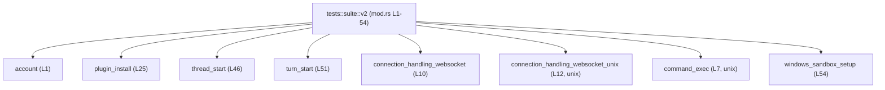
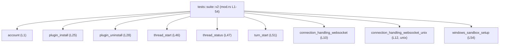

# app-server/tests/suite/v2/mod.rs コード解説

## 0. ざっくり一言

- `tests/suite/v2` 配下のテスト・モジュール群を **ひとまとめに宣言するための集約モジュール** です（`mod` 宣言のみで構成されています）  
  根拠: `app-server/tests/suite/v2/mod.rs:L1-54`

---

## 1. このモジュールの役割

### 1.1 概要

- このモジュールは、`app-server` プロジェクトのテストスイート（`tests/suite/v2`）に属する **多数のサブモジュールを登録する役割** を持ちます。  
- 本ファイル自身には関数・構造体・テストケースの定義はなく、**各機能ごとのテストやヘルパーは別ファイル（`account.rs` など）に分割されている** 形になっています。  
  根拠: `mod xxx;` の連続だけで構成されていること（`app-server/tests/suite/v2/mod.rs:L1-54`）

### 1.2 アーキテクチャ内での位置づけ

- このファイルは `tests::suite::v2` モジュール（正確な親モジュール名は上位ファイル次第ですが）に対応し、その直下に多数のサブモジュールをぶら下げています。
- 実際のテストロジックやアプリケーションとの連携は **各サブモジュール側にのみ存在し、この `mod.rs` は依存関係の「目次」のような位置づけ** です。

代表的な依存関係（サブモジュールの一部のみを図示）:



- 図は `mod.rs` 内の **静的なモジュール依存（L1-54）** を示しており、ランタイムのデータの流れまでは分かりません。
- 実際には、ここで宣言されているすべての `mod` が `root` から同様に参照されます。

### 1.3 設計上のポイント

コードから読み取れる設計上の特徴は次のとおりです。

- **責務の分割**
  - 各機能領域ごとにファイルを分割した構成になっています（例: `plugin_install`, `plugin_uninstall`, `thread_*`, `turn_*` など）。  
    根拠: モジュール名を分けた複数の `mod` 宣言（`app-server/tests/suite/v2/mod.rs:L1-54`）
- **状態やロジックを持たない集約モジュール**
  - 本ファイル内には関数・構造体・列挙体が一切定義されておらず、**状態やロジックを持たない薄いモジュール** になっています。  
    根拠: `Meta: functions=0, exports=0` とコード実体（`app-server/tests/suite/v2/mod.rs:L1-54`）
- **OS ごとの分岐**
  - `#[cfg(unix)]` 付きのモジュール宣言があり、Unix 環境専用のサブモジュール（`command_exec`, `connection_handling_websocket_unix`）が存在します。  
    根拠: `#[cfg(unix)]` 行と直後の `mod` 行（`app-server/tests/suite/v2/mod.rs:L6-7`, `L11-12`）
- **公開範囲**
  - すべて `mod`（`pub mod` ではない）で宣言されているため、**これらのサブモジュールは親モジュール内のプライベートなテスト用部品** として使われていると解釈できます。  
    根拠: すべての宣言が `mod` で始まり `pub` が付いていない（`app-server/tests/suite/v2/mod.rs:L1-54`）

---

## 2. 主要な機能一覧（コンポーネントインベントリー）

### 2.1 コンポーネント（モジュール）一覧

このファイルに登場するコンポーネントは **すべて「サブモジュール」** です。  
関数・構造体・トレイトなどの定義はこのチャンクには現れません。

> 「説明」は **モジュール名から読み取れる範囲での領域名レベル** に留め、具体的なロジック内容は「不明」としています。

| モジュール名 | 想定される領域（名前からの推測） | OS条件 | 根拠 |
|--------------|------------------------------------|--------|------|
| `account` | アカウント関連の処理・テストと推測 | なし | `mod account;`（`app-server/tests/suite/v2/mod.rs:L1`） |
| `analytics` | アナリティクス関連と推測 | なし | `L2` |
| `app_list` | アプリケーション一覧に関する処理と推測 | なし | `L3` |
| `client_metadata` | クライアントメタデータ関連と推測 | なし | `L4` |
| `collaboration_mode_list` | 協調モードの一覧関連と推測 | なし | `L5` |
| `command_exec` | コマンド実行関連（Unix 専用）と推測 | `unix` | `#[cfg(unix)]` + `mod command_exec;`（`L6-7`） |
| `compaction` | データのコンパクション関連と推測 | なし | `L8` |
| `config_rpc` | 設定（config）に関する RPC 関連と推測 | なし | `L9` |
| `connection_handling_websocket` | WebSocket 接続処理と推測 | なし | `L10` |
| `connection_handling_websocket_unix` | Unix 向け WebSocket 接続処理と推測 | `unix` | `L11-12` |
| `dynamic_tools` | 動的ツール機構関連と推測 | なし | `L13` |
| `experimental_api` | 実験的 API 関連と推測 | なし | `L14` |
| `experimental_feature_list` | 実験的機能一覧と推測 | なし | `L15` |
| `fs` | ファイルシステム関連と推測 | なし | `L16` |
| `initialize` | 初期化処理関連と推測 | なし | `L17` |
| `mcp_resource` | MCP（詳細不明）リソース関連と推測 | なし | `L18` |
| `mcp_server_elicitation` | MCP サーバの elicitation 関連と推測 | なし | `L19` |
| `mcp_server_status` | MCP サーバのステータス関連と推測 | なし | `L20` |
| `mcp_tool` | MCP 向けツール関連と推測 | なし | `L21` |
| `model_list` | モデル一覧関連と推測 | なし | `L22` |
| `output_schema` | 出力スキーマ関連と推測 | なし | `L23` |
| `plan_item` | 計画アイテム関連と推測 | なし | `L24` |
| `plugin_install` | プラグインのインストール関連と推測 | なし | `L25` |
| `plugin_list` | プラグイン一覧関連と推測 | なし | `L26` |
| `plugin_read` | プラグイン内容読み取り関連と推測 | なし | `L27` |
| `plugin_uninstall` | プラグインのアンインストール関連と推測 | なし | `L28` |
| `rate_limits` | レート制限関連と推測 | なし | `L29` |
| `realtime_conversation` | リアルタイム会話関連と推測 | なし | `L30` |
| `request_permissions` | 権限リクエスト関連と推測 | なし | `L31` |
| `request_user_input` | ユーザー入力リクエスト関連と推測 | なし | `L32` |
| `review` | レビュー関連と推測 | なし | `L33` |
| `safety_check_downgrade` | セーフティチェックのダウングレード関連と推測 | なし | `L34` |
| `skills_list` | スキル一覧関連と推測 | なし | `L35` |
| `thread_archive` | スレッドのアーカイブ関連と推測 | なし | `L36` |
| `thread_fork` | スレッドのフォーク関連と推測 | なし | `L37` |
| `thread_list` | スレッド一覧関連と推測 | なし | `L38` |
| `thread_loaded_list` | ロード済みスレッド一覧関連と推測 | なし | `L39` |
| `thread_metadata_update` | スレッドメタデータ更新関連と推測 | なし | `L40` |
| `thread_name_websocket` | WebSocket 経由のスレッド名関連と推測 | なし | `L41` |
| `thread_read` | スレッド読み取り関連と推測 | なし | `L42` |
| `thread_resume` | スレッド再開関連と推測 | なし | `L43` |
| `thread_rollback` | スレッドのロールバック関連と推測 | なし | `L44` |
| `thread_shell_command` | スレッドに紐づくシェルコマンド関連と推測 | なし | `L45` |
| `thread_start` | スレッド開始関連と推測 | なし | `L46` |
| `thread_status` | スレッド状態関連と推測 | なし | `L47` |
| `thread_unarchive` | スレッドのアーカイブ解除関連と推測 | なし | `L48` |
| `thread_unsubscribe` | スレッドの購読解除関連と推測 | なし | `L49` |
| `turn_interrupt` | ターン（会話単位？）の割り込み関連と推測 | なし | `L50` |
| `turn_start` | ターン開始関連と推測 | なし | `L51` |
| `turn_start_zsh_fork` | zsh フォークを伴うターン開始関連と推測 | なし | `L52` |
| `turn_steer` | ターンの制御（steer）関連と推測 | なし | `L53` |
| `windows_sandbox_setup` | Windows サンドボックス設定関連と推測 | なし | `L54` |

> 具体的な関数・テストケースやデータ構造がどうなっているかは、各モジュールファイル（`account.rs` など）のコードがこのチャンクには現れないため不明です。

### 2.2 このファイルで提供される「機能」

- 本ファイルが直接提供する機能は **「テストスイート v2 に含まれるモジュールの登録」** のみです。
- エラー処理・並行処理・ビジネスロジックなどは一切含まれていません。  
  根拠: `mod` 宣言以外のコードが存在しないこと（`app-server/tests/suite/v2/mod.rs:L1-54`）

---

## 3. 公開 API と詳細解説

### 3.1 型一覧（構造体・列挙体など）

- このファイル内に **型定義（`struct`, `enum`, `type`, `trait` など）は存在しません**。  
  根拠: ファイル全体に `mod` と `#[cfg(unix)]` しかない（`app-server/tests/suite/v2/mod.rs:L1-54`）

### 3.2 関数詳細（最大 7 件）

- このファイル内に **関数定義（`fn`）が 0 件** であるため、詳細解説の対象となる関数はありません。  
  根拠: メタ情報 `functions=0` とコード内容（`app-server/tests/suite/v2/mod.rs:L1-54`）

### 3.3 その他の関数

- 補助的な関数やラッパー関数も定義されていません。

---

## 4. データフロー

このファイルには実行時の処理やデータ変換を行うコードがないため、**ランタイムのデータフローを直接読み取ることはできません**。

ここでは、代わりに「**モジュールレベルの依存関係**（どのモジュールがどのモジュールを参照しているか）」を簡単な図で示します。



- 図は **`v2` モジュールから代表的なサブモジュールに対するコンパイル時依存（L1-54）** を示します。
- 実際のテスト実行時には、これらのサブモジュール内で定義されたテスト関数・ヘルパーが呼び出されますが、**どの順序で・どのようにデータが流れるかは、このチャンクだけでは分かりません**。

---

## 5. 使い方（How to Use）

### 5.1 基本的な使用方法

この `mod.rs` 自体は関数を提供しないため、「使い方」と言えるのは **上位モジュールからのインポート方法** になります。

以下は、一般的な Rust プロジェクトで同様の構造を使う場合の例です（※あくまで典型例であり、このリポジトリで実際に同じコードが存在するかどうかは、このチャンクからは分かりません）。

```rust
// tests/suite/mod.rs 側の例（仮想例）
// v2 サブスイートをモジュールとして取り込む
mod v2;

#[test]
fn end_to_end_account_flow() {
    // v2::account モジュール内のヘルパーやテスト用関数を利用するイメージ
    // 実際の API は v2::account 内の定義次第で、このチャンクには現れません。
    // v2::account::run_account_flow_test();
}
```

この例のように、上位のテストモジュールが `mod v2;` と宣言することで、`v2` 配下のすべてのサブモジュール（`account`, `plugin_install`, `thread_start` など）がコンパイル時に読み込まれ、各モジュール内の `#[test]` 関数などがテストランナーから認識される構成が想定されます。

### 5.2 よくある使用パターン

このファイル単体から確定的に言えるパターンは次の程度です。

- **テストスイートの論理的なグルーピング**
  - `v2` というディレクトリ／モジュール名で、「第2世代 API」や「バージョン 2 のエンドポイント」のテスト群をまとめている可能性がありますが、コードからは断定できません。
- **機能単位・リソース単位でのモジュール分割**
  - `plugin_*`, `thread_*`, `turn_*` 等の接頭辞でモジュール名がそろっているため、関連機能ごとにファイルを分けていることは確実です。  
    根拠: モジュール名の命名規則（`app-server/tests/suite/v2/mod.rs:L25-53`）

### 5.3 よくある間違い（一般的な注意点）

このファイル構造から、一般的に起こりがちな誤用例と注意点を挙げます（特定のバグが存在するという意味ではありません）。

```rust
// 誤りの例: Unix 専用モジュールを無条件で参照する（一般的なイメージ）
mod v2;

#[test]
fn use_unix_only_module() {
    // コンパイル対象が非 Unix (Windows など) のとき、以下のような参照はビルドエラーになる
    // use v2::command_exec; // command_exec モジュールは #[cfg(unix)] 付き
}

// 正しいパターンの一例（一般的なイメージ）
#[cfg(unix)]
#[test]
fn use_unix_only_module_unix_only() {
    // Unix のときだけ Unix 専用モジュールを参照する
    // use v2::command_exec;
}
```

- **ポイント**: `#[cfg(unix)]` が付いたモジュールは、非 Unix 環境ではそもそも存在しないため、**参照側でも条件付きコンパイルを合わせる必要** がある、という Rust 一般の注意点があります。

### 5.4 使用上の注意点（まとめ）

- **前提条件**
  - このファイルで宣言されている各モジュールに対応するソースファイル（例: `tests/suite/v2/account.rs` または `tests/suite/v2/account/mod.rs`）が存在している必要があります。存在しない場合、コンパイルエラーになります。
- **プラットフォーム依存**
  - `command_exec` と `connection_handling_websocket_unix` は `#[cfg(unix)]` 付きであり、**Unix 以外ではコンパイル対象に含まれません**。非 Unix 環境からこれらを無条件で参照するとビルドエラーとなります。
- **公開範囲**
  - すべての宣言が `mod` であり `pub mod` ではないため、これらサブモジュールを **外部クレートや上位階層から直接再利用することは前提になっていません**。あくまでこのテストスイート内部の構成要素と見なすのが自然です。

---

## 6. 変更の仕方（How to Modify）

### 6.1 新しい機能を追加する場合

このファイルの構造から自然に導かれる追加手順は次のとおりです。

1. **新しいテストモジュールファイルを作成**
   - 例: `tests/suite/v2/new_feature.rs`（または `new_feature/mod.rs`）を作成し、その中にテストやヘルパー関数を定義する。
2. **`mod.rs` にモジュール宣言を追加**
   - 本ファイルの末尾付近に `mod new_feature;` を追加する。  
     （Windows/Unix 固有であれば `#[cfg(...)]` を付ける。）
3. **必要に応じて呼び出し側で利用**
   - 上位のテストモジュールや他のサブモジュールから `new_feature` を参照する。

```rust
// app-server/tests/suite/v2/mod.rs 側のイメージ
mod new_feature; // 新規追加行

// app-server/tests/suite/some_suite.rs など
mod v2;

#[test]
fn new_feature_works() {
    // v2::new_feature 内のテストヘルパーを呼ぶイメージ
    // v2::new_feature::run_test();
}
```

※ 実際にどこから呼び出すかは、上位テスト構成ファイルの内容次第であり、このチャンクには現れません。

### 6.2 既存の機能を変更する場合

- **影響範囲の確認**
  - 変更したい機能に対応するモジュール（例: `thread_start`）のソースファイル内を確認し、そのモジュールを利用している他ファイル（`use` / `mod` 参照）を検索する必要があります。
- **契約（前提条件・返り値）の保持**
  - 本ファイルには契約は定義されていませんが、各サブモジュール内の関数に仕様（どの入力でどの結果を返すか）があるはずなので、その契約を変更する場合はテストケースの見直しが必要です。
- **プラットフォーム条件の維持**
  - `#[cfg(unix)]` 付きモジュールを別プラットフォーム向けにも使いたい場合は、新たなモジュールを追加するか、条件を変更する必要がありますが、**既存の条件を変更すると他プラットフォームのビルド挙動が変わる** ため注意が必要です。

---

## 7. 関連ファイル

このモジュールと密接に関係するファイルは、各 `mod` 宣言に対応するソースファイルです。Rust のモジュール規則から、以下のようなファイルが存在すると解釈されます（`xxx.rs` または `xxx/mod.rs` のいずれか）。

| パス（候補） | 役割 / 関係 |
|--------------|------------|
| `app-server/tests/suite/v2/account.rs` または `account/mod.rs` | `mod account;` の本体。アカウント関連のテスト・ヘルパーが定義されていると考えられます。 |
| `app-server/tests/suite/v2/plugin_install.rs` または `plugin_install/mod.rs` | `mod plugin_install;` の本体。プラグインインストール関連のテスト・ヘルパーが定義されていると考えられます。 |
| `app-server/tests/suite/v2/thread_start.rs` または `thread_start/mod.rs` | `mod thread_start;` の本体。スレッド開始関連のテスト・ヘルパーが定義されていると考えられます。 |
| `app-server/tests/suite/v2/turn_start.rs` または `turn_start/mod.rs` | `mod turn_start;` の本体。ターン開始関連のテスト・ヘルパーが定義されていると考えられます。 |
| `app-server/tests/suite/v2/connection_handling_websocket.rs` または `connection_handling_websocket/mod.rs` | WebSocket 接続処理のテスト・ヘルパーが定義されていると考えられます。 |
| `app-server/tests/suite/v2/connection_handling_websocket_unix.rs` または `connection_handling_websocket_unix/mod.rs` | Unix 専用の WebSocket 接続テストロジックと考えられます（`#[cfg(unix)]`）。 |
| `app-server/tests/suite/v2/command_exec.rs` または `command_exec/mod.rs` | Unix 専用のコマンド実行に関するテストロジックと考えられます。 |
| `app-server/tests/suite/v2/windows_sandbox_setup.rs` または `windows_sandbox_setup/mod.rs` | Windows サンドボックス設定に関するテストロジックと考えられます。 |

> これら関連ファイルの**具体的な内容や API、エラー処理や並行性の詳細**は、このチャンクには現れていないため不明です。  
> 安全性・エラー処理・並行性に関する評価を行うには、各サブモジュールの実装を個別に確認する必要があります。
