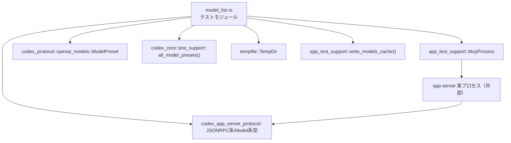

# app-server/tests/suite/v2/model_list.rs コード解説

## 0. ざっくり一言

`list_models` JSON-RPC エンドポイントが、モデル一覧・ページネーション・エラー応答を仕様どおり返すかを、実プロセス相当の `McpProcess` を通して検証する統合テスト群です（model_list.rs:L75-216）。

---

## 1. このモジュールの役割

### 1.1 概要

- `ModelPreset` から期待されるモデル一覧を組み立てるヘルパーを定義し（model_list.rs:L23-72）  
- app-server を `McpProcess` で起動し、`list_models` RPC を実際に叩いて（model_list.rs:L75-107 ほか）  
- 「全モデル返却」「hidden 含む」「ページネーション」「不正カーソルエラー」の 4 シナリオを検証します（model_list.rs:L75-216）。

### 1.2 アーキテクチャ内での位置づけ

このモジュールはテスト専用で、本番コードはすべて外部クレートにあります。主な依存関係は次のとおりです。

- app-server 実プロセスをラップする `app_test_support::McpProcess`（model_list.rs:L4, L79, L113, L145, L194）
- モデル一覧 RPC の型定義群（`codex_app_server_protocol::{Model, ModelListParams, ModelListResponse, JSONRPCResponse, JSONRPCError, RequestId}`）（model_list.rs:L7-14, L91, L97-100, L124-133, L162-171, L206-213）
- モデル定義とフィクスチャ（`ModelPreset`, `codex_core::test_support::all_model_presets()`）（model_list.rs:L15, L60-61）
- モデルキャッシュを書き込む `write_models_cache`（model_list.rs:L6, L78, L112, L144, L193）
- 非同期ランタイム `tokio`／タイムアウト制御（model_list.rs:L18, L81, L91-95 ほか）

依存関係を図示すると次のようになります。



### 1.3 設計上のポイント

- **責務の分割**
  - 「期待されるモデル一覧の構築」を `model_from_preset` と `expected_visible_models` に切り出し（model_list.rs:L23-72）
  - 「実際の RPC 呼び出しと検証」は 4 つの `#[tokio::test]` に分離されています（model_list.rs:L75-216）。
- **状態管理**
  - 各テストは毎回 `TempDir` を生成し、独立した `codex_home` ディレクトリを使うため、テスト間でファイル状態を共有しません（model_list.rs:L77, L111, L143, L192）。
  - `McpProcess` インスタンスも各テスト内で新規作成され、共有されません（model_list.rs:L79, L113, L145, L194）。
- **エラーハンドリング**
  - すべてのテストは `anyhow::Result<()>` を返し、`?` 演算子で I/O や RPC の失敗を早期に伝播させる構造です（model_list.rs:L75, L109, L141, L191）。
  - RPC 応答待機には `tokio::time::timeout` を使い、無限待機を防ぎます（model_list.rs:L81, L91-95, L115, L125-129, L147, L162-166, L196, L206-210）。
- **並行性**
  - 各テストは `#[tokio::test]` により、Tokio ランタイム上で非同期に実行されます（model_list.rs:L75, L109, L141, L191）。
  - モジュール内に共有ミュータブル状態はなく、並行安全性の懸念はほぼありません。

---

## 2. 主要な機能一覧（コンポーネントインベントリー：関数）

このファイルで定義される関数・テストの一覧です。

| 名前 | 種別 | 役割 / 機能 | 根拠 |
|------|------|-------------|------|
| `model_from_preset` | ヘルパー関数 | `ModelPreset` から RPC 用 `Model` 型へ変換する（hidden や reasoning 設定も反映） | model_list.rs:L23-55 |
| `expected_visible_models` | ヘルパー関数 | 認可条件や picker 表示条件に基づき、「一覧に出るべきモデル」を計算する | model_list.rs:L58-72 |
| `list_models_returns_all_models_with_large_limit` | 非同期テスト | 大きな `limit=100` で `list_models` を呼び、全「表示対象モデル」が返ることを検証する | model_list.rs:L75-107 |
| `list_models_includes_hidden_models` | 非同期テスト | `include_hidden=true` 指定で、hidden フラグ付きモデルがレスポンスに含まれることを検証する | model_list.rs:L109-138 |
| `list_models_pagination_works` | 非同期テスト | `limit=1` の繰り返しリクエストで、カーソル付きページネーションが正しく動作し、全件取得後に終了することを検証する | model_list.rs:L141-188 |
| `list_models_rejects_invalid_cursor` | 非同期テスト | 不正な文字列カーソル指定で、JSON-RPC エラー `code=-32600` と特定メッセージを返すことを検証する | model_list.rs:L191-215 |

---

## 3. 公開 API と詳細解説

### 3.1 型一覧（主に外部型の利用）

このモジュール自体は新しい型を定義していませんが、重要な外部型を整理します。

| 名前 | 種別 | 定義元（クレート） | 本ファイルでの役割 / 用途 | 根拠 |
|------|------|--------------------|---------------------------|------|
| `ModelPreset` | 構造体 | `codex_protocol::openai_models` | モデルのプリセット定義。テスト側の「期待値」の元データとして使用 | model_list.rs:L15, L60-61 |
| `Model` | 構造体 | `codex_app_server_protocol` | `list_models` RPC のレスポンス内で返るモデル表現。期待値構築に使用 | model_list.rs:L9, L23-55 |
| `ModelUpgradeInfo` | 構造体 | `codex_app_server_protocol` | モデルのアップグレード情報を含む RPC 表現。`ModelPreset.upgrade` から生成 | model_list.rs:L12, L28-33 |
| `ReasoningEffortOption` | 構造体 | `codex_app_server_protocol` | reasoning effort オプション（強度と説明）を表現する型。`ModelPreset.supported_reasoning_efforts` から生成 | model_list.rs:L13, L38-45 |
| `ModelListParams` | 構造体 | `codex_app_server_protocol` | `list_models` RPC のパラメータ。`limit`・`cursor`・`include_hidden` を持つ | model_list.rs:L10, L83-87, L118-122, L155-159, L199-203 |
| `ModelListResponse` | 構造体 | `codex_app_server_protocol` | `list_models` RPC の戻り値。`data` と `next_cursor` を持つ | model_list.rs:L11, L97-100, L131-133, L168-171 |
| `JSONRPCResponse` | 構造体 | `codex_app_server_protocol` | 一般的な JSON-RPC 成功応答ラッパー。`to_response` で型付き結果へ変換される | model_list.rs:L8, L91, L124, L162 |
| `JSONRPCError` | 構造体 | `codex_app_server_protocol` | JSON-RPC エラー応答。`id` と `error`（code, message）を持つ | model_list.rs:L7, L206-214 |
| `RequestId` | 列挙体 | `codex_app_server_protocol` | JSON-RPC のリクエスト ID。ここでは整数 ID を利用 | model_list.rs:L14, L92-93, L126-127, L163-164, L208-209, L212 |
| `McpProcess` | 構造体 | `app_test_support` | app-server 実プロセスを起動し、JSON-RPC 経由で操作するテスト用ラッパー | model_list.rs:L4, L79, L113, L145, L194 |
| `TempDir` | 構造体 | `tempfile` | 一時ディレクトリ。テストごとの `codex_home` として使用され、自動削除される | model_list.rs:L17, L77, L111, L143, L192 |
| `Duration` | 構造体 | `std::time` | タイムアウト秒数の表現。`DEFAULT_TIMEOUT=10s` に使用 | model_list.rs:L1, L20 |
| `Result` | 型エイリアス | `anyhow` | テスト関数の戻り値として汎用的なエラーを扱う | model_list.rs:L3, L75, L109, L141, L191 |

### 3.2 関数詳細

#### `model_from_preset(preset: &ModelPreset) -> Model`（model_list.rs:L23-55）

**概要**

`ModelPreset`（内部用のモデルプリセット定義）を、`list_models` RPC が返す `Model` 型へ変換するヘルパーです。アップグレード情報や reasoning 設定など、必要なフィールドをコピーします。

**引数**

| 引数名 | 型 | 説明 |
|--------|----|------|
| `preset` | `&ModelPreset` | 変換元となるモデルプリセット。ID・表示名・説明・アップグレード設定・reasoning 設定などを含む（model_list.rs:L23-27, L38-47, L52-53）。 |

**戻り値**

- `Model`  
  `preset` の情報を反映した RPC 用モデル表現です。`hidden` や `supported_reasoning_efforts` なども含まれます（model_list.rs:L24-54）。

**内部処理の流れ**

1. ID・model 名をコピー（model_list.rs:L25-26）。
2. `preset.upgrade` があれば、その `id` を `upgrade` フィールドに設定（model_list.rs:L27）。
3. 同じく `preset.upgrade` があれば `ModelUpgradeInfo` を構築し、`upgrade_info` に格納（model_list.rs:L28-33）。
4. `availability_nux` を `map(Into::into)` で RPC 用型に変換（model_list.rs:L34）。
5. `display_name`・`description` をコピー（model_list.rs:L35-36）。
6. `hidden` を `!preset.show_in_picker` として決定（picker に出さないものを hidden=true にする）（model_list.rs:L37）。
7. `supported_reasoning_efforts` を `.iter().map(...)` で `ReasoningEffortOption` に変換（model_list.rs:L38-45）。
8. `default_reasoning_effort`・`input_modalities` をコピー（model_list.rs:L46-47）。
9. コメントの制約により、`supports_personality` は常に `false` に固定（model_list.rs:L48-52）。
10. `additional_speed_tiers`・`is_default` をコピー（model_list.rs:L53-54）。

**Examples（使用例）**

この関数は直接テスト内から使われ、`expected_visible_models` が RPC レスポンスの期待値として利用します。

```rust
// ModelPreset の一覧から picker 表示対象だけを RPC 用 Model に変換する（model_list.rs:L68-72）
let models: Vec<Model> = presets
    .iter()
    .filter(|preset| preset.show_in_picker)
    .map(model_from_preset)
    .collect();
```

**Errors / Panics**

- この関数内に `Result` や `unwrap` はなく、通常のクローン・`map` のみです。コードから読み取れる範囲では、パニックを発生させる箇所はありません（model_list.rs:L24-54）。

**Edge cases（エッジケース）**

- `preset.upgrade` が `None` の場合  
  → `upgrade` および `upgrade_info` は `None` になります（`as_ref().map(...)` のため）（model_list.rs:L27-33）。
- `preset.availability_nux` が `None` の場合  
  → `availability_nux` も `None` になります（model_list.rs:L34）。
- `supported_reasoning_efforts` が空の場合  
  → `supported_reasoning_efforts` は空の `Vec` になります（model_list.rs:L38-45）。

**使用上の注意点**

- コメントにあるとおり、`supports_personality` はキャッシュの round-trip の都合で常に `false` に固定されています（model_list.rs:L48-52）。  
  テストの期待値としても `false` であることが前提です。

---

#### `expected_visible_models() -> Vec<Model>`（model_list.rs:L58-72）

**概要**

`ModelPreset` から、「通常の picker に表示されるべきモデル」のみを抽出し、`Model` 型の一覧として返します。`list_models` のレスポンス期待値となります。

**引数**

- なし。

**戻り値**

- `Vec<Model>`  
  認可フィルタ・picker 表示フラグを反映した「表示対象モデル」の一覧です（model_list.rs:L68-72）。

**内部処理の流れ**

1. `codex_core::test_support::all_model_presets().clone()` で、利用可能なすべての `ModelPreset` を取得（model_list.rs:L60-61）。
2. `ModelPreset::filter_by_auth(..., /*chatgpt_mode*/ false)` を呼び、認可モードに応じたフィルタリングを実行（model_list.rs:L59-62）。
3. コメントにある `ModelsManager::build_available_models()` の挙動を模倣するため、`mark_default_by_picker_visibility` を呼んでデフォルトモデルをマーク（model_list.rs:L65-66）。
4. `presets.iter().filter(|preset| preset.show_in_picker)` で picker に表示されるモデルのみ抽出（model_list.rs:L68-70）。
5. 各 `preset` を `model_from_preset` を通じて `Model` に変換し、`collect()` でベクタにまとめる（model_list.rs:L70-72）。

**Examples（使用例）**

```rust
// list_models_returns_all_models_with_large_limit テスト内での利用（model_list.rs:L101-104）
let expected_models = expected_visible_models();
assert_eq!(items, expected_models);
```

**Errors / Panics**

- 関数内にはエラーを返す処理はなく、`filter_by_auth` や `mark_default_by_picker_visibility` がパニックするかどうかは、このチャンクからは分かりません。
- 自身は `panic!` も呼び出していません（model_list.rs:L58-72）。

**Edge cases**

- `all_model_presets()` が空ベクタを返した場合  
  → そのまま空の `Vec<Model>` が返ります（model_list.rs:L68-72）。
- 認可フィルタ後に `show_in_picker` がすべて `false` の場合  
  → `filter(|preset| preset.show_in_picker)` により、空の一覧になります。

**使用上の注意点**

- コメント上、`ModelsManager::build_available_models()` の挙動と揃える意図が明示されています（model_list.rs:L65-66）。  
  app-server 側のロジックが変わった場合は、このヘルパーも一緒に更新する必要があります。

---

#### `list_models_returns_all_models_with_large_limit() -> Result<()>`（model_list.rs:L75-107）

**概要**

`limit=Some(100)` という十分大きな上限を指定して `list_models` を呼び出し、`expected_visible_models()` が返す全モデルが 1 ページで返ることを検証します。

**引数**

- なし（テスト関数）。

**戻り値**

- `anyhow::Result<()>`  
  エラーが発生すればテスト失敗、すべて成功すれば `Ok(())` を返します（model_list.rs:L75, L105-106）。

**内部処理の流れ（アルゴリズム）**

1. `TempDir::new()` で一時ディレクトリを作成し、`codex_home` として使用（model_list.rs:L77）。
2. `write_models_cache(codex_home.path())` でモデルキャッシュファイルを書き込み（model_list.rs:L78）。
3. `McpProcess::new(codex_home.path()).await?` で app-server を起動（model_list.rs:L79）。
4. `timeout(DEFAULT_TIMEOUT, mcp.initialize()).await??;` で初期化 RPC を完了（model_list.rs:L81）。
5. `send_list_models_request` に `ModelListParams { limit: Some(100), cursor: None, include_hidden: None }` を渡してリクエスト送信し、`request_id` を取得（model_list.rs:L83-88）。
6. `timeout(..., mcp.read_stream_until_response_message(RequestId::Integer(request_id)))` で該当レスポンスを待ち、`JSONRPCResponse` を受信（model_list.rs:L90-95）。
7. `to_response::<ModelListResponse>(response)?` で型付きレスポンスにデコードし、`data` と `next_cursor` を取り出す（model_list.rs:L97-100）。
8. `expected_visible_models()` で期待されるモデル一覧を計算し、`assert_eq!(items, expected_models)` で完全一致を検証（model_list.rs:L101-104）。
9. `assert!(next_cursor.is_none())` で、次ページがないこと（全件 1 ページ）を検証（model_list.rs:L104）。

**Examples（使用例）**

このテストパターンは、他のメソッドを検証する際のテンプレートとしても利用できます。

```rust
#[tokio::test]
async fn my_list_models_smoke_test() -> anyhow::Result<()> {
    let codex_home = TempDir::new()?;                             // 一時 HOME ディレクトリ
    write_models_cache(codex_home.path())?;                       // モデルキャッシュを書き込み
    let mut mcp = McpProcess::new(codex_home.path()).await?;      // プロセス起動

    timeout(DEFAULT_TIMEOUT, mcp.initialize()).await??;           // 初期化

    let request_id = mcp
        .send_list_models_request(ModelListParams {
            limit: Some(10),
            cursor: None,
            include_hidden: None,
        })
        .await?;

    let response: JSONRPCResponse = timeout(
        DEFAULT_TIMEOUT,
        mcp.read_stream_until_response_message(RequestId::Integer(request_id)),
    )
    .await??;

    let ModelListResponse { data: items, next_cursor } =
        to_response::<ModelListResponse>(response)?;              // 型付きに変換

    assert!(!items.is_empty());
    assert!(next_cursor.is_none());
    Ok(())
}
```

**Errors / Panics**

- `TempDir::new`, `write_models_cache`, `McpProcess::new`, `initialize`, `send_list_models_request`, `read_stream_until_response_message`, `to_response` のいずれかが `Err` を返すと、そのまま `?` によりテストが失敗します（model_list.rs:L77-79, L81, L83-88, L90-95, L97-100）。
- `timeout` がタイムアウトした場合も `Err(Elapsed)` が返り、`await??` によりテスト失敗になります（model_list.rs:L81, L90-95）。
- 明示的な `panic!` 呼び出しはありません。

**Edge cases**

- 実際のモデル数が 100 を超える場合  
  → このテストでは「全件返る」ことを前提としているため、もし 101 件以上あると `items.len() > expected_models.len()` か、サーバ側で `next_cursor` が付くなどの差異でテストが落ちます。
- モデルが 0 件の場合  
  → `expected_visible_models()` も空になり、`items` も空であればテストは成功します。

**使用上の注意点**

- このテストは `list_models` が「visible モデルをすべて返す」ことを契約として固定化しています。サーバ側の仕様変更（デフォルト limit が変わる等）時にはこのテストを見直す必要があります。

---

#### `list_models_includes_hidden_models() -> Result<()>`（model_list.rs:L109-138）

**概要**

`include_hidden: Some(true)` を指定して `list_models` を呼び、レスポンス中に `hidden == true` のモデルが少なくとも 1 つ含まれることと、`next_cursor` が `None` であることを検証します。

**引数**

- なし。

**戻り値**

- `anyhow::Result<()>`（model_list.rs:L109, L137-138）。

**内部処理の流れ**

初期化部分は前のテストと同じです（TempDir 作成〜initialize まで）（model_list.rs:L111-115）。

1. `send_list_models_request` に `ModelListParams { limit: Some(100), cursor: None, include_hidden: Some(true) }` を渡す（model_list.rs:L117-122）。
2. `timeout` + `read_stream_until_response_message` でレスポンスを受け取り、`JSONRPCResponse` を取得（model_list.rs:L124-129）。
3. `to_response::<ModelListResponse>` で `items` と `next_cursor` を取り出す（model_list.rs:L131-133）。
4. `assert!(items.iter().any(|item| item.hidden));` で、`hidden` フラグ付きモデルが存在することを確認（model_list.rs:L135）。
5. `assert!(next_cursor.is_none());` で 1 ページで終わることを検証（model_list.rs:L136）。

**Errors / Panics**

- エラーハンドリングは前のテストと同様にすべて `?` による伝播です（model_list.rs:L111-133）。
- 失敗条件は `assert!(...)` によるパニックのみです（model_list.rs:L135-136）。

**Edge cases**

- サーバ側に hidden モデルが存在しない場合  
  → `items.iter().any(|item| item.hidden)` が `false` となりテストは失敗します。
- hidden モデルが複数存在する場合  
  → `any` で 1 件以上を確認するだけなので問題ありません。

**使用上の注意点**

- このテストは、「hidden モデルが必ず 1 つ以上存在する」という前提にも依存します。  
  フィクスチャから hidden モデルを削除した場合、このテストも更新が必要です。

---

#### `list_models_pagination_works() -> Result<()>`（model_list.rs:L141-188）

**概要**

`limit=Some(1)` と小さいページサイズで `list_models` を繰り返し呼び、`cursor` を使ったページネーションが正しく機能すること、すべてのページを取得し終えたら `next_cursor` が `None` になることを確認します。

**引数**

- なし。

**戻り値**

- `anyhow::Result<()>`（model_list.rs:L141, L178-181）。

**内部処理の流れ**

1. 初期化（TempDir, write_models_cache, McpProcess, initialize）は他テストと同様（model_list.rs:L143-147）。
2. `expected_models = expected_visible_models()` で期待する全モデルを取得（model_list.rs:L149）。
3. `cursor: Option<String> = None`・`items: Vec<Model> = Vec::new()` を準備（model_list.rs:L150-151）。
4. `for _ in 0..expected_models.len()` のループで、最大 `expected_models.len()` 回までページ取得を試みる（model_list.rs:L153-152）。
5. 各ループで：
   - `ModelListParams { limit: Some(1), cursor: cursor.clone(), include_hidden: None }` を指定してリクエスト（model_list.rs:L155-159）。
   - レスポンスを `ModelListResponse { data: page_items, next_cursor }` にデコード（model_list.rs:L161-171）。
   - `assert_eq!(page_items.len(), 1);` で 1 ページあたり 1 モデルであることを検証（model_list.rs:L172）。
   - `items.extend(page_items);` で取得済みモデル一覧に追加（model_list.rs:L173）。
   - `if let Some(next_cursor) = next_cursor { cursor = Some(next_cursor); } else { assert_eq!(items, expected_models); return Ok(()); }` で、カーソルがなくなった時点で全件取得済みか検証し、成功終了（model_list.rs:L175-180）。
6. ループを回りきっても `next_cursor` が `None` にならなかった場合、`panic!("model pagination did not terminate after {} pages", expected_models.len())` を実行（model_list.rs:L183-187）。

**内部処理のフローチャート**

```mermaid
flowchart TD
    %% list_models_pagination_works (model_list.rs:L141-188)
    A[開始] --> B[expected_models を計算]
    B --> C[items = [] / cursor = None]
    C --> D{ループ<br/> i in 0..expected_models.len()}
    D --> E[limit=1, cursor で list_models 呼び出し]
    E --> F[page_items, next_cursor を取得]
    F --> G[assert page_items.len() == 1]
    G --> H[items に page_items を追加]
    H --> I{next_cursor は Some か?}
    I --> J[None の場合<br/>items == expected_models を確認して Ok(())] --> K[終了]
    I --> D[Some の場合<br/>cursor = next_cursor で次ループ]
    D --> L[ループ終了後も<br/>抜けられない場合] --> M[panic! で失敗]
```

**Errors / Panics**

- 通信・I/O エラーなどの `Err` はすべて `?` でテスト失敗となります（model_list.rs:L143-171）。
- ページング関連の異常時には `panic!` が使われます。
  - 任意のページで `page_items.len() != 1` → `assert_eq` がパニック（model_list.rs:L172）。
  - 全ページ取得後に `items != expected_models` → `assert_eq` がパニック（model_list.rs:L178-179）。
  - `expected_models.len()` 回ループしても `next_cursor` が常に `Some` → ループ終了後の `panic!` が発火（model_list.rs:L183-187）。

**Edge cases**

- サーバが正しくページネーションを実装していない場合の挙動が明確に検出されます。
  - `next_cursor` が常に `Some` → 「ページネーションが終わらない」としてパニック。
  - `next_cursor` が早期に `None` だが `items != expected_models` → 「欠けたページがある」としてパニック。
- `expected_visible_models()` が空の場合  
  → ループは 0 回でスキップされ、直後に `panic!` に到達します（model_list.rs:L153, L183-187）。  
    このケースはテストで想定されていないため、フィクスチャ側で 1 件以上のモデルが存在することが前提になっています。

**使用上の注意点**

- このテストは「サーバの一ページあたりの上限が 1 以上である」ことを前提にしています。もしサーバ側の最大 limit が別制約を持つ場合は調整が必要です。
- `limit=Some(1)` を固定しているため、サーバ側の実装変更で `limit` の扱いが変わると敏感にテストが落ちます。

---

#### `list_models_rejects_invalid_cursor() -> Result<()>`（model_list.rs:L191-215）

**概要**

`cursor: Some("invalid".to_string())` のような不正フォーマットのカーソルを指定して `list_models` を呼び、JSON-RPC エラー `code=-32600` と特定メッセージ `"invalid cursor: invalid"` が返されることを検証します。

**引数**

- なし。

**戻り値**

- `anyhow::Result<()>`（model_list.rs:L191, L215）。

**内部処理の流れ**

1. TempDir・write_models_cache・McpProcess・initialize は他テストと同様（model_list.rs:L192-197）。
2. `ModelListParams { limit: None, cursor: Some("invalid".to_string()), include_hidden: None }` を指定してリクエスト送信し、`request_id` を取得（model_list.rs:L198-204）。
3. `timeout` + `mcp.read_stream_until_error_message(RequestId::Integer(request_id))` でエラー応答を待ち、`JSONRPCError` を取得（model_list.rs:L206-210）。
4. `assert_eq!(error.id, RequestId::Integer(request_id));` でエラーの `id` が該当リクエスト ID であることを確認（model_list.rs:L212）。
5. `assert_eq!(error.error.code, INVALID_REQUEST_ERROR_CODE);` でエラーコードが `-32600` であることを確認（model_list.rs:L213）。
6. `assert_eq!(error.error.message, "invalid cursor: invalid");` でメッセージ内容を確認（model_list.rs:L214）。

**Errors / Panics**

- 正常系の `Result` はなく、RPC レベルのエラーをあえて発生させています。
- 期待どおりの JSON-RPC エラーが返らない場合、`assert_eq` シリーズのいずれかがパニックになります（model_list.rs:L212-214）。
- `read_stream_until_error_message` がタイムアウトするか、別種の失敗を返した場合も、`?` でテスト失敗です（model_list.rs:L206-210）。

**Edge cases**

- サーバが `cursor` の検証を行わない場合  
  → 通常の `JSONRPCResponse` が返る可能性があり、テストは `read_stream_until_error_message` のレベルでエラーになる、もしくは別のパスを通る可能性があります（このチャンクからは詳細不明）。
- エラーコードやメッセージに変更が入った場合  
  → 定数 `INVALID_REQUEST_ERROR_CODE` および文字列に強く依存しているため、テストが即座に失敗します（model_list.rs:L21, L213-214）。

**使用上の注意点**

- 定数 `INVALID_REQUEST_ERROR_CODE: i64 = -32600` は、このテスト専用の期待値として定義されています（model_list.rs:L21）。  
  サーバ側の仕様変更時はこの定数を更新する必要があります。

---

### 3.3 その他の関数

このファイルには、上記以外の関数は存在しません。

---

## 4. データフロー

代表的なシナリオとして、ページネーション検証テスト `list_models_pagination_works` のデータフローを示します。

### 4.1 処理の要点

- テストは `expected_visible_models()` から「クライアント側の期待する全モデル」を決定します（model_list.rs:L149）。
- その後、`limit=1` で何度も `list_models` を呼び出し、サーバが返す JSON-RPC レスポンスを `McpProcess` 経由で受け取り、`to_response` で `ModelListResponse` にデコードします（model_list.rs:L155-171）。
- 各ページの `data` をローカルの `items` に溜め込み、`next_cursor` を次のリクエストの `cursor` として渡すことで、カーソルベースページネーションを追跡します（model_list.rs:L150-151, L173, L175-177）。
- 最終的に `next_cursor` が `None` になった時点で、`items == expected_models` であることを確認します（model_list.rs:L175-180）。

### 4.2 シーケンス図

```mermaid
sequenceDiagram
    %% list_models_pagination_works (model_list.rs:L141-188)
    participant T as テスト関数
    participant Temp as TempDir
    participant Cache as write_models_cache
    participant Mcp as McpProcess
    participant S as app-server
    participant Proto as JSON-RPC/ModelListResponse

    T->>Temp: 一時ディレクトリ作成（codex_home）（L143）
    T->>Cache: モデルキャッシュを書き込み（L144）
    T->>Mcp: new(codex_home) でプロセス起動（L145）
    T->>Mcp: initialize()（timeout付き）（L147）

    T->>T: expected_models = expected_visible_models()（L149）
    T->>T: cursor = None, items = []（L150-151）

    loop ページごとのリクエスト（0..expected_models.len()）（L153）
        T->>Mcp: send_list_models_request(limit=1, cursor)（L155-159）
        Mcp->>S: JSON-RPC list_models リクエスト送信
        S-->>Mcp: JSON-RPC レスポンス（Proto）返却
        Mcp-->>T: read_stream_until_response_message()（timeout付き）（L162-166）
        T->>T: to_response<ModelListResponse>() で data, next_cursor 抽出（L168-171）
        T->>T: assert! page_items.len() == 1（L172）
        T->>T: items に page_items を追加（L173）
        alt next_cursor が Some（L175-177）
            T->>T: cursor を更新して次ループへ
        else next_cursor が None（L175-180）
            T->>T: assert!(items == expected_models); Ok(()) で終了
        end
    end

    T->>T: ループ終了まで next_cursor が None にならなければ panic!（L183-187）
```

---

## 5. 使い方（How to Use）

このファイルはテスト専用ですが、「app-server を実プロセスとして起動し JSON-RPC でやり取りする」基本パターンの参考になります。

### 5.1 基本的な使用方法

`list_models_returns_all_models_with_large_limit` をベースにした、典型的なフローです。

```rust
use std::time::Duration;
use anyhow::Result;
use app_test_support::{McpProcess, write_models_cache, to_response};
use codex_app_server_protocol::{JSONRPCResponse, ModelListParams, ModelListResponse, RequestId};
use tempfile::TempDir;
use tokio::time::timeout;

// テスト用のタイムアウト値（model_list.rs:L20 と同様）
const DEFAULT_TIMEOUT: Duration = Duration::from_secs(10);

#[tokio::test]
async fn my_list_models_test() -> Result<()> {
    let codex_home = TempDir::new()?;                        // 一時 HOME ディレクトリ（L77, L111, L143, L192）
    write_models_cache(codex_home.path())?;                  // モデルキャッシュを書き込み（L78, L112, L144, L193）

    let mut mcp = McpProcess::new(codex_home.path()).await?; // app-server プロセス起動（L79, L113, L145, L194）

    // 初期化ハンドシェイク。timeout でハングを防止（L81, L115, L147, L196）
    timeout(DEFAULT_TIMEOUT, mcp.initialize()).await??;

    // list_models リクエスト送信（L83-88 等）
    let request_id = mcp
        .send_list_models_request(ModelListParams {
            limit: Some(10),
            cursor: None,
            include_hidden: None,
        })
        .await?;

    // 対応するレスポンスを JSONRPCResponse として受信（L90-95 等）
    let response: JSONRPCResponse = timeout(
        DEFAULT_TIMEOUT,
        mcp.read_stream_until_response_message(RequestId::Integer(request_id)),
    )
    .await??;

    // 型付きレスポンスに変換し、結果を検証（L97-100 等）
    let ModelListResponse { data: items, next_cursor } =
        to_response::<ModelListResponse>(response)?;

    assert!(!items.is_empty());
    assert!(next_cursor.is_none());

    Ok(())
}
```

### 5.2 よくある使用パターン

このファイル内で示されている代表的なパターンは次のとおりです。

- **全件取得（大きな limit）**  
  - `limit: Some(100), cursor: None, include_hidden: None`（model_list.rs:L83-87）
  - 想定モデル数が 100 以下であることを前提に、1 ページで全件取得する。

- **hidden モデル込みの取得**  
  - `include_hidden: Some(true)` を指定（model_list.rs:L118-122）。
  - レスポンス中に少なくとも 1 件 `item.hidden == true` のモデルが含まれることを確認（model_list.rs:L135）。

- **カーソル付きページネーション**  
  - `limit: Some(1)` と小さな limit を指定し、レスポンスの `next_cursor` を次リクエストの `cursor` として渡す（model_list.rs:L155-159, L175-177）。
  - 最終ページでは `next_cursor == None` となることを前提とする（model_list.rs:L175-180）。

- **エラー応答の検証**  
  - あえて不正な `cursor: Some("invalid".to_string())` を指定し（model_list.rs:L199-203）  
  - `read_stream_until_error_message` で JSON-RPC エラーを受信、`id`・`code`・`message` を検証（model_list.rs:L206-214）。

### 5.3 よくある間違いとこのコードの対策

コードから読み取れる範囲で、起こりうる誤用と、このファイルがどう対策しているかを整理します。

```rust
// 誤り例: initialize を呼ばずにリクエストを送る
async fn bad_test() -> Result<()> {
    let codex_home = TempDir::new()?;
    write_models_cache(codex_home.path())?;
    let mut mcp = McpProcess::new(codex_home.path()).await?;
    // timeout(...) で initialize していない（L81, L115, L147, L196 を参照）
    let _id = mcp.send_list_models_request(ModelListParams {
        limit: Some(10),
        cursor: None,
        include_hidden: None,
    }).await?;
    Ok(())
}
```

- 上記のように `initialize()` を呼ばないパターンは、このファイル内では一度も登場せず、すべてのテストが `timeout(DEFAULT_TIMEOUT, mcp.initialize()).await??;` を必ず行っています（model_list.rs:L81, L115, L147, L196）。  
  これは、初期化ハンドシェイクが完了していない状態で RPC を送らないことを事実上の前提条件としていると解釈できます。

```rust
// 誤り例: timeout を使わずにレスポンスを待つ
async fn bad_test_no_timeout() -> Result<()> {
    let codex_home = TempDir::new()?;
    write_models_cache(codex_home.path())?;
    let mut mcp = McpProcess::new(codex_home.path()).await?;
    mcp.initialize().await?; // timeout なし

    let request_id = mcp
        .send_list_models_request(ModelListParams {
            limit: Some(10),
            cursor: None,
            include_hidden: None,
        })
        .await?;

    // timeout なしで待ち続ける（L90-95, L124-129, L162-166, L206-210 はすべて timeout 使用）
    let _response = mcp.read_stream_until_response_message(
        RequestId::Integer(request_id),
    ).await?;

    Ok(())
}
```

- このファイルでは、初期化・レスポンス待機ともに必ず `timeout(DEFAULT_TIMEOUT, ...)` を使用しており（model_list.rs:L81, L90-95, L115, L124-129, L147, L162-166, L196, L206-210）、  
  サーバがハングした場合にテスト全体もハングしてしまう事態を避けています。

### 5.4 使用上の注意点（まとめ）

- **前提条件**
  - テストごとに `TempDir` と `write_models_cache` で状態を初期化することが前提です（model_list.rs:L77-78, L111-112, L143-144, L192-193）。
  - `McpProcess::initialize()` を行ってから RPC リクエストを送る必要があると推測されます（model_list.rs:L81, L115, L147, L196）。
- **エラー処理**
  - すべての非同期呼び出しは `?` でエラーを伝播し、テストの失敗として扱います（model_list.rs:L77-79, L81, L83-88 ほか）。
  - タイムアウトによる `Err` も同様に処理されます。
- **並行性**
  - テスト間で共有状態を持たない構造になっており、並列実行（テストランナー側の設定による）が安全であることが示唆されます。
- **仕様の固定化**
  - `INVALID_REQUEST_ERROR_CODE = -32600`・エラーメッセージ `"invalid cursor: invalid"` など、サーバ仕様の一部を強く固定しています（model_list.rs:L21, L213-214）。  
    仕様変更時にはテストの更新が必要です。

---

## 6. 変更の仕方（How to Modify）

### 6.1 新しい機能（テスト）を追加する場合

新たな `list_models` の挙動を検証したい場合、次の手順に従うのが自然です。

1. **初期化パターンの踏襲**
   - 既存テストと同様に、`TempDir` → `write_models_cache` → `McpProcess::new` → `timeout(..., initialize())` のパターンをコピーします（model_list.rs:L77-81, L111-115 など）。
2. **パラメータの設計**
   - `ModelListParams` の `limit`・`cursor`・`include_hidden` の値を新しいシナリオに合わせて決めます（model_list.rs:L83-87, L118-122, L155-159, L199-203）。
3. **リクエスト送信とレスポンス受信**
   - `send_list_models_request` と `read_stream_until_response_message` または `read_stream_until_error_message` のどちらを使うか選びます（成功・失敗ケース）（model_list.rs:L83-88, L90-95, L117-122, L124-129, L155-159, L162-166, L199-204, L206-210）。
4. **期待値の準備**
   - 成功系であれば `expected_visible_models()` や、類似する期待値計算関数を利用して検証します（model_list.rs:L101-104, L149-151）。
   - エラー系であれば `JSONRPCError` の `code` や `message` を検証するパターンを踏襲します（model_list.rs:L212-214）。
5. **前提のコメント化**
   - 新しい仕様を固定化する場合、その意図をコメントで明示すると、将来のメンテナンスに役立ちます（既存コメント例: model_list.rs:L48-52, L58-66）。

### 6.2 既存の機能（テスト）を変更する場合

- **影響範囲の確認**
  - ここでの変更はテストコードのみで、本番コードとは分離されています。ただし、テストが参照する仕様（レスポンス形式・エラーコード・ページネーション挙動）は app-server の実装と密接に関係します。
- **契約（前提条件）の把握**
  - 例えば `list_models_rejects_invalid_cursor` は、「不正カーソルは JSON-RPC エラー -32600 である」という契約を表しています（model_list.rs:L21, L213-214）。  
    仕様変更でコードを変える場合、この契約がどう変わったかをテストのコメントに残すと分かりやすくなります。
  - `list_models_pagination_works` は「limit=1 でもページネーションが成立し、最後に next_cursor が None になる」ことを契約として固定しています（model_list.rs:L155-159, L175-180）。
- **関連テストの再確認**
  - `expected_visible_models()` のロジックを変えると、少なくとも `list_models_returns_all_models_with_large_limit` と `list_models_pagination_works` の結果に影響します（model_list.rs:L101-104, L149-151, L178-179）。
  - モデル定義やフィルタ条件を変更した場合は、hidden モデル関連のテスト（list_models_includes_hidden_models）も併せて確認が必要です（model_list.rs:L135-136）。

---

## 7. 関連ファイル

このモジュールと密接に関係する外部ファイル・モジュールです（このチャンクには定義は現れませんが、use やコメントから推測できます）。

| パス / モジュール | 役割 / 関係 |
|------------------|------------|
| `app_test_support::McpProcess` | app-server プロセスの起動・JSON-RPC 通信を抽象化するテスト用ラッパー。全テストで使用（model_list.rs:L4, L79, L113, L145, L194）。 |
| `app_test_support::write_models_cache` | `codex_home` 下にモデルキャッシュを作成するヘルパー。テスト開始前の前提状態を構築（model_list.rs:L6, L78, L112, L144, L193）。 |
| `app_test_support::to_response` | `JSONRPCResponse` を型付きのレスポンス（ここでは `ModelListResponse`）に変換するユーティリティ（model_list.rs:L5, L97-100, L131-133, L168-171）。 |
| `codex_app_server_protocol::{Model, ModelListParams, ModelListResponse, JSONRPCResponse, JSONRPCError, ModelUpgradeInfo, ReasoningEffortOption, RequestId}` | `list_models` RPC のリクエスト・レスポンス形式および関連型を定義するプロトコル層。テストはこれらの型を使って JSON-RPC メッセージを取り扱う（model_list.rs:L7-14, L91, L97-100, L124-133, L162-171, L206-214）。 |
| `codex_protocol::openai_models::ModelPreset` | モデルプリセット情報の定義。`expected_visible_models` の期待値計算に利用（model_list.rs:L15, L23-27, L38-47, L52-53, L60-61）。 |
| `codex_core::test_support::all_model_presets()` | テスト用に全モデルプリセットの一覧を返すフィクスチャ関数。`expected_visible_models` の基礎データ（model_list.rs:L60-61）。 |
| `ModelsManager::build_available_models()` | コメントで参照される本番側ロジック。`expected_visible_models` はこの挙動を模倣していると説明されています（model_list.rs:L65-66）。 |
| `tempfile::TempDir` | 一時ディレクトリ生成ユーティリティ。本テストでは `codex_home` として使用し、テスト終了時に自動削除（model_list.rs:L17, L77, L111, L143, L192）。 |

このファイルは、`list_models` エンドポイントの挙動と、その仕様（成功・ページネーション・エラー）を外部コンポーネントと協調させて検証する「統合テストの入口」として位置づけられます。
