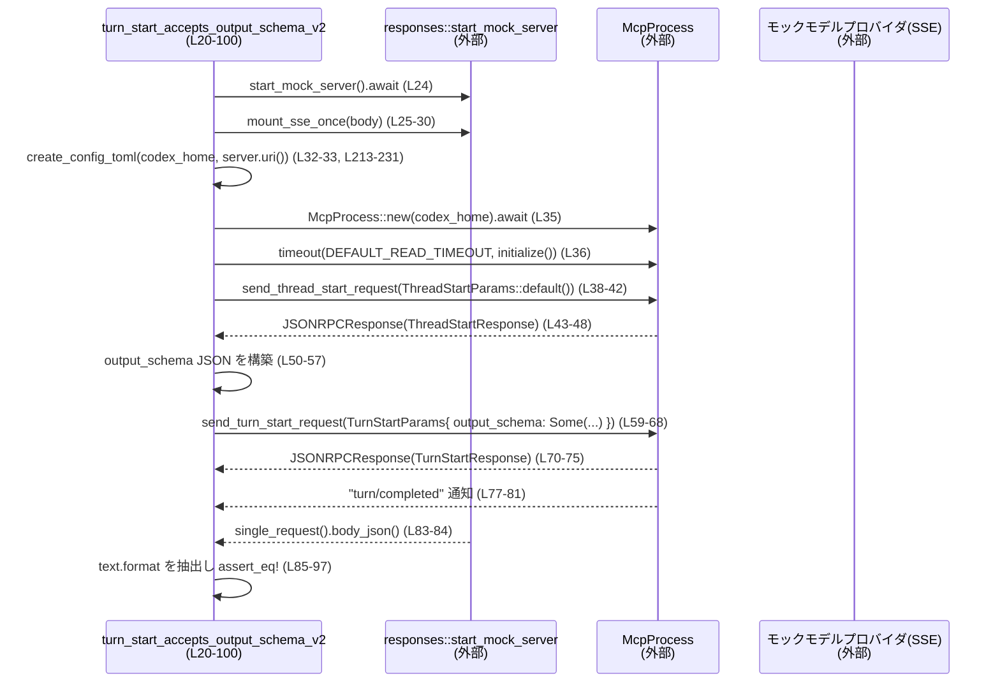

# app-server/tests/suite/v2/output_schema.rs

## 0. ざっくり一言

- Codex v2 の `turn/start` API における `output_schema` の振る舞い（モデルプロバイダへの伝播と「ターン単位」スコープ）を、モックサーバーと実プロセス起動を用いて検証する統合テスト群です（output_schema.rs:L20-211）。
- テスト用設定ファイル `config.toml` を生成するヘルパ関数も含みます（output_schema.rs:L213-234）。

---

## 1. このモジュールの役割

### 1.1 概要

- このモジュールは、Codex App Server v2 の `TurnStartParams.output_schema` が  
  - モデルプロバイダへの HTTP リクエストの JSON `text.format` に正しく変換されること（output_schema.rs:L50-57, L83-97）。  
  - `output_schema` の指定が「そのターンにのみ適用され、次のターンには引き継がれない」こと（output_schema.rs:L132-139, L165-174, L176-208）。  
  を検証します。
- テストは実際に `McpProcess`（アプリケーションサーバープロセスと推測されるヘルパ、実装はこのチャンクにはありません）を起動し、SSE を返すモックモデルプロバイダと通信する統合テストになっています（output_schema.rs:L24-36, L106-118）。

### 1.2 アーキテクチャ内での位置づけ

このテストファイルが依存している主なコンポーネントの関係を簡略化して示します。

```mermaid
graph TD
    A[output_schema.rs<br/>テスト本体<br/>(L20-211)] --> B[McpProcess<br/>(app_test_support)<br/>(定義は別crate)]
    A --> C[codex_app_server_protocol<br/>JSONRPCResponse, *StartParams<br/>(L4-10)]
    A --> D[core_test_support::responses<br/>モックHTTP/SSEサーバ<br/>(L11)]
    A --> E[TempDir (tempfile)<br/>一時ディレクトリ<br/>(L15)]
    A --> F[tokio::time::timeout<br/>タイムアウト制御<br/>(L16)]
    A --> G[create_config_toml<br/>config.toml生成<br/>(L213-234)]
```

- テストは `core_test_support::responses` で立ち上げたモックサーバーに向けて HTTP リクエストが飛ぶように `config.toml` を生成し（output_schema.rs:L24-33, L213-230）、  
  その設定で `McpProcess` を起動して JSON-RPC の `thread/start` と `turn/start` を発行します（output_schema.rs:L35-42, L59-68, L120-124, L141-151, L183-193）。
- モックサーバーに届いたリクエストボディの `text.format` を検査して、期待する JSON Schema 形式になっているか、あるいは付与されていないかを確認します（output_schema.rs:L83-97, L165-174, L207-208）。

### 1.3 設計上のポイント

- **統合テスト指向**  
  - 実際のプロセス（`McpProcess`）と HTTP モックサーバーを使い、API と外部プロバイダとの間のエンドツーエンドな挙動を検証しています（output_schema.rs:L24-36, L35-42, L106-118, L120-124）。
- **ネットワーク依存のスキップ**  
  - 冒頭で `skip_if_no_network!(Ok(()));` を呼び出し、CI やローカル環境でネットワークが利用不可な場合にテストをスキップできるようにしています（output_schema.rs:L22, L104）。
- **タイムアウトによるハング防止（並行性・安全性）**  
  - `tokio::time::timeout` で `initialize` やレスポンス待ちをラップし、非同期処理がハングした場合でも 10 秒で失敗にできます（output_schema.rs:L18, L36, L43-47, L70-74, L77-81, L118-119, L125-129, L152-156, L159-163, L194-198, L201-205）。
- **設定ファイルの共通化**  
  - `create_config_toml` によって、全テストで同じフォーマットの `config.toml` を生成するよう整理されています（output_schema.rs:L213-231）。
- **JSON Schema の扱いと契約**  
  - シンプルな JSON Schema オブジェクトを `serde_json::json!` で構築し（output_schema.rs:L50-57, L132-139）、  
    それが `text.format.schema` にそのまま埋め込まれていることを検証することで、サーバとプロバイダ間の契約をテストしています（output_schema.rs:L91-96, L168-173）。

---

## 2. 主要な機能一覧（コンポーネントインベントリー）

### 2.1 定義済みコンポーネント一覧

| 名前 | 種別 | 役割 / 用途 | 定義位置 |
|------|------|-------------|----------|
| `DEFAULT_READ_TIMEOUT` | 定数 | JSON-RPC 応答・通知を待つ際のデフォルトタイムアウト（10 秒） | output_schema.rs:L18 |
| `turn_start_accepts_output_schema_v2` | 非公開関数（`#[tokio::test]`） | `turn/start` で指定した `output_schema` がモデルプロバイダへのリクエスト `text.format` に反映されることを検証 | output_schema.rs:L20-100 |
| `turn_start_output_schema_is_per_turn_v2` | 非公開関数（`#[tokio::test]`） | 一度のターンで指定した `output_schema` が、次のターンでは指定しなければ適用されない（=ターン単位）ことを検証 | output_schema.rs:L102-211 |
| `create_config_toml` | 非公開関数 | 指定ディレクトリ配下にテスト用 `config.toml` を生成し、モックプロバイダに向けた設定を書く | output_schema.rs:L213-234 |

### 2.2 主要機能の要約

- `turn_start_accepts_output_schema_v2`  
  - `output_schema` を含む `TurnStartParams` を送信し、モックサーバーに届いた JSON の `text.format` が期待通りの JSON Schema 形式になっていることを `assert_eq!` で検証します（output_schema.rs:L50-57, L59-68, L83-97）。
- `turn_start_output_schema_is_per_turn_v2`  
  - 1 回目のターンで `output_schema` を指定 → `text.format` が存在する。  
  - 2 回目のターンで `output_schema: None` → `text.format` が存在しない（`pointer("/text/format")` が `None`）ことを検証します（output_schema.rs:L132-139, L141-151, L165-174, L176-193, L207-208）。
- `create_config_toml`  
  - モデルプロバイダの `base_url` にモックサーバー URI を埋め込んだ TOML を `config.toml` に書き出します（output_schema.rs:L213-231）。

---

## 3. 公開 API と詳細解説

### 3.1 型一覧（構造体・列挙体など）

このファイル内で新たに定義されている構造体・列挙体はありません（使用している型はすべて外部クレートからのインポートです：output_schema.rs:L1-16）。

主に利用している外部型（定義はこのチャンクには現れません）：

- `McpProcess`（`app_test_support`）: Codex サーバープロセスをテストから操作するためのヘルパ型と推測されます（output_schema.rs:L2, L35, L117）。  
- `ThreadStartParams`, `ThreadStartResponse`, `TurnStartParams`, `TurnStartResponse`, `JSONRPCResponse`, `RequestId`, `UserInput`（`codex_app_server_protocol`）: JSON-RPC v2 ベースのスレッド・ターン開始リクエスト/レスポンス用の型（output_schema.rs:L4-10）。

※ これらの型の詳細は別ファイル／別クレートにあります。

### 3.2 関数詳細

#### `turn_start_accepts_output_schema_v2() -> Result<()>`

**概要**

- Codex v2 の `turn/start` で `output_schema` を指定した場合、モデルプロバイダへの HTTP リクエスト `text.format` に JSON Schema 形式で渡されることを検証する非同期テストです（output_schema.rs:L20-100）。

**引数**

- なし（テスト関数なので外部から呼び出すことは想定されていません）。

**戻り値**

- `anyhow::Result<()>`  
  - 成功時は `Ok(())`（output_schema.rs:L99）。  
  - 途中の I/O や非同期処理、JSON パースが失敗した場合は `Err(anyhow::Error)` になります（すべて `?` 演算子で伝播：output_schema.rs:L32, L33, L35, L36, L42, L47, L48, L69, L74, L75, L81）。

**内部処理の流れ**

1. **ネットワーク可否チェック**  
   - `skip_if_no_network!(Ok(()));` でネットワークが利用不可な環境ではテストをスキップします（output_schema.rs:L22）。
2. **モックサーバーと SSE レスポンスの準備**  
   - `responses::start_mock_server().await` でモック HTTP サーバーを起動（output_schema.rs:L24）。  
   - `responses::sse(vec![...])` で SSE イベント列を組み立て（response_created → assistant_message → completed）、`mount_sse_once` で一度だけ返すように設定します（output_schema.rs:L25-30）。
3. **設定ファイルと MCP プロセスの初期化**  
   - `TempDir::new()?` で一時ディレクトリを作成し（output_schema.rs:L32）、  
     `create_config_toml` でモックサーバー URI を埋め込んだ `config.toml` を書き込みます（output_schema.rs:L33, L213-231）。  
   - `McpProcess::new` で MCP プロセスを立ち上げ、`initialize` を 10 秒のタイムアウト付きで実行します（output_schema.rs:L35-36, L18）。
4. **スレッド開始 (`thread/start`)**  
   - `send_thread_start_request(ThreadStartParams { ..Default::default() })` を送信し（output_schema.rs:L38-42）、  
     `read_stream_until_response_message(RequestId::Integer(thread_req))` をタイムアウト付きで待機、`ThreadStartResponse` をデコードして `thread` 情報を取得します（output_schema.rs:L43-48）。
5. **`output_schema` を含むターン開始 (`turn/start`)**  
   - シンプルな JSON Schema を `serde_json::json!` で構築します（`answer` という必須 string プロパティを持つ object: output_schema.rs:L50-57）。  
   - `TurnStartParams` の `output_schema: Some(output_schema.clone())` としてターン開始リクエストを送信します（output_schema.rs:L59-68）。  
   - `read_stream_until_response_message` でレスポンスを待ち `TurnStartResponse` にデコードします（output_schema.rs:L70-75）。
6. **ターン完了通知の待機**  
   - `read_stream_until_notification_message("turn/completed")` をタイムアウト付きで待機します（output_schema.rs:L77-81）。
7. **モックサーバーへのリクエスト検証**  
   - `response_mock.single_request().body_json()` でモックサーバーに届いた唯一のリクエストボディを取得し（output_schema.rs:L83-84）、  
     `payload.get("text").get("format")` で `text.format` を取り出します（output_schema.rs:L85-88）。  
   - それが次の JSON に一致することを `assert_eq!` で検証します（output_schema.rs:L89-97）:  
     - `"name": "codex_output_schema"`  
     - `"type": "json_schema"`  
     - `"strict": true`  
     - `"schema": output_schema`（先ほど構築した JSON Schema をそのまま埋め込んだもの）。

**Examples（使用例）**

通常は直接呼び出さず、`cargo test` で実行される前提のテスト関数です。個別に実行したい場合のコマンド例:

```bash
# このテストだけを実行
cargo test --test app-server -- turn_start_accepts_output_schema_v2
```

**Errors / Panics**

- **`Result` の `Err`**  
  - 一時ディレクトリ作成や `config.toml` の書き込み失敗（output_schema.rs:L32-33, L213-230）。  
  - MCP プロセス起動・初期化失敗（output_schema.rs:L35-36）。  
  - JSON-RPC の送受信やパースに失敗した場合（`send_*` / `read_*` / `to_response` の `?`：output_schema.rs:L42, L47-48, L69, L74-75, L81）。
  - `tokio::time::timeout` によるタイムアウトも `Err` として伝播します（output_schema.rs:L36, L43-47, L70-74, L77-81）。
- **panic になる条件**  
  - `payload.get("text").expect("request missing text field")` で `text` フィールドが存在しない場合（output_schema.rs:L85）。  
  - `text.get("format").expect("request missing text.format field")` で `format` フィールドがない場合（output_schema.rs:L86-88）。  
  - `assert_eq!(format, &expected_json)` が不一致だった場合（output_schema.rs:L89-97）。

**Edge cases（エッジケース）**

- ネットワーク不可の環境  
  - `skip_if_no_network!` によりテスト自体がスキップされるため、失敗にはなりません（output_schema.rs:L22）。
- モックサーバーにリクエストが届かない場合  
  - `response_mock.single_request()` の挙動はこのチャンクには現れませんが、一般的にはリクエストが無いと panic かエラーになる可能性があります（output_schema.rs:L83）。  
- `output_schema` が JSON として不正な場合  
  - このテストでは手動で生成しているため正常形のみを扱っており、不正スキーマの挙動はカバーしていません（output_schema.rs:L50-57）。

**使用上の注意点**

- テストはローカルファイルシステムと TCP ポートを使用するため、権限や環境に依存します（TempDir/モックサーバー、output_schema.rs:L24-32）。  
- 非同期処理はすべて `#[tokio::test]` のコンテキストで実行され、`timeout` でラップされていますが、10 秒を超える遅延があるとテストが失敗します（output_schema.rs:L18, L36, L43-47, L70-74, L77-81）。  
- `expect` と `assert_eq!` により失敗時は即座にパニックし、詳細な差分は `pretty_assertions::assert_eq` によって表示されます（output_schema.rs:L13, L89-97）。

---

#### `turn_start_output_schema_is_per_turn_v2() -> Result<()>`

**概要**

- `output_schema` が「ターン単位」で適用されるという契約をテストする非同期テストです。  
  1 回目のターンで `output_schema` を指定 → `text.format` が存在。  
  2 回目のターンで `output_schema: None` → `text.format` が存在しないことを確認します（output_schema.rs:L102-211）。

**引数**

- なし（テスト専用）。

**戻り値**

- `anyhow::Result<()>`（成功時は `Ok(())`、途中の I/O や非同期処理の失敗は `Err`：output_schema.rs:L210）。

**内部処理の流れ**

1. **ネットワーク可否チェックとサーバー起動**  
   - `skip_if_no_network!(Ok(()));`（output_schema.rs:L104）。  
   - `start_mock_server` でモックサーバー起動（output_schema.rs:L106）。  
   - 1 回目のターン用 SSE ボディ `body1` を設定し、`mount_sse_once` でマウント（output_schema.rs:L107-112）。
2. **設定・MCP 初期化・スレッド開始**  
   - `TempDir` 作成と `create_config_toml`（output_schema.rs:L114-115, L213-231）。  
   - `McpProcess::new` と `initialize`（output_schema.rs:L117-118）。  
   - `send_thread_start_request` → `read_stream_until_response_message` → `ThreadStartResponse` 取得（output_schema.rs:L120-130）。
3. **1 回目のターン: `output_schema` あり**  
   - `output_schema` を `serde_json::json!` で構築（output_schema.rs:L132-139）。  
   - `TurnStartParams` で `output_schema: Some(output_schema.clone())` を指定して送信（output_schema.rs:L141-151）。  
   - レスポンス待ちと `TurnStartResponse` へのデコード（output_schema.rs:L152-157）。  
   - `"turn/completed"` 通知の待機（output_schema.rs:L159-163）。  
   - モックサーバーに届いたリクエスト `payload1` の `pointer("/text/format")` が `Some(expected_json)` であることを `assert_eq!`（output_schema.rs:L165-174）。
4. **2 回目のターン: `output_schema` なし**  
   - 新しい SSE ボディ `body2`・`response_mock2` をセット（output_schema.rs:L176-181）。  
   - `TurnStartParams` で `output_schema: None` を指定し、別の入力テキスト `"Hello again"` を送信（output_schema.rs:L183-191）。  
   - レスポンス待ちと `TurnStartResponse` のデコード（output_schema.rs:L194-199）。  
   - `"turn/completed"` 通知の待機（output_schema.rs:L201-205）。  
   - 2 回目のリクエスト `payload2` の `pointer("/text/format")` が `None` であることを検証（output_schema.rs:L207-208）。

**Examples（使用例）**

こちらも `cargo test` から実行されるテストです。単体での実行例:

```bash
cargo test --test app-server -- turn_start_output_schema_is_per_turn_v2
```

**Errors / Panics**

- `Result` の `Err` の条件は、ほぼ前のテストと同様で、ファイル I/O・MCP 起動・JSON-RPC 通信・`timeout` によるタイムアウトなどです（output_schema.rs:L114-118, L120-130, L141-151, L152-157, L159-163, L183-193, L194-199, L201-205）。
- Panic になる主な条件:
  - モックサーバーにリクエストが届かず `single_request()` が失敗する場合（output_schema.rs:L165, L207）。  
  - `assert_eq!(payload1.pointer("/text/format"), Some(&expected))` が不一致の場合（output_schema.rs:L166-174）。  
  - `assert_eq!(payload2.pointer("/text/format"), None)` が不一致の場合（output_schema.rs:L207-208）。

**Edge cases（エッジケース）**

- 1 回目のターンで `output_schema` が誤って無視された場合  
  - `payload1.pointer("/text/format")` が `None` となり、1 回目の `assert_eq!` が失敗します（output_schema.rs:L165-174）。
- 2 回目のターンで前のスキーマが誤って再利用される場合  
  - `payload2.pointer("/text/format")` が `Some(...)` となり、`assert_eq!(..., None)` が失敗します（output_schema.rs:L207-208）。  
  - これは「output_schema はターンごとの設定である」という契約を破る状態です。
- `output_schema` のスキーマ自体が変化した場合  
  - 1 回目と 2 回目のテストはいずれもスキーマ内容を固定的に比較しているため、プロトコル変更時にはテストの更新が必要になります（output_schema.rs:L132-139, L168-173）。

**使用上の注意点**

- このテストは `output_schema` のスコープ（ターンのみ or スレッド全体）を仕様として固定化しています。実装を変更する場合は、このテストを通すかどうかで仕様の意図を確認する必要があります。  
- JSON Pointer を使って `payload.pointer("/text/format")` と取得しているため、JSON 構造が変わるとテストが壊れます（output_schema.rs:L165-168, L207-208）。

---

#### `create_config_toml(codex_home: &Path, server_uri: &str) -> std::io::Result<()>`

**概要**

- テスト用の Codex サーバー設定ファイル `config.toml` を指定ディレクトリに書き出すヘルパ関数です（output_schema.rs:L213-234）。

**引数**

| 引数名 | 型 | 説明 |
|--------|----|------|
| `codex_home` | `&Path` | `config.toml` を作成するディレクトリを表すパス（output_schema.rs:L213-214）。 |
| `server_uri` | `&str` | モックサーバーのベース URI。`base_url = "{server_uri}/v1"` に埋め込まれます（output_schema.rs:L213, L227）。 |

**戻り値**

- `std::io::Result<()>`  
  - 成功時は `Ok(())`。  
  - ファイル作成・書き込みに失敗した場合は `Err(std::io::Error)`（output_schema.rs:L213-233）。

**内部処理の流れ**

1. `codex_home.join("config.toml")` で設定ファイルのパスを構築（output_schema.rs:L214）。
2. `format!(r#"...{server_uri}/v1..."#)` で TOML テキストを生成（output_schema.rs:L217-231）。
   - `model = "mock-model"`  
   - `approval_policy = "never"`  
   - `sandbox_mode = "read-only"`  
   - `model_provider = "mock_provider"`  
   - `[model_providers.mock_provider]` セクションに `base_url`, `wire_api = "responses"`, `request_max_retries = 0`, `stream_max_retries = 0` を設定（output_schema.rs:L219-230）。
3. `std::fs::write(config_toml, content)` でファイルを書き込み（output_schema.rs:L215-233）。

**Examples（使用例）**

テスト内では以下のように使われています（output_schema.rs:L32-33, L114-115）。

```rust
// 一時ディレクトリを生成し、その直下に config.toml を書き出す例
let codex_home = TempDir::new()?;                              // 一時ディレクトリ作成
create_config_toml(codex_home.path(), &server.uri())?;         // モックサーバーに向けた config.toml を生成
```

**Errors / Panics**

- `codex_home` が存在しない・書き込み権限が無いなどで `std::fs::write` が失敗すると `Err(std::io::Error)` を返します（output_schema.rs:L214-233）。
- この関数自体は panic を起こしません（`unwrap`/`expect` 等は使用していません）。

**Edge cases（エッジケース）**

- `server_uri` が空文字列または不正な URI 文字列  
  - 関数内では単に文字列として埋め込むだけなので、TOML の構文としては有効でも、後続の HTTP クライアントでエラーになる可能性があります（output_schema.rs:L217-231）。  
  - テストでは `responses::start_mock_server().uri()` を渡しているため、実際には妥当な URI が渡される前提です（output_schema.rs:L33, L115）。
- `codex_home` が読み取り専用ファイルシステムを指している場合  
  - 書き込みに失敗し、`Err` になります。

**使用上の注意点**

- テスト以外で再利用する場合でも、ハードコードされた `model`, `approval_policy`, `sandbox_mode`, `model_provider` 名に依存することになります（output_schema.rs:L219-224）。  
  これらのキー名や構造が仕様として固まっているかを確認する必要があります。  
- `wire_api = "responses"` としており、モック専用の値である可能性があります（output_schema.rs:L228）。本番設定には適さない前提と考えられますが、このチャンクからは断定できません。

### 3.3 その他の関数

- このファイルには、上記 3 関数以外の関数定義はありません。

---

## 4. データフロー

ここでは、`turn_start_accepts_output_schema_v2` における代表的なデータフローを示します。

1. テストがモック HTTP サーバーと SSE 応答を準備します（output_schema.rs:L24-30）。  
2. `create_config_toml` でモックサーバーへのベース URL を含む `config.toml` を生成し、`McpProcess` をその設定で起動＋初期化します（output_schema.rs:L32-36, L213-231）。  
3. テストは JSON-RPC で `thread/start` → `turn/start` を発行し、その中で `output_schema` を指定します（output_schema.rs:L38-42, L59-68）。  
4. MCP はモックサーバーに対して HTTP リクエストを送り、そこで `text.format` に JSON Schema が付与されます（リクエスト作成処理自体はこのチャンクには現れません）。  
5. テストはモックサーバーに届いたリクエストボディを検査し、`text.format` が期待通りか検証します（output_schema.rs:L83-97）。



この図から分かるように、テストは「MCP が `output_schema` をどのように下流の HTTP リクエストに埋め込むか」の振る舞いをブラックボックス的に検証しています。

---

## 5. 使い方（How to Use）

### 5.1 基本的な使用方法

このファイル自体はテストモジュールのため、通常は `cargo test` を実行することで利用します。

テストの典型的なフロー（両テストに共通）を簡略化すると次のようになります。

```rust
#[tokio::test]                                           // Tokio ランタイム上で実行される非同期テスト
async fn example_turn_test() -> anyhow::Result<()> {     // anyhow::Result でエラーを簡便に扱う
    skip_if_no_network!(Ok(()));                        // ネットワーク不可ならテストをスキップ（L22, L104）

    let server = responses::start_mock_server().await;  // モックHTTPサーバー起動（L24, L106）

    let body = responses::sse(vec![                     // モックSSEレスポンスを構築（L25-29, L107-111）
        // responses::ev_response_created(...),
        // responses::ev_assistant_message(...),
        // responses::ev_completed(...),
    ]);
    let _mock = responses::mount_sse_once(&server, body).await; // 一度だけSSEを返すようマウント（L30, L112, L181）

    let codex_home = TempDir::new()?;                   // 一時ディレクトリ作成（L32, L114）
    create_config_toml(codex_home.path(), &server.uri())?; // config.toml生成（L33, L115, L213-231）

    let mut mcp = McpProcess::new(codex_home.path()).await?; // MCPプロセス起動（L35, L117）
    timeout(DEFAULT_READ_TIMEOUT, mcp.initialize()).await??; // 初期化＋タイムアウト（L36, L118）

    // ここで thread_start / turn_start を発行して検証ロジックを書く…

    Ok(())                                              // 成功終了（L99, L210）
}
```

### 5.2 よくある使用パターン

- **`output_schema` を指定したターンの検証**  
  - `TurnStartParams { output_schema: Some(schema), ..Default::default() }` を使い、モックサーバーに届く `text.format` を検査するパターン（output_schema.rs:L59-68, L141-151, L165-174）。
- **`output_schema` 無しのターンの検証**  
  - `output_schema: None` を指定して送信し、`payload.pointer("/text/format")` が `None` になることを確認するパターン（output_schema.rs:L183-191, L207-208）。
- **タイムアウト付きの非同期呼び出し**  
  - `timeout(DEFAULT_READ_TIMEOUT, future).await??;` という形で、`timeout` が返す `Result<Result<T, E>, Elapsed>` を `??` で 2 段階アンラップしている点が特徴です（output_schema.rs:L36, L43-47, L70-74, L77-81, L118-119, L125-129, L152-156, L159-163, L194-198, L201-205）。  
    - 1 回目の `?` で `Elapsed`（タイムアウト）を伝播。  
    - 2 回目の `?` で元の `Result<T, E>` のエラーを伝播。

### 5.3 よくある間違い（起こりうる誤用）

※ ここでは、このコードパターンから想定される注意点を述べます。実際に「よく起こっている」かどうかは、このチャンクからは分かりません。

```rust
// 誤りの例: config.toml を生成せずに MCP を起動する
let codex_home = TempDir::new()?;
// create_config_toml を呼んでいないため、McpProcess::new / initialize で失敗する可能性がある
let mut mcp = McpProcess::new(codex_home.path()).await?;

// 正しい例: 先に create_config_toml を呼んで設定を用意する
let codex_home = TempDir::new()?;
create_config_toml(codex_home.path(), &server.uri())?;
let mut mcp = McpProcess::new(codex_home.path()).await?;
```

```rust
// 誤りの例: timeout を使わずにレスポンス待ちを行い、ハングする可能性がある
let resp = mcp.read_stream_until_response_message(id).await?;

// 正しい例: timeout を使ってハングを防ぐ
let resp = timeout(DEFAULT_READ_TIMEOUT, mcp.read_stream_until_response_message(id)).await??;
```

### 5.4 使用上の注意点（まとめ）

- **非同期と並行性**  
  - テストは `#[tokio::test]` のもとで実行されるため、Tokio ランタイムとの互換性を保つ必要があります（output_schema.rs:L20, L102）。  
  - MCP プロセスとの通信が遅延・ハングした場合でも、`timeout` によって 10 秒でテストを失敗させる設計になっています（output_schema.rs:L18, L36, L43-47 ほか）。
- **エラー処理**  
  - ほぼすべての I/O・非同期呼び出しは `?` で伝播し、`anyhow::Result` によって一元管理されています（output_schema.rs:L32-36, L42, L47-48, L69, L74-75, L81 ほか）。  
  - 期待値チェックには `expect` と `assert_eq!` を使っており、仕様違反時は panic により即座に失敗します（output_schema.rs:L85-88, L89-97, L166-174, L207-208）。
- **パフォーマンス・スケール**  
  - 各テストは MCP プロセスの起動とモックサーバー起動を伴うため、実行コストは高めです。大量の類似テストを追加する場合は、実行時間や CI の負荷を考慮する必要があります（起動箇所: output_schema.rs:L24-36, L106-118）。
- **セキュリティ**  
  - ファイル書き込みは `TempDir` 配下に限定されており、任意パスへの書き込みは行っていません（output_schema.rs:L32, L114, L213-214）。  
  - モックサーバーへの接続 URI はテストコード内で生成されるものであり、外部から任意に注入されていません（output_schema.rs:L24, L106, L213-231）。

---

## 6. 変更の仕方（How to Modify）

### 6.1 新しいテスト・機能を追加する場合

1. **既存テストの構造を参考にする**  
   - `turn_start_accepts_output_schema_v2` または `turn_start_output_schema_is_per_turn_v2` の流れ（モックサーバー → config.toml → MCP 起動 → JSON-RPC → 検証）を踏襲します（output_schema.rs:L24-36, L38-48, L59-75, L77-81, L83-97）。
2. **共通初期化コードの再利用**  
   - `create_config_toml` を利用し、一時ディレクトリ + config.toml のセットアップを共有します（output_schema.rs:L32-33, L114-115, L213-231）。
3. **検証したい契約の明確化**  
   - 例: 別の `output_schema` 形式、別の `input` 種類、エラー応答時の挙動など。  
   - 必要に応じて、`responses::sse` に渡すイベント列を変更し、MCP の振る舞いを変えます（output_schema.rs:L25-29, L107-111, L176-180）。
4. **JSON 検証ロジックの追加**  
   - `payload.pointer("/path")` や `payload.get("field")` を使って、必要な JSON 部分を取り出し、`assert_eq!` などで比較します（output_schema.rs:L83-88, L165-168, L207-208）。

### 6.2 既存の機能を変更する場合

- **`output_schema` の仕様変更時**  
  - `text.format` のプロパティ名や構造が変わる場合、両方のテストの期待 JSON を更新する必要があります（output_schema.rs:L91-96, L168-173）。  
  - スコープ（ターン単位かスレッド単位か）を変更する場合は、`turn_start_output_schema_is_per_turn_v2` のアサーションロジックを仕様に合わせて書き換えます（output_schema.rs:L165-174, L207-208）。
- **設定ファイル形式の変更時**  
  - Codex の `config.toml` 仕様が変わる場合、`create_config_toml` の内容を更新し、それに依存する他のテストへの影響も確認する必要があります（output_schema.rs:L219-230）。  
  - `model_provider` 名や `wire_api` の値が変わると、モックサーバーとの連携にも影響が出る可能性があります。
- **タイムアウト値の変更時**  
  - `DEFAULT_READ_TIMEOUT` を変更すると、すべての `timeout` 利用箇所に影響します（output_schema.rs:L18, L36, L43-47, L70-74, L77-81 ほか）。  
  - テストの安定性と実行時間のトレードオフを考慮する必要があります。

---

## 7. 関連ファイル・クレート

このモジュールと密接に関係する外部コンポーネント（実装はこのチャンクには現れません）:

| パス / クレート | 役割 / 関係 |
|-----------------|------------|
| `app_test_support::McpProcess`, `app_test_support::to_response` | MCP プロセスの起動・JSON-RPC の送受信を抽象化するテスト支援クレート。Turn/Thread Start の送信やレスポンスのデコードに利用されています（output_schema.rs:L2-3, L35, L38-42, L43-48, L59-75, L117-118, L120-130, L141-157, L183-199）。 |
| `core_test_support::responses` | モック HTTP サーバーと SSE 応答生成を提供するテスト支援クレート。モデルプロバイダを模したイベントストリームを構築するために使われています（output_schema.rs:L11, L24-30, L106-112, L176-181）。 |
| `core_test_support::skip_if_no_network` | ネットワークが利用不可な環境でテストをスキップするためのマクロ（output_schema.rs:L12, L22, L104）。 |
| `codex_app_server_protocol` | JSON-RPC ベースの Codex App Server プロトコル定義クレート。Thread/Turn Start のリクエスト・レスポンス型、および `UserInput` 型などを提供します（output_schema.rs:L4-10）。 |
| `tempfile::TempDir` | 一時ディレクトリを生成・自動削除するユーティリティ。テスト用の `codex_home` を構築するために使われます（output_schema.rs:L15, L32, L114）。 |
| `tokio::time::timeout` | 非同期処理に対するタイムアウトを設定するために使用（output_schema.rs:L16, L36, L43-47, L70-74, L77-81, L118-119, L125-129, L152-156, L159-163, L194-198, L201-205）。 |

このファイルは、Codex v2 `output_schema` 周辺の挙動に対する仕様書的な役割も果たす統合テストであり、実装変更時はまずここが通るかどうかを確認することで、仕様との整合性をチェックできる構造になっています。
