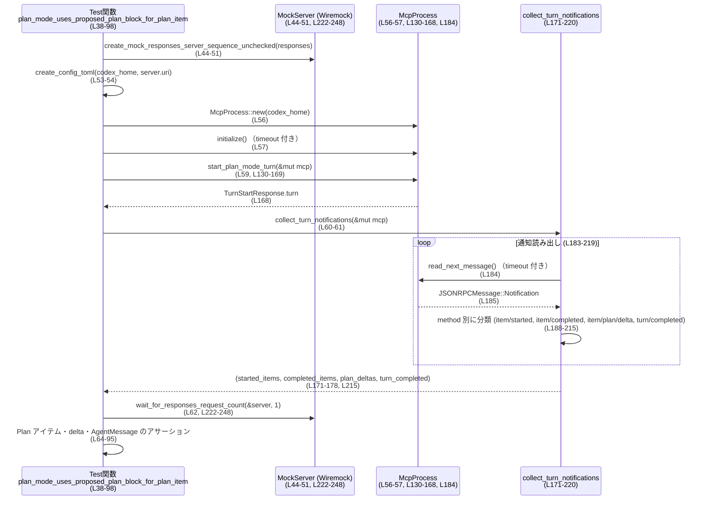

# app-server/tests/suite/v2/plan_item.rs コード解説

## 0. ざっくり一言

plan モードの会話で、モデル出力中の `<proposed_plan> ... </proposed_plan>` ブロックから **Plan アイテムとそのストリーミング delta が正しく生成されるか**、および **ブロックが無い場合は Plan アイテムを出さないこと** を検証する統合テストと、そのためのヘルパー群のファイルです（plan_item.rs:L38-128, L130-289）。

---

## 1. このモジュールの役割

### 1.1 概要

- このモジュールは、**コラボレーションモード “Plan”** におけるアプリケーションサーバの挙動を検証するテストを提供します（plan_item.rs:L100-128）。
- モデルの SSE 応答をモックし、JSON-RPC 経由で流れてくる **ThreadItem::Plan** と `item/plan/delta` 通知、および turn 完了通知を観測します（plan_item.rs:L44-51, L171-220）。
- 必要な設定ファイル `config.toml` の生成や Wiremock サーバへのリクエスト数を確認するヘルパーも含みます（plan_item.rs:L252-289, L222-250）。

### 1.2 アーキテクチャ内での位置づけ

このファイルはテストコードであり、本番 API ではなく **テストスイートの一部** です。主な依存関係は以下です（use 文より）:

- `app_test_support::McpProcess`：被テストプロセスとの橋渡しをするヘルパー（plan_item.rs:L4, L56-60, L130-168）。
- `core_test_support::responses`：モデル SSE 応答のモックデータ生成（plan_item.rs:L26, L44-50, L104-108）。
- `wiremock::MockServer`：HTTP モックサーバ。`/responses` エンドポイントへの POST を監視（plan_item.rs:L34, L51, L222-249）。
- `codex_app_server_protocol`：ThreadItem, Turn, 通知型など JSON-RPC プロトコルの型定義（plan_item.rs:L7-20, L130-168, L171-220）。
- `codex_protocol::config_types` / `codex_features`：config.toml 内で使う設定・ feature flag（plan_item.rs:L21-25, L252-263, L271-286）。

依存関係の概略を Mermaid で示します。

```mermaid
graph TD
    subgraph Tests[このファイルのテスト (plan_item.rs)]
        T1[plan_mode_uses_proposed_plan_block_for_plan_item<br/>(L38-98)]
        T2[plan_mode_without_proposed_plan_does_not_emit_plan_item<br/>(L100-128)]
    end

    H1[start_plan_mode_turn<br/>(L130-169)]
    H2[collect_turn_notifications<br/>(L171-220)]
    H3[wait_for_responses_request_count<br/>(L222-250)]
    H4[create_config_toml<br/>(L252-289)]

    Ext1[McpProcess (app_test_support)<br/>(L4, L56-60, L130-168)]
    Ext2[MockServer (wiremock)<br/>(L34, L51, L222-249)]
    Ext3[codex_app_server_protocol 型群<br/>(L7-20, L130-168, L171-220)]
    Ext4[core_test_support::responses<br/>(L26, L44-50, L104-108)]
    Ext5[config_types, FEATURES<br/>(L21-25, L252-263)]

    T1 --> H4
    T2 --> H4
    T1 --> Ext4
    T2 --> Ext4
    T1 --> Ext2
    T2 --> Ext2
    T1 --> Ext1
    T2 --> Ext1
    T1 --> H1
    T2 --> H1
    T1 --> H2
    T2 --> H2
    T1 --> H3
    T2 --> H3

    H1 --> Ext1
    H1 --> Ext3
    H2 --> Ext1
    H2 --> Ext3
    H3 --> Ext2
    H4 --> Ext5
```

### 1.3 設計上のポイント

- **非同期・並行実行前提**  
  - テスト関数は `#[tokio::test(flavor = "multi_thread", worker_threads = 4)]` でマルチスレッドランタイム上で実行されます（plan_item.rs:L38, L100）。
  - サーバとのやり取りや通知読み出しはすべて async 関数＋`tokio::time::timeout` によって行われ、ハングを防いでいます（plan_item.rs:L57, L137-141, L164-167, L184, L226-248）。

- **エラー処理の方針**  
  - テスト関数とヘルパーの戻り値は `anyhow::Result` / `std::io::Result` で統一され、`?` 演算子で早期リターンします（plan_item.rs:L39, L101, L130, L171, L222, L252）。
  - JSON-RPC 通知の `params` 欄が欠落している場合は `anyhow!` メッセージ付きでエラーにするなど、**プロトコル前提をテストコード側で確認**しています（plan_item.rs:L191-193, L198-200, L205-207, L211-214）。

- **状態を持たないヘルパー**  
  - ヘルパー関数はいずれも引数で必要情報を受け取り、内部に長期的な共有状態を持たない構造です（plan_item.rs:L130-169, L171-220, L222-250, L252-289）。

- **テスト前提の明示的な契約**  
  - Plan モードを有効にする feature flag（`Feature::CollaborationModes`）が config.toml に必須であることを `create_config_toml` で前提にしています（plan_item.rs:L253-263）。
  - モデルの SSE 応答に `<proposed_plan>` ブロックが含まれている／いない、という条件で挙動を切り替えています（plan_item.rs:L42-49, L104-107）。

---

## 1.4 コンポーネント一覧（インベントリー）

このファイル内で定義されている主なコンポーネント一覧です。

| 名前 | 種別 | 役割 | 行範囲 |
|------|------|------|--------|
| `DEFAULT_READ_TIMEOUT` | 定数 | 各種待ち処理で使用する読み取りタイムアウト（10秒） | plan_item.rs:L36 |
| `plan_mode_uses_proposed_plan_block_for_plan_item` | async テスト関数 | `<proposed_plan>` ブロックから Plan アイテムと plan delta が生成されることを検証 | plan_item.rs:L38-98 |
| `plan_mode_without_proposed_plan_does_not_emit_plan_item` | async テスト関数 | `<proposed_plan>` ブロックが無い場合に Plan アイテム／delta が出ないことを検証 | plan_item.rs:L100-128 |
| `start_plan_mode_turn` | async ヘルパー関数 | 新しいスレッドを開始し、コラボレーションモード Plan で turn を開始して `Turn` を返す | plan_item.rs:L130-169 |
| `collect_turn_notifications` | async ヘルパー関数 | JSON-RPC 通知ストリームから item/started, item/completed, item/plan/delta, turn/completed を収集 | plan_item.rs:L171-220 |
| `wait_for_responses_request_count` | async ヘルパー関数 | Wiremock が受け取った `/responses` リクエスト数が期待値に達するまで待機 | plan_item.rs:L222-250 |
| `create_config_toml` | 同期ヘルパー関数 | 一時ディレクトリ配下にテスト用 `config.toml` を生成し、Plan モード feature や Mock プロバイダ設定を書く | plan_item.rs:L252-289 |

---

## 2. 主要な機能一覧

- Plan モード turn 開始ヘルパー: `start_plan_mode_turn` で Plan モードの `Turn` を開始（plan_item.rs:L130-169）。
- 通知収集: `collect_turn_notifications` が item/started, item/completed, item/plan/delta, turn/completed を分類して返却（plan_item.rs:L171-220）。
- モックサーバへのリクエスト確認: `wait_for_responses_request_count` で `/responses` への POST 回数を検証（plan_item.rs:L222-250）。
- テスト用設定ファイル生成: `create_config_toml` でコラボレーションモード Feature を有効にした config.toml を生成（plan_item.rs:L252-289）。
- Plan ブロックありの挙動テスト: `<proposed_plan>` ブロックから Plan アイテムと plan delta を生成し、AgentMessage も同時に存在することを確認（plan_item.rs:L38-98）。
- Plan ブロックなしの挙動テスト: Plan アイテムも plan delta も生成されないことを確認（plan_item.rs:L100-128）。

---

## 3. 公開 API と詳細解説

このファイル自体はテストモジュールであり、**外部クレートに公開される API は定義していません**。ここでは他のテストから再利用しうるヘルパー関数を「モジュール内の API」として扱います。

### 3.1 型一覧（このファイルから見える主要型）

このファイル内で新規定義されている型はありませんが、テストロジックを理解するうえで重要な外部型を示します。

| 名前 | 種別 | 役割 / 用途 | 根拠 |
|------|------|-------------|------|
| `McpProcess` | 構造体（外部） | テスト対象プロセスとのインタラクションを行うヘルパー。`new`, `initialize`, `send_*_request`, `read_*` などを提供（実装はこのチャンク外）。 | plan_item.rs:L4, L56-60, L130-168, L171-185 |
| `MockServer` | 構造体（wiremock） | HTTP モックサーバ。`received_requests` により受信リクエストを取得可能。 | plan_item.rs:L34, L51, L222-248 |
| `ThreadItem` | enum（外部） | 会話スレッド内のアイテム。ここでは `Plan { id, text }` と `AgentMessage` 変種が使われています。 | plan_item.rs:L13, L67-70, L82-89, L91-94, L121-124 |
| `PlanDeltaNotification` | 構造体（外部） | Plan アイテムに対する delta 通知。`delta`, `item_id` フィールドを使用。 | plan_item.rs:L11, L72-81, L176-177, L203-208 |
| `TurnCompletedNotification` | 構造体（外部） | `turn/completed` 通知の payload。`turn.id`, `turn.status` を使用。 | plan_item.rs:L16, L60-61, L64-65, L177-178, L210-215 |
| `TurnStatus` | enum（外部） | Turn の状態。テストでは `TurnStatus::Completed` を期待。 | plan_item.rs:L19, L65 |
| `ThreadStartParams` / `ThreadStartResponse` | 構造体（外部） | Thread 開始リクエストとレスポンス。`model` や `thread.id` を設定・取得。 | plan_item.rs:L14-15, L130-142 |
| `TurnStartParams` / `TurnStartResponse` | 構造体（外部） | Turn 開始リクエストとレスポンス。`thread_id`, `input`, `collaboration_mode`, `turn` を扱う。 | plan_item.rs:L17-18, L152-168 |
| `CollaborationMode`, `ModeKind`, `Settings` | 構造体・enum（外部） | Plan モードの設定を表現。`ModeKind::Plan` とモデル名などを含む。 | plan_item.rs:L23-25, L144-151 |
| `Feature`, `FEATURES` | enum / 定数配列（外部） | Feature flag 管理。`Feature::CollaborationModes` を有効化し、`FEATURES` から対応キーを検索。 | plan_item.rs:L21-22, L252-263 |
| `JSONRPCMessage`, `JSONRPCResponse`, `RequestId` | enum / 型（外部） | JSON-RPC メッセージ表現。通知とレスポンスの識別に使用。 | plan_item.rs:L9-12, L137-141, L164-167, L184-188 |

※ これらの実装詳細は **このチャンクには現れません**。使われ方から役割を説明しています。

---

### 3.2 関数詳細（最大 7 件）

#### `plan_mode_uses_proposed_plan_block_for_plan_item() -> Result<()>`

**概要**

- Plan モードでの turn において、モデル応答に含まれる `<proposed_plan>...</proposed_plan>` ブロックから **ThreadItem::Plan** が生成され、かつ同時に AgentMessage アイテムも生成されることを検証する統合テストです（plan_item.rs:L38-98）。

**引数**

- なし（テスト関数）。Tokio ランタイムから直接呼び出されます。

**戻り値**

- `anyhow::Result<()>`  
  - すべての手順とアサーションが成功すれば `Ok(())`。  
  - 途中の IO や JSON パース、タイムアウト、アサーション失敗などで `Err` となり、テストが失敗します（plan_item.rs:L39, L53-57, L59-62）。

**内部処理の流れ**

1. ネットワーク依存の環境ではテストをスキップする可能性がある `skip_if_no_network!(Ok(()));` を実行（マクロ展開はこのチャンク外）（plan_item.rs:L40）。
2. SSE レスポンスのモックを構築。`full_message` に `<proposed_plan>` ブロックを含め、`responses::sse` 系ヘルパーで SSE イベント列を作成（plan_item.rs:L42-50）。
3. `create_mock_responses_server_sequence_unchecked` で Wiremock サーバを立ち上げ、このレスポンスシーケンスを登録（plan_item.rs:L51）。
4. 一時ディレクトリを作成し、その配下に `create_config_toml` で config.toml を生成（plan_item.rs:L53-54）。
5. `McpProcess::new` でテスト対象プロセスを起動し、`initialize` を `timeout(DEFAULT_READ_TIMEOUT, ...)` 付きで実行（plan_item.rs:L56-57）。
6. `start_plan_mode_turn` により Plan モードの turn を開始し、`collect_turn_notifications` で item/started, item/completed, item/plan/delta, turn/completed を収集（plan_item.rs:L59-61）。
7. `wait_for_responses_request_count` で Wiremock が `/responses` を 1 回だけ受信していることを確認（plan_item.rs:L62）。
8. `turn_completed.turn.id` と `turn.id` の一致、および `turn_completed.turn.status == TurnStatus::Completed` をアサート（plan_item.rs:L64-65）。
9. 期待される Plan アイテム (`ThreadItem::Plan`) を作成し、  
   - `plan_deltas` から `delta.delta` を連結した文字列が想定テキストと一致すること（plan_item.rs:L67-76）。  
   - すべての `plan_deltas.item_id` が期待 ID と一致すること（plan_item.rs:L71-81）。  
   - `completed_items` から Plan アイテムだけを抽出した結果が期待 Plan アイテム 1 つだけであること（plan_item.rs:L82-89）。  
   - `completed_items` の中に `ThreadItem::AgentMessage` 変種が少なくとも 1 つ含まれていること（plan_item.rs:L90-95）。  
   をアサート。
10. 最後に `Ok(())` を返してテスト終了（plan_item.rs:L97）。

**Examples（使用例）**

この関数自体はテストランナーによって呼ばれますが、同様のテストを追加する場合のテンプレートとして利用できます。

```rust
#[tokio::test(flavor = "multi_thread", worker_threads = 4)]
async fn my_new_plan_mode_test() -> anyhow::Result<()> {
    skip_if_no_network!(Ok(()));

    // 1. モデル応答のモックを定義する
    let responses = vec![responses::sse(vec![
        responses::ev_response_created("resp-1"),
        // ... 必要な SSE イベントを追加 ...
    ])];
    let server = create_mock_responses_server_sequence_unchecked(responses).await?;

    // 2. config.toml を作成する
    let codex_home = TempDir::new()?;                     // 一時ディレクトリ
    create_config_toml(codex_home.path(), &server.uri())?;// Plan モード feature 等を有効化

    // 3. MCP プロセスを起動して初期化
    let mut mcp = McpProcess::new(codex_home.path()).await?;
    timeout(DEFAULT_READ_TIMEOUT, mcp.initialize()).await??;

    // 4. Plan モードの turn を開始
    let turn = start_plan_mode_turn(&mut mcp).await?;     // Plan モード設定で turn 開始

    // 5. 通知を集めてアサーション
    let (_started, completed, plan_deltas, completed_notif) =
        collect_turn_notifications(&mut mcp).await?;
    assert_eq!(completed_notif.turn.id, turn.id);

    // ... 追加のアサーション ...

    Ok(())
}
```

**Errors / Panics**

- `TempDir::new`, `create_config_toml`, `McpProcess::new`, `initialize`, `start_plan_mode_turn`, `collect_turn_notifications`, `wait_for_responses_request_count` のいずれかが `Err` を返すと、そのままテストが失敗します（`?` による伝播）（plan_item.rs:L53-57, L59-62）。
- JSON パースや通知の不足などは、内部ヘルパーで `anyhow!` により `Err` として伝播します（plan_item.rs:L191-193 など）。
- この関数内には `panic!` 呼び出しはありません。

**Edge cases（エッジケース）**

- **通知が届かない場合**: `start_plan_mode_turn` や `collect_turn_notifications` 内の `timeout` が `Elapsed` エラーを返し、テストが失敗します（plan_item.rs:L137-141, L164-167, L184）。
- **Mock サーバに `/responses` が 1 回も呼ばれない／複数回呼ばれる場合**: `wait_for_responses_request_count` 内の check で `Err` となります（plan_item.rs:L237-243）。
- **Plan delta が空**、あるいは複数分割されていても、すべて結合した文字列が期待値と一致することを検証しているため、**テキスト順序が期待と異なる**とテスト失敗になります（plan_item.rs:L72-76）。

**使用上の注意点**

- タイムアウトが 10 秒 (`DEFAULT_READ_TIMEOUT`) に固定されているため、CI 環境が極端に遅い場合にはテストが不安定になる可能性があります（plan_item.rs:L36）。
- `responses::ev_*` ヘルパーがどのような JSON/SSE を生成するかは **このチャンクには現れない** ため、同様のテストを追加する際には core_test_support のドキュメントや実装を参照する必要があります。

---

#### `plan_mode_without_proposed_plan_does_not_emit_plan_item() -> Result<()>`

**概要**

- モデル応答に `<proposed_plan>` ブロックが含まれない場合に、Plan アイテム (`ThreadItem::Plan`) と plan delta (`item/plan/delta`) が **一切生成されない**ことを確認するテストです（plan_item.rs:L100-128）。

**引数**

- なし。

**戻り値**

- `anyhow::Result<()>`。ヘルパーやアサーションの失敗で `Err` となります（plan_item.rs:L101, L111-119）。

**内部処理の流れ**

1. `skip_if_no_network!(Ok(()));` で環境によりスキップの可能性（plan_item.rs:L102）。
2. `<proposed_plan>` を含まない SSE 応答を構築。`responses::ev_assistant_message("msg-1", "Done")` などを使用（plan_item.rs:L104-107）。
3. モックサーバ生成、config.toml 生成、`McpProcess` 初期化は前のテストと同様（plan_item.rs:L109-115）。
4. `start_plan_mode_turn` → `collect_turn_notifications` → `wait_for_responses_request_count` の流れも同じ（plan_item.rs:L117-119）。
5. `completed_items` に `ThreadItem::Plan` が含まれないこと（`any(!matches!(...))`）、`plan_deltas` が空であることをアサート（plan_item.rs:L121-125）。
6. `Ok(())` を返して終了（plan_item.rs:L127）。

**Errors / Panics**

- エラー伝播の構造は前テストと同様です。
- `<proposed_plan>` が残っている場合やサーバ実装のバグにより Plan アイテムや delta が生成されると、アサーションが失敗します（plan_item.rs:L121-125）。

**Edge cases**

- Plan アイテムが 0 件でも、他の種類の `ThreadItem`（AgentMessage など）は生成されうる点には制限を課していません（`completed_items` から Plan 変種だけ検査）（plan_item.rs:L121-123）。
- `plan_deltas` が `None` ではなく空ベクタであることを期待しており、これが変わるとテストの前提が崩れます（plan_item.rs:L125）。

**使用上の注意点**

- Plan アイテム有無を判定するために `matches!(item, ThreadItem::Plan { .. })` を用いているため、`ThreadItem` のバリアント名変更があればテストが壊れます（plan_item.rs:L121-123）。

---

#### `start_plan_mode_turn(mcp: &mut McpProcess) -> Result<codex_app_server_protocol::Turn>`

**概要**

- 新しいスレッドを開始し、そのスレッドに対して **Plan モードの turn** を開始して `Turn` を返すヘルパーです（plan_item.rs:L130-169）。

**引数**

| 引数名 | 型 | 説明 |
|--------|----|------|
| `mcp` | `&mut McpProcess` | テスト対象プロセスとの通信を担当するオブジェクト。`send_*_request` や `read_*` を呼び出します（plan_item.rs:L130-168）。 |

**戻り値**

- `anyhow::Result<codex_app_server_protocol::Turn>`  
  JSON-RPC レスポンスから抽出した `TurnStartResponse.turn` を返します（plan_item.rs:L168）。

**内部処理の流れ**

1. `McpProcess::send_thread_start_request` を呼び出し、`ThreadStartParams` で `model: Some("mock-model")` を指定して新規スレッドを開始（plan_item.rs:L131-136）。
2. `timeout(DEFAULT_READ_TIMEOUT, mcp.read_stream_until_response_message(RequestId::Integer(thread_req)))` で対応するレスポンスを待機し、`JSONRPCResponse` として受信（plan_item.rs:L137-141）。
3. `to_response::<ThreadStartResponse>(thread_resp)?` によりレスポンスを具体型に変換し、その `thread` を取り出す（plan_item.rs:L142）。
4. `CollaborationMode` を構築。`mode: ModeKind::Plan` とし、Settings に `model: "mock-model"` 等を設定（plan_item.rs:L144-151）。
5. `McpProcess::send_turn_start_request` で `TurnStartParams` を送信。  
   - `thread_id: thread.id`  
   - `input: vec![V2UserInput::Text { text: "Plan this", text_elements: Vec::new() }]` などを設定（plan_item.rs:L152-159）。
6. Thread start と同様に、`timeout` 付きで `read_stream_until_response_message(RequestId::Integer(turn_req))` を呼び出し、`TurnStartResponse` を受信（plan_item.rs:L163-167）。
7. `to_response::<TurnStartResponse>(turn_resp)?.turn` を `Ok` で返す（plan_item.rs:L168）。

**Examples（使用例）**

別のテストで再利用する想定:

```rust
async fn start_my_plan_turn(mcp: &mut McpProcess) -> anyhow::Result<()> {
    // Plan モードの turn を開始し、戻り値の Turn を取得
    let turn = start_plan_mode_turn(mcp).await?;         // Plan モードでの turn 開始

    // Turn ID やその他フィールドに対して追加の検証を行う
    assert!(!turn.id.is_empty());                        // ID が空でないこと
    Ok(())
}
```

**Errors / Panics**

- `send_thread_start_request`, `send_turn_start_request`, `read_stream_until_response_message` がエラーを返すと、そのまま `Err` が返ります（plan_item.rs:L131-141, L152-167）。
- `timeout` が `Elapsed` を返した場合も `?` によりエラー伝播します（plan_item.rs:L137-141, L163-167）。
- `to_response::<ThreadStartResponse>` または `to_response::<TurnStartResponse>` がパースに失敗した場合も `Err` になります（plan_item.rs:L142, L168）。
- `panic!` はこの関数内にはありません。

**Edge cases**

- `ThreadStartParams` の `model` を `Some("mock-model")` に固定しているため、config.toml と不一致だとサーバ側でエラーになる可能性があります（plan_item.rs:L131-134）。  
  → 実際の挙動はこのチャンクには現れません。
- `input` が空ベクタの場合の挙動はテストしておらず、常に 1 要素の `V2UserInput::Text` を送信しています（plan_item.rs:L155-158）。

**使用上の注意点**

- Plan モードに特化しており、他のモード（例えば Execute モードなど）が必要な場合は `CollaborationMode` の設定を書き換える必要があります（plan_item.rs:L144-151）。
- `DEFAULT_READ_TIMEOUT` に依存しているため、極端に遅いレスポンスに対してはテストが失敗しやすくなります（plan_item.rs:L137-141, L163-167）。

---

#### `collect_turn_notifications(mcp: &mut McpProcess) -> Result<(Vec<ThreadItem>, Vec<ThreadItem>, Vec<PlanDeltaNotification>, TurnCompletedNotification)>`

**概要**

- JSON-RPC メッセージストリームを読み続け、  
  - `item/started`  
  - `item/completed`  
  - `item/plan/delta`  
  - `turn/completed`  
  の各通知を分類・蓄積し、`turn/completed` が来た時点でまとめて返すヘルパーです（plan_item.rs:L171-220）。

**引数**

| 引数名 | 型 | 説明 |
|--------|----|------|
| `mcp` | `&mut McpProcess` | JSON-RPC メッセージの読み出しを行う対象。`read_next_message` を呼び出します（plan_item.rs:L171-185）。 |

**戻り値**

- `anyhow::Result<(Vec<ThreadItem>, Vec<ThreadItem>, Vec<PlanDeltaNotification>, TurnCompletedNotification)>`  
  - それぞれ `started_items`, `completed_items`, `plan_deltas`, `turn_completed_notification` を表します（plan_item.rs:L174-178, L215）。

**内部処理の流れ**

1. 4 つの結果用ベクタ／変数を初期化（plan_item.rs:L179-181）。
2. 無限ループを開始（plan_item.rs:L183）。
3. 各ループで `timeout(DEFAULT_READ_TIMEOUT, mcp.read_next_message()).await??;` を実行し、次の JSON-RPC メッセージを取得（plan_item.rs:L184）。
4. メッセージが `JSONRPCMessage::Notification(notification)` でない場合は無視して次のループへ（plan_item.rs:L185-187）。
5. `notification.method.as_str()` に応じて分岐（plan_item.rs:L188）:
   - `"item/started"`:  
     - `params` が `Some` か `ok_or_else(anyhow!(...))?` でチェックし、`ItemStartedNotification` にデシリアライズ。  
     - `payload.item` を `started_items` に push（plan_item.rs:L189-195）。
   - `"item/completed"`: 同様に `ItemCompletedNotification` を読み取り `completed_items` に push（plan_item.rs:L196-201）。
   - `"item/plan/delta"`: `PlanDeltaNotification` を読み取り `plan_deltas` に push（plan_item.rs:L203-208）。
   - `"turn/completed"`: `TurnCompletedNotification` を読み取り、4 つの収集結果と共に `Ok(...)` を返して関数終了（plan_item.rs:L210-215）。
   - その他: 何もしない（plan_item.rs:L217）。
6. `timeout` や JSON パース、`params` 欄欠如などでエラーが起きた場合は `?` により即座に `Err` となり、呼び出し元に伝播されます。

**Examples（使用例）**

```rust
async fn assert_no_plan_deltas(mcp: &mut McpProcess) -> anyhow::Result<()> {
    // turn が完了するまで通知を集める
    let (_started, _completed, plan_deltas, _turn_completed) =
        collect_turn_notifications(mcp).await?;          // 各種通知を取得

    // Plan delta が 1 件も無いことを確認
    assert!(plan_deltas.is_empty());                     // Plan delta が無いことをアサート
    Ok(())
}
```

**Errors / Panics**

- `mcp.read_next_message` がタイムアウトした場合、`timeout` が `Err(tokio::time::error::Elapsed)` を返し、それが `?` によって伝播（plan_item.rs:L184）。
- `notification.params` が `None` の場合、`anyhow!("... must include params")` によって `Err` が返ります（plan_item.rs:L191-193, L198-200, L205-207, L211-214）。
- `serde_json::from_value` によるデシリアライズが失敗した場合も `Err` が返ります（plan_item.rs:L193, L200, L207, L214）。
- panic 呼び出しはありません。

**Edge cases**

- **turn/completed が届かない場合**:  
  - 各ループで `timeout` を使っているため、次のメッセージが `DEFAULT_READ_TIMEOUT` 以内に来なければそこで `Err` になり、無限ループにはなりません（plan_item.rs:L184）。
- **未知の通知メソッド**:  
  - `_ => {}` で無視されます（plan_item.rs:L217）。  
  - そのため、新しい通知種別が増えてもテストの挙動には影響しませんが、それを検証したい場合には追加の分岐が必要です。
- **通知順**:  
  - `turn/completed` を受け取った時点で即座に返るため、それ以降の通知は収集されません（plan_item.rs:L210-215）。

**使用上の注意点**

- `started_items` は現在のテストでは使われていませんが（plan_item.rs:L60, L118）、他のテストでアイテム開始順序を検証する際に利用できます。
- `DEFAULT_READ_TIMEOUT` に依存するため、通知が疎なケースではタイムアウト値を調整した別ヘルパーを作ることも検討が必要です。

---

#### `wait_for_responses_request_count(server: &MockServer, expected_count: usize) -> Result<()>`

**概要**

- Wiremock サーバが受信したリクエストの中から `/responses` への POST を数え、**それがちょうど `expected_count` に達するまで**ポーリングし続けるヘルパーです（plan_item.rs:L222-250）。

**引数**

| 引数名 | 型 | 説明 |
|--------|----|------|
| `server` | `&MockServer` | Wiremock サーバインスタンス。`received_requests` から受信履歴を取得（plan_item.rs:L223, L228）。 |
| `expected_count` | `usize` | 期待する `/responses` POST リクエストの回数（plan_item.rs:L224, L237-243）。 |

**戻り値**

- `anyhow::Result<()>`  
  - 条件を満たせば `Ok(())`。  
  - 取得失敗／条件不一致／タイムアウトで `Err` となります（plan_item.rs:L226-248）。

**内部処理の流れ**

1. `timeout(DEFAULT_READ_TIMEOUT, async { ... })` で、合計待ち時間を 10 秒に制限（plan_item.rs:L226-227）。
2. 内側の async で無限ループ（plan_item.rs:L227）。
3. `server.received_requests().await` でリクエスト履歴を取得。`None` の場合は `bail!("wiremock did not record requests")`（plan_item.rs:L228-230）。
4. `requests.iter().filter(|request| request.method == "POST" && request.url.path().ends_with("/responses")).count();` で `/responses` への POST 数をカウント（plan_item.rs:L231-236）。
5. カウント結果に応じて分岐:
   - 期待値と一致 → `Ok::<(), anyhow::Error>(())` を返して内側の future を終了（plan_item.rs:L237-239）。
   - `expected_count` を超過 → `bail!(...)` で `Err`（plan_item.rs:L240-243）。
   - 少ない場合 → `sleep(10ms)` して次のループへ（plan_item.rs:L245）。
6. 外側の `timeout` が `Elapsed` を返した場合、`?` によりエラー伝播。  
   成功した場合は最終的に `Ok(())` を返します（plan_item.rs:L248-249）。

**Examples（使用例）**

```rust
async fn ensure_two_responses(server: &MockServer) -> anyhow::Result<()> {
    // /responses への POST が 2 回届くまで待つ
    wait_for_responses_request_count(server, 2).await?;  // 10秒以内に2回届かなければエラー
    Ok(())
}
```

**Errors / Panics**

- Wiremock がリクエスト履歴を返さない場合 (`received_requests` が `None`) → `bail!("wiremock did not record requests")`（plan_item.rs:L228-230）。
- `/responses` への POST 回数が `expected_count` を超えた場合 → `bail!`（plan_item.rs:L240-243）。
- `DEFAULT_READ_TIMEOUT` 内に条件を満たせなかった場合 → `timeout` が `Err(Elapsed)` を返し、テスト失敗（plan_item.rs:L226-248）。
- panic はありません。

**Edge cases**

- `expected_count = 0` の場合、初回ループで `responses_request_count` が 0 であればすぐに成功します（plan_item.rs:L237-239）。
- `/responses` 以外のエンドポイントはすべて無視されます（`filter` 条件）（plan_item.rs:L231-235）。

**使用上の注意点**

- 10ms ごとのポーリング＋10秒までの timeout という設定なので、テストとしては十分ですが、本番コードで同様のロジックを使うと CPU 負荷や応答時間に影響する可能性があります。
- `request.method` や `url.path` の構造は Wiremock の型に依存しており、API の変更があった場合にはフィルタ条件の更新が必要です（plan_item.rs:L231-235）。

---

#### `create_config_toml(codex_home: &Path, server_uri: &str) -> std::io::Result<()>`

**概要**

- テスト用の設定ファイル `config.toml` を `codex_home` 直下に生成します。  
  Plan モードを有効にする feature flag や、Wiremock サーバを指すモックモデルプロバイダ設定を含みます（plan_item.rs:L252-289）。

**引数**

| 引数名 | 型 | 説明 |
|--------|----|------|
| `codex_home` | `&Path` | 設定ファイルを配置するディレクトリを表すパス。通常は `TempDir::path()`（plan_item.rs:L252-253, L266-268）。 |
| `server_uri` | `&str` | モックサーバのベース URI。`base_url` に埋め込まれます（plan_item.rs:L252, L282-283）。 |

**戻り値**

- `std::io::Result<()>`  
  `std::fs::write` の成否に応じて `Ok(())` か IO エラーを返します（plan_item.rs:L267-288）。

**内部処理の流れ**

1. `features` という `BTreeMap` を `[(Feature::CollaborationModes, true)]` で初期化（plan_item.rs:L253）。
2. `FEATURES` 配列から `Feature::CollaborationModes` に対応するエントリを探し、その `spec.key` を feature キーとして利用（plan_item.rs:L257-261）。
   - 見つからない場合は `panic!("missing feature key for {feature:?}")` によりテスト中にクラッシュ（plan_item.rs:L261-262）。
3. `"{key} = {enabled}"` 形式の文字列を作り、複数 feature がある場合は改行区切りで連結（plan_item.rs:L262-265）。
4. `codex_home.join("config.toml")` に対して `std::fs::write` で以下のような TOML を書き出し（plan_item.rs:L266-288）:

   ```toml
   model = "mock-model"
   approval_policy = "never"
   sandbox_mode = "read-only"

   model_provider = "mock_provider"

   [features]
   <feature_entries>

   [model_providers.mock_provider]
   name = "Mock provider for test"
   base_url = "<server_uri>/v1"
   wire_api = "responses"
   request_max_retries = 0
   stream_max_retries = 0
   ```

   `<feature_entries>` には feature のキーと true/false が入ります（plan_item.rs:L270-286）。

**Examples（使用例）**

```rust
fn prepare_test_config(temp_dir: &TempDir, server: &MockServer) -> std::io::Result<()> {
    // Wiremock サーバの URI を用いて config.toml を生成
    create_config_toml(temp_dir.path(), &server.uri())   // config.toml を temp_dir に書き込む
}
```

**Errors / Panics**

- `FEATURES` 配列に `Feature::CollaborationModes` が存在しない場合、`unwrap_or_else(|| panic!(...))` により panic します（plan_item.rs:L257-262）。
- `std::fs::write` が失敗した場合 (`IOError`) は `Err` を返し、呼び出し元（テスト関数）が `?` によりテスト失敗になります（plan_item.rs:L267-288）。

**Edge cases**

- `codex_home` が存在しない／書き込み不可の場合、ファイル書き込みに失敗します（plan_item.rs:L266-288）。
- `server_uri` が空文字列でも構文上は TOML として書き込まれますが、その場合の挙動はテスト対象実装に依存し、このチャンクには現れません。

**使用上の注意点**

- この関数はテスト用であり、本番環境の設定生成にはそのまま転用すべきではありません。  
  特に feature の存在を panic で検出している点は本番コードとしては強い挙動です（plan_item.rs:L257-262）。
- `model = "mock-model"` と `model_providers.mock_provider.base_url = "{server_uri}/v1"` が `start_plan_mode_turn` と整合している必要があります（plan_item.rs:L270-272, L282-283, L131-134, L147）。

---

### 3.3 その他の関数

すでに主要な 6 関数を詳細に説明したため、このセクションで追加する関数はありません。

---

## 4. データフロー

典型的なシナリオとして、`plan_mode_uses_proposed_plan_block_for_plan_item` テストにおけるデータフローを示します（plan_item.rs:L38-98, L130-169, L171-220, L222-250）。

1. テストが SSE モックレスポンスを用意し、Wiremock サーバを起動します（plan_item.rs:L42-51）。
2. `create_config_toml` で config.toml を生成し、その設定に基づいて `McpProcess` がテスト対象プロセスを起動・初期化します（plan_item.rs:L53-57, L252-289）。
3. `start_plan_mode_turn` で ThreadStart/TurnStart リクエストを送り、Plan モードの turn を開始します（plan_item.rs:L59, L130-169）。
4. テスト対象プロセスは Wiremock の `/responses` にリクエストを送り、SSE で `<proposed_plan>` ブロックを含む応答を受け取り、それを JSON-RPC の `ThreadItem`/通知としてクライアントに送信します（SUT 側詳細はこのチャンクには現れません）。
5. `collect_turn_notifications` が JSON-RPC 通知から Plan アイテムと plan delta、turn 完了通知を収集します（plan_item.rs:L171-220）。
6. `wait_for_responses_request_count` が `/responses` リクエスト数を確認し、テストがアサーションを行います（plan_item.rs:L62, L222-250）。

Mermaid のシーケンス図で示します（plan_item.rs:L38-98, L130-169, L171-220, L222-250 のフロー）。



---

## 5. 使い方（How to Use）

このモジュール自体はテスト用ですが、同様のテストケースを追加したり、ヘルパー関数を再利用したりする際の参考として利用できます。

### 5.1 基本的な使用方法

Plan モードで turn を開始し、通知を収集するまでの典型的な流れです。

```rust
use core_test_support::responses;
use app_test_support::McpProcess;
use tokio::time::timeout;

async fn basic_plan_test_flow() -> anyhow::Result<()> {
    // 1. SSEレスポンスのモックを用意
    let responses = vec![responses::sse(vec![
        responses::ev_response_created("resp-1"),         // レスポンス作成イベント
        responses::ev_assistant_message("msg-1", "Hi"),   // アシスタントメッセージ
        responses::ev_completed("resp-1"),                // 完了イベント
    ])];
    let server = create_mock_responses_server_sequence_unchecked(responses).await?;

    // 2. 一時ディレクトリに config.toml を生成
    let codex_home = TempDir::new()?;                    // テスト用ホームディレクトリ
    create_config_toml(codex_home.path(), &server.uri())?;// Planモードfeatureを有効化

    // 3. MCP プロセスを起動して初期化
    let mut mcp = McpProcess::new(codex_home.path()).await?;
    timeout(DEFAULT_READ_TIMEOUT, mcp.initialize()).await??;

    // 4. Plan モードの turn を開始
    let _turn = start_plan_mode_turn(&mut mcp).await?;   // Planモードの Turn を開始

    // 5. 通知を読み出して検証
    let (_started, completed, plan_deltas, turn_completed) =
        collect_turn_notifications(&mut mcp).await?;
    // ここで completed / plan_deltas / turn_completed に対するアサーションを書く

    Ok(())
}
```

### 5.2 よくある使用パターン

- **Plan アイテムの有無で挙動を比較するテスト**  
  - `<proposed_plan>` ブロックありの SSE モック（plan_item.rs:L42-49）。  
  - ブロックなしの SSE モック（plan_item.rs:L104-107）。  
  これらを組み合わせて、Plan アイテムおよび delta の生成有無を検証するパターンです。

- **リクエスト回数の検証**  
  - `wait_for_responses_request_count(server, 1)` を使い、ターン中にモデルレスポンス取得 API が何回呼ばれたかを確認します（plan_item.rs:L62, L119, L222-250）。

### 5.3 よくある間違い

（このチャンクとテスト構造から推測可能な範囲で）

```rust
// 間違い例: config.toml を生成せずに MCP プロセスを起動している
let codex_home = TempDir::new()?;
// create_config_toml(codex_home.path(), &server.uri())?; // 呼び出し忘れ
let mut mcp = McpProcess::new(codex_home.path()).await?;  // 設定が無いため起動に失敗する可能性

// 正しい例: create_config_toml を呼んでから MCP を起動
let codex_home = TempDir::new()?;
create_config_toml(codex_home.path(), &server.uri())?;    // 必要な設定を書き込む
let mut mcp = McpProcess::new(codex_home.path()).await?;  // 設定に基づいて起動
```

```rust
// 間違い例: タイムアウトを付けずにメッセージを読み出してしまう
// let message = mcp.read_next_message().await?;          // ハングの可能性

// 正しい例: DEFAULT_READ_TIMEOUT を通じてタイムアウトを付加
let message = timeout(DEFAULT_READ_TIMEOUT, mcp.read_next_message()).await??;
```

### 5.4 使用上の注意点（まとめ）

- **タイムアウト依存**  
  - すべての読み出しは `DEFAULT_READ_TIMEOUT` を前提としているため、重い環境では値の調整を検討する余地があります（plan_item.rs:L36, L57, L137-141, L164-167, L184, L226-248）。
- **プロトコル前提のチェック**  
  - 通知の `params` 欄を必須とみなしており、欠落時は `anyhow!` でエラーにしています（plan_item.rs:L191-193 など）。  
    プロトコルの仕様変更があればテストも更新が必要です。
- **feature flag 前提**  
  - Plan モードに関するテストは `Feature::CollaborationModes` が有効であることを前提としており、FEATURES 定義との不整合は panic を引き起こします（plan_item.rs:L253-263）。

---

## 6. 変更の仕方（How to Modify）

### 6.1 新しい機能を追加する場合

例: Plan モードにおける別の通知種別をテストしたい場合。

1. **SSE モックの追加**  
   - `core_test_support::responses` に既存の `ev_*` 関数があればそれを利用し、なければ別ファイルで追加します（このチャンクには実装は現れません）。
2. **新テスト関数の作成**  
   - このファイルの 2 つのテスト関数（plan_item.rs:L38-98, L100-128）をテンプレートにし、  
     - モックレスポンス  
     - アサーション  
     を変更して新しいケースを書きます。
3. **通知収集の拡張**  
   - 新たな通知メソッドを検証したい場合は、`collect_turn_notifications` の `match notification.method.as_str()` に分岐を追加し、新たな返り値に含めるか、別のヘルパーを作成します（plan_item.rs:L188-217）。

### 6.2 既存の機能を変更する場合

- **影響範囲の確認**  
  - `start_plan_mode_turn` で `CollaborationMode` や `Settings` を変更する場合、Plan モードに依存しているすべてのテストに影響します（plan_item.rs:L144-151）。  
  - `create_config_toml` の TOML フォーマットを変更する場合は、`McpProcess::new` やテスト対象プロセスの設定読み込み実装にも影響します（plan_item.rs:L270-286）。

- **契約（前提条件）の考慮**  
  - `collect_turn_notifications` は `turn/completed` 通知が最後に来ることを前提に書かれています（plan_item.rs:L210-215）。  
    これが変わると loop の終了条件を見直す必要があります。
  - `wait_for_responses_request_count` は `/responses` の回数が「ちょうど」`expected_count` であることを期待しています（plan_item.rs:L237-243）。  
    「以上」などに条件を緩めたい場合はテストの意図を明確にしてから変更する必要があります。

- **バグ・セキュリティ観点の補足**  
  - このファイルはテストコードであり、外部から任意入力を受けません。そのため直接的なセキュリティリスクは限定的です。  
  - ただしタイムアウト値や panic に依存している箇所（FEATURES への依存など）は、将来的な仕様変更時にテストが突然落ちる原因になりうるため、変更時には注意が必要です（plan_item.rs:L257-262）。

---

## 7. 関連ファイル

このモジュールと密接に関係するファイル・クレートです。正確なパスはこのチャンクには現れないため、use 文から分かる範囲で列挙します。

| パス / クレート | 役割 / 関係 |
|-----------------|------------|
| `app_test_support::McpProcess` | テスト対象プロセスの起動・JSON-RPC 通信を抽象化するヘルパー。`start_plan_mode_turn` や `collect_turn_notifications` から利用（plan_item.rs:L4, L56-60, L130-168, L171-185）。 |
| `core_test_support::responses` | モデル SSE 応答のモックイベント (`ev_response_created`, `ev_message_item_added`, `ev_output_text_delta`, `ev_assistant_message`, `ev_completed`) を提供し、Plan ブロックの有無を制御（plan_item.rs:L26, L44-50, L104-107）。 |
| `core_test_support::skip_if_no_network` | ネットワークが利用できない環境でテストをスキップするマクロ。2 つのテストから利用（plan_item.rs:L27, L40, L102）。 |
| `codex_app_server_protocol` | `ThreadItem`, `PlanDeltaNotification`, `Turn*` 型や `JSONRPCMessage` など、アプリケーションサーバとの JSON-RPC プロトコル定義を提供（plan_item.rs:L7-20, L130-168, L171-220）。 |
| `codex_protocol::config_types` | `CollaborationMode`, `ModeKind`, `Settings` など、config.toml と対応する設定型（plan_item.rs:L23-25, L144-151）。 |
| `codex_features` | Feature flag 定義 (`Feature`, `FEATURES`) を提供し、Plan モード feature の有効化に利用（plan_item.rs:L21-22, L253-263）。 |
| `wiremock::MockServer` | HTTP モックサーバ。本ファイルでは `/responses` エンドポイントへのリクエスト回数検証に利用（plan_item.rs:L34, L51, L222-248）。 |
| `tempfile::TempDir` | 一時ディレクトリ生成。config.toml を格納し、テストごとに独立した環境を提供（plan_item.rs:L31, L53, L111）。 |

このチャンクだけでは、これら関連クレート／モジュールの内部実装は分かりませんが、テストの振る舞いを理解するうえで重要なコンテキストとなります。
