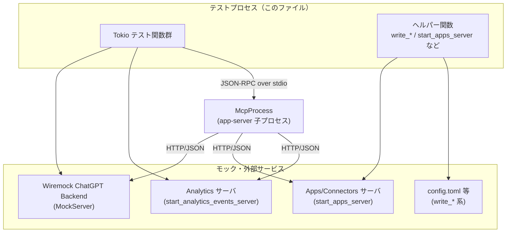
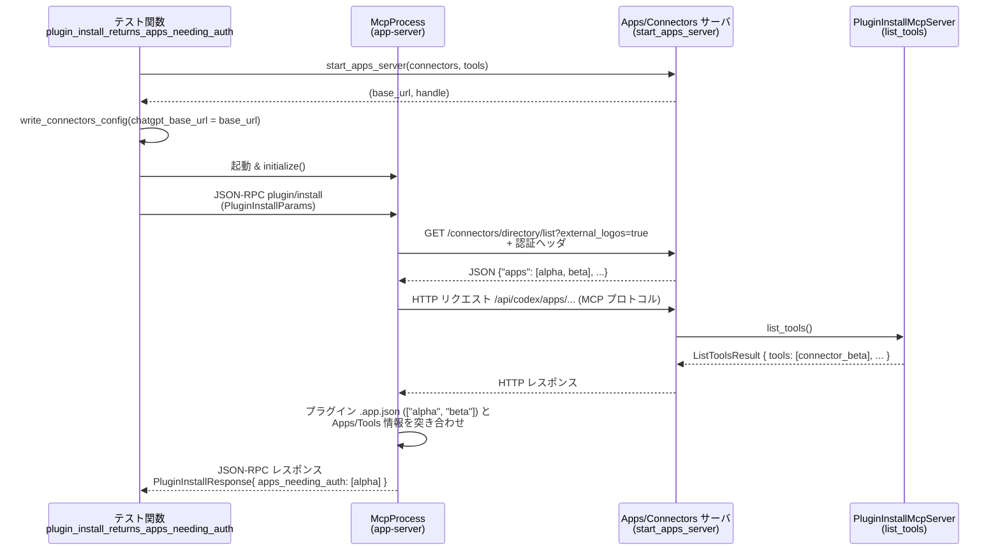

# app-server/tests/suite/v2/plugin_install.rs コード解説

## 0. ざっくり一言

このファイルは、アプリケーションサーバの `plugin/install` 機能の挙動を、エンドツーエンドに近い形で検証する統合テスト群と、そのためのモックサーバ／設定ファイルを生成するヘルパー群で構成されています。

---

## 1. このモジュールの役割

### 1.1 概要

- このモジュールは **プラグインインストール API (`plugin/install`) の挙動** を検証するためのテストを提供します。
- 主に次の点をテストしています：
  - マーケットプレイスパスやインストールポリシーのバリデーション
  - リモート同期（ChatGPT 側のプラグイン有効化）との連携
  - コネクタ（Apps / MCP サーバ）との連携と `apps_needing_auth` の計算
  - インストール時のアナリティクスイベント送信
  - プラグイン同梱の MCP サーバの利用可否

### 1.2 アーキテクチャ内での位置づけ

このテストモジュールは、本体アプリケーションサーバ（ここでは `McpProcess` 経由で外部プロセスとして起動される）に対して JSON-RPC リクエストを送り、その挙動を検証します。外部依存（ChatGPT バックエンド、Analytics、Apps/Connectors）をローカルのモックサーバで置き換えています。



> 注: `McpProcess` や実際の `plugin/install` 実装はこのファイル外にあり、テストの振る舞いから間接的に把握できます。

### 1.3 設計上のポイント

- **エンドツーエンド志向のテスト**  
  - 実際に `McpProcess` を起動し、JSON-RPC リクエストを送信して応答/エラーを検証しています。
- **外部依存のモック化**
  - ChatGPT バックエンドのプラグイン有効化 API を `wiremock::MockServer` でモック。
  - Apps / Connectors API と MCP サーバを `axum` + `rmcp` + `StreamableHttpService` でモック。
  - Analytics イベント送信も専用テストサーバで検証。
- **並行性とタイムアウト**
  - すべての長時間処理（MCP 初期化・応答待ち・Analytics 受信待ち）に `tokio::time::timeout` をかけ、テストがハングしないようにしています。
  - モックサーバ状態共有に `Arc<Mutex<...>>` を使用。
- **設定ファイル駆動**
  - `config.toml` やマーケットプレイス JSON、プラグインメタデータ JSON を一時ディレクトリに生成し、本番コードと同じ読み込みパスを通しています。

> 行番号について: 与えられたチャンクにはソースコードの行番号情報が含まれていないため、以降では「関数名／構造体名」を根拠として示し、正確な `Lxx-Lyy` 形式は記載できません。

---

## 2. 主要な機能一覧

このファイル内の「機能」はテストケースとテスト用ヘルパーに分かれます。

### テストケース（`#[tokio::test]`）

- `plugin_install_rejects_relative_marketplace_paths`: 相対パスの `marketplacePath` を拒否し、JSON-RPC エラー `-32600` を返すことを検証。
- `plugin_install_returns_invalid_request_for_missing_marketplace_file`: マーケットプレイスファイルが存在しない場合に `Invalid request` エラーになることを検証。
- `plugin_install_returns_invalid_request_for_not_available_plugin`: インストールポリシーが `NOT_AVAILABLE` なプラグインをインストールできないことを検証。
- `plugin_install_returns_invalid_request_for_disallowed_product_plugin`: 対象プロダクト（例: `CHATGPT` 限定）のプラグインを他プロダクト（例: `atlas`）からはインストールできないことを検証。
- `plugin_install_force_remote_sync_enables_remote_plugin_before_local_install`: `force_remote_sync = true` のとき、ChatGPT 側のプラグイン有効化 API が叩かれ、成功後にローカルインストールされることを検証。
- `plugin_install_tracks_analytics_event`: プラグインインストール時に `codex_plugin_installed` アナリティクスイベントが送信されることを検証。
- `plugin_install_returns_apps_needing_auth`: プラグインが必要とする Apps/コネクタのうち、まだ利用可能でないものが `apps_needing_auth` として返されることを検証。
- `plugin_install_filters_disallowed_apps_needing_auth`: 特定パターンの「許可されない」アプリ ID などが `apps_needing_auth` からフィルタされることを検証。
- `plugin_install_makes_bundled_mcp_servers_available_to_followup_requests`: プラグイン同梱 `.mcp.json` に定義された MCP サーバが、その後のリクエストで利用可能になるが、設定ファイルには永続化されないことを検証。

### テスト用ヘルパー・モック

- 構造体
  - `AppsServerState`: Apps/Connectors API のレスポンス JSON を保持する共有状態。
  - `PluginInstallMcpServer`: MCP `list_tools` をモックするサーバ実装。
- 関数
  - `start_apps_server`: Apps/Connectors HTTP API と MCP サーバをまとめたローカルサーバを起動。
  - `list_directory_connectors`: Apps/Connectors API の `GET /connectors/directory/list` をモック。
  - `connector_tool`: コネクタを表す `Tool` オブジェクトを生成。
  - `write_connectors_config`: コネクタ連携用の `config.toml` を生成。
  - `write_analytics_config`: アナリティクス送信先を設定する `config.toml` を生成。
  - `write_plugin_remote_sync_config`: プラグインリモート同期用の `config.toml` を生成。
  - `write_plugin_marketplace`: プラグインマーケットプレイス JSON を生成。
  - `write_plugin_source`: プラグイン本体と `.app.json`（必要とする Apps 一覧）を生成。

---

## 3. 公開 API と詳細解説

このファイルはテスト用モジュールであり、外部クレートから参照される「公開 API」はありませんが、テスト内で再利用される主要な型・関数について整理します。

### 3.1 型一覧（構造体・列挙体など）

| 名前 | 種別 | 役割 / 用途 |
|------|------|-------------|
| `AppsServerState` | 構造体 (`#[derive(Clone)]`) | Apps/Connectors API のレスポンス JSON を `Arc<Mutex<...>>` で共有するための状態。`list_directory_connectors` ハンドラから参照。 |
| `PluginInstallMcpServer` | 構造体 (`#[derive(Clone)]`) | `rmcp::handler::server::ServerHandler` を実装するモック MCP サーバ。`list_tools` で `Tool` 一覧を返す。 |

※ いずれもテスト内専用の補助型です。

---

### 3.2 関数詳細（7 件）

#### 1. `plugin_install_force_remote_sync_enables_remote_plugin_before_local_install() -> Result<()>`

**概要**

- `force_remote_sync = true` で `plugin/install` を呼び出したときに、
  1. ChatGPT 側のプラグイン有効化 API が正しいヘッダ付きで 1 回呼ばれること
  2. その後ローカルにプラグインがインストールされ、設定ファイルで有効化されること  
  を検証する非同期テストです。

**引数**

- なし（`#[tokio::test]` によるテスト関数）。

**戻り値**

- `anyhow::Result<()>`  
  - 途中の I/O や JSON 処理が失敗した場合は `Err` を返してテスト失敗になります。

**内部処理の流れ**

1. `MockServer::start()` で Wiremock HTTP サーバを起動し、ChatGPT バックエンドを模倣します。
2. 一時ディレクトリ `codex_home` を作成し、`write_plugin_remote_sync_config` で:
   - `chatgpt_base_url` にモックサーバの URL を設定
   - `[features]\nplugins = true` を設定。
3. `write_chatgpt_auth` で ChatGPT 認証情報（トークンとアカウント ID）を `codex_home` 配下に保存します。
4. 別の一時ディレクトリ `repo_root` に対して:
   - `write_plugin_marketplace` でマーケットプレイス JSON を生成。
   - `write_plugin_source` でプラグイン本体を生成。
   - そのマーケットプレイスファイルへの `AbsolutePathBuf` を作成。
5. Wiremock に対し、次の条件の HTTP `POST` を 1 回期待します（`expect(1)`）:
   - パス: `/backend-api/plugins/sample-plugin@debug/enable`
   - ヘッダ: `authorization: Bearer chatgpt-token`、`chatgpt-account-id: account-123`
   - レスポンス: 200 + `{"id":"sample-plugin@debug","enabled":true}`。
6. `McpProcess::new(codex_home)` でアプリサーバを起動し、`initialize()` 完了をタイムアウトつきで待機します。
7. `send_plugin_install_request` で `PluginInstallParams` を送信:
   - `marketplace_path`: 上で作成した絶対パス
   - `plugin_name`: `"sample-plugin"`
   - `force_remote_sync`: `true`
8. `read_stream_until_response_message` で JSON-RPC レスポンスを取得し、`PluginInstallResponse` にデコードします。
9. `response.apps_needing_auth` が空であることを確認します。
10. 以下をファイルシステムで確認します:
    - `codex_home/plugins/cache/debug/sample-plugin/local/.codex-plugin/plugin.json` が存在すること。
    - `codex_home/config.toml` に `[plugins."sample-plugin@debug"]` セクションと `enabled = true` が含まれること。

**Examples（使用例）**

テスト内での実際の呼び出しパターンは次のようになります：

```rust
let mut mcp = McpProcess::new(codex_home.path()).await?;
timeout(DEFAULT_TIMEOUT, mcp.initialize()).await??;

let request_id = mcp
    .send_plugin_install_request(PluginInstallParams {
        marketplace_path,
        plugin_name: "sample-plugin".to_string(),
        force_remote_sync: true, // リモート同期を有効化
    })
    .await?;

let response: JSONRPCResponse = timeout(
    DEFAULT_TIMEOUT,
    mcp.read_stream_until_response_message(RequestId::Integer(request_id)),
)
.await??;

let response: PluginInstallResponse = to_response(response)?;
assert_eq!(response.apps_needing_auth, Vec::<AppSummary>::new());
```

**Errors / Panics**

- `?` 演算子により、以下のような場合に `Err` でテスト失敗になります：
  - 一時ディレクトリ作成やファイル書き込みの失敗。
  - `McpProcess` の起動や初期化失敗。
  - JSON デコード失敗。
  - Wiremock のサーバ起動失敗。
- JSON-RPC のエラー応答自体は `PluginInstallResponse` 取得前にテストが失敗するため、このテストでは「成功パス」のみを検証しています。

**Edge cases（エッジケース）**

- モックサーバ側に設定したエンドポイントが呼ばれない場合（ヘッダ不備など）、Wiremock の `expect(1)` によってテスト終了時に失敗となります。
- タイムアウト (`DEFAULT_TIMEOUT`) 内に MCP 初期化やレスポンス受信が完了しない場合、`timeout` によりテストは失敗します。

**使用上の注意点**

- `write_plugin_remote_sync_config` で `plugins = true` を有効にしないと、本番コード側がプラグイン機能を有効にしない可能性があります。
- 認証ヘッダの内容（トークン・アカウント ID）は Wiremock 側で厳密にチェックしているため、テストを変更する際はヘッダの期待値と整合性を取る必要があります。

#### 2. `plugin_install_tracks_analytics_event() -> Result<()>`

**概要**

- プラグインインストール完了時に、Analytics サーバに `codex_plugin_installed` イベントが送信されることを検証する非同期テストです。

**引数**

- なし。

**戻り値**

- `anyhow::Result<()>`。

**内部処理の流れ**

1. `start_analytics_events_server()` でアナリティクスイベント受信用のテストサーバを起動します。
2. `codex_home` を作成し、`write_analytics_config` で `chatgpt_base_url` をこのサーバの URL に設定します。
3. `write_chatgpt_auth` で ChatGPT 認証情報を保存します。
4. `repo_root` にマーケットプレイスとプラグインソースを生成（`write_plugin_marketplace` / `write_plugin_source`、ここでは Apps なし）。
5. MCP を起動し、`send_plugin_install_request` でプラグインをインストールします。
6. `PluginInstallResponse` を取得し、`apps_needing_auth` が空であることを確認します。
7. アナリティクスサーバの `received_requests().await` をループでポーリングし、
   - `method == "POST"` かつ `url.path() == "/codex/analytics-events/events"` のリクエストを探し、
   - 見つかるまで 25ms スリープを繰り返します。
8. 見つかったリクエストの `body` を JSON として解析し、次の内容と一致することを検証します：

```json
{
  "events": [{
    "event_type": "codex_plugin_installed",
    "event_params": {
      "plugin_id": "sample-plugin@debug",
      "plugin_name": "sample-plugin",
      "marketplace_name": "debug",
      "has_skills": false,
      "mcp_server_count": 0,
      "connector_ids": [],
      "product_client_id": "<DEFAULT_CLIENT_NAME>"
    }
  }]
}
```

**Errors / Panics**

- Analytics サーバが期待するリクエストを受信しないまま `DEFAULT_TIMEOUT` を超えるとテスト失敗になります。
- ボディが JSON でない場合、`serde_json::from_slice` でパニックではなく `Err` を返し、テスト失敗になります。

**Edge cases**

- 複数イベントが送信された場合でも、`find` は最初に条件を満たした 1 件だけを検証します。
- `DEFAULT_CLIENT_NAME` は `app_test_support` 由来で、このテストからは具体値を知ることはできませんが、レスポンスに期待値として含まれています。

**使用上の注意点**

- ループでポーリングしているため、頻繁なスリープでテスト時間が延びる可能性がありますが、`DEFAULT_TIMEOUT` で上限が決まっています。
- Analytics イベントのスキーマを変更する場合、このテストの期待 JSON も同期して変更する必要があります。

#### 3. `plugin_install_returns_apps_needing_auth() -> Result<()>`

**概要**

- プラグインが必要とする複数の Apps/コネクタのうち、「まだ利用できない（ツールが存在しない）ものだけ」が `apps_needing_auth` として返されることを検証するテストです。

**引数**

- なし。

**戻り値**

- `anyhow::Result<()>`。

**内部処理の流れ**

1. 2 つの `AppInfo` を用意します：
   - `alpha`: `is_accessible = false`, `is_enabled = true` など。
   - `beta`: 同様に有効だが、後で MCP ツールが用意される。
2. `tools` として `connector_tool("beta", "Beta App")` を 1 件生成します。
   - このツールの `meta` には `connector_id = "beta"` が設定されます。
3. `start_apps_server(connectors, tools)` で Apps/Connectors API + MCP サーバを起動し、そのベース URL を取得します。
4. `codex_home` に対して:
   - `write_connectors_config` で `chatgpt_base_url` と `[features]\nconnectors = true` を設定。
   - `write_chatgpt_auth` で認証情報を保存。
5. `repo_root` に対して:
   - `write_plugin_marketplace` で `"sample-plugin"` を登録。
   - `write_plugin_source` で `.app.json` に `["alpha", "beta"]` を書き込み。
6. MCP を起動し、`send_plugin_install_request` でインストールリクエストを送信（`force_remote_sync = false`）。
7. JSON-RPC レスポンスを `PluginInstallResponse` に変換し、次と完全一致することをアサートします：

```rust
PluginInstallResponse {
    auth_policy: PluginAuthPolicy::OnInstall,
    apps_needing_auth: vec![AppSummary {
        id: "alpha".to_string(),
        name: "Alpha".to_string(),
        description: Some("Alpha connector".to_string()),
        install_url: Some("https://chatgpt.com/apps/alpha/alpha".to_string()),
        needs_auth: true,
    }],
}
```

**テストから読み取れる契約**

- プラグインの `.app.json` に `alpha` と `beta` が記載されていても、以下の条件でフィルタされると解釈できます：
  - コネクタ MCP サーバ（`PluginInstallMcpServer`）の `list_tools` で `beta` に対応するツールが存在する → `beta` は「既に利用可能」とみなされ、`apps_needing_auth` に含まれない。
  - `alpha` に対応するツールは存在しない → `alpha` は利用するために追加の認可/インストールが必要とみなされ、`apps_needing_auth` に含まれる。

**Errors / Panics**

- Apps サーバ起動や MCP 初期化、HTTP 通信等での失敗はすべて `?` を通じてテスト失敗になります。
- `server_handle.abort()` した後の `await` は `JoinError` を返す可能性がありますが、このテストでは結果を無視しており、パニックにはなりません。

**Edge cases**

- Apps API 側で `install_url` が `None` の場合、本番コードがどのように URL を組み立てているかはこのテストからは分かりません（ここでは `"https://chatgpt.com/apps/alpha/alpha"` に固定されている想定）。
- `beta` のようにツールが存在するが `is_accessible = false` のケースがどう扱われるかは、このテストだけでは厳密には分かりませんが、少なくとも `apps_needing_auth` には含まれません。

**使用上の注意点**

- コネクタ側のツールと Apps 情報の対応は、`connector_tool` の中で `meta.connector_id` によって結びつけています。ID の不一致があるとテストの意図通りに動作しなくなります。

#### 4. `plugin_install_filters_disallowed_apps_needing_auth() -> Result<()>`

**概要**

- プラグインが参照する Apps の中に「許可されない ID（ここでは `asdk_app_...`）」が含まれていても、それらが `apps_needing_auth` に含まれないことを検証します。
- 併せて、マーケットプレイスの `auth_policy` が `ON_USE` に設定された場合に `PluginAuthPolicy::OnUse` が返ることを確認します。

**内部処理の流れ（要点）**

1. `connectors` として 1 つの `alpha` アプリのみを用意します（ツールは空）。
2. `write_plugin_marketplace` で `auth_policy: Some("ON_USE")` を指定し、マーケットプレイス JSON に `policy.authentication = "ON_USE"` を埋め込みます。
3. `write_plugin_source` で `.app.json` に `["alpha", "asdk_app_..."]` を書き込みます。
4. MCP を起動し、プラグインをインストールします。
5. `PluginInstallResponse` が次と一致することを検証します：

```rust
PluginInstallResponse {
    auth_policy: PluginAuthPolicy::OnUse,
    apps_needing_auth: vec![AppSummary {
        id: "alpha".to_string(),
        name: "Alpha".to_string(),
        description: Some("Alpha connector".to_string()),
        install_url: Some("https://chatgpt.com/apps/alpha/alpha".to_string()),
        needs_auth: true,
    }],
}
```

**テストから読み取れる契約**

- `.app.json` に記載された Apps のうち、Apps ディレクトリ（`start_apps_server` のレスポンス）に存在しない ID や、特定パターン（`asdk_app_...`）の ID は `apps_needing_auth` から除外される、と解釈できます。
- マーケットプレイスの `policy.authentication` フィールドが文字列 `"ON_USE"` だった場合、API レベルの `PluginAuthPolicy` は `OnUse` になります。

**Edge cases**

- `auth_policy` に未知の文字列を指定した場合の挙動はこのファイルからは分かりません。
- Apps ディレクトリにも存在し、ツールも存在する「完全に利用可能な」コネクタの扱いは、このテストでは登場しません（前テストと合わせて判断する必要があります）。

**使用上の注意点**

- 「許可されない」かどうかの判断ロジック（`asdk_app_...` など）は本番コード側にあり、このテストはその一部ケースを固定値で検証しているだけです。

#### 5. `plugin_install_makes_bundled_mcp_servers_available_to_followup_requests() -> Result<()>`

**概要**

- プラグインに同梱された `.mcp.json` で定義されている MCP サーバが、インストール後の別の JSON-RPC リクエスト（`mcpServer/oauth/login`）で参照可能になることを検証します。
- 同時に、その MCP サーバ設定が `config.toml` に永続化されないことも確認します。

**内部処理の流れ**

1. `codex_home/config.toml` に `[features]\nplugins = true` を書き込み、プラグイン機能を有効化します。
2. `repo_root` にマーケットプレイスとプラグインソース（Apps なし）を生成し、さらに:

```json
{
  "mcpServers": {
    "sample-mcp": {
      "command": "echo"
    }
  }
}
```

という `.mcp.json` を `sample-plugin` 直下に書き込みます。
3. MCP を起動し、通常のインストールと同様に `plugin/install` を実行します。
4. `PluginInstallResponse.apps_needing_auth` が空であることを確認し、`config.toml` を読み込んで:

- `[mcp_servers.sample-mcp]` セクションが存在しない
- `command = "echo"` が含まれていない  
   ことを確認します。
1. 続いて、`send_raw_request` で `mcpServer/oauth/login` メソッドに対して:

```json
{ "name": "sample-mcp" }
```

を送信し、エラー応答を取得します。
6. 取得した JSON-RPC エラーの `code` が `-32600`、`message` が `"OAuth login is only supported for streamable HTTP servers."` であることを検証します。

**テストから読み取れる契約**

- プラグイン `.mcp.json` に定義された MCP サーバは、インストール後にアプリケーションの「一時的な」MCP サーバ一覧に追加され、JSON-RPC メソッド `mcpServer/...` から参照可能になる。
- ただし、その設定は `config.toml` には書き込まれない（再起動したら失われる）設計であると解釈できます。
- `.mcp.json` で定義された MCP サーバは「ストリーム可能 HTTP サーバ」ではなく、`mcpServer/oauth/login` ではサポートされないため、固定メッセージのエラーとなります。

**使用上の注意点**

- テストでは `mcpServer/oauth/login` の挙動のみ検証しています。他の `mcpServer/*` メソッドの対応状況はこのファイルからは分かりません。
- `.mcp.json` のスキーマ変更（キー名など）はテストを壊すため、本番コードと同時に更新する必要があります。

#### 6. `start_apps_server(connectors: Vec<AppInfo>, tools: Vec<Tool>) -> Result<(String, JoinHandle<()>)>`

**概要**

- Apps/Connectors API と MCP サーバをまとめたローカル HTTP サーバを起動するヘルパー関数です。
- テスト側に、ベース URL とサーバタスクの `JoinHandle` を返します。

**引数**

| 引数名 | 型 | 説明 |
|--------|----|------|
| `connectors` | `Vec<AppInfo>` | `GET /connectors/directory/list` で返すアプリ一覧。 |
| `tools` | `Vec<Tool>` | MCP サーバの `list_tools` で返すツール一覧。 |

**戻り値**

- `Result<(String, JoinHandle<()>)>`  
  - `Ok((base_url, handle))`:
    - `base_url`: `http://127.0.0.1:<port>` 形式のサーバ URL。
    - `handle`: サーバタスクの `JoinHandle<()>`（後で `abort` などに利用）。
  - I/O エラー等があれば `Err(anyhow::Error)`。

**内部処理の流れ**

1. `AppsServerState` を `Arc` + `Mutex` でラップし、`{"apps": connectors, "next_token": null}` という JSON を初期値に設定します。
2. `tools` を `Arc<Mutex<Vec<Tool>>>` で共有可能な形に変換します。
3. `TcpListener::bind("127.0.0.1:0")` で空きポートにバインドし、そのアドレスを取得します。
4. `StreamableHttpService::new` で `PluginInstallMcpServer` のファクトリクロージャと `LocalSessionManager` を使って MCP サービスを作成します。
5. `axum::Router` を構築し:
   - `/connectors/directory/list` と `/connectors/directory/list_workspace` に `list_directory_connectors` を割り当て。
   - `.with_state(state)` で `AppsServerState` を共有。
   - `.nest_service("/api/codex/apps", mcp_service)` で MCP サービスを `/api/codex/apps` 配下にマウント。
6. `tokio::spawn` で `axum::serve(listener, router)` をバックグラウンドタスクとして起動します。
7. ベース URL とハンドルを返します。

**使用例**

```rust
let connectors = vec![/* AppInfo ... */];
let tools = vec![/* Tool ... */];

let (server_url, server_handle) = start_apps_server(connectors, tools).await?;
// server_url を chatgpt_base_url に書き込んでテストする
// ...
server_handle.abort();
let _ = server_handle.await;
```

**Errors / Panics**

- `bind` や `local_addr` 取得に失敗すると `Err` になります。
- サーバタスク内のエラーは `axum::serve` が `Result` を返しますが、このテストコードでは結果を無視しており、失敗してもテスト側には伝播しません。

**Edge cases**

- ポート競合などでバインドに失敗した場合、テスト全体が即座に失敗します。
- `server_handle.abort()` 後の `await` はキャンセル済みタスクのため、`Err(JoinError)` が返る可能性がありますが、テストでは無視されています。

**使用上の注意点**

- テスト終了後に `server_handle.abort()` を呼んでサーバを停止しないと、プロセス終了までポートを占有し続ける可能性があります（ただしテストプロセス終了時には OS により解放されます）。

#### 7. `list_directory_connectors(State(state): State<Arc<AppsServerState>>, headers: HeaderMap, uri: Uri) -> Result<impl IntoResponse, StatusCode>`

**概要**

- Apps/Connectors API の `GET /connectors/directory/list` および `.../list_workspace` を模倣する Axum ハンドラです。
- 認証ヘッダとクエリパラメータを簡易チェックし、条件を満たす場合のみ JSON を返します。

**引数**

| 引数名 | 型 | 説明 |
|--------|----|------|
| `State(state)` | `State<Arc<AppsServerState>>` | 共有状態からレスポンス JSON を取得するための状態。 |
| `headers` | `HeaderMap` | HTTP リクエストヘッダ。Bearer トークンとアカウント ID を検証。 |
| `uri` | `Uri` | リクエスト URL。クエリ文字列から `external_logos=true` を検証。 |

**戻り値**

- `Result<impl IntoResponse, StatusCode>`  
  - `Ok(Json(response))`: 認証ヘッダとクエリが正しい場合、`AppsServerState` に保持されている JSON を返す。
  - `Err(StatusCode::UNAUTHORIZED)`: 認証ヘッダが不正な場合。
  - `Err(StatusCode::BAD_REQUEST)`: クエリに `external_logos=true` が含まれない場合。

**内部処理の流れ**

1. `headers` から `AUTHORIZATION` ヘッダを取得し、`"Bearer chatgpt-token"` と完全一致するかチェック。
2. `headers` から `"chatgpt-account-id"` ヘッダを取得し、`"account-123"` と一致するかチェック。
3. `uri.query()` を確認し、`external_logos=true` を含むかどうかチェック。
4. 上記 3 条件を満たさない場合、それぞれ `UNAUTHORIZED` または `BAD_REQUEST` を返します。
5. 条件を満たす場合、`state.response` の `Mutex` をロックし、`serde_json::Value` をクローンして `Json(response)` として返します。`Mutex` が Poison されている場合は `PoisonError::into_inner` で中身を取得します。

**Errors / Panics**

- `Mutex` ロックで Poison 状態になっても、`into_inner` によりパニックにはなりません。
- ヘッダの値が非 UTF-8 の場合は `to_str().ok()` が `None` を返し、結果として `UNAUTHORIZED` となります。

**Edge cases**

- クエリパラメータに複数のキーがある場合でも、`external_logos=true` を 1 要素として含んでいれば OK です（`split('&').any(...)`）。
- テストコードでは、Apps API のレスポンス内容（`apps` 配列など）は `AppsServerState` の初期化時に渡されたものに依存します。

**使用上の注意点**

- このハンドラはテスト用であり、本番の Apps API とは異なる可能性があります。
- 認証値はハードコード（`chatgpt-token` / `account-123`）されているため、`write_chatgpt_auth` 側と揃える必要があります。

---

### 3.3 その他の関数

以下は比較的単純なヘルパー関数や、ここまで詳細を割かないテスト関数です。

| 関数名 | 種別 | 役割（1 行） |
|--------|------|--------------|
| `plugin_install_rejects_relative_marketplace_paths` | テスト | `marketplacePath` が相対パス文字列のとき `-32600` エラーになることを確認。 |
| `plugin_install_returns_invalid_request_for_missing_marketplace_file` | テスト | 存在しないマーケットプレイスファイルを指定した場合に `Invalid request` エラーになることを確認。 |
| `plugin_install_returns_invalid_request_for_not_available_plugin` | テスト | `policy.installation = "NOT_AVAILABLE"` のプラグインがインストール不可であることを確認。 |
| `plugin_install_returns_invalid_request_for_disallowed_product_plugin` | テスト | マーケットプレイス `policy.products` で許可されたプロダクト以外のセッションからのインストールをブロックすることを確認。 |
| `connector_tool` | ヘルパー | 指定されたコネクタ ID/名前に対応する `Tool` を生成し、`meta.connector_id` 等を設定する。 |
| `write_connectors_config` | ヘルパー | コネクタ機能を有効化し、`chatgpt_base_url` を設定する `config.toml` を書き出す。 |
| `write_analytics_config` | ヘルパー | アナリティクス送信先 URL を設定した `config.toml` を書き出す。 |
| `write_plugin_remote_sync_config` | ヘルパー | プラグイン機能と `chatgpt_base_url` を設定した `config.toml` を書き出す。 |
| `write_plugin_marketplace` | ヘルパー | 任意の `installation` / `authentication` ポリシーを含むマーケットプレイス JSON を生成する。 |
| `write_plugin_source` | ヘルパー | プラグインの `.codex-plugin/plugin.json` と `.app.json`（必要 Apps 一覧）を生成する。 |

---

## 4. データフロー

代表的なシナリオとして、`plugin_install_returns_apps_needing_auth` におけるデータフローを説明します。

### 処理の要点

- テストプロセスは、ローカルの Apps/Connectors サーバと MCP サーバを起動し、`config.toml` にその URL を設定します。
- `plugin/install` はその設定を読み取り、Apps API（`/connectors/directory/list`）と MCP サーバ（`list_tools`）にアクセスすることで、プラグインが必要とする Apps のうち「まだツールが存在しないもの」を `apps_needing_auth` に入れて返します。

### シーケンス図（概念）



> AppsSrv への具体的な HTTP パスや RPC メソッド名は、ルータ設定から推測しています（`/connectors/directory/list` と MCP の `list_tools`）。`plugin/install` 内部のロジックはこのファイルには現れませんが、テストの期待値からこのようなフローが想定されます。

---

## 5. 使い方（How to Use）

このファイルはテスト専用ですが、同様のテストを追加する際の利用方法という観点で説明します。

### 5.1 基本的な使用方法

新しい `plugin/install` の振る舞いを検証するテストを追加する場合の基本フローは次の通りです。

```rust
#[tokio::test]
async fn new_plugin_install_scenario() -> Result<()> {
    // 1. 一時ディレクトリを用意
    let codex_home = TempDir::new()?;
    let repo_root = TempDir::new()?;

    // 2. 必要に応じて config.toml や認証情報などを書き込む
    write_plugin_remote_sync_config(codex_home.path(), "http://example.com")?;
    write_chatgpt_auth(
        codex_home.path(),
        ChatGptAuthFixture::new("chatgpt-token"),
        AuthCredentialsStoreMode::File,
    )?;

    // 3. マーケットプレイスとプラグインソースを生成
    write_plugin_marketplace(
        repo_root.path(),
        "debug",
        "sample-plugin",
        "./sample-plugin",
        /*install_policy*/ None,
        /*auth_policy*/ None,
    )?;
    write_plugin_source(repo_root.path(), "sample-plugin", &[])?;

    let marketplace_path =
        AbsolutePathBuf::try_from(repo_root.path().join(".agents/plugins/marketplace.json"))?;

    // 4. MCP を起動して初期化
    let mut mcp = McpProcess::new(codex_home.path()).await?;
    timeout(DEFAULT_TIMEOUT, mcp.initialize()).await??;

    // 5. plugin/install を呼び出し
    let request_id = mcp
        .send_plugin_install_request(PluginInstallParams {
            marketplace_path,
            plugin_name: "sample-plugin".to_string(),
            force_remote_sync: false,
        })
        .await?;

    // 6. 応答を受け取り、期待値を検証
    let response: JSONRPCResponse = timeout(
        DEFAULT_TIMEOUT,
        mcp.read_stream_until_response_message(RequestId::Integer(request_id)),
    )
    .await??;
    let response: PluginInstallResponse = to_response(response)?;
    assert!(response.apps_needing_auth.is_empty());

    Ok(())
}
```

### 5.2 よくある使用パターン

- **リモート API との連携を検証したい場合**
  - `wiremock::MockServer` や `start_analytics_events_server` を使い、`write_*_config` でその URL を設定します。
- **Apps/Connectors 経由の挙動を検証したい場合**
  - `start_apps_server` でモックサーバを起動し、`write_connectors_config` で `chatgpt_base_url` を設定します。
  - 必要なコネクタ・ツールの組み合わせを `AppInfo` と `connector_tool` で用意します。

### 5.3 よくある間違い

```rust
// 間違い例: MCP 初期化前にリクエストを送ってしまう
let mut mcp = McpProcess::new(codex_home.path()).await?;
// let request_id = mcp.send_plugin_install_request(...).await?; // 初期化前

// 正しい例: initialize 完了を待ってからリクエスト送信
timeout(DEFAULT_TIMEOUT, mcp.initialize()).await??;
let request_id = mcp.send_plugin_install_request(...).await?;
```

```rust
// 間違い例: config.toml に chatgpt_base_url を書き忘れる
// write_plugin_remote_sync_config や write_connectors_config を呼んでいない

// 正しい例: 対応する機能を有効にする設定を必ず書き込む
write_connectors_config(codex_home.path(), &server_url)?;
```

### 5.4 使用上の注意点（まとめ）

- すべての非同期処理に `timeout(DEFAULT_TIMEOUT, ...)` をかけているため、新しいテストを追加する場合もハング防止のために同様のパターンを踏襲するのが安全です。
- `TempDir` を使っているため、テスト終了時に自動でクリーンアップされますが、大量のファイルを書き込むと I/O がボトルネックになり得ます。
- `Arc<Mutex<...>>` を使う部分ではポイズン状態の `Mutex` も `into_inner` で回収しているため、前に何らかのパニックがあってもデータにアクセスできてしまう点には注意が必要です（テスト内でのみ利用）。

---

## 6. 変更の仕方（How to Modify）

### 6.1 新しい機能を追加する場合

例: 新しいプラグインポリシーやエラーケースのテストを追加する場合。

1. **前提となる設定・ファイルを決める**
   - `config.toml` のフラグ（`features.plugins` / `features.connectors` など）。
   - マーケットプレイス JSON の `policy`、`.app.json` の Apps 一覧など。
2. **必要なモックサーバを起動**
   - ChatGPT バックエンド系：`MockServer`。
   - Apps/Connectors：`start_apps_server`。
   - Analytics：`start_analytics_events_server`。
3. **テスト本体を `#[tokio::test]` として追加**
   - `McpProcess` の初期化 → `plugin/install` リクエスト → 応答検証、の流れを踏襲。
4. **cleanup**
   - `server_handle.abort()` などでバックグラウンドサーバを停止（必須ではないが推奨）。

### 6.2 既存の機能を変更する場合

- **影響範囲の確認方法**
  - 変更したい仕様（例: `apps_needing_auth` のフィルタ条件）に対応するテストをこのファイルから探し、それらが失敗することを確認しながら修正します。
- **注意すべき契約**
  - エラーコード `-32600` は JSON-RPC の `Invalid Request` に対応しており、複数のテストで前提とされています。
  - `PluginAuthPolicy` のマッピング（文字列 `"ON_USE"` → `PluginAuthPolicy::OnUse` など）はテストで固定されています。
  - プラグインインストール時のアナリティクスイベントのペイロード構造も固定値で検証されています。
- **テストや使用箇所の再確認**
  - このファイルのテスト群は `plugin/install` の仕様変更に非常に敏感なため、仕様を変える場合は期待値（アサーション）を一緒に更新する必要があります。
  - 関連する他のテストファイル（たとえば `plugin_uninstall` など）が存在する場合は、そちらも合わせて確認する必要があります（このチャンクには現れません）。

---

## 7. 関連ファイル

このモジュールと密接に関係すると考えられる（が、このチャンクには定義が現れない）主な外部コンポーネントを挙げます。

| パス / 型 | 役割 / 関係 |
|-----------|------------|
| `app_test_support::McpProcess` | テストからアプリケーションサーバを起動し、JSON-RPC リクエストを送るためのヘルパー。`initialize`、`send_plugin_install_request` 等を提供。 |
| `app_test_support::start_analytics_events_server` | Analytics イベントを受信するテストサーバを起動し、受信リクエストを確認する機能を持つ。 |
| `app_test_support::write_chatgpt_auth` | ChatGPT 認証情報（トークン、アカウント ID など）を `codex_home` 配下に書き込む。 |
| `codex_app_server_protocol::PluginInstallParams` | `plugin/install` メソッドのリクエストパラメータ型。`marketplace_path` や `plugin_name`、`force_remote_sync` を含む。 |
| `codex_app_server_protocol::PluginInstallResponse` | `plugin/install` のレスポンス型。`auth_policy` と `apps_needing_auth` を含む。 |
| `codex_app_server_protocol::AppInfo` / `AppSummary` | コネクタ（Apps）の詳細・サマリ情報の表現。 |
| `rmcp::transport::StreamableHttpService` | MCP プロトコルを HTTP 経由で提供するためのサービス。`start_apps_server` で使用。 |
| `rmcp::handler::server::ServerHandler` | MCP サーバの振る舞いを定義するトレイト。`PluginInstallMcpServer` が実装。 |

> これらの型や関数の具体的な実装はこのチャンクには含まれていないため、詳細はそれぞれの定義元ファイルを参照する必要があります。
