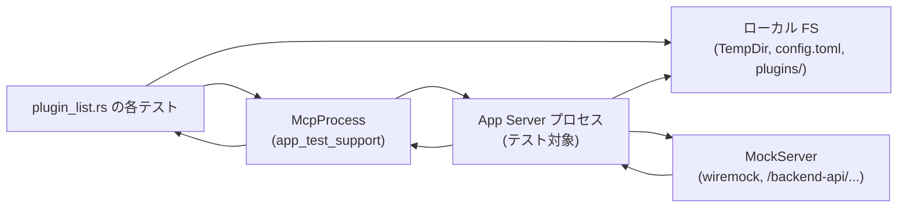
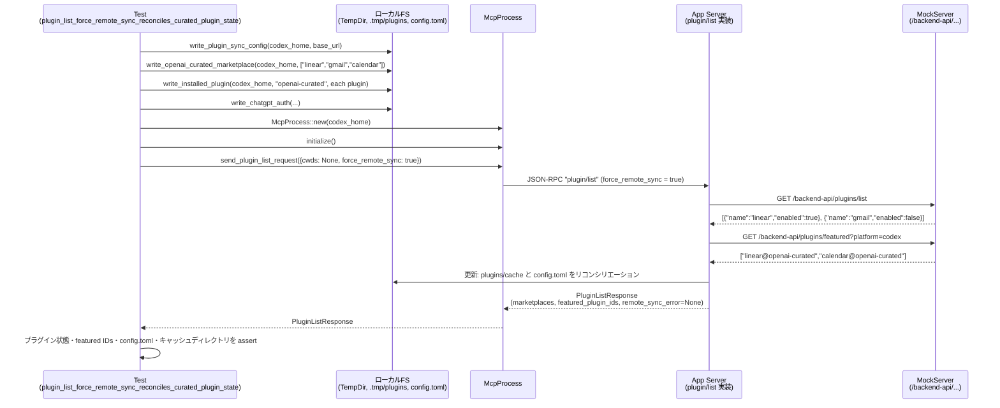

# app-server/tests/suite/v2/plugin_list.rs

## 0. ざっくり一言

- `plugin/list` JSON-RPC エンドポイントの挙動（ローカル / リモートマーケットプレイス、インストール状態、リモート同期、フィーチャードプラグイン ID など）を統合的に検証するテストスイートです。

※ このチャンクには元ファイルの行番号情報が含まれていないため、特定の行番号は付与していません。根拠はすべて具体的な関数名・コード断片で示します。

---

## 1. このモジュールの役割

### 1.1 概要

- このモジュールは **`plugin/list` API の仕様通りのレスポンスが返るか** を検証する非同期テスト群です。
- 主に次の観点をカバーしています。
  - ローカルマーケットプレイス JSON の読み込み・エラー処理
  - プラグインの「インストール済み / 有効」の状態と設定ファイル (`config.toml`) との整合性
  - プラグイン interface 情報（UI メタデータ・アセットパス）の解釈
  - ChatGPT バックエンド（擬似）とのリモート同期と、フィーチャードプラグイン ID の取得・キャッシュ
  - サーバー起動時の一度きりのリモート同期実行

### 1.2 アーキテクチャ内での位置づけ

このファイルは **結合テスト** であり、アプリ本体ではなくテストハーネスと外部コンポーネントを組み合わせて `plugin/list` の振る舞いを検証します。

- `McpProcess`（`app_test_support`）  
  アプリケーションサーバープロセスを起動し、JSON-RPC を介して `plugin/list` を呼び出すテスト用ラッパーです。
- `MockServer`（`wiremock`）  
  ChatGPT バックエンド (`/backend-api/plugins/...`) を模倣し、HTTP リクエストを検証します。
- ローカルファイルシステム (`TempDir`)  
  `codex_home` や各リポジトリルートを一時ディレクトリで構成し、`config.toml` やマーケットプレイス JSON、プラグインキャッシュディレクトリなどを実際に生成します。

概念的な依存関係は次のようになります。



- テストコードが TempDir 上に構成ファイル/マーケットプレイス/プラグインファイルを作成し (`write_*` 系関数)、
- `McpProcess` 経由で app server に `plugin/list` を投げ、
- app server はローカル FS を読みつつ、必要に応じて `MockServer` に HTTP アクセスし、
- その結果を JSON-RPC レスポンスとして返し、テストで検証します。

### 1.3 設計上のポイント

- **非同期テスト / タイムアウトでの安全性**
  - すべてのテストは `#[tokio::test]` で実装され、`tokio::time::timeout` により待機ループに上限（`DEFAULT_TIMEOUT` 10 秒）が設定されています。
  - 条件待ちのループ (`wait_for_remote_plugin_request_count`, `wait_for_path_exists`) は 10ms スリープと組み合わせて busy loop を避けています。

- **状態の完全な分離**
  - 各テストごとに `TempDir` を使って `codex_home` やリポジトリを分離しており、テスト間で状態が共有されない構成になっています。
  - プラグインキャッシュ (`plugins/cache/...`) や `.tmp/plugins` ディレクトリも毎回新規に生成します。

- **エラーハンドリング**
  - すべてのテスト関数・ヘルパーは `anyhow::Result<()>` を返し、`?` 演算子で I/O エラーやテストハーネスのエラーを伝播します。
  - `wiremock` のリクエスト検証では、期待回数と異なる場合に `bail!` で即座に失敗させることで、隠れたバグを検出します。

- **パスの安全性**
  - クライアントから指定される作業ディレクトリ (`cwds`) は `AbsolutePathBuf::try_from` により絶対パスのみ受け付けることを確認するテストを含みます。
  - プラグイン interface のアセットパス (`./assets/...`) は実ディレクトリに結合され、絶対パス (`AbsolutePathBuf`) に解決されていることを検証します。

---

## 2. 主要な機能一覧（コンポーネントインベントリー）

### 2.1 関数・テストケース一覧

| 名前 | 種別 | 主な役割 |
|------|------|----------|
| `DEFAULT_TIMEOUT` | `Duration` 定数 | 各種待機を 10 秒に制限するタイムアウト値 |
| `TEST_CURATED_PLUGIN_SHA` | `&'static str` 定数 | .tmp/plugins.sha に書き込む固定 SHA 値（キャッシュ一貫性の検証に利用） |
| `STARTUP_REMOTE_PLUGIN_SYNC_MARKER_FILE` | `&'static str` 定数 | サーバー起動時リモート同期が一度だけ実行されたことを示すマーカーファイルパス |
| `write_plugins_enabled_config` | ヘルパー | `config.toml` に `[features] plugins = true` を書き込み、プラグイン機能を有効化 |
| `plugin_list_skips_invalid_marketplace_file_and_reports_error` | テスト | 壊れた marketplace JSON を無視しつつ、エラー情報を `marketplace_load_errors` に出すことを検証 |
| `plugin_list_rejects_relative_cwds` | テスト | `cwds` に相対パスを渡すと JSON-RPC エラー `-32600 Invalid request` になることを検証 |
| `plugin_list_keeps_valid_marketplaces_when_another_marketplace_fails_to_load` | テスト | 一部のマーケットプレイスが壊れていても、他の有効なマーケットプレイスがレスポンスに残ることを検証 |
| `plugin_list_accepts_omitted_cwds` | テスト | `cwds: None` が受け入れられ、HOME ベースのマーケットプレイスが読まれることを検証 |
| `plugin_list_includes_install_and_enabled_state_from_config` | テスト | `config.toml` とインストール済みキャッシュディレクトリに基づき、各プラグインの `installed`/`enabled` などの状態が正しく反映されることを検証 |
| `plugin_list_uses_home_config_for_enabled_state` | テスト | ワークスペース側の `.codex/config.toml` よりも HOME の `config.toml` の `enabled` 設定が優先されることを検証（信頼されたプロジェクト設定と組み合わせ） |
| `plugin_list_returns_plugin_interface_with_absolute_asset_paths` | テスト | プラグイン interface の URL/アセットパスが期待どおり正規化され、ローカルアセットは絶対パスに解決されることを検証 |
| `plugin_list_accepts_legacy_string_default_prompt` | テスト | `defaultPrompt` が文字列（レガシー形式）の場合でも内部的には `Vec<String>` として扱われる後方互換性を検証 |
| `plugin_list_force_remote_sync_returns_remote_sync_error_on_fail_open` | テスト | `force_remote_sync=true` かつ ChatGPT 認証がない場合に、リモート同期エラーを返しつつローカル curated マーケットプレイスは fail-open することを検証 |
| `plugin_list_force_remote_sync_reconciles_curated_plugin_state` | テスト | ChatGPT backend の `/plugins/list` と `/plugins/featured` の結果に基づき、インストール状態・有効状態・フィーチャード ID・キャッシュディレクトリ・config.toml が適切に同期されることを検証 |
| `app_server_startup_remote_plugin_sync_runs_once` | テスト | サーバー起動時の自動リモート同期が一度だけ実行され、二度目以降の起動では追加の `/plugins/list` 呼び出しが行われないことを検証 |
| `plugin_list_fetches_featured_plugin_ids_without_chatgpt_auth` | テスト | ChatGPT 認証がなくても `/plugins/featured` は呼び出され、`featured_plugin_ids` が設定されること、`remote_sync_error` が `None` であることを検証 |
| `plugin_list_uses_warmed_featured_plugin_ids_cache_on_first_request` | テスト | サーバー起動時に事前取得（ウォーム）された featured IDs のキャッシュが、最初の `plugin/list` リクエストに使われ、追加の HTTP リクエストが発生しないことを検証 |
| `wait_for_featured_plugin_request_count` | ヘルパー | `wait_for_remote_plugin_request_count` 専用ラッパー。`/plugins/featured` へのリクエスト回数が期待値になるまで待機 |
| `wait_for_remote_plugin_request_count` | ヘルパー | 特定のパスサフィックス（`/plugins/list` など）への GET リクエスト回数が期待値に達するまで待機する非同期ループ |
| `wait_for_path_exists` | ヘルパー | 指定パスが存在するようになるまで待機（マーカーファイルなどの生成完了待ち） |
| `write_installed_plugin` | ヘルパー | `plugins/cache/<marketplace>/<plugin>/local/.codex-plugin/plugin.json` を生成し、「インストール済みプラグイン」をシミュレート |
| `write_plugin_sync_config` | ヘルパー | `chatgpt_base_url` や `[features] plugins`、各 curated プラグインの enabled 状態を含む `config.toml` を生成 |
| `write_openai_curated_marketplace` | ヘルパー | `.tmp/plugins` 配下に `openai-curated` マーケットプレイスと各プラグインの `plugin.json`、`plugins.sha` を生成し、リモート curated マーケットプレイスのローカルキャッシュ状態を構築 |

### 2.2 実装上重要な観点（高レベル）

- **ローカルマーケットプレイスの扱い**
  - JSON が壊れている場合でも、他の正常なマーケットプレイスはリストアップされる必要があります。
  - エラーは `marketplace_load_errors` に蓄積され、どのファイルが失敗したかが分かることを検証しています。

- **プラグイン状態と設定ファイル**
  - FS 上のインストール有無（`plugins/cache/...` の存在）と `config.toml` の `[plugins."id@marketplace"] enabled = ...` の組み合わせにより、`installed` / `enabled` を決定することが前提です。

- **リモート同期**
  - `force_remote_sync` フラグやサーバー起動時の自動同期により、ChatGPT バックエンドと状態を整合させることを前提としており、その挙動を詳細にテストしています。
  - 認証情報が不十分な場合でも、安全に失敗し、ローカルな curated データを使い続ける（fail-open）設計であることが確認されています。

---

## 3. 公開 API と詳細解説

### 3.1 型一覧（構造体・列挙体など）

このファイル内で **新しく定義される型（構造体・列挙体）はありません**。  
ただし、本テストで頻繁に利用される外部型を整理しておきます（参考）。

| 名前 | 所属 | 役割 / 用途 |
|------|------|-------------|
| `McpProcess` | `app_test_support` | app server プロセスの起動・初期化・JSON-RPC リクエスト送信・レスポンス待機を行うテスト用ヘルパー |
| `ChatGptAuthFixture` | `app_test_support` | ChatGPT 認証情報（トークンやアカウント ID）をテスト用に生成・書き込みするフィクスチャ |
| `PluginListParams` | `codex_app_server_protocol` | `plugin/list` JSON-RPC メソッドのパラメータ（`cwds`, `force_remote_sync` など） |
| `PluginListResponse` | `codex_app_server_protocol` | `plugin/list` のレスポンスボディ（マーケットプレイス一覧、featured IDs、エラー情報など） |
| `PluginMarketplaceEntry` | 同上 | 単一マーケットプレイス（名前・パス・interface・プラグイン一覧） |
| `PluginSummary` | 同上 | 単一プラグインのサマリ（id, name, source, installed, enabled, policy, interface など） |
| `PluginSource` | 同上 | プラグインのソース種別（例: Local path） |
| `PluginInstallPolicy` | 同上 | インストールポリシー（例: `Available`） |
| `PluginAuthPolicy` | 同上 | 認証ポリシー（例: `OnInstall`） |
| `JSONRPCResponse` | 同上 | 汎用 JSON-RPC レスポンスラッパー |
| `RequestId` | 同上 | JSON-RPC リクエスト ID |
| `AbsolutePathBuf` | `codex_utils_absolute_path` | 絶対パスのみを表すパス型（相対パスを防ぐための型レベル制約） |
| `AuthCredentialsStoreMode` | `codex_config` | 認証情報の保存モード（File など） |
| `TrustLevel` | `codex_protocol::config_types` | プロジェクトの信頼レベル（Trusted など） |

### 3.2 関数詳細（代表 7 件）

#### `plugin_list_skips_invalid_marketplace_file_and_reports_error() -> Result<()>`

**概要**

- マーケットプレイス JSON ファイルが壊れている場合に、そのマーケットプレイスをスキップしつつ、`marketplace_load_errors` にエントリが追加されることを検証するテストです。

**引数**

- 引数なし（`#[tokio::test]` のテスト関数）

**戻り値**

- `anyhow::Result<()>`  
  - 成功時: `Ok(())`（アサーションをすべて通過）  
  - 失敗時: `Err`（I/O エラーや `assert!` 失敗など）

**内部処理の流れ**

1. `TempDir` で `codex_home` と `repo_root` を作成し、`repo_root/.git` と `.agents/plugins` ディレクトリを用意。
2. `write_plugins_enabled_config` で `codex_home/config.toml` に `plugins = true` を設定。
3. `repo_root/.agents/plugins/marketplace.json` に不正 JSON（`{not json`）を書き込む。
4. `McpProcess::new_with_env` で HOME/USERPROFILE を `codex_home` に設定してサーバーを起動し、`initialize` する。
5. `PluginListParams` で `cwds: Some([repo_root])`, `force_remote_sync: false` を指定して `send_plugin_list_request` を投げる。
6. `read_stream_until_response_message` でレスポンスを待ち、`to_response` で `PluginListResponse` に変換。
7. 以下を検証:
   - `response.marketplaces` に壊れた `marketplace_path` が含まれていない。
   - `response.marketplace_load_errors.len() == 1`。
   - そのエントリの `marketplace_path` が壊れたファイルを指し、`message` に `"invalid marketplace file"` を含む。

**Examples（使用例）**

テストランナーから自動的に実行されるため、通常は直接呼び出しません。  
同様のテストを追加する場合のパターン例:

```rust
#[tokio::test]
async fn my_test_invalid_marketplace() -> anyhow::Result<()> {
    let codex_home = TempDir::new()?;                         // テスト用 HOME
    let repo_root = TempDir::new()?;                          // リポジトリルート
    std::fs::create_dir_all(repo_root.path().join(".git"))?;
    std::fs::create_dir_all(repo_root.path().join(".agents/plugins"))?;
    write_plugins_enabled_config(codex_home.path())?;

    // 壊れた JSON を書く
    std::fs::write(
        repo_root.path().join(".agents/plugins/marketplace.json"),
        "{not json",
    )?;

    let mut mcp = McpProcess::new(codex_home.path()).await?;
    timeout(DEFAULT_TIMEOUT, mcp.initialize()).await??;

    // plugin/list を呼び出し
    let request_id = mcp
        .send_plugin_list_request(PluginListParams {
            cwds: Some(vec![AbsolutePathBuf::try_from(repo_root.path())?]),
            force_remote_sync: false,
        })
        .await?;

    let response: JSONRPCResponse = timeout(
        DEFAULT_TIMEOUT,
        mcp.read_stream_until_response_message(RequestId::Integer(request_id)),
    )
    .await??;
    let response: PluginListResponse = to_response(response)?;

    // エラーが記録されていることをチェック
    assert_eq!(response.marketplace_load_errors.len(), 1);
    Ok(())
}
```

**Errors / Panics**

- I/O 失敗 (`TempDir::new`, `std::fs::write`) 等は `?` により `Err` としてテスト失敗。
- `assert!` / `assert_eq!` による assertion failure はテストランタイム側でパニックとして扱われます。

**Edge cases（エッジケース）**

- マーケットプレイスが 1 つしかない場合の挙動を検証しています。複数の壊れたファイルがあるケースはこのテストではカバーしていません。
- `cwds` に複数ルートを渡すケースは別テスト（`plugin_list_keeps_valid_marketplaces_when_another_marketplace_fails_to_load`）でカバーされています。

**使用上の注意点**

- 不正 JSON の具体的なエラーメッセージ文言は `"invalid marketplace file"` を内部で生成している前提に依存するため、実装変更に敏感です。
- 「壊れたマーケットプレイスのスキップ」と「エラー報告」という 2 つの仕様を同時に検証していることを意識する必要があります。

---

#### `plugin_list_includes_install_and_enabled_state_from_config() -> Result<()>`

**概要**

- ローカルマーケットプレイス JSON と `codex_home` の `config.toml`・インストール済みプラグインキャッシュを組み合わせて、各プラグインの `installed` / `enabled` / `install_policy` / `auth_policy` が期待どおりになることを検証するテストです。

**主な引数 / 戻り値**

- 引数なし、戻り値は `Result<()>`。

**内部処理の流れ**

1. `codex_home`, `repo_root` を作成し、`repo_root/.git`, `.agents/plugins` を用意。
2. `write_installed_plugin` を使って `enabled-plugin` と `disabled-plugin` を「インストール済み」としてキャッシュディレクトリに作成。
3. `repo_root/.agents/plugins/marketplace.json` に `codex-curated` マーケットプレイスと 3 プラグイン（enabled, disabled, uninstalled）を定義。
4. `codex_home/config.toml` を以下の内容で作成:
   - `[features] plugins = true`
   - `[plugins."enabled-plugin@codex-curated"] enabled = true`
   - `[plugins."disabled-plugin@codex-curated"] enabled = false`
5. `McpProcess::new` → `initialize`。
6. `PluginListParams` で `cwds: Some([repo_root])` を指定し `send_plugin_list_request`。
7. レスポンスから対象マーケットプレイスを選択し、以下を検証:
   - `enabled-plugin`: `installed = true`, `enabled = true`。
   - `disabled-plugin`: `installed = true`, `enabled = false`。
   - `uninstalled-plugin`: `installed = false`, `enabled = false`。
   - 全プラグインで `install_policy == Available`, `auth_policy == OnInstall`、マーケットプレイス interface.displayName が `ChatGPT Official`。

**Examples（使用例）**

`write_installed_plugin` とマーケットプレイス JSON を組み合わせて状態を再現する際の基本パターンとして利用できます。

```rust
// インストール済み状態を疑似的に作成
write_installed_plugin(&codex_home, "codex-curated", "my-plugin")?;

// config.toml に enabled を書く
std::fs::write(
    codex_home.path().join("config.toml"),
    r#"[features]
plugins = true

[plugins."my-plugin@codex-curated"]
enabled = true
"#,
)?;
```

**Errors / Panics**

- FS 操作の失敗は `?` で伝播。
- プラグイン順序（`marketplace.plugins[0]` など）に依存しているため、実装側で並び順が変わると `assert_eq!` が失敗します。

**Edge cases**

- インストール済みだが `config.toml` にセクションがないプラグインはこのテストでは登場しません（別テストでカバーされている可能性がある）。
- `interface` フィールドが `None` のケースとは異なり、マーケットプレイス側に interface 情報があるケースを対象としています。

**使用上の注意点**

- プラグイン ID は `"name@marketplace"` というフォーマットで扱われていることに依存します。
- 設定値に関する仕様（HOME の設定 vs ワークスペース設定の優先順位など）は別テスト（`plugin_list_uses_home_config_for_enabled_state`）と併せて理解する必要があります。

---

#### `plugin_list_returns_plugin_interface_with_absolute_asset_paths() -> Result<()>`

**概要**

- プラグインの `plugin.json` に定義された interface 情報から、UI 向けメタデータとアセットパスが `PluginSummary.interface` に適切に反映され、特にローカルのアセットパスが絶対パス (`AbsolutePathBuf`) として解決されることを検証するテストです。

**内部処理の流れ**

1. `codex_home`, `repo_root`, `plugin_root = repo_root/plugins/demo-plugin` を作成。
2. `repo_root` に `.git`, `.agents/plugins`、`plugin_root/.codex-plugin` を作成。
3. `write_plugins_enabled_config` でプラグイン機能を有効化。
4. `repo_root/.agents/plugins/marketplace.json` に `codex-curated` マーケットプレイスと `demo-plugin` を定義し、`policy.installation="AVAILABLE"`, `authentication="ON_INSTALL"`, `category="Design"` を指定。
5. `plugin_root/.codex-plugin/plugin.json` に詳細な interface 情報（displayName, category, capabilities, websiteURL, composerIcon, logo, screenshots, defaultPrompt など）を定義。
6. `McpProcess::new` → `initialize`。
7. `plugin/list` を呼び出し、`demo-plugin` の `PluginSummary` を取得。
8. 以下を検証:
   - `plugin.id == "demo-plugin@codex-curated"`, `installed == false`, `enabled == false`。
   - `install_policy == Available`, `auth_policy == OnInstall`。
   - interface.display_name == `"Plugin Display Name"`。
   - interface.category == `"Design"`（マーケットプレイスの category が優先されていることに注意）。
   - 各 URL フィールドが `plugin.json` の値と一致。
   - `default_prompt` が 2 要素の `Vec<String>` として見える。
   - `composer_icon`, `logo`, `screenshots` が `plugin_root` を基点とした絶対パス (`AbsolutePathBuf`) に解決されている。

**Errors / Panics**

- `AbsolutePathBuf::try_from` でパスが絶対でない場合はエラーですが、このテストでは常に絶対パスを使っているため、正常系のみを想定しています。
- interface が `None` の場合には `expect("expected plugin interface")` がパニックします。これは `plugin/list` 実装が interface を返すことを前提とした仕様チェックです。

**Edge cases**

- `category` は marketplace JSON 側と plugin.json 側の両方に定義されていますが、テストでは marketplace 側の `"Design"` が採用される前提になっています。（どちらを優先するかは実装依存です）
- `defaultPrompt` が文字列配列でないケース（文字列単体）は別テストで扱われます。

**使用上の注意点**

- アセットパスの基点はプラグインルート (`plugins/demo-plugin`) であり、`.codex-plugin` ディレクトリの外にある `assets/...` を正しく解決できる前提です。
- このテストを改変する場合は、「マーケットプレイス側のメタデータ」と「プラグイン側の interface 情報」のマージポリシーを正しく理解しておく必要があります。

---

#### `plugin_list_force_remote_sync_returns_remote_sync_error_on_fail_open() -> Result<()>`

**概要**

- `force_remote_sync=true` で `plugin/list` を呼び出したとき、ChatGPT 認証が設定されていない場合に **リモート同期エラーを返しつつ、ローカル curated マーケットプレイスは利用可能なまま** であることを検証します（fail-open 動作）。

**内部処理の流れ**

1. `codex_home` を `TempDir` で作成。
2. `write_plugin_sync_config(codex_home, "https://chatgpt.com/backend-api/")` で `chatgpt_base_url` 等を設定。
3. `write_openai_curated_marketplace(codex_home, &["linear"])` で `.tmp/plugins` に `openai-curated` と `linear` プラグインを生成し、`plugins.sha` を書き込む。
4. `write_installed_plugin(&codex_home, "openai-curated", "linear")` で `linear` をインストール済みにする。
5. `McpProcess::new` → `initialize`。
6. `PluginListParams { cwds: None, force_remote_sync: true }` で `plugin/list` を呼ぶ。
7. レスポンスについて、以下を検証:
   - `remote_sync_error` が `Some` であり、そのメッセージに `"chatgpt authentication required"` を含む。
   - `marketplaces` に `openai-curated` が含まれ、その `plugins` に `"linear@openai-curated"` が `installed = true`, `enabled = false` として存在する。

**Errors / Panics**

- Remote HTTP 呼び出し自体は実際には行われず（ChatGPT 認証情報がないため）、`remote_sync_error` を返すコードパスが実装されている前提です。  
  テスト側では HTTP モックを設定していないため、ネットワーク層の例外は発生しません。

**Edge cases**

- 認証情報不足が原因の失敗以外（ネットワークダウンなど）は、このテストではカバーされていません。
- `force_remote_sync=false` の場合は別テストで扱われています。

**使用上の注意点**

- fail-open の挙動（ローカル curated データを使い続ける）は、ユーザー体験と安全性のトレードオフに関わるため、仕様変更の影響が大きい部分です。このテストを変更する際は仕様決定と同期する必要があります。

---

#### `plugin_list_force_remote_sync_reconciles_curated_plugin_state() -> Result<()>`

**概要**

- ChatGPT バックエンド（wiremock の `MockServer`）からの `plugins/list`・`plugins/featured` のレスポンスに基づいて、ローカルの curated プラグイン状態（`installed` / `enabled` / ファイルキャッシュ / config.toml / featured IDs）が正しく同期されることを検証します。

**内部処理の流れ（アルゴリズム）**

1. `codex_home` と `MockServer` をセットアップ。
2. `write_plugin_sync_config` で `chatgpt_base_url` と既存の enabled 設定（linear = false, gmail = false, calendar = true）を書き込み。
3. `write_chatgpt_auth` によって ChatGPT 認証情報（トークン・アカウント ID）を `codex_home` に保存。
4. `write_openai_curated_marketplace(codex_home, &["linear", "gmail", "calendar"])` で `.tmp/plugins` に 3 プラグインを生成。
5. 3 つすべてを `write_installed_plugin` でインストール済みとする。
6. `MockServer` に以下のモックを設定:
   - `GET /backend-api/plugins/list` で `linear(enabled=true)` と `gmail(enabled=false)` を返す。
   - `GET /backend-api/plugins/featured?platform=codex` で `["linear@openai-curated","calendar@openai-curated"]` を返す。
7. `McpProcess::new` → `initialize`。
8. `PluginListParams { cwds: None, force_remote_sync: true }` で `plugin/list` を呼び出す。
9. レスポンスについて以下を検証:
   - `remote_sync_error == None`。
   - `featured_plugin_ids` が `["linear@openai-curated","calendar@openai-curated"]`。
   - `openai-curated` マーケットプレイスの plugin 状態:
     - `linear@openai-curated`: `installed = true`, `enabled = true`（リモート enabled=true に同期）。
     - `gmail@openai-curated`: `installed = false`, `enabled = false`（リモートに存在するがローカルインストール削除）。
     - `calendar@openai-curated`: `installed = false`, `enabled = false`（plugins/list に出てこないため uninstall された扱い）。
10. `codex_home/config.toml` を読み、以下を検証:
    - `[plugins."linear@openai-curated"]` セクションが存在する。
    - `gmail`, `calendar` のプラグインセクションが削除されている。
11. プラグインキャッシュディレクトリについて:
    - `plugins/cache/openai-curated/linear/local` が存在する。
    - `plugins/cache/openai-curated/gmail` と `.../calendar` が存在しない。

**Examples（使用例）**

このテストパターンは「リモート状態とローカルキャッシュ/設定を reconcile する」動作の包括的な検証例になっています。  
同様のテストを追加する際は、`MockServer` に返させる JSON を変えることでシナリオを作れます。

**Errors / Panics**

- `MockServer` のモック条件（ヘッダやパス）が一致しないと HTTP 404 などになりますが、ここでは app server 側実装に依存するため、テストではレスポンスの形のみに着目しています。
- `received_requests()` が `None` だった場合の扱いは補助関数側で `bail!` されます（後述）。

**Edge cases**

- `calendar` は curated ローカルには存在するが `/plugins/list` のレスポンスには現れません。このケースが `(installed = false, enabled = false)` として扱われるのが重要な仕様です。
- 既存の config 設定とリモート状態が食い違う場合の解決ポリシー（上書き or 削除）を明示的に検証しています。

**使用上の注意点**

- Sync ロジックの仕様変更（uninstall の条件、config.toml のクリーンアップ方針など）はこのテストの期待値に直結します。変更時は必ず test の更新が必要です。
- ChatGPT 認証ヘッダ（`authorization`, `chatgpt-account-id`）の存在はモック設定にハードコードされているため、ヘッダ仕様の変更にも敏感です。

---

#### `app_server_startup_remote_plugin_sync_runs_once() -> Result<()>`

**概要**

- app server 起動直後にリモートプラグイン同期が自動で一度実行され、マーカーファイルを生成し、その後は起動しても再度同期されないことを検証するテストです。

**内部処理の流れ**

1. `codex_home`, `MockServer` をセットアップ。
2. `write_plugin_sync_config` と `write_chatgpt_auth`、`write_openai_curated_marketplace` で環境を構築（`linear` プラグインのみ）。
3. `MockServer` に `GET /backend-api/plugins/list`, `/backend-api/plugins/featured` のモックを設定。
4. `marker_path = codex_home/.tmp/app-server-remote-plugin-sync-v1` を計算。
5. 最初のブロック `{ ... }`:
   - `McpProcess::new` → `initialize`。
   - `wait_for_path_exists(marker_path)` で同期完了を待つ。
   - `wait_for_remote_plugin_request_count("/plugins/list", 1)` でリクエストが 1 回行われたことを確認。
   - `plugin/list (force_remote_sync=false)` を呼び、`linear@openai-curated` が `installed = true, enabled = true` であることを確認。
   - 再度リクエスト回数が 1 のままであることを確認。
6. `config.toml` に `[plugins."linear@openai-curated"]` セクションが存在することを確認。
7. 2 回目のブロック `{ ... }`:
   - 再度 `McpProcess::new` → `initialize` するが、同期は走らない前提。
8. 250ms 待機した後も `/plugins/list` のリクエスト回数が 1 のままであることを `wait_for_remote_plugin_request_count` で確認。

**データフロー（概要）**

- サーバー起動時:
  - App server は `.tmp/plugins.sha` 等の情報から remote sync が必要と判断 → `MockServer` に `/plugins/list` を 1 回投げる。
  - 同期完了時に `STARTUP_REMOTE_PLUGIN_SYNC_MARKER_FILE` を作成。
- 2 回目以降の起動:
  - マーカーファイル存在により同期をスキップ。

**使用上の注意点**

- マーカーファイル名・場所に強く依存するテストです。ファイル名を変更すると期待が崩れます。
- `wait_for_path_exists` / `wait_for_remote_plugin_request_count` により非同期な動作をポーリングしているため、タイムアウト値 (`DEFAULT_TIMEOUT`) を変更する場合の影響に注意が必要です。

---

#### `wait_for_remote_plugin_request_count(server: &MockServer, path_suffix: &str, expected_count: usize) -> Result<()>`

**概要**

- `wiremock::MockServer` に対するリクエスト履歴から、指定パスサフィックスにマッチする `GET` リクエストの回数が `expected_count` に到達するまで、あるいは超過した時点で終了する非同期ヘルパーです。
- 10 秒のタイムアウト付きで、10ms 間隔のポーリングを行います。

**引数**

| 引数名 | 型 | 説明 |
|--------|----|------|
| `server` | `&MockServer` | 対象となる wiremock サーバー |
| `path_suffix` | `&str` | 対象とする URL パスのサフィックス（例: `"/plugins/list"`） |
| `expected_count` | `usize` | 期待するリクエスト回数 |

**戻り値**

- `Result<()>`  
  - 正常終了: 指定パスへの GET リクエストがちょうど `expected_count` 回になった。
  - エラー: リクエストが `expected_count` を超えた、もしくは `MockServer::received_requests()` が `None` を返した、またはタイムアウト。

**内部処理の流れ**

1. `tokio::time::timeout(DEFAULT_TIMEOUT, async { ... })` で内側のループにタイムアウトを設定。
2. ループ内で `server.received_requests().await` を呼び出し、リクエスト履歴を取得。
   - `None` の場合: `bail!("wiremock did not record requests")`。
3. 各リクエストについて `request.method == "GET" && request.url.path().ends_with(path_suffix)` を満たすものだけカウント。
4. `request_count` が `expected_count` と一致したら `Ok(())` を返して終了。
5. `request_count` が `expected_count` を超えた場合は `bail!("expected exactly {expected_count} ...")`。
6. それ以外の場合は `tokio::time::sleep(Duration::from_millis(10)).await` で 10ms 待ってループを継続。
7. 外側の `timeout` がタイムアウトすると `Err` が返り、`?` で伝播。

**Examples（使用例）**

```rust
// /plugins/list へのリクエストが 1 回だけ行われることを確認
wait_for_remote_plugin_request_count(&server, "/plugins/list", 1).await?;
```

**Errors / Panics**

- 期待回数を超えた場合には即座に `bail!` され、テストが失敗します。
- タイムアウトすると `timeout` が `Err` を返し、これもテスト失敗になります。

**Edge cases**

- `expected_count = 0` のケースは使われておらず、仕様上どう扱うかはこのコードだけでは明確ではありません（`0` であれば、初回チェックで `0` 一致 → 即終了する可能性があります）。

**使用上の注意点**

- このヘルパーは **上限ではなく「ちょうど expected_count 回」** 呼ばれることを期待します。  
  余分なリクエストはすべてテスト失敗として扱われます。
- `path_suffix` は完全一致ではなく `ends_with` 判定であるため、類似パスを区別する必要がある場合は注意が必要です。

---

#### `write_openai_curated_marketplace(codex_home: &Path, plugin_names: &[&str]) -> std::io::Result<()>`

**概要**

- `codex_home/.tmp/plugins` 配下に `openai-curated` マーケットプレイスと、指定されたプラグイン名一覧に対応するローカルプラグイン構造を生成します。
- また、`.tmp/plugins.sha` に固定の SHA (`TEST_CURATED_PLUGIN_SHA`) を書き込みます。

**引数**

| 引数名 | 型 | 説明 |
|--------|----|------|
| `codex_home` | `&std::path::Path` | Codex の HOME ディレクトリパス |
| `plugin_names` | `&[&str]` | 生成するプラグイン名のスライス |

**戻り値**

- `std::io::Result<()>`  
  - すべてのディレクトリ作成／ファイル書き込みが成功すれば `Ok(())`。

**内部処理の流れ**

1. `curated_root = codex_home/.tmp/plugins` を計算。
2. `curated_root/.git` と `.agents/plugins` を作成。
3. `plugin_names` から JSON フラグメントを生成し、`curated_root/.agents/plugins/marketplace.json` に以下のような構造を書き込む:
   - `"name": "openai-curated"`
   - `"plugins": [...]`（各 plugin_name に対して `"source": "local", "path": "./plugins/<name>"`）
4. 各 `plugin_name` について:
   - `curated_root/plugins/<plugin_name>/.codex-plugin` ディレクトリを作成。
   - `plugin.json` に `{"name":"<plugin_name>"}` を書き込む。
5. `codex_home/.tmp` ディレクトリを作成。
6. `.tmp/plugins.sha` に `TEST_CURATED_PLUGIN_SHA` と改行を 1 行書き込む。

**Examples（使用例）**

```rust
write_openai_curated_marketplace(codex_home.path(), &["linear", "gmail"])?;
// これにより openai-curated マーケットプレイスと linear/gmail プラグインが .tmp/plugins 配下に生成される
```

**Errors / Panics**

- すべて `std::io::Result` の `?` で伝播されるため、ディレクトリ作成やファイル書き込みが失敗すれば即エラーになります。
- パス文字列の組み立てはフォーマット文字列を使っているため、ここからパニックは発生しません。

**Edge cases**

- `plugin_names` が空スライスの場合は `"plugins": []` のマーケットプレイスが作成されますが、この挙動はテストでは使用されていません。
- 既存の `.tmp/plugins` 内容がある場合の上書き有無はこのコードだけでは分かりません（テストでは `TempDir` を使っているため常に空と見なしてよい）。

**使用上の注意点**

- 本関数はテスト専用ユーティリティであり、実運用コードからの再利用を前提としていません。
- `"openai-curated"` というマーケットプレイス名にハードコードされているため、名称変更時には対応が必要です。

---

### 3.3 その他の関数（概要のみ）

| 関数名 | 役割（1 行） |
|--------|--------------|
| `plugin_list_rejects_relative_cwds` | `cwds` が相対パスの場合に JSON-RPC エラー `-32600 Invalid request` が返ることを検証 |
| `plugin_list_keeps_valid_marketplaces_when_another_marketplace_fails_to_load` | 有効なマーケットプレイスが壊れたマーケットプレイスに巻き込まれて消えないことを検証 |
| `plugin_list_accepts_omitted_cwds` | `cwds: None` が許容されることを確認 |
| `plugin_list_uses_home_config_for_enabled_state` | HOME の `config.toml` による enabled 状態がワークスペース設定より優先されることを確認 |
| `plugin_list_accepts_legacy_string_default_prompt` | interface.defaultPrompt が文字列のときに `Vec<String>` へ変換される後方互換性を検証 |
| `plugin_list_fetches_featured_plugin_ids_without_chatgpt_auth` | ChatGPT 認証がなくても `/plugins/featured` が呼び出され `featured_plugin_ids` が設定されることを確認 |
| `plugin_list_uses_warmed_featured_plugin_ids_cache_on_first_request` | 起動時にウォームされた featured IDs のキャッシュを最初の `plugin/list` 呼び出しで利用することを検証 |
| `wait_for_featured_plugin_request_count` | `wait_for_remote_plugin_request_count` の `/plugins/featured` 専用ラッパー |
| `wait_for_path_exists` | 指定パスが存在するようになるまで 10ms 間隔でポーリングし、10 秒でタイムアウト |
| `write_plugins_enabled_config` | `[features] plugins = true` を書いた最小限の `config.toml` を作成 |
| `write_installed_plugin` | プラグインキャッシュディレクトリに `.codex-plugin/plugin.json` を生成し、インストール済みを表現 |
| `write_plugin_sync_config` | `chatgpt_base_url` や curated プラグインの enabled 状態を含む `config.toml` を生成 |

---

## 4. データフロー

ここでは、`plugin_list_force_remote_sync_reconciles_curated_plugin_state` における代表的なデータフローを示します。

### 4.1 処理の要点

- テストコードがローカル curated マーケットプレイスとインストール済みキャッシュ、config を構築。
- `McpProcess` が app server を起動し、`plugin/list` （`force_remote_sync=true`）を呼び出す。
- app server は ChatGPT backend（wiremock）に HTTP リクエスト（`/plugins/list`, `/plugins/featured`）を送り、結果に基づいてローカル状態を更新。
- 更新後の状態が JSON-RPC レスポンスに反映され、テストで検証されます。

### 4.2 シーケンス図



- 実際の app server 内部実装はこのファイルには現れませんが、HTTP モックへのアクセスとファイルシステムの変化から上記のようなデータフローが推測されます（仕様の確認目的）。

---

## 5. 使い方（How to Use）

このファイル自体はテストモジュールであり、通常は `cargo test` によって自動実行されます。  
ここでは「新しいテストを追加 / 既存ヘルパーを再利用する」という意味での使い方を整理します。

### 5.1 基本的な使用方法（新しい plugin/list テストのパターン）

典型的なテストコードの流れは次のとおりです。

```rust
#[tokio::test]
async fn my_plugin_list_scenario() -> anyhow::Result<()> {
    // 1. 環境準備: codex_home やリポジトリルートを TempDir で作成
    let codex_home = TempDir::new()?;                       // HOME
    let repo_root = TempDir::new()?;                        // 作業ディレクトリ (リポジトリ)

    // 必要なディレクトリ構造を作成 (.git, .agents/plugins など)
    std::fs::create_dir_all(repo_root.path().join(".git"))?;
    std::fs::create_dir_all(repo_root.path().join(".agents/plugins"))?;

    // plugins 機能を有効化
    write_plugins_enabled_config(codex_home.path())?;

    // 2. マーケットプレイス / プラグイン / config をセットアップ
    // (必要に応じて write_installed_plugin や write_openai_curated_marketplace を利用)

    // 3. App server プロセスを起動
    let mut mcp = McpProcess::new(codex_home.path()).await?;
    timeout(DEFAULT_TIMEOUT, mcp.initialize()).await??;

    // 4. plugin/list リクエストを送信
    let request_id = mcp
        .send_plugin_list_request(PluginListParams {
            cwds: Some(vec![AbsolutePathBuf::try_from(repo_root.path())?]),
            force_remote_sync: false,
        })
        .await?;

    // 5. レスポンスを受信してパース
    let response: JSONRPCResponse = timeout(
        DEFAULT_TIMEOUT,
        mcp.read_stream_until_response_message(RequestId::Integer(request_id)),
    )
    .await??;
    let response: PluginListResponse = to_response(response)?;

    // 6. レスポンス内容を検証
    assert!(response.marketplaces.len() >= 1);
    Ok(())
}
```

### 5.2 よくある使用パターン

1. **ローカルマーケットプレイスのテスト**
   - `repo_root` に `.git` と `.agents/plugins/marketplace.json` を用意し、`cwds: Some([repo_root])` で `plugin/list` に渡す。
   - エラーケース（壊れた JSON）では、`marketplace_load_errors` を検証。

2. **リモート curated プラグイン同期のテスト**
   - `write_plugin_sync_config` + `write_openai_curated_marketplace` + `write_installed_plugin` でローカル状態を再現。
   - `MockServer` に `/backend-api/plugins/list` / `/featured` のレスポンスを設定し、`force_remote_sync=true` で呼び出す。
   - `wait_for_remote_plugin_request_count` を使って HTTP 呼び出し回数を検証。

3. **サーバー起動時の自動同期 / キャッシュウォームのテスト**
   - サーバー起動 (`McpProcess::new` → `initialize`) 後に `wait_for_path_exists` や `wait_for_featured_plugin_request_count` を使う。
   - その後の `plugin/list` 呼び出しでキャッシュされた状態が使われることを検証。

### 5.3 よくある間違いと正しい例

```rust
// 間違い例: .git や .agents/plugins を作らずに cwds を渡してしまう
let repo_root = TempDir::new()?;
// std::fs::create_dir_all(repo_root.path().join(".git"))?; // ← 抜けている
let request_id = mcp
    .send_plugin_list_request(PluginListParams {
        cwds: Some(vec![AbsolutePathBuf::try_from(repo_root.path())?]),
        force_remote_sync: false,
    })
    .await?;
// plugin/list 側で「リポジトリ」と認識されない可能性がある

// 正しい例: リポジトリルートとして必要な構造を作成してから cwds に渡す
let repo_root = TempDir::new()?;
std::fs::create_dir_all(repo_root.path().join(".git"))?;
std::fs::create_dir_all(repo_root.path().join(".agents/plugins"))?;
let request_id = mcp
    .send_plugin_list_request(PluginListParams {
        cwds: Some(vec![AbsolutePathBuf::try_from(repo_root.path())?]),
        force_remote_sync: false,
    })
    .await?;
```

```rust
// 間違い例: 相対パスの cwds を送ってしまう (実際のテスト plugin_list_rejects_relative_cwds)
let request_id = mcp
    .send_raw_request(
        "plugin/list",
        Some(serde_json::json!({ "cwds": ["relative-root"] })),
    )
    .await?;
// → -32600 Invalid request になる

// 正しい例: AbsolutePathBuf::try_from で絶対パスに変換して cwds に渡す
let repo_root = TempDir::new()?;
let request_id = mcp
    .send_plugin_list_request(PluginListParams {
        cwds: Some(vec![AbsolutePathBuf::try_from(repo_root.path())?]),
        force_remote_sync: false,
    })
    .await?;
```

### 5.4 使用上の注意点（まとめ）

- **非同期・タイムアウト**
  - 長時間のポーリングはすべて `timeout(DEFAULT_TIMEOUT, ...)` にラップされており、10 秒で終了します。  
    DEFAULT_TIMEOUT を変更する場合、テストの安定性と速度に影響します。
- **並行実行**
  - 各テストは独立した `TempDir` を利用しているため、`cargo test` の並列実行でも状態が混ざらないようになっています。
- **FS 構造前提**
  - app server 実装側が前提とするディレクトリ構造（`.git`, `.agents/plugins`, `.codex-plugin`）をテストでも忠実に再現する必要があります。抜けているとテストが通っていても実際の利用ケースとズレる可能性があります。
- **セキュリティまわり**
  - このファイルのテストはすべてローカル `MockServer` を使っており、外部ネットワークへのアクセスは行いません。  
    ChatGPT トークンなどもフィクスチャ (`ChatGptAuthFixture`) でのみ使用され、本物の認証情報は扱いません。

---

## 6. 変更の仕方（How to Modify）

### 6.1 新しい機能を追加する場合（新しい plugin/list シナリオのテスト）

1. **どのファイルに追加するか**
   - `plugin_list.rs` に新しい `#[tokio::test] async fn ...` を追加するのが自然です。
2. **利用すべきヘルパー**
   - ローカルマーケットプレイスを扱うなら `write_plugins_enabled_config`, `write_installed_plugin`。
   - リモート curated 周りなら `write_plugin_sync_config`, `write_openai_curated_marketplace`, `wait_for_remote_plugin_request_count`, `wait_for_featured_plugin_request_count`, `wait_for_path_exists`。
3. **テストの流れ**
   - TempDir を作成 → FS 構造を構築 → config/marketplace/plugin.json を書く → `McpProcess::new` + `initialize` → `plugin/list` の呼び出し → レスポンス/FS 状態の検証、という既存テストと同じパターンに沿うと理解しやすくなります。
4. **リモート同期関連の追加**
   - ChatGPT backend の新しい API をテストしたい場合は `MockServer` に新しいエンドポイントのモックを追加し、`McpProcess` から起こる HTTP 呼び出しを検証します。

### 6.2 既存の機能を変更する場合（テストのメンテナンス）

- **影響範囲の確認**
  - 変更対象となる仕様が「ローカルマーケットプレイス」「プラグイン状態」「リモート同期」「featured IDs」「起動時自動同期」のどれに属するかを整理し、該当するテスト関数群のみを調整するのがよいです。
- **前提条件・契約の確認**
  - 例えば `plugin_list_force_remote_sync_reconciles_curated_plugin_state` は「リモート enabled=true は `enabled=true` として反映し、存在しなくなったプラグインは `installed=false` にする」という契約を暗黙に表現しています。この契約を変える場合はテスト名とアサーションの両方の見直しが必要です。
- **関連するテストの再確認**
  - リモート同期仕様を変更する場合は少なくとも以下のテストをすべて見直す必要があります:
    - `plugin_list_force_remote_sync_returns_remote_sync_error_on_fail_open`
    - `plugin_list_force_remote_sync_reconciles_curated_plugin_state`
    - `app_server_startup_remote_plugin_sync_runs_once`
    - `plugin_list_fetches_featured_plugin_ids_without_chatgpt_auth`
    - `plugin_list_uses_warmed_featured_plugin_ids_cache_on_first_request`
- **テストの安定性**
  - `wait_for_*` 系関数を使っているテストは非決定的な遅延に強いですが、ポーリング間隔やタイムアウトを変えると flakiness に影響します。変更時には CI 上での安定性を確認することが重要です。

---

## 7. 関連ファイル・コンポーネント

このファイルは複数の外部クレート・モジュールに依存しています。実際のファイルパスはこのチャンクからは分かりませんが、役割と関係性をまとめます。

| パス / クレート | 役割 / 関係 |
|-----------------|------------|
| `app_test_support` | `McpProcess`, `ChatGptAuthFixture`, `to_response`, `write_chatgpt_auth` などを提供し、app server の起動・JSON-RPC 通信・ChatGPT 認証フィクスチャを支えます。 |
| `codex_app_server_protocol` | `PluginListParams`, `PluginListResponse`, `PluginMarketplaceEntry`, `PluginSummary`, `PluginSource`, `PluginInstallPolicy`, `PluginAuthPolicy`, `JSONRPCResponse`, `RequestId` など、`plugin/list` API の型定義を提供します。 |
| `codex_config` | `AuthCredentialsStoreMode` を通じて ChatGPT 認証情報の保存方法を制御します。 |
| `codex_core::config::set_project_trust_level` | プロジェクトの信頼レベル (`TrustLevel`) を設定し、HOME vs ワークスペース設定の優先順位をテストする際に使用されます。 |
| `codex_utils_absolute_path::AbsolutePathBuf` | 相対パスを防ぎつつ `cwds` やアセットパスを安全に扱うための絶対パス型です。 |
| `wiremock` | `MockServer`, `Mock`, `ResponseTemplate`, `matchers::*` により、ChatGPT backend の HTTP エンドポイントをモックするために利用されています。 |
| `tempfile::TempDir` | テストごとに分離された一時ディレクトリ（HOME, リポジトリルートなど）を提供します。 |
| `tokio` | `#[tokio::test]` と `tokio::time::{timeout, sleep}` を通じて非同期テスト・タイムアウト制御を提供します。 |

このモジュールは、これらのコンポーネントを組み合わせることで、`plugin/list` のローカル/リモート挙動や設定連携を高い粒度で検証するためのテストスイートとして構成されています。
