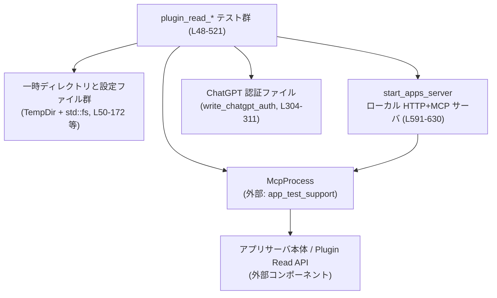
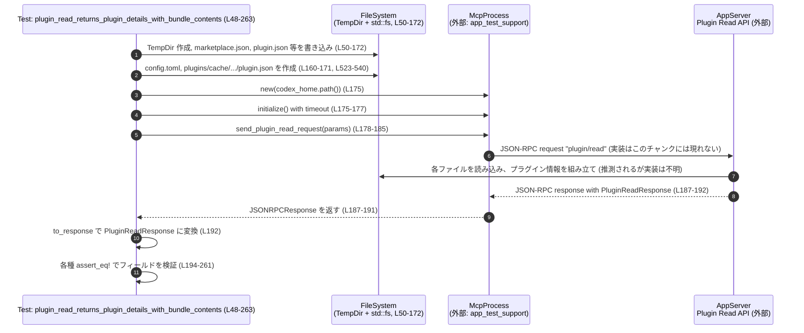

# app-server/tests/suite/v2/plugin_read.rs コード解説

## 0. ざっくり一言

`plugin_read.rs` は、アプリサーバーの **Plugin Read API（プラグイン詳細取得）** の振る舞いを検証する **非同期統合テスト** と、そのためのテスト用 HTTP サーバー／ファイル生成ユーティリティをまとめたモジュールです。

---

## 1. このモジュールの役割

### 1.1 概要

このモジュールは、次のような問題を検証するために存在します。

- プラグインのマーケットプレイス定義・ローカルインストール状態・スキル定義・アプリ定義・MCP サーバ定義を組み合わせたときに、**Plugin Read API がどのような JSON 応答を返すか**を検証する（正常系・エラー系）  
  根拠: `plugin_read_returns_plugin_details_with_bundle_contents` などのテストで `PluginReadResponse` やエラーコードを詳細に検証しているため（`plugin_read.rs:L48-263, L421-521`）。
- コネクタ（外部アプリ連携）のディレクトリ API と MCP ツール情報を組み合わせて、**アプリごとの `needs_auth` フラグがどう決定されるか**を検証する  
  根拠: `plugin_read_returns_app_needs_auth` が `(app.id, app.needs_auth)` の組を検証しているため（`plugin_read.rs:L265-354`）。
- プラグイン manifest の `defaultPrompt` が **文字列配列とレガシーな文字列単体の両方を受け入れるか**を検証する  
  根拠: `plugin_read_accepts_legacy_string_default_prompt` の assertions（`plugin_read.rs:L356-419`）。

### 1.2 アーキテクチャ内での位置づけ

このファイル単体で見ると、構成要素は主に次の 4 つです。

- テストケース群（`#[tokio::test]` 非同期テスト関数）  
  根拠: `plugin_read.rs:L48-263, L265-354, L356-419, L421-521`
- テスト用のローカル HTTP サーバー（Axum + RMCP MCP サービス）  
  根拠: `start_apps_server`, `list_directory_connectors`, `PluginReadMcpServer`（`plugin_read.rs:L552-661, L591-630`）
- 各種設定ファイル・プラグインバンドルを作るファイル IO ユーティリティ  
  根拠: `write_installed_plugin` など（`plugin_read.rs:L523-550, L663-748`）
- 外部テストサポート (`app_test_support::McpProcess`, `ChatGptAuthFixture`) とプロトコル型  
  根拠: ファイル先頭の `use` 群（`plugin_read.rs:L6-28`）

これらの関係を簡略化すると、以下のようになります。



※ `AS`（アプリサーバ本体）の実装はこのファイルには現れておらず、テストは `McpProcess` を通じてブラックボックス的に呼び出しています（このチャンクには実装は現れません）。

### 1.3 設計上のポイント

コードから読み取れる、このモジュールの設計上の特徴は次のとおりです。

- **完全な統合シナリオを 1 テスト内で構築**  
  - 各テストが TempDir 内に `.agents/plugins/marketplace.json`, `.codex-plugin/plugin.json`, `.app.json`, `.mcp.json`, `config.toml` などを直接書き出し、Plugin Read API の期待結果を検証しています（`plugin_read.rs:L50-172, L140-172, L160-172, L523-550, L684-748`）。
- **非同期 & タイムアウト付き実行**  
  - すべてのテストは `#[tokio::test]` かつ `async fn` で、`tokio::time::timeout` で JSON-RPC 応答待ちに上限時間を設けてデッドロックを防いでいます（`plugin_read.rs:L48-49, L175-177, L324-326, L390-392, L444-446, L496-498`）。
- **テスト専用 HTTP サーバーの組み立て**  
  - Axum + `StreamableHttpService` でコネクタディレクトリ API と MCP ツール API を提供するローカルサーバーを起動します（`plugin_read.rs:L591-630`）。
- **共有状態は `Arc<StdMutex<...>>` で管理**  
  - `AppsServerState.response` と `PluginReadMcpServer.tools` を `Arc<StdMutex<...>>` で共有し、Axum ハンドラや RMCP サーバーハンドラからアクセスしています（`plugin_read.rs:L552-560`）。
  - `Mutex` の毒化（Poison）時も `unwrap_or_else(std::sync::PoisonError::into_inner)` で強制的に中身を取り出すため、テストがパニック後も状態にアクセスできます（`plugin_read.rs:L579-581, L655-658`）。
- **エラー条件や境界ケースを明確にテスト**  
  - 存在しないプラグイン名、manifest ファイルの欠如、レガシーな `defaultPrompt` フォーマットなどがテストされています（`plugin_read.rs:L421-521, L356-419`）。

---

## 2. 主要な機能一覧（コンポーネントインベントリー）

### 2.1 構造体・型一覧

| 名前 | 種別 | 役割 / 用途 | 定義位置 |
|------|------|-------------|----------|
| `AppsServerState` | 構造体 | ローカル HTTP サーバーが返す `apps` ディレクトリ JSON を保持するテスト用状態 | `plugin_read.rs:L552-555` |
| `PluginReadMcpServer` | 構造体 | MCP ツール一覧を返すテスト用 MCP サーバー。`ServerHandler` トレイトを実装 | `plugin_read.rs:L557-560, L562-589` |

※ その他の型（`AppInfo`, `PluginReadResponse` 等）は外部クレートに定義されており、このチャンクには現れません。

### 2.2 関数・メソッド一覧

#### テストケース (`#[tokio::test]`)

| 関数名 | 役割（1 行） | 定義位置 |
|--------|--------------|----------|
| `plugin_read_returns_plugin_details_with_bundle_contents` | フル機能のプラグインバンドルを用意し、Plugin Read API が詳細情報とバンドル内容を正しく返すことを検証する | `plugin_read.rs:L48-263` |
| `plugin_read_returns_app_needs_auth` | コネクタディレクトリと MCP ツール情報に応じて `app.needs_auth` が設定されることを検証する | `plugin_read.rs:L265-354` |
| `plugin_read_accepts_legacy_string_default_prompt` | manifest の `defaultPrompt` が文字列配列だけでなく単一文字列も受け付けて配列に変換されることを検証する | `plugin_read.rs:L356-419` |
| `plugin_read_returns_invalid_request_when_plugin_is_missing` | マーケットプレイスにはあるが指定名のプラグインが存在しない場合に JSON-RPC エラー (-32600) になることを検証する | `plugin_read.rs:L421-469` |
| `plugin_read_returns_invalid_request_when_plugin_manifest_is_missing` | プラグインディレクトリはあるが manifest `.codex-plugin/plugin.json` がない場合に JSON-RPC エラー (-32600) になることを検証する | `plugin_read.rs:L471-521` |

#### テスト用ユーティリティ関数

| 関数名 | 役割（1 行） | 定義位置 |
|--------|--------------|----------|
| `write_installed_plugin` | codex_home 配下に「インストール済みプラグイン」のキャッシュディレクトリと簡単な `plugin.json` を書き出す | `plugin_read.rs:L523-540` |
| `write_plugins_enabled_config` | plugins 機能を有効化する最小限の `config.toml` を書き出す | `plugin_read.rs:L542-550` |
| `start_apps_server` | コネクタディレクトリ API と MCP ツール API を提供するローカル HTTP サーバーを起動し、URL と `JoinHandle` を返す | `plugin_read.rs:L591-630` |
| `list_directory_connectors` | `/connectors/directory/list` 等に対応する Axum ハンドラ。認証ヘッダとクエリを検証し、状態に保持した JSON を返す | `plugin_read.rs:L632-661` |
| `connector_tool` | 指定されたコネクタ ID/名前から、テスト用の RMCP `Tool` オブジェクトを構築する | `plugin_read.rs:L663-682` |
| `write_connectors_config` | ChatGPT 基底 URL・OAuth ストア設定・features を含む `config.toml` を書き出す | `plugin_read.rs:L684-698` |
| `write_plugin_marketplace` | `.agents/plugins/marketplace.json` に単一プラグインのマーケットプレイス設定を出力する | `plugin_read.rs:L700-725` |
| `write_plugin_source` | プラグインディレクトリと `.codex-plugin/plugin.json`、`.app.json` を生成する | `plugin_read.rs:L727-748` |

#### トレイトメソッド（`PluginReadMcpServer`）

| メソッド名 | 役割（1 行） | 定義位置 |
|-----------|--------------|----------|
| `get_info(&self) -> ServerInfo` | MCP サーバーの capabilities として tools 有効を示す `ServerInfo` を返す | `plugin_read.rs:L563-568` |
| `list_tools(&self, ...) -> impl Future<Output = Result<ListToolsResult, rmcp::ErrorData>>` | Mutex に保持しているツール一覧を読み出し、`ListToolsResult` として返す | `plugin_read.rs:L570-588` |

---

## 3. 公開 API と詳細解説

> このファイルには `pub` な型・関数はありませんが、テスト観点で重要な 7 つの関数を「公開 API 相当」とみなして詳細を整理します。

### 3.1 型一覧（構造体・列挙体など）

| 名前 | 種別 | 役割 / 用途 | フィールド概要 | 定義位置 |
|------|------|-------------|----------------|----------|
| `AppsServerState` | 構造体 | コネクタディレクトリ API のレスポンス JSON を共有するテスト用状態 | `response: Arc<StdMutex<serde_json::Value>>` – `/connectors/directory/list` などから返す JSON を保持 | `plugin_read.rs:L552-555` |
| `PluginReadMcpServer` | 構造体 | MCP ツール一覧 API を提供するテスト用サーバー | `tools: Arc<StdMutex<Vec<Tool>>>` – コネクタに対応するツール群 | `plugin_read.rs:L557-560` |

### 3.2 関数詳細（7 件）

#### 1. `plugin_read_returns_plugin_details_with_bundle_contents() -> Result<()>`

```rust
#[tokio::test]
async fn plugin_read_returns_plugin_details_with_bundle_contents() -> Result<()> {
    // ...
}
```

**概要**

- フル機能のプラグインバンドル（manifest, skills, app, MCP 定義、インストール状態）を一時ディレクトリに構築し、Plugin Read API の応答内容が期待どおりであることを検証する統合テストです。  
  根拠: 詳細なファイル生成と `PluginReadResponse` への多くの assert（`plugin_read.rs:L48-263`）。

**引数**

- テスト関数のため、引数はありません。

**戻り値**

- `anyhow::Result<()>`  
  - 成功時: `Ok(())`  
  - 失敗時: テストセットアップや JSON パース等の途中で発生したエラーが `Err` として返り、テストは失敗します（`plugin_read.rs:L48-263`）。

**内部処理の流れ**

1. **一時ディレクトリの準備**  
   - `codex_home` と `repo_root` を `TempDir` で作成（`plugin_read.rs:L50-52`）。
   - `repo_root` に `.git` と `.agents/plugins` ディレクトリを作成（`plugin_read.rs:L53-54`）。

2. **マーケットプレイスとプラグイン manifest の書き出し**  
   - `marketplace.json` に `demo-plugin` を `AVAILABLE` / `ON_INSTALL`, category `"Design"` として登録（`plugin_read.rs:L58-77`）。  
   - `.codex-plugin/plugin.json` に詳細な interface 情報（displayName, category, defaultPrompt など）を JSON で書き出し（`plugin_read.rs:L78-103`）。

3. **スキル定義と agents ポリシーの作成**  
   - `skills/thread-summarizer/SKILL.md` と `skills/chatgpt-only/SKILL.md` を作成（`plugin_read.rs:L104-123`）。
   - 各スキル配下に `agents/openai.yaml` を作り、`CODEX` / `CHATGPT` プロダクト向けのポリシーを定義（`plugin_read.rs:L124-139`）。

4. **アプリと MCP サーバーの定義**  
   - `.app.json` に `gmail` アプリ定義を追加（`plugin_read.rs:L140-149`）。
   - `.mcp.json` に `"demo"` MCP サーバー定義 (`command: "demo-server"`) を追加（`plugin_read.rs:L150-159`）。

5. **Codex の設定とインストール済みプラグインキャッシュの作成**  
   - `codex_home/config.toml` に `plugins = true`、`skills.config` で `demo-plugin:thread-summarizer` を disabled、`plugins."demo-plugin@codex-curated"` を enabled として書き出し（`plugin_read.rs:L160-171`）。
   - `write_installed_plugin` を呼んで `plugins/cache/codex-curated/demo-plugin/local/.codex-plugin/plugin.json` を生成（`plugin_read.rs:L173, L523-540`）。

6. **McpProcess の初期化と Plugin Read リクエスト送信**  
   - `McpProcess::new(codex_home.path())` でテスト用プロセスを起動し、`initialize()` をタイムアウト付きで実行（`plugin_read.rs:L175-177`）。
   - `send_plugin_read_request` に `PluginReadParams { marketplace_path, plugin_name: "demo-plugin" }` を渡してリクエスト ID を取得（`plugin_read.rs:L178-185`）。

7. **応答受信とアサーション**  
   - `read_stream_until_response_message` で JSON-RPC 応答を `DEFAULT_TIMEOUT` 内に取得し、`to_response` で `PluginReadResponse` に変換（`plugin_read.rs:L187-192`）。
   - 以下の項目を `assert_eq!` 等で検証（`plugin_read.rs:L194-261`）:
     - `marketplace_name`, `marketplace_path`, `summary.id`, `summary.name`
     - `description`, `installed`, `enabled`, `install_policy`, `auth_policy`
     - `summary.interface.display_name`, `summary.interface.category`, `summary.interface.default_prompt`
     - `skills` の数と `thread-summarizer` スキルの name/description/enabled
     - `apps` の `id`, `name`, `install_url`, `needs_auth`
     - `mcp_servers` のエントリ `"demo"`

**Examples（使用例）**

テストでの使用例そのものがサンプルになります。簡略版を示します。

```rust
#[tokio::test]
async fn example_use_of_mcp_plugin_read() -> Result<()> {
    let codex_home = TempDir::new()?;                       // Codex 用のホームディレクトリを作成
    // ... 必要なファイル群 (.codex-plugin/plugin.json 等) を作成 ...

    let mut mcp = McpProcess::new(codex_home.path()).await?; // テスト用 MCP プロセス
    timeout(DEFAULT_TIMEOUT, mcp.initialize()).await??;      // 初期化 (タイムアウト付き)

    let marketplace_path = AbsolutePathBuf::try_from(/* ... */)?;
    let request_id = mcp
        .send_plugin_read_request(PluginReadParams {
            marketplace_path,
            plugin_name: "demo-plugin".to_string(),
        })
        .await?;

    let response: JSONRPCResponse = timeout(
        DEFAULT_TIMEOUT,
        mcp.read_stream_until_response_message(RequestId::Integer(request_id)),
    )
    .await??;
    let response: PluginReadResponse = to_response(response)?; // 型付きに変換

    assert_eq!(response.plugin.summary.name, "demo-plugin");
    Ok(())
}
```

**Errors / Panics**

- `TempDir::new`, `std::fs::write`, `std::fs::create_dir_all` などの IO エラーで `Err(anyhow::Error)` を返し、テストが失敗します（`plugin_read.rs:L50-172`）。
- `AbsolutePathBuf::try_from` の失敗や JSON 変換失敗 (`to_response`) も `Err` になりえます（`plugin_read.rs:L178-192`）。
- `timeout` が期限切れになると `Elapsed` エラーが `?` で伝播し、テストは失敗します（`plugin_read.rs:L175-177, L187-191`）。
- 明示的な `panic!` はありません。

**Edge cases（エッジケース）**

- スキル定義のうち、`thread-summarizer` と `chatgpt-only` の両方を用意しながら、Codex の設定で `thread-summarizer` のみを `skills.config` に記載し `enabled = false` としている点が重要です（`plugin_read.rs:L165-167`）。  
  → Plugin Read API が「利用可能だが無効化されたスキル」をどのように扱うかを確認する契約と考えられます（`plugin_read.rs:L242-251`）。
- `.mcp.json` に `demo` サーバーがある場合にのみ `plugin.mcp_servers` に `"demo"` が含まれることを期待しており、MCP 定義がないときの挙動はこのチャンクには現れません（`plugin_read.rs:L150-159, L259-261`）。

**使用上の注意点**

- テスト内で多くのファイル・ディレクトリを生成するため、**パスの打ち間違いや JSON の構造違い**は Plugin Read API の挙動ではなくテストセットアップのエラーとして現れます。
- 実運用コードで同じパターンを使う場合、`timeout` を適切な値で設定しないとハングした JSON-RPC 呼び出しがテストをブロックする可能性があります。

---

#### 2. `plugin_read_returns_app_needs_auth() -> Result<()>`

**概要**

- コネクタディレクトリ API と MCP ツール一覧を模したローカル HTTP サーバーを起動し、Plugin Read API が返す `app.needs_auth` の値が `(alpha: true, beta: false)` になることを検証するテストです（`plugin_read.rs:L265-354`）。

**引数**

- なし。

**戻り値**

- `anyhow::Result<()>` – セットアップや JSON 処理が失敗した場合にのみ `Err` が返ります。

**内部処理の流れ**

1. **テスト用コネクタ情報の定義**  
   - `connectors: Vec<AppInfo>` として `alpha`, `beta` の 2 つのアプリを作成（`plugin_read.rs:L267-298`）。
2. **MCP ツールの定義**  
   - `connector_tool("beta", "Beta App")` により、`beta` に対応する MCP `Tool` を 1 つだけ定義（`plugin_read.rs:L299, L663-682`）。
3. **ローカルアプリサーバーの起動**  
   - `start_apps_server(connectors, tools)` で HTTP サーバーを起動し、`server_url` と `JoinHandle` を受け取る（`plugin_read.rs:L299-301, L591-630`）。
4. **Codex 設定とチャットGPT認証情報の書き出し**  
   - `write_connectors_config` で `chatgpt_base_url = server_url` などを含む `config.toml` を生成（`plugin_read.rs:L302-303, L684-698`）。
   - `write_chatgpt_auth` で `chatgpt-token` / `account-123` 等の認証情報をファイルに保存（`plugin_read.rs:L304-311`）。
5. **マーケットプレイスとプラグインソースの生成**  
   - `write_plugin_marketplace` と `write_plugin_source` で `sample-plugin` の定義とアプリ ID (`alpha`, `beta`) を `.app.json` に書き出し（`plugin_read.rs:L313-320, L700-725, L727-748`）。
6. **McpProcess による Plugin Read 呼び出し**  
   - `McpProcess::new` → `initialize` → `send_plugin_read_request` → `read_stream_until_response_message` → `to_response` という流れで `PluginReadResponse` を取得（`plugin_read.rs:L324-339`）。
7. **アプリごとの `needs_auth` を検証**  
   - `response.plugin.apps.iter().map(|app| (app.id.as_str(), app.needs_auth))` が `vec![("alpha", true), ("beta", false)]` と一致することを検証（`plugin_read.rs:L341-349`）。

**Examples（使用例）**

`start_apps_server` と組み合わせてコネクタ API をテストするパターンの雛形になります。

```rust
let connectors = vec![ /* AppInfo の一覧 */ ];
let tools = vec![connector_tool("beta", "Beta App")?];

let (server_url, server_handle) = start_apps_server(connectors, tools).await?;
write_connectors_config(codex_home.path(), &server_url)?;
// ... McpProcess で Plugin Read 呼び出し ...

server_handle.abort();
let _ = server_handle.await; // サーバーをきれいに停止
```

**Errors / Panics**

- HTTP サーバーのバインドや `write_*` 系の IO, JSON 処理が失敗すると `Err(anyhow::Error)` が返ります（`plugin_read.rs:L299-303, L313-320`）。
- `timeout` の期限切れはテスト失敗の原因となります（`plugin_read.rs:L325-326, L335-338`）。

**Edge cases**

- `connectors` には `alpha` / `beta` の両方が含まれている一方、`tools` は `beta` のみを含む点が重要です（`plugin_read.rs:L267-299`）。
  - これにより、Plugin Read API がツール情報の有無などに応じて `needs_auth` を変える契約であると解釈できますが、具体的なロジックはこのチャンクには現れません。
- HTTP ハンドラでは Bearer トークンやアカウント ID、`external_logos=true` クエリが満たされないと `UNAUTHORIZED` / `BAD_REQUEST` を返すため、テストの前提条件として正しいヘッダとクエリが必要です（`plugin_read.rs:L632-652`）。

**使用上の注意点**

- テスト終了時に `server_handle.abort()` と `await` を行ってサーバーを停止しており、これを忘れるとテストスイートの終了が遅延する可能性があります（`plugin_read.rs:L351-352`）。
- 非同期コンテキストでローカル HTTP サーバーを立ち上げるため、ポート競合回避のために `"127.0.0.1:0"` を使用して OS にポートを選ばせている点は実運用でも有用なパターンです（`plugin_read.rs:L602-603`）。

---

#### 3. `plugin_read_accepts_legacy_string_default_prompt() -> Result<()>`

**概要**

- プラグイン manifest の `interface.defaultPrompt` が **単一の文字列** で記述されているレガシーフォーマットでも、Plugin Read API が **文字列配列** として扱うことを確認するテストです（`plugin_read.rs:L356-419`）。

**内部処理の要点**

- `marketplace.json` に `demo-plugin` をローカルソースとして登録（`plugin_read.rs:L364-377`）。
- `.codex-plugin/plugin.json` は `interface.defaultPrompt: "Starter prompt for trying a plugin"` という単一文字列のみ持つ簡略な JSON（`plugin_read.rs:L379-387`）。
- `write_plugins_enabled_config` で plugins 機能を有効化（`plugin_read.rs:L388-388, L542-550`）。
- `McpProcess` による Plugin Read 呼び出し後、  
  `response.plugin.summary.interface.as_ref().and_then(|i| i.default_prompt.clone())` が `Some(vec!["Starter prompt for trying a plugin".to_string()])` になることを検証（`plugin_read.rs:L409-417`）。

**Contracts / Edge cases**

- 「単一文字列 → 1 要素の配列」として正規化する挙動が Plugin Read API の契約になっていると読み取れます（`plugin_read.rs:L409-417`）。
- 逆に、空文字列や `defaultPrompt` が存在しない場合の扱いは、このチャンクには現れません。

---

#### 4. `plugin_read_returns_invalid_request_when_plugin_is_missing() -> Result<()>`

**概要**

- マーケットプレイス定義には存在するが、実際のプラグインディレクトリには存在しないプラグイン名を指定した場合、Plugin Read API が JSON-RPC エラーコード `-32600` を返すことを検証します（`plugin_read.rs:L421-469`）。

**内部処理の要点**

- `marketplace.json` に `demo-plugin` を登録するが、実際の `plugins/demo-plugin` ディレクトリは作成しない（`plugin_read.rs:L424-441`）。
- Plugin Read リクエストには `plugin_name: "missing-plugin"` を指定（`plugin_read.rs:L447-453`）。
- `read_stream_until_error_message` でエラーレスポンスを取得し、  
  - `err.error.code == -32600`  
  - `err.error.message` に `"plugin`missing-plugin`was not found"` を含む  
  ことを検証（`plugin_read.rs:L456-467`）。

**契約・エッジケース**

- Plugin Read API は存在しないプラグインに対して JSON-RPC の「Invalid Request」コード `-32600` を使う契約になっていることが分かります（`plugin_read.rs:L462-467`）。
- エラーメッセージの文言の一部（`plugin`missing-plugin`was not found`）はテストで直接チェックされており、将来この文言を変えるとテストが壊れることに注意が必要です。

---

#### 5. `plugin_read_returns_invalid_request_when_plugin_manifest_is_missing() -> Result<()>`

**概要**

- `plugins/demo-plugin` ディレクトリは存在するが `.codex-plugin/plugin.json` が存在しないケースで、Plugin Read API が JSON-RPC エラーコード `-32600` と特定のメッセージを返すことを検証します（`plugin_read.rs:L471-521`）。

**内部処理の要点**

- `plugins/demo-plugin` ディレクトリだけ作成し、中身は空（`plugin_read.rs:L475-478`）。
- `marketplace.json` には `demo-plugin` を登録（`plugin_read.rs:L479-493`）。
- Plugin Read 呼び出しでは `plugin_name: "demo-plugin"` を指定（`plugin_read.rs:L499-505`）。
- エラーレスポンスについて、
  - `err.error.code == -32600`  
  - `err.error.message` に `"missing or invalid .codex-plugin/plugin.json"` を含む  
  ことを検証（`plugin_read.rs:L514-519`）。

**契約・エッジケース**

- Plugin Read API は manifest ファイルの欠如や不正を **リクエスト自体の不備 (`-32600`)** として扱い、具体的な原因をメッセージに含める契約になっていることが分かります。
- manifest ファイルの JSON が存在するがスキーマ的に無効なケースについては、このチャンクには現れません。

---

#### 6. `start_apps_server(connectors: Vec<AppInfo>, tools: Vec<Tool>) -> Result<(String, JoinHandle<()>)>`

**概要**

- コネクタディレクトリ API (`/connectors/directory/list`, `/list_workspace`) と、`/api/codex/apps` 以下で MCP HTTP サービスを提供するローカルテストサーバーを起動し、ベース URL と `JoinHandle` を返すユーティリティです（`plugin_read.rs:L591-630`）。

**引数**

| 引数名 | 型 | 説明 |
|--------|----|------|
| `connectors` | `Vec<AppInfo>` | コネクタディレクトリ API が返す `apps` リスト |
| `tools` | `Vec<Tool>` | MCP サーバーが返すツール一覧 |

**戻り値**

- `Result<(String, JoinHandle<()>)>`  
  - `Ok((base_url, handle))`  
    - `base_url`: 例 `"http://127.0.0.1:12345"` のようなバインドされたアドレスを含む URL（`plugin_read.rs:L602-603, L629`）。  
    - `handle`: `tokio::spawn` されたサーバータスクの `JoinHandle<()>`。テスト終了時に `abort()` して停止させます（`plugin_read.rs:L625-629`）。
  - `Err(anyhow::Error)`: ソケットバインドやアドレス取得の失敗時など。

**内部処理の流れ**

1. `AppsServerState` と `tools` の共有状態を `Arc<StdMutex<...>>` で生成（`plugin_read.rs:L595-600`）。
2. `TcpListener::bind("127.0.0.1:0")` でローカルホストにエフェメラルポートをバインドし、`local_addr()` で実際のアドレスを取得（`plugin_read.rs:L602-603`）。
3. `StreamableHttpService::new` で RMCP MCP サービスを生成し、各接続ごとに `PluginReadMcpServer { tools: tools.clone() }` を提供するクロージャを渡す（`plugin_read.rs:L604-615`）。
4. Axum の `Router` を構築し、  
   - `/connectors/directory/list`, `/connectors/directory/list_workspace` を `list_directory_connectors` にマッピング  
   - `.with_state(state)` で `AppsServerState` を共有  
   - `/api/codex/apps` 配下に MCP サービスをネスト  
   する（`plugin_read.rs:L616-623`）。
5. `tokio::spawn` で `axum::serve(listener, router)` を非同期タスクとして起動し、ベース URL 文字列とハンドルを返す（`plugin_read.rs:L625-629`）。

**並行性・安全性**

- `AppsServerState` と `PluginReadMcpServer` はともに `Arc<StdMutex<_>>` を用いて複数リクエストから共有されます（`plugin_read.rs:L552-560`）。
  - テスト用コードのため、非同期コンテキストで `StdMutex` を使用しており、`lock()` はスレッドをブロックしますが、テストでは許容されています。
  - `PoisonError::into_inner` により、パニック後もロックの中身を取り出します（`plugin_read.rs:L579-581, L655-658`）。

**使用上の注意点**

- `start_apps_server` 自体は `anyhow::Result` を返すため、呼び出し側のテストでは `?` で簡便に扱えますが、エラーの発生源（IO, Axum ではなくソケットバインド）はスタックトレース等で確認する必要があります。
- テスト終了時に `JoinHandle` を `abort` しないとサーバータスクが存続し続けるため、`plugin_read_returns_app_needs_auth` のように明示的に停止処理を書くのが前提です（`plugin_read.rs:L351-352`）。

---

#### 7. `list_directory_connectors(...) -> Result<impl IntoResponse, StatusCode>`

```rust
async fn list_directory_connectors(
    State(state): State<Arc<AppsServerState>>,
    headers: HeaderMap,
    uri: Uri,
) -> Result<impl axum::response::IntoResponse, StatusCode> { /* ... */ }
```

**概要**

- Axum のハンドラ関数として、コネクタディレクトリ API のエンドポイント `/connectors/directory/list` および `/list_workspace` に対応し、ヘッダとクエリを検証したうえで `AppsServerState.response` に保持された JSON を返します（`plugin_read.rs:L632-661`）。

**引数**

| 引数名 | 型 | 説明 |
|--------|----|------|
| `State(state)` | `State<Arc<AppsServerState>>` | 共有状態として保持されたレスポンス JSON |
| `headers` | `HeaderMap` | リクエストヘッダ。認証トークンとアカウント ID を検証するために使用 |
| `uri` | `Uri` | リクエスト URI。クエリパラメータ `external_logos=true` の確認に使用 |

**戻り値**

- `Result<impl IntoResponse, StatusCode>`  
  - `Ok(Json(response))`: 認証とクエリが妥当な場合に JSON 応答を返す（`plugin_read.rs:L654-660`）。  
  - `Err(StatusCode::UNAUTHORIZED)` または `Err(StatusCode::BAD_REQUEST)`。

**内部処理の流れ**

1. `AUTHORIZATION` ヘッダを取得し、`"Bearer chatgpt-token"` と一致するかを確認（`plugin_read.rs:L637-640`）。
2. `"chatgpt-account-id"` ヘッダが `"account-123"` と一致するか確認（`plugin_read.rs:L641-644`）。
3. URI のクエリ文字列に `external_logos=true` が含まれるかを確認（`plugin_read.rs:L645-647`）。
4. 上記条件に応じて:
   - Bearer またはアカウント ID が不正 → `Err(StatusCode::UNAUTHORIZED)`（`plugin_read.rs:L649-651`）。
   - クエリが不正 → `Err(StatusCode::BAD_REQUEST)`（`plugin_read.rs:L651-652`）。
   - それ以外 → `state.response` を Mutex 経由でクローンし `Json(response)` を返す（`plugin_read.rs:L654-660`）。

**Errors / Panics**

- Mutex ロックが毒化していても、`unwrap_or_else(std::sync::PoisonError::into_inner)` で中身を取得し続けるため、ここではパニックが発生しないように書かれています（`plugin_read.rs:L655-658`）。
- 返り値の `Err(StatusCode)` は HTTP レベルの 4xx 応答として扱われます。

**Edge cases**

- 上記 3 条件のうちどれか 1 つでも満たされない場合はエラーになるため、テスト側は `write_chatgpt_auth` と `write_connectors_config` によってこれら条件を満たすようにセットアップされています（`plugin_read.rs:L304-311, L684-698`）。
- クエリパラメータの判定は `query.split('&').any(|pair| pair == "external_logos=true")` と単純な文字列比較で行っているため、順序やエンコードの違いは考慮していません（`plugin_read.rs:L645-647`）。

**使用上の注意点**

- このハンドラはテスト専用であり、実運用の認証ロジックとは異なる固定値ベースの実装になっています。
- `StdMutex` を非同期コンテキストで使っている点は、テストでは許容されますが、本番コードでは `tokio::sync::Mutex` 等を検討すべきポイントです。

---

### 3.3 その他の関数（概要）

| 関数名 | 役割（1 行） | 定義位置 |
|--------|--------------|----------|
| `write_installed_plugin` | codex_home 配下にインストール済みプラグインのキャッシュディレクトリと簡易 `plugin.json` を作成する | `plugin_read.rs:L523-540` |
| `write_plugins_enabled_config` | plugins 機能のみを有効にする `config.toml` を書き込む | `plugin_read.rs:L542-550` |
| `connector_tool` | `connector_id`/`connector_name` から RMCP `Tool` を生成し、`meta` に ID/名前を埋め込む | `plugin_read.rs:L663-682` |
| `write_connectors_config` | ChatGPT ベース URL, OAuth ストア種別, `features.plugins/connectors` を含む Codex 設定を生成する | `plugin_read.rs:L684-698` |
| `write_plugin_marketplace` | 単一プラグインのマーケットプレイス JSON（`marketplace.json`）を生成する | `plugin_read.rs:L700-725` |
| `write_plugin_source` | プラグインルート配下に `.codex-plugin/plugin.json` と `.app.json` を生成する | `plugin_read.rs:L727-748` |

---

## 4. データフロー

ここでは、最も包括的なテストである `plugin_read_returns_plugin_details_with_bundle_contents`（`plugin_read.rs:L48-263`）を例に、データフローを整理します。

### 4.1 処理フロー概要

1. テストが一時ディレクトリに **各種設定ファイル・プラグインバンドル** を生成する。
2. `McpProcess` を起動し、Plugin Read の JSON-RPC リクエストを送信する。
3. アプリサーバー（テスト対象）がファイルシステムと設定を読み込み、`PluginReadResponse` を生成する（実装はこのチャンクには現れない）。
4. `McpProcess` が JSON-RPC 応答を受信し、`PluginReadResponse` に変換してテストが各フィールドを検証する。

### 4.2 シーケンス図



> AppServer (AS) の内部実装はこのファイルには含まれていないため、ファイルシステムからの読み込みなどはテストから推測される振る舞いのみを記述しています。

### 4.3 バグ・セキュリティ上の観点

- **認証情報の取り扱い**
  - テスト用 HTTP ハンドラ `list_directory_connectors` は固定値 `"Bearer chatgpt-token"` と `"account-123"` をハードコードで検証しており、本番用のセキュリティ実装ではありません（`plugin_read.rs:L637-644`）。
  - このコードは test モジュール内にあり、外部公開 API ではないため、直接的なセキュリティリスクにはなりにくいと考えられます。

- **Mutex の毒化 (Poisoning) 無視**
  - `AppsServerState` と `PluginReadMcpServer` は PoisonError を無視して中身を取り出すため、パニックの原因が見えにくくなる可能性があります（`plugin_read.rs:L579-581, L655-658`）。
  - ただし、これはテストコードであり、テスト継続性を優先した実装と解釈できます。

- **ブロッキング Mutex の使用**
  - 非同期コンテキストで `std::sync::Mutex` を使っているため、本番コードとしてはブロッキングの観点で注意が必要ですが、このファイルではテスト専用です（`plugin_read.rs:L552-560, L576-581, L655-658`）。

---

## 5. 使い方（How to Use）

このファイル自体はテストコードですが、「新しい plugin_read 関連テストを書きたい場合」のガイドとして整理します。

### 5.1 基本的な使用方法（テスト追加のパターン）

1. **テスト用ディレクトリと設定を準備**

```rust
let codex_home = TempDir::new()?;                         // Codex ホームディレクトリ
let repo_root = TempDir::new()?;                          // リポジトリルート

// 必要ならマーケットプレイスやプラグインソースを生成
write_plugin_marketplace(repo_root.path(), "debug", "my-plugin", "./my-plugin")?;
write_plugin_source(repo_root.path(), "my-plugin", &["alpha"])?;
write_plugins_enabled_config(&codex_home)?;               // plugins 機能を有効化
```

1. **McpProcess を起動して Plugin Read を呼び出す**

```rust
let mut mcp = McpProcess::new(codex_home.path()).await?;  // テスト用プロセス
timeout(DEFAULT_TIMEOUT, mcp.initialize()).await??;

let marketplace_path =
    AbsolutePathBuf::try_from(repo_root.path().join(".agents/plugins/marketplace.json"))?;
let request_id = mcp
    .send_plugin_read_request(PluginReadParams {
        marketplace_path,
        plugin_name: "my-plugin".to_string(),
    })
    .await?;

let response: JSONRPCResponse = timeout(
    DEFAULT_TIMEOUT,
    mcp.read_stream_until_response_message(RequestId::Integer(request_id)),
)
.await??;
let response: PluginReadResponse = to_response(response)?; // 型付きレスポンス
```

1. **期待するフィールドを assert**

```rust
assert_eq!(response.plugin.summary.name, "my-plugin");
assert!(response.plugin.skills.iter().any(|s| s.name == "my-plugin:alpha"));
```

### 5.2 よくある使用パターン

- **正常系の拡張**
  - 別のスキル構成やアプリ構成、別 marketplace を使った Plugin Read の挙動を確認するには、`plugin_read_returns_plugin_details_with_bundle_contents` をベースにセットアップ部分だけ変えるのが自然です（`plugin_read.rs:L48-172`）。

- **エラー系の追加**
  - 既存のエラー系テスト（プラグイン欠如、manifest 欠如）にならい、  
    - ファイル／ディレクトリを意図的に欠落させる  
    - `read_stream_until_error_message` を使ってエラーコードとメッセージを検証  
    するパターンが使えます（`plugin_read.rs:L421-469, L471-521`）。

- **コネクタ／アプリ連携の挙動検証**
  - `start_apps_server` と `write_connectors_config`, `write_chatgpt_auth` を組み合わせることで、Plugin Read と外部コネクタ API の連携挙動をテストできます（`plugin_read.rs:L265-354, L591-630`）。

### 5.3 よくある間違い（予想される誤用例）

このチャンクから推測できる、起こりやすいミスと正しい例です。

```rust
// 誤り例: config.toml に plugins 機能を有効化していない
std::fs::write(
    codex_home.path().join("config.toml"),
    r#"[features]
# plugins = true   // コメントアウトされている
"#,
)?;
// → Plugin Read 側がプラグイン機能を無効とみなし、期待通りの応答にならない可能性がある。
//   （この振る舞い自体はこのチャンクには現れません）

// 正しい例: write_plugins_enabled_config を使って確実に有効化
write_plugins_enabled_config(&codex_home)?;
```

```rust
// 誤り例: HTTP サーバータスクを止めずにテストを終了させる
let (server_url, _server_handle) = start_apps_server(connectors, tools).await?;
// ... Plugin Read 呼び出し ...
// server_handle.abort() を忘れている

// 正しい例: abort してから await
let (server_url, server_handle) = start_apps_server(connectors, tools).await?;
// ... Plugin Read 呼び出し ...
server_handle.abort();
let _ = server_handle.await;
```

### 5.4 使用上の注意点（まとめ）

- **非同期テストとタイムアウト**
  - すべてのテストは `#[tokio::test]` + `timeout` で構成されており、**テストがハングしないこと**を前提にしています。新しいテストもこのパターンに合わせると安全です。

- **ファイルシステムへの依存**
  - Plugin Read API の挙動は **ディレクトリ構造と JSON ファイル内容に強く依存**しているため、テストではファイル構成を明示的に再現する必要があります。

- **Mutex とスレッドセーフティ**
  - ローカル HTTP サーバー状態は `Arc<StdMutex<...>>` で保護されていますが、テスト用であることを理解し、本番コードへの転用時には `tokio::sync::Mutex` などの非ブロッキング手段を検討する必要があります。

- **エラーメッセージのハードコード**
  - エラー系テストはメッセージの一部文字列まで検証しているため、実装側でメッセージを変更するとテストも更新が必要になります（`plugin_read.rs:L462-467, L514-519`）。

---

## 6. 変更の仕方（How to Modify）

### 6.1 新しい機能を追加する場合（新テストシナリオ）

1. **どのファイルに追加するか**
   - Plugin Read API の挙動をテストしたい場合は、この `plugin_read.rs` に新しい `#[tokio::test]` 関数を追加するのが自然です。

2. **既存コードの再利用ポイント**
   - ファイルセットアップ:
     - `write_plugins_enabled_config`, `write_installed_plugin`, `write_plugin_marketplace`, `write_plugin_source`（`plugin_read.rs:L523-550, L700-748`）
   - コネクタ／アプリ連携:
     - `start_apps_server`, `connector_tool`, `write_connectors_config`, `list_directory_connectors`（`plugin_read.rs:L591-661, L663-698`）

3. **呼び出しの流れ**
   - 典型的には、  
     1. 必要なファイル・ディレクトリを TempDir 上に作成  
     2. `McpProcess::new` → `initialize`  
     3. `send_plugin_read_request` → 応答受信 (`read_stream_until_*`)  
     4. 型付きへの変換 (`to_response`)  
     5. 期待値を `assert_eq!` 等で検証  
     というパターンを踏襲します（`plugin_read.rs:L175-192, L324-339, L390-407`）。

### 6.2 既存の機能を変更する場合（注意点）

- **影響範囲**
  - ファイル出力ユーティリティ（例: `write_plugin_marketplace`）の JSON 形式を変更すると、Plugin Read API 実装だけでなく、このテストファイルに依存する他のテストにも影響する可能性があります。
- **契約の維持**
  - エラーコード `-32600` やエラーメッセージの一部はテストで直接検証されているため、これらを変更する場合はテスト側の期待値も合わせて更新する必要があります（`plugin_read.rs:L462-467, L514-519`）。
- **並行性と同期原語**
  - `AppsServerState` や `PluginReadMcpServer` のフィールド型（`Arc<StdMutex<...>>`）を変更する場合、`list_directory_connectors` と `ServerHandler::list_tools` の両方のロック取得部分を更新する必要があります（`plugin_read.rs:L576-581, L655-658`）。
- **テスト安定性**
  - `timeout` の時間（`DEFAULT_TIMEOUT`）を短くしすぎると CI 環境などでテストが不安定になる可能性があります（`plugin_read.rs:L46, L175-177, L187-191`）。

---

## 7. 関連ファイル

このモジュールと密接に関係する外部ファイル・モジュール（このチャンクには定義が現れないもの）を整理します。

| パス / モジュール | 役割 / 関係 |
|--------------------|------------|
| `app_test_support::McpProcess` | JSON-RPC 経由でアプリサーバーと対話するテスト用クライアント。Plugin Read 呼び出しや応答待ちを抽象化している（`plugin_read.rs:L8, L175-192, L324-339, L390-407`） |
| `app_test_support::ChatGptAuthFixture` / `write_chatgpt_auth` | ChatGPT 認証情報ファイルを生成するテストユーティリティ。`list_directory_connectors` が期待するヘッダ値と整合する内容を生成（`plugin_read.rs:L7, L304-311`） |
| `codex_app_server_protocol::{PluginReadParams, PluginReadResponse, AppInfo, JSONRPCResponse,...}` | Plugin Read API やコネクタ情報に用いるプロトコル型。テストはこれらのフィールドを詳細に検証している（`plugin_read.rs:L19-25, L178-185, L192-261, L267-298, L341-349`） |
| `rmcp` クレート (`ServerHandler`, `Tool`, `StreamableHttpService` など) | MCP サーバーのテスト用実装と HTTP サービスの組み立てに使用。`PluginReadMcpServer` のトレイト実装に依存（`plugin_read.rs:L29-39, L562-589, L604-615`） |
| `axum` | ローカル HTTP サーバーのルーティングとハンドラ (`list_directory_connectors`) の実装に使用（`plugin_read.rs:L11-18, L591-630, L632-661`） |
| `codex_config::types::AuthCredentialsStoreMode` | ChatGPT 認証情報の保存モード指定に使用（`plugin_read.rs:L26, L304-311`） |

以上が、この `plugin_read.rs` モジュールの構造・データフロー・契約・使用上の注意点の整理です。
