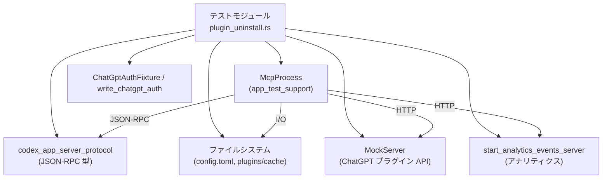
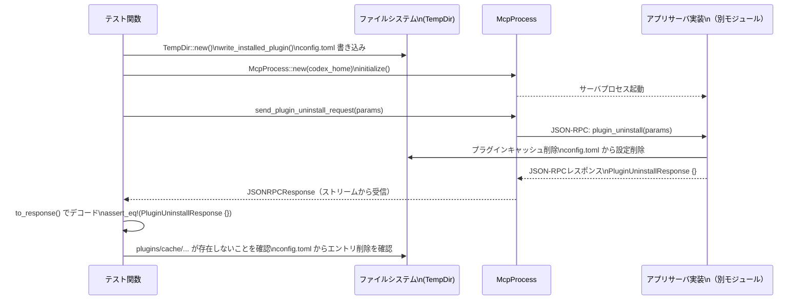

# app-server/tests/suite/v2/plugin_uninstall.rs

## 0. ざっくり一言

プラグインのアンインストール処理について、

- ローカルキャッシュと設定削除
- ChatGPT 連携時のリモートアンインストール
- アナリティクスイベント送信

が正しく行われることを検証する非同期インテグレーションテスト群です（plugin_uninstall.rs:L28-220）。

---

## 1. このモジュールの役割

### 1.1 概要

このテストモジュールは、Codex アプリサーバの「プラグインアンインストール」機能に対し、次の点を検証します。

- 指定プラグインのローカルキャッシュディレクトリと `config.toml` の該当エントリが削除されること（plugin_uninstall.rs:L28-78）。
- `force_remote_sync = true` のときに、ChatGPT のプラグイン API に対するリモートアンインストール HTTP 呼び出しが行われること（plugin_uninstall.rs:L80-146）。
- アンインストール時に、所定の形式のアナリティクスイベントが送信されること（plugin_uninstall.rs:L148-220）。

### 1.2 アーキテクチャ内での位置づけ

このファイルはテスト専用であり、実装コードではありません。主な依存関係は次の通りです。

- `McpProcess`（`app_test_support`）: テスト対象のアプリサーバプロセスを起動し、JSON-RPC リクエストを送信するヘルパー（plugin_uninstall.rs:L42-43, L120-121, L169-170）。
- プロトコル型 `PluginUninstallParams`, `PluginUninstallResponse`, `JSONRPCResponse`, `RequestId`（`codex_app_server_protocol`）: JSON-RPC 経由でアンインストールリクエストとレスポンスをやり取りするための型（plugin_uninstall.rs:L10-13, L45-48, L50-57 など）。
- ChatGPT 認証・設定関連: `ChatGptAuthFixture`, `write_chatgpt_auth`, `AuthCredentialsStoreMode`（plugin_uninstall.rs:L4, L9, L14, L99-106, L160-167）。
- HTTP モックサーバ: `wiremock::MockServer`, `Mock`, `ResponseTemplate` を用い ChatGPT プラグイン API をモック（plugin_uninstall.rs:L82, L108-118）。
- アナリティクス用モックサーバ: `start_analytics_events_server` により、アナリティクスイベント受信エンドポイントを立てる（plugin_uninstall.rs:L7, L150）。
- 一時ディレクトリ: `tempfile::TempDir` によりテストごとに独立した `codex_home` を構築（plugin_uninstall.rs:L17, L30, L83, L151）。

これらの関係を簡略化した依存関係図は次の通りです。



### 1.3 設計上のポイント

コードから読み取れる設計上の特徴は次の通りです。

- **インテグレーションテスト指向**  
  - 実プロセスに近い `McpProcess` を起動し、JSON-RPC で操作することで、実装の大部分を通したエンドツーエンドに近い検証を行っています（plugin_uninstall.rs:L42-43, L120-121, L169-170）。
- **状態をファイルシステム上で再現**  
  - プラグインインストール済み状態は、`TempDir` 配下にプラグインキャッシュディレクトリと `config.toml` を書き出すことで表現されます（plugin_uninstall.rs:L30-41, L84-98, L152-159, L222-238）。
- **非同期・タイムアウトを利用した安定性確保**  
  - 全ての外部待ち（初期化・レスポンス待ち・アナリティクス待ち）に `tokio::time::timeout` を用いることで、ハングした場合にもテストが終了するようになっています（plugin_uninstall.rs:L43, L51-55, L69-73, L121, L129-133, L170, L178-183, L186-200）。
- **副作用の検証**  
  - レスポンスの内容だけでなく、ローカルファイル削除・設定の変更や、外部 HTTP コール（wiremock の期待回数）・アナリティクスイベントの中身まで検証しています（plugin_uninstall.rs:L59-66, L137-144, L108-118, L186-217）。

---

## 2. 主要な機能一覧（コンポーネントインベントリ）

### 2.1 関数インベントリ

| 関数名 | 役割（1行） | 非同期 | 定義位置 |
|--------|-------------|--------|----------|
| `plugin_uninstall_removes_plugin_cache_and_config_entry` | アンインストールでローカルキャッシュと設定エントリが削除され、かつ idempotent であることを検証します。 | はい | plugin_uninstall.rs:L28-78 |
| `plugin_uninstall_force_remote_sync_calls_remote_uninstall_first` | `force_remote_sync = true` で ChatGPT プラグイン API のアンインストールが呼ばれることを検証します。 | はい | plugin_uninstall.rs:L80-146 |
| `plugin_uninstall_tracks_analytics_event` | アンインストール時に期待されるアナリティクスイベントが送信されることを検証します。 | はい | plugin_uninstall.rs:L148-220 |
| `write_installed_plugin` | 指定プラグインがインストール済みであるかのようなディレクトリ構造と `plugin.json` を作成します。 | いいえ | plugin_uninstall.rs:L222-238 |

### 2.2 外部コンポーネントインベントリ

このファイル内で利用される主な外部コンポーネントは次の通りです。

| 名称 | 種別 | 主な用途 | 根拠 |
|------|------|----------|------|
| `TempDir` | 構造体（`tempfile`） | 各テストごとに独立した `codex_home` ディレクトリを提供します。 | plugin_uninstall.rs:L17, L30, L83, L151, L222-226 |
| `McpProcess` | 構造体（`app_test_support`） | アプリサーバプロセスを起動し、JSON-RPC で初期化・アンインストールリクエストを送信します。 | plugin_uninstall.rs:L6, L42-43, L120-121, L169-170, L50, L68, L123-128, L172-177 |
| `start_analytics_events_server` | 非同期関数（`app_test_support`） | アナリティクスイベント受信用のテストサーバを起動します。 | plugin_uninstall.rs:L7, L148-151, L186-199 |
| `MockServer`, `Mock`, `ResponseTemplate` | 構造体（`wiremock`） | ChatGPT プラグイン API のアンインストールエンドポイントをモックします。 | plugin_uninstall.rs:L19-21, L82, L108-118 |
| `ChatGptAuthFixture`, `write_chatgpt_auth` | テストヘルパー（`app_test_support`） | ChatGPT 認証情報を `codex_home` 配下に書き出し、HTTP リクエストに正しいヘッダが付くようテスト環境を整えます。 | plugin_uninstall.rs:L4, L9, L99-106, L160-167 |
| `PluginUninstallParams`, `PluginUninstallResponse`, `JSONRPCResponse`, `RequestId` | プロトコル型（`codex_app_server_protocol`） | JSON-RPC 経由のアンインストールリクエストとレスポンスを表現します。 | plugin_uninstall.rs:L10-13, L45-48, L50-57, L69-75, L123-127, L129-135, L172-177, L178-184 |
| `timeout` | 関数（`tokio::time`） | 非同期処理にタイムアウトを設け、テストのハングを防ぎます。 | plugin_uninstall.rs:L18, L43, L51-55, L69-73, L121, L129-133, L170, L178-183, L186-200 |
| `DEFAULT_CLIENT_NAME` | 定数（`app_test_support`） | アナリティクスイベントの `product_client_id` として期待される値を表します。 | plugin_uninstall.rs:L5, L214-215 |

---

## 3. 公開 API と詳細解説

このファイル自体はテストモジュールであり、外部に公開される API は定義していません。ここでは「テストケース」と「テスト用ヘルパー関数」を対象に詳細を整理します。

### 3.1 型一覧

このファイル内で新たに定義された構造体・列挙体はありません。外部定義の代表的な型について、用途を整理します。

| 名前 | 種別 | 役割 / 用途 | 根拠 |
|------|------|-------------|------|
| `TempDir` | 構造体 | 一時ディレクトリを作成し、テスト終了時に自動削除される `codex_home` として利用します。 | plugin_uninstall.rs:L17, L30, L83, L151, L222-226 |
| `McpProcess` | 構造体 | サーバプロセスを抽象化し、`initialize` や `send_plugin_uninstall_request` を提供します。 | plugin_uninstall.rs:L6, L42-43, L50, L68, L120-121, L123-128, L169-170, L172-177 |
| `PluginUninstallParams` | 構造体 | アンインストール対象プラグインと `force_remote_sync` フラグを JSON-RPC で渡すためのパラメータです。 | plugin_uninstall.rs:L11, L45-48, L123-127, L172-176 |
| `PluginUninstallResponse` | 構造体 | アンインストール結果の JSON-RPC レスポンスボディを表す型で、本テストでは中身のないオブジェクトであることを検証しています。 | plugin_uninstall.rs:L12, L56-57, L74-75, L134-135, L183-184 |
| `JSONRPCResponse` | 構造体 | JSON-RPC の汎用レスポンス型で、`to_response` により具体的なレスポンスタイプに変換されます。 | plugin_uninstall.rs:L10, L51-57, L69-75, L129-135, L178-184 |
| `RequestId` | 列挙体 | JSON-RPC リクエスト ID を表す型で、テストでは整数 ID を利用しています。 | plugin_uninstall.rs:L13, L53-54, L71-72, L131-132, L180-181 |

### 3.2 関数詳細（最大 7 件）

#### `plugin_uninstall_removes_plugin_cache_and_config_entry() -> Result<()>`

**概要**

- プラグインアンインストール処理が、ローカルのプラグインキャッシュディレクトリと `config.toml` の該当プラグイン設定エントリを削除することを検証します（plugin_uninstall.rs:L28-66）。
- 同じアンインストールリクエストを二度送っても、二度目も成功レスポンスとなる idempotent な挙動であることを検証します（plugin_uninstall.rs:L68-75）。

**引数**

- 引数はありません。`#[tokio::test]` によってテストランナーから直接呼び出されます（plugin_uninstall.rs:L28）。

**戻り値**

- `anyhow::Result<()>`  
  テスト内で `?` を用いるために `Result` でラップされています。エラーが発生した場合はテスト失敗となります（plugin_uninstall.rs:L28, L30-31, L37-41, L42-43, L50-51 など）。

**内部処理の流れ**

1. 一時ディレクトリ `codex_home` を作成します（plugin_uninstall.rs:L30）。
2. `write_installed_plugin` を呼び出して、`debug/sample-plugin` のプラグインキャッシュ構造を作成します（plugin_uninstall.rs:L31）。
3. `codex_home/config.toml` に、`plugins = true` と `sample-plugin@debug` の有効化設定を持つ TOML を書き込みます（plugin_uninstall.rs:L32-40）。
4. `McpProcess::new(codex_home.path())` でサーバプロセスラッパーを作成し、`initialize` をタイムアウト付きで呼び出します（plugin_uninstall.rs:L42-43）。
5. `PluginUninstallParams` を構築し、`force_remote_sync = false` でアンインストールリクエストを送ります（plugin_uninstall.rs:L45-50）。
6. `read_stream_until_response_message` で対象リクエスト ID のレスポンスが来るまで待機し、その結果を `PluginUninstallResponse` に変換、空オブジェクト `{}` であることを `assert_eq!` します（plugin_uninstall.rs:L51-57）。
7. ファイルシステム上で、`plugins/cache/debug/sample-plugin` ディレクトリが存在しないことを `assert!` で検証します（plugin_uninstall.rs:L59-64）。
8. `config.toml` の内容を読み込み、`[plugins."sample-plugin@debug"]` という設定エントリが含まれていないことを `assert!` します（plugin_uninstall.rs:L65-66）。
9. 同じ `params` を用いて再度アンインストールリクエストを送り、同様に空の `PluginUninstallResponse {}` が返ることを検証します（plugin_uninstall.rs:L68-75）。  
   - この時点ではローカルにプラグインも設定も存在しない想定であり、それでも成功レスポンスが返ることから、「二重アンインストールが安全」であることを確認しています。
10. `Ok(())` を返し、テスト成功とします（plugin_uninstall.rs:L77）。

**Examples（使用例）**

テスト内のパターンを簡略化した例として、別プラグインのアンインストールテストを書くときの雛形は次のようになります。

```rust
#[tokio::test]
async fn uninstall_other_plugin_example() -> anyhow::Result<()> {
    let codex_home = tempfile::TempDir::new()?;                // 一時 codex_home を作成
    write_installed_plugin(&codex_home, "debug", "other-plugin")?; // 他プラグインをインストール済みに見せる
    std::fs::write(
        codex_home.path().join("config.toml"),                 // config.toml に有効化設定を書く
        r#"[features]
plugins = true

[plugins."other-plugin@debug"]
enabled = true
"#,
    )?;

    let mut mcp = McpProcess::new(codex_home.path()).await?;   // テスト対象プロセスを起動
    tokio::time::timeout(DEFAULT_TIMEOUT, mcp.initialize()).await??;

    let request_id = mcp
        .send_plugin_uninstall_request(PluginUninstallParams {
            plugin_id: "other-plugin@debug".to_string(),       // 対象プラグイン ID
            force_remote_sync: false,
        })
        .await?;

    let response: JSONRPCResponse = tokio::time::timeout(
        DEFAULT_TIMEOUT,
        mcp.read_stream_until_response_message(RequestId::Integer(request_id)),
    )
    .await??;
    let response: PluginUninstallResponse = to_response(response)?;
    assert_eq!(response, PluginUninstallResponse {});          // 成功レスポンスを確認

    Ok(())
}
```

**Errors / Panics**

- `?` により、以下のようなケースで `Err` が返りテスト失敗となります。
  - `TempDir::new()` で一時ディレクトリ作成に失敗（plugin_uninstall.rs:L30）。
  - `write_installed_plugin` 内のディレクトリ作成・ファイル書き込みに失敗（plugin_uninstall.rs:L31, L222-238）。
  - `std::fs::write` や `read_to_string` によるファイル I/O の失敗（plugin_uninstall.rs:L32-40, L65）。
  - `McpProcess::new` / `initialize` / `send_plugin_uninstall_request` / `read_stream_until_response_message` がエラーを返した場合（plugin_uninstall.rs:L42-43, L50-51, L68-71）。
  - `timeout` の結果が `Elapsed` になった場合（plugin_uninstall.rs:L43, L51-55, L69-73）。  
- 明示的な `panic!` 呼び出しはありませんが、`assert!` / `assert_eq!` の失敗によりパニックが発生し、テスト失敗となります（plugin_uninstall.rs:L57, L59-66, L75）。

**Edge cases（エッジケース）**

- **二度目のアンインストール**: 既にプラグインキャッシュと設定が削除されている状態で再度アンインストールリクエストを送っても、成功レスポンスが返ることを明示的にテストしています（plugin_uninstall.rs:L68-75）。
- **ファイルが事前に存在しない場合**: このテストでは常に事前にファイル・ディレクトリを作成しています。存在しない場合の挙動は、このファイルからは分かりません。

**使用上の注意点**

- この関数はテスト用であり、プロダクションコードから呼び出すことを想定していません。
- `timeout` の値は `DEFAULT_TIMEOUT = 10 秒` で固定されており、環境によってはタイムアウトに達する可能性があります（plugin_uninstall.rs:L26, L43, L51-55, L69-73）。

---

#### `plugin_uninstall_force_remote_sync_calls_remote_uninstall_first() -> Result<()>`

**概要**

- `force_remote_sync = true` でアンインストールした場合に、ChatGPT プラグイン API のアンインストールエンドポイントが呼び出されることを wiremock で検証します（plugin_uninstall.rs:L80-118, L123-135）。
- その上で、ローカルのキャッシュディレクトリと設定エントリも削除されることを確認します（plugin_uninstall.rs:L137-144）。

**引数**

- なし（`#[tokio::test]` としてテストランナーから呼び出されます）。

**戻り値**

- `anyhow::Result<()>`（plugin_uninstall.rs:L80）。

**内部処理の流れ**

1. `MockServer::start().await` で HTTP モックサーバを起動します（plugin_uninstall.rs:L82）。
2. `TempDir::new()` により `codex_home` を作成し、`write_installed_plugin` でプラグインキャッシュを作成します（plugin_uninstall.rs:L83-84）。
3. `config.toml` に `chatgpt_base_url = "{server_uri}/backend-api/"` と、プラグイン有効化設定を書き込みます（plugin_uninstall.rs:L86-98）。
4. `write_chatgpt_auth` と `ChatGptAuthFixture` を用いて、ChatGPT のアクセストークンおよびアカウント情報をファイルに書き出します（plugin_uninstall.rs:L99-106）。
5. `Mock::given(...)` で POST `/backend-api/plugins/sample-plugin@debug/uninstall` に対するモックを設定し、`authorization` および `chatgpt-account-id` ヘッダを検証しつつ、200 OK で JSON レスポンスを返すように構成します。呼び出し回数は `expect(1)` で 1 回に限定されます（plugin_uninstall.rs:L108-117）。
6. `McpProcess::new` → `initialize` でサーバを起動します（plugin_uninstall.rs:L120-121）。
7. `PluginUninstallParams { force_remote_sync: true }` を用いてアンインストールリクエストを送り、`PluginUninstallResponse {}` が返ることを確認します（plugin_uninstall.rs:L123-135）。
8. ローカルのキャッシュディレクトリ削除と `config.toml` からの設定削除を確認します（plugin_uninstall.rs:L137-144）。
9. `Ok(())` で終了します（plugin_uninstall.rs:L145）。

**Examples（使用例）**

ChatGPT 連携が有効な別のプラグインに対し、リモートアンインストールを確認するテストを書く場合の骨組みは次のようになります（wiremock のエンドポイント部分のみ変更）。

```rust
Mock::given(method("POST"))                                   // POST メソッド
    .and(path("/backend-api/plugins/other-plugin@debug/uninstall")) // 対象プラグイン ID に合わせる
    .and(header("authorization", "Bearer chatgpt-token"))     // 認証ヘッダを検証
    .and(header("chatgpt-account-id", "account-123"))
    .respond_with(
        ResponseTemplate::new(200)
            .set_body_string(r#"{"id":"other-plugin@debug","enabled":false}"#),
    )
    .expect(1)
    .mount(&server)
    .await;
```

**Errors / Panics**

- エラー源は前述のテストとほぼ同様で、加えて以下があります。
  - `MockServer::start().await` が失敗した場合（plugin_uninstall.rs:L82）。
  - wiremock の `mount` が失敗した場合（plugin_uninstall.rs:L117-118）。
- モックの `expect(1)` に対して実際の呼び出し回数が合わない場合、wiremock 側でエラーまたはアサーションが発生します（plugin_uninstall.rs:L116）。
- `assert!` / `assert_eq!` の失敗によりパニックが発生します（plugin_uninstall.rs:L135-144）。

**Edge cases（エッジケース）**

- **force_remote_sync = true のみ検証**: このテストでは `true` の場合のみ検証されており、`false` の場合にリモートアンインストールが呼ばれないことは別テストで暗黙に扱われているものの、このファイル単独では明示的には分かりません。
- **HTTP エラー時の挙動**: モックでは常に 200 OK を返すため、ChatGPT 側のエラーが発生した場合のサーバ実装の挙動は、このファイルからは読み取れません。

**使用上の注意点**

- リモートエンドポイント URL は `config.toml` の `chatgpt_base_url` に依存します。テストでは `/backend-api/` を末尾に含めていますが、実装側がどのようにパスを結合するかは、他ファイルを参照する必要があります（plugin_uninstall.rs:L88-95, L108-110）。
- 認証ヘッダの値（Bearer トークン、アカウント ID）は `write_chatgpt_auth` に渡した fixture 値と一致している必要があります（plugin_uninstall.rs:L99-106, L108-111）。

---

#### `plugin_uninstall_tracks_analytics_event() -> Result<()>`

**概要**

- プラグインアンインストール時に、所定の JSON 形式のアナリティクスイベントがアナリティクスサーバに送信されることを検証します（plugin_uninstall.rs:L148-220）。
- イベントには、プラグイン ID・プラグイン名・マーケットプレイス名・スキル有無・MCP サーバ数・コネクタ ID 群・クライアント ID などが含まれます（plugin_uninstall.rs:L204-215）。

**引数**

- なし（`#[tokio::test]`）。

**戻り値**

- `anyhow::Result<()>`（plugin_uninstall.rs:L148）。

**内部処理の流れ**

1. `start_analytics_events_server().await` でアナリティクス用 HTTP サーバを起動します（plugin_uninstall.rs:L148-151）。
2. `TempDir::new()`・`write_installed_plugin` によりプラグインキャッシュを作成し、`config.toml` に `chatgpt_base_url` とプラグイン設定を書き込みます（plugin_uninstall.rs:L151-159）。
   - `chatgpt_base_url` にはアナリティクスサーバの URI を設定しています（plugin_uninstall.rs:L156-157）。
3. `write_chatgpt_auth` で認証情報を保存します（plugin_uninstall.rs:L160-167）。
4. `McpProcess` の初期化後、`force_remote_sync = false` でアンインストールリクエストを送信し、`PluginUninstallResponse {}` を確認します（plugin_uninstall.rs:L169-184）。
5. `timeout(DEFAULT_TIMEOUT, async { ... })` ブロックの中で、アナリティクスサーバが受け取ったリクエストをポーリングします（plugin_uninstall.rs:L186-199）。
   - `analytics_server.received_requests().await` で受信済みリクエスト一覧を取得し、`None` の場合は 25ms 待機して再試行します（plugin_uninstall.rs:L188-191）。
   - `POST` メソッドかつ `"/codex/analytics-events/events"` パスのリクエストを探し、見つかったらその `body` をコピーしてループを抜けます（plugin_uninstall.rs:L192-196）。
6. 取得した `payload` バイト列を `serde_json::from_slice` で `serde_json::Value` に変換し、期待するイベント JSON と `assert_eq!` で比較します（plugin_uninstall.rs:L201-217）。
7. `Ok(())` で終了します（plugin_uninstall.rs:L219）。

**Examples（使用例）**

アナリティクスイベントのポーリングロジックは、他のイベント種別（例: プラグインインストール時イベント）にも応用できます。

```rust
let payload = tokio::time::timeout(DEFAULT_TIMEOUT, async {
    loop {
        let Some(requests) = analytics_server.received_requests().await else {
            tokio::time::sleep(Duration::from_millis(25)).await; // まだ何も来ていなければ少し待つ
            continue;
        };
        if let Some(request) = requests.iter().find(|request| {
            request.method == "POST"
                && request.url.path() == "/codex/analytics-events/events" // イベント POST エンドポイント
        }) {
            break request.body.clone();                                // 該当リクエストの body を返す
        }
        tokio::time::sleep(Duration::from_millis(25)).await;           // 条件に合わない場合も少し待つ
    }
})
.await?;
```

**Errors / Panics**

- `start_analytics_events_server`、`McpProcess` 周り、ファイル I/O などの失敗は `?` により `Err` となります（plugin_uninstall.rs:L148-159, L160-167, L169-177, L201）。
- アナリティクスイベントが `DEFAULT_TIMEOUT` 内に届かない場合、`timeout` が `Elapsed` エラーを返しテスト失敗になります（plugin_uninstall.rs:L186-200）。
- `serde_json::from_slice` のパース失敗時には `expect("analytics payload")` によりパニックが発生します（plugin_uninstall.rs:L201）。
- `assert_eq!` による JSON 比較失敗もパニックを引き起こし、テスト失敗となります（plugin_uninstall.rs:L202-217）。

**Edge cases（エッジケース）**

- **イベントが複数送信される場合**: `received_requests()` が複数リクエストを返した場合、その中から条件に一致するものを `find` しています。複数存在する場合は最初に見つかったもののみを検証します（plugin_uninstall.rs:L192-196）。
- **イベントが遅延する場合**: ポーリング間隔 25ms と `DEFAULT_TIMEOUT` によって、一定の遅延には耐えますが、極端に遅い場合はテストが失敗します（plugin_uninstall.rs:L186-200）。
- **別パス / 別メソッドのリクエスト**: 他のエンドポイントへのリクエストは無視され、ループ継続となります（plugin_uninstall.rs:L192-197）。

**使用上の注意点**

- ポーリングループは `timeout` で全体が包まれているため無限ループにはなりませんが、`DEFAULT_TIMEOUT` を短くし過ぎると、環境によっては不安定になります。
- JSON 構造を厳密に比較しているため、新たなフィールドが追加された場合にはテストの期待値も更新する必要があります（plugin_uninstall.rs:L202-217）。

---

#### `write_installed_plugin(codex_home: &TempDir, marketplace_name: &str, plugin_name: &str) -> Result<()>`

**概要**

- 一時ディレクトリ `codex_home` の配下に、指定マーケットプレイス・プラグイン名のキャッシュディレクトリと `plugin.json` ファイルを作成し、「プラグインがインストール済み」である状態を再現するヘルパー関数です（plugin_uninstall.rs:L222-238）。

**引数**

| 引数名 | 型 | 説明 |
|--------|----|------|
| `codex_home` | `&TempDir` | テスト用の Codex ホームディレクトリを表す一時ディレクトリです（plugin_uninstall.rs:L222-226）。 |
| `marketplace_name` | `&str` | マーケットプレイスの名前（例: `"debug"`）です（plugin_uninstall.rs:L223-225, L229-231）。 |
| `plugin_name` | `&str` | プラグイン名（例: `"sample-plugin"`）です（plugin_uninstall.rs:L223-225, L230-232, L236）。 |

**戻り値**

- `anyhow::Result<()>`  
  ディレクトリ作成・ファイル書き込みのエラーを `?` で呼び出し元に伝播します（plugin_uninstall.rs:L222-238）。

**内部処理の流れ**

1. `codex_home.path()` を基点に、`plugins/cache/{marketplace_name}/{plugin_name}/local/.codex-plugin` というディレクトリパスを構築します（plugin_uninstall.rs:L227-233）。
2. `std::fs::create_dir_all(&plugin_root)?` で上記ディレクトリを再帰的に作成します（plugin_uninstall.rs:L233）。
3. `plugin_root.join("plugin.json")` というパスに、`{"name":"<plugin_name>"}` 形式の JSON を書き込みます（plugin_uninstall.rs:L234-237）。
4. `Ok(())` を返します（plugin_uninstall.rs:L238）。

**Examples（使用例）**

この関数はテスト内で次のように使われています（plugin_uninstall.rs:L31, L84, L152）。

```rust
let codex_home = tempfile::TempDir::new()?;               // テスト用 codex_home
write_installed_plugin(&codex_home, "debug", "sample-plugin")?; // debug マーケットプレイスの sample-plugin を作成
```

**Errors / Panics**

- `create_dir_all` が失敗した場合（権限不足、パス不正など）、`?` により `Err` が返されます（plugin_uninstall.rs:L233）。
- `std::fs::write` が失敗した場合も同様です（plugin_uninstall.rs:L234-237）。
- パニックは発生しません。

**Edge cases（エッジケース）**

- **ディレクトリが既に存在する場合**: `create_dir_all` は既存ディレクトリがあっても成功する仕様であるため、上書き時も安全に利用できます（Rust 標準ライブラリの仕様による）。
- **`plugin_name` / `marketplace_name` にパス区切り文字が含まれる場合**: この関数は値をそのまま `join` に渡すため、想定外のパスができる可能性があります。ただし、テストでは固定文字列（`"debug"`, `"sample-plugin"`）のみを使用しており、この問題は顕在化しません（plugin_uninstall.rs:L31, L84, L152）。

**使用上の注意点**

- テスト専用のヘルパーであり、プロダクションコードから呼び出すことは想定されていません。
- `TempDir` のライフタイムに依存するため、`TempDir` がドロップされると作成したファイル・ディレクトリも削除されます。

---

### 3.3 その他の関数

このファイルには上記 4 関数のみが定義されており、追加の補助関数はありません。

---

## 4. データフロー

ここでは、「ローカルアンインストール（force_remote_sync = false）」の典型的なフローとして、`plugin_uninstall_removes_plugin_cache_and_config_entry` のデータ流れを整理します（plugin_uninstall.rs:L28-78）。

1. テストが `TempDir` と `write_installed_plugin` を用いて、プラグインインストール済み状態をファイルシステム上に構築します（plugin_uninstall.rs:L30-41）。
2. `McpProcess` を初期化し、JSON-RPC でアンインストールリクエストを送信します（plugin_uninstall.rs:L42-50）。
3. サーバ実装（このファイル外）は JSON-RPC リクエストを処理し、プラグインキャッシュ削除・`config.toml` からの設定エントリ削除を行うことが期待されています。
4. レスポンスを受信した後、テストはファイルシステム状態とレスポンス内容を検証します（plugin_uninstall.rs:L51-66）。

このフローをシーケンス図で表現します。



`force_remote_sync = true` のテストでは、このフローに以下のステップが追加されます（plugin_uninstall.rs:L108-118, L123-135）。

- `Server->>ChatGPT API (MockServer)` によるリモートアンインストール HTTP リクエスト。
- `MockServer-->>Server` による 200 OK レスポンス。

アナリティクステストではさらに、

- `Server->>AnalyticsServer` へのイベント POST、
- テスト側でのポーリング（`AnalyticsServer-->>Test`）により body を取得、

というフローが加わります（plugin_uninstall.rs:L148-159, L186-199）。

---

## 5. 使い方（How to Use）

このファイルはテスト専用ですが、「プラグインアンインストールに関する新しいテストを追加する」観点での使い方を整理します。

### 5.1 基本的な使用方法

新しいアンインストールテストを追加する際の基本的な流れは次の通りです。

1. `TempDir::new()` で一時 `codex_home` を用意する（plugin_uninstall.rs:L30, L83, L151）。
2. `write_installed_plugin` および `config.toml` の書き込みで、テストしたい初期状態を構築する（plugin_uninstall.rs:L31-41, L84-98, L152-159）。
3. 必要なら `write_chatgpt_auth` や wiremock / アナリティクスサーバをセットアップする（plugin_uninstall.rs:L99-106, L108-118, L148-151, L160-167）。
4. `McpProcess::new` → `initialize` でサーバを起動する（plugin_uninstall.rs:L42-43, L120-121, L169-170）。
5. `send_plugin_uninstall_request` でリクエストを送り、`read_stream_until_response_message` と `to_response` でレスポンスを取得する（plugin_uninstall.rs:L50-57, L68-75, L123-135, L172-184）。
6. ファイルシステム・HTTP モック・アナリティクスサーバの状態を `assert!` / `assert_eq!` で検証する（plugin_uninstall.rs:L59-66, L137-144, L186-217）。

### 5.2 よくある使用パターン

- **ローカルのみの検証**: `force_remote_sync = false` でローカル削除とレスポンスのみを確認（plugin_uninstall.rs:L45-48, L50-57, L59-66）。
- **リモート API 連携の検証**: `force_remote_sync = true` と wiremock を組み合わせて、外部 API コールの有無とヘッダ・回数を検証（plugin_uninstall.rs:L88-98, L99-106, L108-118, L123-135）。
- **テレメトリの検証**: `start_analytics_events_server` とポーリングループでアナリティクスイベントの payload を検証（plugin_uninstall.rs:L148-159, L186-201）。

### 5.3 よくある間違い

```rust
// 間違い例: codex_home の構造を用意せずにアンインストールを呼ぶ
#[tokio::test]
async fn uninstall_without_state() -> anyhow::Result<()> {
    let codex_home = tempfile::TempDir::new()?;               // plugin/cache も config も用意していない
    let mut mcp = McpProcess::new(codex_home.path()).await?;
    tokio::time::timeout(DEFAULT_TIMEOUT, mcp.initialize()).await??;

    let request_id = mcp
        .send_plugin_uninstall_request(PluginUninstallParams {
            plugin_id: "sample-plugin@debug".to_string(),
            force_remote_sync: false,
        })
        .await?;
    // ここでどのような挙動になるかは、このファイルだけからは分からない

    Ok(())
}
```

```rust
// 正しい例: write_installed_plugin と config.toml 設定で状態を作ってから検証する
#[tokio::test]
async fn uninstall_with_state() -> anyhow::Result<()> {
    let codex_home = tempfile::TempDir::new()?;
    write_installed_plugin(&codex_home, "debug", "sample-plugin")?;
    std::fs::write(
        codex_home.path().join("config.toml"),
        r#"[features]
plugins = true

[plugins."sample-plugin@debug"]
enabled = true
"#,
    )?;

    let mut mcp = McpProcess::new(codex_home.path()).await?;
    tokio::time::timeout(DEFAULT_TIMEOUT, mcp.initialize()).await??;

    // ... アンインストールリクエストと検証 ...

    Ok(())
}
```

### 5.4 使用上の注意点（まとめ）

- 全ての非同期操作にはタイムアウトを設定し、テストがハングしないようにする必要があります（plugin_uninstall.rs:L43, L51-55, L69-73, L121, L129-133, L170, L178-183, L186-200）。
- ファイルシステムの状態に依存するため、`codex_home` 配下のパスやファイル名を変更した場合は、このテストのヘルパー（`write_installed_plugin` や `config.toml` の内容）も追従させる必要があります（plugin_uninstall.rs:L227-233, L32-40, L86-98, L154-159）。
- ChatGPT API やアナリティクスエンドポイントの URL・ヘッダ仕様を変更した場合、wiremock の path / header 条件や期待 JSON を併せて更新する必要があります（plugin_uninstall.rs:L88-95, L108-111, L192-194, L202-217）。

---

## 6. 変更の仕方（How to Modify）

### 6.1 新しい機能を追加する場合（新しいアンインストール関連テスト）

1. **テストファイル内に新しい `#[tokio::test]` 関数を追加**  
   - 既存テストの構造（`TempDir` 作成 → 状態セットアップ → `McpProcess` で操作 → アサーション）を踏襲します。
2. **状態セットアップの共通化を検討**  
   - 複数テストで同じ `config.toml` パターンを用いる場合は、新たなヘルパー関数をこのファイルに追加してもよいです。
3. **外部依存（HTTP / アナリティクス）の追加**  
   - 新しい HTTP エンドポイントやイベント種別を検証する場合、wiremock や `start_analytics_events_server` の設定を追加します。

### 6.2 既存の機能を変更する場合

- **影響範囲の確認**
  - プラグインキャッシュのディレクトリ構造を変更する場合、`write_installed_plugin` と、削除結果を検証しているテスト部分（`plugins/cache/...` のパス）を確認・更新する必要があります（plugin_uninstall.rs:L59-63, L137-141, L227-233）。
  - `config.toml` のフォーマットやセクション名を変更する場合、テストで書き込む TOML 文字列および `contains` チェック文字列を更新する必要があります（plugin_uninstall.rs:L32-40, L65-66, L86-95, L143-144, L155-159）。
- **契約（前提条件・返り値の意味）**
  - `PluginUninstallResponse` の構造が変わる場合、テストの `assert_eq!(PluginUninstallResponse {})` 部分を見直す必要があります（plugin_uninstall.rs:L56-57, L74-75, L134-135, L183-184）。
  - アンインストールが非 idempotent になる場合、二度目のアンインストールを成功と見なすテスト（plugin_uninstall.rs:L68-75）は契約と齟齬をきたすため、仕様に合わせて変更する必要があります。
- **関連するテストや使用箇所**
  - このファイル以外にもプラグインアンインストールを扱うテストが存在する可能性がありますが、本チャンクには現れません。「不明」となります。

---

## 7. 関連ファイル

このモジュールと密接に関係する（が、このチャンクには定義が現れない）コンポーネントは次の通りです。

| パス / コンポーネント | 役割 / 関係 |
|-----------------------|------------|
| `app_test_support::McpProcess` | テスト対象のサーバプロセスをラップし、JSON-RPC ベースの操作を提供します（plugin_uninstall.rs:L6, L42-43, L120-121, L169-170）。具体的な実装ファイルパスはこのチャンクには現れません。 |
| `app_test_support::start_analytics_events_server` | アナリティクスイベントを受信するモックサーバを起動します（plugin_uninstall.rs:L7, L148-151）。 |
| `app_test_support::{ChatGptAuthFixture, write_chatgpt_auth}` | ChatGPT 認証情報をテスト環境に設定するユーティリティです（plugin_uninstall.rs:L4, L9, L99-106, L160-167）。 |
| `codex_app_server_protocol` | JSON-RPC のリクエスト/レスポンス型を定義するプロトコルクレートで、アンインストール関連型を提供します（plugin_uninstall.rs:L10-13）。 |
| `codex_config::types::AuthCredentialsStoreMode` | 認証情報の保存モードを表す設定型で、ここでは `File` モードが用いられています（plugin_uninstall.rs:L14, L105, L167）。 |

これらの具体的な定義場所（ファイルパス）は、このチャンクからは分かりません。
