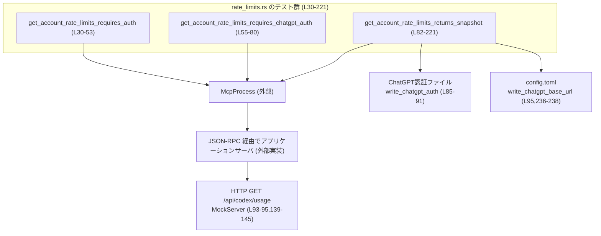

# app-server/tests/suite/v2/rate_limits.rs

## 0. ざっくり一言

`get_account_rate_limits` JSON-RPC メソッドの **認証要件** と **レート制限スナップショット応答** を、実際の `McpProcess` と HTTP モック (`wiremock`) を用いて検証する非同期統合テスト群です（rate_limits.rs:L30-221）。

---

## 1. このモジュールの役割

### 1.1 概要

- このテストモジュールは、アプリケーションサーバの `get_account_rate_limits` API が次を満たすことを確認します。
  - Codex アカウント認証がないとエラーになること（rate_limits.rs:L30-53）。
  - Codex 認証のみでは不十分で、ChatGPT 認証も必要なこと（rate_limits.rs:L55-80）。
  - ChatGPT 側の `/api/codex/usage` HTTP API から取得した JSON が、内部の `GetAccountRateLimitsResponse` / `RateLimitSnapshot` 構造体に正しくマッピングされること（rate_limits.rs:L82-221）。

### 1.2 アーキテクチャ内での位置づけ

このテストは、以下のコンポーネント間の連携をカバーしています。

- `McpProcess`: テスト対象のアプリケーションサーバプロセスを起動・制御するラッパー（rate_limits.rs:L34,59,147,223-225）。
- JSON-RPC プロトコル型 (`JSONRPCResponse`, `JSONRPCError`, `RequestId` など): サーバとのやり取りのフォーマット（rate_limits.rs:L6-12,39-43,66-70,152-156）。
- ChatGPT 認証/設定:
  - `write_chatgpt_auth` と `ChatGptAuthFixture`: ChatGPT 認証情報ファイルを作成（rate_limits.rs:L2,5,85-91）。
  - `write_chatgpt_base_url`: ChatGPT ベース URL を `config.toml` に書き込む（rate_limits.rs:L95,236-238）。
- `MockServer` (`wiremock`): ChatGPT 側の `/api/codex/usage` HTTP エンドポイントをモック（rate_limits.rs:L93-95,139-145）。

依存関係を簡略図で表すと次のとおりです。



### 1.3 設計上のポイント

- **テストごとの分離された環境**
  - 各テストで `TempDir` による専用の `codex_home` ディレクトリを生成し（rate_limits.rs:L32,57,84）、設定ファイルや認証情報が互いに影響しないようにしています。
- **非同期・並行性**
  - すべてのテストは `#[tokio::test]` で定義され、Tokio ランタイム上で非同期に実行されます（rate_limits.rs:L30,55,82）。
  - ネットワーク／プロセス間通信に対して `tokio::time::timeout` を用い、ハングを防いでいます（rate_limits.rs:L35,39-43,60,66-70,148,152-156,224-229）。
- **エラーハンドリング**
  - テスト関数の戻り値はすべて `anyhow::Result<()>` で、各種 I/O や非同期操作のエラーを `?` で伝播させています（rate_limits.rs:L31,56,83,223）。
  - JSON-RPC のエラー応答は `JSONRPCError` として型安全に扱い、コード・メッセージを検証しています（rate_limits.rs:L39-50,66-77）。
- **仕様（契約）の明文化**
  - JSON-RPC エラーコード `-32600` を `INVALID_REQUEST_ERROR_CODE` として定数化し、認証エラー時の期待値としています（rate_limits.rs:L28,46,73）。
  - `GetAccountRateLimitsResponse` と内部の `RateLimitSnapshot` / `RateLimitWindow` 構造体に対する期待値を詳細に構築し、マッピング仕様を固定化しています（rate_limits.rs:L160-217）。

---

## 2. 主要な機能一覧（＋コンポーネントインベントリー）

### 2.1 機能一覧（テスト観点）

- Codex 認証なしエラー検証: `get_account_rate_limits_requires_auth`（rate_limits.rs:L30-53）。
- ChatGPT 認証なしエラー検証: `get_account_rate_limits_requires_chatgpt_auth`（rate_limits.rs:L55-80）。
- 正常系スナップショット取得検証:
  - ChatGPT 認証情報ファイルとベース URL の設定（rate_limits.rs:L84-91,95）。
  - ChatGPT `/api/codex/usage` HTTP レスポンスのモック（rate_limits.rs:L93-137,139-145）。
  - それを `GetAccountRateLimitsResponse` へマッピングする仕様の検証（rate_limits.rs:L158-218）。
- Login ヘルパー: `login_with_api_key` による Codex API キー認証の成功を確認（rate_limits.rs:L223-234）。
- ChatGPT ベース URL 設定ヘルパー: `write_chatgpt_base_url` による `config.toml` への設定書き込み（rate_limits.rs:L236-238）。

### 2.2 コンポーネントインベントリー（定数・関数）

| 名前 | 種別 | 定義範囲 | 説明 |
|------|------|----------|------|
| `DEFAULT_READ_TIMEOUT` | 定数 | app-server/tests/suite/v2/rate_limits.rs:L27-27 | JSON-RPC 応答待ち・エラーメッセージ待ちのタイムアウトを 10 秒に設定。 |
| `INVALID_REQUEST_ERROR_CODE` | 定数 | app-server/tests/suite/v2/rate_limits.rs:L28-28 | JSON-RPC の「Invalid Request」を表すエラーコード `-32600`。認証不足時の期待値として使用。 |
| `get_account_rate_limits_requires_auth` | 非公開 async テスト関数 | app-server/tests/suite/v2/rate_limits.rs:L30-53 | Codex アカウント認証なしで `get_account_rate_limits` を呼んだときのエラー応答を検証。 |
| `get_account_rate_limits_requires_chatgpt_auth` | 非公開 async テスト関数 | app-server/tests/suite/v2/rate_limits.rs:L55-80 | Codex 認証はあるが ChatGPT 認証がない場合のエラー応答を検証。 |
| `get_account_rate_limits_returns_snapshot` | 非公開 async テスト関数 | app-server/tests/suite/v2/rate_limits.rs:L82-221 | ChatGPT 認証と HTTP モックを用いて、正常なレート制限スナップショット応答の内容を詳細に検証。 |
| `login_with_api_key` | 非公開 async ヘルパー関数 | app-server/tests/suite/v2/rate_limits.rs:L223-234 | Codex API キーでのログイン JSON-RPC 呼び出しと、その成功レスポンスを確認する共通処理。 |
| `write_chatgpt_base_url` | 非公開同期ヘルパー関数 | app-server/tests/suite/v2/rate_limits.rs:L236-238 | `codex_home/config.toml` に ChatGPT ベース URL を書き込むユーティリティ。 |

---

## 3. 公開 API と詳細解説

このファイル自身はライブラリ API を公開しておらず、**テスト関数とテスト用ヘルパー**のみを定義しています。

### 3.1 型一覧（構造体・列挙体など）

このファイル内で新たに定義されている構造体・列挙体はありません。

利用している主要な外部型（定義は他ファイル）は以下のとおりです。

| 名前 | 種別 | 役割 / 用途 | 根拠 |
|------|------|-------------|------|
| `McpProcess` | 構造体（と推測） | テスト対象サーバプロセスの起動・JSON-RPC 通信を担当（`new`, `new_with_env`, 各種 `send_*` メソッド呼び出しから推測）。 | rate_limits.rs:L3,34,59,147,223-225 |
| `GetAccountRateLimitsResponse` | 構造体 | `get_account_rate_limits` の JSON-RPC 応答結果。`rate_limits` と `rate_limits_by_limit_id` フィールドを持つことがコードから読み取れます。 | rate_limits.rs:L6,158-217 |
| `RateLimitSnapshot` | 構造体 | 各レート制限のスナップショット（`limit_id`, `limit_name`, `primary`, `secondary`, `credits`, `plan_type`）を保持。 | rate_limits.rs:L10,160-176,180-196,199-211 |
| `RateLimitWindow` | 構造体 | 特定ウィンドウの使用率やリセット時刻を表現（`used_percent`, `window_duration_mins`, `resets_at`）。 | rate_limits.rs:L11,164-168,169-173,184-188,189-193,203-207 |
| `JSONRPCResponse` | 構造体 | JSON-RPC 成功レスポンス。`to_response` で `LoginAccountResponse` や `GetAccountRateLimitsResponse` に変換されます。 | rate_limits.rs:L8,152-156,224-229 |
| `JSONRPCError` | 構造体 | JSON-RPC エラー応答。`id` と `error.code`, `error.message` を検証しています。 | rate_limits.rs:L7,39-50,66-77 |
| `LoginAccountResponse` | 列挙体（と推測） | ログイン結果。ここではバリアント `ApiKey {}` のみを利用。 | rate_limits.rs:L9,230-231 |
| `AccountPlanType` | 列挙体 | アカウントのプラン種別。`PlanType::Pro` を `AccountPlanType::Pro` として利用。 | rate_limits.rs:L14,175,195,210 |
| `MockServer`, `Mock`, `ResponseTemplate` | 構造体 | ChatGPT HTTP API をモックするために使用。 | rate_limits.rs:L20-22,93-95,139-145 |

（外部型の詳細なフィールド構成や動作は、このチャンクには現れないため不明です。）

### 3.2 関数詳細

#### `#[tokio::test] async fn get_account_rate_limits_requires_auth() -> Result<()>`

**概要**

Codex アカウント認証情報がない状態で `get_account_rate_limits` JSON-RPC メソッドを呼び出した場合、`-32600` エラーと特定メッセージを返すことを検証するテストです（rate_limits.rs:L30-53）。

**引数**

- なし（テスト関数のシグネチャとして標準的な形です）。

**戻り値**

- `anyhow::Result<()>`  
  - 成功時: `Ok(())` を返し、テストが成功します。
  - 失敗時: 途中の I/O もしくはアサーション失敗などにより `Err` が返り、テストが失敗します。

**内部処理の流れ**

1. 一時ディレクトリ `codex_home` を作成（rate_limits.rs:L32）。
2. `OPENAI_API_KEY` 環境変数を明示的に `None` にした状態で `McpProcess::new_with_env` を呼び、サーバプロセスを起動（rate_limits.rs:L34）。
3. `timeout(DEFAULT_READ_TIMEOUT, mcp.initialize()).await??` でプロセスを初期化（rate_limits.rs:L35）。
4. `mcp.send_get_account_rate_limits_request()` で JSON-RPC リクエストを送信し、`request_id` を取得（rate_limits.rs:L37）。
5. `mcp.read_stream_until_error_message(RequestId::Integer(request_id))` を `timeout` で包み、エラー応答を受信して `JSONRPCError` としてデコード（rate_limits.rs:L39-43）。
6. 受信したエラーの `id`、`error.code`、`error.message` が期待値と等しいことを `assert_eq!` で検証（rate_limits.rs:L45-50）。
7. 最後に `Ok(())` を返して終了（rate_limits.rs:L52）。

**Examples（使用例）**

この関数自体がテストケースであり、同様のパターンで他の JSON-RPC メソッドの認証要件をテストできます。

```rust
// 別メソッドの認証要件をテストする例（擬似コード）
#[tokio::test]
async fn some_method_requires_auth() -> Result<()> {
    let codex_home = TempDir::new()?;                                  // 一時ディレクトリ作成
    let mut mcp = McpProcess::new_with_env(codex_home.path(), &[]).await?; // Env を調整して起動
    timeout(DEFAULT_READ_TIMEOUT, mcp.initialize()).await??;           // 初期化
    let request_id = mcp.send_some_method_request().await?;            // メソッド呼び出し
    let error: JSONRPCError = timeout(
        DEFAULT_READ_TIMEOUT,
        mcp.read_stream_until_error_message(RequestId::Integer(request_id)),
    ).await??;
    assert_eq!(error.error.code, INVALID_REQUEST_ERROR_CODE);          // コード検証
    Ok(())
}
```

**Errors / Panics**

- `TempDir::new()`、`McpProcess::new_with_env`、`initialize`、`send_get_account_rate_limits_request`、`read_stream_until_error_message` のいずれかが失敗すると、`?` により `Err` が返され、テストは失敗します（rate_limits.rs:L32,34-35,37,39-43）。
- `timeout` によってタイムアウトが発生した場合も `Err` となりテスト失敗になります（rate_limits.rs:L35,39-43）。
- `assert_eq!` は期待値と結果が異なる場合に panic を発生させ、テスト失敗になります（rate_limits.rs:L45-50）。

**Edge cases（エッジケース）**

- サーバから **全く応答がない** 場合: `timeout` により 10 秒後にタイムアウトし、テストは失敗します（rate_limits.rs:L27,35,39-43）。
- サーバが JSON-RPC 仕様外のエラー形式を返した場合: `read_stream_until_error_message` 内部のデコードエラーが発生する可能性がありますが、このファイルからの詳細は不明です。
- 異なるエラーコード・メッセージが返された場合: `assert_eq!` によりテストが失敗します（rate_limits.rs:L46-50）。

**使用上の注意点**

- `McpProcess` 起動時に `OPENAI_API_KEY` を `None` に設定しているため、**Codex 認証が設定されていない状態**を正しく再現していることが前提です（rate_limits.rs:L34）。
- 読み取りタイムアウトは定数で固定されているため、CI 等の遅い環境では必要に応じて `DEFAULT_READ_TIMEOUT` を調整する必要があるかもしれません（rate_limits.rs:L27）。

---

#### `#[tokio::test] async fn get_account_rate_limits_requires_chatgpt_auth() -> Result<()>`

**概要**

Codex アカウント認証は成功しているが、ChatGPT 認証が設定されていない場合に、`get_account_rate_limits` が `-32600` エラーと「chatgpt authentication required...」というメッセージを返すことを検証するテストです（rate_limits.rs:L55-80）。

**引数**

- なし。

**戻り値**

- `anyhow::Result<()>`（前述のテストと同じパターンです）。

**内部処理の流れ**

1. `TempDir` で `codex_home` を作成（rate_limits.rs:L57）。
2. `McpProcess::new(codex_home.path())` でプロセスを起動し、`initialize` を実行（rate_limits.rs:L59-60）。
3. `login_with_api_key(&mut mcp, "sk-test-key").await?` で Codex API キーによるログイン処理を行い、成功を確認（rate_limits.rs:L62,223-231）。
4. `mcp.send_get_account_rate_limits_request()` でリクエストを送信し、`request_id` を取得（rate_limits.rs:L64）。
5. `read_stream_until_error_message` でエラー応答を受信し、`JSONRPCError` としてデコード（rate_limits.rs:L66-70）。
6. `id`、`error.code`、`error.message` を期待値と比較（rate_limits.rs:L72-77）。
7. `Ok(())` で終了（rate_limits.rs:L79）。

**Errors / Panics**

- `login_with_api_key` 内のアサーションにより、ログイン結果が期待どおりでない場合に panic します（rate_limits.rs:L62,230-231）。
- そのほかのエラー/タイムアウト/アサーションの扱いは前述のテストと同様です（rate_limits.rs:L59-60,64,66-70,72-77）。

**Edge cases**

- Codex API キーが無効な場合など、ログインが成功しないと `login_with_api_key` 内でテストが失敗します（rate_limits.rs:L223-231）。
- ChatGPT 認証が後から設定されてしまうと、このテストケースの前提が崩れますが、そのような操作はこのテスト内では行っていません。

**使用上の注意点**

- 「Codex 認証はあるが ChatGPT 認証がない」状態を再現するため、`write_chatgpt_auth` を呼んでいない点が重要です（rate_limits.rs:L55-80,84-91 と対比して確認可能）。
- 認証まわりの仕様が変わった場合（例: エラーコードやメッセージが変わる）には、このテストの期待値を更新する必要があります（rate_limits.rs:L73-77）。

---

#### `#[tokio::test] async fn get_account_rate_limits_returns_snapshot() -> Result<()>`

**概要**

ChatGPT 認証情報とベース URL を設定した上で、ChatGPT 側 `/api/codex/usage` HTTP API のレスポンスをモックし、それが `GetAccountRateLimitsResponse` 構造体に期待どおりマッピングされることを検証するテストです（rate_limits.rs:L82-221）。

**引数**

- なし。

**戻り値**

- `anyhow::Result<()>`。

**内部処理の流れ（アルゴリズム）**

1. `TempDir` で `codex_home` を作成（rate_limits.rs:L84）。
2. `write_chatgpt_auth` と `ChatGptAuthFixture` を用いて、ChatGPT トークン・アカウント ID・プラン種別 `pro` を含む認証ファイルを作成（rate_limits.rs:L85-91）。
3. `MockServer::start()` で HTTP モックサーバを起動し、その URI を `write_chatgpt_base_url` に渡して `config.toml` に書き込み（rate_limits.rs:L93-95,236-238）。
4. プライマリ・セカンダリレート制限の `reset_at` タイムスタンプを RFC3339 文字列からパースして UNIX タイムスタンプに変換（rate_limits.rs:L97-102）。
5. ChatGPT 側の `/api/codex/usage` レスポンス JSON を `serde_json::json!` マクロで組み立て（rate_limits.rs:L103-137）。
6. `Mock::given(method("GET"))` で HTTP GET `/api/codex/usage` に対し、`authorization: Bearer chatgpt-token` と `chatgpt-account-id: account-123` が付与されているリクエストにのみ JSON を返すようモックを設定（rate_limits.rs:L139-145）。
7. `McpProcess::new_with_env` で Codex サーバプロセスを起動し、`initialize` を呼び出し（rate_limits.rs:L147-148）。
8. `send_get_account_rate_limits_request` で JSON-RPC リクエストを送信し、`read_stream_until_response_message` で成功レスポンスを受信（rate_limits.rs:L150-156）。
9. `to_response` により `JSONRPCResponse` から `GetAccountRateLimitsResponse` にデコード（rate_limits.rs:L158）。
10. 期待される `GetAccountRateLimitsResponse` インスタンスをコード上で構築し（rate_limits.rs:L160-217）、`assert_eq!` で受信値と比較（rate_limits.rs:L218）。
11. `Ok(())` で終了（rate_limits.rs:L220）。

**Examples（使用例）**

このテストは、以下のような「外部 HTTP API をモックし、JSON-RPC 応答を型にデコードして検証する」パターンの参考になります。

```rust
// 他の JSON-RPC メソッドが外部 HTTP API を呼ぶ場合のテスト例（擬似コード）
#[tokio::test]
async fn some_method_returns_expected_data() -> Result<()> {
    let home = TempDir::new()?;
    let server = MockServer::start().await;
    let base_url = server.uri();
    write_some_base_url(home.path(), &base_url)?;                  // 設定ファイルにURLを書き込み

    // 外部APIのモック
    Mock::given(method("GET"))
        .and(path("/api/some/endpoint"))
        .respond_with(ResponseTemplate::new(200).set_body_json(json!({ "value": 123 })))
        .mount(&server)
        .await;

    let mut mcp = McpProcess::new(home.path()).await?;
    timeout(DEFAULT_READ_TIMEOUT, mcp.initialize()).await??;

    let request_id = mcp.send_some_method_request().await?;
    let response: JSONRPCResponse = timeout(
        DEFAULT_READ_TIMEOUT,
        mcp.read_stream_until_response_message(RequestId::Integer(request_id)),
    ).await??;

    let decoded: SomeResponseType = to_response(response)?;
    assert_eq!(decoded.value, 123);
    Ok(())
}
```

**Errors / Panics**

- ChatGPT 認証ファイル書き込みや `config.toml` 書き込み (`write_chatgpt_auth`, `write_chatgpt_base_url`) が失敗した場合、`?` によりテストが失敗します（rate_limits.rs:L85-91,95,236-238）。
- HTTP モックの条件に一致するリクエストが送信されない場合、サーバ側でエラーになるか、タイムアウトが発生し、テストが失敗する可能性があります（rate_limits.rs:L139-145,147-156）。
- JSON デコード (`to_response`) が失敗した場合も `Err` となりテスト失敗です（rate_limits.rs:L158）。
- 期待 `GetAccountRateLimitsResponse` と受信値が一致しない場合、`assert_eq!` により panic します（rate_limits.rs:L160-218）。

**Edge cases（エッジケース）**

- **追加レート制限がない場合**  
  このテストでは `additional_rate_limits` に 1 つ要素を含めていますが（rate_limits.rs:L121-135）、追加要素が 0 件の場合の挙動はこのファイルからは分かりません。
- **セカンダリウィンドウがないレート制限**  
  `codex_other` の追加レート制限では `secondary_window` を含めていません（rate_limits.rs:L121-136）。それに対応して、期待側の `RateLimitSnapshot` でも `secondary: None` としている点から、セカンダリなしのケースが許容されていることが分かります（rate_limits.rs:L199-211）。
- **プラン種別 `plan_type` のマッピング**  
  レスポンス JSON の `"plan_type": "pro"` が `AccountPlanType::Pro` にマッピングされることを前提にしています（rate_limits.rs:L104,175,195,210）。他のプラン値についての挙動はこのチャンクには現れません。

**使用上の注意点**

- HTTP モックのマッチ条件（ヘッダを含む）が厳密に指定されているため、サーバ側の実装がヘッダ名や値を変更するとテストが失敗します（rate_limits.rs:L139-143）。
- タイムスタンプは RFC3339 → UNIX 秒へ明示的に変換しているため（rate_limits.rs:L97-102）、期待値を変更する場合は両方を同期して更新する必要があります。
- `rate_limits_by_limit_id` の HashMap の構築には固定配列からの `into_iter().collect()` を使っており、キー重複や順序依存はありません（rate_limits.rs:L177-215）。キーの追加・削除はこの配列を編集する形で行うのが自然です。

---

#### `async fn login_with_api_key(mcp: &mut McpProcess, api_key: &str) -> Result<()>`

**概要**

テスト内で共通して使える、Codex API キーによるログイン JSON-RPC 呼び出しヘルパーです。ログイン結果が `LoginAccountResponse::ApiKey {}` であることを確認します（rate_limits.rs:L223-234）。

**引数**

| 引数名 | 型 | 説明 |
|--------|----|------|
| `mcp` | `&mut McpProcess` | 既に起動・初期化された `McpProcess` インスタンスへの可変参照。所有権は呼び出し元に残します。 |
| `api_key` | `&str` | 使用する API キー文字列。 |

**戻り値**

- `anyhow::Result<()>`  
  - ログインとレスポンス検証が成功すれば `Ok(())` を返します。
  - 途中の I/O やデコードエラーがあれば `Err` で返します。

**内部処理の流れ**

1. `mcp.send_login_account_api_key_request(api_key)` でログインリクエストを送信し、`request_id` を取得（rate_limits.rs:L224）。
2. `read_stream_until_response_message` で通常の JSON-RPC レスポンスを待ち、`JSONRPCResponse` として受信（rate_limits.rs:L225-229）。
3. `to_response` で `LoginAccountResponse` に変換（rate_limits.rs:L230）。
4. それが `LoginAccountResponse::ApiKey {}` であることを `assert_eq!` で確認（rate_limits.rs:L231）。
5. `Ok(())` で終了（rate_limits.rs:L233）。

**Examples（使用例）**

```rust
// テスト内での利用例（率直に呼び出すだけです）
let mut mcp = McpProcess::new(codex_home.path()).await?;
timeout(DEFAULT_READ_TIMEOUT, mcp.initialize()).await??;
login_with_api_key(&mut mcp, "sk-test-key").await?;
```

**Errors / Panics**

- `send_login_account_api_key_request`、`read_stream_until_response_message`、`to_response` のエラーは `?` によりそのまま `Err` になります（rate_limits.rs:L224-230）。
- 受信したレスポンスが `LoginAccountResponse::ApiKey {}` 以外であれば `assert_eq!` により panic します（rate_limits.rs:L231）。

**Edge cases**

- サーバ側で API キーが無効な場合など、別のバリアント（例: `LoginAccountResponse::Error` など）が返る可能性がありますが、このチャンクでは扱っていません。
- レスポンスがエラー JSON-RPC になるケースは `read_stream_until_response_message` の仕様次第で挙動が変わりますが、このファイルからは詳細不明です。

**使用上の注意点**

- 呼び出し前に `McpProcess::initialize` を完了しておく必要があります（rate_limits.rs:L59-60 と対比）。
- 複数回ログインを行う場合の挙動（再ログイン可否）は、このテストではカバーしていません。

---

#### `fn write_chatgpt_base_url(codex_home: &Path, base_url: &str) -> std::io::Result<()>`

**概要**

指定された `codex_home` ディレクトリ直下にある `config.toml` ファイルへ、`chatgpt_base_url` キーを設定するヘルパー関数です（rate_limits.rs:L236-238）。

**引数**

| 引数名 | 型 | 説明 |
|--------|----|------|
| `codex_home` | `&Path` | 設定ファイルを配置するルートディレクトリのパス。通常は `TempDir::path()` の結果。 |
| `base_url` | `&str` | ChatGPT API のベース URL（ここでは `MockServer` の URI）。 |

**戻り値**

- `std::io::Result<()>`  
  - ファイル書き込みが成功すれば `Ok(())`。
  - パスが存在しない、権限がないなどで書き込みに失敗した場合は `Err(std::io::Error)`。

**内部処理の流れ**

1. `codex_home.join("config.toml")` で設定ファイルパスを生成（rate_limits.rs:L237）。
2. `std::fs::write` で `chatgpt_base_url = "{base_url}"` という 1 行の TOML 設定をファイルに書き込む（rate_limits.rs:L238）。

**Examples（使用例）**

```rust
let codex_home = TempDir::new()?;                               // 一時ディレクトリ作成
let mock_server = MockServer::start().await;                    // HTTPモック起動
let server_url = mock_server.uri();                             // ベースURL取得
write_chatgpt_base_url(codex_home.path(), &server_url)?;        // config.toml に書き込み
```

**Errors / Panics**

- `std::fs::write` が失敗した場合は `Err(std::io::Error)` を返します（rate_limits.rs:L238）。
- panic を起こすコードは含まれていません。

**Edge cases**

- `codex_home` のディレクトリが存在しない場合や書き込み権限がない場合、エラーになります。
- 既に `config.toml` が存在する場合は内容を上書きします。この挙動を前提にしていることがテストから読み取れます（rate_limits.rs:L95,236-238）。

**使用上の注意点**

- このヘルパーはファイル全体を上書きするため、他の設定項目を同じ `config.toml` に書きたい場合には統合的な設定書き出しロジックが必要です。
- テスト用の一時ディレクトリに対してのみ使用しているため、本番環境の設定ファイルに誤って使用しないようにすることが前提です（rate_limits.rs:L84,95）。

---

### 3.3 その他の関数

このファイルには、上記以外の関数は定義されていません。

---

## 4. データフロー

ここでは、もっとも複雑な `get_account_rate_limits_returns_snapshot` テストにおけるデータフローを説明します（rate_limits.rs:L82-221）。

1. テストコードが `TempDir` と `write_chatgpt_auth` / `write_chatgpt_base_url` を使って、サーバの設定と ChatGPT 認証情報をファイルとして準備します（rate_limits.rs:L84-91,95,236-238）。
2. `MockServer` に `/api/codex/usage` のモックレスポンスを登録します（rate_limits.rs:L93-95,139-145）。
3. `McpProcess` が起動され、`get_account_rate_limits` JSON-RPC リクエストを送信します（rate_limits.rs:L147-150）。
4. アプリケーションサーバ（外部実装）は設定された `chatgpt_base_url` と認証情報を読み出し、`MockServer` に対して HTTP GET `/api/codex/usage` を送信すると想定されます（HTTP の詳細はこのチャンクには現れませんが、ヘッダ条件から推測できます: rate_limits.rs:L139-143）。
5. `MockServer` は事前に登録された JSON を返却し、それがサーバの `GetAccountRateLimitsResponse` に変換され、JSON-RPC 応答として `McpProcess` に返ります（rate_limits.rs:L139-145,152-158）。
6. テスト側では `to_response` により型にデコードし、期待値と比較します（rate_limits.rs:L158-218）。

これを sequence diagram として表すと次のとおりです。

```mermaid
sequenceDiagram
    participant T as Test:get_account_rate_limits_returns_snapshot<br/>(L82-221)
    participant FS as TempDir / config.toml / auth<br/>(L84-91,95,236-238)
    participant Mock as MockServer (/api/codex/usage)<br/>(L93-95,139-145)
    participant MCP as McpProcess<br/>(L147-150,223-229)
    participant S as App Server (実装は他ファイル)

    T->>FS: write_chatgpt_auth(...) で認証情報作成 (L85-91)
    T->>FS: write_chatgpt_base_url(...) で config.toml にURL設定 (L95,236-238)
    T->>Mock: Mock::given(...).mount(&server) でHTTPモック登録 (L139-145)
    T->>MCP: McpProcess::new_with_env(...); initialize() (L147-148)
    T->>MCP: send_get_account_rate_limits_request() (L150)
    MCP->>S: JSON-RPC get_account_rate_limits リクエスト（外部）
    S->>FS: config.toml / auth ファイル読み込み（推測）
    S->>Mock: HTTP GET /api/codex/usage (L139-143 に対応)
    Mock-->>S: JSON レスポンス（rate_limits JSON）(L103-137)
    S-->>MCP: JSON-RPC GetAccountRateLimitsResponse
    MCP-->>T: JSONRPCResponse（read_stream_until_response_message）(L152-156)
    T->>T: to_response(...) で型にデコードし assert_eq! (L158-218)
```

※ サーバ内部 (`App Server`) の詳細実装はこのファイルには含まれていないため、HTTP 呼び出しのタイミングなどはヘッダ条件とテストの意図からの推測です。

---

## 5. 使い方（How to Use）

このファイルはテスト専用ですが、同様のパターンで **他の JSON-RPC メソッドの統合テスト** を追加する際の参考になります。

### 5.1 基本的な使用方法（テストの典型フロー）

典型的なフローは以下のようになります。

```rust
#[tokio::test]
async fn example_test() -> anyhow::Result<()> {
    let codex_home = TempDir::new()?;                                       // 一時ホーム作成 (L32,57,84)

    // 必要に応じて認証情報・設定を書き込む
    // 例: write_chatgpt_auth(...), write_chatgpt_base_url(...)
    // このファイルでは L85-91,95,236-238 参照

    let mut mcp = McpProcess::new(codex_home.path()).await?;                // プロセス起動 (L59,147)
    timeout(DEFAULT_READ_TIMEOUT, mcp.initialize()).await??;                // 初期化 (L35,60,148)

    // 対象メソッドの JSON-RPC リクエストを送信
    let request_id = mcp.send_some_method_request().await?;

    // レスポンスまたはエラーを待ち受け
    let response: JSONRPCResponse = timeout(
        DEFAULT_READ_TIMEOUT,
        mcp.read_stream_until_response_message(RequestId::Integer(request_id)),
    ).await??;

    // 型にデコードして検証
    let decoded: SomeResponseType = to_response(response)?;
    assert_eq!(decoded, expected_value);

    Ok(())
}
```

### 5.2 よくある使用パターン

- **認証要件テスト**
  - 認証情報をあえて設定しない／一部だけ設定することで、エラー応答の仕様をテスト（rate_limits.rs:L30-80）。
- **外部 HTTP API 連携テスト**
  - `MockServer` に外部 API のレスポンスを設定し、それが JSON-RPC 応答にどのように反映されるかを検証（rate_limits.rs:L93-145,158-218）。
- **共通ヘルパーによるログイン**
  - `login_with_api_key` のような共通ヘルパーで、複数テスト間で同じログイン処理を共有（rate_limits.rs:L62,223-234）。

### 5.3 よくある間違い

```rust
// 間違い例: initialize を呼ばずにリクエストを送信してしまう
let mut mcp = McpProcess::new(codex_home.path()).await?;
let request_id = mcp.send_get_account_rate_limits_request().await?; // 初期化前
// -> サーバが準備できておらず、エラーやハングの原因となる可能性

// 正しい例: initialize 完了後にリクエストを送信
let mut mcp = McpProcess::new(codex_home.path()).await?;
timeout(DEFAULT_READ_TIMEOUT, mcp.initialize()).await??;            // L35,60,148 と同じパターン
let request_id = mcp.send_get_account_rate_limits_request().await?;
```

```rust
// 間違い例: timeout を使わずにストリームを読み続ける
let response: JSONRPCResponse = mcp
    .read_stream_until_response_message(RequestId::Integer(request_id))
    .await?;
// -> サーバのバグなどで応答が来ない場合、テストがハングするリスク

// 正しい例: timeout で上限時間を設ける (L39-43,66-70,152-156,224-229)
let response: JSONRPCResponse = timeout(
    DEFAULT_READ_TIMEOUT,
    mcp.read_stream_until_response_message(RequestId::Integer(request_id)),
).await??;
```

### 5.4 使用上の注意点（まとめ）

- **非同期コンテキスト**  
  - すべてのテスト関数は `#[tokio::test]` として定義する必要があります（rate_limits.rs:L30,55,82）。
- **タイムアウトの設定**  
  - ネットワークやプロセスとの通信では `timeout` を使用し、テストが無限に待ち続けないようにしている点が重要です（rate_limits.rs:L27,35,39-43,60,66-70,148,152-156,224-229）。
- **ファイルシステムの状態**  
  - `TempDir` を使うことでテストごとにクリーンな環境を用意していますが、ヘルパーが本番ディレクトリに対して誤って使われないようにする前提があります（rate_limits.rs:L32,57,84,236-238）。
- **エラーメッセージの固定**  
  - エラーメッセージ文字列を厳密比較しているため（rate_limits.rs:L47-50,74-77）、仕様変更でメッセージが一部変わるとテストが壊れる点に注意が必要です。

---

## 6. 変更の仕方（How to Modify）

### 6.1 新しい機能（新メソッド/新レートリミット）をテストしたい場合

1. **新テスト関数の追加**
   - このファイルに `#[tokio::test] async fn ...` を追加し、`TempDir` と `McpProcess` のセットアップを既存テストから流用します（rate_limits.rs:L30-35,57-60,84-91,147-148）。
2. **設定・認証の準備**
   - 必要に応じて `write_chatgpt_auth` や `write_chatgpt_base_url` を使い、サーバが読むべき設定ファイルを作成します（rate_limits.rs:L85-91,95,236-238）。
3. **外部 HTTP API のモック**
   - 新たな HTTP エンドポイントを呼ぶ場合は、`MockServer::start` と `Mock::given(...).mount(&server)` を使い、期待するレスポンス JSON を定義します（rate_limits.rs:L93-137,139-145）。
4. **JSON-RPC 呼び出しと検証**
   - `McpProcess` に新メソッド用の `send_*_request` があればそれを呼び出し、`read_stream_until_response_message` か `read_stream_until_error_message` で応答を取得し、適切な型にデコードして検証します（rate_limits.rs:L150-158,39-43,66-70）。

### 6.2 既存のテストを変更する場合

- **影響範囲の確認**
  - 認証仕様やエラーメッセージを変更する場合は、`get_account_rate_limits_requires_auth` と `get_account_rate_limits_requires_chatgpt_auth` のアサーション部分を確認する必要があります（rate_limits.rs:L45-50,72-77）。
  - レート制限スナップショットの仕様を変更する場合は、`GetAccountRateLimitsResponse` の期待値構築部分全体が影響を受けます（rate_limits.rs:L160-217）。
- **前提条件・契約の確認**
  - JSON-RPC エラーコード `INVALID_REQUEST_ERROR_CODE = -32600` を変更する場合、この定数とアサーションを合わせて更新します（rate_limits.rs:L28,46,73）。
  - `RateLimitSnapshot` / `RateLimitWindow` のフィールド意味（例: `window_duration_mins` と `limit_window_seconds` の対応）が変わる場合、HTTP モック JSON（rate_limits.rs:L103-137）と期待構造体（rate_limits.rs:L160-217）の両方を見直す必要があります。
- **関連するテストや使用箇所**
  - `login_with_api_key` を他のテストでも使用している場合は、シグネチャや挙動を変える際に呼び出し元をすべて確認します（rate_limits.rs:L62,223-234）。

---

## 7. 関連ファイル

このモジュールは以下のファイル／モジュールと密接に関係します（名前と役割は、このチャンクに現れる情報に基づく範囲で記述します）。

| パス / モジュール | 役割 / 関係 |
|-------------------|------------|
| `app_test_support::McpProcess` | テスト対象サーバプロセスの起動と JSON-RPC 通信を抽象化するユーティリティ。ここではログインや `get_account_rate_limits` 呼び出しに使用（rate_limits.rs:L3,34,59,147,223-225）。 |
| `app_test_support::ChatGptAuthFixture` | ChatGPT 認証情報ファイルを生成するためのテスト用フィクスチャ。トークン・アカウント ID・プラン種別を設定（rate_limits.rs:L2,85-91）。 |
| `app_test_support::write_chatgpt_auth` | ChatGPT 認証情報をファイルに書き込むヘルパー（rate_limits.rs:L5,85-91）。 |
| `app_test_support::to_response` | `JSONRPCResponse` を具体的な応答型（`LoginAccountResponse`, `GetAccountRateLimitsResponse`）にデコードするヘルパー（rate_limits.rs:L4,158,230）。 |
| `codex_app_server_protocol` | JSON-RPC レベルのプロトコル型（`GetAccountRateLimitsResponse`, `JSONRPCResponse`, `JSONRPCError`, `LoginAccountResponse`, `RateLimitSnapshot`, `RateLimitWindow`, `RequestId`）を提供（rate_limits.rs:L6-12）。 |
| `codex_config::types::AuthCredentialsStoreMode` | 認証情報の保存モードを表す型。ここでは `File` を使用（rate_limits.rs:L13,90）。 |
| `codex_protocol::account::PlanType` | アカウントプランの列挙体。ここでは `Pro` バリアントを使用（rate_limits.rs:L14,175,195,210）。 |
| `wiremock` | HTTP モックサーバとリクエストマッチャー、レスポンステンプレートを提供（rate_limits.rs:L20-25,93-95,139-145）。 |
| `tempfile::TempDir` | テストごとに一時的な `codex_home` ディレクトリを作成・削除するためのユーティリティ（rate_limits.rs:L18,32,57,84）。 |

このファイルだけでは、これら外部モジュールの内部実装は分かりませんが、名前と使用方法から上記のような役割であると解釈できます（解釈であることを明示しています）。
