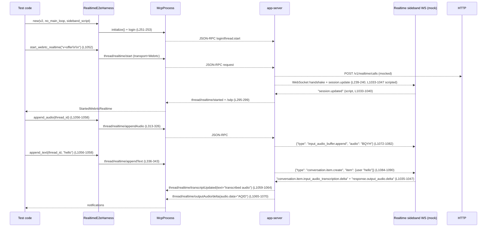

app-server/tests/suite/v2/realtime_conversation.rs

---

## 0. ざっくり一言

app-server の「Realtime Conversation（v1/v2）」機能を、モック HTTP/WebSocket サーバーとテスト用ハーネスでエンドツーエンド検証する統合テスト群です（WebRTC 経由の音声/テキスト、背景エージェントとの連携、エラー/機能フラグなど）。  

---

## 1. このモジュールの役割

### 1.1 概要

- このモジュールは **app-server が Realtime API（v1/v2）とどのように対話するか** を検証するために存在し、以下をテストします。
  - WebRTC / WebSocket を用いたリアルタイム会話開始と SDP 交換  
  - 音声・テキストの相互転送（クライアント ⇔ Realtime API）  
  - 背景エージェント（Responses API 経由）とのハンドオフ/ツール呼び出し連携  
  - エラー伝播・機能フラグ制御・キューイングなどのプロトコル仕様  

中心となるのは `RealtimeE2eHarness` 構造体で、MCP クライアント・HTTP モック・WebSocket モック・設定ファイル生成をまとめて扱います（L167-174, L175-271）。

### 1.2 アーキテクチャ内での位置づけ

主な依存関係は以下の通りです。

- `McpProcess`（app_test_support）: app-server プロセスと JSON-RPC 経由で対話（L3, L251-262）。
- `MockServer` / `wiremock`（core_test_support + wiremock）: Responses API（/responses, /v1/realtime/calls）をモック（L44, L63-67, L228-238 など）。
- `WebSocketTestServer`（core_test_support::responses）: Realtime API sideband WebSocket をモック（L47-49, L239-240）。
- 設定ファイル生成 (`create_config_toml_with_realtime_version`) により app-server をモック基盤に接続（L1865-1915）。

これらの関係を簡略化すると次のようになります。

```mermaid
graph TD
    subgraph Test["realtime_conversation.rs (L167-271, L405-1641)"]
      H["RealtimeE2eHarness"]
      T1["tokio::test 群"]
    end

    H --> MCP["McpProcess\n(app_test_support)"]
    H --> HTTPMock["MockServer\n(wiremock)"]
    H --> WS["WebSocketTestServer\n(core_test_support::responses)"]
    H --> CFG["config.toml\n(create_config_toml_with_realtime_version)"]

    T1 --> H

    MCP --> "app-server 実プロセス"
    HTTPMock -->|"HTTP /v1/.../responses, /v1/realtime/calls"| "app-server 実プロセス"
    WS -->|"WebSocket sideband"| "app-server 実プロセス"
```

- Realtime v1/v2 やサンドボックスモードは `RealtimeTestVersion` / `RealtimeTestSandbox` で切り替えます（L125-150）。
- Gated SSE（`GatedSseResponse`）＋ 標準 mpsc チャネルで「レスポンスの遅延」を制御し、並行動作を検証します（L108-124, L1298-1312, L1475-1490）。

### 1.3 設計上のポイント

- **責務の分割**
  - 設定・モック・ログイン・スレッド開始などの共通処理は `RealtimeE2eHarness` に集約（L167-271）。
  - WebSocket / SSE モックのスクリプトは単純なラッパー型 (`MainLoopResponsesScript`, `RealtimeSidebandScript`) を介して渡す（L159-166, L360-368）。
  - アサーションや JSON 生成は小さなヘルパー関数に分離（例: `session_updated`, `v2_background_agent_tool_call`, `assert_v2_session_update` など, L387-404, L1781-1811）。

- **状態管理**
  - HTTP リクエストキャプチャ: `RealtimeCallRequestCapture` が `Arc<Mutex<Vec<WiremockRequest>>>` を保持し、Wiremock の `Match` 実装で蓄積（L81-83, L99-107）。
  - `RealtimeE2eHarness` は `McpProcess` と `thread_id` を所有し、テスト間で依存を共有しない（L167-174, L263-270）。

- **エラーハンドリング**
  - ほぼすべての非同期 I/O に `tokio::time::timeout(DEFAULT_TIMEOUT)` をかけ、ハングを防止（例: L257-261, L287-292, L1643-1647）。
  - JSON-RPC レスポンスは `to_response::<T>` で型安全にデコードし、`anyhow::Result` で呼び出し元に伝播（L7, L262, L491, L661 など）。
  - 通知パラメータが欠けている場合は明示的にコンテキスト付きエラー（`context("...")`）を生成（L1648-1651）。

- **並行性**
  - テスト自体は `#[tokio::test]` で非同期実行し、一部は `flavor = "multi_thread"` で複数スレッド上での挙動を検証（L1291, L1471）。
  - `GatedSseResponse` + `std::sync::mpsc` により Responses ストリームをブロックしつつ、他の経路（サイドバンド音声など）が非ブロックで動くことを確認（L108-124, L1475-1489, L1524-1532）。
  - `Mutex` の `PoisonError` は `into_inner` で握りつぶし、テストがパニック後も続行しやすいようになっています（L93-97, L115-118, L101-104）。

---

## 2. 主要な機能一覧

このモジュールが提供する主要なテスト機能を整理します。

- Realtime 会話 v2 通知ストリーミング検証  
  - `realtime_conversation_streams_v2_notifications`（L405-640）で、音声Δ・テキストΔ・転記更新・ハンドオフ・エラー・クローズ通知までの一連の流れを検証。
- 利用可能な音声一覧の検証  
  - `realtime_list_voices_returns_supported_names` で v1/v2 の声とデフォルト値を確認（L641-695）。
- Realtime セッションの開始/停止・クローズ通知  
  - `realtime_conversation_stop_emits_closed_notification`（L696-767）、`realtime_webrtc_start_emits_sdp_notification`（L768-915）。
- WebRTC v1/v2 の SDP 交換と sideband 参加  
  - v1: `webrtc_v1_start_posts_offer_returns_sdp_and_joins_sideband`（L916-966）。  
  - v2: `webrtc_webrtc_start_emits_sdp_notification`（L768-915）。
- v1 ハンドオフ・背景エージェント連携  
  - `webrtc_v1_handoff_request_delegates_and_appends_result`（L967-1024）。
- v2 での音声/テキストの相互転送  
  - `webrtc_v2_forwards_audio_and_text_between_client_and_sideband`（L1025-1095）。
- v2 レスポンスのキューイング（active response 1 個ルール）  
  - `webrtc_v2_queues_text_response_create_while_response_is_active`（L1096-1166）。  
  - `webrtc_v2_flushes_queued_text_response_create_when_response_is_cancelled`（L1167-1223）。
- v2 背景エージェントツールコールの委譲と最終出力  
  - `webrtc_v2_background_agent_tool_call_delegates_and_returns_function_output`（L1225-1284）。
- v2 背景エージェントへのステアリングと ACK 応答  
  - `webrtc_v2_background_agent_steering_ack_requests_response_create`（L1285-1364）。
- v2 進捗メッセージと最終出力の順序  
  - `webrtc_v2_background_agent_progress_is_sent_before_function_output`（L1365-1395）。
- v2 背景エージェントが shell ツールを実行できることの検証  
  - `webrtc_v2_tool_call_delegated_turn_can_execute_shell_tool`（L1396-1470）。
- v2 ツールコールが sideband 音声をブロックしないことの検証  
  - `webrtc_v2_tool_call_does_not_block_sideband_audio`（L1471-1535）。
- WebRTC 呼び出し作成の失敗エラーを surfaced することの検証  
  - `realtime_webrtc_start_surfaces_backend_error`（L1536-1593）。
- 機能フラグにより Realtime 会話が制御されることの検証  
  - `realtime_conversation_requires_feature_flag`（L1594-1641）。

---

## 3. 公開 API と詳細解説

このファイルはテストモジュールであり `pub` な型や関数はありませんが、他テストからも再利用しやすい「ハーネス」「ヘルパー」が事実上の API です。

### 3.1 型一覧（構造体・列挙体など）

| 名前 | 種別 | 役割 / 用途 | 定義位置 |
|------|------|-------------|----------|
| `StartupContextConfig<'a>` | enum | Realtime セッションの「スタートアップコンテキスト」を自動生成か明示上書きかを選択（`Generated` / `Override(&str)`）。`config.toml` 出力に反映（L75-79, L1881-1885）。 | `realtime_conversation.rs:L75-79` |
| `RealtimeCallRequestCapture` | struct | Wiremock に対する POST `/v1/realtime/calls` リクエストをすべて記録し、後から 1 件だけ取り出して検証するためのキャプチャ（L81-83, L84-98, L99-107）。 | `L81-98` |
| `GatedSseResponse` | struct | Wiremock のレスポンスとして SSE 文字列を返すが、最初の 1 回だけ `mpsc::Receiver` でゲートしてブロックさせるテスト用レスポンダ（L108-124）。 | `L108-124` |
| `RealtimeTestVersion` | enum | テスト中に Realtime バージョン（v1/v2）を切り替える（`V1`/`V2`）。`config.toml` の `[realtime].version` に反映（L125-137, L1879）。 | `L125-137` |
| `RealtimeTestSandbox` | enum | テスト用サンドボックスモード（`ReadOnly` / `DangerFullAccess`）。`config.toml` の `sandbox_mode` に反映し、shell ツールテスト時に `DangerFullAccess` を使用（L138-150, L1880, L1417-1422）。 | `L138-150` |
| `StartedWebrtcRealtime` | struct | `thread/realtime/started` と `thread/realtime/sdp` 通知のペアを保持する単純な DTO（L151-155）。 | `L151-155` |
| `MainLoopResponsesScript` | struct | 背景エージェント用 Responses SSE ストリームのスクリプト（文字列列）を保持（L159-161, L360-365）。 | `L159-161` |
| `RealtimeSidebandScript` | struct | Realtime sideband WebSocket の「接続ごとの送受信スクリプト」を保持（L164-166, L366-385）。 | `L164-166` |
| `RealtimeE2eHarness` | struct | MCP クライアント、HTTP/SSE モック、WebSocket モック、call キャプチャ、thread_id をまとめた E2E テスト用ハーネス（L167-174, L175-359）。 | `L167-174` |

### 3.2 関数詳細（重要な 7 件）

#### `RealtimeE2eHarness::new_with_main_loop_responses_server_and_sandbox(...) -> Result<Self>`

**シグネチャ**

```rust
async fn new_with_main_loop_responses_server_and_sandbox(
    realtime_version: RealtimeTestVersion,
    main_loop_responses_server: MockServer,
    realtime_sideband: RealtimeSidebandScript,
    sandbox: RealtimeTestSandbox,
) -> Result<RealtimeE2eHarness>
```

**概要**

- Realtime E2E テストに必要なコンポーネント一式（Responses モック、Realtime sideband WebSocket、config.toml、MCP クライアント、ログイン済みスレッド）を構築します（L222-271）。

**引数**

| 引数名 | 型 | 説明 |
|--------|----|------|
| `realtime_version` | `RealtimeTestVersion` | 使用する Realtime バージョン（v1/v2）（L223）。 |
| `main_loop_responses_server` | `MockServer` | `/responses` などを受ける Responses API の Wiremock サーバー（L224）。 |
| `realtime_sideband` | `RealtimeSidebandScript` | Realtime sideband WebSocket に対する接続スクリプト（L225）。 |
| `sandbox` | `RealtimeTestSandbox` | sandbox_mode 設定（read-only / danger-full-access）（L226）。 |

**戻り値**

- `Result<RealtimeE2eHarness>`: 構築に成功すると初期化済みハーネス、失敗時は `anyhow::Error`。

**内部処理の流れ**

1. `RealtimeCallRequestCapture::new()` で call create リクエストキャプチャを作成（L228-229）。
2. `Mock::given(method("POST")).and(path("/v1/realtime/calls")).and(call_capture.clone())` で call create エンドポイントをモックし、200 + Location ヘッダ + SDP ボディを返すよう設定（L229-237）。
3. `start_websocket_server_with_headers(realtime_sideband.connections).await` で sideband WebSocket モックを起動（L239-240）。
4. `TempDir::new()` で一時ディレクトリを作成し、`create_config_toml_with_realtime_version(...)` で app-server 向けの `config.toml` を書き出し（L241-250）。
5. `McpProcess::new` → `initialize` → `login_with_api_key` で MCP クライアントを起動し、API キーでログイン（L251-253, L1653-1661）。
6. `send_thread_start_request` + `timeout` + `to_response` で新しいスレッドを作成し、その `thread.id` を保持（L254-262）。
7. 上記をまとめて `RealtimeE2eHarness` インスタンスを返す（L263-270）。

**Examples（使用例）**

```rust
// v1 Realtime + 読み取り専用サンドボックスのハーネスを作る例
let responses_server = create_mock_responses_server_sequence_unchecked(Vec::new()).await;
let sideband = realtime_sideband(vec![
    open_realtime_sideband_connection(vec![vec![session_updated("sess_v1")]])
]);

let harness = RealtimeE2eHarness::new_with_main_loop_responses_server_and_sandbox(
    RealtimeTestVersion::V1,
    responses_server,
    sideband,
    RealtimeTestSandbox::ReadOnly,
).await?;
```

（実際の呼び出しは `RealtimeE2eHarness::new` や `new_with_sandbox` 等の薄いラッパーを経由します, L178-192, L193-208, L209-221）

**Errors / Panics**

- `TempDir::new()`・`std::fs::write` 失敗で IO エラー（L241-242, L1887-1915）。
- MCP 初期化やログイン、スレッド開始・レスポンス待ちでエラー／タイムアウトすると `anyhow::Error` が返ります（L251-262）。
- Wiremock の `mount` は失敗時に `Result` を返し、ここでは `?` でバブルアップ（L237-238）。

**Edge cases（エッジケース）**

- `FEATURES` に `RealtimeConversation` が存在しない場合、`create_config_toml_with_realtime_version` 内で `unwrap_or("realtime_conversation")` が使われ、デフォルトキーで動作します（L1874-1878）。
- Responses / sideband のスクリプトが空の場合でも問題なくハーネスは構築されます（例: `no_main_loop_responses`, `realtime_sideband(vec![vec![]])`）。ただし期待する通知が届かず、後続テストがタイムアウトする可能性があります。

**使用上の注意点**

- 実際に app-server バイナリを起動した `McpProcess` を前提としているため、テスト環境に app-server がインストールされている必要があります。
- `DEFAULT_TIMEOUT`（10 秒, L71）に収まるように sideband / Responses のスクリプトやゲートを設計しないと、テストがタイムアウトします。
- `RealtimeTestSandbox::DangerFullAccess` を使うと shell コマンド実行が許可されるため、テスト環境外での利用や任意の入力の混入には注意が必要です（L138-150, L1417-1422）。

---

#### `RealtimeE2eHarness::start_webrtc_realtime(&mut self, offer_sdp: &str) -> Result<StartedWebrtcRealtime>`

**概要**

- JSON-RPC の `thread/realtime/start` メソッド経由で WebRTC Realtime セッションを開始し、`thread/realtime/started` と `thread/realtime/sdp` 通知を待ち合わせて返します（L272-301）。

**引数**

| 引数名 | 型 | 説明 |
|--------|----|------|
| `offer_sdp` | `&str` | クライアントから送る SDP offer。`ThreadRealtimeStartTransport::Webrtc { sdp }` に設定（L281-283）。 |

**戻り値**

- `Result<StartedWebrtcRealtime>`: セッション開始通知と SDP 応答通知をセットにした構造体。

**内部処理の流れ**

1. `send_thread_realtime_start_request` に `ThreadRealtimeStartParams` を渡し、`thread_id`, `prompt`, `transport = Webrtc` を指定（L275-285）。
2. `timeout(DEFAULT_TIMEOUT, mcp.read_stream_until_response_message(...))` で JSON-RPC レスポンスを待つ（L287-292）。
3. `to_response::<ThreadRealtimeStartResponse>` でエラーがなければ捨て（開始の成功のみ確認, L293）。
4. `read_notification` を使って `thread/realtime/started` 通知を受信（L294-296）。
5. 同様に `thread/realtime/sdp` 通知を受信（L297-299）。
6. `StartedWebrtcRealtime` にまとめて呼び出し元へ返却（L300）。

**Examples（使用例）**

```rust
// WebRTC v1 セッションを開始し、通知を検証する例（L916-943 より）
let started = harness.start_webrtc_realtime("v=offer\r\n").await?;
assert_eq!(started.started.version, RealtimeConversationVersion::V1);
assert_eq!(started.sdp.sdp, "v=answer\r\n".to_string());
```

**Errors / Panics**

- JSON-RPC レスポンスが `ThreadRealtimeStartResponse` としてデコードできない場合 `anyhow::Error`（L293）。
- 10 秒以内にレスポンス／通知が来ないと `timeout` によりエラーとなりテスト失敗（L287-292, L294-299）。
- app-server 側でエラーがあっても `ThreadRealtimeStartResponse` が成功として返る前提で、実際の失敗は別途 `thread/realtime/error` 通知で検証されます（例: `realtime_webrtc_start_surfaces_backend_error`, L1536-1593）。

**Edge cases**

- app-server が WebRTC をサポートしない設定の場合、JSON-RPC レスポンスや通知の挙動はこの関数内では扱わず、テスト側で別途検証する必要があります。
- `offer_sdp` の文字列フォーマット自体はここでは検証されませんが、後続の `assert_call_create_multipart` などで正しく送信されているか確認できます（L1812-1843）。

**使用上の注意点**

- この関数は「started 通知と sdp 通知の順」を前提としており、テストシナリオでもこの順序を検証しています（例: L831-844）。
- WebRTC を使わない（plain WebSocket）シナリオでは呼び出さず、テスト側で直接 `send_thread_realtime_start_request` を用いるパターンもあります（例: L477-491）。

---

#### `RealtimeE2eHarness::append_audio(&mut self, thread_id: String) -> Result<()>`

**概要**

- クライアント側からの音声入力を模倣して `thread/realtime/appendAudio` JSON-RPC リクエストを送り、対応するレスポンスを待ちます（L313-335）。

**引数**

| 引数名 | 型 | 説明 |
|--------|----|------|
| `thread_id` | `String` | 対象スレッドの ID。通常 `StartedWebrtcRealtime.started.thread_id` を渡します（L313, L1056）。 |

**戻り値**

- 成功時は `Ok(())`。失敗時は `anyhow::Error`。

**内部処理の流れ**

1. `ThreadRealtimeAppendAudioParams` を構築し、固定の音声チャンク `"BQYH"`・24kHz・1 チャンネルなどを設定（L317-324）。
2. `send_thread_realtime_append_audio_request` を通じて JSON-RPC リクエスト送信（L314-326）。
3. `timeout(DEFAULT_TIMEOUT, read_stream_until_response_message(..))` でレスポンスを待つ（L327-332）。
4. `to_response::<ThreadRealtimeAppendAudioResponse>` でデコードし、成功のみ確認（L333）。

**Examples**

```rust
let thread_id = started.started.thread_id.clone();
harness.append_audio(thread_id.clone()).await?;

// v2 テストでの利用（L1056-1058）
```

**Errors / Panics**

- app-server がエラー応答を返した場合、その JSON-RPC レスポンスは `ThreadRealtimeAppendAudioResponse` としてパースできず `anyhow::Error`（L333）。
- 10 秒以内にレスポンスが来ない場合、`timeout` によりエラー。

**Edge cases**

- `ThreadRealtimeAudioChunk.item_id` は `None` 固定のため、「特定アイテムへの追記」といった細かいシナリオは検証していません（L323-324）。
- 音声データ `"BQYH"` は任意のバイナリ BASE64 文字列の一例であり、実際の意味はテスト上重要ではありません（sideband ではそのまま `audio` フィールドに転送されていることを検証, L1078-1082, L1160-1162, L1218-1220）。

**使用上の注意点**

- この関数は「固定の音声チャンク」を送信するため、異なる音声パターンのテストをしたい場合は別関数を追加するか、引数でデータを変えられるように拡張する必要があります。
- テストで `append_audio` を呼ぶと、sideband スクリプト側がそれに応じた `response.output_audio.delta` を送るように設計されている必要があります（例: L1035-1047, L1498-1504）。

---

#### `RealtimeE2eHarness::append_text(&mut self, thread_id: String, text: &str) -> Result<()>`

**概要**

- クライアントからのテキストメッセージを模倣して `thread/realtime/appendText` JSON-RPC を送信し、レスポンスを待ちます（L336-352）。

**引数**

| 引数名 | 型 | 説明 |
|--------|----|------|
| `thread_id` | `String` | 対象スレッド ID（L336-340）。 |
| `text` | `&str` | 送信するテキスト内容。`String` に変換して送信（L341）。 |

**戻り値**

- `Result<()>`。成功時は特に情報は返さず、失敗時は `anyhow::Error`。

**内部処理の流れ**

1. `ThreadRealtimeAppendTextParams { thread_id, text: text.to_string() }` を構築（L339-342）。
2. `send_thread_realtime_append_text_request` を呼び、リクエスト ID を取得（L337-343）。
3. `timeout` でレスポンスを待ち（L344-349）、`to_response::<ThreadRealtimeAppendTextResponse>` で成功を確認（L350）。

**Examples**

```rust
// v2 での音声・テキスト往復テスト（L1056-1058）
let thread_id = started.started.thread_id.clone();
harness.append_audio(thread_id.clone()).await?;
harness.append_text(thread_id, "hello").await?;
```

**Errors / Panics**

- レスポンスが期待する型でない場合や JSON 不整合などは、`to_response` 内で `anyhow::Error` として返ります（L350）。
- タイムアウトは `DEFAULT_TIMEOUT` に依存（L344-349）。

**Edge cases**

- 空文字の `text` を送信するケースはこのモジュール内ではテストされていません。
- Realtime API の仕様上、「アクティブな response があるかどうか」で `response.create` を送る/送らない制御が行われますが、そのロジック自体は app-server 側にあり、ここでは「appendText → sideband に user メッセージが送られたか」を検証します（例: L1135-1154, L1200-1213）。

**使用上の注意点**

- `append_text` を呼ぶ順序によって、sideband 側のスクリプト（`response.created` / `response.done` / `response.cancelled` など）が異なるため、テストシナリオごとに適切なスクリプトを用意する必要があります（L1109-1127, L1180-1192）。
- 長文テキストに対する性能や分割挙動はこのモジュールでは扱っていません。

---

#### `create_config_toml_with_realtime_version(...) -> std::io::Result<()>`

**概要**

- 一時ディレクトリ以下に app-server 用の `config.toml` を生成し、Realtime 会話設定・モデルプロバイダ・機能フラグをテスト用に構成します（L1865-1915）。

**引数**

| 引数名 | 型 | 説明 |
|--------|----|------|
| `codex_home` | `&Path` | `config.toml` を書き出すディレクトリ（L1866）。 |
| `responses_server_uri` | `&str` | Responses モックのベース URL（L1867, L1908）。 |
| `realtime_server_uri` | `&str` | Realtime WebSocket モックのベース URL（L1868, L1895）。 |
| `realtime_enabled` | `bool` | Realtime 機能フラグの有効 / 無効（L1869, L1904）。 |
| `startup_context` | `StartupContextConfig<'_>` | スタートアップコンテキスト設定。`Override` の場合は TOML キー `experimental_realtime_ws_startup_context` を出力（L1870-1885）。 |
| `realtime_version` | `RealtimeTestVersion` | `realtime.version` 値（L1871-1879, L1899-1901）。 |
| `sandbox` | `RealtimeTestSandbox` | `sandbox_mode` に書き込む値（L1872, L1893）。 |

**戻り値**

- 成功時 `Ok(())`。失敗時はファイル書き込みエラーなどの `std::io::Error`。

**内部処理の流れ**

1. `FEATURES.iter().find(|spec| spec.id == Feature::RealtimeConversation)` で Realtime 機能のキーを取得し、見つからなければ `"realtime_conversation"` をデフォルトとする（L1874-1878）。
2. `realtime_version.config_value()`（"v1"/"v2"）と `sandbox.config_value()`（"read-only"/"danger-full-access"）を文字列に変換（L1879-1880）。
3. `startup_context` のバリアントに応じて、TOML に追記する行を生成（空 or `experimental_realtime_ws_startup_context = "..."`）（L1881-1885）。
4. `std::fs::write` で `config.toml` に TOML 文字列を出力（L1887-1914）。

**Examples**

```rust
let codex_home = TempDir::new()?;
create_config_toml_with_realtime_version(
    codex_home.path(),
    &responses_server.uri(),
    realtime_server.uri(),
    /*realtime_enabled*/ true,
    StartupContextConfig::Override("startup context"),
    RealtimeTestVersion::V2,
    RealtimeTestSandbox::ReadOnly,
)?;
```

（多くのテストでは `create_config_toml` という v2/ReadOnly 固定のラッパーを使っています, L1848-1864, L457-464, L709-715 など）

**Errors / Panics**

- `FEATURES` に `RealtimeConversation` が見つからない場合でも `unwrap_or` でデフォルトキーを使うためパニックはしません（L1874-1878）。
- ただし `std::fs::write` に失敗すると `Err(std::io::Error)` が返ります（L1887-1914）。

**Edge cases**

- `realtime_enabled = false` とした場合、`realtime_conversation_requires_feature_flag` テストで JSON-RPC エラーを期待するシナリオになります（L1594-1641）。
- `StartupContextConfig::Generated` の場合、TOML には `experimental_realtime_ws_startup_context` が出力されず、app-server 側で自動生成される前提です（L1881-1885, L641-650）。

**使用上の注意点**

- この関数は「テスト専用の config」を前提としているため、実運用の設定生成に流用するのは意図されていません。
- `sandbox_mode` を `danger-full-access` にすると shell 実行が許可されるため、CI などでテストを走らせる際は入力を固定にするなど安全性に注意が必要です（L1396-1470 参照）。

---

#### `async fn read_notification<T: DeserializeOwned>(mcp: &mut McpProcess, method: &str) -> Result<T>`

**概要**

- MCP ストリームから指定メソッド名の通知を 1 件読み出し、その `params` を任意の型 `T` としてデシリアライズする共通ヘルパーです（L1642-1652）。

**引数**

| 引数名 | 型 | 説明 |
|--------|----|------|
| `mcp` | `&mut McpProcess` | JSON-RPC ストリームを読める MCP クライアント（L1642）。 |
| `method` | `&str` | 取得したい通知のメソッド名（例 `"thread/realtime/started"`, L294-296）。 |

**戻り値**

- `Result<T>`: `T: DeserializeOwned` を満たす任意の型として通知 `params` を返します。

**内部処理の流れ**

1. `timeout(DEFAULT_TIMEOUT, mcp.read_stream_until_notification_message(method))` で、指定メソッドの通知が届くまで待機（L1643-1647）。
2. 取得した通知の `params` フィールドを取り出し、`None` の場合は `context("expected notification params to be present")` でエラー（L1648-1650）。
3. `serde_json::from_value(params)?` で `T` にデシリアライズして返却（L1651）。

**Examples**

```rust
// v2 started 通知を読む（L492-497 相当）
let started: ThreadRealtimeStartedNotification =
    read_notification(&mut mcp, "thread/realtime/started").await?;

// shell コマンド実行開始まで CommandExecution アイテムのみを待つヘルパー内でも使用（L1667-1670）
let started = read_notification::<ItemStartedNotification>(mcp, "item/started").await?;
```

**Errors / Panics**

- 10 秒以内に該当メソッドの通知が来ない場合、`timeout` によりエラー（L1643-1647）。
- `params` が存在しない場合は `context(...)` により `anyhow::Error`。（通知型の契約が守られていない場合に検出, L1648-1650）。
- `serde_json::from_value` 失敗時も `anyhow::Error` になります（L1651）。

**Edge cases**

- `method` に存在しない名前を指定すると、`read_stream_until_notification_message` がタイムアウトしエラーになります。
- `T` が通知 `params` の JSON 形式と合っていない場合（フィールド名が違うなど）、デシリアライズエラーとなります。

**使用上の注意点**

- この関数は「メッセージ順」を考慮せず、ストリームから順に読み進めながら `method` 一致を探す前提です。別の通知を先に受け取っても内部で消費される点に注意が必要です（`read_stream_until_notification_message` の実装に依存）。
- 1 つの MCP ストリームに対して並行して複数タスクで `read_notification` を使うと競合が起きる可能性があるため、このモジュールでは常に 1 箇所からしか読んでいません（例: ループ内で連続利用する `wait_for_started_command_execution`, L1664-1673）。

---

#### `#[tokio::test(flavor = "multi_thread", worker_threads = 2)] async fn webrtc_v2_tool_call_does_not_block_sideband_audio() -> Result<()>`

**概要**

- v2 Realtime 会話において、背景エージェントへのツールコールが Responses ストリームでブロックされていても、sideband からの `response.output_audio.delta` がクライアントに即座に届けられる（ブロックされない）ことを検証します（L1471-1535）。

**引数 / 戻り値**

- 引数なしの tokio 非同期テスト。
- `Result<()>` を返し、検証失敗またはタイムアウト時にはエラーになります。

**内部処理の流れ（アルゴリズム）**

1. **Responses Mock のゲート設定**（L1475-1490）  
   - `responses::start_mock_server()` で SSE ベースの Responses モックを起動。
   - `mpsc::channel()` を作成し、`GatedSseResponse { gate_rx, response }` で `/responses` への POST を 1 回だけブロックするよう Wiremock を設定（L1477-1488）。
2. **Realtime ハーネスの構築**（L1491-1509）  
   - `RealtimeE2eHarness::new_with_main_loop_responses_server` で、v2 Realtime＋上記 Responses モック＋sideband WebSocket を含むハーネスを作成（L1491-1509）。
   - sideband スクリプト先頭で `session_updated` と `v2_background_agent_tool_call("call_audio", "...")`、さらに `response.output_audio.delta` イベントを送るように設定（L1495-1505）。
3. **セッション開始と turn/started の観測**（L1511-1514）  
   - `start_webrtc_realtime("v=offer\r\n")` でセッション開始。
   - 背景エージェントの delegated turn 開始を示す `turn/started` 通知を読み取る（L1512-1514）。
4. **非ブロッキング音声を確認**（Phase 2, L1515-1521）  
   - `ThreadRealtimeOutputAudioDeltaNotification` を受信し、`audio.data == "CQoL"` を確認。これはツールコールが Responses でブロックされたままでも sideband の音声がクライアントに届いていることを意味する（L1516-1521）。
5. **ゲート解除と最終出力**（Phase 3, L1522-1532）  
   - `gate_completed_tx.send(())` で SSE レスポンスのゲートを解除し、背景エージェントの delegated turn 完了 (`turn/completed`) を待つ（L1524-1527）。
   - sideband から `progress` と最終 `function_call_output` が順に送られていることを `assert_v2_progress_update`・`assert_v2_function_call_output` で検証（L1529-1532）。

**Examples**

このテスト自体が使用例です。新たな「非ブロッキング動作」のテストを書く場合は、同様に `GatedSseResponse` + multi_thread テストを利用します。

```rust
// skeleton: 非ブロッキングな何かを検証する新テスト
#[tokio::test(flavor = "multi_thread", worker_threads = 2)]
async fn my_nonblocking_test() -> Result<()> {
    let server = responses::start_mock_server().await;
    // ... GatedSseResponse で gate を設定 ...
    let mut harness = RealtimeE2eHarness::new_with_main_loop_responses_server(
        RealtimeTestVersion::V2,
        server,
        /* sideband script */,
    ).await?;

    let _ = harness.start_webrtc_realtime("v=offer\r\n").await?;

    // gate 開放前に受信すべき通知を確認
    // gate 開放後に受信すべき通知を確認

    harness.shutdown().await;
    Ok(())
}
```

**Errors / Panics**

- `Mock::mount` や `RealtimeE2eHarness::new_with_main_loop_responses_server` が失敗すると `?` 経由でテスト失敗（L1482-1490, L1491-1509）。
- `gate_completed_tx.send(())` を呼ばずに `turn/completed` を待つと、`read_notification` 内でタイムアウトします（L1524-1527, L1642-1647）。

**Edge cases**

- `GatedSseResponse` は最初の 1 回だけ `gate_rx.recv()` を呼ぶ設計のため、2 回目以降の `/responses` 呼び出しは即座に通過します（L114-121）。  
  このテストでは `.expect(1)` で 1 回だけを期待しているため、意図しない追加呼び出しがあればテストが失敗します（L1482-1488）。
- multi-thread ランタイムであるため、`gate_completed_tx.send(())` 呼び出し前に別スレッドが SSE を処理しようとするとブロックされます。これは意図的に利用している挙動です。

**使用上の注意点**

- `std::sync::mpsc::Receiver::recv` はブロッキング呼び出しであり、Tokio の async とは独立したスレッドで実行されます。このテストでは Wiremock のハンドラー内部でブロックする前提で設計されています（L114-121）。
- 似たパターンを増やす場合、`DEFAULT_TIMEOUT` と `recv` のブロック時間のバランスに注意しないとテストが不安定になる可能性があります。

---

### 3.3 その他の関数

主な補助関数を一覧で示します。

| 関数名 | 役割（1 行） | 定義位置 |
|--------|--------------|----------|
| `main_loop_responses` | `MainLoopResponsesScript` を生成する簡易ラッパー（L360-362）。 | `L360-362` |
| `no_main_loop_responses` | 空の Responses スクリプトを返す（L363-365）。 | `L363-365` |
| `realtime_sideband` | `RealtimeSidebandScript` を生成する簡易ラッパー（L366-368）。 | `L366-368` |
| `realtime_sideband_connection` | 単一接続用 WebSocket スクリプトを `WebSocketConnectionConfig` に変換（L369-377）。 | `L369-377` |
| `open_realtime_sideband_connection` | 接続をクローズしない WebSocket スクリプト設定（L379-385）。 | `L379-385` |
| `session_updated` | Realtime v2 の `session.updated` イベント JSON を生成（L387-391）。 | `L387-391` |
| `v2_background_agent_tool_call` | v2 の `conversation.item.done` function_call イベント JSON を生成（L393-403）。 | `L393-403` |
| `login_with_api_key` | JSON-RPC で API キーによるログインを実行し、`LoginAccountResponse::ApiKey` を確認（L1653-1663）。 | `L1653-1663` |
| `wait_for_started_command_execution` | `item/started` 通知をループで読み、`ThreadItem::CommandExecution` を返す（L1664-1673）。 | `L1664-1673` |
| `wait_for_completed_command_execution` | `item/completed` 通知から `CommandExecution` の完了を待つ（L1674-1684）。 | `L1674-1684` |
| `responses_requests` | MockServer が受けた `/responses` リクエストの JSON ボディ一覧を返す（L1685-1698）。 | `L1685-1698` |
| `response_request_contains_text` | Responses リクエスト JSON に指定文字列が含まれるか簡易チェック（L1699-1700）。 | `L1699-1700` |
| `realtime_tool_ok_command` | プラットフォームごとの「成功を示す shell コマンド」配列を返す（L1702-1715）。 | `L1702-1715` |
| `function_call_output_sideband_requests` | sideband WebSocket に送信された `function_call_output` アイテムを抽出（L1717-1726）。 | `L1717-1726` |
| `assert_v2_function_call_output` | v2 function_call_output イベント JSON が期待通りか検証（L1728-1739）。 | `L1728-1739` |
| `assert_v2_progress_update` | 背景エージェントの進捗メッセージが期待されたフォーマットか検証（L1741-1755）。 | `L1741-1755` |
| `assert_v2_user_text_item` | v2 の user メッセージ item JSON を検証（L1757-1771）。 | `L1757-1771` |
| `assert_v2_response_create` | v2 の `response.create` イベント JSON を検証（L1773-1779）。 | `L1773-1779` |
| `assert_v1_session_update` | v1 `session.update` イベント JSON を検証（L1781-1795）。 | `L1781-1795` |
| `assert_v2_session_update` | v2 `session.update` イベント JSON を検証（L1797-1810）。 | `L1797-1810` |
| `assert_call_create_multipart` | WebRTC call 作成 HTTP リクエストの multipart ボディが期待通りか検証（L1812-1843）。 | `L1812-1843` |
| `v1_session_create_json` | v1 セッション作成時の JSON 文字列定数を返す（L1845-1847）。 | `L1845-1847` |
| `create_config_toml` | v2/ReadOnly 固定の `create_config_toml_with_realtime_version` ラッパー（L1848-1864）。 | `L1848-1864` |
| `assert_invalid_request` | JSON-RPC エラーが `-32600 invalid request` か検証（L1916-1920）。 | `L1916-1920` |

---

## 4. データフロー

### 4.1 代表的なシナリオ: v2 WebRTC で音声・テキストを相互転送

`webrtc_v2_forwards_audio_and_text_between_client_and_sideband`（L1025-1095）を例に、「クライアント → app-server → Realtime API sideband → app-server → クライアント」のデータフローを示します。

#### 概要

1. テストが `RealtimeE2eHarness` を構築し、WebRTC Realtime v2 セッションを開始（L1029-1053）。
2. クライアント側から `append_audio` / `append_text` を JSON-RPC 経由で app-server に送信（L1056-1058）。
3. app-server がこれを v2 Realtime sideband WebSocket へ `input_audio_buffer.append` と `conversation.item.create` として転送（L1072-1083）。
4. sideband スクリプトは `conversation.item.input_audio_transcription.delta` と `response.output_audio.delta` を送り、それが `ThreadRealtimeTranscriptUpdatedNotification` と `ThreadRealtimeOutputAudioDeltaNotification` としてクライアントに通知されます（L1035-1047, L1059-1070）。

#### Sequence Diagram



この図から分かるように、テストコードは app-server 内部の実装を知らなくても、「JSON-RPC → WebSocket フレーム → JSON-RPC 通知」というプロトコル変換が仕様通り行われているかを検証しています。

---

## 5. 使い方（How to Use）

### 5.1 基本的な使用方法

このモジュール内のパターンに倣って、新しい Realtime E2E テストを書く際の基本フローです。

```rust
#[tokio::test]
async fn my_realtime_test() -> Result<()> {
    // 1. Responses / Realtime sideband 用のモックスクリプトを準備する
    let main_loop = no_main_loop_responses(); // あるいは main_loop_responses([...])
    let realtime = realtime_sideband(vec![
        realtime_sideband_connection(vec![
            vec![session_updated("sess_custom")], // 接続直後のイベント
            vec![], // 以降のサーバーイベント...
        ])
    ]);

    // 2. ハーネスを構築（config.toml, MCP, login, thread.start まで含む）
    let mut harness = RealtimeE2eHarness::new(
        RealtimeTestVersion::V2,
        main_loop,
        realtime,
    ).await?;

    // 3. Realtime セッションを開始
    let started = harness.start_webrtc_realtime("v=offer\r\n").await?;
    let thread_id = started.started.thread_id.clone();

    // 4. クライアントとして音声・テキストを送信
    harness.append_audio(thread_id.clone()).await?;
    harness.append_text(thread_id.clone(), "hello world").await?;

    // 5. 期待する通知を受信・検証
    let transcript = harness
        .read_notification::<ThreadRealtimeTranscriptUpdatedNotification>(
            "thread/realtime/transcriptUpdated",
        )
        .await?;
    assert_eq!(transcript.text, "期待するテキスト");

    harness.shutdown().await;
    Ok(())
}
```

- `RealtimeE2eHarness` が MCP やモックサーバーのライフサイクルを持つため、テスト終端では `shutdown` を呼んで WebSocket サーバーを停止しています（L356-358）。

### 5.2 よくある使用パターン

- **v1 / v2 の切替テスト**  
  - v1: `RealtimeTestVersion::V1` + `assert_v1_session_update`（L916-966, L1781-1795）。  
  - v2: `RealtimeTestVersion::V2` + `assert_v2_session_update`（L1029-1054, L1797-1810）。

- **背景エージェントとの連携テスト**
  - v1 handoff: `conversation.handoff.requested` を sideband スクリプトで送出し、Responses の最終メッセージが `conversation.handoff.append` として戻ることを検証（L967-1024）。
  - v2 function_call: `v2_background_agent_tool_call` イベントを sideband から送り、Responses への委譲と function_call_output の出力を検証（L1234-1278, L1399-1408）。

- **shell ツール実行の E2E**
  - `RealtimeTestSandbox::DangerFullAccess` を指定し、`realtime_tool_ok_command()` で OS ごとの簡単なコマンドを実行（L1396-1470, L1702-1715）。

### 5.3 よくある間違い

コードから推測できる注意事項・誤用例です。

```rust
// 誤り例: Responses ストリームをゲートしたのに、解除シグナルを送らず終了を待つ
let (gate_tx, gate_rx) = mpsc::channel();
Mock::given(method("POST"))
    .and(path_regex(".*/responses$"))
    .respond_with(GatedSseResponse {
        gate_rx: Mutex::new(Some(gate_rx)),
        response: gated_response,
    })
    .mount(&server)
    .await;

// ... turn/completed を待つが、gate_tx.send(()) を呼ばない ...
let turn_completed = harness
    .read_notification::<TurnCompletedNotification>("turn/completed")
    .await?; // ← ここで timeout エラー

// 正しい例: 読みたい通知の前に gate を解除する（L1524-1527）
let _ = gate_tx.send(());
let turn_completed = harness
    .read_notification::<TurnCompletedNotification>("turn/completed")
    .await?;
```

```rust
// 誤り例: MCP ストリームを複数タスクで同時に read_notification
let mcp_arc = Arc::new(Mutex::new(harness.mcp));
tokio::join!(
    async {
        let mut mcp = mcp_arc.lock().unwrap();
        read_notification::<ThreadRealtimeStartedNotification>(&mut mcp, "thread/realtime/started").await
    },
    async {
        let mut mcp = mcp_arc.lock().unwrap();
        read_notification::<ThreadRealtimeClosedNotification>(&mut mcp, "thread/realtime/closed").await
    },
);

// このモジュールでは常に 1 箇所から直列で読む前提（L1664-1684）
```

### 5.4 使用上の注意点（まとめ）

- **タイムアウトとハング回避**
  - すべてのストリーム読み取りは `DEFAULT_TIMEOUT`（10 秒, L71）付きで行われるため、sideband/Responses スクリプト設計時にはその範囲で通知が届くようにする必要があります。
- **並行性（Tokio vs std::sync）**
  - `GatedSseResponse` は `std::sync::mpsc::Receiver::recv` を使うため、Tokio ランタイム外の OS スレッドでブロックします（L114-121）。multi_thread テストではこれを前提に設計されています。
  - `Arc<Mutex<...>>` は PoisonError を無視して `into_inner` しているため、パニック後もテストプロセスは続きますが、キャプチャ済みリクエストが壊れている可能性は残ります（L93-97, L115-118, L101-104）。
- **安全性**
  - `realtime_tool_ok_command` により実際に shell コマンドを起動します。入力値はテストコード中で固定されており、`sandbox_mode="danger-full-access"` もテスト専用設定ですが、外部入力を取り込むように変更する際は十分な検討が必要です（L1399-1408, L1702-1715）。
- **テキストマッチの粗さ**
  - `response_request_contains_text` は JSON を文字列化して `contains` するだけの単純な検査であり（L1699-1700）、誤検出やフォーマット変更に弱いことを理解した上で使う必要があります。

---

## 6. 変更の仕方（How to Modify）

### 6.1 新しい機能を追加する場合

例: 新しい Realtime イベントタイプやプロトコルパスをテストしたい場合。

1. **sideband / Responses スクリプトを設計**
   - 新しいイベントを sideband から送るなら `realtime_sideband_connection` 用の JSON 配列を追加（L369-377, L1033-1047）。
   - 背景エージェント連携なら `MainLoopResponsesScript` に SSE スクリプトを追加（L159-161, L1399-1408）。

2. **ハーネスの構築**
   - 既存パターンに倣い `RealtimeE2eHarness::new` / `new_with_sandbox` / `new_with_main_loop_responses_server` を利用（L178-221）。

3. **クライアント操作 & 検証コード**
   - 必要に応じて `append_audio` / `append_text` / `send_thread_realtime_stop_request` を使用（L313-352, L747-756）。
   - 新しいアサーションヘルパーが必要なら `assert_v2_*` 系と同様に JSON をベタ書きで比較する関数を追加（L1728-1779）。

4. **テストの安定性確認**
   - タイムアウトやゲート解除のタイミングを確認し、CI 環境でも安定して動くよう調整します（特に multi_thread + GatedSseResponse を使う場合）。

### 6.2 既存の機能を変更する場合

- **プロトコル契約の確認**
  - Realtime API のイベント名・フィールド名を変更する場合は、該当するアサーション関数 (`assert_v1_session_update`, `assert_v2_session_update`, `assert_v2_function_call_output` 等) の JSON をすべて更新する必要があります（L1781-1810, L1728-1755）。
- **影響範囲の確認**
  - `create_config_toml_with_realtime_version` を変更すると、すべてのテストの前提設定に影響します（L1865-1915）。変更前に `grep` 等で使用箇所を確認し、特に `realtime_conversation_requires_feature_flag` の挙動が変わらないか確認します（L1594-1641）。
- **並行性関連**
  - `GatedSseResponse` の実装変更（L108-124）は、`webrtc_v2_background_agent_steering_ack_requests_response_create` と `webrtc_v2_tool_call_does_not_block_sideband_audio` のテストロジックに直接影響します（L1285-1364, L1471-1535）。
- **テストの堅牢性**
  - `DEFAULT_TIMEOUT` を変更する場合、ネットワークやマシン負荷によるタイミングの影響を考慮します（L71）。

---

## 7. 関連ファイル

このモジュールと密接に関係する外部コンポーネント（crate レベル）を列挙します。

| パス / クレート | 役割 / 関係 |
|-----------------|------------|
| `app_test_support::McpProcess` | app-server プロセスと JSON-RPC 経由でやり取りするテストクライアント。スレッド開始・Realtime 開始・音声/テキスト追記・ログインなどすべてのリクエストをここ経由で送信（L3, L251-262, L313-352）。 |
| `core_test_support::responses` | SSE/HTTP/WebSocket モックサーバーと、その設定用の `WebSocketConnectionConfig`, `WebSocketTestServer` などを提供（L44-49, L239-240, L783-792）。 |
| `codex_app_server_protocol` | JSON-RPC のリクエスト/レスポンス・通知に対応する型群（`ThreadRealtimeStartParams`, `ThreadRealtimeStartedNotification` など）を定義（L8-38, L151-155）。 |
| `codex_protocol::protocol` | Realtime Conversation のバージョン・音声名・音声リストなどの共通プロトコル型（`RealtimeConversationVersion`, `RealtimeVoice`, `RealtimeVoicesList`）を定義（L41-43, L663-693）。 |
| `codex_features` | `Feature::RealtimeConversation` や `FEATURES` 定数を提供し、機能フラグキーの解決に使用（L39-40, L1874-1878）。 |
| `wiremock` | HTTP モック (`Mock`, `MockServer`, `Respond`, `Match`) を提供し、call create と Responses SSE エンドポイントの挙動をスクリプト化（L63-67, L228-238, L772-782, L1304-1312）。 |

---

## Bugs / Security / Contracts / Edge Cases のまとめ

- **潜在的なバグ要因**
  - `response_request_contains_text` が JSON 文字列化後の単純な `contains` に依存しており、フォーマット変更に弱い（L1699-1700）。
  - Realtime エラー文言を部分文字列で検証しているため（"currently experiencing high demand", L1587-1590）、上流メッセージが変更されるとテストが壊れやすい。
- **セキュリティ観点（テストコードとして）**
  - `realtime_tool_ok_command` で実際の OS コマンドを起動するため、入力がテストコード内に固定されていることが前提（L1702-1715, L1399-1408）。外部からの文字列を渡すように拡張する場合はコマンドインジェクションに注意が必要です。
  - `sandbox_mode = "danger-full-access"` を使うテストは、CI や共有マシン上で動かす際には環境隔離が重要です（L1893, L1417-1422）。
- **契約 / エッジケース**
  - すべての通知は `params` を持つことが契約であり、`read_notification` で明示的に検査しています（L1648-1650）。
  - Realtime V2 の「同時にアクティブな default response は 1 つだけ」という契約を、`response.created` / `response.done` / `response.cancelled` と `response.create` のキューイングで検証（L1096-1166, L1167-1223）。
  - 背景エージェント function_call の最終出力と、進捗メッセージの順序も契約としてテストされています（L1225-1284, L1365-1395）。
- **性能 / スケーラビリティ**
  - すべてのテストで `DEFAULT_TIMEOUT` = 10 秒を用いており、大量のテストを並列実行するとタイムアウトが増えうるため、CI 環境ではワーカー数やリソースに注意が必要です（L71）。
  - `Arc<Mutex<Vec<WiremockRequest>>>` によるキャプチャは少数のリクエスト前提であり、大量リクエストシナリオの性能検証には向きません（L81-83, L99-107）。
- **オブザーバビリティ**
  - このファイル内で直接ログ出力はしていませんが、wiremock のリクエスト記録（`received_requests`, L1685-1698）や WebSocket 側の `connections()` / `single_handshake()` などを通じて、プロトコルレベルの観測が可能です（L603-637, L858-861, L1717-1726）。
