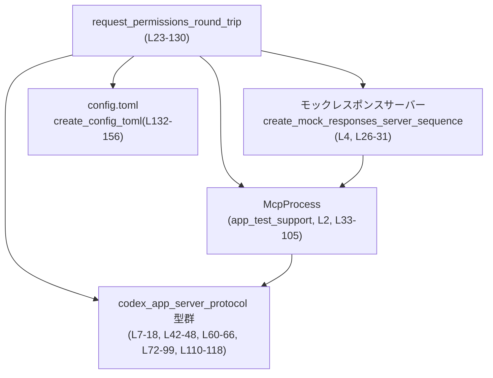
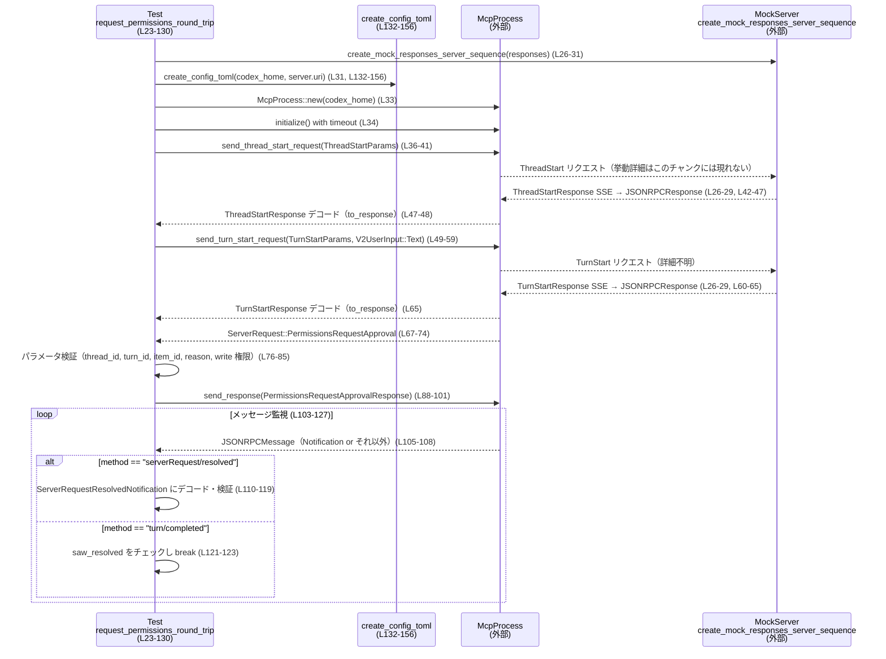

# app-server/tests/suite/v2/request_permissions.rs コード解説

## 0. ざっくり一言

このファイルは、「request_permissions」ツールを使った権限要求フローが JSON-RPC 経由で正しく往復（ラウンドトリップ）するかを検証する、Tokio ベースの統合テストと、そのための設定ファイル生成ヘルパー関数を提供するテストモジュールです（`request_permissions.rs:L21-156`）。

---

## 1. このモジュールの役割

### 1.1 概要

- このモジュールは **MCP クライアント（`McpProcess`）とモックサーバーの間で「権限要求 → ユーザー承認 → 解決通知 → ターン完了」までの一連のやり取りが期待通りか** を検証します（`request_permissions.rs:L23-130`）。
- その際、テスト専用の `config.toml` をテンポラリディレクトリに出力し、`request_permissions_tool` 機能を有効化した構成でアプリケーションを起動する準備を行います（`request_permissions.rs:L25-33`, `L132-156`）。

### 1.2 アーキテクチャ内での位置づけ

このテストは、以下のコンポーネントを仲立ちして動作します：

- テスト関数 `request_permissions_round_trip`（本ファイル）
- テスト用ラッパ `McpProcess`（`app_test_support` クレート、`request_permissions.rs:L2`）
- モック HTTP/SSE サーバー（`create_mock_responses_server_sequence`、`request_permissions.rs:L4`, `L26-31`）
- プロトコル定義 `codex_app_server_protocol`（各種型、`request_permissions.rs:L7-18`）
- Tokio ランタイムによる非同期実行＆タイムアウト（`request_permissions.rs:L19`, `L23`, `L34`, `L42-46`, `L60-64`, `L67-71`, `L105`）



- テスト関数が一時ディレクトリと `config.toml` を用意して `McpProcess` を起動し（`request_permissions.rs:L25-34`）、モックサーバーに対するスレッド開始／ターン開始リクエストを送ります（`request_permissions.rs:L36-41`, `L49-59`）。
- その後、サーバーからの権限要求（`ServerRequest::PermissionsRequestApproval`）と通知（`serverRequest/resolved` / `turn/completed`）を JSON-RPC で受け取り、プロトコル定義型でデコードして検証します（`request_permissions.rs:L72-79`, `L110-123`）。

### 1.3 設計上のポイント

- **統合テストとしての設計**  
  - 実際の HTTP/SSE 風レスポンス列をモックサーバー経由で流し、`McpProcess` を通じて JSON-RPC メッセージを往復させる構成になっています（`request_permissions.rs:L26-31`, `L33-65`, `L88-101`）。
- **タイムアウトによるハング防止**  
  - すべてのネットワーク読み取り／待ち受けに `tokio::time::timeout` をかけ、テストが無限待ちになるのを防いでいます（`request_permissions.rs:L34`, `L42-46`, `L60-64`, `L67-71`, `L105`）。
- **権限モデルの検証**  
  - サーバーから届く権限要求の内容（スレッド ID、ターン ID、アイテム ID、理由、ファイルシステム書き込み権限）を検証し（`request_permissions.rs:L76-85`）、その一部だけを許可して返すことで、部分的な権限付与と通知順序を確認します（`request_permissions.rs:L88-101`, `L110-123`）。
- **構成ファイルの専用生成**  
  - テスト用の `config.toml` を動的に生成し、`sandbox_mode = "read-only"` と `request_permissions_tool = true` 等の設定を一元管理するヘルパー関数を用意しています（`request_permissions.rs:L132-156`）。
- **非同期／並行実行**  
  - `#[tokio::test(flavor = "multi_thread", worker_threads = 4)]` により、マルチスレッドランタイム上でテストが動作する前提になっています（`request_permissions.rs:L23`）。

---

## 2. 主要な機能一覧

- `request_permissions_round_trip`: モックサーバー・`McpProcess`・JSON-RPC プロトコルを用いて、権限要求〜承認〜解決通知〜ターン完了までのラウンドトリップを検証する非同期テスト（`request_permissions.rs:L23-130`）。
- `create_config_toml`: テスト用ホームディレクトリ直下に `config.toml` を生成し、モックプロバイダと `request_permissions_tool` を有効にした設定を書き込むヘルパー関数（`request_permissions.rs:L132-156`）。

---

## 3. 公開 API と詳細解説

このファイルはテストモジュールであり、ライブラリ API の公開は行っていません。ただし、他のテストから再利用可能なヘルパー関数として `create_config_toml` が定義されています（`request_permissions.rs:L132-156`）。

### 3.1 型一覧（構造体・列挙体など）

このファイル内で新たな型定義はありませんが、テストの挙動を理解する上で重要な外部型をまとめます。

| 名前 | 種別 | 役割 / 用途 | 出現箇所 |
|------|------|-------------|----------|
| `McpProcess` | 構造体（外部） | アプリケーションサーバープロセスをテストから制御するラッパー。`new`, `initialize`, `send_thread_start_request`, `send_turn_start_request`, `read_stream_until_response_message`, `read_stream_until_request_message`, `read_next_message`, `send_response` などのメソッドが呼ばれています（具体的実装はこのチャンクには現れません）。 | `request_permissions.rs:L2`, `L33-36`, `L42-45`, `L49-52`, `L60-63`, `L67-71`, `L88-101`, `L105` |
| `JSONRPCMessage` | 列挙体（外部） | JSON-RPC のメッセージ種別を表す型で、ここでは `Notification` バリアントとしてマッチされます（`serverRequest/resolved`, `turn/completed` の2種類を扱います）。 | `request_permissions.rs:L7`, `L105-108` |
| `JSONRPCResponse` | 構造体／列挙体（外部） | JSON-RPC のレスポンスメッセージを表す型。`ThreadStartResponse` / `TurnStartResponse` へのデコードに使われています。 | `request_permissions.rs:L8`, `L42-47`, `L60-65` |
| `ServerRequest` | 列挙体（外部） | サーバーからクライアントへの要求を表す型。ここでは `PermissionsRequestApproval { request_id, params }` バリアントとしてパターンマッチされます。 | `request_permissions.rs:L12`, `L67-74` |
| `ServerRequestResolvedNotification` | 構造体（外部） | サーバー側のリクエストが解決されたことを通知するイベントのペイロード型。`thread_id` と `request_id` を検証しています。 | `request_permissions.rs:L13`, `L110-118` |
| `ThreadStartParams` / `ThreadStartResponse` | 構造体（外部） | スレッド開始リクエストのパラメータとレスポンス。レスポンスから `thread` 情報のみを取り出して使用しています。 | `request_permissions.rs:L14-15`, `L36-41`, `L42-48` |
| `TurnStartParams` / `TurnStartResponse` | 構造体（外部） | ターン開始リクエストのパラメータとレスポンス。ここではユーザー入力とモデル名を指定し、レスポンスから `turn` を取り出しています。 | `request_permissions.rs:L16-17`, `L49-59`, `L60-65` |
| `V2UserInput` (`UserInput` as alias) | 列挙体（外部） | ユーザー入力を表す型。`Text { text, text_elements }` バリアントを利用し、「pick a directory」という指示を渡しています。 | `request_permissions.rs:L18`, `L51-55` |
| `PermissionsRequestApprovalResponse` | 構造体（外部） | 権限要求に対するクライアント側の承認レスポンス。許可する権限とスコープを指定します。 | `request_permissions.rs:L10`, `L88-99` |
| `PermissionGrantScope` | 列挙体（外部） | 権限付与のスコープ（ここでは `Turn`）を表す型。 | `request_permissions.rs:L9`, `L98` |
| `GrantedPermissionProfile` / `AdditionalFileSystemPermissions` | 構造体（外部） | 実際に付与される権限セットを表現する型。ここでは `file_system.write` に一つだけ権限を付与しています。 | `request_permissions.rs:L91-96` |

> これらの型の定義本体は `codex_app_server_protocol` や `app_test_support` クレート内にあり、本チャンクには現れません。そのため、フィールド構造などは、ここで使用されている範囲のみ記述しています。

### 3.2 関数詳細

#### `request_permissions_round_trip() -> Result<()>`

**概要**

- Tok io のマルチスレッドランタイム上で動作する非同期テスト関数です（`request_permissions.rs:L23`）。
- モックサーバーと `McpProcess` を用いて、権限要求の発生、パラメータ内容、承認レスポンスの処理、および `serverRequest/resolved` 通知が `turn/completed` より先に届くことを検証します（`request_permissions.rs:L25-127`）。

**引数**

- なし（テスト関数のため、テストランナーから直接呼び出されます）。

**戻り値**

- `Result<()>`（`anyhow::Result` の型エイリアス、`request_permissions.rs:L1`, `L24`）  
  - すべての検証が成功し、エラーが発生しなければ `Ok(())` を返してテスト成功となります（`request_permissions.rs:L129`）。
  - 途中で `?` によるエラー伝播や `timeout` によるタイムアウトが発生すると `Err` が返り、テストは失敗します（`request_permissions.rs:L25`, `L26-31`, `L30-36`, `L42-47`, `L60-65`, `L67-71`, `L88-101`, `L111-116`）。

**内部処理の流れ**

1. **テスト環境の準備**  
   - 一時ディレクトリ（`codex_home`）を作成します（`request_permissions.rs:L25`）。
   - モックサーバーに流す SSE レスポンス列を組み立てます：  
     1つ目は `create_request_permissions_sse_response("call1")`（権限要求用）、2つ目は `create_final_assistant_message_sse_response("done")`（最終応答用）です（`request_permissions.rs:L26-29`）。
   - そのレスポンス列を使ってモックサーバーを起動します（`create_mock_responses_server_sequence(responses).await`、`request_permissions.rs:L30`）。
   - `codex_home` 直下に `config.toml` を生成し、モックサーバーの `uri` と結び付けた設定を書き込みます（`create_config_toml(codex_home.path(), &server.uri())`、`request_permissions.rs:L31`, `L132-156`）。

2. **MCP プロセスの起動と初期化**  
   - `McpProcess::new(codex_home.path()).await?` で MCP プロセスを起動します（`request_permissions.rs:L33`）。
   - `timeout(DEFAULT_READ_TIMEOUT, mcp.initialize()).await??;` で初期化処理をタイムアウト付きで実行します（`request_permissions.rs:L34`）。  
     ここでは `timeout` の外側と内側の `Result` を `??` で順にアンラップしています。

3. **スレッド開始リクエストの送信と応答処理**  
   - `ThreadStartParams` を構築し、`model: Some("mock-model".to_string())` を指定してスレッド開始リクエストを送信します（`request_permissions.rs:L36-41`）。
   - 返ってくる JSON-RPC レスポンスを `timeout` 付きで待ち受け、`RequestId::Integer(thread_start_id)` に対応するレスポンスまでストリームを読み進めます（`request_permissions.rs:L42-45`）。
   - `to_response` ヘルパーを使い `ThreadStartResponse` にデコードし、`thread` オブジェクトを取り出します（`request_permissions.rs:L47-48`）。

4. **ターン開始リクエストの送信と応答処理**  
   - `TurnStartParams` を構築し、先ほど取得した `thread.id` を `thread_id` に指定します（`request_permissions.rs:L49-52`）。
   - ユーザー入力として `V2UserInput::Text { text: "pick a directory", text_elements: Vec::new() }` を設定し、モデル名も `"mock-model"` に設定します（`request_permissions.rs:L51-57`）。
   - `send_turn_start_request` でリクエスト送信し、スレッド開始と同様に `timeout`＋`read_stream_until_response_message` で `TurnStartResponse` を受信し、`turn` を抽出します（`request_permissions.rs:L49-65`）。

5. **サーバーからの権限要求を受信し内容を検証**  
   - `mcp.read_stream_until_request_message()` を `timeout` 付きで呼び出し、サーバーからの最初のリクエストを待ち受けます（`request_permissions.rs:L67-71`）。
   - それが `ServerRequest::PermissionsRequestApproval { request_id, params }` バリアントであることを `let ... else { panic!(...) }` で検証します（`request_permissions.rs:L72-74`）。
   - `params` 内の各フィールドが期待どおりであることをアサートします（`request_permissions.rs:L76-79`）。  
     - `thread_id` == `thread.id`  
     - `turn_id` == `turn.id`  
     - `item_id` == `"call1"`（モックレスポンス作成時に渡した ID と対応）  
     - `reason` == `Some("Select a workspace root".to_string())`
   - `params.permissions.file_system.and_then(|fs| fs.write)` でファイルシステムの書き込み権限リストを取り出し、`expect` で必ず存在することと、長さが 2 であることを検証します（`request_permissions.rs:L80-85`）。

6. **権限承認レスポンスの送信**  
   - `request_id` を `resolved_request_id` としてクローンし、後続の `serverRequest/resolved` 通知で検証できるようにします（`request_permissions.rs:L86`）。
   - `PermissionsRequestApprovalResponse` を構築し、`GrantedPermissionProfile` 内の `file_system.write` に、要求されていた 2 つの書き込み権限のうち **先頭の 1 つだけ** を許可する形でレスポンスを組み立てます（`request_permissions.rs:L88-96`）。
   - 権限付与スコープには `PermissionGrantScope::Turn` を指定し（`request_permissions.rs:L98`）、`mcp.send_response(request_id, serde_json::to_value(...))` でサーバーに送り返します（`request_permissions.rs:L88-101`）。

7. **通知の順序と内容の検証ループ**  
   - `saw_resolved` フラグを `false` に初期化し（`request_permissions.rs:L103`）、無限ループで `mcp.read_next_message()` を `timeout` 付きで呼び続けます（`request_permissions.rs:L104-105`）。
   - メッセージが `JSONRPCMessage::Notification(notification)` の場合のみ処理し、それ以外は `continue` でスキップします（`request_permissions.rs:L105-108`）。
   - `notification.method.as_str()` でメソッド名を判定し（`request_permissions.rs:L109`）：  
     - `"serverRequest/resolved"` の場合：  
       - `notification.params` を `ServerRequestResolvedNotification` にデコードし（`request_permissions.rs:L110-116`）、`thread_id` と `request_id` が先ほどの値と一致することをアサートし、`saw_resolved = true` とします（`request_permissions.rs:L117-119`）。  
     - `"turn/completed"` の場合：  
       - `assert!(saw_resolved, "serverRequest/resolved should arrive first");` により、解決通知がターン完了通知より先に来ていることを検証し（`request_permissions.rs:L121-122`）、`break` でループを抜けます（`request_permissions.rs:L123`）。  
     - それ以外のメソッドは無視します（`request_permissions.rs:L125`）。

8. **テストの終了**  
   - すべての検証を終えたら `Ok(())` を返してテスト成功とします（`request_permissions.rs:L129`）。

**Examples（使用例）**

この関数は Rust のテストとして自動実行されることを前提としています。通常の実行例は次のようになります。

```bash
# crate ルートで
cargo test request_permissions_round_trip
```

Rust コードから直接呼ぶことは想定されていませんが、シグネチャは次のとおりです。

```rust
// テストランナーではなくコードから直接呼ぶ場合のイメージ（通常は不要）
#[tokio::main]
async fn main() -> anyhow::Result<()> {
    request_permissions_round_trip().await
}
```

**Errors / Panics**

- `?` によるエラー伝播:
  - 一時ディレクトリ作成に失敗した場合（`TempDir::new`、`request_permissions.rs:L25`）。
  - モックレスポンス生成関数が失敗した場合（`create_request_permissions_sse_response`, `create_final_assistant_message_sse_response`、`request_permissions.rs:L26-29`）。
  - モックサーバーの起動に失敗した場合（`create_mock_responses_server_sequence`、`request_permissions.rs:L30`）。
  - `create_config_toml` が I/O エラーを返した場合（`request_permissions.rs:L31`, `L132-156`）。
  - `McpProcess::new`, `initialize`, 各種送信／受信メソッドがエラーを返した場合（`request_permissions.rs:L33-36`, `L42-47`, `L49-59`, `L60-65`, `L67-71`, `L88-101`, `L105`）。
  - JSON デコード (`serde_json::from_value`) やエンコード (`serde_json::to_value`) が失敗した場合（`request_permissions.rs:L88-99`, `L111-116`）。
- タイムアウト (`tokio::time::timeout`):
  - 指定された `DEFAULT_READ_TIMEOUT`（10 秒）以内にそれぞれの非同期処理が完了しなかった場合、`timeout` が `Err` を返し、それが `?` で伝播します（`request_permissions.rs:L21`, `L34`, `L42-46`, `L60-64`, `L67-71`, `L105`）。
- panic が発生しうる箇所:
  - サーバーからのリクエストが `ServerRequest::PermissionsRequestApproval` 以外だった場合（`panic!("expected PermissionsRequestApproval ...")`、`request_permissions.rs:L72-74`）。
  - 書き込み権限が含まれていない場合（`expect("request should include write permissions")`、`request_permissions.rs:L80-84`）。
  - `requested_writes` が空の場合に `requested_writes[0]` のインデックスアクセスでパニックが起こりえます（`request_permissions.rs:L95`）。
  - `serverRequest/resolved` 通知の `params` が `None` の場合（`expect("serverRequest/resolved params")`、`request_permissions.rs:L113-116`）。
  - `serverRequest/resolved` 通知が `turn/completed` より前に届かない場合（`assert!(saw_resolved, ...)`、`request_permissions.rs:L121-122`）。

**Edge cases（エッジケース）**

- モックサーバーが期待通りの `PermissionsRequestApproval` リクエストを送らない場合:
  - パターンマッチで `panic!` し、テストは失敗します（`request_permissions.rs:L72-74`）。
- `params.permissions.file_system.write` が `None`、または空配列の場合:
  - `expect` でパニック、あるいは `requested_writes[0]` でパニックし、テスト失敗となります（`request_permissions.rs:L80-85`, `L95`）。
- `serverRequest/resolved` 通知が送られない、または `thread_id`／`request_id` が一致しない場合:
  - `serde_json::from_value` のエラー、`assert_eq!` の失敗、あるいは `timeout` によるタイムアウトとしてテスト失敗になります（`request_permissions.rs:L110-118`）。
- `turn/completed` 通知が送られない場合:
  - ループから抜けられず、最終的に `read_next_message` の `timeout` が発生しうるため、テストがエラーになります（`request_permissions.rs:L103-105`）。
- 通知の順序が逆（`turn/completed` → `serverRequest/resolved`）の場合:
  - `assert!(saw_resolved, ...)` のアサーションによりテスト失敗となります（`request_permissions.rs:L121-122`）。

**使用上の注意点**

- すべての I/O 操作が `timeout` に包まれているため、タイムアウト値（10 秒）が環境に対して短すぎるか長すぎる場合にはテストの安定性に影響があります（`request_permissions.rs:L21`）。
- モックサーバーのレスポンス列とテストの期待内容（`item_id = "call1"`, `reason` の文言、書き込み権限の数）が密接に結び付いているため、モックレスポンス生成関数側の変更があればテストを合わせて調整する必要があります（`request_permissions.rs:L26-29`, `L76-85`）。
- マルチスレッドランタイムで動作する前提のため、`McpProcess` の実装がスレッドに対して安全に設計されていることが前提になりますが、その詳細はこのチャンクからは分かりません（`request_permissions.rs:L23`, `L33-36`, `L105`）。

---

#### `create_config_toml(codex_home: &std::path::Path, server_uri: &str) -> std::io::Result<()>`

**概要**

- テスト用の `config.toml` ファイルを `codex_home` ディレクトリ直下に作成し、モックプロバイダと権限リクエスト機能を有効にする設定を書き込むヘルパー関数です（`request_permissions.rs:L132-156`）。
- `request_permissions_round_trip` テストから呼び出され、MCP プロセスが参照する設定を確立します（`request_permissions.rs:L31`）。

**引数**

| 引数名 | 型 | 説明 |
|--------|----|------|
| `codex_home` | `&std::path::Path` | `config.toml` を配置するテスト用ホームディレクトリパスです（`request_permissions.rs:L132-133`）。 |
| `server_uri` | `&str` | モックサーバーのベース URI。`base_url` の行に `{server_uri}/v1` として埋め込まれます（`request_permissions.rs:L132`, `L146`）。 |

**戻り値**

- `std::io::Result<()>`  
  - `Ok(())` の場合、`config.toml` が正常に書き込まれていることを意味します（`request_permissions.rs:L132-135`）。
  - 書き込みに失敗した場合は `Err(std::io::Error)` が返ります。

**内部処理の流れ**

1. `codex_home.join("config.toml")` で設定ファイルのパスを組み立てます（`request_permissions.rs:L133`）。
2. `format!(r#" ... "#, server_uri = server_uri)` で TOML 形式の設定文字列を生成します（`request_permissions.rs:L135-153`）。
   - `model = "mock-model"`  
   - `approval_policy = "untrusted"`  
   - `sandbox_mode = "read-only"`  
   - `model_provider = "mock_provider"`  
   - `[model_providers.mock_provider]` セクションに `name`, `base_url = "{server_uri}/v1"`, `wire_api = "responses"`, `request_max_retries = 0`, `stream_max_retries = 0` を設定（`request_permissions.rs:L142-149`）。  
   - `[features]` セクションで `request_permissions_tool = true` を有効化（`request_permissions.rs:L151-152`）。
3. `std::fs::write(config_toml, formatted_string)` でファイルに書き込みます（`request_permissions.rs:L134-135`）。

**Examples（使用例）**

テスト内での実際の使用例です。

```rust
let codex_home = tempfile::TempDir::new()?;                   // 一時ディレクトリを作成（L25）
let server = create_mock_responses_server_sequence(responses)
    .await?;                                                 // モックサーバーを起動（L30）

create_config_toml(codex_home.path(), &server.uri())?;       // config.toml を生成（L31）
```

単体で利用する場合のイメージです。

```rust
fn main() -> std::io::Result<()> {
    let dir = std::path::Path::new("/tmp/codex_home");       // 任意のディレクトリ
    create_config_toml(dir, "http://localhost:8080")?;       // モックまたは実サーバーの URI を指定
    Ok(())
}
```

**Errors / Panics**

- `std::fs::write` が失敗した場合（ディレクトリが存在しない、パーミッションがない等）、`Err(std::io::Error)` が返ります（`request_permissions.rs:L133-135`）。
- この関数内では `panic!` を呼び出していません。

**Edge cases（エッジケース）**

- `codex_home` が存在しない、または書き込み不可の場合:
  - `std::fs::write` がエラーを返します（`request_permissions.rs:L133-135`）。
- `server_uri` が空文字列や不正な URL の場合:
  - 文字列としてそのまま埋め込まれるだけであり、この関数自身はエラーを出しません（`request_permissions.rs:L146`）。  
    その後のクライアント側の挙動に影響する可能性はありますが、本チャンクからは詳細は分かりません。

**使用上の注意点**

- `codex_home` は事前に存在するディレクトリである必要があります。`TempDir::new()` から渡されるパスはこの前提を満たしています（`request_permissions.rs:L25`, `L132-133`）。
- `server_uri` 文字列の妥当性チェックは行っていないため、不適切な URI を渡すと後続の HTTP 通信で問題が生じる可能性があります（この点はコードから推測されますが、具体的な影響はこのチャンクには現れません）。
- 設定値（特に `sandbox_mode = "read-only"` や `request_permissions_tool = true`）は権限関連テストの前提条件となっているため、変更する場合はテスト内容との整合性を確認する必要があります（`request_permissions.rs:L140`, `L151-152`）。

### 3.3 その他の関数

このファイルには上記 2 つ以外の関数定義はありません。

---

## 4. データフロー

ここでは、`request_permissions_round_trip` テスト内での代表的なデータフローを示します。

1. テストがモックサーバーと `config.toml` を用意し、`McpProcess` を起動します（`request_permissions.rs:L25-34`, `L132-156`）。
2. スレッド開始・ターン開始リクエストが送られ、サーバーからは SSE ベースのモックレスポンスが返ります（`request_permissions.rs:L26-31`, `L36-48`, `L49-65`）。
3. ターン中にツール呼び出しなどにより権限要求が発生した結果として、サーバーから JSON-RPC の `ServerRequest::PermissionsRequestApproval` が届きます（`request_permissions.rs:L67-74`）。
4. テストはその内容を検証した上で、承認レスポンスを送信します（`request_permissions.rs:L76-85`, `L88-101`）。
5. 最終的に、`serverRequest/resolved` 通知と `turn/completed` 通知が順に届き、その順序が検証されます（`request_permissions.rs:L103-123`）。



> `McpProcess` とモックサーバーの内部処理はこのチャンクには現れませんが、テストの呼び出しと返却メッセージのやり取りから、上記のようなフローが前提になっていることが読み取れます。

---

## 5. 使い方（How to Use）

このファイルはテストモジュールであり、通常は `cargo test` で自動実行されることを想定しています。

### 5.1 基本的な使用方法

- テスト全体の実行:

```bash
# crate ルートにて、v2 スイートを含むテストを実行
cargo test
```

- 特定のテスト関数のみを指定したい場合の例（テストランナーに依存）:

```bash
cargo test request_permissions_round_trip
```

- コード内では、`request_permissions_round_trip` は `#[tokio::test]` 指定によりテストランナーから直接呼び出されます（`request_permissions.rs:L23-24`）。

`create_config_toml` は他のテストから再利用可能なヘルパーとして使うことができます。

```rust
fn setup_home_and_config(server_uri: &str) -> anyhow::Result<tempfile::TempDir> {
    let codex_home = tempfile::TempDir::new()?;                       // 一時ディレクトリ（L25）
    create_config_toml(codex_home.path(), server_uri)?;               // 設定生成（L31, L132-156）
    Ok(codex_home)
}
```

### 5.2 よくある使用パターン

このテストから読み取れる典型パターンは、**「タイムアウト付き非同期処理＋JSON-RPC メッセージの待ち受け」** です。

- **タイムアウト付きで初期化やレスポンス待ちを行うパターン**

```rust
let resp: JSONRPCResponse = timeout(
    DEFAULT_READ_TIMEOUT,                                           // 10秒の制限（L21）
    mcp.read_stream_until_response_message(RequestId::Integer(id)), // 特定IDのレスポンスまで読む（L44-45, L62-63）
).await??;                                                          // タイムアウト・I/Oエラーを双方伝播（L42-46, L60-64）
```

- **JSON-RPC 通知をループで処理するパターン**

```rust
loop {
    let message = timeout(DEFAULT_READ_TIMEOUT, mcp.read_next_message()).await??; // L105
    let JSONRPCMessage::Notification(notification) = message else {               // 通知以外はスキップ（L106-107）
        continue;
    };
    match notification.method.as_str() {                                          // メソッド名で分岐（L109）
        "serverRequest/resolved" => { /* ... */ }
        "turn/completed"        => { /* ... */ }
        _ => {}
    }
}
```

このパターンは、JSON-RPC ベースの非同期プロトコルをテストする際に汎用的に利用できます。

### 5.3 よくある間違い

このコードから推測できる、起こりやすそうな誤りと、それに対応する正しいパターンを示します。

```rust
// 誤り例: タイムアウトをかけずに非同期読み取りを待ち続ける
// これだとサーバー側の不具合でメッセージが届かない場合にテストがハングする可能性がある
let resp = mcp.read_stream_until_response_message(RequestId::Integer(id)).await?;

// 正しい例: tokio::time::timeout でハングを防ぐ（本ファイルのパターン）
let resp = timeout(
    DEFAULT_READ_TIMEOUT, // L21
    mcp.read_stream_until_response_message(RequestId::Integer(id)),
).await??;                // L42-46, L60-64
```

```rust
// 誤り例: serverRequest/resolved タイミングを検証しない
if method == "turn/completed" {
    // 特に順序をチェックせずに終了してしまう
}

// 正しい例: 必ず serverRequest/resolved を先に受信したことを確認する（L103-123）
assert!(saw_resolved, "serverRequest/resolved should arrive first"); // L121-122
```

### 5.4 使用上の注意点（まとめ）

- タイムアウト値 `DEFAULT_READ_TIMEOUT` は 10 秒に固定されており、遅い環境ではテストがタイムアウトする可能性があります（`request_permissions.rs:L21`）。
- モックレスポンス生成 (`create_request_permissions_sse_response` / `create_final_assistant_message_sse_response`) とテストの期待（`item_id = "call1"`, `reason` の文言、書き込み権限数）は密に結合しているため、どちらか一方の変更は他方にも変更が必要です（`request_permissions.rs:L26-29`, `L76-85`）。
- `create_config_toml` の設定内容（特に `sandbox_mode` や `approval_policy`, `request_permissions_tool`）は権限関連の挙動に強く影響するため、別のシナリオをテストする場合は設定を慎重に変更する必要があります（`request_permissions.rs:L138-140`, `L151-152`）。
- 非同期処理はマルチスレッドランタイム上で行われるため、共有状態を持つコンポーネント（`McpProcess` 等）のスレッド安全性に注意が必要ですが、その実装はこのチャンクには現れません（`request_permissions.rs:L23`, `L33-36`, `L105`）。

---

## 6. 変更の仕方（How to Modify）

### 6.1 新しい機能を追加する場合

このファイルに機能を追加する代表的なケースとして、「別の権限スコープ」や「追加のツール」をテストしたい場合が考えられます（具体的な要求はコードからは分かりませんが、変更方法として記述します）。

1. **新しいテスト関数を追加する**
   - 既存の `request_permissions_round_trip` をコピーして別名の `#[tokio::test]` 関数を作成し、モックレスポンス生成部分とアサーションを必要に応じて変更します（`request_permissions.rs:L23-130`）。
2. **設定値を変更する**
   - 異なる権限ポリシーやツールを試したい場合は、`create_config_toml` 内の設定文字列を調整します（`request_permissions.rs:L135-153`）。  
   - 設定の変更が他のテストに影響する場合は、専用の `create_config_toml_xxx` ヘルパーを追加する方法もあります。
3. **検証項目の追加**
   - 例えば、`PermissionsRequestApprovalResponse` に別のフィールドを追加で設定した場合、そのフィールドがサーバー側で反映されているかどうかを示す通知をテストループで検証するコードを追加します（`request_permissions.rs:L88-101`, `L103-123`）。

### 6.2 既存の機能を変更する場合

変更時に確認すべき点を整理します。

- **`request_permissions_round_trip` の変更時**
  - 影響範囲:
    - モックレスポンス生成関数群（`create_request_permissions_sse_response`, `create_final_assistant_message_sse_response`, `create_mock_responses_server_sequence`）との整合性（`request_permissions.rs:L3-5`, `L26-31`）。
    - JSON-RPC プロトコル定義（`codex_app_server_protocol`）に依存する型名・フィールド名（`request_permissions.rs:L7-18`, `L47-48`, `L65`, `L72-79`, `L80-85`, `L110-118`）。
  - 契約（前提条件・返り値の意味）:
    - `ServerRequest::PermissionsRequestApproval` が送られてくること、`params.permissions.file_system.write` に少なくとも 1 要素以上が含まれることを前提にしています（`request_permissions.rs:L72-74`, `L80-85`）。
    - `serverRequest/resolved` が `turn/completed` より前に届くことを前提とし、順序をアサートしています（`request_permissions.rs:L121-122`）。
  - 変更後は必ず:
    - すべての `assert` 条件が新仕様と一致しているか確認します。
    - `timeout` の適用漏れがないか確認します（`request_permissions.rs:L34`, `L42-46`, `L60-64`, `L67-71`, `L105`）。

- **`create_config_toml` の変更時**
  - 影響範囲:
    - `McpProcess` およびアプリケーションサーバーの起動／挙動（`request_permissions.rs:L31-34`）。
  - 契約:
    - `config.toml` 内に必要なセクション／フィールドが存在することを前提にしているコンポーネントがある可能性がありますが、その詳細はこのチャンクには現れません。
  - 変更時は:
    - TOML の構文エラーがないかを確認します（特にクォートや改行位置、`[section]` 名など）。
    - `server_uri` の埋め込み位置（`base_url = "{server_uri}/v1"`）を変更する場合は、サーバー側エンドポイントとの整合性を確認します（`request_permissions.rs:L146`）。

---

## 7. 関連ファイル

このファイルから参照されている外部モジュール・クレートを整理します。正確なパスはこのチャンクからは分かりませんが、役割は名前と使用状況から読み取れます。

| パス / クレート名 | 役割 / 関係 |
|-------------------|------------|
| `app_test_support` | `McpProcess` や各種モックレスポンス生成関数（`create_mock_responses_server_sequence`, `create_request_permissions_sse_response`, `create_final_assistant_message_sse_response`, `to_response`）を提供し、このテストから直接呼び出されています（`request_permissions.rs:L2-6`, `L26-31`, `L33-36`, `L42-48`, `L49-65`）。 |
| `codex_app_server_protocol` | JSON-RPC ベースのプロトコルを定義するクレートであり、`JSONRPCMessage`, `JSONRPCResponse`, `ServerRequest`, `ServerRequestResolvedNotification`, `ThreadStartParams/Response`, `TurnStartParams/Response`, `UserInput`, `PermissionsRequestApprovalResponse`, `PermissionGrantScope`, `GrantedPermissionProfile`, `AdditionalFileSystemPermissions` などがここからインポートされています（`request_permissions.rs:L7-18`, `L42-48`, `L60-65`, `L72-79`, `L88-99`, `L110-118`）。 |
| `tokio` | 非同期実行ランタイムを提供し、`#[tokio::test]` および `tokio::time::timeout` によりマルチスレッド非同期テストとタイムアウト制御を実現しています（`request_permissions.rs:L19`, `L23`, `L34`, `L42-46`, `L60-64`, `L67-71`, `L105`）。 |
| `tempfile` | テスト用に自動削除される一時ディレクトリ `TempDir` を提供し、`codex_home` として利用されています（`request_permissions.rs:L25`）。 |
| `std::fs`, `std::path` | `config.toml` のファイルパス操作と書き込み (`std::fs::write`) に使用されています（`request_permissions.rs:L132-135`）。 |

> 観測可能性（ログ、メトリクス）に関して、このファイル内には明示的なログ出力やメトリクス送信処理は含まれていません。そのため、テスト失敗時の情報は主に `assert!` / `panic!` メッセージと `anyhow::Error` によるエラー伝播に依存する構成になっています（`request_permissions.rs:L72-74`, `L80-85`, `L111-116`, `L121-122`）。
