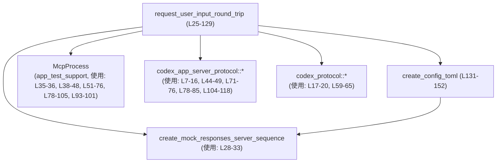
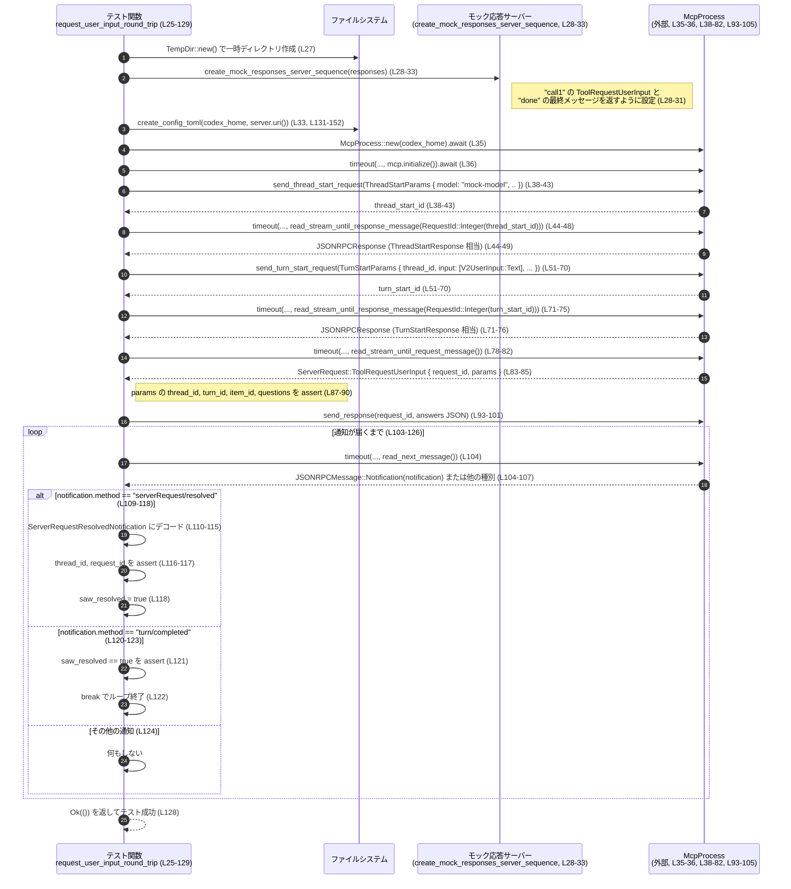

# app-server/tests/suite/v2/request_user_input.rs コード解説

## 0. ざっくり一言

このファイルは、アプリケーションサーバーが V2 の `UserInput` ツール呼び出しを正しく処理できるかを検証する **非同期統合テスト**と、そのための簡単な設定ファイル生成関数を定義しています（request_user_input.rs:L25-129, L131-152）。

---

## 1. このモジュールの役割

### 1.1 概要

- このモジュールは、モック応答サーバーと `McpProcess` を用いて、次の点を検証するテストを提供します（request_user_input.rs:L27-36, L38-126）。
  - `TurnStart` でユーザー入力（`V2UserInput::Text`）を送ると、サーバーから `ServerRequest::ToolRequestUserInput` が届くこと（L51-58, L78-85）。
  - そのツールリクエストに JSON 形式で回答を返すと、`serverRequest/resolved` 通知が送られ、その後で `turn/completed` 通知が来る順序になっていること（L93-123）。
- また、テスト用に `config.toml` を書き出す補助関数 `create_config_toml` を提供します（L131-152）。

### 1.2 アーキテクチャ内での位置づけ

このテストは、テスト用サポートクレートとプロトコル定義クレートに依存しています。

- `app_test_support` から:
  - `McpProcess`：アプリケーションサーバーとのプロセス間通信を抽象化したヘルパー（L2, L35-36, L38-48 など）。
  - `create_mock_responses_server_sequence`：モック応答サーバーを立ち上げる関数（L4, L28-33）。
  - `create_request_user_input_sse_response` / `create_final_assistant_message_sse_response`：モックサーバーが返す SSE 風レスポンスを作成（L3, L5, L28-31）。
  - `to_response`：`JSONRPCResponse` を特定のレスポンス型に変換（L6, L49, L76）。
- `codex_app_server_protocol` から:
  - JSON-RPC メッセージ種別とスレッド/ターン開始・サーバーリクエスト等の型（L7-16）。
- `codex_protocol` から:
  - `CollaborationMode` / `ModeKind` / `Settings` といった設定用型、および `ReasoningEffort`（L17-20, L59-65）。

依存関係を簡略化した図は次の通りです。



※ 矢印は「このファイルから利用している」ことのみを表し、内部実装の関係はこのチャンクからは分かりません。

### 1.3 設計上のポイント

コードから読み取れる設計上の特徴は次の通りです。

- **プロセス／ネットワーク待ちの安全性**  
  すべての長時間ブロックしうる操作（初期化・リクエスト送信後の受信・次メッセージの取得など）が `tokio::time::timeout` でタイムアウト付きになっており、テストが無期限にぶら下がらないようになっています（L36, L44-48, L71-75, L78-82, L104）。
- **JSON-RPC ベースのプロトコル検証**  
  `JSONRPCMessage` / `JSONRPCResponse` / `ServerRequest` / `ServerRequestResolvedNotification` など、プロトコル定義専用の型を用いてメッセージ内容を検証しています（L7-11, L44-49, L71-76, L78-85, L104-118）。
- **テスト用設定の完全隔離**  
  `tempfile::TempDir` と `create_config_toml` により、一時ディレクトリ内の `config.toml` のみを利用する構成になっており、他の環境設定に依存しないテストとなっています（L27, L31-33, L131-152）。
- **非同期・マルチスレッドテスト**  
  `#[tokio::test(flavor = "multi_thread", worker_threads = 4)]` により、マルチスレッド版 Tokio ランタイム上で非同期テストが実行されます（L25）。

---

## 2. 主要な機能一覧

このファイルが提供する主な機能は次の 2 点です。

- `request_user_input_round_trip`:  
  V2 ユーザー入力からツールによる追加質問 (`ToolRequestUserInput`) の往復と、`serverRequest/resolved` → `turn/completed` の通知順序を検証する非同期統合テスト（L25-129）。
- `create_config_toml`:  
  テスト用の `config.toml` を一時ディレクトリに書き出し、モックプロバイダ設定とモデル設定を行う補助関数（L131-152）。

### 2.1 コンポーネントインベントリー（関数・構造体など）

このチャンクに登場する主な関数・型の一覧です。

| 名前 | 種別 | 由来 | このファイルでの位置 / 使用箇所 | 役割 / 用途 |
|------|------|------|----------------------------------|-------------|
| `request_user_input_round_trip` | 非同期関数（テスト） | 本ファイル | 定義: request_user_input.rs:L25-129 | ユーザー入力 → ツールリクエスト → 回答 → 通知の一連のラウンドトリップを検証するテスト |
| `create_config_toml` | 関数 | 本ファイル | 定義: request_user_input.rs:L131-152 | 一時ディレクトリに `config.toml` を書き出す |
| `McpProcess` | 構造体（外部） | `app_test_support` | 使用: L2, L35-36, L38-48, L51-76, L78-82, L93-105 | アプリケーションサーバーとの JSON-RPC 通信を抽象化したテスト用プロセスラッパと推測されますが、定義はこのチャンクには現れません |
| `create_mock_responses_server_sequence` | 関数（外部） | `app_test_support` | 使用: L4, L28-33 | モック応答サーバーの立ち上げと、その URI 取得に利用 |
| `create_request_user_input_sse_response` | 関数（外部） | `app_test_support` | 使用: L5, L28-31 | `ToolRequestUserInput` に対応するモック SSE 応答を生成 |
| `create_final_assistant_message_sse_response` | 関数（外部） | `app_test_support` | 使用: L3, L28-31 | 最終アシスタントメッセージのモック SSE 応答を生成 |
| `JSONRPCMessage` | 列挙体（外部） | `codex_app_server_protocol` | 使用: L7, L104-108 | JSON-RPC メッセージのラッパ型。通知・リクエスト・レスポンス等を表現 |
| `JSONRPCResponse` | 構造体/列挙体（外部） | 同上 | 使用: L8, L44-48, L71-75 | サーバーからの JSON-RPC レスポンス |
| `ServerRequest` | 列挙体（外部） | 同上 | 使用: L10, L78-85 | サーバーからクライアントへのリクエストのバリアント。ここでは `ToolRequestUserInput` を利用 |
| `ServerRequestResolvedNotification` | 構造体（外部） | 同上 | 使用: L11, L109-118 | サーバーリクエストが解決されたことを通知するペイロード |
| `ThreadStartParams` / `ThreadStartResponse` | 構造体（外部） | 同上 | 使用: L12-13, L38-43, L44-49 | スレッド開始リクエストの引数およびレスポンス |
| `TurnStartParams` / `TurnStartResponse` | 構造体（外部） | 同上 | 使用: L14-15, L51-70, L71-76 | ターン開始リクエストの引数およびレスポンス |
| `UserInput as V2UserInput` | 列挙体（外部） | 同上 | 使用: L16, L54-57 | V2 のユーザー入力（ここでは `Text` バリアント）の表現 |
| `CollaborationMode` / `ModeKind` / `Settings` | 構造体/列挙体（外部） | `codex_protocol::config_types` | 使用: L17-19, L59-67 | 協調モードの指定とその詳細設定 |
| `ReasoningEffort` | 列挙体（外部） | `codex_protocol::openai_models` | 使用: L20, L59, L64 | 推論の強度（ここでは `Medium`）を示す設定 |
| `RequestId` | 列挙体（外部） | `codex_app_server_protocol` | 使用: L9, L44-47, L71-73 | JSON-RPC リクエスト ID 型。整数 ID を用いてレスポンスを対応付け |
| `ThreadStartParams::default` / `TurnStartParams::default` | `Default` 実装（外部） | 同上 | 使用: L41, L68 | パラメータの未指定フィールドにデフォルト値を埋める |

外部型の正確なフィールド内容や内部実装は、このチャンクには現れません。

---

## 3. 公開 API と詳細解説

このファイルはテスト用モジュールであり、`pub` で公開された関数や型はありません。ここでは、このファイル内で定義されている 2 つの関数を詳しく説明します。

### 3.1 型一覧（構造体・列挙体など）

- このファイル内で新たに定義される構造体・列挙体はありません（request_user_input.rs:L1-152）。
- プロトコルや設定用の型はすべて外部クレートからインポートされています（L1-21）。

### 3.2 関数詳細

#### `request_user_input_round_trip() -> Result<()>`

**概要**

- V2 ユーザー入力に対して、サーバーが `ToolRequestUserInput` リクエストを発行し、クライアントが回答を返すと `serverRequest/resolved` → `turn/completed` の順に通知が届くことを検証する非同期テストです（request_user_input.rs:L25-129）。
- Tokio のマルチスレッドランタイム上で実行されます（L25）。

**引数**

- 引数はありません。

**戻り値**

- `anyhow::Result<()>`（L25）  
  - 成功時: `Ok(())` を返します（L128）。  
  - エラー時: 途中で発生した I/O エラー、タイムアウト、JSON 変換エラーなどをラップした `Err` を返します（`?` や `??` による早期リターン、L27, L28-31, L33, L35-36, L38-43, L44-48, L49, L51-70, L71-75, L76, L78-82, L93-101, L104-115）。

**内部処理の流れ（アルゴリズム）**

大まかなフローは次の通りです（L27-128）。

1. **テスト用ディレクトリとモックサーバーの準備**（L27-33）
   - 一時ディレクトリ `codex_home` を作成（L27）。
   - モック SSE 応答のベクタ `responses` を作成（L28-31）。  
     - 1つ目: `create_request_user_input_sse_response("call1")?`（L29）。  
     - 2つ目: `create_final_assistant_message_sse_response("done")?`（L30）。
   - `create_mock_responses_server_sequence(responses).await` でモック応答サーバーを生成し、その `uri()` を取得（L32-33）。
   - `create_config_toml(codex_home.path(), &server.uri())?` で一時ディレクトリに `config.toml` を書き出します（L33, L131-152）。

2. **McpProcess の起動と初期化**（L35-36）
   - `McpProcess::new(codex_home.path()).await?` でプロセスラッパを生成（L35）。
   - `timeout(DEFAULT_READ_TIMEOUT, mcp.initialize()).await??;` で初期化完了をタイムアウト付きで待ちます（L36）。

3. **スレッド開始 (thread/start) リクエストとレスポンスの取得**（L38-49）
   - `send_thread_start_request(ThreadStartParams { model: Some("mock-model".to_string()), ..Default::default() })` を送信し、戻り値としてリクエスト ID (`thread_start_id`) を取得（L38-43）。
   - `read_stream_until_response_message(RequestId::Integer(thread_start_id))` で該当レスポンスをタイムアウト付きで待ち（L44-48）、`JSONRPCResponse` を得ます。
   - `to_response(thread_start_resp)?` により `ThreadStartResponse` に変換し、`thread` 情報を取得（L49）。

4. **ターン開始 (turn/start) リクエストとレスポンスの取得**（L51-76）
   - `send_turn_start_request(TurnStartParams { ... })` を送信（L51-70）。  
     主なフィールド:
     - `thread_id: thread.id.clone()`（L53）。  
     - `input`: `V2UserInput::Text { text: "ask something".to_string(), text_elements: Vec::new() }` の 1 要素（L54-57）。  
     - `model: Some("mock-model".to_string())`（L58）。  
     - `effort: Some(ReasoningEffort::Medium)`（L59）。  
     - `collaboration_mode: Some(CollaborationMode { mode: ModeKind::Plan, settings: Settings { ... } })`（L60-67）。
   - `read_stream_until_response_message(RequestId::Integer(turn_start_id))` でレスポンスを待ち（L71-75）、`TurnStartResponse` に変換して `turn` を取得（L76）。

5. **`ToolRequestUserInput` リクエストの受信と検証**（L78-91）
   - `read_stream_until_request_message()` で次のサーバーリクエストをタイムアウト付きで待ちます（L78-82）。
   - 得られた `ServerRequest` が `ServerRequest::ToolRequestUserInput { request_id, params }` であることを `let ... = server_req else { panic!(...) };` で検証（L83-85）。
   - `params.thread_id` が `thread.id` と一致すること（L87）。  
     `params.turn_id` が `turn.id` と一致すること（L88）。  
     `params.item_id` が `"call1"` であること（モックレスポンスで設定した ID と整合、L29, L89）。  
     `params.questions.len()` が `1` であること（L90）。
   - `resolved_request_id = request_id.clone();` で後の検証に備えてリクエスト ID を保存（L91）。

6. **ツールリクエストへの回答送信**（L93-101）
   - `mcp.send_response(request_id, serde_json::json!({ "answers": { "confirm_path": { "answers": ["yes"] } } }))` で回答 JSON を送信（L93-100）。
   - この JSON 構造は、「`confirm_path` というキーに、`answers` 配列として `"yes"` を 1 件含む回答を紐づける」形になっています（L95-98）。

7. **通知 `serverRequest/resolved` と `turn/completed` の順序検証**（L102-126）
   - `saw_resolved` フラグを `false` に初期化（L102）。
   - 無限ループで次のメッセージを読み取り（L103-126）:
     - `timeout(DEFAULT_READ_TIMEOUT, mcp.read_next_message()).await??;` で次の JSON-RPC メッセージをタイムアウト付きで取得（L104）。
     - `let JSONRPCMessage::Notification(notification) = message else { continue; };` により、通知以外は無視して次のループへ（L105-107）。
     - `match notification.method.as_str()` でメソッド名を文字列で分岐（L108）。
       - `"serverRequest/resolved"` の場合（L109-118）:
         - `serde_json::from_value` で `ServerRequestResolvedNotification` にデシリアライズ（L110-115）。
         - `resolved.thread_id == thread.id`（L116）と、`resolved.request_id == resolved_request_id`（L117）をアサート。
         - `saw_resolved = true;` に設定（L118）。
       - `"turn/completed"` の場合（L120-123）:
         - `assert!(saw_resolved, "serverRequest/resolved should arrive first");` により、`serverRequest/resolved` が先に届いていることを確認（L121）。
         - `break;` でループを抜ける（L122）。
       - その他のメソッドは何もせずスキップ（L124）。
   - ループを抜けた後、`Ok(())` を返してテスト成功（L128）。

**Examples（使用例）**

この関数は `#[tokio::test]` 付きのテスト関数なので、通常は手動で呼び出す必要はありません。実行例としては、次のようにテスト名を指定して `cargo test` を実行します。

```bash
# このファイル内のテストだけを実行する一例
cargo test request_user_input_round_trip
```

Rust コード内から直接呼び出す用途は想定されていません。

**Errors / Panics**

このテストが失敗するパターンは大きく 2 種類あります。

1. **`Result` によるエラー伝播（`?` / `??`）  
   代表的なもの:**
   - 一時ディレクトリ作成失敗（`tempfile::TempDir::new()?`、L27）。
   - モックレスポンス生成失敗（L28-31）。
   - `config.toml` 書き込み失敗（`create_config_toml(...)?`、L33）。
   - `McpProcess` の生成・初期化失敗（L35-36）。
   - JSON-RPC リクエスト送信や応答待ちの失敗（`send_*` / `read_stream_until_*` / `read_next_message`、L38-48, L51-76, L78-82, L104）。
   - タイムアウト (`tokio::time::timeout`) により `Elapsed` が返るケース（L36, L44-48, L71-75, L78-82, L104）。
   - JSON デシリアライズ (`serde_json::from_value`) の失敗（L110-115）。

   これらは `?` または `??` により `Err` としてテスト関数から早期リターンし、テスト失敗となります。

2. **`assert!` / `assert_eq!` / `panic!` によるパニック**

   - 受信した `ServerRequest` が `ToolRequestUserInput` でない場合、`panic!("expected ToolRequestUserInput request, got: {server_req:?}")` が発生（L83-85）。
   - `params.thread_id` / `params.turn_id` / `params.item_id` / `params.questions.len()` が期待値と異なる場合の `assert_eq!`（L87-90）。
   - `ServerRequestResolvedNotification` の `thread_id` / `request_id` が期待値と異なる場合（L116-117）。
   - `turn/completed` 通知が到着した時点で `saw_resolved` が `true` になっていない場合（`serverRequest/resolved` が先に来ていない）、`assert!` によるパニック（L121）。

**Edge cases（エッジケース）**

- **サーバーやモックが応答しない／遅い場合**  
  各待ち受けは `timeout(DEFAULT_READ_TIMEOUT)` を通しているため、10 秒以内に応答がなければ `Elapsed` エラーとなり、`?` によりテストは失敗します（L23, L36, L44-48, L71-75, L78-82, L104）。
- **`ToolRequestUserInput` 以外のサーバーリクエストが届く場合**  
  パターンマッチの `else` で `panic!` しているため（L83-85）、テストは即座に失敗します。
- **`serverRequest/resolved` と `turn/completed` の到着順が逆の場合**  
  `"turn/completed"` が先に来ると `saw_resolved` は `false` のままなので、`assert!(saw_resolved, ...)` によりパニックとなります（L120-122）。
- **`serverRequest/resolved` の中身が不整合な場合**  
  - `thread_id` または `request_id` が期待値と異なると `assert_eq!` でパニックになります（L116-117）。
  - `notification.params` が `None` の場合、`expect("serverRequest/resolved params")` でパニックします（L113-114）。
  - JSON 構造が不正で `ServerRequestResolvedNotification` にデシリアライズできない場合、`serde_json::from_value` がエラーを返し、`?` により `Err` 終了します（L110-115）。

**使用上の注意点**

- この関数はテスト専用であり、ライブラリコードや本番コードから呼び出すことは想定されていません。
- **並行性**  
  - `#[tokio::test(flavor = "multi_thread", worker_threads = 4)]` により、最大 4 スレッドのマルチスレッドランタイム上で非同期処理が動きます（L25）。
  - テスト内部は逐次的に `await` を行っており、自分でタスクを `spawn` するような並列処理は行っていません。
- **エラー型の集約**  
  - `anyhow::Result` を返しており、個々の失敗要因は型レベルでは区別されません。テスト失敗時にはスタックトレースやエラーメッセージから原因を特定する必要があります。
- **無限ループの可能性について**  
  - ループ（L103-126）は `turn/completed` を受け取るまで継続します。  
  - 各 `read_next_message` はタイムアウト付きのため、メッセージが全く届かない場合は `timeout` エラーで早期にテストが失敗します（L104）。  
  - 一方、`turn/completed` が来ないまま別の通知だけが無限に来るようなプロトコルの振る舞いがあれば、このループは続き得ます。そのような状況は、このファイルのコードだけからは想定されていませんが、理論上の挙動としてはそうなります。

---

#### `create_config_toml(codex_home: &Path, server_uri: &str) -> std::io::Result<()>`

**概要**

- 指定されたディレクトリ配下に `config.toml` ファイルを作成し、テスト用のモデル設定とモックプロバイダ設定を書き込む関数です（request_user_input.rs:L131-152）。

**引数**

| 引数名 | 型 | 説明 |
|--------|----|------|
| `codex_home` | `&std::path::Path` | `config.toml` を配置するディレクトリのパス（L131）。 |
| `server_uri` | `&str` | モックプロバイダのベース URI のプレフィックス。`base_url = "{server_uri}/v1"` として TOML に埋め込まれます（L131-152, 特に L145）。 |

**戻り値**

- `std::io::Result<()>`（L131）  
  - `Ok(())`：ファイルへの書き込みが成功した場合（L132-151）。  
  - `Err(e)`：パス解決やファイル書き込みに I/O エラーが発生した場合。

**内部処理の流れ**

1. `codex_home.join("config.toml")` で `config.toml` のパスを生成（L132）。
2. `std::fs::write(config_toml, format!(r#" ... "#))` により TOML 文字列をそのまま書き出す（L133-151）。

   書き出される TOML の内容（抜粋）は以下の通りです（L136-149）。

   ```toml
   model = "mock-model"
   approval_policy = "untrusted"
   sandbox_mode = "read-only"

   model_provider = "mock_provider"

   [model_providers.mock_provider]
   name = "Mock provider for test"
   base_url = "{server_uri}/v1"
   wire_api = "responses"
   request_max_retries = 0
   stream_max_retries = 0
   ```

   ※ `{server_uri}` の部分は `format!` により実際の引数値で置き換えられます（L135, L145）。

**Examples（使用例）**

この関数はテスト内で次のように利用されています（L33, L131-152）。

```rust
// 一時ディレクトリとモックサーバー URI を得た後で config.toml を生成
let codex_home = tempfile::TempDir::new()?;                 // L27
let server = create_mock_responses_server_sequence(responses).await; // L32
create_config_toml(codex_home.path(), &server.uri())?;      // L33
```

他のテストで使う場合も、同様に一時ディレクトリとサーバー URI を渡して呼び出す形が想定されます。

**Errors / Panics**

- `std::fs::write` が `std::io::Error` を返した場合、そのまま `Err` として呼び出し元に伝播します（L133-151）。
- この関数内部では `panic!` や `assert!` は使用していません。

**Edge cases（エッジケース）**

- `codex_home` が存在しないパスを指している場合  
  - `std::fs::write` がディレクトリを前提としているため、I/O エラーが発生して `Err` が返る可能性があります（L132-151）。
- `server_uri` が空文字列や不正な形式の場合  
  - 文字列連結としては問題なく `base_url = "/v1"` や不正な URL が書かれますが、これが後続のプロセスでどのように解釈されるかは、このチャンクからは分かりません。
- すでに `config.toml` が存在する場合  
  - `std::fs::write` は既存ファイルを上書きします（L133-151）。

**使用上の注意点**

- `codex_home` はディレクトリであることが前提になっています（`join("config.toml")`、L132）。
- `server_uri` のバリデーションは行っておらず、与えた文字列がそのまま `base_url` に反映されます（L135-145）。
- テスト専用の簡易関数であり、本番環境の設定生成用途には設計されていません。

### 3.3 その他の関数

- 本ファイル内で定義されている関数は上記 2 つのみです（L25-129, L131-152）。

---

## 4. データフロー

このセクションでは、`request_user_input_round_trip` 内の代表的な処理シナリオにおけるデータフローを示します。

### 4.1 処理の要点

- 一時ディレクトリに `config.toml` を出力し、モック応答サーバーを `model_providers.mock_provider` として設定します（L27, L28-33, L131-152）。
- `McpProcess` がその設定を用いて初期化され、`ThreadStart` → `TurnStart` の順にリクエストを行います（L35-36, L38-49, L51-76）。
- サーバーから `ServerRequest::ToolRequestUserInput` が届き、その `params` がスレッド／ターン／アイテム ID と質問数の面で期待通りであることを検証します（L78-91）。
- クライアントが回答 JSON を送り返すと、`serverRequest/resolved` 通知と `turn/completed` 通知が順に届くことを検証します（L93-123）。

### 4.2 シーケンス図



この図は、`request_user_input_round_trip` 関数内でのメッセージ往復を表しています（request_user_input.rs:L25-129）。

---

## 5. 使い方（How to Use）

このファイル自体がテストコードですが、「どのようにこのパターンを再利用できるか」という観点で説明します。

### 5.1 基本的な使用方法（テストの実行）

- テストランナーからは自動的に検出されるため、通常は `cargo test` で実行します。

```bash
# プロジェクト全体のテストを実行
cargo test

# このテストだけをピンポイントで実行
cargo test request_user_input_round_trip
```

- テストコードを参考にして、他のユースケース（例: 別のツールリクエスト種別や、異なる `UserInput` バリアント）についても同様のパターンで統合テストを記述できます。

### 5.2 よくある使用パターン

このファイルのパターンを流用する場合、典型的には次のような流れになります。

1. **一時ディレクトリとモックサーバーの用意**

```rust
let codex_home = tempfile::TempDir::new()?;                       // テスト専用ディレクトリ (L27)
let responses = vec![
    create_request_user_input_sse_response("call1")?,             // 最初のモックレスポンス (L29)
    create_final_assistant_message_sse_response("done")?,         // 最終レスポンス (L30)
];
let server = create_mock_responses_server_sequence(responses).await; // モックサーバー作成 (L32)
create_config_toml(codex_home.path(), &server.uri())?;            // config.toml 生成 (L33)
```

1. **`McpProcess` の初期化とリクエスト送信**

```rust
let mut mcp = McpProcess::new(codex_home.path()).await?;          // プロセスラッパ作成 (L35)
timeout(DEFAULT_READ_TIMEOUT, mcp.initialize()).await??;          // 初期化 (L36)

// ThreadStart
let thread_start_id = mcp
    .send_thread_start_request(ThreadStartParams {
        model: Some("mock-model".to_string()),
        ..Default::default()
    })
    .await?;                                                      // L38-43
let thread_start_resp: JSONRPCResponse = timeout(
    DEFAULT_READ_TIMEOUT,
    mcp.read_stream_until_response_message(RequestId::Integer(thread_start_id)),
)
.await??;                                                         // L44-48
let ThreadStartResponse { thread, .. } = to_response(thread_start_resp)?; // L49
```

1. **期待する `ServerRequest`／通知の検証**

- このファイルでは `ServerRequest::ToolRequestUserInput` と通知の順序を検証していますが、他のパターンでも同様に `ServerRequest` や通知メソッド名でマッチングして検証を行うことができます（L83-90, L108-123）。

### 5.3 よくある間違い

このファイルの実装から推測される、起こりがちな誤用とその対比を示します。

```rust
// 間違い例: タイムアウトを付けずに待ち続ける
let resp = mcp.read_stream_until_response_message(RequestId::Integer(thread_start_id)).await?;
// ↑ サーバーが応答しない場合、テストが永久にぶら下がる可能性がある

// 正しい例: timeout で最大待ち時間を設定する (本ファイルの実装)
let resp: JSONRPCResponse = timeout(
    DEFAULT_READ_TIMEOUT,
    mcp.read_stream_until_response_message(RequestId::Integer(thread_start_id)),
)
.await??; // L44-48
```

```rust
// 間違い例: ServerRequest のバリアントをチェックしない
let server_req = mcp.read_stream_until_request_message().await?;
// ここで server_req が 期待と違ってもそのまま進んでしまう

// 正しい例: 期待するバリアントのみを受け入れ、それ以外なら panic する
let server_req = timeout(
    DEFAULT_READ_TIMEOUT,
    mcp.read_stream_until_request_message(),
)
.await??;                                                         // L78-82
let ServerRequest::ToolRequestUserInput { request_id, params } = server_req else {
    panic!("expected ToolRequestUserInput request, got: {server_req:?}");
};                                                                // L83-85
```

### 5.4 使用上の注意点（まとめ）

- **タイムアウトの設定**  
  - すべての待機操作を `timeout(DEFAULT_READ_TIMEOUT, ...)` でラップすることで、テストが無期限にブロックしないようにしています（L36, L44-48, L71-75, L78-82, L104）。
- **通知の順序依存**  
  - このテストは `serverRequest/resolved` が `turn/completed` より先に来ることを前提にしています（L109-123）。プロトコル仕様が変わり、通知順序が変化した場合はテストも合わせて変更する必要があります。
- **外部クレートへの依存**  
  - `McpProcess` やプロトコル型の挙動はこのファイルからは分かりません。これらの実装に変更があった場合、このテストの期待も見直す必要があります。

---

## 6. 変更の仕方（How to Modify）

### 6.1 新しい機能を追加する場合（新しいテストケースなど）

このファイルのパターンを元に別のテストを追加する場合の一般的なステップです。

1. **新しいテスト関数を定義**

   - `#[tokio::test(flavor = "multi_thread", worker_threads = 4)]` を付与した非同期関数として定義します（L25 を参照）。

2. **新しいモックレスポンスシーケンスを構築**

   - `create_mock_responses_server_sequence` に渡すレスポンスベクタを変更し、異なるツールリクエストや通知パターンを再現します（L28-31）。
   - 追加で別のヘルパー関数を使う場合でも、定義はこのチャンクにはないため、利用可能な関数は `app_test_support` の定義を確認する必要があります。

3. **`TurnStartParams` / `UserInput` の変更**

   - `TurnStartParams` の `input` に別の `V2UserInput` バリアントを設定したり、`collaboration_mode` や `effort` を変化させることで、異なるシナリオをカバーできます（L52-67）。

4. **期待する `ServerRequest` や通知の検証**

   - `ServerRequest` のマッチング部分（L83-85）や通知の `method` 分岐（L108-124）を、追加したシナリオに合わせて変更します。

### 6.2 既存の機能を変更する場合

このファイル内の関数を変更する際に確認すべき点です。

- **`request_user_input_round_trip` の変更**

  - 変更する前に、どのプロトコル仕様をテストしているのかを把握します。
    - `ToolRequestUserInput` の期待内容（`item_id`, `questions`）に関するアサーション（L87-90）。
    - `serverRequest/resolved` と `turn/completed` の通知順序（L109-123）。
  - これらの「契約」（Contract）が仕様変更により変わった場合は、その変更内容に合わせてアサーションを更新します。

- **`create_config_toml` の変更**

  - `config.toml` のキーや構造を変更すると、`McpProcess` やアプリケーションサーバーの挙動に影響する可能性があります。
  - 特に `model` / `model_provider` / `[model_providers.mock_provider]` の値は、サーバー側コードと整合している必要があります（L136-149）。

- **影響範囲の確認**

  - このファイルはテスト専用ファイルですが、同じパターンが他のテストファイルにも存在する可能性があります。その場合は類似のテストも確認した方が、安全です（このチャンクには他ファイルは現れないため、具体的な場所は不明です）。

---

## 7. 関連ファイル

このモジュールと密接に関係する外部コンポーネント（定義はこのチャンクには現れない）を列挙します。

| パス / クレート（推定） | 役割 / 関係 |
|-------------------------|-------------|
| `app_test_support::McpProcess` | アプリケーションサーバーとの JSON-RPC 通信をラップするテスト用ヘルパー（使用: L2, L35-36, L38-82, L93-105）。定義位置はこのチャンクには現れません。 |
| `app_test_support::create_mock_responses_server_sequence` | モック応答サーバーを立ち上げ、テストで利用する URI を提供する関数（L4, L28-33）。 |
| `app_test_support::{create_request_user_input_sse_response, create_final_assistant_message_sse_response}` | モックサーバーが返す SSE 応答をシーケンスとして構築するためのヘルパー（L3, L5, L28-31）。 |
| `app_test_support::to_response` | `JSONRPCResponse` を具体的なレスポンス型（`ThreadStartResponse` / `TurnStartResponse`）に変換するヘルパー（L6, L49, L76）。 |
| `codex_app_server_protocol` クレート | JSON-RPC メッセージ型・`ThreadStart*` / `TurnStart*` / `ServerRequest` / `ServerRequestResolvedNotification` / `UserInput` などのプロトコル型の定義元（L7-16, L38-49, L51-76, L78-85, L104-118）。 |
| `codex_protocol::config_types` クレート | `CollaborationMode` / `ModeKind` / `Settings` といった設定用構造体の定義元（L17-19, L59-67）。 |
| `codex_protocol::openai_models::ReasoningEffort` | 推論強度設定の列挙体の定義元（L20, L59, L64）。 |

これらの外部クレートの具体的な実装内容は、このファイルには含まれていません。
