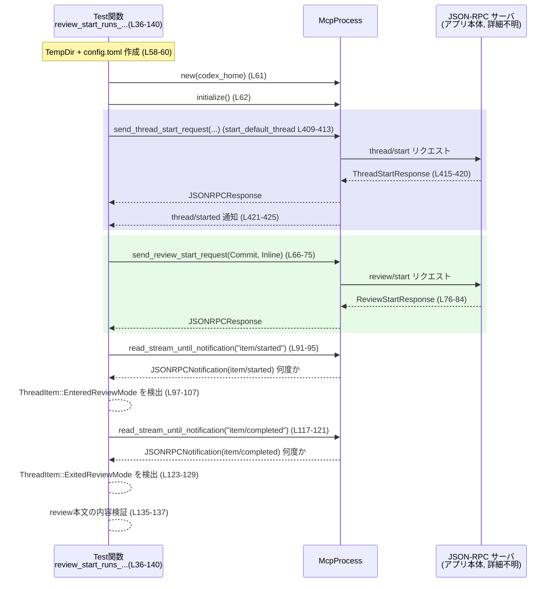

# app-server/tests/suite/v2/review.rs コード解説

## 0. ざっくり一言

v2 の「コードレビュー開始 (`review/start`)」フローについて、JSON-RPC ベースのやり取り・バリデーション・レビュー配信モードを検証する統合テスト群です。

---

## 1. このモジュールの役割

### 1.1 概要

- このファイルは **Review API v2 の振る舞いをエンドツーエンドで検証するテスト** を集約しています。
- 主な検証対象は以下です（根拠: `review.rs:L36-406` 付近）。
  - `review/start` によるレビューターン開始と、レビュー用 ThreadItem（Entered/ExitedReviewMode）の生成
  - コマンド実行レビュー承認フローと `item_id` の整合性
  - ReviewTarget パラメータ（BaseBranch / Commit / Custom instructions）の入力バリデーション
  - ReviewDelivery（Inline / Detached）の違いによるスレッド ID の挙動

### 1.2 アーキテクチャ内での位置づけ

このテストモジュールは、以下のコンポーネントを組み合わせて動作を検証します。

- `app_test_support::McpProcess`  
  JSON-RPC メッセージの送受信を抽象化したテスト用クライアント（定義はこのチャンクには現れませんが、`send_*_request` や `read_*` メソッドからそう解釈できます。根拠: `review.rs:L61-63, L408-417, L429-443`）。
- `create_mock_responses_server_*`  
  モデルプロバイダ役のモックサーバを起動し、`.uri()` を通じてエンドポイントを提供するユーティリティ（定義はこのチャンクには現れません。根拠: `review.rs:L56-59, L158-162, L230-233, L272-276, L338-341, L373-376`）。
- `codex_app_server_protocol::*`  
  JSON-RPC レイヤの型（`JSONRPCMessage`, `JSONRPCNotification`, `ServerRequest`, 各種 *Notification 型, `ReviewStartParams` など）を提供するプロトコル crate（定義はこのチャンクには現れませんが、型名から明らかです）。

テストの流れ（高レベル）は以下のようになります。

```mermaid
flowchart LR
    subgraph Test["このファイルのテストコード"]
        T1["tokio::test 関数群"]
        H1["start_default_thread (L408-427)"]
        H2["materialize_thread_rollout (L429-451)"]
        H3["create_config_toml* (L453-485)"]
    end

    subgraph Support["外部サポートコード（別 crate）"]
        M["McpProcess"]
        Srv["mock responses server"]
    end

    T1 --> H3
    H3 --> Srv
    T1 --> M
    H1 --> M
    H2 --> M

    M -->|"JSON-RPC\nrequest/notification"| "AppServer\n(詳細不明)"
    "AppServer\n(詳細不明)" --> M
```

> 図はこのチャンクのコード範囲 `review.rs:L36-485` を対象にしています。

### 1.3 設計上のポイント

- **非同期テスト**  
  すべて `#[tokio::test]` で定義されており、`async fn` を使って非同期 I/O を行います（根拠: `review.rs:L36, L142, L228, L264, L337, L372`）。
- **タイムアウトによる安全性**  
  JSON-RPC のレスポンス待ちには `tokio::time::timeout` を必ず挟み、ハングを防いでいます（根拠: `review.rs:L62, L76-80, L92-96, L118-122, L164-165, L178-182, L187-190, L199-203, L219-223, L235-236, L247-251, L278-279, L283-295, L311-312, L343-344, L356-360, L378-379, L391-394, L415-419, L422-425, L440-444, L446-448`）。
- **エラー処理の一貫性**  
  すべてのテスト関数は `anyhow::Result<()>` を返し、`?` / `??` によるエラー伝播でシンプルに記述されています。
- **ヘルパー関数による重複削減**  
  スレッド起動 (`start_default_thread`)、ロールアウトの実行 (`materialize_thread_rollout`)、`config.toml` の生成 (`create_config_toml*`) をヘルパー化し、各テストのシナリオ記述に集中しています（根拠: `review.rs:L408-485`）。
- **プロトコル契約を明示するアサーション**  
  - ThreadItem の variant（`EnteredReviewMode`, `ExitedReviewMode`, `CommandExecution`）や
  - エラーコード `-32600`, メッセージのサブストリング  
  などに対して明示的な `assert_eq!` / `assert!` を行い、プロトコルの契約をテストとして固定しています。

---

## 2. 主要な機能一覧

このファイルが提供する主なテストシナリオとヘルパー機能は次のとおりです。

- `review_start_runs_review_turn_and_emits_code_review_item`  
  : Inline delivery + Commit target のレビュー開始で、Entered/ExitedReviewMode アイテムとレビュー本文が正しく生成されることを検証（`review.rs:L36-140`）。
- `review_start_exec_approval_item_id_matches_command_execution_item`  
  : コマンド実行承認リクエストの `item_id` と、その後の `CommandExecution` アイテムの `id` が一致することを検証（`review.rs:L142-226`）。
- `review_start_rejects_empty_base_branch`  
  : BaseBranch ターゲットの `branch` が空白のみの場合に JSON-RPC エラー `-32600` が返ることを検証（`review.rs:L228-260`）。
- `review_start_with_detached_delivery_returns_new_thread_id`  
  : Detached delivery では新しい `review_thread_id` が払い出され、`thread/started` 通知の前にそのスレッドに対する `thread/status/changed` が来ないことを検証（`review.rs:L262-334`）。
- `review_start_rejects_empty_commit_sha`  
  : Commit ターゲットの `sha` が空白のみの場合のバリデーション（`review.rs:L336-369`）。
- `review_start_rejects_empty_custom_instructions`  
  : Custom ターゲットの `instructions` が空白のみの場合のバリデーション（`review.rs:L371-406`）。
- `start_default_thread`  
  : テスト用にデフォルト設定でスレッドを開始し、`thread.id` を返すヘルパー（`review.rs:L408-427`）。
- `materialize_thread_rollout`  
  : 指定スレッドで一度ターンを実行し、ロールアウト（初回セットアップ的な処理）を完了させるヘルパー（`review.rs:L429-451`）。
- `create_config_toml` / `create_config_toml_with_approval_policy`  
  : モックモデルプロバイダを指す `config.toml` を一時ディレクトリに生成するヘルパー（`review.rs:L453-485`）。

---

## 3. 公開 API と詳細解説

> このファイルはテスト用モジュールであり、ライブラリとして公開される API はありませんが、テストや他のモジュールから再利用される可能性のあるヘルパー関数について詳しく説明します。

### 3.1 型一覧（構造体・列挙体など）

このファイル内で独自に定義されている型（構造体・列挙体）はありません。  
利用している型はすべて外部 crate（`codex_app_server_protocol`, `app_test_support` など）からのインポートです。

（これらの型の定義はこのチャンクには現れません。）

### 3.2 関数詳細（主要 7 件）

#### `review_start_runs_review_turn_and_emits_code_review_item() -> Result<()>`

**概要**

- `ReviewTarget::Commit` + `ReviewDelivery::Inline` のレビュー開始フローを実行し、
  - メインスレッドで `EnteredReviewMode` アイテムが来ること
  - 同じターンで `ExitedReviewMode` アイテムとレビュー本文が来ること  
  を確認する統合テストです（根拠: `review.rs:L36-140`）。

**引数**

- 引数はありません（`#[tokio::test]` で直接実行されるテスト関数です）。

**戻り値**

- `anyhow::Result<()>`  
  - 成功時は `Ok(())`。  
  - 途中の I/O、JSON パース、タイムアウトなどでエラーが発生した場合は `Err(anyhow::Error)` としてテスト失敗になります。

**内部処理の流れ**

1. **レビュー結果のモックペイロード生成**  
   - `serde_json::json!` で findings を含むレビューオブジェクトを構築し、`to_string()` で JSON 文字列に変換（`review.rs:L38-55`）。
2. **モックサーバと設定ディレクトリの準備**  
   - `create_mock_responses_server_repeating_assistant(&review_payload)` でモックサーバを起動（`L56`）。
   - `TempDir` を作成し、そのパスに `create_config_toml` で `config.toml` を生成（`L58-60`）。
3. **McpProcess の初期化とスレッド作成**  
   - `McpProcess::new` と `mcp.initialize()` で JSON-RPC クライアントを初期化（`L61-62`）。
   - `start_default_thread` でデフォルトスレッドを開始し、`thread_id` を取得（`L64`）。
4. **ReviewStart リクエスト送信とレスポンス検証**  
   - `send_review_start_request` に `ReviewStartParams { thread_id, delivery: Inline, target: Commit { … } }` を渡す（`L66-75`）。
   - `read_stream_until_response_message` で該当リクエスト ID のレスポンスを待ち、`to_response::<ReviewStartResponse>` でデシリアライズ（`L76-84`）。
   - `review_thread_id == thread_id` と `turn.status == TurnStatus::InProgress` を確認（`L85-87`）。
5. **EnteredReviewMode 通知の検証**  
   - 最大 10 回 `item/started` 通知を読み、`ItemStartedNotification` にデコード（`L91-99`）。
   - `ThreadItem::EnteredReviewMode { id, review }` を見つけたら、`id == turn_id` とレビュータイトル文字列の一致を確認し、フラグを立ててループを抜ける（`L100-107`）。
   - 見つけられなければ `assert!` によりテスト失敗（`L109-112`）。
6. **ExitedReviewMode 通知とレビュー本文の検証**  
   - 同様に `item/completed` 通知を最大 10 回読み、`ItemCompletedNotification` にデコード（`L117-124`）。
   - `ThreadItem::ExitedReviewMode { id, review }` を見つけたら、ターン ID を確認しつつ `review_body` に格納（`L125-129`）。
   - 見つからない場合は `expect("did not observe a code review item")` がパニック（`L135`）。
   - レビュー本文が所定の文字列とファイル位置（`/tmp/file.rs:10-20`）を含むことを `assert!` で確認（`L136-137`）。

**Examples（使用例）**

この関数自体はテストランナーから直接呼び出されますが、同じパターンで別シナリオをテストする例は次のようになります。

```rust
#[tokio::test]
async fn review_start_for_another_commit() -> anyhow::Result<()> {
    // 1. レビュー結果ペイロードを用意
    let review_payload = serde_json::json!({ /* ... */ }).to_string();

    // 2. モックサーバ + config.toml 準備
    let server = create_mock_responses_server_repeating_assistant(&review_payload).await;
    let codex_home = tempfile::TempDir::new()?;
    create_config_toml(codex_home.path(), &server.uri())?;

    // 3. McpProcess 初期化 + デフォルトスレッド作成
    let mut mcp = McpProcess::new(codex_home.path()).await?;
    tokio::time::timeout(DEFAULT_READ_TIMEOUT, mcp.initialize()).await??;
    let thread_id = start_default_thread(&mut mcp).await?;

    // 4. ReviewStart を投げてレスポンスを確認
    let review_req = mcp
        .send_review_start_request(ReviewStartParams {
            thread_id: thread_id.clone(),
            delivery: Some(ReviewDelivery::Inline),
            target: ReviewTarget::Commit {
                sha: "deadbeef".to_string(),
                title: Some("Example".to_string()),
            },
        })
        .await?;
    let review_resp: JSONRPCResponse = tokio::time::timeout(
        DEFAULT_READ_TIMEOUT,
        mcp.read_stream_until_response_message(RequestId::Integer(review_req)),
    )
    .await??;
    let ReviewStartResponse { turn, review_thread_id } =
        to_response::<ReviewStartResponse>(review_resp)?;

    assert_eq!(review_thread_id, thread_id);
    assert_eq!(turn.status, TurnStatus::InProgress);

    // 5. 以降は、このファイルのテスト同様に item/started, item/completed を検証
    Ok(())
}
```

**Errors / Panics**

- `timeout(...).await??` により、以下の 2 種類のエラーが即座にテスト失敗になります。
  - 一定時間内にレスポンスがこない場合の `Elapsed`（タイムアウト）。
  - `McpProcess` や `to_response` 内部で発生する I/O / JSON パースなどのエラー。
- `expect("params must be present")` や `expect("did not observe a code review item")` が条件を満たさない場合、`panic!` を起こします（`review.rs:L98, L124, L135`）。

**Edge cases（エッジケース）**

- ストリームにノイズとなる他の `item/started` / `item/completed` が多く流れると、10 回のループで目的のアイテムに到達できずテストが失敗する可能性があります（`L91-108, L117-133`）。
- サーバが `EnteredReviewMode` / `ExitedReviewMode` を別スレッドで送ってしまうと ID の一致でテストが失敗します。

**使用上の注意点**

- このテストはプロトコルの契約をかなり厳密に固定します。サーバ実装側でレビュー関連のメッセージ仕様を変更する際には、このテストの更新が前提になります。
- `timeout` を変更する場合は、CI 環境でのレスポンス遅延も考慮する必要があります。

---

#### `review_start_exec_approval_item_id_matches_command_execution_item() -> Result<()>`

**概要**

- コマンド実行レビュー承認フローを検証するテストです。
- `CommandExecutionRequestApproval` リクエストの `params.item_id` と、後続の `CommandExecution` ThreadItem の `id` が一致していることを確認します（根拠: `review.rs:L142-226`）。

**引数・戻り値**

- 引数なし、戻り値は `anyhow::Result<()>`（エラー時はテスト失敗）です。

**内部処理の流れ**

1. **モックレスポンスの構築**  
   - `create_shell_command_sse_response` で `"git rev-parse HEAD"` を実行するコマンドレスポンスを作り、`item_id` として `"review-call-1"` を指定（`L145-155`）。
   - 続いて `create_final_assistant_message_sse_response("done")` を追加し、シーケンスサーバを起動（`L156-158`）。
2. **コンフィグと McpProcess セットアップ**  
   - `approval_policy` を `"untrusted"` にした `config.toml` を生成（`L160-162`）。
   - `McpProcess` を初期化し、デフォルトスレッドを開始（`L163-167`）。
3. **ReviewStart 実行とターン ID 取得**  
   - Commit ターゲットで `send_review_start_request` を送り、レスポンスから `Turn` を取り出して `turn_id` を取得（`L168-185`）。
4. **承認リクエストの受信と検証**  
   - `read_stream_until_request_message` でサーバからのリクエストを待ち、`ServerRequest::CommandExecutionRequestApproval { request_id, params }` にマッチすることを確認（`L186-193`）。
   - `params.item_id == "review-call-1"` と `params.turn_id == turn_id` を `assert_eq!` で検証（`L194-195`）。
5. **CommandExecution アイテムの検証**  
   - `item/started` 通知を最大 10 回読み、`ThreadItem::CommandExecution { id, .. }` を見つけるまでループ（`L197-210`）。
   - 見つけた `id` が `params.item_id` と一致することを確認（`L211-212`）。
6. **承認レスポンス送信とターン完了待ち**  
   - `mcp.send_response(request_id, json!({ "decision": ReviewDecision::Approved }))` で承認を返却（`L214-217`）。
   - `turn/completed` 通知を受信してテストを終了（`L219-223`）。

**Errors / Panics**

- `ServerRequest` が `CommandExecutionRequestApproval` 以外の variant の場合、`panic!("expected CommandExecutionRequestApproval request")` が発生します（`L191-193`）。
- 既定回数のループで `CommandExecution` アイテムを観測できなければ `expect("did not observe command execution item")` がパニックします（`L211`）。

**Edge cases**

- テストには `#[ignore = "TODO(owenlin0): flaky"]` が付いており、現時点でフレーク（不安定）であることが明示されています（`L143`）。
  - 原因はこのチャンクからは分かりませんが、通知の順序やタイミングに依存している可能性があります。

**使用上の注意点**

- Approval フローの仕様（`approval_policy` の解釈や `item_id` の生成方式）を変更する場合、このテストを変更しないと CI が失敗する可能性が高いです。
- モックレスポンスの `item_id` とサーバ側の生成ロジックの整合性が崩れないよう管理する必要があります。

---

#### `review_start_rejects_empty_base_branch() -> Result<()>`

**概要**

- `ReviewTarget::BaseBranch` の `branch` パラメータが空白のみの文字列だった場合、JSON-RPC エラーコード `-32600`（`INVALID_REQUEST_ERROR_CODE`）と適切なエラーメッセージが返ることを検証するテストです（`review.rs:L228-260`）。

**内部処理の流れ**

1. モックサーバと `config.toml` を生成し、`McpProcess` を初期化、スレッドを開始（`L230-237`）。
2. `ReviewStartParams` の `target` に `ReviewTarget::BaseBranch { branch: "   ".to_string() }` を指定してリクエスト送信（`L238-245`）。
3. `read_stream_until_error_message` でエラーレスポンスを待ち、`JSONRPCError` にデコード（`L247-251`）。
4. `error.error.code == INVALID_REQUEST_ERROR_CODE` を確認し、メッセージが `"branch must not be empty"` を含むかを検証（`L252-257`）。

**Errors / Panics / Edge cases**

- サーバが別のエラーコードやメッセージで返した場合は `assert_eq!` / `assert!` が失敗します。
- バリデーションルール（トリム方法など）が変更されると、このテストの前提も変更が必要です。

---

#### `review_start_with_detached_delivery_returns_new_thread_id() -> Result<()>`

**概要**

- `ReviewDelivery::Detached` を指定した場合にレビューが別スレッドで実行されること、およびそのスレッドに対しては `thread/started` 通知より先に `thread/status/changed` が送られないことを検証するテストです（`review.rs:L262-334`）。

**内部処理の流れ**

1. **モックサーバ・設定・スレッド準備**  
   - レビュー結果なし（`findings: []`）のペイロードで反復モックサーバを用意（`L265-272`）。
   - `create_config_toml` で設定を作成し、`McpProcess` を初期化（`L274-279`）。
   - `start_default_thread` でスレッドを作成し、続けて `materialize_thread_rollout` で「ロールアウト」を実行（`L280-281`）。
2. **Detached delivery で ReviewStart 実行**  
   - `delivery: Some(ReviewDelivery::Detached)` と `ReviewTarget::Custom { instructions: "detached review" }` を指定して `send_review_start_request`（`L283-290`）。
   - レスポンスから `turn` と `review_thread_id` を取得し、`turn.status == InProgress` と `review_thread_id != thread_id` を確認（`L297-305`）。
3. **通知の順序検証**  
   - `deadline = now + DEFAULT_READ_TIMEOUT` を設定し、残り時間を `saturating_duration_since` で算出しながら `read_next_message` をループ（`L308-312`）。
   - `JSONRPCMessage::Notification` のみ処理し、それ以外は無視（`L312-314`）。
   - `thread/status/changed`:
     - `ThreadStatusChangedNotification` へデコードし、
     - `status_changed.thread_id == review_thread_id` なら `anyhow::bail!` でエラー（`L315-322`）。
   - `thread/started`:
     - 最初に観測した `thread/started` 通知でループを抜ける（`L325-327`）。
4. **スレッド ID の一致確認**  
   - `ThreadStartedNotification` にデシリアライズし、`started.thread.id == review_thread_id` を確認（`L329-331`）。

**言語レベルの安全性・並行性ポイント**

- `tokio::time::Instant::now()` と `saturating_duration_since` を用いて、`deadline` を超えた場合でも負の `Duration` が発生しないようにしています（`L308-311`）。
- `timeout(remaining, mcp.read_next_message())` によって、ループ内でもタイムアウトをかけ続け、テストがハングしないようにしています。

**Edge cases**

- 他スレッドの `thread/status/changed` が大量に届いた場合でも、対象 `review_thread_id` に対するものがなければループが継続しますが、`deadline` 超過でテストがタイムアウト失敗します。
- サーバ側仕様として、Detached スレッドを `thread/status/changed` から通知するように変えた場合、このテストは明確に失敗するように設計されています。

---

#### `start_default_thread(mcp: &mut McpProcess) -> Result<String>`

**概要**

- テストで頻繁に使われる「標準設定のスレッドを 1 本作成し、その `thread.id` を返す」ヘルパー関数です（`review.rs:L408-427`）。

**引数**

| 引数名 | 型                | 説明 |
|--------|-------------------|------|
| `mcp`  | `&mut McpProcess` | JSON-RPC 接続済みのクライアント。ライフタイム中にスレッドを開始する対象です。 |

**戻り値**

- `Result<String>`  
  成功時は新規スレッドの ID を文字列で返します。エラー時は `anyhow::Error` にラップされます。

**内部処理の流れ**

1. `mcp.send_thread_start_request(ThreadStartParams { model: Some("mock-model".to_string()), ..Default::default() })` を呼び出し、リクエスト ID を取得（`L409-413`）。
2. `read_stream_until_response_message` で該当リクエスト ID のレスポンスを待ち、`JSONRPCResponse` を受信（`L415-419`）。
3. `to_response::<ThreadStartResponse>` によりレスポンスを `ThreadStartResponse` に変換し、`thread.id` を取り出す（`L420`）。
4. `thread/started` 通知を `read_stream_until_notification_message("thread/started")` で受信し（内容は使わない）、開始完了を確認（`L421-425`）。
5. `thread.id` を `Ok(thread.id)` として返却（`L426`）。

**Edge cases / 使用上の注意点**

- このヘルパーは `model: "mock-model"` 固定でスレッドを作成します。別モデルでのテストが必要な場合はパラメータ拡張が必要です。
- `McpProcess` を共有する複数タスクから同時に呼ぶと、メッセージの読み取り順序が競合する恐れがあります。このファイル内では単一タスクからのみ呼び出されています。

---

#### `materialize_thread_rollout(mcp: &mut McpProcess, thread_id: &str) -> Result<()>`

**概要**

- 特定スレッド上で 1 度ターンを実行し、`turn/completed` 通知が来るまで待機するヘルパーです（`review.rs:L429-451`）。
- テスト文脈では、Detached review を開始する前にスレッドへの初期メッセージを「ロールアウト」させる目的で使用されています（`L280-281`）。

**引数**

| 引数名     | 型                | 説明 |
|------------|-------------------|------|
| `mcp`      | `&mut McpProcess` | ターンを送信するクライアント |
| `thread_id`| `&str`            | ターンを実行する対象スレッド ID |

**戻り値**

- `Result<()>`（成功時は `Ok(())`）。

**内部処理の流れ**

1. `send_turn_start_request(TurnStartParams { thread_id: thread_id.to_string(), input: vec![V2UserInput::Text { text: "materialize rollout".to_string(), text_elements: Vec::new() }], ..Default::default() })` を送信し、リクエスト ID を取得（`L430-437`）。
2. `read_stream_until_response_message` でターン開始レスポンスを待つ（`L440-444`）。
3. `read_stream_until_notification_message("turn/completed")` で該当スレッドのターン完了通知を待つ（`L445-448`）。
4. すべて成功したら `Ok(())` を返す（`L450`）。

**Edge cases / 使用上の注意点**

- テキスト `"materialize rollout"` はハードコードされています。サーバ側の意味解釈はこのチャンクには現れません。
- この関数も `timeout` を用いるため、遅延しすぎるレスポンスはテスト失敗になります。

---

#### `create_config_toml_with_approval_policy(codex_home: &Path, server_uri: &str, approval_policy: &str) -> std::io::Result<()>`

**概要**

- 一時ディレクトリに `config.toml` を生成するヘルパーです。
- モデルプロバイダのベース URL とコマンド実行の `approval_policy` を埋め込んだ設定を作成します（`review.rs:L457-485`）。

**引数**

| 引数名          | 型                          | 説明 |
|-----------------|-----------------------------|------|
| `codex_home`    | `&std::path::Path`          | `config.toml` を出力するベースディレクトリ |
| `server_uri`    | `&str`                      | モックサーバの URI（`create_mock_responses_server_*` から取得） |
| `approval_policy` | `&str`                    | 承認ポリシー (`"never"`, `"untrusted"` などをテストでは使用) |

**戻り値**

- `std::io::Result<()>`  
  ファイル書き込みに失敗した場合のみ `Err(std::io::Error)` になります。

**内部処理の流れ**

1. `codex_home.join("config.toml")` でファイルパスを作成（`L462`）。
2. `format!` で TOML 文字列を構築し、以下のような設定を生成（`L464-482`）。
   - `model = "mock-model"`
   - `approval_policy = "{approval_policy}"`
   - `sandbox_mode = "read-only"`
   - `model_provider = "mock_provider"`
   - `[features] shell_snapshot = false`
   - `[model_providers.mock_provider]` セクションで `base_url = "{server_uri}/v1"`, `wire_api = "responses"`, リトライ設定など。
3. `std::fs::write(config_toml, ...)` でファイルに書き込み（`L463-484`）。

**使用上の注意点**

- セキュリティ観点では、`sandbox_mode = "read-only"` と `shell_snapshot = false` により、副作用の大きい操作が抑制される構成になっています。
- テスト側で `approval_policy` の値を変えることで、コマンド実行承認フローの挙動（即時実行 / 要承認 / 常に拒否など）を切り替える前提になっています。

---

### 3.3 その他の関数

以下は主に同一パターンのバリデーションテストであり、構造が類似しているため、一覧のみ掲載します。

| 関数名 | 役割（1 行） | 根拠行番号（概算） |
|--------|--------------|--------------------|
| `review_start_rejects_empty_commit_sha` | Commit ターゲットの `sha` が空白のみのとき `-32600` と `"sha must not be empty"` が返ることを検証 | `review.rs:L336-369` |
| `review_start_rejects_empty_custom_instructions` | Custom ターゲットの `instructions` が空白のみのとき `-32600` と `"instructions must not be empty"` が返ることを検証 | `review.rs:L371-406` |
| `create_config_toml` | `approval_policy = "never"` を設定して `create_config_toml_with_approval_policy` を呼ぶ薄いラッパー | `review.rs:L453-455` |

---

## 4. データフロー

### 4.1 代表シナリオ: Inline Commit Review

`review_start_runs_review_turn_and_emits_code_review_item` におけるデータフローをシーケンス図で示します。



> 図は `review_start_runs_review_turn_and_emits_code_review_item` の処理（`review.rs:L36-140`）を対象にしています。

ポイント:

- McpProcess は JSON-RPC レイヤを隠蔽し、テストコードは「リクエスト送信」と「条件に合うメッセージが来るまで待つ」操作に集中しています。
- `item/started` / `item/completed` 通知から `ThreadItem` variant を選別することで、レビュー関連のイベントのみを検証対象としています。

---

## 5. 使い方（How to Use）

### 5.1 基本的な使用方法

このファイルはテストモジュールですが、**新しいレビュー関連テストを追加する場合の基本パターン**は以下のようになります。

```rust
#[tokio::test]
async fn my_new_review_test() -> anyhow::Result<()> {
    // 1. モックサーバ起動
    let review_payload = serde_json::json!({ /* レビュー結果 */ }).to_string();
    let server = create_mock_responses_server_repeating_assistant(&review_payload).await;

    // 2. 一時ディレクトリに config.toml を生成
    let codex_home = tempfile::TempDir::new()?;
    create_config_toml(codex_home.path(), &server.uri())?;

    // 3. McpProcess 初期化
    let mut mcp = McpProcess::new(codex_home.path()).await?;
    tokio::time::timeout(DEFAULT_READ_TIMEOUT, mcp.initialize()).await??;

    // 4. デフォルトスレッド起動
    let thread_id = start_default_thread(&mut mcp).await?;

    // 5. review/start を送って挙動を検証
    //    （この部分はテストごとに書き換える）
    let review_req = mcp
        .send_review_start_request(ReviewStartParams {
            thread_id,
            delivery: Some(ReviewDelivery::Inline),
            target: ReviewTarget::Commit { /* ... */ },
        })
        .await?;

    // 6. レスポンス / 通知を read_* メソッドで受け取り、assert で契約を確認
    // ...

    Ok(())
}
```

### 5.2 よくある使用パターン

- **Inline レビュー vs Detached レビュー**
  - Inline: `delivery: Some(ReviewDelivery::Inline)` とし、`review_thread_id == thread_id` を期待（`L66-75, L81-87`）。
  - Detached: `delivery: Some(ReviewDelivery::Detached)` とし、`review_thread_id != thread_id` を期待しつつ、新スレッドの `thread/started` まで追跡（`L283-305, L308-331`）。
- **ターゲットの種類**
  - `ReviewTarget::Commit`: SHA とタイトルによるコミット単位レビュー（`L70-73, L172-175, L350-353`）。
  - `ReviewTarget::BaseBranch`: ベースブランチ名を指定（`L242-244`）。
  - `ReviewTarget::Custom`: 任意インストラクションによる自由形式レビュー（`L287-289, L385-387`）。

### 5.3 よくある間違い

```rust
// 間違い例: McpProcess を初期化せずにリクエストを送る
let mut mcp = McpProcess::new(codex_home.path()).await?;
// let thread_id = start_default_thread(&mut mcp).await?; // initialize を呼んでいない

// 正しい例: initialize を通じて接続を確立してからスレッドやレビューを開始
let mut mcp = McpProcess::new(codex_home.path()).await?;
tokio::time::timeout(DEFAULT_READ_TIMEOUT, mcp.initialize()).await??;
let thread_id = start_default_thread(&mut mcp).await?;
```

```rust
// 間違い例: タイムアウトをかけずにメッセージを待つ（ハングの危険）
let resp = mcp.read_stream_until_response_message(RequestId::Integer(req_id)).await?;

// 正しい例: timeout を使ってハングを防止
let resp: JSONRPCResponse = tokio::time::timeout(
    DEFAULT_READ_TIMEOUT,
    mcp.read_stream_until_response_message(RequestId::Integer(req_id)),
)
.await??;
```

### 5.4 使用上の注意点（まとめ）

- すべての I/O 待機には `timeout` を使用することで、テストが無限にハングしないように設計されています。
- `McpProcess` のメッセージ読み取りメソッド（`read_stream_until_*`, `read_next_message`）は、通常 1 箇所からのみ呼び出すようにし、複数タスクから並行して読む形にはしないほうが安全です（このファイルでもそうなっています）。
- JSON-RPC エラーコード `-32600` やエラーメッセージの部分文字列に依存しているため、プロトコル仕様の変更時はテストの更新が必須です。

---

## 6. 変更の仕方（How to Modify）

### 6.1 新しい機能を追加する場合（新しいレビューシナリオのテスト）

1. **どの種類の ReviewTarget / ReviewDelivery をテストしたいかを決める。**
2. このファイルに新しい `#[tokio::test]` を追加し、
   - `create_mock_responses_server_*`
   - `create_config_toml` または `create_config_toml_with_approval_policy`
   - `start_default_thread`（必要なら `materialize_thread_rollout`）  
   を使って初期化処理をコピーします。
3. `send_review_start_request` のパラメータを新仕様に合わせて構成し、
   - レスポンス (`ReviewStartResponse`)
   - 必要な通知（`item/started`, `item/completed`, `thread/started`, `thread/status/changed` など）  
   に対する期待値を `assert!` / `assert_eq!` で記述します。
4. コマンド実行や承認フローを含む場合は、`review_start_exec_approval_item_id_matches_command_execution_item` を参考に、`ServerRequest` から期待する variant を取り出して検証します。

### 6.2 既存の機能を変更する場合（プロトコル仕様変更など）

- **影響範囲の確認**
  - レビューターン開始 (`ReviewStartParams`, `ReviewStartResponse`) に関する変更 → このファイル内の全テストを検索（`review_start_` プレフィクス）。
  - ThreadItem 構造の変更 → `ThreadItem::EnteredReviewMode`, `ExitedReviewMode`, `CommandExecution` に対するパターンマッチ部分（`L100-107, L125-132, L206-207`）を確認。
  - エラーコードやエラーメッセージの変更 → バリデーションテスト部分（`L252-257, L361-366, L395-403`）を更新。
- **契約の維持**
  - テストはプロトコルの「契約（Contract）」を表現しているため、仕様変更の意図に合わせてテストの期待値も必ず更新します。
- **関連テスト・使用箇所の再確認**
  - 他のテストスイート（`tests/suite/v2` 内の他ファイルなど。パスはこのチャンクには現れません）にも同様のパターンが存在する可能性があるため、類似ファイルを検索して整合性を確認する必要があります。

---

## 7. 関連ファイル

このモジュールと密接に関係する型やモジュールは次のとおりです（ただし定義はこのチャンクには現れません）。

| パス / モジュール | 役割 / 関係 |
|-------------------|------------|
| `app_test_support::McpProcess` | JSON-RPC ベースのアプリケーションサーバと通信するテスト用クライアント。`send_*_request` や `read_*` メソッドを通じてレビュー API とのやり取りを抽象化しています（定義は別ファイル）。 |
| `app_test_support::create_mock_responses_server_repeating_assistant` | アシスタントレスポンスを繰り返し返すモックサーバを起動するユーティリティ（`uri()` を通じてベース URL を提供）。 |
| `app_test_support::create_mock_responses_server_sequence` | 一連のモック SSE レスポンスを順番に返すサーバを起動するユーティリティ。承認フローのテストなどで使用。 |
| `app_test_support::create_shell_command_sse_response` / `create_final_assistant_message_sse_response` | モックサーバに渡す SSE レスポンスオブジェクトを作成するヘルパー。 |
| `codex_app_server_protocol` crate | `JSONRPCMessage`, `JSONRPCNotification`, `ThreadItem`, `ReviewStartParams`, `ReviewStartResponse`, `ThreadStartParams`, `ThreadStartResponse` など、テストで利用するプロトコル型を定義する crate。 |
| `codex_protocol::protocol::ReviewDecision` | コマンド実行レビューの決定（`Approved` など）を表す型。承認レスポンスの JSON 生成に使用。 |

> これらの型・関数の具体的な実装や追加の挙動は、このチャンクのコードからは分かりません。そのため、本レポートでは名前と使用箇所から読み取れる範囲に限定して説明しています。
