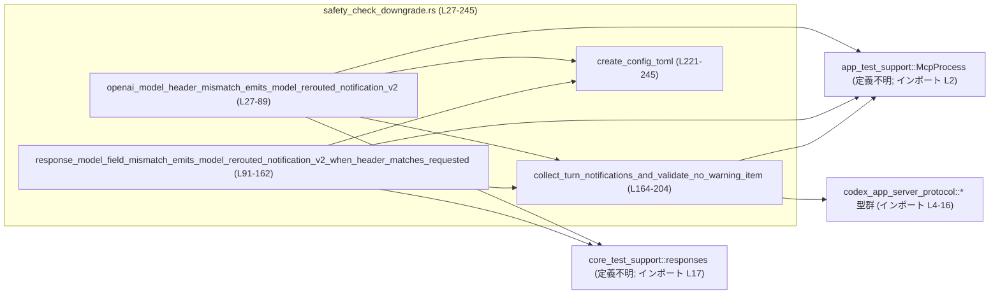
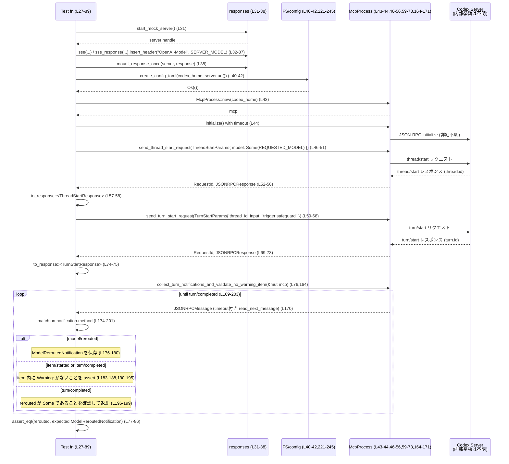

# app-server/tests/suite/v2/safety_check_downgrade.rs

## 0. ざっくり一言

OpenAI 互換のモックサーバーと `McpProcess` を使い、**要求モデルと実際に使われたモデルが異なる場合に「model/rerouted」通知が送られ、かつユーザー向けの Warning メッセージが生成されないこと**を検証するテストモジュールです。（safety_check_downgrade.rs:L27-89, L91-162, L164-204）

---

## 1. このモジュールの役割

### 1.1 概要

- このモジュールは、アプリケーションサーバーが外部モデルプロバイダを呼び出す際に、**高リスクなモデル利用を検知して安全なモデルへダウングレード（リルート）する挙動**をテストします。（L23-25, L27-89, L91-162）
- 具体的には、HTTP ヘッダや SSE レスポンス内の `OpenAI-Model` 情報と、クライアントが要求したモデル名が一致しないケースで
  - `model/rerouted` JSON-RPC 通知が送られること
  - その通知の内容（from/to モデル・理由）が期待どおりであること
  - どの `ThreadItem` にも「Warning: 」から始まるユーザーメッセージが含まれないこと  
  を検証します。（L76-86, L149-158, L164-204, L206-219）

### 1.2 アーキテクチャ内での位置づけ

このテストは、次のコンポーネント間の連携を検証します。

- `core_test_support::responses`：HTTP モックサーバーと SSE レスポンスを生成（L31-38, L96-111）
- `create_config_toml`：一時ディレクトリに Codex の設定ファイルを生成（L40-42, L113-115, L221-245）
- `McpProcess`：Codex アプリサーバープロセスを起動し、JSON-RPC でやり取りするテスト用ラッパー（L43-44, L116-118, L164-171）  
  ※ 型定義はこのチャンクには現れません。
- `collect_turn_notifications_and_validate_no_warning_item`：`McpProcess` から JSON-RPC 通知を読み出し、`model/rerouted` と Warning メッセージ非存在を検証（L164-204）

これらの関係を Mermaid で表すと次のようになります。



### 1.3 設計上のポイント

- **非同期テスト + タイムアウト**  
  - `#[tokio::test]` によりテスト自体が非同期に実行されます。（L27, L91）
  - 主要な I/O 操作には `tokio::time::timeout` を掛け、ハングを防止しています。（L44, L52-56, L69-73, L117-118, L125-129, L142-146, L170）
- **明示的な JSON-RPC 検証**  
  - `JSONRPCMessage::Notification` にパターンマッチし、メソッド名ごとに処理を分岐しています。（L171-201）
- **安全性要件のテスト**  
  - モデルリルートが行われた際に、ユーザー向けメッセージとして「Warning: ...」が送られないことを `ThreadItem` の内容でチェックしています。（L176-187, L189-195, L206-219）
- **設定の明示**  
  - 一時ディレクトリに `config.toml` を書き出し、モデル名やモックプロバイダの URL、リトライ回数などをテスト専用に固定しています。（L221-245）

---

## 2. 主要な機能一覧（コンポーネントインベントリー込み）

### 2.1 内部コンポーネント（このファイル内で定義）

| 名前 | 種別 | 役割 / 用途 | 定義位置 |
|------|------|-------------|----------|
| `DEFAULT_READ_TIMEOUT` | 定数 | JSON-RPC 読み取りタイムアウト（10 秒） | L23 |
| `REQUESTED_MODEL` | 定数 | クライアントが要求するモデル名 `"gpt-5.1-codex-max"` | L24 |
| `SERVER_MODEL` | 定数 | モックサーバーが返すモデル名 `"gpt-5.2-codex"` | L25 |
| `openai_model_header_mismatch_emits_model_rerouted_notification_v2` | async テスト関数 | HTTP ヘッダのモデル名不一致時のリルート通知と Warning 非生成を検証 | L27-89 |
| `response_model_field_mismatch_emits_model_rerouted_notification_v2_when_header_matches_requested` | async テスト関数 | HTTP ヘッダは一致だが SSE 内のモデル名が不一致な場合の挙動を検証 | L91-162 |
| `collect_turn_notifications_and_validate_no_warning_item` | async 関数 | JSON-RPC 通知ストリームから `model/rerouted` を取得しつつ Warning メッセージが無いことを検証 | L164-204 |
| `warning_text_from_item` | 関数 | `ThreadItem` が「Warning: 」で始まるユーザーメッセージを含むかを抽出 | L206-215 |
| `is_warning_user_message_item` | 関数 | `ThreadItem` が Warning メッセージを含むかの真偽値判定 | L217-219 |
| `create_config_toml` | 関数 | 一時ディレクトリに Codex 用 `config.toml` を生成 | L221-245 |

### 2.2 外部コンポーネント（インポートされるが定義は不明）

| 名前 / モジュール | 種別 | このモジュール内での役割 | 根拠 |
|-------------------|------|--------------------------|------|
| `app_test_support::McpProcess` | 構造体（と推測） | Codex アプリサーバープロセスと JSON-RPC で通信するテスト用クライアント | 生成とメソッド呼び出し（L43-44, L116-118, L46-51, L52-56, L59-68, L69-73, L119-124, L125-129, L132-141, L142-146, L170） |
| `core_test_support::responses` | モジュール | モック HTTP サーバーの起動と SSE イベント・レスポンス生成 | L31-38, L96-111 |
| `core_test_support::skip_if_no_network` | マクロ | ネットワーク未利用環境でテストをスキップ | L29, L94 |
| `codex_app_server_protocol::*` 型群 | 構造体 / enum | JSON-RPC のリクエスト ID, レスポンス, 通知ペイロード (`ThreadItem`, `TurnStartResponse`, etc.) | インポート (L4-16) と利用 (L52-58, L69-75, L125-131, L142-147, L176-180, L186-187, L193-194, L206-215) |

---

## 3. 公開 API と詳細解説

このファイル自体はテストモジュールであり「公開 API」は定義していませんが、**テストから見た主要関数**を API 的に整理します。

### 3.1 型一覧（このファイルに定義はないが重要な外部型）

| 名前 | 種別 | 役割 / 用途 | このファイル内での利用位置 |
|------|------|-------------|-----------------------------|
| `McpProcess` | 構造体（外部） | Codex サーバーとの JSON-RPC 通信をカプセル化したテスト用クライアント | L43-44, L46-56, L59-73, L116-118, L119-129, L132-146, L164-171 |
| `ThreadStartParams` | 構造体 | スレッド開始リクエストのパラメータ（モデル名を含む） | L46-50, L120-123 |
| `ThreadStartResponse` | 構造体 | スレッド開始レスポンス（`thread.id` を取り出すために使用） | L57-58, L130 |
| `TurnStartParams` | 構造体 | ターン開始リクエストのパラメータ（`thread_id` と入力テキスト） | L59-67, L133-140 |
| `TurnStartResponse` | 構造体 | ターン開始レスポンス（`turn.id` を取り出すために使用） | L74-75, L147 |
| `ThreadItem` | enum | スレッド内のアイテム。ユーザーメッセージかどうかを判定する対象 | L11, L176-187, L189-195, L206-215, L217-219 |
| `ModelReroutedNotification` | 構造体 | `model/rerouted` 通知のペイロード。from/to モデルなどを保持 | L9, L76-86, L149-158, L176-180 |
| `ModelRerouteReason` | enum | リルート理由 (`HighRiskCyberActivity` など) | L8, L84-85, L157-158 |
| `ItemStartedNotification` / `ItemCompletedNotification` | 構造体 | `item/started` / `item/completed` 通知のペイロード | L4-5, L186-187, L193-194 |
| `UserInput` | enum | ユーザーからの入力。`Text` バリアントで警告文字列を検査 | L16, L62-65, L136-138, L211-213 |
| `JSONRPCMessage` / `JSONRPCResponse` / `RequestId` | enum / 構造体 | JSON-RPC メッセージとレスポンス、ID の表現 | L6-7, L10, L52-56, L69-73, L125-129, L142-146, L170-173 |

> これらの型の具体的なフィールド構造は、このチャンクには現れません。

---

### 3.2 関数詳細

#### `openai_model_header_mismatch_emits_model_rerouted_notification_v2() -> Result<()>`

**概要**

HTTP レスポンスヘッダの `OpenAI-Model` がサーバー側モデル (`SERVER_MODEL`) を示し、設定された要求モデル (`REQUESTED_MODEL`) と異なる場合に、`model/rerouted` 通知が送出され、かつ Warning メッセージが発生しないことを検証する非同期テストです。（L27-25）

**引数**

- なし（`#[tokio::test]` によりテストランナーから呼ばれます）。（L27-28）

**戻り値**

- `anyhow::Result<()>`：  
  - `Ok(())`：テストがすべてのアサーションを満たして終了  
  - `Err(_)`：途中で I/O エラー・タイムアウト・パースエラーなどが発生しテスト失敗（L28, L40-44, L52-56, L69-73, L76, L88）

**内部処理の流れ**

1. ネットワークが利用不可ならテストをスキップ（`skip_if_no_network!` マクロ）。（L29）
2. モックサーバーを起動し、SSE ボディに `response.created` / `assistant_message` / `completed` のイベント列を設定。（L31-36）
3. HTTP レスポンスのヘッダ `OpenAI-Model` に `SERVER_MODEL` を設定し、モックに一度だけマウント。（L37-38）
4. 一時ディレクトリを作成し、その中に `create_config_toml` で設定ファイルを生成。（L40-42）
5. `McpProcess` を起動し、`initialize` をタイムアウト付きで完了。（L43-44）
6. `ThreadStartParams` に `model: Some(REQUESTED_MODEL.to_string())` を指定してスレッド開始リクエストを送り、レスポンスから `thread.id` を取り出す。（L46-58）
7. `TurnStartParams` にスレッド ID と `"trigger safeguard"` というテキスト入力を指定してターン開始リクエストを送り、レスポンスから `turn.id` を取得。（L59-75）
8. `collect_turn_notifications_and_validate_no_warning_item` を呼び出し、`model/rerouted` 通知を取得しつつ Warning メッセージがないことを検証。（L76）
9. 取得した `ModelReroutedNotification` が、期待される `thread_id` / `turn_id` / `from_model` / `to_model` / `reason` と一致するか `assert_eq!` で検証。（L77-86）

**Errors / Panics**

- `?` により伝播するエラー（テスト失敗になるもの）:
  - 一時ディレクトリ作成失敗（L40）
  - `create_config_toml` の I/O エラー（L41）
  - `McpProcess::new` 失敗（L43）
  - `timeout` によるタイムアウト（`Elapsed`）や `initialize` 自体のエラー（L44）
  - スレッド / ターン開始の送信やレスポンス待ちのエラー・タイムアウト（L46-56, L59-73）
  - JSON-RPC レスポンスを `ThreadStartResponse` / `TurnStartResponse` にパースできない場合（L57-58, L74-75）
  - `collect_turn_notifications_and_validate_no_warning_item` 内のエラー（L76, L164-204）
- パニックの可能性:
  - `assert_eq!` が失敗した場合（期待する通知内容と実際が異なる）（L77-86）

**Edge cases（エッジケース）**

- モックサーバーが期待どおりの SSE を送らない場合：
  - `collect_turn_notifications_and_validate_no_warning_item` が `model/rerouted` を受け取れず、`turn/completed` までに `rerouted` が `Some` にならないと、`anyhow!` でエラーとなりテストが失敗します。（L176-181, L196-199）
- Codex サーバー側が Warning メッセージを生成した場合：
  - `item/started` または `item/completed` に含まれる `ThreadItem` が `Warning:` で始まるユーザーメッセージを含んでいれば `assert!` が失敗しテストがパニックします。（L186-187, L193-195, L206-219）

**使用上の注意点**

- `DEFAULT_READ_TIMEOUT` は 10 秒で固定されているため、環境によってはタイムアウトがテストの不安定要因になり得ます。（L23, L44, L52-56, L69-73）
- `REQUESTED_MODEL` / `SERVER_MODEL` は定数であるため、他のモデル名でテストしたい場合はコード変更が必要です。（L24-25）
- `skip_if_no_network!` によりネットワークを必要とすることが明示されていますが、モックサーバーがローカルで動いているため、実際に外部ネットワークが必要かどうかはこのチャンクだけでは判断できません。（L29, L31）

---

#### `response_model_field_mismatch_emits_model_rerouted_notification_v2_when_header_matches_requested() -> Result<()>`

**概要**

HTTP レスポンスヘッダの `OpenAI-Model` は要求モデルと一致しているが、SSE ボディ内の `response.created` イベントに含まれる `headers.OpenAI-Model` が異なる (`SERVER_MODEL`) 場合でも、リルート通知が発生し Warning メッセージが生成されないことを検証する非同期テストです。（L91-162, L96-111）

**引数**

- なし（`#[tokio::test]`）。（L91-93）

**戻り値**

- `anyhow::Result<()>`（前述テストと同様の意味）。（L93）

**内部処理の流れ**

前のテストと同様ですが、SSE ボディの構造が異なります。

1. `skip_if_no_network!` でネットワーク未利用環境をスキップ。（L94）
2. モックサーバーを起動し、SSE ボディとして `serde_json::json!` で `response.created` イベントを明示的に構成。その `response.headers.OpenAI-Model` に `SERVER_MODEL` を設定。（L96-106）
3. HTTP レスポンスヘッダ `OpenAI-Model` には `REQUESTED_MODEL` を設定し、モックをマウント。（L110-111）
4. 以下は 1 つ目のテストと同じく、設定ファイル生成・`McpProcess` 初期化・スレッド／ターン開始・通知収集・アサーションを行います。（L113-161）

**Errors / Panics・Edge cases**

- エラー／パニック条件は 1 つ目のテストと同様です。（L113-161）
- 追加のエッジケース:
  - もしサーバーが `response.created` を送らない、または JSON フォーマットが異なる場合、Codex サーバー側の実装次第ではテストがタイムアウトやパースエラーで失敗する可能性がありますが、このチャンクだけではその詳細は分かりません。（L96-109）

---

#### `collect_turn_notifications_and_validate_no_warning_item(mcp: &mut McpProcess) -> Result<ModelReroutedNotification>`

**概要**

`McpProcess` から JSON-RPC メッセージを順次読み取り、以下を行った上で `ModelReroutedNotification` を返すユーティリティ関数です。（L164-204）

- `model/rerouted` 通知を記録
- `item/started` / `item/completed` 通知に含まれる `ThreadItem` に Warning ユーザーメッセージが含まれないことを検証
- `turn/completed` を受け取った時点で、先に `model/rerouted` を受け取っていることをチェックし、それを返却

**引数**

| 引数名 | 型 | 説明 |
|--------|----|------|
| `mcp` | `&mut McpProcess` | Codex サーバーとの JSON-RPC メッセージストリームにアクセスするためのミュータブル参照 | L165-166 |

**戻り値**

- `Result<ModelReroutedNotification>`  
  - `Ok(ModelReroutedNotification)`：`model/rerouted` を 1 回以上受信し、`turn/completed` 到達前に記録できた場合に、その最後に受信したものを返す。（L167-181, L196-200）
  - `Err(_)`：メッセージ読み取りのタイムアウトや I/O エラー、通知パラメータ欠如、JSON パースエラー、`turn/completed` 前に `model/rerouted` を受け取れなかった場合など。（L170-171, L176-180, L183-185, L189-193, L196-199）

**内部処理の流れ**

1. `rerouted` を `None` で初期化。（L167）
2. 無限ループで以下を繰り返す。（L169-203）
3. `timeout(DEFAULT_READ_TIMEOUT, mcp.read_next_message()).await??` でメッセージを 1 件読み込む。  
   - 外側の `?`：タイムアウトや I/O エラー  
   - 内側の `?`：`read_next_message` 自体のエラー（L170）
4. `JSONRPCMessage::Notification(notification)` のみを対象とし、それ以外は `continue`。（L171-173）
5. `notification.method.as_str()` に応じて分岐。（L174-201）
   - `"model/rerouted"`：  
     - `params` がなければ `anyhow!` でエラー。（L176-178）  
     - `serde_json::from_value` で `ModelReroutedNotification` にデシリアライズし、`rerouted` に保存。（L179-180）
   - `"item/started"` / `"item/completed"`：  
     - 同様に `params` を取り出し、それぞれ `ItemStartedNotification` / `ItemCompletedNotification` にパース。（L183-187, L190-194）  
     - `payload.item` に対して `is_warning_user_message_item` を呼び出し、`false` であることを `assert!` する。（L187-188, L194-195）
   - `"turn/completed"`：  
     - これまでに記録された `rerouted` を `ok_or_else` で取り出し、`Some` でなければエラー。（L196-199）  
     - `Ok(payload)` として関数から返却。（L196-200）
   - その他のメソッド名：何もせず次のメッセージへ。（L201）

**並行性・Rust 特有の安全性**

- `mcp` へのアクセスは `&mut McpProcess` として単一スレッド上で直列に行われており、**同時に複数タスクから `read_next_message` を呼ぶような競合は防がれています**。（L165-166, L170）
- `timeout` により各読み出しは 10 秒で打ち切られるため、バックエンドが応答しない場合にもテスト全体がハングしない設計になっています。（L23, L170）
- エラーはすべて `Result` によって明示的に扱われ、`?` により呼び出し元に伝播します。例外機構は使っていません。（Rust のエラーハンドリング方針に沿った実装）

**Errors / Panics**

- `Err` を返すケース:
  - `timeout` によるタイムアウト、あるいは `read_next_message` の I/O／プロトコルエラー。（L170）
  - 各通知で `params` が `None` の場合（`anyhow!`）。（L176-178, L183-185, L190-192）
  - `serde_json::from_value` によるデシリアライズ失敗。（L179-180, L186-187, L193-194）
  - `turn/completed` 到達までに `model/rerouted` が一度も来なかった場合。（L196-199）
- パニック:
  - Warning メッセージが検出された場合の `assert!` 失敗。（L187-188, L194-195）

**Edge cases**

- `model/rerouted` が複数回送られた場合：
  - `rerouted` は最後に受信した値で上書きされます。（L176-181）  
    テスト上は 1 回を期待していると考えられますが、明示的なカウントや検証は行っていません。
- `turn/completed` が決して送られない場合：
  - ループは `timeout` によりエラーで終了し、`Err` を返します。（L170）

**使用上の注意点**

- この関数は **`model/rerouted` が必ず turn 完了前に来る** というプロトコル契約に依存しています。この前提を変えるとテストが失敗するため、プロトコル変更時には併せて更新が必要です。（L176-181, L196-199）
- `is_warning_user_message_item` の判定は「`ThreadItem::UserMessage` かつ `UserInput::Text` で `text` が `"Warning: "` から始まる」場合のみを Warning とみなします。そのほかの形式の警告表現（別のプレフィックス、別バリアント）は検出されません。（L206-215）

---

#### `warning_text_from_item(item: &ThreadItem) -> Option<&str>`

**概要**

`ThreadItem` がユーザーメッセージであり、その中に「`Warning:`」で始まるテキスト入力が含まれている場合、その文字列スライスを返します。（L206-215）

**引数**

| 引数名 | 型 | 説明 |
|--------|----|------|
| `item` | `&ThreadItem` | 判定対象のスレッドアイテム | L206-207 |

**戻り値**

- `Some(&str)`：Warning メッセージのテキスト（`"Warning: ..."`）。（L211-213）
- `None`：ユーザーメッセージ以外、または該当プレフィックスのテキストが含まれない場合。（L207-210, L211-214）

**内部処理の流れ**

1. `let ThreadItem::UserMessage { content, .. } = item else { return None; };`  
   ユーザーメッセージ以外のバリアントは即座に `None` を返します。（L207-210）
2. `content.iter().find_map` で `UserInput` 列を走査し、  
   - `UserInput::Text { text, .. } if text.starts_with("Warning: ")` にマッチした要素があれば、その `text.as_str()` を `Some` で返す。（L211-213）
   - 見つからなければ `None`。（L211-214）

**Edge cases**

- `content` が空ベクタであれば常に `None`。（L211）
- プレフィックスの比較は大文字小文字を区別し、完全一致を要求します。例えば `"warning: "` や `" WARNING: "` などは検出されません。（L212）

---

#### `is_warning_user_message_item(item: &ThreadItem) -> bool`

**概要**

`warning_text_from_item` の結果が `Some` かどうかで、`ThreadItem` が Warning ユーザーメッセージを含むかどうかを判定する小さなヘルパー関数です。（L217-219）

**引数**

| 引数名 | 型 | 説明 |
|--------|----|------|
| `item` | `&ThreadItem` | 判定対象 | L217 |

**戻り値**

- `true`：`warning_text_from_item(item)` が `Some(_)` のとき。（L218-219）
- `false`：それ以外。（L218-219）

---

#### `create_config_toml(codex_home: &Path, server_uri: &str) -> std::io::Result<()>`

**概要**

一時ディレクトリ配下に `config.toml` を生成し、Codex アプリサーバーがモックプロバイダを使うように設定します。（L221-245）

**引数**

| 引数名 | 型 | 説明 |
|--------|----|------|
| `codex_home` | `&std::path::Path` | 設定ファイルを書き込むディレクトリパス | L221-222 |
| `server_uri` | `&str` | モックサーバーのベース URI（例: `"http://127.0.0.1:XXXX"`） | L221, L239 |

**戻り値**

- `std::io::Result<()>`：`std::fs::write` の結果をそのまま返します。（L223-245）

**内部処理の流れ**

1. `codex_home.join("config.toml")` で設定ファイルパスを組み立て。（L222）
2. `format!` により TOML 文字列を生成。主な内容：
   - `model = "{REQUESTED_MODEL}"`（L227）
   - `approval_policy = "never"`（L228）
   - `sandbox_mode = "read-only"`（L229）
   - `model_provider = "mock_provider"`（L231）
   - `[features]` セクションで `remote_models = false`, `personality = true`（L233-235）
   - `[model_providers.mock_provider]` セクションで `base_url = "{server_uri}/v1"`, `wire_api = "responses"`, リトライ回数 0（L237-242）
3. `std::fs::write` でファイルに書き込み。（L223-245）

**使用上の注意点**

- 既存の `config.toml` が存在する場合、この関数は上書きします。（L223-225）
- `REQUESTED_MODEL` や `features` の値はテスト専用に固定されているため、本番設定とは異なります。（L227, L233-235）

---

### 3.3 その他の関数

3.2 でこのファイル内のすべての関数を扱ったため、このセクションに追加の関数はありません。

---

## 4. データフロー

ここでは、1つ目のテスト `openai_model_header_mismatch_emits_model_rerouted_notification_v2` を例に、**データの流れと並行性の観点**を整理します。（L27-89, L164-204）

### 4.1 高レベルフロー

1. テストコードがモック HTTP サーバーを起動し、SSE レスポンスとヘッダを設定。（L31-38）
2. 一時ディレクトリに `config.toml` を書き込み、`McpProcess` がその設定を用いて Codex アプリサーバーを起動。（L40-44）
3. テストコードが JSON-RPC で `thread/start` → `turn/start` を送信し、`thread.id` と `turn.id` を受け取る。（L46-58, L59-75）
4. `collect_turn_notifications_and_validate_no_warning_item` が JSON-RPC 通知ストリームから `model/rerouted` や `item/*`、`turn/completed` を受け取り、条件を満たしたら `ModelReroutedNotification` を返却。（L76, L164-204）
5. テストコードが返却された通知内容を期待値と比較。（L77-86）

### 4.2 シーケンス図



> Codex サーバー内部での SSE 処理やモデル比較ロジックは、他ファイルに実装されていると考えられますが、このチャンクからは詳細を読み取れません。

---

## 5. 使い方（How to Use）

このモジュールはテスト専用ですが、**新しい安全性関連テストを書くときのテンプレート**として利用できます。

### 5.1 基本的な使用方法（新しいテストを追加する場合の流れ）

```rust
use core_test_support::responses;
use tempfile::TempDir;
use app_test_support::McpProcess;
use codex_app_server_protocol::{
    ThreadStartParams, ThreadStartResponse, TurnStartParams, TurnStartResponse, UserInput,
    JSONRPCResponse, RequestId,
};
use tokio::time::timeout;

// 1. モックサーバーと SSE レスポンスを準備する                    // safety_check_downgrade.rs:L31-38 を参考
let server = responses::start_mock_server().await?;
let body = responses::sse(vec![
    // 必要な SSE イベントをここで構成する
]);
let response = responses::sse_response(body)
    .insert_header("OpenAI-Model", REQUESTED_MODEL);
let _mock = responses::mount_response_once(&server, response).await?;

// 2. 一時ディレクトリと config.toml を用意する                  // L40-42, L221-245
let codex_home = TempDir::new()?;
create_config_toml(codex_home.path(), &server.uri())?;

// 3. McpProcess を起動し初期化する                             // L43-44
let mut mcp = McpProcess::new(codex_home.path()).await?;
timeout(DEFAULT_READ_TIMEOUT, mcp.initialize()).await??;

// 4. thread/start を送信し thread.id を取得                    // L46-58
let thread_req = mcp
    .send_thread_start_request(ThreadStartParams {
        model: Some(REQUESTED_MODEL.to_string()),
        ..Default::default()
    })
    .await?;
let thread_resp: JSONRPCResponse = timeout(
    DEFAULT_READ_TIMEOUT,
    mcp.read_stream_until_response_message(RequestId::Integer(thread_req)),
)
.await??;
let ThreadStartResponse { thread, .. } =
    to_response::<ThreadStartResponse>(thread_resp)?;

// 5. turn/start を送信し turn.id を取得                        // L59-75, L132-147
let turn_req = mcp
    .send_turn_start_request(TurnStartParams {
        thread_id: thread.id.clone(),
        input: vec![UserInput::Text {
            text: "your test input".to_string(),
            text_elements: Vec::new(),
        }],
        ..Default::default()
    })
    .await?;
let turn_resp: JSONRPCResponse = timeout(
    DEFAULT_READ_TIMEOUT,
    mcp.read_stream_until_response_message(RequestId::Integer(turn_req)),
)
.await??;
let turn_start: TurnStartResponse = to_response(turn_resp)?;

// 6. 通知ストリームを検証する                                  // L76, L149, L164-204
let rerouted = collect_turn_notifications_and_validate_no_warning_item(&mut mcp).await?;
// rerouted の内容を assert_eq! などで検証する
```

### 5.2 よくある使用パターン

- **モデル比較条件を変えたテスト**  
  - このファイルでは
    - HTTP ヘッダの不一致（L31-38）
    - SSE 内の `response.headers` 不一致（L96-111）
  をそれぞれテストしています。  
  - 別の条件（例: プロンプト内容が危険な場合）をテストしたいときは、SSE メッセージや入力テキスト (`UserInput::Text`) を変更することでパターンを増やせます。（L62-65, L136-138）

- **Warning メッセージの検証ロジックの再利用**  
  - `warning_text_from_item` / `is_warning_user_message_item` は Warning を検出するロジックをカプセル化しているため、他のテストでも `ThreadItem` に対して同一条件を適用したい場合に直接利用できます。（L206-219）

### 5.3 よくある間違い（想定される注意点）

このチャンクから読み取れる範囲での注意点です。

```rust
// 間違い例: config.toml を作らずに McpProcess を起動
let codex_home = TempDir::new()?;
// McpProcess::new(codex_home.path()).await?; // 設定が無く起動に失敗する可能性（詳細は不明）

// 正しい例: 先に create_config_toml を呼び出す                    // L40-42, L221-245
create_config_toml(codex_home.path(), &server.uri())?;
let mut mcp = McpProcess::new(codex_home.path()).await?;
```

```rust
// 間違い例: timeout を付けずに待ち続ける（擬似コード）
let resp = mcp.read_stream_until_response_message(id).await?; // ハングのリスク

// 正しい例: timeout を必ず付ける                                  // L52-56, L69-73
let resp: JSONRPCResponse = timeout(
    DEFAULT_READ_TIMEOUT,
    mcp.read_stream_until_response_message(id),
).await??;
```

### 5.4 使用上の注意点（まとめ）

- すべての I/O に `timeout` を付与している設計に合わせ、新しいテストでも同様の方針を守るとテストハングを防ぎやすくなります。（L44, L52-56, L69-73, L117-118, L125-129, L142-146, L170）
- Warning 判定は `"Warning: "` という固定プレフィックスに依存しているため、この仕様を変える場合は `warning_text_from_item` の実装も合わせて変更する必要があります。（L212）
- `collect_turn_notifications_and_validate_no_warning_item` は `model/rerouted` → `turn/completed` の順序を前提としているため、プロトコル側の順序を変えるとテストが失敗します。（L176-181, L196-199）

---

## 6. 変更の仕方（How to Modify）

### 6.1 新しい機能（テストケース）を追加する場合

1. **どこに書くか**  
   - このファイル内に新しい `#[tokio::test] async fn ...` を追加するのが自然です。（L27, L91）
2. **依存する関数・型**
   - モックサーバー関連：`core_test_support::responses`（L31-38, L96-111）
   - Codex プロセス：`McpProcess` とそのメソッド（L43-44, L46-56, L59-73, L116-118, L119-129, L132-146）
   - 通知検証：`collect_turn_notifications_and_validate_no_warning_item` や `warning_text_from_item`（L76, L149, L164-204, L206-219）
3. **シナリオ設計のステップ**
   - モデル名や SSE ボディの内容を変更して、検証したい条件を表現する。（L32-36, L96-109）
   - 必要であれば、`collect_turn_notifications_and_validate_no_warning_item` を複製・拡張し、追加のメソッドを監視する。
4. **呼び出し元からの接続**
   - 新テストでも `create_config_toml` と `McpProcess` 初期化のパターンを再利用することで、一貫した環境での検証が可能です。（L40-44, L113-118, L221-245）

### 6.2 既存の機能を変更する場合（契約上の注意）

- **通知順序の契約**
  - このテストは「`turn/completed` より前に `model/rerouted` が届く」前提に依存しています。（L176-181, L196-199）  
    プロトコルを変更して順序が変わる場合は、テストのロジックや期待内容を更新する必要があります。
- **Warning 判定仕様**
  - `warning_text_from_item` / `is_warning_user_message_item` は、警告の表現方式の仕様そのものをテストに埋め込んでいます。（L206-219）  
    表現（テキスト、バリアント）が変われば、この関数を調整したうえで、テストケースの妥当性を再確認する必要があります。
- **タイムアウト値**
  - `DEFAULT_READ_TIMEOUT` を変更すると、すべての I/O の挙動に影響します。（L23）  
    値を短くしすぎると CI 環境で頻繁に失敗する可能性があります。逆に長くしすぎるとハング時の検出が遅くなります。

---

## 7. 関連ファイル・モジュール

このモジュールと密接に関係する外部モジュール（ファイルパスはこのチャンクからは不明）を整理します。

| パス / モジュール | 役割 / 関係 |
|-------------------|------------|
| `app_test_support::McpProcess` | Codex アプリサーバープロセスを起動・管理し、JSON-RPC ベースのやり取りを行うテスト用クライアントとして使用されています。（L2, L43-44, L46-56, L59-73, L116-118, L119-129, L132-146, L164-171） |
| `core_test_support::responses` | HTTP モックサーバーの起動 (`start_mock_server`) と、SSE ボディやレスポンス生成 (`sse`, `sse_response`, `mount_response_once`) を提供します。（L17, L31-38, L96-111） |
| `core_test_support::skip_if_no_network` | ネットワークが利用できない環境でテストをスキップするためのマクロです。（L18, L29, L94） |
| `codex_app_server_protocol` | JSON-RPC の型定義（リクエスト ID, レスポンス, 通知ペイロード）を提供し、本テストでのシリアライズ／デシリアライズの対象となっています。（L4-16, L52-58, L69-75, L125-131, L142-147, L176-180, L186-187, L193-194, L206-215） |

> 上記モジュールの内部実装はこのチャンクには現れないため、具体的な挙動は不明です。ただし、本テストコードからは「Codex サーバーとモック OpenAI 互換サーバーの間の安全なモデルダウングレード動作」を検証するためのインフラとして利用されていることが分かります。
