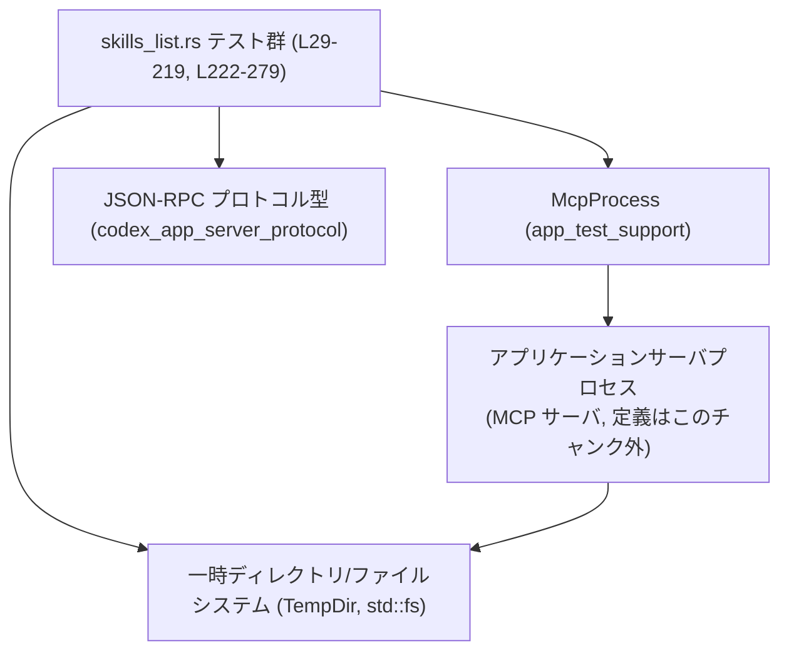
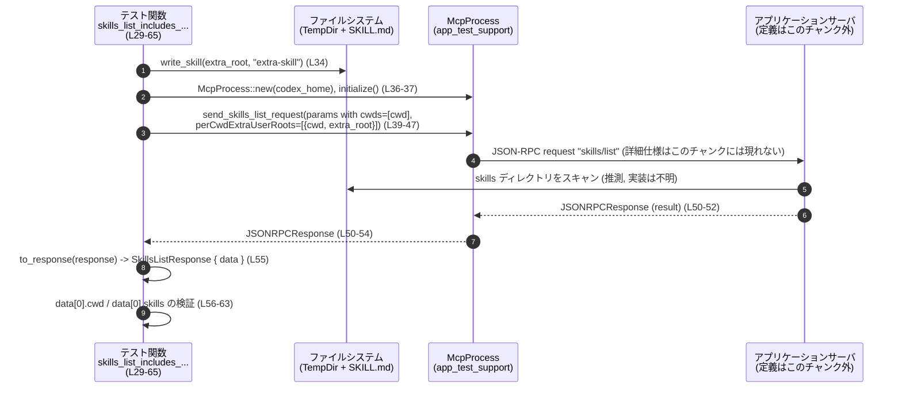

# app-server/tests/suite/v2/skills_list.rs

## 0. ざっくり一言

`skills_list.rs` は、アプリケーションサーバの **skills list API** と **skills/changed 通知** の挙動を検証する非同期統合テスト群です。特に、`perCwdExtraUserRoots` の扱い・キャッシュ挙動・スキルファイル変更監視を確認しています（根拠: `skills_list.rs:L29-219, L222-279`）。

---

## 1. このモジュールの役割

### 1.1 概要

- このモジュールは **スキル一覧取得** と **スキル変更通知** に関する仕様をテストで固定するために存在します。
- `McpProcess` 経由で JSON-RPC リクエストを送り、レスポンス/エラー/通知が期待どおりになることを検証します（根拠: `skills_list.rs:L36-48, L50-55, L72-84, L86-90, L109-121, L123-128, L147-181, L182-188, L196-205, L206-212, L227-250, L251-255, L267-270`）。
- テストごとに一時ディレクトリ配下に `skills/<name>/SKILL.md` を生成し、ファイルシステムの状態を変化させることでサーバの振る舞いを確認します（根拠: `skills_list.rs:L21-27, L31-34, L69-71, L103-107, L142-145, L224-225, L257-265`）。

### 1.2 アーキテクチャ内での位置づけ

このテストモジュールがどのコンポーネントと関係しているかを簡略図で示します。



- テストは `McpProcess::new` でサーバプロセスを起動し（根拠: `skills_list.rs:L36, L72, L109, L147, L227`）、`send_skills_list_request` / `send_thread_start_request` 等で JSON-RPC リクエストを送信します（根拠: `skills_list.rs:L39-47, L75-83, L112-120, L151-156, L173-180, L197-204, L229-249`）。
- レスポンスやエラー・通知は `read_stream_until_*` 系メソッドで待ち受け、Tokio の `timeout` を使ってハングを防いでいます（根拠: `skills_list.rs:L50-54, L86-90, L123-127, L158-161, L182-185, L206-210, L251-254, L267-270`）。
- スキル定義はテスト内で `write_skill` と `std::fs::write` により生成・更新されます（根拠: `skills_list.rs:L21-27, L34, L107, L145, L224-225, L262-265`）。

### 1.3 設計上のポイント

- **一時ディレクトリごとの隔離**  
  すべてのテストで `TempDir::new()` を用いて `codex_home`, `cwd`, `extra_root` などを分離し、ファイルシステム状態の衝突を防いでいます（根拠: `skills_list.rs:L31-33, L69-70, L103-106, L142-144, L224, L257-261`）。
- **ヘルパ関数によるスキル作成**  
  `write_skill` で `skills/<name>/SKILL.md` をMarkdown形式で作成し、各テストが同じ形式のスキル定義を使えるようにしています（根拠: `skills_list.rs:L21-27`）。
- **非同期テスト + タイムアウト**  
  すべてのテストは `#[tokio::test]` の `async fn` で記述され、I/O 操作は `tokio::time::timeout` でラップされており、サーバが応答しない場合でもテストが終了する設計です（根拠: `skills_list.rs:L29-30, L67-68, L101-102, L140-141, L222-223, L50-54, L86-90, L123-127, L158-161, L182-185, L206-210, L251-254, L267-270`）。
- **anyhow による単純化されたエラーハンドリング**  
  テスト関数も `write_skill` も `anyhow::Result<()>` を返し、`?` 演算子で I/O エラーや JSON パースエラーなどをそのままテストの失敗として伝播させています（根拠: `skills_list.rs:L3-4, L21, L30, L68, L102, L141, L223, L55, L90, L128, L163, L187, L211, L275`）。

---

## 2. 主要な機能一覧（コンポーネントインベントリー）

### 2.1 このファイル内の関数一覧

| 名前 | 種別 | 役割 / 用途 | 行範囲 |
|------|------|-------------|--------|
| `write_skill` | ヘルパ関数 | 指定された `TempDir` 配下に `skills/<name>/SKILL.md` を作成する | `skills_list.rs:L21-27` |
| `skills_list_includes_skills_from_per_cwd_extra_user_roots` | 非同期テスト | `perCwdExtraUserRoots` に指定した追加ルートからスキルが一覧に含まれることを検証する | `skills_list.rs:L29-65` |
| `skills_list_rejects_relative_extra_user_roots` | 非同期テスト | `extra_user_roots` に相対パスを渡すと JSON-RPC エラーになることを検証する | `skills_list.rs:L67-99` |
| `skills_list_ignores_per_cwd_extra_roots_for_unknown_cwd` | 非同期テスト | `perCwdExtraUserRoots` の `cwd` がリクエストされた `cwd` と一致しない場合は無視されることを検証する | `skills_list.rs:L101-138` |
| `skills_list_uses_cached_result_until_force_reload` | 非同期テスト | `force_reload` が `false` の間は同じ `cwd` の結果がキャッシュされ、`true` にすると再取得されることを検証する | `skills_list.rs:L140-220` |
| `skills_changed_notification_is_emitted_after_skill_change` | 非同期テスト | スキルファイルを更新すると `skills/changed` 通知が飛ぶことを検証する | `skills_list.rs:L222-279` |

### 2.2 外部コンポーネント（型・関数）の利用

このファイル内で利用している主な外部 API です。定義自体は他モジュールにあり、このチャンクには現れません。

| 名前 | 種別 | 役割 / 用途 | 出どころ / 使用箇所 |
|------|------|-------------|----------------------|
| `McpProcess` | 構造体 | MCP サーバプロセスを起動し、JSON-RPC リクエスト送信とストリーム読み取りを行うテスト用ハーネスと解釈できます（定義は不明） | `app_test_support` から import（`skills_list.rs:L5`）。`new`, `initialize`, `send_skills_list_request`, `send_thread_start_request`, `read_stream_until_*` などを呼び出し（`skills_list.rs:L36-48, L50-54, L72-84, L86-90, L109-121, L123-127, L147-181, L182-188, L196-205, L206-212, L227-250, L251-255, L267-270`）。 |
| `SkillsListParams`, `SkillsListExtraRootsForCwd`, `SkillsListResponse` | 構造体 | skills list JSON-RPC メソッドのパラメータとレスポンスデータを表すプロトコル型 | `codex_app_server_protocol` から import（`skills_list.rs:L10-12`）。各テスト内で生成・分解（`skills_list.rs:L39-47, L75-83, L112-120, L151-156, L163, L173-180, L187, L197-204, L211`）。 |
| `JSONRPCResponse`, `RequestId` | 構造体 / 列挙体 | 汎用 JSON-RPC レスポンスとリクエストID | `codex_app_server_protocol` から import（`skills_list.rs:L7-8`）。レスポンス受信時に使用（`skills_list.rs:L50-55, L86-90, L123-128, L158-163, L182-187, L206-212, L251-255`）。 |
| `SkillsChangedNotification` | 構造体 | `"skills/changed"` 通知のペイロード型 | `codex_app_server_protocol` から import（`skills_list.rs:L9`）。`serde_json::from_value` の結果として使用（`skills_list.rs:L275-277`）。 |
| `ThreadStartParams` | 構造体 | スレッド開始 JSON-RPC メソッドのパラメータ | `codex_app_server_protocol` から import（`skills_list.rs:L13`）。`send_thread_start_request` 呼び出し時にフィールドを設定（`skills_list.rs:L230-249`）。 |
| `to_response` | 関数 | `JSONRPCResponse` から型付きレスポンス (`SkillsListResponse`) を取り出すヘルパと推測できます（定義は不明） | `app_test_support` から import（`skills_list.rs:L6`）。`?` でエラーを伝播（`skills_list.rs:L55, L128, L163, L187, L211`）。 |

---

## 3. 公開 API と詳細解説

このファイル自体はテストモジュールであり外部に `pub` な API を提供していませんが、**テスト関数が外部サーバ API の使用例** になっています。その観点で、重要な関数をすべてテンプレートに沿って整理します。

### 3.1 型一覧（このファイルで定義しているもの）

このファイル内で新たに定義されている型はありません（構造体・列挙体・トレイトの定義はゼロです）。関数のみが定義されています（根拠: `skills_list.rs:L21-279`）。

### 3.2 関数詳細

#### `write_skill(root: &TempDir, name: &str) -> Result<()>`

**概要**

- 引数 `root` のパス配下に `skills/<name>/SKILL.md` を作成し、簡単な YAML フロントマター + Markdown ボディを持つスキルファイルを生成します（根拠: `skills_list.rs:L21-25`）。

**引数**

| 引数名 | 型 | 説明 |
|--------|----|------|
| `root` | `&TempDir` | スキルディレクトリを作成するベースディレクトリ。`root.path()` を起点に `skills/<name>/SKILL.md` を配置します（根拠: `skills_list.rs:L21-22`）。 |
| `name` | `&str` | 作成するスキルの名前。ディレクトリ名および YAML フロントマターの `name` / `description` に使用されます（根拠: `skills_list.rs:L21, L24`）。 |

**戻り値**

- `anyhow::Result<()>`  
  - すべてのファイル操作が成功した場合は `Ok(())`。  
  - `create_dir_all` や `write` などでエラーが発生した場合は、そのエラーを `?` でそのままラップして返します（根拠: `skills_list.rs:L3-4, L21-27`）。

**内部処理の流れ**

1. `root.path()` の下に `skills/<name>` ディレクトリパスを組み立てる（根拠: `skills_list.rs:L22`）。
2. `std::fs::create_dir_all` でディレクトリを再帰的に作成する。失敗するとエラーを返して終了（根拠: `skills_list.rs:L23`）。
3. `name` を埋め込んだ YAML フロントマター付きの文字列を作成する（根拠: `skills_list.rs:L24`）。
4. `SKILL.md` というファイル名で上記コンテンツを書き込む（根拠: `skills_list.rs:L25`）。
5. すべて成功したら `Ok(())` を返す（根拠: `skills_list.rs:L26`）。

**Errors**

- ディレクトリ作成に失敗した場合（パーミッションなど OS 依存の理由）、`create_dir_all` のエラーを返します（根拠: `skills_list.rs:L23`）。
- ファイル書き込みに失敗した場合、`std::fs::write` のエラーを返します（根拠: `skills_list.rs:L25`）。

**Edge cases**

- 引数 `name` にパスセパレータを含めた場合の挙動は、このコードからは判断できません（`join(name)` を行っており、システムに依存しますが、詳細な仕様は `std::path::PathBuf` の定義に依存し、このチャンクには現れません）（根拠: `skills_list.rs:L22`）。

**使用上の注意点**

- `root` は `TempDir` であることが前提のように使われていますが、型シグネチャ上は `TempDir` であれば何でもよく、ここでの処理はファイルシステム操作に限定されています（根拠: `skills_list.rs:L21-27`）。

---

#### `skills_list_includes_skills_from_per_cwd_extra_user_roots(...) -> Result<()>`

**概要**

- `perCwdExtraUserRoots` に指定した `extra_user_roots` からスキルを読み込んで、`skills/list` の結果に含まれることを検証する非同期テストです（根拠: `skills_list.rs:L29-65`）。

**引数**

- テスト関数であり引数は取りません（根拠: `skills_list.rs:L30`）。

**戻り値**

- `Result<()>`。テストが成功すれば `Ok(())`、途中でエラーが発生したりアサーションに失敗すればテストが失敗します（根拠: `skills_list.rs:L30, L64`）。

**内部処理の流れ**

1. `codex_home`, `cwd`, `extra_root` の 3 つの一時ディレクトリを作成（根拠: `skills_list.rs:L31-33`）。
2. `extra_root` 配下に `"extra-skill"` というスキルを `write_skill` で作成（根拠: `skills_list.rs:L34`）。
3. `codex_home` を指定して `McpProcess::new` を呼び出し、`initialize` で初期化（根拠: `skills_list.rs:L36-37`）。
4. `SkillsListParams` を組み立てて `send_skills_list_request` を呼ぶ。  
   - `cwds`: `[cwd]`  
   - `force_reload`: `true`  
   - `per_cwd_extra_user_roots`: `Some([ { cwd: cwd, extra_user_roots: [extra_root] } ])`（根拠: `skills_list.rs:L39-47`）。
5. `read_stream_until_response_message` でレスポンスを待ち受け、`timeout` で 10 秒に制限（根拠: `skills_list.rs:L50-54`）。
6. `to_response` で `SkillsListResponse { data }` を取り出す（根拠: `skills_list.rs:L55`）。
7. `data.len() == 1` で `cwd` ごとの結果が 1 つであることを確認し、`data[0].cwd == cwd` を検証（根拠: `skills_list.rs:L56-57`）。
8. `data[0].skills` の中に `name == "extra-skill"` の要素が存在することを確認（根拠: `skills_list.rs:L58-63`）。

**Edge cases**

- `extra_user_roots` が空の場合などの挙動はこのテストでは扱っていません（`extra_root` を 1 つ含めているのみです）（根拠: `skills_list.rs:L39-47`）。

**使用上の注意点（仕様的な契約）**

- サーバ側は `perCwdExtraUserRoots` に指定された絶対パスのディレクトリ以下をスキル検索の対象にする、という仕様であることが、このテストから読み取れます（根拠: `skills_list.rs:L39-47, L58-63`）。  

---

#### `skills_list_rejects_relative_extra_user_roots(...) -> Result<()>`

**概要**

- `extra_user_roots` に **相対パス** を渡した場合に、サーバがエラーレスポンスを返すことを検証するテストです（根拠: `skills_list.rs:L67-99`）。

**内部処理の流れ（主要ステップ）**

1. `codex_home`, `cwd` の `TempDir` を作成し、`McpProcess` を初期化（根拠: `skills_list.rs:L69-73`）。
2. `SkillsListParams` の `per_cwd_extra_user_roots` に、`extra_user_roots: ["relative/skills"]`（相対パス）を設定してリクエスト送信（根拠: `skills_list.rs:L75-83`）。
3. `read_stream_until_error_message` で JSON-RPC エラーメッセージを待ち受け（根拠: `skills_list.rs:L86-90`）。
4. 返ってきたエラーの `message` に `"perCwdExtraUserRoots extraUserRoots paths must be absolute"` という文字列が含まれていることをアサート（根拠: `skills_list.rs:L91-97`）。

**Errors / 仕様的な契約**

- サーバは、`perCwdExtraUserRoots.extraUserRoots` に相対パスが含まれている場合、少なくともこのメッセージを含むエラーを返す契約になっていると解釈できます（根拠: `skills_list.rs:L80-82, L91-97`）。
- 相対パスを含めると **正常レスポンスは返らない** ことが前提です。テストではレスポンスではなくエラーを待ち受けています（根拠: `skills_list.rs:L86-90`）。

**使用上の注意点**

- クライアント側は `extra_user_roots` に **絶対パスのみ** を指定すべきであり、相対パスを渡すとプロトコルレベルのエラーになることが分かります（根拠: `skills_list.rs:L80-82, L91-97`）。

---

#### `skills_list_ignores_per_cwd_extra_roots_for_unknown_cwd(...) -> Result<()>`

**概要**

- `perCwdExtraUserRoots` の `cwd` が、`cwds` に含まれていない（＝クライアントからリクエストされた作業ディレクトリとは異なる）場合、その追加ルートは無視されることを検証します（根拠: `skills_list.rs:L101-138`）。

**内部処理の流れ**

1. `codex_home`, `requested_cwd`, `unknown_cwd`, `extra_root` をそれぞれ `TempDir::new()` で作成（根拠: `skills_list.rs:L103-106`）。
2. `extra_root` に `"ignored-extra-skill"` のスキルを作成（根拠: `skills_list.rs:L106-107`）。
3. `McpProcess` を `codex_home` で起動し初期化（根拠: `skills_list.rs:L109-110`）。
4. `SkillsListParams` で  
   - `cwds`: `[requested_cwd]`  
   - `per_cwd_extra_user_roots`: `[ { cwd: unknown_cwd, extra_user_roots: [extra_root] } ]`  
   を指定してリクエスト送信（根拠: `skills_list.rs:L112-120`）。
5. レスポンスを受信し `SkillsListResponse { data }` を抽出（根拠: `skills_list.rs:L123-128`）。
6. `data.len() == 1` と `data[0].cwd == requested_cwd` を確認（根拠: `skills_list.rs:L129-130`）。
7. `data[0].skills` に `"ignored-extra-skill"` という名前のスキルが **1 つも含まれていない** ことを確認（根拠: `skills_list.rs:L131-136`）。

**仕様的な契約**

- サーバ側は、`perCwdExtraUserRoots` のエントリを、「`cwd` が `cwds` のどれと対応するか」でひも付けしており、知らない `cwd` に対する追加ルートは無視する仕様と解釈できます（根拠: `skills_list.rs:L112-120, L129-136`）。

---

#### `skills_list_uses_cached_result_until_force_reload(...) -> Result<()>`

**概要**

- 同じ `cwd` に対するスキル一覧がキャッシュされており、`force_reload: false` の間はキャッシュ結果が使われ、`force_reload: true` にしたタイミングでスキル一覧が再評価されることを検証するテストです（根拠: `skills_list.rs:L140-220`）。

**内部処理の流れ**

1. `codex_home`, `cwd`, `extra_root` を作成し、`extra_root` に `"late-extra-skill"` を作成（根拠: `skills_list.rs:L142-145`）。  
   ※ このタイミングでスキルはすでにファイルシステム上に存在します。
2. `McpProcess` を起動して初期化（根拠: `skills_list.rs:L147-148`）。
3. **1 回目のリクエスト（キャッシュシード）**  
   - `SkillsListParams` で `cwds: [cwd]`, `force_reload: false`, `per_cwd_extra_user_roots: None` を設定しリクエスト送信（根拠: `skills_list.rs:L151-156`）。  
   - レスポンスを受信して `first_data` を取得（根拠: `skills_list.rs:L158-163`）。  
   - `first_data[0].skills` に `"late-extra-skill"` が含まれていないことを確認（根拠: `skills_list.rs:L164-170`）。
4. **2 回目のリクエスト（force_reload: false + extra roots 追加）**  
   - 今度は `per_cwd_extra_user_roots` に `cwd` と `extra_root` を指定しつつ、`force_reload: false` のままリクエスト（根拠: `skills_list.rs:L172-180`）。  
   - レスポンス `second_data` を取得し、1 回目と同様 `"late-extra-skill"` が含まれていないことを確認（根拠: `skills_list.rs:L182-194`）。
5. **3 回目のリクエスト（force_reload: true + extra roots 追加）**  
   - パラメータは 2 回目と同じだが、`force_reload: true` に変更（根拠: `skills_list.rs:L196-203`）。  
   - レスポンス `third_data` を取得し、今度は `"late-extra-skill"` が **含まれている** ことを確認（根拠: `skills_list.rs:L206-218`）。

**仕様的な契約**

- サーバは `cwd` ごとにスキル一覧をキャッシュしており、`force_reload: false` のときは、パラメータ（`perCwdExtraUserRoots` を含む）が変わってもキャッシュを返す可能性があることが、このテストから読み取れます（根拠: `skills_list.rs:L151-156, L172-180, L164-170, L189-194`）。
- `force_reload: true` を指定することにより、`perCwdExtraUserRoots` を含めた状態でスキル一覧を再構築する契約になっていると解釈できます（根拠: `skills_list.rs:L196-203, L211-218`）。

**Edge cases**

- `force_reload` の初期値や、サーバ再起動をまたいだキャッシュの挙動などはこのテストからは分かりません。このテストは同一プロセス内での 3 連続リクエストのみを扱っています（根拠: `skills_list.rs:L140-220`）。

---

#### `skills_changed_notification_is_emitted_after_skill_change(...) -> Result<()>`

**概要**

- スキルファイル (`SKILL.md`) の内容を変更した際に、`"skills/changed"` という JSON-RPC 通知が送られてくることを検証するテストです（根拠: `skills_list.rs:L222-279`）。

**内部処理の流れ**

1. `codex_home` を作成し、その直下に `"demo"` スキルを `write_skill` で作成（根拠: `skills_list.rs:L224-225`）。
2. `McpProcess` を `codex_home` で起動して初期化（根拠: `skills_list.rs:L227-228`）。
3. `ThreadStartParams` を全フィールド `None` や `false` にした上で `send_thread_start_request` を呼び、スレッド（セッション）を開始（根拠: `skills_list.rs:L229-249`）。
4. そのレスポンスを受信して完了するまで待機（根拠: `skills_list.rs:L251-255`）。
5. `codex_home/skills/demo/SKILL.md` のパスを組み立て、その内容を書き換えて `"Updated"` 版を保存（根拠: `skills_list.rs:L257-265`）。
6. `read_stream_until_notification_message("skills/changed")` で `"skills/changed"` 通知が届くまで待つ。待ち時間は `WATCHER_TIMEOUT`（20 秒）で制限（根拠: `skills_list.rs:L267-271, L19`）。
7. 受信した通知の `params` を取り出し（なければエラー）、`serde_json::from_value` で `SkillsChangedNotification` にデシリアライズ（根拠: `skills_list.rs:L272-276`）。
8. デシリアライズ結果が `SkillsChangedNotification {}` と等しいことをアサート（根拠: `skills_list.rs:L277`）。

**仕様的な契約**

- サーバは、スキルディレクトリ配下の `SKILL.md` の変更を監視しており、変更を検出すると `"skills/changed"` 通知を送る仕様であると解釈できます（根拠: `skills_list.rs:L257-265, L267-277`）。
- 通知のペイロードは空の `SkillsChangedNotification {}` であり、変更の詳細までは含まれない仕様になっています（根拠: `skills_list.rs:L9, L275-277`）。

**Edge cases**

- 複数スキルを同時に更新した場合の通知件数や、削除・追加に対する挙動などはこのテストからは分かりません（根拠: `skills_list.rs:L222-279`）。

**使用上の注意点**

- クライアント側は `"skills/changed"` 通知を受け取った後、自前で `skills/list` を再度呼び出して最新の一覧に更新する必要があると推測できますが、その呼び出しはこのテストには含まれていません（根拠: `skills_list.rs:L267-277`）。  

---

### 3.3 その他の関数

このファイルには上記 6 関数のみが定義されており、「補助的な小さな関数」は他にありません（根拠: `skills_list.rs:L21-279`）。

---

## 4. データフロー

ここでは代表的な処理シナリオとして、`skills_list_includes_skills_from_per_cwd_extra_user_roots` におけるデータフローを示します。

### 4.1 処理の要点（テキスト）

- テストが一時ディレクトリ上にスキル定義ファイルを作成し、`McpProcess` 経由でサーバへ `skills/list` リクエストを送ります（根拠: `skills_list.rs:L31-34, L36-47`）。
- サーバはファイルシステムからスキルを読み取り、JSON-RPC レスポンスとして `SkillsListResponse` を返します（レスポンス構造は推測であり、サーバ内部の詳細はこのチャンクには現れません）。
- テストはレスポンスを JSON から型付きに変換し、期待する `cwd` と `skills` の内容を検証します（根拠: `skills_list.rs:L50-63`）。

### 4.2 シーケンス図



> 注: サーバ内部の挙動（`S->>FS` の部分）は、このファイルからは直接読めないため、あくまで `skills/list` の一般的な動作イメージとして記載しています。

---

## 5. 使い方（How to Use）

このモジュールはテストですが、**サーバ API の使用例** としても参考になります。

### 5.1 基本的な使用方法（skills list の呼び出し例）

以下は、このファイルのテストパターンから抽出した、skills list を呼び出す典型的な流れです。

```rust
// 前提: codex_home と cwd は適切に初期化された PathBuf

// 1. MCP プロセスを起動し初期化する                        // skills_list.rs:L36-37 相当
let mut mcp = McpProcess::new(&codex_home).await?;
tokio::time::timeout(DEFAULT_TIMEOUT, mcp.initialize()).await??;

// 2. SkillsListParams を組み立ててリクエストを送る       // skills_list.rs:L39-47 相当
let request_id = mcp
    .send_skills_list_request(SkillsListParams {
        cwds: vec![cwd.clone()],                         // 対象 cwd のリスト
        force_reload: true,                              // キャッシュを無視して再取得
        per_cwd_extra_user_roots: None,                  // 追加ルートがなければ None
    })
    .await?;

// 3. レスポンスが来るまで待つ                            // skills_list.rs:L50-54 相当
let response: JSONRPCResponse = tokio::time::timeout(
    DEFAULT_TIMEOUT,
    mcp.read_stream_until_response_message(RequestId::Integer(request_id)),
)
.await??;

// 4. 型付きレスポンスに変換し、データを利用する          // skills_list.rs:L55-57 相当
let SkillsListResponse { data } = to_response(response)?;
let first_entry = &data[0];
println!("cwd: {:?}", first_entry.cwd);
for skill in &first_entry.skills {
    println!("skill: {}", skill.name);
}
```

### 5.2 よくある使用パターン

- **perCwdExtraUserRoots を利用するパターン**  
  `SkillsListParams` に `per_cwd_extra_user_roots` を設定し、`cwd` ごとに追加のスキルディレクトリを指定します（根拠: `skills_list.rs:L39-47, L75-83, L112-120, L172-180, L196-203`）。
- **キャッシュを使い回す / 破棄するパターン**  
  - 高頻度で同じ `cwd` のスキル一覧を取得する場合は `force_reload: false` を使い、キャッシュが活用される前提になっています（根拠: `skills_list.rs:L151-156, L172-180`）。
  - スキル追加や設定変更後に最新情報を取りたい場合は `force_reload: true` を指定すると再スキャンされます（根拠: `skills_list.rs:L196-203, L211-218`）。

### 5.3 よくある間違い

```rust
// 間違い例: extra_user_roots に相対パスを渡してしまう     // skills_list.rs:L80-82
let params = SkillsListParams {
    cwds: vec![cwd.clone()],
    force_reload: true,
    per_cwd_extra_user_roots: Some(vec![SkillsListExtraRootsForCwd {
        cwd: cwd.clone(),
        extra_user_roots: vec![std::path::PathBuf::from("relative/skills")],
    }]),
};

// この場合、サーバは "paths must be absolute" エラーを返す契約になっている
// （skills_list_rejects_relative_extra_user_roots が検証） // skills_list.rs:L91-97

// 正しい例: extra_user_roots に絶対パスを渡す             // skills_list.rs:L44-45 等
let params = SkillsListParams {
    cwds: vec![cwd.clone()],
    force_reload: true,
    per_cwd_extra_user_roots: Some(vec![SkillsListExtraRootsForCwd {
        cwd: cwd.clone(),
        extra_user_roots: vec![extra_root.clone()],      // absolute path
    }]),
};
```

### 5.4 使用上の注意点（まとめ）

- `extra_user_roots` は **絶対パスのみ** を指定する必要があります（根拠: `skills_list.rs:L80-82, L91-97`）。
- `per_cwd_extra_user_roots` の `cwd` は、`SkillsListParams.cwds` に含まれる `cwd` と対応づけられ、そうでないものは無視されます（根拠: `skills_list.rs:L112-120, L129-136`）。
- 同じ `cwd` で `force_reload: false` のままリクエストを繰り返すと、スキル一覧がキャッシュから返される前提で設計されています（根拠: `skills_list.rs:L151-156, L172-194`）。
- スキルファイル更新に応じて `"skills/changed"` 通知を受け取りたい場合、まず `ThreadStartParams` を使ってスレッドを開始する必要があります（根拠: `skills_list.rs:L229-255, L267-277`）。

---

## 6. 変更の仕方（How to Modify）

### 6.1 新しいテストケースを追加する場合

- **追加する場所**  
  同じ挙動（skills list / skills changed）に関するテストを追加する場合は、このファイルに新しい `#[tokio::test] async fn ...` を追加するのが自然です（根拠: `skills_list.rs:L29-65, L67-99, L101-138, L140-220, L222-279`）。
- **利用すべき既存コンポーネント**
  - スキル作成は `write_skill` を再利用することでフォーマットを統一できます（根拠: `skills_list.rs:L21-27, L34, L107, L145, L224-225`）。
  - サーバ起動・リクエスト送信は `McpProcess` の既存メソッド（`new`, `initialize`, `send_skills_list_request`, `read_stream_until_*`）を流用します（根拠: `skills_list.rs:L36-48, L50-54, L72-84, L86-90, L109-121, L123-127, L147-181, L182-188, L196-205, L206-212, L227-250, L251-255, L267-270`）。
- **呼び出し元**
  - 新たなテストが検証するべき条件（例: 別種のエラー、複数 cwd の挙動など）に応じて `SkillsListParams` の組み立て方を工夫します。

### 6.2 既存テストを変更する場合の注意点

- **仕様の契約確認**
  - このファイルのアサーションはサーバの「外部仕様」を表現している可能性が高いため、メッセージ文言や動作を変更する場合はサーバ実装とドキュメントの両方を確認する必要があります（例: エラーメッセージ文字列、force_reload の意味）（根拠: `skills_list.rs:L91-97, L164-170, L189-194, L211-218, L277`）。
- **タイムアウト値**
  - `DEFAULT_TIMEOUT` や `WATCHER_TIMEOUT` を変更すると、テストの安定性と実行時間に影響します（根拠: `skills_list.rs:L18-19, L50-54, L86-90, L123-127, L158-161, L182-185, L206-210, L251-254, L267-270`）。
- **並行性と非同期**
  - すべてのテストは `#[tokio::test]` であり、Tokio ランタイム上で動作します。同期的なブロッキング I/O を大量に追加すると、他の非同期タスクに影響する可能性がありますが、このファイルからは具体的な影響範囲は分かりません（根拠: `skills_list.rs:L29-30, L67-68, L101-102, L140-141, L222-223`）。

---

## 7. 関連ファイル

このモジュールと密接に関係しているが、このチャンクには定義が現れないコンポーネントです。

| パス / モジュール | 役割 / 関係 |
|------------------|------------|
| `app_test_support::McpProcess` | MCP サーバプロセスの起動・停止や JSON-RPC ストリームの読み書きをカプセル化するテスト用ユーティリティ。skills list / thread start などすべてのリクエスト送信に使われています（根拠: `skills_list.rs:L5, L36-48, L50-54, L72-84, L86-90, L109-121, L123-127, L147-181, L182-188, L196-205, L206-212, L227-250, L251-255, L267-270`）。 |
| `app_test_support::to_response` | `JSONRPCResponse` を `SkillsListResponse` などの具体的な型に変換するヘルパ関数。レスポンスのパースに使われています（根拠: `skills_list.rs:L6, L55, L128, L163, L187, L211`）。 |
| `codex_app_server_protocol` モジュール群 | JSON-RPC の各種パラメータ・レスポンス・通知型（`SkillsListParams`, `SkillsListResponse`, `SkillsChangedNotification`, `ThreadStartParams`, `JSONRPCResponse`, `RequestId` など）を定義していると見られます（根拠: `skills_list.rs:L7-13`）。 |
| `tempfile::TempDir` | テストのための一時ディレクトリを提供するユーティリティ。`codex_home` や `cwd`、`extra_root` の寿命をテストごとに管理するために利用されています（根拠: `skills_list.rs:L15, L31-33, L69-70, L103-106, L142-144, L224, L257-261`）。 |

---

## Bugs / Security / 契約・エッジケースに関する補足

- **明示的なバグの兆候**  
  このファイル内のテストコードに、コンパイルエラーや明らかなロジック矛盾は見当たりません（根拠: 全体構造 `skills_list.rs:L1-279`）。  
  ただし、サーバ側のバグの有無については、このチャンクだけからは判断できません。
- **セキュリティ面**  
  テストは一時ディレクトリ配下のファイルのみを操作しており、外部入力や権限昇格などのセキュリティ上の懸念は、このコードからは読み取れません（根拠: `skills_list.rs:L21-27, L31-34, L69-71, L103-107, L142-145, L224-225, L257-265`）。
- **契約 / エッジケース**  
  - `extra_user_roots` は絶対パス必須（相対パスはプロトコルエラー）（根拠: `skills_list.rs:L80-82, L91-97`）。  
  - `perCwdExtraUserRoots` の `cwd` が不一致なエントリは無視される（根拠: `skills_list.rs:L112-120, L129-136`）。  
  - `force_reload` が `false` の間はパラメータ変更が反映されない可能性がある（キャッシュ前提）（根拠: `skills_list.rs:L151-156, L172-180, L164-170, L189-194`）。  
  - スキルファイル更新後に `"skills/changed"` 通知が 20 秒以内に来る前提でテストが書かれている（根拠: `skills_list.rs:L19, L257-265, L267-271`）。
