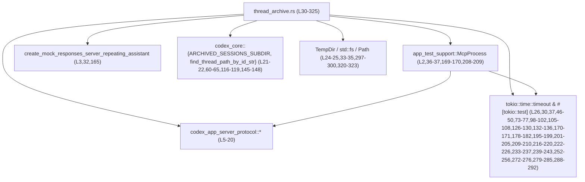
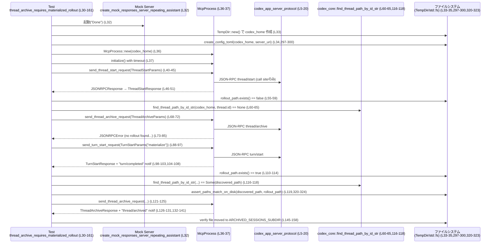

# app-server/tests/suite/v2/thread_archive.rs コード解説

## 0. ざっくり一言

このファイルは、**スレッドのアーカイブ／アンアーカイブ／再開処理に関する挙動をエンドツーエンドで検証する非同期テスト**をまとめたモジュールです。`McpProcess` を通じてアプリケーションサーバーと JSON-RPC で対話し、ロールアウトファイルの存在や通知の配信先などの契約を確認します（thread_archive.rs:L30-295）。

---

## 1. このモジュールの役割

### 1.1 概要

- このモジュールは、**スレッドのロールアウトファイルとアーカイブ機能の整合性**を検証するために存在し、次のような点をテストします（thread_archive.rs:L30-161, L163-295）。

  - ロールアウトがまだ「物理化（materialize）」されていないスレッドはアーカイブできないこと（thread_archive.rs:L54-65, L68-85）。
  - ユーザーの最初のターン完了後にロールアウトファイルが生成され、ID から検索可能になること（thread_archive.rs:L88-119）。
  - アーカイブ時にロールアウトファイルが所定のアーカイブディレクトリへ移動されること（thread_archive.rs:L145-158）。
  - アーカイブ／アンアーカイブ／再開ののちに、**古いクライアントセッションの通知購読が清掃される（stale subscription が残らない）**こと（thread_archive.rs:L169-260, L279-286）。

### 1.2 アーキテクチャ内での位置づけ

このテストモジュールは、テスト用ユーティリティとプロトコル定義クレートに依存しつつ、実際のアプリケーションサーバープロセス（`McpProcess` 経由で起動されると推測される）に対して JSON-RPC リクエストを送信します。

- 依存関係（コードから読み取れる範囲）:

  - `app_test_support::McpProcess`  
    - JSON-RPC 経由でサーバーとやりとりするテスト用クライアント（thread_archive.rs:L2, L36-37, L169-170, L208-209, L246-247, L262-263）。
  - `app_test_support::create_mock_responses_server_repeating_assistant`  
    - 「Done」というレスポンスを返し続けるモック HTTP サーバーを立てるユーティリティ（thread_archive.rs:L3, L32, L165）。
  - `codex_app_server_protocol::*`  
    - JSON-RPC メッセージの型（リクエスト ID やスレッド／ターン関連のリクエスト・レスポンス型）（thread_archive.rs:L5-20）。
  - `codex_core::{ARCHIVED_SESSIONS_SUBDIR, find_thread_path_by_id_str}`  
    - ロールアウトファイルのディレクトリ構造・スレッド ID からのパス検索ユーティリティ（thread_archive.rs:L21-22, L60-65, L116-119, L145-148）。
  - ファイルシステム系 (`std::fs`, `std::path::Path`, `tempfile::TempDir`)（thread_archive.rs:L24-25, L33-35, L297-300, L320-323）。
  - 非同期ランタイムとタイムアウト制御 (`tokio::time::timeout`, `#[tokio::test]`)（thread_archive.rs:L26, L30, L163, L37, L46-50, L73-77, L98-102, L105-108, L126-130, L132-136, L170-171, L178-182, L195-199, L201-205, L209-210, L216-220, L222-226, L233-237, L239-243, L252-256, L272-276, L279-285, L288-292）。

Mermaid 図で表すと次のような位置づけになります。



### 1.3 設計上のポイント

- **非同期テスト + タイムアウトでの安全性確保**  
  - 全ての JSON-RPC 相互作用に `tokio::time::timeout` を適用し、サーバーが応答しない場合でもテストがハングしないようにしています（thread_archive.rs:L37, L46-50, L73-77, L98-102, L105-108, L126-130, L132-136, L170-171, L178-182, L195-199, L201-205, L209-210, L216-220, L222-226, L233-237, L239-243, L252-256, L272-276, L279-285, L288-292）。
- **一時ディレクトリによるテストの隔離**  
  - `TempDir::new()` により、各テストごとに独立した `codex_home` ディレクトリを作成し、ファイルシステム状態が他のテストと干渉しないようにしています（thread_archive.rs:L33, L166）。
- **ロールアウトファイルの存在とパス解決の契約を明示的に検証**  
  - スレッド開始直後はロールアウトファイルが存在せず、`find_thread_path_by_id_str` でも見つからないこと（thread_archive.rs:L54-65）。
  - ユーザーターン完了後にはファイルが作成され、ID から検索可能になること（thread_archive.rs:L88-119）。
- **アーカイブ操作のファイルシステム効果を検証**  
  - アーカイブ後に元のパスが消え、`ARCHIVED_SESSIONS_SUBDIR` 配下に同名ファイルが存在することをアサートしています（thread_archive.rs:L145-158）。
- **複数クライアント間のサブスクリプション状態を検証**  
  - `primary` / `secondary` という 2 つの `McpProcess` を用いて、アーカイブ／アンアーカイブ後に古いクライアントへ通知が飛ばないことを確認しています（thread_archive.rs:L169-260, L279-286）。
- **エラーメッセージ内容を含む契約**  
  - ロールアウトがない状態でのアーカイブ要求が、特定文字列 `"no rollout found for thread id"` を含むエラーを返すことを前提としています（thread_archive.rs:L78-85）。

---

## 2. 主要な機能一覧

このファイルが提供する機能（テストケースと補助関数）は次のとおりです。

- `thread_archive_requires_materialized_rollout`: ロールアウトが物理化されていないスレッドはアーカイブできないことと、物理化後に正常にアーカイブされることを検証します（thread_archive.rs:L30-161）。
- `thread_archive_clears_stale_subscriptions_before_resume`: アーカイブ／アンアーカイブ／再開を挟んでも古いクライアントの通知購読が残らないことを検証します（thread_archive.rs:L163-295）。
- `create_config_toml`: テスト用の `config.toml` を一時ディレクトリに生成します（thread_archive.rs:L297-300）。
- `config_contents`: モックモデル／プロバイダを用いた設定ファイル文字列を構築します（thread_archive.rs:L302-318）。
- `assert_paths_match_on_disk`: 2 つのパスを正規化（canonicalize）して同一であることを確認します（thread_archive.rs:L320-325）。

### コンポーネントインベントリー（関数）

| 名前 | 種別 | 役割 / 用途 | 定義位置 |
|------|------|-------------|----------|
| `thread_archive_requires_materialized_rollout` | 非公開 async テスト関数（`#[tokio::test]`） | ロールアウト物理化前後のアーカイブ挙動とファイル移動を検証 | `thread_archive.rs:L30-161` |
| `thread_archive_clears_stale_subscriptions_before_resume` | 非公開 async テスト関数（`#[tokio::test]`） | アーカイブ／アンアーカイブ／再開後の通知購読のクリアを検証 | `thread_archive.rs:L163-295` |
| `create_config_toml` | 非公開補助関数 | 一時ディレクトリに `config.toml` を生成 | `thread_archive.rs:L297-300` |
| `config_contents` | 非公開補助関数 | モック用設定ファイル内容の組み立て | `thread_archive.rs:L302-318` |
| `assert_paths_match_on_disk` | 非公開補助関数 | パスの正規化比較による同一性チェック | `thread_archive.rs:L320-325` |

---

## 3. 公開 API と詳細解説

このファイル内で新たな公開型（構造体・列挙体など）は定義されていません（thread_archive.rs:L1-325）。

### 3.1 型一覧（構造体・列挙体など）

このモジュール内で定義されるユーザー向けの型はありません。  
使用している型はすべて外部クレート（`codex_app_server_protocol`, `codex_core`, `app_test_support` など）からのインポートです（thread_archive.rs:L1-23）。

### 3.2 関数詳細（5 件）

#### `async fn thread_archive_requires_materialized_rollout() -> Result<()>`

**概要**

- スレッド開始直後（ロールアウトがまだファイルとして存在しない状態）ではアーカイブ要求が失敗すること、およびユーザーターンを 1 回実行してロールアウトを物理化した後はアーカイブが成功し、ファイルがアーカイブディレクトリに移動されることを検証します（thread_archive.rs:L30-161）。

**引数**

- なし（`#[tokio::test]` によりテストランナーから直接呼び出されます）。

**戻り値**

- `Result<()>` (`anyhow::Result`)  
  - テストが成功した場合は `Ok(())`（thread_archive.rs:L160）。  
  - 途中で `?` が返すエラー（I/O エラー、JSON-RPC エラーなど）をそのまま上位のテストランナーに伝播します（thread_archive.rs:L32-37, L45, L50, L51, L62, L72, L77, L97, L102, L108, L116-119, L125, L130, L136, L141）。

**内部処理の流れ**

1. **モックサーバーと一時ディレクトリの準備**  
   - `create_mock_responses_server_repeating_assistant("Done")` でモック HTTP サーバーを起動します（thread_archive.rs:L32）。  
   - `TempDir::new()` で一時ディレクトリ `codex_home` を作成し（thread_archive.rs:L33）、`create_config_toml` で `config.toml` を生成します（thread_archive.rs:L34）。
2. **MCP プロセスの初期化**  
   - `McpProcess::new(codex_home.path())` で MCP クライアント・プロセスを生成し（thread_archive.rs:L36）、`timeout(DEFAULT_READ_TIMEOUT, mcp.initialize()).await??;` で 10 秒タイムアウト付きで初期化します（thread_archive.rs:L37-38）。
3. **スレッドの開始とロールアウト未物理化の確認**  
   - `send_thread_start_request` で `ThreadStartParams { model: Some("mock-model".to_string()), ..Default::default() }` を送り（thread_archive.rs:L40-45）、レスポンスを `JSONRPCResponse` 経由で `ThreadStartResponse` に変換します（thread_archive.rs:L46-51）。  
   - `thread.id` が空でないことをアサートし（thread_archive.rs:L52）、`thread.path.clone().expect("thread path")` からロールアウトパスを取得します（thread_archive.rs:L54）。  
   - このパスがまだ存在しないこと（`!rollout_path.exists()`）を確認し（thread_archive.rs:L55-59）、`find_thread_path_by_id_str(codex_home.path(), &thread.id)` が `None` を返すことをアサートします（thread_archive.rs:L60-65）。
4. **ロールアウト未物理化状態でのアーカイブ失敗を確認**  
   - `send_thread_archive_request(ThreadArchiveParams { thread_id: thread.id.clone() })` でアーカイブ要求を送り（thread_archive.rs:L68-72）、`read_stream_until_error_message` でエラーレスポンスを取得します（thread_archive.rs:L73-77）。  
   - エラーメッセージに `"no rollout found for thread id"` が含まれていることを確認し、期待した理由で失敗していることを検証します（thread_archive.rs:L78-85）。
5. **ユーザーターンによるロールアウト物理化と成功するアーカイブ**  
   - `send_turn_start_request` で `TurnStartParams{ thread_id: thread.id.clone(), input: vec![UserInput::Text{ text: "materialize".to_string(), .. }], ..Default::default() }` を送り（thread_archive.rs:L88-97）、レスポンスを `TurnStartResponse` として受け取ります（thread_archive.rs:L98-103）。  
   - `turn/completed` 通知を待ち（thread_archive.rs:L104-108）、その後 `rollout_path.exists()` が `true` であることをアサートします（thread_archive.rs:L110-114）。  
   - 再び `find_thread_path_by_id_str` を呼び、`Some(path)` が返ることを確認し（thread_archive.rs:L116-118）、`assert_paths_match_on_disk` でスレッド ID から引けるパスと `thread.path` がディスク上で同一であることを検証します（thread_archive.rs:L119）。
6. **再度アーカイブを実行し、成功・通知・ファイル移動を検証**  
   - もう一度 `send_thread_archive_request` によるアーカイブ要求を送り（thread_archive.rs:L121-125）、`ThreadArchiveResponse` を取得します（thread_archive.rs:L126-131）。  
   - さらに `thread/archived` 通知を受け取り（thread_archive.rs:L132-136）、`ThreadArchivedNotification` にデシリアライズして `thread_id` が期待どおりであることを確認します（thread_archive.rs:L137-142）。  
   - `codex_home.path().join(ARCHIVED_SESSIONS_SUBDIR)` をアーカイブディレクトリとし（thread_archive.rs:L145）、元のロールアウトファイル名を維持したまま新しいパスを構成します（thread_archive.rs:L147-148）。  
   - 元の `rollout_path` が存在しないこと（ファイルが移動されたこと）と、新しい `archived_rollout_path` が存在することをそれぞれアサートします（thread_archive.rs:L149-158）。
7. **終了**  
   - すべてのチェックに成功したら `Ok(())` を返します（thread_archive.rs:L160）。

**Examples（使用例）**

この関数自体はテストランナーから自動的に呼ばれますが、同様のパターンで新しいテストを書く場合のテンプレート例を示します。

```rust
use anyhow::Result;
use app_test_support::{McpProcess, create_mock_responses_server_repeating_assistant};
use tempfile::TempDir;
use tokio::time::timeout;

#[tokio::test]                                             // tokio のランタイム上でテストを実行する
async fn my_archive_behavior_test() -> Result<()> {        // anyhow::Result を返す async テスト関数
    let server = create_mock_responses_server_repeating_assistant("Done").await; // モックサーバー起動
    let codex_home = TempDir::new()?;                      // 一時ディレクトリ作成
    create_config_toml(codex_home.path(), &server.uri())?; // 本ファイルのヘルパーで config.toml を生成

    let mut mcp = McpProcess::new(codex_home.path()).await?; // MCP クライアント生成
    timeout(DEFAULT_READ_TIMEOUT, mcp.initialize()).await??; // タイムアウト付きで初期化

    // ここに thread_start / turn_start / thread_archive などの検証ロジックを書く

    Ok(())                                                 // すべて成功したら Ok を返す
}
```

**Errors / Panics**

- `Result` エラーとして返る可能性
  - 一時ディレクトリの作成失敗（`TempDir::new`）（thread_archive.rs:L33）。
  - `config.toml` の書き込み失敗（`create_config_toml` 内部の `std::fs::write`）（thread_archive.rs:L34, L297-300）。
  - `McpProcess::new`、`initialize`、各種 `send_*_request`、`read_stream_*` の呼び出しで発生しうる I/O エラーやプロトコル関連エラー（thread_archive.rs:L36-37, L40-45, L46-50, L68-72, L73-77, L88-97, L98-102, L104-108, L121-125, L126-130, L132-136）。
  - `to_response` が JSON-RPC の `result` 内容を期待型に変換できない場合（thread_archive.rs:L51, L103, L131）。
  - `serde_json::from_value` による通知パラメータのデシリアライズ失敗（thread_archive.rs:L137-141）。
- `panic`（テスト失敗）になりうる箇所
  - `thread.path.clone().expect("thread path")` で `thread.path` が `None` の場合（thread_archive.rs:L54）。
  - `archive_notification.params.expect("thread/archived notification params")` で `params` が `None` の場合（thread_archive.rs:L138-140）。
  - `assert!` / `assert_eq!` の失敗  
    - `thread.id` が空（thread_archive.rs:L52）。  
    - ロールアウトファイルの存在／非存在条件が期待と異なる（thread_archive.rs:L55-59, L110-114, L149-153, L154-158）。  
    - エラーメッセージが `"no rollout found for thread id"` を含まない（thread_archive.rs:L78-85）。  
    - アーカイブ通知の `thread_id` が一致しない（thread_archive.rs:L142）。

**Edge cases（エッジケース）**

- **スレッドレスポンスに `path` が含まれない**  
  - `thread.path` が `None` の場合、`expect("thread path")` で即座に panic します（thread_archive.rs:L54）。
- **モックサーバーや MCP プロセスが応答しない**  
  - `timeout(DEFAULT_READ_TIMEOUT, ...)` が `Err(tokio::time::error::Elapsed)` を返し、`??` によりテストエラーとして扱われます（thread_archive.rs:L37, L46-50, L73-77, L98-102, L105-108, L126-130, L132-136）。
- **ファイルシステムの遅延や不整合**  
  - 非同期 I/O の時間差でファイル作成が遅延した場合、`rollout_path.exists()` や `find_thread_path_by_id_str` のアサートが失敗する可能性がありますが、その挙動がどの程度起こりうるかはこのチャンクからは判断できません（thread_archive.rs:L110-119）。
- **アーカイブディレクトリが存在しない**  
  - `ARCHIVED_SESSIONS_SUBDIR` 配下が存在しない状態でアーカイブが行われた場合の挙動は、このテストからは分かりません。テストはアーカイブ処理がこのディレクトリを準備してくれることを前提としています（thread_archive.rs:L145-148）。

**使用上の注意点**

- **タイムアウト値**  
  - `DEFAULT_READ_TIMEOUT` は 10 秒に固定されており（thread_archive.rs:L28）、これより長くかかる操作はテストエラーとなります。
- **事前条件**  
  - `create_config_toml` を実行して `config.toml` を用意しないと MCP プロセスの初期化やその後のリクエストが失敗する可能性があります（thread_archive.rs:L34-37）。
- **ロールアウト物理化の前提**  
  - このテストは「ユーザーターン完了後にロールアウトファイルが作成される」というサーバー側契約を前提としているため、サーバー実装を変更する場合はテストも合わせて見直す必要があります（thread_archive.rs:L88-114, L116-119）。

---

#### `async fn thread_archive_clears_stale_subscriptions_before_resume() -> Result<()>`

**概要**

- 2 つのクライアントセッション（`primary` と `secondary`）を用いて、スレッドのアーカイブ→アンアーカイブ→再開の操作を行った後、**古いセッション（primary）には新しいターンの通知が届かず、新しいセッション（secondary）のみが通知を受け取る**ことを検証します（thread_archive.rs:L163-295）。

**引数**

- なし（`#[tokio::test]`）。

**戻り値**

- `Result<()>` (`anyhow::Result`)  
  - 全ての操作・アサーションが成功した場合に `Ok(())`（thread_archive.rs:L294）。  
  - 途中の I/O やプロトコルエラーは `?` によりテストエラーとして伝播します（thread_archive.rs:L165-171, L172-177, L178-182, L185-195, L195-199, L201-205, L208-210, L211-215, L216-220, L222-226, L228-232, L233-237, L239-243, L246-251, L252-256, L262-271, L272-276, L288-292）。

**内部処理の流れ**

1. **モックサーバーと一時ディレクトリの準備**  
   - `create_mock_responses_server_repeating_assistant("Done")` でモックサーバーを起動し（thread_archive.rs:L165）、`TempDir::new()` と `create_config_toml` で `codex_home` と `config.toml` を準備します（thread_archive.rs:L166-167）。
2. **primary クライアントでスレッド作成とロールアウト物理化**  
   - `primary = McpProcess::new(codex_home.path())` で 1 つ目の MCP プロセスを生成し、`initialize` をタイムアウト付きで実行します（thread_archive.rs:L169-170）。  
   - `send_thread_start_request` でスレッドを開始し（thread_archive.rs:L172-177）、レスポンスを `ThreadStartResponse` として取得します（thread_archive.rs:L178-183）。  
   - `send_turn_start_request` により `thread.id` 向けに `"materialize"` メッセージを送信し（thread_archive.rs:L185-194）、レスポンスと `turn/completed` 通知を待ちます（thread_archive.rs:L195-205）。  
   - 受信済みのメッセージバッファを `primary.clear_message_buffer()` でクリアしておきます（thread_archive.rs:L206）。
3. **secondary クライアントの準備**  
   - 同じ `codex_home` を使って `secondary = McpProcess::new(...)` を作成し、初期化します（thread_archive.rs:L208-210）。
4. **primary でスレッドをアーカイブし通知を処理**  
   - `ThreadArchiveParams { thread_id: thread.id.clone() }` でアーカイブ要求を送り（thread_archive.rs:L211-215）、`ThreadArchiveResponse` を受信します（thread_archive.rs:L216-221）。  
   - `thread/archived` 通知を受信して処理します（thread_archive.rs:L222-226）。
5. **primary でアンアーカイブ**  
   - `ThreadUnarchiveParams { thread_id: thread.id.clone() }` を送り（thread_archive.rs:L228-232）、`ThreadUnarchiveResponse` を取得した後（thread_archive.rs:L233-238）、`thread/unarchived` 通知を待ちます（thread_archive.rs:L239-243）。  
   - 再度 `primary.clear_message_buffer()` でバッファをクリアします（thread_archive.rs:L244）。
6. **secondary でスレッドを再開し、状態を確認**  
   - `send_thread_resume_request` を secondary から送り（thread_archive.rs:L246-251）、`ThreadResumeResponse` を取得します（thread_archive.rs:L252-257）。  
   - `resume.thread.status == ThreadStatus::Idle` であることを確認し、再開後のスレッドがアイドル状態であることをアサートします（thread_archive.rs:L258）。  
   - `primary.clear_message_buffer()` と `secondary.clear_message_buffer()` で両方のメッセージバッファをクリアします（thread_archive.rs:L259-260）。
7. **secondary から新しいターン開始**  
   - `send_turn_start_request` を secondary から再度送り、`"secondary turn"` というテキストを送信します（thread_archive.rs:L262-271）。  
   - レスポンスを `TurnStartResponse` として受信します（thread_archive.rs:L272-277）。
8. **primary に通知が届かないことの確認**  
   - `timeout(Duration::from_millis(250), primary.read_stream_until_notification_message("turn/started"))` を呼び出し、250ms 以内に primary 側で `"turn/started"` 通知が届かないことを確認します（thread_archive.rs:L279-285）。  
   - `timeout` が `Err(Elapsed)` を返すこと（つまり通知が届かなかったこと）を `assert!( ... .is_err())` でアサートしています（thread_archive.rs:L279-286）。
9. **secondary 側でのターン完了通知を確認**  
   - 最後に secondary で `turn/completed` 通知を待ち、受信できることを確認します（thread_archive.rs:L288-292）。
10. **終了**  
    - すべて成功したら `Ok(())` を返してテスト完了です（thread_archive.rs:L294）。

**Examples（使用例）**

`primary` / `secondary` の二重クライアント構成を利用したテストの簡略例です。

```rust
#[tokio::test]                                             // 非同期テスト
async fn my_subscription_cleanup_test() -> anyhow::Result<()> {
    let server = create_mock_responses_server_repeating_assistant("Done").await; // モックサーバー
    let codex_home = TempDir::new()?;                      // 一時ディレクトリ
    create_config_toml(codex_home.path(), &server.uri())?; // 設定ファイル生成

    let mut primary = McpProcess::new(codex_home.path()).await?; // 1つ目のクライアント
    timeout(DEFAULT_READ_TIMEOUT, primary.initialize()).await??; // 初期化

    let mut secondary = McpProcess::new(codex_home.path()).await?; // 2つ目のクライアント
    timeout(DEFAULT_READ_TIMEOUT, secondary.initialize()).await??; // 初期化

    // ここに primary 側での操作（start / archive / unarchive）
    // と secondary 側での resume / turn の検証ロジックを追加する

    Ok(())
}
```

**Errors / Panics**

- `Result` エラーとして返る可能性
  - 一時ディレクトリ／設定ファイル生成、MCP プロセスの初期化、各種 JSON-RPC 呼び出しが失敗した場合（thread_archive.rs:L165-171, L172-177, L178-182, L185-199, L201-205, L208-210, L211-220, L222-226, L228-237, L239-243, L246-256, L262-276, L288-292）。
  - `to_response` がレスポンス JSON を期待型に変換できない場合（thread_archive.rs:L183, L200, L221, L238, L257, L277）。
- `panic` が発生しうる箇所
  - `assert_eq!(resume.thread.status, ThreadStatus::Idle)` が失敗する場合（thread_archive.rs:L258）。
  - `assert!( timeout(...).await.is_err() )` で、primary に 250ms 以内に `"turn/started"` 通知が届いてしまった場合（thread_archive.rs:L279-286）。

**Edge cases（エッジケース）**

- **通知の遅延**  
  - primary に対する `"turn/started"` 通知が 250ms より遅れて届く場合、このテストでは検出されません。250ms 以降の通知は `timeout` の検査範囲外であるためです（thread_archive.rs:L279-285）。  
    - これは「テストが検証しているのは 250ms 以内の通知の有無に限られる」という意味であり、サーバーの仕様上の問題かどうかはこのチャンクからは判断できません。
- **メッセージバッファのクリアが行われない場合**  
  - `primary.clear_message_buffer()` や `secondary.clear_message_buffer()` を呼び忘れると、過去の通知が後続の検証ロジックに混入する可能性があります（thread_archive.rs:L206, L244, L259-260）。

**使用上の注意点**

- **複数クライアントを扱う場合のバッファ管理**  
  - `clear_message_buffer` を適宜呼ぶことで、テストが特定フェーズの通知だけに集中できるようにしています（thread_archive.rs:L206, L244, L259-260）。
- **タイムアウトベースの否定的検証**  
  - 「通知が来ないこと」を 250ms の `timeout` で検証しているため、この値が短すぎると環境次第でテストが不安定になる可能性があります（thread_archive.rs:L279-285）。  
  - 一方で、大きすぎるとテスト全体の実行時間が延びるため、値の調整にはトレードオフが存在します。

---

#### `fn create_config_toml(codex_home: &Path, server_uri: &str) -> std::io::Result<()>`

**概要**

- 指定されたディレクトリに `config.toml` ファイルを作成し、`config_contents(server_uri)` が返す設定文字列を書き込みます（thread_archive.rs:L297-300）。

**引数**

| 引数名 | 型 | 説明 |
|--------|----|------|
| `codex_home` | `&Path` | `config.toml` を配置するディレクトリ（通常は `TempDir` のパス）を表します（thread_archive.rs:L297）。 |
| `server_uri` | `&str` | モックサーバーのベース URI。`config_contents` 内で `base_url = "{server_uri}/v1"` として利用されます（thread_archive.rs:L297, L312）。 |

**戻り値**

- `std::io::Result<()>`  
  - ファイル書き込みが成功した場合は `Ok(())`。  
  - 失敗した場合は `Err(std::io::Error)` が返ります（thread_archive.rs:L297-300）。

**内部処理の流れ**

1. `config_toml = codex_home.join("config.toml")` でターゲットファイルパスを構成します（thread_archive.rs:L298）。
2. `config_contents(server_uri)` を呼び出し、設定ファイルの内容文字列を取得します（thread_archive.rs:L299, L302-317）。
3. `std::fs::write(config_toml, contents)` でファイルに書き込みます（thread_archive.rs:L299）。

**Examples（使用例）**

```rust
fn setup_config(tmp: &Path, server_uri: &str) -> std::io::Result<()> {
    // 一時ディレクトリに config.toml を作成する
    create_config_toml(tmp, server_uri)
}
```

**Errors / Panics**

- `std::io::Result` でエラーを返します。
  - ディレクトリが存在しない、書き込み権限がないなどの理由で `std::fs::write` が失敗した場合（thread_archive.rs:L298-299）。
- panic は発生しません（`unwrap` や `expect` を使っていません）。

**Edge cases（エッジケース）**

- `server_uri` が空文字列や不正な URL であっても、本関数は単にその文字列を埋め込んだ TOML を書き込むだけであり、検証は行いません（thread_archive.rs:L302-317）。
- `codex_home` が実在しないパスの場合、`std::fs::write` が I/O エラーを返します（thread_archive.rs:L298-299）。

**使用上の注意点**

- この関数は **ファイルシステムに副作用を持つ** ため、多数のテストで使う場合は `TempDir` などに書き込んでクリーンアップを自動化するのが前提です（thread_archive.rs:L33, L166, L297-300）。
- `server_uri` の妥当性チェックは行われないため、URI の形式は呼び出し側で保証する必要があります。

---

#### `fn config_contents(server_uri: &str) -> String`

**概要**

- テスト用の `config.toml` の内容を文字列として構築します。モックモデル／プロバイダと `server_uri` に基づく `base_url` を設定します（thread_archive.rs:L302-317）。

**引数**

| 引数名 | 型 | 説明 |
|--------|----|------|
| `server_uri` | `&str` | モックサーバーのベース URI（例: `"http://127.0.0.1:12345"`）。`base_url` に `{server_uri}/v1` として埋め込まれます（thread_archive.rs:L302, L312）。 |

**戻り値**

- `String`  
  - TOML 形式の設定文字列。内容は固定テンプレートに `server_uri` を埋め込んだものです（thread_archive.rs:L304-316）。

**内部処理の流れ**

1. `format!` マクロで埋め込み文字列を生成します（thread_archive.rs:L303-317）。
2. 設定内容は次のような構造です（server_uri を展開した形で示します）。

   ```toml
   model = "mock-model"
   approval_policy = "never"
   sandbox_mode = "read-only"

   model_provider = "mock_provider"

   [model_providers.mock_provider]
   name = "Mock provider for test"
   base_url = "{server_uri}/v1"
   wire_api = "responses"
   request_max_retries = 0
   stream_max_retries = 0
   ```

   （thread_archive.rs:L304-316）

**Examples（使用例）**

```rust
let contents = config_contents("http://127.0.0.1:12345"); // server_uri を埋め込んだ TOML を生成
println!("{}", contents);                                 // テスト用に内容を確認するなど
```

**Errors / Panics**

- この関数は常に `String` を返し、エラーや panic を起こしません（thread_archive.rs:L302-317）。

**Edge cases（エッジケース）**

- `server_uri` が空文字列の場合、`base_url = "/v1"` という値が生成されますが、その妥当性については本関数では検証されません（thread_archive.rs:L312）。
- `server_uri` に TOML として特殊な文字を含めた場合の妥当性（エスケープが必要かどうか）は、このテンプレートからは判断できません。

**使用上の注意点**

- テンプレートはテストベースで固定されており、本番の設定フォーマットが変わった場合はこの文字列も合わせて変更する必要があります（thread_archive.rs:L304-316）。
- `sandbox_mode = "read-only"` と設定しているため、テスト環境ではサンドボックスが読み取り専用である、という前提が組み込まれています（thread_archive.rs:L306）。この意味するところ（どの操作が制限されるか）は、このチャンクだけからは分かりません。

---

#### `fn assert_paths_match_on_disk(actual: &Path, expected: &Path) -> std::io::Result<()>`

**概要**

- 2 つのパスを `canonicalize` してから等価性を比較し、等しい場合は `Ok(())`、異なる場合は `assert_eq!` による panic を起こします（thread_archive.rs:L320-324）。

**引数**

| 引数名 | 型 | 説明 |
|--------|----|------|
| `actual` | `&Path` | 実際に見つかったパス。テストでは `find_thread_path_by_id_str` の戻り値として利用されています（thread_archive.rs:L116-119, L320）。 |
| `expected` | `&Path` | 期待されるパス。テストでは `thread.path` から取得したロールアウトパスを渡しています（thread_archive.rs:L54, L119, L321）。 |

**戻り値**

- `std::io::Result<()>`  
  - 両パスの `canonicalize` が成功し、かつ等しい場合は `Ok(())`（thread_archive.rs:L324）。  
  - `canonicalize` に失敗した場合は `Err(std::io::Error)` が返ります（thread_archive.rs:L320-323）。

**内部処理の流れ**

1. `actual.canonicalize()?` で `actual` の正規化済みパスを取得します（thread_archive.rs:L321）。
2. `expected.canonicalize()?` で `expected` の正規化済みパスを取得します（thread_archive.rs:L322）。
3. `assert_eq!(actual, expected);` で 2 つのパスが一致することをアサートします（thread_archive.rs:L323）。
4. 一致していれば `Ok(())` を返します（thread_archive.rs:L324）。

**Examples（使用例）**

```rust
fn check_same_file(a: &Path, b: &Path) -> std::io::Result<()> {
    // 2つのパスが同じ実体を指していることを確認する
    assert_paths_match_on_disk(a, b)
}
```

**Errors / Panics**

- **エラー (`std::io::Error`)**  
  - パスが存在しない、またはアクセス権限がないなどの理由で、`canonicalize` が失敗した場合に発生します（thread_archive.rs:L321-322）。
- **panic**  
  - `actual` と `expected` の正規化後の値が異なる場合、`assert_eq!` により panic します（thread_archive.rs:L323）。

**Edge cases（エッジケース）**

- シンボリックリンクが絡む場合でも、`canonicalize` によりリンク解決後のパスで比較するため、**実体が同じかどうか**を確認できます（thread_archive.rs:L321-323）。  
  （ただし、プラットフォーム固有の `canonicalize` 実装の詳細まではこのチャンクからは分かりません。）
- 片方のパスだけが存在しない場合、I/O エラーとなり `Err` を返します（thread_archive.rs:L321-322）。

**使用上の注意点**

- 比較対象のパスはどちらも実在していることが前提です。存在しないパスを渡すと、panic ではなく `Err` が返るため、呼び出し側でエラー処理が必要です（thread_archive.rs:L320-323）。
- テスト内では `?` 演算子でこの関数を呼び出しているため、I/O エラーが発生するとテストが即座にエラー終了します（thread_archive.rs:L119）。

---

### 3.3 その他の関数

- このファイルには、上記以外の補助的な関数はありません（thread_archive.rs:L30-325）。

---

## 4. データフロー

ここでは、`thread_archive_requires_materialized_rollout` 内の代表的な処理フローに沿って、データと制御の流れを説明します（thread_archive.rs:L30-161）。

1. **テストのセットアップ**
   - `TempDir` により一時ディレクトリ `codex_home` が生成されます（thread_archive.rs:L33）。
   - `create_config_toml` により `codex_home/config.toml` が生成され、`config_contents` が返す TOML 文字列が書き込まれます（thread_archive.rs:L34, L297-300, L302-317）。
2. **MCP プロセスとサーバーの初期化**
   - `McpProcess::new(codex_home.path())` によりクライアントプロセスが生成され（thread_archive.rs:L36）、`initialize` によりサーバーとの接続・初期化が行われます（thread_archive.rs:L37）。
3. **スレッド開始とロールアウトパス取得**
   - `send_thread_start_request` により `ThreadStartParams` が JSON-RPC リクエストとして送信され、`JSONRPCResponse` → `ThreadStartResponse` へとデシリアライズされます（thread_archive.rs:L40-51）。
   - レスポンスに含まれる `thread.id` と `thread.path` をもとに、ロールアウトファイルの期待パスが決定されます（thread_archive.rs:L52-55）。
4. **ファイルシステムとの照合**
   - まだファイルが存在しないことを確認し（`rollout_path.exists()`）、`find_thread_path_by_id_str` により ID からパス検索を行い、`None` であることを確認します（thread_archive.rs:L55-65）。
5. **アーカイブエラーの検証**
   - `send_thread_archive_request` → `read_stream_until_error_message` により、アーカイブ要求が JSON-RPC エラーで返ってくることを確認し、メッセージ内容をチェックします（thread_archive.rs:L68-85）。
6. **ターン開始とロールアウト物理化**
   - `send_turn_start_request` によりユーザー入力 `"materialize"` を送信し（thread_archive.rs:L88-97）、`turn/completed` 通知を受け取ります（thread_archive.rs:L104-108）。
   - その後 `rollout_path.exists()` が `true` になることと、`find_thread_path_by_id_str` が `Some(path)` を返すこと、さらに `assert_paths_match_on_disk` によるパス一致を確認します（thread_archive.rs:L110-119）。
7. **アーカイブ成功とファイル移動**
   - 再度 `send_thread_archive_request` → `ThreadArchiveResponse` → `thread/archived` 通知を処理し（thread_archive.rs:L121-142）、ファイルシステム上で `ARCHIVED_SESSIONS_SUBDIR` 配下にファイルが移動していることを検証します（thread_archive.rs:L145-158）。

この流れを sequence diagram で表すと、次のようになります。



---

## 5. 使い方（How to Use）

このモジュールはテスト用ですが、同様のパターンでテストを追加する、あるいは既存テストの意図を読み解く際の参考になります。

### 5.1 基本的な使用方法

- テスト実行例（コマンド自体は Rust コード外の操作ですが、参考として記載します）:

  ```text
  # このファイルに含まれるテストを実行する例
  cargo test --test thread_archive
  ```

- 新しいテストを追加する場合の最小パターン（`create_config_toml` を活用）:

```rust
use anyhow::Result;
use app_test_support::{McpProcess, create_mock_responses_server_repeating_assistant};
use tempfile::TempDir;
use tokio::time::timeout;

#[tokio::test]                                             // 非同期テスト属性
async fn my_new_thread_test() -> Result<()> {              // anyhow::Result を返す
    let server = create_mock_responses_server_repeating_assistant("Done").await; // モックサーバー起動
    let codex_home = TempDir::new()?;                      // 一時ディレクトリ作成
    create_config_toml(codex_home.path(), &server.uri())?; // 設定ファイル生成

    let mut mcp = McpProcess::new(codex_home.path()).await?; // MCP クライアント生成
    timeout(DEFAULT_READ_TIMEOUT, mcp.initialize()).await??; // タイムアウト付き初期化

    // ここで thread_start / turn_start / thread_archive 等の操作を行い、
    // codex_app_server_protocol の型を用いて結果を検証する

    Ok(())                                                 // 正常終了
}
```

### 5.2 よくある使用パターン

- **パターン A: ロールアウトの存在を前提にしたアーカイブテスト**  
  - `thread_archive_requires_materialized_rollout` が示すように、  
    1. `ThreadStartParams` でスレッド開始 →  
    2. `TurnStartParams` でユーザーターンを完了 →  
    3. `ThreadArchiveParams` でアーカイブ  
    という順に操作し、ロールアウトファイルの生成と移動を検証するパターンです（thread_archive.rs:L40-45, L88-97, L121-125, L145-158）。
- **パターン B: 複数クライアント間での購読解除の検証**  
  - `thread_archive_clears_stale_subscriptions_before_resume` では、  
    - `primary` がスレッド作成・アーカイブ・アンアーカイブを担当し、  
    - `secondary` が `ThreadResumeParams` と `TurnStartParams` を使って再開後のターンを送信する、  
    という役割分担で通知購読の状態を検証しています（thread_archive.rs:L169-260, L262-276, L279-292）。

### 5.3 よくある間違い

このファイルのテストは、以下のような誤用（または望ましくない状態）を防ぐための契約を表しています。

```rust
// 誤り例: ロールアウトが物理化される前にアーカイブしようとしている
let archive_id = mcp
    .send_thread_archive_request(ThreadArchiveParams {
        thread_id: thread.id.clone(),
    })
    .await?;
// → テストでは JSONRPCError (message に "no rollout found for thread id") を期待（L68-85）

// 正しい例: 先にユーザーターンを送り、ロールアウトを物理化してからアーカイブする
let turn_start_id = mcp
    .send_turn_start_request(TurnStartParams {
        thread_id: thread.id.clone(),
        input: vec![UserInput::Text {
            text: "materialize".to_string(),
            text_elements: Vec::new(),
        }],
        ..Default::default()
    })
    .await?;
// turn/completed 通知待ち → その後に thread/archive を送る（L88-108, L121-131）
```

- また、複数クライアントを扱う場合に **古いクライアントの購読が残ったまま** になっていると、`primary` にも `"turn/started"` 通知が飛んでしまい、`thread_archive_clears_stale_subscriptions_before_resume` のアサートに反する状態になります（thread_archive.rs:L279-286）。

### 5.4 使用上の注意点（まとめ）

- **テスト環境の初期化手順**  
  - `TempDir` → `create_config_toml` → `McpProcess::new` → `initialize` という順序が前提です（thread_archive.rs:L32-37, L165-171）。
- **非同期とタイムアウト**  
  - 全ての待ち操作に `timeout` がかけられているため、サーバー実装を変更してレスポンス時間が大幅に伸びた場合、テスト側のタイムアウトも見直す必要があります（thread_archive.rs:L37, L46-50, L73-77, L98-102, L105-108, L126-130, L132-136, L170-171, L178-182, L195-199, L201-205, L209-210, L216-220, L222-226, L233-237, L239-243, L252-256, L272-276, L279-285, L288-292）。
- **否定的検証（通知が来ないこと）の限界**  
  - `thread_archive_clears_stale_subscriptions_before_resume` では、250ms 以内に通知が来ないことのみを検証しています。250ms 以降に通知が来るケースは検証対象外です（thread_archive.rs:L279-285）。
- **エラーメッセージ依存**  
  - アーカイブ失敗時のエラーメッセージ文字列に部分一致で依存しているため、サーバー側でメッセージ文言を変更した場合、このテストも更新が必要です（thread_archive.rs:L78-85）。

---

## 6. 変更の仕方（How to Modify）

### 6.1 新しい機能を追加する場合（新しいテストケースを増やす）

新しいスレッドアーカイブ関連の挙動をテストしたい場合、次のようなステップが自然です。

1. **テストの骨組みを作る**
   - `#[tokio::test]` 属性付きの `async fn` を定義し、`anyhow::Result<()>` を返す形式にします（thread_archive.rs:L30, L163）。
2. **共通セットアップの再利用**
   - `create_mock_responses_server_repeating_assistant` でモックサーバーを起動し、`TempDir` と `create_config_toml` で `codex_home` を準備する既存のパターンを流用します（thread_archive.rs:L32-35, L165-167, L297-300）。
3. **MCP プロセスの作成**
   - 単一クライアントの場合は `McpProcess::new` を 1 つだけ、複数クライアントを検証したい場合は `primary` / `secondary` のように 2 つ生成します（thread_archive.rs:L36, L169, L208）。
4. **JSON-RPC リクエストの送受信**
   - 必要に応じて `send_thread_start_request`, `send_turn_start_request`, `send_thread_archive_request`, `send_thread_unarchive_request`, `send_thread_resume_request` などを呼び、`to_response` でプロトコル型に変換するパターンを踏襲します（thread_archive.rs:L40-45, L88-97, L121-125, L172-177, L185-194, L211-215, L228-232, L246-251, L262-271）。
5. **契約に基づくアサーション**
   - 新しい仕様（例: アーカイブ時に追加で送信される通知など）に応じて `assert!` / `assert_eq!` を追加し、必要ならファイルシステム状態も `assert_paths_match_on_disk` で検証します（thread_archive.rs:L119, L145-158, L320-324）。

### 6.2 既存の機能を変更する場合（サーバー側仕様の変更に伴う対応）

サーバー側で ThreadArchive/ThreadResume 周りの仕様を変更した場合、このテストファイルが前提としている契約も見直す必要があります。

- **エラーメッセージの変更**
  - ロールアウト未物理化時のエラーメッセージ `"no rollout found for thread id"` を変更する場合、`thread_archive_requires_materialized_rollout` 内の `contains(...)` アサートを更新します（thread_archive.rs:L78-85）。
- **アーカイブファイルの保存場所・命名の変更**
  - 現在は `ARCHIVED_SESSIONS_SUBDIR` 配下に元と同じファイル名で保存されることを前提にしています（thread_archive.rs:L145-148, L154-158）。  
    仕様変更に合わせて、このパス構成および存在チェックを修正する必要があります。
- **サブスクリプションのクリアタイミング変更**
  - アーカイブ／アンアーカイブ／再開のどのタイミングで古いクライアントの購読を解除するかを変更した場合、`thread_archive_clears_stale_subscriptions_before_resume` のアサーション（特に `"turn/started"` 通知が primary に届かないこと）との整合性を確認する必要があります（thread_archive.rs:L279-286）。
- **タイムアウト値の変更**
  - サーバー側処理が重くなり、通知やレスポンスに時間がかかるようになった場合、`DEFAULT_READ_TIMEOUT` や 250ms の否定的検証タイムアウトが不十分になる可能性があります（thread_archive.rs:L28, L279-285）。  
  - 値を変更する際は、全テストで一貫性が保たれるよう注意が必要です。

---

## 7. 関連ファイル

このモジュールと密接に関係するコンポーネント（コード上から識別できる範囲）は次のとおりです。

| パス / 識別子 | 役割 / 関係 |
|---------------|------------|
| `app_test_support::McpProcess` | テストからアプリケーションサーバーと JSON-RPC でやりとりするクライアント。スレッド開始／アーカイブ／再開などのリクエスト送信とストリームからのレスポンス・通知読み取りを提供します（thread_archive.rs:L2, L36-37, L169-170, L208-209, L246-247, L262-263）。 |
| `app_test_support::create_mock_responses_server_repeating_assistant` | 「Done」と応答するモック HTTP サーバーを立てるユーティリティ。`config_contents` が生成する TOML と組み合わせて、テスト用モデルプロバイダとして利用されます（thread_archive.rs:L3, L32, L165, L304-316）。 |
| `app_test_support::to_response` | `JSONRPCResponse` を型パラメータで指定したレスポンス型（`ThreadStartResponse` など）に変換するユーティリティ（thread_archive.rs:L4, L51, L103, L131, L183, L200, L221, L238, L257, L277）。 |
| `codex_app_server_protocol` | Thread/Turn 系の JSON-RPC 型（`ThreadStartParams`, `ThreadArchiveParams`, `ThreadResumeParams`, `ThreadStatus` など）を定義するプロトコルクレート（thread_archive.rs:L5-20）。 |
| `codex_core::ARCHIVED_SESSIONS_SUBDIR` | アーカイブされたロールアウトファイルを格納するサブディレクトリ名を表す定数（thread_archive.rs:L21, L145-148）。 |
| `codex_core::find_thread_path_by_id_str` | スレッド ID 文字列からロールアウトファイルのパスを探すユーティリティ関数（thread_archive.rs:L22, L60-65, L116-118）。 |
| `tempfile::TempDir` | テストごとに独立した `codex_home` ディレクトリを作るために使用する一時ディレクトリユーティリティ（thread_archive.rs:L25, L33, L166）。 |

これらのコンポーネントの実装詳細（ファイルパスや内部構造）は、このチャンクには現れないため不明です。テストが前提としている振る舞いは、上記の説明および行番号を根拠としています。
