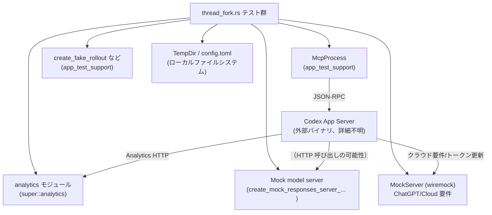
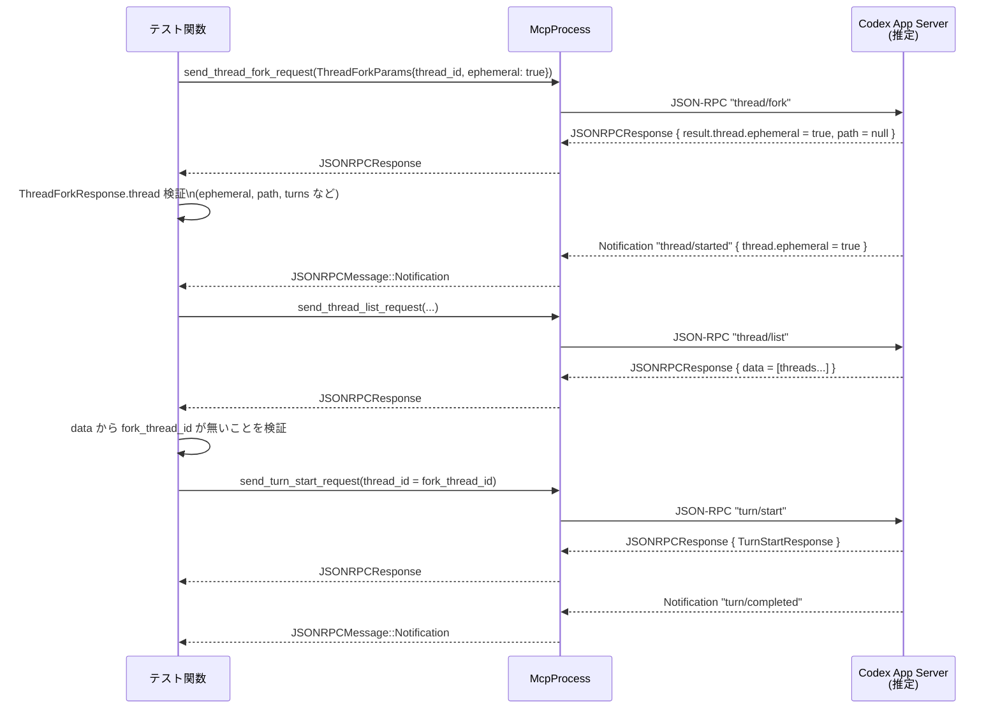

# app-server/tests/suite/v2/thread_fork.rs コード解説

## 0. ざっくり一言

`thread_fork.rs` は、JSON-RPC エンドポイント `thread/fork` 周辺の挙動を統合的に検証する非同期テスト群です。  
永続スレッド／エフェメラルスレッドの分岐、通知順序、アナリティクス送信、クラウド要件読み込みエラーのサーフェスなどを確認します（`thread_fork.rs:L48-533`）。

---

## 1. このモジュールの役割

### 1.1 概要

このモジュールは **Codex アプリサーバーのスレッド分岐機能（thread/fork）** に関する次の点を検証します。

- ロールアウト（会話ログ）からのスレッドフォーク時に、元ファイルを変更せず新しいスレッドを生成すること（`thread_fork.rs:L48-145`）。
- 新しいスレッドが `thread/started` 通知で導入され、`thread/status/changed` が先行しないこと（`thread_fork.rs:L147-181`）。
- フォーク時にアナリティクスの「thread_initialized」イベントが記録されること（`thread_fork.rs:L186-227`）。
- ロールアウト未生成（unmaterialized）スレッドのフォークがエラーになること（`thread_fork.rs:L230-272`）。
- クラウド要件（cloud requirements）の読み込みエラーと認証失効が JSON-RPC エラーとして構造化されて返ること（`thread_fork.rs:L275-370`）。
- `ephemeral` フラグ付きフォークの非永続性（path なし・thread/list からの除外）と、フォーク先での turn 続行を確認すること（`thread_fork.rs:L372-533`）。

### 1.2 アーキテクチャ内での位置づけ

このテストファイルは、テストサポート層とモックサーバーを組み合わせて、JSON-RPC レベルでスレッド分岐の振る舞いを確認します。

主要コンポーネント:

- `thread_fork.rs` テスト群（本ファイル）
- `app_test_support::McpProcess`: JSON-RPC ベースのテストハーネス（外部クレート、実装はこのチャンクにはありません）
- `app_test_support` の各種フィクスチャ:  
  - `create_fake_rollout`（ロールアウトファイル生成）
  - `create_mock_responses_server_repeating_assistant`（モックモデルサーバー生成）
  - `write_chatgpt_auth`（認証情報ファイルを生成）
- `super::analytics` モジュール: アナリティクス検証用ヘルパー（`thread_fork.rs:L41-44, L197-227`）
- `wiremock::MockServer`: ChatGPT/クラウド要件バックエンドのモック（`thread_fork.rs:L275-293`）
- 一時ディレクトリ `TempDir` を「codex_home」として使用し、`config.toml` をヘルパー関数で生成（`thread_fork.rs:L51-52, L190-197, L234-235, L295-303, L375-377, L535-594`）

依存関係の概要を Mermaid で示します。



※ Codex App Server と外部 HTTP 先（F, G）との具体的なやり取りは、このファイルのコードからは直接は読み取れません。URL やステータスコードの設定のみが確認できます（`thread_fork.rs:L275-293, L297-303`）。

### 1.3 設計上のポイント

- **非同期テスト**  
  すべてのテストは `#[tokio::test]` で宣言され、Tokio ランタイム上で非同期に実行されます（`thread_fork.rs:L48, L186, L230, L275, L372`）。
- **タイムアウトによるハング防止**  
  JSON-RPC の初期化やレスポンス待機には `tokio::time::timeout` を用い、テストがハングしないようにしています（`thread_fork.rs:L81, L89-93, L209, L217-221, L245-249, L258-262, L336, L344-348, L399-402, L446-449, L495-499, L520-524, L526-530`）。
- **JSON-RPC 型の明示的な使用**  
  `JSONRPCResponse`, `JSONRPCError`, `JSONRPCMessage`, `RequestId` などの型を利用し、プロトコルレベルでの正しい応答・通知を検証しています（`thread_fork.rs:L8-11, L89-95, L151-152, L217-222, L245-250, L258-262, L344-348, L399-405, L495-500, L520-525`）。
- **ファイルシステム・セマンティクスの検証**  
  フォーク前後のロールアウトファイル内容を比較し、オリジナルが変更されないことを確認します（`thread_fork.rs:L64-79, L108-112`）。
- **エッジケース中心のテスト設計**  
  - 未永続化スレッドのフォークエラー（`thread_fork.rs:L230-272`）
  - クラウド要件読み込み時の 401 エラー＋リフレッシュトークン無効化（`thread_fork.rs:L275-370`）
  - `ephemeral` フォークの非リスト表示・パス非公開（`thread_fork.rs:L372-505`）
- **通知順序の契約検証**  
  `thread/fork` 後に、新スレッドは `thread/started` 通知で初めて紹介され、その前に同じ thread_id の `thread/status/changed` が送られないことを loop で検証します（`thread_fork.rs:L147-168, L446-465`）。
- **アナリティクスの契約検証**  
  `thread_initialized` イベントに `origin = "forked"` 相当の情報が含まれることを検証します（`thread_fork.rs:L186-227`）。

---

## 2. 主要な機能一覧

このファイルが提供（検証）する主要な機能は次の通りです。

- 永続ロールアウトからの `thread/fork` 正常系: 新しいスレッドの生成と `thread/started` 通知の送信を確認（`thread_fork.rs:L48-184`）。
- スレッドフォーク時のアナリティクス `thread_initialized` イベント計測の検証（`thread_fork.rs:L186-227`）。
- 未永続化スレッド（ロールアウト未生成）のフォーク拒否（`thread_fork.rs:L230-272`）。
- ChatGPT/クラウド要件読み込み失敗時のエラー情報サーフェスの検証（`thread_fork.rs:L275-370`）。
- `ephemeral` フォークのセマンティクス（パスなし・thread/list 非表示・turn/start 利用可能）の検証（`thread_fork.rs:L372-533`）。
- テスト用 `config.toml` 生成ヘルパー（通常版／ChatGPT base URL 付き）（`thread_fork.rs:L535-594`）。

---

## 3. 公開 API と詳細解説

このファイル自身は公開 API を定義していませんが、テストで利用する主要な型・関数を整理します。

### 3.1 型一覧（構造体・列挙体など）

このファイル内で「定義」はしていませんが、テスト対象やデータフロー把握に重要な型を列挙します。

| 名前 | 種別 | 定義元 | 役割 / 用途 | 使用箇所（行） |
|------|------|--------|-------------|----------------|
| `ThreadForkParams` | 構造体 | `codex_app_server_protocol` | `thread/fork` JSON-RPC リクエストのパラメータ。`thread_id`, `ephemeral` などを含む。 | `thread_fork.rs:L84-87, L212-215, L253-256, L339-342, L392-396` |
| `ThreadForkResponse` | 構造体 | 同上 | `thread/fork` のレスポンス。`thread` フィールドにフォークされたスレッドの情報を含む。 | `thread_fork.rs:L95, L222, L404` |
| `ThreadListParams` | 構造体 | 同上 | `thread/list` リクエストの検索・フィルタ条件。 | `thread_fork.rs:L484-493` |
| `ThreadListResponse` | 構造体 | 同上 | `thread/list` の結果、`data` にスレッド一覧。 | `thread_fork.rs:L500` |
| `ThreadStartParams` | 構造体 | 同上 | `thread/start` リクエスト。未永続スレッドを開始するために使用。 | `thread_fork.rs:L240-243` |
| `ThreadStartResponse` | 構造体 | 同上 | `thread/start` のレスポンス。新規スレッド情報を含む。 | `thread_fork.rs:L250` |
| `TurnStartParams` | 構造体 | 同上 | `turn/start` リクエスト。スレッド上で新しいターンを開始する。 | `thread_fork.rs:L511-517` |
| `TurnStartResponse` | 構造体 | 同上 | `turn/start` のレスポンス。ターン情報を含む。 | `thread_fork.rs:L525` |
| `ThreadStartedNotification` | 構造体 | 同上 | `thread/started` 通知のペイロード。新しいスレッドの紹介。 | `thread_fork.rs:L179-181, L479-481` |
| `ThreadStatusChangedNotification` | 構造体 | 同上 | `thread/status/changed` 通知のペイロード。ステータス変更イベント。 | `thread_fork.rs:L156-161, L454-459` |
| `ThreadStatus` | 列挙体 | 同上 | スレッドの状態（例: `Idle`）。 | `thread_fork.rs:L118, L416` |
| `TurnStatus` | 列挙体 | 同上 | ターンの状態（例: `Interrupted`, `Completed`）。 | `thread_fork.rs:L132, L421` |
| `ThreadItem` | 列挙体 | 同上 | ターン内のアイテム。ここでは `UserMessage` バリアントを使用。 | `thread_fork.rs:L135-144, L423-434` |
| `UserInput` | 列挙体 | 同上 | ユーザー入力。`Text { text, text_elements }` などのバリアント。 | `thread_fork.rs:L138-141, L315-322, L427-430, L513-516` |
| `JSONRPCResponse` | 構造体 | `codex_app_server_protocol` | JSON-RPC 成功レスポンス。`result` フィールドを持つ。 | `thread_fork.rs:L89-95, L217-222, L245-250, L399-405, L495-500, L520-525` |
| `JSONRPCError` | 構造体 | 同上 | JSON-RPC エラーレスポンス。`error.message`, `error.data` などを含む。 | `thread_fork.rs:L258-262, L344-348` |
| `JSONRPCMessage` | 列挙体 | 同上 | レスポンスまたは通知を表す。ここでは `Notification` バリアントを使用。 | `thread_fork.rs:L151-153, L449-451` |
| `RequestId` | 列挙体 | 同上 | JSON-RPC request-id。ここでは `Integer` を使用。 | `thread_fork.rs:L91-92, L219-220, L247-248, L346-347, L401, L497-498, L522-523` |
| `SessionSource` | 列挙体 | 同上 | スレッドの生成元（例: `VsCode`）。 | `thread_fork.rs:L123` |
| `ChatGptAuthFixture` | 構造体 | `app_test_support` | ChatGPT 認証情報のテスト用フィクスチャ。 | `thread_fork.rs:L2, L304-313` |
| `McpProcess` | 構造体 | `app_test_support` | Codex App Server と JSON-RPC 通信を行うテスト用クライアント。 | `thread_fork.rs:L3, L80-83, L208-216, L236-244, L325-343, L388-397, L449-450, L483-493, L510-518, L526-530` |
| `AuthCredentialsStoreMode` | 列挙体 | `codex_config::types` | 認証情報の保存モード（ここではファイル保存）。 | `thread_fork.rs:L27, L312` |
| `TempDir` | 構造体 | `tempfile` | 一時ディレクトリを管理。`codex_home` として利用。 | `thread_fork.rs:L33, L51, L190, L233, L295, L375` |

### 3.2 関数詳細（7 件）

#### `thread_fork_creates_new_thread_and_emits_started() -> Result<()>`

**概要**

永続化されたロールアウトから `thread/fork` を実行したときに、新しいスレッドが正しく生成され、元ファイルが変更されず、`thread/started` 通知でスレッドが紹介されることを検証します（`thread_fork.rs:L48-184`）。

**引数**

なし（Tokio テスト関数）。

**戻り値**

- `Result<()>` (`anyhow::Result`):  
  テスト成功時は `Ok(())`、タイムアウトやアサーション失敗、JSON 変換エラーなどで `Err` になります。

**内部処理の流れ**

1. モックモデルサーバーと一時ディレクトリ `codex_home` を用意し、`config.toml` を書き出す（`thread_fork.rs:L50-52`）。
2. `create_fake_rollout` でロールアウトファイルを作成し、パスと元内容を読み込む（`thread_fork.rs:L54-62, L64-79`）。
3. `McpProcess::new` と `initialize` で JSON-RPC セッションを開始する（`thread_fork.rs:L80-82`）。
4. `send_thread_fork_request` で `thread/fork` を送り、`read_stream_until_response_message` でレスポンスを取得し、`ThreadForkResponse` にパースする（`thread_fork.rs:L83-95`）。
5. レスポンスの `result.thread` JSON を直接検査し、`name` フィールドが `null` であることを確認（`thread_fork.rs:L94-106`）。
6. フォーク後も元のロールアウトファイル内容が変わっていないことを比較確認（`thread_fork.rs:L108-112`）。
7. `ThreadForkResponse::thread` の各フィールドを確認:  
   - `id` が元と異なる  
   - `forked_from_id` が元の id  
   - `preview`, `model_provider`, `status = Idle`, `path`/`cwd` が絶対パスで元ファイルと異なる  
   - `source = SessionSource::VsCode`, `name = None`  
   - `turns` に 1 件の `TurnStatus::Interrupted` なターンがあり、その中に一つの `UserMessage` が元の preview と一致する（`thread_fork.rs:L114-145`）。
8. `thread/started` 通知を受信するまで JSON-RPC メッセージをループし、同じ thread id の `thread/status/changed` が先行した場合はテストを失敗させる（`thread_fork.rs:L147-168`）。
9. `thread/started` 通知内の `thread` JSON でも `name: null` がシリアライズされていること、`ThreadStartedNotification.thread` がレスポンスの `thread` と完全一致することを検証（`thread_fork.rs:L169-181`）。

**Examples（使用例）**

このテスト自体が `thread/fork` の典型的な利用フロー（永続スレッドからフォーク → レスポンス検査 → 通知待ち）を示しています。

**Errors / Panics**

- `timeout` が `Elapsed` を返した場合や、`McpProcess` 側でエラーが発生した場合、`await??` によりテストが `Err` で終了します（`thread_fork.rs:L81, L89-93, L151`）。
- 期待するフィールド値と異なる場合は `assert!`／`assert_eq!` によりテスト失敗となります（`thread_fork.rs:L73-77, L102-106, L109-112, L114-145, L175-178, L181`）。
- 予期しない `ThreadItem` バリアントの場合、`panic!` を発生させます（`thread_fork.rs:L144-145`）。
- `serde_json::from_value` で JSON => 型変換エラーとなった場合も `?` によってテスト失敗になります（`thread_fork.rs:L156-157, L179-180`）。

**Edge cases（エッジケース）**

- `thread/status/changed` 通知が新しい thread id に対して先に届いた場合、`anyhow::bail!` によりテストは必ず失敗します（`thread_fork.rs:L155-162`）。  
  これは「スレッドの導入は `thread/started` が最初であるべき」という契約を表します。
- `result.thread` が object でない、あるいは `name` フィールドが存在しない場合 `expect(...)` により panic します（`thread_fork.rs:L97-101`）。  
  つまり、スキーマ破壊に対して敏感に失敗します。

**使用上の注意点**

- 同様のテストを書く場合、JSON-RPC 通信の読み取りループには `timeout` を必ず付けることで、サーバーの不具合によるテストハングを防いでいます。
- `thread_fork.rs` では `SessionSource::VsCode` 固定で検証しているため、他の source を扱うテストでは別途パラメータやアサーションを調整する必要があります（`thread_fork.rs:L123`）。

---

#### `thread_fork_tracks_thread_initialized_analytics() -> Result<()>`

**概要**

`thread/fork` 実行時にアナリティクスの「thread_initialized」イベントが送信され、その内容がフォーク起点スレッドとして正しく記録されることを検証します（`thread_fork.rs:L186-227`）。

**引数 / 戻り値**

- 引数: なし
- 戻り値: `Result<()>`（同上）

**内部処理**

1. モックモデルサーバーと `codex_home` を作成し、`chatgpt_base_url` と `general_analytics = true` を含む `config.toml` を書き出す（`thread_fork.rs:L188-197`）。
2. `enable_analytics_capture` でアナリティクス送信先（モックサーバー）をセットアップ（`thread_fork.rs:L197`）。
3. `create_fake_rollout` でロールアウトを生成（`thread_fork.rs:L199-206`）。
4. `McpProcess` を初期化し、`thread/fork` を実行、`ThreadForkResponse` を取得（`thread_fork.rs:L208-222`）。
5. `wait_for_analytics_payload` でアナリティクスペイロードを待ち受け、`thread_initialized_event` で対象イベントを抽出（`thread_fork.rs:L224-225`）。
6. `assert_basic_thread_initialized_event` でイベントが  
   - `thread.id`  
   - モデル名 `"mock-model"`  
   - オリジン `"forked"`  
   を持つことを確認（`thread_fork.rs:L226`）。

**Errors / Edge cases**

- アナリティクスイベントが送信されない場合、`wait_for_analytics_payload` か `thread_initialized_event` 内でエラーとなりテストが失敗すると推測できますが、実装はこのチャンクには現れません（`thread_fork.rs:L224-225`）。
- `assert_basic_thread_initialized_event` がより詳細な内容（たとえば timestamp や source）も検証している可能性がありますが、詳細は `super::analytics` の実装次第です（`thread_fork.rs:L41, L226`）。

**使用上の注意点**

- アナリティクス関連テストでは、設定ファイルに `[features]` セクションと `general_analytics = true` を入れる必要があります（`thread_fork.rs:L559-567, L582-583`）。
- 実運用コードではアナリティクス送信の失敗をユーザーに直接露出しないことが多いですが、このテストは「送信されるべき成功パス」を確認する目的です。

---

#### `thread_fork_rejects_unmaterialized_thread() -> Result<()>`

**概要**

`thread/start` で作成したがロールアウトファイルが存在しない（未 materialized）スレッドを `thread/fork` しようとするとエラーになることを確認します（`thread_fork.rs:L230-272`）。

**内部処理**

1. モックモデルサーバー／`codex_home`／`config.toml` をセットアップ（`thread_fork.rs:L232-235`）。
2. `thread/start` を呼び出し、`ThreadStartResponse` から `thread.id` を取得（`thread_fork.rs:L239-250`）。
3. 取得した thread id に対して `thread/fork` を実行し、`read_stream_until_error_message` で `JSONRPCError` を受信（`thread_fork.rs:L252-262`）。
4. エラーメッセージ文字列に `"no rollout found for thread id"` が含まれることを検証（`thread_fork.rs:L263-270`）。

**Errors / Edge cases**

- このテストは「ロールアウト未生成＝フォーク禁止」という契約を表しています。  
  ロールアウトを生成するヘルパー `create_fake_rollout` を使用していないことがポイントです（`thread_fork.rs:L239-250` にそれが登場しない）。

**使用上の注意点**

- 新たなテストで類似のエラー条件を作るとき、`thread/start` だけ行い `create_fake_rollout` を呼ばない、という差分で「未 materialized」を作っています。

---

#### `thread_fork_surfaces_cloud_requirements_load_errors() -> Result<()>`

**概要**

クラウド要件（Cloud Requirements）やトークン更新に失敗した場合、`thread/fork` が JSON-RPC エラーとして構造化された情報を返すことを検証します（`thread_fork.rs:L275-370`）。

**内部処理**

1. `wiremock::MockServer` を起動し、次の 2 つのエンドポイントを定義（`thread_fork.rs:L277-293`）。
   - `GET /backend-api/wham/config/requirements` → 401 + HTML （`thread_fork.rs:L278-284`）
   - `POST /oauth/token` → 401 + JSON `{"error": {"code": "refresh_token_invalidated"}}`（`thread_fork.rs:L287-291`）
2. モックモデルサーバーと `codex_home` を準備し、`chatgpt_base_url` に MockServer の `/backend-api` を設定した `config.toml` を生成（`thread_fork.rs:L295-303, L559-591`）。
3. `write_chatgpt_auth` で無効な refresh token を含む認証情報をファイル保存（`thread_fork.rs:L304-313`）。
4. `create_fake_rollout` でフォーク元ロールアウトを生成（`thread_fork.rs:L315-322`）。
5. 環境変数 `REFRESH_TOKEN_URL_OVERRIDE_ENV_VAR`（定数名）を MockServer の `/oauth/token` に向けて `McpProcess::new_with_env` を呼び出し、初期化（`thread_fork.rs:L324-336`）。
6. `thread/fork` を実行し、`JSONRPCError` を取得（`thread_fork.rs:L338-348`）。
7. エラーメッセージに `"failed to load configuration"` が含まれることを確認（`thread_fork.rs:L350-356`）。
8. `error.data` が次の JSON と厳密一致することを `assert_eq!` で検証（`thread_fork.rs:L358-367`）。

```json
{
  "reason": "cloudRequirements",
  "errorCode": "Auth",
  "action": "relogin",
  "statusCode": 401,
  "detail": "Your access token could not be refreshed because your refresh token was revoked. Please log out and sign in again."
}
```

**Errors / Edge cases**

- `requirements` が 401 かつ HTML で返るようにモックしているため、「API 仕様から外れたフォーマット + 認証エラー」という組み合わせを想定していると考えられますが、どのように内部で解釈しているかはこのファイルからは分かりません。
- `refresh_token_invalidated` というコードを必ず 401 と紐付けて扱うことを前提にしている可能性があります（`thread_fork.rs:L287-291, L364-365`）。

**使用上の注意点**

- 新しいクラウドエラーケースをテストする際は、`error.data` の JSON 形状が UI やクライアントにとって重要な契約となるため、固定文字列比較（`assert_eq!`）を用いることが有効であることを示しています。
- テスト環境では `OPENAI_API_KEY` を `None` にしており、アクセストークンは refresh token 経由の取得のみが試みられると推測されます（`thread_fork.rs:L328-333`）。

---

#### `thread_fork_ephemeral_remains_pathless_and_omits_listing() -> Result<()>`

**概要**

`ThreadForkParams { ephemeral: true }` により作成された「エフェメラルフォーク」が、  
(1) `path` を持たない、(2) `thread/list` から除外されるが、(3) `turn/start` で対話を継続できる、という契約を検証します（`thread_fork.rs:L372-533`）。

**内部処理**

1. モックモデルサーバー／`codex_home`／`config.toml`／ロールアウトを準備（`thread_fork.rs:L374-386`）。
2. `ephemeral: true` を指定して `thread/fork` を実行し、`ThreadForkResponse` を取得（`thread_fork.rs:L391-405`）。
3. 返された `thread` について、次を確認（`thread_fork.rs:L407-418`）。
   - `ephemeral == true`
   - `path == None`
   - `preview` が元と同じ
   - `status == ThreadStatus::Idle`
   - `name == None`
   - `turns.len() == 1`
4. 初期ターンの状態が `TurnStatus::Completed` であり、中身が `UserMessage` で preview テキストと一致することを確認（`thread_fork.rs:L420-434`）。  
   ※ 永続フォークの場合は `Interrupted` であった点と対照的です（`thread_fork.rs:L132`）。
5. `result.thread` JSON に `ephemeral: true` がシリアライズされていることを確認（`thread_fork.rs:L436-444`）。
6. 最初のテストと同様に、`thread/started` 通知を待ち受けるループで、`thread/status/changed` が先行した場合は失敗させ、`thread/started` ペイロードの `ephemeral: true` と `ThreadStartedNotification.thread == thread` を検証（`thread_fork.rs:L446-481`）。
7. `thread/list` を呼び出し、返ってきた `data` 配列に対して次を検証（`thread_fork.rs:L483-508, L500`）。
   - `fork_thread_id`（エフェメラルフォーク）は含まれない。
   - 元の `conversation_id` は含まれる。
8. エフェメラルフォークに対して `turn/start` を行い、レスポンスを受け取ったのち `turn/completed` 通知を待つ（`thread_fork.rs:L510-530`）。

**Errors / Edge cases**

- `thread/list` にエフェメラルスレッドが含まれていた場合、`data.iter().all(|candidate| candidate.id != fork_thread_id)` が失敗します（`thread_fork.rs:L501-504`）。
- `turn/completed` 通知が来ない場合、`timeout` によりテストが失敗します（`thread_fork.rs:L526-530`）。
- 初期ターンの `status` や `items` が期待と異なる場合、`assert_eq!` と `match` の `panic!` により失敗します（`thread_fork.rs:L421-434`）。

**使用上の注意点**

- エフェメラルスレッドは「UI から見えないが、ターンを続行できる内部スレッド」として扱われています。この契約に依存するフロントエンド（例: 一時的な試行対話）の実装がある場合、破ると UX に影響します。
- 永続フォークとの違い（初期ターンの `TurnStatus` が `Completed` か `Interrupted` か）は、ロールアウトファイルとの対応関係に関わるため、変更時は慎重な検討が必要です。

---

#### `create_config_toml(codex_home: &Path, server_uri: &str) -> std::io::Result<()>`

**概要**

モックモデルサーバーに対する最小限の設定を含む `config.toml` を `codex_home` に書き出すテスト用ヘルパーです（`thread_fork.rs:L535-557`）。

**引数**

| 引数名 | 型 | 説明 |
|--------|----|------|
| `codex_home` | `&Path` | 設定ファイル `config.toml` を出力するディレクトリ。通常は `TempDir` のパスです（`thread_fork.rs:L51, L190, L233, L375`）。 |
| `server_uri` | `&str` | モックモデルサーバーのベース URI。`base_url = "{server_uri}/v1"` として設定されます（`thread_fork.rs:L550`）。 |

**戻り値**

- `std::io::Result<()>`: ファイル書き込みに成功した場合は `Ok(())`、失敗した場合は I/O エラーを返します。

**内部処理**

1. `codex_home.join("config.toml")` で出力先パスを決定（`thread_fork.rs:L537`）。
2. `std::fs::write` で TOML 文字列をファイルへ書き込む（`thread_fork.rs:L538-556`）。
   - 設定内容には `model = "mock-model"`, `approval_policy = "never"`, `sandbox_mode = "read-only"`, `model_provider = "mock_provider"` などが含まれます（`thread_fork.rs:L541-553`）。

**使用上の注意点**

- テスト用の設定であり、本番設定とは異なる可能性があります。
- `server_uri` は末尾 `/v1` を付ける前提で使われるため、基本的には `/v1` を含まないベース URL を渡すべきです（`thread_fork.rs:L550`）。

---

#### `create_config_toml_with_chatgpt_base_url(codex_home: &Path, server_uri: &str, chatgpt_base_url: &str, general_analytics_enabled: bool) -> std::io::Result<()>`

**概要**

ChatGPT ベース URL やアナリティクス設定を含む `config.toml` を生成するヘルパーです（`thread_fork.rs:L559-593`）。クラウド要件やアナリティクス系のテストで使用されます（`thread_fork.rs:L190-197, L298-303`）。

**引数**

| 引数名 | 型 | 説明 |
|--------|----|------|
| `codex_home` | `&Path` | `config.toml` の出力先ディレクトリ。 |
| `server_uri` | `&str` | モデルサーバー用ベース URI。`base_url = "{server_uri}/v1"` に使用。 |
| `chatgpt_base_url` | `&str` | ChatGPT API ベース URL。`chatgpt_base_url` キーにそのまま入ります（`thread_fork.rs:L578`）。 |
| `general_analytics_enabled` | `bool` | true の場合、`[features]` セクションに `general_analytics = true` を出力します（`thread_fork.rs:L565-567, L582-583`）。 |

**戻り値**

- `std::io::Result<()>`: ファイル書き込みの成功／失敗。

**内部処理**

1. `general_analytics_enabled` に応じて `general_analytics_toml` 文字列を生成（`thread_fork.rs:L565-569`）。
2. `config.toml` パスを決定し、`format!` で埋め込んだ TOML 文字列を書き込み（`thread_fork.rs:L570-593`）。
   - `chatgpt_base_url`、`[features]` セクション、および `model_providers.mock_provider` を含む。

**使用上の注意点**

- `general_analytics_enabled` を `true` にした場合は、アナリティクス送信を前提とするテスト（`thread_fork_tracks_thread_initialized_analytics`）がイベントを受け取れるようになります（`thread_fork.rs:L190-197`）。
- ChatGPT/Cloud 要件読み込みテストでは `chatgpt_base_url` を `MockServer` の `/backend-api` に向けて使います（`thread_fork.rs:L297-303`）。

---

### 3.3 その他の関数

このファイルに定義される関数は上記 7 件のみであり、その他の補助関数はすべて外部クレート／モジュールからのインポートです。

---

## 4. データフロー

ここでは代表的な処理シナリオとして、永続スレッドからの `thread/fork` 正常系のデータフローを示します。

### 4.1 `thread_fork_creates_new_thread_and_emits_started` のフロー

テストの観点から見ると、以下のような JSON-RPC レベルのやりとりが行われます。

```mermaid
sequenceDiagram
    %% thread_fork_creates_new_thread_and_emits_started (thread_fork.rs:L48-184)
    participant Test as テスト関数
    participant Mcp as McpProcess
    participant App as Codex App Server<br/>(推定)

    Test->>Test: create_fake_rollout でロールアウト作成
    Test->>Test: create_config_toml で config.toml 作成
    Test->>Mcp: new(codex_home.path())
    Test->>Mcp: initialize() （timeout 付き）
    Mcp->>App: JSON-RPC 初期化（詳細不明）

    Test->>Mcp: send_thread_fork_request(ThreadForkParams{thread_id})
    Mcp->>App: JSON-RPC Request "thread/fork"
    App-->>Mcp: JSONRPCResponse { result.thread = ... }
    Mcp-->>Test: JSONRPCResponse

    Test->>Test: ThreadForkResponse にデコードし\nthread フィールド検証

    loop 通知待ち
        App-->>Mcp: JSONRPCMessage （通知 or 他レスポンス）
        Mcp-->>Test: JSONRPCMessage
        alt Notification が thread/status/changed
            Test->>Test: status_changed.thread_id == thread.id なら失敗
        else Notification が thread/started
            Test->>Test: ThreadStartedNotification にデコードし\nthread.name, thread == response.thread を検証
            break
        end
    end
```

※ App サーバー内部でのモデルサーバーへの HTTP 呼び出し有無は、このファイルからは直接は分かりませんが、`create_mock_responses_server_repeating_assistant` によりモックサーバーがセットアップされていることから、そのような呼び出しが前提とされていると考えられます（`thread_fork.rs:L50`）。

### 4.2 エフェメラルフォークと thread/list の関係

エフェメラルフォークのデータフローは以下のようになります。



---

## 5. 使い方（How to Use）

このファイルはテストですが、Codex アプリサーバーの JSON-RPC クライアントやテストを書く際の実用的なパターンが含まれています。

### 5.1 基本的な使用方法

以下は、永続スレッドから `thread/fork` を行う際の最小パターンを抽出した例です。

```rust
use anyhow::Result;
use app_test_support::{McpProcess, create_fake_rollout};
use codex_app_server_protocol::{ThreadForkParams, ThreadForkResponse, RequestId, JSONRPCResponse};
use tempfile::TempDir;
use tokio::time::timeout;

const DEFAULT_READ_TIMEOUT: std::time::Duration = std::time::Duration::from_secs(10);

// テストまたはサンプル関数
async fn fork_thread_example() -> Result<()> {
    let server = create_mock_responses_server_repeating_assistant("Done").await; // モデルサーバーモック
    let codex_home = TempDir::new()?;                                           // 一時ディレクトリ
    create_config_toml(codex_home.path(), &server.uri())?;                      // config.toml 作成

    // ロールアウト生成
    let preview = "Saved user message";
    let conversation_id = create_fake_rollout(
        codex_home.path(),
        "2025-01-05T12-00-00",
        "2025-01-05T12:00:00Z",
        preview,
        Some("mock_provider"),
        None,
    )?;

    // MCP プロセス初期化
    let mut mcp = McpProcess::new(codex_home.path()).await?;
    timeout(DEFAULT_READ_TIMEOUT, mcp.initialize()).await??;

    // thread/fork リクエスト送信
    let fork_id = mcp
        .send_thread_fork_request(ThreadForkParams {
            thread_id: conversation_id,
            ..Default::default()
        })
        .await?;
    let fork_resp: JSONRPCResponse = timeout(
        DEFAULT_READ_TIMEOUT,
        mcp.read_stream_until_response_message(RequestId::Integer(fork_id)),
    )
    .await??;

    // 型付きレスポンスに変換
    let ThreadForkResponse { thread, .. } = to_response::<ThreadForkResponse>(fork_resp)?;

    println!("Forked thread id = {}", thread.id); // 新しいスレッドの利用

    Ok(())
}
```

このコードは `thread_fork_creates_new_thread_and_emits_started` の一部を簡略化したもので、基本的な `thread/fork` 呼び出しフローを示します（`thread_fork.rs:L48-95`）。

### 5.2 よくある使用パターン

1. **アナリティクス付きフォーク**

   - `create_config_toml_with_chatgpt_base_url` で `general_analytics = true` を設定。
   - `enable_analytics_capture` を呼び、`wait_for_analytics_payload` でイベントを取得（`thread_fork.rs:L190-198, L224-227`）。

2. **クラウド要件エラーの再現**

   - `MockServer` で `requirements` と `oauth/token` の応答を 401 に設定（`thread_fork.rs:L277-293`）。
   - `REFRESH_TOKEN_URL_OVERRIDE_ENV_VAR` 環境変数を指定して `McpProcess::new_with_env` を呼ぶ（`thread_fork.rs:L324-335`）。
   - `thread/fork` のエラー `error.data` を検証。

3. **エフェメラルフォークでの一時的な分岐**

   - `ThreadForkParams { ephemeral: true, .. }` を指定（`thread_fork.rs:L392-396`）。
   - `thread/list` には出てこないが、`turn/start` を投げて一時的な対話を実行（`thread_fork.rs:L483-530`）。

### 5.3 よくある間違い

テストコードから推測される、起こりやすい誤用と正しい例を対比します。

```rust
// 誤り例: initialize() を呼ばずに JSON-RPC リクエストを送る
let mut mcp = McpProcess::new(codex_home.path()).await?;
// let fork_id = mcp.send_thread_fork_request(...).await?; // ← 初期化前

// 正しい例: initialize() を完了させてからリクエストを送る
let mut mcp = McpProcess::new(codex_home.path()).await?;
timeout(DEFAULT_READ_TIMEOUT, mcp.initialize()).await??;   // ← 初期化
let fork_id = mcp
    .send_thread_fork_request(ThreadForkParams { /* ... */ })
    .await?;
```

```rust
// 誤り例: エフェメラルフォークを thread/list に出る前提で探す
let list_id = mcp.send_thread_list_request(/* ... */).await?;
let resp: JSONRPCResponse = /* ... */;
let ThreadListResponse { data, .. } = to_response::<ThreadListResponse>(resp)?;
// data 内から fork_thread_id を探すのは誤り

// 正しい例: エフェメラルフォークは thread/list に出ない前提で扱う
assert!(data.iter().all(|candidate| candidate.id != fork_thread_id));
```

### 5.4 使用上の注意点（まとめ）

- **タイムアウトの設定**: すべてのネットワーク／JSON-RPC 待機には `timeout` をかけ、テストやクライアントがハングしないようにしています（`thread_fork.rs:L81, L89-93, L209, L217-221, L245-249, L258-262, L336, L344-348, L399-402, L446-449, L495-499, L520-524, L526-530`）。
- **通知順序の契約**: 新スレッドの導入には `thread/started` 通知が先行し、同じ thread id の `thread/status/changed` が前に来ないことが前提です（`thread_fork.rs:L147-168, L446-465`）。
- **永続 vs エフェメラル**: エフェメラルフォークは `path` を持たず `thread/list` にも現れないが、`turn/start` で対話可能という二重性があります（`thread_fork.rs:L407-418, L436-444, L483-508, L510-530`）。
- **ロールアウト存在チェック**: フォークの前提としてロールアウトファイルが存在している必要があるため、UI やクライアント側でも「フォーク可能状態」を明示する設計が望ましいと読み取れます（`thread_fork.rs:L263-270`）。

---

## 6. 変更の仕方（How to Modify）

### 6.1 新しい機能を追加する場合（テスト追加を想定）

1. **テストの目的を決める**  
   例: `thread/fork` の別パラメータ、別の `SessionSource`、異なるモデルプロバイダなど。
2. **セットアップコードの再利用**  
   - `create_config_toml` または `create_config_toml_with_chatgpt_base_url` を使用して `config.toml` を生成（`thread_fork.rs:L535-593`）。
   - 必要に応じて `create_fake_rollout` でロールアウトを作成（`thread_fork.rs:L54-62, L199-206, L315-322, L379-386`）。
3. **McpProcess の呼び出しパターンを踏襲**  
   - `McpProcess::new` / `new_with_env` → `initialize` → `send_*_request` → `read_stream_until_*` という流れを使う（`thread_fork.rs:L80-83, L208-216, L236-244, L325-343, L388-397, L483-499, L510-525`）。
4. **検証ロジックの設計**  
   - フィールド値の検証には `assert_eq!`、存在確認には `assert!` を使用。
   - 通知の順序や有無を検証する場合は、既存のループパターンを参考にする（`thread_fork.rs:L147-168, L446-465`）。
5. **エラーケースの場合**  
   - `read_stream_until_error_message` を使用し、`JSONRPCError` の `error.message` および `error.data` を検証する（`thread_fork.rs:L258-262, L344-348`）。

### 6.2 既存の機能を変更する場合

- **thread/fork の仕様変更時**

  - ロールアウトファイルの扱いが変わる場合:  
    `thread_fork_creates_new_thread_and_emits_started` のファイル比較（`thread_fork.rs:L64-79, L108-112`）や `forked_from_id` 検証を更新する必要があります。
  - 通知順序が変わる場合:  
    `thread/status/changed` と `thread/started` のテストを調整する必要があります（`thread_fork.rs:L147-168, L446-465`）。

- **エフェメラルフォークの振る舞い変更**

  - `thread/list` に含める設計に変更する場合、`thread_fork_ephemeral_remains_pathless_and_omits_listing` のアサーションを更新する必要があります（`thread_fork.rs:L501-508`）。
  - `path` を付与するようにした場合、`thread.path == None` のチェックを変更する必要があります（`thread_fork.rs:L411-414`）。

- **クラウド要件／認証エラーの仕様変更**

  - エラーコードや `error.data` の形状が変わる場合、`thread_fork_surfaces_cloud_requirements_load_errors` の JSON 比較を合わせて変更する必要があります（`thread_fork.rs:L358-367`）。

変更後は、関連する JSON-RPC クライアントや UI が期待する契約（フィールド名・型・通知順序）が保たれているかを確認する必要があります。

---

## 7. 関連ファイル

このモジュールと密接に関係すると思われるファイル・モジュールは次の通りです。

| パス / モジュール | 役割 / 関係 |
|-------------------|------------|
| `app-server/tests/suite/v2/analytics` モジュール（ファイル名は `analytics.rs` 等と推定） | `super::analytics` としてインポートされ、アナリティクスイベントのキャプチャ・検証ヘルパーを提供します（`thread_fork.rs:L41-44, L197-227`）。ファイル名は Rust のモジュール規約に基づく推定であり、このチャンクには明示されていません。 |
| `app_test_support` クレート | `McpProcess`, `create_fake_rollout`, `create_mock_responses_server_repeating_assistant`, `write_chatgpt_auth`, `ChatGptAuthFixture`, `to_response` など、テスト支援用のコンポーネントを提供します（`thread_fork.rs:L2-7, L50, L54-62, L80-83, L188, L199-206, L239-244, L296-303, L304-313, L315-322, L374, L379-386, L388-397`）。 |
| `codex_app_server_protocol` クレート | JSON-RPC プロトコルの型定義（`ThreadForkParams`, `ThreadForkResponse`, `ThreadListResponse`, `ThreadStartResponse`, `ThreadStartedNotification`, `ThreadStatusChangedNotification`, `TurnStartParams`, `TurnStartResponse`, `ThreadItem`, `ThreadStatus`, `TurnStatus`, `UserInput`, `JSONRPCResponse`, `JSONRPCError`, `JSONRPCMessage`, `RequestId`, `SessionSource`）を提供します（`thread_fork.rs:L8-26`）。 |
| `codex_config` / `codex_login` クレート | 認証情報の保存モードおよびリフレッシュトークン URL の環境変数名を提供し、クラウド要件・トークン更新テストで使用されます（`thread_fork.rs:L27-28, L304-313, L324-333`）。 |

---

### Bugs / Security / 契約・エッジケース・観測性に関する補足

- **バグ検出の観点**  
  - 通知順序 (`thread/started` vs `thread/status/changed`) を厳格に検査しているため、バックエンドのイベント発行順序の不整合を検出できます（`thread_fork.rs:L147-168, L446-465`）。
  - ロールアウト未生成スレッドのフォーク禁止により、「中途半端な状態のスレッド」が生成されるバグを防ぎます（`thread_fork.rs:L263-270`）。
- **セキュリティの観点**  
  - クラウド要件読み込みの 401 エラーを「再ログインを促す構造化エラー」としてクライアントに伝えることで、曖昧な失敗でなく明示的なアクションをユーザーに提示する設計になっています（`thread_fork.rs:L358-367`）。
  - Refresh token が無効化された場合の扱いを明示的にテストしており、認証まわりの仕様変更時にリグレッションを検知しやすくなっています（`thread_fork.rs:L287-291, L364-365`）。
- **観測性（Observability）**  
  - アナリティクスイベント `thread_initialized` の内容を検証することで、「どのようなスレッドがどのモデルでどの起点から作成されたか」が計測されていることを確認しています（`thread_fork.rs:L224-227`）。
  - JSON-RPC エラーの `error.data` に詳細情報（`reason`, `errorCode`, `action`, `statusCode`, `detail`）を付与する設計は、クライアント側のロギングや UI 表示を豊富にするためのインターフェース契約として機能します（`thread_fork.rs:L358-367`）。

このように、本ファイルは `thread/fork` 機能の**契約（フィールド構造・通知順序・エラー形状・アナリティクスイベント）**をテストで明文化しており、それらが将来的な変更から守られるようになっています。
