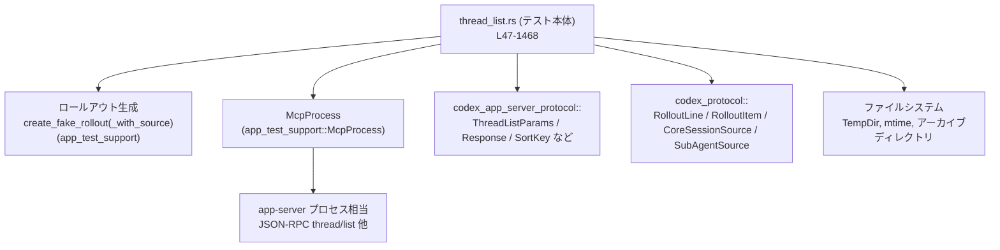
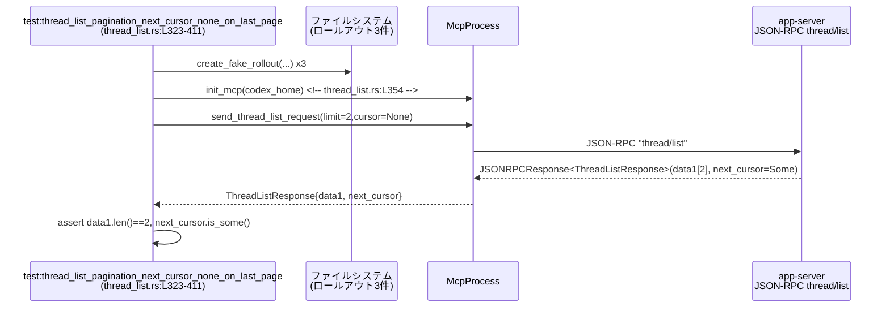

# app-server/tests/suite/v2/thread_list.rs コード解説

## 0. ざっくり一言

`thread_list.rs` は、JSON-RPC の `thread/list` エンドポイントと関連機能（フィルタリング・ソート・アーカイブ・エラー応答など）を **実際の app-server プロセス相当** と対話しながら検証する統合テスト群です（thread_list.rs:L47-51, L173-1468）。

---

## 1. このモジュールの役割

### 1.1 概要

- このモジュールは、`thread/list` API の **仕様レベルの挙動** を確認するために存在し、以下を検証します（thread_list.rs:L173-1468）。
  - 空データ・通常データのリスト取得
  - プロバイダ・カレントディレクトリ・検索語・ソース種別・アーカイブ状態などの各種フィルタ
  - `created_at` / `updated_at` によるソートと、UUID によるタイブレーク
  - ページネーション（`cursor`・`limit`・最大ページサイズ）
  - Git 情報やステータス (`ThreadStatus`) の反映
  - 不正な `cursor` に対するエラー応答

テストは `TempDir` 上に会話履歴（ロールアウト）ファイルを作成し、`McpProcess` 経由で app-server に JSON-RPC を送信する形で実行されます（thread_list.rs:L47-51, L102-126, L173-195）。

### 1.2 アーキテクチャ内での位置づけ

このテストファイルは、以下のコンポーネントの上に構成されています。

- **ファイルシステム上のロールアウトファイル**
  - `create_fake_rollout` / `create_fake_rollout_with_source` を通じて生成されます（thread_list.rs:L3-7, L102-126 での利用）。
- **McpProcess**
  - app-server との JSON-RPC 通信を抽象化したテスト用クライアントです（thread_list.rs:L2, L47-51, L73-100, 各テスト内）。
- **codex_app_server_protocol の型群**
  - `ThreadListParams`, `ThreadListResponse`, `ThreadSortKey`, `ThreadSourceKind`,
    `ThreadStatus`, `SessionSource`, `GitInfo` など（thread_list.rs:L11-24）。
- **codex_protocol の型群**
  - ロールアウトファイルの 1 行を表す `RolloutLine`, `RolloutItem`, セッションソース `CoreSessionSource` / `SubAgentSource`（thread_list.rs:L28-32, L153-171, L618-680, L712-753）。
- **tokio / timeout**
  - 非同期テストと I/O タイムアウト制御（thread_list.rs:L42, L47-51, L82-99, L215-219 など）。

依存関係を簡略化すると次のようになります。



> `McpProcess` や `create_fake_rollout` の実装はこのチャンクには登場しません。振る舞いは呼び出し側のコードとアサーションからのみ読み取っています。

### 1.3 設計上のポイント

- **非同期テスト / タイムアウト**
  - すべてのテストは `#[tokio::test]` かつ `async fn` として定義され、`tokio::time::timeout` で JSON-RPC 応答や通知に 10 秒の上限を設けています（thread_list.rs:L45, L47-51, L215-219 など）。
  - `timeout(...).await??` というパターンで、`Elapsed` エラーと JSON-RPC 内部のエラーの両方を `anyhow::Result` に伝播しています。

- **ファイルシステムをソースとしたエンドツーエンド検証**
  - 実際のロールアウトファイルを作成し、そのメタデータ（タイムスタンプ・CWD・アーカイブ状態など）を直接編集してから API 結果を確認します（thread_list.rs:L102-171, L821-845, L885-902）。

- **仕様ドキュメントとしてのテスト**
  - タイブレーク規則、最大ページサイズ、`search_term` の sqlite 条件など、仕様の細部がテストコードとして明文化されています（例: thread_list.rs:L880-928, L1236-1277, L526-603）。

- **Rust の安全性とエラー処理**
  - テスト関数は `anyhow::Result<()>` を返し、`?` 演算子で I/O・パース・JSON-RPC の失敗を即座にテスト失敗として扱います（thread_list.rs:L173-195 など）。
  - 一部 `expect` による前提条件チェックがあり、仕様が破れた場合にパニックで検知します（例: thread_list.rs:L281-283, L381, L766-771）。

---

## 2. 主要な機能一覧

このモジュールが検証する主な機能です（すべて `thread/list` API に関するもの）。

- 空データ時の挙動:
  - ロールアウトが 0 件のとき `data` は空配列・`next_cursor` は `None`（thread_list.rs:L173-195）。
- ページネーション:
  - `limit`・`cursor` によるページ分割と、最終ページでの `next_cursor = None`（thread_list.rs:L323-411）。
  - フィルタ後の件数が `limit` 以上になるまで内部ページングを継続する、あるいはデータ枯渇で停止する挙動（thread_list.rs:L816-878, L930-991）。
  - 最大ページサイズ（100）へのクランプと `next_cursor` 継続（thread_list.rs:L880-928）。
- フィルタリング:
  - モデルプロバイダ (`model_providers`) フィルタ（thread_list.rs:L413-464）。
  - カレントディレクトリ (`cwd`) フィルタ（thread_list.rs:L466-524）。
  - 検索語 (`search_term`) フィルタ（sqlite バックエンド使用時のみ有効）（thread_list.rs:L526-603）。
  - `source_kinds` によるソース種別 / SubAgent 変種でのフィルタ（thread_list.rs:L605-703, L705-814）。
  - `archived` によるアクティブ / アーカイブ分離（thread_list.rs:L1379-1438）。
- ソートとタイブレーク:
  - デフォルトは `created_at` 降順＋ UUID 降順のタイブレーク（thread_list.rs:L1041-1087, L1236-1277）。
  - `ThreadSortKey::UpdatedAt` 指定時は `updated_at` 降順＋ UUID 降順（thread_list.rs:L1090-1150, L1152-1234, L1279-1331）。
  - `updated_at` はロールアウトファイルの mtime を反映（thread_list.rs:L1333-1377）。
- メタ情報:
  - Git 情報 (`CoreGitInfo` → `ApiGitInfo`) の変換と返却（thread_list.rs:L993-1039）。
  - `SessionSource`, `ThreadStatus` などのフィールド値検証（thread_list.rs:L356-380, L413-464, L605-703 など）。
  - 失敗したターンを持つスレッドのステータスが `ThreadStatus::SystemError` になること（thread_list.rs:L197-286）。
- エラー応答:
  - 不正な `cursor` 文字列に対して JSON-RPC エラーコード `-32600` とメッセージ `invalid cursor: ...` を返すこと（thread_list.rs:L1440-1468）。

### 2.1 関数・テスト一覧（コンポーネントインベントリー）

| 名前 | 種別 | 役割（1 行） | 定義位置 |
|------|------|--------------|----------|
| `init_mcp` | `async fn` | `McpProcess` を生成し `initialize` するヘルパー | thread_list.rs:L47-51 |
| `list_threads` | `async fn` | ソートキー無しで `thread/list` を呼び出すラッパー | thread_list.rs:L53-71 |
| `list_threads_with_sort` | `async fn` | 任意のソートキーを含む `ThreadListParams` を送信して結果をパース | thread_list.rs:L73-100 |
| `create_fake_rollouts` | `fn` | 任意個数のロールアウトを生成するヘルパー（プロバイダ・タイムスタンプ関数を受け取る） | thread_list.rs:L102-126 |
| `timestamp_at` | `fn` | ファイル名用と RFC3339 用のタイムスタンプ文字列を同時に生成 | thread_list.rs:L128-140 |
| `set_rollout_mtime` | `fn` | ロールアウトファイルの mtime を RFC3339 から設定 | thread_list.rs:L142-151 |
| `set_rollout_cwd` | `fn` | ロールアウト 1 行目（SessionMeta）の `cwd` を書き換え | thread_list.rs:L153-171 |
| `thread_list_basic_empty` | `#[tokio::test] async fn` | ロールアウトが無いときに空の `ThreadListResponse` になることを検証 | thread_list.rs:L173-195 |
| `thread_list_reports_system_error_idle_flag_after_failed_turn` | テスト | 失敗したターンの後に `ThreadStatus::SystemError` がリストに反映されることを検証 | thread_list.rs:L197-286 |
| `create_minimal_config` | `fn` | 最低限の `config.toml` を書き出すユーティリティ | thread_list.rs:L289-298 |
| `create_runtime_config` | `fn` | モック HTTP サーバ向けの `config.toml` を書き出すユーティリティ | thread_list.rs:L300-321 |
| `thread_list_pagination_next_cursor_none_on_last_page` | テスト | ページネーションの `next_cursor` 取り扱い（最後のページで `None`）を検証 | thread_list.rs:L323-411 |
| `thread_list_respects_provider_filter` | テスト | `model_providers` フィルタの動作を検証 | thread_list.rs:L413-464 |
| `thread_list_respects_cwd_filter` | テスト | `cwd` フィルタがロールアウトの `cwd` と一致するものだけ返すことを検証 | thread_list.rs:L466-524 |
| `thread_list_respects_search_term_filter` | テスト | sqlite バックエンド経由の `search_term` フィルタとソート順を検証 | thread_list.rs:L526-603 |
| `thread_list_empty_source_kinds_defaults_to_interactive_only` | テスト | `source_kinds: Some(Vec::new())` で対話セッションのみが返る挙動を検証 | thread_list.rs:L605-649 |
| `thread_list_filters_by_source_kind_subagent_thread_spawn` | テスト | `ThreadSourceKind::SubAgentThreadSpawn` フィルタの動作を検証 | thread_list.rs:L651-703 |
| `thread_list_filters_by_subagent_variant` | テスト | 各 SubAgent variant ごとのフィルタ (`Review`/`Compact`/`ThreadSpawn`/`Other`) を検証 | thread_list.rs:L705-814 |
| `thread_list_fetches_until_limit_or_exhausted` | テスト | フィルタ後の件数が `limit` に達するまで内部ページングを継続することを検証 | thread_list.rs:L816-878 |
| `thread_list_enforces_max_limit` | テスト | `limit` が最大ページサイズ（100）にクランプされることを検証 | thread_list.rs:L880-928 |
| `thread_list_stops_when_not_enough_filtered_results_exist` | テスト | フィルタ後に十分な件数が無い場合、全件返して `next_cursor = None` となる挙動を検証 | thread_list.rs:L930-991 |
| `thread_list_includes_git_info` | テスト | ロールアウトに含めた Git 情報が API フィールドに反映されることを検証 | thread_list.rs:L993-1039 |
| `thread_list_default_sorts_by_created_at` | テスト | デフォルトソートが `created_at` 降順であることを検証 | thread_list.rs:L1041-1087 |
| `thread_list_sort_updated_at_orders_by_mtime` | テスト | `ThreadSortKey::UpdatedAt` 指定で mtime 降順になることを検証 | thread_list.rs:L1090-1150 |
| `thread_list_updated_at_paginates_with_cursor` | テスト | `UpdatedAt` ソート時のページネーションと `cursor` の連携を検証 | thread_list.rs:L1152-1234 |
| `thread_list_created_at_tie_breaks_by_uuid` | テスト | `created_at` が同じ場合の UUID 降順タイブレークを検証 | thread_list.rs:L1236-1277 |
| `thread_list_updated_at_tie_breaks_by_uuid` | テスト | `updated_at` が同じ場合の UUID 降順タイブレークを検証 | thread_list.rs:L1279-1331 |
| `thread_list_updated_at_uses_mtime` | テスト | レスポンスの `updated_at` がファイル mtime に一致することを検証 | thread_list.rs:L1333-1377 |
| `thread_list_archived_filter` | テスト | アクティブ / アーカイブセッションの分離フィルタを検証 | thread_list.rs:L1379-1438 |
| `thread_list_invalid_cursor_returns_error` | テスト | 不正な `cursor` 文字列に対し JSON-RPC エラーを返すことを検証 | thread_list.rs:L1440-1468 |

---

## 3. 公開 API と詳細解説

### 3.1 型一覧（構造体・列挙体など）

このファイル内で新たな型定義はありません。主に以下の外部型を利用しています（いずれもこのチャンクでは定義は見えず、利用箇所のみから用途を読み取っています）。

| 名前 | 種別 | 由来 | 役割 / 用途 | 利用位置 |
|------|------|------|-------------|----------|
| `McpProcess` | 構造体 | `app_test_support` | app-server と JSON-RPC で対話するテスト用クライアント | thread_list.rs:L2, L47-51, 各テスト |
| `ThreadListParams` | 構造体 | `codex_app_server_protocol` | `thread/list` 要求パラメータ | thread_list.rs:L82-92, L497-505, L578-587, L1448-1457 |
| `ThreadListResponse` | 構造体 | 同上 | `thread/list` のレスポンス本体（`data`・`next_cursor` など） | thread_list.rs:L16, L180-189, L356-368 他多数 |
| `ThreadSortKey` | 列挙体 | 同上 | ソートキー（`CreatedAt` デフォルト・`UpdatedAt` 指定など） | thread_list.rs:L17, L79, L1141, L1207, L1319, L1360 |
| `ThreadSourceKind` | 列挙体 | 同上 | フロントエンド種別や SubAgent 種別などのフィルタキー | thread_list.rs:L18, L58, L78, L271-275, L691-692, L762-807 |
| `ThreadStatus` | 列挙体 | 同上 | スレッドの状態（`NotLoaded`, `SystemError` 等） | thread_list.rs:L21, L283, L379-380, L406-407 |
| `SessionSource` | 列挙体 | 同上 | セッションのソース（CLI, SubAgent など） | thread_list.rs:L15, L377-378, L460-461, L646-647, L700-701 |
| `ApiGitInfo` | 構造体 | 同上 | API レスポンス上の Git 情報 | thread_list.rs:L11, L1028-1032 |
| `CoreGitInfo` | 構造体 | `codex_protocol::protocol` | ロールアウト側に保存される Git 情報 | thread_list.rs:L28, L998-1002 |
| `RolloutLine` / `RolloutItem` | 構造体 / 列挙体 | 同上 | ロールアウトファイルの 1 行を表す構造。`SessionMeta` などのバリアントを持つ | thread_list.rs:L29-30, L153-171 |
| `CoreSessionSource` / `SubAgentSource` | 列挙体 | 同上 | コア側のセッション由来（Exec / SubAgent など） | thread_list.rs:L31-32, L618-680, L710-753 |
| `JSONRPCResponse` / `JSONRPCError` | 構造体 | `codex_app_server_protocol` | JSON-RPC のレスポンスラッパ（成功・エラー） | thread_list.rs:L12-14, L94-99, L215-219, L509-512, L589-593, L1459-1463 |
| `RequestId` | 列挙体 | 同上 | JSON-RPC の request ID 型 | thread_list.rs:L14, L96-97, L217-218, L510-511, L591-592, L1461-1462 |

### 3.2 関数詳細（重要な 7 件）

#### `init_mcp(codex_home: &Path) -> Result<McpProcess>`

**概要**

- テスト用の `McpProcess` インスタンスを生成し、初期化メッセージの送受信までをまとめて行うヘルパーです（thread_list.rs:L47-51）。

**引数**

| 引数名 | 型 | 説明 |
|--------|----|------|
| `codex_home` | `&Path` | app-server 用ホームディレクトリ（`config.toml` やロールアウトファイルを置くルート） |

**戻り値**

- `Result<McpProcess>`（`anyhow::Result` 型エイリアス）  
  成功時には JSON-RPC 通信が可能な初期化済み `McpProcess` を返します。失敗時には初期化手順中の任意のエラーが `Err` として返され、テストは失敗します。

**内部処理の流れ**

1. `McpProcess::new(codex_home).await?` でプロセスを起動または接続します（thread_list.rs:L48）。
2. `tokio::time::timeout(DEFAULT_READ_TIMEOUT, mcp.initialize()).await??;` で、初期化処理が 10 秒以内に完了することを要求します（thread_list.rs:L49）。
   - `timeout` により、10 秒を超えた場合は `Elapsed` エラーになります。
   - `await??` により、`Elapsed` と `mcp.initialize()` 自体の失敗の両方が `?` で外側の `Result` に伝播します。
3. 正常終了した `mcp` を `Ok(mcp)` で返します（thread_list.rs:L50）。

**Examples（使用例）**

テスト内での典型的な使われ方です。

```rust
// 一時ディレクトリを作成し（TempDir）、その path を codex_home として渡す
let codex_home = TempDir::new()?;                         // thread_list.rs:L175
create_minimal_config(codex_home.path())?;                // 設定ファイルを書き出す

// MCP を初期化
let mut mcp = init_mcp(codex_home.path()).await?;         // thread_list.rs:L178
```

**Errors / Panics**

- `McpProcess::new` が失敗した場合（プロセス起動失敗など）、`?` により `Err` で返ります（thread_list.rs:L48）。
- `mcp.initialize()` が 10 秒以内に終わらず `timeout` が `Elapsed` を返す場合、`?` により `Err` で返ります（thread_list.rs:L49）。
- `timeout` 内部や `initialize` 内での詳細なエラー種別は、このチャンクには現れません。

**Edge cases（エッジケース）**

- `codex_home` に `config.toml` が存在しない場合などの動作は、このファイルからは読み取れません。通常はテスト前に `create_minimal_config` などで作成されています（thread_list.rs:L175-177, L325-326 など）。

**使用上の注意点**

- すべてのテストは `init_mcp` 呼び出し前に `config.toml` を書き出しています。`create_minimal_config` や `create_runtime_config` を呼ばずに使用すると挙動は不明です（thread_list.rs:L175-177, L205-207）。
- 実行環境が極端に遅い場合、10 秒のタイムアウトに引っかかる可能性があります。その場合はテストが `Err` で失敗します。

---

#### `list_threads(...) -> Result<ThreadListResponse>`

```rust
async fn list_threads(
    mcp: &mut McpProcess,
    cursor: Option<String>,
    limit: Option<u32>,
    providers: Option<Vec<String>>,
    source_kinds: Option<Vec<ThreadSourceKind>>,
    archived: Option<bool>,
) -> Result<ThreadListResponse>
```

**概要**

- `ThreadSortKey` を指定しない標準ケース用の `thread/list` 呼び出しヘルパーです。内部で `list_threads_with_sort` を `sort_key: None` で呼び出します（thread_list.rs:L53-71）。

**引数**

| 引数名 | 型 | 説明 |
|--------|----|------|
| `mcp` | `&mut McpProcess` | JSON-RPC を送信するクライアント |
| `cursor` | `Option<String>` | ページネーション用カーソル |
| `limit` | `Option<u32>` | 返却する最大件数（`thread_list_enforces_max_limit` から最大 100 と推定） |
| `providers` | `Option<Vec<String>>` | `model_providers` フィルタ |
| `source_kinds` | `Option<Vec<ThreadSourceKind>>` | `source_kinds` フィルタ |
| `archived` | `Option<bool>` | アーカイブフィルタ（`None`=アクティブのみ, `Some(true)`=アーカイブのみ） |

**戻り値**

- `Result<ThreadListResponse>`  
  API レスポンスを `ThreadListResponse` にパースした結果を返します。

**内部処理の流れ**

1. 受け取った引数をそのまま `list_threads_with_sort` に渡し、`sort_key` に `None` を指定します（thread_list.rs:L61-68）。
2. `list_threads_with_sort` が返す `Result<ThreadListResponse>` をそのまま返します（thread_list.rs:L70-71）。

**Examples（使用例）**

```rust
// デフォルトソート（created_at 降順）で最新 10 件を取得
let ThreadListResponse {
    data, next_cursor, ..
} = list_threads(
    &mut mcp,
    None,                                           // cursor
    Some(10),                                      // limit
    Some(vec!["mock_provider".to_string()]),       // providers
    None,                                          // source_kinds
    None,                                          // archived
).await?;                                          // thread_list.rs:L180-189
```

**Errors / Panics**

- `list_threads_with_sort` 内部の JSON-RPC 呼び出しやパースエラーがそのまま `Err` として返ります（thread_list.rs:L73-100）。

**Edge cases**

- `limit` が `None` や `Some(0)` の場合の挙動は、このファイルではテストされていません。
- `providers` や `source_kinds` が `None` と `Some(Vec::new())` の違いは、後者が特別扱いされるケースが `source_kinds` についてのみテストされています（thread_list.rs:L605-649）。

**使用上の注意点**

- ソートを明示的に切り替えたい場合は、`list_threads_with_sort` を直接使用する必要があります（thread_list.rs:L1073-1082, L1135-1143 など）。

---

#### `list_threads_with_sort(...) -> Result<ThreadListResponse>`

```rust
async fn list_threads_with_sort(
    mcp: &mut McpProcess,
    cursor: Option<String>,
    limit: Option<u32>,
    providers: Option<Vec<String>>,
    source_kinds: Option<Vec<ThreadSourceKind>>,
    sort_key: Option<ThreadSortKey>,
    archived: Option<bool>,
) -> Result<ThreadListResponse>
```

**概要**

- `ThreadListParams` を組み立てて `McpProcess::send_thread_list_request` へ送信し、JSON-RPC レスポンスから `ThreadListResponse` を取り出す **コアヘルパー関数** です（thread_list.rs:L73-100）。

**引数**

| 引数名 | 型 | 説明 |
|--------|----|------|
| `mcp` | `&mut McpProcess` | JSON-RPC クライアント |
| `cursor` | `Option<String>` | ページネーション用カーソル |
| `limit` | `Option<u32>` | 取得件数上限 |
| `providers` | `Option<Vec<String>>` | `model_providers` フィルタ |
| `source_kinds` | `Option<Vec<ThreadSourceKind>>` | ソース種別フィルタ |
| `sort_key` | `Option<ThreadSortKey>` | ソートキー（`None`=デフォルト / `Some(UpdatedAt)` 等） |
| `archived` | `Option<bool>` | アーカイブフィルタ |

**戻り値**

- `Result<ThreadListResponse>`  
  構造化されたスレッドリストレスポンス。

**内部処理の流れ**

1. `mcp.send_thread_list_request(ThreadListParams { ... })` を構築して送信（thread_list.rs:L82-93）。
   - `ThreadListParams` の `cwd` と `search_term` はここでは常に `None` に設定しています（thread_list.rs:L90-91）。
2. 返ってきた `request_id` を `RequestId::Integer` に包み、`mcp.read_stream_until_response_message(...)` でレスポンスメッセージを待ちます（thread_list.rs:L94-97）。
3. `timeout(DEFAULT_READ_TIMEOUT, ...)` で 10 秒のタイムアウトを設定し、`await??` でタイムアウト・内部エラーを伝播（thread_list.rs:L94-99）。
4. 得られた `JSONRPCResponse` を `to_response::<ThreadListResponse>(resp)` で目的の型にデコードします（thread_list.rs:L99）。

**Examples（使用例）**

```rust
// updated_at でソートしつつ、limit=2 で 1 ページ目を取得する例
let ThreadListResponse { data, next_cursor, .. } = list_threads_with_sort(
    &mut mcp,
    None,                                           // cursor
    Some(2),                                       // limit
    Some(vec!["mock_provider".to_string()]),       // providers
    None,                                          // source_kinds
    Some(ThreadSortKey::UpdatedAt),                // sort_key
    None,                                          // archived
).await?;                                          // thread_list.rs:L1197-1209
```

**Errors / Panics**

- `send_thread_list_request` が失敗した場合、`?` で `Err` を返します（thread_list.rs:L82-93）。
- レスポンス待ちが 10 秒を超えた場合、`timeout` により `Elapsed` エラーとなり `?` で `Err` を返します（thread_list.rs:L94-98）。
- `to_response::<ThreadListResponse>` で JSON-RPC のエラー応答やデコード失敗が発生した場合も `Err` を返すと推定されますが、実装はこのチャンクには現れません。

**Edge cases**

- 不正な `cursor` の場合、`send_thread_list_request` 自体は成功し、サーバ側が JSON-RPC エラーを返すパスが別テストで扱われています（thread_list_invalid_cursor_returns_error; thread_list.rs:L1440-1468）。この関数ではエラー応答を `ThreadListResponse` に変換しないため、そのケースには使用していません。

**使用上の注意点**

- エラー応答（`JSONRPCError`）を直接扱いたい場合は、この関数ではなく `send_thread_list_request` + `read_stream_until_error_message` を直接使う必要があります（thread_list.rs:L1459-1463）。
- `cwd` や `search_term` を指定したい場合は、この関数ではなくテスト内で `ThreadListParams` を直接構築しています（thread_list.rs:L497-505, L578-587）。

---

#### `create_fake_rollouts<F, G>(...) -> Result<Vec<String>>`

**概要**

- 任意個数のロールアウトファイルを生成するためのユーティリティで、各インデックスに対してプロバイダ名とタイムスタンプを決定する関数を受け取ります（thread_list.rs:L102-126）。

**引数**

| 引数名 | 型 | 説明 |
|--------|----|------|
| `codex_home` | `&Path` | ロールアウトを作成するホームディレクトリ |
| `count` | `usize` | 作成するロールアウトの個数 |
| `provider_for_index` | `F: Fn(usize) -> &'static str` | インデックスごとのプロバイダ名決定関数 |
| `timestamp_for_index` | `G: Fn(usize) -> (String, String)` | インデックスごとのファイル名用・RFC3339 用タイムスタンプ生成関数 |
| `preview` | `&str` | ロールアウトに保存するプレビュー文字列 |

**戻り値**

- `Result<Vec<String>>`  
  作成された各会話の ID を格納したベクタ。

**内部処理の流れ**

1. `Vec::with_capacity(count)` で ID ベクタを事前確保（thread_list.rs:L113）。
2. `for i in 0..count` ループで各 i について（thread_list.rs:L114）:
   - `timestamp_for_index(i)` から `(ts_file, ts_rfc)` を取得（thread_list.rs:L115）。
   - `create_fake_rollout(...)` を呼び出し、ID を `ids` に push（thread_list.rs:L116-123）。
3. すべてのロールアウト生成が成功したら `Ok(ids)` を返す（thread_list.rs:L125）。

**Examples（使用例）**

```rust
// 24 個のロールアウトを作成し、上位 16 件は skip_provider, 下位 8 件は target_provider にする
create_fake_rollouts(
    codex_home.path(),
    24,                                              // count
    |i| if i < 16 { "skip_provider" } else { "target_provider" }, // provider_for_index
    |i| timestamp_at(2025, 3, 30 - i as u32, 12, 0, 0),           // timestamp_for_index
    "Hello",                                         // preview
)?;                                                  // thread_list.rs:L824-845
```

**Errors / Panics**

- `create_fake_rollout` が失敗した場合（I/O エラーなど）、`?` により即座に `Err` を返します（thread_list.rs:L116-123）。

**Edge cases**

- `count == 0` の場合はループが実行されず、空のベクタが返ります。
- `provider_for_index` や `timestamp_for_index` がパニックを起こした場合、そのままテストもパニックになりますが、このファイル内では単純なクロージャのみ渡されており、特別なエラーパスはありません（thread_list.rs:L824-843, L885-899, L938-955）。

**使用上の注意点**

- タイムスタンプの並びはソートやページネーションの期待値に直結するため、テストを書く際には `timestamp_for_index` の設計に注意が必要です（例: 日付を逆順にするなど; thread_list.rs:L835-842, L892-899）。

---

#### `thread_list_pagination_next_cursor_none_on_last_page() -> Result<()>`

**概要**

- `thread/list` のページネーション挙動を検証するテストで、2 件 / ページで 3 件のロールアウトを作ったときに、1 ページ目では `next_cursor` が `Some`、2 ページ目では `None` になることを確認します（thread_list.rs:L323-411）。

**引数 / 戻り値**

- 引数はなく、`anyhow::Result<()>` を返します。`?` によるエラーはテスト失敗として扱われます。

**内部処理の流れ**

1. `TempDir` と `create_minimal_config` でテスト用ホームを準備（thread_list.rs:L325-327）。
2. 3 件のロールアウトを作成（thread_list.rs:L329-352）。
3. `init_mcp` で MCP を初期化（thread_list.rs:L354）。
4. 1 ページ目を `limit=2` で取得し、以下を検証（thread_list.rs:L356-381）。
   - `data1.len() == 2`
   - 各スレッドのメタ情報（`preview`, `model_provider`, `created_at > 0`, `updated_at == created_at`, `cwd == "/"`, `cli_version == "0.0.0"`, `source == Cli`, `git_info == None`, `status == NotLoaded`）
   - `next_cursor` が `Some` であること
5. 2 ページ目を `cursor1` を指定して再取得し（thread_list.rs:L384-395）、以下を検証（thread_list.rs:L396-408）。
   - `data2.len() <= 2`
   - 同様のメタ情報が期待通り
   - `cursor2 == None`

**Mermaid シーケンス図**

1 ページ目の取得フローを図示します。



**Errors / Panics**

- `create_fake_rollout` や `init_mcp`, JSON-RPC 通信が失敗した場合は `?` でテスト失敗となります（thread_list.rs:L329-352, L354-368）。
- `cursor1.expect("expected nextCursor on first page")` で `next_cursor` が `None` の場合にパニックします（thread_list.rs:L381）。

**Edge cases**

- 2 ページ目に 0 件だけ返ってくるケース（`data2.len() == 0`）も `assert!(data2.len() <= 2)` によって許容されていることから、最終ページは必ずしも満杯でなくてもよい仕様であると読めます（thread_list.rs:L396-397）。

**使用上の注意点**

- `next_cursor` が `None` になったページからさらに `cursor` を指定して呼び出す挙動は、このテストでは扱っていません。

---

#### `thread_list_respects_search_term_filter() -> Result<()>`

**概要**

- sqlite バックエンド経由での `search_term` フィルタが、検索語を含むプレビューを持つスレッドのみを、新しい順（`created_at` 降順）で返すことを検証します（thread_list.rs:L526-603）。

**内部処理の流れ（要約）**

1. sqlite 機能を有効にした `config.toml` を書き出す（thread_list.rs:L528-539）。
2. `"match: needle"`, `"no hit here"`, `"needle suffix"` の 3 つのロールアウトを作成（thread_list.rs:L541-564）。
3. `StateRuntime::init` → `mark_backfill_complete(None)` を呼び出し、バックフィル完了状態に設定（thread_list.rs:L569-574）。
4. `search_term: Some("needle")` を指定した `ThreadListParams` で `thread/list` を呼び出し（thread_list.rs:L578-587）。
5. 結果の `data` から ID を取り出し、`[newer_match, older_match]` という順序であることを検証（thread_list.rs:L595-601）。

**契約（このテストから読み取れる仕様）**

- `thread/list` の `search_term` は、sqlite バックエンドが有効かつバックフィル完了 (`mark_backfill_complete`) のときにのみ適用される（コメント; thread_list.rs:L566-568）。
- プレビューに検索語 `needle` を含むスレッドだけが結果に含まれる（`"no hit here"` は除外; thread_list.rs:L541-564, L599-600）。
- 並び順は `created_at` の新しいものが先になる（`newer_match` → `older_match`; thread_list.rs:L599-600）。

**Errors / Panics**

- sqlite 初期化や `mark_backfill_complete` が失敗した場合は `?` でテスト失敗となります（thread_list.rs:L569-574）。
- API から検索語を含まないスレッドが返ってきた場合や、順序が逆の場合も `assert_eq!(ids, vec![newer_match, older_match])` によりテスト失敗となります（thread_list.rs:L599-600）。

**Edge cases**

- 大文字・小文字や部分一致の詳細（前方一致・後方一致など）は、このテストでは判別できません。ここでは単に `"needle"` を含むかどうかだけを見ています。
- sqlite バックエンドが無効 / バックフィル未完了の場合の挙動はコメントで言及されていますが、テストでは扱っていません（thread_list.rs:L566-568）。

---

#### `thread_list_fetches_until_limit_or_exhausted() -> Result<()>`

**概要**

- ページごとの内部データにはフィルタに合致しないスレッドが含まれていても、`thread/list` が内部的に追加ページを読み進め、フィルタ後の件数が `limit` に達するまで結果を収集することを検証します（thread_list.rs:L816-878）。

**内部処理の流れ**

1. 24 件のロールアウトを作成し、インデックス `i < 16` を `"skip_provider"`, `i >= 16` を `"target_provider"` に設定（thread_list.rs:L821-845）。
2. `limit=8`, `model_providers=["target_provider"]` で `thread/list` を呼び出し（thread_list.rs:L851-860）。
3. 以下を検証（thread_list.rs:L862-875）。
   - `data.len() == 8`（target_provider のみ 8 件存在するため）
   - すべての `thread.model_provider == "target_provider"`
   - `next_cursor == None`（最終ページまで進んだこと）

**契約として読み取れる点**

- API は、内部ページサイズを超えても、フィルタを適用した結果の件数が `limit` に達するまで **複数ページに渡って走査** する（thread_list.rs:L821-845, L851-875）。
- その過程でデータが尽きた場合は、`next_cursor` を `None` にして返す。

**Errors / Panics**

- ロールアウト作成や JSON-RPC 読み出しの失敗で `?` が発生すればテスト失敗になります。
- 返ってきたスレッドのプロバイダが `"target_provider"` 以外を含む場合も `assert!(...)` によってテスト失敗となります（thread_list.rs:L867-871）。

---

#### `thread_list_enforces_max_limit() -> Result<()>`

**概要**

- `limit` に巨大な値（ここでは 200）を指定しても、返却件数が最大 100 にクランプされること、かつまだ続きがある場合 `next_cursor` が `Some` になることを検証します（thread_list.rs:L880-928）。

**内部処理の流れ**

1. 105 件のロールアウトを作成（thread_list.rs:L885-902）。
2. `limit=Some(200)` で `thread/list` を呼び出し（thread_list.rs:L906-915）。
3. 以下を検証（thread_list.rs:L917-925）。
   - `data.len() == 100`
   - `next_cursor.is_some()`（105 件中 100 件しか返ってきていないため、まだ続きがある）

**契約として読み取れる点**

- `thread/list` は `limit` をそのまま受け取らず、最大ページサイズ 100 にクランプする仕様になっている（thread_list.rs:L917-920）。
- 結果件数 < 実データ件数 の場合 `next_cursor` は継続用として `Some` になる（thread_list.rs:L922-925）。

---

#### `thread_list_invalid_cursor_returns_error() -> Result<()>`

**概要**

- 不正なフォーマットの `cursor` を渡した場合、`thread/list` が JSON-RPC エラーで応答し、そのコード・メッセージが期待通りであることを検証します（thread_list.rs:L1440-1468）。

**内部処理の流れ**

1. `TempDir` と `create_minimal_config` で環境を用意し、`init_mcp` で MCP を初期化（thread_list.rs:L1442-1445）。
2. `cursor: Some("not-a-cursor".to_string())` を含む `ThreadListParams` を直接構築し、`send_thread_list_request` を送信（thread_list.rs:L1447-1457）。
3. `mcp.read_stream_until_error_message(RequestId::Integer(request_id))` で JSON-RPC エラーメッセージを待つ（thread_list.rs:L1459-1462）。
4. 受け取った `JSONRPCError` について、`error.code == -32600`、`error.message == "invalid cursor: not-a-cursor"` を検証（thread_list.rs:L1464-1465）。

**契約として読み取れる点**

- サーバは `cursor` を検証し、不正な値のとき JSON-RPC エラーコード `-32600`（invalid request）を返す（thread_list.rs:L1464）。
- エラーメッセージには `invalid cursor: <値>` が含まれる（thread_list.rs:L1465）。

**Errors / Panics**

- JSON-RPC 以外の I/O 失敗などは `?` によりテスト失敗となります。
- 期待したエラーコード・メッセージでない場合も `assert_eq!` によりテスト失敗です（thread_list.rs:L1464-1465）。

**Edge cases**

- 正しいカーソルであっても指している位置が古くなっている場合の挙動などは、このテストでは扱っていません。
- ここではあえて `list_threads_with_sort` を使わず、低レベル API（`send_thread_list_request` + `read_stream_until_error_message`）を利用しています。

---

### 3.3 その他の関数

ヘルパー・テスト関数の残りを簡単にまとめます。

| 関数名 | 役割（1 行） | 定義位置 |
|--------|--------------|----------|
| `timestamp_at` | 日付・時刻からファイル名用と RFC3339 用の 2 種類のタイムスタンプ文字列を生成 | thread_list.rs:L128-140 |
| `set_rollout_mtime` | ロールアウトファイルの mtime を RFC3339 文字列から設定する（テストで updated_at を制御） | thread_list.rs:L142-151 |
| `set_rollout_cwd` | ロールアウトの先頭行（SessionMeta）の `cwd` を書き換える | thread_list.rs:L153-171 |
| `create_minimal_config` | 最小構成の `config.toml` を書き出す（モデル・承認ポリシのみ） | thread_list.rs:L289-298 |
| `create_runtime_config` | モック HTTP サーバを使うための `config.toml` を書き出す | thread_list.rs:L300-321 |
| `thread_list_reports_system_error_idle_flag_after_failed_turn` | 成功ターンと失敗ターンを実行し、失敗後のスレッドが `SystemError` 状態でリストされることを検証 | thread_list.rs:L197-286 |
| `thread_list_respects_provider_filter` | 2 つの異なるプロバイダから作成したロールアウトのうち、指定したプロバイダのみが返ることを検証 | thread_list.rs:L413-464 |
| `thread_list_respects_cwd_filter` | 特定ロールアウトの `cwd` を別ディレクトリに書き換え、その CWD を指定したときだけそのスレッドが返ることを検証 | thread_list.rs:L466-524 |
| `thread_list_empty_source_kinds_defaults_to_interactive_only` | `source_kinds: Some(Vec::new())` のとき CLI セッションのみ返ることを検証 | thread_list.rs:L605-649 |
| `thread_list_filters_by_source_kind_subagent_thread_spawn` | SubAgent ThreadSpawn セッションだけを返すフィルタの動作 | thread_list.rs:L651-703 |
| `thread_list_filters_by_subagent_variant` | Review / Compact / ThreadSpawn / Other それぞれに対する `ThreadSourceKind` マッピングの検証 | thread_list.rs:L705-814 |
| `thread_list_stops_when_not_enough_filtered_results_exist` | フィルタ適合件数が `limit` 未満の場合でも全件返して `next_cursor=None` となることを検証 | thread_list.rs:L930-991 |
| `thread_list_includes_git_info` | ロールアウトに付与した Git 情報が API レスポンスに映ることを検証 | thread_list.rs:L993-1039 |
| `thread_list_default_sorts_by_created_at` | デフォルトソートが `created_at` 降順であることを検証 | thread_list.rs:L1041-1087 |
| `thread_list_sort_updated_at_orders_by_mtime` | `UpdatedAt` ソート時に、mtime を元に降順ソートされることを検証 | thread_list.rs:L1090-1150 |
| `thread_list_updated_at_paginates_with_cursor` | `UpdatedAt` ソート時のページネーションとカーソルの整合性を検証 | thread_list.rs:L1152-1234 |
| `thread_list_created_at_tie_breaks_by_uuid` | `created_at` が同一のスレッドの順序が UUID 降順になることを検証 | thread_list.rs:L1236-1277 |
| `thread_list_updated_at_tie_breaks_by_uuid` | `updated_at` が同一の場合の UUID 降順タイブレークを検証 | thread_list.rs:L1279-1331 |
| `thread_list_updated_at_uses_mtime` | `updated_at` フィールドがロールアウトファイルの mtime と一致することを検証 | thread_list.rs:L1333-1377 |
| `thread_list_archived_filter` | アクティブディレクトリとアーカイブディレクトリを使い分ける `archived` フィルタを検証 | thread_list.rs:L1379-1438 |

---

## 4. データフロー

ここでは代表的なシナリオとして、**ロールアウト生成から `thread/list` 呼び出し、レスポンス検証まで**の流れを説明します（thread_list_pagination_next_cursor_none_on_last_page; thread_list.rs:L323-411）。

### 4.1 処理の要点

1. テストは `TempDir` を作り、その直下に `config.toml` とロールアウトファイルを作成します（thread_list.rs:L325-352）。
2. `init_mcp` により `McpProcess` を起動し、app-server 相当への JSON-RPC 接続を確立します（thread_list.rs:L354）。
3. `list_threads` / `list_threads_with_sort` から `send_thread_list_request` を経て `thread/list` を呼び出します（thread_list.rs:L356-368, L73-100）。
4. サーバからの `JSONRPCResponse` を `to_response::<ThreadListResponse>` で構造体に変換し、`data` と `next_cursor` を検証します（thread_list.rs:L94-99, L356-368）。

### 4.2 シーケンス図（スレッド一覧取得）

```mermaid
sequenceDiagram
    participant T as テスト関数<br/>thread_list_pagination_next_cursor_none_on_last_page<br/>(thread_list.rs:L323-411)
    participant FS as ファイルシステム<br/>TempDir内ロールアウト
    participant MCP as McpProcess<br/>(init_mcp)
    participant S as app-server<br/>JSON-RPC "thread/list"

    %% 準備
    T->>FS: config.toml 作成 (create_minimal_config)<br/>(L325-327)
    T->>FS: create_fake_rollout(...) x3<br/>(L329-352)

    %% MCP 初期化
    T->>MCP: new(codex_home) & initialize()<br/>(init_mcp; L47-51, L354)

    %% 1ページ目の取得
    T->>MCP: send_thread_list_request(params: cursor=None, limit=2)<br/>(L360-367)
    MCP->>S: JSON-RPC request "thread/list"
    S-->>MCP: JSONRPCResponse(result=ThreadListResponse{data[2], next_cursor=Some})<br/>(L94-99)
    MCP-->>T: ThreadListResponse{data1, next_cursor1}

    T->>T: data1/next_cursor1 を assert<br/>(L369-381)

    %% 2ページ目の取得
    T->>MCP: send_thread_list_request(params: cursor=cursor1, limit=2)<br/>(L387-394)
    MCP->>S: JSON-RPC "thread/list"
    S-->>MCP: JSONRPCResponse(result=ThreadListResponse{data[<=2], next_cursor=None})
    MCP-->>T: ThreadListResponse{data2, next_cursor2}
    T->>T: data2/next_cursor2 を assert<br/>(L396-408)
```

---

## 5. 使い方（How to Use）

このファイル自体はテストですが、**新しい `thread/list` 仕様を検証するテストを追加する**際のパターンとして利用できます。

### 5.1 基本的な使用方法

典型的なテストの骨格は以下のようになります。

```rust
#[tokio::test]                                          // 非同期テストとして実行するマクロ
async fn my_thread_list_test() -> Result<()> {          // anyhow::Result<()> を返す
    // 1. テスト用ホームディレクトリの作成
    let codex_home = TempDir::new()?;                   // 一時ディレクトリ; スコープ終了時に削除
    create_minimal_config(codex_home.path())?;          // config.toml を書き出す

    // 2. 必要なロールアウトを作成
    let id = create_fake_rollout(
        codex_home.path(),
        "2025-01-01T10-00-00",
        "2025-01-01T10:00:00Z",
        "Preview",
        Some("mock_provider"),
        None,
    )?;

    // 3. MCP を初期化
    let mut mcp = init_mcp(codex_home.path()).await?;   // thread_list.rs:L47-51

    // 4. thread/list を呼び出す
    let ThreadListResponse { data, next_cursor, .. } = list_threads(
        &mut mcp,
        None,                                           // cursor
        Some(10),                                      // limit
        Some(vec!["mock_provider".to_string()]),       // providers
        None,                                          // source_kinds
        None,                                          // archived
    ).await?;

    // 5. 結果を検証
    assert_eq!(next_cursor, None);
    assert!(data.iter().any(|t| t.id == id));

    Ok(())
}
```

### 5.2 よくある使用パターン

- **ソートを指定して呼び出す**

  ```rust
  let ThreadListResponse { data, .. } = list_threads_with_sort(
      &mut mcp,
      None,
      Some(5),
      Some(vec!["mock_provider".to_string()]),
      None,
      Some(ThreadSortKey::UpdatedAt),                    // updated_at でソート
      None,
  ).await?;                                              // thread_list.rs:L1135-1143
  ```

- **追加フィルタ（`cwd`, `search_term`）を指定したい場合**

  `list_threads_with_sort` では `cwd` / `search_term` を指定しないため、以下のように `ThreadListParams` を直接構築して使っています（thread_list.rs:L497-505, L578-587）。

  ```rust
  let request_id = mcp
      .send_thread_list_request(codex_app_server_protocol::ThreadListParams {
          cursor: None,
          limit: Some(10),
          sort_key: None,
          model_providers: Some(vec!["mock_provider".to_string()]),
          source_kinds: None,
          archived: None,
          cwd: Some(target_cwd.to_string_lossy().into_owned()),   // CWD フィルタ
          search_term: Some("needle".to_string()),                 // 検索語フィルタ
      })
      .await?;
  ```

### 5.3 よくある間違い

```rust
// 間違い例: config.toml を用意せずに MCP を初期化してしまう（挙動不明）
// let codex_home = TempDir::new()?;
// let mut mcp = init_mcp(codex_home.path()).await?;

// 正しい例: 先に設定ファイルを作成してから MCP を初期化する
let codex_home = TempDir::new()?;
create_minimal_config(codex_home.path())?;
let mut mcp = init_mcp(codex_home.path()).await?;        // thread_list.rs:L175-179
```

```rust
// 間違い例: エラー応答を ThreadListResponse として扱おうとする
// let ThreadListResponse { .. } = list_threads_with_sort(... invalid cursor ...).await?;

// 正しい例: エラーを期待する場合は error メッセージ読み取り用の API を使う
let request_id = mcp.send_thread_list_request(params).await?;
let error: JSONRPCError = timeout(
    DEFAULT_READ_TIMEOUT,
    mcp.read_stream_until_error_message(RequestId::Integer(request_id)),
).await??;                                                // thread_list.rs:L1459-1463
```

### 5.4 使用上の注意点（まとめ）

- **非同期コンテキスト**  
  すべてのヘルパー関数（`init_mcp`, `list_threads(_with_sort)`）は `async fn` であり、`tokio::test` など非同期ランタイム上でのみ使用できます（thread_list.rs:L47-51, L53-71, L73-100）。

- **タイムアウト**  
  `timeout(DEFAULT_READ_TIMEOUT, ...)` を利用しているため、10 秒を超える遅延があるとテストが失敗します（thread_list.rs:L45, L49, L94-98, L215-219 など）。

- **ファイルシステム依存**  
  mtime や CWD、アーカイブディレクトリ（`ARCHIVED_SESSIONS_SUBDIR`）への rename など、ファイルシステムの挙動に依存するテストが多く、環境によって時刻解像度・ファイル属性の扱いが微妙に異なる可能性があります（thread_list.rs:L142-151, L1379-1438）。

---

## 6. 変更の仕方（How to Modify）

### 6.1 新しい機能を追加する場合

`thread/list` に新しいフィルタやソートキーが追加された場合、このファイルにテストを追加するのが自然です。

1. **前提準備**
   - `create_minimal_config` で十分か、新しい設定項目が必要かを確認します。必要であれば新しい設定ヘルパー関数を追加します（thread_list.rs:L289-298, L300-321）。
2. **ロールアウト作成**
   - 既存の `create_fake_rollout` / `create_fake_rollout_with_source` を使って、必要なメタ情報を持つロールアウトを作成します（thread_list.rs:L102-126, L618-680, L712-753）。
3. **MCP 初期化と API 呼び出し**
   - `init_mcp` で MCP を初期化し、`list_threads_with_sort` または直接 `send_thread_list_request` を使って新しいパラメータを渡します（thread_list.rs:L47-51, L73-100）。
4. **アサーション**
   - 新しいフィルタ・ソートが期待どおりに反映されているか、`ThreadListResponse` のフィールドを用いて検証します。

### 6.2 既存の機能を変更する場合

- **影響範囲の確認**
  - ソート順やフィルタ仕様を変更する場合、関連するテストをすべて確認する必要があります。例:
    - ソート関連: `thread_list_default_sorts_by_created_at`, `thread_list_sort_updated_at_orders_by_mtime`, `thread_list_created_at_tie_breaks_by_uuid`, `thread_list_updated_at_tie_breaks_by_uuid`（thread_list.rs:L1041-1087, L1090-1150, L1236-1277, L1279-1331）。
    - フィルタ関連: `thread_list_respects_provider_filter`, `thread_list_respects_cwd_filter`, `thread_list_respects_search_term_filter`, `thread_list_empty_source_kinds_defaults_to_interactive_only`, `thread_list_archived_filter`（thread_list.rs:L413-464, L466-524, L526-603, L605-649, L1379-1438）。
- **契約の維持**
  - これらのテストが暗黙の仕様書になっているため、仕様変更を行うのであればテストも合わせて更新し、新仕様が明確になるようコメントを調整することが推奨されます（例: search_term の sqlite 条件; thread_list.rs:L566-568）。
- **テストの安定性**
  - mtime や UUID のタイブレークなど細かい順序条件を変える場合、環境依存でフレークしないかを確認する必要があります（thread_list.rs:L142-151, L1236-1277, L1279-1331）。

---

## 7. 関連ファイル

このモジュールと密接に関係するファイル・モジュール（このチャンク内に定義はなく、**名前から役割を推測**しています）。

| パス / モジュール | 役割 / 関係 |
|-------------------|------------|
| `app_test_support::McpProcess` | app-server と JSON-RPC でやり取りするテスト用クライアント。`thread/list` や `thread/start`, `turn/start` などを送信するインターフェースを提供（thread_list.rs:L2, L47-51, L73-100, L209-215 など）。 |
| `app_test_support::create_fake_rollout` | ロールアウトファイルを生成し、ID を返すテストヘルパー。多くのテストで利用（thread_list.rs:L3, L102-126, L323-352 など）。 |
| `app_test_support::create_fake_rollout_with_source` | `CoreSessionSource` を指定してロールアウトを作成するヘルパー。SubAgent や Exec セッションのテストに使用（thread_list.rs:L4, L618-680, L712-753）。 |
| `app_test_support::create_mock_responses_server_sequence` | SSE レスポンスのシーケンスを返すモック HTTP サーバを起動するヘルパー。`thread_list_reports_system_error_idle_flag_after_failed_turn` で利用（thread_list.rs:L5, L197-203）。 |
| `codex_app_server_protocol` | JSON-RPC API のパラメータ・レスポンス型を定義するプロトコルモジュール。`ThreadListParams`, `ThreadListResponse`, `ThreadSortKey` などを提供（thread_list.rs:L11-24）。 |
| `codex_protocol::protocol::{RolloutItem, RolloutLine, SessionSource, SubAgentSource}` | ロールアウトファイルの 1 行やセッションソースの内部表現を定義するモジュール。`set_rollout_cwd` や SubAgent 系テストで利用（thread_list.rs:L29-32, L153-171, L618-680, L712-753）。 |
| `codex_state::StateRuntime` | sqlite バックエンドに関する状態管理。`search_term` フィルタ用に DB 初期化・バックフィル完了のフラグを立てるために利用（thread_list.rs:L569-574）。 |
| `core_test_support::responses` | SSE レスポンス（成功・失敗）を構築するヘルパー。サーバエラー発生時の挙動テストに利用（thread_list.rs:L33, L197-203）。 |
| `codex_core::ARCHIVED_SESSIONS_SUBDIR` | アーカイブ済みセッションを格納するディレクトリ名定数。`thread_list_archived_filter` で使用（thread_list.rs:L25, L1401-1409）。 |

---

## Bugs / Security / Contracts / Edge cases に関する補足

- **潜在的なフレーク要因**
  - mtime を秒精度で検証しており、ファイルシステムの時刻精度が秒未満で切り捨てられる環境では、期待値とのズレが生じる可能性があります（thread_list.rs:L142-151, L1333-1377）。
- **安全性（Rust 観点）**
  - すべての I/O 操作や JSON-RPC 呼び出しは `Result` を返し、`?` で明示的にハンドリングしているため、隠れた未処理エラーはありません（thread_list.rs:L173-195 など）。
  - テスト中の `expect` は仕様違反を検知するためのものであり、ライブラリとしてのパニックではなく「テスト失敗」と同義です（thread_list.rs:L381, L766-771, L1464-1465）。
- **契約とエッジケース**
  - `thread/list` の挙動に関する「契約」はほぼこのファイルのアサーションとして網羅されており、特に:
    - 空結果と `next_cursor` の扱い（thread_list.rs:L173-195, L323-411）。
    - フィルタ（provider, cwd, search_term, source_kinds, archived）の組み合わせ（thread_list.rs:L413-464, L466-524, L526-603, L605-703, L1379-1438）。
    - ソートとタイブレークの詳細（thread_list.rs:L1041-1087, L1090-1150, L1236-1277, L1279-1331）。
    - 最大ページサイズと内部ページング（thread_list.rs:L816-878, L880-928, L930-991）。
    - 不正 cursor へのエラー応答（thread_list.rs:L1440-1468）。
  - ここに記載されていない入力（非常に大きな検索語、`limit=0`, 異常な `cwd` パスなど）の挙動は、このチャンクからはわかりません。

このファイルは、`thread/list` エンドポイントの仕様を確認・維持するための実用的なリファレンスとして利用できる構造になっています。
