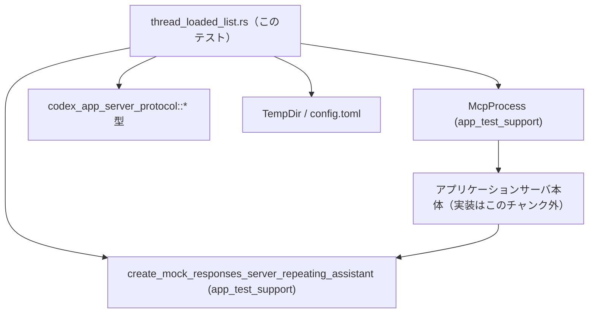
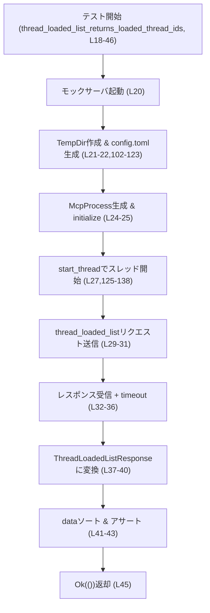

# app-server/tests/suite/v2/thread_loaded_list.rs コード解説

## 0. ざっくり一言

`thread_loaded_list` JSON-RPC エンドポイントの動作（ロード済みスレッド ID の一覧取得とページネーション）を、モックサーバと `McpProcess` を使って検証する非同期テスト群です（app-server/tests/suite/v2/thread_loaded_list.rs:L18-100）。

---

## 1. このモジュールの役割

### 1.1 概要

このテストモジュールは、アプリケーションサーバのスレッド管理 API のうち、

- ロード済みスレッド一覧取得 (`thread_loaded_list`)
- スレッド開始 (`thread_start`)

に関する振る舞いを統合テスト的に検証します。  
モック応答サーバ・一時ディレクトリ・JSON-RPC プロトコル型を組み合わせて、クライアント側から見た挙動をチェックしています（L20-43, L50-99, L125-138）。

### 1.2 アーキテクチャ内での位置づけ

このファイルは「テスト層」に属し、本番コードのクライアントラッパ `McpProcess` とモックサーバを通じて、アプリケーションサーバの JSON-RPC エンドポイントを間接的に呼び出します。



- テストは `TempDir` 上に `config.toml` を生成し（L21-22, L102-123）、それを読んで動く `McpProcess` を起動します（L24, L54）。
- `McpProcess` は JSON-RPC を介してアプリケーションサーバと通信し、モックサーバに最終的な HTTP リクエストが飛ぶ構成と推測されますが、実詳細はこのチャンクには現れません。

### 1.3 設計上のポイント

コードから読み取れる設計上の特徴を列挙します。

- **非同期テスト + タイムアウト**  
  - `#[tokio::test]` により各テストは Tokio ランタイム上で非同期に実行されます（L18, L48）。  
  - 通信や初期化には `tokio::time::timeout` を必ず噛ませ、10 秒で打ち切ることでテストがハングしないようにしています（L25, L32-36, L55, L69-73, L87-91, L132-136）。
- **テストごとの隔離された環境**  
  - 各テストは `TempDir` で一時ディレクトリを作り（L21, L51）、そこに `config.toml` を生成します（L22, L52, L102-123）。  
  - これによりテスト間で設定ファイルや状態が衝突しないようにしています。
- **ヘルパ関数で重複ロジックを単純化**  
  - `create_config_toml` が設定ファイル作成（L102-123）、`start_thread` がスレッド生成と ID 抽出（L125-138）を担当し、テスト本体から詳細を隠しています。
- **JSON-RPC レベルの契約テスト**  
  - `ThreadLoadedListResponse` と `ThreadStartResponse` を直接パースし、戻り値のフィールド値を検証することで API の契約を確認しています（L37-43, L74-79, L92-97, L137-138）。

---

## 2. 主要な機能一覧

このファイルで定義されている主な機能は次のとおりです。

- `thread_loaded_list_returns_loaded_thread_ids`: ロード済みスレッド ID 一覧が期待通り 1 件のみ返ることを検証するテスト（L18-46）。
- `thread_loaded_list_paginates`: `limit=1` のページネーションが 2 ページに分割され、`next_cursor` が適切に設定されることを検証するテスト（L48-100）。
- `create_config_toml`: 一時ディレクトリ配下に、テスト用の `config.toml` を生成するユーティリティ（L102-123）。
- `start_thread`: `thread_start` リクエストを送り、レスポンスから `thread.id` を抽出して返すユーティリティ（L125-138）。

### 2.1 コンポーネント一覧（このファイルで定義）

| 名前 | 種別 | 役割 / 用途 | 定義位置 |
|------|------|-------------|----------|
| `DEFAULT_READ_TIMEOUT` | 定数 | JSON-RPC 応答待ちに用いる 10 秒タイムアウト値 | app-server/tests/suite/v2/thread_loaded_list.rs:L16 |
| `thread_loaded_list_returns_loaded_thread_ids` | 非同期テスト関数 | 1 つだけ開始したスレッドが `thread_loaded_list` で 1 件として返ることを検証 | L18-46 |
| `thread_loaded_list_paginates` | 非同期テスト関数 | 2 つ開始したスレッドが、`limit=1` のページネーションで 2 ページに分割されることを検証 | L48-100 |
| `create_config_toml` | 関数 | 指定ディレクトリにテスト用 `config.toml` を書き出す | L102-123 |
| `start_thread` | 非同期関数 | `thread_start` リクエストを送り、スレッド ID を `String` として取得 | L125-138 |

### 2.2 外部コンポーネント一覧（このチャンクに実装なし）

| 名前 | 種別 | 簡単な役割（コードから読み取れる範囲） | 使用位置 |
|------|------|----------------------------------------|----------|
| `McpProcess` | 構造体（推測） | `new`, `initialize`, JSON-RPC リクエスト送信・レスポンス受信メソッドを持つクライアントラッパ | L2, L24-25, L54-55, L63-68, L81-86, L125-131 |
| `create_mock_responses_server_repeating_assistant` | 関数 | モック応答サーバを起動し、`uri()` を持つハンドルを返す | L3, L20, L50 |
| `to_response` | 関数 | `JSONRPCResponse` から型付きレスポンス (`ThreadLoadedListResponse`, `ThreadStartResponse`) に変換する | L4, L37-40, L74-77, L92-95, L137 |
| `JSONRPCResponse` | 型 | JSON-RPC プロトコルのレスポンスを表す汎用型 | L5, L32, L69, L87, L132 |
| `RequestId` | 列挙体（推測） | JSON-RPC の request id を表現し、ここでは整数 ID をラップする | L6, L34, L71, L89, L134 |
| `ThreadLoadedListParams` | 構造体 | `thread_loaded_list` 呼び出しのパラメータ（`cursor`, `limit` など） | L7, L30-31, L63-67, L81-85 |
| `ThreadLoadedListResponse` | 構造体 | `thread_loaded_list` のレスポンス。`data` と `next_cursor` フィールドを持つ | L8, L37-40, L74-77, L92-95 |
| `ThreadStartParams` | 構造体 | `thread_start` 呼び出しのパラメータ。`model` など | L9, L127-130 |
| `ThreadStartResponse` | 構造体 | `thread_start` のレスポンス。`thread` フィールドから `id` を取得している | L10, L137 |

※ これらの型の実装はこのチャンクには現れないため、詳細は不明です。

---

## 3. 公開 API と詳細解説

### 3.1 型一覧（このファイル内に新規定義された型）

このファイル内で新たに定義されている構造体・列挙体・トレイトはありません（L1-139 を通して型定義がないことが確認できます）。

### 3.2 関数詳細

#### `thread_loaded_list_returns_loaded_thread_ids() -> Result<()>`

**概要**

1 つだけ開始したスレッドについて `thread_loaded_list` を呼び出し、返却された `data` がそのスレッド ID 1 件のみであり、`next_cursor` が `None` であることを検証する非同期テストです（L18-46）。

**引数**

- なし（`#[tokio::test]` によりテストフレームワークから呼び出されます）。

**戻り値**

- `anyhow::Result<()>`  
  - テスト内で発生した I/O や非同期処理のエラーを `?` でそのまま伝播させ、テスト失敗として扱います（L20-22, L24-25, L32-36）。

**内部処理の流れ**

1. モック応答サーバを起動し、その URI を取得（L20）。  
2. `TempDir` で一時ディレクトリを作成（L21）。  
3. その下に `config.toml` を書き出す（`create_config_toml` 呼び出し、L22）。  
4. `McpProcess::new` でプロセスを生成し、`initialize` を 10 秒タイムアウト付きで実行（L24-25）。  
5. ヘルパ `start_thread` でスレッドを 1 つ開始し、その ID (`String`) を取得（L27）。  
6. `ThreadLoadedListParams::default()` でデフォルトパラメータを作り、`send_thread_loaded_list_request` でリクエスト送信（L29-31）。  
7. `read_stream_until_response_message` を `timeout` 付きで呼び、該当 `RequestId::Integer(list_id)` のレスポンスを待つ（L32-36）。  
8. 汎用 `JSONRPCResponse` を `to_response::<ThreadLoadedListResponse>` で型付きに変換し、`data` と `next_cursor` を取り出す（L37-40）。  
9. `data` をソートした上で（順序に依存しない比較のため、L41）、`vec![thread_id]` と等しいことを主張（L42）。  
10. `next_cursor` が `None` であることを検証（L43）。  

**簡易フローチャート**



**Examples（使用例）**

テスト関数なので通常のコードから直接呼び出すことはありませんが、特定のテストだけを実行するには以下のようにします。

```bash
# このテストだけを実行
cargo test thread_loaded_list_returns_loaded_thread_ids
```

**Errors / Panics**

- エラー発生条件（`Err` を返すケース）
  - モックサーバ起動 (`create_mock_responses_server_repeating_assistant`) が失敗した場合（L20）。
  - 一時ディレクトリ作成 (`TempDir::new`) が失敗した場合（L21）。
  - `config.toml` の書き込みに失敗した場合（L22 → L102-123）。
  - `McpProcess::new` や `initialize` がエラーを返した場合（L24-25）。
  - `timeout` が `Elapsed` を返した場合、および `read_stream_until_response_message` 自体が `Err` を返した場合（L32-36 の `.await??`）。  
    - `timeout(...).await` の戻り値と、内側の `Result` の二重エラーを `??` で伝播しています。
  - `to_response::<ThreadLoadedListResponse>` が、レスポンスフォーマット不正などでエラーを返した場合（L37-40）。
- `assert_eq!` 失敗時はパニックし、テストが失敗します（L42-43）。

**Edge cases（エッジケース）**

- スレッドが 1 つもロードされていない場合  
  - このテストでは必ず `start_thread` で 1 つ作るため、そのケースはカバーしていません（L27）。  
  - `thread_loaded_list` の「空リスト」挙動は別途テストする必要があります。
- サーバが非常に遅い場合  
  - 10 秒以上応答がないと `timeout` によりテスト失敗となります（L16, L32-36）。  
- レスポンスの `data` の順序  
  - 比較前に `data.sort()` を行っているため（L41）、レスポンスの順序に依存せず、集合が一致することだけを確認します。

**使用上の注意点**

- 非同期文脈外から直接呼び出すことは想定されていません。`#[tokio::test]` に依存しており、手動で呼び出す場合は Tokio ランタイムを用意する必要があります。
- `McpProcess` の初期化やモックサーバの詳細はこのファイルの外部にあり、このテストはそれらの挙動に依存しています。内部仕様変更時はテストの失敗に注意が必要です。

---

#### `thread_loaded_list_paginates() -> Result<()>`

**概要**

2 つのスレッドを開始し、`limit = 1` のパラメータで `thread_loaded_list` を 2 回呼び出すことで、ページネーションの動作と `next_cursor` の取り扱いを検証する非同期テストです（L48-100）。

**引数**

- なし。

**戻り値**

- `anyhow::Result<()>`（上記テストと同様、`?` でエラーを伝播）。

**内部処理の流れ**

1. モックサーバ起動・TempDir 作成・`config.toml` 生成は 1 つ目のテストと同様（L50-52）。  
2. `McpProcess` を生成し、`initialize` をタイムアウト付きで実行（L54-55）。  
3. `start_thread` を 2 回呼び、2 つのスレッド ID を取得（L57-58）。  
4. `[first, second]` からなる配列 `expected` を作り `sort()` でソート（L60-61）。  
5. **1 ページ目の取得**  
   - `ThreadLoadedListParams { cursor: None, limit: Some(1) }` でリクエスト（L63-67）。  
   - レスポンスを `ThreadLoadedListResponse` に変換し、`first_page` と `next_cursor` を得る（L69-77）。  
   - `first_page == vec![expected[0].clone()]` を確認（L78）。  
   - `next_cursor == Some(expected[0].clone())` を確認（L79）。  
6. **2 ページ目の取得**  
   - `cursor: next_cursor` として同じく `limit: Some(1)` で再リクエスト（L81-85）。  
   - レスポンスから `second_page` と `next_cursor` を取得（L87-95）。  
   - `second_page == vec![expected[1].clone()]` を確認（L96）。  
   - `next_cursor == None` であることを確認し、ページ終端であることを検証（L97）。  

**Examples（使用例）**

```bash
# このテストだけを実行
cargo test thread_loaded_list_paginates
```

**Errors / Panics**

- エラー発生条件はほぼ前のテストと同様で、I/O, 初期化, タイムアウト, `to_response` のパース失敗などが原因になります（L50-55, L63-68, L69-73, L81-86, L87-91）。
- ページネーションの契約が変わった場合（例: `next_cursor` の値や意味が変わる）には `assert_eq!` が失敗し、テストがパニックします（L78-79, L96-97）。

**Edge cases（エッジケース）**

- `limit = 1` 固定しかテストしていません。`limit > 1` や `limit = None` の挙動は別途テストが必要です（L66, L84）。
- `cursor` の不正値（存在しないスレッド ID 等）についての挙動はテストしていません。
- レスポンスの順序  
  - このテストでは `first_page`/`second_page` の順序に対して直接 `assert_eq!` しており（L78, L96）、API が一意の順序（例えば作成時刻順など）で返すことを前提としています。

**使用上の注意点**

- ページネーションの仕様をこのテストが強く固定化します：
  - `next_cursor` には「前ページの最後の要素と同じ ID」が入る（L79）。  
  - 最終ページの `next_cursor` は `None` である（L97）。  
- API 仕様を変更する場合は、このテストの期待値も同期して更新する必要があります。

---

#### `create_config_toml(codex_home: &Path, server_uri: &str) -> std::io::Result<()>`

**概要**

与えられたディレクトリ配下に `config.toml` を生成し、モックサーバに接続するための設定を書き出すユーティリティ関数です（L102-123）。

**引数**

| 引数名 | 型 | 説明 |
|--------|----|------|
| `codex_home` | `&Path` | `config.toml` を作成するディレクトリへのパス（L102-103）。 |
| `server_uri` | `&str` | モックサーバのベース URI。`base_url` に埋め込まれます（L102, L116）。 |

**戻り値**

- `std::io::Result<()>`  
  - ファイル書き込み成功時は `Ok(())`。  
  - 書き込み失敗時（パーミッションエラー等）は `Err(std::io::Error)`。

**内部処理の流れ**

1. `codex_home.join("config.toml")` で設定ファイルのパスを組み立て（L103）。  
2. `std::fs::write` で TOML 文字列をファイルに書き込む（L104-122）。  
3. TOML 文字列は `format!` で組み立てられ、`{server_uri}` が `base_url` に埋め込まれます（L106-120, 特に L116）。  

TOML の内容は以下のようになります（整形済み）:

```toml
model = "mock-model"
approval_policy = "never"
sandbox_mode = "read-only"

model_provider = "mock_provider"

[model_providers.mock_provider]
name = "Mock provider for test"
base_url = "{server_uri}/v1"
wire_api = "responses"
request_max_retries = 0
stream_max_retries = 0
```

**Examples（使用例）**

```rust
use std::path::Path;
use tempfile::TempDir;

fn example() -> std::io::Result<()> {
    let dir = TempDir::new()?;                                       // 一時ディレクトリを作成
    let server_uri = "http://localhost:1234";                        // モックサーバ URI
    create_config_toml(dir.path(), server_uri)?;                     // config.toml を作成
    // dir.path().join("config.toml") にファイルができている
    Ok(())
}
```

**Errors / Panics**

- `std::fs::write` がエラーを返した場合（書き込み先ディレクトリが存在しない、権限不足など）、そのまま `Err` を返します（L104-122）。
- 関数本体ではパニックするコードはありません。

**Edge cases（エッジケース）**

- `codex_home` が存在しないディレクトリを指している場合、`std::fs::write` が `NotFound` エラーを返します。
- `server_uri` が空文字列や不正な URL であっても、ここでは単に文字列展開するだけで特に検証していません（L106-120）。

**使用上の注意点**

- 呼び出し側で `codex_home` が有効なディレクトリであることを保証する必要があります。テストでは `TempDir::new` によりこの前提を満たしています（L21, L51）。
- `server_uri` の妥当性チェックは別レイヤ（モックサーバや `McpProcess` 側）に依存していると考えられます。この関数単体はファイル書き込みのみを担当します。

---

#### `start_thread(mcp: &mut McpProcess) -> Result<String>`

**概要**

`McpProcess` を通じて `thread_start` リクエストを送り、そのレスポンスからスレッド ID (`String`) を抽出して返す非同期ヘルパ関数です（L125-138）。テスト内でスレッドを準備するために使用されます。

**引数**

| 引数名 | 型 | 説明 |
|--------|----|------|
| `mcp` | `&mut McpProcess` | JSON-RPC クライアントラッパ。`send_thread_start_request` とレスポンス待受けに使用されます（L125-131, L132-136）。 |

**戻り値**

- `anyhow::Result<String>`  
  - 成功時: 作成されたスレッドの ID。`ThreadStartResponse` 内の `thread.id` から取得します（L137-138）。  
  - 失敗時: ネットワーク/プロトコル/タイムアウト等のエラーを `anyhow::Error` として返します。

**内部処理の流れ**

1. `ThreadStartParams` を組み立て  
   - `model: Some("gpt-5.1".to_string())` を指定し、それ以外は `Default` 値（L127-130）。  
2. `mcp.send_thread_start_request` でリクエストを送り、JSON-RPC のリクエスト ID (`req_id`) を受け取る（L126-131）。  
3. `timeout(DEFAULT_READ_TIMEOUT, mcp.read_stream_until_response_message(RequestId::Integer(req_id)))` で、対応するレスポンスが来るまで待つ（L132-136）。  
   - `DEFAULT_READ_TIMEOUT` は 10 秒（L16）。  
   - `.await??` により、タイムアウトおよび内側のエラーをともに伝播します（L136）。  
4. 得られた `JSONRPCResponse` を `to_response::<ThreadStartResponse>` で型付きに変換（L137）。  
5. 構造体分配束縛 `ThreadStartResponse { thread, .. }` により `thread` フィールドを取り出し、`thread.id` を返す（L137-138）。  

**Examples（使用例）**

テスト内では次のように使われています（L57-58）。

```rust
let first = start_thread(&mut mcp).await?;   // 1つ目のスレッド ID
let second = start_thread(&mut mcp).await?;  // 2つ目のスレッド ID
```

**Errors / Panics**

- `send_thread_start_request` がエラーを返した場合（L126-131）。
- `timeout` による `Elapsed` エラー、および `read_stream_until_response_message` 自体のエラー（L132-136）。
- `to_response::<ThreadStartResponse>` がパースエラー等を返した場合（L137）。
- 関数内部には `assert!` や `unwrap` はなく、パニックは発生しません。

**Edge cases（エッジケース）**

- サーバ側でスレッド作成に失敗した場合（例えばモデル名不正など）、どのようなエラーが返るかはこのチャンクには現れません。`Result` によって上位へ伝播されます。
- 非常に遅いサーバに対しては、10 秒のタイムアウトでテストが失敗します。

**使用上の注意点**

- `mcp` を可変参照で受け取ることで、同時に複数スレッドから `McpProcess` を共有して使うことを防ぎ、Rust の所有権システムと型でスレッド安全性（少なくとも API 的な同時利用防止）を保証しています（L125）。
- 呼び出し元は `#[tokio::test]` や別の async コンテキスト内で `.await` する必要があります。

---

### 3.3 その他の関数

このファイルに定義される関数は上記 4 つのみであり、他に補助的なラッパー関数は存在しません（L1-139）。

---

## 4. データフロー

ここでは、`thread_loaded_list_returns_loaded_thread_ids` テストにおける典型的なデータフローを示します（L18-46, L102-123, L125-138）。

### 4.1 シナリオ概要

1. モック応答サーバを起動し、その URI を基に `config.toml` を作成。
2. `McpProcess` を起動・初期化し、`thread_start` でスレッドを 1 つ作成。
3. `thread_loaded_list` を呼び出し、レスポンスからスレッド ID 一覧と `next_cursor` を取得。
4. 一覧が 1 件のみ・`next_cursor` が `None` であることを検証。

### 4.2 シーケンス図

```mermaid
sequenceDiagram
    participant Test as "thread_loaded_list_returns_loaded_thread_ids (L18-46)"
    participant Mock as "Mock server handle (L20)"
    participant FS as "TempDir/config.toml (L21-22,102-123)"
    participant Mcp as "McpProcess (L24-25, L29-36, L125-136)"
    participant Server as "App server（実装はこのチャンク外）"

    Test->>Mock: create_mock_responses_server_repeating_assistant(\"Done\") (L20)
    Note right of Mock: uri() で server_uri を取得

    Test->>FS: create_config_toml(codex_home, server_uri) (L22)
    FS-->>Test: config.toml 作成完了

    Test->>Mcp: McpProcess::new(codex_home) (L24)
    Test->>Mcp: initialize() を timeout(10s) 付きで実行 (L25)

    Test->>Mcp: start_thread(&mut mcp) (L27,125-138)
    Mcp->>Server: thread_start(JSON-RPC) 送信
    Server-->>Mcp: ThreadStartResponse を返す
    Mcp-->>Test: thread.id (String) を返す (L138)

    Test->>Mcp: send_thread_loaded_list_request(params=default) (L29-31)
    Mcp->>Server: thread_loaded_list(JSON-RPC) 送信
    Server-->>Mcp: JSONRPCResponse を返す
    Test->>Mcp: read_stream_until_response_message(RequestId::Integer(list_id)) (L32-36)
    Mcp-->>Test: JSONRPCResponse

    Test->>Test: to_response::<ThreadLoadedListResponse>(resp) (L37-40)
    Test->>Test: data.sort(); assert_eq!(...); assert_eq!(next_cursor, None) (L41-43)
```

この図は、本チャンクに現れる関数呼び出しの流れに限定しています。`McpProcess` の内部実装やサーバ本体で何が行われているかは、このチャンクからは分かりません。

---

## 5. 使い方（How to Use）

このファイル自体はテストモジュールであり、アプリケーションコードから直接呼び出すことは想定されていません。ただし、同様のパターンでテストを追加・利用できます。

### 5.1 基本的な使用方法（テストパターン）

新しいスレッド関連 API をテストする場合、おおよそ次のパターンになります。

```rust
#[tokio::test]
async fn new_thread_feature_test() -> anyhow::Result<()> {
    // 1. モックサーバと TempDir を準備
    let server = create_mock_responses_server_repeating_assistant("Done").await; // モック起動
    let codex_home = TempDir::new()?;                                            // 一時ディレクトリ
    create_config_toml(codex_home.path(), &server.uri())?;                       // config.toml 作成

    // 2. McpProcess を初期化
    let mut mcp = McpProcess::new(codex_home.path()).await?;                     // クライアント生成
    timeout(DEFAULT_READ_TIMEOUT, mcp.initialize()).await??;                     // 初期化

    // 3. 必要ならスレッド作成
    let thread_id = start_thread(&mut mcp).await?;                               // スレッド開始

    // 4. 新しい API を呼び出して検証
    //   mcp の他のメソッドを呼び出し、そのレスポンスを to_response でパースしてアサート…

    Ok(())
}
```

### 5.2 よくある使用パターン

- **スレッドを複数作成して挙動を比較する**  
  - `start_thread` を複数回呼び、返却された ID の一覧をソートして期待値と比較する（L57-61）。
- **ページネーション API の検証**  
  - 最初の呼び出しで `cursor: None, limit: Some(n)` とし、得られた `next_cursor` を次回呼び出しの `cursor` に設定する（L63-67, L81-85）。

### 5.3 よくある間違い

```rust
// 誤り例: McpProcess::initialize を呼ばずにリクエストを送る
async fn wrong_usage() -> anyhow::Result<()> {
    let server = create_mock_responses_server_repeating_assistant("Done").await;
    let codex_home = TempDir::new()?;
    create_config_toml(codex_home.path(), &server.uri())?;

    let mut mcp = McpProcess::new(codex_home.path()).await?;
    // timeout(DEFAULT_READ_TIMEOUT, mcp.initialize()).await??; // ← これを忘れると初期化されていない可能性

    // 未初期化の状態でリクエストを送ると、接続エラーなどになる可能性がある
    let _ = start_thread(&mut mcp).await?;
    Ok(())
}

// 正しい例: initialize を行ってからリクエストを送る
async fn correct_usage() -> anyhow::Result<()> {
    let server = create_mock_responses_server_repeating_assistant("Done").await;
    let codex_home = TempDir::new()?;
    create_config_toml(codex_home.path(), &server.uri())?;

    let mut mcp = McpProcess::new(codex_home.path()).await?;
    timeout(DEFAULT_READ_TIMEOUT, mcp.initialize()).await??; // 初期化

    let _ = start_thread(&mut mcp).await?;
    Ok(())
}
```

### 5.4 使用上の注意点（まとめ）

- すべてのネットワーク/IPC 処理は `timeout(DEFAULT_READ_TIMEOUT, ...)` でラップされている点を踏襲すると、テストハングを防ぎやすくなります（L16, L25, L32-36, L55, L69-73, L87-91, L132-136）。
- `McpProcess` は可変参照で扱われており、1 つのインスタンスを同時に複数の非同期タスクから操作しない設計になっています（L125）。他のテストで共有する場合は特に注意が必要です。
- config の内容（モデル名、`wire_api`, リトライ回数など）はテスト前提になっている可能性があるため、無断変更すると既存テストが壊れるリスクがあります（L107-120）。

---

## 6. 変更の仕方（How to Modify）

### 6.1 新しい機能を追加する場合（新 API のテストなど）

1. **config が必要か確認**  
   - 既存の `config.toml` で足りるかを確認し、足りなければ `create_config_toml` に設定項目を追加します（L102-123）。
2. **テストケースを追加**  
   - このファイルに新しい `#[tokio::test]` 関数を追加し、`thread_loaded_list_paginates` と同様の形で、  
     - モックサーバ起動  
     - TempDir + config.toml  
     - `McpProcess` 初期化  
     - API 呼び出し + `to_response` でのパース  
     を記述します。
3. **ヘルパ関数の流用/拡張**  
   - スレッド作成が必要なら `start_thread` を流用（L125-138）。  
   - 必要に応じて新しいヘルパを定義して重複ロジックを減らします。

### 6.2 既存の機能を変更する場合

- **`thread_loaded_list` のレスポンススキーマが変わる場合**
  - `ThreadLoadedListResponse` のフィールド名/型変更に追随するよう、分配束縛やアサーションを変更します（L37-43, L74-79, L92-97）。
  - ページネーション仕様を変更する場合は、`next_cursor` に関するアサーション（L79, L97）も合わせて更新します。
- **`thread_start` のパラメータ仕様が変わる場合**
  - `ThreadStartParams` の初期化部分（L127-130）を新仕様に合わせて変更します。
- **影響範囲の確認**
  - `ThreadLoadedListResponse` / `ThreadStartResponse` を使用している他テストファイル・実装コードを検索し、挙動変更が他の箇所に影響しないか確認する必要があります（このチャンクには他の使用箇所は現れません）。

---

## 7. 関連ファイル

このモジュールと密接に関係するであろうファイル・モジュールを列挙します（実際のパスはこのチャンクからは分からないものも含みます）。

| パス / モジュール | 役割 / 関係 |
|-------------------|------------|
| `app_test_support::McpProcess` | JSON-RPC 経由でアプリケーションサーバと通信するクライアントラッパ。テストからのすべてのリクエスト送信・応答受信に使用（L2, L24-25, L54-55, L63-68, L81-86, L125-131）。 |
| `app_test_support::create_mock_responses_server_repeating_assistant` | モック応答サーバを起動するヘルパ。`uri()` を通じてベース URL を提供し、config.toml の `base_url` に使われます（L3, L20, L50, L116）。 |
| `app_test_support::to_response` | 汎用 `JSONRPCResponse` を型付きレスポンス（`ThreadLoadedListResponse` / `ThreadStartResponse`）に変換するユーティリティ（L4, L37-40, L74-77, L92-95, L137）。 |
| `codex_app_server_protocol::ThreadLoadedListParams` | `thread_loaded_list` 呼び出しのパラメータ型（L7, L30-31, L63-67, L81-85）。 |
| `codex_app_server_protocol::ThreadLoadedListResponse` | `thread_loaded_list` のレスポンス型。`data` と `next_cursor` を提供（L8, L37-40, L74-79, L92-97）。 |
| `codex_app_server_protocol::ThreadStartParams` | `thread_start` 呼び出しのパラメータ型（L9, L127-130）。 |
| `codex_app_server_protocol::ThreadStartResponse` | `thread_start` のレスポンス型。`thread.id` から ID を取得（L10, L137-138）。 |
| `tokio::time::timeout` | 非同期操作にタイムアウトを設定するための関数。テストがハングしないようにするための重要なコンポーネント（L14, L25, L32-36, L55, L69-73, L87-91, L132-136）。 |

---

### 補足（バグ・セキュリティ・性能の観点）

- **バグの可能性**
  - ページネーションテストは、API がスレッド ID を一定の順序で返すことを前提にしています（L60-61, L78-79, L96-97）。実装側が順序を変更するとテストが落ちるため、その点は仕様として明確にしておく必要があります。
- **セキュリティ**
  - テスト入力（モデル名や URI）はコード内で固定されており、外部からの不正入力は扱っていません。このファイル単体からは明確なセキュリティリスクは読み取れません。
- **性能・スケーラビリティ**
  - すべてのタイムアウトが 10 秒に固定されており（L16）、遅い環境ではテストが失敗しやすくなる可能性があります。必要に応じて環境変数などで調整可能にする設計も検討の余地がありますが、このチャンクからはその仕組みは見えません。
